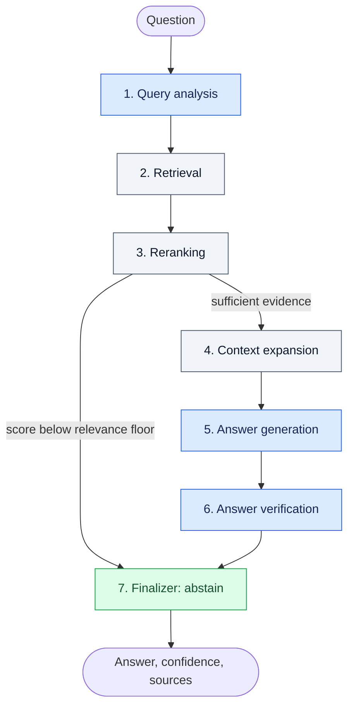
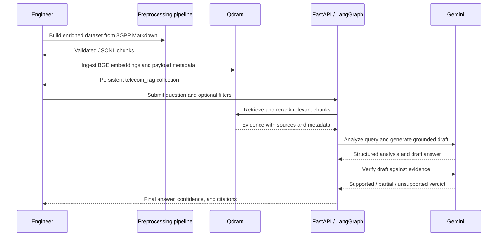

# 3GPP Telecom Agentic RAG — Project Design

> **Submission document** | Technical design for a grounded question-answering system over 3GPP specifications

## 1. Executive summary

This project implements an end-to-end Retrieval-Augmented Generation (RAG) system for answering technical questions from 3GPP telecommunications specifications. It converts a corpus of Markdown specifications into validated, metadata-rich chunks; embeds and stores those chunks in a persistent local Qdrant database; retrieves and reranks the most relevant evidence; expands precise matches into bounded section context; and generates a cited answer through an explicit LangGraph workflow.

The central design objective is **reliable, inspectable answering rather than unconstrained text generation**. The system combines semantic retrieval, exact metadata filtering, deterministic relevance gates, source citations, independent answer verification, and conservative confidence scoring. When the evidence is insufficient, it abstains instead of presenting an unsupported answer.

### Key engineering qualities

- **Domain-aware:** understands 3GPP release, series, specification, RRC state, timer, message direction, ASN.1, and normative requirement metadata.
- **Grounded:** answers are generated only from retrieved specification evidence and include source sections.
- **Hallucination-resistant:** weak retrieval and unsupported claims follow explicit refusal paths.
- **Modular:** preprocessing, retrieval, generation, orchestration, and delivery are separated behind clear interfaces.
- **Reproducible:** deterministic chunk identities and idempotent Qdrant upserts make ingestion safe to repeat.
- **Operable:** usable through command-line scripts, a documented FastAPI service, or Docker Compose.
- **Testable:** unit and integration-style tests cover preprocessing, vector storage, retrieval, agents, graph routing, and API behavior.

---

## 2. Problem statement

3GPP specifications are large, hierarchical, terminology-dense, and frequently contain similar language across releases and specification families. A useful question-answering system must therefore solve more than generic semantic search:

1. preserve document and section identity during ingestion;
2. distinguish nearly identical passages across releases and specifications;
3. recognize domain entities such as timers, RRC states, messages, ASN.1 structures, and normative terms;
4. retrieve concise evidence without losing the surrounding procedure;
5. prevent the language model from filling evidence gaps with plausible-sounding telecom knowledge; and
6. expose citations and confidence in a stable API contract.

The project addresses these needs using a two-plane architecture: an **offline knowledge-preparation plane** and an **online query-and-answer plane**.

## 3. Scope and design goals

### In scope

- Recursive discovery and parsing of included 3GPP Markdown files.
- Token-aware, heading-aware document chunking.
- Deterministic extraction of telecom-specific metadata.
- JSONL as the boundary between preprocessing and runtime ingestion.
- Local persistent vector storage and exact metadata filters.
- Semantic retrieval followed by cross-encoder reranking.
- Agentic query analysis, context construction, answer generation, and verification.
- Safe abstention, deterministic confidence, source citations, and optional debug traces.
- REST and command-line interfaces, automated tests, and containerized execution.

### Explicit non-goals

- Replacing the official 3GPP specifications as the authoritative source.
- Claiming zero hallucination or treating model output as compliance advice.
- Real-time crawling or automatic synchronization of external specification repositories.
- Training or fine-tuning a proprietary model.
- Multi-user authentication, authorization, or a production distributed Qdrant cluster.

## 4. High-level architecture

```mermaid
flowchart LR
    subgraph Offline[Offline knowledge preparation]
        A[3GPP Markdown corpus] --> B[Document discovery and parsing]
        B --> C[Heading and token-aware chunking]
        C --> D[Content classification]
        D --> E[Telecom metadata extraction]
        E --> F[Validated enriched JSONL]
    end

    subgraph Index[Indexing]
        F --> G[BGE passage embeddings]
        G --> H[(Local Qdrant collection)]
    end

    subgraph Online[Online query and answer]
        Q[User question] --> I[Query analysis]
        I --> J[BGE query embedding and filtered retrieval]
        H --> J
        J --> K[Cross-encoder reranking]
        K -->|weak evidence| X[Safe abstention]
        K -->|relevant evidence| L[Bounded section expansion]
        L --> M[Grounded answer generation]
        M --> N[Independent answer verification]
        N --> O[Deterministic finalizer]
    end

    O --> P[Answer, confidence, and sources]
    X --> P
```



This separation is intentional. Corpus transformation is an offline concern; the query service consumes the prepared JSONL and vector index. The API does not parse the raw specification corpus for every request.

## 5. Repository organization

```text
.
├── mavenier/
│   ├── preprocessing/          # Corpus loading, chunking, classification, metadata
│   ├── rag/
│   │   ├── retrieval/          # Embeddings, Qdrant, retrieval, reranking
│   │   ├── generation/         # Gemini boundary and grounded prompts
│   │   ├── agents/             # Single-responsibility query workflow nodes
│   │   ├── graph/              # LangGraph state and graph construction
│   │   └── pipeline.py         # Public query entry point
│   └── api/                    # FastAPI application and request/response models
├── scripts/                    # Runnable ingestion, search, answer, and graph tools
├── tests/                      # Automated behavioral tests
├── input/3gpp/marked/          # Source specification corpus
├── outputs/                    # Prepared enriched JSONL dataset
├── docs/                       # Focused supporting documentation
├── requirements.txt
├── Dockerfile
└── docker-compose.yml
```

The package structure follows separation of concerns. Runnable scripts orchestrate package APIs, while reusable behavior remains inside the `mavenier` package.

## 6. Offline knowledge-preparation design

### 6.1 Document discovery and identity

The loader recursively discovers `raw.md` files below the corpus root. The folder structure is treated as authoritative metadata and provides:

- 3GPP release (for example, `Rel-11` or `Rel-20`);
- series;
- specification number; and
- a stable document identity.

Header parsing supplements path metadata with fields such as version and date when available. Path-derived identity takes precedence because every source file is named `raw.md`, making the filename alone ambiguous.

### 6.2 Structure-preserving chunking

Documents are chunked with Docling and a BGE-compatible tokenizer, using a default maximum of 400 tokens. Chunk metadata preserves headings, section paths, captions, and document-item types. Two representations are retained:

- `original_text`: the exact chunk content used as evidence and stored in the payload;
- `contextualized_text`: document, release, series, and section context prepended for embedding.

This design improves semantic separation between similar language from different documents without altering the evidence shown to the answer model.

### 6.3 Content classification

Transparent rules classify chunks into categories such as technical procedure, ASN.1 definition, table, references, front matter, or general text. Boilerplate-aware classification reduces inappropriate requirement extraction from copyright, contents, and other non-technical sections.

### 6.4 Telecom metadata extraction

Five independent deterministic extractors enrich every chunk:

| Metadata block | Examples of captured information | Purpose |
|---|---|---|
| Direction | sender, receiver, direction, nearby message or channel | Find message flows |
| State | current and target RRC states | Find state transitions |
| Timer | timer name, start/stop/expiry event, related message | Answer timer behavior questions |
| ASN.1 | entity, type, field names, referenced types | Find protocol structures |
| Requirement | actor, condition, action, normative term, strength | Find `shall`, `should`, and `may` obligations |

The extractors only record explicit textual evidence and avoid guessing missing values. This makes their output suitable for filtering and for corroborating generated answers.

### 6.5 Validation and dataset boundary

Every chunk is validated before it is written. Validation checks identifiers, non-empty evidence and embedding text, metadata shape, and malformed contextualization. The final artifact is newline-delimited JSON (`outputs/enriched_chunks.jsonl`), which provides:

- a streaming-friendly format;
- easy inspection and reproducibility;
- a stable contract between preprocessing and retrieval; and
- isolation of expensive corpus preparation from online startup.

## 7. Vector indexing and retrieval design

### 7.1 Embeddings

The system uses `BAAI/bge-small-en-v1.5`. Stored passages and user queries follow BGE's asymmetric retrieval convention: the query receives the retrieval instruction, while passage text does not. Embeddings are 384-dimensional and compared using cosine distance.

### 7.2 Local Qdrant storage

Qdrant runs in embedded local-persistence mode, so the project requires no separate database server or database credential. Each point contains:

- the chunk vector;
- original and contextualized text;
- document and section identity;
- all five metadata blocks; and
- a human-readable source identity.

Point identifiers are deterministic UUIDs derived from the document identity, source path, and chunk identifier. Re-ingestion therefore performs idempotent upserts rather than creating duplicates.

Keyword indexes support exact filters for release, series, specification, document, section, timer, state, message direction, ASN.1 entity, and requirement type.

### 7.3 Two-stage ranking

Retrieval deliberately separates recall from precision:

1. **Bi-encoder retrieval:** BGE and Qdrant efficiently retrieve a broader candidate set.
2. **Cross-encoder reranking:** a second model jointly scores each question-passage pair and promotes the most relevant evidence.

This combination scales better than cross-encoding the full corpus while providing more precise final context than vector similarity alone.

### 7.4 Filter relaxation

Explicit user filters and filters inferred from clearly stated query terms can narrow retrieval. If a filtered search produces no evidence, the retriever can relax those filters and search more broadly. This avoids turning an overly restrictive filter into a false “no answer,” while the reranker and abstention gate still protect answer quality.

### 7.5 Small-to-big context expansion

Ranking operates on compact chunks for precision. After reranking, each winning chunk is expanded to a bounded window of neighboring chunks from the same document section. This recovers procedural context without placing an entire long section or appendix into the model prompt.

## 8. Agentic query workflow

The online workflow is an explicit LangGraph state machine. Each node has one responsibility and returns only its state updates.



### Node responsibilities

1. **Query analysis:** produces a semantic search query, intent, keywords, and only those metadata filters explicitly supported by the question.
2. **Retriever:** embeds the query, searches Qdrant, and relaxes filters when a filtered search is empty.
3. **Reranker:** cross-encodes candidates, records the top score, and applies a deterministic relevance gate.
4. **Context expander:** reconstructs bounded section windows around winning chunks.
5. **Answer generator:** produces an answer constrained to supplied context.
6. **Answer verifier:** independently checks the draft against chunk text and populated structured metadata.
7. **Finalizer:** selects an answer or refusal, deduplicates citations, and assigns confidence using fixed rules.

Only query analysis, answer generation, and answer verification require Gemini judgment. Retrieval, reranking control, expansion, routing, citation handling, and confidence calculation remain deterministic Python behavior.

## 9. Grounding and hallucination controls

No generative system can guarantee zero hallucination. This design instead layers controls so unsupported output is detected early or refused safely.

| Layer | Control | Failure mode addressed |
|---|---|---|
| Corpus | Stable identity and metadata | Confusing similar passages across specs or releases |
| Retrieval | Explicit filters with relax-on-empty behavior | Wrong-scope retrieval or false empty results |
| Ranking | Cross-encoder plus relevance floor | Answering from semantically weak evidence |
| Context | Bounded small-to-big expansion | Fragment loss and excessive prompt context |
| Prompt boundary | Source text marked as untrusted data | Instructions embedded in documents influencing the model |
| Generation | Context-only answer policy | Free-form unsupported facts |
| Verification | Separate evidence check over text and metadata | Plausible claims not supported by retrieved sources |
| Finalization | Deterministic refusal, citation, and confidence rules | Model-invented confidence or uncited answers |

Retrieved text is explicitly labeled as source material rather than instruction. This is an important prompt-injection boundary: content inside indexed documents cannot override the system's answering policy.

### Confidence policy

Confidence is not generated by the language model:

- `0.00`: retrieval is not sufficiently relevant, context cannot be cited, or generation abstains;
- `0.30`: the verifier marks the draft unsupported;
- up to `0.55`: evidence is only partially supportive or the answer does not fully address the question;
- `0.90–0.95`: the verifier marks the answer supported and responsive.

This score describes the system's evidence path; it is not a formal probability of factual correctness.

### Quota-aware degradation

If Gemini quota is unavailable, query analysis can use conservative deterministic behavior and the answer path can return evidence excerpts with capped confidence. The verifier records that independent LLM verification was skipped. Authentication, network, dependency, Qdrant, embedding, and reranker failures remain service errors rather than being misreported as weak evidence.

## 10. API and external contracts

The FastAPI application exposes three routes:

| Method and route | Purpose |
|---|---|
| `GET /` | Service identity and navigation links |
| `GET /health` | Lightweight process health check |
| `POST /ask` | Run the complete agentic RAG workflow |

The request accepts a question, optional exact-match filters, and a debug flag. The stable response contains:

- `answer` — grounded answer or safe refusal;
- `confidence` — deterministic evidence-path score;
- `sources` — deduplicated source and section citations; and
- `debug` — optional structured stage information without vectors, secrets, or hidden model reasoning.

At startup, the API checks whether the local Qdrant collection exists and contains points. It reuses a ready collection or ingests the prebuilt JSONL when necessary.

## 11. Deployment and configuration

### Local execution

The recommended runtime is Python 3.12. Dependencies are pinned in `requirements.txt`. The only required secret for generated answers is `GEMINI_API_KEY`, loaded from process state or a project-root `.env` file. `.env.example` documents the configuration contract without exposing credentials.

### Container execution

The Docker image installs dependencies and runs the FastAPI service. Docker Compose defines:

- a one-shot `ingest` service that populates the shared Qdrant volume; and
- an `api` service that starts after successful ingestion and exposes port 8000.

The shared named volume preserves the vector collection across container restarts. Subsequent ingestion runs detect an existing populated collection and avoid unnecessary work.

## 12. Reliability, observability, and error handling

- Input models reject empty or excessively large questions and invalid filter values.
- Missing datasets, malformed JSONL records, absent collections, vector-shape mismatches, and storage errors produce explicit failures.
- Qdrant clients are closed through protected cleanup paths.
- Stable point IDs and upserts make repeated ingestion safe.
- API errors distinguish invalid requests, provider quota, unavailable dependencies/services, and internal failures.
- Optional debug output records stage decisions, filters, relevance, verification, execution mode, and a safe trace.
- Logs report indexing and startup progress without exposing credentials or vectors.

## 13. Testing strategy

The automated test suite is organized around architectural boundaries:

- document loading and path/header metadata;
- chunk validation and preprocessing behavior;
- deterministic metadata extraction;
- embedding and vector-store contracts;
- Qdrant persistence, filtering, and retrieval;
- cross-encoder reranking;
- individual agent-node behavior;
- LangGraph routing and end-to-end pipeline state;
- Gemini client boundaries and fallback behavior; and
- FastAPI request, startup, health, and response behavior.

External AI and storage boundaries are replaceable in tests, allowing routing, safety, and response contracts to be verified deterministically without relying on live model output.

## 14. Important design decisions and trade-offs

| Decision | Rationale | Trade-off |
|---|---|---|
| Offline preprocessing | Keeps expensive parsing out of query latency | Corpus changes require rebuilding JSONL |
| Local embedded Qdrant | Simple, private, credential-free setup | Single-machine rather than distributed operation |
| Rule-based metadata extraction | Transparent and reproducible | May miss implicit or unusually phrased entities |
| BGE plus cross-encoder | Efficient recall with improved precision | Two local models increase startup time and memory use |
| Small-to-big expansion | Balances retrieval precision and procedural context | Fixed windows may not capture every distant dependency |
| Three narrow LLM nodes | Uses model judgment only where valuable | Multiple provider calls add latency and quota usage |
| Deterministic confidence | Auditable and stable | Represents evidence-path quality, not calibrated probability |
| Safe abstention | Favors trustworthiness over answer rate | Some answerable questions may be conservatively refused |

## 15. Security and privacy considerations

- Secrets are externalized to environment configuration and must never be committed or packaged in a submission.
- The local vector database keeps indexed specification content on the host by default.
- Retrieved documents are treated as untrusted data, not executable instructions.
- Request filters are constrained to scalar or scalar-list values before reaching Qdrant.
- Debug traces exclude credentials, raw vectors, and hidden model reasoning.
- The service currently has no authentication; it should be placed behind an authenticated gateway before exposure beyond a trusted environment.

## 16. Known limitations and production evolution

Current limitations are explicit engineering boundaries rather than hidden assumptions:

- metadata extraction is deterministic and pattern-based, so implicit relationships can be missed;
- local models can have significant first-run download and warm-up cost;
- embedded Qdrant is designed for a single local process, not horizontal scale;
- confidence thresholds are policy values and should be evaluated against a labeled telecom question set;
- answer quality depends on corpus coverage and source conversion quality;
- there is no built-in user authentication, rate limiting, telemetry backend, or automated corpus synchronization.

For production deployment, the next logical steps are a managed or server-mode vector store, authenticated API access, request rate limits, centralized metrics and tracing, incremental indexing, a versioned evaluation set, retrieval-quality benchmarks, and threshold calibration with telecom subject-matter review.

## 17. End-to-end lifecycle



## 18. Conclusion

The project is designed as a complete, defensible telecom RAG pipeline rather than a thin wrapper around a language model. Its strongest characteristics are the explicit offline/online boundary, domain-specific metadata, two-stage retrieval, bounded context recovery, auditable graph orchestration, independent claim verification, deterministic confidence, and safe refusal behavior.

Together, these choices make the system understandable to reviewers, practical to run locally, and suitable as a strong foundation for a production-grade 3GPP engineering assistant.
