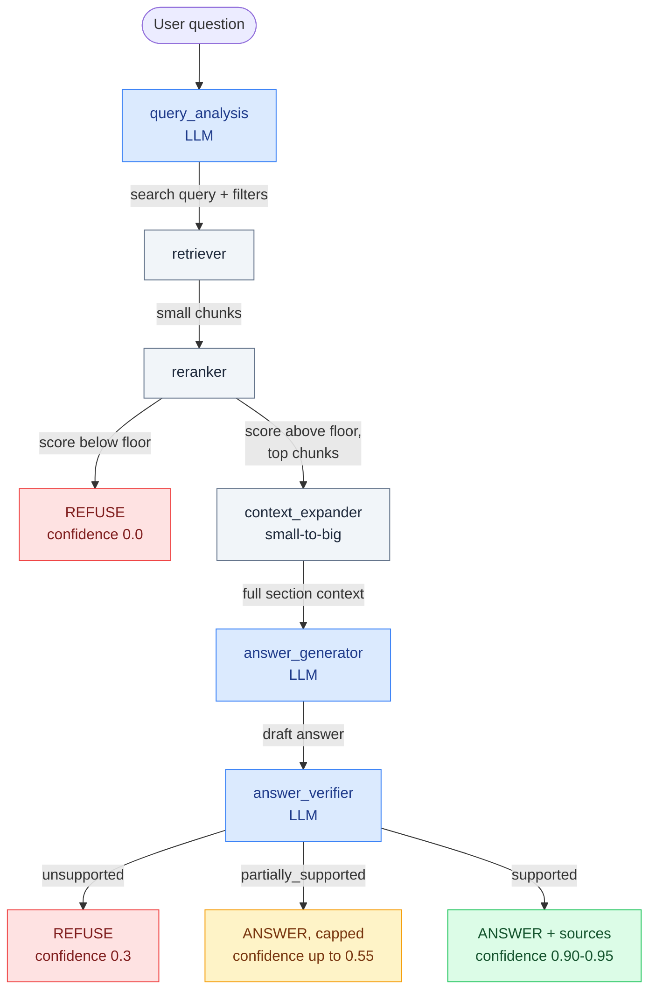

# 3GPP Markdown RAG pipeline

This project turns the included 3GPP Markdown source into structured chunks,
stores BGE embeddings in local Qdrant, retrieves and reranks relevant passages,
and produces grounded, claim-verified answers with Gemini. Query-time control is
implemented as an explicit LangGraph state machine with bounded retries.

## Repository structure

The application is organized by responsibility and by the stages of the RAG
flow. Code that implements the system lives in the `mavenier` package; runnable
entry points live in `scripts`; data and generated artifacts stay outside the
package.

Preprocessing is deliberately separate from the RAG runtime. `preprocessing/`
turns the spec folders into one JSONL file offline; `rag/` only ever reads that
JSONL. The two never run at the same time.

```text
Mavenier-Project/
├── mavenier/
│   ├── preprocessing/               # Step 1 (offline): spec folders -> enriched JSONL
│   │   ├── loader.py                # Load Markdown; parse release/series/spec from the path
│   │   ├── chunker.py               # Heading/token-aware Docling chunking
│   │   ├── content_classifier.py
│   │   ├── metadata_extractor.py
│   │   └── pipeline.py              # process_corpus(): walk the tree, write JSONL
│   ├── api/
│   │   └── app.py                   # FastAPI routes; ingests the JSONL on startup
│   └── rag/
│       ├── retrieval/               # Step 2: chunks/query -> ranked context
│       │   ├── embeddings.py        # BGE passage and query embeddings
│       │   ├── vector_store.py      # Local Qdrant storage, search, and filters
│       │   ├── pipeline.py          # Ingestion and semantic retrieval service
│       │   └── reranker.py          # Cross-encoder reranking
│       └── generation/              # Step 3: context -> grounded answer
│           ├── prompts.py           # Answer-generation system prompt
│           └── llm.py               # Gemini prompt and client boundary
├── scripts/                         # Manual command-line entry points
│   ├── build_dataset.py             # Step 1: spec folders -> outputs/enriched_chunks.jsonl
│   ├── run_ingestion.py             # Step 2: JSONL -> Qdrant
│   ├── search_qdrant.py
│   ├── ask_rag.py
│   └── show_graph.py
├── tests/                           # Automated tests for all stages
├── input/3gpp/marked/               # Source specs, grouped by Rel-*/NN_series/<spec>/raw.md
├── outputs/                         # Prebuilt enriched_chunks.jsonl (checked into the repo)
├── docs/                            # Focused architecture notes
├── Dockerfile
├── docker-compose.yml
└── requirements.txt
```

Every directory under `mavenier` is a Python package. Imports therefore show a
module's layer explicitly, for example:

```python
from mavenier.rag.retrieval.pipeline import search_text
```

## RAG flow

```text
input/3gpp/marked/**/raw.md
  -> preprocessing.loader (release/series/spec from the folder path)
  -> preprocessing.chunker
  -> preprocessing.content_classifier + preprocessing.metadata_extractor
  -> preprocessing.pipeline (process_corpus)
  -> outputs/enriched_chunks.jsonl        # end of the offline step
  -> retrieval.embeddings
  -> retrieval.vector_store (qdrant_data/)
  -> retrieval.pipeline (top 10 small chunks)
  -> retrieval.reranker (top 3)
  -> context_expander (small-to-big: each winner -> its parent section window)
  -> generation.llm
  -> grounded answer
```

Each chunk's `document_metadata` carries the folder-derived
`release`, `series`, `spec_number`, and `document_id` (plus `version`/`date`
when the spec header includes them). These are the intended primary filters for
scoping retrieval on a large multi-release corpus.

The stored payload also preserves the five extracted metadata blocks:
`direction_metadata`, `state_metadata`, `timer_metadata`, `asn1_metadata`, and
`requirement_metadata`. Only `original_text` is embedded. Queries receive BGE's
retrieval instruction, while stored passages do not.

## Installation

Python 3.12 is recommended.

```bash
python -m venv .venv
. .venv/bin/activate
python -m pip install -r requirements.txt
```

Copy `.env.example` to `.env` in the repository root and set
`GEMINI_API_KEY` before generating an answer. The embedding and reranking
models download on their first use.

`GEMINI_MODEL` defaults to `gemini-3.5-flash-lite`. If Gemini reports exhausted
quota, the API automatically continues in a degraded local mode: query analysis
uses conservative rules and the response contains retrieved source excerpts
with confidence capped at `0.55`. Other Gemini errors remain service failures.

On Windows PowerShell:

```powershell
Copy-Item .env.example .env
# Edit .env and replace the placeholder with your Gemini API key.
python -m uvicorn mavenier.api.app:app --host 127.0.0.1 --port 8000
```

`outputs/enriched_chunks.jsonl` is already built and checked into the repo, so
you can skip straight to ingestion. Only rerun `scripts.build_dataset` if you
change the specs under `input/3gpp/marked`.

## Run the API

```bash
python -m uvicorn mavenier.api.app:app --host 127.0.0.1 --port 8000
```

At startup the API reuses a populated `qdrant_data/telecom_rag` collection. If
the collection is empty, it ingests the prebuilt `outputs/enriched_chunks.jsonl`
(first startup takes longer while it embeds ~5,000 chunks). Open
`http://127.0.0.1:8000/docs` for the interactive API.

## Run with Docker Compose

```bash
docker compose up
```

This builds one image and runs two services: `ingest` embeds the prebuilt
JSONL into a shared `qdrant_data` volume, then `api` starts once ingestion
finishes. On later runs, `ingest` sees the collection is already populated and
exits immediately. Requires a `.env` file with `GEMINI_API_KEY` (see above).

## Run individual stages

Run all commands from the repository root so Python can resolve the `mavenier`
package. Step 1 is already done; only rerun it if the input specs change.

```bash
# Step 1 (offline, already done): spec folders -> outputs/enriched_chunks.jsonl
python -m scripts.build_dataset

# Step 2: embed the JSONL and store it in Qdrant
python -m scripts.run_ingestion

# Interactive semantic search
python -m scripts.search_qdrant

# Interactive grounded answer
python -m scripts.ask_rag

# Print the graph as Mermaid text
python -m scripts.show_graph
```

Programmatic retrieval remains available through the stage-specific package:

```python
from mavenier.rag.retrieval.pipeline import search_text

results = search_text(
    query="What happens when the timer expires?",
    filters={"timer.timer_name": "T300"},
    limit=5,
)
```

## Tests

```bash
python -m pytest -q
```

More detail about the last stage is available in [`docs/query-answer-stage.md`](docs/query-answer-stage.md).

## LangGraph agentic query architecture

Query time is a mostly linear LangGraph pipeline of seven stages; the only
branch is a deterministic abstain gate after reranking. Three stages use
Gemini (where judgment is genuinely needed); the rest are plain Python. The
diagram shows how the agents hand off to each other and what each edge carries:



Blue nodes call Gemini; gray nodes are plain Python. The code behind each node:

```text
mavenier/rag/
├── agents/                 # One clear job per node
│   ├── query_analysis.py   # LLM: question -> search query + metadata filters
│   ├── retriever.py        # BGE + Qdrant, soft filters with relax-on-empty
│   ├── reranker.py         # cross-encoder rerank + abstain-gate confidence
│   ├── context_expander.py # small-to-big: expand winners to parent sections
│   ├── answer_generator.py # LLM: grounded answer
│   ├── answer_verifier.py  # LLM: verify answer against chunk text + metadata
│   └── finalizer.py        # deterministic answer / refusal + confidence
├── graph/                  # Shared state and graph construction
│   ├── state.py
│   └── agentic_rag_graph.py
└── pipeline.py             # Public ask_agentic_rag() entry point
```

## How hallucination is controlled

Five layers, each catching a different failure mode. No RAG system reaches
zero hallucination — this stacks cheap deterministic checks with independent
LLM verification so a wrong answer has to slip past all five at once (see the
flow above for where each one sits):

| # | Layer | Technique | Stops |
|---|---|---|---|
| 1 | Retrieval | `query_analysis` infers filters (release/series/spec/timer) only when the question states them explicitly; retrieval relaxes automatically if a filter returns nothing | Wrong-spec matches, without ever forcing a false "no answer" |
| 2 | Context | Small-to-big: rerank on small, precise chunks, then expand each winner to a bounded window of its parent section | Fragment-level context loss *and* prompt bloat from dumping whole sections |
| 3 | Abstain gate | Cross-encoder relevance score checked against a fixed floor — pure arithmetic, no LLM call | Confidently answering from weak or off-topic retrieval |
| 4 | Generation | System prompt requires answering only from the supplied context, admitting "insufficient evidence" otherwise | Free-form invented facts |
| 5 | Verification | A separate LLM call checks the draft against each chunk's **text and structured metadata** (timers, states, messages, ASN.1) — corroborating specific facts, not fuzzy-matching prose — while explicitly tolerating paraphrase | Claims the evidence doesn't support, without over-refusing correct answers |

Confidence is deterministic, never invented by Gemini: `0.0` on refusal (layers
1–3), `0.3` if the verifier says unsupported, capped at `0.55` if only
partially supported, and `0.90–0.95` when fully verified.
