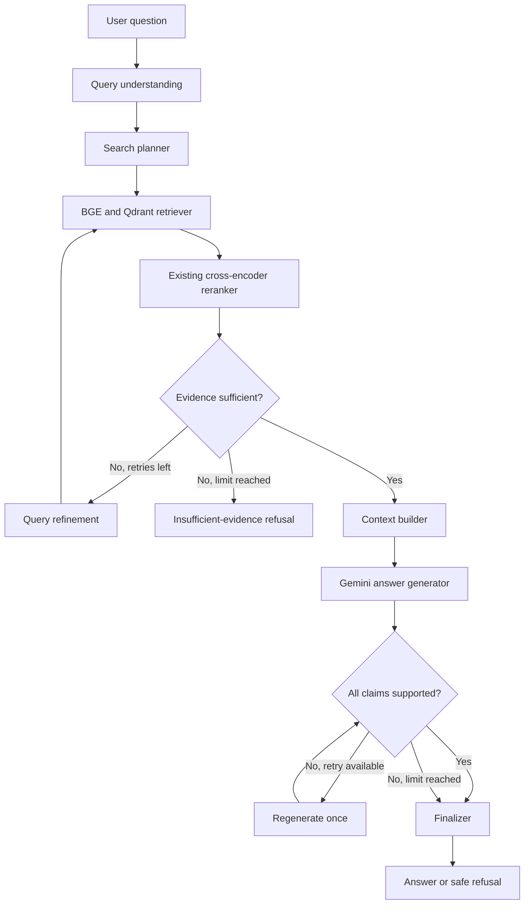

# 3GPP Markdown RAG pipeline

This project turns the included 3GPP Markdown source into structured chunks,
stores BGE embeddings in local Qdrant, retrieves and reranks relevant passages,
and produces grounded, claim-verified answers with Gemini. Query-time control is
implemented as an explicit LangGraph state machine with bounded retries.

## Repository structure

The application is organized by responsibility and by the stages of the RAG
flow. Code that implements the system lives in the `mavenier` package; runnable
entry points live in `scripts`; data and generated artifacts stay outside the
package.

```text
Mavenier-Project/
├── mavenier/
│   ├── api/
│   │   └── app.py                   # FastAPI routes and startup preparation
│   └── rag/
│       ├── ingestion/               # Stage 1: source -> enriched chunks
│       │   ├── loader.py            # Load and split combined Markdown
│       │   ├── chunker.py           # Heading/token-aware Docling chunking
│       │   ├── content_classifier.py
│       │   ├── metadata_extractor.py
│       │   └── pipeline.py          # Coordinate preprocessing and JSONL output
│       ├── retrieval/               # Stage 2: chunks/query -> ranked context
│       │   ├── embeddings.py        # BGE passage and query embeddings
│       │   ├── vector_store.py      # Local Qdrant storage and search
│       │   ├── pipeline.py          # Ingestion and semantic retrieval service
│       │   └── reranker.py          # Cross-encoder reranking
│       └── generation/              # Stage 3: context -> grounded answer
│           ├── llm.py               # Gemini prompt and client boundary
│           └── pipeline.py          # End-to-end answer orchestration
├── scripts/                         # Manual command-line entry points
│   ├── run_pipeline.py
│   ├── run_ingestion.py
│   ├── search_qdrant.py
│   └── ask_rag.py
├── tests/                           # Automated tests for all stages
├── input/                           # Source documents
├── outputs/                         # Generated enriched JSONL
├── docs/                            # Focused architecture notes
├── Dockerfile
└── requirements.txt
```

Every directory under `mavenier` is a Python package. Imports therefore show a
module's layer explicitly, for example:

```python
from mavenier.rag.retrieval.pipeline import search_text
```

## RAG flow

```text
input/MD Combined.md
  -> ingestion.loader
  -> ingestion.chunker
  -> ingestion.content_classifier + ingestion.metadata_extractor
  -> ingestion.pipeline
  -> outputs/enriched_chunks.jsonl
  -> retrieval.embeddings
  -> retrieval.vector_store (qdrant_data/)
  -> retrieval.pipeline (top 10)
  -> retrieval.reranker (top 3)
  -> generation.llm
  -> grounded answer
```

The stored payload preserves the five extracted metadata blocks:
`direction_metadata`, `state_metadata`, `timer_metadata`, `asn1_metadata`, and
`requirement_metadata`. Only `original_text` is embedded. Queries receive BGE's
retrieval instruction, while stored passages do not.

## Installation

Python 3.12 is recommended.

```bash
python -m venv .venv
. .venv/bin/activate
python -m pip install -r requirements.txt
```

Copy `.env.example` to `.env` and set `GEMINI_API_KEY` before generating an
answer. The embedding and reranking models download on their first use.

## Run the API

```bash
python -m uvicorn mavenier.api.app:app --host 127.0.0.1 --port 8000
```

At startup the API reuses a populated `qdrant_data/telecom_rag` collection. If
it is unavailable or empty, the API creates the chunk output when necessary and
ingests it. Open `http://127.0.0.1:8000/docs` for the interactive API.

## Run individual stages

Run all commands from the repository root so Python can resolve the `mavenier`
package.

```bash
# Stage 1: Markdown -> outputs/enriched_chunks.jsonl
python -m scripts.run_pipeline

# Stage 1 + Stage 2: preprocess if needed, embed, and store in Qdrant
python -m scripts.run_ingestion

# Stage 2: interactive semantic search
python -m scripts.search_qdrant

# Stages 2 + 3: interactive grounded answer
python -m scripts.ask_rag

# Print the graph as Mermaid text
python -m scripts.show_graph
```

Programmatic retrieval remains available through the stage-specific package:

```python
from mavenier.rag.retrieval.pipeline import search_text

results = search_text(
    query="What happens when the timer expires?",
    filters={"timer.timer_name": "T300"},
    limit=5,
)
```

## Tests

```bash
python -m pytest -q
```

More detail about the last stage is available in [`docs/query-answer-stage.md`](docs/query-answer-stage.md).

## LangGraph agentic query architecture

The ingestion path is unchanged. Only query-time orchestration changed.

```text
OLD
question -> retrieve -> rerank -> generate -> answer

NEW
question -> understand -> plan -> retrieve -> rerank -> check evidence
         -> build context -> generate -> verify claims -> answer or refuse
```

The query code is grouped by responsibility:

```text
mavenier/rag/
├── agents/                 # One clear job per node
│   ├── query_understanding.py
│   ├── search_planner.py
│   ├── retriever.py
│   ├── reranker.py
│   ├── evidence_checker.py
│   ├── query_refinement.py
│   ├── context_builder.py
│   ├── answer_generator.py
│   ├── fact_verifier.py
│   └── finalizer.py
├── graph/                  # Shared state, routes, and graph construction
│   ├── state.py
│   ├── routes.py
│   └── agentic_rag_graph.py
└── pipeline.py             # Public ask_agentic_rag() entry point
```



For beginners:

- **State** is the shared notebook containing question, search plan, evidence,
  answer, verification, retry counts, and trace.
- **Node** is one small Python function that performs one stage.
- **Edge** selects the next stage.
- **Conditional edge** makes a visible decision such as retry or continue.
- **Graph** is the compiled orchestration that invokes all stages.

Gemini is used only for query understanding, evidence sufficiency, answer
generation, fact verification, and the single answer rewrite. Search planning,
retrieval, reranking, refinement, context formatting, confidence, and final
response construction are deterministic services or Python nodes.

Retrieval refinement is capped at two retries, meaning at most three searches.
Answer regeneration is capped at one retry. The graph has no unbounded loops.
If document evidence remains insufficient, answer generation is skipped. If a
generated answer remains unsupported after regeneration, the finalizer returns
a safe verification refusal instead of exposing unsupported claims.

Confidence is deterministic: insufficient evidence is `0.0`, an unverified
safe refusal is `0.4`, and a fully verified answer starts at `0.90`, gaining
`0.02` for each additional unique cited source/section up to `0.95`. Gemini is
never asked to invent a confidence value.
