Error:

2

Error: Reference source not

---

# Contents

|                                                                                                                   |    |
|-------------------------------------------------------------------------------------------------------------------|----|
| Foreword.....                                                                                                     | 6  |
| 1 Scope.....                                                                                                      | 7  |
| 2 References.....                                                                                                 | 9  |
| 3 Abbreviations and definitions.....                                                                              | 10 |
| 3.1 Abbreviations.....                                                                                            | 10 |
| 3.2 Definitions.....                                                                                              | 11 |
| 4 Role, functional composition of MSCs and interfaces for handover.....                                           | 12 |
| 4.1 MSC-A.....                                                                                                    | 12 |
| 4.1.1 Role of MSC-A.....                                                                                          | 12 |
| 4.1.2 Functional composition of MSC-A and its interfaces for handover.....                                        | 14 |
| 4.2 MSC-B.....                                                                                                    | 16 |
| 4.2.1 Role of MSC-B.....                                                                                          | 16 |
| 4.2.2 Functional composition of MSC-B and its interfaces for handover.....                                        | 17 |
| 4.3 3G_MSC-A.....                                                                                                 | 18 |
| 4.3.1 Role of 3G_MSC-A.....                                                                                       | 19 |
| 4.3.2 Functional composition of 3G_MSC-A and its interfaces for handover/relocation.....                          | 21 |
| 4.4 3G_MSC-B.....                                                                                                 | 23 |
| 4.4.1 Role of 3G_MSC-B.....                                                                                       | 23 |
| 4.4.2 Functional composition of 3G_MSC-B and its interfaces for handover/relocation.....                          | 26 |
| 4.5 MSC server enhanced for SRVCC features.....                                                                   | 27 |
| 4.5.1 Role of SRVCC MSC.....                                                                                      | 27 |
| 4.5.2 Functional composition of SRVCC MSC and its interfaces for handover/relocation.....                         | 28 |
| 4.5.3 Role of vSRVCC MSC.....                                                                                     | 28 |
| 4.5.4 Functional composition of vSRVCC MSC and its interfaces for handover/relocation.....                        | 28 |
| 5 Handover initiation conditions.....                                                                             | 28 |
| 6 General description of the procedures for intra - MSC handovers.....                                            | 29 |
| 6.1 Procedure for Intra-MSC Handovers.....                                                                        | 29 |
| 6.2 Procedure for Intra-3G_MSC Handovers.....                                                                     | 31 |
| 6.2.1 Intra-3G_MSC Handover from UMTS to GSM.....                                                                 | 31 |
| 6.2.1.1 With no bearer or one bearer.....                                                                         | 32 |
| 6.2.1.2 With multiple bearers (Optional functionality).....                                                       | 33 |
| 6.2.2 Intra-3G_MSC GSM to UMTS Handover.....                                                                      | 33 |
| 6.2.3 Procedure for Intra-3G_MSC SRNS Relocation.....                                                             | 35 |
| 6.2.3.1 With no bearer or one bearer.....                                                                         | 37 |
| 6.2.3.1.1 SRNS Relocation.....                                                                                    | 37 |
| 6.2.3.1.2 Enhanced SRNS Relocation.....                                                                           | 38 |
| 6.2.3.2 With multiple bearers (Optional functionality).....                                                       | 39 |
| 6.3 Internal Handover with MSC Support for Intra-BSS handover with AoIP.....                                      | 40 |
| 6.3.1 General Description of Internal Handover with MSC Support.....                                              | 40 |
| 6.3.2 BSS-initiated Internal Handover with MSC Support.....                                                       | 40 |
| 6.3.3 MSC-initiated BSS Internal Handover with MSC Support.....                                                   | 42 |
| 7 General description of the procedures for inter - MSC handovers.....                                            | 42 |
| 7.1 Basic handover procedure requiring a circuit connection between MSC-A and MSC-B.....                          | 43 |
| 7.2 Basic handover procedure not requiring the establishment of a circuit connection between MSC-A and MSC-B..... | 45 |
| 7.3 Procedure for subsequent handover requiring a circuit connection.....                                         | 46 |
| 7.3.1 Description of subsequent handover procedure i): MSC-B to MSC-A.....                                        | 47 |
| 7.3.2 Description of the subsequent handover procedure ii): MSC-B to MSC-B'.....                                  | 48 |
| 7.4 Procedure for subsequent handover not requiring a circuit connection.....                                     | 49 |
| 7.4.1 Description of the subsequent handover procedure without circuit connection i): MSC-B to MSC-A.....         | 50 |
| 7.4.2 Description of the subsequent handover procedure without circuit connection ii): MSC-B to MSC-B'.....       | 50 |
| 8 General Description of the procedures for inter - 3G_MSC handovers.....                                         | 51 |
| 8.1 Handover UMTS to GSM.....                                                                                     | 51 |

|           |                                                                                                                              |    |
|-----------|------------------------------------------------------------------------------------------------------------------------------|----|
| 8.1.1     | Basic Handover procedure requiring a circuit connection between 3G_MSC -A and MSC-B.....                                     | 52 |
| 8.1.1.1   | With one circuit connection.....                                                                                             | 53 |
| 8.1.1.2   | With multiple circuit connections (Optional functionality).....                                                              | 55 |
| 8.1.2     | Basic UMTS to GSM Handover procedure not requiring the establishment of a circuit connection between 3G_MSC-A and MSC-B..... | 55 |
| 8.1.3     | Procedure for subsequent UMTS to GSM handover requiring a circuit connection.....                                            | 56 |
| 8.1.3.1   | Description of subsequent UMTS to GSM handover procedure i): 3G_MSC-B to MSC-A.....                                          | 57 |
| 8.1.3.1.1 | With one circuit connection.....                                                                                             | 57 |
| 8.1.3.1.2 | With multiple circuit connections (Optional functionality).....                                                              | 57 |
| 8.1.3.2   | Description of subsequent UMTS to GSM handover procedure ii): 3G_MSC-B to MSC-B'.....                                        | 58 |
| 8.1.3.2.1 | With one circuit connection.....                                                                                             | 58 |
| 8.1.3.2.2 | With multiple circuit connections (Optional functionality).....                                                              | 58 |
| 8.1.4     | Procedure for subsequent UMTS to GSM handover not requiring a circuit connection.....                                        | 60 |
| 8.1.4.1   | Description of subsequent UMTS to GSM handover procedure i): 3G_MSC-B to MSC-A.....                                          | 61 |
| 8.1.4.2   | Description of the subsequent UMTS to GSM handover procedure without circuit connection ii): 3G_MSC-B to MSC-B'.....         | 61 |
| 8.2       | Handover GSM to UMTS.....                                                                                                    | 62 |
| 8.2.1     | Basic Handover procedure requiring a circuit connection between MSC-A and 3G_MSC-B.....                                      | 63 |
| 8.2.2     | Basic GSM to UMTS Handover procedure not requiring the establishment of a circuit connection between MSC-A and 3G_MSC-B..... | 66 |
| 8.2.3     | Procedure for subsequent GSM to UMTS handover requiring a circuit connection.....                                            | 66 |
| 8.2.3.1   | Description of subsequent GSM to UMTS handover procedure i): MSC-B to 3G_MSC-A.....                                          | 67 |
| 8.2.3.2   | Description of subsequent GSM to UMTS handover procedure ii): MSC-B to 3G_MSC-B'.....                                        | 68 |
| 8.2.4     | Procedure for subsequent GSM to UMTS handover not requiring a circuit connection.....                                        | 69 |
| 8.2.4.1   | Description of subsequent GSM to UMTS handover procedure without circuit connection i): MSC-B to 3G_MSC-A.....               | 70 |
| 8.2.4.2   | Description of subsequent GSM to UMTS handover procedure without circuit connection ii): MSC-B to 3G_MSC-B'.....             | 70 |
| 8.3       | SRNS Relocation.....                                                                                                         | 71 |
| 8.3.1     | Basic relocation procedure requiring a circuit connection between 3G_MSC-A and 3G_MSC-B.....                                 | 72 |
| 8.3.1.1   | With one circuit connection.....                                                                                             | 73 |
| 8.3.1.2   | With multiple circuit connections (Optional functionality).....                                                              | 75 |
| 8.3.1.2.1 | 3G_MSC-B does not support multiple bearers.....                                                                              | 75 |
| 8.3.1.2.2 | 3G_MSC-B supports multiple bearers.....                                                                                      | 75 |
| 8.3.2     | Basic relocation procedure not requiring the establishment of a circuit connection between 3G_MSC-A and 3G_MSC-B.....        | 76 |
| 8.3.3     | Procedure for subsequent relocation requiring a circuit connection.....                                                      | 77 |
| 8.3.3.1   | Description of subsequent relocation procedure i): 3G_MSC-B to 3G_MSC-A.....                                                 | 78 |
| 8.3.3.1.1 | With one circuit connection.....                                                                                             | 78 |
| 8.3.3.1.2 | With multiple circuit connections (Optional functionality).....                                                              | 79 |
| 8.3.3.2   | Description of subsequent relocation procedure ii): 3G_MSC-B to 3G_MSC-B'.....                                               | 79 |
| 8.3.3.2.1 | With one circuit connection.....                                                                                             | 79 |
| 8.3.3.2.2 | With multiple circuit connections (Optional functionality).....                                                              | 80 |
| 8.3.4     | Procedure for subsequent relocation not requiring a circuit connection.....                                                  | 82 |
| 8.3.4.1   | Description of subsequent relocation procedure i): 3G_MSC-B to 3G_MSC-A.....                                                 | 83 |
| 8.3.4.2   | Description of subsequent relocation procedure ii): 3G_MSC-B to 3G_MSC-B".....                                               | 83 |
| 9         | Detailed procedures in MSC-A.....                                                                                            | 84 |
| 9.1       | BSS/MSC and MS/MSC procedures in MSC-A (functional unit 1).....                                                              | 84 |
| 9.2       | Call control procedures MSC-A (functional unit 2).....                                                                       | 85 |
| 9.3       | Handover control procedures MSC-A (functional unit 3).....                                                                   | 86 |
| 9.3A      | BSS Internal Handover with MSC Support control procedures.....                                                               | 87 |
| 9.4       | MAP procedures in MSC-A (functional unit 4).....                                                                             | 88 |
| 9.5       | Interworking between Handover control procedures and MAP procedures in MSC-A.....                                            | 88 |
| 9.6       | Compatibility with GSM Phase 1.....                                                                                          | 88 |
| 10        | Detailed procedures in MSC-B.....                                                                                            | 89 |
| 10.1      | BSS/MSC (MS/BSS) procedures MSC-B (functional unit 1).....                                                                   | 89 |
| 10.2      | Call control procedures MSC-B (functional unit 2).....                                                                       | 89 |
| 10.3      | Handover control procedures MSC-B (functional unit 3).....                                                                   | 90 |
| 10.4      | MAP procedures MSC-B (functional unit 4).....                                                                                | 90 |
| 10.5      | Interworking between Handover control procedures and MAP procedures in MSC-B.....                                            | 91 |

|                        |                                                                                                   |     |
|------------------------|---------------------------------------------------------------------------------------------------|-----|
| 10.6                   | Compatibility with GSM Phase 1 .....                                                              | 91  |
| 11                     | Detailed procedures in 3G_MSC-A.....                                                              | 91  |
| 11.1                   | RNC/BSC/3G_MSC and UE/MS/3G_MSC procedures in 3G_MSC-A (functional unit 1).....                   | 91  |
| 11.2                   | Call control procedures 3G_MSC-A (functional unit 2).....                                         | 91  |
| 11.3                   | Handover/Relocation control procedures 3G_MSC-A (functional unit 3).....                          | 93  |
| 11.4                   | MAP procedures in 3G_MSC-A (functional unit 4).....                                               | 95  |
| 11.5                   | Interworking between Handover/Relocation control procedures and MAP procedures in 3G_MSC-A.....   | 95  |
| 11.6                   | Compatibility with GSM Phase 1 .....                                                              | 96  |
| 11.7                   | Protocol interworking.....                                                                        | 96  |
| 12                     | Detailed procedures in 3G_MSC-B.....                                                              | 96  |
| 12.1                   | RNC/BSC/3G_MSC (UE/MS/RNC/BSC) procedures in 3G_MSC-B (functional unit 1).....                    | 96  |
| 12.2                   | Call control procedures 3G_MSC-B (functional unit 2).....                                         | 96  |
| 12.3                   | Handover/Relocation control procedures in 3G_MSC-B (functional unit 3).....                       | 97  |
| 12.4                   | MAP procedures in 3G_MSC-B (functional unit 4).....                                               | 99  |
| 12.5                   | Interworking between Handover/Relocation control procedures and MAP procedures in 3G_MSC-B.....   | 99  |
| 12.6                   | Compatibility with GSM Phase 1 .....                                                              | 99  |
| 12.7                   | Protocol interworking.....                                                                        | 99  |
| 12.8                   | Interactions between handover/relocation control procedures and other RANAP procedures.....       | 100 |
| 12.8.1                 | Interactions between handover/relocation control procedures and the security mode procedure.....  | 100 |
| 12.8.1.1               | Intra-3G_MSC-B handover/relocation.....                                                           | 100 |
| 12.8.1.2               | Subsequent Inter-MSC handover/relocation.....                                                     | 102 |
| 12.8.2                 | Interactions between handover/relocation control procedures and the RAB assignment procedure..... | 104 |
| 12.8.2.1               | Intra-3G_MSC-B handover/relocation.....                                                           | 104 |
| 12.8.2.2               | Subsequent Inter-MSC handover/relocation.....                                                     | 106 |
| 12.8.3                 | Interactions between directed retry handover procedures and the RAB assignment procedure.....     | 108 |
| 12.8.3.1               | Intra-3G_MSC-B directed retry handover.....                                                       | 108 |
| 12.8.3.2               | Subsequent Inter-MSC directed retry handover.....                                                 | 109 |
| 13                     | Subsequent channel assignment using a circuit connection between MSC-A and MSC-B.....             | 111 |
| 13.1                   | GSM handover.....                                                                                 | 111 |
| 13.2                   | UMTS to GSM handover.....                                                                         | 112 |
| 13.3                   | GSM to UMTS handover.....                                                                         | 114 |
| 13.4                   | SRNS Relocation.....                                                                              | 115 |
| 13.4.1                 | Without circuit connection.....                                                                   | 115 |
| 13.4.2                 | With circuit connection (Optional functionality).....                                             | 116 |
| 14                     | Directed retry handover.....                                                                      | 117 |
| 14.1                   | GSM handover.....                                                                                 | 117 |
| 14.2                   | GSM to UMTS handover.....                                                                         | 118 |
| 14.3                   | UMTS to GSM handover.....                                                                         | 120 |
| 15                     | SDL diagrams.....                                                                                 | 121 |
| Annex A (informative): | Change history.....                                                                               | 298 |

# --- Foreword

This Technical Specification (TS) has been produced by the 3<sup>rd</sup> Generation Partnership Project (3GPP).

The present document provides a mechanism giving reliable transfer of signalling messages within the 3GPP system.

The contents of the present document are subject to continuing work within the TSG and may change following formal TSG approval. Should the TSG modify the contents of the present document, it will be re-released by the TSG with an identifying change of release date and an increase in version number as follows:

Version x.y.z

where:

- x the first digit:
  - 1 presented to TSG for information;
  - 2 presented to TSG for approval;
  - 3 or greater indicates TSG approved document under change control.
- y the second digit is incremented for all changes of substance, i.e. technical enhancements, corrections, updates, etc.
- z the third digit is incremented when editorial only changes have been incorporated in the document.

# 1 Scope

The present document contains a detailed description of the handover procedures to be used in PLMNs. The purpose of the handover procedures, as described in the present document, are to ensure that the connection to the Mobile Station (MS) or User Equipment (UE) is maintained as it moves from one cell or radio network to another. The document defines the circuit switched handover functionality based on the service requirements in 3GPP TS 22.129 [9]. For the circuit switched handover functionality related to SRVCC and vSRVCC, it is based on the service requirements in 3GPP TS 23.216 [26].

The present document considers the following five handover cases:

- i) handover between Base Station Subsystems (BSS) connected to the same MSC, this is termed an Intra-MSC handover;
- ii) handover between Radio Network Subsystems (RNS) connected to the same 3G\_MSC, this is termed an Intra-3G\_MSC handover/relocation. This case also includes inter-system handover between RNS and BSS if the 3G\_MSC supports the A-interface. In the context of this specification the term RNS refers also to a BSS when serving a mobile station in Iu mode. Furthermore, this case includes Intra-3G\_MSC enhanced SRNS relocation between two RNSs;
- iii) handover between Base Station Subsystems connected to different MSCs, this is termed an Inter-MSC handover. This category can be sub-divided into three further procedures:
  - a) the Basic Inter-MSC Handover procedure, where the MS is handed over from a controlling MSC (MSC-A) to another MSC (MSC-B);
  - b) the Subsequent Inter-MSC Handover procedure, where the MS is handed over from MSC-B to a third MSC (MSC-B');
  - c) the Subsequent Inter-MSC handback, where the MS is handed back from MSC-B to MSC-A.
- iv) handover between Radio Network Subsystems connected to different 3G\_MSCs, this is termed an Inter-3G\_MSC handover/relocation. In the context of this specification the term RNS also refers to a BSS when serving a mobile station in Iu mode. This category can be divided into three further sub-procedures:
  - a) the Inter-3G\_MSC Handover procedure from UMTS to GSM, where the UE/MS is handed over from a controlling 3G\_MSC (3G\_MSC-A) to an MSC (MSC-B);
  - b) the Inter-3G\_MSC Handover procedure from GSM to UMTS, where the UE/MS is handed over from a controlling MSC (MSC-A) to a 3G\_MSC (3G\_MSC-B);
  - c) the Inter-3G\_MSC Relocation procedure, where the UE is relocated from 3G\_MSC-A to 3G\_MSC-B. This procedure can also be combined with a hard change of radio resources (Hard Handover with switch in the core network).

The MSC in items a) and b) this category can optionally be a 3G\_MSC supporting the A-interface. The three sub-procedures also cover subsequent handover/relocation to a third MSC-B' or 3G\_MSC-B' and subsequent handover/relocation back to MSC-A or 3G\_MSC-A.

- v) handover within one BSS connected via AoIP, supported by the same MSC, this is termed "BSS Internal Handover with MSC Support". It is in fact a kind of external handover from MSC perspective and therefore a subset of i) but described in detail in separate subclause 6.3 for clarity. The MSC in this category can be any of MSC-A, MSC-B, 3G\_MSC-A or 3G\_MSC-B.

In both cases i) and iii) the same procedures as defined in the 3GPP TS 48.008 [5] and the 3GPP TS 24.008 [10] shall be used on the A-interface and on the Radio Interface, respectively.

In case ii) the same procedures as defined in the 3GPP TS 25.413 [11] and the 3GPP TS 24.008 [10] shall be used on the Iu-interface. If the 3G\_MSC in case ii) also supports the A-interface, the 3GPP TS 48.008 [5] and the 3GPP TS 24.008 [10] shall be used on the A-interface.

In case iii) the handover procedures shall transport the A-interface messages between MSC-A and MSC-B described in the Mobile Application Part (MAP), 3GPP TS 29.002 [12].

In case iv) the handover procedures shall transport the A-interface messages between 3G\_MSC and MSC described in the Mobile Application Part (MAP), 3GPP TS 29.002 [12].

In case iv) the relocation procedure shall transport the Iu-interface messages between 3G\_MSC-A and 3G\_MSC-B described in the Mobile Application Part (MAP), 3GPP TS 29.002 [12].

The interworking between the 3GPP TS 29.002 [12] protocol and the 3GPP TS 48.008 [5] protocol is described in the 3GPP TS 29.010 [8].

Multicall supplementary service is not applicable in GERAN Iu mode and relocation of Multicalls is therefore only possible within UTRAN.

Enhanced SRNS relocation is possible only within UTRAN between two RNSs connected to the same 3G\_MSC, i.e. in case ii).

Handovers, which take place on the same MSC are termed Intra-MSC handovers; this includes both Inter-BSS and Intra-BSS handovers.

Handovers, which take place on the same 3G\_MSC are termed Intra-3G\_MSC handovers; this includes Inter-RNS handovers and optionally RNS to BSS and BSS to RNS handovers.

In the context of this specification the term InterSystem handover can also refer to a handover which takes place between a Base Station serving a mobile station in Iu mode and a Base Station serving a mobile in A/Gb mode.

"Flexible Iu interface for handover/relocation" Option (see 3GPP TS 23.221 [19], subclause 4.2.1): Up to release 99 an RNS can be connected only to one 3G\_MSC. From release 4 onwards, as a network option, an RNS can have Iu interfaces to more than one MSC. Such an additional Iu interface may be selected by an MSC during an intra-PLMN relocation or intra-PLMN BSS to RNS handover procedure. This allows the MSC to use an Intra-3G\_MSC handover procedure according to case ii) instead of an Inter-3G\_MSC handover procedure according to case iv). The decision whether to use the Intra-3G\_MSC handover procedure is implementation and configuration dependent. In a network implementing this option, a global title based on the Global RNC-Id may optionally be used for the addressing of the Iu interface messages.

"Intra Domain Connection of RAN Nodes to Multiple CN Nodes" Option (see 3GPP TS 23.236 [18]): when applied, a BSS or an RNS can be connected to more than one MSC.

The present document also covers the requirements for handover in ongoing GSM voice group calls, directed retry and handover without a circuit connection between (U)MSCs. The present document does not consider the case of handovers between radio channels on the same BSS (Intra-BSS handover) or the handover of packet radio services except for case v), the "BSS Internal Handover with MSC Support" for Intra-BSS handover in AoIP, involving the MSC as described in subclause 6.3. The Inter-RNS handover case that results in a relocation is covered by the present document, but not other Inter-RNS or Intra-RNS handover cases.

For voice broadcast calls in GSM, the speaker uses normal point-to-point handover procedures, whilst the listeners use idle mode cell reselection procedures, as for the voice group call listeners.

Voice group calls is only applicable to GSM and handover of voice group calls is therefore only possible in GSM.

Inter-MSC hand-over imposes a few limitations on the system. After inter-MSC hand-over:

- call re-establishment is not supported.

The list of 3GPP TS 48.008 [5] features supported during and after Inter-MSC handover is given in 3GPP TS 49.008 [7].

In the Inter-MSC handover case, the interworking between a Phase 1 BSSMAP protocol possibly used by one MSC and the Phase 2 BSSMAP protocol used in the Phase 2 MAP protocol on the E-interface is performed by this MSC.

This specification assumes TDM based Core Network and therefore PCM, ITU-T G.711 [16] encoded, voice channel for speech calls between MSC-A and MSC-B and toward the other party. For bearer independent CS Core Network architecture implementations see 3GPP TS 23.205 [23] and 3GPP TS 23.231 [24]. For handover including Out-Of-Band transcoder control and transcoder free operation see 3GPP TS 23.153 [25]. For handover with Local Call Local Switch (LCLS) see 3GPP TS 23.284 [29].

NOTE 1: The message primitive names used in the SDL diagrams and message flows in the present document do not represent the actual messages specified in the GSM or 3GPP stage 3 technical specifications. The primitive names are only intended to be indicative of their use in the present document.

The MSC server enhanced for SRVCC and the MSC server enhanced for vSRVCC as specified in 3GPP TS 23.216 [26] follows the procedures defined for 3G\_MSC-A in the present specification with the exceptions and additions as specified in subclause 4.5.

# --- 2 References

The following documents contain provisions which, through reference in this text, constitute provisions of the present document.

- References are either specific (identified by date of publication, edition number, version number, etc.) or non-specific.
- For a specific reference, subsequent revisions do not apply.
- For a non-specific reference, the latest version applies. In the case of a reference to a 3GPP document (including a GSM document), a non-specific reference implicitly refers to the latest version of that document *in the same Release as the present document*.

- [1] ITU-T Recommendation Q.118: "Abnormal conditions - Special release arrangements".
- [2] Void.
- [2a] 3GPP TR 21.905: "3G Vocabulary".
- [3] 3GPP TS 43.068: "Voice Group Call Service (VGCS); Stage 2".
- [4] 3GPP TS 45.008: "Radio Subsystem Link Control".
- [5] 3GPP TS 48.008: "Mobile Switching Centre - Base Station System (MSC-BSS) Interface Layer 3 specification".
- [6] 3GPP TS 48.058: "Base Station Controller - Base Transceiver Station (BSC-BTS) Interface Layer 3 specification".
- [7] 3GPP TS 49.008: "Application of the Base Station System Application Part (BSSAP) on the E-interface".
- [8] 3GPP TS 29.010: "Information Element Mapping between Mobile Station - Base Station System (MS-BSS) and Base Station System - Mobile-services Switching Centre (BSS-MSC); Signalling procedures and the Mobile Application Part (MAP)".
- [9] 3GPP TS 22.129: "Handover Requirements between UMTS and GSM or other Radio Systems".
- [10] 3GPP TS 24.008: "Mobile Radio Interface Layer 3 specification; Core Network Protocols; Stage 3".
- [11] 3GPP TS 25.413: "UTRAN Iu interface RANAP signalling".
- [12] 3GPP TS 29.002: "Mobile Application Part (MAP) specification".
- [13] 3GPP TS 25.303: "UE functions and inter-layer procedures in connected mode".
- [14] 3GPP TS 25.331: "Radio Resource Control (RRC) Protocol Specification".
- [15] 3GPP TS 29.108: "Application of the Radio Access Network Application Part (RANAP) on the E-interface".
- [16] ITU-T Recommendation G.711: "Pulse code modulation (PCM) of voice frequencies".
- [17] 3GPP TS 23.135: "Multicall supplementary service; Stage 2".

- [18] 3GPP TS 23.236: "Intra Domain Connection of RAN Nodes to Multiple CN Nodes".
- [19] 3GPP TS 23.221: "Architectural Requirements".
- [20] 3GPP TS 25.401: "UTRAN Overall Description".
- [21] 3GPP TS 23.195: "Provision of UE Specific Behaviour Information to Network Entities".
- [22] 3GPP TS 23.172: "Technical realization of Circuit Switched (CS) multimedia service; UDI/RDI fallback and service modification".
- [23] 3GPP TS 23.205: "Bearer-independent circuit-switched core network; Stage 2"
- [24] 3GPP TS 23.231: "SIP-I based circuit-switched core network; Stage 2"
- [25] 3GPP TS 23.153: "Out of band transcoder control; Stage 2".
- [26] 3GPP TS 23.216: "Single Radio Voice Call Continuity (SRVCC)".
- [27] 3GPP TS 29.280: "3GPP Sv interface (MME to MSC, and SGSN to MSC) for SRVCC".
- [28] 3GPP TS 44.018: "Mobile radio interface layer 3 specification; Radio Resource Control (RRC) protocol".
- [29] 3GPP TS 23.284: "Local Call Local Switch; Stage 2".
- [30] 3GPP TS 24.237: "IP Multimedia (IM) Core Network (CN) subsystem (IMS) service continuity; Stage 3".
- [31] 3GPP TS 23.237: "IP Multimedia Subsystem (IMS) Service Continuity; Stage 2".

# --- 3 Abbreviations and definitions

## 3.1 Abbreviations

For the purpose of the present document, the following abbreviations apply:

|           |                                                                                         |
|-----------|-----------------------------------------------------------------------------------------|
| 3G_MSC    | A third generation MSC that supports the Iu interface and optionally the A interface    |
| 3G_MSC-A  | The controlling 3G_MSC on which the call was originally established                     |
| 3G_MSC-B  | The 3G_MSC to which the UE is handed over in a Basic Handover                           |
| 3G_MSC-B' | The 3G_MSC to which the UE is handed over in a Subsequent Handover                      |
| BSC       | Base Station Controller                                                                 |
| BSS       | Base Station System                                                                     |
| BSS-A     | The BSS from which the MS is being handed over                                          |
| BSS-B     | The BSS to which the MS is being handed over                                            |
| BTS       | Base Transceiver Station                                                                |
| CSG       | Closed Subscriber Group                                                                 |
| CSS       | CSG Subscriber Server                                                                   |
| E-UTRAN   | Evolved Universal Terrestrial Radio Access Network                                      |
| GERAN     | GSM EDGE Radio Access Network                                                           |
| ISC       | International Switching Centre                                                          |
| LCLS      | Local Call Local Switch                                                                 |
| MS        | Mobile Station                                                                          |
| MSC       | A second generation Mobile Services Switching Centre that only supports the A interface |
| MSC-A     | The controlling MSC on which the call was originally established                        |
| MSC-B     | The MSC to which the MS is handed over in a Basic Handover                              |
| MSC-B'    | The MSC to which the MS is handed over in a Subsequent Handover                         |
| MME       | Mobility Management Entity                                                              |
| RNC       | Radio Network Controller                                                                |
| RNS       | Radio Network Subsystem                                                                 |
| SBSS      | Serving BSS                                                                             |
| SNA       | Shared Network Area                                                                     |
| SRNS      | Serving RNS                                                                             |

|        |                                                                             |
|--------|-----------------------------------------------------------------------------|
| STN-SR | Session Transfer Number for SR-VCC                                          |
| UE     | A User Equipment is a terminal that supports USIM and the UMTS Uu interface |
| UE/MS  | A terminal that supports USIM, SIM, the Uu interface and the Um interface   |
| UESBI  | UE Specific Behaviour Information                                           |
| USIM   | UMTS Subscriber Identity Module                                             |

Other abbreviations used in the GSM specifications are listed in 3GPP TR 21.905 [2a].

## 3.2 Definitions

The following terms are used in this Technical Specification:

**A/Gb mode:** mode of operation of the MS when connected to the Core Network via GERAN and the A and/or Gb interfaces. Throughout this specification the term GSM refers to GERAN A/Gb mode.

**AoIP-Selected codec (Target):** the codec selected by the target BSS, to be used by the UE/MS in GERAN A/Gb mode after the handover to the BSS using A interface over IP.

**AoIP-Supported Codecs List (Anchor):** a list of codecs for GERAN A/Gb mode derived by the anchor MSC-A/3G\_MSC-A based on the codecs supported by the MS and the codecs available at the anchor MSC-A/3G\_MSC-A for A interface over IP, and provided by MSC-A/3G\_MSC-A to MSC-B/3G\_MSC-B during Inter-MSC handover/relocation with MAP signalling. Within the list, the codecs are ordered in decreasing order of priority, the first entry in the list being the highest priority codec (preferred codec) and the last entry the lowest priority codec.

**AoIP-Available Codecs list (MAP):** a list of codecs for GERAN A/Gb mode available for the target AoIP interface signalled via MAP.

**CSG ID list:** for a specific PLMN-ID the list of CSG IDs for which the MS has a valid subscription. The CSG ID list for the registered PLMN can be derived from the CSG subscription data provided by the HLR or the CSS to the anchor MSC. The CSG ID lists for the equivalent PLMNs can be derived from the CSG subscription data provided by the HLR.

**Iu mode:** mode of operation of the MS when connected to the Core Network via GERAN or UTRAN and the Iu interface. Throughout this specification the term UMTS refers to UTRAN or GERAN Iu mode.

**Iur interface:** the logical interface between two UTRAN RNSs.

**Iur-g interface:** the logical interface between two BSSs or a BSC and an RNC and it is only considered in Iu mode.

**Iu Currently used codec:** the codec used by the UE/MS in UTRAN or GERAN Iu mode before a handover or SRNS relocation.

**Iu Selected codec:** the codec to be used by the UE/MS in UTRAN or GERAN Iu mode after the handover or SRNS relocation.

**Iu Supported Codecs List:** a list of codecs supported by the MS and by the core network, provided by MSC-A/3G\_MSC-A to 3G\_MSC-B during Inter-MSC handover/relocation. The Iu Supported Codecs List may contain separate list of codecs for UTRAN Iu mode and GERAN Iu mode. Within each list, the codecs are ordered in decreasing order of priority, the first entry in the list being the highest priority codec (preferred codec) and the last entry the lowest priority codec.

**Default speech codec:** In UTRAN Iu mode the default speech codec is the UMTS AMR or UMTS AMR2 codec, dependent on the capabilities of the UE/MS. For a description of how the network determines the default UMTS speech codec, see 3GPP TS 24.008 [10], subclause 5.2.1.11. If necessary, 3G\_MSC-B shall use the Radio Resource Information instead of the GSM Bearer Capability, since the GSM Bearer Capability is not available in MSC-B.

In GERAN Iu mode the default speech codec is the AMR FR codec.

**SRVCC MSC:** MSC server enhanced for SRVCC as defined in 3GPP TS 23.216 [26] subclause 5.3.2.

**vSRVCC MSC:** MSC server enhanced for vSRVCC as defined in 3GPP TS 23.216 [26] subclause 5.3.2a.

**UE Specific Behaviour Information - Iu (UESBI-Iu):** information that is sent from the MSC to the RAN and that can be used to derive specific information about the UE's capabilities.

For the purposes of the present document, the following terms and definitions given in 3GPP TS 23.216 [26] apply:

**SRVCC**  
**vSRVCC**

For the purposes of the present document, the following terms and definitions given in 3GPP TS 23.237 [31] apply:

**SCC AS**

For the purposes of the present document, the following terms and definitions given in 3GPP TS 24.008 [10] apply:

**CSG cell**  
**CSG ID**

# --- 4 Role, functional composition of MSCs and interfaces for handover

## 4.1 MSC-A

### 4.1.1 Role of MSC-A

In the Intra-MSC handover case (including "BSS Internal Handover with MSC Support" with AoIP), the MSC-A (simply termed MSC) controls the call, the mobility management and the radio resources before, during and after an Intra-MSC handover. When BSSAP procedures have to be performed, they are initiated and driven by MSC-A.

If AoIP is supported by MSC-A and BSS, then the BSS or the MSC-A may initiate a "BSS Internal Handover with MSC Support" as described in detail in subclause 6.3.

In the Inter-MSC handover case, MSC-A is the MSC which controls the call and the mobility management of the Mobile during the call, before, during and after a basic or subsequent handover. When BSSAP procedures related to dedicated resources have to be performed towards the MS, they are initiated and driven by MSC-A. The MSC-A - MSC-B interface works as a MSC - BSS interface for a subset of BSSMAP procedures. These BSSMAP procedures, described in 3GPP TS 49.008 [7] are only those related to dedicated resources. The DTAP signalling is relayed transparently by MSC-B between MSC-A and the MS.

During a basic handover, MSC-A initiates and controls all the handover procedure, from its initiation (reception of Handover Required from BSS-A on A-interface) until its completion (reception of Handover Complete from MSC-B on E-interface).

For handover to an area where "Intra Domain Connection of RAN Nodes to Multiple CN Nodes" is applied, MSC-A can have multiple target CN nodes for each handover target in a pool-area as specified in 3GPP TS 23.236 [18].

During a subsequent handover back to MSC-A, MSC-A acts as a BSS towards MSC-B, which controls the handover procedure until the termination in MSC-A of the handover radio resources allocation (sending of the Handover Request Acknowledge to MSC-B from MSC-A). Then all handover related messages shall terminate at MSC-A (e.g. Handover Detect/Complete from BSS-B, Handover Failure from BSS-A).

During a subsequent handover to a third MSC, MSC-A works towards MSC-B' as described above in the basic handover paragraph and towards MSC-B as described above in subsequent handover paragraph.

In the Inter-System, inter-MSC handover case, MSC-A is the MSC which controls the call and the mobility management of the Mobile during the call, before, during and after a basic or subsequent handover. When BSSAP procedures related to dedicated resources have to be performed towards the MS, they are initiated and driven by MSC-A. The MSC-A - 3G\_MSC-B interface works as a MSC - BSS interface for a subset of BSSMAP procedures. These BSSMAP procedures, described in 3GPP TS 49.008 [7] are only those related to dedicated resources. The DTAP signalling is relayed transparently by 3G\_MSC-B between MSC-A and the MS.

During a basic inter-system handover, MSC-A initiates and controls all the handover procedure, from its initiation (reception of Handover Required from BSS-A on A-interface) until its completion (reception of Handover Complete from 3G\_MSC-B on E-interface).

During a subsequent inter-system handover back to MSC-A, MSC-A acts as a BSS towards 3G\_MSC-B, which controls the handover procedure until the termination in MSC-A of the handover radio resources allocation (sending of the Handover Request Acknowledge to 3G\_MSC-B from MSC-A). Then all handover related messages shall terminate at MSC-A (e.g. Handover Detect/Complete from BSS-B, Handover Failure from BSS-A).

During a subsequent inter-system handover to a third MSC, MSC-A works towards 3G\_MSC-B' as described above in the basic inter-system handover paragraph and towards 3G\_MSC-B as described above in subsequent inter-system handover paragraph.

If MSC-A supports the "Provision of UE Specific Behaviour Information to Network Entities" (see 3GPP TS 23.195 [21]), it shall send UESBI-Iu to the target MSC during basic and subsequent handover, and basic and subsequent inter-system handover.

MSC-A may support inter- MSC inter-system handover to a CSG cell. If MSC-A supports handover to a CSG cell, the serving BSS is served by MSC-A and provides a CSG ID for the target cell, and the call is not an emergency call, then MSC-A checks the CSG membership of the UE for the target cell using the CSG subscription data provided by the HLR or the CSS before proceeding with the handover procedure. If there is no subscription data for this CSG ID or the CSG subscription for the CSG ID has expired, the MSC-A considers the membership check as failed. If for a specific PLMN-ID an entry with the same CSG ID exists in both CSS subscription data and HLR subscription data, the CSG subscription data from the HLR shall take precedence over the data from CSS.

NOTE 1: If MSC-A does not support CSG membership checking, and a CSG cell is configured as possible handover target, MSC-A will proceed with the handover to the CSG cell. If the CSG cell is not configured as possible handover target, MSC-A will not proceed with the handover.

For handover of an emergency call to a CSG cell, MSC-A shall skip the CSG membership check and proceed with the handover procedure.

For inter-PLMN handover to a CSG cell, if the HLR or the CSS provided a CSG ID list for the target PLMN, MSC-A shall validate the CSG membership of the UE in the target CSG cell using the CSG ID list for the target PLMN.

NOTE 2: Due to certain restrictions in the access stratum, inter-PLMN handover to a CSG cell in a PLMN which is not an equivalent PLMN for the UE is not supported; therefore, the target PLMN will always be an equivalent PLMN.

If the HLR did not provide any CSG ID lists for the equivalent PLMNs, then based on operator's configuration the MSC-A may allow the handover by validating the CSG membership of the UE in the target CSG cell using the CSG ID list of the registered PLMN-ID. Otherwise, MSC-A shall reject the handover due to no CSG subscription information of the target PLMN-ID available.

NOTE 3: If MSC-A uses the CSG ID list of the registered PLMN-ID for membership validation, as the UE is using the CSG ID list of the equivalent PLMN, inter-PLMN handover to a CSG cell of an equivalent PLMN can only occur if the CSG ID of the cell is both in the CSG ID list of the registered PLMN used by MSC-A and in the CSG ID list of the equivalent PLMN used by the UE. If the HLR provided CSG ID lists for the equivalent PLMNs, this restriction does not apply.

For subsequent inter- MSC handover to a third 3G\_MSC-B', if MSC-B/3G\_MSC-B belongs to a different PLMN than MSC-A, then as an operator option MSC-A may perform an additional CSG membership check for the target cell.

### 4.1.2 Functional composition of MSC-A and its interfaces for handover

In order to simplify the description of the handover procedures the controlling MSC (MSC-A) can be considered to be composed of five functional units, as shown in figure 1.

Signalling functions:

- 1) BSC/MSC (MS/BSC) Procedures MSC-A. This unit is used to control the signalling between the MSC, BSC and MS. Interface A' is the connection to the old BSC and interface A" is the connection to the new BSC, when an Intra- MSC handover takes place. Interface x represents the interworking connection to the Handover Control Procedures MSC-A.
- 2) Call Control Procedures MSC-A. This unit is used to control the call. Interface B' is used for normal call control procedures. When a Basic handover from MSC-A to MSC-B is to be performed then interface B" is employed to provide a signalling and call control connection to MSC-B. If a Subsequent handover to MSC-B' is to be

performed then interface B''' is used. Similarly, when a Basic inter-system handover from MSC-A to 3G\_MSC-B is to be performed, then interface B'' is employed to provide a signalling and call control connection to 3G\_MSC-B. If a subsequent inter-system handover to 3G\_MSC-B' is to be performed, then interface B''' is used.

- 3) Handover Control Procedures MSC-A. This unit provides both the overall control of the handover procedure and interworking between the internal interfaces (x, y and z).
- 4) MAP Procedures MSC-A. This unit is responsible for controlling the exchange of MAP messages between MSCs during an Inter-MSC handover, or between MSC-A and 3G\_MSC-B during an Inter-system Inter-MSC handover. This unit communicates with the Handover Control Procedures MSC-A via interface z.

Switching functions:

- 5) Switch and Handover Device MSC-A. For all calls, except for ongoing voice group calls (see 3GPP TS 43.068 [3] for a definition) this unit is responsible for connecting the new path into the network via interface B'. In the case of ongoing voice group calls this unit is responsible for maintaining the connection between the down link group call channels and the active uplink. In specific cases it may be unnecessary to take any explicit action in the MSC concerning the handover device. The handover device interconnections are illustrated in figure 2.

![Figure 1: Functional composition of the controlling MSC (MSC-A) for supporting handover. The diagram shows two main functional blocks connected by a 'Switching control' interface. The top block contains four sub-functions: 1) BSC/MSC (MS/BSC) Procedures MSC-A, which connects to external interfaces A' and A'' and internal interfaces x and y; 2) Call Control Procedures MSC-A, which connects to external interfaces B', B'', and B''' and internal interfaces y and z; 3) Handover Control Procedures MSC-A, which connects to internal interfaces x, y, and z; and 4) MAP Procedures MSC-A, which connects to internal interface z and external interface C. The bottom block contains 'Switching functions' and 5) Switch and Handover Device MSC-A, which connects to external interfaces A', A'', B', B'', and B'''.](16c1175b5f05a4b55e6d396fc51b15b3_img.jpg)

Figure 1: Functional composition of the controlling MSC (MSC-A) for supporting handover. The diagram shows two main functional blocks connected by a 'Switching control' interface. The top block contains four sub-functions: 1) BSC/MSC (MS/BSC) Procedures MSC-A, which connects to external interfaces A' and A'' and internal interfaces x and y; 2) Call Control Procedures MSC-A, which connects to external interfaces B', B'', and B''' and internal interfaces y and z; 3) Handover Control Procedures MSC-A, which connects to internal interfaces x, y, and z; and 4) MAP Procedures MSC-A, which connects to internal interface z and external interface C. The bottom block contains 'Switching functions' and 5) Switch and Handover Device MSC-A, which connects to external interfaces A', A'', B', B'', and B'''.

**Figure 1: Functional composition of the controlling MSC (MSC-A) for supporting handover**

For MS to MS calls in the same MSC the configuration in figure 2b applies. In this case interface B'' is internal to MSC-A and does not connect to another MSC.

The handover device can either be a three-party bridge or a switching facility without three-party connection capabilities. For a three-party bridge configuration the states of the handover device are as shown in table 1. The three-party configuration exists in the intermediate state. This type of handover device may reduce the interruption time. However, this may require noise reduction if one of the radio channels is unterminated at some time in the intermediate state.

For a handover device consisting of a simple switch there will be no intermediate state.

**Table 1: States of the handover device**

| Case       | Initial Connection | Intermediate Connection | Resulting Connection |                        |
|------------|--------------------|-------------------------|----------------------|------------------------|
|            |                    |                         | Successful Procedure | Unsuccessful Procedure |
| Figure 2a) | B' to A'           | B' to A' and A''        | B' to A''            | B' to A'               |
| Figure 2b) | B' to A'           | B' to A' and B''        | B' to B''            | B' to A'               |
| Figure 2c) | B' to B''          | B' to B'' and B'''      | B' to B'''           | B' to B''              |

![Figure 2: Connections in the handover device (Unit 5). The diagram shows three cases of handover connections. Case (a) shows an intra-MSC handover where the connection switches from A' to A'' while B' remains connected. Case (b) shows a basic handover where the connection switches from A' to B'' while B' remains connected. Case (c) shows a subsequent handover where the connection switches from B'' to B''' while B' remains connected. In all cases, the handover device (represented by a rectangle) manages the connection paths between the mobile station (B') and the base stations (A', A'', B'', B''').](9b6b5924b48bf2fd5f347f88f06f45b3_img.jpg)

a) Intra-MSC Handover case.

b) Basic Handover case and handover of MS to MS call in the same MSC.

c) Subsequent Handover case

Figure 2: Connections in the handover device (Unit 5). The diagram shows three cases of handover connections. Case (a) shows an intra-MSC handover where the connection switches from A' to A'' while B' remains connected. Case (b) shows a basic handover where the connection switches from A' to B'' while B' remains connected. Case (c) shows a subsequent handover where the connection switches from B'' to B''' while B' remains connected. In all cases, the handover device (represented by a rectangle) manages the connection paths between the mobile station (B') and the base stations (A', A'', B'', B''').

NOTE: In a) and b) A' is released after handover;  
In c) B'' is released after handover.

**Figure 2: Connections in the handover device (Unit 5)**

## 4.2 MSC-B

### 4.2.1 Role of MSC-B

In the Intra-MSC-B handover cases (including "BSS Internal Handover with MSC Support" with AoIP), the MSC-B keeps the control of the whole Intra-MSC-B handover procedure.

MSC-B notifies MSC-A or 3G\_MSC-A of a successful Intra-MSC-B handover completion by using the A-HANDOVER-PERFORMED message.

If AoIP is supported by MSC-B and BSS, then the BSS or the MSC-B may initiate a "BSS Internal Handover with MSC Support" as described in detail in subclause 6.3.

The role of MSC-B is also to provide transcoder resources, if AoIP is supported and no transcoder is inserted in the BSS.

In the Inter-MSC handover case, the role of MSC-B (MSC-B') is only to provide radio resources control within its area. This means that MSC-B keeps control of the radio resources connection and release towards BSS-B. MSC-B will do

some processing on the BSSMAP information received on the E-interface or A-interface whereas it will relay the DTAP information transparently between A-interface and E-interface. MSC-A initiates and drives a subset of BSSMAP procedures towards MSC-B, while MSC-B controls them towards its BSSs to the extent that MSC-B is responsible for the connections of its BSSs. The release of the dedicated resources between MSC-B and BSS-B is under the responsibility of MSC-B and BSS-B, and is not directly controlled by MSC-A. When clearing is to be performed due to information received from BSS-B, MSC-B shall transfer this clearing indication to MSC-A, to clear its connection with BSS-B, to terminate the dialogue with MSC-A through the E-interface, and to release its circuit connection with MSC-A, if any. In the same way, the release of the connection to its BSS-B, is initiated by MSC-B, when the dialogue with MSC-A ends normally and a release is received from the circuit connection with MSC-A, if any, or when the dialogue with the MSC-A ends abnormally.

When a release is received by MSC-B for the circuit connection with MSC-A then MSC-B shall release the circuit connection.

In the Inter-system Inter- MSC handover case, the role of MSC-B (MSC-B') is only to provide radio resources control within its area. This means that MSC-B keeps control of the radio resources connection and release towards BSS-B. MSC-B will do some processing on the BSSMAP information received on the E-interface or A-interface whereas it will relay the DTAP information transparently between A-interface and E-interface. 3G\_MSC-A initiates and drives a subset of BSSMAP procedures towards MSC-B, while MSC-B controls them towards its BSSs to the extent that MSC-B is responsible for the connections of its BSSs. The release of the dedicated resources between MSC-B and BSS-B is under the responsibility of MSC-B and BSS-B, and is not directly controlled by 3G\_MSC-A. When clearing is to be performed due to information received from BSS-B, MSC-B shall transfer this clearing indication to 3G\_MSC-A, to clear its connection with BSS-B, to terminate the dialogue with 3G\_MSC-A through the E-interface, and to release its circuit connection with 3G\_MSC-A, if any. In the same way, the release of the connection to its BSS-B, is initiated by MSC-B, when the dialogue with 3G\_MSC-A ends normally and a release is received from the circuit connection with MSC-A, if any, or when the dialogue with the MSC-A ends abnormally.

When a release is received by MSC-B for the circuit connection with 3G\_MSC-A then MSC-B shall release the circuit connection.

For subsequent inter- MSC handover to an area where "Intra Domain Connection of RAN Nodes to Multiple CN Nodes" is applied, MSC-B can have multiple target CN nodes for each handover target in a pool-area as specified in 3GPP TS 23.236 [18].

MSC-B may support subsequent inter- MSC inter-system handover to a CSG cell. If MSC-B supports handover to a CSG cell, the serving BSS is served by MSC-B and provides a CSG ID for the target cell, and the call is not an emergency call, then MSC-B checks the CSG membership of the UE for the target cell using the CSG subscription data provided by the anchor MSC-A or 3G\_MSC-A during the basic inter- MSC handover before proceeding with the subsequent handover procedure. If there is no subscription data for this CSG ID or the CSG subscription for the CSG ID has expired, MSC-B considers the membership check as failed.

NOTE 1: If MSC-B does not support CSG membership checking, and a CSG cell is configured as possible handover target, MSC-B will proceed with the subsequent handover to the CSG cell. If the CSG cell is not configured as possible handover target, MSC-B will not proceed with the handover.

For subsequent handover of an emergency call to a CSG cell, MSC-B shall skip the CSG membership check and proceed with the handover procedure.

For subsequent inter-PLMN handover to a CSG cell, if the anchor MSC-A or 3G\_MSC-A provided a CSG ID list for the target PLMN during the basic inter- MSC handover, MSC-B shall validate the CSG membership of the UE in the target CSG cell using the CSG ID list for the target PLMN.

NOTE 2: Due to certain restrictions in the access stratum, inter-PLMN handover to a CSG cell in a PLMN which is not an equivalent PLMN for the UE is not supported; therefore, the target PLMN will always be an equivalent PLMN.

If the anchor MSC-A or 3G\_MSC-A provided only a CSG ID list for the PLMN of MSC-B, then based on operator's configuration the MSC-B may allow the handover by validating the CSG membership of the UE in the target CSG cell using this CSG ID list. Otherwise, MSC-B shall reject the handover due to no CSG subscription information of the target PLMN-ID available.

NOTE 3: If MSC-B uses the CSG ID list of the PLMN of MSC-B for membership validation, as the UE is using the CSG ID list of the equivalent PLMN, inter-PLMN handover to a CSG cell of an equivalent PLMN can only occur if the CSG ID of the cell is both in the CSG ID list of the PLMN of MSC-B which is used by MSC-B and in the CSG ID list of the equivalent PLMN which is used by the UE. If MSC-A or 3G\_MSC-A provided a CSG ID list for the target PLMN of the subsequent inter- MSC handover, this restriction does not apply.

### 4.2.2 Functional composition of MSC-B and its interfaces for handover

The functional composition of an MSC acting as MSC-B is essentially the same as that of MSC-A. However, there are some differences. The functional units are as follows (see figure 3).

Signalling functions:

- 1) BSC/MSC (MS/BSC) Procedures MSC-B. This unit is used to control the signalling between the MSC, BSC and MS. Interface A" is the connection to the new BSC, when an Intra- MSC handover takes place. Interface x represents the interworking connection to the Handover Control Procedures MSC-B.
- 2) Call Control Procedures MSC-B. This unit is used for normal call control and signalling to MSC-A, or 3G\_MSC-A in the case of inter-system inter- MSC handover.
- 3) Handover Control Procedures MSC-B. This unit provides both the overall control of the handover procedure and interworking between the internal interfaces (x, y and z) in MSC-B.
- 4) MAP Procedures MSC-B. This unit is responsible for controlling the exchange of MAP messages between MSC-A, or 3G\_MSC-A, and MSC-B and for signalling to the VLR in MSC-B.

Switching functions:

- 5) Switch MSC-B. For all calls, except ongoing voice group calls (see 3GPP TS 43.068 [3] for a definition) this unit is responsible, with BSS-B, for connecting the circuit from MSC-A, or 3G\_MSC-A, to BSS-B. This unit may also need to act as a handover device for Intra- MSC handovers controlled by MSC-B. In the case of ongoing voice group calls this unit is responsible for maintaining the connection between the group member currently assigned the uplink and the distribution device. In specific cases it may be unnecessary to take any explicit action in the MSC concerning the handover device.

![Figure 3: Functional composition of MSC-B for supporting handover. The diagram shows two main functional blocks. The top block, labeled 'Signalling functions', contains four numbered sub-functions: 1. BSC/MSC (MS/BSC) Procedures MSC-B, which connects to external interfaces A' and A''; 2. Call Control Procedures MSC-B, which connects to external interface B''; 3. Handover Control Procedures MSC-B, which connects to external interface C; and 4. MAP Procedures MSC-B. These sub-functions are interconnected by internal interfaces x, y, and z. The bottom block, labeled 'Switching functions', contains sub-function 5. Switch MSC-B, which connects to external interfaces A' and A'' on the left and B'' on the right. A double-headed vertical arrow labeled 'Switching control' connects the top 'Signalling functions' block and the bottom 'Switching functions' block.](4356776ca004ecba5d599667a155d7d4_img.jpg)

Figure 3: Functional composition of MSC-B for supporting handover. The diagram shows two main functional blocks. The top block, labeled 'Signalling functions', contains four numbered sub-functions: 1. BSC/MSC (MS/BSC) Procedures MSC-B, which connects to external interfaces A' and A''; 2. Call Control Procedures MSC-B, which connects to external interface B''; 3. Handover Control Procedures MSC-B, which connects to external interface C; and 4. MAP Procedures MSC-B. These sub-functions are interconnected by internal interfaces x, y, and z. The bottom block, labeled 'Switching functions', contains sub-function 5. Switch MSC-B, which connects to external interfaces A' and A'' on the left and B'' on the right. A double-headed vertical arrow labeled 'Switching control' connects the top 'Signalling functions' block and the bottom 'Switching functions' block.

**Figure 3: Functional composition of MSC-B for supporting handover**

## 4.3 3G\_MSC-A

For roles and functional composition of the 3G\_MSC-A working as pure GSM MSC, please see previous clause ("MSC-A").

### 4.3.1 Role of 3G\_MSC-A

In the Intra-3G\_MSC-A handover/relocation case, 3G\_MSC-A controls the call, the mobility management and the radio resources before, during and after an Intra-3G\_MSC-A handover/relocation. When RANAP or BSSMAP procedures have to be performed, they are initiated and driven by 3G\_MSC-A.

In a network implementing the "Flexible Iu interface for handover/relocation" option, 3G\_MSC-A may optionally use a global title based on the Global RNC-Id for the addressing of the Iu interface messages towards the target RNC.

For handover/relocation to an area where "Intra Domain Connection of RAN Nodes to Multiple CN Nodes" is applied, 3G\_MSC-A can have multiple target CN nodes for each handover/relocation target in a pool-area as specified in 3GPP TS 23.236 [18].

In the case of intra-3G\_MSC-A handover of a speech call, 3G\_MSC-A controls the transcoder in the core network. The 3G\_MSC-A determines, if a transcoder is required to be inserted or released in the CN.

If AoIP is supported by 3G\_MSC-A and BSS, then the BSS or the 3G\_MSC-A may initiate a "BSS Internal Handover with MSC Support" as described in detail in subclause 6.3.

In the case of Inter-3G\_MSC relocation, 3G\_MSC-A links out the transcoder.

In the Inter-3G\_MSC relocation case, 3G\_MSC-A is the 3G\_MSC that controls the call and the mobility management of the UE during the call, before, during and after a basic or subsequent relocation. When RANAP procedures related to

dedicated resources have to be performed towards the UE, they are initiated and driven by 3G\_MSC-A. The 3G\_MSC-A - 3G\_MSC-B interface works as a 3G\_MSC - RNS interface for the RANAP procedures. The Direct Transfer signalling is relayed transparently by 3G\_MSC-B between 3G\_MSC-A and the UE.

During a successful relocation the order to perform location reporting at change of Service Area is not transferred to the target RNS. In the Intra-3G\_MSC-A relocation case, the 3G\_MSC-A re-issues the Location Reporting Control towards the target RNS. In the Inter-3G\_MSC relocation case, 3G\_MSC-A keeps the control of the Location Report Control procedure. However, re-issuing the Iu-LOCATION-REPORTING-CONTROL messages due to subsequent Intra-3G\_MSC-B relocations is the responsibility of 3G\_MSC-B.

During a basic relocation, 3G\_MSC-A initiates and controls all the relocation procedure, from its initiation (reception of Relocation Required from RNS-A on Iu-interface) until its completion (reception of Relocation Complete from 3G\_MSC-B on E-interface).

During a subsequent relocation back to 3G\_MSC-A, 3G\_MSC-A acts as an RNS towards 3G\_MSC-B, which controls the relocation procedure until the termination in 3G\_MSC-A of the handover radio resources allocation (sending of the Relocation Request Acknowledge to 3G\_MSC-B from 3G\_MSC-A). Then all relocation related messages shall terminate at 3G\_MSC-A (e.g. Relocation Detect/Complete from RNS-B, Relocation Cancel from RNS-A).

During a subsequent relocation to a third 3G\_MSC-B', 3G\_MSC-A works towards 3G\_MSC-B' as described above in the basic relocation paragraph and towards 3G\_MSC-B as described above in subsequent relocation paragraph.

In the Inter-System, inter-3G\_MSC handover case, 3G\_MSC-A is the 3G\_MSC which controls the call and the mobility management of the UE/MS during the call, before, during and after a basic or subsequent inter-system handover. When BSSAP procedures related to dedicated resources have to be performed towards the UE/MS, they are initiated and driven by 3G\_MSC-A. The 3G\_MSC-A – MSC-B interface works as a 3G\_MSC – BSS interface for a subset of BSSMAP procedures. These BSSMAP procedures described in 3GPP TS 49.008 [7] are those related to dedicated resources. The DTAP signalling is relayed transparently by MSC-B between 3G\_MSC-A and the UE/MS.

During a basic inter-system UMTS to GSM handover, 3G\_MSC-A initiates and controls all the handover procedure, from its initiation (reception of Relocation Required from RNS-A on Iu-interface) until its completion (reception of Handover Complete from MSC-B on E-interface).

During a subsequent inter-system UMTS to GSM handover back to 3G\_MSC-A, 3G\_MSC-A acts as a BSS towards 3G\_MSC-B, which controls the handover procedure until the termination in 3G\_MSC-A of the handover radio resources allocation (sending of the Handover Request Acknowledge to 3G\_MSC-B from 3G\_MSC-A). Then all handover related messages shall terminate at 3G\_MSC-A (e.g. Handover Detect/Complete from BSS-B, Relocation Cancel from RNS-A).

During a subsequent inter-system UMTS to GSM handover to a third 3G\_MSC, 3G\_MSC-A works towards MSC-B' as described above in the basic inter-system handover paragraph and towards 3G\_MSC-B as described above in subsequent inter-system handover paragraph.

During a basic inter-system GSM to UMTS handover, 3G\_MSC-A initiates and controls all the handover procedure, from its initiation (reception of Handover Required from BSS-A on A-interface) until its completion (reception of Handover Complete from 3G\_MSC-B on E-interface).

During a subsequent inter-system GSM to UMTS handover back to 3G\_MSC-A, 3G\_MSC-A acts as an RNS towards MSC-B, which controls the handover procedure until the termination in 3G\_MSC-A of the handover radio resources allocation (sending of the Handover Request Acknowledge to MSC-B from 3G\_MSC-A). Then all handover related messages shall terminate at 3G\_MSC-A (e.g. Relocation Detect/Complete from RNS-B, Handover Failure from BSS-A).

During a subsequent inter-system GSM to UMTS handover to a third 3G\_MSC, 3G\_MSC-A works towards 3G\_MSC-B' as described above in the basic inter-system handover paragraph and towards MSC-B as described above in subsequent inter-system handover paragraph.

3G\_MSC-A may assign a priority level defined as RAB parameter in 3GPP TS 25.413 [11] for each bearer. In case of relocation of a multicall configuration the 3G\_MSC-B or the target RNC shall select the bearers to be handed over according to the priority level, if the target cell is not able to accommodate all bearers. If a selection has to be made between bearers of the same priority level, then the selection criteria are implementation dependent.

For network sharing (see 3GPP TS 25.401 [20], subclause 7.2.3) 3G\_MSC-A shall send the SNA information to 3G\_MSC-B except for emergency calls.

If 3G\_MSC-A supports the optional supplementary service Multicall (See 3GPP TS 23.135 [17]) and UE is engaged with multiple bearers the following description applies:

- In the Intra-3G\_MSC relocation case, the 3G\_MSC-A tries to relocate all bearers to a new RNS.
- In the basic relocation case, the 3G\_MSC-A tries to relocate all bearers to 3G\_MSC-B. If 3G\_MSC-A receives an indication that the 3G\_MSC-B does not support multiple bearers, then 3G\_MSC-A shall be able to select one bearer to be handed over according to 3GPP TS 22.129 [9] and tries again to relocate the selected bearer.
- In the subsequent relocation to a third 3G\_MSC-B' case, the 3G\_MSC-A tries to relocate all bearers to 3G\_MSC-B'. If 3G\_MSC-A receives an indication that the 3G\_MSC-B' does not support multiple bearers, then 3G\_MSC-A shall be able to select one bearer to be handed over according to 3GPP TS 22.129 [9] and tries again to relocate the selected bearer.
- In the Intra-3G\_MSC inter-system UMTS to GSM handover case and the basic inter-system UMTS to GSM handover case, the 3G\_MSC-A shall be able to select one bearer to be handed over according to 3GPP TS 22.129 [9] and tries to handover the selected bearer.
- In all cases described above, 3G\_MSC-A shall release some calls which has been carried by the bearers failed to set up in new RNS or the bearers not to be handed over.

If 3G\_MSC-A supports the "Provision of UE Specific Behaviour Information to Network Entities" (see 3GPP TS 23.195 [21]), it shall send UESBI-Iu to the RNS-B during intra-3G\_MSC handover/relocation and during subsequent inter-3G\_MSC handover/relocation back to 3G\_MSC-A. Furthermore, 3G\_MSC-A shall send UESBI-Iu to the target MSC during basic and subsequent inter-MSC handover, and basic and subsequent inter-3G\_MSC handover/relocation.

For a SCUDIF call (see 3GPP TS 23.172 [22]) 3G\_MSC-A may send information of the alternative radio access bearer to the target RNS during the intra-3G\_MSC handover/relocation and to the target MSC during basic and subsequent inter-3G\_MSC handover/relocation or assignment.

3G\_MSC-A may support inter-system handover or SRNS relocation to a CSG cell. If 3G\_MSC-A supports handover/relocation to a CSG cell, the serving BSS or RNS is served by 3G\_MSC-A and provides a CSG ID for the target cell, and the call is not an emergency call, then 3G\_MSC-A checks the CSG membership of the UE for the target cell using the CSG subscription data provided by the HLR or the CSS before proceeding with the handover/relocation procedure. If there is no subscription data for this CSG ID or the CSG subscription for the CSG ID has expired, the 3G\_MSC-A considers the membership check as failed. If for a specific PLMN-ID the same CSG ID exists in both CSS subscription data and HLR subscription data, the CSG subscription data from the HLR shall take precedence over the data from CSS.

NOTE 1: If 3G\_MSC-A does not support CSG membership checking, and a CSG cell is configured as possible handover target, 3G\_MSC-A will proceed with the handover/relocation to the CSG cell; if the CSG cell is not configured as possible handover target, 3G\_MSC-A will not proceed with the handover/relocation.

For handover of an emergency call to a CSG cell, 3G\_MSC-A shall skip the CSG membership check and proceed with the handover/relocation procedure.

For inter-PLMN handover/relocation to a CSG cell, if the HLR or the CSS provided a CSG ID list for the target PLMN, 3G\_MSC-A shall validate the CSG membership of the UE in the target CSG cell using the CSG ID list for the target PLMN.

NOTE 2: Due to certain restrictions in the access stratum, inter-PLMN handover to a CSG cell in a PLMN which is not an equivalent PLMN for the UE is not supported; therefore, the target PLMN will always be an equivalent PLMN.

If the HLR did not provide any CSG ID lists for the equivalent PLMNs, then based on operator's configuration the 3G\_MSC-A may allow the handover/relocation by validating the CSG membership of the UE in the target CSG cell using the CSG ID list of the registered PLMN-ID. Otherwise, 3G\_MSC-A shall reject the handover/relocation due to no CSG subscription information of the target PLMN-ID available.

NOTE 3: If 3G\_MSC-A uses the CSG ID list of the registered PLMN-ID for membership validation, as the UE is using the CSG ID list of the equivalent PLMN, inter-PLMN handover to a CSG cell of an equivalent PLMN can only occur if the CSG ID of the cell is both in the CSG ID list of the registered PLMN used by 3G\_MSC-A and in the CSG ID list of the equivalent PLMN used by the UE. If the HLR provided CSG ID lists for the equivalent PLMNs, this restriction does not apply.

For subsequent inter-MSC handover/relocation back to 3G\_MSC-A or to a third 3G\_MSC-B', if MSC-B/3G\_MSC-B belongs to a different PLMN than 3G\_MSC-A, then as an operator option MSC-A may perform an additional CSG membership check for the target cell.

### 4.3.2 Functional composition of 3G\_MSC-A and its interfaces for handover/relocation

In order to simplify the description of the handover/relocation procedures the controlling 3G\_MSC (3G\_MSC-A) can be considered to be composed of five functional units, as shown in figure 4.

Signalling functions:

- 1) RNC/BSC/3G\_MSC (UE/MS/RNC/BSC) Procedures 3G\_MSC-A. This unit is used to control the signalling between the 3G\_MSC, RNC or BSC and UE/MS. Interface Iu' is the connection to the old RNC and interface Iu'' is the connection to the new RNC, when an Intra-3G\_MSC relocation takes place. Interface Iu' is the connection to the old RNC and interface A'' is the connection to the new BSC, when an Intra-3G\_MSC UMTS to GSM handover takes place. Interface A' is the connection to the old BSC and interface Iu'' is the connection to the new RNC, when an Intra-3G\_MSC GSM to UMTS handover takes place. Interface x represents the interworking connection to the Handover/Relocation Control Procedures 3G\_MSC-A.
- 2) Call Control Procedures 3G\_MSC-A. This unit is used to control the call. Interface B' is used for normal call control procedures. When a Basic relocation from 3G\_MSC-A to 3G\_MSC-B is to be performed then interface B'' is employed to provide a signalling and call control connection to 3G\_MSC-B. If a Subsequent handover/relocation to 3G\_MSC-B' is to be performed then interface B''' is used. Similarly, when a Basic inter-system handover from 3G\_MSC-A to 3G\_MSC-B is to be performed, then interface B'' is employed to provide a signalling and call control connection to 3G\_MSC-B. If a Subsequent inter-system handover to 3G\_MSC-B' is to be performed then interface B''' is used.
- 3) Handover/Relocation Control Procedures 3G\_MSC-A. This unit provides both the overall control of the handover/relocation procedure and interworking between the internal interfaces (x, y and z).
- 4) MAP Procedures 3G\_MSC-A. This unit is responsible for controlling the exchange of MAP messages between 3G\_MSCs during an Inter-3G\_MSC handover/relocation, or between 3G\_MSC-A and MSC-B during an Inter-system Inter-3G\_MSC handover. This unit communicates with the Handover/Relocation Control Procedures 3G\_MSC-A via interface z.

Switching functions:

- 5) Switch and Handover/Relocation Device 3G\_MSC-A. For all calls this unit is responsible for connecting the new path into the network via interface B'. In specific cases it may be unnecessary to take any explicit action in the 3G\_MSC concerning the handover/relocation device. The handover/relocation device interconnections are illustrated in figure 5.

![Figure 4: Functional composition of the controlling 3G_MSC (3G_MSC-A) for supporting handover/relocation. The diagram shows two main functional blocks connected by a 'Switching control' interface. The top block, labeled 'Signalling functions', contains four sub-procedures: 1. RNC/BSC/3G_MSC (UE/MS/RNC/BSC) Procedures, 2. Call Control Procedures 3G_MSC-A, 3. HO/Rel Control Procedures 3G_MSC-A, and 4. MAP Procedures 3G_MSC-A. These are interconnected by interfaces x, y, and z. External interfaces include Iu'/A' and Iu''/A'' on the left, and B', B'', B''', and C on the right. The bottom block, labeled 'Switching functions', contains sub-procedure 5: Switch and HO/Rel Device 3G_MSC-A. It has external interfaces Iu'/A' and Iu''/A'' on the left, and B', B'', and B''' on the right.](e180f2b5fcbe8001554a7c0677cd3f82_img.jpg)

Figure 4: Functional composition of the controlling 3G\_MSC (3G\_MSC-A) for supporting handover/relocation. The diagram shows two main functional blocks connected by a 'Switching control' interface. The top block, labeled 'Signalling functions', contains four sub-procedures: 1. RNC/BSC/3G\_MSC (UE/MS/RNC/BSC) Procedures, 2. Call Control Procedures 3G\_MSC-A, 3. HO/Rel Control Procedures 3G\_MSC-A, and 4. MAP Procedures 3G\_MSC-A. These are interconnected by interfaces x, y, and z. External interfaces include Iu'/A' and Iu''/A'' on the left, and B', B'', B''', and C on the right. The bottom block, labeled 'Switching functions', contains sub-procedure 5: Switch and HO/Rel Device 3G\_MSC-A. It has external interfaces Iu'/A' and Iu''/A'' on the left, and B', B'', and B''' on the right.

**Figure 4: Functional composition of the controlling 3G\_MSC (3G\_MSC-A) for supporting handover/relocation**

For UE/MS to UE/MS calls in the same 3G\_MSC the configuration in figure 5b applies. In this case interface B'' is internal to 3G\_MSC-A and does not connect to another 3G\_MSC.

The handover/relocation device can be either a three-party bridge or a switching facility without three-party connection capabilities. For a three-party bridge configuration the states of the handover/relocation device are as shown in table 2. The three-party configuration exists in the intermediate state. This type of handover/relocation device may reduce the interruption time. However, this may require noise reduction if one of the radio channels is unterminated at some time in the intermediate state.

For a handover/relocation device consisting of a simple switch there will be no intermediate state.

**Table 2: States of the handover/relocation device**

| Case       | Initial Connection                 | Intermediate Connection                                      | Resulting Connection                  |                                    |
|------------|------------------------------------|--------------------------------------------------------------|---------------------------------------|------------------------------------|
|            |                                    |                                                              | Successful Procedure                  | Unsuccessful Procedure             |
| Figure 5a) | B' to Iu'<br>B' to Iu'<br>B' to A' | B' to Iu' and Iu''<br>B' to Iu' and A''<br>B' to A' and Iu'' | B' to Iu''<br>B' to A''<br>B' to Iu'' | B' to Iu'<br>B' to Iu'<br>B' to A' |
| Figure 5b) | B' to Iu'                          | B' to Iu' and B''                                            | B' to B''                             | B' to Iu'                          |
| Figure 5c) | B' to B''                          | B' to B'' and B'''                                           | B' to B'''                            | B' to B''                          |


a) Intra-3G\_MSC Handover/Relocation case.

b) Basic Handover/Relocation case and handover/relocation of UE/MS to UE/MS call in the same 3G\_MSC.

c) Subsequent Handover/Relocation case

Figure 5: Connections in the handover/relocation device (Unit 5). The diagram shows three cases of network connections: a) Intra-3G\_MSC Handover/Relocation case, showing connections between Iu'/A' and Iu''/A' to B'; b) Basic Handover/Relocation case and handover/relocation of UE/MS to UE/MS call in the same 3G\_MSC, showing connections between Iu' to B' and B''; c) Subsequent Handover/Relocation case, showing connections between B' and B'' to B'''.

NOTE: In a) and b) Iu' is released after handover/relocation;  
In c) B'' is released after handover/relocation.

**Figure 5: Connections in the handover/relocation device (Unit 5)**

## 4.4 3G\_MSC-B

For roles and functional composition of the 3G\_MSC-B working as pure GSM MSC, please see previous clause ("MSC-B").

### 4.4.1 Role of 3G\_MSC-B

In the Intra-3G\_MSC-B handover/relocation case, the 3G\_MSC-B keeps the control of the whole Intra-3G\_MSC-B handover/relocation procedure. 3G\_MSC-B notifies MSC-A or 3G\_MSC-A of intra-3G\_MSC-B InterSystem handover and intra GSM handovers (including "BSS Internal Handover with MSC Support"), by using the A-HANDOVER-PERFORMED message.

- If the security algorithms have been changed during an intra-3G\_MSC-B SRNS relocation; or
- if the codec type or codec modes of the Iu Selected codec have been changed during this relocation and the Iu Supported Codecs List was received by 3G\_MSC-B before,

then 3G\_MSC-B shall indicate the changed parameters, i.e. the selected UMTS algorithm(s) and/or the codec type and codec modes of the Iu Selected codec, to MSC-A or 3G\_MSC-A in the MAP-PROCESS-ACCESS-SIGNALLING request.

Encapsulated in the MAP-PROCESS-ACCESS-SIGNALLING request 3G\_MSC-B shall send:

- an A-HANDOVER-PERFORMED message, when encapsulated BSSAP is used on the E interface; or
- an Iu-LOCATION-REPORT message, when encapsulated RANAP is used on the E interface.

On reception of an order to perform location reporting at change of Service Area from 3G\_MSC-A, 3G\_MSC-B shall be responsible to re-issue the Iu-LOCATION-REPORTING-CONTROL message after subsequent Intra-3G\_MSC-B relocations/handovers. This shall be performed immediately after the successful completion of the Relocation Resource Allocation procedure.

In a network implementing the "Flexible Iu interface for handover/relocation" option, in the Intra-3G\_MSC handover/relocation case, 3G\_MSC-B may optionally use a global title based on the Global RNC-Id for the addressing of the Iu interface messages towards the target RNC.

If AoIP is supported by 3G\_MSC-B and BSS, then the BSS or the 3G\_MSC-B may initiate a "BSS Internal Handover with MSC Support" as described in detail in subclause 6.3.

If AoIP is supported and no transcoder is inserted in the BSS, then 3G\_MSC-B shall provide transcoder resources.

For subsequent inter-MSC handover/relocation to an area where "Intra Domain Connection of RAN Nodes to Multiple CN Nodes" is applied, 3G\_MSC-B can have multiple target CN nodes for each handover target in a pool-area as specified in 3GPP TS 23.236 [18].

The role of 3G\_MSC-B is also to provide transcoder resources. For speech calls in UMTS, 3G\_MSC-B shall select an Iu Selected codec from the Iu Supported Codecs List provided by MSC-A/3G\_MSC-A in the MAP-PREPARE-HANDOVER request. If the Iu Supported Codecs List was not received or 3G\_MSC-B does not support the selection of codec based on the Iu-Supported Codecs List, 3G\_MSC-B shall select the appropriate default speech codec.

If an intra-3G\_MSC-B intersystem handover to UMTS is performed, the Iu Supported Codecs List was received by 3G\_MSC-B during the basic inter MSC handover/relocation procedure and 3G\_MSC-B supports the selection of codec based on the Iu-Supported Codecs List, then 3G\_MSC-B shall indicate the Iu Selected codec to MSC-A or 3G\_MSC-A in MAP-PROCESS-ACCESS-SIGNALLING request.

In the Inter-3G\_MSC relocation case, the role of 3G\_MSC-B (3G\_MSC-B') is only to provide radio resources control within its area. This means that 3G\_MSC-B keeps control of the radio resources connection and release towards RNS-B. 3G\_MSC-B will do some processing on the RANAP information received on the E-interface or the RANAP information received on the Iu-interface whereas it will relay the Direct Transfer information transparently between Iu-interface and E-interface. 3G\_MSC-A initiates and drives RANAP procedures towards 3G\_MSC-B, while 3G\_MSC-B controls them towards its RNSs to the extent that 3G\_MSC-B is responsible for the connections of its RNSs. The release of the dedicated resources between 3G\_MSC-B and RNS-B is under the responsibility of 3G\_MSC-B and RNS-B, and is not directly controlled by 3G\_MSC-A. When clearing is to be performed due to information received from RNS-B, 3G\_MSC-B shall transfer this clearing indication to 3G\_MSC-A, to clear its connection with RNS-B, to terminate the dialogue with 3G\_MSC-A through the E-interface, and to release its circuit connection with 3G\_MSC-A, if any. In the same way, the release of the connection to its RNS-B, is initiated by 3G\_MSC-B, when the dialogue with 3G\_MSC-A ends normally and a release is received from the circuit connection with 3G\_MSC-A, if any, or when the dialogue with the 3G\_MSC-A ends abnormally.

When a release is received by 3G\_MSC-B for the circuit connection with 3G\_MSC-A then 3G\_MSC-B shall release the circuit connection.

In the Inter-system UMTS to GSM Inter-3G\_MSC handover case, the role of 3G\_MSC-B (3G\_MSC-B') is only to provide radio resources control within its area. This means that 3G\_MSC-B keeps control of the radio resources connection and release towards BSS-B. 3G\_MSC-B will do some processing on the BSSMAP information received on the E-interface or the BSSMAP information received on the A-interface whereas it will relay the DTAP information transparently between A-interface and E-interface. 3G\_MSC-A initiates and drives a subset of BSSMAP procedures towards 3G\_MSC-B, while 3G\_MSC-B controls them towards its BSSs to the extent that 3G\_MSC-B is responsible for the connections of its BSSs. The release of the dedicated resources between 3G\_MSC-B and BSS-B is under the responsibility of 3G\_MSC-B and BSS-B, and is not directly controlled by 3G\_MSC-A. When clearing is to be performed due to information received from BSS-B, 3G\_MSC-B shall transfer this clearing indication to 3G\_MSC-A, to clear its connection with BSS-B, to terminate the dialogue with 3G\_MSC-A through the E-interface, and to release its circuit connection with MSC-A, if any. In the same way, the release of the connection to its BSS-B, is initiated by 3G\_MSC-B, when the dialogue with 3G\_MSC-A ends normally and a release is received from the circuit connection with 3G\_MSC-A, if any, or when the dialogue with the MSC-A ends abnormally.

When a release is received by 3G\_MSC-B for the circuit connection with 3G\_MSC-A then 3G\_MSC-B shall release the circuit connection.

In the Inter-system GSM to UMTS Inter-3G\_MSC handover case, the role of 3G\_MSC-B (3G\_MSC-B') is only to provide radio resources control within its area. This means that 3G\_MSC-B keeps control of the radio resources connection and release towards RNS-B. 3G\_MSC-B will do some processing on the BSSMAP information received on the E-interface or the RANAP information received on the Iu-interface whereas it will relay the Direct Transfer information transparently between Iu-interface and E-interface. MSC-A initiates and drives a subset of BSSMAP procedures towards 3G\_MSC-B, while 3G\_MSC-B controls them towards its RNSs to the extent that 3G\_MSC-B is responsible for the connections of its RNSs. The release of the dedicated resources between 3G\_MSC-B and RNS-B is

under the responsibility of 3G\_MSC-B and RNS-B, and is not directly controlled by MSC-A. When clearing is to be performed due to information received from RNS-B, 3G\_MSC-B shall transfer this clearing indication to MSC-A, to clear its connection with RNS-B, to terminate the dialogue with MSC-A through the E-interface, and to release its circuit connection with MSC-A, if any. In the same way, the release of the connection to its RNS-B, is initiated by 3G\_MSC-B, when the dialogue with MSC-A ends normally and a release is received from the circuit connection with MSC-A, if any, or when the dialogue with the MSC-A ends abnormally.

When a release is received by 3G\_MSC-B for the circuit connection with MSC-A then 3G\_MSC-B shall release the circuit connection.

At intra-PLMN handover/relocation, 3G\_MSC-B shall send Service Handover related information to the BSC/RNC if and only if this Service Handover information is received from 3G\_MSC-A. 3G\_MSC-B shall not modify Service Handover related information received from a 3G\_MSC-A within the same PLMN.

For network sharing (see 3GPP TS 25.401 [20], subclause 7.2.3) when SNA information is received by 3G\_MSC-B from 3G\_MSC-A, 3G\_MSC-B shall send the SNA information to the RNS.

If 3G\_MSC-B does not support the optional supplementary service Multicall (see 3GPP TS 23.135 [17]) and 3G\_MSC-A requests to relocate multiple bearers, 3G\_MSC-B shall indicate that it does not support multiple bearers to 3G\_MSC-A.

If 3G\_MSC-B supports the optional supplementary service Multicall (see 3GPP TS 23.135 [17]) and UE is engaged with multiple bearers the following description applies:

- In the basic relocation case, the 3G\_MSC-B shall be able to allocate a Handover Number for each bearer. The 3G\_MSC-B shall also be able to select some bearers to be handed over according to the priority level defined as RAB parameters in 3GPP TS 25.413 [11] so that the number of bearers will fulfill the maximum number of bearers supported by the 3G\_MSC-B. If a selection has to be made between bearers of the same priority level, then the selection criteria are implementation dependent.
- In the Intra-3G\_MSC relocation case, the 3G\_MSC-B tries to relocate all bearers to a new RNS.
- In the subsequent relocation back to the 3G\_MSC-A or to a third 3G\_MSC-B' case, the 3G\_MSC-B tries to request to the 3G\_MSC-A to relocate all bearers to the 3G\_MSC-A or to the 3G\_MSC-B'.
- In the Intra-3G\_MSC inter-system UMTS to GSM handover case and the subsequent inter-system UMTS to GSM handover back to the 3G\_MSC-A or to a third MSC-B' case, the 3G\_MSC-B shall be able to select one bearer to be handed over according to 3GPP TS 22.129 [9] and tries to handover the selected bearer.

If 3G\_MSC-B supports the "Provision of UE Specific Behaviour Information to Network Entities" (see 3GPP TS 23.195 [21]), and if it received UESBI-Iu from MSC-A or 3G\_MSC-A during the basic inter- MSC handover/relocation, then 3G\_MSC-B shall store the UESBI-Iu and forward it to RNS-B during basic inter- MSC handover/relocation and subsequent intra-3G\_MSC-B handover/relocation.

If 3G\_MSC-B supports SCUDIF calls (see 3GPP TS 23.172 [22]), and if it received information of alternative radio access bearer from 3G\_MSC-A during the basic inter- MSC handover/relocation or assignment, then 3G\_MSC-B shall store that information and forward it to RNS-B during basic inter- MSC handover/relocation or assignment and subsequent intra-3G\_MSC-B handover/relocation.

3G\_MSC-B may support subsequent inter-system handover or SRNS relocation to a CSG cell. If 3G\_MSC-B supports handover/relocation to a CSG cell, the serving BSS or RNS is served by 3G\_MSC-B and provides a CSG ID for the target cell, and the call is not an emergency call, then 3G\_MSC-B checks the CSG membership of the UE for the target cell using the CSG subscription data provided by the anchor MSC-A or 3G\_MSC-A during the basic inter- MSC handover/relocation before proceeding with the subsequent handover/relocation procedure. If there is no subscription data for this CSG ID or the CSG subscription for the CSG ID has expired, 3G\_MSC-B considers the membership check as failed.

NOTE 1: If 3G\_MSC-B does not support CSG membership checking, and a CSG cell is configured as possible handover target, 3G\_MSC-B will proceed with the subsequent handover to the CSG cell. If the CSG cell is not configured as possible handover target, 3G\_MSC-B will not proceed with the handover.

For subsequent handover/relocation of an emergency call to a CSG cell, 3G\_MSC-B shall skip the CSG membership check and proceed with the handover/relocation procedure.

For subsequent inter-PLMN handover/relocation to a CSG cell, if the anchor MSC-A or 3G\_MSC-A provided a CSG ID list for the target PLMN during the basic inter-MSC handover/relocation, 3G\_MSC-B shall validate the CSG membership of the UE in the target CSG cell using the CSG ID list for the target PLMN.

NOTE 2: Due to certain restrictions in the access stratum, inter-PLMN handover to a CSG cell in a PLMN which is not an equivalent PLMN for the UE is not supported; therefore, the target PLMN will always be an equivalent PLMN.

Based on operator's configuration, if the anchor MSC-A or 3G\_MSC-A provided only a CSG ID list for the PLMN of 3G\_MSC-B, the 3G\_MSC-B may allow the handover/relocation by validating the CSG membership of the UE in the target CSG cell using this CSG ID list. Otherwise, 3G\_MSC-B shall reject the handover/relocation due to no CSG subscription information of the target PLMN-ID available.

NOTE 3: If 3G\_MSC-B uses the CSG ID list of the PLMN of 3G\_MSC-B for membership validation, as the UE is using the CSG ID list of the equivalent PLMN, inter-PLMN handover to a CSG cell of an equivalent PLMN can only occur if the CSG ID of the cell is both in the CSG ID list of the PLMN of 3G\_MSC-B which is used by 3G\_MSC-B and in the CSG ID list of the equivalent PLMN which is used by the UE. If MSC-A or 3G\_MSC-A provided a CSG ID list for the target PLMN of the subsequent inter-MSC handover, this restriction does not apply.

### 4.4.2 Functional composition of 3G\_MSC-B and its interfaces for handover/relocation

The functional composition of a 3G\_MSC acting as 3G\_MSC-B is essentially the same as that of 3G\_MSC-A. However, there are some differences. The functional units are as follows (see figure 6).

Signalling functions:

- 1) RNC/BSC/3G\_MSC (UE/MS/RNC/BSC) Procedures 3G\_MSC-B. This unit is used to control the signalling between the 3G\_MSC, RNC, BSC and UE/MS. Interface Iu' is the connection to the old RNC and interface Iu" is the connection to the new RNC, when an Intra-3G\_MSC relocation takes place. Interface Iu' is the connection to the old RNC and interface A" is the connection to the new BSC, when an Intra-3G\_MSC UMTS to GSM handover takes place. Interface A' is the connection to the old BSC and interface Iu" is the connection to the new RNC, when an Intra-3G\_MSC GSM to UMTS handover takes place. Interface x represents the interworking connection to the Handover/Relocation Control Procedures 3G\_MSC-B.
- 2) Call Control Procedures 3G\_MSC-B. This unit is used for normal call control and signalling to 3G\_MSC-A or MSC-A in the case of inter-system inter-3G\_MSC handover.
- 3) Handover/Relocation Control Procedures 3G\_MSC-B. This unit provides both the overall control of the handover/relocation procedure and interworking between the internal interfaces (x, y and z) in 3G\_MSC-B.
- 4) MAP Procedures 3G\_MSC-B. This unit is responsible for controlling the exchange of MAP messages between 3G\_MSC-A, or MSC-A, and 3G\_MSC-B and for signalling to the VLR in 3G\_MSC-B.

Switching functions:

- 5) Switch 3G\_MSC-B. For all calls this unit is responsible, with RNS-B, for connecting the circuit from 3G\_MSC-A, or MSC-A, to RNS-B. This unit may also need to act as a handover/relocation device for Intra-3G\_MSC handovers/relocation controlled by 3G\_MSC-B. In specific cases it may be unnecessary to take any explicit action in the 3G\_MSC concerning the handover/relocation device.

![Figure 6: Functional composition of 3G_MSC-B for supporting handover/relocation. The diagram shows two main functional blocks connected by a 'Switching control' interface. The top block, labeled 'Signalling functions', contains four sub-functions: 1. RNC/BSC/3G_MSC (UE/MS/RNC/BSC) Procedures, which interfaces with Iu'/A' and Iu''/A'; 2. Call Control Procedures 3G_MSC-B, which interfaces with B'' and has a vertical connection 'y' to function 3; 3. HO/Rel Control Procedures 3G_MSC-B, which interfaces with x (from function 1) and has a vertical connection 'z' to function 4; 4. MAP Procedures 3G_MSC-B, which interfaces with C. The bottom block, labeled 'Switching functions', contains function 5. Switch 3G_MSC-B, which interfaces with Iu'/A', Iu''/A', and B''. A double-headed arrow labeled 'Switching control' connects the top and bottom blocks.](2ae3eae1bd80a90f192f568ae246a9a6_img.jpg)

Figure 6: Functional composition of 3G\_MSC-B for supporting handover/relocation. The diagram shows two main functional blocks connected by a 'Switching control' interface. The top block, labeled 'Signalling functions', contains four sub-functions: 1. RNC/BSC/3G\_MSC (UE/MS/RNC/BSC) Procedures, which interfaces with Iu'/A' and Iu''/A'; 2. Call Control Procedures 3G\_MSC-B, which interfaces with B'' and has a vertical connection 'y' to function 3; 3. HO/Rel Control Procedures 3G\_MSC-B, which interfaces with x (from function 1) and has a vertical connection 'z' to function 4; 4. MAP Procedures 3G\_MSC-B, which interfaces with C. The bottom block, labeled 'Switching functions', contains function 5. Switch 3G\_MSC-B, which interfaces with Iu'/A', Iu''/A', and B''. A double-headed arrow labeled 'Switching control' connects the top and bottom blocks.

Figure 6: Functional composition of 3G\_MSC-B for supporting handover/relocation

## 4.5 MSC server enhanced for SRVCC features

### 4.5.1 Role of SRVCC MSC

SRVCC MSC takes the roles of 3G\_MSC-A as defined in subclause 4.3.1 with the following modification for an SRVCC handover:

- During a SRVCC handover, SRVCC MSC initiates and controls all the Circuit Switch handover procedure, from its initiation (i.e., reception of SRVCC PS to CS Request via the Sv-interface as defined in 3GPP TS 29.280 [27] from MME) until its completion (i.e., reception of Relocation/Handover Complete from 3G\_MSC-B or MSC-B on E-interface or from RANAP or BSSMAP procedure if the target access network is connected via the same SRVCC MSC);
- Call flows on the interaction between Sv signalling and the handover signalling with the target network by SRVCC MSC is defined in 3GPP TS 23.216 [26];
- SRVCC MSC initiates a normal call setup procedure to SCC AS with STN-SR for session continuity procedure as defined in 3GPP TS 23.216 [26]; and
- After SRVCC handover is completed, the UE is connected to SCC AS via target CS domain access. The subsequent handover to another BSS/RAN or inter-MSC HO follows the procedures defined for 3G\_MSC-A. There is no handover back to E-UTRAN via the Sv interface.

### 4.5.2 Functional composition of SRVCC MSC and its interfaces for handover/relocation

Functional composition of SRVCC MSC and its interfaces for handover/relocation follows the 3G\_MSC-A as defined in subclause 4.3.2 with the following modification for an SRVCC handover:

- Interface Iu'/A' is not used. This is replaced by Sv interface;
- Interface B' is used for normal call control procedure to SCC AS for SRVCC session continuity procedures as defined in 3GPP TS 23.216 [26]; and
- During SRVCC procedure, B' is a one-way connection with SCC AS and is not connected to Sv interface. After SRVCC procedure is completed, B' is connected to A''/Iu''.

### 4.5.3 Role of vSRVCC MSC

vSRVCC MSC takes the role of an SRVCC MSC as described in subclause 4.5.1 with the following modifications for a vSRVCC handover:

- During a vSRVCC handover, vSRVCC MSC initiates and controls all the Circuit Switch handover procedure, from its initiation (i.e., reception of SRVCC PS to CS Request via the Sv-interface as defined in 3GPP TS 29.280 [27] from MME) until its completion (i.e., reception of Relocation/Handover Complete from 3G\_MSC-B on E-interface or from RANAP procedure if the target access network is connected via the same vSRVCC MSC);
- Call flows on the interaction between Sv signalling and the handover signalling with the target network by vSRVCC MSC are defined in 3GPP TS 23.216 [26];
- vSRVCC MSC performs query to SCC AS to determine whether to perform the SRVCC or vSRVCC procedure, as defined in 3GPP TS 23.216 [26] and 3GPP TS 24.237 [30];
- vSRVCC MSC initiates a normal call setup procedure to SCC AS with STN-SR for session continuity procedure as defined in 3GPP TS 23.216 [26]; and
- After vSRVCC handover is completed, the UE is connected to SCC AS via target CS domain access. The subsequent handover to another RAN or inter-MSC HO follows the procedures defined for 3G\_MSC-A. There is no handover back to E-UTRAN via the Sv interface.

### 4.5.4 Functional composition of vSRVCC MSC and its interfaces for handover/relocation

Functional composition of vSRVCC MSC and its interfaces for handover/relocation follows an SRVCC MSC for an SRVCC handover as specified in subclause 4.5.2. In addition, the following modifications to subclause 4.5.2 are required for a vSRVCC handover:

- Interface B' is used for performing query to SCC AS to determine whether to perform the SRVCC or vSRVCC procedure, as defined in 3GPP TS 23.216 [26] and 3GPP TS 24.237 [30];
- Interface B' is used for normal call control procedure to SCC AS for vSRVCC session continuity procedures as defined in 3GPP TS 23.216 [26]; and
- During vSRVCC procedure, B' is a one-way connection with SCC AS and is not connected to Sv interface. After vSRVCC procedure is completed, B' is connected to Iu''.

# --- 5 Handover initiation conditions

Handover may be initiated by the network based on RF criteria as measured by the MS or the Network (signal level, Connection quality, power level propagation delay) as well as traffic criteria (e.g. current traffic loading per cell, interference levels, maintenance requests, etc.).

In order to determine if a handover is required, due to RF criteria, it is typically the MS that shall take radio measurements from neighbouring cells. These measurements are reported to the serving cell on an event driven or regular basis. When a network determines a need for executing a handover the procedures given in 3GPP TS 48.008 [5], 3GPP TS 25.303 [13], 3GPP TS 25.331 [14] are followed.

The decision process used to determine when to perform soft handover or hard handover will typically differ. Depending on the support for soft or hard handover the Intra-MSC and Inter-MSC handover may differ.

In the case of an ongoing GSM voice group call (see 3GPP TS 43.068 [3]) the criteria described above shall only apply to the mobile station currently assigned the uplink and other users with a dedicated connection, no actions shall be taken for the listening users.

# 6 General description of the procedures for intra - MSC handovers

This clause gives a brief overview of the procedures that shall be followed when performing Intra-MSC handovers. Detailed explanation of these procedures can be found in 3GPP TS 48.008 [5] and 3GPP TS 24.008 [10].

There are three types of GSM handover that involve a single BSS and a single MSC. These are "Internal Handover", "BSS Internal Handover with MSC Support" and "External Handover".

An "Internal Handover" takes place between channels on a cell or cells controlled by a single BSS, without reference to the MSC, although the MSC maybe informed of its occurrence after completion. This typical case can be used by the BSS e.g. if the A-Interface User Plane is not to be modified. This "Internal Handover" may take place with AoTDM or with AoIP and is not considered in the present document.

A "BSS Internal Handover with MSC Support" shall only be used if AoIP is supported by both MSC and BSS and if the A-Interface User Plane has to be modified. In that case the BSS or the MSC may initiate a "BSS Internal Handover with MSC Support" procedure as described in detail in subclause 6.3 in this document.

NOTE: From Core Network perspective this "BSS Internal Handover with MSC Support" is an "External Handover", because the MSC is actively involved, although it is called "Internal Handover" in 3GPP TS 48.008, because the call stays within one BSS.

Handovers between channels on the same cell or between cells on the same BSS which are controlled by the MSC (as defined prior to the introduction of AoIP) are termed "External Handovers" and use identical procedures to those for Inter-BSS-Intra-MSC handovers. "External Handovers" are also specified with AoIP User Plane transport, for example the handover from speech to data services. Handovers from a BSS to an RNS controlled by the same 3G\_MSC are intra-3G\_MSC GSM to UMTS handovers. Handovers from an RNS to a BSS controlled by the same 3G\_MSC are intra-3G\_MSC UMTS to GSM handovers.

There are two types of handover in UMTS: soft handover and hard handover. The first one is fully performed within UTRAN, without involving the core network. The second one may be also performed within UTRAN or GERAN, or between GERAN and UTRAN, or the core network may be involved if the Iur or Iur-g interface between RNSs does not exist. This case of hard handover involving the core network is covered in the present document, together with SRNS relocation with Iur or Iur-g interface.

## 6.1 Procedure for Intra-MSC Handovers

The procedure for a successful External Intra-MSC handover is shown in figure 7. It is assumed that selection of a candidate MS has already taken place within the BSS based upon the criteria presented in clause 5. The exact algorithm, in the BSS, for determining a candidate MS is not addressed in the present document. The procedures discussed do not make use of the Mobile Application Part (MAP), represented by signalling function 4 in figure 2 and figure 3. The procedure described in this clause covers case i).

![Sequence diagram of Basic External Intra-MSC Handover Procedure. Lifelines: MS (left), BSS-A, MSC-A, BSS-B, MS (right). The sequence starts with BSS-A sending A-Handover-Required to MSC-A. MSC-A sends A-Handover-Request to BSS-B. BSS-B responds with A-Handover-Request-Ack. MSC-A sends A-Handover-Command to BSS-A, which then sends RI-HO-Command to the left MS. BSS-B sends RI-HO-Access to the right MS. The right MS sends RI-HO-Complete to BSS-B. BSS-B sends A-Handover-Detect to MSC-A. The right MS sends A-Handover-Complete to BSS-B. BSS-B sends A-Handover-Complete to MSC-A. MSC-A sends A-Clear-Command to BSS-A. BSS-A sends A-Clear-Complete to MSC-A.](dd5771673aececa53d42ece89218299d_img.jpg)

```

sequenceDiagram
    participant MS as MS
    participant BSS-A as BSS-A
    participant MSC-A as MSC-A
    participant BSS-B as BSS-B
    participant MS2 as MS

    BSS-A->>MSC-A: A-Handover-Required
    MSC-A->>BSS-B: A-Handover-Request
    BSS-B-->>MSC-A: A-Handover-Request-Ack
    MSC-A->>BSS-A: A-Handover-Command
    BSS-A->>MS: RI-HO-Command
    BSS-B->>MS2: RI-HO-Access
    MS2-->>BSS-B: RI-HO-Complete
    BSS-B->>MSC-A: A-Handover-Detect
    MS2-->>BSS-B: A-Handover-Complete
    BSS-B->>MSC-A: A-Handover-Complete
    MSC-A->>BSS-A: A-Clear-Command
    BSS-A-->>MSC-A: A-Clear-Complete
  
```

Sequence diagram of Basic External Intra-MSC Handover Procedure. Lifelines: MS (left), BSS-A, MSC-A, BSS-B, MS (right). The sequence starts with BSS-A sending A-Handover-Required to MSC-A. MSC-A sends A-Handover-Request to BSS-B. BSS-B responds with A-Handover-Request-Ack. MSC-A sends A-Handover-Command to BSS-A, which then sends RI-HO-Command to the left MS. BSS-B sends RI-HO-Access to the right MS. The right MS sends RI-HO-Complete to BSS-B. BSS-B sends A-Handover-Detect to MSC-A. The right MS sends A-Handover-Complete to BSS-B. BSS-B sends A-Handover-Complete to MSC-A. MSC-A sends A-Clear-Command to BSS-A. BSS-A sends A-Clear-Complete to MSC-A.

**Figure 7: Basic External Intra-MSC Handover Procedure**

The successful operation of the procedure is as follows. When the BSS (BSS-A), currently supporting the MS, determines that the MS requires to be handed over it will send an A-HANDOVER-REQUIRED message to the MSC (MSC-A). The A-HANDOVER-REQUIRED message shall contain a list of cells, or a single cell, to which the MS can be handed over. The list of cells shall be given in order of preference based upon operator determined criteria (These criteria are not addressed within the present document and are operator dependent). When the MSC-A receives the A-HANDOVER-REQUIRED message it shall begin the process of handing over the MS to a new BSS (BSS-B). (NOTE: BSS-A and BSS-B maybe the same BSS). The MSC-A shall generate an A-HANDOVER-REQUEST message to the selected BSS (BSS-B). When BSS-B receives the A-HANDOVER-REQUEST message it shall take the necessary action to allow the MS to access the radio resource of BSS-B, this is detailed in 3GPP TS 48.058 [6] and in 3GPP TS 45.008 [4]. The switching of the radio resource through the necessary terrestrial resources is detailed in 3GPP TS 24.008 [10] and 3GPP TS 48.008 [5].

Once resource allocation has been completed by BSS-B it shall return an A-HANDOVER-REQUEST-ACK. to MSC-A. When this message is received by MSC-A it shall begin the process of instructing the MS to tune to a new dedicated radio resource. An A-HANDOVER-COMMAND will be sent by the MSC-A to BSS-A. On receipt of the A-HANDOVER-COMMAND message BSS-A will send the radio interface message RI-HANDOVER-COMMAND, containing a Handover Reference number previously allocated by BSS-B, to the MS. The MS will then access the new radio resource using the Handover Reference number contained in the RI-HANDOVER-ACCESS message. The number will be checked by BSS-B to ensure it is as expected and the correct MS has been captured. If this is the correct MS then the BSS-B shall send an A-HANDOVER-DETECT to MSC-A. When the MS is successfully communicating with the BSS-B a RI-HANDOVER-COMPLETE message will be sent by the MS to BSS-B. The BSS-B will then send an A-HANDOVER-COMPLETE message to MSC-A.

NOTE: The A-HANDOVER-REQUEST-ACK from BSS-B contains the complete Radio Interface message that shall be sent by BSS-A to the MS in the RI-HANDOVER-COMMAND, MSC-A transparently passes this radio interface message onto BSS-A.

After MSC-A has received the A-HANDOVER-COMPLETE message from BSS-B it shall begin to release the resources allocated on BSS-A. In figure 7 the resource is released by using the A-CLEAR-COMMAND sequence.

In the case of ongoing GSM voice group calls the clearing of resources on BSS-A shall not be used if the resources are still be used on the down link.

If a failure occurs during the handover attempt, for example A-HANDOVER-FAILURE returned from BSS-A or BSS-B, then MSC-A will terminate the handover to BSS-B. Under these conditions MSC-A may optionally take one of a number of actions:

- i) retry the handover to the same cell;

- ii) select the next cell from the list contained in the A-HANDOVER-REQUIRED message and attempt a handover to the new cell;
- iii) await the next A-HANDOVER-REQUIRED message;
- iv) send an A-HANDOVER-REQUIRED-REJECT to BSS-A, if an A-HANDOVER-COMMAND has not already been sent.

The exact action taken is dependent on whether the failure occurs before or after the A-HANDOVER-COMMAND has been sent.

In all cases the existing connection to the MS shall not be cleared except in the case of expiry of the timer for receipt of A-HANDOVER-COMPLETE.

During the period that the MS is not in communication with the network MSC-A shall queue all appropriate messages. All messages shall be delivered to the MS once communication is resumed. In the case of an Intra-MSC handover on MSC-B then the messages shall be queued by MSC-B.

In the case of ongoing GSM voice group calls if a failure occurs when handing over a user on a dedicated channel then the procedures described above may optionally be applied.

For the case of subsequent Inter-BSS Intra-MSC-B or Inter-BSS Intra-3G\_MSC-B handover the following applies:

If handover to an A over IP capable BSS-B is performed, MSC-B/3G\_MSC-B includes a Codec List (MSC preferred) in the A-HANDOVER-REQUEST message to BSS-B. MSC-B/3G\_MSC-B may select the codecs for the Codec List (MSC preferred) from the channel type information and the AoIP-Supported Codecs List (Anchor), if this list was provided by MSC-A/3G\_MSC-A in the MAP-PREPARE-HANDOVER request. For a detailed description of the handling of these codec lists by MSC-A/3G\_MSC-A and MSC-B/3G\_MSC-B see 3GPP TS 23.153 [25]. If the AoIP-Supported Codecs List (Anchor) was not provided or MSC-B/3G\_MSC-B does not support the selection of codecs from the AoIP-Supported Codecs List (Anchor), then MSC-B/3G\_MSC-B shall create the Codec List (MSC preferred) using the channel type information received from MSC-A/3G\_MSC-A in the A-HANDOVER-REQUEST message included in the MAP-PREPARE-HANDOVER request.

After successful completion of the Intra-MSC-B handover or Intra-3G\_MSC-B handover, if MSC-B/3G\_MSC-B received the AoIP-Supported Codecs List (Anchor), MSC-B/3G\_MSC-B may send the new AoIP-Selected Codec (Target) and AoIP-Available Codecs List (MAP) to MSC-A/3G\_MSC-A in the MAP-PROCESS-ACCESS-SIGNALLING request transporting the A-HANDOVER-PERFORMED message, if the following conditions are fulfilled: MSC-B/3G\_MSC-B created a Codec List (MSC preferred) from the AoIP-Supported Codecs List (Anchor) received from MSC-A/3G\_MSC-A, the target BSS-B uses A interface over IP and BSS-B does not insert a transcoder.

## 6.2 Procedure for Intra-3G\_MSC Handovers

### 6.2.1 Intra-3G\_MSC Handover from UMTS to GSM

The procedure for a successful Intra-3G\_MSC handover from UMTS to GSM is shown in figure 8. It is assumed that selection of a candidate UE/MS has already taken place within the RNS based upon the criteria presented in clause 5. The exact algorithm, in the RNS, for determining a candidate UE/MS is not addressed in the present document. The procedures discussed do not make use of the Mobile Application Part (MAP), represented by signalling function 4 in figures 4 and 6. The procedure described in this clause covers case ii).

![Sequence diagram illustrating the Basic Intra-3G_MSC Handover from UMTS to GSM Procedure. The diagram shows the interaction between UE/MS, RNS-A, 3G_MSC-A, and BSS-B. The sequence of messages is: 1. RNS-A sends Iu-Relocation-Required to 3G_MSC-A. 2. 3G_MSC-A sends A-Handover-Request to BSS-B. 3. BSS-B sends A-Handover-Request-Ack to 3G_MSC-A. 4. 3G_MSC-A sends Iu-Relocation-Command to RNS-A. 5. RNS-A sends RRC-HO-Command to UE/MS. 6. UE/MS sends RI-HO-Access to BSS-B. 7. BSS-B sends A-Handover-Detect to 3G_MSC-A. 8. UE/MS sends RI-HO-Complete to BSS-B. 9. BSS-B sends A-Handover-Complete to 3G_MSC-A. 10. 3G_MSC-A sends Iu-Release-Command to RNS-A. 11. RNS-A sends Iu-Release-Complete to 3G_MSC-A.](e05b36c0d46549e681ce6581422c66b2_img.jpg)

```

sequenceDiagram
    participant UE/MS
    participant RNS-A
    participant 3G_MSC-A
    participant BSS-B
    Note left of UE/MS: UE/MS
    RNS-A->>3G_MSC-A: Iu-Relocation-Required
    3G_MSC-A->>BSS-B: A-Handover-Request
    BSS-B-->>3G_MSC-A: A-Handover-Request-Ack
    3G_MSC-A->>RNS-A: Iu-Relocation-Command
    RNS-A->>UE/MS: RRC-HO-Command
    UE/MS->>BSS-B: RI-HO-Access
    BSS-B-->>3G_MSC-A: A-Handover-Detect
    UE/MS->>BSS-B: RI-HO-Complete
    BSS-B-->>3G_MSC-A: A-Handover-Complete
    3G_MSC-A->>RNS-A: Iu-Release-Command
    RNS-A-->>3G_MSC-A: Iu-Release-Complete
  
```

Sequence diagram illustrating the Basic Intra-3G\_MSC Handover from UMTS to GSM Procedure. The diagram shows the interaction between UE/MS, RNS-A, 3G\_MSC-A, and BSS-B. The sequence of messages is: 1. RNS-A sends Iu-Relocation-Required to 3G\_MSC-A. 2. 3G\_MSC-A sends A-Handover-Request to BSS-B. 3. BSS-B sends A-Handover-Request-Ack to 3G\_MSC-A. 4. 3G\_MSC-A sends Iu-Relocation-Command to RNS-A. 5. RNS-A sends RRC-HO-Command to UE/MS. 6. UE/MS sends RI-HO-Access to BSS-B. 7. BSS-B sends A-Handover-Detect to 3G\_MSC-A. 8. UE/MS sends RI-HO-Complete to BSS-B. 9. BSS-B sends A-Handover-Complete to 3G\_MSC-A. 10. 3G\_MSC-A sends Iu-Release-Command to RNS-A. 11. RNS-A sends Iu-Release-Complete to 3G\_MSC-A.

**Figure 8: Basic Intra-3G\_MSC Handover from UMTS to GSM Procedure**

#### 6.2.1.1 With no bearer or one bearer

The successful operation of the procedure is as follows. When the RNS (RNS-A), currently supporting the UE/MS, determines that the UE/MS requires to be handed over to GSM it will send an IU-RELOCATION-REQUIRED message to the 3G\_MSC (3G\_MSC-A). The IU-RELOCATION-REQUIRED message shall contain a single cell, to which the UE/MS can be handed over. When the 3G\_MSC-A receives the IU-RELOCATION-REQUIRED message it shall begin the process of handing over the UE/MS to a BSS (BSS-B). The 3G\_MSC-A shall generate an A-HANDOVER-REQUEST message to the selected BSS (BSS-B). When BSS-B receives the A-HANDOVER-REQUEST message it shall take the necessary action to allow the UE/MS to access the radio resource of BSS-B, this is detailed in 3GPP TS 48.058 [6] and in 3GPP TS 45.008 [4]. The switching of the radio resource through the necessary terrestrial resources is detailed in 3GPP TS 24.008 [10] and 3GPP TS 08.08 [5].

Once resource allocation has been completed by BSS-B it shall return an A-HANDOVER-REQUEST-ACK. to 3G\_MSC-A. When this message is received by 3G\_MSC-A it shall begin the process of instructing the UE/MS to tune to a new dedicated radio resource. An IU-RELOCATION-COMMAND will be sent by the 3G\_MSC-A to RNS-A. On receipt of the IU-RELOCATION-COMMAND message RNS-A will send the radio resource control message RRC-HANDOVER-COMMAND, containing a Handover Reference number previously allocated by BSS-B, to the UE/MS. The UE/MS will then access the new radio resource using the Handover Reference number contained in the RI-HANDOVER-ACCESS message. The number will be checked by BSS-B to ensure it is as expected and the correct UE/MS has been captured. If this is the correct UE/MS then the BSS-B shall send an A-HANDOVER-DETECT to 3G\_MSC-A. When the UE/MS is successfully communicating with the BSS-B a RI-HANDOVER-COMPLETE message will be sent by the UE/MS to BSS-B. The BSS-B will then send an A-HANDOVER-COMPLETE message to 3G\_MSC-A.

**NOTE:** The A-HANDOVER-REQUEST-ACK from BSS-B contains the complete radio resource control message that shall be sent by RNS-A to the UE/MS in the RRC-HANDOVER-COMMAND, 3G\_MSC-A transparently passes this radio interface message onto RNS-A.

After 3G\_MSC-A has received the A-HANDOVER-COMPLETE message from BSS-B it shall begin to release the resources allocated on RNS-A. In figure 8 the resource is released by using the IU-RELEASE-COMMAND sequence.

If a failure occurs during the handover attempt, for example A-HANDOVER-FAILURE returned from BSS-B, then 3G\_MSC-A will terminate the handover to BSS-B and send an IU-RELOCATION-PREPARATION-FAILURE message to RNS-A.

If RNS-A has decided to cancel the handover, it sends IU-RELOCATION-CANCEL message to 3G\_MSC-A. The 3G\_MSC-A will then terminate the handover towards BSS-B (if initiated) and send IU-RELOCATION-CANCEL-ACKNOWLEDGE message to RNS-A.

In all cases the existing connection to the UE/MS shall not be cleared except in the case of expiry of the timer for receipt of A-HANDOVER-COMPLETE.

During the period that the UE/MS is not in communication with the network 3G\_MSC-A shall queue all appropriate messages. All messages shall be delivered to the UE/MS once communication is resumed. In the case of an Intra-3G\_MSC handover from UMTS to GSM on 3G\_MSC-B then the messages shall be queued by 3G\_MSC-B.

For the case of subsequent Inter-system UMTS to GSM Intra-3G\_MSC-B handover the following applies:

If handover to an A over IP capable BSS-B is performed, 3G\_MSC-B includes a Codec List (MSC preferred) in the A-HANDOVER-REQUEST message to BSS-B. 3G\_MSC-B may select the codecs for the Codec List (MSC preferred) from the channel type information and the AoIP-Supported Codecs List (Anchor), if this list was provided by MSC-A/3G\_MSC-A in the MAP-PREPARE-HANDOVER request. For a detailed description of the handling of these codec lists by MSC-A/3G\_MSC-A and 3G\_MSC-B see 3GPP TS 23.153 [25]. If the AoIP-Supported Codecs List (Anchor) was not provided or 3G\_MSC-B does not support the selection of codecs from the AoIP-Supported Codecs List(Anchor), then 3G\_MSC-B shall create the Codec List (MSC preferred) using the channel type information received from MSC-A/3G\_MSC-A in the A-HANDOVER-REQUEST message included in the MAP-PREPARE-HANDOVER request.

After successful completion of the Inter-system UMTS to GSM Intra-3G\_MSC-B handover, if 3G\_MSC-B received the AoIP-Supported Codecs List (Anchor), MSC-B/3G\_MSC-B may send the new AoIP-Selected Codec (Target) and AoIP-Available Codecs List (MAP) to MSC-A/3G\_MSC-A in the MAP-PROCESS-ACCESS-SIGNALLING request transporting the A-HANDOVER-PERFORMED message, if the following conditions are fulfilled: 3G\_MSC-B created a Codec List (MSC preferred) from the AoIP-Supported Codecs List (Anchor), the target BSS-B uses A interface over IP and BSS-B does not insert a transcoder.

#### 6.2.1.2 With multiple bearers (Optional functionality)

If 3G\_MSC-A supports the optional supplementary service Multicall (See 3GPP TS 23.135 [17]), 3G\_MSC-A shall have the following functionality additionally to the description in subclause 6.2.1.1.

Upon receipt of the IU-RELOCATION-REQUIRED from RNS-A 3G\_MSC-A shall select one bearer to be handed over if the UE is engaged with multiple bearers. After that, 3G\_MSC-A generates an A-HO-REQUEST message for the selected bearer to BSS-B.

When an A-HO-REQUEST-ACK is received from BSS-B, 3G\_MSC-A sends IU-RELOCATION-COMMAND, which indicates the bearers not to be handed over as bearers to be released, to RNS-A.

After 3G\_MSC-A receives A-HO-COMPLETE message from BSS-B, 3G\_MSC-A shall release calls via BSS-B, which has been carried by the bearers not to be handed over, and then sends IU-RELEASE-COMMAND to RNS-A.

### 6.2.2 Intra-3G\_MSC GSM to UMTS Handover

The procedure for a successful Intra-3G\_MSC handover is shown in figure 9. It is assumed that selection of a candidate UE/MS has already taken place within the BSC based upon the criteria presented in clause 5. The exact algorithm, in the BSC, for determining a candidate UE/MS is not addressed in the present document. The procedures discussed do not make use of the Mobile Application Part (MAP), represented by signalling function 4 in figures 4 and 6. The procedure described in this clause covers case ii).

In case of subsequent handover the following applies. If 3G\_MSC-B supports location reporting at change of Service Area and if encapsulated BSSAP signalling is used on the E-interface, 3G\_MSC-B shall always initiate the Location Reporting Control procedure at change of Service Area towards the target RNS since no request for Location Reporting can be received from MSC-A. In that case, the Location Reporting Control procedure shall be initiated by 3G\_MSC-B after the Relocation Resource Allocation procedure has been executed successfully.

The change of Service Area shall be reported to MSC-A within an A-HANDOVER-PERFORMED message.

In the case of ongoing voice group calls, the handover does not take place since voice group calls are not supported in UMTS.

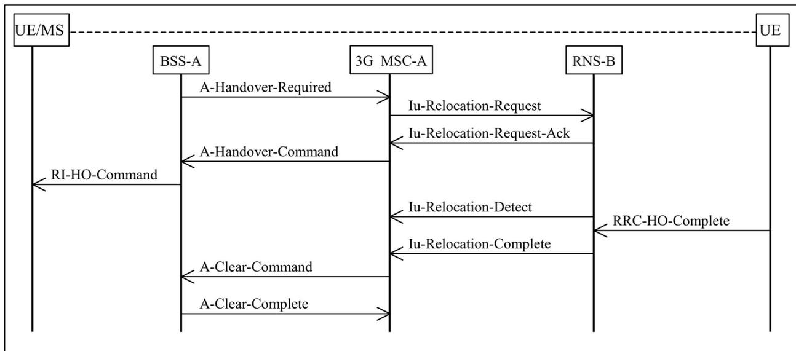

```

sequenceDiagram
    participant UE/MS
    participant BSS-A
    participant 3G_MSC-A as 3G MSC-A
    participant RNS-B
    participant UE

    Note left of UE/MS: UE/MS
    Note right of UE: UE

    BSS-A->>3G_MSC-A: A-Handover-Required
    3G_MSC-A->>RNS-B: Iu-Relocation-Request
    RNS-B-->>3G_MSC-A: Iu-Relocation-Request-Ack
    3G_MSC-A->>BSS-A: A-Handover-Command
    BSS-A->>UE/MS: RI-HO-Command
    RNS-B->>UE: RRC-HO-Complete
    UE-->>RNS-B: 
    RNS-B->>3G_MSC-A: Iu-Relocation-Detect
    3G_MSC-A->>RNS-B: Iu-Relocation-Complete
    3G_MSC-A->>BSS-A: A-Clear-Command
    BSS-A-->>3G_MSC-A: A-Clear-Complete
  
```

Sequence diagram of Basic External Intra-3G\_MSC GSM to UMTS Handover Procedure. Lifelines: UE/MS, BSS-A, 3G MSC-A, RNS-B, UE. The sequence shows the flow of messages for handover from GSM to UMTS via an external MSC.

**Figure 9: Basic External Intra-3G\_MSC GSM to UMTS Handover Procedure**

The successful operation of the procedure is as follows. When the BSS (BSS-A), currently supporting the UE, determines that the UE requires to be handed over to UMTS it will send an A-HANDOVER-REQUIRED message to the 3G\_MSC (3G\_MSC-A). The A-HANDOVER-REQUIRED message shall contain a single cell, to which the UE can be handed over. When the 3G\_MSC-A receives the A-HANDOVER-REQUIRED message it shall begin the process of handing over the UE to a new RNS (RNS-B). The 3G\_MSC-A shall generate an Iu-RELOCATION-REQUEST message to the selected RNS (RNS-B). For handover of a speech call to UTRAN Iu mode, 3G\_MSC-A shall include a NAS Synch Indicator in the Iu-RELOCATION-REQUEST message.

If 3G\_MSC-A supports inter-system handover to a CSG cell and BSS-A includes a CSG ID for the target cell in the A-HANDOVER-REQUIRED message, then 3G\_MSC-A shall check the CSG membership of the UE for the target cell as described in subclause 4.3.1 before generating the Iu-RELOCATION-REQUEST message. If the UE fails the CSG membership check and the target cell is a CSG cell, 3G\_MSC-A shall send an A-HANDOVER-REQUIRED-REJECT to BSS-A.

When RNS-B receives the Iu-RELOCATION-REQUEST message it shall take the necessary action to allow the UE to access the radio resource of RNS-B, this is detailed in the 3GPP TS 25.300 series and the 3GPP TS 25.200 series of 3GPP Technical Specifications. The switching of the radio resource through the necessary terrestrial resources is detailed in the 3GPP TS 25.430 series and 3GPP TS 25.413 [11].

Once resource allocation has been completed by RNS-B, it shall return an Iu-RELOCATION-REQUEST-ACK. to 3G\_MSC-A. When this message is received by 3G\_MSC-A it shall begin the process of instructing the UE to tune to a new dedicated radio resource. An A-HANDOVER-COMMAND will be sent by the 3G\_MSC-A to BSS-A. On receipt of the A-HANDOVER-COMMAND message BSS-A will send the radio interface message RI-HANDOVER-COMMAND. The UE will then access the new radio resource. On detection of the UE, the RNS-B shall send an Iu-RELOCATION-DETECT to 3G\_MSC-A. When the UE is successfully communicating with the RNS-B an RRC-HANDOVER-COMPLETE message will be sent by the UE to RNS-B. The RNS-B will then send an Iu-RELOCATION-COMPLETE message to 3G\_MSC-A.

**NOTE:** The Iu-RELOCATION-REQUEST-ACK from RNS-B contains the complete RRC message that shall be sent by BSS-A to the MS in the RI-HANDOVER-COMMAND, 3G\_MSC-A transparently passes this radio interface message onto BSS-A.

After 3G\_MSC-A has received the Iu-RELOCATION-COMPLETE message from RNS-B, it shall begin to release the resources allocated on BSS-A. In figure 9 the resource is released by using the A-CLEAR-COMMAND sequence.

If a failure occurs during the handover attempt, for example, A-HANDOVER-FAILURE returned from BSS-A or Iu-RELOCATION FAILURE returned from RNS-B, then 3G\_MSC-A will terminate the handover to RNS-B. Under these conditions 3G\_MSC-A may optionally take one of a number of actions:

- i) await the next A-HANDOVER-REQUIRED message;

- ii) send an A-HANDOVER-REQUIRED-REJECT to BSS-A, if an A-HANDOVER-COMMAND has not already been sent.

The exact action taken is dependent on whether the failure occurs before or after the A-HANDOVER-COMMAND has been sent.

In all cases the existing connection to the UE shall not be cleared except in the case of expiry of the timer for receipt of Iu-RELOCATION-COMPLETE.

During the period that the UE is not in communication with the network 3G\_MSC-A shall queue all appropriate messages. All messages shall be delivered to the UE once communication is resumed. In the case of an Intra-3G\_MSC GSM to UMTS handover on 3G\_MSC-B then the messages shall be queued by 3G\_MSC-B.

### 6.2.3 Procedure for Intra-3G\_MSC SRNS Relocation

The procedure for a successful Intra-3G\_MSC SRNS Relocation is shown in figures 10 and 11. For a successful Intra-3G\_MSC Enhanced SRNS Relocation the procedure is shown in figures 11a and 11b. SRNS Relocation and Enhanced SRNS Relocation are used to relocate the serving RNS functionality from one RNS to another. The procedures may or may not involve change of the radio resources assigned for the corresponding UE. Whether or not the Relocation includes change of radio resources assigned for the UE does not affect the SRNS Relocation procedure or Enhanced SRNS Relocation procedure in the Core Network.

In case of subsequent Intra-3G\_MSC-B SRNS relocation or Intra-3G\_MSC-B Enhanced SRNS relocation the following applies:

- If 3G\_MSC-B has previously received an order to perform location reporting at change of Service Area from 3G\_MSC-A and if 3G\_MSC-B also supports Location Reporting Control, it shall issue the Iu-LOCATION-REPORTING-CONTROL message towards the target RNS immediately after successful completion of relocation. Upon receipt of Iu-LOCATION-REPORT, 3G\_MSC-B shall forward it towards 3G\_MSC-A via E interface.

If 3G\_MSC-B supports location reporting at change of Service Area and if encapsulated BSSAP signalling is used on the E-interface, 3G\_MSC-B shall always initiate the Location Reporting Control procedure at change of Service Area towards the target RNS, since no request for Location Reporting can be received from MSC-A. In that case, if an SRNS relocation is used, the Location Reporting Control procedure shall be initiated by 3G\_MSC-B after the Relocation Resource Allocation procedure has been executed successfully; otherwise 3G\_MSC-B shall initiate the Location Reporting Control procedure when the completion of the Enhanced SRNS Relocation has been confirmed by the target RNS. The change of Service Area shall be reported to MSC-A within an A-HANDOVER-PERFORMED message.

It is assumed that selection of a candidate UE has already taken place within RNS based upon the criteria presenting in clause 5. The exact algorithm, in RNS, for determining a candidate UE is not addressed in the present document. The procedure discussed does not make use of the Mobile Application Part (MAP), represented by signalling function 4 in figures 4 and 6. The procedure described in this clause covers case ii).

![Sequence diagram for Figure 10: Basic intra-3G_MSC SRNS Relocation Procedure. The diagram shows message flow between UE, RNS-A, 3G_MSC-A, RNS-B, and UE. RNS-A sends Iu-Relocation-Required to 3G_MSC-A. 3G_MSC-A sends Iu-Relocation-Request to RNS-B. RNS-B responds with Iu-Relocation-Request-Ack. 3G_MSC-A sends Iu-Relocation-Command to RNS-A. RNS-A sends Iur-SRNC-Relocation-Commit to RNS-B. RNS-B sends Iu-Relocation-Detect and then Iu-Relocation-Complete to 3G_MSC-A. 3G_MSC-A sends Iu-Release-Command to RNS-A, which responds with Iu-Release-Complete.](2837ffdadcdb1e5bababa56b564e56ed_img.jpg)

```

sequenceDiagram
    participant UE_L as UE
    participant RNS_A as RNS-A
    participant MSC as 3G_MSC-A
    participant RNS_B as RNS-B
    participant UE_R as UE

    RNS_A->>MSC: Iu-Relocation-Required
    MSC->>RNS_B: Iu-Relocation-Request
    RNS_B-->>MSC: Iu-Relocation-Request-Ack
    MSC->>RNS_A: Iu-Relocation-Command
    RNS_A->>RNS_B: Iur-SRNC-Relocation-Commit
    RNS_B-->>MSC: Iu-Relocation-Detect
    RNS_B-->>MSC: Iu-Relocation-Complete
    MSC->>RNS_A: Iu-Release-Command
    RNS_A->>MSC: Iu-Release-Complete
  
```

Sequence diagram for Figure 10: Basic intra-3G\_MSC SRNS Relocation Procedure. The diagram shows message flow between UE, RNS-A, 3G\_MSC-A, RNS-B, and UE. RNS-A sends Iu-Relocation-Required to 3G\_MSC-A. 3G\_MSC-A sends Iu-Relocation-Request to RNS-B. RNS-B responds with Iu-Relocation-Request-Ack. 3G\_MSC-A sends Iu-Relocation-Command to RNS-A. RNS-A sends Iur-SRNC-Relocation-Commit to RNS-B. RNS-B sends Iu-Relocation-Detect and then Iu-Relocation-Complete to 3G\_MSC-A. 3G\_MSC-A sends Iu-Release-Command to RNS-A, which responds with Iu-Release-Complete.

**Figure 10: Basic intra-3G\_MSC SRNS Relocation Procedure**

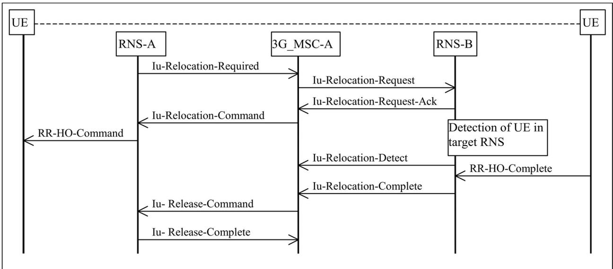

```

sequenceDiagram
    participant UE_L as UE
    participant RNS_A as RNS-A
    participant MSC as 3G_MSC-A
    participant RNS_B as RNS-B
    participant UE_R as UE

    RNS_A->>MSC: Iu-Relocation-Required
    MSC->>RNS_B: Iu-Relocation-Request
    RNS_B-->>MSC: Iu-Relocation-Request-Ack
    MSC->>RNS_A: Iu-Relocation-Command
    RNS_A->>UE_L: RR-HO-Command
    Note over RNS_B: Detection of UE in target RNS
    RNS_B-->>MSC: Iu-Relocation-Detect
    UE_R->>RNS_B: RR-HO-Complete
    RNS_B-->>MSC: Iu-Relocation-Complete
    MSC->>RNS_A: Iu-Release-Command
    RNS_A->>MSC: Iu-Release-Complete
  
```

Sequence diagram for Figure 11: Basic intra-3G\_MSC SRNS Relocation Procedure combined with hard change of radio resources. Similar to Figure 10, but includes RR-HO-Command from RNS-A to UE, a detection event at RNS-B, and RR-HO-Complete from UE to RNS-B.

**Figure 11: Basic intra-3G\_MSC SRNS Relocation Procedure combined with hard change of radio resources (Hard Handover with switch in the Core Network)**

![Sequence diagram for Figure 11a: Basic intra-3G_MSC Enhanced SRNS Relocation Procedure. The diagram shows the interaction between a UE, RNS-A, 3G_MSC-A, and RNS-B. The sequence of messages is: 1. RNS-A sends an Iur-Enhanced Relocation Request to RNS-B. 2. RNS-B sends an Iur-Enhanced Relocation Response to RNS-A. 3. RNS-A sends an Iu-Enhanced Relocation Complete Request to 3G_MSC-A. 4. 3G_MSC-A sends an Iu-Enhanced Relocation Complete Response to RNS-A. 5. RNS-A sends an Iu-Enhanced Relocation Complete Confirm to 3G_MSC-A. 6. 3G_MSC-A sends an Iu-Release-Command to RNS-A. 7. RNS-A sends an Iu-Release-Complete to 3G_MSC-A.](78ff716475b2f65bf01c3a4d02d89fc4_img.jpg)

```

sequenceDiagram
    participant UE
    participant RNS-A
    participant 3G_MSC-A
    participant RNS-B
    Note left of UE: UE
    RNS-A->>RNS-B: Iur-Enhanced Relocation Request
    RNS-B-->>RNS-A: Iur-Enhanced Relocation Response
    RNS-A->>3G_MSC-A: Iu-Enhanced Relocation Complete Request
    3G_MSC-A-->>RNS-A: Iu-Enhanced Relocation Complete Response
    RNS-A->>3G_MSC-A: Iu-Enhanced Relocation Complete Confirm
    3G_MSC-A->>RNS-A: Iu-Release-Command
    RNS-A-->>3G_MSC-A: Iu-Release-Complete
  
```

Sequence diagram for Figure 11a: Basic intra-3G\_MSC Enhanced SRNS Relocation Procedure. The diagram shows the interaction between a UE, RNS-A, 3G\_MSC-A, and RNS-B. The sequence of messages is: 1. RNS-A sends an Iur-Enhanced Relocation Request to RNS-B. 2. RNS-B sends an Iur-Enhanced Relocation Response to RNS-A. 3. RNS-A sends an Iu-Enhanced Relocation Complete Request to 3G\_MSC-A. 4. 3G\_MSC-A sends an Iu-Enhanced Relocation Complete Response to RNS-A. 5. RNS-A sends an Iu-Enhanced Relocation Complete Confirm to 3G\_MSC-A. 6. 3G\_MSC-A sends an Iu-Release-Command to RNS-A. 7. RNS-A sends an Iu-Release-Complete to 3G\_MSC-A.

Figure 11a: Basic intra-3G\_MSC Enhanced SRNS Relocation Procedure

![Sequence diagram for Figure 11b: Basic intra-3G_MSC Enhanced SRNS Relocation Procedure combined with hard change of radio resources (Hard Handover with switch in the Core Network). This diagram extends Figure 11a by adding UE interaction. 1. RNS-A sends an RR-HO-Command to the UE. 2. The UE sends an RR-HO-Complete to RNS-B. The core network messages (Iur-Enhanced Relocation Request, Iur-Enhanced Relocation Response, Iu-Enhanced Relocation Complete Request, Iu-Enhanced Relocation Complete Response, Iu-Enhanced Relocation Complete Confirm, Iu-Release-Command, Iu-Release-Complete) follow the same sequence as in Figure 11a.](b2f5606b9c7184c1c6070a290080a3e3_img.jpg)

```

sequenceDiagram
    participant UE
    participant RNS-A
    participant 3G_MSC-A
    participant RNS-B
    Note left of UE: UE
    RNS-A->>UE: RR-HO-Command
    UE-->>RNS-B: RR-HO-Complete
    RNS-A->>RNS-B: Iur-Enhanced Relocation Request
    RNS-B-->>RNS-A: Iur-Enhanced Relocation Response
    RNS-A->>3G_MSC-A: Iu-Enhanced Relocation Complete Request
    3G_MSC-A-->>RNS-A: Iu-Enhanced Relocation Complete Response
    RNS-A->>3G_MSC-A: Iu-Enhanced Relocation Complete Confirm
    3G_MSC-A->>RNS-A: Iu-Release-Command
    RNS-A-->>3G_MSC-A: Iu-Release-Complete
  
```

Sequence diagram for Figure 11b: Basic intra-3G\_MSC Enhanced SRNS Relocation Procedure combined with hard change of radio resources (Hard Handover with switch in the Core Network). This diagram extends Figure 11a by adding UE interaction. 1. RNS-A sends an RR-HO-Command to the UE. 2. The UE sends an RR-HO-Complete to RNS-B. The core network messages (Iur-Enhanced Relocation Request, Iur-Enhanced Relocation Response, Iu-Enhanced Relocation Complete Request, Iu-Enhanced Relocation Complete Response, Iu-Enhanced Relocation Complete Confirm, Iu-Release-Command, Iu-Release-Complete) follow the same sequence as in Figure 11a.

Figure 11b: Basic intra-3G\_MSC Enhanced SRNS Relocation Procedure combined with hard change of radio resources (Hard Handover with switch in the Core Network)

#### 6.2.3.1 With no bearer or one bearer

##### 6.2.3.1.1 SRNS Relocation

The successful operation of the SRNS Relocation procedure is as follows. When the Serving RNS (RNS-A) makes the decision to perform the SRNS Relocation procedure it will send an IU-RELOCATION-REQUIRED message to the 3G\_MSC (3G\_MSC-A). The IU-RELOCATION-REQUIRED message shall contain the identifier of the target RNS to which the Relocation is to be performed. When the 3G\_MSC-A receives the IU-RELOCATION-REQUIRED message it shall begin the process of relocating the serving RNS functionality to the new RNS (RNS-B). The 3G\_MSC-A shall generate an IU-RELOCATION-REQUEST message to the selected RNS (RNS-B). For the relocation of a speech call to UTRAN Iu mode, 3G\_MSC-A shall include the NAS Synch Indicator in the IU-RELOCATION-REQUEST, if the Iu Selected codec to be used after the relocation is different from the Iu Currently used codec.

If 3G\_MSC-A supports SRNS Relocation to a CSG cell and RNS-A includes a CSG ID for the target cell in the IU-RELOCATION-REQUIRED message, then 3G\_MSC-A shall check the CSG membership of the UE for the target cell as described in subclause 4.3.1 before generating the IU-RELOCATION-REQUEST message. If the UE fails the CSG membership check and the target cell is a CSG cell, 3G\_MSC-A shall send an IU-RELOCATION-PREPARATION-FAILURE to RNS-A.

When RNS-B receives the IU-RELOCATION-REQUEST message it shall take the necessary action to establish the new Iu transport bearers for each Radio Access Bearer related to 3G\_MSC-A for the UE in question, this is detailed in the 3GPP TS 25.430 series and 3GPP TS 25.413 [11].

Once resource allocation has been completed by RNS-B it shall return an IU-RELOCATION-REQUEST-ACKNOWLEDGE to 3G\_MSC-A. When this message is received by 3G\_MSC-A, and 3G\_MSC-A is ready for the move in Serving RNS functionality, it shall indicate the completion of the preparation phase on the core network side for the SRNS Relocation. An IU-RELOCATION-COMMAND message is sent by 3G\_MSC-A to RNS-A. RNS-A acts as follows:

- i) if the procedure is a SRNS Relocation without change of radio resources, which means that the Iur interface between RNS-A and RNS-B can be used for the procedure, the RNS-A shall send IUR-SRNS-RELOCATION-COMMIT message to the RNS-B to trigger the Relocation execution. See figure 10.
- ii) if the procedure is a SRNS Relocation with change of radio resources, which means that the Iur interface between RNS-A and RNS-B is not used for the procedure, the RNS-A shall trigger the handover procedure on the air interface by sending the RRC-HANDOVER-COMMAND to the UE. The UE will then access the new radio resources. See figure 11.

NOTE: The IU-RELOCATION-REQUEST-ACKNOWLEDGE from RNS-B may optionally contain a transparent container, which is transferred by 3G\_MSC-A to the RNS-A using the IU-RELOCATION-COMMAND message.

When the relocation execution trigger is received, RNS-B shall then take the necessary action to assume the role of Serving RNS and shall send an IU-RELOCATION-DETECT message to 3G\_MSC-A. When the UE is successfully in communication with the RNS-B, then RNS-B shall send an IU-RELOCATION-COMPLETE message to 3G\_MSC-A.

After 3G\_MSC-A has received the IU-RELOCATION-COMPLETE message from RNS-B, it shall begin to release the resources associated to the RNS-A. In figures 10 and 11, the resources are released by using the IU-RELEASE-COMMAND sequence.

If a failure occurs during the SRNS Relocation attempt, then 3G\_MSC-A will terminate the relocation to RNS-B. For example, if IU-RELOCATION-FAILURE is returned from RNS-B then 3G\_MSC-A will terminate the relocation to RNS-B and send IU-RELOCATION-PREPARATION-FAILURE to RNS-A. If IU-RELOCATION-CANCEL is returned from RNS-A, then 3G\_MSC-A will terminate the relocation to RNS-B and send IU-RELOCATION-CANCEL-ACKNOWLEDGE to RNS-A.

In all cases the existing connection to the UE shall not be cleared except in the case of expiry of the timer for receipt of IU-RELOCATION-COMPLETE.

During the period that the UE is not in communication with the network, 3G\_MSC-A shall queue all appropriate messages. All messages shall be delivered to the UE once communication is resumed. In the case of an Intra-3G\_MSC SRNS Relocation (with or without change of radio resources) on 3G\_MSC-B, then the messages shall be queued by 3G\_MSC-B.

##### 6.2.3.1.2 Enhanced SRNS Relocation

The successful operation of the Enhanced SRNS Relocation procedure is as follows. When the Serving RNS (RNS-A) makes the decision to perform the Enhanced SRNS Relocation procedure it will send an IUR-ENHANCED-RELOCATION-REQUEST message to the new RNS (RNS-B). The IUR-ENHANCED RELOCATION-REQUEST message shall contain the necessary information to set up a CS Radio Access Bearer in RNS-B.

When RNS-B receives the IUR-ENHANCED-RELOCATION-REQUEST message it shall take the necessary actions to establish the new Iu transport bearers for the Radio Access Bearer related to 3G\_MSC-A for the UE in question, as described in detail in the 3GPP TS 25.430 series and 3GPP TS 25.413 [11], and the new transport bearers for the Radio Access Bearer related to RNS-A, to enable data forwarding. RNS-B shall initialize the Iu UP towards RNS A, if necessary.

Once resource allocation has been completed by RNS-B it shall return an IUR-ENHANCED-RELOCATION-RESPONSE message to RNC-A. If the resources cannot be allocated, RNS-B returns an IUR-ENHANCED-RELOCATION-FAILURE message to RNS-A, and RNS-A terminates the procedure.

After transmission of the IUR-ENHANCED-RELOCATION-RESPONSE message RNS-B and RNS-A act as follows:

- i) If the procedure is an Enhanced SRNS Relocation without change of radio resources, RNS-B shall send an IU-ENHANCED RELOCATION-COMPLETE-REQUEST message to 3G\_MSC-A and start data forwarding towards RNS-A for UL data. After receipt of the IUR-ENHANCED-RELOCATION-RESPONSE message RNS-A shall start data forwarding towards RNS-B for DL data. See figure 11a.
- ii) If the procedure is an Enhanced SRNS Relocation with change of radio resources, when RNS-A receives the IUR-ENHANCED-RELOCATION-RESPONSE message, it shall trigger the handover procedure on the air interface by sending the RRC-HANDOVER-COMMAND to the UE and start data forwarding towards RNS-B for DL data. The UE will then access the new radio resources. When the UE is successfully in communication with the RNS-B, then RNS-B shall start data forwarding towards RNS-A for UL data and send an IU-ENHANCED RELOCATION-COMPLETE-REQUEST message to 3G\_MSC-A. See figure 11b.

After 3G\_MSC-A has received the IU-ENHANCED-RELOCATION-COMPLETE-REQUEST message from RNS-B, it shall start to configure the necessary Iu resources for the RNS-B and send the IU-ENHANCED-RELOCATION-COMPLETE-RESPONSE message to RNS-B. If the necessary resources cannot be allocated or a failure occurs in 3G\_MSC-A, it shall send an IU-ENHANCED-RELOCATION-COMPLETE-FAILURE message to RNS-B.

After RNC-B has received the IU-ENHANCED-RELOCATION-COMPLETE-RESPONSE message, it shall start to configure the Iu transport bearer for each Radio Access Bearer between the MSC-A and RNC-B and perform Iu UP initialization, if necessary. After the completion of the Iu UP initialization, RNS-B shall send an IU-ENHANCED-RELOCATION-COMPLETE-CONFIRM message to 3G\_MSC-A.

After 3G\_MSC-A has received the IU-ENHANCED-RELOCATION-COMPLETE-CONFIRM message from RNS-B, it shall begin to release the resources associated to the RNS-A. In figures 11a and 11b, the resources are released by using the IU-RELEASE-COMMAND sequence.

#### 6.2.3.2 With multiple bearers (Optional functionality)

If 3G\_MSC-A supports the optional supplementary service Multicall (See 3GPP TS 23.135 [17]), 3G\_MSC-A shall have the following functionality additionally to the description in subclause 6.2.3.1.

For SRNS Relocation, upon receipt of the IU-RELOCATION-REQUIRED from RNS-A, 3G\_MSC-A generates an IU-RELOCATION-REQUEST message, which may include multiple bearers, to RNS-B.

When an IU-RELOCATION-REQUEST-ACK is received from RNS-B, 3G\_MSC-A sends IU-RELOCATION-COMMAND, which indicates the bearers failed to set up in RNS-B as bearers to be released, to RNS-A.

After 3G\_MSC-A receives a IU-RELOCATION-COMPLETE message from RNS-B, 3G\_MSC-A shall release the calls via RNS-B, which have been carried by the bearers failed to set up in RNS-B, and then sends IU-RELEASE-COMMAND to RNS-A.

For Enhanced SRNS Relocation, RNC-A generates an IUR-ENHANCED-RELOCATION-REQUEST message, which may include multiple bearers, to RNS-B. If resources for at least one bearer are reserved in RNS-B, RNS-B shall return an IUR-ENHANCED-RELOCATION-RESPONSE message, which indicates the bearers failed to set up in RNS-B as bearers to be released, to RNC-A.

When the UE is successfully in communication with the RNS-B, then RNS-B shall send an IU-ENHANCED-RELOCATION-COMPLETE-REQUEST message, which indicates the bearers failed to set up in RNS-B as bearers to be released, to 3G\_MSC-A.

After 3G\_MSC-A receives the IU-ENHANCED-RELOCATION-COMPLETE-REQUEST message from RNS-B, 3G\_MSC-A shall release the calls via RNS-B, which have been carried by the bearers failed to set up in RNS-B, and then sends IU-RELEASE-COMMAND to RNS-A.

## 6.3 Internal Handover with MSC Support for Intra-BSS handover with AoIP

### 6.3.1 General Description of Internal Handover with MSC Support

If the A-Interface User Plane is carried over IP (or shall be handed over to IP) and one or more of the A-Interface User Plane parameters need to be modified, for example the Codec Type, or the Codec Configuration (BSS determines that no compatible Codec Type or Codec Configuration exists for the target cell), or the IP Transport Layer Address, or the UDP Port, or the CSData Redundancy Level, or the A-Interface Type itself (e.g. from TDM to IP or vice versa), then a "BSS Internal Handover with MSC support" shall be performed (see 3GPP TS 48.008 [5] subclause 3.1.5c.1).

The "BSS Internal Handover with MSC support" for AoIP is performed by the MSC that is currently serving the connected BSS (in the following just termed "serving MSC"); it may be either MSC-A, MSC-B, 3G\_MSC-A or 3G\_MSC-B.

NOTE: The "BSS Internal Handover with MSC support" involves the serving MSC actively in the handover. It is therefore in average slower and more resource demanding than the BSS Internal Handover without MSC support. In order to guarantee a high radio network performance the MSC needs to react quickly and handle this handover with high priority.

The "BSS Internal Handover with MSC support" applies only if both BSS and Core Network support the AoIP procedures and messages, and an A-Interface User Plane connection has been established beforehand. The procedures and messages for this "BSS Internal Handover with MSC support" are described in 3GPP TS 48.008 [5].

The "BSS Internal Handover with MSC Support" can be initiated either:

- by the BSS, by sending the A-INTERNAL-HANDOVER-REQUIRED message; or
- by the serving MSC, by sending the A-INTERNAL-HANDOVER-ENQUIRY message.

### 6.3.2 BSS-initiated Internal Handover with MSC Support

The BSS-initiated "BSS Internal Handover with MSC Support" starts with an A-INTERNAL-HANDOVER-REQUIRED message from the BSS to the serving MSC, for further details see 3GPP TS 48.008 [5], subclause 3.1.5c. An example sequence is shown in figure 6.3.2.1

![Sequence diagram of BSS-initiated Internal Handover Execution. The diagram shows three participants: MS (Mobile Station), BSS-A (Base Station System), and Serving MSC (Mobile Switching Center). The sequence of messages is: 1. BSS-A sends A-INTERNAL-HANDOVER-REQUIRED to Serving MSC. 2. Serving MSC sends A-INTERNAL-HANDOVER-COMMAND to BSS-A. 3. BSS-A sends RI-HO-Command to MS. 4. MS sends RI-HO-Access to BSS-A. 5. BSS-A sends A-HANDOVER-DETECT to Serving MSC. 6. MS sends RI-HO-Complete to BSS-A. 7. BSS-A sends A-HANDOVER-COMPLETE to Serving MSC.](6757222e979ee95c44354a897c5cc1c1_img.jpg)

```

sequenceDiagram
    participant MS
    participant BSS-A
    participant Serving MSC
    Note left of MS: MS
    BSS-A->>Serving MSC: A-INTERNAL-HANDOVER-REQUIRED
    Serving MSC-->>BSS-A: A-INTERNAL-HANDOVER-COMMAND
    BSS-A->>MS: RI-HO-Command
    MS->>BSS-A: RI-HO-Access
    BSS-A->>Serving MSC: A-HANDOVER-DETECT
    MS->>BSS-A: RI-HO-Complete
    BSS-A->>Serving MSC: A-HANDOVER-COMPLETE
  
```

Sequence diagram of BSS-initiated Internal Handover Execution. The diagram shows three participants: MS (Mobile Station), BSS-A (Base Station System), and Serving MSC (Mobile Switching Center). The sequence of messages is: 1. BSS-A sends A-INTERNAL-HANDOVER-REQUIRED to Serving MSC. 2. Serving MSC sends A-INTERNAL-HANDOVER-COMMAND to BSS-A. 3. BSS-A sends RI-HO-Command to MS. 4. MS sends RI-HO-Access to BSS-A. 5. BSS-A sends A-HANDOVER-DETECT to Serving MSC. 6. MS sends RI-HO-Complete to BSS-A. 7. BSS-A sends A-HANDOVER-COMPLETE to Serving MSC.

Figure 6.3.2.1: BSS-Initiated Internal Handover Execution

The A-INTERNAL-HANDOVER-REQUIRED message contains a reason for the required handover and the currently valid Codec List (BSS Supported). It shall also contain an AoIP Transport Layer Address and UDP Port, if the BSS requires an IP-based target User Plane. The Codec List (BSS supported) contains the key requirements from the BSS,

like target Codec Type(s), target Codec Configuration(s) and target A-interface Type(s) (TDM and/or IP), and may contain the required Redundancy Level for CSData, etc.

When sending the A-INTERNAL-HANDOVER-REQUIRED message the BSS starts a timer "T25" (3GPP TS 48.008 [5]) and it expects an answer from the serving MSC within that timer period. If "T25" (3GPP TS 48.008 [5]) expires before the MSC has answered, then the BSS ignores any subsequent (late) answer from the serving MSC after expiry of timer "T25" (3GPP TS 48.008 [5]). The BSS will not send any new A-INTERNAL-HANDOVER-REQUIRED message before timer "T25" (3GPP TS 48.008 [5]) has expired or before the Internal Handover Preparation is terminated by other reasons.

When the serving MSC receives the A-INTERNAL-HANDOVER-REQUIRED message it shall start timer T105 (see subclause 9.3A). The serving MSC shall not send any answer to the BSS after timer T105 has expired. Both timers ("T25" – 3GPP TS 48.008 [5] and T105) shall be configured (by O&M) to minimise the likelihood that the answer from serving MSC to BSS crosses with a new or repeated A-INTERNAL-HANDOVER-REQUIRED message from the BSS to the serving MSC, i.e. the timer T105 shall always expire before "T25" (3GPP TS 48.008 [5]) expires.

If the serving MSC is able to fulfil the required "BSS Internal Handover with MSC Support", then it shall generate and send an A-INTERNAL-HANDOVER-COMMAND message to the BSS and stop timer T105. This answer shall contain the exact new A-Interface User Plane parameters, e.g. Codec Type, Codec Configuration, A-Interface Type, either TDM Circuit Identity Code or IP Transport Layer Address and UDP Port (see 3GPP TS 48.008 [5]). While T25 is still running the BSS can either accept or reject the A-INTERNAL-HANDOVER-COMMAND.

When the BSS receives the A-INTERNAL-HANDOVER-COMMAND message it takes the necessary action to allow the MS to access the radio resource of the new cell in BSS, this is detailed in 3GPP TS 48.058 [6] and in 3GPP TS 45.008 [4]. The switching of the radio resource through the necessary terrestrial resources is detailed in 3GPP TS 44.018 [28] and 3GPP TS 48.008 [5]. On receipt of the A-INTERNAL-HANDOVER-COMMAND message the BSS will send e.g. the radio interface message RI-HANDOVER-COMMAND, containing a Handover Reference number previously allocated to the MS. The MS will then access the new radio resource using the Handover Reference number contained in the RI-HANDOVER-ACCESS message. The number will be checked by BSS to ensure it is as expected and the correct MS has been captured.

As BSS and MS proceed with the handover the BSS may send an A-HANDOVER-DETECT message to the serving MSC to enable fast User Plane switching on the Core Network side. As soon as the MS and BSS have completed the handover the BSS send an A-HANDOVER-COMPLETE message to serving MSC. Both BSS and serving MSC will then release the no longer needed BSS and Core Network resources.

If the serving MSC is unable to support the required Internal Handover due to whatever reason then it shall send an A-INTERNAL-HANDOVER-REQUIRED-REJECT message to the BSS (if T105 has not expired already). The serving MSC shall not send an A-INTERNAL-HANDOVER-REQUIRED-REJECT message after an A-INTERNAL-HANDOVER-COMMAND has been sent to the BSS.

If a failure occurs during the handover attempt and the BSS sends an A-HANDOVER-FAILURE message, then the serving MSC shall terminate the handover and shall revert back to using the resources used before the handover attempt was made.

The serving MSC shall supervise the "BSS Internal Handover with MSC Support" procedure after sending the A-INTERNAL-HANDOVER-COMMAND using the same timer (T102) as used for Intra-MSC handover, see subclauses 9.3 and 11.3.

In all cases the existing connection to the MS shall not be cleared, except in the case of expiry of the timer T102 before receipt of A-HANDOVER-COMPLETE.

Whilst the MS is not in communication with the Core Network (i.e. in the time span between sending of A-INTERNAL-HANDOVER-COMMAND and the reception of A-HANDOVER-COMPLETE or an A-HANDOVER-FAILURE) the serving MSC shall queue all appropriate messages towards the MS. All these messages shall be delivered to the MS once the communication is resumed.

For the case of subsequent Intra-BSS handover with support from MSC-B or 3G\_MSC-B the following applies:

After successful completion of the Intra-BSS handover, if MSC-B/3G\_MSC-B received the AoIP-Supported Codecs List (Anchor), MSC-B/3G\_MSC-B may send the new AoIP-Selected Codec (Target) and AoIP-Available Codecs List (MAP) to MSC-A/3G\_MSC-A in the MAP-PROCESS-ACCESS-SIGNALLING request transporting the A-HANDOVER-PERFORMED message, if the following conditions are fulfilled: MSC-B/3G\_MSC-B created a Codec

List (MSC preferred) from the AoIP-Supported Codecs List (Anchor) received from MSC-A/3G\_MSC-A, the BSS uses A interface over IP and the BSS does not insert a transcoder.

### 6.3.3 MSC-initiated BSS Internal Handover with MSC Support

During a call the MSC may request to modify the A-Interface User Plane, for example to change the Codec Type or Codec Configuration on the A-Interface to optimise end-to-end speech quality by avoiding transcoding.

The serving MSC may initiate a "BSS Internal Handover with MSC Support" by sending an A-INTERNAL-HANDOVER-ENQUIRY message to the BSS containing, within the Speech Codec (MSC Chosen) IE, the serving MSC's preferred speech Codec Type and Codec Configuration and A-Interface Type.

If accepted by the BSS, the BSS responds with an A-INTERNAL-HANDOVER-REQUIRED message, as described in subclause 6.3.2, with reason "Response to an INTERNAL HANDOVER ENQUIRY". Then the "BSS Internal Handover with MSC Support" may start.

If the BSS does not accept the A-INTERNAL-HANDOVER-ENQUIRY message, then it returns an A-HANDOVER-FAILURE message to the serving MSC.

# --- 7 General description of the procedures for inter - MSC handovers

The following clauses describe two options for the Basic and Subsequent Handover procedures. The first, as described in subclauses 7.1 and 7.3 respectively, provides for a circuit connection between MSC-A and MSC-B. The second, as described in subclauses 7.2 and 7.4 respectively, provides for a Basic and Subsequent Handover without the provision of a circuit connection between MSC-A and MSC-B.

In all the above mentioned clauses, the following principles apply:

- a) during the handover resource allocation, except for the messages explicitly indicated in b and c below, only the handover related messages that are part of the applicable BSSAP subset - as defined in 3GPP TS 49.008 [7] - shall be transferred on the E-interface;
- b) the trace related messages that are part of the applicable BSSAP subset - as defined in 3GPP TS 49.008 [7] - can be sent by the MSC-A on the E-interface after successful handover resource allocation. In subclauses 7.1 and 7.2, it is however allowed at basic handover initiation on the E-Interface to transfer one trace related message that is part of the applicable BSSAP subset - as defined in 3GPP TS 49.008 [7] - together with the applicable handover related message. The applicable handover related message shall always appear as the first message;
- c) during the handover resource allocation for subsequent inter-MSC handover according to subclauses 7.3 and 7.4, it is allowed to transfer either DTAP or RANAP Direct Transfer messages on the E-Interface between MSC-A and MSC-B. RANAP Direct Transfer messages shall be used for this purpose if and only if the basic handover procedure was an inter MSC SRNS relocation;
- d) during the handover execution, ie while the MS is not in communication with the network, the MSC-A shall queue all outgoing BSSAP or RANAP messages until the communication with the MS is resumed;
- e) during the execution of a basic inter-MSC handover to MSC-B or a subsequent inter-MSC handover to a third MSC-B', only the handover related messages and the A-Clear-Request message that are part of the applicable BSSAP subset - as defined in 3GPP TS 49.008 [7] - may be sent by the target MSC on the E-interface;
- f) during a subsequent inter-MSC handover back to MSC-A or to a third MSC-B', MSC-B may initiate either an Iu-Release-Request procedure or an A-Clear-Request procedure on the E-interface. An Iu-Release-Request procedure shall be initiated only if the basic handover procedure was an inter-MSC SRNS relocation;
- g) finally, during supervision, ie while the MS is not in the area of MSC-A after a successful Inter-MSC handover, the subset of BSSAP procedures and their related messages - as defined in 3GPP TS 49.008 [7] - shall apply on the E-Interface. As the only exception to this rule, in case of a subsequent inter-MSC SRNS relocation back to 3G\_MSC-A or to a third 3G\_MSC-B', during the relocation resource allocation, the relocation and trace related messages that are part of the applicable RANAP subset - as defined in 3GPP TS 29.108 [15] - shall be transferred on the E-interface (see subclause 8.3, a and b).

If a subsequent inter-MSC handover/relocation back to 3G\_MSC-A or to a third 3G\_MSC-B' is cancelled, then the supervision continues, and BSSAP procedures and their related messages shall apply on the E-interface.

NOTE: A subsequent inter-MSC SRNS relocation back to 3G\_MSC-A or to a third 3G\_MSC-B' can occur, e.g., if after the basic inter-MSC handover to 3G\_MSC-B the MS performed a subsequent intra-3G\_MSC-B GSM to UMTS inter-system handover;

- h) during the intra-MSC-B handover execution, if any, the MSC-B shall queue all outgoing BSSAP messages until the communication with the MS is resumed.

## 7.1 Basic handover procedure requiring a circuit connection between MSC-A and MSC-B

The procedure used for successful Inter-MSC Handover is shown in figure 12. Initiation of the handover procedure is described in clause 5. The procedure described in this clause makes use of messages from the 3GPP TS 48.008 [5] and of the transport mechanism from the Mobile Application Part (MAP) (3GPP TS 29.002 [12]). After an Inter-MSC handover further Intra-MSC handovers may occur on MSC-B, these handovers will follow the procedures specified in the previous clause.

![Sequence diagram of the Basic Handover Procedure requiring a circuit connection between MSC-A and MSC-B. The diagram shows the interaction between MS/BSS-A, MSC-A, MSC-B, BSS-B/MS, and VLR-B. The sequence starts with A-HO-REQUIRED from MS/BSS-A to MSC-A. MSC-A sends MAP-Prep-Handover req. to MSC-B. MSC-B sends MAP-Allocate-Handover-Number req. to VLR-B. MSC-B sends A-HO-REQUEST to BSS-B/MS. BSS-B/MS sends A-HO-REQUEST-ACK to MSC-B. MSC-B sends MAP-Prep-Handover resp. to MSC-A. MSC-A sends IAM to MSC-B. MSC-B sends MAP-Send-Handover-Report req. to VLR-B. VLR-B sends MAP-Send-Handover-Report resp. (1) to MSC-B. MSC-A sends A-HO-COMMAND to MS/BSS-A. MSC-A sends ACM to MSC-B. MSC-A sends MAP-Process-Access-Sig req. to MSC-B. MSC-B sends A-HO-DETECT to BSS-B/MS. MSC-A sends A-CLR-CMD/COM to MS/BSS-A. MSC-A sends MAP-Send-End-Signal req. to MSC-B. MSC-B sends A-HO-COMPLETE to BSS-B/MS. MSC-A sends ANSWER to MSC-B. MSC-A sends RELEASE to MSC-B. MSC-A sends MAP-Send-End-Signal resp. to MSC-B. The sequence ends with End of call at MSC-A.](bc9d0c0b02cbe628b1b6548cc1107734_img.jpg)

```

sequenceDiagram
    participant MS/BSS-A
    participant MSC-A
    participant MSC-B
    participant BSS-B/MS
    participant VLR-B

    Note left of MS/BSS-A: End of call
    MS/BSS-A->>MSC-A: A-HO-REQUIRED
    MSC-A->>MSC-B: MAP-Prep-Handover req.
    MSC-B->>VLR-B: MAP-Allocate-Handover-Number req.
    MSC-B->>BSS-B/MS: A-HO-REQUEST
    BSS-B/MS-->>MSC-B: A-HO-REQUEST-ACK
    MSC-B-->>MSC-A: MAP-Prep-Handover resp.
    MSC-A-->>MSC-B: IAM
    MSC-B->>VLR-B: MAP-Send-Handover-Report req.
    VLR-B-->>MSC-B: MAP-Send-Handover-Report resp. (1)
    MSC-A->>MS/BSS-A: A-HO-COMMAND
    MSC-A-->>MSC-B: ACM
    MSC-A->>MSC-B: MAP-Process-Access-Sig req.
    MSC-B->>BSS-B/MS: A-HO-DETECT
    MSC-A->>MS/BSS-A: A-CLR-CMD/COM
    MSC-A->>MSC-B: MAP-Send-End-Signal req.
    MSC-B->>BSS-B/MS: A-HO-COMPLETE
    MSC-A-->>MSC-B: ANSWER
    MSC-A-->>MSC-B: RELEASE
    MSC-A->>MSC-B: MAP-Send-End-Signal resp.
  
```

Sequence diagram of the Basic Handover Procedure requiring a circuit connection between MSC-A and MSC-B. The diagram shows the interaction between MS/BSS-A, MSC-A, MSC-B, BSS-B/MS, and VLR-B. The sequence starts with A-HO-REQUIRED from MS/BSS-A to MSC-A. MSC-A sends MAP-Prep-Handover req. to MSC-B. MSC-B sends MAP-Allocate-Handover-Number req. to VLR-B. MSC-B sends A-HO-REQUEST to BSS-B/MS. BSS-B/MS sends A-HO-REQUEST-ACK to MSC-B. MSC-B sends MAP-Prep-Handover resp. to MSC-A. MSC-A sends IAM to MSC-B. MSC-B sends MAP-Send-Handover-Report req. to VLR-B. VLR-B sends MAP-Send-Handover-Report resp. (1) to MSC-B. MSC-A sends A-HO-COMMAND to MS/BSS-A. MSC-A sends ACM to MSC-B. MSC-A sends MAP-Process-Access-Sig req. to MSC-B. MSC-B sends A-HO-DETECT to BSS-B/MS. MSC-A sends A-CLR-CMD/COM to MS/BSS-A. MSC-A sends MAP-Send-End-Signal req. to MSC-B. MSC-B sends A-HO-COMPLETE to BSS-B/MS. MSC-A sends ANSWER to MSC-B. MSC-A sends RELEASE to MSC-B. MSC-A sends MAP-Send-End-Signal resp. to MSC-B. The sequence ends with End of call at MSC-A.

NOTE 1: Can be sent at any time after the reception of IAM.

**Figure 12: Basic Handover Procedure requiring a circuit connection**

The handover is initiated as described in subclause 6.1. (This is represented by A-HO-REQUIRED in figure 12. Upon receipt of the A-HO-REQUIRED from BSS-A, MSC-A shall send a MAP-PREPARE-HANDOVER request to MSC-B including a complete A-HO-REQUEST message.

NOTE: MSC-A shall not send further MAP-PREPARE-HANDOVER requests while a MAP-PREPARE-HANDOVER response is pending or before any timeouts.

The MAP-PREPARE-HANDOVER request shall carry in the A-HO-REQUEST all information needed by MSC-B for allocating a radio channel, see 3GPP TS 48.008 [5]. For compatibility reasons, the MAP-PREPARE-HANDOVER request will also identify the cell to which the call is to be handed over. For speech calls, MSC-A shall also include the Iu Supported Codecs List to be used by MSC-B for subsequent intra-MSC-B intersystem handover to UMTS and intra-MSC-B SRNS relocation.

If MSC-A supports A interface over IP, then for speech calls MSC-A may include the AoIP-Supported Codecs List (Anchor) in the MAP-PREPARE-HANDOVER request. If handover to an A over IP capable BSS-B is performed, MSC-B shall include a Codec List (MSC preferred) in the A-HO-REQUEST message to BSS-B. MSC-B may select the codecs for the Codec List (MSC preferred) from the channel type information and the AoIP-Supported Codecs List (Anchor), if this list was provided by MSC-A in the MAP-PREPARE-HANDOVER request. For a detailed description of the handling of these codec lists by MSC-A and MSC-B see 3GPP TS 23.153 [25]. If the AoIP-Supported Codecs List was not provided or MSC-B does not support the selection of codecs from the AoIP-Supported Codecs List (Anchor), then MSC-B shall create the Codec List (MSC preferred) using the channel type information received from MSC-A in the A-HO-REQUEST message included in the MAP-PREPARE-HANDOVER request.

If MSC-A supports handover to a CSG cell, the target cell belongs to the registered PLMN or an equivalent PLMN, and the HLR or the CSS provided CSG subscription data, MSC-A shall include the CSG subscription data for the registered PLMN and, if available, for the equivalent PLMNs in the MAP-PREPARE-HANDOVER request.

MSC-B will return the MAP-PREPARE-HANDOVER response after having retrieved a Handover Number from its associated VLR (exchange of the messages MAP-allocate-handover-number request and MAP-send-handover-report request). The Handover Number shall be used for routing the connection of the call from MSC-A to MSC-B. If a traffic channel is available in MSC-B the MAP-PREPARE-HANDOVER response, sent to MSC-A will contain the complete A-HO-REQUEST-ACKNOWLEDGE message received from BSS-B, containing the radio resources definition to be sent by BSS-A to the MS and possible extra BSSMAP information, amended by MSC-B due to the possible interworking between the BSSMAP protocol carried on the E-interface and the BSSMAP protocol used on the A-interface. If the traffic channel allocation is queued by BSS-B, the A-QUEUING-INDICATION may optionally be sent back to MSC-A. The further traffic channel allocation result (A-HO-REQUEST-ACK or A-HO-FAILURE) will be transferred to MSC-A using the MAP-PROCESS-ACCESS-SIGNALLING request. If the traffic channel allocation is not possible, the MAP-PREPARE-HANDOVER response containing an A-HO-FAILURE will be sent to MSC-A. MSC-B will do the same if a fault is detected on the identity of the cell where the call has to be handed over. MSC-B simply reports the events related to the dialogue. It is up to MSC-A to decide the action to perform if it receives negative responses or the operation fails due to the expiry of the MAP-PREPARE-HANDOVER timer.

If A interface over IP is supported, then for speech calls via an A over IP capable BSS-B the selection of the speech codec shall be as described in 3GPP TS 48.008 [5], and if no transcoder is inserted in the BSS-B then MSC-B shall insert a transcoder.

If MSC-A provided an AoIP-Supported Codecs List (Anchor) in the MAP-PREPARE-HANDOVER request and MSC-B selected the codecs for the Codec List (MSC preferred) from the AoIP-Supported Codecs List (Anchor), MSC-B may send the AoIP-Selected Codec (Target) and AoIP-Available Codecs List (MAP) to MSC-A in the MAP-PREPARE-HANDOVER response.

If BSS-B does not support A interface over IP or MSC-A did not include the AoIP-Supported Codecs List (Anchor) in the MAP-PREPARE HANDOVER request, then MSC-B shall not include the AoIP-Selected Codec (Target) and AoIP-Available Codecs List (MAP) in the MAP-PREPARE-HANDOVER response. Reception of AoIP-Selected Codec (Target) and AoIP Available Codecs List (MAP) from MSC-B with the MAP-PREPARE-HANDOVER response indicates to MSC-A that the target access supports A interface over IP.

If an error related to the TCAP dialogue or to the MAP-PREPARE-HANDOVER request is returned from MSC-B, this will be indicated to MSC-A and MSC-A will terminate the handover attempt. MSC-A may retry the handover attempt using the cell identity list, if provided, or may reject the handover attempt towards BSS-A. The existing connection to the MS shall not be cleared.

When the A-HO-REQUEST-ACKNOWLEDGE has been received, MSC-A shall establish a circuit between MSC-A and MSC-B by signalling procedures supported by the network. In figure 12 this is illustrated by the messages IAM (Initial Address Message) and ACM (Address Complete Message) of Signalling System no 7. MSC-B awaits the capturing of the MS (subclause 6.1) on the radio path when the ACM is sent and MSC-A initiates the handover execution when ACM is received (illustrated by the A-HO-COMMAND and described in the subclause 6.1).

If the BSS-A was connected via an A interface over IP and no transcoding performed in the BSS then MSC-A shall remove the transcoder between the MSC and the other party.

MSC-B transfers to MSC-A the acknowledgement received from the correct MS (A-HO-DETECT/A-HO-COMPLETE). The A-HO-DETECT, if received, is transferred to MSC-A using the MAP-PROCESS-ACCESS-SIGNALLING request. The A-HO-COMPLETE, when received from the correct MS, is included in the MAP-SEND-END-SIGNAL request and sent back to MSC-A. The circuit is through-connected in MSC-A when the A-HO-DETECT or the A-HO-COMPLETE is received from MSC-B. The old radio channel is released when the A-HO-COMPLETE message is received from MSC-B. The sending of the MAP-SEND-END-SIGNAL request starts the MAP supervision timer for the MAP dialogue between MSC-A and MSC-B. When the MAP-SEND-END-SIGNAL request including the A-HO-COMPLETE message is received in MSC-A the resources in BSS-A shall be cleared.

In order not to conflict with the PSTN/ISDN signalling system(s) used between MSC-A and MSC-B, MSC-B must generate an answer signal when A-HO-DETECT/COMPLETE is received.

MSC-B shall release the Handover Number when the circuit between MSC-A and MSC-B has been established.

If the circuit between MSC-A and MSC-B cannot be established (e.g. an unsuccessful backward message is received instead of ACM). MSC-A terminates the inter-MSC handover attempt by sending an appropriate MAP message, for example an ABORT. MSC-A may retry the handover at this point, see subclause 6.1.

MSC-A shall retain overall call control until the call is cleared by the fixed subscriber or the MS and there is no further call control functions to be performed (e.g. servicing waiting calls, echo cancellers).

When MSC-A clears the call to the MS it also clears the call control functions in MSC-A and sends the MAP-SEND-END-SIGNAL response to release the MAP resources in MSC-B.

MSC-A may terminate the procedure at any time by sending an appropriate MAP message to MSC-B. If establishment of the circuit between MSC-A and MSC-B has been initiated, the circuit must also be cleared.

The handover will be aborted by MSC-A if it detects clearing or interruption of the radio path before the call has been established on MSC-B.

## 7.2 Basic handover procedure not requiring the establishment of a circuit connection between MSC-A and MSC-B

The basic handover procedures to be used when no circuit connection is required by MSC-A are similar to those described in subclause 7.1 for circuit switched calls. The main differences to the procedures described in subclause 7.1 relate to the establishment of circuits between the network entities and the Handover Number allocation.

In the case of ongoing GSM voice group calls the circuit connections are already established therefore the procedures described in this clause are also applicable. When applied to ongoing voice group calls the clearing of resources on BSS-A shall not be used if the resources are still be used on the down link. Consequently the A-CLEAR-COMMAND message shall not be sent, but an HANDOVER-SUCCEEDED message shall be sent.

In the case of basic handover, MSC-A shall specify to MSC-B that no Handover Number is required in the MAP-PREPARE-HANDOVER request (see 3GPP TS 29.002 [12]). As for the basic handover using a circuit connection, the A-HO-REQUEST is transmitted at the same time. Any subsequent Handover Number allocation procedure will not be invoked until the completion of the basic handover procedure (see clause: Subsequent Channel Assignment using a circuit connection). MSC-B shall then perform the radio resources allocation as described in subclause 7.1. The MAP-PREPARE-HANDOVER response shall be returned to MSC-A including either the response of the radio resources allocation request received from BSS-B (A-HO-REQUEST-ACKNOWLEDGE/A-HO-FAILURE with possible extra BSSMAP information. These extra information are amended by MSC-B due to the possible interworking between the BSSMAP protocol carried on the E-interface and the BSSMAP protocol used on the A-interface) or potentially the A-QUEUING-INDICATION. The basic handover procedure will continue as described in subclause 7.1 except that no circuit connection will be established towards MSC-B.

The relevant case for the basic handover without circuit connection is shown in figure 13. As can be seen the major differences to the equivalent figure 12 is the omission of any circuit establishment messaging and the omission of handover number allocation signalling.

![Sequence diagram of the Basic Handover Procedure without circuit connection. The diagram shows five lifelines: MS/BSS-A, MSC-A, MSC-B, BSS-B/MS, and VLR-B. The sequence of messages is: 1. MS/BSS-A sends A-HO-REQUIRED to MSC-A. 2. MSC-A sends MAP-Prep-Handover req. to MSC-B. 3. MSC-B sends A-HO-REQUEST to BSS-B/MS. 4. BSS-B/MS sends A-HO-REQUEST-ACK to MSC-B. 5. MSC-B sends MAP-Prep-Handover resp. to MSC-A. 6. MSC-A sends A-HO-COMMAND to MS/BSS-A. 7. MSC-B sends A-HO-DETECT to BSS-B/MS. 8. BSS-B/MS sends A-HO-COMPLETE to MSC-B. 9. MSC-B sends MAP-Process-Access-Sig req. to MSC-A. 10. MSC-A sends A-CLR-CMD/COM to MS/BSS-A. 11. MSC-B sends MAP-Send-End-Signal req. to MSC-A. 12. MSC-A sends MAP-Send-End-Signal resp. to MSC-B. The diagram ends with 'End of link' markers on the lifelines.](a161a2bbb4d830e847ccb4f44b7e41a9_img.jpg)

```

sequenceDiagram
    participant MS/BSS-A
    participant MSC-A
    participant MSC-B
    participant BSS-B/MS
    participant VLR-B

    MS/BSS-A->>MSC-A: A-HO-REQUIRED
    MSC-A->>MSC-B: MAP-Prep-Handover req.
    MSC-B->>BSS-B/MS: A-HO-REQUEST
    BSS-B/MS-->>MSC-B: A-HO-REQUEST-ACK
    MSC-B-->>MSC-A: MAP-Prep-Handover resp.
    MSC-A-->>MS/BSS-A: A-HO-COMMAND
    MSC-B->>BSS-B/MS: A-HO-DETECT
    BSS-B/MS-->>MSC-B: A-HO-COMPLETE
    MSC-B-->>MSC-A: MAP-Process-Access-Sig req.
    MSC-A-->>MS/BSS-A: A-CLR-CMD/COM
    MSC-B-->>MSC-A: MAP-Send-End-Signal req.
    MSC-A-->>MSC-B: MAP-Send-End-Signal resp.
    Note right of MSC-A: End of link
    Note right of MSC-B: End of link
    Note right of VLR-B: End of link
  
```

Sequence diagram of the Basic Handover Procedure without circuit connection. The diagram shows five lifelines: MS/BSS-A, MSC-A, MSC-B, BSS-B/MS, and VLR-B. The sequence of messages is: 1. MS/BSS-A sends A-HO-REQUIRED to MSC-A. 2. MSC-A sends MAP-Prep-Handover req. to MSC-B. 3. MSC-B sends A-HO-REQUEST to BSS-B/MS. 4. BSS-B/MS sends A-HO-REQUEST-ACK to MSC-B. 5. MSC-B sends MAP-Prep-Handover resp. to MSC-A. 6. MSC-A sends A-HO-COMMAND to MS/BSS-A. 7. MSC-B sends A-HO-DETECT to BSS-B/MS. 8. BSS-B/MS sends A-HO-COMPLETE to MSC-B. 9. MSC-B sends MAP-Process-Access-Sig req. to MSC-A. 10. MSC-A sends A-CLR-CMD/COM to MS/BSS-A. 11. MSC-B sends MAP-Send-End-Signal req. to MSC-A. 12. MSC-A sends MAP-Send-End-Signal resp. to MSC-B. The diagram ends with 'End of link' markers on the lifelines.

Figure 13: Basic Handover Procedure without circuit connection

## 7.3 Procedure for subsequent handover requiring a circuit connection

After the call has been handed over to MSC-B, if the MS leaves the area of MSC-B during the same call, subsequent handover is necessary in order to continue the connection.

The following cases apply:

- the MS moves back to the area of MSC-A;
- the MS moves into the area of a third MSC (MSC-B').

In both cases the call is switched in MSC-A; the circuit between MSC-A and MSC-B shall be released after a successful subsequent handover has been performed.

### 7.3.1 Description of subsequent handover procedure i): MSC-B to MSC-A

The procedure for successful handover from MSC-B back to MSC-A is shown in figure 14.

![Sequence diagram of subsequent handover procedure i): successful handover from MSC-B to MSC-A using a circuit connection. The diagram shows five lifelines: MS/BSS-B, MSC-A, MSC-B, BSS-A/MS, and VLR-B. The sequence of messages is: 1. MSC-B sends A-HO-REQUIRED to BSS-A/MS. 2. BSS-A/MS sends MAP-Prep-Sub-Handover req. to MSC-A. 3. MSC-A sends A-HO-REQUEST to MS/BSS-B. 4. MS/BSS-B sends A-HO-REQUEST-ACK to MSC-A. 5. MSC-A sends MAP-Prep-Sub-Handover resp. to MSC-B. 6. MSC-B sends A-HO-COMMAND to BSS-A/MS. 7. BSS-A/MS sends A-HO-DETECT to MS/BSS-B. 8. MS/BSS-B sends A-HO-COMPLETE to MSC-A. 9. MSC-A sends MAP-Send-End-Signal resp. to MSC-B. 10. MSC-B sends A-CLR-CMD/COM to BSS-A/MS. 11. MSC-A sends a Release message to MSC-B.](69e5f1993021af230d08c08aac97d9df_img.jpg)

```

sequenceDiagram
    participant MS/BSS-B
    participant MSC-A
    participant MSC-B
    participant BSS-A/MS
    participant VLR-B

    MSC-B->>BSS-A/MS: A-HO-REQUIRED
    BSS-A/MS->>MSC-A: MAP-Prep-Sub-Handover req.
    MSC-A->>MS/BSS-B: A-HO-REQUEST
    MS/BSS-B->>MSC-A: A-HO-REQUEST-ACK
    MSC-A->>MSC-B: MAP-Prep-Sub-Handover resp.
    MSC-B->>BSS-A/MS: A-HO-COMMAND
    BSS-A/MS->>MS/BSS-B: A-HO-DETECT
    MS/BSS-B->>MSC-A: A-HO-COMPLETE
    MSC-A->>MSC-B: MAP-Send-End-Signal resp.
    MSC-B->>BSS-A/MS: A-CLR-CMD/COM
    MSC-A-->>MSC-B: Release
  
```

Sequence diagram of subsequent handover procedure i): successful handover from MSC-B to MSC-A using a circuit connection. The diagram shows five lifelines: MS/BSS-B, MSC-A, MSC-B, BSS-A/MS, and VLR-B. The sequence of messages is: 1. MSC-B sends A-HO-REQUIRED to BSS-A/MS. 2. BSS-A/MS sends MAP-Prep-Sub-Handover req. to MSC-A. 3. MSC-A sends A-HO-REQUEST to MS/BSS-B. 4. MS/BSS-B sends A-HO-REQUEST-ACK to MSC-A. 5. MSC-A sends MAP-Prep-Sub-Handover resp. to MSC-B. 6. MSC-B sends A-HO-COMMAND to BSS-A/MS. 7. BSS-A/MS sends A-HO-DETECT to MS/BSS-B. 8. MS/BSS-B sends A-HO-COMPLETE to MSC-A. 9. MSC-A sends MAP-Send-End-Signal resp. to MSC-B. 10. MSC-B sends A-CLR-CMD/COM to BSS-A/MS. 11. MSC-A sends a Release message to MSC-B.

**Figure 14: Subsequent handover procedure i):successful handover from MSC-B to MSC-A using a circuit connection**

The procedure is as follows.

MSC-B sends the MAP-PREPARE-SUBSEQUENT-HANDOVER request to MSC-A indicating the new MSC number(MSC-A number), indicating also the identity of the cell where the call has to be handed over and including a complete A-HO-REQUEST message. (NOTE: MSC-B shall not send further MAP-PREPARE-SUBSEQUENT-HANDOVER requests while a handover attempt is pending or before any timeouts). Since MSC-A is the call controlling MSC, this MSC needs no Handover Number for routing purposes; MSC-A can immediately initiate the search for a free radio channel.

When a radio channel can be assigned, MSC-A shall return in the MAP-PREPARE-SUBSEQUENT-HANDOVER response the complete A-HO-REQUEST-ACKNOWLEDGE message received from the BSS-B and possible extra BSSMAP information, amended by MSC-A due to the possible interworking between the BSSMAP protocol carried on the E-interface and the BSSMAP protocol used on the A-interface. If the traffic channel allocation is queued by BSS-B, the A-QUEUING-INDICATION may optionally be sent back to MSC-B. The further traffic channel allocation result (A-HO-REQUEST-ACK or A-HO-FAILURE) will be transferred to MSC-B using the MAP-FORWARD-ACCESS-SIGNALLING request. If a radio channel cannot be assigned or if a fault is detected on the target cell identity, or the target cell identity in the A-HO-REQUEST is not consistent with the target MSC number, the MAP-PREPARE-SUBSEQUENT-HANDOVER response containing an A-HO-FAILURE message shall be given to MSC-B, in addition MSC-B shall maintain the connection with the MS.

If the procedure in MSC-A is successful then MSC-B can request the MS to return to the new BSS-B on MSC-A. This is illustrated in figure 14 by the A-HO-COMMAND message. The operation is successfully completed when MSC-A receives the A-HO-COMPLETE message.

After handover MSC-A shall release the circuit to MSC-B.

MSC-A must also terminate the MAP procedure for the basic handover between MSC-A and MSC-B by sending an appropriate MAP message. MSC-B will clear the resources in BSS-A when the MAP-SEND-END-SIGNAL response is received.

### 7.3.2 Description of the subsequent handover procedure ii): MSC-B to MSC-B'

The procedure for successful handover from MSC-B to MSC-B' is shown in figure 15.

The procedure consists of two parts:

- a subsequent handover from MSC-B back to MSC-A as described in subclause 7.3.1 (the same procedures apply if MSC-A is replaced by 3G\_MSC-A); and
- a basic handover from MSC-A to MSC-B' as described in subclause 7.1.

MSC-B sends the MAP-PREPARE-SUBSEQUENT-HANDOVER request to MSC-A indicating a new MSC number (which is the identity of MSC-B'), indicating also the target cell identity and including a complete A-HO-REQUEST, MSC-A then starts a basic handover procedure towards MSC-B'.

If MSC-A supports A interface over IP, then for speech calls MSC-A may include the AoIP-Supported Codecs List (Anchor) in the MAP-PREPARE-HANDOVER request towards MSC-B'. For a detailed description of the handling of this codec list by MSC-A and MSC-B' see 3GPP TS 23.153 [25].

When MSC-A receives the ACM from MSC-B', MSC-A informs MSC-B that MSC-B' has successfully allocated the radio resources on BSS-B' side by sending the MAP-PREPARE-SUBSEQUENT-HANDOVER response containing the complete A-HO-REQUEST-ACKNOWLEDGE received from BSS-B' and possible extra BSSMAP information, amended by MSC-A due to the possible interworking between the BSSMAP protocol carried on the E-interface between MSC-A and MSC-B' and the BSSMAP protocol carried on the E-interface between MSC-A and MSC-B. Now MSC-B can start the procedure on the radio path.

For MSC-A the handover is completed when it has received the MAP-SEND-END-SIGNAL REQUEST from MSC-B' containing the A-HO-COMPLETE received from the BSS-B'. The circuit between MSC-A and MSC-B is released. MSC-A also sends the MAP-SEND-END-SIGNAL response to MSC-B in order to terminate the original MAP dialogue between MSC-A and MSC-B. MSC-B releases the radio resources when it receives this message.

If the traffic channel allocation is queued by the BSS-B', the A-QUEUING-INDICATION may optionally be sent back to MSC-B. If no radio channel can be allocated by MSC-B' or no circuit between MSC-A and MSC-B' can be established or a fault is detected on the target cell identity or the target cell identity in the A-HO-REQUEST is not consistent with the target MSC number, MSC-A informs MSC-B by using the A-HO-FAILURE message included in the MAP-PREPARE-SUBSEQUENT-HANDOVER response. MSC-B shall maintain the existing connection with the MS.

When the subsequent handover is completed, MSC-B' is considered as MSC-B. Any further inter- MSC handover is handled as described above for a subsequent handover.

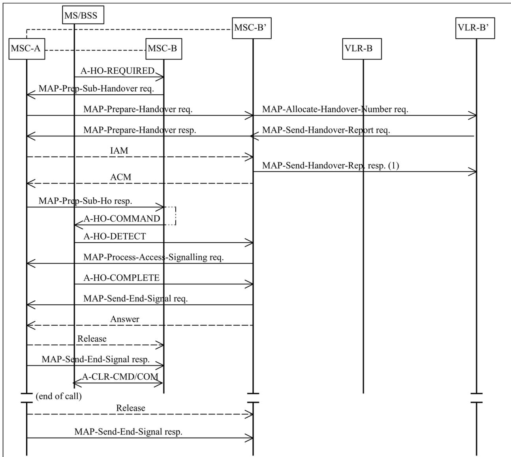

```

sequenceDiagram
    participant MS/BSS
    participant MSC-A
    participant MSC-B
    participant MSC-B'
    participant VLR-B
    participant VLR-B'

    Note right of MS/BSS: (end of call)
    MS/BSS->>MSC-B: A-HO-REQUIRED
    MSC-B->>MSC-A: MAP-Prep-Sub-Handover req.
    MSC-A->>MSC-B: MAP-Prepare-Handover req.
    MSC-B->>MSC-B': MAP-Prepare-Handover resp.
    MSC-B'->>VLR-B': MAP-Allocate-Handover-Number req.
    VLR-B'->>MSC-B': MAP-Send-Handover-Report req.
    MSC-B'->>MSC-A: IAM
    MSC-B'->>VLR-B': MAP-Send-Handover-Rep. resp. (1)
    MSC-A->>MSC-B: ACM
    MSC-A->>MSC-B: MAP-Prep-Sub-Ho resp.
    MSC-B->>MS/BSS: A-HO-COMMAND
    MS/BSS->>MSC-B: A-HO-DETECT
    MSC-B->>MSC-B': MAP-Process-Access-Signalling req.
    MSC-B'->>MSC-A: A-HO-COMPLETE
    MSC-A->>MSC-B: MAP-Send-End-Signal req.
    MSC-A->>MSC-B: Answer
    MSC-A->>MSC-B: Release
    MSC-B->>MSC-A: MAP-Send-End-Signal resp.
    MS/BSS->>MSC-B: A-CLR-CMD/COM
    Note right of MS/BSS: (end of call)
    MSC-A->>MSC-B': Release
    MSC-A->>MSC-B': MAP-Send-End-Signal resp.
  
```

Sequence diagram for Subsequent handover procedure ii): Successful handover from MSC-B to MSC-B' requiring a circuit connection. The diagram shows the interaction between MS/BSS, MSC-A, MSC-B, MSC-B', VLR-B, and VLR-B'.

NOTE 1: Can be sent at any time after the reception of IAM.

**Figure 15: Subsequent handover procedure ii): Successful handover from MSC-B to MSC-B' requiring a circuit connection**

## 7.4 Procedure for subsequent handover not requiring a circuit connection

As for the subsequent handover with a circuit connection, the same two cases of subsequent handover apply:

- the MS moves back to the area of MSC-A;
- the MS moves into the area of a third MSC (MSC-B').

### 7.4.1 Description of the subsequent handover procedure without circuit connection i): MSC-B to MSC-A

The procedure for successful handover from MSC-B back to MSC-A without circuit connection is shown in figure 16. The only difference with the figure 14, is that no circuit release is needed between MSC-A and MSC-B.

![Sequence diagram for Figure 16: Subsequent handover procedure i). The diagram shows the interaction between MS/BSS-B, MSC-A, MSC-B, BSS-A/MS, and VLR-B. The sequence of messages is: 1. A-HO-REQUIRED from BSS-A/MS to MSC-B. 2. MAP-Prep-Sub-Handover req. from MSC-B to MSC-A. 3. A-HO-REQUEST from MSC-A to MS/BSS-B. 4. A-HO-REQUEST-ACK from MS/BSS-B to MSC-A. 5. MAP-Prep-Sub-Handover resp. from MSC-A to MSC-B. 6. A-HO-COMMAND from MSC-B to BSS-A/MS. 7. A-HO-DETECT from MS/BSS-B to MSC-A. 8. A-HO-COMPLETE from MS/BSS-B to MSC-A. 9. MAP-Send-End-Signal resp. from MSC-A to MSC-B. 10. A-CLR-CMD/COM from MSC-B to BSS-A/MS.](9cbc1ebd80813fc36e499f7d70ed6881_img.jpg)

```

sequenceDiagram
    participant MS/BSS-B
    participant MSC-A
    participant MSC-B
    participant BSS-A/MS
    participant VLR-B

    Note left of MS/BSS-B: MS/BSS-B
    Note right of BSS-A/MS: BSS-A/MS
    Note right of VLR-B: VLR-B

    BSS-A/MS->>MSC-B: A-HO-REQUIRED
    MSC-B->>MSC-A: MAP-Prep-Sub-Handover req.
    MSC-A->>MS/BSS-B: A-HO-REQUEST
    MS/BSS-B->>MSC-A: A-HO-REQUEST-ACK
    MSC-A->>MSC-B: MAP-Prep-Sub-Handover resp.
    MSC-B->>BSS-A/MS: A-HO-COMMAND
    MS/BSS-B->>MSC-A: A-HO-DETECT
    MS/BSS-B->>MSC-A: A-HO-COMPLETE
    MSC-A->>MSC-B: MAP-Send-End-Signal resp.
    MSC-B->>BSS-A/MS: A-CLR-CMD/COM
  
```

Sequence diagram for Figure 16: Subsequent handover procedure i). The diagram shows the interaction between MS/BSS-B, MSC-A, MSC-B, BSS-A/MS, and VLR-B. The sequence of messages is: 1. A-HO-REQUIRED from BSS-A/MS to MSC-B. 2. MAP-Prep-Sub-Handover req. from MSC-B to MSC-A. 3. A-HO-REQUEST from MSC-A to MS/BSS-B. 4. A-HO-REQUEST-ACK from MS/BSS-B to MSC-A. 5. MAP-Prep-Sub-Handover resp. from MSC-A to MSC-B. 6. A-HO-COMMAND from MSC-B to BSS-A/MS. 7. A-HO-DETECT from MS/BSS-B to MSC-A. 8. A-HO-COMPLETE from MS/BSS-B to MSC-A. 9. MAP-Send-End-Signal resp. from MSC-A to MSC-B. 10. A-CLR-CMD/COM from MSC-B to BSS-A/MS.

**Figure 16: Subsequent handover procedure i): Successful handover from MSC-B to MSC-A not requiring a circuit connection**

### 7.4.2 Description of the subsequent handover procedure without circuit connection ii): MSC-B to MSC-B'

The procedure for successful handover from MSC-B to MSC-B' is shown in figure 17.

The procedure consists of two parts:

- a subsequent handover from MSC-B back to MSC-A as described in subclause 7.4.1 (the same procedures apply if MSC-A is replaced by 3G\_MSC-A); and
- a basic handover from MSC-A to MSC-B' as described in subclause 7.2.

The only difference to the equivalent figure 15 is the omission of the circuit and handover number allocation signallings.


```

sequenceDiagram
    participant MS/BSS
    participant MSC-A
    participant MSC-B
    participant MSC-B'
    participant VLR-B
    participant VLR-B'

    Note left of MSC-A: (end of link)
    MSC-B->>MSC-B': A-HO-DETECT
    MSC-B'->>MSC-A: MAP-Process-Access-Signalling req.
    MSC-A->>MSC-B': A-HO-COMPLETE
    MSC-B'->>MSC-A: MAP-Send-End-Signal req.
    MSC-A->>MSC-B': MAP-Send-End-Signal resp.
    Note right of VLR-B': (end of link)
    MSC-B'->>VLR-B': MAP-Send-End-Signal resp.
  
```

Sequence diagram for Subsequent handover procedure ii: Successful handover from MSC-B to MSC-B' without circuit connection. The diagram shows interactions between MS/BSS, MSC-A, MSC-B, MSC-B', VLR-B, and VLR-B'. The process involves A-HO-REQUIRED, MAP-Prepare-Handover, A-HO-DETECT, and A-HO-COMPLETE messages, with a break in the link between MSC-B and MSC-B'.

**Figure 17: Subsequent handover procedure ii): Successful handover from MSC-B to MSC-B' without circuit connection**

# 8 General Description of the procedures for inter - 3G\_MSC handovers

## 8.1 Handover UMTS to GSM

The following clauses describe two options for the Basic and Subsequent UMTS to GSM Handover procedures. The first, as described in subclauses 8.1.1 and 8.1.3 respectively, provides for a circuit connection between 3G\_MSC-A and 3G\_MSC-B. The second, as described in subclauses 8.1.2 and 8.1.4 respectively, provides for a Basic and Subsequent Handover without the provision of a circuit connection between 3G\_MSC-A and 3G\_MSC-B. 3G\_MSC can also be a pure GSM MSC.

In all the above mentioned clauses, the following principles apply:

- during the handover resource allocation, except for the messages explicitly indicated in b and c below, only the handover related messages that are part of the applicable BSSAP subset - as defined in 3GPP TS 49.008 [7] - shall be transferred on the E-interface;
- the trace related messages that are part of the applicable BSSAP subset - as defined in 3GPP TS 49.008 [7]- can be sent by the 3G\_MSC-A on the E-interface after successful handover resource allocation. In the subclauses 8.1.1 and 8.1.2, it is however allowed at basic handover initiation on the E-Interface to transfer one trace related message that is part of the applicable BSSAP subset - as defined in 3GPP TS 49.008 [7] - together with the applicable handover related message. The applicable handover related message shall always appear as the first message;

- c) during the handover resource allocation for subsequent inter-MSC inter-system handover according to subclauses 8.1.3 and 8.1.4, it is allowed to transfer either DTAP or RANAP Direct Transfer messages on the E-Interface between 3G\_MSC-A and 3G\_MSC-B. RANAP Direct Transfer messages shall be used for this purpose if and only if the basic handover procedure was an inter MSC SRNS relocation;
- d) during the handover execution, i.e. while the UE/MS is not in communication with the network, the 3G\_MSC-A shall queue all outgoing BSSAP or RANAP messages until the communication with the UE/MS is resumed;
- e) during the execution of a basic inter-system inter-MSC handover to MSC-B or a subsequent inter-system inter-MSC handover to a third MSC-B', only the handover related messages and the A-Clear-Request message that are part of the applicable BSSAP subset - as defined in 3GPP TS 49.008 [7] – may be sent by the target MSC on the E-interface;
- f) during a subsequent inter-system inter-MSC handover back to 3G\_MSC-A or to a third MSC-B', 3G\_MSC-B may initiate either an Iu-Release-Request procedure or an A-Clear-Request procedure on the E-interface. An Iu-Release-Request procedure shall be initiated only if the basic handover procedure was an inter-MSC SRNS relocation;
- g) finally, during supervision, i.e. while the UE/MS is not in the area of 3G\_MSC-A after a successful Inter-3G\_MSC handover, the subset of BSSAP procedures and their related messages - as defined in 3GPP TS 49.008 [7] - shall apply on the E-Interface. As the only exception to this rule, in case of a subsequent inter-MSC SRNS relocation back to 3G\_MSC-A or to a third 3G\_MSC-B', during the relocation resource allocation, the relocation and trace related messages that are part of the applicable RANAP subset - as defined in 3GPP TS 29.108 [15] - shall be transferred on the E-interface (see subclause 8.3, a and b).

If a subsequent inter-MSC handover/relocation back to 3G\_MSC-A or to a third 3G\_MSC-B' is cancelled, then the supervision continues, and BSSAP procedures and their related messages shall apply on the E-interface.

NOTE: A subsequent inter-MSC SRNS relocation back to 3G\_MSC-A or to a third 3G\_MSC-B' can occur, e.g., if after the basic inter-MSC handover to 3G\_MSC-B the MS performed a subsequent intra-3G\_MSC-B GSM to UMTS inter-system handover;

- h) during the intra-3G\_MSC -B handover execution, if any, the 3G\_MSC -B shall queue all outgoing BSSAP or RANAP messages until the communication with the UE/MS is resumed.

### 8.1.1 Basic Handover procedure requiring a circuit connection between 3G\_MSC -A and MSC-B

The procedure used for successful Inter-3G\_MSC UMTS to GSM Handover is shown in figure 18. Initiation of the UMTS to GSM handover procedure is described in clause 5. The procedure described in this clause makes use of messages from the 3GPP TS 49.008 [7] and of the transport mechanism from the Mobile Application Part (MAP) (3GPP TS 29.002 [12]). After an Inter-3G\_MSC relocation/handover, Intra-3G\_MSC UMTS to GSM handover may occur on 3G\_MSC -B, this handover will follow the procedures specified in a previous clause.

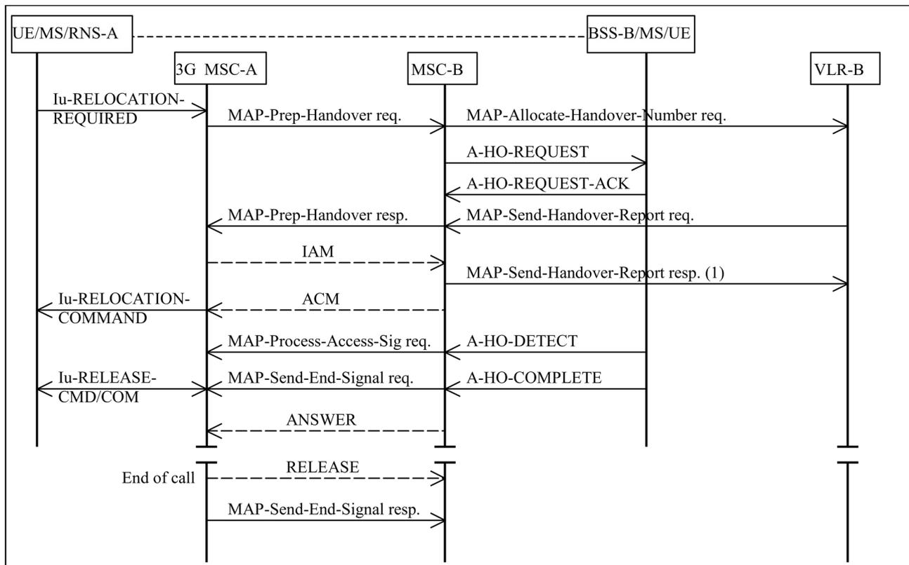

```

sequenceDiagram
    participant UE/MS/RNS-A
    participant 3G MSC-A
    participant MSC-B
    participant BSS-B/MS/UE
    participant VLR-B

    Note left of UE/MS/RNS-A: End of call
    UE/MS/RNS-A->>3G MSC-A: Iu-RELOCATION-REQUIRED
    3G MSC-A->>MSC-B: MAP-Prep-Handover req.
    MSC-B->>BSS-B/MS/UE: MAP-Allocate-Handover-Number req.
    MSC-B->>BSS-B/MS/UE: A-HO-REQUEST
    BSS-B/MS/UE-->>MSC-B: A-HO-REQUEST-ACK
    MSC-B->>3G MSC-A: MAP-Prep-Handover resp.
    MSC-B->>BSS-B/MS/UE: MAP-Send-Handover-Report req.
    3G MSC-A-->>MSC-B: IAM
    MSC-B->>BSS-B/MS/UE: MAP-Send-Handover-Report resp. (1)
    3G MSC-A-->>UE/MS/RNS-A: Iu-RELOCATION-COMMAND
    3G MSC-A-->>MSC-B: ACM
    3G MSC-A->>MSC-B: MAP-Process-Access-Sig req.
    MSC-B->>BSS-B/MS/UE: A-HO-DETECT
    3G MSC-A->>UE/MS/RNS-A: Iu-RELEASE-CMD/COM
    3G MSC-A->>MSC-B: MAP-Send-End-Signal req.
    MSC-B->>BSS-B/MS/UE: A-HO-COMPLETE
    3G MSC-A-->>MSC-B: ANSWER
    3G MSC-A-->>MSC-B: RELEASE
    3G MSC-A->>MSC-B: MAP-Send-End-Signal resp.
  
```

Sequence diagram of Basic UMTS to GSM Handover Procedure requiring a circuit connection. Lifelines: UE/MS/RNS-A, 3G MSC-A, MSC-B, BSS-B/MS/UE, VLR-B. The sequence shows the flow of messages for relocation preparation, execution, and completion.

NOTE 1: Can be sent at any time after the reception of IAM.

**Figure 18: Basic UMTS to GSM Handover Procedure requiring a circuit connection**

#### 8.1.1.1 With one circuit connection

The UMTS to GSM handover is initiated as described in subclause 6.2.1. (This is represented by Iu-RELOCATION-REQUIRED in figure 18). Upon receipt of the Iu-RELOCATION-REQUIRED from RNS-A, 3G MSC-A shall send a MAP-PREPARE-HANDOVER request to MSC-B including a complete A-HO-REQUEST message.

NOTE: 3G MSC-A shall not send further MAP-PREPARE-HANDOVER requests while a MAP-PREPARE-HANDOVER response is pending or before any timeouts.

The MAP-PREPARE-HANDOVER request shall carry in the A-HO-REQUEST all information needed by MSC-B for allocating a radio channel, see 3GPP TS 08.08. For compatibility reasons, the MAP-PREPARE-HANDOVER request will also identify the cell to which the call is to be handed over. For speech calls, 3G MSC-A shall also include the Iu Supported Codecs List to be used by MSC-B for subsequent intra-MSC-B intersystem handover to UMTS and intra-MSC-B SRNS relocation.

If 3G MSC-A supports A interface over IP, then for speech calls 3G MSC-A may include the AoIP-Supported Codecs List (Anchor) in the MAP-PREPARE-HANDOVER request. If handover to an A over IP capable BSS-B is performed, MSC-B shall include a Codec List (MSC preferred) in the A-HO-REQUEST message to BSS-B. MSC-B may select the codecs for the Codec List (MSC preferred) from the channel type information and the AoIP-Supported Codecs List (Anchor), if this list was provided by 3G MSC-A in the MAP-PREPARE-HANDOVER request. For a detailed description of the handling of these codec lists by 3G MSC-A and MSC-B see 3GPP TS 23.153 [25]. If the AoIP-Supported Codecs List (Anchor) was not provided or MSC-B does not support the selection of codecs from the AoIP-Supported Codecs List, then MSC-B shall create the Codec List (MSC preferred) using the channel type information received from 3G MSC-A in the A-HO-REQUEST message included in the MAP-PREPARE-HANDOVER request.

If 3G MSC-A supports handover/relocation to a CSG cell, the target cell belongs to the registered PLMN or an equivalent PLMN, and the HLR or the CSS provided CSG subscription data, 3G MSC-A shall include the CSG subscription data for the registered PLMN and, if available, for the equivalent PLMNs in the MAP-PREPARE-HANDOVER request.

MSC-B will return the MAP-PREPARE-HANDOVER response after having retrieved a Handover Number from its associated VLR (exchange of the messages MAP-allocate-handover-number request and MAP-send-handover-report request). The Handover Number shall be used for routing the connection of the call from 3G\_MSC-A to MSC-B. If a traffic channel is available in MSC-B the MAP-PREPARE-HANDOVER response, sent to 3G\_MSC-A will contain the complete A-HO-REQUEST-ACKNOWLEDGE message received from BSS-B, containing the radio resources definition to be sent by RNS-A to the UE/MS and possible extra BSSMAP information, amended by MSC-B due to the possible interworking between the BSSMAP protocol carried on the E-interface and the BSSMAP protocol used on the A-interface. If the traffic channel allocation is queued by BSS-B, the A-QUEUING-INDICATION may optionally be sent back to 3G\_MSC-A. The further traffic channel allocation result (A-HO-REQUEST-ACK or A-HO-FAILURE) will be transferred to 3G\_MSC-A using the MAP-PROCESS-ACCESS-SIGNALLING request. If the traffic channel allocation is not possible, the MAP-PREPARE-HANDOVER response containing an A-HO-FAILURE will be sent to 3G\_MSC-A. MSC-B will do the same if a fault is detected on the identity of the cell where the call has to be handed over. MSC-B simply reports the events related to the dialogue. It is up to 3G\_MSC-A to decide the action to perform if it receives negative responses or the operation fails due to the expiry of the MAP-PREPARE-HANDOVER timer.

If A interface over IP is supported, then for speech calls via an A over IP capable BSS-B the selection of the speech codec shall be as described in 3GPP TS 48.008 [5], and if no transcoder is inserted in the BSS-B then MSC-B shall insert a transcoder.

If 3G\_MSC-A provided an AoIP-Supported Codecs List (Anchor) in the MAP-PREPARE-HANDOVER request and MSC-B selected the codecs for the Codec List (MSC preferred) from the AoIP-Supported Codecs List (Anchor), MSC-B may send the AoIP-Selected Codec (Target) and AoIP-Available Codecs List (MAP) to 3G\_MSC-A in the MAP-PREPARE-HANDOVER response.

If BSS-B does not support A interface over IP or 3G\_MSC-A did not include the AoIP-Supported Codecs List (Anchor) in the MAP-PREPARE HANDOVER request, then MSC-B shall not include the AoIP-Selected Codec (Target) and AoIP-Available Codecs List (MAP) in the MAP-PREPARE-HANDOVER response. Reception of the AoIP-Selected Codec (Target) and AoIP Available Codecs List (MAP) from MSC-B with the MAP-PREPARE-HANDOVER response indicates to 3G\_MSC-A that the target access supports A interface over IP.

If an error related to the TCAP dialogue or to the MAP-PREPARE-HANDOVER request is returned from MSC-B, this will be indicated to 3G\_MSC-A and 3G\_MSC-A will terminate the handover attempt. 3G\_MSC-A rejects the handover attempt towards RNS-A. The existing connection to the UE/MS shall not be cleared.

When the A-HO-REQUEST-ACKNOWLEDGE has been received, 3G\_MSC-A shall establish a circuit between 3G\_MSC-A and MSC-B by signalling procedures supported by the network. In figure 18 this is illustrated by the messages IAM (Initial Address Message) and ACM (Address Complete Message) of Signalling System no 7. MSC-B awaits the capturing of the UE/MS (subclause 6.2.1) on the radio path when the ACM is sent and 3G\_MSC-A initiates the UMTS to GSM handover execution when ACM is received (illustrated by the Iu-RELOCATION-COMMAND and described in subclause 6.2.1). 3G\_MSC-A removes the transcoder from the path to the other party.

MSC-B transfers to 3G\_MSC-A the acknowledgement received from the correct UE/MS (A-HO-DETECT/A-HO-COMPLETE). The A-HO-DETECT, if received, is transferred to 3G\_MSC-A using the MAP-PROCESS-ACCESS-SIGNALLING request. The A-HO-COMPLETE, when received from the correct UE/MS, is included in the MAP-SEND-END-SIGNAL request and sent back to 3G\_MSC-A. The circuit is through connected in 3G\_MSC-A when the A-HO-DETECT or the A-HO-COMPLETE is received from MSC-B. The old radio channel is released when the A-HO-COMPLETE message is received from MSC-B. The sending of the MAP-SEND-END-SIGNAL request starts the MAP supervision timer for the MAP dialogue between 3G\_MSC-A and MSC-B. When the MAP-SEND-END-SIGNAL request including the A-HO-COMPLETE message is received in 3G\_MSC-A, the resources in RNS-A shall be cleared.

In order not to conflict with the PSTN/ISDN signalling system(s) used between 3G\_MSC-A and MSC-B, MSC-B must generate an answer signal when A-HO-DETECT/COMPLETE is received.

MSC-B shall release the Handover Number when the circuit between 3G\_MSC-A and MSC-B has been established.

If the circuit between 3G\_MSC-A and MSC-B cannot be established, (e.g. an unsuccessful backward message is received instead of ACM), 3G\_MSC-A terminates the inter-3G\_MSC UMTS to GSM handover attempt by sending an appropriate MAP message, for example an ABORT.

3G\_MSC-A shall retain overall call control until the call is cleared by the fixed subscriber or the UE/MS and there is no further call control functions to be performed (e.g. servicing waiting calls, echo cancellers).

When 3G\_MSC-A clears the call to the UE/MS it also clears the call control functions in 3G\_MSC-A and sends the MAP-SEND-END-SIGNAL response to release the MAP resources in MSC-B.

3G\_MSC-A may terminate the procedure at any time by sending an appropriate MAP message to MSC-B. If establishment of the circuit between 3G\_MSC-A and MSC-B has been initiated, the circuit must also be cleared.

The UMTS to GSM handover will be aborted by 3G\_MSC-A if it detects clearing or interruption of the radio path before the call has been established on MSC-B.

#### 8.1.1.2 With multiple circuit connections (Optional functionality)

If 3G\_MSC-A supports the optional supplementary service Multicall (See 3GPP TS 23.135 [17]), 3G\_MSC-A shall have the following functionality additionally to the description in subclause 8.1.1.1.

Upon receipt of the IU-RELOCATION-REQUIRED from RNS-A 3G\_MSC-A shall select one bearer to be handed over if the UE is engaged with multiple bearers. After that, the 3G\_MSC-A generates an A-HO-REQUEST message for the selected bearer and sends it to MSC-B over MAP-PREPARE-HANDOVER request.

When MAP-PREPARE-HANDOVER response including an A-HO-REQUEST-ACK is received from MSC-B, 3G\_MSC-A sends IU-RELOCATION-COMMAND, which indicates the bearers not to be handed over as bearers to be released, to RNS-A.

After 3G\_MSC-A receives MAP-SEND-END-SIGNAL request from MSC-B, 3G\_MSC-A shall release calls via MSC-B, which has been carried by the bearers not to be handed over, and then 3G\_MSC-A sends IU-RELEASE-COMMAND to RNS-A.

### 8.1.2 Basic UMTS to GSM Handover procedure not requiring the establishment of a circuit connection between 3G\_MSC-A and MSC-B

The basic UMTS to GSM handover procedures to be used when no circuit connection is required by 3G\_MSC-A are similar to those described in clause 8.1.1 for circuit switched calls. The main differences to the procedures described in clause 8.1.1 relate to the establishment of circuits between the network entities and the Handover Number allocation.

In the case of basic UMTS to GSM handover, 3G\_MSC-A shall specify to MSC-B that no Handover Number is required in the MAP-PREPARE-HANDOVER request (see 3GPP TS 29.002 [12]). As for the basic UMTS to GSM handover using a circuit connection, the A-HO-REQUEST is transmitted at the same time. Any subsequent Handover Number allocation procedure will not be invoked until the completion of the basic UMTS to GSM handover procedure (see clause: Subsequent Channel Assignment using a circuit connection). MSC-B shall then perform the radio resources allocation as described in subclause 8.1.1. The MAP-PREPARE-HANDOVER response shall be returned to 3G\_MSC-A including either the response of the radio resources allocation request received from BSS-B (A-HO-REQUEST-ACKNOWLEDGE/A-HO-FAILURE with possible extra BSSMAP information. These extra information are amended by MSC-B due to the possible interworking between the BSSMAP protocol carried on the E-interface and the BSSMAP protocol used on the A-interface) or potentially the A-QUEUING-INDICATION. The basic UMTS to GSM handover procedure will continue as described in subclause 8.1.1 except that no circuit connection will be established towards MSC-B.

The relevant case for the basic UMTS to GSM handover without circuit connection is shown in figure 19. As can be seen the major differences to the equivalent figure 18 is the omission of any circuit establishment messaging and the omission of handover number allocation signalling.

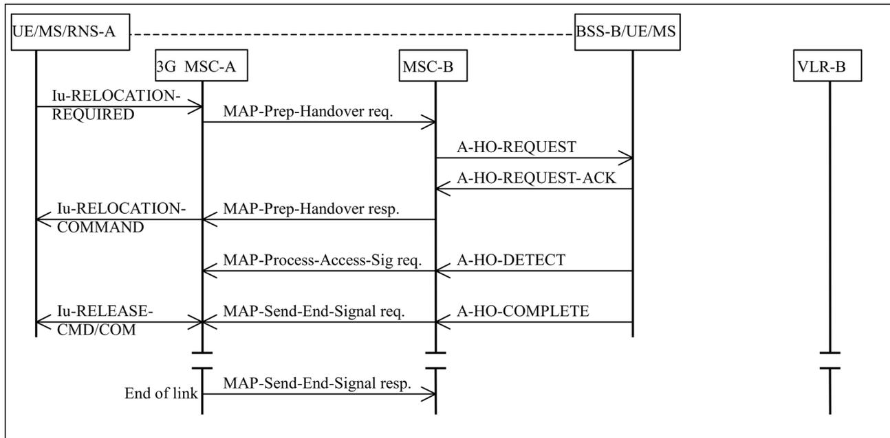

```

sequenceDiagram
    participant UE/MS/RNS-A
    participant 3G MSC-A
    participant MSC-B
    participant BSS-B/UE/MS
    participant VLR-B

    Note left of UE/MS/RNS-A: Error: Reference source not
    UE/MS/RNS-A->>3G MSC-A: Iu-RELOCATION-REQUIRED
    3G MSC-A->>MSC-B: MAP-Prep-Handover req.
    MSC-B->>BSS-B/UE/MS: A-HO-REQUEST
    BSS-B/UE/MS-->>MSC-B: A-HO-REQUEST-ACK
    MSC-B-->>3G MSC-A: MAP-Prep-Handover resp.
    3G MSC-A->>UE/MS/RNS-A: Iu-RELOCATION-COMMAND
    3G MSC-A->>MSC-B: MAP-Process-Access-Sig req.
    MSC-B->>BSS-B/UE/MS: A-HO-DETECT
    MSC-B-->>3G MSC-A: MAP-Send-End-Signal req.
    3G MSC-A->>UE/MS/RNS-A: Iu-RELEASE-CMD/COM
    Note right of 3G MSC-A: End of link
    3G MSC-A->>MSC-B: MAP-Send-End-Signal resp.
  
```

Sequence diagram of Basic UMTS to GSM Handover Procedure without circuit connection. Lifelines: UE/MS/RNS-A, 3G MSC-A, MSC-B, BSS-B/UE/MS, VLR-B. The sequence shows the flow of signaling messages for handover preparation, execution, and completion.

Figure 19: Basic UMTS to GSM Handover Procedure without circuit connection

### 8.1.3 Procedure for subsequent UMTS to GSM handover requiring a circuit connection

After the call has been handed over to 3G MSC-B, if the UE/MS leaves the area of 3G MSC-B during the same call and enters a GSM area, subsequent UMTS to GSM handover is necessary in order to continue the connection.

The following cases apply:

- the UE/MS moves back to the area of MSC-A;
- the UE/MS moves into the area of a third MSC (MSC-B').

In both cases the call is switched in 3G MSC-A; the circuit between 3G MSC-A and MSC-B shall be released after a successful subsequent handover has been performed the same procedures apply if 3G MSC-A is replaced by MSC-A.

#### 8.1.3.1 Description of subsequent UMTS to GSM handover procedure i): 3G\_MSC-B to MSC-A

The procedure for successful UMTS to GSM handover from MSC-B back to 3G\_MSC-A is shown in figure 20.

![Sequence diagram for Figure 20: Subsequent UMTS to GSM handover procedure i): successful UMTS to GSM handover from 3G_MSC-B to MSC-A using a circuit connection. The diagram shows interactions between UE/MS/BSS-B, MSC-A, 3G_MSC-B, RNS-A/UE/MS, and VLR-B. The sequence starts with 3G_MSC-B sending a MAP-Prep-Sub-Handover req. to MSC-A. MSC-A sends an A-HO-REQUEST to UE/MS/BSS-B. UE/MS/BSS-B responds with A-HO-REQUEST-ACK. MSC-A sends a MAP-Prep-Sub-Handover resp. to 3G_MSC-B. 3G_MSC-B sends an Iu-RELOCATION-COMMAND to RNS-A/UE/MS. RNS-A/UE/MS sends an A-HO-DETECT to UE/MS/BSS-B. UE/MS/BSS-B sends an A-HO-COMPLETE to MSC-A. MSC-A sends a MAP-Send-End-Signal resp. to 3G_MSC-B. 3G_MSC-B sends an Iu-RELEASE-CMD/COM to RNS-A/UE/MS. Finally, MSC-A sends a Release message to 3G_MSC-B.](c419b566d720267c499087add1506018_img.jpg)

```

sequenceDiagram
    participant UE/MS/BSS-B
    participant MSC-A
    participant 3G_MSC-B
    participant RNS-A/UE/MS
    participant VLR-B

    Note left of UE/MS/BSS-B: UE/MS/BSS-B
    Note right of RNS-A/UE/MS: RNS-A/UE/MS
    Note right of VLR-B: VLR-B

    3G_MSC-B->>MSC-A: MAP-Prep-Sub-Handover req.
    MSC-A->>UE/MS/BSS-B: A-HO-REQUEST
    UE/MS/BSS-B-->>MSC-A: A-HO-REQUEST-ACK
    MSC-A-->>3G_MSC-B: MAP-Prep-Sub-Handover resp.
    3G_MSC-B->>RNS-A/UE/MS: Iu-RELOCATION-COMMAND
    RNS-A/UE/MS->>UE/MS/BSS-B: A-HO-DETECT
    UE/MS/BSS-B-->>MSC-A: A-HO-COMPLETE
    MSC-A-->>3G_MSC-B: MAP-Send-End-Signal resp.
    3G_MSC-B->>RNS-A/UE/MS: Iu-RELEASE-CMD/COM
    MSC-A-->>3G_MSC-B: Release
  
```

Sequence diagram for Figure 20: Subsequent UMTS to GSM handover procedure i): successful UMTS to GSM handover from 3G\_MSC-B to MSC-A using a circuit connection. The diagram shows interactions between UE/MS/BSS-B, MSC-A, 3G\_MSC-B, RNS-A/UE/MS, and VLR-B. The sequence starts with 3G\_MSC-B sending a MAP-Prep-Sub-Handover req. to MSC-A. MSC-A sends an A-HO-REQUEST to UE/MS/BSS-B. UE/MS/BSS-B responds with A-HO-REQUEST-ACK. MSC-A sends a MAP-Prep-Sub-Handover resp. to 3G\_MSC-B. 3G\_MSC-B sends an Iu-RELOCATION-COMMAND to RNS-A/UE/MS. RNS-A/UE/MS sends an A-HO-DETECT to UE/MS/BSS-B. UE/MS/BSS-B sends an A-HO-COMPLETE to MSC-A. MSC-A sends a MAP-Send-End-Signal resp. to 3G\_MSC-B. 3G\_MSC-B sends an Iu-RELEASE-CMD/COM to RNS-A/UE/MS. Finally, MSC-A sends a Release message to 3G\_MSC-B.

**Figure 20: Subsequent UMTS to GSM handover procedure i): successful UMTS to GSM handover from 3G\_MSC-B to MSC-A using a circuit connection**

##### 8.1.3.1.1 With one circuit connection

The procedure is as follows.

3G\_MSC-B sends the MAP-PREPARE-SUBSEQUENT-HANDOVER request to MSC-A indicating the new MSC number (MSC-A number), indicating also the identity of the cell where the call has to be handed over and including a complete A-HO-REQUEST message. (NOTE: 3G\_MSC-B shall not send further MAP-PREPARE-SUBSEQUENT-HANDOVER requests while a handover attempt is pending or before any timeouts). Since MSC-A is the call controlling MSC, this MSC needs no Handover Number for routing purposes; MSC-A can immediately initiate the search for a free radio channel.

When a radio channel can be assigned, MSC-A shall return in the MAP-PREPARE-SUBSEQUENT-HANDOVER response the complete A-HO-REQUEST-ACKNOWLEDGE message received from the BSS-B and possible extra BSSMAP information, amended by MSC-A due to the possible interworking between the BSSMAP protocol carried on the E-interface and the BSSMAP protocol used on the A-interface. If the traffic channel allocation is queued by BSS-B, the A-QUEUING-INDICATION may optionally be sent back to 3G\_MSC-B. The further traffic channel allocation result (A-HO-REQUEST-ACK or A-HO-FAILURE) will be transferred to 3G\_MSC-B using the MAP-FORWARD-ACCESS-SIGNALLING request. If a radio channel cannot be assigned or if a fault is detected on the target cell identity, or the target cell identity in the A-HO-REQUEST is not consistent with the target MSC number, the MAP-PREPARE-SUBSEQUENT-HANDOVER response containing an A-HO-FAILURE message shall be given to 3G\_MSC-B, in addition 3G\_MSC-B shall maintain the connection with the UE/MS.

If the procedure in MSC-A is successful then 3G\_MSC-B can request the UE/MS to return to the new BSS-B on MSC-A. This is illustrated in figure 20 by the Iu-RELOCATION-COMMAND message. The operation is successfully completed when MSC-A receives the A-HO-COMPLETE message.

After UMTS to GSM handover MSC-A shall release the circuit to 3G\_MSC-B.

MSC-A must also terminate the MAP procedure for the basic UMTS to GSM handover between MSC-A and 3G\_MSC-B by sending an appropriate MAP message. 3G\_MSC-B will clear the resources in RNS-A when the MAP-SEND-END-SIGNAL response is received.

##### 8.1.3.1.2 With multiple circuit connections (Optional functionality)

If 3G\_MSC-B supports the optional supplementary service Multicall (See 3GPP TS 23.135 [17]), 3G\_MSC-B shall have the following functionality additionally to the description in subclause 8.1.3.1.1.

Upon receipt of the IU-RELOCATION-REQUIRED from RNS-A which indicates the target is BSS, 3G\_MSC-B shall select one bearer to be handed over if the UE is engaged with multiple bearers. After that, the 3G\_MSC-B generates an A-HO-REQUEST message for the selected bearer and sends it to 3G\_MSC-A over MAP-PREPARE-SUBSEQUENT-HANDOVER request with indication of RAB ID of the selected bearer.

When MAP-PREPARE-SUBSEQUENT-HANDOVER response including an A-HO-REQUEST-ACK is received from the 3G\_MSC-A, 3G\_MSC-B sends IU-RELOCATION-COMMAND, which indicates the bearers not to be handed over as bearers to be released, to RNS-A.

After 3G\_MSC-A receives A-HO-COMPLETE message from BSS-B, 3G\_MSC-A shall release calls via BSS-B, which has been carried by the bearers not to be handed over, and then 3G\_MSC-A sends MAP-SEND-END-SIGNAL response to 3G\_MSC-B.

#### 8.1.3.2 Description of subsequent UMTS to GSM handover procedure ii): 3G\_MSC-B to MSC-B'

The procedure for successful UMTS to GSM handover from 3G\_MSC-B to MSC-B' is shown in figure 21.

The procedure consists of two parts:

- a subsequent UMTS to GSM handover from 3G\_MSC-B back to 3G\_MSC-A as described in subclause 8.1.3.1 (the same procedures apply if 3G\_MSC-A is replaced by MSC-A); and
- a basic handover from 3G\_MSC-A to MSC-B' as described in subclause 7.1.

##### 8.1.3.2.1 With one circuit connection

3G\_MSC-B sends the MAP-PREPARE-SUBSEQUENT-HANDOVER request to 3G\_MSC-A indicating a new MSC number (which is the identity of MSC-B'), indicating also the target cell identity and including a complete A-HO-REQUEST, 3G\_MSC-A then starts a basic handover procedure towards MSC-B'.

If 3G\_MSC-A supports A interface over IP, then for speech calls 3G\_MSC-A may include the AoIP-Supported Codecs List (Anchor) in the MAP-PREPARE-HANDOVER request towards MSC-B'. For a detailed description of the handling of this codec list by 3G\_MSC-A and MSC-B' see 3GPP TS 23.153 [25].

When 3G\_MSC-A receives the ACM from MSC-B', 3G\_MSC-A informs 3G\_MSC-B that MSC-B' has successfully allocated the radio resources on BSS-B' side by sending the MAP-PREPARE-SUBSEQUENT-HANDOVER response containing the complete A-HO-REQUEST-ACKNOWLEDGE received from BSS-B' and possible extra BSSMAP information, amended by 3G\_MSC-A due to the possible interworking between the BSSMAP protocol carried on the E-interface between 3G\_MSC-A and MSC-B' and the BSSMAP protocol carried on the E-interface between 3G\_MSC-A and 3G\_MSC-B. Now 3G\_MSC-B can start the procedure on the radio path.

For 3G\_MSC-A the UMTS to GSM handover is completed when it has received the MAP-SEND-END-SIGNAL REQUEST from MSC-B' containing the A-HO-COMPLETE received from the BSS-B'. The circuit between 3G\_MSC-A and 3G\_MSC-B is released. 3G\_MSC-A also sends the MAP-SEND-END-SIGNAL response to 3G\_MSC-B in order to terminate the original MAP dialogue between 3G\_MSC-A and 3G\_MSC-B. 3G\_MSC-B releases the radio resources when it receives this message.

If the traffic channel allocation is queued by the BSS-B', the A-QUEUING-INDICATION may optionally be sent back to 3G\_MSC-B. If no radio channel can be allocated by MSC-B' or no circuit between 3G\_MSC-A and MSC-B' can be established or a fault is detected on the target cell identity or the target cell identity in the A-HO-REQUEST is not consistent with the target MSC number, 3G\_MSC-A informs 3G\_MSC-B by using the A-HO-FAILURE message included in the MAP-PREPARE-SUBSEQUENT-HANDOVER response. 3G\_MSC-B shall maintain the existing connection with the UE/MS.

When the subsequent UMTS to GSM handover is completed, MSC-B' is considered as MSC-B. Any further inter-MSC handover is handled as described earlier for a subsequent handover.

##### 8.1.3.2.2 With multiple circuit connections (Optional functionality)

If 3G\_MSC-B supports the optional supplementary service Multicall (See 3GPP TS 23.135 [17]), 3G\_MSC-B shall have the following functionality additionally to the description in subclause 8.1.3.2.1.

Upon receipt of the IU-RELOCATION-REQUIRED from RNS-B 3G\_MSC-B shall select one bearer to be handed over if the UE is engaged with multiple bearers. After that, the 3G\_MSC-B generates an A-HO-REQUEST message for the selected bearer and sends it to 3G\_MSC-A over MAP-PREPARE-SUBSEQUENT-HANDOVER request with indication of RAB ID of the selected bearer.

Upon receipt of the MAP-PREPARE-SUBSEQUENT-HANDOVER request from 3G\_MSC-B, 3G\_MSC-A starts a basic handover procedure towards MSC-B'.

When 3G\_MSC-A receives the ACM from MSC-B', 3G\_MSC-A informs 3G\_MSC-B that MSC-B' has successfully allocated the radio resources on BSS-B' side by sending the MAP-PREPARE-SUBSEQUENT-HANDOVER response containing the complete A-HO-REQUEST-ACK received from BSS-B' and possible extra BSSAP information, amended by 3G\_MSC-A due to the possible interworking between the BSSMAP protocol carried on the E-interface between 3G\_MSC-A and MSC-B' and the BSSMAP protocol carried on the E-interface between 3G\_MSC-A and 3G\_MSC-B.

When MAP-PREPARE-SUBSEQUENT-HANDOVER response including an A-HO-REQUEST-ACK is received from 3G\_MSC-A, 3G\_MSC-B sends IU-RELOCATION-COMMAND, which indicates the bearers not to be handed over as bearers to be released, to RNS-A.

After 3G\_MSC-A receives MAP-SEND-END-SIGNAL request from MSC-B', 3G\_MSC-A shall release calls via MSC-B', which has been carried by the bearers not to be handed over, and then 3G\_MSC-A sends MAP-SEND-END-SIGNAL response to 3G\_MSC-B.

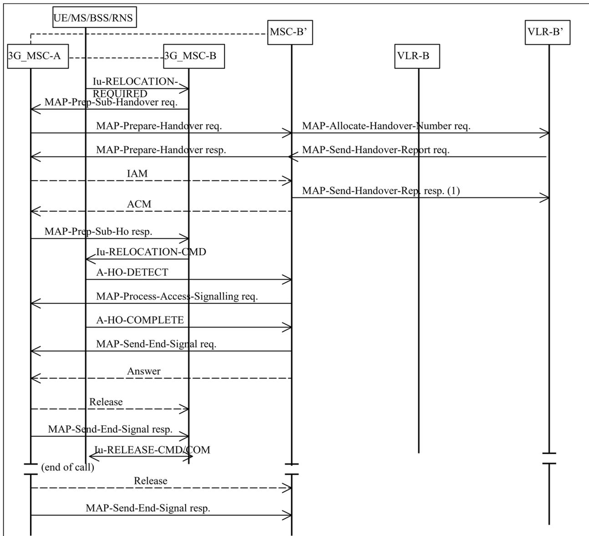

```

sequenceDiagram
    participant UE as UE/MS/BSS/RNS
    participant MSCA as 3G_MSC-A
    participant MSCB as 3G_MSC-B
    participant MSCB_prime as MSC-B'
    participant VLRB as VLR-B
    participant VLRB_prime as VLR-B'

    UE->>MSCB: Iu-RELOCATION-REQUIRED
    MSCB->>MSCA: MAP-Prep-Sub-Handover req.
    MSCA->>MSCB: MAP-Prepare-Handover req.
    MSCB->>MSCB_prime: MAP-Prepare-Handover req.
    MSCB_prime->>VLRB_prime: MAP-Allocate-Handover-Number req.
    VLRB_prime-->>MSCB_prime: MAP-Send-Handover-Report req.
    MSCB_prime-->>MSCB: MAP-Prepare-Handover resp.
    MSCB->>MSCB_prime: IAM
    MSCB_prime-->>VLRB_prime: MAP-Send-Handover-Report resp. (1)
    MSCB_prime-->>MSCB: ACM
    MSCA-->>MSCB: MAP-Prep-Sub-Ho resp.
    MSCB->>UE: Iu-RELOCATION-CMD
    UE->>MSCB_prime: A-HO-DETECT
    MSCB_prime->>MSCB: MAP-Process-Access-Signalling req.
    UE->>MSCB_prime: A-HO-COMPLETE
    MSCB_prime->>MSCB: MAP-Send-End-Signal req.
    MSCB-->>MSCA: Answer
    MSCA-->>MSCB: Release
    MSCB->>MSCA: MAP-Send-End-Signal resp.
    Note left of MSCA: (end of call)
    MSCA->>MSCB: Iu-RELEASE-CMD/COM
    MSCB-->>MSCB_prime: Release
    MSCB_prime-->>MSCB: MAP-Send-End-Signal resp.
  
```

Sequence diagram for Figure 21: Subsequent handover procedure ii): Successful UMTS to GSM handover from 3G\_MSC-B to MSC-B' requiring a circuit connection.

NOTE 1: Can be sent at any time after the reception of IAM.

**Figure 21: Subsequent handover procedure ii): Successful UMTS to GSM handover from 3G\_MSC-B to MSC-B' requiring a circuit connection**

### 8.1.4 Procedure for subsequent UMTS to GSM handover not requiring a circuit connection

As for the subsequent UMTS to GSM handover with a circuit connection, the same two cases of subsequent handover apply:

- i) the UE/MS moves back to the area of MSC-A;
- ii) the UE/MS moves into the area of a third MSC (MSC-B').

#### 8.1.4.1 Description of subsequent UMTS to GSM handover procedure i): 3G\_MSC-B to MSC-A

The procedure for successful UMTS to GSM handover from 3G\_MSC-B back to MSC-A without circuit connection is shown in figure 22. The only difference with the figure 20, is that no circuit release is needed between MSC-A and 3G\_MSC-B.

![Sequence diagram for Figure 22: Subsequent UMTS to GSM handover procedure i). The diagram shows the interaction between UE/MS/BSS-B, MSC-A, 3G_MSC-B, RNS-A/UE/MS, and VLR-B. The sequence starts with a MAP-Prep-Sub-Handover req. from 3G_MSC-B to MSC-A, followed by an A-HO-REQUEST from MSC-A to UE/MS/BSS-B. The UE/MS/BSS-B responds with A-HO-REQUEST-ACK. MSC-A then sends a MAP-Prep-Sub-Handover resp. to 3G_MSC-B, which in turn sends an Iu-RELOCATION-COMMAND to RNS-A/UE/MS. RNS-A/UE/MS sends an A-HO-DETECT to MSC-A, which responds with a MAP-Send-End-Signal resp. Finally, RNS-A/UE/MS sends an Iu-RELEASE-CMD/COM to 3G_MSC-B.](68a5a1a1a761c652b4b4c56da7cf9914_img.jpg)

```

sequenceDiagram
    participant UE/MS/BSS-B
    participant MSC-A
    participant 3G_MSC-B
    participant RNS-A/UE/MS
    participant VLR-B

    Note left of UE/MS/BSS-B: UE/MS/BSS-B
    Note right of RNS-A/UE/MS: RNS-A/UE/MS
    Note right of VLR-B: VLR-B

    3G_MSC-B->>MSC-A: MAP-Prep-Sub-Handover req.
    MSC-A->>UE/MS/BSS-B: A-HO-REQUEST
    UE/MS/BSS-B-->>MSC-A: A-HO-REQUEST-ACK
    MSC-A->>3G_MSC-B: MAP-Prep-Sub-Handover resp.
    3G_MSC-B->>RNS-A/UE/MS: Iu-RELOCATION-COMMAND
    RNS-A/UE/MS->>MSC-A: A-HO-DETECT
    MSC-A->>3G_MSC-B: MAP-Send-End-Signal resp.
    RNS-A/UE/MS->>3G_MSC-B: Iu-RELEASE-CMD/COM
  
```

Sequence diagram for Figure 22: Subsequent UMTS to GSM handover procedure i). The diagram shows the interaction between UE/MS/BSS-B, MSC-A, 3G\_MSC-B, RNS-A/UE/MS, and VLR-B. The sequence starts with a MAP-Prep-Sub-Handover req. from 3G\_MSC-B to MSC-A, followed by an A-HO-REQUEST from MSC-A to UE/MS/BSS-B. The UE/MS/BSS-B responds with A-HO-REQUEST-ACK. MSC-A then sends a MAP-Prep-Sub-Handover resp. to 3G\_MSC-B, which in turn sends an Iu-RELOCATION-COMMAND to RNS-A/UE/MS. RNS-A/UE/MS sends an A-HO-DETECT to MSC-A, which responds with a MAP-Send-End-Signal resp. Finally, RNS-A/UE/MS sends an Iu-RELEASE-CMD/COM to 3G\_MSC-B.

**Figure 22: Subsequent UMTS to GSM handover procedure i): Successful UMTS to GSM handover from 3G\_MSC-B to MSC-A not requiring a circuit connection**

#### 8.1.4.2 Description of the subsequent UMTS to GSM handover procedure without circuit connection ii): 3G\_MSC-B to MSC-B'

The procedure for successful UMTS to GSM handover from 3G\_MSC-B to MSC-B' is shown in figure 23.

The procedure consists of two parts:

- a subsequent UMTS to GSM handover from 3G\_MSC-B back to 3G\_MSC-A as described in subclause 8.1.4.1 (the same procedures apply if 3G\_MSC-A is replaced by MSC-A); and
- a basic handover from 3G\_MSC-A to MSC-B' as described in subclause 7.2.

The only difference to the equivalent figure 21 is the omission of the circuit and handover number allocation signallings.

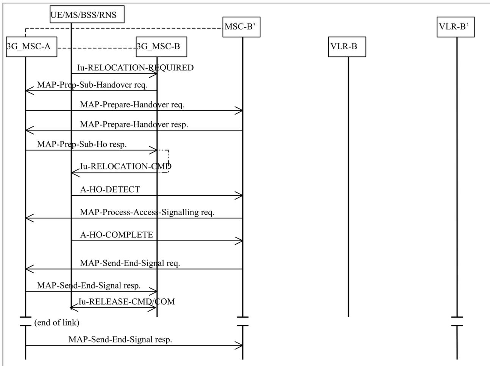

```

sequenceDiagram
    participant UE as UE/MS/BSS/RNS
    participant A as 3G_MSC-A
    participant B as 3G_MSC-B
    participant B_prime as MSC-B'
    participant VLRB as VLR-B
    participant VLRB_prime as VLR-B'

    B->>A: Iu-RELOCATION-REQUIRED
    A->>B: MAP-Prep-Sub-Handover req.
    B->>B_prime: MAP-Prepare-Handover req.
    B_prime-->>B: MAP-Prepare-Handover resp.
    B->>A: MAP-Prep-Sub-Ho resp.
    A->>B: Iu-RELOCATION-CMD
    B->>B_prime: A-HO-DETECT
    B_prime-->>B: MAP-Process-Access-Signalling req.
    B->>B_prime: A-HO-COMPLETE
    B_prime-->>B: MAP-Send-End-Signal req.
    B-->>B_prime: MAP-Send-End-Signal resp.
    A->>B: Iu-RELEASE-CMD/COM
    Note over A,B: (end of link)
    A->>B_prime: MAP-Send-End-Signal resp.
  
```

Sequence diagram for Subsequent UMTS to GSM handover procedure ii). The diagram shows the interaction between UE/MS/BSS/RNS, 3G\_MSC-A, 3G\_MSC-B, MSC-B', VLR-B, and VLR-B'.

**Figure 23: Subsequent UMTS to GSM handover procedure ii): Successful UMTS to GSM handover from 3G\_MSC-B to MSC-B' without circuit connection**

## 8.2 Handover GSM to UMTS

The following clauses describe two options for the Basic and Subsequent GSM to UMTS Handover procedures. The first, as described in subclauses 8.2.1 and 8.2.3 respectively, provides for a circuit connection between (3G\_)MSC-A and (3G\_)MSC-B. The second, as described in subclauses 8.2.2 and 8.2.4 respectively, provides for a Basic and Subsequent Handover without the provision of a circuit connection between (3G\_)MSC-A and (3G\_)MSC-B. In all the above mentioned clauses, the following principles apply:

- during the handover resource allocation, except for the messages explicitly indicated in b and c below, only the handover related messages that are part of the applicable BSSAP subset - as defined in 3GPP TS 49.008 [7] - shall be transferred on the E-interface;
- the trace related messages that are part of the applicable BSSAP subset - as defined in 3GPP TS 49.008 [7] - can be sent by the MSC-A on the E-interface after successful handover resource allocation. In subclauses 8.2.1 and 8.2.2, it is however allowed at basic handover initiation on the E-Interface to transfer one trace related message that is part of the applicable BSSAP subset - as defined in 3GPP TS 49.008 [7] - together with the applicable handover related message. The applicable handover related message shall always appear as the first message;
- during the handover resource allocation for subsequent inter-MSC inter-system handover according to subclauses 8.2.3 and 8.2.4, it is allowed to transfer either DTAP or RANAP Direct Transfer messages on the E-Interface between MSC-A and 3G\_MSC-B. RANAP Direct Transfer messages shall be used for this purpose if and only if the basic handover procedure was an inter MSC SRNS relocation;
- If 3G\_MSC-B or 3G-MSC-B' supports location reporting at change of Service Area, 3G\_MSC-B or 3G\_MSC-B' shall always initiate the Location Reporting Control procedure at change of Service Area towards the target RNS since no request for Location Reporting can be received from MSC-A. In that case, the Location Reporting

Control procedure shall be initiated by 3G\_MSC-B or 3G\_MSC-B' after the Relocation Resource Allocation procedure has been executed successfully. The change of Service Area shall be reported to MSC-A within an A-HANDOVER-PERFORMED message;

- e) during the handover execution, i.e. while the UE/MS is not in communication with the network, the MSC-A shall queue all outgoing BSSAP or RANAP messages until the communication with the UE/MS is resumed;
- f) during the execution of a basic inter-system inter-MSC handover to 3G\_MSC-B or a subsequent inter-system inter-MSC handover to a third 3G\_MSC-B', only the handover related messages and the A-Clear-Request message that are part of the applicable BSSAP subset - as defined in 3GPP TS 49.008 [7] – may be sent by the target MSC on the E-interface;
- g) during a subsequent inter-system inter-MSC handover back to 3G\_MSC-A or to a third 3G\_MSC-B', 3G\_MSC-B may initiate either an Iu-Release-Request procedure or an A-Clear-Request procedure on the E-interface. An Iu-Release-Request procedure shall be initiated only if the basic handover procedure was an inter-MSC SRNS relocation;
- h) finally, during supervision, i.e. while the UE/MS is not in the area of MSC-A after a successful Inter-3G\_MSC GSM to UMTS handover, the subset of BSSAP procedures and their related messages - as defined in 3GPP TS 49.008 [7] - shall apply on the E-Interface. As the only exception to this rule, in case of a subsequent inter-MSC SRNS relocation back to 3G\_MSC-A or to a third 3G\_MSC-B', during the relocation resource allocation, the relocation and trace related messages that are part of the applicable RANAP subset - as defined in 3GPP TS 29.108 [15] - shall be transferred on the E-interface (see subclause 8.3, a and b).

If a subsequent inter-MSC handover/relocation back to 3G\_MSC-A or to a third 3G\_MSC-B' is cancelled, then the supervision continues, and BSSAP procedures and their related messages shall apply on the E-interface;

- i) during the intra-3G\_MSC-B GSM to UMTS handover execution, if any, the 3G\_MSC-B shall queue all outgoing BSSAP or RANAP messages until the communication with the UE/MS is resumed.

### 8.2.1 Basic Handover procedure requiring a circuit connection between MSC-A and 3G\_MSC-B

The procedure used for successful Inter-3G\_MSC Handover from GSM to UMTS is shown in figure 24. Initiation of the GSM to UMTS handover procedure is described in clause 5. The procedure described in this clause makes use of messages from the 3GPP TS 48.008 [5], 3GPP TS 25.413 [11] and of the transport mechanism from the Mobile Application Part (MAP) (3GPP TS 29.002 [12]). After an Inter-3G\_MSC handover further Intra-3G\_MSC handovers may occur on 3G\_MSC-B, these handovers will follow the procedures specified in the previous clauses.

![Sequence diagram of Basic GSM to UMTS Handover Procedure requiring a circuit connection. Lifelines: UE/MS/BSS-A, MSC-A, 3G_MSC-B, RNS-B/UE/MS, VLR-B. The sequence starts with A-HO-REQUIRED from UE/MS/BSS-A to MSC-A. MSC-A sends MAP-Prep-Handover req. to 3G_MSC-B. 3G_MSC-B sends MAP-Allocate-Handover-Number req. to VLR-B. VLR-B sends Iu-RELOCATION-REQUEST to RNS-B/UE/MS. RNS-B/UE/MS sends Iu-RELOCATION-REQUEST-ACK to 3G_MSC-B. 3G_MSC-B sends MAP-Prep-Handover resp. to MSC-A. MSC-A sends IAM to 3G_MSC-B. 3G_MSC-B sends MAP-Send-Handover-Report req. to VLR-B. VLR-B sends MAP-Send-Handover-Report resp. (1) to 3G_MSC-B. 3G_MSC-B sends ACM to MSC-A. MSC-A sends A-HO-COMMAND to UE/MS/BSS-A. 3G_MSC-B sends Iu-RELOCATION-DETECT to RNS-B/UE/MS. MSC-A sends MAP-Process-Access-Sig req. to 3G_MSC-B. 3G_MSC-B sends Iu-RELOCATION-COMPLETE to RNS-B/UE/MS. MSC-A sends A-CLR-CMD/COM to UE/MS/BSS-A. MSC-A sends MAP-Send-End-Signal req. to 3G_MSC-B. 3G_MSC-B sends ANSWER to MSC-A. MSC-A sends RELEASE to 3G_MSC-B. 3G_MSC-B sends MAP-Send-End-Signal resp. to MSC-A. The sequence ends with 'End of call'.](575d7d345b3ec04393bb2ec720ebabca_img.jpg)

```

sequenceDiagram
    participant UE/MS/BSS-A
    participant MSC-A
    participant 3G_MSC-B
    participant RNS-B/UE/MS
    participant VLR-B

    Note left of UE/MS/BSS-A: Error:
    Note right of RNS-B/UE/MS: Error: Reference source not

    UE/MS/BSS-A->>MSC-A: A-HO-REQUIRED
    MSC-A->>3G_MSC-B: MAP-Prep-Handover req.
    3G_MSC-B->>VLR-B: MAP-Allocate-Handover-Number req.
    VLR-B->>RNS-B/UE/MS: Iu-RELOCATION-REQUEST
    RNS-B/UE/MS->>3G_MSC-B: Iu-RELOCATION-REQUEST-ACK
    3G_MSC-B->>MSC-A: MAP-Prep-Handover resp.
    MSC-A->>3G_MSC-B: IAM
    3G_MSC-B->>VLR-B: MAP-Send-Handover-Report req.
    VLR-B->>3G_MSC-B: MAP-Send-Handover-Report resp. (1)
    3G_MSC-B->>MSC-A: ACM
    MSC-A->>UE/MS/BSS-A: A-HO-COMMAND
    3G_MSC-B->>RNS-B/UE/MS: Iu-RELOCATION-DETECT
    MSC-A->>3G_MSC-B: MAP-Process-Access-Sig req.
    3G_MSC-B->>RNS-B/UE/MS: Iu-RELOCATION-COMPLETE
    MSC-A->>UE/MS/BSS-A: A-CLR-CMD/COM
    MSC-A->>3G_MSC-B: MAP-Send-End-Signal req.
    3G_MSC-B->>MSC-A: ANSWER
    MSC-A->>3G_MSC-B: RELEASE
    3G_MSC-B->>MSC-A: MAP-Send-End-Signal resp.
    Note left of MSC-A: End of call
  
```

Sequence diagram of Basic GSM to UMTS Handover Procedure requiring a circuit connection. Lifelines: UE/MS/BSS-A, MSC-A, 3G\_MSC-B, RNS-B/UE/MS, VLR-B. The sequence starts with A-HO-REQUIRED from UE/MS/BSS-A to MSC-A. MSC-A sends MAP-Prep-Handover req. to 3G\_MSC-B. 3G\_MSC-B sends MAP-Allocate-Handover-Number req. to VLR-B. VLR-B sends Iu-RELOCATION-REQUEST to RNS-B/UE/MS. RNS-B/UE/MS sends Iu-RELOCATION-REQUEST-ACK to 3G\_MSC-B. 3G\_MSC-B sends MAP-Prep-Handover resp. to MSC-A. MSC-A sends IAM to 3G\_MSC-B. 3G\_MSC-B sends MAP-Send-Handover-Report req. to VLR-B. VLR-B sends MAP-Send-Handover-Report resp. (1) to 3G\_MSC-B. 3G\_MSC-B sends ACM to MSC-A. MSC-A sends A-HO-COMMAND to UE/MS/BSS-A. 3G\_MSC-B sends Iu-RELOCATION-DETECT to RNS-B/UE/MS. MSC-A sends MAP-Process-Access-Sig req. to 3G\_MSC-B. 3G\_MSC-B sends Iu-RELOCATION-COMPLETE to RNS-B/UE/MS. MSC-A sends A-CLR-CMD/COM to UE/MS/BSS-A. MSC-A sends MAP-Send-End-Signal req. to 3G\_MSC-B. 3G\_MSC-B sends ANSWER to MSC-A. MSC-A sends RELEASE to 3G\_MSC-B. 3G\_MSC-B sends MAP-Send-End-Signal resp. to MSC-A. The sequence ends with 'End of call'.

NOTE: Can be sent at any time after the reception of IAM.

**Figure 24: Basic GSM to UMTS Handover Procedure requiring a circuit connection**

The GSM to UMTS handover is initiated as described in subclause 6.2.2. (This is represented by A-HO-REQUIRED in figure 24). Upon receipt of the A-HO-REQUIRED from BSS-A, MSC-A shall send a MAP-PREPARE-HANDOVER request to 3G\_MSC-B including a complete A-HO-REQUEST message.

NOTE: MSC-A shall not send further MAP-PREPARE-HANDOVER requests while a MAP-PREPARE-HANDOVER response is pending or before any timeouts.

The MAP-PREPARE-HANDOVER request shall carry in the A-HO-REQUEST all information needed by 3G\_MSC-B for allocating radio resources in RNS-B, see 3GPP TS 48.008 [5].

The MAP-PREPARE-HANDOVER request shall also carry the identity of the target RNS to which the call is to be handed over, see 3GPP TS 29.002 [12].

If MSC-A supports inter-system handover to a CSG cell and BSS-A includes a CSG ID for the target cell in the A-HANDOVER-REQUIRED message, then MSC-A shall check the CSG membership of the UE for the target cell as described in subclause 4.1.1 before generating the MAP-PREPARE-HANDOVER request. If the UE fails the CSG membership check and the target cell is a CSG cell, MSC-A shall send an A-HANDOVER-REQUIRED-REJECT to BSS-A.

If MSC-A supports inter-system handover to a CSG cell, the target cell belongs to the registered PLMN or an equivalent PLMN, and the HLR or the CSS provided CSG subscription data, MSC-A shall include the CSG subscription data for the registered PLMN and, if available, for the equivalent PLMNs in the MAP-PREPARE-HANDOVER request.

3G\_MSC-B will return the MAP-PREPARE-HANDOVER response after having retrieved a Handover Number from its associated VLR (exchange of the messages MAP-allocate-handover-number request and MAP-send-handover-report request). The Handover Number shall be used for routing the connection of the call from MSC-A to 3G\_MSC-B.

For speech calls, if 3G\_MSC-B supports the selection of codec based on the Iu-Supported Codecs List, 3G\_MSC-B shall select an Iu Selected codec from the Iu Supported Codecs List, generate associated RAB parameters and connect a

transcoder. If the Iu Supported Codecs List was not received or 3G\_MSC-B does not support the selection of codec based on the Iu-Supported Codecs List, 3G\_MSC-B shall select the appropriate default speech codec.

For handover to UTRAN Iu mode, 3G\_MSC-B shall also generate a NAS Synch Indicator for the Iu-RELOCATION-REQUEST message. If the Iu Supported Codecs List was received by 3G\_MSC-B and 3G\_MSC-B supports the selection of codec based on the Iu-Supported Codecs List, then the Iu Selected codec shall be indicated in the MAP-PREPARE-HANDOVER response, sent from 3G\_MSC-B to MSC-A.

If A over IP is supported by MSC-A, then for speech calls MSC-A may include the AoIP-Supported Codecs List (Anchor) in the MAP-PREPARE-HANDOVER request to be used by 3G\_MSC-B for subsequent intra-MSC-B intersystem handover to A over IP capable BSC. For a detailed description of the handling of this codec list by MSC-A and 3G\_MSC-B see 3GPP TS 23.153 [25].

If radio resources are available in RNS-B the MAP-PREPARE-HANDOVER response will contain the complete A-HO-REQUEST-ACK message generated from the Iu-RELOCATION-REQUEST-ACK received from RNS-B, containing the radio resources definition to be sent by BSS-A to the UE/MS. If the radio resource allocation is not possible, the MAP-PREPARE-HANDOVER response containing an A-HO-FAILURE will be sent to MSC-A. 3G\_MSC-B will do the same if a fault is detected on the identity of the cell where the call has to be handed over. 3G\_MSC-B simply reports the events related to the dialogue. It is up to MSC-A to decide the action to perform if it receives negative responses or the operation fails due to the expiry of the MAP-PREPARE-HANDOVER timer.

If an error related to the TCAP dialogue or to the MAP-PREPARE-HANDOVER request is returned from 3G\_MSC-B, this will be indicated to MSC-A and MSC-A will terminate the handover attempt. MSC-A shall reject the handover attempt towards BSS-A. The existing connection to the UE/MS shall not be cleared.

When the A-HO-REQUEST-ACK has been received, MSC-A shall establish a circuit between MSC-A and 3G\_MSC-B by signalling procedures supported by the network. In figure 24 this is illustrated by the messages IAM (Initial Address Message) and ACM (Address Complete Message) of Signalling System no 7. 3G\_MSC-B awaits the capturing of the UE/MS (subclause 6.2.2) on the radio path when the ACM is sent and MSC-A initiates the handover execution when ACM is received (illustrated by the A-HO-COMMAND and described in subclause 6.2.2).

If the BSS-A was connected via an A interface over IP and no transcoding performed in the BSS then MSC-A shall remove the transcoder between the MSC and the other party.

3G\_MSC-B transfers to MSC-A the acknowledgement received from the correct UE/MS (A-HO-DETECT/A-HO-COMPLETE). The Iu-RELOCATION-DETECT, if received, is converted to A-HO-DETECT and transferred to MSC-A using the MAP-PROCESS-ACCESS-SIGNALLING request. The Iu-RELOCATION-COMPLETE, when received from the correct UE/MS, is converted to A-HO-COMPLETE and included in the MAP-SEND-END-SIGNAL request and sent back to MSC-A. The circuit is through-connected in MSC-A when the A-HO-DETECT or the A-HO-COMPLETE is received from 3G\_MSC-B. The old radio channel is released when the A-HO-COMPLETE message is received from 3G\_MSC-B. The sending of the MAP-SEND-END-SIGNAL request starts the MAP supervision timer for the MAP dialogue between MSC-A and 3G\_MSC-B. When the MAP-SEND-END-SIGNAL request including the A-HO-COMPLETE message is received in MSC-A the resources in BSS-A shall be cleared.

In order not to conflict with the PSTN/ISDN signalling system(s) used between MSC-A and 3G\_MSC-B, 3G\_MSC-B must generate an answer signal when Iu-RELOCATION-DETECT/COMPLETE is received.

3G\_MSC-B shall release the Handover Number when the circuit between MSC-A and 3G\_MSC-B has been established.

If the circuit between MSC-A and 3G\_MSC-B cannot be established (e.g. an unsuccessful backward message is received instead of ACM). MSC-A terminates the inter3G\_MSC handover attempt by sending an appropriate MAP message, for example an ABORT.

MSC-A shall retain overall call control until the call is cleared by the fixed subscriber or the UE/MS and there is no further call control functions to be performed (e.g. servicing waiting calls, echo cancellers).

When MSC-A clears the call to the UE/MS it also clears the call control functions in MSC-A and sends the MAP-SEND-END-SIGNAL response to release the MAP resources in 3G\_MSC-B.

MSC-A may terminate the procedure at any time by sending an appropriate MAP message to 3G\_MSC-B. If establishment of the circuit between MSC-A and 3G\_MSC-B has been initiated, the circuit must also be cleared.

The GSM to UMTS handover will be aborted by MSC-A if it detects clearing or interruption of the radio path before the call has been established on 3G\_MSC-B.

### 8.2.2 Basic GSM to UMTS Handover procedure not requiring the establishment of a circuit connection between MSC-A and 3G\_MSC-B

The basic GSM to UMTS handover procedures to be used when no circuit connection is required by MSC-A are similar to those described in subclause 8.2.1 for circuit switched calls. The main differences to the procedures described in subclause 8.2.1 relate to the establishment of circuits between the network entities and the Handover Number allocation.

In the case of basic GSM to UMTS handover, MSC-A shall specify to 3G\_MSC-B that no Handover Number is required in the MAP-PREPARE-HANDOVER request (see 3GPP TS 29.002 [12]). As for the basic GSM to UMTS handover using a circuit connection, the A-HO-REQUEST is transmitted at the same time. Any subsequent Handover Number allocation procedure will not be invoked until the completion of the basic GSM to UMTS handover procedure (see clause: Subsequent Channel Assignment using a circuit connection). 3G\_MSC-B shall then perform the radio resources allocation as described in subclause 8.2.1. The MAP-PREPARE-HANDOVER response shall be returned to MSC-A including either the translated response of the radio resources allocation request received from RNS-B (A-HO-REQUEST-ACK/A-HO-FAILURE). The basic GSM to UMTS handover procedure will continue as described in clause 8.2.1 except that no circuit connection will be established towards 3G\_MSC-B.

The relevant case for the basic GSM to UMTS handover without circuit connection is shown in figure 25. As can be seen the major differences to the equivalent figure 24 are the omission of any circuit establishment messaging and the omission of handover number allocation signalling.


```

sequenceDiagram
    participant UE/MS/BSS-A
    participant MSC-A
    participant 3G_MSC-B
    participant RNS-B/UE/MS
    participant VLR-B

    Note left of UE/MS/BSS-A: End of link
    UE/MS/BSS-A->>MSC-A: A-HO-REQUIRED
    MSC-A->>3G_MSC-B: MAP-Prep-Handover req.
    3G_MSC-B->>RNS-B/UE/MS: Iu-RELOCATION-REQUEST
    RNS-B/UE/MS-->>3G_MSC-B: Iu-RELOCATION-REQUEST-ACK
    3G_MSC-B-->>MSC-A: MAP-Prep-Handover resp.
    MSC-A->>UE/MS/BSS-A: A-HO-COMMAND
    MSC-A->>3G_MSC-B: MAP-Process-Access-Sig req.
    3G_MSC-B->>RNS-B/UE/MS: Iu-RELOCATION-DETECT
    RNS-B/UE/MS-->>3G_MSC-B: Iu-RELOCATION-COMPLETE
    3G_MSC-B-->>MSC-A: MAP-Send-End-Signal req.
    MSC-A->>UE/MS/BSS-A: A-CLR-CMD/COM
    MSC-A-->>3G_MSC-B: MAP-Send-End-Signal resp.
  
```

Sequence diagram of Basic GSM to UMTS Handover Procedure without circuit connection. Lifelines: UE/MS/BSS-A, MSC-A, 3G\_MSC-B, RNS-B/UE/MS, VLR-B. The sequence shows the flow of signaling messages between these entities to complete the handover without establishing a circuit connection between MSC-A and 3G\_MSC-B.

Figure 25: Basic GSM to UMTS Handover Procedure without circuit connection

### 8.2.3 Procedure for subsequent GSM to UMTS handover requiring a circuit connection

After the call has been handed over to MSC-B, if the UE/MS leaves the GSM area of MSC-B during the same call and enters a UTRAN area, subsequent GSM to UMTS handover is necessary in order to continue the connection.

The following cases apply:

- the UE/MS moves back to the area of 3G\_MSC-A;
- the UE/MS moves into the area of a third 3G\_MSC (3G\_MSC-B').

In both cases the call is switched in 3G\_MSC-A; the circuit between 3G\_MSC-A and MSC-B shall be released after a successful subsequent handover has been performed.

#### 8.2.3.1 Description of subsequent GSM to UMTS handover procedure i): MSC-B to 3G\_MSC-A

The procedure for successful GSM to UMTS handover from MSC-B back to 3G\_MSC-A is shown in figure 26.

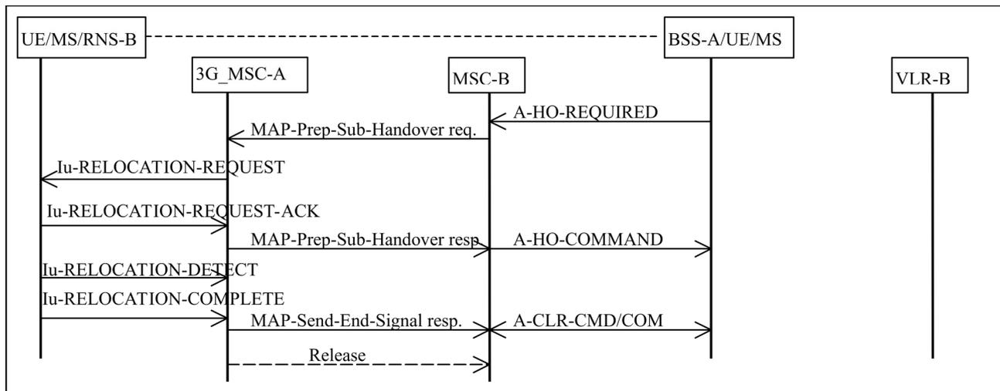

```

sequenceDiagram
    participant UE/MS/RNS-B
    participant 3G_MSC-A
    participant MSC-B
    participant BSS-A/UE/MS
    participant VLR-B

    Note left of UE/MS/RNS-B: UE/MS/RNS-B
    Note right of BSS-A/UE/MS: BSS-A/UE/MS
    Note right of VLR-B: VLR-B

    BSS-A/UE/MS->>MSC-B: A-HO-REQUIRED
    MSC-B->>3G_MSC-A: MAP-Prep-Sub-Handover req.
    3G_MSC-A->>UE/MS/RNS-B: Iu-RELOCATION-REQUEST
    UE/MS/RNS-B->>3G_MSC-A: Iu-RELOCATION-REQUEST-ACK
    3G_MSC-A->>MSC-B: MAP-Prep-Sub-Handover resp.
    MSC-B->>BSS-A/UE/MS: A-HO-COMMAND
    UE/MS/RNS-B->>3G_MSC-A: Iu-RELOCATION-DETECT
    UE/MS/RNS-B->>3G_MSC-A: Iu-RELOCATION-COMPLETE
    3G_MSC-A->>MSC-B: MAP-Send-End-Signal resp.
    MSC-B->>BSS-A/UE/MS: A-CLR-CMD/COM
    3G_MSC-A-->>MSC-B: Release
  
```

Sequence diagram of the subsequent GSM to UMTS handover procedure i): successful handover from MSC-B to 3G\_MSC-A using a circuit connection. The diagram shows the interaction between UE/MS/RNS-B, 3G\_MSC-A, MSC-B, BSS-A/UE/MS, and VLR-B.

**Figure 26: Subsequent GSM to UMTS handover procedure i): successful handover from MSC-B to 3G\_MSC-A using a circuit connection**

The procedure is as follows.

If MSC-B supports inter-system handover to a CSG cell, 3G\_MSC-A provided CSG subscription data during the basic inter-MSC handover, and BSS-A includes a CSG ID for the target cell in the A-HANDOVER-REQUIRED message, then MSC-B shall check the CSG membership of the UE for the target cell as described in subclause 4.2.1 before generating the MAP-PREPARE- SUBSEQUENT-HANDOVER request. If the UE fails the CSG membership check and the target cell is a CSG cell, MSC-B shall send an A-HANDOVER-REQUIRED-REJECT to BSS-A.

MSC-B sends the MAP-PREPARE-SUBSEQUENT-HANDOVER request to 3G\_MSC-A indicating the new MSC number (3G\_MSC-A number), indicating also the identity of the target RNS where the call has to be handed over and including a complete A-HO-REQUEST message. (NOTE: MSC-B shall not send further MAP-PREPARE-SUBSEQUENT-HANDOVER requests while a handover attempt is pending or before any timeouts). Since 3G\_MSC-A is the call controlling MSC, this MSC needs no Handover Number for routing purposes; 3G\_MSC-A can immediately initiate the search for free radio resources. 3G\_MSC-A then inserts a transcoder between its RNS and the connection to the other party.

When radio resources can be assigned, 3G\_MSC-A shall return in the MAP-PREPARE-SUBSEQUENT-HANDOVER response the complete A-HO-REQUEST-ACK message generated from the Iu-RELOCATION-REQUEST-ACK received from the RNS-B and possible extra BSSMAP information, amended by 3G\_MSC-A due to the possible interworking between the BSSMAP protocol carried on the E-interface and the RANAP protocol used on the Iu-interface. If radio resources cannot be assigned or if a fault is detected on the target cell identity, or the target cell identity in the A-HO-REQUEST is not consistent with the target MSC number, the MAP-PREPARE-SUBSEQUENT-HANDOVER response containing an A-HO-FAILURE message shall be given to MSC-B, in addition MSC-B shall maintain the connection with the UE/MS.

If the procedure in 3G\_MSC-A is successful then MSC-B can request the UE/MS to return to the new RNS-B on 3G\_MSC-A. This is illustrated in figure 26 by the A-HO-COMMAND message. The operation is successfully completed when 3G\_MSC-A receives the Iu-RELOCATION-COMPLETE message.

After GSM to UMTS handover 3G\_MSC-A shall release the circuit to MSC-B.

3G\_MSC-A must also terminate the MAP procedure for the basic handover between 3G\_MSC-A and MSC-B by sending an appropriate MAP message. MSC-B will clear the resources in BSS-A when the MAP-SEND-END-SIGNAL response is received.

#### 8.2.3.2 Description of subsequent GSM to UMTS handover procedure ii): MSC-B to 3G\_MSC-B'

The procedure for successful GSM to UMTS handover from MSC-B to 3G\_MSC-B' is shown in figure 27.

The procedure consists of two parts:

- a subsequent handover from MSC-B back to MSC-A as described in subclause 7.3.1 (the same procedures apply if MSC-A is replaced by 3G\_MSC-A); and
- a basic GSM to UMTS handover from MSC-A to 3G\_MSC-B' as described in subclause 8.2.1.

If MSC-B supports inter-system handover to a CSG cell and BSS-A includes a CSG ID for the target cell in the A-HANDOVER-REQUIRED message, then MSC-B shall check the CSG membership of the UE for the target cell as described in subclause 8.2.3.1 before initiating the procedure, and reject the handover if necessary.

MSC-B sends the MAP-PREPARE-SUBSEQUENT-HANDOVER request to MSC-A indicating a new MSC number (which is the identity of 3G\_MSC-B'), indicating also the identity of the target RNS where the call has to be handed over and including a complete A-HO-REQUEST, MSC-A then starts a basic handover procedure towards 3G\_MSC-B'.

If MSC-A supports A interface over IP, then for speech calls MSC-A may include the AoIP-Supported Codecs List (Anchor) in the MAP-PREPARE-HANDOVER request towards 3G\_MSC-B'. For a detailed description of the handling of this codec list by MSC-A and 3G\_MSC-B' see 3GPP TS 23.153 [25].

When MSC-A receives the ACM from 3G\_MSC-B', MSC-A informs MSC-B that 3G\_MSC-B' has successfully allocated the radio resources on RNS-B' side by sending the MAP-PREPARE-SUBSEQUENT-HANDOVER response containing the complete A-HO-REQUEST-ACK generated from the RELOCATION-REQUEST-ACK received from RNS-B' and possible extra BSSMAP information, amended by MSC-A due to the possible interworking between the BSSMAP protocol carried on the E-interface between MSC-A and 3G\_MSC-B' and the BSSMAP protocol carried on the E-interface between MSC-A and MSC-B. Now MSC-B can start the procedure on the radio path.

For MSC-A the handover is completed when it has received the MAP-SEND-END-SIGNAL REQUEST from 3G\_MSC-B' containing the A-HO-COMPLETE generated from Iu-RELOCATION COMPLETE received from the RNS-B'. The circuit between MSC-A and MSC-B is released. MSC-A also sends the MAP-SEND-END-SIGNAL response to MSC-B in order to terminate the original MAP dialogue between MSC-A and MSC-B. MSC-B releases the radio resources when it receives this message.

If no radio resources can be allocated by 3G\_MSC-B' or no circuit between MSC-A and 3G\_MSC-B' can be established or a fault is detected on the target cell identity or the target cell identity in the A-HO-REQUEST is not consistent with the target MSC number, MSC-A informs MSC-B by using the A-HO-FAILURE message included in the MAP-PREPARE-SUBSEQUENT-HANDOVER response. MSC-B shall maintain the existing connection with the UE/MS.

When the subsequent GSM to UMTS handover is completed, 3G\_MSC-B' is considered as 3G\_MSC-B. Any further inter-MSC handover is handled as described above for a subsequent handover.

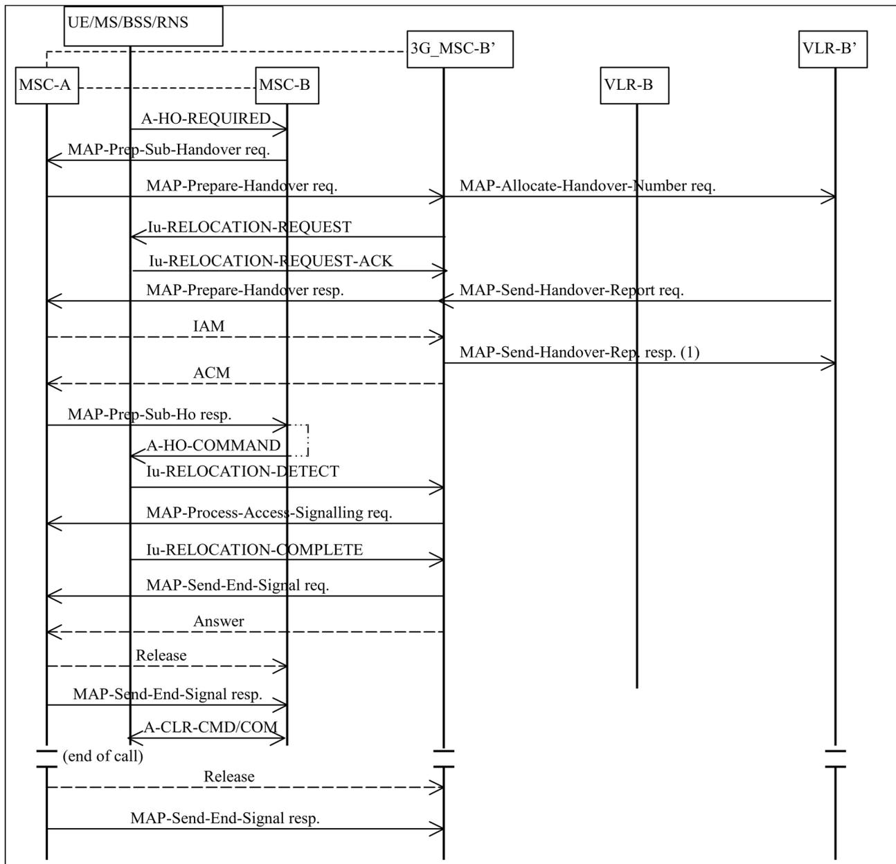

```

sequenceDiagram
    participant UE as UE/MS/BSS/RNS
    participant MSCA as MSC-A
    participant MSCB as MSC-B
    participant GMSCB as 3G_MSC-B'
    participant VLRB as VLR-B
    participant VLRB_prime as VLR-B'

    UE->>MSCB: A-HO-REQUIRED
    MSCB->>MSCA: MAP-Prep-Sub-Handover req.
    MSCA->>GMSCB: MAP-Prepare-Handover req.
    GMSCB->>VLRB_prime: MAP-Allocate-Handover-Number req.
    GMSCB->>MSCB: Iu-RELOCATION-REQUEST
    MSCB->>GMSCB: Iu-RELOCATION-REQUEST-ACK
    GMSCB->>MSCA: MAP-Prepare-Handover resp.
    MSCA->>VLRB: IAM
    VLRB_prime->>GMSCB: MAP-Send-Handover-Report req.
    GMSCB->>VLRB_prime: MAP-Send-Handover-Rep. resp. (1)
    MSCA->>MSCB: MAP-Prep-Sub-Ho resp.
    MSCB->>UE: A-HO-COMMAND
    MSCB->>GMSCB: Iu-RELOCATION-DETECT
    GMSCB->>MSCA: MAP-Process-Access-Signalling req.
    MSCA->>MSCB: Iu-RELOCATION-COMPLETE
    MSCA->>GMSCB: MAP-Send-End-Signal req.
    MSCA->>MSCB: Answer
    MSCA->>MSCB: Release
    MSCB->>MSCA: MAP-Send-End-Signal resp.
    MSCB->>UE: A-CLR-CMD/COM
    Note over MSCA, MSCB: (end of call)
    MSCA->>GMSCB: Release
    GMSCB->>MSCA: MAP-Send-End-Signal resp.
    
```

Sequence diagram for Subsequent GSM to UMTS handover procedure ii): Successful handover from MSC-B to 3G\_MSC-B' requiring a circuit connection.

NOTE 1: Can be sent at any time after the reception of IAM.

**Figure 27: Subsequent GSM to UMTS handover procedure ii): Successful handover from MSC-B to 3G\_MSC-B' requiring a circuit connection**

### 8.2.4 Procedure for subsequent GSM to UMTS handover not requiring a circuit connection

As for the subsequent GSM to UMTS handover with a circuit connection, the same two cases of subsequent handover apply:

- i) the UE/MS moves back to the area of 3G\_MSC-A;
- ii) the UE/MS moves into the area of a third 3G\_MSC (3G\_MSC-B').

#### 8.2.4.1 Description of subsequent GSM to UMTS handover procedure without circuit connection i): MSC-B to 3G\_MSC-A

The procedure for successful GSM to UMTS handover from MSC-B back to 3G\_MSC-A without circuit connection is shown in figure 28. The only difference with the figure 26, is that no circuit release is needed between 3G\_MSC-A and MSC-B.

![Sequence diagram for Figure 28: Subsequent GSM to UMTS handover procedure i). The diagram shows the interaction between UE/MS/RNS-B, 3G_MSC-A, MSC-B, BSS-A/UE/MS, and VLR-B. The sequence of messages is: 1. BSS-A/UE/MS sends A-HO-REQUIRED to MSC-B. 2. MSC-B sends MAP-Prep-Sub-Handover req. to 3G_MSC-A. 3. 3G_MSC-A sends Iu-RELOCATION-REQUEST to UE/MS/RNS-B. 4. UE/MS/RNS-B sends Iu-RELOCATION-REQUEST-ACK to 3G_MSC-A. 5. 3G_MSC-A sends MAP-Prep-Sub-Handover resp. to MSC-B. 6. MSC-B sends A-HO-COMMAND to BSS-A/UE/MS. 7. BSS-A/UE/MS sends Iu-RELOCATION-DETECT to 3G_MSC-A. 8. 3G_MSC-A sends Iu-RELOCATION-COMPLETE to UE/MS/RNS-B. 9. UE/MS/RNS-B sends MAP-Send-End-Signal resp. to 3G_MSC-A. 10. 3G_MSC-A sends A-CLR-CMD/COM to MSC-B.](9b9262a549828579ab904148450734f6_img.jpg)

```

sequenceDiagram
    participant UE/MS/RNS-B
    participant 3G_MSC-A
    participant MSC-B
    participant BSS-A/UE/MS
    participant VLR-B

    Note left of UE/MS/RNS-B: UE/MS/RNS-B
    Note right of BSS-A/UE/MS: BSS-A/UE/MS
    Note right of VLR-B: VLR-B

    BSS-A/UE/MS->>MSC-B: A-HO-REQUIRED
    MSC-B->>3G_MSC-A: MAP-Prep-Sub-Handover req.
    3G_MSC-A->>UE/MS/RNS-B: Iu-RELOCATION-REQUEST
    UE/MS/RNS-B->>3G_MSC-A: Iu-RELOCATION-REQUEST-ACK
    3G_MSC-A->>MSC-B: MAP-Prep-Sub-Handover resp.
    MSC-B->>BSS-A/UE/MS: A-HO-COMMAND
    BSS-A/UE/MS->>3G_MSC-A: Iu-RELOCATION-DETECT
    3G_MSC-A->>UE/MS/RNS-B: Iu-RELOCATION-COMPLETE
    UE/MS/RNS-B->>3G_MSC-A: MAP-Send-End-Signal resp.
    3G_MSC-A->>MSC-B: A-CLR-CMD/COM
  
```

Sequence diagram for Figure 28: Subsequent GSM to UMTS handover procedure i). The diagram shows the interaction between UE/MS/RNS-B, 3G\_MSC-A, MSC-B, BSS-A/UE/MS, and VLR-B. The sequence of messages is: 1. BSS-A/UE/MS sends A-HO-REQUIRED to MSC-B. 2. MSC-B sends MAP-Prep-Sub-Handover req. to 3G\_MSC-A. 3. 3G\_MSC-A sends Iu-RELOCATION-REQUEST to UE/MS/RNS-B. 4. UE/MS/RNS-B sends Iu-RELOCATION-REQUEST-ACK to 3G\_MSC-A. 5. 3G\_MSC-A sends MAP-Prep-Sub-Handover resp. to MSC-B. 6. MSC-B sends A-HO-COMMAND to BSS-A/UE/MS. 7. BSS-A/UE/MS sends Iu-RELOCATION-DETECT to 3G\_MSC-A. 8. 3G\_MSC-A sends Iu-RELOCATION-COMPLETE to UE/MS/RNS-B. 9. UE/MS/RNS-B sends MAP-Send-End-Signal resp. to 3G\_MSC-A. 10. 3G\_MSC-A sends A-CLR-CMD/COM to MSC-B.

**Figure 28: Subsequent GSM to UMTS handover procedure i): Successful handover from MSC-B to 3G\_MSC-A not requiring a circuit connection**

#### 8.2.4.2 Description of subsequent GSM to UMTS handover procedure without circuit connection ii): MSC-B to 3G\_MSC-B'

The procedure for successful GSM to UMTS handover from MSC-B to 3G\_MSC-B' is shown in figure 29.

The procedure consists of two parts:

- a subsequent handover from MSC-B back to MSC-A as described in subclause 7.4.1 (the same procedures apply if MSC-A is replaced by 3G\_MSC-A); and
- a basic GSM to UMTS handover from MSC-A to 3G\_MSC-B' as described in subclause 8.2.2.

The only difference to the equivalent figure 27 is the omission of the circuit and handover number allocation signallings.

![Sequence diagram for Subsequent GSM to UMTS handover procedure ii). Lifelines: UE/MS/BSS/RNS, MSC-A, MSC-B, 3G_MSC-B', VLR-B, VLR-B'. The sequence shows a successful handover from MSC-B to 3G_MSC-B' without circuit connection. Key messages include A-HO-REQUIRED, MAP-Prepare-Handover req., Iu-RELOCATION-REQUEST, Iu-RELOCATION-REQUEST-ACK, MAP-Prepare-Handover resp., MAP-Prep-Sub-Ho resp., A-HO-COMMAND, Iu-RELOCATION-DETECT, MAP-Process-Access-Signalling req., Iu-RELOCATION_COMPLETE, MAP-Send-End-Signal req., MAP-Send-End-Signal resp., and A-CLR-CMD/COM. A break in the link occurs between the 10th and 11th messages.](5e9af8986a5845504f251d3079da8078_img.jpg)

```

sequenceDiagram
    participant UE/MS/BSS/RNS
    participant MSC-A
    participant MSC-B
    participant 3G_MSC-B'
    participant VLR-B
    participant VLR-B'

    Note right of UE/MS/BSS/RNS: (end of link)

    MSC-B->>MSC-A: A-HO-REQUIRED
    MSC-A->>MSC-B: MAP-Prep-Sub-Handover req.
    MSC-B->>3G_MSC-B': MAP-Prepare-Handover req.
    3G_MSC-B'->>MSC-B: Iu-RELOCATION-REQUEST
    MSC-B->>3G_MSC-B': Iu-RELOCATION-REQUEST-ACK
    3G_MSC-B'->>MSC-A: MAP-Prepare-Handover resp.
    MSC-A->>MSC-B: MAP-Prep-Sub-Ho resp.
    MSC-B->>MSC-A: A-HO-COMMAND
    MSC-B->>3G_MSC-B': Iu-RELOCATION-DETECT
    3G_MSC-B'->>MSC-A: MAP-Process-Access-Signalling req.
    MSC-A->>3G_MSC-B': Iu-RELOCATION_COMPLETE
    3G_MSC-B'->>MSC-A: MAP-Send-End-Signal req.
    MSC-A->>MSC-B: MAP-Send-End-Signal resp.
    MSC-B->>MSC-A: A-CLR-CMD/COM

    Note right of UE/MS/BSS/RNS: (end of link)

    MSC-A->>3G_MSC-B': MAP-Send-End-Signal resp.
  
```

Sequence diagram for Subsequent GSM to UMTS handover procedure ii). Lifelines: UE/MS/BSS/RNS, MSC-A, MSC-B, 3G\_MSC-B', VLR-B, VLR-B'. The sequence shows a successful handover from MSC-B to 3G\_MSC-B' without circuit connection. Key messages include A-HO-REQUIRED, MAP-Prepare-Handover req., Iu-RELOCATION-REQUEST, Iu-RELOCATION-REQUEST-ACK, MAP-Prepare-Handover resp., MAP-Prep-Sub-Ho resp., A-HO-COMMAND, Iu-RELOCATION-DETECT, MAP-Process-Access-Signalling req., Iu-RELOCATION\_COMPLETE, MAP-Send-End-Signal req., MAP-Send-End-Signal resp., and A-CLR-CMD/COM. A break in the link occurs between the 10th and 11th messages.

**Figure 29: Subsequent GSM to UMTS handover procedure ii): Successful handover from MSC-B to 3G\_MSC-B' without circuit connection**

## 8.3 SRNS Relocation

The following clauses describe two options for the Basic and Subsequent Relocation procedures. The first, as described in subclauses 8.3.1 and 8.3.3 respectively, provides for a circuit connection between 3G\_MSC-A and 3G\_MSC-B. The second, as described in subclauses 8.3.2 and 8.3.4 respectively, provides for a Basic and Subsequent Relocation without the provision of a circuit connection between 3G\_MSC-A and 3G\_MSC-B.

In all the above mentioned clauses, the following principles apply:

- during the relocation resource allocation, except for the messages explicitly indicated in b and c below, only the relocation related messages that are part of the applicable RANAP subset - as defined in 3GPP TS 29.108 [15] - shall be transferred on the E-interface;
- the trace related messages that are part of the applicable RANAP subset - as defined in 3GPP TS 29.108 [15] - can be sent by the 3G\_MSC-A on the E-interface after successful relocation resource allocation. In the clauses 8.3.1 and 8.3.2, it is however allowed at basic relocation initiation on the E-Interface to transfer one trace invocation related message that is part of the applicable RANAP subset - as defined in 3GPP TS 29.108 [15] - together with the applicable relocation related message. The applicable relocation related message shall always appear as the first message;
- during the relocation resource allocation for subsequent inter- MSC SRNS relocation according to subclauses 8.3.3 and 8.3.4, it is allowed to transfer either DTAP or RANAP Direct Transfer messages on the E-Interface between 3G\_MSC-A and 3G\_MSC-B. RANAP Direct Transfer messages shall be used for this purpose if and only if the basic handover procedure was an inter MSC SRNS relocation;

- d) the Iu-Location Reporting Control message which belongs to the applicable RANAP subset - as defined in 3GPP TS 29.108 [15] - can be sent by the 3G\_MSC-A on the E-interface after successful relocation resource allocation;
- e) during the relocation execution, i.e. while the UE is not in communication with the network, the 3G\_MSC-A shall queue all outgoing RANAP or BSSAP messages until the communication with the UE is resumed;
- f) during the execution of a basic inter-MSC SRNS relocation to 3G\_MSC-B or a subsequent inter-MSC SRNS relocation to a third 3G\_MSC-B', only the relocation related messages and the Iu-Release-Request message that are part of the applicable RANAP subset - as defined in 3GPP TS 29.108 [15] - may be sent by the target MSC on the E-interface;
- g) during a subsequent inter-MSC SRNS relocation back to 3G\_MSC-A or to a third 3G\_MSC-B', 3G\_MSC-B may initiate either an Iu-Release-Request procedure or an A-Clear-Request procedure on the E-interface. An Iu-Release-Request procedure shall be initiated only if the basic handover procedure was an inter-MSC SRNS relocation;
- h) finally, during supervision, i.e. while the UE is not in the area of 3G\_MSC-A after a successful Inter-3G\_MSC relocation, the subset of RANAP procedures and their related messages - as defined in 3GPP TS 29.108 [15] - shall apply on the E-Interface. As an exception to this rule, 3G\_MSC-B shall notify 3G\_MSC-A of a successfully completed subsequent intra-MSC-B intra GSM or inter-system handover by using the Internal Handover Indication procedure as specified in 3GPP TS 49.008 [7]. Furthermore, in case of a subsequent inter-MSC intra GSM or inter-system handover back to 3G\_MSC-A or to a third 3G\_MSC-B', during the handover resource allocation, the handover and trace related messages that are part of the applicable BSSAP subset - as defined in 3GPP TS 49.008 [7] - shall be transferred on the E-interface (see list items a and b in clause 7, subclauses 8.1 and 8.2, respectively).

If a subsequent inter-MSC handover/relocation back to 3G\_MSC-A or to a third 3G\_MSC-B' is cancelled, then the supervision continues, and RANAP procedures and their related messages shall apply on the E-interface.

NOTE: A subsequent inter-MSC intra GSM or GSM to UMTS inter-system handover back to 3G\_MSC-A or to a third 3G\_MSC-B' can occur, e.g., if after the basic inter-MSC SRNS relocation to 3G\_MSC-B the MS performed a subsequent intra-3G\_MSC-B UMTS to GSM inter-system handover;

- i) during the intra-3G\_MSC-B relocation execution, if any, the 3G\_MSC-B shall queue all outgoing RANAP messages until the communication with the UE is resumed.
- j) after successful completion of the Intra-3G\_MSC-B relocation, if 3G\_MSC-B or 3G\_MSC-B' has previously received an order to perform location reporting at change of Service Area from 3G\_MSC-A, it shall act as specified in subclause 6.2.3.

### 8.3.1 Basic relocation procedure requiring a circuit connection between 3G\_MSC-A and 3G\_MSC-B

The procedure used for successful Inter-3G\_MSC SRNS relocation is shown in figure 30. Initiation of the relocation procedure is described in clause 5. The procedure described in this clause makes use of messages from the 3GPP TS 25.413 [11] and of the transport mechanism from the Mobile Application Part (MAP) (3GPP TS 29.002 [12]). After an Inter-3G\_MSC SRNS relocation further Intra-3G\_MSC relocations may occur on 3G\_MSC-B, these relocations will follow the procedures specified in a previous clause.

![Sequence diagram of the Basic SRNS Relocation Procedure requiring a circuit connection. The diagram shows interactions between RNS-A, 3G_MSC-A, 3G_MSC-B, RNS-B, and VLR-B. The procedure starts with IU-RELOC-REQUIRED from RNS-A to 3G_MSC-A. 3G_MSC-A sends MAP-Prep-Handover req. to 3G_MSC-B, which includes IU-RELOC-REQUEST. 3G_MSC-B sends MAP-Allocate-Handover-Number req. to VLR-B. VLR-B sends IU-RELOC-REQUEST-ACK to 3G_MSC-B. 3G_MSC-B sends MAP-Send-Handover-Report req. to 3G_MSC-A. 3G_MSC-A sends IAM to 3G_MSC-B. 3G_MSC-B sends MAP-Send-Handover-Report resp. (1) to VLR-B. 3G_MSC-A sends IU-RELOC-COMMAND to RNS-A. RNS-A sends ACM to 3G_MSC-A. 3G_MSC-A sends MAP-Process-Access-Sig req. to 3G_MSC-B. 3G_MSC-B sends IU-RELOC-DETECT to 3G_MSC-A. 3G_MSC-A sends IU-REL-CMD/COM to RNS-A. 3G_MSC-A sends MAP-Send-End-Signal req. to 3G_MSC-B. 3G_MSC-B sends IU-RELOC-COMPLETE to 3G_MSC-A. 3G_MSC-A sends ANSWER to 3G_MSC-B. 3G_MSC-A sends RELEASE to 3G_MSC-B. 3G_MSC-B sends MAP-Send-End-Signal resp. to 3G_MSC-A. The procedure ends with End of call at 3G_MSC-A.](347010b7ac06d3ae97927fde0f784d7c_img.jpg)

```

sequenceDiagram
    participant RNS-A
    participant 3G_MSC-A
    participant 3G_MSC-B
    participant RNS-B
    participant VLR-B

    Note left of RNS-A: End of call
    RNS-A->>3G_MSC-A: IU-RELOC-REQUIRED
    3G_MSC-A->>3G_MSC-B: MAP-Prep-Handover req. (includes IU-RELOC-REQUEST)
    3G_MSC-B->>VLR-B: MAP-Allocate-Handover-Number req.
    VLR-B->>3G_MSC-B: IU-RELOC-REQUEST-ACK
    3G_MSC-B->>3G_MSC-A: MAP-Send-Handover-Report req.
    3G_MSC-A->>3G_MSC-B: IAM
    3G_MSC-B->>VLR-B: MAP-Send-Handover-Report resp. (1)
    3G_MSC-A->>RNS-A: IU-RELOC-COMMAND
    RNS-A->>3G_MSC-A: ACM
    3G_MSC-A->>3G_MSC-B: MAP-Process-Access-Sig req.
    3G_MSC-B->>3G_MSC-A: IU-RELOC-DETECT
    3G_MSC-A->>RNS-A: IU-REL-CMD/COM
    3G_MSC-A->>3G_MSC-B: MAP-Send-End-Signal req.
    3G_MSC-B->>3G_MSC-A: IU-RELOC-COMPLETE
    3G_MSC-A->>3G_MSC-B: ANSWER
    3G_MSC-A->>3G_MSC-B: RELEASE
    3G_MSC-B->>3G_MSC-A: MAP-Send-End-Signal resp.
  
```

Sequence diagram of the Basic SRNS Relocation Procedure requiring a circuit connection. The diagram shows interactions between RNS-A, 3G\_MSC-A, 3G\_MSC-B, RNS-B, and VLR-B. The procedure starts with IU-RELOC-REQUIRED from RNS-A to 3G\_MSC-A. 3G\_MSC-A sends MAP-Prep-Handover req. to 3G\_MSC-B, which includes IU-RELOC-REQUEST. 3G\_MSC-B sends MAP-Allocate-Handover-Number req. to VLR-B. VLR-B sends IU-RELOC-REQUEST-ACK to 3G\_MSC-B. 3G\_MSC-B sends MAP-Send-Handover-Report req. to 3G\_MSC-A. 3G\_MSC-A sends IAM to 3G\_MSC-B. 3G\_MSC-B sends MAP-Send-Handover-Report resp. (1) to VLR-B. 3G\_MSC-A sends IU-RELOC-COMMAND to RNS-A. RNS-A sends ACM to 3G\_MSC-A. 3G\_MSC-A sends MAP-Process-Access-Sig req. to 3G\_MSC-B. 3G\_MSC-B sends IU-RELOC-DETECT to 3G\_MSC-A. 3G\_MSC-A sends IU-REL-CMD/COM to RNS-A. 3G\_MSC-A sends MAP-Send-End-Signal req. to 3G\_MSC-B. 3G\_MSC-B sends IU-RELOC-COMPLETE to 3G\_MSC-A. 3G\_MSC-A sends ANSWER to 3G\_MSC-B. 3G\_MSC-A sends RELEASE to 3G\_MSC-B. 3G\_MSC-B sends MAP-Send-End-Signal resp. to 3G\_MSC-A. The procedure ends with End of call at 3G\_MSC-A.

NOTE 1: Can be sent at any time after the reception of IAM.

**Figure 30: Basic SRNS Relocation Procedure requiring a circuit connection**

#### 8.3.1.1 With one circuit connection

The relocation is initiated as described in subclause 6.2.3. (This is represented by IU-RELOC-REQUIRED in figure 30). Upon receipt of the IU-RELOC-REQUIRED from RNS-A, 3G\_MSC-A shall send a MAP-PREPARE-HANDOVER request to 3G\_MSC-B including a complete IU-RELOC-REQUEST message. (NOTE: 3G\_MSC-A shall not send further MAP-PREPARE-HANDOVER requests while a MAP-PREPARE-HANDOVER response is pending or before any timeouts). The MAP-PREPARE-HANDOVER request shall carry in the IU-RELOC-REQUEST all information needed by 3G\_MSC-B for allocating radio resources in the case of SRNS relocation without Iur interface, see 3GPP TS 25.413 [11].

For speech calls, 3G\_MSC-A shall include the Iu Currently used codec and the Iu Supported Codecs List in the MAP-PREPARE-HANDOVER request. 3G\_MSC-A shall configure the RANAP RAB parameters according to the appropriate default speech codec. For a relocation to UTRAN Iu mode, if this codec is different from the Iu Currently used codec, 3G\_MSC-A shall also include the NAS Synch Indicator for the default speech codec in the IU-RELOCATION-REQUEST.

Alternatively, if 3G\_MSC-B is known to support the use of the Iu Supported Codecs List, 3G\_MSC-A may configure the RANAP RAB parameters according to the preferred codec and indicate this to 3G\_MSC-B by including the RAB configuration indicator in the MAP-PREPARE-HANDOVER request. For a relocation to UTRAN Iu mode, if the preferred codec is different from the Iu Currently used codec, 3G\_MSC-A shall also include the NAS Synch Indicator for the preferred codec in the IU-RELOCATION-REQUEST. The decision to use this option is based on internal configuration information in 3G\_MSC-A.

MAP-PREPARE-HANDOVER request shall also carry the identity of the target RNS to which the call is to be relocated, see 3GPP TS 29.002 [12].

If 3G\_MSC-A supports SRNS Relocation to a CSG cell and RNS-A includes a CSG ID for the target cell in the IU-RELOCATION-REQUIRED message, then 3G\_MSC-A shall check the CSG membership of the UE for the target cell as described in subclause 4.3.1 before generating the MAP-PREPARE-HANDOVER request. If the UE fails the CSG

membership check and the target cell is a CSG cell, 3G\_MSC-A shall send an IU-RELOCATION-PREPARATION-FAILURE to RNS-A.

If 3G\_MSC-A supports SRNS Relocation to a CSG cell, the target cell belongs to the registered PLMN or an equivalent PLMN, and the HLR or the CSS provided CSG subscription data, 3G\_MSC-A shall include the CSG subscription data for the registered PLMN and, if available, for the equivalent PLMNs in the MAP-PREPARE-HANDOVER request.

3G\_MSC-B will return the MAP-PREPARE-HANDOVER response after having retrieved one or several Handover Numbers from its associated VLR (exchange of the messages MAP-allocate-handover-number request and MAP-send-handover-report request). The Handover Numbers shall be used for routing the connections of the calls from 3G\_MSC-A to 3G\_MSC-B.

If A over IP is supported by 3G\_MSC-A, then for speech calls 3G\_MSC-A may include the AoIP-Supported Codecs List (Anchor) in the MAP-PREPARE-HANDOVER request to be used by 3G\_MSC-B for subsequent intra-3G\_MSC-B intersystem handover to an A over IP capable BSS. For a detailed description of the handling of this codec list by 3G\_MSC-A and 3G\_MSC-B see 3GPP TS 23.153 [25].

For speech calls, if 3G\_MSC-B supports the selection of codec based on the Iu-Supported Codecs List, 3G\_MSC-B shall select an Iu Selected codec from the Iu Supported Codecs List and connect a transcoder. If the Iu Supported Codecs List was not received or 3G\_MSC-B does not support the selection of codec based on the Iu-Supported Codecs List, 3G\_MSC-B shall select the appropriate default speech codec.

3G\_MSC-B shall reconfigure the RANAP RAB parameters according to the Iu Selected codec:

- if the RAB configuration indicator is included in the MAP-PREPARE-HANDOVER request and the codec selected by 3G\_MSC-B is different from the preferred codec; or
- if the RAB configuration indicator is not included in the MAP-PREPARE-HANDOVER request and the codec selected by 3G\_MSC-B is different from the appropriate default speech codec.

Additionally, for a relocation to UTRAN Iu mode, if the Iu Selected codec is different from the Iu Currently used codec, 3G\_MSC-B shall include the NAS Synch Indicator for the Iu Selected codec in the Iu-RELOCATION-REQUEST. If the Iu Supported Codecs List was received by 3G\_MSC-B and 3G\_MSC-B supports the selection of codec based on the Iu-Supported Codecs List, then the Iu Selected codec shall be indicated in the MAP-PREPARE-HANDOVER response, sent from 3G\_MSC-B to 3G\_MSC-A.

If radio resources are available in 3G\_MSC-B, the MAP-PREPARE-HANDOVER response will contain the complete IU-RELOC-REQUEST-ACKNOWLEDGE message received from RNS-B, containing the radio resources definition to be sent by RNS-A to the UE (in case of relocation without Iur interface) and possible extra RANAP information, amended by 3G\_MSC-B due to the possible interworking between the RANAP protocol carried on the E-interface and the RANAP protocol used on the Iu-interface. If the radio resource allocation is not possible, the MAP-PREPARE-HANDOVER response containing an IU-RELOCATION-FAILURE will be sent to 3G\_MSC-A. 3G\_MSC-B will do the same if a fault is detected on the identity of the RNS where the call has to be relocated. 3G\_MSC-B simply reports the events related to the dialogue. It is up to 3G\_MSC-A to decide the action to perform if it receives negative responses or the operation fails due to the expiry of the MAP-PREPARE-HANDOVER timer.

If an error related to the TCAP dialogue or to the MAP-PREPARE-HANDOVER request is returned from 3G\_MSC-B, this will be indicated to 3G\_MSC-A and 3G\_MSC-A will terminate the relocation attempt. The existing connection to the UE shall not be cleared.

When the IU-RELOC-REQUEST-ACKNOWLEDGE has been received, 3G\_MSC-A shall establish a circuit between 3G\_MSC-A and 3G\_MSC-B by signalling procedures supported by the network. In figure 30 this is illustrated by the messages IAM (Initial Address Message) and ACM (Address Complete Message) of Signalling System no 7. 3G\_MSC-B awaits the capturing of the UE (subclause 6.2.3) on the radio path when the ACM is sent and 3G\_MSC-A initiates the relocation execution when ACM is received (illustrated by the IU-RELOC-COMMAND and described in subclause 6.2.3). 3G\_MSC-A shall remove the transcoder between the MSC and other party.

3G\_MSC-B transfers to 3G\_MSC-A the acknowledgement received from the correct UE (IU-RELOC-DETECT/IU-RELOC-COMPLETE). The IU-RELOC-DETECT, if received, is transferred to 3G\_MSC-A using the MAP-PROCESS-ACCESS-SIGNALLING request. The IU-RELOC-COMPLETE, when received from the correct UE, is included in the MAP-SEND-END-SIGNAL request and sent back to 3G\_MSC-A. The circuit is through connected in 3G\_MSC-A when the IU-RELOC-DETECT or the IU-RELOC-COMPLETE is received from 3G\_MSC-B. The old radio resources are released when the IU-RELOC-COMPLETE message is received from 3G\_MSC-B. The sending of the MAP-SEND-END-SIGNAL request starts the MAP supervision timer for the MAP dialogue between 3G\_MSC-A

and 3G\_MSC-B. When the MAP-SEND-END-SIGNAL request including the IU-RELOC-COMPLETE message is received in 3G\_MSC-A, the resources in RNS-A shall be released.

In order not to conflict with the PSTN/ISDN signalling system(s) used between 3G\_MSC-A and 3G\_MSC-B, 3G\_MSC-B must generate an answer signal when IU-RELOC-DETECT/COMPLETE is received.

3G\_MSC-B shall release the Handover Number when the circuit between 3G\_MSC-A and 3G\_MSC-B has been established.

If the circuit between 3G\_MSC-A and 3G\_MSC-B cannot be established, (e.g. an unsuccessful backward message is received instead of ACM) 3G\_MSC-A terminates the inter-3G\_MSC relocation attempt by sending an appropriate MAP message, for example an ABORT.

3G\_MSC-A shall retain overall call control until the call is cleared by the fixed subscriber or the UE and there is no further call control functions to be performed (e.g. servicing waiting calls, echo cancellers).

When 3G\_MSC-A clears the call to the UE it also clears the call control functions in 3G\_MSC-A and sends the MAP-SEND-END-SIGNAL response to release the MAP resources in 3G\_MSC-B.

3G\_MSC-A may terminate the procedure at any time by sending an appropriate MAP message to 3G\_MSC-B. If establishment of the circuit between 3G\_MSC-A and 3G\_MSC-B has been initiated, the circuit must also be cleared.

The relocation will be aborted by 3G\_MSC-A if it detects release or interruption of the radio path before the call has been established on 3G\_MSC-B.

#### 8.3.1.2 With multiple circuit connections (Optional functionality)

##### 8.3.1.2.1 3G\_MSC-B does not support multiple bearers

If 3G\_MSC-A supports the optional supplementary service Multicall (See 3GPP TS 23.135 [17]), 3G\_MSC-A shall have the following functionality additionally to the description in subclause 8.3.1.1.

Upon receipt of the IU-RELOCATION-REQUIRED from RNS-A, 3G\_MSC-A generates IU-RELOCATION-REQUEST and sends a MAP-PREPARE-HANDOVER request to 3G\_MSC-B including the IU-RELOCATION-REQUEST message, which may include multiple bearers. If 3G\_MSC-A receives an indication that 3G\_MSC-B does not support multiple bearers, 3G\_MSC-A shall select one bearer to be handed over if the UE is engaged with multiple bearers. 3G\_MSC-A reconstructs IU-RELOCATION-REQUEST and sends again a MAP-PREPARE-HANDOVER request to 3G\_MSC-B including the IU-RELOCATION-REQUEST message, which includes only the selected bearer.

When MAP-PREPARE-HANDOVER response including an IU-RELOCATION-REQUEST-ACK is received from 3G\_MSC-B, 3G\_MSC-A sends IU-RELOCATION-COMMAND, which indicates the bearers not to be handed over as bearers to be released, to RNS-A.

After 3G\_MSC-A receives MAP-SEND-END-SIGNAL request from 3G\_MSC-B, 3G\_MSC-A shall release calls via 3G\_MSC-B, which has been carried by the bearers not to be handed over, and then 3G\_MSC-A sends IU-RELEASE-COMMAND to RNS-A.

##### 8.3.1.2.2 3G\_MSC-B supports multiple bearers

If 3G\_MSC-A and 3G\_MSC-B support the optional supplementary service Multicall (See 3GPP TS 23.135 [17]), 3G\_MSC-A and 3G\_MSC-B shall have the following functionality additionally to the description in subclause 8.3.1.1.

Upon receipt of the IU-RELOCATION-REQUIRED from RNS-A, 3G\_MSC-A generates IU-RELOCATION-REQUEST and sends a MAP-PREPARE-HANDOVER request to 3G\_MSC-B including the IU-RELOCATION-REQUEST message, which may include multiple bearers.

When MAP-PREPARE-HANDOVER request including an IU-RELOCATION-REQUEST message is received by the 3G\_MSC-B and the number of bearers included in the IU-RELOCATION-REQUEST message has exceeded the maximum number of bearers supported by 3G\_MSC-B, the 3G\_MSC-B shall select several bearers so that the number of bearers will fulfil the range of 3G\_MSC-B capability. In this case 3G\_MSC-B shall reconstruct IU-RELOCATION-REQUEST message to cope with the capability of 3G\_MSC-B. The 3G\_MSC-B shall retrieve multiple Handover Numbers from its associated VLR (exchange of the messages MAP-allocate-handover-number request and MAP-send-handover-report request several times). The number of Handover Numbers depends on the number of RAB IDs in the reconstructed IU-RELOCATION-REQUEST.

After the completion of Handover Number allocation 3G\_MSC-B may select several bearers and reconstruct IU-RELOCATION-REQUEST again if the number of successfully allocated Handover Numbers is less than the number of required bearers, and sends IU-RELOCATION-REQUEST to RNS-B.

After the reception of IU-RELOCATION-REQUEST-ACK from RNS-B, the 3G\_MSC-B shall generate Relocation Number List, which includes couples of RAB ID (See 3GPP TS 25.413 [11]) and Handover Number successfully allocated. Then the 3G\_MSC-B sends MAP-PREPARE-HANDOVER response including Relocation Number List back to the 3G\_MSC-A.

Upon receipt of the MAP-PREPARE-HANDOVER response 3G\_MSC-A shall establish circuits between 3G\_MSC-A and 3G\_MSC-B by signalling procedures supported by the network according to the Relocation Number List. When 3G\_MSC-A receives all the results from attempted circuits (the results may be successful ACM message or unsuccessful backward message for each attempt) and if at least one circuit has been successfully established, 3G\_MSC-A sends IU-RELOCATION-COMMAND, which indicates the bearers failed to set up in RNS-B and the bearers associated with circuits which has failed to set up as bearers to be released, to RNS-A.

After 3G\_MSC-A receives MAP-SEND-END-SIGNAL request from 3G\_MSC-B, 3G\_MSC-A shall release calls via 3G\_MSC-B, which has been carried by the bearers failed to set up in RNS-B and the bearers associated with circuits which has failed to set up, and then 3G\_MSC-A sends IU-RELEASE-COMMAND to RNS-A.

If no circuit connection has been successfully established 3G\_MSC-A terminates the inter-3G\_MSC relocation attempt by sending an appropriate MAP message, for example ABORT.

### 8.3.2 Basic relocation procedure not requiring the establishment of a circuit connection between 3G\_MSC-A and 3G\_MSC-B

The basic SRNS relocation procedures to be used when no circuit connection is required by 3G\_MSC-A are similar to those described in subclause 8.3.1 for circuit switched calls. The main differences to the procedures described in subclause 8.3.1 relate to the establishment of circuits between the network entities and the Handover Number allocation.

In the case of basic relocation, 3G\_MSC-A shall specify to 3G\_MSC-B that no Handover Number is required in the MAP-PREPARE-HANDOVER request (see 3GPP TS 29.002 [12]). As for the basic relocation using a circuit connection, the IU-RELOC-REQUEST is transmitted at the same time together with the identity of the target RNS to which the call is to be relocated. Any subsequent Handover Number allocation procedure will not be invoked until the completion of the basic relocation procedure (see clause: Subsequent Channel Assignment using a circuit connection). 3G\_MSC-B shall then perform the radio resources allocation as described in subclause 8.3.1 if applicable. The MAP-PREPARE-HANDOVER response shall be returned to 3G\_MSC-A including either the response of the radio resources allocation request received from RNS-B (IU-RELOC-REQUEST-ACKNOWLEDGE/IU-RELOC-FAILURE with possible extra RANAP information. This extra information is amended by 3G\_MSC-B due to the possible interworking between the RANMAP protocol carried on the E-interface and the RANAP protocol used on the Iu-interface). The basic relocation procedure will continue as described in subclause 8.3.1 except that no circuit connection will be established towards 3G\_MSC-B.

The relevant case for the basic relocation without circuit connection is shown in figure 31. As can be seen the major differences to the equivalent figure 30 are the omission of any circuit establishment messaging and the omission of handover number allocation signalling.

![Sequence diagram of the Basic SRNS relocation procedure without a circuit connection. The diagram shows interactions between RNS-A, 3G MSC-A, 3G MSC-B, RNS-B, and VLR-B. The process starts with RNS-A sending IU-RELOC-REQUIRED to 3G MSC-A, which then sends MAP-Prep-Handover req. to 3G MSC-B. 3G MSC-B sends IU-RELOC-REQUEST to RNS-B, which responds with IU-RELOC-REQUEST-ACK. 3G MSC-B then sends MAP-Prep-Handover resp. to 3G MSC-A. 3G MSC-A sends IU-RELOC-COMMAND to RNS-A. RNS-A sends IU-RELOC-DETECT to 3G MSC-B, which responds with IU-RELOC-COMPLETE. 3G MSC-B sends MAP-Process-Access-Sig req. to 3G MSC-A. 3G MSC-A sends IU-REL-CMD/COM to RNS-A. RNS-A sends MAP-Send-End-Signal req. to 3G MSC-B. 3G MSC-B sends MAP-Send-End-Signal resp. to 3G MSC-A. The diagram ends with 'End of link' markers on the lifelines of RNS-A, 3G MSC-A, 3G MSC-B, and VLR-B.](ffb6acd27b8e3a54392840948a75869f_img.jpg)

```

sequenceDiagram
    participant RNS-A
    participant 3G MSC-A
    participant 3G MSC-B
    participant RNS-B
    participant VLR-B

    Note left of RNS-A: End of link
    RNS-A->>3G MSC-A: IU-RELOC-REQUIRED
    3G MSC-A->>3G MSC-B: MAP-Prep-Handover req.
    3G MSC-B->>RNS-B: IU-RELOC-REQUEST
    RNS-B-->>3G MSC-B: IU-RELOC-REQUEST-ACK
    3G MSC-B-->>3G MSC-A: MAP-Prep-Handover resp.
    3G MSC-A->>RNS-A: IU-RELOC-COMMAND
    RNS-A->>3G MSC-B: IU-RELOC-DETECT
    3G MSC-B-->>RNS-A: IU-RELOC-COMPLETE
    3G MSC-B->>3G MSC-A: MAP-Process-Access-Sig req.
    3G MSC-A->>RNS-A: IU-REL-CMD/COM
    RNS-A->>3G MSC-B: MAP-Send-End-Signal req.
    3G MSC-B-->>3G MSC-A: MAP-Send-End-Signal resp.
    Note right of VLR-B: End of link
  
```

Sequence diagram of the Basic SRNS relocation procedure without a circuit connection. The diagram shows interactions between RNS-A, 3G MSC-A, 3G MSC-B, RNS-B, and VLR-B. The process starts with RNS-A sending IU-RELOC-REQUIRED to 3G MSC-A, which then sends MAP-Prep-Handover req. to 3G MSC-B. 3G MSC-B sends IU-RELOC-REQUEST to RNS-B, which responds with IU-RELOC-REQUEST-ACK. 3G MSC-B then sends MAP-Prep-Handover resp. to 3G MSC-A. 3G MSC-A sends IU-RELOC-COMMAND to RNS-A. RNS-A sends IU-RELOC-DETECT to 3G MSC-B, which responds with IU-RELOC-COMPLETE. 3G MSC-B sends MAP-Process-Access-Sig req. to 3G MSC-A. 3G MSC-A sends IU-REL-CMD/COM to RNS-A. RNS-A sends MAP-Send-End-Signal req. to 3G MSC-B. 3G MSC-B sends MAP-Send-End-Signal resp. to 3G MSC-A. The diagram ends with 'End of link' markers on the lifelines of RNS-A, 3G MSC-A, 3G MSC-B, and VLR-B.

**Figure 31: Basic SRNS relocation procedure without a circuit connection**

### 8.3.3 Procedure for subsequent relocation requiring a circuit connection

After the call has been relocated to 3G\_MSC-B, if the UE leaves the area of 3G\_MSC-B during the same call, subsequent relocation is necessary in order to continue the connection when no Iur interface exists between the involved RNSs, or to optimise the transmission path when the Iur interface is used.

The following cases apply:

- i) the UE moves back to the area of 3G\_MSC-A;
- ii) the UE moves into the area of a third 3G\_MSC (3G\_MSC-B').

In both cases the call is switched in 3G\_MSC-A; the circuit between 3G\_MSC-A and 3G\_MSC-B shall be released after a successful subsequent relocation has been performed.

If 3G\_MSC-A is replaced by MSC-A in the procedures, then a subsequent relocation from 3G\_MSC-B to 3G\_MSC-B' shall not be possible since MSC-A does not support the RANAP protocol.

#### 8.3.3.1 Description of subsequent relocation procedure i): 3G\_MSC-B to 3G\_MSC-A

The procedure for successful relocation from 3G\_MSC-B back to 3G\_MSC-A is shown in figure 32.

![Sequence diagram for subsequent relocation procedure i) from 3G_MSC-B to 3G_MSC-A. Lifelines: RNS-B, 3G_MSC-A, 3G_MSC-B, RNS-A, VL.R-B. The sequence starts with 3G_MSC-B sending an IU-RELOCATION-REQUIRED message to RNS-A. RNS-A then sends a MAP-Prep-Sub-Handover req. to 3G_MSC-A. 3G_MSC-A sends an IU-RELOCATION-REQUEST to RNS-B. RNS-B responds with IU-RELOCATION-REQUEST-ACK. 3G_MSC-A then sends a MAP-Prep-Sub-Handover resp. to 3G_MSC-B. 3G_MSC-B sends an IU-RELOCATION-COMMAND to RNS-A. RNS-A sends an IU-RELOCATION-DETECT to 3G_MSC-A. 3G_MSC-A sends a MAP-Send-End-Signal resp. to 3G_MSC-B. 3G_MSC-B sends an IU-RELEASE-CMD/COM to RNS-A. Finally, 3G_MSC-A sends a Release message to 3G_MSC-B.](b63f41ca262d8ce9ef8affb62607f32b_img.jpg)

```

sequenceDiagram
    participant RNS-B
    participant 3G_MSC-A
    participant 3G_MSC-B
    participant RNS-A
    participant VL.R-B

    Note left of RNS-B: RNS-B
    Note right of VL.R-B: VL.R-B

    3G_MSC-B->>RNS-A: IU-RELOCATION-REQUIRED
    RNS-A->>3G_MSC-A: MAP-Prep-Sub-Handover req.
    3G_MSC-A->>RNS-B: IU-RELOCATION-REQUEST
    RNS-B-->>3G_MSC-A: IU-RELOCATION-REQUEST-ACK
    3G_MSC-A->>3G_MSC-B: MAP-Prep-Sub-Handover resp.
    3G_MSC-B->>RNS-A: IU-RELOCATION-COMMAND
    RNS-A->>3G_MSC-A: IU-RELOCATION-DETECT
    3G_MSC-A->>3G_MSC-B: MAP-Send-End-Signal resp.
    3G_MSC-B->>RNS-A: IU-RELEASE-CMD/COM
    3G_MSC-A-->>3G_MSC-B: Release
  
```

Sequence diagram for subsequent relocation procedure i) from 3G\_MSC-B to 3G\_MSC-A. Lifelines: RNS-B, 3G\_MSC-A, 3G\_MSC-B, RNS-A, VL.R-B. The sequence starts with 3G\_MSC-B sending an IU-RELOCATION-REQUIRED message to RNS-A. RNS-A then sends a MAP-Prep-Sub-Handover req. to 3G\_MSC-A. 3G\_MSC-A sends an IU-RELOCATION-REQUEST to RNS-B. RNS-B responds with IU-RELOCATION-REQUEST-ACK. 3G\_MSC-A then sends a MAP-Prep-Sub-Handover resp. to 3G\_MSC-B. 3G\_MSC-B sends an IU-RELOCATION-COMMAND to RNS-A. RNS-A sends an IU-RELOCATION-DETECT to 3G\_MSC-A. 3G\_MSC-A sends a MAP-Send-End-Signal resp. to 3G\_MSC-B. 3G\_MSC-B sends an IU-RELEASE-CMD/COM to RNS-A. Finally, 3G\_MSC-A sends a Release message to 3G\_MSC-B.

**Figure 32: Subsequent relocation procedure i) successful relocation from 3G\_MSC-B to 3G\_MSC-A using a circuit connection**

##### 8.3.3.1.1 With one circuit connection

The procedure is as follows.

If 3G\_MSC-B supports SRNS Relocation to a CSG cell, 3G\_MSC-A provided CSG subscription data during the basic inter-MSC handover/relocation, and RNS-A includes a CSG ID for the target cell in the IU-RELOCATION-REQUIRED message, then 3G\_MSC-B shall check the CSG membership of the UE for the target cell as described in subclause 4.4.1 before generating the MAP-PREPARE-SUBSEQUENT-HANDOVER request. If the UE fails the CSG membership check and the target cell is a CSG cell, 3G\_MSC-B shall send an IU-RELOCATION-PREPARATION-FAILURE message to RNS-A.

3G\_MSC-B sends the MAP-PREPARE-SUBSEQUENT-HANDOVER request to 3G\_MSC-A indicating the new 3G\_MSC number (3G\_MSC-A number), indicating also the identity of the target RNS where the call has to be relocated and including a complete IU-RELOC-REQUEST message.

For speech calls, 3G\_MSC-B shall configure the RANAP RAB parameters according to the appropriate default speech codec. For a relocation to UTRAN Iu mode, if this codec is different from the Iu Currently used codec, 3G\_MSC-B shall also include the NAS Synch Indicator for the default speech codec in the IU-RELOCATION-REQUEST.

Alternatively, if 3G\_MSC-A is known to support the use of the Iu Supported Codecs List, 3G\_MSC-B may configure the RANAP RAB parameters according to the preferred codec and indicate this to 3G\_MSC-A by including the RAB configuration indicator in the MAP-PREPARE-SUBSEQUENT-HANDOVER request. For a relocation to UTRAN Iu mode, if the preferred codec is different from the Iu Currently used codec, 3G\_MSC-B shall also include the NAS Synch Indicator for the preferred codec in the IU-RELOCATION-REQUEST.

NOTE: 3G\_MSC-B shall not send further MAP-PREPARE-SUBSEQUENT-HANDOVER requests while a relocation attempt is pending or before any timeouts.

Since 3G\_MSC-A is the call controlling 3G\_MSC, this 3G\_MSC needs no Handover Number for routing purposes; 3G\_MSC-A can immediately initiate the relocation towards the target RNS.

For speech calls, 3G\_MSC-A shall select an Iu Selected codec and connect a transcoder.

3G\_MSC-A shall reconfigure the RANAP RAB parameters according to the Iu Selected codec:

- if the RAB configuration indicator is included in the MAP-PREPARE-SUBSEQUENT-HANDOVER request, and the codec selected by 3G\_MSC-A is different from the preferred codec; or

- if the RAB configuration indicator is not included in the MAP-PREPARE-SUBSEQUENT-HANDOVER request and the codec selected by 3G\_MSC-A is different from the appropriate default speech codec.

Additionally, for a relocation to UTRAN Iu mode, if the Iu Selected codec is different from the Iu Currently used codec, 3G\_MSC-A shall include the NAS Synch Indicator for the Iu Selected codec in the Iu-RELOCATION-REQUEST.

When relocation can be initiated, 3G\_MSC-A shall return in the MAP-PREPARE-SUBSEQUENT-HANDOVER response the complete IU-RELOC-REQUEST-ACKNOWLEDGE message received from the RNS-B and possible extra RANAP information, amended by 3G\_MSC-A due to the possible interworking between the RANAP protocol carried on the E-interface and the RANAP protocol used on the Iu-interface. If a radio resource cannot be assigned or if a fault is detected on the target RNS identity, or the target RNS identity in the IU-RELOC-REQUEST is not consistent with the target 3G\_MSC number, the MAP-PREPARE-SUBSEQUENT-HANDOVER response containing an IU-RELOC-FAILURE message shall be given to 3G\_MSC-B, in addition 3G\_MSC-B shall maintain the connection with the UE.

If the procedure in 3G\_MSC-A is successful then 3G\_MSC-B can request the UE to return to the new RNS-B on 3G\_MSC-A in the case of relocation without Iur interface, or request RNS-B to become serving RNS in the case of relocation with Iur interface. This is illustrated in figure 32 by the IU-RELOC-COMMAND message. The operation is successfully completed when 3G\_MSC-A receives the IU-RELOC-COMPLETE message.

After relocation 3G\_MSC-A shall release the circuit to 3G\_MSC-B.

3G\_MSC-A must also terminate the MAP procedure for the basic relocation between 3G\_MSC-A and 3G\_MSC-B by sending an appropriate MAP message. 3G\_MSC-B will release the resources in RNS-A when the MAP-SEND-END-SIGNAL response is received.

##### 8.3.3.1.2 With multiple circuit connections (Optional functionality)

If 3G\_MSC-A and 3G\_MSC-B support the optional supplementary service Multicall (See 3GPP TS 23.135 [17]), 3G\_MSC-A and 3G\_MSC-B shall have the following functionality additionally to the description in subclause 8.3.3.1.1.

Upon receipt of the IU-RELOCATION-REQUIRED from RNS-A, 3G\_MSC-B generates IU-RELOCATION-REQUEST which may include several bearers and sends it to 3G\_MSC-A over MAP-PREPARE-SUBSEQUENT-HANDOVER request.

3G\_MSC-A sends IU-RELOCATION-REQUEST to RNS-B and receives IU-RELOCATION-REQUEST-ACK.

When MAP-PREPARE-SUBSEQUENT-HANDOVER response is received from 3G\_MSC-A, 3G\_MSC-B sends IU-RELOCATION-COMMAND, which indicates the bearers failed to set up in RNS-B as bearers to be released, to RNS-A.

After 3G\_MSC-A receives IU-RELOCATION-COMPLETE message from RNS-B, 3G\_MSC-A shall release calls via RNS-B, which has been carried by the bearers failed to set up in RNS-B, and then 3G\_MSC-A sends MAP-SEND-END-SIGNAL response to 3G\_MSC-B.

#### 8.3.3.2 Description of subsequent relocation procedure ii): 3G\_MSC-B to 3G\_MSC-B'

The procedure for successful relocation from 3G\_MSC-B to 3G\_MSC-B' is shown in figure 33.

The procedure consists of two parts:

- a subsequent relocation from 3G\_MSC-B back to 3G\_MSC-A as described in subclause 8.3.3.1; and
- a basic relocation from 3G\_MSC-A to 3G\_MSC-B' as described in subclause 8.3.1.

##### 8.3.3.2.1 With one circuit connection

If 3G\_MSC-B supports SRNS Relocation to a CSG cell and RNS-A includes a CSG ID for the target cell in the IU-RELOCATION-REQUIRED message, then 3G\_MSC-B shall check the CSG membership of the UE for the target cell as described in subclause 8.3.3.1.1 before initiating the procedure, and reject the handover if necessary.

3G\_MSC-B sends the MAP-PREPARE-SUBSEQUENT-HANDOVER request to 3G\_MSC-A indicating a new 3G\_MSC number (which is the identity of 3G\_MSC-B'), indicating also the target RNS identity and including a complete IU-RELOC-REQUEST, 3G\_MSC-A then starts a basic relocation procedure towards 3G\_MSC-B'.

For speech calls, 3G\_MSC-B shall configure the RANAP RAB parameters according to the appropriate default speech codec. For a relocation to UTRAN Iu mode, if this codec is different from the Iu Currently used codec, 3G\_MSC-B shall also include the NAS Synch Indicator for the default speech codec in the Iu-RELOCATION-REQUEST.

Alternatively, if 3G\_MSC-A and 3G\_MSC-B' are known to support the use of the Iu Supported Codecs List, 3G\_MSC-B may configure the RANAP RAB parameters according to the preferred codec and indicate this to 3G\_MSC-A by including the RAB configuration indicator in the MAP-PREPARE-SUBSEQUENT-HANDOVER request. For a relocation to UTRAN Iu mode, if the preferred codec is different from the Iu Currently used codec, 3G\_MSC-B shall also include the NAS Synch Indicator for the preferred codec in the Iu-RELOCATION-REQUEST. The decision to use this option is based on internal configuration information in 3G\_MSC-B.

If 3G\_MSC-A supports A interface over IP, then for speech calls 3G\_MSC-A may include the AoIP-Supported Codecs List (Anchor) in the MAP-PREPARE-HANDOVER request towards 3G\_MSC-B'. For a detailed description of the handling of this codec list by 3G\_MSC-A and 3G\_MSC-B' see 3GPP TS 23.153 [25].

When 3G\_MSC-A receives the ACM from 3G\_MSC-B', 3G\_MSC-A informs 3G\_MSC-B that 3G\_MSC-B' has successfully allocated the radio resources on RNS-B' side by sending the MAP-PREPARE-SUBSEQUENT-HANDOVER response containing the complete IU-RELOC-REQUEST-ACKNOWLEDGE received from RNS-B' and possible extra RANAP information, amended by 3G\_MSC-A due to the possible interworking between the RANAP protocol carried on the E-interface between 3G\_MSC-A and 3G\_MSC-B' and the RANAP protocol carried on the E-interface between 3G\_MSC-A and 3G\_MSC-B. Now 3G\_MSC-B can start the procedure on the radio path if needed.

For 3G\_MSC-A the relocation is completed when it has received the MAP-SEND-END-SIGNAL REQUEST from 3G\_MSC-B' containing the IU-RELOC-COMPLETE received from the RNS-B'. The circuit between 3G\_MSC-A and 3G\_MSC-B is released. 3G\_MSC-A also sends the MAP-SEND-END-SIGNAL response to 3G\_MSC-B in order to terminate the original MAP dialogue between 3G\_MSC-A and 3G\_MSC-B. 3G\_MSC-B releases the radio resources when it receives this message.

If no radio resource can be allocated by 3G\_MSC-B' or no circuit between 3G\_MSC-A and 3G\_MSC-B' can be established or a fault is detected on the target RNS identity or the target RNS identity in the IU-RELOC-REQUEST is not consistent with the target 3G\_MSC number, 3G\_MSC-A informs 3G\_MSC-B by using the IU-RELOC-FAILURE message included in the MAP-PREPARE-SUBSEQUENT-HANDOVER response. 3G\_MSC-B shall maintain the existing connection with the UE.

When the subsequent relocation is completed, 3G\_MSC-B' is considered as 3G\_MSC-B. Any further inter-3G\_MSC relocation is handled as described above for a subsequent relocation.

##### 8.3.3.2.2 With multiple circuit connections (Optional functionality)

If 3G\_MSC-A and 3G\_MSC-B support the optional supplementary service Multicall (See 3GPP TS 23.135 [17]), 3G\_MSC-A and 3G\_MSC-B shall have the following functionality additionally to the description in subclause 8.3.3.2.1.

Upon receipt of the IU-RELOCATION-REQUIRED from RNS-B 3G\_MSC-B generates an IU-RELOCATION-REQUEST message which may include multiple bearer and sends it to 3G\_MSC-A over MAP-PREPARE-SUBSEQUENT-HANDOVER request.

Upon receipt of the MAP-PREPARE-SUBSEQUENT-HANDOVER request from 3G\_MSC-B, 3G\_MSC-A starts a basic relocation procedure towards 3G\_MSC-B'.

###### 8.3.3.2.2.1 3G\_MSC-B' does not support multiple bearers

If 3G\_MSC-A receives an indication that 3G\_MSC-B' does not support multiple bearers, 3G\_MSC-A shall select one bearer to be handed over. 3G\_MSC-A reconstructs IU-RELOCATION-REQUEST and sends again a MAP-PREPARE-HANDOVER request to 3G\_MSC-B' including the IU-RELOCATION-REQUEST message, which includes only the selected bearer. Upon receipt of MAP-PREPARE-HANDOVER response from 3G\_MSC-B', 3G\_MSC-A shall reconstructs IU-RELOCATION-REQUEST-ACK to indicate the bearers not to be handed over as the bearers failed to set up in IU-RELOCATION-REQUEST-ACK and send it over MAP-PREPARE-SUBSEQUENT-HANDOVER response to 3G\_MSC-B.

When MAP-PREPARE-SUBSEQUENT-HANDOVER response is received from 3G\_MSC-A 3G\_MSC-B sends IU-RELOCATION-COMMAND, which indicates the bearers failed to set up as bearers to be released, to RNS-A.

After 3G\_MSC-A receives MAP-SEND-END-SIGNAL request from 3G\_MSC-B', 3G\_MSC-A shall release calls via 3G\_MSC-B', which has been carried by the bearers failed to set up, and then 3G\_MSC-A sends MAP-SEND-END-SIGNAL response to 3G\_MSC-B.

###### 8.3.3.2.2.2 3G\_MSC-B' supports multiple bearers

If some of circuit connections failed to set up between 3G\_MSC-A and 3G\_MSC-B', 3G\_MSC-A shall reconstruct IU-RELOCATION-REQUEST-ACK message so that the IU-RELOCATION-REQUEST-ACK includes only the bearers which have successfully established circuit connection and sends it to 3G\_MSC-B over MAP-PREPARE-SUBSEQUENT-HANDOVER response.

When MAP-PREPARE-SUBSEQUENT-HANDOVER response is received from 3G\_MSC-A 3G\_MSC-B sends IU-RELOCATION-COMMAND, which indicates the bearers failed to set up as bearers to be released, to RNS-A.

After 3G\_MSC-A receives MAP-SEND-END-SIGNAL request from 3G\_MSC-B', 3G\_MSC-A shall release calls via 3G\_MSC-B', which has been carried by the bearers failed to set up, and then 3G\_MSC-A sends MAP-SEND-END-SIGNAL response to 3G\_MSC-B.

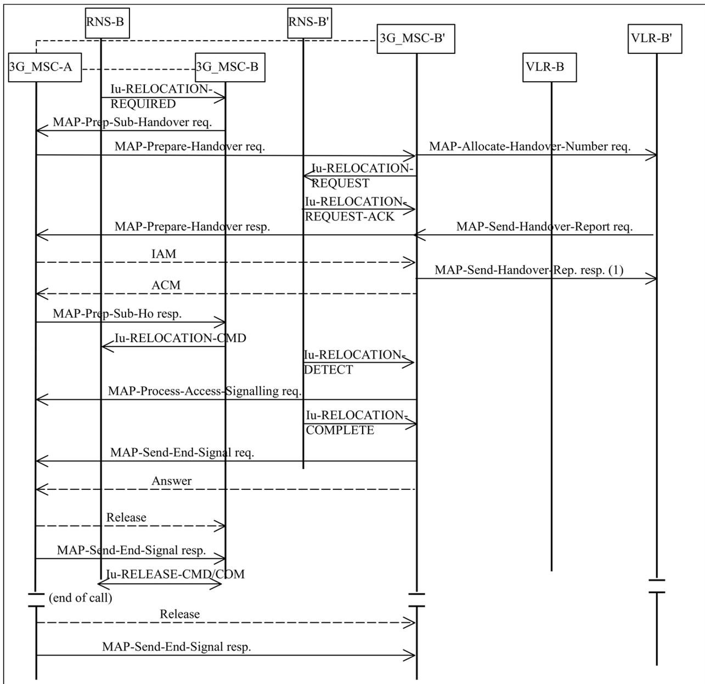

```

sequenceDiagram
    participant 3G_MSC-A
    participant RNS-B
    participant 3G_MSC-B
    participant RNS-B'
    participant 3G_MSC-B'
    participant VLR-B
    participant VLR-B'

    RNS-B->>3G_MSC-B: Iu-RELOCATION-REQUIRED
    3G_MSC-B->>3G_MSC-A: MAP-Prep-Sub-Handover req.
    3G_MSC-A->>3G_MSC-B': MAP-Prepare-Handover req.
    3G_MSC-B'->>VLR-B': MAP-Allocate-Handover-Number req.
    3G_MSC-B'->>RNS-B': Iu-RELOCATION-REQUEST
    RNS-B'->>3G_MSC-B': Iu-RELOCATION-REQUEST-ACK
    3G_MSC-B'->>VLR-B': MAP-Send-Handover-Report req.
    3G_MSC-B'->>3G_MSC-A: MAP-Prepare-Handover resp.
    3G_MSC-A-->>3G_MSC-B': IAM
    VLR-B'-->>3G_MSC-B': MAP-Send-Handover-Rep. resp. (1)
    3G_MSC-B'-->>3G_MSC-A: ACM
    3G_MSC-A->>3G_MSC-B: MAP-Prep-Sub-Ho resp.
    3G_MSC-B->>RNS-B: Iu-RELOCATION-CMD
    RNS-B'->>3G_MSC-B': Iu-RELOCATION-DETECT
    3G_MSC-B'->>3G_MSC-A: MAP-Process-Access-Signalling req.
    RNS-B'->>3G_MSC-B': Iu-RELOCATION-COMPLETE
    3G_MSC-B'->>3G_MSC-A: MAP-Send-End-Signal req.
    3G_MSC-A-->>3G_MSC-B': Answer
    3G_MSC-A-->>3G_MSC-B: Release
    3G_MSC-B->>3G_MSC-A: MAP-Send-End-Signal resp.
    3G_MSC-B->>RNS-B: Iu-RELEASE-CMD/COM
    Note left of 3G_MSC-A: (end of call)
    3G_MSC-A-->>3G_MSC-B': Release
    3G_MSC-B'->>3G_MSC-A: MAP-Send-End-Signal resp.

```

Sequence diagram showing subsequent relocation procedure ii) Successful SRNS relocation from 3G\_MSC-B to 3G\_MSC-B' requiring a circuit connection. The diagram involves 3G\_MSC-A, RNS-B, 3G\_MSC-B, RNS-B', 3G\_MSC-B', VLR-B, and VLR-B'.

NOTE 1: Can be sent at any time after the reception of IAM.

**Figure 33: Subsequent relocation procedure ii) Successful SRNS relocation  
from 3G\_MSC-B to 3G\_MSC-B' requiring a circuit connection**

### 8.3.4 Procedure for subsequent relocation not requiring a circuit connection

As for the subsequent relocation with a circuit connection between 3G\_MSC-A and 3G\_MSC-B, the same two cases of subsequent relocation apply:

- i) the UE moves back to the area of 3G\_MSC-A;
- ii) the UE moves into the area of a third 3G\_MSC (3G\_MSC-B').

If 3G\_MSC-A is replaced by MSC-A in the procedures, then a subsequent relocation from 3G\_MSC-B to 3G\_MSC-B' shall not be possible since MSC-A does not support the RANAP protocol.

#### 8.3.4.1 Description of subsequent relocation procedure i): 3G\_MSC-B to 3G\_MSC-A

The procedure for successful relocation from 3G\_MSC-B back to 3G\_MSC-A without circuit connection is shown in figure 34. The only difference with the figure 32 is that no circuit release is needed between 3G\_MSC-A and 3G\_MSC-B.

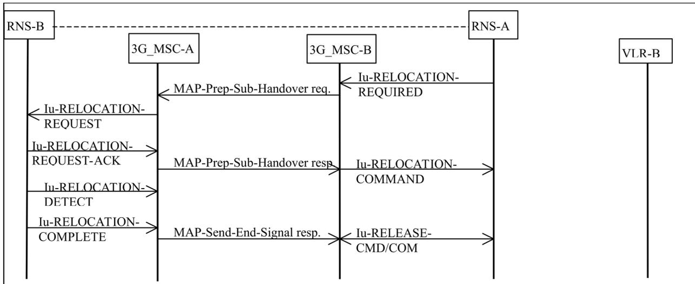

```

sequenceDiagram
    participant RNS-B
    participant 3G_MSC-A
    participant 3G_MSC-B
    participant RNS-A
    participant VLR-B

    Note left of RNS-B: (虚线表示RNS-B与RNS-A之间的连接)
    RNS-B->>3G_MSC-A: Iu-RELOCATION-REQUEST
    3G_MSC-A->>3G_MSC-B: MAP-Prep-Sub-Handover req.
    3G_MSC-B->>RNS-A: Iu-RELOCATION-REQUIRED
    RNS-A->>3G_MSC-B: Iu-RELOCATION-COMMAND
    3G_MSC-B->>3G_MSC-A: MAP-Prep-Sub-Handover resp.
    3G_MSC-A->>RNS-B: Iu-RELOCATION-REQUEST-ACK
    RNS-B->>3G_MSC-A: Iu-RELOCATION-DETECT
    3G_MSC-A->>3G_MSC-B: MAP-Send-End-Signal resp.
    3G_MSC-B->>RNS-A: Iu-RELEASE-CMD/COM
    RNS-A->>VLR-B: 
  
```

Sequence diagram for subsequent relocation procedure i) from 3G\_MSC-B to 3G\_MSC-A. Lifelines: RNS-B, 3G\_MSC-A, 3G\_MSC-B, RNS-A, VLR-B. The process involves MAP-Prep-Sub-Handover messages and Iu-RELOCATION signaling between the RNS and MSCs.

**Figure 34: Subsequent relocation procedure i) successful relocation from 3G\_MSC-B to 3G\_MSC-B not requiring a circuit connection**

#### 8.3.4.2 Description of subsequent relocation procedure ii): 3G\_MSC-B to 3G\_MSC-B"

The procedure for successful relocation from 3G\_MSC-B to 3G\_MSC-B' is shown in figure 35.

The procedure consists of two parts:

- a subsequent relocation from 3G\_MSC-B back to 3G\_MSC-A as described in subclause 8.3.4.1; and
- a basic relocation from 3G\_MSC-A to 3G\_MSC-B' as described in subclause 8.3.2.

The only difference to the equivalent figure 33 is the omission of the circuit and handover number allocation signallings.

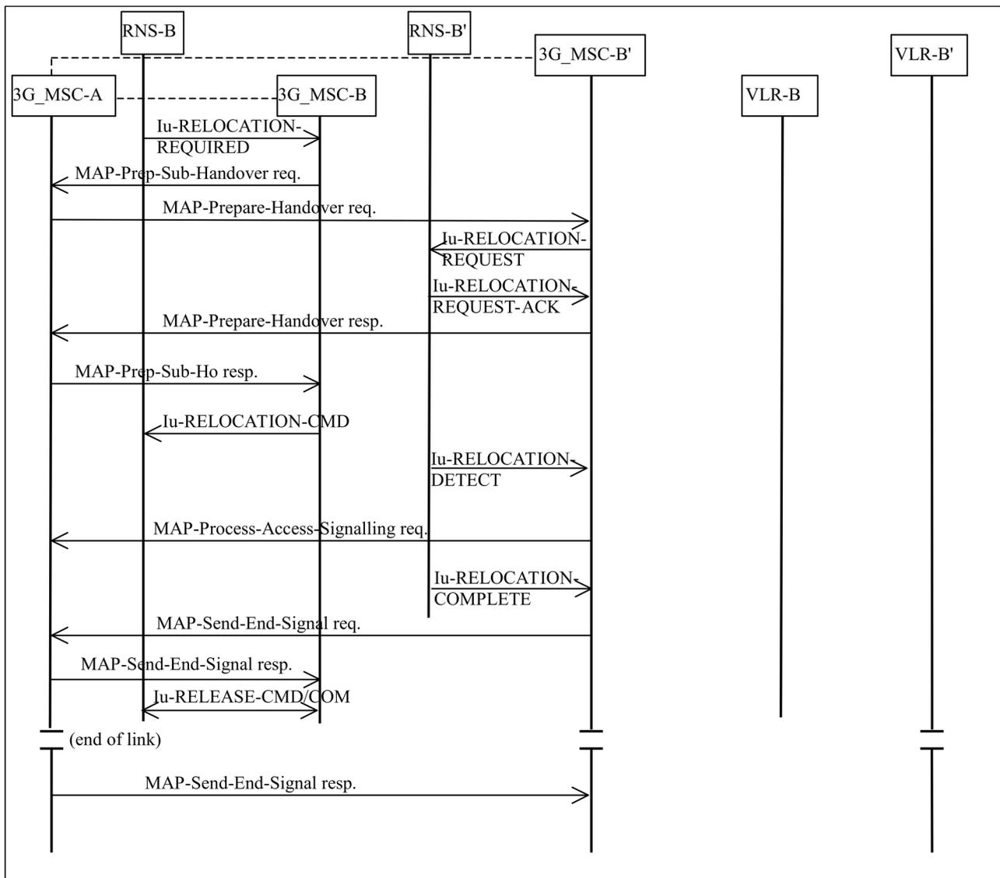

```

sequenceDiagram
    participant 3G_MSC-A
    participant RNS-B
    participant 3G_MSC-B
    participant RNS-B'
    participant 3G_MSC-B'
    participant VLR-B
    participant VLR-B'

    RNS-B->>3G_MSC-B: Iu-RELOCATION-REQUIRED
    3G_MSC-B->>3G_MSC-A: MAP-Prep-Sub-Handover req.
    3G_MSC-A->>3G_MSC-B': MAP-Prepare-Handover req.
    3G_MSC-B'->>RNS-B': Iu-RELOCATION-REQUEST
    RNS-B'->>3G_MSC-B': Iu-RELOCATION-REQUEST-ACK
    3G_MSC-B'->>3G_MSC-A: MAP-Prepare-Handover resp.
    3G_MSC-A->>3G_MSC-B: MAP-Prep-Sub-Ho resp.
    3G_MSC-B->>RNS-B: Iu-RELOCATION-CMD
    RNS-B'->>3G_MSC-B': Iu-RELOCATION-DETECT
    3G_MSC-B'->>3G_MSC-A: MAP-Process-Access-Signalling req.
    RNS-B'->>3G_MSC-B': Iu-RELOCATION-COMPLETE
    3G_MSC-B'->>3G_MSC-A: MAP-Send-End-Signal req.
    3G_MSC-A->>3G_MSC-B: MAP-Send-End-Signal resp.
    3G_MSC-B->>RNS-B: Iu-RELEASE-CMD/COM
    Note left of 3G_MSC-A: (end of link)
    3G_MSC-A->>3G_MSC-B': MAP-Send-End-Signal resp.

```

The sequence diagram illustrates the interaction between several network elements: 3G\_MSC-A, RNS-B, 3G\_MSC-B, RNS-B', 3G\_MSC-B', VLR-B, and VLR-B'. The sequence of messages is as follows:

- RNS-B sends an **Iu-RELOCATION-REQUIRED** message to 3G\_MSC-B.
- 3G\_MSC-B sends a **MAP-Prep-Sub-Handover req.** message to 3G\_MSC-A.
- 3G\_MSC-A sends a **MAP-Prepare-Handover req.** message to 3G\_MSC-B'.
- 3G\_MSC-B' sends an **Iu-RELOCATION-REQUEST** message to RNS-B'.
- RNS-B' sends an **Iu-RELOCATION-REQUEST-ACK** message to 3G\_MSC-B'.
- 3G\_MSC-B' sends a **MAP-Prepare-Handover resp.** message to 3G\_MSC-A.
- 3G\_MSC-A sends a **MAP-Prep-Sub-Ho resp.** message to 3G\_MSC-B.
- 3G\_MSC-B sends an **Iu-RELOCATION-CMD** message to RNS-B.
- RNS-B' sends an **Iu-RELOCATION-DETECT** message to 3G\_MSC-B'.
- 3G\_MSC-B' sends a **MAP-Process-Access-Signalling req.** message to 3G\_MSC-A.
- RNS-B' sends an **Iu-RELOCATION-COMPLETE** message to 3G\_MSC-B'.
- 3G\_MSC-B' sends a **MAP-Send-End-Signal req.** message to 3G\_MSC-A.
- 3G\_MSC-A sends a **MAP-Send-End-Signal resp.** message to 3G\_MSC-B.
- 3G\_MSC-B sends an **Iu-RELEASE-CMD/COM** message to RNS-B.
- 3G\_MSC-A sends a **MAP-Send-End-Signal resp.** message to 3G\_MSC-B'.

Vertical dashed lines extend from the top of RNS-B, RNS-B', and 3G\_MSC-B' lifelines. Horizontal dashed lines connect the top of 3G\_MSC-A to 3G\_MSC-B, and the top of RNS-B to RNS-B'. At the bottom of the lifelines for 3G\_MSC-A, 3G\_MSC-B', and VLR-B', there are tick marks and the text "(end of link)".

Sequence diagram for Subsequent relocation procedure ii) Successful SRNS relocation from 3G\_MSC-B to 3G\_MSC-B' not requiring a circuit connection.

**Figure 35: Subsequent relocation procedure ii) Successful SRNS relocation from 3G\_MSC-B to 3G\_MSC-B' not requiring a circuit connection**

# 9 Detailed procedures in MSC-A

## 9.1 BSS/MSC and MS/MSC procedures in MSC-A (functional unit 1)

The handover procedures in this functional unit consist of:

- i) signalling between the MS and the MSC;
- ii) signalling between the BSS and the MSC for access management.

## 9.2 Call control procedures MSC-A (functional unit 2)

The call control procedures related to handover in MSC-A can be divided into two functional entities:

- the first entity is the call control procedure as part of the normal interworking between the PSTN/ISDN and the PLMN; for an MS originating call MSC-A is the originating exchange, for an MS terminating call MSC-A is the destination exchange;
- the second entity is the call control procedure for the connection between MSC-A and MSC-B in case of a handover from MSC-A to MSC-B. For this call control procedure the following applies.

Call set-up:

- the connection to MSC-B is set up by procedures relevant to the signalling system used in the PSTN/ISDN to which MSC-A is connected. The call is set up by using the MS Handover Number received from MSC-B as part of the MAP procedure;
- the call set-up direction will always be from MSC-A to MSC-B, even when the call was originally established by the MS. Functional unit 2 (see figure 2) should therefore keep information on call set-up direction in order to be able to interpret correctly any clearing signals (see below);
- the unit should indicate the address complete condition to functional unit 3 and through-connect without awaiting the answer signal from MSC-B. This applies also to signalling systems where address complete signals are not supported. In such cases an artificial address complete is established by functional unit 2.

Call clearing:

- call clearing consists of two parts: after inter-MSC handover, clearing of the MS-BSS connection and clearing of the inter-MSC connection. If a request to release the call is generated by the network while the MS is re-tuning from one BSS to another BSS, then MSC-A shall begin clearing the call to the network and queue the call release to the MS until the MS has resumed communication. This includes the case when MSC-B and/or MSC-B' are involved;
- the MAP procedures are used to transfer information between MSC-B and MSC-A in order to maintain full call control within MSC-A. MSC-A determines, based on information received from MSC-B, the appropriate signals (according to 3GPP TS 24.008 [10]) to be sent to the MS, and sends this information to MSC-B;
- when MSC-A clears the call to the MS it also clears the call control functions in MSC-B and sends the MAP-SEND-END-SIGNAL response to release the MAP resources in MSC-B. The clearing of the connection is by procedures relevant to the signalling system in the PSTN/ISDN to which MSC-A is connected;
- when the Signalling System no 7 ISDN User Part is used, the normal symmetric release procedures apply on both the connection to the fixed network and to MSC-B;
- when a signalling system is used without a symmetric release possibility, some notice should be given to the clear-forward and clear-back procedures;
- for MS terminating calls the following conditions apply on clear-forward and clear-back:
  - when a clear-forward signal is received on interface B' (see figure 1), MSC-A clears the circuit to MSC-B by normal clear-forward procedures;
  - when a clear-back signal is received from MSC-B, MSC-A starts normal clear-back procedures towards the fixed network (interface B') and sends the clear-forward signal on interface B'' in order to clear the connection with MSC-B.

NOTE 1: This case corresponds to a fault situation.

- for MS originated calls the following applies:
  - when MSC-A receives a clear-back signal from MSC-B, this signal must be interpreted as indicating a clear-forward condition. MSC-A then clears both the connection on interface B' (see figure 1) and to MSC-B by normal clear-forward procedures.

NOTE 2: This case corresponds to a fault situation.

- when MSC-A receives a clear-back signal on interface B', MSC-A should distinguish between national and international connections:
  - for international connections where the Q.118 [1] supervision is done in the ISC, MSC-A sends a clear-forward signal on both interface B' to the fixed network and interface B" to MSC-B;
  - for national connections or for international connections where the Q.118 [1] supervision is not done in the ISC, a timer is started according to national practice for clear-back supervision and MSC-A proceeds as follows:
    - i) if a clear-back signal is received from MSC-B, MSC-A interprets this as indicating a clear-forward condition and proceeds by clearing the connections on interface B' and to MSC-B by normal clear-forward procedures;
    - ii) if the timer expires, MSC-A proceeds by normal clear-forward of the connections on interface B' and to MSC-B.

## 9.3 Handover control procedures MSC-A (functional unit 3)

The procedures of functional unit 3 are given in terms of SDL diagrams in figure 41. To easily distinguish the interface concerned the messages received or sent from this unit are prefixed with either 'MAP' for a MAP message, 'A' for an A-Interface message or 'I' for an ISDN/PSTN message.

The procedures of functional unit 3 include:

- i) initiation. The initiation condition is shown by the signal A-HANDOVER-REQUIRED.

The diagram also includes queuing when there is no channel available. Calls for which handover has been initiated should be queued with priority higher than normal calls. They should have lower priority than emergency calls.

- ii) handover of calls within the area of MSC-A, i.e. handover case i). In this case MSC-A controls the procedures on both the previous and the new radio channel, using signals A-HANDOVER-REQUEST and A-HANDOVER-COMMAND. The handover procedure is completed when A-HANDOVER-COMPLETE is received. If this signal is not received (expiry of timer T102), the radio path and the connection on interface B' are released.

In the case of ongoing GSM voice group calls for subsequent users of the VGCS channel uplink the original connection shall always be maintained.

For handover devices with three-party capabilities the handover device is first set up so that all interfaces A', A" and B' are connected (illustrated by the signal 'set up handover device'). This is done when the Handover Command is sent to the MS . The device is connected in its final position (i.e. A" to B' for case ii)) (illustrated by the signal 'connect handover device') when A-HANDOVER-COMPLETE is received.

- iii) handover to MSC-B . This procedure is the one described in subclauses 7.1 and 7.2. For handover devices with three-party capabilities the handover device is set-up when MSC-A sends the Handover Command to the MS , i.e. the interfaces A', B' and B" are then connected. The device is connected in its final position (i.e. B' to B") when the successful procedure indication is received from functional unit 4.
- iv) subsequent handover to MSC-A . The procedure is described in subclauses 7.3 and 7.4. When a handover to MSC-A indication is received from functional unit 4, the handover device is set up so that interfaces B', B" and A' are connected (for handover devices with three-party capabilities). When A-HANDOVER-COMPLETE is received, the device is connected in its final position (i.e. B' to A').

If A-HANDOVER-COMPLETE is not received (expiry of timer T104), the handover device releases interface A', B' and B".

- v) subsequent handover to a third MSC (MSC-B') . The procedure is described in subclauses 7.3 and 7.4. The handover device is set up in its initial position, (i.e. interconnection of interfaces B', B" and B''') when the connection to MSC-B' has been established. MSC-B is informed via functional unit 4 that the connection has been established and that the procedure on the radio path can be initiated. The device is connected in its final position (i.e. B' to B''') when a successful procedure indication is received from functional unit 4. MSC-B is informed that all procedures in MSC-B can be terminated (illustrated by the MAP-SEND-END-SIGNAL response). The device returns to the state where B' and B" are connected if the subsequent handover procedure fails.

### Timers in MSC-A.

The procedures are supervised by timers in order to avoid a deadlock when responses are not received or the procedures fail. The following timers are defined:

- T101: this timer supervises the queuing time for a free channel. If T101 expires, a no channel indication is generated, a retry procedure could be applied as described in subclause 6.1. T101 is set by O&M,
- T102: this timer supervises the time for handover completion for handover between BSSs in MSC-A. T102 is set by O&M,
- T103: this timer supervises the time between issuing an A-HANDOVER-COMMAND from MSC-A and receiving a successful procedure indication from MSC-B. This timer also supervises the time between sending an A-HO-REQUEST-ACKNOWLEDGE to MSC-B and receiving a successful procedure indication from MSC-B'. If T103 expires, the handover procedure is terminated. T103 is set by O&M,
- T104: this timer supervises the time between sending of an A-HO-REQUEST-ACKNOWLEDGE to MSC-B and receiving the A-HANDOVER-COMPLETE from BSS-B on MSC-A. If the timer expires, the new radio channel is released. T104 is set by O&M.

## 9.3A BSS Internal Handover with MSC Support control procedures

The "BSS Internal Handover with MSC Support" for AoIP is performed by the MSC that is currently serving the connected BSS (in the following just termed "serving MSC"), it may be either MSC-A, MSC-B, 3G\_MSC-A or 3G\_MSC-B.

The "BSS Internal Handover with MSC Support" control procedures in serving MSC include:

- i) **Handover enquiry.** This procedure is only part of the MSC-initiated "BSS Internal Handover with MSC Support" described in subclause 6.3.3. The MSC initiates the handover enquiry by sending an A-INTERNAL-HANDOVER-ENQUIRY message and starting timer T106.

The handover enquiry phase is completed when an A-INTERNAL-HANDOVER-REQUIRED message is received from the BSS with cause code "response to an INTERNAL HANDOVER ENQUIRY message". If this message is not received (expiry of timer T106), or the BSS responds with an A-HANDOVER-FAILURE message, or the BSS sends an A-INTERNAL-HANDOVER-REQUIRED message with another cause code, then the MSC terminates the MSC-initiated "BSS Internal Handover with MSC Support".

- ii) **Initiation.** The initiation condition is given by reception of the A-INTERNAL-HANDOVER-REQUIRED message. This starts the Internal Handover Preparation phase for the serving MSC; the serving MSC starts timer T105. Calls for which Internal Handover Preparation has been initiated should be handled with priority higher than normal calls. They should have lower priority than emergency calls. During that phase the serving MSC considers the A-INTERNAL-HANDOVER-REQUIRED parameters, tries to allocate the necessary resources.

The Internal Handover Preparation phase for the serving MSC ends when the serving MSC sends the A-INTERNAL-HANDOVER-COMMAND message or an A-INTERNAL-HANDOVER-REQUIRED-REJECT message or when timer T105 expires.

If the serving MSC can not perform the "BSS Internal Handover with MSC Support", then it shall send an A-INTERNAL-HANDOVER-REQUIRED-REJECT Message to the BSS and shall release all potentially allocated resources as if no A-INTERNAL-HANDOVER-REQUIRED message was received.

If timer T105 expires before the serving MSC could send the A-INTERNAL HANDOVER-COMMAND message, then the serving MSC shall consider the Internal Handover Preparation phase as terminated without success and shall release any allocated resources for the Internal Handover such that the status returns as it was

prior to receiving the A-INTERNAL-HANDOVER-REQUIRED message. No response shall be sent to the BSS after the expiry of timer T105.

- ii) **Execution.** Serving MSC controls the "BSS Internal Handover with MSC Support" by sending the A-INTERNAL-HANDOVER-COMMAND message. The "BSS Internal Handover with MSC Support" is completed when the A-HANDOVER-COMPLETE message is received. If this signal is not received (expiry of timer T102), the radio path and all the connections and resources associated to that call shall be released.

For handover devices with three-party capabilities, the handover device is first set up so that all interfaces A', A" and B' are connected. This is performed before the A-INTERNAL-HANDOVER-COMMAND message is sent to the BSS. The handover device may be adjusted when the A-HANDOVER-DETECT message is received. The handover device is connected in its final position (i.e. A" to B') when the A-HANDOVER-COMPLETE message is received.

### Timers in serving MSC for Internal Handover Preparation

The procedures are supervised by timers in order to avoid a deadlock when responses are not received or the procedures fail. The following additional timers are defined:

T105: this timer supervises the Internal Handover Preparation procedure between BSS and serving MSC. T105 is set by O&M in relation to timer "T25" (3GPP TS 48.008 [5]). T105 defines the maximum time a serving MSC may take to respond to an "INTERNAL HANDOVER REQUIRED" message. Timer "T25" (3GPP TS 48.008 [5]) defines the minimum time the BSS will to wait before it can send a new or repeated (INTERNAL) HANDOVER REQUIRED message or an A-HANDOVER FAILURE. T105 shall be configured to be at least one round trip delay shorter than the time configured for "T25" (3GPP TS 48.008 [5]) to minimise the risk of crossing messages.

T106: this timer supervises the time between sending of an A-INTERNAL-HANDOVER-ENQUIRY message to the BSS and receiving an A-INTERNAL-HANDOVER-REQUIRED or A-HANDOVER-FAILURE message from the BSS. If T106 expires, the handover procedure is terminated. T106 is set by O&M and should be sufficiently long so that no late responses from BSS can be expected after its expiry.

## 9.4 MAP procedures in MSC-A (functional unit 4)

The MAP procedures for handover are defined in 3GPP TS 29.002 [12]. They include:

- procedures for basic handover;
- procedures for subsequent handover.

These procedures are as outlined in clause 7.

## 9.5 Interworking between Handover control procedures and MAP procedures in MSC-A

The interworking between the Handover control procedures and the MAP procedures for handover is defined in 3GPP TS 29.010 [8]. It includes:

- interworking at basic handover initiation;
- interworking at subsequent handover completion.

This interworking is not described in the present document.

## 9.6 Compatibility with GSM Phase 1

If the MSC-A initiates an Inter-MSC handover procedure according to Phase 2 MAP and BSSMAP protocols while using a Phase 1 BSSMAP protocol towards BSS-A, MSC-A has to perform the protocol interworking.

The same holds if a Phase 2 BSSMAP protocol is used between MSC-A and BSS-A and the E-interface supports only Phase 1 protocol.

# 10 Detailed procedures in MSC-B

## 10.1 BSS/MSC (MS/BSS) procedures MSC-B (functional unit 1)

The handover procedures in this functional unit consist of:

- i) signalling between the MS and the MSC;
- ii) signalling between the BS and the MSC for access management.

Signals exchanged with functional unit 3 are indicated in subclause 10.3.

## 10.2 Call control procedures MSC-B (functional unit 2)

These procedures relate to the call control in MSC-B of the "handover" connection with MSC-A. For these procedures the following apply:

Call set-up:

- the connection is set up by MSC-A. MSC-B should provide, if possible, the following backward signals:
  - signals indicating unsuccessful call set-up and, if possible, the cause of call failure;
  - address complete signal;
  - answer signal (see note).

NOTE: The answer signal is not related to answering by the MS and it has no meaning in the handover procedure between MSC-A and MSC-B. But after successful handover or successful subsequent channel assignment using a circuit connection between MSC-A and MSC-B this signal is needed for bringing the connection in the answered state in the intermediate PSTN/ISDN exchanges.

- there will be no indication that the call applies to a handover. This information has to be derived from the MS Handover Number received during call set-up in relation to the earlier MAP-PREPARE-HANDOVER request/MAP-PREPARE-HANDOVER response procedure between MSC-A and MSC-B.

Call clearing:

- call clearing consists of two parts after inter-MSC handover: clearing of the BSS-MS connection and clearing of the inter-MSC connection, this case is only applicable to calls successfully handed over. If a request to release the call is generated by the network while the MS is re-tuning from one BSS to another BSS, then MSC-B shall begin clearing the call to the network and queue the call release to the MS until the MS has resumed communication;
- the MAP is used to transfer information between MSC-A and MSC-B in order to make it possible for MSC-B to send the appropriate signals to the MS, specified in 3GPP TS 24.008 [10], and still leave the call control to MSC-A. MSC-A normally initiates release of the connection between MSC-A and MSC-B. Exceptionally MSC-B is allowed to release the connection if no MAP-SEND-END-SIGNAL response is received, or if the Handover is to be aborted.
- when the Signalling System no 7 ISDN User Part is used, the normal symmetric release procedures apply. When a signalling system is used without a symmetric release possibility or a fault condition occurs, the following may apply:
  - when MSC-B receives a clear-forward signal from MSC-A, it shall release the radio resources;
  - in fault situation eg. machine malfunction or loss of the connection on interface A, MSC-B may send a clear-back signal to MSC-A.

## 10.3 Handover control procedures MSC-B (functional unit 3)

The procedures of functional unit 3 are given in form of SDL diagrams in figure 42. To easily distinguish the interface concerned the messages received or sent from this unit are prefixed with either 'MAP' for a MAP message, 'A' for an A-Interface message or 'T' for an ISDN/PSTN message. The procedure in functional unit 3 include:

- i) handover from MSC-A.

This case is initiated by MSC-A, and includes allocation and establishment of the new radio channel. The procedure is outlined in subclauses 7.1 and 7.2.

- ii) intra-MSB handovers within the area controlled by MSC-B.

This procedure is the same as that of i) in subclause 9.3, except that the A-HANDOVER-REQUIRED is received by MSC-B. After successful completion of the intra-MSB handover, MSC-B shall notify MSC-A by sending an A-HANDOVER-PERFORMED message.

- iii) subsequent handover to another MSC (MSC-A or MSC-B').

The initiation procedure is essentially the same as that of i) of subclause 9.3. The Handover Command to the MS is now generated by MSC-B after the A-HO-REQUEST-ACKNOWLEDGE is received from MSC-A (via functional unit 4). The procedure is terminated in MSC-B when MSC-B receives a terminate procedure indication from functional unit 4.

Timers in MSC-B.

The following procedures are supervised by timers in order to avoid a deadlock when responses are not received or the procedures fail.

The following timers are defined:

- T201: this timer supervises the queuing time for a free channel. T201 is set by O&M;
- T202: this timer supervises the time for handover completion for handover between BSSs in MSC-B. If T202 expires, the radio path and the connection on interface B' are released. T202 is set by O&M;
- T204: this timer supervises the time between sending of address complete message to MSC-A and receiving the A-HANDOVER-COMPLETE from BSS-B on MSC-B. This timer also supervises the time between issuing the handover command to the MS and receiving the MAP-SEND-END-SIGNAL response from MSC-A, for a subsequent handover. In the case of a handover without circuit connection between MSC-A and MSC-B this timer supervises the time between issuing the A-HO-REQUEST-ACKNOWLEDGE to the MSC-A and receiving the A-HANDOVER-COMPLETE from BSS-B on MSC-B. If the timer expires, then any new radio channel is released. T204 is set by O&M;
- T210: this timer is used to supervise the time for establishing a circuit connection from MSC-A to MSC-B. When T210 expires, the allocated channel in MSC-B is released. T210 is set by O&M. This timer is not started when MSC-A explicitly indicates that no handover number is needed;
- T211: this timer is used to control the time between requesting a subsequent handover (A-HO-REQUEST to the MSC-A) and receiving the response from MSC-A (A-REQUEST-ACKNOWLEDGE/A-HO-FAILURE). If T211 expires, the existing connection with the MS is maintained. T211 is set by O&M.

## 10.4 MAP procedures MSC-B (functional unit 4)

The MAP procedures for handover are defined in 3GPP TS 29.002 [12]. They include:

- procedures for basic handover;
- procedures for subsequent handover;
- procedures for obtaining the handover number from the VLR.

These procedures are outlined in clause 7.

## 10.5 Interworking between Handover control procedures and MAP procedures in MSC-B

The interworking between the Handover control procedures and the MAP procedures for handover is defined in 3GPP TS 29.010 [8]. It includes:

- interworking at basic handover completion;
- interworking at subsequent handover initiation.

This interworking is not described in the present document.

## 10.6 Compatibility with GSM Phase 1

If the MSC-B accepts an Inter-MSC handover procedure according to Phase 2 MAP and BSSMAP protocols while using a Phase 1 BSSMAP protocol towards BSS-B, MSC-B has to perform the protocol interworking.

The same holds if a Phase 1 MAP protocol is requested on the E-interface and MSC-B uses a Phase 2 BSSMAP protocol towards BSS-B.

# --- 11 Detailed procedures in 3G\_MSC-A

For detailed procedures in MSC-A at handover within the GSM network, please see clause 9 "Detailed procedures in MSC-A".

## 11.1 RNC/BSC/3G\_MSC and UE/MS/3G\_MSC procedures in 3G\_MSC-A (functional unit 1)

The handover/relocation procedures in this functional unit consist of:

- i) signalling between the UE/MS and the 3G\_MSC;
- ii) signalling between the RNS/BSS and the 3G\_MSC for access management.

## 11.2 Call control procedures 3G\_MSC-A (functional unit 2)

The call control procedures related to handover/relocation in 3G\_MSC-A can be divided into two functional entities:

- the first entity is the call control procedure as part of the normal interworking between the PSTN/ISDN and the PLMN/UTRAN; for an UE/MS originating call 3G\_MSC-A is the originating exchange, for an UE/MS terminating call 3G\_MSC-A is the destination exchange;
- the second entity is the call control procedure for the connection between 3G\_MSC-A and 3G\_MSC-B in case of a handover/relocation from 3G\_MSC-A to 3G\_MSC-B. For this call control procedure the following applies.

Call set-up:

- the connection to 3G\_MSC-B is set up by procedures relevant to the signalling system used in the PSTN/ISDN to which 3G\_MSC-A is connected. The call is set up by using the Handover Number received from 3G\_MSC-B as part of the MAP procedure;
- the call set-up direction will always be from 3G\_MSC-A to 3G\_MSC-B, even when the call was originally established by the UE/MS. Functional unit 2 (see figure 5) should therefore keep information on call set-up direction in order to be able to interpret correctly any clearing signals (see below);
- the unit should indicate the address complete condition to functional unit 3 and through-connect without awaiting the answer signal from 3G\_MSC-B. This applies also to signalling systems where address complete signals are not supported. In such cases an artificial address complete is established by functional unit 2.

Call clearing:

- call clearing consists of two parts: after handover/relocation, clearing of the RNS-UE/MS or BSS-UE/MS connection and clearing of the inter-3G\_MSC connection. If a request to release the call is generated by the network while the UE/MS is re-tuning from one RNS/BSS to another RNS/BSS, then 3G\_MSC-A shall begin clearing the call to the network and queue the call release to the UE/MS until the UE/MS has resumed communication. This includes the case when 3G\_MSC-B and/or 3G\_MSC-B' are involved;
- the MAP procedures are used to transfer information between 3G\_MSC-B and 3G\_MSC-A in order to maintain full call control within 3G\_MSC-A. 3G\_MSC-A determines, based on information received from 3G\_MSC-B, the appropriate signals (according to 3GPP TS 24.008 [10]) to be sent to the UE/MS, and sends this information to 3G\_MSC-B;
- when 3G\_MSC-A clears the call to the UE/MS it also clears the call control functions in 3G\_MSC-B and sends the MAP-SEND-END-SIGNAL response to release the MAP resources in 3G\_MSC-B. The clearing of the connection is by procedures relevant to the signalling system in the PSTN/ISDN to which 3G\_MSC-A is connected;
- when the Signalling System no 7 ISDN User Part is used, the normal symmetric release procedures apply on both the connection to the fixed network and to 3G\_MSC-B;
- when a signalling system is used without a symmetric release possibility, some notice should be given to the clear-forward and clear-back procedures;
- for UE/MS terminating calls the following conditions apply on clear-forward and clear-back:
  - when a clear-forward signal is received on interface B' (see figure 4), 3G\_MSC-A clears the circuit to 3G\_MSC-B by normal clear-forward procedures;
  - when a clear-back signal is received from 3G\_MSC-B, 3G\_MSC-A starts normal clear-back procedures towards the fixed network (interface B') and sends the clear-forward signal on interface B'' in order to clear the connection with 3G\_MSC-B.

NOTE 1: This case corresponds to a fault situation.

- for UE/MS originated calls the following applies:
  - when 3G\_MSC-A receives a clear-back signal from 3G\_MSC-B, this signal must be interpreted as indicating a clear-forward condition. 3G\_MSC-A then clears both the connection on interface B' (see figure 4) and to 3G\_MSC-B by normal clear-forward procedures;

NOTE 2: This case corresponds to a fault situation.

- when 3G\_MSC-A receives a clear-back signal on interface B', 3G\_MSC-A should distinguish between national and international connections:
  - for international connections where the Q.118 [1] supervision is done in the ISC, 3G\_MSC-A sends a clear-forward signal on both interface B' to the fixed network and interface B'' to 3G\_MSC-B;
  - for national connections or for international connections where the Q.118 [1] supervision is not done in the ISC, a timer is started according to national practice for clear-back supervision and MSC-A proceeds as follows:
    - i) if a clear-back signal is received from 3G\_MSC-B, 3G\_MSC-A interprets this as indicating a clear-forward condition and proceeds by clearing the connections on interface B' and to 3G\_MSC-B by normal clear-forward procedures;
    - ii) if the timer expires, 3G\_MSC-A proceeds by normal clear-forward of the connections on interface B' and to 3G\_MSC-B.

## 11.3 Handover/Relocation control procedures 3G\_MSC-A (functional unit 3)

The procedures of functional unit 3 are given in terms of SDL diagrams in figure 43. To easily distinguish the interface concerned the messages received or sent from this unit are prefixed with either 'MAP' for a MAP message, 'A' for an A-Interface message, 'I' for an ISDN/PSTN message or 'Iu' for an Iu-message.

The procedures of functional unit 3 include:

- i) initiation. The initiation condition is shown by the signal Iu-RELOCATION-REQUIRED or A-HANDOVER-REQUIRED;

The diagram also includes queuing when there is no channel available. Calls for which handover/relocation has been initiated should be queued with priority higher than normal calls. They should have lower priority than emergency calls.

- ii) handover/relocation of calls within the area controlled by 3G\_MSC-A, i.e. handover/relocation case i);

In the handover/relocation from RNS-A/BSS-A to RNS-B/BSS-B 3G\_MSC-A controls the procedures on both the previous and the new radio channel, using signals Iu-RELOCATION-REQUEST/A-HANDOVER-REQUEST and Iu-RELOCATION-COMMAND/A-HANDOVER-COMMAND. The handover/relocation procedure is completed when Iu-RELOCATION-COMPLETE/A-HANDOVER-COMPLETE is received. If this signal is not received (expiry of timer T102, T302, T502 or T702), the radio path and the connection on interface B' are released.

For handover/relocation devices with three-party capabilities the device is first set up so that all interfaces Iu'/A', Iu"/A" and B' are connected (illustrated by the signal 'set up handover device'). This is done when the Relocation Command is sent to serving RNS or Handover Command is sent to the serving BSS. The device is connected in its final position (i.e. Iu"/A" to B' for case ii)) (illustrated by the signal 'connect handover device') when Iu-RELOCATION-COMPLETE/A-HANDOVER-COMPLETE is received.

- iii) relocation to 3G\_MSC-B. This procedure is the one described in subclauses 8.3.1 and 8.3.2. For handover/relocation devices with three-party capabilities the device is set-up when 3G\_MSC-A sends the Relocation Command to the UE, i.e. the interfaces Iu', B' and B" are then connected. The device is connected in its final position (i.e. B' to B") when the successful procedure indication is received from functional unit 4;
- iv) UMTS to GSM handover to MSC-B. This procedure is the one described in subclauses 8.1.1 and 8.1.2. For handover/relocation devices with three-party capabilities the device is set-up when 3G\_MSC-A sends the Relocation Command to the serving RNS, i.e. the interfaces Iu', B' and B" are then connected. The device is connected in its final position (i.e. B' to B") when the successful procedure indication is received from functional unit 4;
- v) GSM to UMTS handover to 3G\_MSC-B. This procedure is the one described in subclauses 8.2.1 and 8.2.2. For handover/relocation devices with three-party capabilities the device is set-up when MSC-A sends the Handover Command to the serving BSS, i.e. the interfaces A', B' and B" are then connected. The device is connected in its final position (i.e. B' to B") when the successful procedure indication is received from functional unit 4;
- vi) subsequent relocation from 3G\_MSC-B to 3G\_MSC-A. The procedure is described in subclauses 8.3.3.1 and 8.3.4.1. When a relocation to 3G\_MSC-A indication is received from functional unit 4, the handover/relocation device is set up so that interfaces B', B" and Iu' are connected (for devices with three-party capabilities). When Iu-RELOCATION-COMPLETE is received, the device is connected in its final position (i.e. B' to Iu');

If Iu-RELOCATION-COMPLETE is not received (expiry of timer T704), the handover/relocation device releases interface Iu', B' and B".

- vii) subsequent GSM to UMTS handover from MSC-B to 3G\_MSC-A. The procedure is described in subclauses 8.2.3.1 and 8.2.4.1. When a handover to 3G\_MSC-A indication is received from functional unit 4, the handover device is set up so that interfaces B', B" and A' are connected (for handover devices with three-party capabilities). When Iu-RELOCATION-COMPLETE is received, the device is connected in its final position (i.e. B' to Iu');

If Iu-RELOCATION-COMPLETE is not received (expiry of timer T504), the device releases interface Iu', B' and B".

- viii) subsequent UMTS to GSM handover from 3G\_MSC-B to MSC-A. The procedure is described in clauses 8.1.3.1 and 8.1.4.1. When a handover to MSC-A indication is received from functional unit 4, the handover device is set up so that interfaces B', B" and Iu' are connected (for handover devices with three-party capabilities). When A-HANDOVER-COMPLETE is received, the device is connected in its final position (i.e. B' to A');

If A-HANDOVER-COMPLETE is not received (expiry of timer T304), the device releases interface A', B' and B''.

- ix) subsequent relocation from 3G\_MSC-B to a third 3G\_MSC (3G\_MSC-B'). The procedure is described in subclauses 8.3.4.2 and 8.3.5.2. The handover/relocation device is set up in its initial position, (i.e. interconnection of interfaces B', B'' and B''') when the connection to 3G\_MSC-B' has been established. 3G\_MSC-B is informed via functional unit 4 that the connection has been established and that the procedure on the radio path can be initiated. The device is connected in its final position (i.e. B' to B''') when a successful procedure indication is received from functional unit 4. 3G\_MSC-B is informed that all procedures in 3G\_MSC-B can be terminated (illustrated by the MAP-SEND-END-SIGNAL response). The device returns to the state where B' and B'' are connected if the subsequent relocation procedure fails;
- x) subsequent UMTS to GSM handover from 3G\_MSC-B to a third MSC (MSC-B'). The procedure is described in subclauses 8.1.3.2 and 8.1.4.2. The handover/relocation device is set up in its initial position, (i.e. interconnection of interfaces B', B'' and B''') when the connection to MSC-B' has been established. 3G\_MSC-B is informed via functional unit 4 that the connection has been established and that the procedure on the radio path can be initiated. The device is connected in its final position (i.e. B' to B''') when a successful procedure indication is received from functional unit 4. 3G\_MSC-B is informed that all procedures in 3G\_MSC-B can be terminated (illustrated by the MAP-SEND-END-SIGNAL response). The device returns to the state where B' and B'' are connected if the subsequent UMTS to GSM handover procedure fails;
- xi) subsequent GSM to UMTS handover from MSC-B to a third MSC (3G\_MSC-B'). The procedure is described in subclauses 8.2.3.2 and 8.2.4.2. The handover/relocation device is set up in its initial position, (i.e. interconnection of interfaces B', B'' and B''') when the connection to 3G\_MSC-B' has been established. MSC-B is informed via functional unit 4 that the connection has been established and that the procedure on the radio path can be initiated. The device is connected in its final position (i.e. B' to B''') when a successful procedure indication is received from functional unit 4. MSC-B is informed that all procedures in MSC-B can be terminated (illustrated by the MAP-SEND-END-SIGNAL response). The device returns to the state where B' and B'' are connected if the subsequent GSM to UMTS handover procedure fails.

NOTE: The procedures ii), vi) and vii) may be applied also in case of a handover/relocation to an RNC which is controlled by 3G\_MSC-A by using the “Flexible Iu interface for handover/relocation” option.

Timers in 3G\_MSC-A.

The procedures are supervised by timers in order to avoid a deadlock when responses are not received or the procedures fail.

The following timers are defined for SRNS Relocation:

- T701: this timer supervises the queuing time for a free channel for the relocation inside UMTS. If T701 expires, a no channel indication is generated and 3G\_MSC-A will terminate the relocation as described in subclause 6.2.3. T701 is set by O&M;
- T702: this timer supervises the time for relocation completion for relocation between RNSs in 3G\_MSC-A. T702 is set by O&M;
- T703: this timer supervises the time between issuing an IU-RELOCATION-COMMAND from 3G\_MSC-A and receiving a successful procedure indication from 3G\_MSC-B. This timer also supervises the time between sending an IU-RELOCATION-REQUEST-ACKNOWLEDGE to 3G\_MSC-B and receiving a successful procedure indication from 3G\_MSC-B'. If T703 expires, the relocation procedure is terminated. T703 is set by O&M;
- T704: this timer supervises the time between sending of an IU-RELOCATION-REQUEST-ACKNOWLEDGE to 3G\_MSC-B and receiving the IU-RELOCATION-COMPLETE from RNS-B on 3G\_MSC-A. If the timer expires, the new radio channel is released. T704 is set by O&M.

The following timers are defined for UMTS to GSM handover:

- T301: this timer supervises the queuing time for a free channel for the UMTS to GSM handover. If T301 expires, a no channel indication is generated and 3G\_MSC-A will terminate the handover as described in subclause 6.2.3. T301 is set by O&M;
- T302: this timer supervises the time for UMTS to GSM handover completion for handover from RNS to BSS in 3G\_MSC-A. T302 is set by O&M;
- T303: this timer supervises the time between issuing an Iu-RELOCATION-COMMAND from 3G\_MSC-A and receiving a successful procedure indication from MSC-B. This timer also supervises the time between sending an A-HO-REQUEST-ACKNOWLEDGE to MSC-B and receiving a successful procedure indication from MSC-B'. If T303 expires, the UMTS to GSM handover procedure is terminated. T303 is set by O&M;
- T304: this timer supervises the time between sending of an A-HO-REQUEST-ACKNOWLEDGE to MSC-B and receiving the A-HANDOVER-COMPLETE from BSS-B on 3G\_MSC-A. If the timer expires, the new radio channel is released. T304 is set by O&M.

The following timers are defined for GSM to UMTS handover:

- T501: this timer supervises the queuing time for a free channel for the GSM to UMTS handover. If T501 expires, a no channel indication is generated and 3G\_MSC-A will terminate the handover as described in subclause 6.2.3. T501 is set by O&M;
- T502: this timer supervises the time for GSM to UMTS handover completion for handover from BSS to RNS in 3G\_MSC-A. T502 is set by O&M;
- T503: this timer supervises the time between issuing an A-HANDOVER-COMMAND from MSC-A and receiving a successful procedure indication from 3G\_MSC-B. This timer also supervises the time between sending an A-HANDOVER-REQUEST-ACKNOWLEDGE to 3G\_MSC-B and receiving a successful procedure indication from 3G\_MSC-B'. If T503 expires, the GSM to UMTS handover procedure is terminated. T503 is set by O&M;
- T504: this timer supervises the time between sending of an A-HANDOVER-REQUEST-ACKNOWLEDGE to 3G\_MSC-B and receiving the Iu-RELOCATION-COMPLETE from RNS-B on 3G\_MSC-A. If the timer expires, the new radio channel is released. T504 is set by O&M.

## 11.4 MAP procedures in 3G\_MSC-A (functional unit 4)

The MAP procedures for handover/relocation are defined in 3GPP TS 29.002 [12]. They include:

- procedures for basic handover/relocation;
- procedures for subsequent handover/relocation.

These procedures are as outlined in clause 8.

## 11.5 Interworking between Handover/Relocation control procedures and MAP procedures in 3G\_MSC-A

The interworking between the Handover/Relocation control procedures and the MAP procedures for handover/relocation is defined in 3GPP TS 29.010 [8]. It includes:

- interworking at basic handover/relocation initiation;
- interworking at subsequent handover/relocation completion.

This interworking is not described in the present document.

## 11.6 Compatibility with GSM Phase 1

Interworking with the GSM Phase 1 is not supported.

## 11.7 Protocol interworking

If the 3G\_MSC-A initiates a basic inter-MSC UMTS to GSM handover procedure according to MAP and BSSMAP protocols while using a RANAP protocol towards RNS-A, 3G\_MSC-A has to perform the protocol interworking between RANAP on the Iu-Interface and encapsulated BSSMAP on the E-interface.

The same holds if 3G\_MSC-A accepts a subsequent inter-3G\_MSC GSM to UMTS handover back to 3G\_MSC-A while using a RANAP protocol towards RNS-B.

# --- 12 Detailed procedures in 3G\_MSC-B

For detailed procedures in 3G\_MSC-B at handover within the GSM network, please see clause 10 'Detailed procedures in MSC-B'.

## 12.1 RNC/BSC/3G\_MSC (UE/MS/RNC/BSC) procedures in 3G\_MSC-B (functional unit 1)

The Intra and Inter-3G\_MSC handover/relocation procedures in this functional unit consist of:

- i) signalling between the UE/MS and the 3G\_MSC;
- ii) signalling between the RNS/BSS and the 3G\_MSC for access management.

Signals exchanged with functional unit 3 are indicated in subclause 12.3.

## 12.2 Call control procedures 3G\_MSC-B (functional unit 2)

These procedures relate to the call control in 3G\_MSC-B of the "3G\_MSC handover/relocation" connection with 3G\_MSC-A. For these procedures the following apply:

Call set-up:

- the connection is set up by 3G\_MSC-A. 3G\_MSC-B should provide, if possible, the following backward signals:
  - signals indicating unsuccessful call set-up and, if possible, the cause of call failure;
  - address complete signal;
  - answer signal (see note).

NOTE: The answer signal is not related to answering by the UE/MS and it has no meaning in the 3G\_MSC handover/relocation procedure between 3G\_MSC-A and 3G\_MSC-B. But after successful handover/relocation or successful subsequent channel assignment using a circuit connection between 3G\_MSC-A and 3G\_MSC-B this signal is needed for bringing the connection in the answered state in the intermediate PSTN/ISDN exchanges.

- there will be no indication that the call applies to a 3G\_MSC handover/relocation. This information has to be derived from the UE/MS Handover Number received during call set-up in relation to the earlier MAP-PREPARE-HANDOVER request/MAP-PREPARE-HANDOVER response procedure between 3G\_MSC-A and 3G\_MSC-B.

Call clearing:

- call clearing consists of two parts after inter-3G\_MSC handover/relocation: clearing of the RNS-UE/MS or the BSS-UE/MS connection and clearing of the inter-3G\_MSC connection, these cases are only applicable to calls successfully handed over or relocated. If a request to release the call is generated by the network while the UE/MS is re-tuning from one RNS/BSS to another RNS/BSS, then 3G\_MSC-B shall begin clearing the call to the network and queue the call release to the UE/MS until the UE/MS has resumed communication;
- the MAP is used to transfer information between 3G\_MSC-A and 3G\_MSC-B in order to make it possible for 3G\_MSC-B to send the appropriate signals to the UE/MS, specified in 3GPP TS 24.008 [10], and still leave the call control to 3G\_MSC-A. 3G\_MSC-A normally initiates release of the connection between 3G\_MSC-A and

3G\_MSC-B. Exceptionally 3G\_MSC-B is allowed to release the connection if no MAP-SEND-END-SIGNAL response is received, or if the 3G\_MSC Handover/Relocation is to be aborted;

- when the Signalling System no 7 ISDN User Part is used, the normal symmetric release procedures apply. When a signalling system is used without a symmetric release possibility or a fault condition occurs, the following may apply:
  - when 3G\_MSC-B receives a clear-forward signal from 3G\_MSC-A, it shall release the radio resources;
  - in fault situation e.g. machine malfunction or loss of the connection on interface Iu or interface A, 3G\_MSC-B may send a clear-back signal to 3G\_MSC-A.

## 12.3 Handover/Relocation control procedures in 3G\_MSC-B (functional unit 3)

The procedures of functional unit 3 are given in form of SDL diagrams in figure 44. To easily distinguish the interface concerned the messages received or sent from this unit are prefixed with either 'MAP' for a MAP message, 'A' for an A-Interface message, 'Iu' for an Iu-Interface message or 'I' for an ISDN/PSTN message. The procedure in functional unit 3 include:

- i) inter 3G\_MSC handover/relocation from 3G\_MSC-A;

This case is initiated by 3G\_MSC-A, and includes allocation and establishment of the new radio resources. The procedure is outlined in subclauses 8.1.1 and 8.1.2. for UMTS to GSM handover, clauses 8.2.1 and 8.2.2 for GSM to UMTS handover and subclauses 8.3.1 and 8.3.2 for relocation.

- ii) intra-3G\_MSC UMTS to GSM handovers within the area controlled by 3G\_MSC-B;

This procedure is the same as that of ii) in clause 11.3, except that the Iu-RELOCATION-REQUIRED is received by 3G\_MSC-B. After successful completion of the intra-3G\_MSC handover, 3G\_MSC-B shall notify 3G\_MSC-A by sending an A-HANDOVER-PERFORMED message.

- iii) intra-3G\_MSC GSM to UMTS handovers within the area controlled by 3G\_MSC-B;

This procedure is the same as that of ii) in subclause 11.3, except that the A-HANDOVER-REQUIRED is received by 3G\_MSC-B. After successful completion of the intra-3G\_MSC handover, 3G\_MSC-B shall notify 3G\_MSC-A by sending an A-HANDOVER-PERFORMED message.

- iv) intra-3G\_MSC SRNS Relocation within the area controlled by 3G\_MSC-B;

This procedure is the same as that of ii) in subclause 11.3, except that the Iu-RELOCATION-REQUIRED is received by 3G\_MSC-B. After successful completion of the intra-3G\_MSC SRNS relocation, if security algorithms have been changed, 3G\_MSC-B shall notify 3G\_MSC-A by sending an A-HANDOVER-PERFORMED or an Iu-LOCATION-REPORT message, depending on the access network protocol used encapsulated on the E-interface (see subclauses 4.4.1 and 6.2.3).

- v) subsequent handover/relocation to another 3G\_MSC (3G\_MSC-A or 3G\_MSC-B');

The initiation procedure is essentially the same as that of i) of subclause 11.3. The Handover Command to the BSS or the Relocation Command to the RNS is now generated by 3G\_MSC-B after the A-HO-REQUEST-ACKNOWLEDGE or Iu-RELOCATION-REQUEST-ACKNOWLEDGE is received from 3G\_MSC-A (via functional unit 4). The procedure is terminated in 3G\_MSC-B when 3G\_MSC-B receives a terminate procedure indication from functional unit 4.

NOTE: The procedures iii), iv) and, in case of a subsequent handover back to 3G\_MSC-A, the procedure v) may be applied also in case of a handover/relocation to an RNC which is controlled by 3G\_MSC-B or 3G\_MSC-A respectively by using the "Flexible Iu interface for handover/relocation" option.

Timers in 3G\_MSC-B.

The following procedures are supervised by timers in order to avoid a deadlock when responses are not received or the procedures fail.

The following timers are defined for UMTS to GSM handover:

- T401: this timer supervises the queuing time for a free channel. T401 is set by O&M;
- T402: this timer supervises the time for handover completion for UMTS to GSM handover from RNS to BSS in 3G\_MSC-B. If T402 expires, the radio path and the connection on interface B' are released. T402 is set by O&M;
- T404: this timer supervises the time between sending of address complete message to 3G\_MSC-A and receiving the A-HANDOVER-COMPLETE from BSS-B on 3G\_MSC-B. This timer also supervises the time between issuing the handover command to the UE/MS and receiving the MAP-SEND-END-SIGNAL response from 3G\_MSC-A, for a subsequent handover from UMTS to GSM. In the case of a UMTS to GSM handover without circuit connection between 3G\_MSC-A and 3G\_MSC-B this timer supervises the time between issuing the A-HO-REQUEST-ACKNOWLEDGE to the 3G\_MSC-A and receiving the A-HANDOVER-COMPLETE from BSS-B on 3G\_MSC-B. If the timer expires, then any new radio channel is released. T404 is set by O&M;
- T410: this timer is used to supervise the time for establishing a circuit connection from 3G\_MSC-A to 3G\_MSC-B. When T410 expires, the allocated channel in 3G\_MSC-B is released. T410 is set by O&M. This timer is not started when 3G\_MSC-A explicitly indicates that no handover number is needed;
- T411: this timer is used to control the time between requesting a subsequent UMTS to GSM handover (A-HO-REQUEST to the 3G\_MSC-A) and receiving the response from 3G\_MSC-A (A-HO-REQUEST-ACKNOWLEDGE/A-HO-FAILURE). If T411 expires, the existing connection with the UE/MS is maintained. T411 is set by O&M.

The following timers are defined for GSM to UMTS handover:

- T601: this timer supervises the queuing time for a free radio resource. T601 is set by O&M;
- T602: this timer supervises the time for handover completion for GSM to UMTS handover from BSS to RNS in 3G\_MSC-B. If T602 expires, the radio path and the connection on interface B' are released. T602 is set by O&M;
- T604: this timer supervises the time between sending of address complete message to 3G\_MSC-A and receiving the Iu-RELOCATION-COMPLETE from RNS-B on 3G\_MSC-B. This timer also supervises the time between issuing the handover command to the UE/MS and receiving the MAP-SEND-END-SIGNAL response from 3G\_MSC-A, for a subsequent handover from GSM to UMTS. In the case of a GSM to UMTS handover without circuit connection between 3G\_MSC-A and 3G\_MSC-B this timer supervises the time between issuing the A-HO-REQUEST-ACKNOWLEDGE to the 3G\_MSC-A and receiving the Iu-RELOCATION-COMPLETE from RNS-B on 3G\_MSC-B. If the timer expires, then any new radio resource is released. T604 is set by O&M;
- T610: this timer is used to supervise the time for establishing a circuit connection from 3G\_MSC-A to 3G\_MSC-B. When T610 expires, the allocated radio resource in 3G\_MSC-B is released. T610 is set by O&M. This timer is not started when 3G\_MSC-A explicitly indicates that no handover number is needed;
- T611: this timer is used to control the time between requesting a subsequent GSM to UMTS handover (A-HO-REQUEST to the 3G\_MSC-A) and receiving the response from 3G\_MSC-A (A-HO-REQUEST-ACKNOWLEDGE/A-HO-FAILURE). If T611 expires, the existing connection with the UE/MS is maintained. T611 is set by O&M.

The following timers are defined for SRNS Relocation:

- T801: this timer supervises the queuing time for a free radio resource. T801 is set by O&M;
- T802: this timer supervises the time for relocation completion for relocation between RNSs in 3G\_MSC-B. If T802 expires, the radio path and the connection on interface B' are released. T802 is set by O&M;

- T804: this timer supervises the time between sending of address complete message to 3G\_MSC-A and receiving the Iu-RELOCATION-COMPLETE from RNS-B on 3G\_MSC-B. This timer also supervises the time between issuing the handover command to the UE and receiving the MAP-SEND-END-SIGNAL response from 3G\_MSC-A, for a subsequent relocation. In the case of a relocation without circuit connection between 3G\_MSC-A and 3G\_MSC-B this timer supervises the time between issuing the Iu-RELOCATION-REQUEST-ACKNOWLEDGE to the 3G\_MSC-A and receiving the Iu-RELOCATION-COMPLETE from RNS-B on 3G\_MSC-B. If the timer expires, then any new radio resource is released. T804 is set by O&M;
- T810: this timer is used to supervise the time for establishing a circuit connection from 3G\_MSC-A to 3G\_MSC-B. When T810 expires, the allocated channel in 3G\_MSC-B is released. T810 is set by O&M. This timer is not started when 3G\_MSC-A explicitly indicates that no handover number is needed;
- T811: this timer is used to control the time between requesting a subsequent relocation (Iu-RELOCATION-REQUEST to the 3G\_MSC-A) and receiving the response from 3G\_MSC-A (Iu-RELOCATION-REQUEST-ACKNOWLEDGE/ Iu-RELOCATION-FAILURE). If T811 expires, the existing connection with the UE is maintained. T811 is set by O&M.

## 12.4 MAP procedures in 3G\_MSC-B (functional unit 4)

The MAP procedures for handover/relocation are defined in 3GPP TS 29.002 [12]. They include:

- procedures for basic handover/relocation;
- procedures for subsequent handover/relocation;
- procedures for obtaining the handover number from the VLR.

These procedures are outlined in clause 8.

## 12.5 Interworking between Handover/Relocation control procedures and MAP procedures in 3G\_MSC-B

The interworking between the Handover/Relocation control procedures and the MAP procedures for handover/relocation is defined in 3GPP TS 29.010 [8]. It includes:

- interworking at basic handover/relocation completion;
- interworking at subsequent handover/relocation initiation.

This interworking is not described in the present document.

## 12.6 Compatibility with GSM Phase 1

GSM phase 1 is not supported.

## 12.7 Protocol interworking

If the 3G\_MSC-B accepts an Inter-3G\_MSC GSM to UMTS handover procedure according to MAP and BSSMAP protocols while using a RANAP protocol towards RNS-B, 3G\_MSC-B has to perform the protocol interworking between RANAP on the Iu-Interface and encapsulated BSSMAP on the E-interface.

The same holds if 3G\_MSC-B initiates a subsequent inter-MSC UMTS to GSM handover while using a RANAP protocol towards RNS-A.

If during the supervision, i.e. while the UE/MS is not in the area of MSC-A or 3G\_MSC-A, the protocol used encapsulated on the E-interface and the protocol used between 3G\_MSC-B and the serving BSS or RNS are different, then 3G\_MSC-B has to perform the protocol interworking between BSSAP and RANAP.

NOTE: The two protocols are different, e.g., after an inter-MSC GSM to UMTS inter-system handover, or after an inter-MSC SRNS relocation to 3G\_MSC-B followed by a subsequent intra-3G\_MSC-B UMTS to GSM inter-system handover.

## 12.8 Interactions between handover/relocation control procedures and other RANAP procedures

This clause gives an overview of the procedures that shall be followed when handover/relocation control procedures interact with other RANAP procedures on 3G\_MSC-B.

### 12.8.1 Interactions between handover/relocation control procedures and the security mode procedure

#### 12.8.1.1 Intra-3G\_MSC-B handover/relocation

A security mode control procedure may be requested by MSC-A/3G\_MSC-A after an Inter- MSC GSM to UMTS handover or Inter- MSC SRNS relocation. If RNS-A replies with an Iu-SECURITY-MODE-REJECT containing the cause value 'Relocation Triggered' due to an already initiated Intra-3G\_MSC-B UMTS to GSM handover or Intra-3G\_MSC-B SRNS relocation, the 3G\_MSC-B shall not forward the result of the security mode control procedure to MSC-A/3G\_MSC-A, but wait for the outcome of the handover/relocation procedure. If the relocation procedure is completed successfully, the 3G\_MSC-B shall reattempt the security mode control procedure towards the new serving radio network. If the handover procedure is completed successfully, the 3G\_MSC-B shall reattempt the cipher mode control procedure towards the new serving radio network, if ciphering is to be activated.

![Sequence diagram illustrating the collision between a subsequent Intra-3G_MSC-B handover/relocation and a security mode control procedure. The diagram shows message exchanges between BSS-A, 3G_MSC-A, 3G_MSC-B, UE/RNS-A, and BSS-B/UE. The sequence starts with an Inter- MSC HO Completed message from 3G_MSC-A to 3G_MSC-B. 3G_MSC-A then sends a MAP-Forward-Access-Sig req. to 3G_MSC-B. 3G_MSC-B sends an Iu-SECURITY-MODE-COMMAND to UE/RNS-A. UE/RNS-A responds with Iu-RELOCATION-REQUIRED. 3G_MSC-B then sends an Iu-SECURITY-MODE-REJECT to 3G_MSC-A. UE/RNS-A sends an A-HO-REQUEST to BSS-B/UE. BSS-B/UE responds with A-HO-REQUEST-ACK. 3G_MSC-B sends an Iu-RELOCATION-COMMAND to UE/RNS-A. UE/RNS-A sends an A-HO-DETECT to BSS-B/UE. BSS-B/UE sends an A-HO-COMPLETE to UE/RNS-A. 3G_MSC-B sends a MAP-Process-Access-Sig req. to 3G_MSC-A. 3G_MSC-B sends an Iu-RELEASE-CMD/CMP to UE/RNS-A. UE/RNS-A sends an A-CIPHER-MODE-COMMAND to BSS-B/UE. BSS-B/UE sends an A-CIPHER-MODE-COMPLETE to UE/RNS-A. 3G_MSC-B sends another MAP-Process-Access-Sig req. to 3G_MSC-A.](ff3417b75213b8688e6504a21220b430_img.jpg)

```

sequenceDiagram
    participant BSS-A
    participant 3G_MSC-A
    participant 3G_MSC-B
    participant UE/RNS-A
    participant BSS-B/UE

    Note left of BSS-A: Inter- MSC HO Completed
    3G_MSC-A->>3G_MSC-B: MAP-Forward-Access-Sig req.
    3G_MSC-B->>UE/RNS-A: Iu-SECURITY-MODE-COMMAND
    UE/RNS-A-->>3G_MSC-B: Iu-RELOCATION-REQUIRED
    3G_MSC-B-->>3G_MSC-A: Iu-SECURITY-MODE-REJECT
    UE/RNS-A->>BSS-B/UE: A-HO-REQUEST
    BSS-B/UE-->>UE/RNS-A: A-HO-REQUEST-ACK
    3G_MSC-B->>UE/RNS-A: Iu-RELOCATION-COMMAND
    UE/RNS-A-->>BSS-B/UE: A-HO-DETECT
    BSS-B/UE-->>UE/RNS-A: A-HO-COMPLETE
    3G_MSC-B->>3G_MSC-A: MAP-Process-Access-Sig req.
    3G_MSC-B-->>UE/RNS-A: Iu-RELEASE-CMD/CMP
    UE/RNS-A->>BSS-B/UE: A-CIPHER-MODE-COMMAND
    BSS-B/UE-->>UE/RNS-A: A-CIPHER-MODE-COMPLETE
    3G_MSC-B->>3G_MSC-A: MAP-Process-Access-Sig req.
  
```

Sequence diagram illustrating the collision between a subsequent Intra-3G\_MSC-B handover/relocation and a security mode control procedure. The diagram shows message exchanges between BSS-A, 3G\_MSC-A, 3G\_MSC-B, UE/RNS-A, and BSS-B/UE. The sequence starts with an Inter- MSC HO Completed message from 3G\_MSC-A to 3G\_MSC-B. 3G\_MSC-A then sends a MAP-Forward-Access-Sig req. to 3G\_MSC-B. 3G\_MSC-B sends an Iu-SECURITY-MODE-COMMAND to UE/RNS-A. UE/RNS-A responds with Iu-RELOCATION-REQUIRED. 3G\_MSC-B then sends an Iu-SECURITY-MODE-REJECT to 3G\_MSC-A. UE/RNS-A sends an A-HO-REQUEST to BSS-B/UE. BSS-B/UE responds with A-HO-REQUEST-ACK. 3G\_MSC-B sends an Iu-RELOCATION-COMMAND to UE/RNS-A. UE/RNS-A sends an A-HO-DETECT to BSS-B/UE. BSS-B/UE sends an A-HO-COMPLETE to UE/RNS-A. 3G\_MSC-B sends a MAP-Process-Access-Sig req. to 3G\_MSC-A. 3G\_MSC-B sends an Iu-RELEASE-CMD/CMP to UE/RNS-A. UE/RNS-A sends an A-CIPHER-MODE-COMMAND to BSS-B/UE. BSS-B/UE sends an A-CIPHER-MODE-COMPLETE to UE/RNS-A. 3G\_MSC-B sends another MAP-Process-Access-Sig req. to 3G\_MSC-A.

NOTE: The message flow is shown in the perspective of 3G\_MSC-B. It is assumed that RNS-A has sent the Iu-RELOCATION-REQUIRED before it received the Iu-SECURITY-MODE-COMMAND.

**Figure 35a: Collision between a subsequent Intra-3G\_MSC-B handover/relocation and a security mode control procedure i): successful handover/relocation**

If the handover/relocation procedure is unsuccessful and the UE is still served by RNS-A, the 3G\_MSC-B shall reattempt the security mode procedure towards RNS-A.

![Sequence diagram illustrating a collision between a subsequent Intra-3G_MSC-B handover/relocation and a security mode control procedure. The diagram shows message exchanges between BSS-A, 3G MSC-A, 3G MSC-B, UE/RNS-A, and BSS-B/UE. The sequence starts with an 'Inter-MSC HO Completed' message from 3G MSC-A to UE/RNS-A. This is followed by a 'MAP-Forward-Access-Sig req.' from 3G MSC-A to 3G MSC-B. 3G MSC-B then sends an 'Iu-SECURITY-MODE-COMMAND' to UE/RNS-A. UE/RNS-A responds with 'Iu-RELOCATION-REQUIRED'. 3G MSC-B receives this and sends an 'Iu-SECURITY-MODE-REJECT' to UE/RNS-A. UE/RNS-A then sends an 'A-HO-REQUEST' to BSS-B/UE. BSS-B/UE responds with 'A-HO-FAILURE'. 3G MSC-B receives 'A-HO-FAILURE' and sends an 'Iu-RELOCATION-PREPARATION-FAILURE' to UE/RNS-A. UE/RNS-A then sends an 'Iu-SECURITY-MODE-COMMAND' to 3G MSC-B. 3G MSC-B responds with 'Iu-SECURITY-MODE-COMPLETE'. Finally, 3G MSC-B sends a 'MAP-Process-Access-Sig req.' to 3G MSC-A.](e16bfa31d748f4d99ec4ae3d16656926_img.jpg)

```

sequenceDiagram
    participant BSS-A
    participant 3G_MSC-A as 3G MSC-A
    participant 3G_MSC-B as 3G MSC-B
    participant UE_RNS-A as UE/RNS-A
    participant BSS_B_UE as BSS-B/UE

    Note left of 3G_MSC-A: Inter-MSC HO Completed
    3G_MSC-A->>3G_MSC-B: MAP-Forward-Access-Sig req.
    3G_MSC-B->>UE_RNS-A: Iu-SECURITY-MODE-COMMAND
    UE_RNS-A-->>3G_MSC-B: Iu-RELOCATION-REQUIRED
    3G_MSC-B-->>UE_RNS-A: Iu-SECURITY-MODE-REJECT
    UE_RNS-A->>BSS_B_UE: A-HO-REQUEST
    BSS_B_UE-->>UE_RNS-A: A-HO-FAILURE
    UE_RNS-A-->>3G_MSC-B: Iu-RELOCATION-PREPARATION-FAILURE
    UE_RNS-A->>3G_MSC-B: Iu-SECURITY-MODE-COMMAND
    3G_MSC-B-->>UE_RNS-A: Iu-SECURITY-MODE-COMPLETE
    3G_MSC-B->>3G_MSC-A: MAP-Process-Access-Sig req.
  
```

Sequence diagram illustrating a collision between a subsequent Intra-3G\_MSC-B handover/relocation and a security mode control procedure. The diagram shows message exchanges between BSS-A, 3G MSC-A, 3G MSC-B, UE/RNS-A, and BSS-B/UE. The sequence starts with an 'Inter-MSC HO Completed' message from 3G MSC-A to UE/RNS-A. This is followed by a 'MAP-Forward-Access-Sig req.' from 3G MSC-A to 3G MSC-B. 3G MSC-B then sends an 'Iu-SECURITY-MODE-COMMAND' to UE/RNS-A. UE/RNS-A responds with 'Iu-RELOCATION-REQUIRED'. 3G MSC-B receives this and sends an 'Iu-SECURITY-MODE-REJECT' to UE/RNS-A. UE/RNS-A then sends an 'A-HO-REQUEST' to BSS-B/UE. BSS-B/UE responds with 'A-HO-FAILURE'. 3G MSC-B receives 'A-HO-FAILURE' and sends an 'Iu-RELOCATION-PREPARATION-FAILURE' to UE/RNS-A. UE/RNS-A then sends an 'Iu-SECURITY-MODE-COMMAND' to 3G MSC-B. 3G MSC-B responds with 'Iu-SECURITY-MODE-COMPLETE'. Finally, 3G MSC-B sends a 'MAP-Process-Access-Sig req.' to 3G MSC-A.

NOTE: The message flow is shown in the perspective of 3G\_MSC-B. It is assumed that RNS-A has sent the Iu-RELOCATION-REQUIRED before it received the Iu-SECURITY-MODE-COMMAND.

**Figure 35b: Collision between a subsequent Intra-3G\_MSC-B handover/relocation and a security mode control procedure ii): unsuccessful handover/relocation**

#### 12.8.1.2 Subsequent Inter-MSC handover/relocation

A security mode control procedure may be requested by MSC-A/3G\_MSC-A after an Inter-MSC GSM to UMTS handover or Inter-MSC SRNS relocation. If RNS-A replies with an Iu-SECURITY-MODE-REJECT containing the cause value 'Relocation Triggered' due to an already initiated subsequent Inter-MSC handover/relocation, the 3G\_MSC-B shall not forward the result of the security mode procedure to MSC-A/3G\_MSC-A, but wait for the outcome of the handover/relocation procedure. If the subsequent Inter-MSC relocation procedure is completed successfully, the 3G\_MSC-A shall reattempt the security mode control procedure towards the new serving radio network or MSC-B'/3G\_MSC-B'. If the subsequent Inter-MSC handover procedure is completed successfully, the MSC-A/3G\_MSC-A shall reattempt the cipher mode control procedure towards the new serving radio network or MSC-B'/3G\_MSC-B, if ciphering is to be activated.

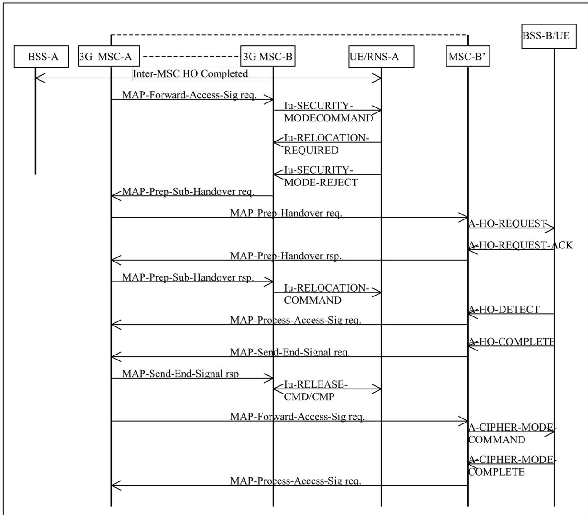

```

sequenceDiagram
    participant BSS_A as BSS-A
    participant MSC_A as 3G MSC-A
    participant MSC_B as 3G MSC-B
    participant RNS_A as UE/RNS-A
    participant MSC_B_prime as MSC-B'
    participant BSS_B as BSS-B/UE

    Note over BSS_A, RNS_A: Inter-MSC HO Completed
    MSC_A->>MSC_B: MAP-Forward-Access-Sig req.
    MSC_B->>RNS_A: Iu-SECURITY-MODECOMMAND
    RNS_A->>MSC_B: Iu-RELOCATION-REQUIRED
    MSC_B->>RNS_A: Iu-SECURITY-MODE-REJECT
    MSC_A->>MSC_B: MAP-Prep-Sub-Handover req.
    MSC_A->>MSC_B_prime: MAP-Prep-Handover req.
    MSC_B_prime->>BSS_B: A-HO-REQUEST
    BSS_B->>MSC_B_prime: A-HO-REQUEST-ACK
    MSC_B_prime->>MSC_A: MAP-Prep-Handover rsp.
    MSC_A->>MSC_B: MAP-Prep-Sub-Handover rsp.
    MSC_B->>RNS_A: Iu-RELOCATION-COMMAND
    MSC_B_prime->>BSS_B: A-HO-DETECT
    MSC_A->>MSC_B: MAP-Process-Access-Sig req.
    MSC_B_prime->>BSS_B: A-HO-COMPLETE
    MSC_A->>MSC_B: MAP-Send-End-Signal req.
    MSC_B->>MSC_A: MAP-Send-End-Signal rsp.
    MSC_B->>RNS_A: Iu-RELEASE-CMD/CMP
    MSC_A->>MSC_B_prime: MAP-Forward-Access-Sig req.
    MSC_B_prime->>BSS_B: A-CIPHER-MODE-COMMAND
    BSS_B->>MSC_B_prime: A-CIPHER-MODE-COMPLETE
    MSC_A->>MSC_B: MAP-Process-Access-Sig req.
  
```

Sequence diagram showing a collision between an Inter-MSC handover and a security mode control procedure. Lifelines: BSS-A, 3G MSC-A, 3G MSC-B, UE/RNS-A, MSC-B', BSS-B/UE.

NOTE: The message flow is shown in the perspective of 3G\_MSC-B. It is assumed that RNS-A has sent the Iu-RELOCATION-REQUIRED before it received the Iu-SECURITY-MODE-COMMAND.

**Figure 35ba: Collision between a subsequent Inter-MSC handover/relocation and a security mode control procedure i): successful handover/relocation**

If the subsequent Inter-MSC handover/relocation procedure is unsuccessful and the UE is still served by 3G\_MSC-B, the 3G\_MSC-B shall reattempt the security mode procedure towards RNS-A.

![Sequence diagram illustrating a collision between a subsequent Intra-3G_MSC-B handover/relocation and a security mode control procedure ii). The diagram shows message exchanges between BSS-A, 3G MSC-A, 3G MSC-B, UE/RNS-A, MSC-B', and BSS-B/UE. The sequence starts with 'Inter-MSC HO Completed' from 3G MSC-A to UE/RNS-A. Then, 3G MSC-A sends 'MAP-Forward-Access-Sig req' to 3G MSC-B. 3G MSC-B sends 'Iu-SECURITY-MODECOMMAND' to UE/RNS-A, which responds with 'Iu-RELOCATION-REQUIRED'. 3G MSC-B then sends 'Iu-SECURITY-MODE-REJECT' to UE/RNS-A. 3G MSC-A sends 'MAP-Prep-Sub-Handover req.' to 3G MSC-B, which in turn sends 'MAP-Prep-Handover req.' to MSC-B'. MSC-B' sends 'A-HO-REQUEST' to BSS-B/UE, which responds with 'A-HO-FAILURE'. 3G MSC-B sends 'MAP-Prep-Handover rsp.' to 3G MSC-A, which responds with 'MAP-Prep-Sub-Handover rsp.'. 3G MSC-B then sends 'Iu-RELOCATION-PREPARATION-FAILURE' to UE/RNS-A, followed by 'Iu-SECURITY-MODECOMMAND', which responds with 'Iu-SECURITY-MODE-COMPLETE'. Finally, 3G MSC-A sends 'MAP-Process-Access-Sig req.' to 3G MSC-B.](fc3e2b49a9f850951570e502393b697f_img.jpg)

Sequence diagram illustrating a collision between a subsequent Intra-3G\_MSC-B handover/relocation and a security mode control procedure ii). The diagram shows message exchanges between BSS-A, 3G MSC-A, 3G MSC-B, UE/RNS-A, MSC-B', and BSS-B/UE. The sequence starts with 'Inter-MSC HO Completed' from 3G MSC-A to UE/RNS-A. Then, 3G MSC-A sends 'MAP-Forward-Access-Sig req' to 3G MSC-B. 3G MSC-B sends 'Iu-SECURITY-MODECOMMAND' to UE/RNS-A, which responds with 'Iu-RELOCATION-REQUIRED'. 3G MSC-B then sends 'Iu-SECURITY-MODE-REJECT' to UE/RNS-A. 3G MSC-A sends 'MAP-Prep-Sub-Handover req.' to 3G MSC-B, which in turn sends 'MAP-Prep-Handover req.' to MSC-B'. MSC-B' sends 'A-HO-REQUEST' to BSS-B/UE, which responds with 'A-HO-FAILURE'. 3G MSC-B sends 'MAP-Prep-Handover rsp.' to 3G MSC-A, which responds with 'MAP-Prep-Sub-Handover rsp.'. 3G MSC-B then sends 'Iu-RELOCATION-PREPARATION-FAILURE' to UE/RNS-A, followed by 'Iu-SECURITY-MODECOMMAND', which responds with 'Iu-SECURITY-MODE-COMPLETE'. Finally, 3G MSC-A sends 'MAP-Process-Access-Sig req.' to 3G MSC-B.

NOTE: The message flow is shown in the perspective of 3G\_MSC-B. It is assumed that RNS-A has sent the Iu-RELOCATION-REQUIRED before it received the Iu-SECURITY-MODE-COMMAND.

**Figure 35bb: Collision between a subsequent Intra-3G\_MSC-B handover/relocation and a security mode control procedure ii): unsuccessful handover/relocation**

### 12.8.2 Interactions between handover/relocation control procedures and the RAB assignment procedure

#### 12.8.2.1 Intra-3G\_MSC-B handover/relocation

A subsequent channel assignment procedure may be requested by MSC-A/3G\_MSC-A after an Inter-MSC GSM to UMTS handover or Inter-MSC SRNS relocation without circuit connection (see subclauses 13.2 and 13.4). If RNS-A replies with an Iu-RAB-ASSIGNMENT-RESPONSE containing the cause value 'Relocation Triggered' due to an already initiated Intra-3G\_MSC-B UMTS to GSM handover or Intra-3G\_MSC-B SRNS relocation, the 3G\_MSC-B shall not forward the result of the RAB assignment procedure to MSC-A/3G\_MSC-A, but wait for the outcome of the handover/relocation procedure. If the handover/relocation procedure is completed successfully, the 3G\_MSC-B shall construct an A-ASSIGNMENT-COMPLETE or Iu-RAB-ASSIGNMENT-RESPONSE message, dependent on the encapsulated protocol used on the E-interface, and forward this message to MSC-A/3G\_MSC-A in the MAP-PREPARE-HANDOVER response.

![Sequence diagram showing a collision between an Inter-3G MSC-B handover/relocation and a RAB assignment procedure. The diagram involves five lifelines: BSS-A, 3G MSC-A, 3G MSC-B, UE/RNS-A, and BSS-B/UE. The sequence starts with an 'Inter-MSC HO Completed' message from 3G MSC-B to 3G MSC-A. This is followed by a 'MAP-Prep-Handover req.' from 3G MSC-A to 3G MSC-B. 3G MSC-B then sends an 'Iu-RAB-ASSIGNMENT-REQUEST' to UE/RNS-A. UE/RNS-A responds with 'Iu-RELOCATION-REQUIRED', 'Iu-RAB-ASSIGNMENT-RESPONSE', 'A-HO-REQUEST', 'A-HO-REQUEST-ACK', 'Iu-RELOCATION-COMMAND', 'A-HO-DETECT', and 'A-HO-COMPLETE'. Finally, 3G MSC-B sends a 'MAP-Prep-Handover rsp.' to 3G MSC-A and an 'Iu-RELEASE-CMD/CMP' to UE/RNS-A.](6a993bfdf2e00cfad01c4d2188a75d86_img.jpg)

```
sequenceDiagram
    participant BSS-A
    participant 3G MSC-A
    participant 3G MSC-B
    participant UE/RNS-A
    participant BSS-B/UE

    Note right of 3G MSC-B: Inter-MSC HO Completed
    3G MSC-A->>3G MSC-B: MAP-Prep-Handover req.
    3G MSC-B->>UE/RNS-A: Iu-RAB-ASSIGNMENT-REQUEST
    UE/RNS-A-->>3G MSC-B: Iu-RELOCATION-REQUIRED
    UE/RNS-A-->>3G MSC-B: Iu-RAB-ASSIGNMENT-RESPONSE
    UE/RNS-A-->>BSS-B/UE: A-HO-REQUEST
    BSS-B/UE-->>UE/RNS-A: A-HO-REQUEST-ACK
    UE/RNS-A-->>3G MSC-B: Iu-RELOCATION-COMMAND
    UE/RNS-A-->>BSS-B/UE: A-HO-DETECT
    BSS-B/UE-->>UE/RNS-A: A-HO-COMPLETE
    3G MSC-B-->>3G MSC-A: MAP-Prep-Handover rsp.
    3G MSC-B-->>UE/RNS-A: Iu-RELEASE-CMD/CMP
```

Sequence diagram showing a collision between an Inter-3G MSC-B handover/relocation and a RAB assignment procedure. The diagram involves five lifelines: BSS-A, 3G MSC-A, 3G MSC-B, UE/RNS-A, and BSS-B/UE. The sequence starts with an 'Inter-MSC HO Completed' message from 3G MSC-B to 3G MSC-A. This is followed by a 'MAP-Prep-Handover req.' from 3G MSC-A to 3G MSC-B. 3G MSC-B then sends an 'Iu-RAB-ASSIGNMENT-REQUEST' to UE/RNS-A. UE/RNS-A responds with 'Iu-RELOCATION-REQUIRED', 'Iu-RAB-ASSIGNMENT-RESPONSE', 'A-HO-REQUEST', 'A-HO-REQUEST-ACK', 'Iu-RELOCATION-COMMAND', 'A-HO-DETECT', and 'A-HO-COMPLETE'. Finally, 3G MSC-B sends a 'MAP-Prep-Handover rsp.' to 3G MSC-A and an 'Iu-RELEASE-CMD/CMP' to UE/RNS-A.

NOTE: The message flow is shown in the perspective of 3G MSC-B. It is assumed that RNS-A has sent the Iu-RELOCATION-REQUIRED before it received the Iu-RAB-ASSIGNMENT-REQUEST.

**Figure 35c: Collision between a subsequent Intra-3G MSC-B handover/relocation and a RAB assignment procedure i): successful handover/relocation**

If the handover/relocation procedure is unsuccessful and the UE is still served by RNS-A, the 3G MSC-B shall reattempt the RAB assignment procedure towards RNS-A.

![Sequence diagram illustrating a collision between a subsequent Intra-3G MSC-B handover/relocation and a RAB assignment procedure ii). The diagram shows message exchanges between BSS-A, 3G MSC-A, 3G MSC-B, UE/RNS-A, and BSS-B/UE. The process starts with an 'Inter-MSC HO Completed' message from 3G MSC-A to UE/RNS-A. This is followed by a 'MAP-Prep-Handover req.' from 3G MSC-A to 3G MSC-B. 3G MSC-B then sends an 'Iu-RAB-ASSIGNMENT-REQUEST' to UE/RNS-A. UE/RNS-A responds with 'Iu-RELOCATION-REQUIRED'. 3G MSC-B receives 'Iu-RAB-ASSIGNMENT-RESPONSE' from UE/RNS-A and sends 'A-HO-REQUEST' to BSS-B/UE. BSS-B/UE responds with 'A-HO-FAILURE'. 3G MSC-B then sends 'Iu-RELOCATION-PREPARATION-FAILURE' to UE/RNS-A. UE/RNS-A sends another 'Iu-RAB-ASSIGNMENT-REQUEST' to 3G MSC-B. 3G MSC-B responds with 'Iu-RAB-ASSIGNMENT-RESPONSE'. Finally, 3G MSC-A receives 'MAP-Prep-Handover rsp.' from 3G MSC-B.](d04c50badc78d5ba47bf4e352af4a754_img.jpg)

```

sequenceDiagram
    participant BSS-A
    participant 3G MSC-A
    participant 3G MSC-B
    participant UE/RNS-A
    participant BSS-B/UE

    Note left of BSS-A: Error: Reference source not
    3G MSC-A->>UE/RNS-A: Inter-MSC HO Completed
    3G MSC-A->>3G MSC-B: MAP-Prep-Handover req.
    3G MSC-B->>UE/RNS-A: Iu-RAB-ASSIGNMENT-REQUEST
    UE/RNS-A->>3G MSC-B: Iu-RELOCATION-REQUIRED
    3G MSC-B->>UE/RNS-A: Iu-RAB-ASSIGNMENT-RESPONSE
    3G MSC-B->>BSS-B/UE: A-HO-REQUEST
    BSS-B/UE->>3G MSC-B: A-HO-FAILURE
    3G MSC-B->>UE/RNS-A: Iu-RELOCATION-PREPARATION-FAILURE
    UE/RNS-A->>3G MSC-B: Iu-RAB-ASSIGNMENT-REQUEST
    3G MSC-B->>UE/RNS-A: Iu-RAB-ASSIGNMENT-RESPONSE
    3G MSC-B->>3G MSC-A: MAP-Prep-Handover rsp.
  
```

Sequence diagram illustrating a collision between a subsequent Intra-3G MSC-B handover/relocation and a RAB assignment procedure ii). The diagram shows message exchanges between BSS-A, 3G MSC-A, 3G MSC-B, UE/RNS-A, and BSS-B/UE. The process starts with an 'Inter-MSC HO Completed' message from 3G MSC-A to UE/RNS-A. This is followed by a 'MAP-Prep-Handover req.' from 3G MSC-A to 3G MSC-B. 3G MSC-B then sends an 'Iu-RAB-ASSIGNMENT-REQUEST' to UE/RNS-A. UE/RNS-A responds with 'Iu-RELOCATION-REQUIRED'. 3G MSC-B receives 'Iu-RAB-ASSIGNMENT-RESPONSE' from UE/RNS-A and sends 'A-HO-REQUEST' to BSS-B/UE. BSS-B/UE responds with 'A-HO-FAILURE'. 3G MSC-B then sends 'Iu-RELOCATION-PREPARATION-FAILURE' to UE/RNS-A. UE/RNS-A sends another 'Iu-RAB-ASSIGNMENT-REQUEST' to 3G MSC-B. 3G MSC-B responds with 'Iu-RAB-ASSIGNMENT-RESPONSE'. Finally, 3G MSC-A receives 'MAP-Prep-Handover rsp.' from 3G MSC-B.

NOTE: The message flow is shown in the perspective of 3G MSC-B. It is assumed that RNS-A has sent the Iu-RELOCATION-REQUIRED before it received the Iu-RAB-ASSIGNMENT-REQUEST.

**Figure 35d: Collision between a subsequent Intra-3G MSC-B handover/relocation and a RAB assignment procedure ii): unsuccessful handover/relocation**

#### 12.8.2.2 Subsequent Inter-MSC handover/relocation

A subsequent channel assignment procedure may be requested by MSC-A/3G MSC-A after an Inter-MSC GSM to UMTS handover or Inter-MSC SRNS relocation without circuit connection (see subclauses 13.2 and 13.4). If RNS-A replies with an Iu-RAB-ASSIGNMENT-RESPONSE containing the cause value 'Relocation Triggered' due to an already initiated subsequent Inter-MSC handover/relocation, the 3G MSC-B shall not forward the result of the RAB Assignment procedure to MSC-A/3G MSC-A, but wait for the outcome of the handover/relocation procedure.

![Sequence diagram showing a collision between a subsequent Inter-MSC handover/relocation and a RAB assignment procedure i) for successful handover/relocation. The diagram involves BSS-A, 3G MSC-A, 3G MSC-B, UE/RNS-A, MSC-B', and BSS-B/UE. The sequence starts with an 'Inter-MSC HO Completed' message from 3G MSC-A to BSS-A. Then, 3G MSC-A sends a 'MAP-Prep-Handover req.' to 3G MSC-B. 3G MSC-B sends an 'Iu-RAB-ASSIGNMENT-REQUEST' to UE/RNS-A, which responds with 'Iu-RELOCATION-REQUIRED'. 3G MSC-B then sends an 'Iu-RAB-ASSIGNMENT-RESPONSE' to 3G MSC-B (internal/loopback). 3G MSC-B sends a 'MAP-Prep-Sub-Handover req.' to 3G MSC-A. 3G MSC-A sends a 'MAP-Prep-Handover req.' to MSC-B', which responds with 'A-HO-REQUEST' to BSS-B/UE. BSS-B/UE responds with 'A-HO-REQUEST-ACK' to MSC-B'. 3G MSC-A receives a 'MAP-Prep-Handover rsp.' from MSC-B' and sends an 'IAM.' to 3G MSC-B, which responds with 'ACM.'. 3G MSC-A then sends a 'MAP-Prep-Sub-Handover rsp.' to 3G MSC-B, which sends an 'Iu-RELOCATION-COMMAND' to UE/RNS-A. MSC-B' sends an 'A-HO-DETECT' to BSS-B/UE, which responds with 'A-HO-COMPLETE' to MSC-B'. 3G MSC-A sends a 'MAP-Process-Access-Sig req.' to 3G MSC-B, which responds with 'MAP-Send-End-Signal req.' to 3G MSC-A. 3G MSC-A sends an 'ANM.' to 3G MSC-B, which responds with 'MAP-Send-End-Signal rsp.' to 3G MSC-A. Finally, 3G MSC-B sends an 'Iu-RELEASE-CMD/CMP' to UE/RNS-A.](e18841eb4a995df8354a793459e12fd0_img.jpg)

```

sequenceDiagram
    participant BSS-A
    participant 3G MSC-A
    participant 3G MSC-B
    participant UE/RNS-A
    participant MSC-B'
    participant BSS-B/UE

    3G MSC-A->>BSS-A: Inter-MSC HO Completed
    3G MSC-A->>3G MSC-B: MAP-Prep-Handover req.
    3G MSC-B->>UE/RNS-A: Iu-RAB-ASSIGNMENT-REQUEST
    UE/RNS-A->>3G MSC-B: Iu-RELOCATION-REQUIRED
    3G MSC-B->>3G MSC-B: Iu-RAB-ASSIGNMENT-RESPONSE
    3G MSC-B->>3G MSC-A: MAP-Prep-Sub-Handover req.
    3G MSC-A->>MSC-B': MAP-Prep-Handover req.
    MSC-B'->>BSS-B/UE: A-HO-REQUEST
    BSS-B/UE->>MSC-B': A-HO-REQUEST-ACK
    MSC-B'->>3G MSC-A: MAP-Prep-Handover rsp.
    3G MSC-A-->>3G MSC-B: IAM.
    3G MSC-B-->>3G MSC-A: ACM.
    3G MSC-A->>3G MSC-B: MAP-Prep-Sub-Handover rsp.
    3G MSC-B->>UE/RNS-A: Iu-RELOCATION-COMMAND
    BSS-B/UE->>MSC-B': A-HO-DETECT
    BSS-B/UE->>MSC-B': A-HO-COMPLETE
    3G MSC-A->>3G MSC-B: MAP-Process-Access-Sig req.
    3G MSC-B->>3G MSC-A: MAP-Send-End-Signal req.
    3G MSC-A-->>3G MSC-B: ANM.
    3G MSC-B->>3G MSC-A: MAP-Send-End-Signal rsp.
    3G MSC-B->>UE/RNS-A: Iu-RELEASE-CMD/CMP
  
```

Sequence diagram showing a collision between a subsequent Inter-MSC handover/relocation and a RAB assignment procedure i) for successful handover/relocation. The diagram involves BSS-A, 3G MSC-A, 3G MSC-B, UE/RNS-A, MSC-B', and BSS-B/UE. The sequence starts with an 'Inter-MSC HO Completed' message from 3G MSC-A to BSS-A. Then, 3G MSC-A sends a 'MAP-Prep-Handover req.' to 3G MSC-B. 3G MSC-B sends an 'Iu-RAB-ASSIGNMENT-REQUEST' to UE/RNS-A, which responds with 'Iu-RELOCATION-REQUIRED'. 3G MSC-B then sends an 'Iu-RAB-ASSIGNMENT-RESPONSE' to 3G MSC-B (internal/loopback). 3G MSC-B sends a 'MAP-Prep-Sub-Handover req.' to 3G MSC-A. 3G MSC-A sends a 'MAP-Prep-Handover req.' to MSC-B', which responds with 'A-HO-REQUEST' to BSS-B/UE. BSS-B/UE responds with 'A-HO-REQUEST-ACK' to MSC-B'. 3G MSC-A receives a 'MAP-Prep-Handover rsp.' from MSC-B' and sends an 'IAM.' to 3G MSC-B, which responds with 'ACM.'. 3G MSC-A then sends a 'MAP-Prep-Sub-Handover rsp.' to 3G MSC-B, which sends an 'Iu-RELOCATION-COMMAND' to UE/RNS-A. MSC-B' sends an 'A-HO-DETECT' to BSS-B/UE, which responds with 'A-HO-COMPLETE' to MSC-B'. 3G MSC-A sends a 'MAP-Process-Access-Sig req.' to 3G MSC-B, which responds with 'MAP-Send-End-Signal req.' to 3G MSC-A. 3G MSC-A sends an 'ANM.' to 3G MSC-B, which responds with 'MAP-Send-End-Signal rsp.' to 3G MSC-A. Finally, 3G MSC-B sends an 'Iu-RELEASE-CMD/CMP' to UE/RNS-A.

NOTE: The message flow is shown in the perspective of 3G\_MSC-B. It is assumed that RNS-A has sent the Iu-RELOCATION-REQUIRED before it received the Iu-RAB-ASSIGNMENT-REQUEST.

**Figure 35da: Collision between a subsequent Inter-MSC handover/relocation and a RAB assignment procedure i): successful handover/relocation**

If the subsequent Inter-MSC handover/relocation procedure is unsuccessful and the UE is still served by 3G\_MSC-B, the 3G\_MSC-B shall reattempt the subsequent channel assignment procedure towards RNS-A.

![Sequence diagram illustrating a collision between a subsequent Inter-MSC handover/relocation and a RAB assignment procedure. The diagram shows message exchanges between BSS-A, 3G MSC-A, 3G MSC-B, UE/RNS-A, MSC-B', and BSS-B/UE. The process starts with an 'Inter-MSC HO Completed' message from 3G MSC-B to BSS-A. 3G MSC-A sends a 'MAP- Prep-Handover req.' to 3G MSC-B. 3G MSC-B sends an 'Iu-RAB- ASSIGNMENT- REQUEST' to UE/RNS-A. UE/RNS-A responds with 'Iu-RELOCATION- REQUIRED'. 3G MSC-B then sends a 'MAP-Prep-Sub-Handover req.' to 3G MSC-A. 3G MSC-A sends a 'MAP-Prep-Handover req.' to MSC-B'. MSC-B' responds with 'A-HO-REQUEST' to BSS-B/UE. BSS-B/UE responds with 'A-HO-FAILURE' to MSC-B'. MSC-B' sends a 'MAP-Prep-Handover rsp.' to 3G MSC-A. 3G MSC-A sends a 'MAP-Prep-Sub-Handover rsp.' to 3G MSC-B. 3G MSC-B sends an 'Iu-RELOCATION- PREPARATION- FAILURE' to UE/RNS-A. UE/RNS-A responds with 'Iu- RAB- ASSIGNMENT- REQUEST'. 3G MSC-B sends an 'Iu- RAB- ASSIGNMENT- RESPONSE' to UE/RNS-A. Finally, 3G MSC-B sends a 'MAP- Prep-Handover rsp.' to 3G MSC-A.](0b998e3ad8f9d104768642612605cb35_img.jpg)

Sequence diagram illustrating a collision between a subsequent Inter-MSC handover/relocation and a RAB assignment procedure. The diagram shows message exchanges between BSS-A, 3G MSC-A, 3G MSC-B, UE/RNS-A, MSC-B', and BSS-B/UE. The process starts with an 'Inter-MSC HO Completed' message from 3G MSC-B to BSS-A. 3G MSC-A sends a 'MAP- Prep-Handover req.' to 3G MSC-B. 3G MSC-B sends an 'Iu-RAB- ASSIGNMENT- REQUEST' to UE/RNS-A. UE/RNS-A responds with 'Iu-RELOCATION- REQUIRED'. 3G MSC-B then sends a 'MAP-Prep-Sub-Handover req.' to 3G MSC-A. 3G MSC-A sends a 'MAP-Prep-Handover req.' to MSC-B'. MSC-B' responds with 'A-HO-REQUEST' to BSS-B/UE. BSS-B/UE responds with 'A-HO-FAILURE' to MSC-B'. MSC-B' sends a 'MAP-Prep-Handover rsp.' to 3G MSC-A. 3G MSC-A sends a 'MAP-Prep-Sub-Handover rsp.' to 3G MSC-B. 3G MSC-B sends an 'Iu-RELOCATION- PREPARATION- FAILURE' to UE/RNS-A. UE/RNS-A responds with 'Iu- RAB- ASSIGNMENT- REQUEST'. 3G MSC-B sends an 'Iu- RAB- ASSIGNMENT- RESPONSE' to UE/RNS-A. Finally, 3G MSC-B sends a 'MAP- Prep-Handover rsp.' to 3G MSC-A.

NOTE: The message flow is shown in the perspective of 3G MSC-B. It is assumed that RNS-A has sent the Iu-RELOCATION-REQUIRED before it received the Iu-RAB-ASSIGNMENT-REQUEST.

**Figure 35db: Collision between a subsequent Inter-MSC handover/relocation and a RAB assignment procedure ii): unsuccessful handover/relocation**

### 12.8.3 Interactions between directed retry handover procedures and the RAB assignment procedure

#### 12.8.3.1 Intra-3G MSC-B directed retry handover

For a description of the directed retry handover procedure see subclause 14.3.

A subsequent channel assignment procedure may be requested by MSC-A/3G MSC-A after an Inter-MSC GSM to UMTS handover or Inter-MSC SRNS relocation without circuit connection (see subclauses 13.2 and 13.4). If RNS-A replies with an Iu-RAB-ASSIGNMENT-RESPONSE containing the cause value 'Directed Retry' and the subsequent Iu-RELOCATION-REQUIRED indicates that an Intra-3G MSC-B directed retry handover is required, the 3G MSC-B shall not forward the result of the RAB assignment procedure to MSC-A/3G MSC-A, but wait for the outcome of the directed retry handover procedure. If the directed retry handover procedure is completed successfully, the 3G MSC-B shall construct an A-ASSIGNMENT-COMPLETE or Iu-RAB-ASSIGNMENT-RESPONSE message, dependent on the encapsulated protocol used on the E-interface, and forward this message to MSC-A/3G MSC-A in the MAP-PREPARE-HANDOVER response.

![Sequence diagram showing the interaction between a RAB assignment procedure and a subsequent Intra-3G_MSC-B directed retry handover. The diagram involves five lifelines: BSS-A, 3G MSC-A, 3G MSC-B, UE/RNS-A, and BSS-B/UE. The sequence starts with an 'Inter-MSC HO Completed' message from 3G MSC-A to UE/RNS-A. This is followed by a 'MAP-Prep-Handover req.' from 3G MSC-A to 3G MSC-B. 3G MSC-B then sends an 'Iu-RAB-ASSIGNMENT-REQUEST' to UE/RNS-A, which receives an 'Iu-RAB-ASSIGNMENT-RESPONSE'. Next, 3G MSC-B sends an 'Iu-RELOCATION-REQUIRED' to UE/RNS-A, which responds with 'A-HO-REQUEST' to BSS-B/UE. BSS-B/UE returns 'A-HO-REQUEST-ACK' to UE/RNS-A. UE/RNS-A then sends 'Iu-RELOCATION-COMMAND' to 3G MSC-B, which in turn sends 'A-HO-DETECT' to UE/RNS-A. UE/RNS-A sends 'A-HO-COMPLETE' to 3G MSC-B, which finally sends 'Iu-RELEASE-CMD/CMP' to UE/RNS-A and 'MAP-Prep-Handover rsp.' back to 3G MSC-A.](69467ece0a576b4c2ec3e0c89ba61527_img.jpg)

```

sequenceDiagram
    participant BSS-A
    participant 3G MSC-A
    participant 3G MSC-B
    participant UE/RNS-A
    participant BSS-B/UE

    Note over 3G MSC-A, UE/RNS-A: Inter-MSC HO Completed
    3G MSC-A->>3G MSC-B: MAP-Prep-Handover req.
    3G MSC-B->>UE/RNS-A: Iu-RAB-ASSIGNMENT-REQUEST
    UE/RNS-A-->>3G MSC-B: Iu-RAB-ASSIGNMENT-RESPONSE
    3G MSC-B->>UE/RNS-A: Iu-RELOCATION-REQUIRED
    UE/RNS-A->>BSS-B/UE: A-HO-REQUEST
    BSS-B/UE-->>UE/RNS-A: A-HO-REQUEST-ACK
    UE/RNS-A->>3G MSC-B: Iu-RELOCATION-COMMAND
    3G MSC-B->>UE/RNS-A: A-HO-DETECT
    UE/RNS-A-->>3G MSC-B: A-HO-COMPLETE
    3G MSC-B->>UE/RNS-A: Iu-RELEASE-CMD/CMP
    3G MSC-B-->>3G MSC-A: MAP-Prep-Handover rsp.
  
```

Sequence diagram showing the interaction between a RAB assignment procedure and a subsequent Intra-3G\_MSC-B directed retry handover. The diagram involves five lifelines: BSS-A, 3G MSC-A, 3G MSC-B, UE/RNS-A, and BSS-B/UE. The sequence starts with an 'Inter-MSC HO Completed' message from 3G MSC-A to UE/RNS-A. This is followed by a 'MAP-Prep-Handover req.' from 3G MSC-A to 3G MSC-B. 3G MSC-B then sends an 'Iu-RAB-ASSIGNMENT-REQUEST' to UE/RNS-A, which receives an 'Iu-RAB-ASSIGNMENT-RESPONSE'. Next, 3G MSC-B sends an 'Iu-RELOCATION-REQUIRED' to UE/RNS-A, which responds with 'A-HO-REQUEST' to BSS-B/UE. BSS-B/UE returns 'A-HO-REQUEST-ACK' to UE/RNS-A. UE/RNS-A then sends 'Iu-RELOCATION-COMMAND' to 3G MSC-B, which in turn sends 'A-HO-DETECT' to UE/RNS-A. UE/RNS-A sends 'A-HO-COMPLETE' to 3G MSC-B, which finally sends 'Iu-RELEASE-CMD/CMP' to UE/RNS-A and 'MAP-Prep-Handover rsp.' back to 3G MSC-A.

**Figure 35e: Interaction between a RAB assignment procedure and a subsequent Intra-3G\_MSC-B directed retry handover i): successful directed retry handover**

If the directed retry handover procedure is unsuccessful and the UE is still served by RNS-A, the 3G\_MSC-B may optionally take one of a number of actions:

- i) send an Iu-RELOCATION-PREPARATION FAILURE to RNS-A, if an Iu-RELOCATION-COMMAND has not already been sent. Additionally 3G\_MSC-B may retry the assignment procedure to RNS-A;
- ii) retry the assignment procedure to RNS-A, if the failure message was returned from RNS-A. This option is additional to those for normal handover;
- iii) construct an A-ASSIGNMENT-FAILURE message containing the cause value 'Radio interface failure, reversion to old channel' or Iu-RAB-ASSIGNMENT-RESPONSE message containing the cause value 'Failure In The Radio Interface Procedure', dependent on the encapsulated protocol used on the E-interface, and forward this message to MSC-A/3G\_MSC-A.

#### 12.8.3.2 Subsequent Inter-MSC directed retry handover

A subsequent channel assignment procedure may be requested by MSC-A/3G\_MSC-A after an Inter-MSC GSM to UMTS handover or SRNS relocation without circuit connection (see subclauses 13.2 and 13.4). If RNS-A replies with an Iu-RAB-ASSIGNMENT-RESPONSE containing the cause value 'Directed Retry' and the subsequent Iu-RELOCATION-REQUIRED indicates that a subsequent Inter-MSC directed retry handover is required, the 3G\_MSC-B shall not forward the result of the RAB Assignment procedure to MSC-A/3G\_MSC-A, but wait for the outcome of the directed retry handover procedure. 3G\_MSC-B shall continue with the directed retry handover procedure as described in subclause 14.3.

![Sequence diagram showing the interaction between a RAB assignment procedure and a subsequent Inter-MSC directed retry handover. The diagram involves six lifelines: BSS-A, 3G MSC-A, 3G MSC-B, UE/RNS-A, MSC-B', and BSS-B/UE. The sequence starts with an 'Inter-MSC HO Completed' message from 3G MSC-B to UE/RNS-A. This is followed by a 'MAP- Prep-Handover req.' from 3G MSC-A to 3G MSC-B. 3G MSC-B then sends an 'Iu-RAB- ASSIGNMENT- REQUEST' to UE/RNS-A, which responds with 'Iu-RAB- ASSIGNMENT- RESPONSE'. 3G MSC-B also sends an 'Iu-RELOCATION- REQUIRED' message to UE/RNS-A. 3G MSC-A then sends a 'MAP-Prep-Sub-Handover req.' to 3G MSC-B, which in turn sends a 'MAP-Prep-Handover req.' to MSC-B'. MSC-B' sends an 'A-HO-REQUEST' to BSS-B/UE, which responds with 'A-HO-REQUEST-ACK'. 3G MSC-B then sends a 'MAP-Prep-Handover rsp.' to 3G MSC-A. 3G MSC-A sends 'IAM.' and 'ACM.' messages to MSC-B'. 3G MSC-A also sends a 'MAP-Prep-Sub-Handover rsp.' to 3G MSC-B, which sends an 'Iu-RELOCATION- COMMAND' to UE/RNS-A. MSC-B' sends 'A-HO-DETECT' and 'A-HO-COMPLETE' messages to BSS-B/UE. 3G MSC-A sends 'MAP-Process-Access-Sig req.' and 'MAP-Send-End-Signal req.' to 3G MSC-B. 3G MSC-B sends 'ANM.' to MSC-B' and 'MAP-Send-End-Signal rsp.' to 3G MSC-A. Finally, 3G MSC-B sends an 'Iu-RELEASE- CMD/CMP' message to UE/RNS-A.](ba676d18b6a00f27c5bfaec9eeec20be_img.jpg)

Sequence diagram showing the interaction between a RAB assignment procedure and a subsequent Inter-MSC directed retry handover. The diagram involves six lifelines: BSS-A, 3G MSC-A, 3G MSC-B, UE/RNS-A, MSC-B', and BSS-B/UE. The sequence starts with an 'Inter-MSC HO Completed' message from 3G MSC-B to UE/RNS-A. This is followed by a 'MAP- Prep-Handover req.' from 3G MSC-A to 3G MSC-B. 3G MSC-B then sends an 'Iu-RAB- ASSIGNMENT- REQUEST' to UE/RNS-A, which responds with 'Iu-RAB- ASSIGNMENT- RESPONSE'. 3G MSC-B also sends an 'Iu-RELOCATION- REQUIRED' message to UE/RNS-A. 3G MSC-A then sends a 'MAP-Prep-Sub-Handover req.' to 3G MSC-B, which in turn sends a 'MAP-Prep-Handover req.' to MSC-B'. MSC-B' sends an 'A-HO-REQUEST' to BSS-B/UE, which responds with 'A-HO-REQUEST-ACK'. 3G MSC-B then sends a 'MAP-Prep-Handover rsp.' to 3G MSC-A. 3G MSC-A sends 'IAM.' and 'ACM.' messages to MSC-B'. 3G MSC-A also sends a 'MAP-Prep-Sub-Handover rsp.' to 3G MSC-B, which sends an 'Iu-RELOCATION- COMMAND' to UE/RNS-A. MSC-B' sends 'A-HO-DETECT' and 'A-HO-COMPLETE' messages to BSS-B/UE. 3G MSC-A sends 'MAP-Process-Access-Sig req.' and 'MAP-Send-End-Signal req.' to 3G MSC-B. 3G MSC-B sends 'ANM.' to MSC-B' and 'MAP-Send-End-Signal rsp.' to 3G MSC-A. Finally, 3G MSC-B sends an 'Iu-RELEASE- CMD/CMP' message to UE/RNS-A.

**Figure 35f: Interaction between a RAB assignment procedure and a subsequent Inter-MSC directed retry handover i): successful directed retry handover**

If the directed retry handover procedure is unsuccessful and the UE is still served by 3G\_MSC-B, the 3G\_MSC-B may optionally take one of a number of actions:

- i) send an Iu-RELOCATION-PREPARATION FAILURE to RNS-A, if an Iu-RELOCATION-COMMAND has not already been sen. Additionally 3G\_MSC-B may retry the assignment procedure to RNS-A t;
- ii) retry the assignment procedure to RNS-A, if the failure message was returned from RNS-A. This option is additional to those for normal handover;
- iii) construct an A-ASSIGNMENT-FAILURE message containing the cause value 'Radio interface failure, reversion to old channel' or Iu-RAB-ASSIGNMENT-RESPONSE message containing the cause value 'Failure In The Radio Interface Procedure', dependent on the encapsulated protocol used on the E-interface, and forward this message to MSC-A/3G\_MSC-A.

# 13 Subsequent channel assignment using a circuit connection between MSC-A and MSC-B

## 13.1 GSM handover

If a circuit connection has to be set up (for example for a Mobile Originated or Mobile Terminated Call Establishment) after an Inter-MSC handover without circuit connection, MSC-A shall request a Handover Number using a MAP-PREPARE-HANDOVER request, containing the A-ASSIGNMENT-REQUEST, on the established MAP connection. For speech calls, MSC-A shall also include the Iu Supported Codecs List to be used by MSC-B for subsequent intra-MSC-B intersystem handover to UMTS and intra-MSC-B SRNS relocation. If MSC-B indicates to MSC-A that at least one of two procedures assignment or Handover Number allocation can not be completed, then MSC-A shall terminate the circuit establishment attempt. The existing connection to the MS shall be maintained, if possible.

Upon receipt of the MAP-PREPARE-HANDOVER request MSC-B shall perform the requested assignment operation towards the BSS. In addition it shall retrieve a Handover Number from VLR-B. If a failure occurs in the assignment or Handover Number allocation then it shall be reflected in the MAP-PREPARE-HANDOVER response that at least one of these two procedures has not been completed (i.e. either by a MAP-PREPARE-HANDOVER result with the assignment procedure outcome and the Handover Number allocation outcome or by a MAP-PREPARE-HANDOVER error).

If MSC-A supports A interface over IP, then for speech calls MSC-A may include the AoIP-Supported Codecs List (Anchor) in the MAP-PREPARE-HANDOVER request.

If the BSS-B supports A over IP then MSC-B shall include a Codec List (MSC preferred) in the A-ASSIGNMENT-REQUEST message to BSS-B. MSC-B may select the codecs for the Codec List (MSC preferred) from the channel type information and the AoIP-Supported Codecs List (Anchor), if this list was provided by 3G\_MSC-A in the MAP-PREPARE-HANDOVER request. For a detailed description of the handling of these codec lists by MSC-A and MSC-B see 3GPP TS 23.153 [25]. If the AoIP-Supported Codecs List (Anchor) was not provided or MSC-B does not support the selection of codecs from the AoIP-Supported Codecs List, then MSC-B shall create the Codec List (MSC preferred) using the channel type information received from 3G\_MSC-A in the A-ASSIGNMENT-REQUEST message included in the MAP-PREPARE-HANDOVER request.

If MSC-A provided an AoIP-Supported Codecs List (Anchor) in the MAP-PREPARE-HANDOVER request and MSC-B selected the codecs for the Codec List (MSC preferred) from the AoIP-Supported Codecs List (Anchor), MSC-B may include the AoIP-Selected Codec (Target) and AoIP-Available Codecs List (MAP) in the MAP-PREPARE-HANDOVER response.

When MSC-A receives a successful MAP-PREPARE-HANDOVER response it shall establish a circuit connection to MSC-B by using the appropriate network supported procedures. In figure 36 this is indicated by the IAM (Initial Address Message) and ACM (Address Complete Message). MSC-B shall also send the Answer message if appropriate to the signalling system. Upon receipt of the Answer MSC-A shall consider the circuit connection establishment phase complete. If a failure occurs during the circuit establishment phase then the existing connection to the MS shall be maintained, if possible.

![Sequence diagram showing successful circuit-switched call establishment after a Basic Handover without circuit connection. Lifelines: MSC-A, MSC-B, BSS-B/MS, VLR-B. The sequence starts with MSC-A sending a MAP-Prepare-Handover req. to MSC-B. MSC-B sends a MAP-Alloc-Handover-Number req. to VLR-B and an A-ASG-REQUEST to BSS-B/MS. BSS-B/MS responds with A-ASG-COMPLETE. MSC-B sends a MAP-Prep-Handover resp. to MSC-A and a MAP-Send-Handover-Report req. to VLR-B. MSC-A sends IAM, ACM, and Answer messages to MSC-B. VLR-B responds with MAP-Send-Handover-Report resp. (1). The call ends with a RELEASE message from MSC-A to MSC-B, and MSC-B responds with a MAP-Send-End-Signal resp.](a7450c80e88ad3f6ca1427ad84020998_img.jpg)

```

sequenceDiagram
    participant MSC-A
    participant MSC-B
    participant BSS-B/MS
    participant VLR-B
    Note left of MSC-A: End of call
    MSC-A->>MSC-B: MAP-Prepare-Handover req.
    MSC-B->>VLR-B: MAP-Alloc-Handover-Number req.
    MSC-B->>BSS-B/MS: A-ASG-REQUEST
    BSS-B/MS-->>MSC-B: A-ASG-COMPLETE
    MSC-B->>MSC-A: MAP-Prep-Handover resp.
    MSC-B->>VLR-B: MAP-Send-Handover-Report req.
    MSC-A-->>MSC-B: IAM
    MSC-B->>VLR-B: MAP-Send-Handover-Report resp. (1)
    MSC-A-->>MSC-B: ACM
    MSC-A-->>MSC-B: Answer
    MSC-A-->>MSC-B: RELEASE
    MSC-B->>MSC-A: MAP-Send-End-Signal resp.
  
```

Sequence diagram showing successful circuit-switched call establishment after a Basic Handover without circuit connection. Lifelines: MSC-A, MSC-B, BSS-B/MS, VLR-B. The sequence starts with MSC-A sending a MAP-Prepare-Handover req. to MSC-B. MSC-B sends a MAP-Alloc-Handover-Number req. to VLR-B and an A-ASG-REQUEST to BSS-B/MS. BSS-B/MS responds with A-ASG-COMPLETE. MSC-B sends a MAP-Prep-Handover resp. to MSC-A and a MAP-Send-Handover-Report req. to VLR-B. MSC-A sends IAM, ACM, and Answer messages to MSC-B. VLR-B responds with MAP-Send-Handover-Report resp. (1). The call ends with a RELEASE message from MSC-A to MSC-B, and MSC-B responds with a MAP-Send-End-Signal resp.

NOTE: Can be sent at any time after the reception of IAM.

**Figure 36: Successful circuit-switched call establishment after a Basic Handover without circuit connection**

## 13.2 UMTS to GSM handover

If a circuit connection has to be set up (for example for a Mobile Originated or Mobile Terminated Call Establishment) after an Inter-3G\_MSC UMTS to GSM handover without circuit connection, 3G\_MSC-A shall request a Handover Number using a MAP-PREPARE-HANDOVER request, containing the A-ASSIGNMENT-REQUEST, on the established MAP connection. For speech calls, 3G\_MSC-A shall also include the Iu Supported Codecs List to be used by MSC-B for subsequent intra-MSC-B intersystem handover to UMTS and intra-MSC-B SRNS relocation. If MSC-B indicates to MSC-B and to 3G\_MSC-A that at least one of two procedures assignment or Handover Number allocation can not be completed, then 3G\_MSC-A shall terminate the circuit establishment attempt. The existing connection to the UE/MS shall be maintained, if possible.

Upon receipt of the MAP-PREPARE-HANDOVER request MSC-B shall perform the requested assignment operation towards the BSS. In addition it shall retrieve a Handover Number from VLR-B. If a failure occurs in the assignment or Handover Number allocation then it shall be reflected in the MAP-PREPARE-HANDOVER response that at least one of these two procedures has not been completed (i.e. either by a MAP-PREPARE-HANDOVER result with the assignment procedure outcome and the Handover Number allocation outcome or by a MAP-PREPARE-HANDOVER error).

If 3G\_MSC-A supports A interface over IP, then for speech calls 3G\_MSC-A may include the AoIP-Supported Codecs List (Anchor) in the MAP-PREPARE-HANDOVER request.

If the BSS-B supports A over IP, then MSC-B shall include a Codec List (MSC preferred) in the A-ASSIGNMENT-REQUEST message to BSS-B. MSC-B may select the codecs for the Codec List (MSC preferred) from the channel type information and the AoIP-Supported Codecs List (Anchor), if this list was provided by 3G\_MSC-A in the MAP-PREPARE-HANDOVER request. For a detailed description of the handling of these codec lists by 3G\_MSC-A and MSC-B see 3GPP TS 23.153 [25]. If the AoIP-Supported Codecs List (Anchor) was not provided or MSC-B does not support the selection of codecs from the AoIP-Supported Codecs List (Anchor), then MSC-B shall create the Codec List (MSC preferred) using the channel type information received from 3G\_MSC-A in the A-ASSIGNMENT-REQUEST message included in the MAP-PREPARE-HANDOVER request.

If MSC-A provided an AoIP-Supported Codecs List (Anchor) in the MAP-PREPARE-HANDOVER request and MSC-B selected the codecs for the Codec List (MSC preferred) from the AoIP-Supported Codecs List (Anchor), MSC-B may include the AoIP-Selected Codec (Target) and AoIP-Available Codecs List (MAP) in the MAP-PREPARE-HANDOVER response.

When 3G\_MSC-A receives a successful MAP-PREPARE-HANDOVER response, it shall establish a circuit connection to MSC-B by using the appropriate network supported procedures. In figure 37 this is indicated by the IAM (Initial Address Message) and ACM (Address Complete Message). MSC-B shall also send the Answer message if appropriate to the signalling system. Upon receipt of the Answer 3G\_MSC-A shall consider the circuit connection establishment phase complete. If a failure occurs during the circuit establishment phase then the existing connection to the UE/MS shall be maintained, if possible.

![Sequence diagram illustrating the successful circuit-switched call establishment after a Basic UMTS to GSM Handover without circuit connection. The diagram shows four lifelines: 3G_MSC-A, MSC-B, BSS-B/UE/MS, and VLR-B. The sequence of messages is: 1. 3G_MSC-A sends MAP-Prepare-Handover req. to MSC-B. 2. MSC-B sends MAP-Alloc-Handover-Number req. to VLR-B. 3. MSC-B sends A-ASG-REQUEST to BSS-B/UE/MS. 4. BSS-B/UE/MS sends A-ASG-COMPLETE to MSC-B. 5. MSC-B sends MAP-Prep-Handover resp. to 3G_MSC-A. 6. MSC-B sends MAP-Send-Handover-Report req. to VLR-B. 7. 3G_MSC-A sends IAM to MSC-B. 8. MSC-B sends MAP-Send-Handover-Report resp. (1) to VLR-B. 9. 3G_MSC-A sends ACM to MSC-B. 10. 3G_MSC-A sends Answer to MSC-B. 11. End of call: 3G_MSC-A sends RELEASE to MSC-B. 12. 3G_MSC-A sends MAP-Send-End-Signal resp. to MSC-B.](521e2e9d53a2d9c4b3e22d151d46ee23_img.jpg)

```

sequenceDiagram
    participant 3G_MSC-A
    participant MSC-B
    participant BSS-B/UE/MS
    participant VLR-B
    Note left of 3G_MSC-A: End of call
    3G_MSC-A->>MSC-B: MAP-Prepare-Handover req.
    MSC-B->>VLR-B: MAP-Alloc-Handover-Number req.
    MSC-B->>BSS-B/UE/MS: A-ASG-REQUEST
    BSS-B/UE/MS->>MSC-B: A-ASG-COMPLETE
    MSC-B->>3G_MSC-A: MAP-Prep-Handover resp.
    MSC-B->>VLR-B: MAP-Send-Handover-Report req.
    3G_MSC-A-->>MSC-B: IAM
    MSC-B->>VLR-B: MAP-Send-Handover-Report resp. (1)
    3G_MSC-A-->>MSC-B: ACM
    3G_MSC-A-->>MSC-B: Answer
    3G_MSC-A-->>MSC-B: RELEASE
    3G_MSC-A->>MSC-B: MAP-Send-End-Signal resp.
  
```

Sequence diagram illustrating the successful circuit-switched call establishment after a Basic UMTS to GSM Handover without circuit connection. The diagram shows four lifelines: 3G\_MSC-A, MSC-B, BSS-B/UE/MS, and VLR-B. The sequence of messages is: 1. 3G\_MSC-A sends MAP-Prepare-Handover req. to MSC-B. 2. MSC-B sends MAP-Alloc-Handover-Number req. to VLR-B. 3. MSC-B sends A-ASG-REQUEST to BSS-B/UE/MS. 4. BSS-B/UE/MS sends A-ASG-COMPLETE to MSC-B. 5. MSC-B sends MAP-Prep-Handover resp. to 3G\_MSC-A. 6. MSC-B sends MAP-Send-Handover-Report req. to VLR-B. 7. 3G\_MSC-A sends IAM to MSC-B. 8. MSC-B sends MAP-Send-Handover-Report resp. (1) to VLR-B. 9. 3G\_MSC-A sends ACM to MSC-B. 10. 3G\_MSC-A sends Answer to MSC-B. 11. End of call: 3G\_MSC-A sends RELEASE to MSC-B. 12. 3G\_MSC-A sends MAP-Send-End-Signal resp. to MSC-B.

NOTE 1: Can be sent at any time after the reception of IAM.

**Figure 37: Successful circuit-switched call establishment after a Basic UMTS to GSM Handover without circuit connection**

## 13.3 GSM to UMTS handover

If a circuit connection has to be set up (for example for a Mobile Originated or Mobile Terminated Call Establishment) after an Inter-3G\_MSC GSM to UMTS handover without circuit connection, MSC-A shall request a Handover Number using a MAP-PREPARE-HANDOVER request, containing the A-ASSIGNMENT-REQUEST, on the established MAP connection. If 3G\_MSC-B indicates to 3G\_MSC-B and to MSC-A that at least one of two procedures assignment or Handover Number allocation can not be completed, then MSC-A shall terminate the circuit establishment attempt. The existing connection to the UE/MS shall be maintained, if possible.

If MSC-A supports A interface over IP, then for speech calls MSC-A may include the AoIP-Supported Codecs List (Anchor) in the MAP-PREPARE-HANDOVER request to be used by 3G\_MSC-B for subsequent intra-3G\_MSC-B intersystem handover to an A over IP capable BSS. For a detailed description of the handling of this codec list by MSC-A and 3G\_MSC-B see 3GPP TS 23.153 [25].

Upon receipt of the MAP-PREPARE-HANDOVER request 3G\_MSC-B shall perform the requested assignment operation towards the RNS. In addition it shall retrieve a Handover Number from VLR-B. If a failure occurs in the assignment or Handover Number allocation then it shall be reflected in the MAP-PREPARE-HANDOVER response that at least one of these two procedures has not been completed (i.e. either by a MAP-PREPARE-HANDOVER result with the assignment procedure outcome and the Handover Number allocation outcome or by a MAP-PREPARE-HANDOVER error).

For speech calls, if 3G\_MSC-B supports the selection of codec based on the Iu-Supported Codecs List, 3G\_MSC-B shall select a codec from the Iu Supported Codecs List, generate associated RAB parameters and connect a transcoder. If the Iu Supported Codecs List was not received or 3G\_MSC-B does not support the selection of codec based on the Iu-Supported Codecs List, 3G\_MSC-B shall select the appropriate default speech codec.

For an assignment in UTRAN Iu mode, 3G\_MSC-B shall also generate a NAS Synch Indicator for the Iu-RAB-ASSIGNMENT-REQUEST message. If the Iu Supported Codecs List was received by 3G\_MSC-B and 3G\_MSC-B supports the selection of codec based on the Iu-Supported Codecs List, then the Iu Selected codec shall be indicated in the MAP-PREPARE-HANDOVER response, sent from 3G\_MSC-B to MSC-A.

When MSC-A receives a successful MAP-PREPARE-HANDOVER response, it shall establish a circuit connection to 3G\_MSC-B by using the appropriate network supported procedures. In figure 38 this is indicated by the IAM (Initial Address Message) and ACM (Address Complete Message). 3G\_MSC-B shall also send the Answer message if appropriate to the signalling system. Upon receipt of the Answer MSC-A shall consider the circuit connection establishment phase complete. If a failure occurs during the circuit establishment phase then the existing connection to the UE/MS shall be maintained, if possible.

![Sequence diagram showing successful circuit-switched call establishment after a Basic GSM to UMTS Handover without circuit connection. The diagram involves four lifelines: MSC-A, 3G_MSC-B, RNS-B/UE/MS, and VLR-B. The sequence starts with MSC-A sending a MAP-Prepare-Handover req. to 3G_MSC-B. 3G_MSC-B sends a MAP-Alloc-Handover-Number req. to VLR-B and an IU-RAB-ASG-REQUEST to RNS-B/UE/MS. RNS-B/UE/MS responds with IU-RAB-ASG-COMPLETE. 3G_MSC-B sends a MAP-Prep-Handover resp. to MSC-A and a MAP-Send-Handover-Report req. to VLR-B. MSC-A sends IAM, ACM, and Answer messages to 3G_MSC-B. 3G_MSC-B sends a MAP-Send-Handover-Report resp. (1) to VLR-B. The call ends with a RELEASE message from MSC-A to 3G_MSC-B, and 3G_MSC-B responds with a MAP-Send-End-Signal resp. to MSC-A.](6e9d059430baba0c363e33749f68b107_img.jpg)

```

sequenceDiagram
    participant MSC-A
    participant 3G_MSC-B
    participant RNS-B/UE/MS
    participant VLR-B
    Note left of MSC-A: End of call
    MSC-A->>3G_MSC-B: MAP-Prepare-Handover req.
    3G_MSC-B->>VLR-B: MAP-Alloc-Handover-Number req.
    3G_MSC-B->>RNS-B/UE/MS: IU-RAB-ASG-REQUEST
    RNS-B/UE/MS-->>3G_MSC-B: IU-RAB-ASG-COMPLETE
    3G_MSC-B-->>MSC-A: MAP-Prep-Handover resp.
    3G_MSC-B->>VLR-B: MAP-Send-Handover-Report req.
    MSC-A-->>3G_MSC-B: IAM
    3G_MSC-B-->>VLR-B: MAP-Send-Handover-Report resp. (1)
    MSC-A-->>3G_MSC-B: ACM
    MSC-A-->>3G_MSC-B: Answer
    MSC-A-->>3G_MSC-B: RELEASE
    3G_MSC-B-->>MSC-A: MAP-Send-End-Signal resp.
  
```

Sequence diagram showing successful circuit-switched call establishment after a Basic GSM to UMTS Handover without circuit connection. The diagram involves four lifelines: MSC-A, 3G\_MSC-B, RNS-B/UE/MS, and VLR-B. The sequence starts with MSC-A sending a MAP-Prepare-Handover req. to 3G\_MSC-B. 3G\_MSC-B sends a MAP-Alloc-Handover-Number req. to VLR-B and an IU-RAB-ASG-REQUEST to RNS-B/UE/MS. RNS-B/UE/MS responds with IU-RAB-ASG-COMPLETE. 3G\_MSC-B sends a MAP-Prep-Handover resp. to MSC-A and a MAP-Send-Handover-Report req. to VLR-B. MSC-A sends IAM, ACM, and Answer messages to 3G\_MSC-B. 3G\_MSC-B sends a MAP-Send-Handover-Report resp. (1) to VLR-B. The call ends with a RELEASE message from MSC-A to 3G\_MSC-B, and 3G\_MSC-B responds with a MAP-Send-End-Signal resp. to MSC-A.

NOTE 1: Can be sent at any time after the reception of IAM.

**Figure 38: Successful circuit-switched call establishment after a Basic GSM to UMTS Handover without circuit connection**

## 13.4 SRNS Relocation

### 13.4.1 Without circuit connection

If a circuit connection has to be set up (for example for a Mobile Originated or Mobile Terminated Call Establishment) after an Inter-3G\_MSC relocation without circuit connection, 3G\_MSC-A shall request a Handover Number using a MAP-PREPARE-HANDOVER request, containing the IU-RAB-ASSIGNMENT-REQUEST, on the established MAP connection.

For speech calls, 3G\_MSC-A shall include the Iu Supported Codecs List in the MAP-PREPARE-HANDOVER request. 3G\_MSC-A shall configure the RANAP RAB parameters according to the appropriate default speech codec.

If 3G\_MSC-A supports A interface over IP, then for speech calls 3G\_MSC-A may include the AoIP-Supported Codecs List (Anchor) in the MAP-PREPARE-HANDOVER request to be used by 3G\_MSC-B for subsequent intra-3G\_MSC-B intersystem handover to an A over IP capable BSS. For a detailed description of the handling of this codec list by 3G\_MSC-A and 3G\_MSC-B see 3GPP TS 23.153 [25].

Alternatively, if 3G\_MSC-B is known to support the use of the Iu Supported Codecs List, 3G\_MSC-A may configure the RANAP RAB parameters according to the preferred codec and indicate this to 3G\_MSC-B by including the RAB configuration indicator in the MAP-PREPARE-HANDOVER request. The decision to use this option is based on internal configuration information in 3G\_MSC-A.

For an assignment in UTRAN Iu mode, 3G\_MSC-A shall also include the NAS Synch Indicator in the Iu-RAB-ASSIGNMENT-REQUEST.

If 3G\_MSC-B indicates to 3G\_MSC-B and to 3G\_MSC-A that at least one of two procedures (RAB) assignment or Handover Number allocation can not be completed, then 3G\_MSC-A shall terminate the circuit establishment attempt. The existing connection to the UE shall be maintained, if possible.

Upon receipt of the MAP-PREPARE-HANDOVER request, 3G\_MSC-B shall perform the requested RAB assignment operation towards the RNS. In addition it shall retrieve a Handover Number from VLR-B.

For speech calls, if 3G\_MSC-B supports the selection of codec based on the Iu-Supported Codecs List, 3G\_MSC-B shall select an Iu Selected codec from the Iu Supported Codecs List and connect a transcoder. If the Iu Supported Codecs List was not received or 3G\_MSC-B does not support the selection of codec based on the Iu-Supported Codecs List, 3G\_MSC-B shall select the appropriate default speech codec.

3G\_MSC-B shall reconfigure the RANAP RAB parameters according to the Iu Selected codec:

- if the RAB configuration indicator is included in the MAP-PREPARE-HANDOVER request and the codec selected by 3G\_MSC-B is different from the preferred codec; or
- if the RAB configuration indicator is not included in the MAP-PREPARE-HANDOVER request and the codec selected by 3G\_MSC-B is different from the appropriate default speech codec.

Additionally, for an assignment in UTRAN Iu mode, 3G\_MSC-B shall include the NAS Synch Indicator for the Iu Selected codec in the Iu-RAB-ASSIGNMENT-REQUEST. If the Iu Supported Codecs List was received by 3G\_MSC-B and 3G\_MSC-B supports the selection of codec based on the Iu-Supported Codecs List, then the Iu Selected codec shall be indicated in the MAP-PREPARE-HANDOVER response, sent from 3G\_MSC-B to 3G\_MSC-A.

If a failure occurs in the RAB assignment or Handover Number allocation then it shall be reflected in the MAP-PREPARE-HANDOVER response that at least one of these two procedures has not been completed (i.e. either by a MAP-PREPARE-HANDOVER result with the RAB assignment procedure outcome and the Handover Number allocation outcome or by a MAP-PREPARE-HANDOVER error).

When 3G\_MSC-A receives a successful MAP-PREPARE-HANDOVER response, it shall establish a circuit connection to 3G\_MSC-B by using the appropriate network supported procedures. In figure 39 this is indicated by the IAM (Initial Address Message) and ACM (Address Complete Message). 3G\_MSC-B shall also send the Answer message if appropriate to the signalling system. Upon receipt of the Answer 3G\_MSC-A shall consider the circuit connection establishment phase complete. If a failure occurs during the circuit establishment phase then the existing connection to the UE shall be maintained, if possible.

### 13.4.2 With circuit connection (Optional functionality)

If 3G\_MSC-A and 3G\_MSC-B support the optional supplementary service Multicall (See 3GPP TS 23.135 [17]), 3G\_MSC-A and 3G\_MSC-B shall have the following functionality additionally to the description in subclause 13.4.1.

A new circuit connection shall be able to set up (for example for a new Mobile Originated or a new Mobile Terminated Call Establishment) after an Inter-3G\_MSC relocation with one or several circuit connections. The procedures for the establishment of the additional circuit connection in 3G\_MSC-A and 3G\_MSC-B are the same as that described in subclause 13.4.1.


```

sequenceDiagram
    participant 3G_MSC-A
    participant 3G_MSC-B
    participant RNS-B/UE
    participant VLR-B
    Note left of 3G_MSC-A: End of call
    3G_MSC-A->>3G_MSC-B: MAP-Prepare-Handover req.
    3G_MSC-B->>VLR-B: MAP-Alloc-Handover-Number req.
    3G_MSC-B->>RNS-B/UE: IU-RAB-ASG-REQUEST
    RNS-B/UE-->>3G_MSC-B: IU-RAB-ASG-COMPLETE
    3G_MSC-B->>3G_MSC-A: MAP-Prep-Handover resp.
    3G_MSC-B->>VLR-B: MAP-Send-Handover-Report req.
    3G_MSC-A-->>3G_MSC-B: IAM
    3G_MSC-B->>VLR-B: MAP-Send-Handover-Report resp. (1)
    3G_MSC-A-->>3G_MSC-B: ACM
    3G_MSC-A-->>3G_MSC-B: Answer
    3G_MSC-A-->>3G_MSC-B: RELEASE
    3G_MSC-A->>3G_MSC-B: MAP-Send-End-Signal resp.
  
```

Sequence diagram for successful circuit-switched call establishment after a Basic Relocation without circuit connection. Lifelines: 3G\_MSC-A, 3G\_MSC-B, RNS-B/UE, VLR-B. The sequence shows MAP-Prepare-Handover req., MAP-Alloc-Handover-Number req., IU-RAB-ASG-REQUEST, IU-RAB-ASG-COMPLETE, MAP-Prep-Handover resp., MAP-Send-Handover-Report req., IAM, MAP-Send-Handover-Report resp. (1), ACM, Answer, RELEASE, and MAP-Send-End-Signal resp. The call ends at 3G\_MSC-A.

NOTE 1: Can be sent at any time after the reception of IAM.

**Figure 39: Successful circuit-switched call establishment after a Basic Relocation without circuit connection**

# 14 Directed retry handover

Editor's Note: [Directed retry in the cases of SRNS relocation is FFS]

## 14.1 GSM handover

The directed retry procedure allows the network to select the optimum cell for the Mobile Station. The process of directed retry involves the assignment of a Mobile Station to a radio channel on a cell other than the serving cell. This process is triggered by the assignment procedures, as described in 3GPP TS 48.008 [5], and employs internal or external handover procedures as described in clauses 6 and 7. The successful procedure for a directed retry is as shown in figure 40 and as described below.

If during the assignment phase, as represented by the A-ASSIGNMENT-REQUEST message, a handover becomes necessary, due to either radio conditions or congestion, then the Mobile Station may be handed over to a different cell. When the decision has been made to handover the MS the BSS-A may send an A-ASSIGNMENT-FAILURE message, indicating 'directed retry', before sending the A-HANDOVER-REQUIRED message to MSC-A, indicating 'directed retry'. However BSS-A may alternatively send the A-HANDOVER-REQUIRED message, indicating 'directed retry', without sending the A-ASSIGNMENT-FAILURE message. Other cause values may be used instead of "Directed Retry" in the A-HANDOVER-REQUIRED message, this will allow the MSC to take different actions dependent on the received cause. Upon receipt of the A-HANDOVER-REQUIRED message from BSS-A, then MSC-A shall initiate the handover as described in clauses 6 and 7. No resources shall be cleared in the MSC-A or BSS-A for this connection.

After receipt of the A-HANDOVER-COMPLETE message from BSS-B the assignment procedure shall be considered to be complete and the resources on BSS-A shall be cleared.

![Sequence diagram illustrating a Directed Retry Intra-MSC Handover Procedure. The diagram shows interactions between an MS (Mobile Station), BSS-A (Base Station System A), MSC-A (Mobile Switching Center A), BSS-B (Base Station System B), and another MS. The sequence starts with BSS-A sending an A-Assignment-Request to MSC-A, which fails with A-Assignment-Failure. BSS-A then sends A-Handover-Required to MSC-A. MSC-A sends A-Handover-Request to BSS-B, which responds with A-Handover-Request-Ack. MSC-A sends A-Handover-Command to BSS-A, which in turn sends RI-HO-Command to the MS. BSS-B sends RI-HO-Access to the MS, which responds with RI-HO-Complete. BSS-B then sends A-Handover-Detect to MSC-A, which responds with A-Handover-Complete. Finally, MSC-A sends A-Clear-Command to BSS-A, which responds with A-Clear-Complete.](cc7baa8e5118f4b42c01166637c738ea_img.jpg)

```

sequenceDiagram
    participant MS1 as MS
    participant BSS-A
    participant MSC-A
    participant BSS-B
    participant MS2 as MS

    BSS-A->>MSC-A: A-Assignment-Request
    MSC-A-->>BSS-A: A-Assignment-Failure
    BSS-A->>MSC-A: A-Handover-Required
    MSC-A->>BSS-B: A-Handover-Request
    BSS-B-->>MSC-A: A-Handover-Request-Ack
    MSC-A->>BSS-A: A-Handover-Command
    BSS-A->>MS1: RI-HO-Command
    BSS-B->>MS2: RI-HO-Access
    MS2-->>BSS-B: RI-HO-Complete
    BSS-B->>MSC-A: A-Handover-Detect
    MSC-A-->>BSS-B: A-Handover-Complete
    MSC-A->>BSS-A: A-Clear-Command
    BSS-A-->>MSC-A: A-Clear-Complete
  
```

Sequence diagram illustrating a Directed Retry Intra-MSC Handover Procedure. The diagram shows interactions between an MS (Mobile Station), BSS-A (Base Station System A), MSC-A (Mobile Switching Center A), BSS-B (Base Station System B), and another MS. The sequence starts with BSS-A sending an A-Assignment-Request to MSC-A, which fails with A-Assignment-Failure. BSS-A then sends A-Handover-Required to MSC-A. MSC-A sends A-Handover-Request to BSS-B, which responds with A-Handover-Request-Ack. MSC-A sends A-Handover-Command to BSS-A, which in turn sends RI-HO-Command to the MS. BSS-B sends RI-HO-Access to the MS, which responds with RI-HO-Complete. BSS-B then sends A-Handover-Detect to MSC-A, which responds with A-Handover-Complete. Finally, MSC-A sends A-Clear-Command to BSS-A, which responds with A-Clear-Complete.

**Figure 40: Example of a Directed Retry Intra-MSC Handover Procedure**

If a failure occurs during the handover attempt, for example A-HANDOVER-FAILURE returned from BSS-A or BSS-B, then MSC-A will terminate the handover to BSS-B. Under these conditions MSC-A may optionally take one of a number of actions:

- i) retry the handover to the same cell;
- ii) select the next cell from the list contained in the A-HANDOVER-REQUIRED message and attempt a handover to the new cell;
- iii) send an A-HANDOVER-REQUIRED-REJECT to BSS-A, if an A-HANDOVER-COMMAND has not already been sent. Additionally MSC-A may retry the assignment procedure to BSS-A;
- iv) retry the assignment procedure to BSS-A, if the failure message was returned from BSS-A. This option is additional to those for normal handover;
- v) Clear the complete call.

The procedures for Inter-MSC handover are also applicable to the directed retry process. If an Inter-MSC handover is necessary then the assignment process should be considered to have completed successfully upon receipt of the A-HO-COMPLETE included in the MAP-SEND-END-SIGNAL request.

## 14.2 GSM to UMTS handover

The directed retry procedure allows the network to select the optimum cell for the UE/MS. The process of directed retry involves the assignment of a UE/MS to a radio channel on a cell other than the serving cell. This process is triggered by the assignment procedures, as described in 3GPP TS 48.008 [5], and employs internal or external GSM to UMTS handover procedures as described in subclauses 6.2.2 and 8.2. The successful procedure for a directed retry in case of an intra-3G\_MSC GSM to UMTS handover is as shown in figure 40a and as described below.

If during the assignment phase, as represented by the A-ASSIGNMENT-REQUEST message, a GSM to UMTS handover becomes necessary, due to radio conditions, congestion or inability to provide the requested bearer service in GSM, then the UE/MS may be handed over to a UMTS cell. If the requested bearer service cannot be provided in GSM, 3G\_MSC-A shall indicate in the A-ASSIGNMENT-REQUEST message that handover to UMTS should be performed. When the decision has been made to handover the UE/MS the BSS-A may send an A-ASSIGNMENT-FAILURE message, indicating 'directed retry', before sending the A-HANDOVER-REQUIRED message to 3G\_MSC-A, indicating 'directed retry'. However BSS-A may alternatively send the A-HANDOVER-REQUIRED message, indicating 'directed retry', without sending the A-ASSIGNMENT-FAILURE message. Other cause values may be used instead of "Directed Retry" in the A-HANDOVER-REQUIRED message, this will allow the 3G\_MSC to take different actions dependent on the received cause. Upon receipt of the A-HANDOVER-REQUIRED message from BSS-A, then 3G\_MSC-A shall initiate the GSM to UMTS handover as described in subclauses 6.2.2 and 8.2. No resources shall be cleared in the 3G\_MSC-A or BSS-A for this connection.

After receipt of the Iu-RELOCATION-COMPLETE message from RNS-B the assignment procedure shall be considered to be complete and the resources on BSS-A shall be cleared.

![Sequence diagram illustrating the Directed Retry Intra-3G_MSC GSM to UMTS Handover Procedure. The diagram shows the interaction between UE/MS, BSS-A, 3G_MSC-A, and RNS-B. The sequence starts with BSS-A sending an A-Assignment-Request to 3G_MSC-A. 3G_MSC-A responds with A-Assignment-Failure. BSS-A then sends A-Handover-Required to 3G_MSC-A. 3G_MSC-A sends Iu-Relocation-Request to RNS-B. RNS-B responds with Iu-Relocation-Request-Ack. 3G_MSC-A sends A-Handover-Command to BSS-A. BSS-A sends RI-HO-Command to UE/MS. 3G_MSC-A sends Iu-Relocation-Detect to RNS-B. RNS-B sends RRC-HO-Complete to UE/MS. 3G_MSC-A sends Iu-Relocation-Complete to RNS-B. BSS-A sends A-Clear-Command to 3G_MSC-A. 3G_MSC-A sends A-Clear-Complete to BSS-A.](aa39f51ba214496042ee3e2ce4ecee80_img.jpg)

```

sequenceDiagram
    participant UE/MS
    participant BSS-A
    participant 3G_MSC-A
    participant RNS-B
    Note over UE/MS, RNS-B: dashed line
    BSS-A->>3G_MSC-A: A-Assignment-Request
    3G_MSC-A-->>BSS-A: A-Assignment-Failure
    BSS-A->>3G_MSC-A: A-Handover-Required
    3G_MSC-A->>RNS-B: Iu-Relocation-Request
    RNS-B-->>3G_MSC-A: Iu-Relocation-Request-Ack
    3G_MSC-A->>BSS-A: A-Handover-Command
    BSS-A->>UE/MS: RI-HO-Command
    3G_MSC-A->>RNS-B: Iu-Relocation-Detect
    RNS-B-->>UE/MS: RRC-HO-Complete
    3G_MSC-A->>RNS-B: Iu-Relocation-Complete
    BSS-A->>3G_MSC-A: A-Clear-Command
    3G_MSC-A-->>BSS-A: A-Clear-Complete
  
```

Sequence diagram illustrating the Directed Retry Intra-3G\_MSC GSM to UMTS Handover Procedure. The diagram shows the interaction between UE/MS, BSS-A, 3G\_MSC-A, and RNS-B. The sequence starts with BSS-A sending an A-Assignment-Request to 3G\_MSC-A. 3G\_MSC-A responds with A-Assignment-Failure. BSS-A then sends A-Handover-Required to 3G\_MSC-A. 3G\_MSC-A sends Iu-Relocation-Request to RNS-B. RNS-B responds with Iu-Relocation-Request-Ack. 3G\_MSC-A sends A-Handover-Command to BSS-A. BSS-A sends RI-HO-Command to UE/MS. 3G\_MSC-A sends Iu-Relocation-Detect to RNS-B. RNS-B sends RRC-HO-Complete to UE/MS. 3G\_MSC-A sends Iu-Relocation-Complete to RNS-B. BSS-A sends A-Clear-Command to 3G\_MSC-A. 3G\_MSC-A sends A-Clear-Complete to BSS-A.

**Figure 40a: Example of a Directed Retry Intra-3G\_MSC GSM to UMTS Handover Procedure**

If a failure occurs during the handover attempt, for example A-HANDOVER-FAILURE returned from BSS-A or Iu-RELOCATION FAILURE from RNS-B then 3G\_MSC-A will terminate the GSM to UMTS handover to RNS-B. Under these conditions 3G\_MSC-A may optionally take one of a number of actions:

- i) send an A-HANDOVER-REQUIRED-REJECT to BSS-A, if an A-HANDOVER-COMMAND has not already been sent. Additionally 3G\_MSC-A may retry the assignment procedure to BSS-A;
- ii) retry the assignment procedure to BSS-A, if the failure message was returned from BSS-A. This option is additional to those for normal handover;
- iii) Clear the complete call.

The procedures for Inter-3G\_MSC GSM to UMTS handover are also applicable to the directed retry process. If an Inter-3G\_MSC GSM to UMTS handover is necessary then the assignment process should be considered to have completed successfully upon receipt of the A-HO-COMPLETE included in the MAP-SEND-END-SIGNAL request.

## 14.3 UMTS to GSM handover

The directed retry procedure allows the network to select the optimum cell for the UE/MS. The process of directed retry involves the assignment of a UE/MS to a radio channel on a cell other than the serving cell. This process is triggered by the assignment procedures, as described in 3GPP TS 25.413 [1], and employs UMTS to GSM handover procedures as described in subclauses 6.2.1 and 8.1. The successful procedure for a directed retry in case of an intra-3G\_MSC UMTS to GSM handover is as shown in figure 40b and as described below.

If during the assignment phase, as represented by the Iu-RAB-ASSIGNMENT-REQUEST message, a UMTS to GSM handover becomes necessary, due to either radio conditions, congestion or network preference, then the UE/MS may be handed over to a GSM cell. If the handover to GSM is required due to network preference, 3G\_MSC-A shall indicate in the Iu-RAB-ASSIGNMENT-REQUEST message that handover to GSM should be performed. When the decision has been made to handover the UE/MS the RNS-A shall send an Iu-RAB-ASSIGNMENT-RESPONSE message, indicating 'directed retry', before sending the Iu-RELOCATION-REQUIRED message to 3G\_MSC-A, indicating 'directed retry'. Other cause values may be used instead of "Directed Retry" in the Iu-RELOCATION-REQUIRED message, this will allow the 3G\_MSC to take different actions dependent on the received cause. Upon receipt of the Iu-RELOCATION-REQUIRED message from RNS-A, then 3G\_MSC-A shall initiate the UMTS to GSM handover as described in subclauses 6.2.1 and 8.1. No resources shall be cleared in the 3G\_MSC-A or RNS-A for this connection.

After receipt of the A-HANDOVER-COMPLETE message from BSS-B the assignment procedure shall be considered to be complete and the resources on RNS-A shall be cleared.

![Sequence diagram of Figure 40b: Example of a Directed Retry Intra-3G_MSC UMTS to GSM Handover Procedure. The diagram shows the interaction between UE/MS, RNS-A, 3G_MSC-A, and BSS-B. The sequence starts with RNS-A sending an Iu-RAB-Assignment-Request to 3G_MSC-A. 3G_MSC-A responds with Iu-RAB-Assignment-Response. RNS-A then sends Iu-Relocation-Required to 3G_MSC-A. 3G_MSC-A sends A-Handover-Request to BSS-B. BSS-B responds with A-Handover-Request-Ack. 3G_MSC-A sends Iu-Relocation-Command to RNS-A. RNS-A sends RRC-HO-Command to UE/MS. BSS-B sends RI-HO-Access to UE/MS. 3G_MSC-A sends A-Handover-Detect to BSS-B. BSS-B sends RI-HO-Complete to 3G_MSC-A. 3G_MSC-A sends A-Handover-Complete to BSS-B. BSS-B sends RI-HO-Complete to 3G_MSC-A. 3G_MSC-A sends Iu-Release-Command to RNS-A. RNS-A sends Iu-Release-Complete to 3G_MSC-A.](74e409e1548dd2606c4de9bdfe9806e4_img.jpg)

```

sequenceDiagram
    participant UE/MS
    participant RNS-A
    participant 3G_MSC-A
    participant BSS-B

    Note left of UE/MS: (Dashed line indicates UE/MS movement)
    RNS-A->>3G_MSC-A: Iu-RAB-Assignment-Request
    3G_MSC-A-->>RNS-A: Iu-RAB-Assignment-Response
    RNS-A->>3G_MSC-A: Iu-Relocation-Required
    3G_MSC-A->>BSS-B: A-Handover-Request
    BSS-B-->>3G_MSC-A: A-Handover-Request-Ack
    3G_MSC-A->>RNS-A: Iu-Relocation-Command
    RNS-A->>UE/MS: RRC-HO-Command
    BSS-B->>UE/MS: RI-HO-Access
    3G_MSC-A->>BSS-B: A-Handover-Detect
    BSS-B-->>3G_MSC-A: RI-HO-Complete
    3G_MSC-A->>BSS-B: A-Handover-Complete
    BSS-B-->>3G_MSC-A: RI-HO-Complete
    3G_MSC-A->>RNS-A: Iu-Release-Command
    RNS-A-->>3G_MSC-A: Iu-Release-Complete
  
```

Sequence diagram of Figure 40b: Example of a Directed Retry Intra-3G\_MSC UMTS to GSM Handover Procedure. The diagram shows the interaction between UE/MS, RNS-A, 3G\_MSC-A, and BSS-B. The sequence starts with RNS-A sending an Iu-RAB-Assignment-Request to 3G\_MSC-A. 3G\_MSC-A responds with Iu-RAB-Assignment-Response. RNS-A then sends Iu-Relocation-Required to 3G\_MSC-A. 3G\_MSC-A sends A-Handover-Request to BSS-B. BSS-B responds with A-Handover-Request-Ack. 3G\_MSC-A sends Iu-Relocation-Command to RNS-A. RNS-A sends RRC-HO-Command to UE/MS. BSS-B sends RI-HO-Access to UE/MS. 3G\_MSC-A sends A-Handover-Detect to BSS-B. BSS-B sends RI-HO-Complete to 3G\_MSC-A. 3G\_MSC-A sends A-Handover-Complete to BSS-B. BSS-B sends RI-HO-Complete to 3G\_MSC-A. 3G\_MSC-A sends Iu-Release-Command to RNS-A. RNS-A sends Iu-Release-Complete to 3G\_MSC-A.

**Figure 40b: Example of a Directed Retry Intra-3G\_MSC UMTS to GSM Handover Procedure**

If a failure occurs during the handover attempt, for example Iu-RELOCATION FAILURE returned from RNS-A or A-HANDOVER-FAILURE from BSS-B then 3G\_MSC-A will terminate the UMTS to GSM handover to BSS-B. Under these conditions 3G\_MSC-A may optionally take one of a number of actions:

- i) send an Iu-RELOCATION-PREPARATION FAILURE to RNS-A, if an Iu-RELOCATION-COMMAND has not already been sent. Additionally 3G\_MSC-A may retry the assignment procedure to RNS-A;
- ii) retry the assignment procedure to RNS-A, if the failure message was returned from RNS-A. This option is additional to those for normal handover;
- iii) Clear the complete call.

The procedures for Inter-3G\_MSC UMTS to GSM handover are also applicable to the directed retry process. If an Inter-3G\_MSC UMTS to GSM handover is necessary then the assignment process should be considered to have completed successfully upon receipt of the A-HO-COMPLETE included in the MAP-SEND-END-SIGNAL request.

# 15 SDL diagrams

NOTE 1: The message primitive names used in the SDL diagrams and message flows in the present document do not represent the actual messages specified in the GSM or 3GPP stage 3 technical specifications. The primitive names are only intended to be indicative of their use in the present document.

SDL Annotation.

The following conventions and abbreviations have been used in the SDLs. Text included in '[]' is used to indicate either, the BSSMAP message (as defined in 3GPP TS 49.008 [7]) included in the message, or the transport of a Handover Number.

When traversing the following SDLs it may be possible that resources appear to be released repeatedly, however these operations are only executed once on their first occurrence. Furthermore it maybe that certain messages cannot, in practice, be received in particular states, after specific events have taken place. In general both of the above cases are obvious. This approach has been adopted (in line with other GSM Technical Specifications) in order to reduce the complexity of the SDLs and improve clarity, without reducing the quality of the functional description.

The following abbreviations have been used in the SDLs:

|                    |                                    |
|--------------------|------------------------------------|
| A-HO-REQUEST       | A-HANDOVER-REQUEST                 |
| A-HO-REQUEST-ACK   | A-HANDOVER-REQUEST-ACK.            |
| A-HO-COMPLETE      | A-HANDOVER-COMPLETE                |
| A-HO-DETECT        | A-HANDOVER-DETECT                  |
| A-HO-PERFORMED     | A-HANDOVER-PERFORMED               |
| A-ASG-REQUEST      | A-ASSIGNMENT-REQUEST               |
| A-ASG-COMPLETE     | A-ASSIGNMENT-COMPLETE              |
| A-ASG-FAILURE      | A-ASSIGNMENT-FAILURE               |
| MAP-PAS req        | MAP-PROCESS-ACCESS-SIGNALLING req. |
| MAP-FAS req        | MAP-FORWARD-ACCESS-SIGNALLING req. |
| IU-RLC-REQUEST     | IU-RELOCATION-REQUEST              |
| IU-RLC-REQUEST-ACK | IU-RELOCATION-REQUEST-ACK          |
| IU-RLC-COMPLETE    | IU-RELOCATION-COMPLETE             |
| IU-RLC-DETECT      | IU-RELOCATION-DETECT               |
| IU-IREL-REQUEST    | IU-IU-RELEASE-REQUEST              |
| IU-RREL-REQUEST    | IU-RAB-RELEASE-REQUEST             |
| IU-RASG-REQUEST    | IU-RAB-ASSIGNMENT-REQUEST          |
| IU-RASG-RESPONSE   | IU-RAB-ASSIGNMENT-RESPONSE         |

NOTE 2: The SDL diagrams have been checked for consistency with the allocation of the A interface circuits by the BSC. The conclusion was that SDLs are expressed in general terms, and offer a sufficient latitude of interpretation to be consistent with the allocation of A interface circuits by the BSC.

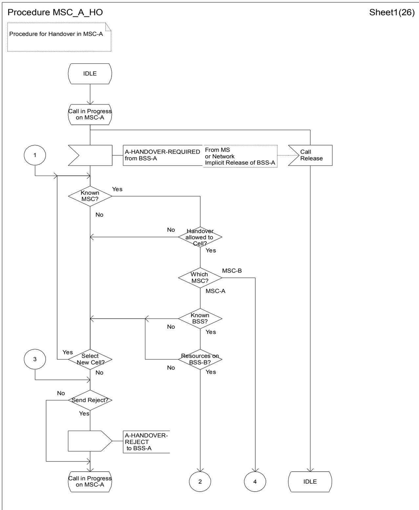

### Procedure MSC\_A\_HO

Procedure for Handover in MSC-A

Sheet1(26)

```
graph TD; IDLE1([IDLE]) --> CallProgress1([Call in Progress on MSC-A]); CallProgress1 --> Decision1{ }; Decision1 -- "A-HANDOVER-REQUIRED from BSS-A" --> CallRelease[Call Release]; CallRelease --> IDLE2([IDLE]); Decision1 --> Decision2{Known MSC?}; Decision2 -- Yes --> Decision3{ }; Decision2 -- No --> Decision4{Handover allowed to Cell?}; Decision4 -- No --> Decision3; Decision4 -- Yes --> Decision5{Which MSC?}; Decision5 -- MSC-B --> Decision3; Decision5 -- MSC-A --> Decision6{Known BSS?}; Decision6 -- No --> Decision3; Decision6 -- Yes --> Decision7{Resources on BSS-B?}; Decision7 -- No --> Decision3; Decision7 -- Yes --> Connector2((2)); Decision3 --> Decision8{Select New Cell?}; Decision8 -- Yes --> Connector3((3)); Decision8 -- No --> Decision9{Send Reject?}; Decision9 -- Yes --> CallReject[A-HANDOVER-REJECT to BSS-A]; CallReject --> CallProgress2([Call in Progress on MSC-A]); Decision9 -- No --> CallProgress2; CallProgress2 --> Decision3; Connector2 --> Decision3; Connector3 --> Decision3; Decision3 --> Decision1; Connector4((4)) --> IDLE3([IDLE]);
```

The flowchart illustrates the handover control procedure in MSC-A. It begins with an IDLE state, transitioning to a Call in Progress on MSC-A. Upon receiving an A-HANDOVER-REQUIRED message from BSS-A, the system may perform a Call Release, returning to IDLE. Alternatively, it checks if the target MSC is known. If not, it evaluates if the handover is allowed to the cell. If allowed, it identifies the target MSC (MSC-B or MSC-A). For MSC-A, it checks if the BSS is known and if resources are available on BSS-B. If all conditions are met, the procedure continues at connector 2. If the target MSC is known, it proceeds to select a new cell. If no new cell is selected, it may send a reject message to BSS-A, returning to Call in Progress on MSC-A, or continue the process. The procedure concludes at connector 4, returning to an IDLE state.

Flowchart of Handover control procedure in MSC-A

Figure 41 (Sheet 1 of 26): Handover control procedure in MSC-A

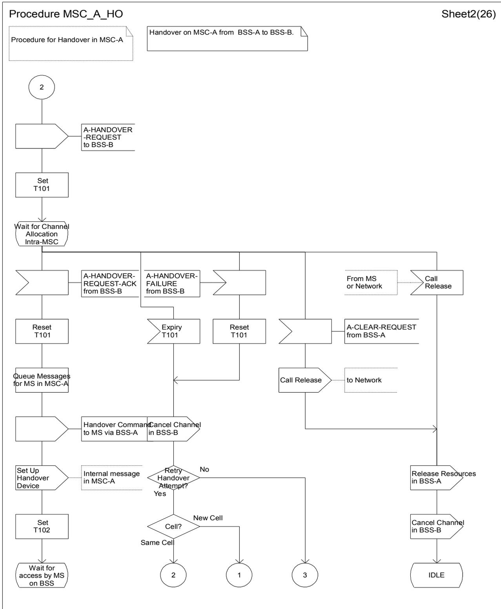

### Procedure MSC\_A\_HO

Procedure for Handover in MSC-A

Handover on MSC-A from BSS-A to BSS-B.

Sheet2(26)

```
graph TD; Start((2)) --> A_HANDOVER_REQUEST[A-HANDOVER-REQUEST to BSS-B]; A_HANDOVER_REQUEST --> Set_T101[Set T101]; Set_T101 --> Wait_Channel_Allocation[Wait for Channel Allocation Intra-MSC]; Wait_Channel_Allocation --> A_HANDOVER_REQUEST_ACK[A-HANDOVER-REQUEST-ACK from BSS-B]; A_HANDOVER_REQUEST_ACK --> Reset_T101_1[Reset T101]; Reset_T101_1 --> Queue_Messages[Queue Messages for MS in MSC-A]; Queue_Messages --> Handover_Command[Handover Command to MS via BSS-A]; Handover_Command --> Set_Up_Handover_Device[Set Up Handover Device]; Set_Up_Handover_Device --> Set_T102[Set T102]; Set_T102 --> Wait_Access[Wait for access by MS on BSS]; A_HANDOVER_FAILURE[A-HANDOVER-FAILURE from BSS-B] --> Expiry_T101[Expiry T101]; Expiry_T101 --> Reset_T101_2[Reset T101]; Reset_T101_2 --> Cancel_Channel[Cancel Channel in BSS-B]; Cancel_Channel --> Retry_Handover_Attempt{Retry Handover Attempt?}; Retry_Handover_Attempt -- Yes --> Cell{Cell?}; Cell -- Same Cell --> End_2((2)); Cell -- New Cell --> End_1((1)); Retry_Handover_Attempt -- No --> End_3((3)); A_CLEAR_REQUEST[A-CLEAR-REQUEST from BSS-A] --> Call_Release_Network[Call Release to Network]; Call_Release_Network --> Release_Resources[Release Resources in BSS-A]; Release_Resources --> Cancel_Channel_BSS_B[Cancel Channel in BSS-B]; Cancel_Channel_BSS_B --> IDLE[IDLE]; From_MS_or_Network[From MS or Network] --> Call_Release[Call Release]; Call_Release --> Release_Resources;
```

The flowchart illustrates the handover control procedure in MSC-A. It begins with a connector '2' leading to an 'A-HANDOVER-REQUEST to BSS-B' message. This is followed by 'Set T101' and 'Wait for Channel Allocation Intra-MSC'. From this wait state, three paths emerge: 1) 'A-HANDOVER-REQUEST-ACK from BSS-B' leads to 'Reset T101', 'Queue Messages for MS in MSC-A', 'Handover Command to MS via BSS-A', 'Set Up Handover Device', 'Set T102', and 'Wait for access by MS on BSS'. 2) 'A-HANDOVER-FAILURE from BSS-B' leads to 'Expiry T101', 'Reset T101', and 'Cancel Channel in BSS-B'. 3) 'A-CLEAR-REQUEST from BSS-A' leads to 'Call Release to Network'. The 'Cancel Channel in BSS-B' path leads to a decision 'Retry Handover Attempt?'. If 'Yes', it leads to 'Cell?'. If 'Same Cell', it returns to connector '2'. If 'New Cell', it leads to connector '1'. If 'No', it leads to connector '3'. The 'Call Release to Network' path leads to 'Release Resources in BSS-A', 'Cancel Channel in BSS-B', and 'IDLE'. A 'From MS or Network' message also leads to 'Call Release', which then leads to 'Release Resources in BSS-A'.

Flowchart of Handover control procedure in MSC-A

Figure 41 (Sheet 2 of 26): Handover control procedure in MSC-A

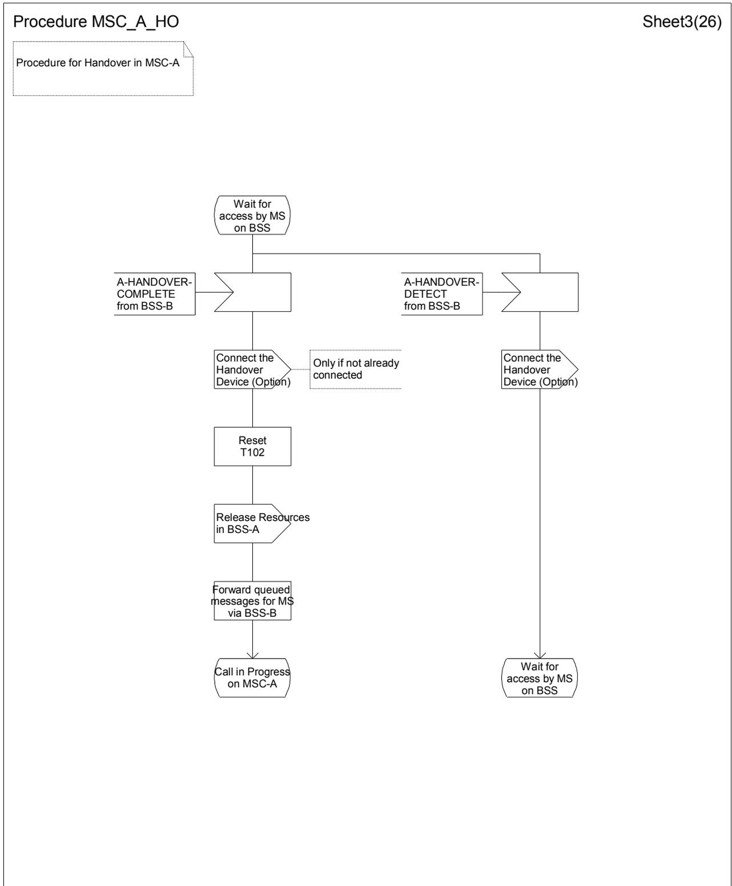

Procedure MSC\_A\_HO

Sheet3(26)

Procedure for Handover in MSC-A

```
graph TD; Start([Wait for access by MS on BSS]) --> Complete[A-HANDOVER-COMPLETE from BSS-B]; Start --> Detect[A-HANDOVER-DETECT from BSS-B]; Complete --> ConnectA[Connect the Handover Device (Option)]; ConnectA -.-> NoteA[Only if not already connected]; ConnectA --> Reset[Reset T102]; Reset --> Release[Release Resources in BSS-A]; Release --> Forward[Forward queued messages for MS via BSS-B]; Forward --> InProgress([Call in Progress on MSC-A]); Detect --> ConnectB[Connect the Handover Device (Option)]; ConnectB --> WaitBSS([Wait for access by MS on BSS]);
```

The flowchart illustrates the handover control procedure in MSC-A. It begins with a start node 'Wait for access by MS on BSS'. From this node, two paths emerge: one for 'A-HANDOVER-COMPLETE from BSS-B' and another for 'A-HANDOVER-DETECT from BSS-B'. The 'A-HANDOVER-COMPLETE' path leads to 'Connect the Handover Device (Option)', which is noted as 'Only if not already connected'. This is followed by 'Reset T102', 'Release Resources in BSS-A', 'Forward queued messages for MS via BSS-B', and finally 'Call in Progress on MSC-A'. The 'A-HANDOVER-DETECT' path leads to 'Connect the Handover Device (Option)' and then to 'Wait for access by MS on BSS'.

Flowchart of Handover control procedure in MSC-A

Figure 41 (Sheet 3 of 26): Handover control procedure in MSC-A

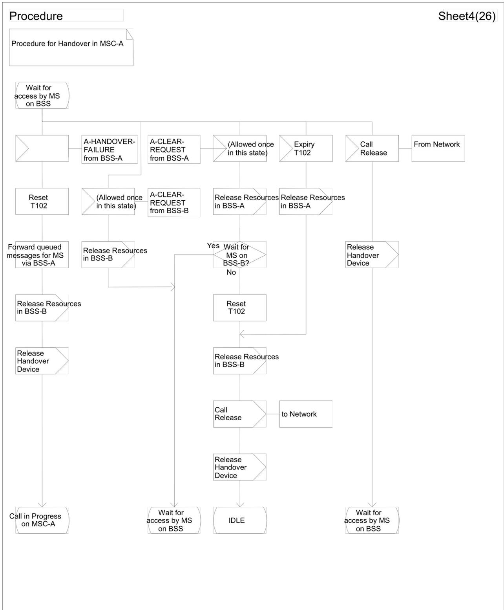

**Procedure** Sheet4(26)

Procedure for Handover in MSC-A

```
graph TD; Start([Wait for access by MS on BSS]) --> J1(( )); J1 --> A1[A-HANDOVER-FAILURE from BSS-A]; J1 --> A2[A-CLEAR-REQUEST from BSS-A]; J1 --> A3{(Allowed once in this state)}; J1 --> A4[Expiry T102]; J1 --> A5[Call Release]; A5 --> A6[From Network]; A1 --> B1[Reset T102]; B1 --> B2[Forward queued messages for MS via BSS-A]; B2 --> B3[Release Resources in BSS-B]; B3 --> B4[Release Handover Device]; B4 --> B5([Call in Progress on MSC-A]); A2 --> B6{(Allowed once in this state)}; B6 --> B7[A-CLEAR-REQUEST from BSS-B]; B7 --> B8[Release Resources in BSS-A]; B8 --> B9[Release Resources in BSS-B]; B9 --> B10[Release Handover Device]; B10 --> B11([Wait for access by MS on BSS]); A3 --> B12[Release Resources in BSS-A]; B12 --> B13[Release Resources in BSS-B]; B13 --> B14[Call Release]; B14 --> B15[to Network]; B15 --> B16[Release Handover Device]; B16 --> B17([IDLE]); A4 --> B18[Release Resources in BSS-A]; B18 --> B19[Release Resources in BSS-B]; B19 --> B20[Release Handover Device]; B20 --> B21([Wait for access by MS on BSS]); B9 --> C1{Wait for MS on BSS-B?}; C1 -- Yes --> C2[Reset T102]; C2 --> C3[Release Resources in BSS-B]; C3 --> C4[Call Release]; C4 --> C5[to Network]; C5 --> C6[Release Handover Device]; C6 --> C7([IDLE]); C1 -- No --> B11;
```

The flowchart illustrates the handover control procedure in MSC-A. It begins with a state 'Wait for access by MS on BSS'. From this state, five possible events can occur: 'A-HANDOVER-FAILURE from BSS-A', 'A-CLEAR-REQUEST from BSS-A', '(Allowed once in this state)', 'Expiry T102', or 'Call Release' (from Network). Each event leads to a specific sequence of actions. 'A-HANDOVER-FAILURE' leads to 'Reset T102', then 'Forward queued messages for MS via BSS-A', 'Release Resources in BSS-B', 'Release Handover Device', and finally 'Call in Progress on MSC-A'. 'A-CLEAR-REQUEST from BSS-A' leads to a decision '(Allowed once in this state)'; if allowed, it sends 'A-CLEAR-REQUEST from BSS-B' and releases resources in BSS-A and BSS-B, then releases the handover device to return to the initial wait state. If not allowed, it releases resources in BSS-A. The '(Allowed once in this state)' decision also leads to 'Release Resources in BSS-A', which then leads to 'Release Resources in BSS-B', 'Call Release' (to Network), 'Release Handover Device', and 'IDLE'. 'Expiry T102' leads to 'Release Resources in BSS-A', which then leads to 'Release Resources in BSS-B', 'Release Handover Device', and 'Wait for access by MS on BSS'. 'Call Release' (from Network) leads to 'Release Handover Device' and 'Wait for access by MS on BSS'. A central decision 'Wait for MS on BSS-B?' follows 'Release Resources in BSS-B' from the 'A-CLEAR-REQUEST' path. If 'Yes', it 'Reset T102', releases resources in BSS-B, sends 'Call Release' (to Network), releases the handover device, and returns to 'IDLE'. If 'No', it returns to the initial 'Wait for access by MS on BSS' state.

Handover control procedure in MSC-A flowchart

Figure 41 (Sheet 4 of 26): Handover control procedure in MSC-A

![Flowchart of Handover control procedure in MSC-A. The process starts at point 4, sends a MAP-PREPARE-HANDOVER req. [A-HO-REQUEST] to MSC-B, and waits for an acknowledgment. It then checks if the response is a success (ACK), failure (FAILURE), or an error. If ACK, it checks if a Handover Number was requested. If requested, it sends an I_CONNECT (IAM) to MSC-B and waits for connection; if not requested, it ends at point 7. If FAILURE, it checks if a retry is attempted. If yes, it checks the cell; if it's a new cell, it ends at point 1; if it's the same cell, it ends at point 4; if no retry, it ends at point 3. If an error response is received, it ends at point 3.](3ec35c497a0765a1a885c85f214b1bef_img.jpg)

### Procedure MSC\_A\_HO

Sheet5(26)

Procedure for Handover in MSC-A

Basic Handover to MSC-B  
Circuit Connection required

```
graph TD; Start((4)) --> SendReq[MAP-PREPARE-HANDOVER req. [A-HO-REQUEST] to MSC-B]; SendReq --> WaitAck[Wait For Acknowledgement from MSC-B]; WaitAck --> Success[MAP-PREPARE-HANDOVER resp. [A-HO-REQUEST-ACK] from MSC-B]; WaitAck --> Failure[MAP-PREPARE-HANDOVER resp. [A-HO-FAILURE] from MSC-B]; WaitAck --> Error[MAP-PREPARE-HANDOVER resp. [MAP ERROR] from MSC-B]; Success --> HandoverNumber{Handover Number?}; HandoverNumber -- Not Requested --> End7((7)); HandoverNumber -- Requested --> SendIAM[I_CONNECT (IAM) to MSC-B using Handover Number]; SendIAM --> WaitConn[Wait for Connection from MSC-B]; Failure --> Retry{Retry Handover Attempt?}; Retry -- No --> End3((3)); Retry -- Yes --> Cell{Cell?}; Cell -- New Cell --> End1((1)); Cell -- Same Cell --> End4((4)); Error --> End3;
```

Flowchart of Handover control procedure in MSC-A. The process starts at point 4, sends a MAP-PREPARE-HANDOVER req. [A-HO-REQUEST] to MSC-B, and waits for an acknowledgment. It then checks if the response is a success (ACK), failure (FAILURE), or an error. If ACK, it checks if a Handover Number was requested. If requested, it sends an I\_CONNECT (IAM) to MSC-B and waits for connection; if not requested, it ends at point 7. If FAILURE, it checks if a retry is attempted. If yes, it checks the cell; if it's a new cell, it ends at point 1; if it's the same cell, it ends at point 4; if no retry, it ends at point 3. If an error response is received, it ends at point 3.

Figure 41 (Sheet 5 of 26): Handover control procedure in MSC-A

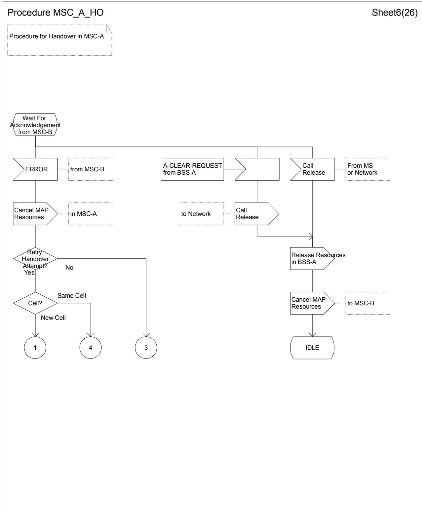

### Procedure MSC\_A\_HO

Procedure for Handover in MSC-A

Sheet6(26)

```
graph TD; Start([Wait For Acknowledgement from MSC-B]) --> ERROR{ERROR}; ERROR -- "from MSC-B" --> ERROR; ERROR --> CancelMAP[Cancel MAP Resources]; CancelMAP -- "In MSC-A" --> CancelMAP; CancelMAP --> Retry{Retry Handover Attempt?}; Retry -- Yes --> Cell{Cell?}; Cell -- New Cell --> 1((1)); Cell -- Same Cell --> 4((4)); Retry -- No --> 3((3)); Start --> A_CLEAR[A-CLEAR-REQUEST from BSS-A]; A_CLEAR --> CallRelease1[Call Release]; CallRelease1 -- "to Network" --> CallRelease1; CallRelease1 --> CallRelease2[Call Release]; CallRelease2 -- "From MS or Network" --> CallRelease2; CallRelease2 --> ReleaseBSS[Release Resources in BSS-A]; ReleaseBSS --> CancelMAP2[Cancel MAP Resources]; CancelMAP2 -- "to MSC-B" --> CancelMAP2; CancelMAP2 --> IDLE([IDLE]);
```

The flowchart illustrates the handover control procedure in MSC-A. It begins with a state 'Wait For Acknowledgement from MSC-B'. From this state, two main paths emerge. The first path leads to an 'ERROR' state, which is triggered 'from MSC-B'. This leads to 'Cancel MAP Resources' (labeled 'In MSC-A'), which then leads to a decision 'Retry Handover Attempt?'. If 'Yes', it leads to a 'Cell?' decision. If 'New Cell', it leads to connector 1. If 'Same Cell', it leads to connector 4. If 'No' to the retry attempt, it leads to connector 3. The second path from the initial state leads to 'A-CLEAR-REQUEST from BSS-A', which leads to a 'Call Release' state (labeled 'to Network'). This leads to another 'Call Release' state (labeled 'From MS or Network'), which then leads to 'Release Resources in BSS-A'. This leads to 'Cancel MAP Resources' (labeled 'to MSC-B'), which finally leads to the 'IDLE' state.

Flowchart of Handover control procedure in MSC-A

Figure 41 (Sheet 6 of 26): Handover control procedure in MSC-A

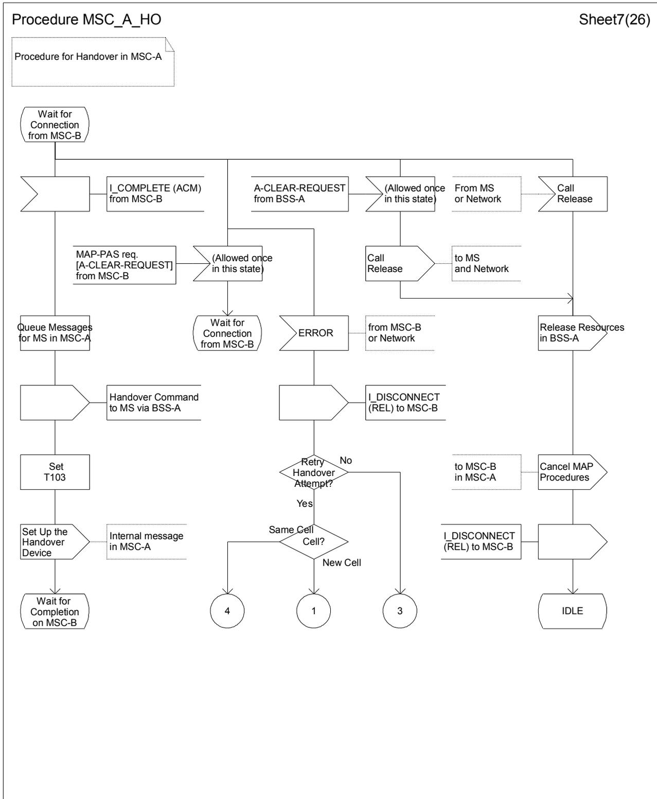

### Procedure MSC\_A\_HO

Sheet7(26)

Procedure for Handover in MSC-A

```
graph TD; Start([Wait for Connection from MSC-B]) --> Join(( )); Join --> I_COMPLETE[I_COMPLETE (ACM) from MSC-B]; Join --> A_CLEAR[A-CLEAR-REQUEST from BSS-A]; Join --> MAP_PAS[MAP-PAS req. [A-CLEAR-REQUEST] from MSC-B]; I_COMPLETE --> Queue[Queue Messages for MS in MSC-A]; A_CLEAR --> AllowedOnce1{Allowed once in this state}; AllowedOnce1 --> CallRelease1[Call Release]; CallRelease1 --> ToMS[From MS or Network]; CallRelease1 --> ToMSNet[to MS and Network]; CallRelease1 --> CallRelease2[Call Release]; CallRelease2 --> Release[Release Resources in BSS-A]; MAP_PAS --> AllowedOnce2{Allowed once in this state}; AllowedOnce2 --> WaitConn[([Wait for Connection from MSC-B])]; AllowedOnce2 --> ERROR[ERROR]; ERROR --> FromMSC[from MSC-B or Network]; Queue --> HandoverCmd[Handover Command to MS via BSS-A]; HandoverCmd --> SetT103[Set T103]; SetT103 --> Setup[Set Up the Handover Device]; Setup --> Internal[Internal message in MSC-A]; Setup --> WaitComp[([Wait for Completion on MSC-B])]; WaitComp --> End4((4)); ERROR --> I_DISCONNECT[I_DISCONNECT (REL) to MSC-B]; I_DISCONNECT --> Retry{Retry Handover Attempt?}; Retry -- No --> End3((3)); Retry -- Yes --> SameCell{Same Cell?}; SameCell -- Same Cell --> End1((1)); SameCell -- New Cell --> End3; SameCell -- New Cell --> I_DISCONNECT2[I_DISCONNECT (REL) to MSC-B]; I_DISCONNECT2 --> ToMSCB[to MSC-B in MSC-A]; I_DISCONNECT2 --> Cancel[Cancel MAP Procedures]; Cancel --> IDLE([IDLE])
```

Flowchart of Procedure MSC\_A\_HO showing various states and transitions for a handover control procedure in MSC-A.

Figure 41 (Sheet 7 of 26): Handover control procedure in MSC-A

![Flowchart of Handover control procedure in MSC-A. The process starts with 'Wait for Completion on MSC-B', leading to a merge point. From the merge point, it branches into three main paths. Path 1: 'Reset T103' -> 'Connect Handover Device (option)' -> 'Forward queued messages via MSC-B' -> 'Release Resources on BSS-A' -> 'Call on MSC-B'. Path 2: 'MAP-SEND-END-SIGNAL req. [A-HO-COMPLETE] from MSC-B' -> '(Allowed once in this state)' -> 'MAP-PAS req. [A-CLEAR-REQUEST] from BSS-B' -> '(Allowed once in this state)' -> 'A-CLEAR-REQUEST from BSS-A' -> 'Release Resources on BSS-A' -> 'Yes Wait for MS on MSC-B?' -> 'No' -> 'Call Release' (to Network and MS) -> 'Release MAP Resources' (to MSC-B in MSC-A) -> 'I_DISCONNECT (REL) to MSC-B' -> 'IDLE'. Path 3: 'I-ANSWER (ANM) from MSC-B' -> 'MAP-PAS req. [A-HO-DETECT] from MSC-B' -> 'Connect Handover Device (option)' -> 'Wait for Completion on MSC-B'. There is also a 'Wait for Completion on MSC-B' block between the first and second merge points, and another 'Wait for Completion on MSC-B' block between the second and third merge points. A 'Use MAP-FORWARD-ACCESS-SIGNALLING req' block is connected to the 'Forward queued messages via MSC-B' step.](684f7a2cd4ba3346bcaec1f7336f6aa3_img.jpg)

### Procedure MSC\_A\_HO

Procedure for Handover in MSC-A

Sheet8(26)

```
graph TD; Start([Wait for Completion on MSC-B]) --> Merge1(( )); Merge1 --> Reset[Reset T103]; Merge1 --> Merge2(( )); Merge1 --> Merge3(( )); Merge2 --> Signal1[MAP-SEND-END-SIGNAL req. [A-HO-COMPLETE] from MSC-B]; Signal1 --> Allowed1{Allowed once in this state}; Allowed1 --> Request1[MAP-PAS req. [A-CLEAR-REQUEST] from BSS-B]; Request1 --> Allowed2{Allowed once in this state}; Allowed2 --> Request2[A-CLEAR-REQUEST from BSS-A]; Request2 --> Release1[Release Resources on BSS-A]; Release1 --> Decision1{Yes Wait for MS on MSC-B?}; Decision1 -- No --> Release2[Call Release]; Release2 -.-> NetworkMS[to Network and MS]; Release2 --> Release3[Release MAP Resources]; Release3 -.-> MSCB[to MSC-B in MSC-A]; Release3 --> Disconnect[I_DISCONNECT (REL) to MSC-B]; Disconnect --> Idle([IDLE]); Decision1 -- Yes --> Wait1([Wait for Completion on MSC-B]); Wait1 --> Merge1; Merge3 --> Answer[I-ANSWER (ANM) from MSC-B]; Answer --> Detect[MAP-PAS req. [A-HO-DETECT] from MSC-B]; Detect --> Device3[Connect Handover Device (option)]; Device3 --> Wait2([Wait for Completion on MSC-B]); Wait2 --> Merge3; Reset --> Device1[Connect Handover Device (option)]; Device1 --> Forward[Forward queued messages via MSC-B]; Forward -.-> Signalling[Use MAP-FORWARD-ACCESS-SIGNALLING req]; Forward --> Release4[Release Resources on BSS-A]; Release4 --> Call[Call on MSC-B];
```

Flowchart of Handover control procedure in MSC-A. The process starts with 'Wait for Completion on MSC-B', leading to a merge point. From the merge point, it branches into three main paths. Path 1: 'Reset T103' -> 'Connect Handover Device (option)' -> 'Forward queued messages via MSC-B' -> 'Release Resources on BSS-A' -> 'Call on MSC-B'. Path 2: 'MAP-SEND-END-SIGNAL req. [A-HO-COMPLETE] from MSC-B' -> '(Allowed once in this state)' -> 'MAP-PAS req. [A-CLEAR-REQUEST] from BSS-B' -> '(Allowed once in this state)' -> 'A-CLEAR-REQUEST from BSS-A' -> 'Release Resources on BSS-A' -> 'Yes Wait for MS on MSC-B?' -> 'No' -> 'Call Release' (to Network and MS) -> 'Release MAP Resources' (to MSC-B in MSC-A) -> 'I\_DISCONNECT (REL) to MSC-B' -> 'IDLE'. Path 3: 'I-ANSWER (ANM) from MSC-B' -> 'MAP-PAS req. [A-HO-DETECT] from MSC-B' -> 'Connect Handover Device (option)' -> 'Wait for Completion on MSC-B'. There is also a 'Wait for Completion on MSC-B' block between the first and second merge points, and another 'Wait for Completion on MSC-B' block between the second and third merge points. A 'Use MAP-FORWARD-ACCESS-SIGNALLING req' block is connected to the 'Forward queued messages via MSC-B' step.

Figure 41 (Sheet 8 of 26): Handover control procedure in MSC-A

![Flowchart of Handover control procedure in MSC-A. The process starts with 'Wait for Completion on MSC-B'. It branches into four main paths: 1) 'A-HANDOVER-FAILURE from BSS-A' leads to 'Reset T103', 'Forward queued messages for MS via BSS-A', 'Release Handover Device', 'Cancel MAP Procedures' (in MSC-A to MSC-B), and 'I_DISCONNECT (REL) to MSC-B', ending at 'Call in Progress on MSC-A'. 2) A path leading to 'Cancel MAP Procedures' (In MSC-A and to MSC-B), 'Release Handover Device' (Internal to MSC-A), and ending at 'Wait for Completion on MSC-B'. 3) 'I_DISCONNECT (REL) from MSC-B' leads to 'Cancel MAP Procedures' (from MSC-B), 'Release Handover Device', 'I_DISCONNECT (REL) to MSC-B', and ending at 'Wait for Completion on MSC-B'. 4) 'Expiry T103' leads to 'Call Release' (from Network), 'Release Handover Device' (Internal to MSC-A), 'Wait for Completion on MSC-B', 'I_DISCONNECT (REL) to MSC-B', 'Cancel MAP Procedures' (In MSC-A and to MSC-B), 'Release Handover Device' (Internal to MSC-A), 'Release Resources BSS-A', and ending at 'IDLE'.](921f8fa0f7ce2c9956f20d33162c13a2_img.jpg)

### Procedure MSC\_A\_HO

Procedure for Handover in MSC-A

Sheet9(26)

```
graph TD; Start([Wait for Completion on MSC-B]) --> A_HO_FAILURE[A-HANDOVER-FAILURE from BSS-A]; Start --> C1[ ]; Start --> I_DISCONNECT_REL[ ] --> I_DISCONNECT_REL[ ] --> I_DISCONNECT_REL[ ] --> I_DISCONNECT_REL[ ] --> I_DISCONNECT_REL[ ] --> I_DISCONNECT_REL[ ]; Start --> T103_Exp[Expiry T103]; Start --> C_Release[Call Release]; A_HO_FAILURE --> Reset_T103[Reset T103]; Reset_T103 --> FQM[Forward queued messages for MS via BSS-A]; FQM --> RD1[Release Handover Device]; RD1 --> CMP1[Cancel MAP Procedures]; CMP1 --> CMP1_in[In MSC-A to MSC-B]; CMP1 --> ID1[I_DISCONNECT (REL) to MSC-B]; ID1 --> CIP[Call in Progress on MSC-A]; C1 --> CMP2[Cancel MAP Procedures]; CMP2 --> CMP2_in[In MSC-A and to MSC-B]; CMP2 --> RD2[Release Handover Device]; RD2 --> RD2_int[Internal to MSC-A]; RD2 --> WCB1([Wait for Completion on MSC-B]); I_DISCONNECT_REL --> CMP3[Cancel MAP Procedures]; CMP3 --> CMP3_from[from MSC-B]; CMP3 --> RD3[Release Handover Device]; RD3 --> ID2[I_DISCONNECT (REL) to MSC-B]; ID2 --> WCB2([Wait for Completion on MSC-B]); T103_Exp --> C_Release; C_Release --> C_Release_from[from Network]; C_Release --> RD4[Release Handover Device]; RD4 --> RD4_int[Internal to MSC-A]; RD4 --> WCB3([Wait for Completion on MSC-B]); WCB3 --> ID3[I_DISCONNECT (REL) to MSC-B]; ID3 --> CMP4[Cancel MAP Procedures]; CMP4 --> CMP4_in[In MSC-A and to MSC-B]; CMP4 --> RD5[Release Handover Device]; RD5 --> RD5_int[Internal to MSC-A]; RD5 --> RR[Release Resources BSS-A]; RR --> IDLE([IDLE]);
```

Flowchart of Handover control procedure in MSC-A. The process starts with 'Wait for Completion on MSC-B'. It branches into four main paths: 1) 'A-HANDOVER-FAILURE from BSS-A' leads to 'Reset T103', 'Forward queued messages for MS via BSS-A', 'Release Handover Device', 'Cancel MAP Procedures' (in MSC-A to MSC-B), and 'I\_DISCONNECT (REL) to MSC-B', ending at 'Call in Progress on MSC-A'. 2) A path leading to 'Cancel MAP Procedures' (In MSC-A and to MSC-B), 'Release Handover Device' (Internal to MSC-A), and ending at 'Wait for Completion on MSC-B'. 3) 'I\_DISCONNECT (REL) from MSC-B' leads to 'Cancel MAP Procedures' (from MSC-B), 'Release Handover Device', 'I\_DISCONNECT (REL) to MSC-B', and ending at 'Wait for Completion on MSC-B'. 4) 'Expiry T103' leads to 'Call Release' (from Network), 'Release Handover Device' (Internal to MSC-A), 'Wait for Completion on MSC-B', 'I\_DISCONNECT (REL) to MSC-B', 'Cancel MAP Procedures' (In MSC-A and to MSC-B), 'Release Handover Device' (Internal to MSC-A), 'Release Resources BSS-A', and ending at 'IDLE'.

Figure 41 (Sheet 9 of 26): Handover control procedure in MSC-A

![Flowchart of Handover control procedure in MSC-A. The process starts with 'Call on MSC-B' and proceeds through various decision points: 'Known MSC?', 'Handover allowed to Cell?', 'Which MSC?' (MSC-B' or MSC-A), 'Known BSS?', 'Resources on new BSS?', and 'Circuit Connection?'. It includes message exchanges like 'MAP-PREPARE-SUBSEQUENT-HANDOVER req.', 'A-HANDOVER-REQUEST to BSS-B', and 'MAP-PREPARE-SUBSEQUENT-HANDOVER resp.'. The final states are 'Wait for Channel Allocation', 'MS on MSC-B', 'Call on MSC-B', and 'IDLE'.](536768a30136cd5c2d57f46c25d1d804_img.jpg)

### Procedure MSC\_A\_HO

Procedure for Handover in MSC-A

Sheet10(26)

```
graph TD; Start([Call on MSC-B]) --> D1{Known MSC?}; D1 -- No --> End1([Call on MSC-B]); D1 -- Yes --> D2{Handover allowed to Cell?}; D2 -- No --> End1; D2 -- Yes --> D3{Which MSC?}; D3 -- MSC-B' --> C5((5)); D3 -- MSC-A --> D4{Known BSS?}; D4 -- No --> End1; D4 -- Yes --> D5{Resources on new BSS?}; D5 -- No --> End1; D5 -- Yes --> C6((6)); C6 --> M1[A-HANDOVER-REQUEST to BSS-B]; M1 --> M2[MAP-PREPARE-SUBSEQUENT-HANDOVER resp. [A-HO-FAILURE] to MSC-B]; M2 --> D6{Circuit Connection?}; D6 -- No --> End2([MS on MSC-B]); D6 -- Yes --> End3([Call on MSC-B]); M2 --> M3[Set T101]; M3 --> End4([Wait for Channel Allocation]); M2 --> M4[MAP-PREPARE-SUBSEQUENT-HANDOVER req. [A-HO-REQUEST] from MSC-B]; M4 --> D1; M4 --> M5[MAP-PAS req. [A-CLEAR-REQUEST] from MSC-B]; M5 --> D7[From MS or Network]; D7 --> M6[Call Release]; M5 --> M7[MAP-SEND-END-SIGNAL resp. to MSC-B]; M7 --> M8[Cancel MAP procedures]; M8 --> D8[from MSC-B]; M8 --> M9[Call Release]; M9 --> D9[to Network and MS]; M9 --> M10[I_DISCONNECT (REL) to MSC-B]; M10 --> End5([IDLE]);
```

Flowchart of Handover control procedure in MSC-A. The process starts with 'Call on MSC-B' and proceeds through various decision points: 'Known MSC?', 'Handover allowed to Cell?', 'Which MSC?' (MSC-B' or MSC-A), 'Known BSS?', 'Resources on new BSS?', and 'Circuit Connection?'. It includes message exchanges like 'MAP-PREPARE-SUBSEQUENT-HANDOVER req.', 'A-HANDOVER-REQUEST to BSS-B', and 'MAP-PREPARE-SUBSEQUENT-HANDOVER resp.'. The final states are 'Wait for Channel Allocation', 'MS on MSC-B', 'Call on MSC-B', and 'IDLE'.

Figure 41 (Sheet 10 of 26): Handover control procedure in MSC-A

![Flowchart of Handover control procedure in MSC-A. The process starts with 'Wait for Channel Allocation'. It branches based on incoming signals: 'A-HANDOVER-REQUEST-ACK. from BSS-B', 'A-HANDOVER-FAILURE from BSS-B', 'Expiry T101', or 'Call Release' (from MS or Network). The 'A-HANDOVER-REQUEST-ACK' path leads to 'Reset T101', 'Queue Messages for MS in MSC-A', and then to a decision 'Circuit Connection?'. If 'Yes', it goes to 'Set Up Handover Device', 'Set T104', and 'Wait for Access by MS'. If 'No', it goes to 'MAP-PREPARE-SUBSEQUENT-HANDOVER resp [A-HO-REQUEST-ACK] to MSC-B'. The 'A-HANDOVER-FAILURE' path leads to 'Reset T101', a decision '(Allowed once in this state)', and 'MAP-PAS req. [A-CLEAR-REQUEST] from MSC-B'. The 'Expiry T101' path leads to 'Release Resources in BSS-B' and then to a decision 'Retry Same Cell?'. If 'Yes', it loops back to 'Set Up Handover Device'. If 'No', it goes to 'Call on MSC-B'. The 'Call Release' path leads to 'Cancel Channel BSS-B', 'MAP-SEND-END-SIGNAL resp to MSC-B', 'I_DISCONNECT (REL) to MSC-B', and finally 'IDLE'.](245166735676c675f98f535bc4c6f0a1_img.jpg)

**Procedure MSC\_A\_HO** Sheet11(26)

Procedure for Handover in MSC-A

```

graph TD
    Start([Wait for Channel Allocation]) --> Junction(( ))
    Junction --> A_HO_ACK[A-HANDOVER-REQUEST-ACK. from BSS-B]
    Junction --> A_HO_FAIL[A-HANDOVER-FAILURE from BSS-B]
    Junction --> T101_Exp{Expiry T101}
    Junction --> Call_Release[Call Release]
    Call_Release -.-> FromMS[From MS or Network]
    A_HO_ACK --> Reset_T101_1[Reset T101]
    Reset_T101_1 --> Queue_Msgs[Queue Messages for MS in MSC-A]
    Queue_Msgs --> Circuit_Conn{Circuit Connection?}
    Circuit_Conn -- No --> MAP_Prep_Req[MAP-PREPARE-SUBSEQUENT-HANDOVER resp [A-HO-REQUEST-ACK] to MSC-B]
    Circuit_Conn -- Yes --> Set_Up_HO[Set Up Handover Device]
    Set_Up_HO --> Set_T104[Set T104]
    Set_T104 --> Wait_Access[Wait for Access by MS]
    A_HO_FAIL --> Reset_T101_2[Reset T101]
    Reset_T101_2 --> Allowed_Once{Allowed once in this state}
    Allowed_Once --> MAP_PAS[MAP-PAS req. [A-CLEAR-REQUEST] from MSC-B]
    T101_Exp --> Release_Resources_1[Release Resources in BSS-B]
    Release_Resources_1 --> Retry_Cell{Retry Same Cell?}
    Retry_Cell -- Yes --> Set_Up_HO
    Retry_Cell -- No --> Call_MSC_B_1[Call on MSC-B]
    Call_Release --> Cancel_Channel[Cancel Channel BSS-B]
    Cancel_Channel --> MAP_End_Sig[MAP-SEND-END-SIGNAL resp to MSC-B]
    MAP_End_Sig --> I_Disconn[I_DISCONNECT (REL) to MSC-B]
    I_Disconn --> IDLE([IDLE])
    Set_T104 --> MAP_Prep_Fail[MAP-PREPARE-SUBSEQUENT-HANDOVER resp. [A-HO-FAILURE] to MSC-B]
    MAP_Prep_Fail --> Call_MSC_B_2[Call on MSC-B]
    Call_MSC_B_2 --> Junction_6((6))
  
```

Flowchart of Handover control procedure in MSC-A. The process starts with 'Wait for Channel Allocation'. It branches based on incoming signals: 'A-HANDOVER-REQUEST-ACK. from BSS-B', 'A-HANDOVER-FAILURE from BSS-B', 'Expiry T101', or 'Call Release' (from MS or Network). The 'A-HANDOVER-REQUEST-ACK' path leads to 'Reset T101', 'Queue Messages for MS in MSC-A', and then to a decision 'Circuit Connection?'. If 'Yes', it goes to 'Set Up Handover Device', 'Set T104', and 'Wait for Access by MS'. If 'No', it goes to 'MAP-PREPARE-SUBSEQUENT-HANDOVER resp [A-HO-REQUEST-ACK] to MSC-B'. The 'A-HANDOVER-FAILURE' path leads to 'Reset T101', a decision '(Allowed once in this state)', and 'MAP-PAS req. [A-CLEAR-REQUEST] from MSC-B'. The 'Expiry T101' path leads to 'Release Resources in BSS-B' and then to a decision 'Retry Same Cell?'. If 'Yes', it loops back to 'Set Up Handover Device'. If 'No', it goes to 'Call on MSC-B'. The 'Call Release' path leads to 'Cancel Channel BSS-B', 'MAP-SEND-END-SIGNAL resp to MSC-B', 'I\_DISCONNECT (REL) to MSC-B', and finally 'IDLE'.

Figure 41 (Sheet 11 of 26): Handover control procedure in MSC-A


### Procedure MSC\_A\_HO

Procedure for Handover in MSC-A

Sheet12(26)

```
graph TD; Start([Wait for access by MS]) --> AHC[A-HANDOVER-COMPLETE from BSS-B]; Start --> AHD[A-HANDOVER-DETECT from BSS-B]; Start --> ET104[Expiry T104]; AHC --> ResetT104[Reset T104]; ResetT104 --> CHD1[Connect Handover Device option]; CHD1 --> FQM[Forward queued messages for MS via BSS-B]; FQM --> MSCB1[MAP-SEND-END-SIGNAL resp. to MSC-B]; MSCB1 --> CC1{Circuit Connection?}; CC1 -- No --> CallProgress[Call in Progress on MSC-A]; CC1 -- Yes --> ReleaseHD[Release Handover Device]; ReleaseHD --> MSCB2[I_DISCONNECT REL to MSC-B]; MSCB2 --> CallProgress; AHD --> CC2{Circuit Connection?}; CC2 -- No --> CHD2[Connect Handover Device option]; CHD2 --> CallProgress; CC2 -- Yes --> WaitAccess[Wait for access by MS]; ET104 --> CR[Call Release]; CR --> Network[to Network]; CR --> RR[Release Resources on BSS-B]; RR --> CMP[Cancel MAP Procedures]; CMP --> MSCA[MSC-A to MSC-B]; CMP --> MSCB3[I_DISCONNECT REL to MSC-B]; MSCB3 --> Idle([IDLE]);
```

Flowchart of Handover control procedure in MSC-A. The process starts with 'Wait for access by MS' and branches based on 'A-HANDOVER-COMPLETE', 'A-HANDOVER-DETECT', or 'Expiry T104' events. It includes steps for resetting timers, connecting handover devices, forwarding messages, and sending MAP signals. It ends in 'Call in Progress on MSC-A', 'Wait for access by MS', or 'IDLE' states.

Figure 41 (Sheet 12 of 26): Handover control procedure in MSC-A

![Flowchart of Procedure MSC_A_HO. The process starts with 'Wait for access by MS'. It branches based on incoming requests: 'MAP-PAS req. [A-HO-FAILURE] from MSC-B' (leading to '(Allowed once in this state)' -> 'Cancel MAP Procedures' -> 'Call Release'), 'MAP-PAS req. [A-CLEAR-REQUEST] from MSC-B' (leading to '(Allowed once in this state)' -> 'Call Release'), and 'A-CLEAR-REQUEST from BSS-B' (leading to '(Allowed once in this state)' -> 'Call Release'). A 'from Network' dashed box also points to 'Call Release'. Other paths include 'Forward queued messages via MSC-B' -> 'Use MAP-FORWARD-ACCESS-SIGNALLING req.' -> 'Release Resources on BSS-B' -> 'Circuit Connection?' (Yes: 'Release Handover Device' -> 'Call on MSC-B'; No: 'MS on MSC-B'). All terminal states lead to 'Wait for access by MS'.](db7a693cf26f527ac6c0d4d41da20858_img.jpg)

### Procedure MSC\_A\_HO

Sheet13(26)

Procedure for Handover in MSC-A

```
graph TD; Start([Wait for access by MS]) --> Join(( )); Join --> MAP_HO_FAILURE[MAP-PAS req. [A-HO-FAILURE] from MSC-B]; MAP_HO_FAILURE --> Allowed1{(Allowed once in this state)}; Allowed1 --> Cancel[Cancel MAP Procedures]; Cancel --> CallRelease[Call Release]; Join --> MAP_CLEAR[MAP-PAS req. [A-CLEAR-REQUEST] from MSC-B]; MAP_CLEAR --> Allowed2{(Allowed once in this state)}; Allowed2 --> CallRelease; Join --> A_CLEAR[A-CLEAR-REQUEST from BSS-B]; A_CLEAR --> Allowed3{(Allowed once in this state)}; Allowed3 --> CallRelease; Network[from Network] -.-> CallRelease; CallRelease --> End([Wait for access by MS]); Join --> Forward[Forward queued messages via MSC-B]; Forward --> MAP_FORWARD[Use MAP-FORWARD-ACCESS-SIGNALLING req.]; MAP_FORWARD --> Release[Release Resources on BSS-B]; Release --> Circuit{Circuit Connection?}; Circuit -- Yes --> ReleaseDevice[Release Handover Device]; ReleaseDevice --> CallMSCB[Call on MSC-B]; Circuit -- No --> MSMSCB[MS on MSC-B]; CallMSCB --> End; MSMSCB --> End;
```

Flowchart of Procedure MSC\_A\_HO. The process starts with 'Wait for access by MS'. It branches based on incoming requests: 'MAP-PAS req. [A-HO-FAILURE] from MSC-B' (leading to '(Allowed once in this state)' -> 'Cancel MAP Procedures' -> 'Call Release'), 'MAP-PAS req. [A-CLEAR-REQUEST] from MSC-B' (leading to '(Allowed once in this state)' -> 'Call Release'), and 'A-CLEAR-REQUEST from BSS-B' (leading to '(Allowed once in this state)' -> 'Call Release'). A 'from Network' dashed box also points to 'Call Release'. Other paths include 'Forward queued messages via MSC-B' -> 'Use MAP-FORWARD-ACCESS-SIGNALLING req.' -> 'Release Resources on BSS-B' -> 'Circuit Connection?' (Yes: 'Release Handover Device' -> 'Call on MSC-B'; No: 'MS on MSC-B'). All terminal states lead to 'Wait for access by MS'.

Figure 41 (Sheet 13 of 26): Handover control procedure in MSC-A


**Procedure MSC\_A\_HO** Sheet14(26)

Procedure for Handover in MSC-A

Subsequent Handover from MSC-B to MSC-B'  
Circuit Connection required

```
graph TD; Start((5)) --> SendReq[MAP-PREPARE-HANDOVER req [A-HO-REQUEST] to MSC-B']; SendReq --> WaitAck[Wait for Ack from MSC-B']; WaitAck --> Success[MAP-PREPARE-HANDOVER resp.. [A-HO-REQUEST-ACK] from MSC-B']; WaitAck --> Failure[MAP-PREPARE-HANDOVER resp. [A-HO-FAILURE] from MSC-B']; Success --> HandoverNumber{Handover Number?}; HandoverNumber -- Not Requested --> End9((9)); HandoverNumber -- Requested --> SendIAM[I-CONNECT (IAM) to MSC-B' using Handover Number]; SendIAM --> WaitConn[Wait for Connection from MSC-B']; Failure --> RetrySameCell{Retry Same Cell?}; RetrySameCell -- Yes --> Start; RetrySameCell -- No --> SendSubseq[MAP-PREPARE-SUBSEQUENT-HANDOVER resp. [A-HO-FAILURE] to MSC-B']; SendSubseq --> CallMSCB[Call on MSC-B]; CallMSCB --> End5((5));
```

Flowchart of the handover control procedure in MSC-A. It starts at connector 5, sends a MAP-PREPARE-HANDOVER req to MSC-B', waits for an ack, then branches based on the response. A successful response leads to a decision on the Handover Number. A failure response leads to a decision on whether to retry the same cell. Success leads to sending an I-CONNECT (IAM) and waiting for a connection. Failure or no retry leads to sending a MAP-PREPARE-SUBSEQUENT-HANDOVER resp and calling on MSC-B.

Figure 41 (Sheet 14 of 26): Handover control procedure in MSC-A

![Flowchart of the handover control procedure in MSC-A. The process starts with 'Wait for Ack from MSC-B''. It branches into three main paths: 1) ERROR from MSC-B' leads to 'Release MAP Resources' to MSC-B', then 'MAP-PAS req. [A-CLEAR-REQUEST] from MSC-B' leads to a decision 'Retry Same Cell?'. If 'No', it goes to 'ERROR' then 'Call on MSC-B'. If 'Yes', it goes to connector '5'. 2) from MSC-B or Network leads to 'ERROR', then 'Call Release' from MS or Network, then 'Cancel MAP Procedures' to MSC-B', then 'MAP-SEND-END-SIGNAL resp. to MSC-B', then 'Release Handover Device', then 'I_DISCONNECT (REL) to MSC-B', ending at 'IDLE'. 3) 'Release MAP Resources' to MSC-B' also leads to 'Cancel MAP Procedures' to MSC-B', then 'Wait for Ack from MSC-B''. A box 'MAP-PREPARE-SUBSEQUENT-HANDOVER resp. to MSC-B' is also shown on the left.](9958beca8f65818eb0ff893647af94de_img.jpg)

### Procedure MSC\_A\_HO

Sheet15(26)

Procedure for Handover in MSC-A

```
graph TD; Start([Wait for Ack from MSC-B']); Start --> ERROR1{ERROR}; ERROR1 -- from MSC-B' --> ERROR1; Start --> from_MSC_B[from MSC-B or Network]; from_MSC_B --> ERROR2{ERROR}; ERROR2 --> Call_Release[Call Release]; Call_Release -- From MS or Network --> Call_Release; Call_Release --> Cancel_MAP1[Cancel MAP Procedures]; Cancel_MAP1 -- to MSC-B' --> Cancel_MAP1; Cancel_MAP1 --> MAP_SEND[MAP-SEND-END-SIGNAL resp. to MSC-B]; MAP_SEND --> Release_Device[Release Handover Device]; Release_Device --> I_DISCONNECT[I_DISCONNECT (REL) to MSC-B]; I_DISCONNECT --> IDLE([IDLE]); Start --> Release_MAP[Release MAP Resources]; Release_MAP -- to MSC-B' --> Release_MAP; Release_MAP --> MAP_PAS[MAP-PAS req. [A-CLEAR-REQUEST] from MSC-B]; MAP_PAS --> Retry_Same_Cell{Retry Same Cell?}; Retry_Same_Cell -- No --> ERROR3{ERROR}; ERROR3 --> Call_on_MSC_B([Call on MSC-B]); Retry_Same_Cell -- Yes --> 5((5)); Release_MAP --> Cancel_MAP2[Cancel MAP Procedures]; Cancel_MAP2 -- to MSC-B' --> Cancel_MAP2; Cancel_MAP2 --> Wait_Ack[Wait for Ack from MSC-B'];
```

Flowchart of the handover control procedure in MSC-A. The process starts with 'Wait for Ack from MSC-B''. It branches into three main paths: 1) ERROR from MSC-B' leads to 'Release MAP Resources' to MSC-B', then 'MAP-PAS req. [A-CLEAR-REQUEST] from MSC-B' leads to a decision 'Retry Same Cell?'. If 'No', it goes to 'ERROR' then 'Call on MSC-B'. If 'Yes', it goes to connector '5'. 2) from MSC-B or Network leads to 'ERROR', then 'Call Release' from MS or Network, then 'Cancel MAP Procedures' to MSC-B', then 'MAP-SEND-END-SIGNAL resp. to MSC-B', then 'Release Handover Device', then 'I\_DISCONNECT (REL) to MSC-B', ending at 'IDLE'. 3) 'Release MAP Resources' to MSC-B' also leads to 'Cancel MAP Procedures' to MSC-B', then 'Wait for Ack from MSC-B''. A box 'MAP-PREPARE-SUBSEQUENT-HANDOVER resp. to MSC-B' is also shown on the left.

Figure 41 (Sheet 15 of 26): Handover control procedure in MSC-A

![SDL diagram for Procedure MSC_A_HO, Sheet 16 of 26. The diagram shows the 'Wait for Connection from MSC-B'' state and various signal handlers. Signals include I_COMPLETE (ACM), MAP-PAS req. [A-CLEAR-REQUEST], and MAP-PREPARE-SUBSEQUENT-HANDOVER resp. [A-HO-REQUEST-ACK]. Actions include setting up handover devices, queuing messages, setting timers (T103), and canceling MAP procedures. The flow leads to states like 'Wait for Completion on MSC-B'', 'Call on MSC-B', or 'IDLE'.](fa1eb5ed4fcf8f8d184ead2a8a5a08e6_img.jpg)

Procedure MSC\_A\_HO
Sheet16(26)

Procedure for Handover in MSC-A

```

  graph TD
    State1([Wait for Connection  
from MSC-B']) --> Branch1{ }
    
    Branch1 --> Input1[/I_COMPLETE from MSC-B'  
(ACM) from MSC-B' or Network/]
    Input1 --> Error1[ERROR]
    
    Branch1 --> Task1[Set up  
Handover  
Device]
    Task1 --> Input2[/MAP-PAS req.  
[A-CLEAR-REQUEST]  
from MSC-B'/]
    Input2 --> Comment1(Allowed once  
in this state)
    Comment1 --> State2([Wait for  
Connection  
from MSC-B'])
    
    Task1 --> Input3[/MAP-PREPARE-  
SUBSEQUENT-  
HANDOVER resp.  
[A-HO-REQUEST-ACK]  
to MSC-B/]
    Input3 --> Task2[Queue messages  
for MS in MSC-A]
    Task2 --> Task3[Set  
T103]
    Task3 --> State3([Wait for  
Completion  
on MSC-B'])
    
    Task2 --> Task4[Cancel MAP  
Procedures]
    Task4 --> Output1>to MSC-B']
    Output1 --> Input4[/I_DISCONNECT (REL)  
to MSC-B'/]
    Input4 --> Decision1{Retry  
to MSC-B'?}
    Decision1 -- Yes --> Conn5((5))
    Decision1 -- No --> Error2[ERROR]
    Error2 --> Output2>MAP-PREPARE-  
SUBSEQUENT-  
HANDOVER resp.  
to MSC-B]
    Output2 --> State4([Call  
on  
MSC-B])

    Branch1 --> Input5[/from MS  
or Network/]
    Input5 --> Task5[Cancel MAP  
Procedures]
    Task5 --> Output3>to MSC-B  
and MSC-B']
    Output3 --> Task6[Call  
Release]
    Task6 --> Output4>to Network  
and MS]
    Output4 --> Output5>I_DISCONNECT (REL)  
to MSC-B and MSC-B']
    Output5 --> State5([IDLE])

    Branch1 --> Input6[/Call  
Release/]
    Input6 --> Output6>to MSC-B']
    Output6 --> Task7[Cancel MAP  
Procedures]
    Task7 --> Output7>MAP-SEND-  
END-SIGNAL resp  
to MSC-B]
    Output7 --> State5
  
```

SDL diagram for Procedure MSC\_A\_HO, Sheet 16 of 26. The diagram shows the 'Wait for Connection from MSC-B'' state and various signal handlers. Signals include I\_COMPLETE (ACM), MAP-PAS req. [A-CLEAR-REQUEST], and MAP-PREPARE-SUBSEQUENT-HANDOVER resp. [A-HO-REQUEST-ACK]. Actions include setting up handover devices, queuing messages, setting timers (T103), and canceling MAP procedures. The flow leads to states like 'Wait for Completion on MSC-B'', 'Call on MSC-B', or 'IDLE'.

Figure 41 (Sheet 16 of 26): Handover control procedure in MSC-A

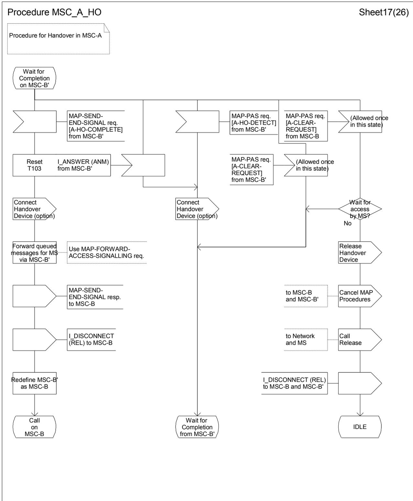

### Procedure MSC\_A\_HO

Sheet17(26)

Procedure for Handover in MSC-A

```

graph TD
    State1([Wait for Completion  
on MSC-B']) --> Split1{ }
    
    %% Left Path
    Split1 --> In1[/MAP-SEND-  
END-SIGNAL req.  
[A-HO-COMPLETE]  
from MSC-B'/]
    In1 --> Task1[Reset  
T103]
    Task1 --> In2[/I_ANSWER (ANM)  
from MSC-B'/]
    In2 --> Task2[Connect  
Handover  
Device (option)]
    Task2 --> Task3[Forward queued  
messages for MS  
via MSC-B']
    Task3 --. UseMap[Use MAP-FORWARD-  
ACCESS-SIGNALLING req.]
    Task3 --> Out1[/MAP-SEND-  
END-SIGNAL resp.  
to MSC-B/]
    Out1 --> Out2[/I_DISCONNECT  
(REL) to MSC-B/]
    Out2 --> Task4[Redefine MSC-B'  
as MSC-B]
    Task4 --> State2([Call  
on  
MSC-B])

    %% Middle Path
    Split1 --> In3[/MAP-PAS req.  
[A-HO-DETECT]  
from MSC-B'/]
    In3 --> Task5[Connect  
Handover  
Device (option)]
    Task5 --> State3([Wait for  
Completion  
from MSC-B'])

    %% Right Path
    Split1 --> In4[/MAP-PAS req.  
[A-CLEAR-  
REQUEST]  
from MSC-B/]
    Split1 --> In5[/MAP-PAS req.  
[A-CLEAR-  
REQUEST]  
from MSC-B'/]
    In4 --> Note1["(Allowed once  
in this state)"]
    In5 --> Note2["(Allowed once  
in this state)"]
    Note1 --> Decision1{Wait for  
access  
by MS?}
    Note2 --> Decision1
    Decision1 -- No --> Out3[/Release  
Handover  
Device/]
    Out3 --> Out4[/Cancel MAP  
Procedures/]
    Out4 --. Note3[to MSC-B  
and MSC-B']
    Out4 --> Out5[/Call  
Release/]
    Out5 --. Note4[to Network  
and MS]
    Out5 --> Out6[/I_DISCONNECT (REL)  
to MSC-B and MSC-B'/]
    Out6 --> State4([IDLE])
  
```

SDL diagram for Procedure MSC\_A\_HO (Sheet 17 of 26) showing handover control logic in MSC-A.

**Figure 41 (Sheet 17 of 26): Handover control procedure in MSC-A**

![Flowchart of Handover control procedure in MSC-A. The process starts with 'Wait for Completion on MSC-B\''. It branches based on 'Expiry T103' and 'MAP-PAS req. [A-HO-FAILURE] from MSC-B'. It includes steps for 'Cancel MAP Procedures', 'Release Handover Device', 'I_DISCONNECT (REL) to MSC-B\'', and 'Call Release'. It ends at 'IDLE' or 'Wait for Completion on MSC-B\''.](1bc1746388cb64bf23b356ce2365dfc2_img.jpg)

### Procedure MSC\_A\_HO

Procedure for Handover in MSC-A

Sheet18(26)

```
graph TD
    Start([Wait for Completion on MSC-B']) --> T103{Expiry T103}
    T103 --> Reset[Reset T103]
    Reset --> MAP_REQ[MAP-PAS req. [A-HO-FAILURE] from MSC-B]
    MAP_REQ --> Cancel1[Cancel MAP Procedures]
    Cancel1 --> Release1[Release Handover Device]
    Release1 --> Disconnect1[I_DISCONNECT (REL) to MSC-B']
    Disconnect1 --> Conn{MSC-B Connection?}
    Conn -- Yes --> Forward[Use MAP-FORWARD-ACCESS-SIGNALLING req.]
    Forward --> Forwarded[Forward queued messages for MS via MSC-B]
    Forwarded --> CallOn[Call on MSC-B]
    Conn -- No --> Release2[Call Release]
    Release2 --> IDLE1([IDLE])
    MAP_REQ --> FromMSCB[from MSC-B]
    FromMSCB --> Cancel2[Cancel MAP Procedures]
    Cancel2 --> Release3[Release Handover Device]
    Release3 --> WaitAccess{Wait for access by MS?}
    WaitAccess -- Yes --> CallRelease1[Call Release]
    CallRelease1 --> WaitEnd([Wait for Completion on MSC-B'])
    WaitAccess -- No --> Cancel3[Cancel MAP Procedures]
    Cancel3 --> Disconnect2[I_DISCONNECT (REL) to MSC-B']
    Disconnect2 --> IDLE2([IDLE])
    MAP_REQ --> FromMSCBPrime[from MSC-B']
    FromMSCBPrime --> Cancel4[Cancel MAP Procedures]
    Cancel4 --> Disconnect3[I_DISCONNECT (REL) to MSC-B']
    Disconnect3 --> Release4[Release Handover Device]
    Release4 --> CallRelease2[Call Release]
    CallRelease2 --> WaitEnd
```

Flowchart of Handover control procedure in MSC-A. The process starts with 'Wait for Completion on MSC-B\''. It branches based on 'Expiry T103' and 'MAP-PAS req. [A-HO-FAILURE] from MSC-B'. It includes steps for 'Cancel MAP Procedures', 'Release Handover Device', 'I\_DISCONNECT (REL) to MSC-B\'', and 'Call Release'. It ends at 'IDLE' or 'Wait for Completion on MSC-B\''.

Figure 41 (Sheet 18 of 26): Handover control procedure in MSC-A

![Flowchart for Procedure MSC_A_HO. The process starts at connector 7, followed by 'Queue Messages for MS in MSC-A', 'Handover Command to MS via BSS-A', 'Set T103', and 'Wait for MS on MSC-B'. A decision point follows. The left path involves 'MAP-SEND-END-SIGNAL req. [A-HO-COMPLETE] from MSC-B', 'Reset T103', 'MAP-PAS req. [A-CLEAR-REQUEST] from BSS-B', 'Release Resources on BSS-A', 'Forward queued messages for MS via MSC-B', 'Use MAP-FORWARD-ACCESS-SIGNALLING req.', and ends at 'MS on MSC-B'. The right path involves a decision '(Allowed once in this state)', 'A-CLEAR-REQUEST from BSS-A', 'MAP-PAS req. [A-HO-DETECT] from MSC-B', 'Release Resources on BSS-A', and a decision 'Wait for MS on MSC-B?'. If 'Yes', it ends at 'Wait for MS on MSC-B'. If 'No', it goes to 'Call Release to Network and MS', 'Release MAP Resources to MSC-B in MSC-A', and ends at 'IDLE'.](93bd00a00fa28558486f0664550699b1_img.jpg)

### Procedure MSC\_A\_HO

Sheet19(26)

Procedure for Handover in MSC-A

Basic Handover to MSC-B  
no Circuit Connection required

```
graph TD
    7((7)) --> Queue[Queue Messages for MS in MSC-A]
    Queue --> Command{Handover Command to MS via BSS-A}
    Command --> SetT103[Set T103]
    SetT103 --> WaitMSB[Wait for MS on MSC-B]
    WaitMSB --> Decision1{ }
    Decision1 --> LeftPath[ ]
    Decision1 --> RightPath[ ]
    LeftPath --> Signal[MAP-SEND-END-SIGNAL req. [A-HO-COMPLETE] from MSC-B]
    Signal --> ResetT103[Reset T103]
    ResetT103 --> Request[MAP-PAS req. [A-CLEAR-REQUEST] from BSS-B]
    Request --> Decision2{Allowed once in this state}
    Decision2 --> ReleaseA[Release Resources on BSS-A]
    ReleaseA --> Forward[Forward queued messages for MS via MSC-B]
    Forward --> UseSignal[Use MAP-FORWARD-ACCESS-SIGNALLING req.]
    UseSignal --> MSB[MS on MSC-B]
    RightPath --> Decision3{Allowed once in this state}
    Decision3 --> Clear[A-CLEAR-REQUEST from BSS-A]
    Clear --> Decision4{ }
    Decision4 --> SignalB[MAP-PAS req. [A-HO-DETECT] from MSC-B]
    SignalB --> ReleaseA2[Release Resources on BSS-A]
    ReleaseA2 --> Decision5{Wait for MS on MSC-B?}
    Decision5 -- Yes --> WaitMSB2[Wait for MS on MSC-B]
    Decision5 -- No --> CallRelease[Call Release to Network and MS]
    CallRelease --> ReleaseMAP[Release MAP Resources to MSC-B in MSC-A]
    ReleaseMAP --> IDLE[IDLE]
```

Flowchart for Procedure MSC\_A\_HO. The process starts at connector 7, followed by 'Queue Messages for MS in MSC-A', 'Handover Command to MS via BSS-A', 'Set T103', and 'Wait for MS on MSC-B'. A decision point follows. The left path involves 'MAP-SEND-END-SIGNAL req. [A-HO-COMPLETE] from MSC-B', 'Reset T103', 'MAP-PAS req. [A-CLEAR-REQUEST] from BSS-B', 'Release Resources on BSS-A', 'Forward queued messages for MS via MSC-B', 'Use MAP-FORWARD-ACCESS-SIGNALLING req.', and ends at 'MS on MSC-B'. The right path involves a decision '(Allowed once in this state)', 'A-CLEAR-REQUEST from BSS-A', 'MAP-PAS req. [A-HO-DETECT] from MSC-B', 'Release Resources on BSS-A', and a decision 'Wait for MS on MSC-B?'. If 'Yes', it ends at 'Wait for MS on MSC-B'. If 'No', it goes to 'Call Release to Network and MS', 'Release MAP Resources to MSC-B in MSC-A', and ends at 'IDLE'.

Figure 41 (Sheet 19 of 26): Handover control procedure in MSC-A

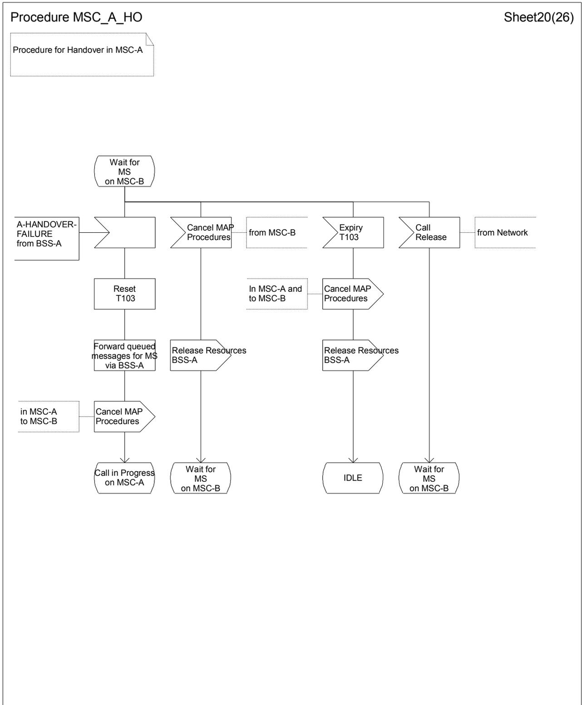

### Procedure MSC\_A\_HO

Sheet20(26)

Procedure for Handover in MSC-A

```
graph TD; Start([Wait for MS on MSC-B]) --> Decision1{ }; Decision1 --> A_HANDOVER_FAILURE[A-HANDOVER-FAILURE from BSS-A]; Decision1 --> Cancel_MAP_1[Cancel MAP Procedures from MSC-B]; Decision1 --> Expiry_T103[Expiry T103]; Decision1 --> Call_Release[Call Release from Network]; A_HANDOVER_FAILURE --> Reset_T103[Reset T103]; Reset_T103 --> Forward_messages[Forward queued messages for MS via BSS-A]; Forward_messages --> Cancel_MAP_2[Cancel MAP Procedures in MSC-A to MSC-B]; Cancel_MAP_2 --> Call_in_Progress[Call in Progress on MSC-A]; Cancel_MAP_1 --> Release_Resources_1[Release Resources BSS-A]; Release_Resources_1 --> Wait_1([Wait for MS on MSC-B]); Expiry_T103 --> Cancel_MAP_3[Cancel MAP Procedures in MSC-A and to MSC-B]; Cancel_MAP_3 --> Release_Resources_2[Release Resources BSS-A]; Release_Resources_2 --> IDLE[IDLE]; Call_Release --> Wait_2([Wait for MS on MSC-B]);
```

The flowchart illustrates the handover control procedure in MSC-A. It begins with a state 'Wait for MS on MSC-B'. From this state, four possible events can occur: 'A-HANDOVER-FAILURE from BSS-A', 'Cancel MAP Procedures from MSC-B', 'Expiry T103', or 'Call Release from Network'. The 'A-HANDOVER-FAILURE' path leads to 'Reset T103', then 'Forward queued messages for MS via BSS-A', then 'Cancel MAP Procedures in MSC-A to MSC-B', and finally to 'Call in Progress on MSC-A'. The 'Cancel MAP Procedures from MSC-B' path leads to 'Release Resources BSS-A', which then leads to 'Wait for MS on MSC-B'. The 'Expiry T103' path leads to 'Cancel MAP Procedures in MSC-A and to MSC-B', then 'Release Resources BSS-A', which then leads to 'IDLE'. The 'Call Release from Network' path leads directly to 'Wait for MS on MSC-B'.

Flowchart of Handover control procedure in MSC-A

Figure 41 (Sheet 20 of 26): Handover control procedure in MSC-A


### Procedure MSC\_A\_HO

Sheet21(26)

Procedure for Handover in MSC-A

MS Established on MSC-B without a Circuit Connection

```
sequenceDiagram
    participant MS as MS on MSC-B
    participant MSC_A as MSC-A
    participant Network as Network

    Note left of MS: Procedure for Handover in MSC-A
    Note right of MS: MS Established on MSC-B without a Circuit Connection

    Note left of MSC_A: Request for Circuit Establishment
    Note right of MSC_A: From MSC-B
    Note right of Network: From MS or Network

    Note left of MSC_A: MAP-PREPARE-HANDOVER req. [NULL] [A-ASG-REQUEST] to MSC-B
    Note right of MSC_A: MAP-PREPARE-SUBSEQUENT-HANDOVER req. [A-HO-REQUEST] from MSC-B
    Note right of Network: to Network
    Note right of MSC_A: MAP-SEND-END-SIGNAL resp. to MSC-B

    Note left of MSC_A: Wait For Response from MSC-B
    Note right of MSC_A: 8
    Note right of Network: IDLE

    Note right of MS: Call Release
```

The sequence diagram illustrates the handover control procedure in MSC-A. It begins with the MS on MSC-B sending a 'Request for Circuit Establishment' to MSC-A. MSC-A then sends a 'MAP-PREPARE-HANDOVER req. [NULL] [A-ASG-REQUEST] to MSC-B' and enters a 'Wait For Response from MSC-B' state. A call release message from the MS or Network is received by MSC-A. MSC-A then sends a 'MAP-PREPARE-SUBSEQUENT-HANDOVER req. [A-HO-REQUEST] from MSC-B' to the Network. The Network responds with 'Cancel MAP Procedures' to MSC-A. MSC-A then sends a 'MAP-SEND-END-SIGNAL resp. to MSC-B' and enters an 'IDLE' state. The diagram also includes a call release message from the MS on MSC-B. A connector '8' is shown at the bottom of the MSC-A lifeline.

Sequence diagram for Handover control procedure in MSC-A. The diagram shows the interaction between the MS on MSC-B, MSC-A, and the Network. It includes steps for circuit establishment, MAP-prepare-handover request, waiting for response, MAP-prepare-subsequent-handover request, canceling MAP procedures, call release to the network, MAP-send-end-signal response, and reaching an IDLE state.

Figure 41 (Sheet 21 of 26): Handover control procedure in MSC-A

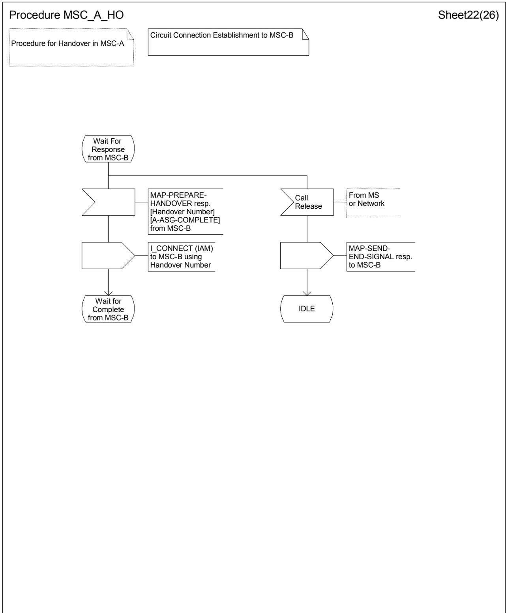

**Procedure MSC\_A\_HO** Sheet22(26)

Procedure for Handover in MSC-A

Circuit Connection Establishment to MSC-B

```
graph TD; Start([Wait For Response from MSC-B]) --> Decision{ }; Decision --> Action1[MAP-PREPARE-HANDOVER resp. [Handover Number] [A-ASG-COMPLETE] from MSC-B]; Action1 --> Decision2{ }; Decision2 --> Action2[I_CONNECT (IAM) to MSC-B using Handover Number]; Action2 --> End1([Wait for Complete from MSC-B]); Decision --> CallRelease[Call Release]; CallRelease --> Note1[From MS or Network]; Note1 --> Decision3{ }; Decision3 --> Action3[MAP-SEND-END-SIGNAL resp. to MSC-B]; Action3 --> End2([IDLE]);
```

The flowchart illustrates the handover control procedure in MSC-A. It begins with a 'Wait For Response from MSC-B' state. A decision point follows, leading to two possible paths. The first path involves receiving a 'MAP-PREPARE-HANDOVER resp. [Handover Number] [A-ASG-COMPLETE] from MSC-B', followed by sending an 'I\_CONNECT (IAM) to MSC-B using Handover Number', and finally 'Wait for Complete from MSC-B'. The second path involves a 'Call Release' (originating 'From MS or Network'), followed by sending a 'MAP-SEND-END-SIGNAL resp. to MSC-B', and ending in an 'IDLE' state.

Flowchart of Handover control procedure in MSC-A

Figure 41 (Sheet 22 of 26): Handover control procedure in MSC-A


Procedure MSC\_A\_HO

Sheet23(26)

Procedure for Handover in MSC-A

```

graph TD
    State1([Wait For Response from MSC-B]) --> Input1{ }
    Input1 --> MAP_ERR[MAP-PREPARE-HANDOVER resp.  
[MAP ERROR]  
from MSC-B]
    Input1 --> MAP_FAIL[MAP-PREPARE-HANDOVER resp.  
[A-ASG-FAILURE]  
from MSC-B]
    Input1 --> Cancel[Cancel MAP  
Procedures] --> FromMSCB[from MSC-B]
    
    MAP_ERR --> Retry{Retry?}
    MAP_FAIL --> Retry
    
    Retry -- Yes --> Req1[MAP-PREPARE-HANDOVER req.  
[NULL]  
[A-ASG-REQUEST]  
to MSC-B] --> State1
    
    Retry -- No --> PAS_REQ[MAP-PAS req.  
[A-CLEAR-REQUEST]  
from MSC-B]
    
    PAS_REQ --> Failure1[Failure] --> Resp1[Response to  
Circuit Establishment  
Request] --> MS_B1([MS on MSC-B])
    PAS_REQ --> Allowed([Allowed once  
in this state]) --> MS_B2([MS on MSC-B])
    
    Cancel --> CallRel[Call  
Release] --> ToNet[to Network]
    CallRel --> Failure2[Failure] --> Resp2[Response to  
Circuit Establishment  
Request] --> IDLE([IDLE])

```

SDL Flowchart for Procedure MSC\_A\_HO. The process begins at the state 'Wait For Response from MSC-B'. It handles various MAP responses. A 'Retry?' decision leads back to sending a request or proceeding to 'MAP-PAS req.'. Final states include 'MS on MSC-B' and 'IDLE'.

**Figure 41 (Sheet 23 of 26): Handover control procedure in MSC-A**

![State transition diagram for Procedure MSC_A_HO. The diagram shows various states and transitions for a handover procedure in MSC-A. States include 'Wait for Complete from MSC-B', 'Success', 'Failure', 'Call on MSC-B', and 'IDLE'. Transitions are triggered by messages like 'I COMPLETE (ACM) from MSC-B', 'I-ANSWER (ANM) from MSC-B', 'MAP-PAS req. [A-CLEAR-REQUEST] from MSC-B', 'Response to Circuit Establishment Request', 'Cancel MAP Procedures', 'Call Release', 'MAP-SEND-END-SIGNAL resp. to MSC-B', and 'I_DISCONNECT (REL) to MSC-B'. There are also internal transitions labeled '(Allowed once in this state)' and 'From MS or Network'.](b02ba0b73e95416eb547976f6145b169_img.jpg)

### Procedure MSC\_A\_HO

Sheet24(26)

Procedure for Handover in MSC-A

```
stateDiagram-v2
    [*] --> Wait1: Wait for Complete from MSC-B
    state "Wait for Complete from MSC-B" as Wait1
    state "Success" as Success
    state "Failure" as Failure
    state "Call on MSC-B" as CallOnMSCB
    state "IDLE" as IDLE
    state "Cancel MAP Procedures" as CancelMAP
    state "Call Release" as CallRelease
    state "MAP-SEND-END-SIGNAL resp. to MSC-B" as MAPSendEndSignal
    state "I_DISCONNECT (REL) to MSC-B" as IDisconnectRel

    Wait1 --> Success: I COMPLETE (ACM) from MSC-B
    Success --> CallOnMSCB: Response to Circuit Establishment Request
    Wait1 --> Wait2: I-ANSWER (ANM) from MSC-B
    state "Wait for Complete from MSC-B" as Wait2
    Wait2 --> Success: Response to Circuit Establishment Request
    Success --> CallOnMSCB: Response to Circuit Establishment Request
    Wait1 --> CancelMAP: MAP-PAS req. [A-CLEAR-REQUEST] from MSC-B
    CancelMAP --> Failure: (Allowed once in this state)
    Failure --> IDLE: Response to Circuit Establishment Request
    Wait1 --> CallRelease: From MS or Network
    CallRelease --> MAPSendEndSignal: (Allowed once in this state)
    MAPSendEndSignal --> IDisconnectRel: (Allowed once in this state)
    IDisconnectRel --> IDLE: (Allowed once in this state)
```

State transition diagram for Procedure MSC\_A\_HO. The diagram shows various states and transitions for a handover procedure in MSC-A. States include 'Wait for Complete from MSC-B', 'Success', 'Failure', 'Call on MSC-B', and 'IDLE'. Transitions are triggered by messages like 'I COMPLETE (ACM) from MSC-B', 'I-ANSWER (ANM) from MSC-B', 'MAP-PAS req. [A-CLEAR-REQUEST] from MSC-B', 'Response to Circuit Establishment Request', 'Cancel MAP Procedures', 'Call Release', 'MAP-SEND-END-SIGNAL resp. to MSC-B', and 'I\_DISCONNECT (REL) to MSC-B'. There are also internal transitions labeled '(Allowed once in this state)' and 'From MS or Network'.

Figure 41 (Sheet 24 of 26): Handover control procedure in MSC-A

![Flowchart of Procedure MSC_A_HO. It starts with connector 9, followed by sending a MAP-PREPARE-SUBSEQUENT-HANDOVER response, queuing messages, setting timer T103, and waiting for the MS on MSC-B'. A loop exists for handling MAP-SEND-END-SIGNAL, MAP-PAS, and MAP-FORWARD-ACCESS-SIGNAL requests. A decision point '(Allowed once in this state)' leads to either resetting T103 and redefining MSC-B' as MSC-B, or canceling procedures and releasing the call. The process ends with the MS on MSC-B, waiting for the MS on MSC-B', or an IDLE state.](710ff83dc4a77abbe489fbf1a462845a_img.jpg)

**Procedure MSC\_A\_HO** Sheet25(26)

Procedure for Handover in MSC-A

Subsequent Handover from MSC-B to MSC-B' no Circuit Connection required.

```
graph TD
    9((9)) --> P1[ ]
    P1 --> M1[MAP-PREPARE-SUBSEQUENT-HANDOVER resp.  
[A-HO-REQUEST-ACK] to MSC-B]
    M1 --> Q[Queue Messages for MS in MSC-A]
    Q --> T1[Set T103]
    T1 --> W1[Wait for MS on MSC-B']
    W1 --> J1(( ))
    J1 --> M2[MAP-SEND-END-SIGNAL req.  
[A-HO-COMPLETE] from MSC-B']
    M2 --> J2(( ))
    J2 --> M3[MAP-PAS req.  
[A-HO-DETECT] from MSC-B']
    M3 --> D1{Allowed once in this state}
    D1 -- Yes --> M4[MAP-PAS req.  
[A-CLEAR-REQUEST] from MSC-B']
    M4 --> D2{Wait for access by MS?}
    D2 -- No --> C[Cancel MAP Procedures]
    C --> CR[Call Release]
    CR --> IDLE[IDLE]
    D1 -- No --> J3(( ))
    J3 --> M5[MAP-PAS req.  
[A-CLEAR-REQUEST] from MSC-B']
    M5 --> D3{Allowed once in this state}
    D3 -- Yes --> J3
    D3 -- No --> J4(( ))
    J4 --> F[Forward queued messages for MS via MSC-B]
    F --> R[Redfine MSC-B' as MSC-B]
    R --> MSB[MS on MSC-B]
    J4 --> U[Use MAP-FORWARD-ACCESS-SIGNALLING req]
    U --> J4
    J4 --> W2[Wait for MS on MSC-B']
```

Flowchart of Procedure MSC\_A\_HO. It starts with connector 9, followed by sending a MAP-PREPARE-SUBSEQUENT-HANDOVER response, queuing messages, setting timer T103, and waiting for the MS on MSC-B'. A loop exists for handling MAP-SEND-END-SIGNAL, MAP-PAS, and MAP-FORWARD-ACCESS-SIGNAL requests. A decision point '(Allowed once in this state)' leads to either resetting T103 and redefining MSC-B' as MSC-B, or canceling procedures and releasing the call. The process ends with the MS on MSC-B, waiting for the MS on MSC-B', or an IDLE state.

Figure 41 (Sheet 25 of 26): Handover control procedure in MSC-A

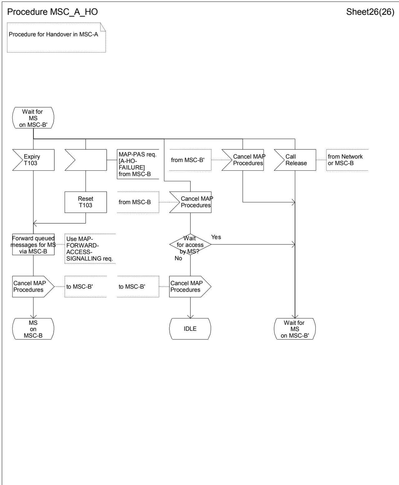

### Procedure MSC\_A\_HO

Sheet26(26)

Procedure for Handover in MSC-A

  

```

graph TD
    State1([Wait for MS  
on MSC-B']) 
    
    State1 --- BranchLine[ ]
    
    BranchLine --- In1[/Expiry  
T103/]
    BranchLine --- In2[/ /]
    BranchLine --- In3[/MAP-PAS req.  
[A-HO-FAILURE]  
from MSC-B/]
    BranchLine --- In4[/Cancel MAP  
Procedures/]
    BranchLine --- In5[/Call  
Release/]
    BranchLine --- In6[/ /]

    In2 --- TaskReset[Reset  
T103]
    TaskReset --- In1
    
    In1 --> TaskForward[Forward queued  
messages for MS  
via MSC-B]
    TaskForward --> TaskCancel1[Cancel MAP  
Procedures]
    TaskCancel1 --> StateMS([MS  
on  
MSC-B])

    In3 --- FromMSCB1[from MSC-B]
    In3 --> TaskCancel2[Cancel MAP  
Procedures]
    TaskCancel2 --> StateWaitMS([Wait for  
MS  
on MSC-B'])

    In4 --- FromMSCB2[from MSC-B']
    In4 --> Dec1{Wait  
for access  
by MS?}
    Dec1 -- No --> TaskCancel3[Cancel MAP  
Procedures]
    TaskCancel3 --> StateIdle([IDLE])
    Dec1 -- Yes --> JoinCall[ ]

    In5 --> JoinCall
    In6 --- FromNet[from Network  
or MSC-B]
    In6 --> JoinCall
    
    JoinCall --> StateWaitMS
    JoinCall --> StateIdle

    In2 --- FromMSCB3[from MSC-B]
    In2 --> TaskUseMAP[Use MAP-  
FORWARD-  
ACCESS-  
SIGNALLING req.]
    TaskUseMAP --- ToMSCB1[to MSC-B']
    TaskCancel1 --- ToMSCB2[to MSC-B']
    
```

SDL Diagram for Handover control procedure in MSC-A

**Figure 41 (Sheet 26 of 26): Handover control procedure in MSC-A**

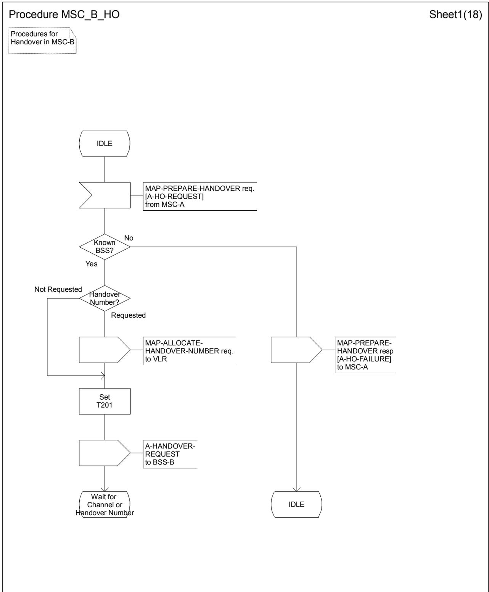

Procedure MSC\_B\_HO

Sheet1(18)

Procedures for Handover in MSC-B

```
graph TD; IDLE1([IDLE]) --> In1{{ }}; In1 -- "MAP-PREPARE-HANDOVER req. [A-HO-REQUEST] from MSC-A" --> In1; In1 --> KnownBSS{Known BSS?}; KnownBSS -- No --> Out1{{ }}; Out1 -- "MAP-PREPARE-HANDOVER resp [A-HO-FAILURE] to MSC-A" --> IDLE2([IDLE]); KnownBSS -- Yes --> HandoverNumber{Handover Number?}; HandoverNumber -- Not Requested --> In2{{ }}; HandoverNumber -- Requested --> Out2{{ }}; Out2 -- "MAP-ALLOCATE-HANDOVER-NUMBER req. to VLR" --> In2; In2 --> SetT201[Set T201]; SetT201 --> In3{{ }}; In3 -- "A-HANDOVER-REQUEST to BSS-B" --> In3; In3 --> Wait([Wait for Channel or Handover Number]);
```

The flowchart illustrates the handover control procedure in MSC-B. It begins at an IDLE state, receiving a MAP-PREPARE-HANDOVER request (A-HO-REQUEST) from MSC-A. A decision is made: 'Known BSS?'. If 'No', a MAP-PREPARE-HANDOVER response (A-HO-FAILURE) is sent to MSC-A, returning to IDLE. If 'Yes', another decision 'Handover Number?' is made. If 'Not Requested', the flow proceeds to a subsequent step. If 'Requested', a MAP-ALLOCATE-HANDOVER-NUMBER request is sent to the VLR, then the flow proceeds to 'Set T201', followed by an A-HANDOVER-REQUEST to BSS-B, and finally 'Wait for Channel or Handover Number'.

Flowchart of Handover control procedure in MSC-B

Figure 42 (Sheet 1 of 18): Handover control procedure in MSC-B

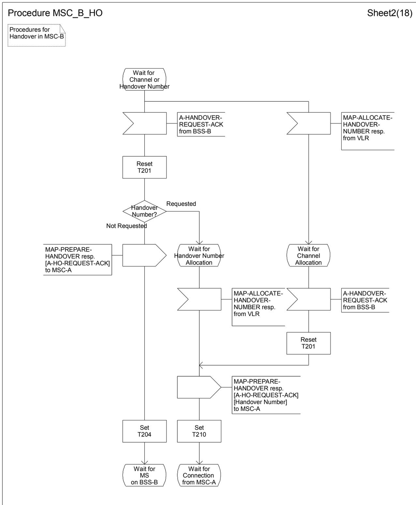

Procedure MSC\_B\_HO

Sheet2(18)

Procedures for  
Handover in MSC-B

```

graph TD
    Start([Wait for Channel or Handover Number])
    In1[/A-HANDOVER-REQUEST-ACK from BSS-B/]
    In2[/MAP-ALLOCATE-HANDOVER-NUMBER resp. from VLR/]
    Reset1[Reset T201]
    Decision{Handover Number?}
    Wait1([Wait for Handover Number Allocation])
    Wait2([Wait for Channel Allocation])
    In3[/MAP-ALLOCATE-HANDOVER-NUMBER resp. from VLR/]
    In4[/A-HANDOVER-REQUEST-ACK from BSS-B/]
    Reset2[Reset T201]
    Out1[/MAP-PREPARE-HANDOVER resp. [A-HO-REQUEST-ACK] to MSC-A/]
    Out2[/MAP-PREPARE-HANDOVER resp. [A-HO-REQUEST-ACK] [Handover Number] to MSC-A/]
    Set1[Set T204]
    Set2[Set T210]
    End1([Wait for MS on BSS-B])
    End2([Wait for Connection from MSC-A])

    Start --> In1
    Start --> In2
    In1 --> Reset1
    Reset1 --> Decision
    Decision -- Requested --> Wait1
    Decision -- Not Requested --> Out1
    In2 --> Wait2
    Wait1 --> In3
    Wait2 --> In4
    In4 --> Reset2
    In3 --> Out2
    Reset2 --> Out2
    Out1 --> Set1
    Set1 --> End1
    Out2 --> Set2
    Set2 --> End2
  
```

Flowchart of Handover control procedure in MSC-B

**Figure 42 (Sheet 2 of 18): Handover control procedure in MSC-B**

![Flowchart of Handover control procedure in MSC-B. The process starts with 'Wait for Channel or Handover Number'. It branches into two main paths. The left path handles 'A-HANDOVER-FAILURE from BSS-B', leading to 'Release Resources in BSS-B', then a decision 'Retry Same Cell?'. If 'Yes', it goes to 'Set T201' and then 'MAP-PREPARE-HANDOVER resp. [A-HO-FAILURE] to MSC-A', followed by 'A-HANDOVER-REQUEST to BSS-B' and back to 'Wait for Channel or Handover Number'. If 'No', it goes to 'Release Resources in BSS-B' and then 'IDLE'. The right path handles 'A-CLEAR-REQUEST from BSS-B', leading to 'ERROR' and 'Indication from VLR', then 'MAP-PREPARE-HANDOVER resp. [MAP ERROR] to MSC-A', 'Cancel Channel on BSS-B', and finally 'IDLE'. There are also 'Wait for Channel Allocation' and 'Expiry T201' blocks, and a 'Release Resources in BSS-B' block that leads to 'IDLE'.](223792b3652794024244c277cc46394b_img.jpg)

Procedure MSC\_B\_HO

Sheet3(18)

Procedures for Handover in MSC-B

```
graph TD; Start([Wait for Channel or Handover Number]) --> A_HO_Failure{A-HANDOVER-FAILURE from BSS-B}; Start --> Wait_Alloc1([Wait for Channel Allocation]); Start --> Wait_HN1([Wait for Channel or Handover Number]); Start --> Wait_HN2([Wait for Channel or Handover Number]); Start --> Wait_HN3([Wait for Handover Number Allocation]); A_HO_Failure --> ExpT201[Expiry T201]; ExpT201 --> RelRes1[Release Resources in BSS-B]; RelRes1 --> RetryCell{Retry Same Cell?}; RetryCell -- Yes --> SetT201[Set T201]; SetT201 --> MAP_Prepare_A[MAP-PREPARE-HANDOVER resp. [A-HO-FAILURE] to MSC-A]; MAP_Prepare_A --> A_HO_Request[A-HANDOVER-REQUEST to BSS-B]; A_HO_Request --> Wait_HN4([Wait for Channel or Handover Number]); RetryCell -- No --> RelRes2[Release Resources in BSS-B]; RelRes2 --> IDLE1([IDLE]); Wait_Alloc1 --> RelRes3[Release Resources in BSS-B]; RelRes3 --> IDLE2([IDLE]); Wait_HN2 --> A_Clear_Request{A-CLEAR-REQUEST from BSS-B}; A_Clear_Request --> Error[ERROR]; Error --> Indication[Indication from VLR]; Error --> MAP_Prepare_Error[MAP-PREPARE-HANDOVER resp. [MAP ERROR] to MSC-A]; MAP_Prepare_Error --> CancelChannel[Cancel Channel on BSS-B]; CancelChannel --> IDLE3([IDLE]);
```

Flowchart of Handover control procedure in MSC-B. The process starts with 'Wait for Channel or Handover Number'. It branches into two main paths. The left path handles 'A-HANDOVER-FAILURE from BSS-B', leading to 'Release Resources in BSS-B', then a decision 'Retry Same Cell?'. If 'Yes', it goes to 'Set T201' and then 'MAP-PREPARE-HANDOVER resp. [A-HO-FAILURE] to MSC-A', followed by 'A-HANDOVER-REQUEST to BSS-B' and back to 'Wait for Channel or Handover Number'. If 'No', it goes to 'Release Resources in BSS-B' and then 'IDLE'. The right path handles 'A-CLEAR-REQUEST from BSS-B', leading to 'ERROR' and 'Indication from VLR', then 'MAP-PREPARE-HANDOVER resp. [MAP ERROR] to MSC-A', 'Cancel Channel on BSS-B', and finally 'IDLE'. There are also 'Wait for Channel Allocation' and 'Expiry T201' blocks, and a 'Release Resources in BSS-B' block that leads to 'IDLE'.

Figure 42 (Sheet 3 of 18): Handover control procedure in MSC-B

![Flowchart of Procedure MSC_B_HO showing the sequence of operations for a handover in MSC-B. The process starts with 'Wait for Connection from MSC-A', followed by receiving 'I_CONNECT (IAM) from MSC-A (Uses Handover No.)'. It branches based on 'Expiry T210' and 'A-CLEAR-REQUEST from BSS-B'. The main path involves 'Reset T210', 'Cancel MAP Procedures', 'MAP-SEND-HANDOVER-REPORT resp. to VLR-B', 'Set T204', 'I_COMPLETE (ACM) to MSC-A', 'Release Radio Resources on BSS-B', and finally 'IDLE'. A secondary path involves 'Cancel MAP Procedures', 'e.g. MAP-ABORT from MSC-A', 'MAP-PAS req. [A-CLEAR-REQUEST] to MSC-A', 'Cancel MAP Procedures', and 'To MSC-A in MSC-B'.](b55cd9b5721bd8aabc979c85316924e4_img.jpg)

### Procedure MSC\_B\_HO

Sheet4(18)

Procedures for Handover in MSC-B

Basic handover from MSC-A to MSC-B  
Circuit Connection required

```
graph TD; Start([Wait for Connection from MSC-A]) --> Join(( )); Join --> IAM[I_CONNECT (IAM) from MSC-A (Uses Handover No.)]; IAM --> T210_Exp[Expiry T210]; T210_Exp --> Reset[Reset T210]; Reset --> ToMSCA1[To MSC-A in MSC-B]; ToMSCA1 --> CancelMAP1[Cancel MAP Procedures]; CancelMAP1 --> Join; T210_Exp --> A_CLEAR[A-CLEAR-REQUEST from BSS-B]; A_CLEAR --> Join; Join --> CancelMAP2[Cancel MAP Procedures]; CancelMAP2 --> MAP_ABORT[e.g. MAP-ABORT from MSC-A]; MAP_ABORT --> MAP_PAS[MAP-PAS req. [A-CLEAR-REQUEST] to MSC-A]; MAP_PAS --> CancelMAP3[Cancel MAP Procedures]; CancelMAP3 --> ToMSCA2[To MSC-A in MSC-B]; ToMSCA2 --> Join; Join --> MAP_SEND[MAP-SEND-HANDOVER-REPORT resp. to VLR-B]; MAP_SEND --> SetT204[Set T204]; SetT204 --> ACM[I_COMPLETE (ACM) to MSC-A]; ACM --> Release[Release Radio Resources on BSS-B]; Release --> IDLE([IDLE]); IDLE --> WaitMS([Wait for access by MS on BSS-B]);
```

Flowchart of Procedure MSC\_B\_HO showing the sequence of operations for a handover in MSC-B. The process starts with 'Wait for Connection from MSC-A', followed by receiving 'I\_CONNECT (IAM) from MSC-A (Uses Handover No.)'. It branches based on 'Expiry T210' and 'A-CLEAR-REQUEST from BSS-B'. The main path involves 'Reset T210', 'Cancel MAP Procedures', 'MAP-SEND-HANDOVER-REPORT resp. to VLR-B', 'Set T204', 'I\_COMPLETE (ACM) to MSC-A', 'Release Radio Resources on BSS-B', and finally 'IDLE'. A secondary path involves 'Cancel MAP Procedures', 'e.g. MAP-ABORT from MSC-A', 'MAP-PAS req. [A-CLEAR-REQUEST] to MSC-A', 'Cancel MAP Procedures', and 'To MSC-A in MSC-B'.

Figure 42 (Sheet 4 of 18): Handover control procedure in MSC-B


Procedure MSC\_B\_HO Sheet5(18)

Procedures for Handover in MSC-B

```

stateDiagram-v2
    state "Wait for access by MS on BSS-B" as S1
    state "Reset T204" as Task1
    state "ANM Sent?" as Decision1
    state "Call in Progress on MSC-B" as S2
    state "IDLE" as S3
    state "Wait for access by MS on BSS-B" as S4
    state "Wait for Disconnect" as S5
    state "Cancel MAP Procedures" as Task2
    state "Release Resources on BSS-B" as Task3
    state "Reset T204" as Task4

    [*] --> S1
    
    S1 --> Input1: A-HANDOVER-COMPLETE from BSS-B
    Input1 --> Task1
    Task1 --> Decision1
    Decision1 --> S2: Yes
    Decision1 --> Output1: No
    Output1: I_ANSWER (ANM) to MSC-A
    Output1 --> S2
    S2 --> Output2: MAP-SEND-END-SIGNAL req. [A-HO-COMPLETE] to MSC-A

    S1 --> Input2: A-CLEAR-REQUEST from BSS-B
    Input2 --> Output3: MAP-PAS req [A-CLEAR-REQUEST] to MSC-A
    Output3 --> Output4: I_DISCONNECT (REL) to MSC-A
    Output4 --> Task2
    Task2 --> Task3
    Task3 --> S3

    S1 --> Input3: Expiry T204
    Input3 --> Output5: I_DISCONNECT (REL) from MSC-A
    Output5 --> Input4: A-HANDOVER-DETECT from BSS-B
    Input4 --> Output6: I_ANSWER (ANM) to MSC-A
    Output6 --> Output7: MAP-PAS req [A-HO-DETECT] to MSC-A
    Output7 --> S4

    S1 --> Input5: from MSC-A
    Input5 --> Task2

    S1 --> Input6: Cancel MAP Procedure
    Input6 --> Task4
    Task4 --> Task5: Release Resources on BSS-B
    Task5 --> S5

```

SDL diagram for Procedure MSC\_B\_HO showing handover control in MSC-B. It starts from 'Wait for access by MS on BSS-B' and branches into several paths based on inputs like A-HANDOVER-COMPLETE, A-CLEAR-REQUEST, Expiry T204, and Cancel MAP Procedure. The paths lead to states like Call in Progress on MSC-B, IDLE, and Wait for Disconnect.

**Figure 42 (Sheet 5 of 18): Handover control procedure in MSC-B**


### Procedure MSC\_B\_HO

Sheet6(18)

Procedures for Handover in MSC-B

```
sequenceDiagram
    participant MSC-A
    participant BSS-A
    participant BSS
    participant MSC-B

    Note left of MSC-A: Forward Messages to MS
    Note right of MSC-B: Procedures for Handover in MSC-B

    MSC-B->>MSC-A: MAP-SEND-END-SIGNAL resp.
    MSC-A->>BSS-A: A-CLEAR-REQUEST
    BSS-A->>MSC-A: MAP-PAS req. [A-CLEAR-REQUEST]
    BSS-A->>BSS: A-HO-PERFORMED
    BSS->>MSC-A: MAP-PAS req. [A-HO-PERFORMED]
    MSC-A->>MSC-B: DISCONNECT (REL)
    MSC-B->>BSS-A: Release Resources in BSS-A
    BSS-A->>MSC-A: I_DISCONNECT (REL)
    MSC-A->>MSC-B: I_DISCONNECT (REL)
    Note right of MSC-B: Cancel MAP Procedures
    Note right of MSC-A: Cancel MAP Procedures from MSC-A
    Note right of MSC-B: Call in Progress on MSC-B
    Note right of MSC-A: A-HANDOVER-REQUIRED
    Note right of MSC-B: Release Resources in BSS-A
    Note right of MSC-A: I_DISCONNECT (REL)
    Note right of MSC-B: IDLE
    Note right of MSC-A: Call in Progress on MSC-B
    Note right of MSC-A: IDLE
    Note right of MSC-B: Wait for Disconnect
    Note right of MSC-B: IDLE
    Note right of MSC-A: MSC-A disconnected?
    Note right of MSC-A: Yes
    Note right of MSC-A: No
    Note right of MSC-B: 2
```

Sequence diagram for Handover control procedure in MSC-B. The diagram shows interactions between MSC-A, BSS-A, BSS, and MSC-B. It includes states like 'Call in Progress on MSC-B', 'IDLE', and 'Wait for Disconnect'. Messages include 'A-CLEAR-REQUEST', 'A-HO-PERFORMED', 'MAP-PAS req.', 'DISCONNECT (REL)', 'A-HANDOVER-REQUIRED', and 'I\_DISCONNECT (REL)'. A decision diamond asks 'MSC-A disconnected?'. The diagram ends with a connector '2'.

Figure 42 (Sheet 6 of 18): Handover control procedure in MSC-B

![Flowchart of handover control procedure in MSC-B. The process starts at connector 2. It checks if the MSC is known. If no, it checks if handover is allowed to the cell. If yes, it asks which MSC (MSC-A/MSB-B' or MSB-B). If MSB-B, it checks if the BSS is known. If yes, it checks for resources on BSS-B. If yes, it goes to connector 3. If no, it goes to connector 1. If the BSS is not known, it sends a reject to BSS-A. If the MSC is known, it goes to connector 4. At connector 4, it sends a MAP-PREPARE-SUBSEQUENT-HANDOVER req. [A-HO-REQUEST] to MSC-A, sets T211, and waits for a response. From connector 1, it checks if a new cell is selected. If yes, it goes to connector 2. If no, it checks if a reject should be sent. If yes, it sends a reject to BSS-A. If no, it checks if a circuit connection is available. If yes, it goes to 'Call in Progress on MSC-B'. If no, it goes to 'MS on MSC-B'.](09797d4289ec96309d21a9a993153dab_img.jpg)

### Procedure MSC\_B\_HO

Sheet7(18)

Procedures for Handover in MSC-B

```
graph TD
    2((2)) --> K{Known MSC?}
    K -- Yes --> 4((4))
    K -- No --> H{Handover allowed to Cell?}
    H -- No --> 2
    H -- Yes --> W{Which MSC?}
    W -- "MSC-A/MSB-B'" --> 4
    W -- "MSC-B" --> KB{Known BSS?}
    KB -- No --> 1((1))
    KB -- Yes --> R{Resources on BSS-B?}
    R -- No --> 1
    R -- Yes --> 3((3))
    4 --> M[MAP-PREPARE-SUBSEQUENT-HANDOVER req. [A-HO-REQUEST] to MSC-A]
    M --> S[Set T211]
    S --> WR[Wait for Response]
    1 --> SNC{Select New Cell?}
    SNC -- Yes --> 2
    SNC -- No --> SR{Send Reject?}
    SR -- Yes --> AR[A-HANDOVER-REJECT to BSS-A]
    AR --> 2
    SR -- No --> CC{Circuit Connection?}
    CC -- Yes --> CP[Call in Progress on MSC-B]
    CC -- No --> MS[MS on MSC-B]
```

Flowchart of handover control procedure in MSC-B. The process starts at connector 2. It checks if the MSC is known. If no, it checks if handover is allowed to the cell. If yes, it asks which MSC (MSC-A/MSB-B' or MSB-B). If MSB-B, it checks if the BSS is known. If yes, it checks for resources on BSS-B. If yes, it goes to connector 3. If no, it goes to connector 1. If the BSS is not known, it sends a reject to BSS-A. If the MSC is known, it goes to connector 4. At connector 4, it sends a MAP-PREPARE-SUBSEQUENT-HANDOVER req. [A-HO-REQUEST] to MSC-A, sets T211, and waits for a response. From connector 1, it checks if a new cell is selected. If yes, it goes to connector 2. If no, it checks if a reject should be sent. If yes, it sends a reject to BSS-A. If no, it checks if a circuit connection is available. If yes, it goes to 'Call in Progress on MSC-B'. If no, it goes to 'MS on MSC-B'.

Figure 42 (Sheet 7 of 18): Handover control procedure in MSC-B

![Flowchart of Procedure MSC_B_HO showing the handover control process from BSS-A to BSS-B on MSC-B. The process starts at connector 3, sends an A-HANDOVER-REQUEST to BSS-B, sets timer T201, and waits for a channel. It then branches based on responses: A-HANDOVER-REQUEST-ACK (success path), A-HANDOVER-FAILURE (failure path), or MAP-SEND-END-SIGNAL (error path). The success path leads to resource release and a retry decision. The failure path leads to resource release and disconnection. The error path leads to resource release and disconnection.](893d65bf826925a7283359b1672010a0_img.jpg)

### Procedure MSC\_B\_HO

Sheet8(18)

Procedures for Handover in MSC-B

Handover from BSS-A to BSS-B on MSC-B

```
graph TD; Start((3)) --> Request[A-HANDOVER-REQUEST to BSS-B]; Request --> T201_Set[Set T201]; T201_Set --> Wait_Channel{Wait for Channel}; Wait_Channel --> Ack{A-HANDOVER-REQUEST-ACK from BSS-B}; Wait_Channel --> Expiry{Expiry T201}; Wait_Channel --> Failure{A-HANDOVER-FAILURE from BSS-B}; Wait_Channel --> EndSignal[MAP-SEND-END-SIGNAL resp. from MSC-A]; Ack --> Reset_T201_1[Reset T201]; Reset_T201_1 --> Queue[Queue Messages in MSC-B]; Queue --> Command[Handover Command to MS via BSS-A]; Command --> Setup[Set Up Handover Device]; Setup --> T202_Set[Set T202]; T202_Set --> Wait_Access{Wait for access by MS}; Expiry --> Release_BSSB[Release Resources on BSS-B]; Failure --> Reset_T201_2[Reset T201]; Reset_T201_2 --> Release_BSSB; EndSignal --> ClearRequest[A-CLEAR-REQUEST from BSS-A]; ClearRequest --> PASReq[MAP-PAS req [A-CLEAR-REQUEST] to MSC-A]; PASReq --> CancelMap[Cancel MAP Procedures]; CancelMap --> ToMSCA[To MSC-A in MSC-B]; ToMSCA --> Release_BSSA[Release Resources on BSS-A]; Release_BSSB --> Retry{Retry Handover Attempt?}; Retry -- Yes --> Cell{Cell?}; Cell -- Same Cell --> End3((3)); Cell -- New Cell --> End2((2)); Retry -- No --> End1((1)); Release_BSSA --> Wait_Disconnect{Wait for Disconnect};
```

Flowchart of Procedure MSC\_B\_HO showing the handover control process from BSS-A to BSS-B on MSC-B. The process starts at connector 3, sends an A-HANDOVER-REQUEST to BSS-B, sets timer T201, and waits for a channel. It then branches based on responses: A-HANDOVER-REQUEST-ACK (success path), A-HANDOVER-FAILURE (failure path), or MAP-SEND-END-SIGNAL (error path). The success path leads to resource release and a retry decision. The failure path leads to resource release and disconnection. The error path leads to resource release and disconnection.

Figure 42 (Sheet 8 of 18): Handover control procedure in MSC-B


**Procedure MSC\_B\_HO** Sheet9(18)

Procedures for Handover in MSC-B

```
graph TD; Start([Wait for access by MS]) --> A_HO_COMPLETE[A-HANDOVER-COMPLETE from BSS-B]; Start --> A_HO_DETECT[A-HANDOVER-DETECT from BSS-B]; Start --> A_HO_FAILURE[A-HANDOVER FAILURE from BSS-A]; A_HO_COMPLETE --> Reset_T202_1[Reset T202]; Reset_T202_1 --> MAP_PAS_req[MAP-PAS req. [A-HO-PERFORMED] to MSC-A]; MAP_PAS_req --> CC_1{Circuit Connection?}; CC_1 -- No --> CC_1; CC_1 -- Yes --> CHD_1{{Connect Handover Device (Optional)}}; CHD_1 --> FQM[Forward queued messages via BSS-B]; FQM --> RR[Release Resources in BSS-A]; RR --> CC_2{Circuit Connection?}; CC_2 -- No --> End_1([MS on MSC-B]); CC_2 -- Yes --> RH[Release Handover Device]; RH --> End_2([Call in Progress on MSC-B]); A_HO_DETECT --> CC_3{Circuit Connection?}; CC_3 -- No --> CC_3; CC_3 -- Yes --> CHD_2{{Connect Handover Device (Optional)}}; CHD_2 --> End_3([Wait for access by MS]); A_HO_FAILURE --> Reset_T202_2[Reset T202]; Reset_T202_2 --> FQMA[Forward queued messages via BSS-A]; FQMA --> RR2[Release Resources in BSS-B]; RR2 --> CC_4{Circuit Connection?}; CC_4 -- No --> End_4([MS on MSC-B]); CC_4 -- Yes --> RH2[Release Handover Device]; RH2 --> End_5([Call in Progress on MSC-B]);
```

Flowchart of Handover control procedure in MSC-B. It starts with 'Wait for access by MS' and branches based on messages from BSS-B and BSS-A. It includes steps for resetting timers, sending messages, checking circuit connections, and releasing resources. The final states are 'Call in Progress on MSC-B', 'MS on MSC-B', or 'Wait for access by MS'.

Figure 42 (Sheet 9 of 18): Handover control procedure in MSC-B

![Flowchart of Procedure MSC_B_HO showing four parallel paths for handover control. Path 1: Wait for access by MS -> Expiry T202 -> A-CLEAR-REQUEST from BSS-B -> Release Resources in BSS-B and BSS-A -> Release Handover Device -> MAP-PAS req. [A-CLEAR-REQUEST] to MSC-A -> Cancel MAP Procedures -> To MSC-A in MSC-B -> I_DISCONNECT (REL) to MSC-A -> IDLE. Path 2: A-CLEAR-REQUEST from BSS-A -> Release Resources in BSS-B -> MAP-PAS req. [A-CLEAR-REQUEST] to MSC-A -> To MSC-A in MSC-B -> Wait for access by MS. Path 3: [Blank] -> Release Resources in BSS-A -> Wait for access by MS? (Yes/No) -> No -> [Blank] -> Cancel MAP Procedures -> Release Resources in BSS-B -> Wait for Disconnect. Path 4: [Blank] -> MAP-SEND-END-SIGNAL resp. from MSC-A -> Release Resources in BSS-B and BSS-A -> Release Handover Device -> Wait for Disconnect.](86986d4dfd54f298d7b9fa9f82ab3009_img.jpg)

### Procedure MSC\_B\_HO

Sheet10(18)

Procedures for Handover in MSC-B

```
graph TD; Start((Wait for access by MS)); Start --> T202{Expiry T202}; T202 --> ACR_B["A-CLEAR-REQUEST from BSS-B"]; ACR_B --> RR_BA["Release Resources in BSS-B and BSS-A"]; RR_BA --> RH["Release Handover Device"]; RH --> MPAS_A["MAP-PAS req. [A-CLEAR-REQUEST] to MSC-A"]; MPAS_A --> CMP["Cancel MAP Procedures"]; CMP --> ToMSCA["To MSC-A in MSC-B"]; ToMSCA --> IDISCONN["I_DISCONNECT (REL) to MSC-A"]; IDISCONN --> IDLE((IDLE)); ACR_A["A-CLEAR-REQUEST from BSS-A"] --> RR_B["Release Resources in BSS-B"]; RR_B --> MPAS_A2["MAP-PAS req. [A-CLEAR-REQUEST] to MSC-A"]; MPAS_A2 --> ToMSCB["To MSC-A in MSC-B"]; ToMSCB --> WAM2((Wait for access by MS)); B1[ ] --> RR_A["Release Resources in BSS-A"]; RR_A --> WAM{Wait for access by MS?}; WAM -- Yes --> B2[ ]; WAM -- No --> B3[ ]; B3 --> CMP2["Cancel MAP Procedures"]; CMP2 --> RR_B2["Release Resources in BSS-B"]; RR_B2 --> WD1((Wait for Disconnect)); B4[ ] --> MES["MAP-SEND-END-SIGNAL resp. from MSC-A"]; MES --> RR_BA2["Release Resources in BSS-B and BSS-A"]; RR_BA2 --> RH2["Release Handover Device"]; RH2 --> WD2((Wait for Disconnect));
```

Flowchart of Procedure MSC\_B\_HO showing four parallel paths for handover control. Path 1: Wait for access by MS -> Expiry T202 -> A-CLEAR-REQUEST from BSS-B -> Release Resources in BSS-B and BSS-A -> Release Handover Device -> MAP-PAS req. [A-CLEAR-REQUEST] to MSC-A -> Cancel MAP Procedures -> To MSC-A in MSC-B -> I\_DISCONNECT (REL) to MSC-A -> IDLE. Path 2: A-CLEAR-REQUEST from BSS-A -> Release Resources in BSS-B -> MAP-PAS req. [A-CLEAR-REQUEST] to MSC-A -> To MSC-A in MSC-B -> Wait for access by MS. Path 3: [Blank] -> Release Resources in BSS-A -> Wait for access by MS? (Yes/No) -> No -> [Blank] -> Cancel MAP Procedures -> Release Resources in BSS-B -> Wait for Disconnect. Path 4: [Blank] -> MAP-SEND-END-SIGNAL resp. from MSC-A -> Release Resources in BSS-B and BSS-A -> Release Handover Device -> Wait for Disconnect.

Figure 42 (Sheet 10 of 18): Handover control procedure in MSC-B


### Procedure MSC\_B\_HO

Sheet11(18)

Procedures for Handover in MSC-B

Subsequent Handover from MSC-B to MSC-A

```
graph TD
    Start([Wait for Response]) --> Join(( ))
    MSCA_Req[MAP-PREPARE-SUBSEQUENT-HANDOVER resp. [A-HO-REQUEST-ACK] from MSC-A] --> Join
    BSSA_Req[A-CLEAR-REQUEST from BSS-A] --> Join
    Join --> T211_Reset1[Reset T211]
    T211_Reset1 --> ReleaseBSSB[Release Resources in BSS-B]
    ReleaseBSSB --> RetryAttempt{Retry Handover Attempt?}
    RetryAttempt -- No --> End1((1))
    RetryAttempt -- Yes --> Cell{Cell?}
    Cell -- Same Cell --> End4((4))
    Cell -- New Cell --> End2((2))
    T211_Reset1 --> T211_Reset2[Reset T211]
    T211_Reset2 --> MSCA_Resp[MAP-PREPARE-SUBSEQUENT-HANDOVER resp. [A-HO-FAILURE or MAP ERROR] from MSC-A]
    MSCA_Resp --> T211_Expiry[Expiry T211]
    T211_Expiry --> Join
    T211_Expiry --> MSCA_End[MAP-SEND-END-SIGNAL resp. from MSC-A]
    MSCA_End --> MSCA_PAS[MAP-PAS req. [A-CLEAR-REQUEST] to MSC-A]
    MSCA_PAS --> MSCA_PAS_In[in MSC-B to MSC-A]
    MSCA_PAS_In --> Cancel[Cancel MAP Procedures]
    Cancel --> ReleaseBSSA[Release Resources in BSS-A]
    ReleaseBSSA --> End3([Wait for Disconnect])
    End3 --> Join
    End2 --> Command[Handover Command to MS via BSS-A]
    Command --> T204_Set[Set T204]
    T204_Set --> End5([Wait for Ack. from MSC-A])
    End5 --> Join
```

Flowchart of the handover control procedure in MSC-B. The process starts with 'Wait for Response' and branches based on incoming messages from MSC-A and BSS-A. It includes steps for resetting timers (T211, T204), releasing resources, and deciding whether to retry the handover or disconnect.

Figure 42 (Sheet 11 of 18): Handover control procedure in MSC-B

![Flowchart of Handover control procedure in MSC-B. The process starts with 'Wait for Ack. from MSC-A'. It branches into three main paths: 1) Success path: 'MAP-SEND-END-SIGNAL resp. from MSC-A' -> 'Reset T204' -> 'Release Resources in BSS-A' -> 'Cancel MAP Procedures to MSC-A in MSC-B' -> 'Circuit Connection?' (Yes -> 'Wait for Disconnect', No -> 'IDLE'). 2) Failure path: 'A-CLEAR-REQUEST from BSS-A' -> 'MAP-PAS req. [A-CLEAR-REQUEST] to MSC-A' -> 'Release Resources in BSS-A' -> 'Cancel MAP Procedures to MSC-A' -> 'Circuit Connection?' (Yes -> 'Wait for Disconnect', No -> 'IDLE'). 3) Error path: 'A-HANDOVER-FAILURE from BSS-A' -> 'Reset T204' -> 'Release Resources in BSS-A' -> 'MAP-PAS req. [A-HO-FAILURE] to MSC-A' -> 'Circuit Connection?' (Yes -> 'Call in Progress on MSC-B', No -> 'MS on MSC-B'). A common 'Expiry T204' block is shown above the failure path.](511f9b05a4c458937dd12c30936fd7d6_img.jpg)

**Procedure MSC\_B\_HO** Sheet12(18)

*Procedures for Handover in MSC-B*

```
graph TD; Start([Wait for Ack. from MSC-A]) --> Join(( )); Join --> Success[MAP-SEND-END-SIGNAL resp. from MSC-A]; Join --> Failure[A-CLEAR-REQUEST from BSS-A]; Join --> Error[A-HANDOVER-FAILURE from BSS-A]; Success --> Reset1[Reset T204]; Reset1 --> Release1[Release Resources in BSS-A]; Release1 --> Cancel1[Cancel MAP Procedures to MSC-A in MSC-B]; Cancel1 --> Conn1{Circuit Connection?}; Conn1 -- Yes --> Disconnect([Wait for Disconnect]); Conn1 -- No --> Idle([IDLE]); Failure --> PAS1[MAP-PAS req. [A-CLEAR-REQUEST] to MSC-A]; PAS1 --> Release2[Release Resources in BSS-A]; Release2 --> Cancel2[Cancel MAP Procedures to MSC-A]; Cancel2 --> Conn2{Circuit Connection?}; Conn2 -- Yes --> Disconnect; Conn2 -- No --> Idle; Error --> Reset2[Reset T204]; Reset2 --> Release3[Release Resources in BSS-A]; Release3 --> PAS2[MAP-PAS req. [A-HO-FAILURE] to MSC-A]; PAS2 --> Conn3{Circuit Connection?}; Conn3 -- Yes --> CallProgress([Call in Progress on MSC-B]); Conn3 -- No --> MSonMSCB([MS on MSC-B]); Expiry[Expiry T204] -.-> Failure;
```

Flowchart of Handover control procedure in MSC-B. The process starts with 'Wait for Ack. from MSC-A'. It branches into three main paths: 1) Success path: 'MAP-SEND-END-SIGNAL resp. from MSC-A' -> 'Reset T204' -> 'Release Resources in BSS-A' -> 'Cancel MAP Procedures to MSC-A in MSC-B' -> 'Circuit Connection?' (Yes -> 'Wait for Disconnect', No -> 'IDLE'). 2) Failure path: 'A-CLEAR-REQUEST from BSS-A' -> 'MAP-PAS req. [A-CLEAR-REQUEST] to MSC-A' -> 'Release Resources in BSS-A' -> 'Cancel MAP Procedures to MSC-A' -> 'Circuit Connection?' (Yes -> 'Wait for Disconnect', No -> 'IDLE'). 3) Error path: 'A-HANDOVER-FAILURE from BSS-A' -> 'Reset T204' -> 'Release Resources in BSS-A' -> 'MAP-PAS req. [A-HO-FAILURE] to MSC-A' -> 'Circuit Connection?' (Yes -> 'Call in Progress on MSC-B', No -> 'MS on MSC-B'). A common 'Expiry T204' block is shown above the failure path.

Figure 42 (Sheet 12 of 18): Handover control procedure in MSC-B

![State transition diagram for Procedure MSC_B_HO. The diagram shows various states (circles) and transitions (arrows) between them. States include 'Wait for MS on BSS-B', 'MS on MSC-B', 'Wait for MS on BSS-B', and 'IDLE'. Transitions are labeled with messages like 'A-HANDOVER-COMPLETE from BSS-B', 'A-CLEAR-REQUEST from BSS-B', 'MAP-PAS req [A-CLEAR-REQUEST] to MSC-A', 'A-HANDOVER-DETECT from BSS-B', 'MAP-PAS req [A-HO-DETECT] to MSC-A', 'Cancel MAP Procedure', 'Release Resources on BSS-B', and 'Cancel MAP Procedures to MSC-A in MSC-B'. There are also timers like 'Reset T204' and 'Expiry T204'.](e9540f7fc7a084859dd5cdb0f9b7fcf2_img.jpg)

**Procedure MSC\_B\_HO** Sheet13(18)

Procedures for Handover in MSC-B

Basic handover from MSC-A to MSC-B no Circuit Connection required

```
stateDiagram-v2
    [*] --> S1: Wait for MS on BSS-B
    S1 --> S2: A-HANDOVER-COMPLETE from BSS-B
    S2 --> S3: Reset T204
    S3 --> S4: MAP-SEND-END-SIGNAL req. [A-HO-COMPLETE] to MSC-A
    S4 --> S5: MS on MSC-B
    S1 --> S6: A-CLEAR-REQUEST from BSS-B
    S6 --> S7: MAP-PAS req [A-CLEAR-REQUEST] to MSC-A
    S7 --> S8: A-HANDOVER-DETECT from BSS-B
    S8 --> S9: MAP-PAS req [A-HO-DETECT] to MSC-A
    S9 --> S10: Wait for MS on BSS-B
    S1 --> S11: Expiry T204
    S11 --> S12: Cancel MAP Procedure
    S12 --> S13: Release Resources on BSS-B
    S13 --> S14: IDLE
    S11 --> S15: Cancel MAP Procedures to MSC-A in MSC-B
    S15 --> S12
```

State transition diagram for Procedure MSC\_B\_HO. The diagram shows various states (circles) and transitions (arrows) between them. States include 'Wait for MS on BSS-B', 'MS on MSC-B', 'Wait for MS on BSS-B', and 'IDLE'. Transitions are labeled with messages like 'A-HANDOVER-COMPLETE from BSS-B', 'A-CLEAR-REQUEST from BSS-B', 'MAP-PAS req [A-CLEAR-REQUEST] to MSC-A', 'A-HANDOVER-DETECT from BSS-B', 'MAP-PAS req [A-HO-DETECT] to MSC-A', 'Cancel MAP Procedure', 'Release Resources on BSS-B', and 'Cancel MAP Procedures to MSC-A in MSC-B'. There are also timers like 'Reset T204' and 'Expiry T204'.

Figure 42 (Sheet 13 of 18): Handover control procedure in MSC-B

![Sequence diagram for Handover control procedure in MSC-B. The diagram shows three parallel lifelines: MS on MSC-B, MSC-A, and VLR. The sequence starts with MSC-A sending a MAP-SEND-END-SIGNAL resp. to the MS. The MS then sends an A-HANDOVER-REQUIRED from BSS-A to MSC-A. MSC-A responds with a MAP-PREPARE-HANDOVER req. [NULL] [A-ASG-REQUEST] to the VLR. The VLR sends a MAP-ALLOCATE-HANDOVER-NUMBER req. to MSC-A, which in turn sends an A-ASSIGNMENT-REQUEST to BSS-A. The MS receives Forward Messages from MSC-A, releases resources in BSS-B, and enters an IDLE state. The VLR enters a 'Wait for Assignment or Handover Number' state. A connector '2' is shown on the MSC-A lifeline.](649426750a89fa0e5d7c1736d5cf72c6_img.jpg)

Procedure MSC\_B\_HO

Sheet14(18)

Procedures for Handover in MSC-B

```
sequenceDiagram
    participant MS as MS on MSC-B
    participant MSC_A as MSC-A
    participant VLR as VLR

    Note left of MS: Forward Messages to MS
    MSC_A->>MS: MAP-SEND-END-SIGNAL resp. from MSC-A
    Note right of MS: Release Resources in BSS-B
    MS->>MSC_A: A-HANDOVER-REQUIRED from BSS-A
    MSC_A->>VLR: MAP-PREPARE-HANDOVER req. [NULL] [A-ASG-REQUEST] from MSC-A
    VLR->>MSC_A: MAP-ALLOCATE-HANDOVER-NUMBER req. to VLR
    MSC_A->>BSS_A: A-ASSIGNMENT-REQUEST to BSS-A
    Note right of MS: IDLE
    Note right of VLR: Wait for Assignment or Handover Number
    Note right of MSC_A: 2
```

Sequence diagram for Handover control procedure in MSC-B. The diagram shows three parallel lifelines: MS on MSC-B, MSC-A, and VLR. The sequence starts with MSC-A sending a MAP-SEND-END-SIGNAL resp. to the MS. The MS then sends an A-HANDOVER-REQUIRED from BSS-A to MSC-A. MSC-A responds with a MAP-PREPARE-HANDOVER req. [NULL] [A-ASG-REQUEST] to the VLR. The VLR sends a MAP-ALLOCATE-HANDOVER-NUMBER req. to MSC-A, which in turn sends an A-ASSIGNMENT-REQUEST to BSS-A. The MS receives Forward Messages from MSC-A, releases resources in BSS-B, and enters an IDLE state. The VLR enters a 'Wait for Assignment or Handover Number' state. A connector '2' is shown on the MSC-A lifeline.

Figure 42 (Sheet 14 of 18): Handover control procedure in MSC-B

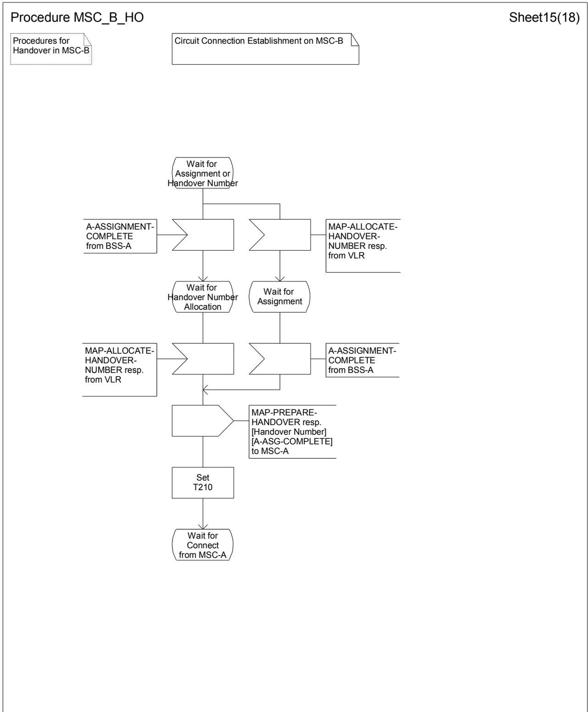

Procedure MSC\_B\_HO

Sheet15(18)

Procedures for Handover in MSC-B

Circuit Connection Establishment on MSC-B

```
graph TD; Start([Wait for Assignment or Handover Number]) --> Join1(( )); BSSA_ASG_Comp[A-ASSIGNMENT-COMPLETE from BSS-A] --> Join1; VLR_MAP_Alloc[MAP-ALLOCATE-HANDOVER-NUMBER resp. from VLR] --> Join1; Join1 --> WaitAlloc([Wait for Handover Number Allocation]); VLR_MAP_Alloc --> Join2(( )); BSSA_ASG_Comp --> Join2; Join2 --> WaitAssign([Wait for Assignment]); WaitAlloc --> VLR_MAP_AllocResp[MAP-ALLOCATE-HANDOVER-NUMBER resp. from VLR]; WaitAssign --> BSSA_ASG_CompResp[A-ASSIGNMENT-COMPLETE from BSS-A]; VLR_MAP_AllocResp --> Join3(( )); BSSA_ASG_CompResp --> Join3; Join3 --> MAP_Prepare[MAP-PREPARE-HANDOVER resp. [Handover Number] [A-ASG-COMPLETE] to MSC-A]; MAP_Prepare --> SetT210[Set T210]; SetT210 --> WaitConnect([Wait for Connect from MSC-A]);
```

The flowchart illustrates the handover control procedure in MSC-B. It begins with a state 'Wait for Assignment or Handover Number'. Two possible inputs are shown: 'A-ASSIGNMENT-COMPLETE from BSS-A' and 'MAP-ALLOCATE-HANDOVER-NUMBER resp. from VLR'. These lead to a junction point. From this junction, one path leads to 'Wait for Handover Number Allocation' and the other to 'Wait for Assignment'. From 'Wait for Handover Number Allocation', the flow proceeds to 'MAP-ALLOCATE-HANDOVER-NUMBER resp. from VLR'. From 'Wait for Assignment', the flow proceeds to 'A-ASSIGNMENT-COMPLETE from BSS-A'. Both of these lead to another junction point. From this second junction, one path leads to 'MAP-PREPARE-HANDOVER resp. [Handover Number] [A-ASG-COMPLETE] to MSC-A' and the other to 'Set T210'. Finally, the flow proceeds to 'Wait for Connect from MSC-A'.

Flowchart of Handover control procedure in MSC-B

Figure 42 (Sheet 15 of 18): Handover control procedure in MSC-B

![Sequence diagram for Handover control procedure in MSC-B. The diagram shows two main paths: one for a successful handover and one for a failure. In the failure path, an 'A-ASSIGNMENT-FAILURE' from BSS-A leads to an 'ERROR' state, which then triggers an 'Indication from VLR'. In the success path, 'MAP-PREPARE-HANDOVER resp. [A-ASG-FAILURE] to MSC-A' is followed by 'MAP-PREPARE-HANDOVER resp. [MAP ERROR] to MSC-A', then 'A-CLEAR-REQUEST from BSS-A', and 'MAP-PAS req. [A-CLEAR-REQUEST] to MSC-A'. These are followed by 'Cancel MAP Procedures' to MSC-A/VLR-B and VLR-B, 'Release Resources in BSS-A', and finally reaching an 'IDLE' state. The initial state for both paths is 'Wait for Assignment or Handover Number'.](9ef15a4afab1416db28b91184862a3a5_img.jpg)

### Procedure MSC\_B\_HO

Sheet16(18)

Procedures for Handover in MSC-B

```
sequenceDiagram
    participant BSS-A
    participant MSC-A
    participant VLR-B
    participant MS
    Note left of BSS-A: Procedures for Handover in MSC-B

    Note right of BSS-A: Wait for Assignment or Handover Number
    Note right of BSS-A: Wait for Assignment
    Note right of MSC-A: Wait for Assignment or Handover Number
    Note right of MSC-A: Wait for Handover Number Allocation
    Note right of VLR-B: Wait for Assignment or Handover Number
    Note right of VLR-B: Wait for Assignment
    Note right of MS: Wait for Assignment or Handover Number
    Note right of MS: Wait for Handover Number Allocation

    Note left of BSS-A: A-ASSIGNMENT-FAILURE from BSS-A
    Note left of MSC-A: MAP-PREPARE-HANDOVER resp. [A-ASG-FAILURE] to MSC-A
    Note left of VLR-B: Indication from VLR
    Note left of MS: MS on MSC-B

    Note left of MSC-A: MAP-PREPARE-HANDOVER resp. [MAP ERROR] to MSC-A
    Note left of BSS-A: A-CLEAR-REQUEST from BSS-A
    Note left of MSC-A: MAP-PAS req. [A-CLEAR-REQUEST] to MSC-A
    Note left of MSC-A: to MSC-A and VLR-B
    Note left of VLR-B: to VLR-B
    Note left of MS: Release Resources in BSS-A
    Note left of MS: IDLE
```

Sequence diagram for Handover control procedure in MSC-B. The diagram shows two main paths: one for a successful handover and one for a failure. In the failure path, an 'A-ASSIGNMENT-FAILURE' from BSS-A leads to an 'ERROR' state, which then triggers an 'Indication from VLR'. In the success path, 'MAP-PREPARE-HANDOVER resp. [A-ASG-FAILURE] to MSC-A' is followed by 'MAP-PREPARE-HANDOVER resp. [MAP ERROR] to MSC-A', then 'A-CLEAR-REQUEST from BSS-A', and 'MAP-PAS req. [A-CLEAR-REQUEST] to MSC-A'. These are followed by 'Cancel MAP Procedures' to MSC-A/VLR-B and VLR-B, 'Release Resources in BSS-A', and finally reaching an 'IDLE' state. The initial state for both paths is 'Wait for Assignment or Handover Number'.

Figure 42 (Sheet 16 of 18): Handover control procedure in MSC-B

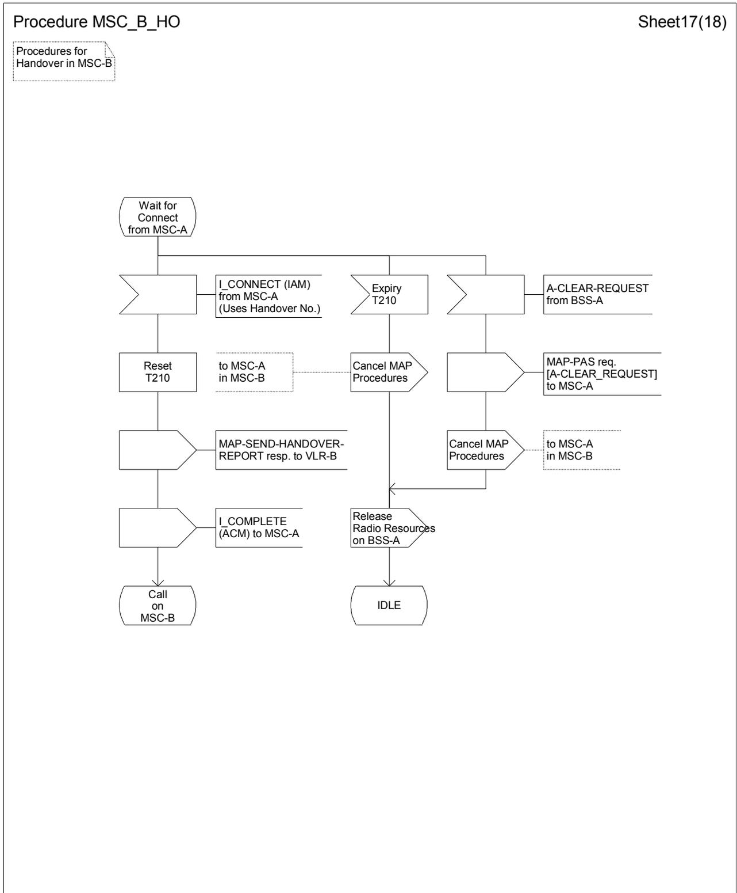

### Procedure MSC\_B\_HO

Sheet17(18)

Procedures for  
Handover in MSC-B

```
graph TD; Start([Wait for Connect from MSC-A]) --> I_CONNECT[I_CONNECT (IAM) from MSC-A (Uses Handover No.)]; I_CONNECT --> T210_Exp{Expiry T210}; T210_Exp --> A_CLEAR_REQ[A-CLEAR-REQUEST from BSS-A]; A_CLEAR_REQ --> MAP_PAS_REQ[MAP-PAS req. [A-CLEAR_REQUEST] to MSC-A]; MAP_PAS_REQ --> Cancel_MAP_1[Cancel MAP Procedures]; Cancel_MAP_1 --> to_MSC_A_1[to MSC-A in MSC-B]; T210_Exp --> Cancel_MAP_2[Cancel MAP Procedures]; Cancel_MAP_2 --> to_MSC_A_2[to MSC-A in MSC-B]; I_CONNECT --> Reset_T210[Reset T210]; Reset_T210 --> to_MSC_A_3[to MSC-A in MSC-B]; to_MSC_A_3 --> MAP_SEND_REPORT[MAP-SEND-HANDOVER-REPORT resp. to VLR-B]; MAP_SEND_REPORT --> I_COMPLETE[I_COMPLETE (ACM) to MSC-A]; I_COMPLETE --> Call_on_MSC_B([Call on MSC-B]); to_MSC_A_2 --> Release_Radio[Release Radio Resources on BSS-A]; Release_Radio --> IDLE([IDLE]);
```

The flowchart illustrates the handover control procedure in MSC-B. It begins with a 'Wait for Connect from MSC-A' state. Upon receiving an 'I\_CONNECT (IAM) from MSC-A (Uses Handover No.)', the process branches based on the 'Expiry T210' timer. If the timer expires, an 'A-CLEAR-REQUEST from BSS-A' is received, leading to a 'MAP-PAS req. [A-CLEAR\_REQUEST] to MSC-A', which then triggers 'Cancel MAP Procedures' to 'MSC-A in MSC-B'. Simultaneously, the 'Expiry T210' timer also triggers 'Cancel MAP Procedures' to 'MSC-A in MSC-B'. If the timer does not expire, a 'Reset T210' is performed, leading to 'to MSC-A in MSC-B', then 'MAP-SEND-HANDOVER-REPORT resp. to VLR-B', and finally 'I\_COMPLETE (ACM) to MSC-A', resulting in 'Call on MSC-B'. Both 'Cancel MAP Procedures' paths lead to 'Release Radio Resources on BSS-A', which results in an 'IDLE' state.

Flowchart of Handover control procedure in MSC-B

Figure 42 (Sheet 17 of 18): Handover control procedure in MSC-B


Procedure MSC\_B\_HO

Sheet18(18)

Procedures for Handover in MSC-B

```
graph TD; Start([Wait for Connect from MSC-A]) --> I_DISCONNECT[I_DISCONNECT (REL) from MSC-A]; Start --> MAP_SEND[MAP-SEND-END-SIGNAL resp. from MSC-A]; Start --> FROM_MSC_A[from MSC-A]; I_DISCONNECT --> MS_on_MSC_B([MS on MSC-B]); MAP_SEND --> Release_Resources_1[Release Resources on BSS-A]; Release_Resources_1 --> IDLE_1([IDLE]); FROM_MSC_A --> Cancel_MAP[Cancel MAP Procedure]; Cancel_MAP --> Release_Resources_2[Release Resources on BSS-A]; Release_Resources_2 --> IDLE_2([IDLE]);
```

Flowchart of Handover control procedure in MSC-B. The process starts with 'Wait for Connect from MSC-A'. It branches into three paths: 1) 'I\_DISCONNECT (REL) from MSC-A' leads to 'MS on MSC-B'; 2) 'MAP-SEND-END-SIGNAL resp. from MSC-A' leads to 'Release Resources on BSS-A' which leads to 'IDLE'; 3) 'from MSC-A' leads to 'Cancel MAP Procedure' which leads to 'Release Resources on BSS-A' which leads to 'IDLE'.

Figure 42 (Sheet 18 of 18): Handover control procedure in MSC-B


### Procedure 3G\_MSC\_A\_HO

Procedure for Handover in 3G\_MSC-A

Sheet1(78)

```
graph TD
    IDLE1([IDLE]) --> CallProgress([Call in Progress on 3G_MSC-A])
    CallProgress --> AHandoverReq[A-HANDOVER-REQUIRED from BSS-A (GSM to UMTS Handover)]
    CallProgress --> IuRelocationReq[Iu-RELOCATION-REQUIRED from RNS-A]
    AHandoverReq --> KnownMSC{Known MSC?}
    KnownMSC -- Yes --> WhichMSC{Which MSC?}
    KnownMSC -- No --> HandoverAllowed{Handover allowed to Cell?}
    HandoverAllowed -- Yes --> WhichMSC
    HandoverAllowed -- No --> CallProgress
    WhichMSC -- 3G_MSC-B --> Exit2((2))
    WhichMSC -- 3G_MSC-A --> KnownRNS{Known RNS?}
    KnownRNS -- Yes --> Resources{Resources on RNS-B2?}
    KnownRNS -- No --> Exit3((3))
    Resources -- Yes --> Exit4((4))
    Resources -- No --> SendReject{Send Reject?}
    SendReject -- Yes --> AHandoverReject[A-HANDOVER-REJECT to BSS-A]
    AHandoverReject --> CallProgressGSM([Call in Progress on 3G_MSC-A (GSM)])
    SendReject -- No --> CallProgress
    IuRelocationReq --> TypeHandover{Type of handover}
    TypeHandover -- SRNS Relocation --> Exit11((11))
    TypeHandover -- To GSM --> Exit10((10))
    CallProgress --> CallRelease[Call Release]
    CallRelease --> IDLE2([IDLE])
    Note1[From MS or Network Implicit Release of BSS-A]
```

Flowchart of the handover control procedure in 3G\_MSC-A. The process starts at IDLE, goes to Call in Progress on 3G\_MSC-A, then branches based on A-HANDOVER-REQUIRED or Iu-RELOCATION-REQUIRED messages. It includes decision points for Known MSC, Handover allowed to Cell, Which MSC, Known RNS, and Resources on RNS-B2. Outcomes include SRNS Relocation, Call Release, or continuation of the call in progress.

Figure 43 (sheet 1 of 78): Handover control procedure in 3G\_MSC-A

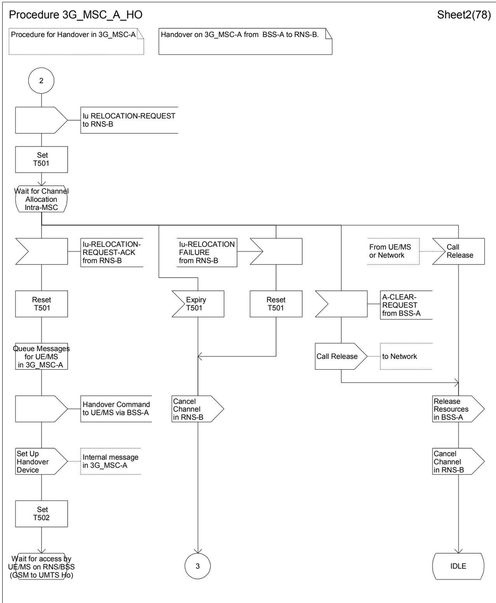

### Procedure 3G\_MSC\_A\_HO

Procedure for Handover in 3G\_MSC-A

Handover on 3G\_MSC-A from BSS-A to RNS-B.

Sheet2(78)

```
graph TD; Start((2)) --> IuRR[lu RELOCATION-REQUEST to RNS-B]; IuRR --> SetT501[Set T501]; SetT501 --> WaitIntra[Wait for Channel Allocation Intra-MSC]; WaitIntra --> Success[lu-RELOCATION-REQUEST-ACK from RNS-B]; WaitIntra --> Failure[lu-RELOCATION FAILURE from RNS-B]; WaitIntra --> Release[From UE/MS or Network]; Success --> ResetT501_1[Reset T501]; ResetT501_1 --> Queue[Queue Messages for UE/MS in 3G_MSC-A]; Queue --> Command[Handover Command to UE/MS via BSS-A]; Command --> Setup[Set Up Handover Device]; Setup --> SetT502[Set T502]; SetT502 --> WaitAccess[Wait for access by UE/MS on RNS/BSS (GSM to UMTS Ho)]; Failure --> Expiry[Expiry T501]; Expiry --> CancelRNSB[Cancel Channel in RNS-B]; CancelRNSB --> End3((3)); Failure --> ResetT501_2[Reset T501]; ResetT501_2 --> CallRelease[Call Release]; CallRelease --> ToNetwork[to Network]; ToNetwork --> ReleaseResources[Release Resources in BSS-A]; ReleaseResources --> CancelRNSB_2[Cancel Channel in RNS-B]; CancelRNSB_2 --> Idle([IDLE]);
```

The flowchart illustrates the handover control procedure in 3G\_MSC-A. It begins at connector 2, where an 'lu RELOCATION-REQUEST to RNS-B' is sent. The timer T501 is set, and the system waits for a channel allocation from the Intra-MSC. From this wait state, three outcomes are possible: a successful 'lu-RELOCATION-REQUEST-ACK from RNS-B', a 'lu-RELOCATION FAILURE from RNS-B', or a 'Call Release' initiated 'From UE/MS or Network'. Upon success, T501 is reset, messages are queued for the UE/MS, a 'Handover Command to UE/MS via BSS-A' is sent, the handover device is set up (with an internal message), and T502 is set. The system then waits for access by the UE/MS on the RNS/BSS (GSM to UMTS Ho), leading to connector 3. In case of failure, T501 expires, the channel is cancelled in RNS-B, and the process ends at connector 3. Alternatively, T501 is reset, a 'Call Release' is sent 'to Network', resources are released in BSS-A, the channel is cancelled in RNS-B, and the system reaches an 'IDLE' state.

Flowchart of Procedure 3G\_MSC\_A\_HO showing the handover control process from BSS-A to RNS-B.

Figure 43 (sheet 2 of 78): Handover control procedure in 3G\_MSC-A

![Flowchart of Procedure 3G_MSC_A_HO showing two parallel paths for handover control. The left path starts with 'Wait for access by UE/MS on RNS/BSS (GSM to UMTS Ho)', followed by 'Iu-RELOCATION COMPLETE from RNS-B', 'Connect the Handover Device (Option) [Only if not already connected]', 'Reset T502', 'Release Resources in BSS-A', 'Forward queued messages for UE/MS via RNS-B', and ends with 'Call in Progress on 3G_MSC-A (UTRAN)'. The right path starts with 'Iu-RELOCATION DETECT from RNS-B', followed by 'Connect the Handover Device (Option)', and ends with 'Wait for access by UE/MS on RNS/BSS (GSM to UMTS handover)'.](0eb348bf17d67bf96326e07011d1c1ad_img.jpg)

### Procedure 3G\_MSC\_A\_HO

Sheet3(78)

Procedure for Handover in 3G\_MSC-A

```
graph TD; Start1[Wait for access by UE/MS on RNS/BSS (GSM to UMTS Ho)] --> Join1(( )); Start2[Iu-RELOCATION DETECT from RNS-B] --> Join1; Join1 --> Join2(( )); Start3[Iu-RELOCATION COMPLETE from RNS-B] --> Join2; Join2 --> Option1[Connect the Handover Device (Option)]; Option1 -.-> Note1[Only if not already connected]; Option1 --> Reset[Reset T502]; Reset --> Release[Release Resources in BSS-A]; Release --> Forward[Forward queued messages for UE/MS via RNS-B]; Forward --> End1[Call in Progress on 3G_MSC-A (UTRAN)]; Option1 --> Option2[Connect the Handover Device (Option)]; Option2 --> End2[Wait for access by UE/MS on RNS/BSS (GSM to UMTS handover)];
```

Flowchart of Procedure 3G\_MSC\_A\_HO showing two parallel paths for handover control. The left path starts with 'Wait for access by UE/MS on RNS/BSS (GSM to UMTS Ho)', followed by 'Iu-RELOCATION COMPLETE from RNS-B', 'Connect the Handover Device (Option) [Only if not already connected]', 'Reset T502', 'Release Resources in BSS-A', 'Forward queued messages for UE/MS via RNS-B', and ends with 'Call in Progress on 3G\_MSC-A (UTRAN)'. The right path starts with 'Iu-RELOCATION DETECT from RNS-B', followed by 'Connect the Handover Device (Option)', and ends with 'Wait for access by UE/MS on RNS/BSS (GSM to UMTS handover)'.

Figure 43 (sheet 3 of 78): Handover control procedure in 3G\_MSC-A

![Flowchart of Procedure 3G_MSC_A_HO for handover control. The process starts with 'Wait for Access by UE/MS On RNS/BSS (GSM to UMTS Ho)'. It branches into four main paths: 1) Success: 'A-HANDOVER-FAILURE from BSS-A' -> 'Reset T502' -> 'Forward queued messages for UE/MS via BSS-A' -> 'Release Resources in RNS-B' -> 'Release Handover Device' -> 'Call in Progress on 3G_MSC-A (GSM)'. 2) Failure: 'A-CLEAR-REQUEST from BSS-A' -> '(Allowed once in this state)' -> 'Iu-RELEASE REQUEST from RNS-B' -> '(Allowed once in this state)' -> 'Release Resources in RNS-B' -> 'Wait for access by UE/MS on RNS/BSS (GSM to UMTS Ho)'. 3) Expiry: 'Expiry T502' -> 'Release Resources in BSS-A' -> 'Release Resources in RNS-B' -> 'Call Release to Network' -> 'Release Handover Device' -> 'IDLE'. 4) Network Request: 'Call Release From Network' -> 'Release Handover Device' -> 'Wait for access by UE/MS on RNS/BSS (GSM to UMTS Ho)'. A decision 'Wait for UE/MS on BSS-B?' is present, with 'Yes' leading to 'Release Resources in RNS-B' and 'No' leading to 'Reset T502'.](febb6833677d1ca3a5550901b7673b63_img.jpg)

### Procedure 3G\_MSC\_A\_HO

Procedure for Handover in 3G\_MSC-A

Sheet4(78)

```
graph TD; Start([Wait for Access by UE/MS On RNS/BSS (GSM to UMTS Ho)]) --> A_HF[A-HANDOVER-FAILURE from BSS-A]; Start --> A_CR[A-CLEAR-REQUEST from BSS-A]; Start --> E_T502[Expiry T502]; Start --> CR[Call Release]; CR --- FromNetwork[From Network]; A_HF --> ResetT502_1[Reset T502]; ResetT502_1 --> FQM[Forward queued messages for UE/MS via BSS-A]; FQM --> RR_RNSB_1[Release Resources in RNS-B]; RR_RNSB_1 --> RH_D_1[Release Handover Device]; RH_D_1 --> CIP[Call in Progress on 3G_MSC-A (GSM)]; A_CR --> A_O[Allowed once in this state]; A_O --> Iu_RR[Iu-RELEASE REQUEST from RNS-B]; Iu_RR --> A_O_2[Allowed once in this state]; A_O_2 --> RR_RNSB_2[Release Resources in RNS-B]; RR_RNSB_2 --> WUA[Wait for access by UE/MS on RNS/BSS (GSM to UMTS Ho)]; E_T502 --> RR_BSSA[Release Resources in BSS-A]; RR_BSSA --> RR_RNSB_3[Release Resources in RNS-B]; RR_RNSB_3 --> WUMB[Wait for UE/MS on BSS-B?]; WUMB -- Yes --> RR_RNSB_2; WUMB -- No --> ResetT502_2[Reset T502]; ResetT502_2 --> RR_RNSB_3; RR_RNSB_3 --> CR_Net[Call Release]; CR_Net --- toNetwork[to Network]; CR_Net --> RH_D_2[Release Handover Device]; RH_D_2 --> IDLE([IDLE]); CR --- FromNetwork --> RH_D_3[Release Handover Device]; RH_D_3 --> WUA_2[Wait for access by UE/MS on RNS/BSS (GSM to UMTS Ho)];
```

Flowchart of Procedure 3G\_MSC\_A\_HO for handover control. The process starts with 'Wait for Access by UE/MS On RNS/BSS (GSM to UMTS Ho)'. It branches into four main paths: 1) Success: 'A-HANDOVER-FAILURE from BSS-A' -> 'Reset T502' -> 'Forward queued messages for UE/MS via BSS-A' -> 'Release Resources in RNS-B' -> 'Release Handover Device' -> 'Call in Progress on 3G\_MSC-A (GSM)'. 2) Failure: 'A-CLEAR-REQUEST from BSS-A' -> '(Allowed once in this state)' -> 'Iu-RELEASE REQUEST from RNS-B' -> '(Allowed once in this state)' -> 'Release Resources in RNS-B' -> 'Wait for access by UE/MS on RNS/BSS (GSM to UMTS Ho)'. 3) Expiry: 'Expiry T502' -> 'Release Resources in BSS-A' -> 'Release Resources in RNS-B' -> 'Call Release to Network' -> 'Release Handover Device' -> 'IDLE'. 4) Network Request: 'Call Release From Network' -> 'Release Handover Device' -> 'Wait for access by UE/MS on RNS/BSS (GSM to UMTS Ho)'. A decision 'Wait for UE/MS on BSS-B?' is present, with 'Yes' leading to 'Release Resources in RNS-B' and 'No' leading to 'Reset T502'.

Figure 43 (sheet 4 of 78): Handover control procedure in 3G\_MSC-A

![Flowchart for Handover control procedure in 3G_MSC-A. It starts at connector 10, checks if the MSC is known. If not, it checks if handover is allowed to the cell. If allowed, it checks which MSC (MSC-B or 3G_MSC-A). If 3G_MSC-A, it checks if the BSS is known. If not known, it checks if resources are available on BSS-B. If available, it proceeds to connector 13. If not, it goes to a failure message and then to connector 12. If the MSC was known at the start, it also goes to connector 12. If MSC-B is selected, it goes to connector 14.](6d54943c64ae4af089cb9e98a78d0af7_img.jpg)

### Procedure 3G\_MSC\_A\_HO

Sheet5(78)

Procedure for Handover in 3G\_MSC-A

```
graph TD; 10((10)) --> K{Known MSC?}; K -- Yes --> J1(( )); K -- No --> H{Handover allowed to Cell?}; H -- No --> J1; H -- Yes --> W{Which MSC?}; W -- MSC-B --> 14((14)); W -- 3G_MSC-A --> KB{Known BSS?}; KB -- No --> J1; KB -- Yes --> R{Resources on BSS-B?}; R -- No --> F[lu-RELOCATION PREPARATION FAILURE to RNS-A]; F --> 12((12)); R -- Yes --> 13((13)); J1 --> C[Call in Progress on 3G_MSC-A (UTRAN)];
```

Flowchart for Handover control procedure in 3G\_MSC-A. It starts at connector 10, checks if the MSC is known. If not, it checks if handover is allowed to the cell. If allowed, it checks which MSC (MSC-B or 3G\_MSC-A). If 3G\_MSC-A, it checks if the BSS is known. If not known, it checks if resources are available on BSS-B. If available, it proceeds to connector 13. If not, it goes to a failure message and then to connector 12. If the MSC was known at the start, it also goes to connector 12. If MSC-B is selected, it goes to connector 14.

Figure 43 (sheet 5 of 78): Handover control procedure in 3G\_MSC-A

![Flowchart of Procedure 3G_MSC_A_HO showing the handover process from RNS-A to BSS-B via 3G_MSC-A. The process starts at connector 13, sends an A-HANDOVER-REQUEST to BSS-B, sets timer T301, and waits for channel allocation. It then branches based on responses: success leads to resetting T301, queuing messages, sending a handover command to the UE/MS, setting timer T302, and waiting for access; failure or release requests lead to resetting T301, releasing resources, canceling channels, and returning to an IDLE state at connector 12.](1fd763be1b7a05b52e554f0583617642_img.jpg)

### Procedure 3G\_MSC\_A\_HO

Procedure for Handover in 3G\_MSC-A

Handover on 3G\_MSC-A from RNS-A to BSS-B.

Sheet6(78)

```
graph TD; 13((13)) --> A[ ]; A --> B[A-HANDOVER-REQUEST to BSS-B]; B --> C[Set T301]; C --> D[Wait for Channel Allocation Intra-MSC]; D --> E[ ]; E --> F[A-HANDOVER-REQUEST-ACK from BSS-B]; E --> G[A-HANDOVER-FAILURE from BSS-B]; E --> H[From UE/MS or Network]; E --> I[ ]; F --> J[Reset T301]; J --> K[Queue Messages for UE/MS in 3G_MSC-A]; K --> L[ ]; L --> M[Handover Command to UE/MS via Iu-RELOCATION Command to RNS-A]; M --> N[Set Up Handover Device]; N --> O[Internal message in 3G_MSC-A]; O --> P[Set T302]; P --> Q[Wait for access by UE/MS on BSS/RNS (UMTS to GSM Ho)]; Q --> 12((12)); G --> R[ ]; R --> S[Expiry T301]; S --> T[Cancel Channel in BSS-B]; T --> 12; G --> U[Reset T301]; U --> V[ ]; V --> W[Call Release]; W --> X[to Network]; X --> Y[ ]; Y --> Z[Release Resources in RNS-A]; Z --> AA[Cancel Channel in BSS-B]; AA --> AB[ ]; AB --> AC[IDLE]; AC --> 12; H --> AD[Call Release]; AD --> Y;
```

Flowchart of Procedure 3G\_MSC\_A\_HO showing the handover process from RNS-A to BSS-B via 3G\_MSC-A. The process starts at connector 13, sends an A-HANDOVER-REQUEST to BSS-B, sets timer T301, and waits for channel allocation. It then branches based on responses: success leads to resetting T301, queuing messages, sending a handover command to the UE/MS, setting timer T302, and waiting for access; failure or release requests lead to resetting T301, releasing resources, canceling channels, and returning to an IDLE state at connector 12.

Figure 43 (sheet 6 of 78): Handover control procedure in 3G\_MSC-A

![Flowchart of Procedure 3G_MSC_A_HO for handover control. It starts with 'Wait for access by UE/MS on BSS/RNS (UMTS to GSM handover)'. From here, two paths emerge: 1) 'A-HANDOVER-COMPLETE from BSS-B' leads to 'Connect the Handover Device (Option)' (with a note 'Only if not already connected'), then 'Reset T302', 'Release Resources in RNS-A', 'Forward queued messages for UE/MS via BSS-B', and finally 'Call in Progress on 3G_MSC-A (GSM)'. 2) 'A-HANDOVER-DETECT from BSS-B' leads to another 'Connect the Handover Device (Option)', which then leads to 'Wait for access by UE/MS on BSS/RNS (UMTS to GSM Ho)'.](c36c9f3fd6dfe6c3116a5b86b6ab0877_img.jpg)

### Procedure 3G\_MSC\_A\_HO

Sheet7(78)

Procedure for Handover in 3G\_MSC-A

```
graph TD; Start([Wait for access by UE/MS on BSS/RNS (UMTS to GSM handover)]) --> AHC[A-HANDOVER-COMPLETE from BSS-B]; Start --> AHD[A-HANDOVER-DETECT from BSS-B]; AHC --> CHD1[Connect the Handover Device (Option)]; CHD1 --> Note1[Only if not already connected]; CHD1 --> Reset[Reset T302]; Reset --> Release[Release Resources in RNS-A]; Release --> Forward[Forward queued messages for UE/MS via BSS-B]; Forward --> CallProg([Call in Progress on 3G_MSC-A (GSM)]); AHD --> CHD2[Connect the Handover Device (Option)]; CHD2 --> WaitHo([Wait for access by UE/MS on BSS/RNS (UMTS to GSM Ho))];
```

Flowchart of Procedure 3G\_MSC\_A\_HO for handover control. It starts with 'Wait for access by UE/MS on BSS/RNS (UMTS to GSM handover)'. From here, two paths emerge: 1) 'A-HANDOVER-COMPLETE from BSS-B' leads to 'Connect the Handover Device (Option)' (with a note 'Only if not already connected'), then 'Reset T302', 'Release Resources in RNS-A', 'Forward queued messages for UE/MS via BSS-B', and finally 'Call in Progress on 3G\_MSC-A (GSM)'. 2) 'A-HANDOVER-DETECT from BSS-B' leads to another 'Connect the Handover Device (Option)', which then leads to 'Wait for access by UE/MS on BSS/RNS (UMTS to GSM Ho)'.

Figure 43 (sheet 7 of 78): Handover control procedure in 3G\_MSC-A

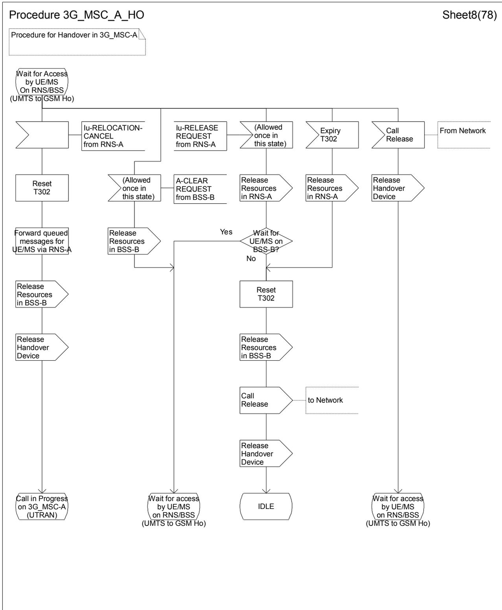

### Procedure 3G\_MSC\_A\_HO

Sheet8(78)

Procedure for Handover in 3G\_MSC-A

```

    graph TD
    Start([Wait for Access by UE/MS On RNS/BSS  
UMTS to GSM Ho])
    
    %% Path 1
    Start --> In1{Iu-RELOCATION-  
CANCEL  
from RNS-A}
    In1 --> P1_1[Reset  
T302]
    P1_1 --> P1_2[Forward queued  
messages for  
UE/MS via RNS-A]
    P1_2 --> P1_3[Release  
Resources  
in BSS-B]
    P1_3 --> P1_4[Release  
Handover  
Device]
    P1_4 --> End1([Call in Progress  
on 3G_MSC-A  
UTRAN])

    %% Path 2
    Start --> In2{Iu-RELEASE  
REQUEST  
from RNS-A}
    In2 --> P2_1{{Allowed  
once in  
this state}}
    P2_1 --> P2_2{A-CLEAR  
REQUEST  
from BSS-B}
    P2_2 --> P2_3{{Allowed  
once in  
this state}}
    P2_3 --> P2_4[Release  
Resources  
in BSS-B]
    P2_4 --> End2([Wait for access  
by UE/MS  
on RNS/BSS  
UMTS to GSM Ho])

    %% Path 3
    Start --> In3{{Allowed  
once in  
this state}}
    In3 --> P3_1[Release  
Resources  
in RNS-A]
    P3_1 --> P3_2{Wait for  
UE/MS on  
BSS-B?}
    P3_2 -- Yes --> End2
    P3_2 -- No --> P3_3[Reset  
T302]
    P3_3 --> P3_4[Release  
Resources  
in BSS-B]
    P3_4 --> P3_5{Call  
Release} --> P3_5_Note[to Network]
    P3_5 --> P3_6[Release  
Handover  
Device]
    P3_6 --> End3([IDLE])

    %% Path 4
    Start --> In4{Expiry  
T302}
    In4 --> P4_1[Release  
Resources  
in RNS-A]
    P4_1 --> End4([Wait for access  
by UE/MS  
on RNS/BSS  
UMTS to GSM Ho])

    %% Path 5
    Start --> In5{Call  
Release} --> In5_Note[From Network]
    In5 --> P5_1[Release  
Handover  
Device]
    P5_1 --> End4
  
```

Flowchart of Procedure 3G\_MSC\_A\_HO for handover control in 3G\_MSC-A.

Figure 43 (sheet 8 of 78): Handover control procedure in 3G\_MSC-A

![Flowchart for Handover control procedure in 3G_MSC-A. It starts at connector 11, checks if 3G_MSC is known. If no, it goes to connector 16. If yes, it asks which 3G_MSC (A or B). For 3G_MSC-A, it checks if RNS is known and if resources on RNS-B are available. If both yes, it goes to connector 15. If no at either check, it goes to connector 16. For 3G_MSC-B, it goes directly to connector 17. A failure message 'Iu-RELOCATION PREPARATION FAILURE to RNS-A' is shown before the final state 'Call in Progress on 3G_MSC-A (UTRAN)'.](dfd09f348b50c9255f3cfe67985db9bc_img.jpg)

### Procedure 3G\_MSC\_A\_HO

Sheet9(78)

Procedure for Handover in 3G\_MSC-A

```
graph TD; 11((11)) --> K1{Known 3G_MSC?}; K1 -- No --> 16((16)); K1 -- Yes --> W{Which 3G_MSC?}; W -- 3G_MSC-B --> 17((17)); W -- 3G_MSC-A --> K2{Known RNS?}; K2 -- No --> 16; K2 -- Yes --> R{Resources on RNS-B?}; R -- No --> 16; R -- Yes --> 15((15)); R -- Yes --> F[ ] --> F_text[Iu-RELOCATION PREPARATION FAILURE to RNS-A]; F_text --> C[Call in Progress on 3G_MSC-A (UTRAN)]; C --> 16;
```

Flowchart for Handover control procedure in 3G\_MSC-A. It starts at connector 11, checks if 3G\_MSC is known. If no, it goes to connector 16. If yes, it asks which 3G\_MSC (A or B). For 3G\_MSC-A, it checks if RNS is known and if resources on RNS-B are available. If both yes, it goes to connector 15. If no at either check, it goes to connector 16. For 3G\_MSC-B, it goes directly to connector 17. A failure message 'Iu-RELOCATION PREPARATION FAILURE to RNS-A' is shown before the final state 'Call in Progress on 3G\_MSC-A (UTRAN)'.

Figure 43 (sheet 9 of 78): Handover control procedure in 3G\_MSC-A

![Flowchart of Procedure 3G_MSC_A_HO. It starts at connector 15, sends an Iu-RELOCATION-REQUEST to RNS-B, sets timer T701, and waits for channel allocation. It then branches based on responses: success leads to resetting T701, queuing messages, sending a command to RNS-A, setting up the device, setting timer T702, and waiting for access (ending at connector 16); failure leads to resetting T701 and canceling the channel in RNS-B (ending at connector 16); a release request from RNS-A leads to a call release to the network and returning to IDLE.](e3e8a926bfe6337a654ecac063ba3682_img.jpg)

### Procedure 3G\_MSC\_A\_HO

Sheet10(78)

Procedure for Handover in 3G\_MSC-A

SRNS Relocation on 3G\_MSC-A from RNS-A to RNS-B

```
graph TD; 15((15)) --> IuR[lu-RELOCATION-REQUEST to RNS-B]; IuR --> T701Set[Set T701]; T701Set --> WaitAlloc[Wait for Channel Allocation Intra-3G_MSC]; WaitAlloc --> IuRA[lu-RELOCATION-REQUEST-ACK from RNS-B]; IuRA --> T701Reset[Reset T701]; T701Reset --> QueueMsg[Queue Messages for UE in 3G_MSC-A]; QueueMsg --> IuC[lu-RELOCATION Command to RNS-A]; IuC --> Setup[Set Up Handover Device]; Setup --> T702Set[Set T702]; T702Set --> WaitAccess[Wait for access by UE on RNS (SRNS Relocation)]; WaitAccess --> 16((16)); WaitAlloc --> IuRF[lu-RELOCATION FAILURE from RNS-B]; IuRF --> T701Exp[Expiry T701]; T701Exp --> CancelCh[Cancel Channel in RNS-B]; CancelCh --> 16; WaitAlloc --> IuRelReq[lu-RELEASE-REQUEST from RNS-A]; IuRelReq --> CallRel[Call Release]; CallRel --> ToNet[to Network]; ToNet --> ReleaseRes[Release Resources in RNS-A]; ReleaseRes --> CancelChB[Cancel Channel in RNS-B]; CancelChB --> IDLE([IDLE]);
```

Flowchart of Procedure 3G\_MSC\_A\_HO. It starts at connector 15, sends an Iu-RELOCATION-REQUEST to RNS-B, sets timer T701, and waits for channel allocation. It then branches based on responses: success leads to resetting T701, queuing messages, sending a command to RNS-A, setting up the device, setting timer T702, and waiting for access (ending at connector 16); failure leads to resetting T701 and canceling the channel in RNS-B (ending at connector 16); a release request from RNS-A leads to a call release to the network and returning to IDLE.

Figure 43 (sheet 10 of 78): Handover control procedure in 3G\_MSC-A

![Flowchart of Procedure 3G_MSC_A_HO for handover control. The process starts with 'Wait for access by UE on RNS (SRNS RELOCATION)'. It then branches into two paths: one for 'Iu-RELOCATION-COMPLETE from RNS-B' and another for 'Iu-RELOCATION-DETECT from RNS-B'. Both paths lead to 'Connect the Handover Device (Option)'. The left path continues with 'Reset T702', 'Release Resources in RNS-A', 'Forward queued messages for UE via RNS-B', and ends at 'Call in Progress on 3G_MSC-A (UTRAN)'. The right path ends at 'Wait for access by UE on RNS (SRNS Relocation)'. A note 'Only if not already connected' is associated with the 'Connect the Handover Device (Option)' block in the left path.](dbe8bef1723acb3e03e8616be4faf939_img.jpg)

### Procedure 3G\_MSC\_A\_HO

Sheet11(78)

Procedure for Handover in 3G\_MSC-A

```
graph TD; Start([Wait for access by UE on RNS (SRNS RELOCATION)]) --> Join(( )); Join --> Complete[Iu-RELOCATION-COMPLETE from RNS-B]; Complete --> ConnectLeft{{Connect the Handover Device (Option)}}; Note[Only if not already connected] -.-> ConnectLeft; ConnectLeft --> Reset[Reset T702]; Reset --> Release[Release Resources in RNS-A]; Release --> Forward[Forward queued messages for UE via RNS-B]; Forward --> EndLeft([Call in Progress on 3G_MSC-A (UTRAN)]); Join --> Detect[Iu-RELOCATION-DETECT from RNS-B]; Detect --> ConnectRight{{Connect the Handover Device (Option)}}; ConnectRight --> EndRight([Wait for access by UE on RNS (SRNS Relocation))]);
```

Flowchart of Procedure 3G\_MSC\_A\_HO for handover control. The process starts with 'Wait for access by UE on RNS (SRNS RELOCATION)'. It then branches into two paths: one for 'Iu-RELOCATION-COMPLETE from RNS-B' and another for 'Iu-RELOCATION-DETECT from RNS-B'. Both paths lead to 'Connect the Handover Device (Option)'. The left path continues with 'Reset T702', 'Release Resources in RNS-A', 'Forward queued messages for UE via RNS-B', and ends at 'Call in Progress on 3G\_MSC-A (UTRAN)'. The right path ends at 'Wait for access by UE on RNS (SRNS Relocation)'. A note 'Only if not already connected' is associated with the 'Connect the Handover Device (Option)' block in the left path.

Figure 43 (sheet 11 of 78): Handover control procedure in 3G\_MSC-A

![Flowchart of Procedure 3G_MSC_A_HO for handover control. The process starts with 'Wait for Access (by UE On RNS) (SRNS Relocation)'. It branches into four main paths: 1) 'lu-RELOCATION-CANCEL from RNS-A' leads to 'Reset T702' -> 'Forward queued messages for UE via RNS-A' -> 'Release Resources in RNS-B' -> 'Release Handover Device' -> 'Call in Progress on 3G_MSC-A (UTRAN)'. 2) 'lu-RELEASE REQUEST from RNS-A' leads to a decision '(Allowed once in this state)'. If 'Yes', it leads to 'Release Resources in RNS-A' -> 'Wait for UE on RNS-B?'. If 'No', it leads to 'Reset T702' -> 'Release Resources in RNS-B' -> 'Call Release' (to Network) -> 'Release Handover Device' -> 'IDLE'. 3) 'Expiry T702' leads to 'Release Resources in RNS-A' -> 'Wait for UE on RNS-B?'. 4) 'Call Release' (From Network) leads to 'Release Handover Device' -> 'Wait for access (by UE on RNS) (SRNS Relocation)'. The decision '(Allowed once in this state)' from the second path also leads to 'lu-RELEASE REQUEST from RNS-B' -> 'Release Resources in RNS-B' -> 'Wait for UE on RNS-B?'. The decision 'Wait for UE on RNS-B?' has a 'Yes' path leading to 'Wait for access (by UE on RNS) (SRNS Relocation)' and a 'No' path leading to 'Reset T702' -> 'Release Resources in RNS-B' -> 'Call Release' (to Network) -> 'Release Handover Device' -> 'IDLE'.](b0f7b7a99fad9dffaf1b3dc5e4d01c86_img.jpg)

### Procedure 3G\_MSC\_A\_HO

Sheet12(78)

Procedure for Handover in 3G\_MSC-A

```
graph TD; Start([Wait for Access (by UE On RNS) (SRNS Relocation)]) --> luRC[lu-RELOCATION-CANCEL from RNS-A]; Start --> luRR[lu-RELEASE REQUEST from RNS-A]; Start --> T702[Expiry T702]; Start --> CR[Call Release]; luRC --> ResetA[Reset T702]; ResetA --> FQM[Forward queued messages for UE via RNS-A]; FQM --> RR_B1[Release Resources in RNS-B]; RR_B1 --> RHD1[Release Handover Device]; RHD1 --> CIP[Call in Progress on 3G_MSC-A (UTRAN)]; luRR --> AllowedA{Allowed once in this state}; AllowedA -- Yes --> RR_A1[Release Resources in RNS-A]; AllowedA -- No --> ResetA2[Reset T702]; ResetA2 --> RR_B2[Release Resources in RNS-B]; RR_B2 --> CR_N[Call Release]; CR_N --> RHD2[Release Handover Device]; RHD2 --> IDLE([IDLE]); T702 --> RR_A2[Release Resources in RNS-A]; RR_A2 --> WaitUE{Wait for UE on RNS-B?}; CR --> RHD3[Release Handover Device]; RHD3 --> WaitAccess[Wait for access (by UE on RNS) (SRNS Relocation)]; AllowedA --> luRB[lu-RELEASE REQUEST from RNS-B]; luRB --> RR_B3[Release Resources in RNS-B]; RR_B3 --> WaitUE; WaitUE -- Yes --> WaitAccess; WaitUE -- No --> ResetA3[Reset T702]; ResetA3 --> RR_B4[Release Resources in RNS-B]; RR_B4 --> CR_N2[Call Release]; CR_N2 --> RHD4[Release Handover Device]; RHD4 --> IDLE;
```

Flowchart of Procedure 3G\_MSC\_A\_HO for handover control. The process starts with 'Wait for Access (by UE On RNS) (SRNS Relocation)'. It branches into four main paths: 1) 'lu-RELOCATION-CANCEL from RNS-A' leads to 'Reset T702' -> 'Forward queued messages for UE via RNS-A' -> 'Release Resources in RNS-B' -> 'Release Handover Device' -> 'Call in Progress on 3G\_MSC-A (UTRAN)'. 2) 'lu-RELEASE REQUEST from RNS-A' leads to a decision '(Allowed once in this state)'. If 'Yes', it leads to 'Release Resources in RNS-A' -> 'Wait for UE on RNS-B?'. If 'No', it leads to 'Reset T702' -> 'Release Resources in RNS-B' -> 'Call Release' (to Network) -> 'Release Handover Device' -> 'IDLE'. 3) 'Expiry T702' leads to 'Release Resources in RNS-A' -> 'Wait for UE on RNS-B?'. 4) 'Call Release' (From Network) leads to 'Release Handover Device' -> 'Wait for access (by UE on RNS) (SRNS Relocation)'. The decision '(Allowed once in this state)' from the second path also leads to 'lu-RELEASE REQUEST from RNS-B' -> 'Release Resources in RNS-B' -> 'Wait for UE on RNS-B?'. The decision 'Wait for UE on RNS-B?' has a 'Yes' path leading to 'Wait for access (by UE on RNS) (SRNS Relocation)' and a 'No' path leading to 'Reset T702' -> 'Release Resources in RNS-B' -> 'Call Release' (to Network) -> 'Release Handover Device' -> 'IDLE'.

Figure 43 (sheet 12 of 78): Handover control procedure in 3G\_MSC-A

![Flowchart of Procedure 3G_MSC_A_HO. It starts at connector 4, sends a MAP-PREPARE-HANDOVER req. [A-HO-REQUEST] to 3G_MSC-B, and waits for an acknowledgement. A decision diamond 'Handover Number?' follows. If 'Not Requested', it goes to connector 7. If 'Requested', it sends an L_CONNECT (IAM) to 3G_MSC-B and waits for a connection. Three parallel response paths from 3G_MSC-B are shown: 'MAP-PREPARE-HANDOVER resp. [A-HO-REQUEST-ACK]', 'MAP-PREPARE-HANDOVER resp. [A-HO-FAILURE]', and 'MAP-PREPARE-HANDOVER resp. [MAP ERROR]'. The first two lead to connector 3, while the third leads to connector 7.](0f666d2ebbad7fab84c7c4fb531ea932_img.jpg)

### Procedure 3G\_MSC\_A\_HO

Sheet13(78)

Procedure for Handover in 3G\_MSC-A

Basic GSM to UMTS handover to 3G\_MSC-B Circuit Connection required

```
graph TD; Start((4)) --> SendReq[MAP-PREPARE-HANDOVER req. [A-HO-REQUEST] to 3G_MSC-B]; SendReq --> WaitAck[Wait For Acknowledgement from 3G_MSC-B (GSM to UMTS Ho)]; WaitAck --> Decision{Handover Number?}; Decision -- Not Requested --> End7((7)); Decision -- Requested --> SendIAM[L_CONNECT (IAM) to 3G_MSC-B using Handover Number]; SendIAM --> WaitConn[Wait for Connection from 3G_MSC-B (GSM to UMTS Ho)]; WaitConn --> End3((3)); Resp1[MAP-PREPARE-HANDOVER resp. [A-HO-REQUEST-ACK] from 3G_MSC-B] --> End3; Resp2[MAP-PREPARE-HANDOVER resp. [A-HO-FAILURE] from 3G_MSC-B] --> End3; Resp3[MAP-PREPARE-HANDOVER resp. [MAP ERROR] from 3G_MSC-B] --> End7;
```

Flowchart of Procedure 3G\_MSC\_A\_HO. It starts at connector 4, sends a MAP-PREPARE-HANDOVER req. [A-HO-REQUEST] to 3G\_MSC-B, and waits for an acknowledgement. A decision diamond 'Handover Number?' follows. If 'Not Requested', it goes to connector 7. If 'Requested', it sends an L\_CONNECT (IAM) to 3G\_MSC-B and waits for a connection. Three parallel response paths from 3G\_MSC-B are shown: 'MAP-PREPARE-HANDOVER resp. [A-HO-REQUEST-ACK]', 'MAP-PREPARE-HANDOVER resp. [A-HO-FAILURE]', and 'MAP-PREPARE-HANDOVER resp. [MAP ERROR]'. The first two lead to connector 3, while the third leads to connector 7.

Figure 43 (sheet 13 of 78): Handover control procedure in 3G\_MSC-A

![Flowchart of Procedure 3G_MSC_A_HO for GSM to UMTS Handover. The process starts with 'Wait For Acknowledgement from 3G_MSC-B (GSM to UMTS Ho)'. From here, an 'ERROR from 3G_MSC-B' leads to 'Cancel MAP Resources in 3G_MSC-A' and then to connector '3'. A successful path leads to 'A-CLEAR-REQUEST from BSS-A', which triggers 'Call Release to Network', 'Release Resources in BSS-A', 'Cancel MAP Resources to 3G_MSC-B', and finally 'IDLE'. Another 'Call Release From UE/MS or Network' also leads to 'Release Resources in BSS-A'.](b151ddbeea4f514f5f29ce489350c7f7_img.jpg)

### Procedure 3G\_MSC\_A\_HO

Sheet14(78)

Procedure for Handover in 3G\_MSC-A

```
graph TD; Start([Wait For Acknowledgement from 3G_MSC-B (GSM to UMTS Ho)]) --> ERROR{ERROR}; Start --> A_CLEAR[A-CLEAR-REQUEST from BSS-A]; ERROR -- from 3G_MSC-B --> ERROR; ERROR --> CancelMAP1{Cancel MAP Resources}; CancelMAP1 -- in 3G_MSC-A --> C3((3)); A_CLEAR --> CR1{Call Release}; CR1 -- to Network --> CR1; CR1 --> ReleaseBSS{Release Resources in BSS-A}; CR2{Call Release} -- From UE/MS or Network --> CR2; CR2 --> ReleaseBSS; ReleaseBSS --> CancelMAP2{Cancel MAP Resources}; CancelMAP2 -- to 3G_MSC-B --> IDLE([IDLE]);
```

Flowchart of Procedure 3G\_MSC\_A\_HO for GSM to UMTS Handover. The process starts with 'Wait For Acknowledgement from 3G\_MSC-B (GSM to UMTS Ho)'. From here, an 'ERROR from 3G\_MSC-B' leads to 'Cancel MAP Resources in 3G\_MSC-A' and then to connector '3'. A successful path leads to 'A-CLEAR-REQUEST from BSS-A', which triggers 'Call Release to Network', 'Release Resources in BSS-A', 'Cancel MAP Resources to 3G\_MSC-B', and finally 'IDLE'. Another 'Call Release From UE/MS or Network' also leads to 'Release Resources in BSS-A'.

Figure 43 (sheet 14 of 78): Handover control procedure in 3G\_MSC-A

![Flowchart of Procedure 3G_MSC_A_HO for GSM to UMTS handover. The process starts with 'Wait for Connection from 3G_MSC-B (GSM to UMTS Ho)'. It branches based on incoming messages: 'I_COMPLETE (ACM) from 3G_MSC-B' leads to 'Queue Messages for UE/MS in 3G_MSC-A'; 'A-CLEAR-REQUEST from BSS-A' leads to a decision '(Allowed once in this state)'; 'MAP-PAS req. [A-CLEAR-REQUEST] from 3G_MSC-B' leads to another decision '(Allowed once in this state)'. From the first decision, 'From UE/MS or Network' leads to 'Call Release' and 'to UE/MS and Network' leads to 'Release Resources in BSS-A'. From the second decision, it leads to 'Wait for Connection from 3G_MSC-B (GSM to UMTS Ho)'. Both 'Wait for Connection' paths lead to an 'ERROR' state. From 'ERROR', 'from 3G_MSC-B or Network' leads to 'I_DISCONNECT (REL) to 3G_MSC-B' and 'to 3G_MSC-B in 3G_MSC-A' leads to 'Cancel MAP Procedures'. 'I_DISCONNECT (REL) to 3G_MSC-B' leads to an 'IDLE' state. 'Queue Messages for UE/MS in 3G_MSC-A' leads to 'Handover Command to UE/MS via BSS-A', which leads to 'Set T503', then 'Set Up the Handover Device', which leads to 'Internal message in 3G_MSC-A', and finally 'Wait for Completion (on 3G_MSC-B) (GSM to UMTS Ho)'. A connector '3' is also shown.](d884367c84ba50f250499f79c4b4b950_img.jpg)

### Procedure 3G\_MSC\_A\_HO

Procedure for Handover in 3G\_MSC-A

Sheet15(78)

```
graph TD; Start[Wait for Connection from 3G_MSC-B (GSM to UMTS Ho)] --> I_COMPLETE[I_COMPLETE (ACM) from 3G_MSC-B]; Start --> A_CLEAR[A-CLEAR-REQUEST from BSS-A]; Start --> MAP_PAS[MAP-PAS req. [A-CLEAR-REQUEST] from 3G_MSC-B]; I_COMPLETE --> Queue[Queue Messages for UE/MS in 3G_MSC-A]; A_CLEAR --> Allowed1{(Allowed once in this state)}; Allowed1 --> From_UE[From UE/MS or Network]; Allowed1 --> Call_Release1[Call Release]; Call_Release1 --> To_UE[to UE/MS and Network]; Call_Release1 --> Release[Release Resources in BSS-A]; MAP_PAS --> Allowed2{(Allowed once in this state)}; Allowed2 --> Wait_2[Wait for Connection from 3G_MSC-B (GSM to UMTS Ho)]; Queue --> Command[Handover Command to UE/MS via BSS-A]; Command --> T503[Set T503]; T503 --> Setup[Set Up the Handover Device]; Setup --> Internal[Internal message in 3G_MSC-A]; Internal --> Wait_3[Wait for Completion (on 3G_MSC-B) (GSM to UMTS Ho)]; Wait_2 --> ERROR[ERROR]; ERROR --> From_Net[from 3G_MSC-B or Network]; ERROR --> Disconnect[ I_DISCONNECT (REL) to 3G_MSC-B]; Disconnect --> To_MSC[ to 3G_MSC-B in 3G_MSC-A]; To_MSC --> Cancel[Cancel MAP Procedures]; Cancel --> Idle[IDLE]; Disconnect --> Idle; To_UE --> Release; Release --> Cancel; Release --> Idle; Call_Release1 --> Call_Release2[Call Release]; Call_Release2 --> Idle; Call_Release2 --> Release; Call_Release2 --> Cancel; Call_Release2 --> To_UE; Call_Release2 --> To_MSC; Call_Release2 --> Disconnect; Call_Release2 --> ERROR; Call_Release2 --> Wait_2; Call_Release2 --> Command; Call_Release2 --> T503; Call_Release2 --> Setup; Call_Release2 --> Internal; Call_Release2 --> Wait_3; Call_Release2 --> 3((3));
```

Flowchart of Procedure 3G\_MSC\_A\_HO for GSM to UMTS handover. The process starts with 'Wait for Connection from 3G\_MSC-B (GSM to UMTS Ho)'. It branches based on incoming messages: 'I\_COMPLETE (ACM) from 3G\_MSC-B' leads to 'Queue Messages for UE/MS in 3G\_MSC-A'; 'A-CLEAR-REQUEST from BSS-A' leads to a decision '(Allowed once in this state)'; 'MAP-PAS req. [A-CLEAR-REQUEST] from 3G\_MSC-B' leads to another decision '(Allowed once in this state)'. From the first decision, 'From UE/MS or Network' leads to 'Call Release' and 'to UE/MS and Network' leads to 'Release Resources in BSS-A'. From the second decision, it leads to 'Wait for Connection from 3G\_MSC-B (GSM to UMTS Ho)'. Both 'Wait for Connection' paths lead to an 'ERROR' state. From 'ERROR', 'from 3G\_MSC-B or Network' leads to 'I\_DISCONNECT (REL) to 3G\_MSC-B' and 'to 3G\_MSC-B in 3G\_MSC-A' leads to 'Cancel MAP Procedures'. 'I\_DISCONNECT (REL) to 3G\_MSC-B' leads to an 'IDLE' state. 'Queue Messages for UE/MS in 3G\_MSC-A' leads to 'Handover Command to UE/MS via BSS-A', which leads to 'Set T503', then 'Set Up the Handover Device', which leads to 'Internal message in 3G\_MSC-A', and finally 'Wait for Completion (on 3G\_MSC-B) (GSM to UMTS Ho)'. A connector '3' is also shown.

Figure 43 (sheet 15 of 78): Handover control procedure in 3G\_MSC-A

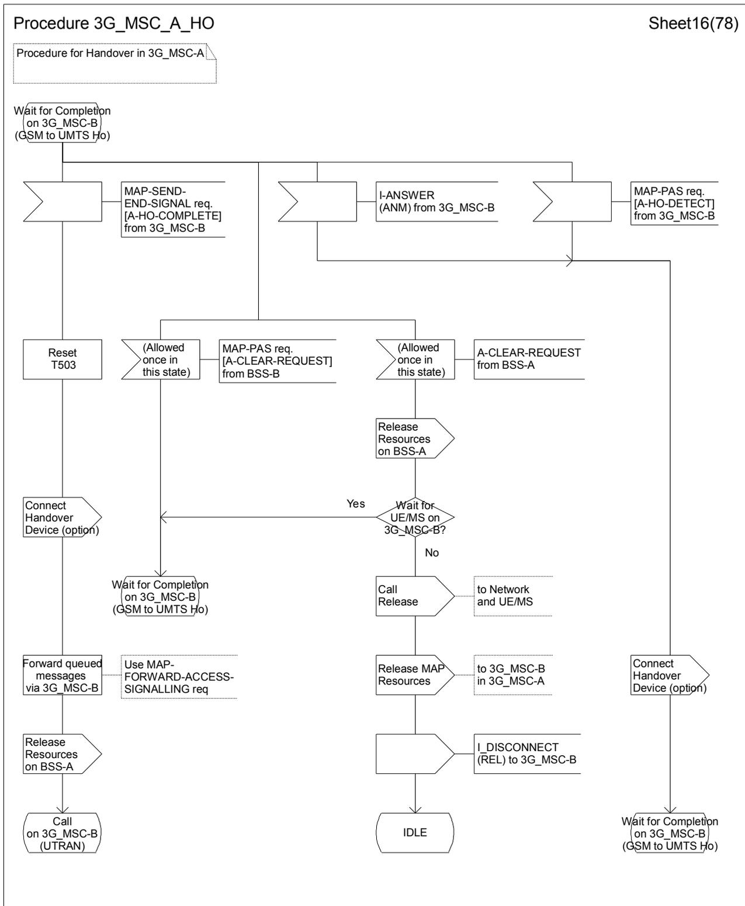

## Procedure 3G\_MSC\_A\_HO

## Sheet16(78)

Procedure for Handover in 3G\_MSC-A

```

  graph TD
      START([Wait for Completion  
on 3G_MSC-B  
GSM to UMTS Ho]) --> INPUTS{ }
      
      INPUTS --> IN1[/MAP-SEND-  
END-SIGNAL req.  
A-HO-COMPLETE  
from 3G_MSC-B/]
      INPUTS --> IN2[/I-ANSWER  
ANM from 3G_MSC-B/]
      INPUTS --> IN3[/MAP-PAS req.  
A-HO-DETECT  
from 3G_MSC-B/]

      IN1 --> RESET[Reset  
T503]
      RESET --> CONN1{{Connect  
Handover  
Device option}}
      
      IN2 --> ALLOWED1{Allowed  
once in  
this state}
      ALLOWED1 -- Yes --> MAP_PAS_CLR[/MAP-PAS req.  
A-CLEAR-REQUEST  
from BSS-B/]
      MAP_PAS_CLR --> WAIT_STATE([Wait for Completion  
on 3G_MSC-B  
GSM to UMTS Ho])
      
      ALLOWED1 -- No --> CLR_REQ[/A-CLEAR-REQUEST  
from BSS-A/]
      CLR_REQ --> REL_BSS{{Release  
Resources  
on BSS-A}}
      REL_BSS --> WAIT_UE{Wait for  
UE/MS on  
3G_MSC-B?}
      
      WAIT_UE -- Yes --> CONN1
      WAIT_UE -- No --> CALL_REL[Call  
Release] 
      CALL_REL -.-> TO_NET[to Network  
and UE/MS]
      CALL_REL --> REL_MAP{{Release MAP  
Resources}}
      REL_MAP -.-> TO_MSC_B[to 3G_MSC-B  
in 3G_MSC-A]
      REL_MAP --> DISCONN[/I_DISCONNECT  
REL to 3G_MSC-B/]
      DISCONN --> IDLE([IDLE])

      IN3 --> CONN2{{Connect  
Handover  
Device option}}
      CONN2 --> WAIT_STATE2([Wait for Completion  
on 3G_MSC-B  
GSM to UMTS Ho])

      CONN1 --> FWD[Forward queued  
messages  
via 3G_MSC-B]
      FWD -.-> USE_MAP[Use MAP-  
FORWARD-ACCESS-  
SIGNALLING req]
      FWD --> REL_BSS2{{Release  
Resources  
on BSS-A}}
      REL_BSS2 --> CALL_UTRAN([Call  
on 3G_MSC-B  
UTRAN])
  
```

SDL Flowchart for Procedure 3G\_MSC\_A\_HO showing the logic for GSM to UMTS handover completion in the anchor MSC.

**Figure 43 (sheet 16 of 78): Handover control procedure in 3G\_MSC-A**


Procedure 3G\_MSC\_A\_HO Sheet17(78)

Procedure for Handover in 3G\_MSC-A

```

stateDiagram-v2
    state "Wait for Completion\non 3G_MSC-B\n(GSM to UMTS Ho)" as WaitComp
    state "Call in Progress\non 3G_MSC-A\n(GSM)" as CallInProgress
    state "IDLE" as IDLE

    [*] --> WaitComp

    WaitComp --> A_HO_FAIL : A-HANDOVER-FAILURE from BSS-A
    A_HO_FAIL --> ResetT503 : Reset T503
    ResetT503 --> FwdQueued : Forward queued messages for UE/MS via BSS-A
    FwdQueued --> RelHO_1 : Release Handover Device
    RelHO_1 --> CancelMAP_1 : Cancel MAP Procedures
    CancelMAP_1 --> CallInProgress

    WaitComp --> I_DISC_B : I_DISCONNECT (REL) from 3G_MSC-B
    I_DISC_B --> CancelMAP_2 : Cancel MAP Procedures
    CancelMAP_2 --> RelHO_2 : Release Handover Device
    RelHO_2 --> I_DISC_TO_B_1 : I_DISCONNECT (REL) to 3G_MSC-B
    I_DISC_TO_B_1 --> WaitComp

    WaitComp --> ExpT503 : Expiry T503
    ExpT503 --> CancelMAP_3 : Cancel MAP Procedures
    CancelMAP_3 --> RelHO_3 : Release Handover Device
    RelHO_3 --> RelRes_BSS : Release Resources BSS-A
    RelRes_BSS --> IDLE

    WaitComp --> CallRel : Call Release from Network
    CallRel --> RelHO_4 : Release Handover Device
    RelHO_4 --> WaitComp

    %% Internal/Side actions
    ResetT503 --> CancelMAP_Side : Cancel MAP Procedures
    CancelMAP_Side --> RelHO_Side : Release Handover Device
    RelHO_Side --> I_DISC_TO_B_Side : I_DISCONNECT (REL) to 3G_MSC-B

    ExpT503 --> I_DISC_TO_B_Side2 : I_DISCONNECT (REL) to 3G_MSC-B
  
```

SDL diagram for Procedure 3G\_MSC\_A\_HO showing handover control logic in 3G\_MSC-A. The flow starts from 'Wait for Completion on 3G\_MSC-B (GSM to UMTS Ho)' and handles various failure and release scenarios leading to either 'Call in Progress', a return to 'Wait for Completion', or 'IDLE'.

**Figure 43 (sheet 17 of 78): Handover control procedure in 3G\_MSC-A**

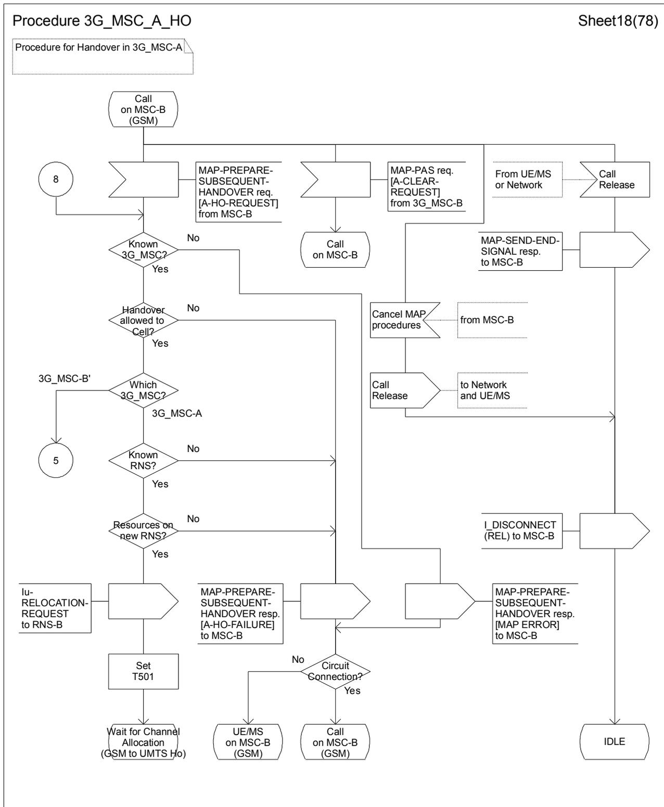

**Procedure 3G\_MSC\_A\_HO** Sheet18(78)

Procedure for Handover in 3G\_MSC-A

```

  graph TD
      Start([Call on MSC-B (GSM)]) --> Conn8((8))
      Conn8 --> In1[/MAP-PREPARE-SUBSEQUENT-HANDOVER req. [A-HO-REQUEST] from MSC-B/]
      In1 --> Dec1{Known 3G_MSC?}
      
      Dec1 -- No --> Out1[/MAP-SEND-END-SIGNAL resp. to MSC-B/]
      Dec1 -- Yes --> Dec2{Handover allowed to Cell?}
      
      Dec2 -- No --> Proc1[Cancel MAP procedures]
      Proc1 --> Proc2[Call Release]
      Proc2 --> Out2[/to Network and UE/MS/]
      
      Dec2 -- Yes --> Dec3{Which 3G_MSC?}
      Dec3 -- 3G_MSC-B' --> Conn5((5))
      Dec3 -- 3G_MSC-A --> Dec4{Known RNS?}
      
      Dec4 -- No --> Out3[/MAP-PREPARE-SUBSEQUENT-HANDOVER resp. [A-HO-FAILURE] to MSC-B/]
      Dec4 -- Yes --> Dec5{Resources on new RNS?}
      
      Dec5 -- No --> Out3
      Dec5 -- Yes --> Proc3[Iu-RELOCATION-REQUEST to RNS-B]
      
      Proc3 --> Proc4[Set T501]
      Proc4 --> Proc5[Wait for Channel Allocation (GSM to UMTS Ho)]
      
      Proc5 --> State1([UE/MS on MSC-B (GSM)])
      Proc5 --> Dec6{Circuit Connection?}
      
      Dec6 -- No --> Out3
      Dec6 -- Yes --> State2([Call on MSC-B (GSM)])
      
      In2[/MAP-PAS req. [A-CLEAR-REQUEST] from 3G_MSC-B/] --> Out1
      In3[/From UE/MS or Network/] --> Proc6[Call Release]
      Proc6 --> Out1
      
      Out1 --> Out4[/I_DISCONNECT (REL) to MSC-B/]
      Out4 --> Idle([IDLE])
      
      Out3 --> Out5[/MAP-PREPARE-SUBSEQUENT-HANDOVER resp. [MAP ERROR] to MSC-B/]
      Out5 --> Idle
      State2 --> Idle
  
```

Flowchart of the handover control procedure in 3G\_MSC-A. The process starts with a call on MSC-B (GSM) and proceeds through various decision points and message exchanges to either complete the handover or release the call.

**Figure 43 (sheet 18 of 78): Handover control procedure in 3G\_MSC-A**

![Flowchart of the handover control procedure in 3G_MSC-A. The process starts with 'Wait for Channel Allocation (GSM to UMTS Ho)'. It branches into four main paths: 1) Success: 'Iu-RELOCATION REQUEST-ACK. from RNS-B' -> 'Reset T501' -> 'Queue Messages for UE/MS in 3G_MSC-A' -> 'MAP-PREPARE-SUBSEQUENT-HANDOVER resp [A-HO-REQUEST-ACK] to MSC-B' -> 'Circuit Connection?' (Yes) -> 'Set Up Handover Device' -> 'Set T504' -> 'Wait for Access by UE/MS (GSM to UMTS Ho)'. 2) Failure: 'Iu-RELOCATION FAILURE from RNS-B' -> 'Reset T501' -> '(Allowed once in this state)' -> 'MAP-PAS req. [A-CLEAR-REQUEST] from MSC-B' -> 'Release Resources in RNS-B' -> 'Call on MSC-B'. 3) Timeout: 'Expiry T501' -> 'Release Resources in RNS-B' -> 'MAP-PREPARE-SUBSEQUENT-HANDOVER resp. [A-HO-FAILURE] to MSC-B' -> 'Call on MSC-B (GSM)'. 4) Call Release: 'Call Release' (From UE/MS or Network) -> 'Cancel Channel RNS-B' -> 'MAP-SEND-END-SIGNAL resp to MSC-B' -> 'I_DISCONNECT (REL) to MSC-B' -> 'IDLE'. A 'No' path from 'Circuit Connection?' loops back to the entry point of the success path.](d33f50868e9cfda1b1206833c4061e12_img.jpg)

**Procedure 3G\_MSC\_A\_HO** Sheet19(78)

Procedure for Handover in 3G\_MSC-A

```

graph TD
    Start[Wait for Channel Allocation  
(GSM to UMTS Ho)] --> SuccessInput{ }
    Start --> FailureInput{ }
    Start --> TimeoutInput{ }
    Start --> ReleaseInput{ }

    SuccessInput -- Iu-RELOCATION REQUEST-ACK.  
from RNS-B --> Reset1[Reset T501]
    Reset1 --> Queue[Queue Messages for UE/MS  
in 3G_MSC-A]
    Queue --> MapPrep[MAP-PREPARE-SUBSEQUENT-HANDOVER resp  
[A-HO-REQUEST-ACK] to MSC-B]
    MapPrep --> Circuit{Circuit Connection?}
    Circuit -- No --> SuccessInput
    Circuit -- Yes --> Setup[Set Up Handover Device]
    Setup --> SetT504[Set T504]
    SetT504 --> WaitAccess[Wait for Access by UE/MS  
(GSM to UMTS Ho)]

    FailureInput -- Iu-RELOCATION FAILURE  
from RNS-B --> Reset2[Reset T501]
    Reset2 --> Allowed((Allowed once in this state))
    Allowed --> MapPas[MAP-PAS req.  
[A-CLEAR-REQUEST] from MSC-B]
    MapPas --> Release1[Release Resources in RNS-B]
    Release1 --> CallMSCB[Call on MSC-B]

    TimeoutInput -- Expiry T501 --> Release2[Release Resources in RNS-B]
    Release2 --> MapPrepFail[MAP-PREPARE-SUBSEQUENT-HANDOVER resp.  
[A-HO-FAILURE] to MSC-B]
    MapPrepFail --> CallMSCBGSM[Call on MSC-B (GSM)]

    ReleaseInput -- Call Release --> Cancel[Cancel Channel RNS-B]
    Cancel --> MapSendEnd[MAP-SEND-END-SIGNAL resp to MSC-B]
    MapSendEnd --> IDisconnect[I_DISCONNECT (REL) to MSC-B]
    IDisconnect --> Idle[IDLE]

    ReleaseInput -.- FromUE[From UE/MS or Network]
    
```

Flowchart of the handover control procedure in 3G\_MSC-A. The process starts with 'Wait for Channel Allocation (GSM to UMTS Ho)'. It branches into four main paths: 1) Success: 'Iu-RELOCATION REQUEST-ACK. from RNS-B' -> 'Reset T501' -> 'Queue Messages for UE/MS in 3G\_MSC-A' -> 'MAP-PREPARE-SUBSEQUENT-HANDOVER resp [A-HO-REQUEST-ACK] to MSC-B' -> 'Circuit Connection?' (Yes) -> 'Set Up Handover Device' -> 'Set T504' -> 'Wait for Access by UE/MS (GSM to UMTS Ho)'. 2) Failure: 'Iu-RELOCATION FAILURE from RNS-B' -> 'Reset T501' -> '(Allowed once in this state)' -> 'MAP-PAS req. [A-CLEAR-REQUEST] from MSC-B' -> 'Release Resources in RNS-B' -> 'Call on MSC-B'. 3) Timeout: 'Expiry T501' -> 'Release Resources in RNS-B' -> 'MAP-PREPARE-SUBSEQUENT-HANDOVER resp. [A-HO-FAILURE] to MSC-B' -> 'Call on MSC-B (GSM)'. 4) Call Release: 'Call Release' (From UE/MS or Network) -> 'Cancel Channel RNS-B' -> 'MAP-SEND-END-SIGNAL resp to MSC-B' -> 'I\_DISCONNECT (REL) to MSC-B' -> 'IDLE'. A 'No' path from 'Circuit Connection?' loops back to the entry point of the success path.

Figure 43 (sheet 19 of 78): Handover control procedure in 3G\_MSC-A

![Flowchart of Procedure 3G_MSC_A_HO for GSM to UMTS handover. The process starts with 'Wait for access by UE/MS (GSM to UMTS Ho)'. It branches into three main paths: 1) 'Iu-RELOCATION COMPLETE from RNS-B' leads to 'Reset T504', 'Connect Handover Device (option)', 'Forward queued messages for MS via RNS-B', 'MAP-SEND-END-SIGNAL resp. to MSC-B', a 'Circuit Connection?' decision, and finally 'Call in Progress on 3G_MSC-A (UTRAN)'. 2) 'Iu-RELOCATION DETECT from RNS-B' leads to a 'Circuit Connection?' decision. If 'Yes', it goes to 'Connect Handover Device (option)' and then to 'Wait for access by UE/MS (GSM to UMTS Ho)'. If 'No', it loops back to the start. 3) 'Expiry T504' leads to 'Call Release' (to Network), 'Release Resources on RNS-B', 'Cancel MAP Procedures' (in 3G_MSC-A to MSC-B), 'I_DISCONNECT (REL) to MSC-B', and finally 'IDLE'.](8f78b5d84dca49cf2769440c7942a27d_img.jpg)

### Procedure 3G\_MSC\_A\_HO

Sheet20(78)

Procedure for Handover in 3G\_MSC-A

```
graph TD; Start([Wait for access by UE/MS (GSM to UMTS Ho)]) --> Complete[Iu-RELOCATION COMPLETE from RNS-B]; Start --> Detect[Iu-RELOCATION DETECT from RNS-B]; Start --> Expiry{Expiry T504}; Complete --> Reset[Reset T504]; Reset --> ConnectDevice1[Connect Handover Device (option)]; ConnectDevice1 --> Forward[Forward queued messages for MS via RNS-B]; Forward --> MAPSend[MAP-SEND-END-SIGNAL resp. to MSC-B]; MAPSend --> Conn1{Circuit Connection?}; Conn1 -- No --> Start; Conn1 -- Yes --> ReleaseDevice[Release Handover Device]; ReleaseDevice --> Disconnect1[I_DISCONNECT (REL) to MSC-B]; Disconnect1 --> InProgress[Call in Progress on 3G_MSC-A (UTRAN)]; Detect --> Conn2{Circuit Connection?}; Conn2 -- No --> Start; Conn2 -- Yes --> ConnectDevice2[Connect Handover Device (option)]; ConnectDevice2 --> WaitAccess2([Wait for access by UE/MS (GSM to UMTS Ho)]); Expiry --> CallRelease[Call Release]; CallRelease --> Network[Network]; CallRelease --> ReleaseRes[Release Resources on RNS-B]; ReleaseRes --> CancelMAP[Cancel MAP Procedures]; CancelMAP --> MSCB[3G_MSC-A to MSC-B]; CancelMAP --> Disconnect2[I_DISCONNECT (REL) to MSC-B]; Disconnect2 --> Idle([IDLE])
```

Flowchart of Procedure 3G\_MSC\_A\_HO for GSM to UMTS handover. The process starts with 'Wait for access by UE/MS (GSM to UMTS Ho)'. It branches into three main paths: 1) 'Iu-RELOCATION COMPLETE from RNS-B' leads to 'Reset T504', 'Connect Handover Device (option)', 'Forward queued messages for MS via RNS-B', 'MAP-SEND-END-SIGNAL resp. to MSC-B', a 'Circuit Connection?' decision, and finally 'Call in Progress on 3G\_MSC-A (UTRAN)'. 2) 'Iu-RELOCATION DETECT from RNS-B' leads to a 'Circuit Connection?' decision. If 'Yes', it goes to 'Connect Handover Device (option)' and then to 'Wait for access by UE/MS (GSM to UMTS Ho)'. If 'No', it loops back to the start. 3) 'Expiry T504' leads to 'Call Release' (to Network), 'Release Resources on RNS-B', 'Cancel MAP Procedures' (in 3G\_MSC-A to MSC-B), 'I\_DISCONNECT (REL) to MSC-B', and finally 'IDLE'.

Figure 43 (sheet 20 of 78): Handover control procedure in 3G\_MSC-A

![Flowchart of Procedure 3G_MSC_A_HO for GSM to UMTS Handover. The process starts with 'Wait for access by UE/MS (GSM to UMTS Ho)'. It branches based on incoming messages: 'MAP-PAS req. [A-HO-FAILURE] from MSC-B', 'MAP-PAS req. [A-CLEAR-REQUEST] from MSC-B' (allowed once in this state), and 'Iu-RELEASE REQUEST from RNS-B' (allowed once in this state). These lead to 'Cancel MAP Procedures' and 'Call Release' (from Network). Other paths include 'Forward queued messages via MSC-B' leading to 'Use MAP-FORWARD-ACCESS-SIGNALLING req.', 'Release Resources on RNS-B', and a 'Circuit Connection?' decision. If 'Yes', it leads to 'Release Handover Device' and 'Call on MSC-B (GSM)'. If 'No', it leads to 'UE/MS on MSC-B (GSM)'. All final states lead to 'Wait for access by UE/MS (GSM to UMTS Ho)'.](e67401bb970e10780dd4086d67c8195f_img.jpg)

### Procedure 3G\_MSC\_A\_HO

Sheet21(78)

Procedure for Handover in 3G\_MSC-A

```
graph TD; Start([Wait for access by UE/MS (GSM to UMTS Ho)]) --> Junction(( )); Junction --> MAP_FAILURE[MAP-PAS req. [A-HO-FAILURE] from MSC-B]; Junction --> MAP_CLEAR[MAP-PAS req. [A-CLEAR-REQUEST] from MSC-B]; Junction --> Iu_RELEASE[Iu-RELEASE REQUEST from RNS-B]; MAP_FAILURE --> Cancel[Cancel MAP Procedures]; MAP_CLEAR --> Allowed1[Allowed once in this state]; Allowed1 --> Cancel; Iu_RELEASE --> Allowed2[Allowed once in this state]; Allowed2 --> Cancel; Cancel --> Call_Release[Call Release]; Call_Release --> Network[from Network]; Network --> Call_Release; Call_Release --> EndWait([Wait for access by UE/MS (GSM to UMTS Ho)]); Junction --> Forward[Forward queued messages via MSC-B]; Forward --> MAP_FORWARD[Use MAP-FORWARD-ACCESS-SIGNALLING req.]; MAP_FORWARD --> Release_RNS[Release Resources on RNS-B]; Release_RNS --> CircuitConn{Circuit Connection?}; CircuitConn -- Yes --> Release_Handover[Release Handover Device]; Release_Handover --> Call_GSM[Call on MSC-B (GSM)]; CircuitConn -- No --> UE_GSM[UE/MS on MSC-B (GSM)]; Call_GSM --> EndWait; UE_GSM --> EndWait;
```

Flowchart of Procedure 3G\_MSC\_A\_HO for GSM to UMTS Handover. The process starts with 'Wait for access by UE/MS (GSM to UMTS Ho)'. It branches based on incoming messages: 'MAP-PAS req. [A-HO-FAILURE] from MSC-B', 'MAP-PAS req. [A-CLEAR-REQUEST] from MSC-B' (allowed once in this state), and 'Iu-RELEASE REQUEST from RNS-B' (allowed once in this state). These lead to 'Cancel MAP Procedures' and 'Call Release' (from Network). Other paths include 'Forward queued messages via MSC-B' leading to 'Use MAP-FORWARD-ACCESS-SIGNALLING req.', 'Release Resources on RNS-B', and a 'Circuit Connection?' decision. If 'Yes', it leads to 'Release Handover Device' and 'Call on MSC-B (GSM)'. If 'No', it leads to 'UE/MS on MSC-B (GSM)'. All final states lead to 'Wait for access by UE/MS (GSM to UMTS Ho)'.

Figure 43 (sheet 21 of 78): Handover control procedure in 3G\_MSC-A

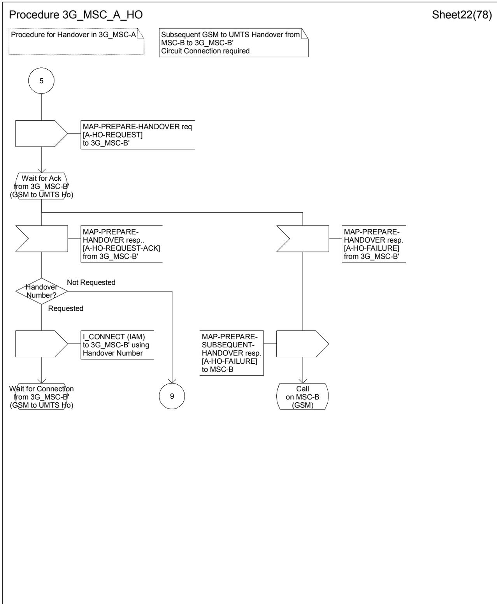

### Procedure 3G\_MSC\_A\_HO

Sheet22(78)

Procedure for Handover in 3G\_MSC-A

Subsequent GSM to UMTS Handover from MSC-B to 3G\_MSC-B'  
Circuit Connection required

```
graph TD; Start((5)) --> Step1[MAP-PREPARE-HANDOVER req [A-HO-REQUEST] to 3G_MSC-B']; Step1 --> Wait1[Wait for Ack from 3G_MSC-B' (GSM to UMTS Ho)]; Wait1 --> Decision1{ }; Decision1 --> Step2[MAP-PREPARE-HANDOVER resp.. [A-HO-REQUEST-ACK] from 3G_MSC-B']; Decision1 --> Step3[MAP-PREPARE-HANDOVER resp. [A-HO-FAILURE] from 3G_MSC-B']; Step2 --> Decision2{Handover Number?}; Decision2 -- Not Requested --> End((9)); Decision2 -- Requested --> Step4[CONNECT (IAM) to 3G_MSC-B' using Handover Number]; Step4 --> Wait2[Wait for Connection from 3G_MSC-B' (GSM to UMTS Ho)]; Step3 --> Step5[MAP-PREPARE-SUBSEQUENT-HANDOVER resp. [A-HO-FAILURE] to MSC-B]; Step5 --> Step6[Call on MSC-B (GSM)];
```

The flowchart illustrates the handover control procedure in 3G\_MSC-A. It begins at connector 5, where a MAP-PREPARE-HANDOVER request (A-HO-REQUEST) is sent to 3G\_MSC-B'. The system then waits for an acknowledgment from 3G\_MSC-B' (GSM to UMTS Ho). Upon receiving the response, a decision is made: if the response is a success (A-HO-REQUEST-ACK), the next step is to check the Handover Number. If not requested, the procedure ends at connector 9. If requested, a CONNECT (IAM) message is sent to 3G\_MSC-B' using the Handover Number, followed by a wait for a connection from 3G\_MSC-B' (GSM to UMTS Ho). If the response is a failure (A-HO-FAILURE), a MAP-PREPARE-SUBSEQUENT-HANDOVER response (A-HO-FAILURE) is sent to MSC-B, followed by a call on MSC-B (GSM).

Flowchart of Procedure 3G\_MSC\_A\_HO

Figure 43 (sheet 22 of 78): Handover control procedure in 3G\_MSC-A

![Flowchart of Procedure 3G_MSC_A_HO for handover control. The process starts with 'Wait for Ack from 3G_MSC-B' (GSM to UMTS Ho). It branches into three main paths: 1) ERROR from 3G_MSC-B' leads to 'Release MAP Resources' then to an ERROR block which sends 'MAP-PREPARE-SUBSEQUENT-HANDOVER resp. to MSC-B' and ends in 'Call on MSC-B (GSM)'. 2) from MSC-B or Network leads to an ERROR block which leads to 'Cancel MAP Procedures' to 3G_MSC-B', then to 'Wait for Ack from 3G_MSC-B' (GSM to UMTS Ho). 3) From UE/MS or Network leads to 'Call Release' then to 'Cancel MAP Procedures' to 3G_MSC-B', then to 'MAP-SEND-END-SIGNAL resp. to MSC-B', then to 'Release Handover Device', then to 'I_DISCONNECT (REL) to MSC-B', and finally to 'IDLE'. A message 'MAP-PAS req. [A-CLEAR-REQUEST] from 3G_MSC-B' is shown entering the middle path.](16d5f9c016e78737423c11d4fba9ae25_img.jpg)

### Procedure 3G\_MSC\_A\_HO

Sheet23(78)

Procedure for Handover in 3G\_MSC-A

```
graph TD; Start([Wait for Ack from 3G_MSC-B' (GSM to UMTS Ho)]) --> ERROR1{ERROR}; Start --> FROM_MSC_B[from MSC-B or Network]; Start --> FROM_UE[From UE/MS or Network]; ERROR1 --> ERROR1_MSG[from 3G_MSC-B']; ERROR1 --> RELEASE_MAP[Release MAP Resources]; RELEASE_MAP --> RELEASE_MAP_MSG[to 3G_MSC-B']; RELEASE_MAP --> ERROR2{ERROR}; ERROR2 --> ERROR2_MSG[MAP-PREPARE-SUBSEQUENT-HANDOVER resp. to MSC-B]; ERROR2 --> CALL_GSM([Call on MSC-B (GSM)]); FROM_MSC_B --> ERROR3{ERROR}; FROM_MSC_B --> MAP_PAS[MAP-PAS req. [A-CLEAR-REQUEST] from 3G_MSC-B]; FROM_MSC_B --> CANCEL_MAP[Cancel MAP Procedures]; CANCEL_MAP --> CANCEL_MAP_MSG[to 3G_MSC-B']; CANCEL_MAP --> WAIT_ACK([Wait for Ack from 3G_MSC-B' (GSM to UMTS Ho)]); FROM_UE --> CALL_RELEASE[Call Release]; CALL_RELEASE --> CALL_RELEASE_MSG[From UE/MS or Network]; CALL_RELEASE --> CANCEL_MAP_2[Cancel MAP Procedures]; CANCEL_MAP_2 --> CANCEL_MAP_2_MSG[to 3G_MSC-B']; CANCEL_MAP_2 --> MAP_SEND[MAP-SEND-END-SIGNAL resp. to MSC-B]; MAP_SEND --> RELEASE_DEVICE[Release Handover Device]; RELEASE_DEVICE --> I_DISCONNECT[I_DISCONNECT (REL) to MSC-B]; I_DISCONNECT --> IDLE([IDLE])
```

Flowchart of Procedure 3G\_MSC\_A\_HO for handover control. The process starts with 'Wait for Ack from 3G\_MSC-B' (GSM to UMTS Ho). It branches into three main paths: 1) ERROR from 3G\_MSC-B' leads to 'Release MAP Resources' then to an ERROR block which sends 'MAP-PREPARE-SUBSEQUENT-HANDOVER resp. to MSC-B' and ends in 'Call on MSC-B (GSM)'. 2) from MSC-B or Network leads to an ERROR block which leads to 'Cancel MAP Procedures' to 3G\_MSC-B', then to 'Wait for Ack from 3G\_MSC-B' (GSM to UMTS Ho). 3) From UE/MS or Network leads to 'Call Release' then to 'Cancel MAP Procedures' to 3G\_MSC-B', then to 'MAP-SEND-END-SIGNAL resp. to MSC-B', then to 'Release Handover Device', then to 'I\_DISCONNECT (REL) to MSC-B', and finally to 'IDLE'. A message 'MAP-PAS req. [A-CLEAR-REQUEST] from 3G\_MSC-B' is shown entering the middle path.

Figure 43 (sheet 23 of 78): Handover control procedure in 3G\_MSC-A


**Procedure 3G\_MSC\_A\_HO** Sheet24(78)

Procedure for Handover in 3G\_MSC-A

```

sequenceDiagram
    participant UE/MS
    participant 3G_MSC_A as 3G_MSC-A
    participant 3G_MSC_B_prime as 3G_MSC-B'
    participant MSC_B as MSC-B

    Note left of UE/MS: Wait for Connection from 3G_MSC-B' (GSM to UMTS Ho)
    UE/MS->>3G_MSC_A: I_COMPLETE (ACM) from 3G_MSC-B'
    Note right of 3G_MSC_A: Set up Handover Device
    3G_MSC_A->>3G_MSC_B_prime: MAP-PAS req. [A-CLEAR-REQUEST] from 3G_MSC-B'
    Note right of 3G_MSC_B_prime: (Allowed once in this state)
    Note left of 3G_MSC_A: Wait for Connection from 3G_MSC-B' (GSM to UMTS Ho)
    3G_MSC_A->>MSC_B: MAP-PREPARE-SUBSEQUENT-HANDOVER resp. [A-HO-REQUEST-ACK] to MSC-B
    Note right of MSC_B: Cancel MAP Procedures to 3G_MSC-B'
    Note left of 3G_MSC_A: Queue messages for UE/MS in 3G_MSC-A
    3G_MSC_A->>3G_MSC_B_prime: I_DISCONNECT (REL) to 3G_MSC-B'
    Note right of 3G_MSC_A: Set T503
    Note left of 3G_MSC_A: Wait for Completion (on 3G_MSC-B') (GSM to UMTS Ho)
    Note right of 3G_MSC_A: ERROR
    Note right of ERROR: Call on MSC-B (GSM)
    Note right of 3G_MSC_A: MAP-PREPARE-SUBSEQUENT-HANDOVER resp. to MSC-B
    Note right of MSC_B: MAP-SEND-END-SIGNAL resp to MSC-B
    Note right of MSC_B: Call Release to Network and UE/MS
    Note right of MSC_B: I_DISCONNECT (REL) to MSC-B and 3G_MSC-B'
    Note right of MSC_B: IDLE
    Note right of 3G_MSC_B_prime: from 3G_MSC-B' or Network
    Note right of 3G_MSC_B_prime: ERROR
    Note right of UE/MS: from UE/MS or Network
    Note right of UE/MS: Call Release
    Note right of MSC_B: MAP-PAS req. [A-CLEAR-REQUEST] from MSC-B
    Note right of MSC_B: Cancel MAP Procedures to MSC-B and 3G_MSC-B'
  
```

Sequence diagram for Procedure 3G\_MSC\_A\_HO showing handover control between 3G\_MSC-A, 3G\_MSC-B', and MSC-B. The diagram includes lifelines for the User Equipment (UE/MS), 3G\_MSC-A, 3G\_MSC-B', and MSC-B. It details the message exchanges for a successful handover, as well as error handling and call release scenarios.

Figure 43 (sheet 24 of 78): Handover control procedure in 3G\_MSC-A

![Flowchart of Procedure 3G_MSC_A_HO for handover control. The process starts with 'Wait for Completion on 3G_MSC-B' (GSM to UMTS Ho)'. It branches into three main paths based on incoming signals: 1) MAP-SEND-END-SIGNAL req. [A-HO-COMPLETE] from 3G_MSC-B' leads to 'Reset T503' and then 'Connect Handover Device (option)'. 2) MAP-PAS req. [A-HO-DETECT] from 3G_MSC-B' leads to 'Connect Handover Device (option)'. 3) MAP-PAS req. [A-CLEAR-REQUEST] from MSC-B leads to '(Allowed once in this state)'. From 'Connect Handover Device (option)', the flow goes to 'Forward queued messages for UE/MS via 3G_MSC-B'' and 'Use MAP-FORWARD-ACCESS-SIGNALLING req.'. 'Forward queued messages...' leads to 'MAP-SEND-END-SIGNAL resp. to MSC-B' and 'I_DISCONNECT (REL) to MSC-B'. 'MAP-SEND-END-SIGNAL resp. to MSC-B' leads to 'Redefined 3G_MSC-B' as 3G_MSC-B' and then 'Call on 3G_MSC-B (UTRAN)'. 'I_DISCONNECT (REL) to MSC-B' leads to 'Wait for Completion from 3G_MSC-B' (GSM to UMTS Ho)'. From '(Allowed once in this state)' (for A-HO-DETECT), the flow goes to 'MAP-PAS req. [A-CLEAR-REQUEST] from 3G_MSC-B'' and '(Allowed once in this state)'. 'MAP-PAS req. [A-CLEAR-REQUEST] from 3G_MSC-B'' leads to 'Connect Handover Device (option)'. '(Allowed once in this state)' leads to 'Wait for access by UE/MS?'. If 'Yes', it goes to 'Cancel MAP Procedures' and 'Call Release'. If 'No', it goes to 'Release Handover Device'. 'Cancel MAP Procedures' leads to 'to MSC-B and 3G_MSC-B'' and 'Call Release'. 'Release Handover Device' leads to 'to Network and UE/MS' and 'Call Release'. 'Call Release' leads to 'I_DISCONNECT (REL) to MSC-B and 3G_MSC-B'' and 'IDLE'.](7257d4b73261f355fa2c74278e6ed059_img.jpg)

## Procedure 3G\_MSC\_A\_HO Sheet25(78)

Procedure for Handover in 3G\_MSC-A

```

    graph TD
      Start([Wait for Completion  
on 3G_MSC-B'  
(GSM to UMTS Ho)]) --> Branch{ }
      
      %% Left Path
      Branch --> In1[/MAP-SEND-  
END-SIGNAL req.  
[A-HO-COMPLETE]  
from 3G_MSC-B'/]
      In1 --> Task1[Reset  
T503]
      Task1 --> In2[/I_ANSWER (ANM)  
from 3G_MSC-B'/]
      In2 --> Task2[Connect  
Handover  
Device (option)]
      Task2 --> Task3[Forward queued  
messages for  
UE/MS via  
3G_MSC-B']
      Task3 --> Task4[Use MAP-FORWARD-  
ACCESS-SIGNALLING req.]
      Task4 --> Out1[MAP-SEND-  
END-SIGNAL resp.  
to MSC-B]
      Out1 --> Out2[I_DISCONNECT  
(REL) to MSC-B]
      Out2 --> Task5[Redefine  
3G_MSC-B' as  
3G_MSC-B]
      Task5 --> End1([Call on  
3G_MSC-B  
(UTRAN)])

      %% Middle Path
      Branch --> In3[/MAP-PAS req.  
[A-HO-DETECT]  
from 3G_MSC-B'/]
      In3 --> Task6[Connect  
Handover  
Device (option)]
      Task6 --> End2([Wait for Completion  
from 3G_MSC-B'  
(GSM to UMTS Ho)])

      %% Right Path
      Branch --> In4[/MAP-PAS req.  
[A-CLEAR-  
REQUEST]  
from MSC-B/]
      In4 --> State1((Allowed  
once in  
this state))
      State1 --> In5[/MAP-PAS req.  
[A-CLEAR-  
REQUEST]  
from 3G_MSC-B'/]
      In5 --> State2((Allowed  
once in  
this state))
      State2 --> Dec1{Wait for  
access by  
UE/MS?}
      
      Dec1 -- Yes --> Out3[Cancel MAP  
Procedures]
      Out3 -.-> Note1[to MSC-B  
and 3G_MSC-B']
      Note1 --> Out4[Call  
Release]
      
      Dec1 -- No --> Out5[Release  
Handover  
Device]
      Out5 -.-> Note2[to Network  
and UE/MS]
      Note2 --> Out4
      
      Out4 --> Out6[I_DISCONNECT (REL)  
to MSC-B and 3G_MSC-B']
      Out6 --> End3([IDLE])
  
```

Flowchart of Procedure 3G\_MSC\_A\_HO for handover control. The process starts with 'Wait for Completion on 3G\_MSC-B' (GSM to UMTS Ho)'. It branches into three main paths based on incoming signals: 1) MAP-SEND-END-SIGNAL req. [A-HO-COMPLETE] from 3G\_MSC-B' leads to 'Reset T503' and then 'Connect Handover Device (option)'. 2) MAP-PAS req. [A-HO-DETECT] from 3G\_MSC-B' leads to 'Connect Handover Device (option)'. 3) MAP-PAS req. [A-CLEAR-REQUEST] from MSC-B leads to '(Allowed once in this state)'. From 'Connect Handover Device (option)', the flow goes to 'Forward queued messages for UE/MS via 3G\_MSC-B'' and 'Use MAP-FORWARD-ACCESS-SIGNALLING req.'. 'Forward queued messages...' leads to 'MAP-SEND-END-SIGNAL resp. to MSC-B' and 'I\_DISCONNECT (REL) to MSC-B'. 'MAP-SEND-END-SIGNAL resp. to MSC-B' leads to 'Redefined 3G\_MSC-B' as 3G\_MSC-B' and then 'Call on 3G\_MSC-B (UTRAN)'. 'I\_DISCONNECT (REL) to MSC-B' leads to 'Wait for Completion from 3G\_MSC-B' (GSM to UMTS Ho)'. From '(Allowed once in this state)' (for A-HO-DETECT), the flow goes to 'MAP-PAS req. [A-CLEAR-REQUEST] from 3G\_MSC-B'' and '(Allowed once in this state)'. 'MAP-PAS req. [A-CLEAR-REQUEST] from 3G\_MSC-B'' leads to 'Connect Handover Device (option)'. '(Allowed once in this state)' leads to 'Wait for access by UE/MS?'. If 'Yes', it goes to 'Cancel MAP Procedures' and 'Call Release'. If 'No', it goes to 'Release Handover Device'. 'Cancel MAP Procedures' leads to 'to MSC-B and 3G\_MSC-B'' and 'Call Release'. 'Release Handover Device' leads to 'to Network and UE/MS' and 'Call Release'. 'Call Release' leads to 'I\_DISCONNECT (REL) to MSC-B and 3G\_MSC-B'' and 'IDLE'.

Figure 43 (sheet 25 of 78): Handover control procedure in 3G\_MSC-A

![Flowchart of the handover control procedure in 3G_MSC-A, sheet 26 of 78. The diagram shows multiple parallel paths triggered by different events while waiting for handover completion. Events include timer expiry, MAP requests, and network signals. Actions involve resetting timers, canceling MAP procedures, releasing handover devices, and sending disconnect signals. Decision points check for MSC-B connection and UE/MS access status, leading to either IDLE states, call release, or returning to the wait state.](7c19fc92dc74a74ec346d46bc39a3946_img.jpg)

**Procedure 3G\_MSC\_A\_HO**
Sheet26(78)

Procedure for Handover in 3G\_MSC-A

Wait for Completion  
on 3G\_MSC-B'  
(GSM to UMTS Ho)

```

    graph TD
        Start[Wait for Completion  
on 3G_MSC-B'  
GSM to UMTS Ho] --> T503_Exp[/Expiry  
T503/]
        Start --> MAP_PAS[/MAP-PAS req.  
A-HO-FAILURE  
from MSC-B/]
        Start --> From_B[/from 3G_MSC-B'/]
        Start --> Cancel_MAP1[Cancel MAP  
Procedures]

        T503_Exp --> Reset_T503[Reset  
T503]
        MAP_PAS --> Reset_T503

        Reset_T503 --> Cancel_MAP2[Cancel MAP  
Procedures]
        Cancel_MAP2 --> From_MSC_B_Text{{from MSC-B}}
        Cancel_MAP2 --> Release_HD1[Release  

```

Flowchart of the handover control procedure in 3G\_MSC-A, sheet 26 of 78. The diagram shows multiple parallel paths triggered by different events while waiting for handover completion. Events include timer expiry, MAP requests, and network signals. Actions involve resetting timers, canceling MAP procedures, releasing handover devices, and sending disconnect signals. Decision points check for MSC-B connection and UE/MS access status, leading to either IDLE states, call release, or returning to the wait state.

**Figure 43 (sheet 26 of 78): Handover control procedure in 3G\_MSC-A**

![Flowchart of Procedure 3G_MSC_A_HO. The process starts at connector 7, queues messages, sends a handover command, sets timer T503, and waits for UE/MS on 3G_MSC-B. It then branches based on signals from 3G_MSC-B (MAP-SEND-END-SIGNAL, A-CLEAR-REQUEST, MAP-PAS req. [A-HO-DETECT]). Depending on these signals, it either resets T503, releases resources, forwards messages, and ends in UTRAN; or it checks if the state allows resource release, calls release, releases MAP resources, and ends in IDLE; or it waits for UE/MS on 3G_MSC-B (GSM to UMTS Ho).](1750e325061d2206b5af0af175793d79_img.jpg)

**Procedure 3G\_MSC\_A\_HO** Sheet27(78)

Procedure for Handover in 3G\_MSC-A

Basic GSM to UMTS Handover to 3G\_MSC-B  
no Circuit Connection required

```

graph TD
    Start((7)) --> Queue[Queue Messages for UE/MS in 3G_MSC-A]
    Queue --> Command{Handover Command to UE/MS via BSS-A}
    Command --> SetT503[Set T503]
    SetT503 --> Wait1[Wait for UE/MS on 3G_MSC-B (GSM to UMTS Ho)]
    Wait1 --> Branch1(( ))
    Branch1 --> MAP_SEND[MAP-SEND-END-SIGNAL req. [A-HO-COMPLETE] from 3G_MSC-B]
    MAP_SEND --> ResetT503[Reset T503]
    ResetT503 --> MAP_PAS_REQ[MAP-PAS req. [A-CLEAR-REQUEST] from 3G_MSC-B]
    MAP_PAS_REQ --> Allowed1{(Allowed once in this state)}
    Allowed1 -- Yes --> ReleaseRes[Release Resources on BSS-A]
    ReleaseRes --> Forward[Forward queued messages for UE/MS via 3G_MSC-B]
    Forward --> UseMAP[Use MAP-FORWARD-ACCESS-SIGNALLING req.]
    UseMAP --> UTRAN[UE/MS on 3G_MSC-B (UTRAN)]
    Branch1 --> Allowed2{(Allowed once in this state)}
    Allowed2 --> CLEAR_REQ[A-CLEAR-REQUEST from BSS-A]
    CLEAR_REQ --> Branch2(( ))
    Branch2 --> MAP_PAS_DETECT[MAP-PAS req. [A-HO-DETECT] from 3G_MSC-B]
    MAP_PAS_DETECT --> Wait2[Wait for UE/MS on 3G_MSC-B (GSM to UMTS Ho)]
    Branch1 --> Wait2
    Branch1 --> ReleaseRes2[Release Resources on BSS-A]
    ReleaseRes2 --> Wait3[Wait for UE/MS on 3G_MSC-B (GSM to UMTS Ho)]
    ReleaseRes2 --> CallRelease[Call Release]
    CallRelease --> ToNetwork[to Network and UE/MS]
    CallRelease --> ReleaseMAP[Release MAP Resources]
    ReleaseMAP --> To3G_MSCB[to 3G_MSC-B in 3G_MSC-A]
    ReleaseMAP --> IDLE[IDLE]
  
```

Flowchart of Procedure 3G\_MSC\_A\_HO. The process starts at connector 7, queues messages, sends a handover command, sets timer T503, and waits for UE/MS on 3G\_MSC-B. It then branches based on signals from 3G\_MSC-B (MAP-SEND-END-SIGNAL, A-CLEAR-REQUEST, MAP-PAS req. [A-HO-DETECT]). Depending on these signals, it either resets T503, releases resources, forwards messages, and ends in UTRAN; or it checks if the state allows resource release, calls release, releases MAP resources, and ends in IDLE; or it waits for UE/MS on 3G\_MSC-B (GSM to UMTS Ho).

Figure 43 (sheet 27 of 78): Handover control procedure in 3G\_MSC-A

![Flowchart of Procedure 3G_MSC_A_HO for handover control. The process starts with 'Wait for UE/MS on 3G_MSC-B (GSM to UMTS Ho)'. It branches into four main paths: 1) 'A-HANDOVER-FAILURE from BSS-A' leads to 'Reset T503', then 'Forward queued messages for UE/MS via BSS-A', then 'Cancel MAP Procedures' (in 3G_MSC-A to 3G_MSC-B), ending in 'Call in Progress on 3G_MSC-A (GSM)'. 2) 'Cancel MAP Procedures' (from 3G_MSC-B) leads to 'Release Resources BSS-A', ending in 'Wait for UE/MS on 3G_MSC-B (GSM to UMTS Ho)'. 3) 'Expiry T503' leads to 'Cancel MAP Procedures' (in 3G_MSC-A and to 3G_MSC-B), then 'Release Resources BSS-A', ending in 'IDLE'. 4) 'Call Release' (from Network) leads directly to 'Wait for UE/MS on 3G_MSC-B (GSM to UMTS Ho)'.](b96be3d7d73fc1d7af1879bb57de1cc4_img.jpg)

### Procedure 3G\_MSC\_A\_HO

Procedure for Handover in 3G\_MSC-A

Sheet28(78)

```
graph TD; Start[Wait for UE/MS on 3G_MSC-B (GSM to UMTS Ho)] --> A[ ]; A --> B[A-HANDOVER-FAILURE from BSS-A]; A --> C[Cancel MAP Procedures]; A --> D[Expiry T503]; A --> E[Call Release]; B --> F[Reset T503]; F --> G[Forward queued messages for UE/MS via BSS-A]; G --> H[Cancel MAP Procedures]; H --> I[Call in Progress on 3G_MSC-A (GSM)]; C --> J[Release Resources BSS-A]; J --> K[Wait for UE/MS on 3G_MSC-B (GSM to UMTS Ho)]; D --> L[Cancel MAP Procedures]; L --> M[Release Resources BSS-A]; M --> N[IDLE]; E --> K;
```

Flowchart of Procedure 3G\_MSC\_A\_HO for handover control. The process starts with 'Wait for UE/MS on 3G\_MSC-B (GSM to UMTS Ho)'. It branches into four main paths: 1) 'A-HANDOVER-FAILURE from BSS-A' leads to 'Reset T503', then 'Forward queued messages for UE/MS via BSS-A', then 'Cancel MAP Procedures' (in 3G\_MSC-A to 3G\_MSC-B), ending in 'Call in Progress on 3G\_MSC-A (GSM)'. 2) 'Cancel MAP Procedures' (from 3G\_MSC-B) leads to 'Release Resources BSS-A', ending in 'Wait for UE/MS on 3G\_MSC-B (GSM to UMTS Ho)'. 3) 'Expiry T503' leads to 'Cancel MAP Procedures' (in 3G\_MSC-A and to 3G\_MSC-B), then 'Release Resources BSS-A', ending in 'IDLE'. 4) 'Call Release' (from Network) leads directly to 'Wait for UE/MS on 3G\_MSC-B (GSM to UMTS Ho)'.

Figure 43 (sheet 28 of 78): Handover control procedure in 3G\_MSC-A

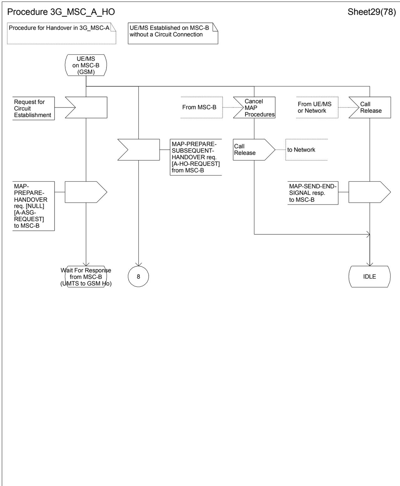

### Procedure 3G\_MSC\_A\_HO

Sheet29(78)

Procedure for Handover in 3G\_MSC-A

UE/MS Established on MSC-B without a Circuit Connection

```
sequenceDiagram
    participant UE/MS as UE/MS on MSC-B (GSM)
    participant MSC-A
    participant MSC-B
    Note right of UE/MS: UE/MS Established on MSC-B without a Circuit Connection

    Note left of MSC-A: Procedure for Handover in 3G_MSC-A

    UE/MS->>MSC-A: Request for Circuit Establishment
    MSC-A->>MSC-B: MAP-PREPARE-HANDOVER req. [NULL] [A-ASG-REQUEST] to MSC-B
    MSC-A->>UE/MS: Wait For Response from MSC-B (UMTS to GSM Ho)
    Note right of MSC-A: 8

    Note left of MSC-B: From MSC-B
    MSC-B->>MSC-A: MAP-PREPARE-SUBSEQUENT-HANDOVER req. [A-HO-REQUEST] from MSC-B
    MSC-A->>MSC-B: Cancel MAP Procedures
    Note right of MSC-A: to Network
    MSC-A->>MSC-B: Call Release
    Note left of MSC-B: From UE/MS or Network
    MSC-B->>MSC-A: Call Release
    MSC-A->>MSC-B: MAP-SEND-END-SIGNAL resp. to MSC-B
    MSC-A->>UE/MS: IDLE
```

The diagram illustrates the handover control procedure in 3G\_MSC-A. It begins with the UE/MS on MSC-B (GSM) sending a 'Request for Circuit Establishment' to MSC-A. MSC-A responds with 'MAP-PREPARE-HANDOVER req. [NULL] [A-ASG-REQUEST] to MSC-B' and enters a 'Wait For Response from MSC-B (UMTS to GSM Ho)' state, leading to connector '8'. From MSC-B, a 'MAP-PREPARE-SUBSEQUENT-HANDOVER req. [A-HO-REQUEST] from MSC-B' is received by MSC-A. MSC-A then sends 'Cancel MAP Procedures' to MSC-B and a 'Call Release' to the Network. Upon receiving a 'Call Release' from the UE/MS or Network via MSC-B, MSC-A sends 'MAP-SEND-END-SIGNAL resp. to MSC-B' and transitions to the 'IDLE' state. A note indicates the procedure is for handover in 3G\_MSC-A, and another note specifies the initial state: 'UE/MS Established on MSC-B without a Circuit Connection'.

Sequence diagram for Procedure 3G\_MSC\_A\_HO showing handover control between UE/MS, MSC-A, and MSC-B.

Figure 43 (sheet 29 of 78): Handover control procedure in 3G\_MSC-A

![State transition diagram for Procedure 3G_MSC_A_HO. It shows three main paths starting from a common entry point 'Wait For Response from 3G_MSC-B (GSM to UMTS_Ho)'. Path 1: State 1 --> [MAP-PREPARE-HANDOVER resp. [Handover Number] [A-ASG-COMPLETE] from 3G_MSC-B] --> State 2 --> [I_CONNECT (IAM) to 3G_MSC-B using Handover Number] --> State 3 [Wait for Complete from 3G_MSC-B (GSM to UMTS_Ho)]. Path 2: State 1 --> [Call Release] --> State 4 [IDLE]. A dashed box labeled 'From UE/MS or Network' is associated with the Call Release state. Path 3: State 1 --> State 5 --> [MAP-PREPARE-HANDOVER -SUBSEQUENT-HANDOVER req [A-HO-REQUEST] from 3G_MSC-B] --> State 6 (19). State 2 also has a transition to State 4. State 4 has a transition to State 5.](b1a6ab9f3d33d6e8d64173bfa595b763_img.jpg)

Procedure 3G\_MSC\_A\_HO

Sheet30(78)

Procedure for Handover in 3G\_MSC-A: Circuit Connection Establishment to 3G\_MSC-B

```
stateDiagram-v2
    [*] --> S1: Wait For Response from 3G_MSC-B (GSM to UMTS_Ho)
    S1 --> S2: MAP-PREPARE-HANDOVER resp. [Handover Number] [A-ASG-COMPLETE] from 3G_MSC-B
    S1 --> S4: Call Release
    S1 --> S5
    S2 --> S3: I_CONNECT (IAM) to 3G_MSC-B using Handover Number
    S2 --> S4
    S3 --> [*]: Wait for Complete from 3G_MSC-B (GSM to UMTS_Ho)
    S4 --> S5
    S5 --> S6: MAP-PREPARE-HANDOVER -SUBSEQUENT-HANDOVER req [A-HO-REQUEST] from 3G_MSC-B
    S6 --> [*]: 19
```

Wait For Response from 3G\_MSC-B (GSM to UMTS\_Ho)

MAP-PREPARE-HANDOVER resp. [Handover Number] [A-ASG-COMPLETE] from 3G\_MSC-B

Call Release

From UE/MS or Network

I\_CONNECT (IAM) to 3G\_MSC-B using Handover Number

MAP-SEND-END-SIGNAL resp. to 3G\_MSC-B

MAP-PREPARE-HANDOVER -SUBSEQUENT-HANDOVER req [A-HO-REQUEST] from 3G\_MSC-B

Wait for Complete from 3G\_MSC-B (GSM to UMTS\_Ho)

IDLE

19

State transition diagram for Procedure 3G\_MSC\_A\_HO. It shows three main paths starting from a common entry point 'Wait For Response from 3G\_MSC-B (GSM to UMTS\_Ho)'. Path 1: State 1 --> [MAP-PREPARE-HANDOVER resp. [Handover Number] [A-ASG-COMPLETE] from 3G\_MSC-B] --> State 2 --> [I\_CONNECT (IAM) to 3G\_MSC-B using Handover Number] --> State 3 [Wait for Complete from 3G\_MSC-B (GSM to UMTS\_Ho)]. Path 2: State 1 --> [Call Release] --> State 4 [IDLE]. A dashed box labeled 'From UE/MS or Network' is associated with the Call Release state. Path 3: State 1 --> State 5 --> [MAP-PREPARE-HANDOVER -SUBSEQUENT-HANDOVER req [A-HO-REQUEST] from 3G\_MSC-B] --> State 6 (19). State 2 also has a transition to State 4. State 4 has a transition to State 5.

Figure 43 (sheet 30 of 78): Handover control procedure in 3G\_MSC-A

![Sequence diagram for handover control procedure in 3G_MSC-A. The process starts with 'Wait For Response from 3G_MSC-B (GSM to UMTS Ho)'. It branches into three main paths: 1) Success: 'MAP-PAS req. [A-CLEAR-REQUEST] from 3G_MSC-B' leads to '(Allowed once in this state)' which leads to 'UE/MS on 3G_MSC-B (UTRAN)'. 2) Error: 'MAP-PREPARE-HANDOVER resp. [MAP ERROR] from 3G_MSC-B' leads to 'Failure' which leads to 'Response to Circuit Establishment Request' and then 'UE/MS on 3G_MSC-B (UTRAN)'. 3) Failure: 'MAP-PREPARE-HANDOVER resp. [A-ASG-FAILURE] from 3G_MSC-B' leads to 'Cancel MAP Procedures from 3G_MSC-B' which leads to 'Call Release to Network', then 'Failure' leading to 'Response to Circuit Establishment Request' and finally 'IDLE'.](21df39ef27b27dec52a36c0bedc53e6b_img.jpg)

### Procedure 3G\_MSC\_A\_HO

Procedure for Handover in 3G\_MSC-A

Sheet31(78)

```
sequenceDiagram
    participant 3G_MSC_A
    participant 3G_MSC_B
    participant Network
    Note left of 3G_MSC_A: Wait For Response from 3G_MSC-B (GSM to UMTS Ho)
    3G_MSC_A->>3G_MSC_B: MAP-PAS req. [A-CLEAR-REQUEST]
    3G_MSC_B-->>3G_MSC_A: MAP-PAS req. [A-CLEAR-REQUEST]
    Note right of 3G_MSC_A: (Allowed once in this state)
    3G_MSC_A->>UE: UE/MS on 3G_MSC-B (UTRAN)
    Note left of 3G_MSC_A: MAP-PREPARE-HANDOVER resp. [MAP ERROR] from 3G_MSC-B
    3G_MSC_A->>Failure1: Failure
    Failure1->>Response1: Response to Circuit Establishment Request
    Response1->>UE
    Note left of 3G_MSC_A: MAP-PREPARE-HANDOVER resp. [A-ASG-FAILURE] from 3G_MSC-B
    3G_MSC_A->>Cancel: Cancel MAP Procedures
    Cancel->>CancelText: from 3G_MSC-B
    Cancel->>CallRelease: Call Release
    CallRelease->>CallReleaseText: to Network
    CallRelease->>Failure2: Failure
    Failure2->>Response2: Response to Circuit Establishment Request
    Response2->>IDLE
```

Sequence diagram for handover control procedure in 3G\_MSC-A. The process starts with 'Wait For Response from 3G\_MSC-B (GSM to UMTS Ho)'. It branches into three main paths: 1) Success: 'MAP-PAS req. [A-CLEAR-REQUEST] from 3G\_MSC-B' leads to '(Allowed once in this state)' which leads to 'UE/MS on 3G\_MSC-B (UTRAN)'. 2) Error: 'MAP-PREPARE-HANDOVER resp. [MAP ERROR] from 3G\_MSC-B' leads to 'Failure' which leads to 'Response to Circuit Establishment Request' and then 'UE/MS on 3G\_MSC-B (UTRAN)'. 3) Failure: 'MAP-PREPARE-HANDOVER resp. [A-ASG-FAILURE] from 3G\_MSC-B' leads to 'Cancel MAP Procedures from 3G\_MSC-B' which leads to 'Call Release to Network', then 'Failure' leading to 'Response to Circuit Establishment Request' and finally 'IDLE'.

Figure 43 (sheet 31 of 78): Handover control procedure in 3G\_MSC-A

![Flowchart of Procedure 3G_MSC_A_HO for GSM to UMTS handover. The process starts with 'Wait for Complete from 3G_MSC-B (GSM to UMTS Ho)'. It branches into three main paths: Success, Failure, and Call Release. Success leads to 'Response to Circuit Establishment Request' and 'Wait for Complete from 3G_MSC-B (GSM to UMTS Ho)'. Failure leads to 'Response to Circuit Establishment Request' and 'Cancel MAP Procedures', which then leads to 'IDLE'. Call Release leads to 'MAP-SEND-END-SIGNAL resp. to 3G_MSC-B' and 'I_DISCONNECT (REL) to 3G_MSC-B', which then leads to 'IDLE'. There are also internal messages like I_COMPLETE (ACM), I-ANSWER (ANM), and MAP-PAS req. [A-CLEAR-REQUEST] from 3G_MSC-B, and a state condition '(Allowed once in this state)'.](476b627f69146cf2c394a1f1f697b24e_img.jpg)

### Procedure 3G\_MSC\_A\_HO

Procedure for Handover in 3G\_MSC-A

Sheet32(78)

```
graph TD
    Start[Wait for Complete from 3G_MSC-B (GSM to UMTS Ho)] --> Decision1{ }
    Decision1 --> Success[Success]
    Decision1 --> Failure[Failure]
    Decision1 --> CallRelease[Call Release]
    
    Success --> SuccessResp[Response to Circuit Establishment Request]
    SuccessResp --> SuccessEnd[Wait for Complete from 3G_MSC-B (GSM to UMTS Ho)]
    
    Failure --> FailureResp[Response to Circuit Establishment Request]
    FailureResp --> CancelMAP[Cancel MAP Procedures]
    CancelMAP --> IDLE1[(IDLE)]
    
    CallRelease --> MAPSendEnd[MAP-SEND-END-SIGNAL resp. to 3G_MSC-B]
    CallRelease --> IDisconnect[ I_DISCONNECT (REL) to 3G_MSC-B]
    IDisconnect --> IDLE2[(IDLE)]
    
    Start --> IComplete[I_COMPLETE (ACM) from 3G_MSC-B]
    IComplete --> Decision2{ }
    Decision2 --> MAPPAS[MAP-PAS req. [A-CLEAR-REQUEST] from 3G_MSC-B]
    MAPPAS --> AllowedOnce[(Allowed once in this state)]
    AllowedOnce --> Decision1
    
    Start --> IAnswer[I-ANSWER (ANM) from 3G_MSC-B]
    IAnswer --> Decision2
```

Flowchart of Procedure 3G\_MSC\_A\_HO for GSM to UMTS handover. The process starts with 'Wait for Complete from 3G\_MSC-B (GSM to UMTS Ho)'. It branches into three main paths: Success, Failure, and Call Release. Success leads to 'Response to Circuit Establishment Request' and 'Wait for Complete from 3G\_MSC-B (GSM to UMTS Ho)'. Failure leads to 'Response to Circuit Establishment Request' and 'Cancel MAP Procedures', which then leads to 'IDLE'. Call Release leads to 'MAP-SEND-END-SIGNAL resp. to 3G\_MSC-B' and 'I\_DISCONNECT (REL) to 3G\_MSC-B', which then leads to 'IDLE'. There are also internal messages like I\_COMPLETE (ACM), I-ANSWER (ANM), and MAP-PAS req. [A-CLEAR-REQUEST] from 3G\_MSC-B, and a state condition '(Allowed once in this state)'.

Figure 43 (sheet 32 of 78): Handover control procedure in 3G\_MSC-A

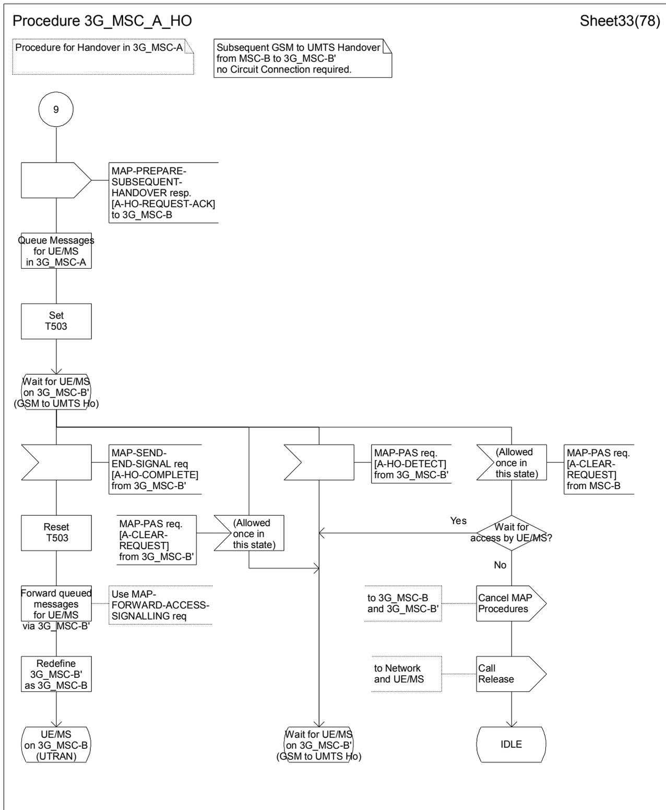

**Procedure 3G\_MSC\_A\_HO** Sheet33(78)

Procedure for Handover in 3G\_MSC-A

Subsequent GSM to UMTS Handover from MSC-B to 3G\_MSC-B' no Circuit Connection required.

```

graph TD
    Start((9)) --> MAP_PREPARE[MAP-PREPARE-SUBSEQUENT-HANDOVER resp. [A-HO-REQUEST-ACK] to 3G_MSC-B]
    MAP_PREPARE --> Queue[Queue Messages for UE/MS in 3G_MSC-A]
    Queue --> Set_T503[Set T503]
    Set_T503 --> Wait_UE_MS[Wait for UE/MS on 3G_MSC-B' (GSM to UMTS Ho)]
    Wait_UE_MS --> MAP_SEND_END[MAP-SEND-END-SIGNAL req [A-HO-COMPLETE] from 3G_MSC-B']
    Wait_UE_MS --> MAP_PAS_REQ[MAP-PAS req. [A-HO-DETECT] from 3G_MSC-B']
    Wait_UE_MS --> Allowed_Once[Allowed once in this state]
    Allowed_Once --> MAP_PAS_REQ_A_CLEAR[MAP-PAS req. [A-CLEAR-REQUEST] from 3G_MSC-B']
    MAP_SEND_END --> Reset_T503[Reset T503]
    Reset_T503 --> Forward[Forward queued messages for UE/MS via 3G_MSC-B']
    Forward --> Redefine[Redefined 3G_MSC-B' as 3G_MSC-B]
    Redefine --> UE_MS_UTRAN[UE/MS on 3G_MSC-B (UTRAN)]
    MAP_PAS_REQ_A_CLEAR --> Allowed_Once_2[Allowed once in this state]
    Allowed_Once_2 --> Wait_Access[Wait for access by UE/MS?]
    Wait_Access -- No --> Cancel[Cancel MAP Procedures]
    Cancel --> Call_Release[Call Release]
    Call_Release --> IDLE[IDLE]
    Call_Release -.-> To_Network[to Network and UE/MS]
    Wait_Access -- Yes --> Wait_UE_MS_2[Wait for UE/MS on 3G_MSC-B' (GSM to UMTS Ho)]
    Cancel -.-> To_MSC[to 3G_MSC-B and 3G_MSC-B']
    Forward -.-> MAP_FORWARD[Use MAP-FORWARD-ACCESS-SIGNALLING req]
  
```

Flowchart of Procedure 3G\_MSC\_A\_HO showing the handover control process from 3G\_MSC-A to 3G\_MSC-B' (GSM to UMTS Ho).

Figure 43 (sheet 33 of 78): Handover control procedure in 3G\_MSC-A

![Flowchart of Procedure 3G_MSC_A_HO for handover control. The process starts with 'Wait for UE/MS (on 3G_MSC-B') (GSM to UMTS Ho)'. It branches based on 'Expiry T503' (leading to 'Forward queued messages for UE/MS via MSC-B' then 'Cancel MAP Procedures' to 'UE/MS on MSC-B (GSM)') and 'MAP-PAS req. [A-HO-FAILURE] from MSC-B' (leading to 'Reset T503'). From 'Reset T503', it goes to 'Cancel MAP Procedures' (receiving from 3G_MSC-B') or 'Use MAP-FORWARD-ACCESS-SIGNALLING req.' (leading to 'Cancel MAP Procedures' to 'to 3G_MSC-B''). A decision 'Wait for access by UE/MS?' follows. 'Yes' leads to 'Call Release' (receiving from Network or MSC-B) then back to the start. 'No' leads to 'Cancel MAP Procedures' (to 'to 3G_MSC-B'') then 'IDLE'.](573293af67ee571aef04bf725fcefbe5_img.jpg)

### Procedure 3G\_MSC\_A\_HO

Procedure for Handover in 3G\_MSC-A

Sheet34(78)

```
graph TD; Start([Wait for UE/MS on 3G_MSC-B' (GSM to UMTS Ho)]) --> T503{Expiry T503}; T503 --> Forward[Forward queued messages for UE/MS via MSC-B]; Forward --> Cancel1[Cancel MAP Procedures]; Cancel1 --> End1([UE/MS on MSC-B (GSM)]); T503 --> MAP_FAIL[MAP-PAS req. [A-HO-FAILURE] from MSC-B]; MAP_FAIL --> Reset[Reset T503]; Reset --> Cancel2[Cancel MAP Procedures]; Cancel2 --> WaitAccess{Wait for access by UE/MS?}; WaitAccess -- Yes --> CallRelease[Call Release]; CallRelease --> Start; WaitAccess -- No --> Cancel3[Cancel MAP Procedures]; Cancel3 --> End2([IDLE]); Reset --> UseForward[Use MAP-FORWARD-ACCESS-SIGNALLING req.]; UseForward --> Cancel4[Cancel MAP Procedures]; Cancel4 --> To3G[to 3G_MSC-B']; Cancel4 --> Cancel2;
```

Flowchart of Procedure 3G\_MSC\_A\_HO for handover control. The process starts with 'Wait for UE/MS (on 3G\_MSC-B') (GSM to UMTS Ho)'. It branches based on 'Expiry T503' (leading to 'Forward queued messages for UE/MS via MSC-B' then 'Cancel MAP Procedures' to 'UE/MS on MSC-B (GSM)') and 'MAP-PAS req. [A-HO-FAILURE] from MSC-B' (leading to 'Reset T503'). From 'Reset T503', it goes to 'Cancel MAP Procedures' (receiving from 3G\_MSC-B') or 'Use MAP-FORWARD-ACCESS-SIGNALLING req.' (leading to 'Cancel MAP Procedures' to 'to 3G\_MSC-B''). A decision 'Wait for access by UE/MS?' follows. 'Yes' leads to 'Call Release' (receiving from Network or MSC-B) then back to the start. 'No' leads to 'Cancel MAP Procedures' (to 'to 3G\_MSC-B'') then 'IDLE'.

Figure 43 (sheet 34 of 78): Handover control procedure in 3G\_MSC-A

![Flowchart of Procedure 3G_MSC_A_HO. It starts at connector 14, sends a MAP-PREPARE-HANDOVER req. [A-HO-REQUEST] to MSC-B, and waits for an acknowledgement. A decision 'Handover Number?' follows. If 'Not Requested', it goes to connector 18. If 'Requested', it sends an L-CONNECT (IAM) to MSC-B using the Handover Number and waits for a connection. Responses from MSC-B include 'MAP-PREPARE-HANDOVER esp. [A-HO-REQUEST-ACK]', 'MAP-PREPARE-HANDOVER resp. [A-HO-FAILURE]', and 'MAP-PREPARE-HANDOVER resp. [MAP ERROR]'. The 'Not Requested' path also leads to connector 12.](93c9262c68d25c26b8cf8cd547554d9f_img.jpg)

### Procedure 3G\_MSC\_A\_HO

Procedure for Handover in 3G\_MSC-A

Basic UMTS to GSM Handover to MSC-B  
Circuit Connection required

Sheet35(78)

```
graph TD; 14((14)) --> P1[ ]; P1 -- "MAP-PREPARE-HANDOVER req. [A-HO-REQUEST] to MSC-B" --> W1[Wait For Acknowledgement from MSC-B (UMTS to GSM Ho)]; W1 --> D{Handover Number?}; D -- "Not Requested" --> 18((18)); D -- "Requested" --> P2[ ]; P2 -- "L-CONNECT (IAM) to MSC-B using Handover Number" --> W2[Wait for Connection from MSC-B (UMTS to GSM Ho)]; W1 --> R1[MAP-PREPARE-HANDOVER esp. [A-HO-REQUEST-ACK] from MSC-B]; W1 --> R2[MAP-PREPARE-HANDOVER resp. [A-HO-FAILURE] from MSC-B]; W1 --> R3[MAP-PREPARE-HANDOVER resp. [MAP ERROR] from MSC-B]; R1 --> 12((12)); R2 --> 12; R3 --> 12;
```

Flowchart of Procedure 3G\_MSC\_A\_HO. It starts at connector 14, sends a MAP-PREPARE-HANDOVER req. [A-HO-REQUEST] to MSC-B, and waits for an acknowledgement. A decision 'Handover Number?' follows. If 'Not Requested', it goes to connector 18. If 'Requested', it sends an L-CONNECT (IAM) to MSC-B using the Handover Number and waits for a connection. Responses from MSC-B include 'MAP-PREPARE-HANDOVER esp. [A-HO-REQUEST-ACK]', 'MAP-PREPARE-HANDOVER resp. [A-HO-FAILURE]', and 'MAP-PREPARE-HANDOVER resp. [MAP ERROR]'. The 'Not Requested' path also leads to connector 12.

Figure 43 (sheet 35 of 78): Handover control procedure in 3G\_MSC-A

![Flowchart of Procedure 3G_MSC_A_HO for handover control. It starts with 'Wait For Acknowledgement from MSC-B (UMTS to GSM Ho)'. From here, an 'ERROR from MSC-B' leads to 'Cancel MAP Resources in 3G_MSC-A' and then to connector '12'. A message 'Iu-RELEASE-REQUEST from RNS-A' leads to a 'Call Release' block, which then leads to 'Release Resources in RNS-A', 'Cancel MAP Resources to MSC-B', and finally 'IDLE'. Another 'Call Release' block receives input 'From UE/MS or Network' and also leads to 'Release Resources in RNS-A'.](83fd0d406cba6f9c189e77e05859a600_img.jpg)

### Procedure 3G\_MSC\_A\_HO

Procedure for Handover in 3G\_MSC-A

Sheet36(78)

```
graph TD; Start([Wait For Acknowledgement from MSC-B (UMTS to GSM Ho)]) --> ERROR{ERROR}; Start --> Iu[lu-RELEASE-REQUEST from RNS-A]; ERROR -- from MSC-B --> CancelMAP1{Cancel MAP Resources}; CancelMAP1 -- in 3G_MSC-A --> 12((12)); Iu --> CallRelease1{Call Release}; CallRelease1 -- to Network --> ReleaseRNSA{Release Resources in RNS-A}; CallRelease1 --> CallRelease2{Call Release}; CallRelease2 -- From UE/MS or Network --> ReleaseRNSA; ReleaseRNSA --> CancelMAP2{Cancel MAP Resources}; CancelMAP2 -- to MSC-B --> IDLE([IDLE]);
```

Flowchart of Procedure 3G\_MSC\_A\_HO for handover control. It starts with 'Wait For Acknowledgement from MSC-B (UMTS to GSM Ho)'. From here, an 'ERROR from MSC-B' leads to 'Cancel MAP Resources in 3G\_MSC-A' and then to connector '12'. A message 'Iu-RELEASE-REQUEST from RNS-A' leads to a 'Call Release' block, which then leads to 'Release Resources in RNS-A', 'Cancel MAP Resources to MSC-B', and finally 'IDLE'. Another 'Call Release' block receives input 'From UE/MS or Network' and also leads to 'Release Resources in RNS-A'.

Figure 43 (sheet 36 of 78): Handover control procedure in 3G\_MSC-A

![Flowchart of Procedure 3G_MSC_A_HO for Handover in 3G_MSC-A. The process starts with 'Wait for Connection (from MSC-B) (UMTS to GSM Ho)'. It branches based on incoming messages: 'I_COMPLETE (ACM) from MSC-B', 'MAP-PAS req. [A-CLEAR-REQUEST] from MSC-B', 'Iu-RELEASE-REQUEST from RNS-A', and 'Call Release' (from UE/MS or Network). The main path involves 'Queue Messages for UE/MS in 3G_MSC-A', 'Iu-Relocation Command to RNS-A', 'Set T303', 'Set Up the Handover Device' (with internal message), and 'Wait for Completion on MSC-B (UMTS to GSM Ho)'. Error handling includes 'ERROR from MSC-B or Network' leading to 'I_DISCONNECT (REL) to MSC-B' and connector '12'. Other paths lead to 'Call Release' (to UE/MS and Network), 'Release Resources in RNS-A', 'Cancel MAP Procedures' (to MSC-B in 3G_MSC-A), and finally 'IDLE'.](df72bd7468eb8bd59e911d0b5cb7a810_img.jpg)

### Procedure 3G\_MSC\_A\_HO

Procedure for Handover in 3G\_MSC-A

Sheet37(78)

```
graph TD; Start([Wait for Connection from MSC-B UMTS to GSM Ho]) --> I_COMPLETE[I_COMPLETE ACM from MSC-B]; Start --> MAP_PAS[MAP-PAS req. A-CLEAR-REQUEST from MSC-B]; Start --> Iu_RELEASE[Iu-RELEASE-REQUEST from RNS-A]; Start --> Call_Release_Ext[Call Release From UE/MS or Network]; I_COMPLETE --> Queue[Queue Messages for UE/MS in 3G_MSC-A]; MAP_PAS --> Allowed_Once[Allowed once in this state]; Allowed_Once --> Wait_Conn[Wait for Connection from MSC-B UMTS to GSM Ho]; Iu_RELEASE --> Allowed_Once_2[Allowed once in this state]; Allowed_Once_2 --> Call_Release_Int[Call Release to UE/MS and Network]; Call_Release_Ext --> Call_Release_Int; Call_Release_Int --> Release_Resources[Release Resources in RNS-A]; Queue --> Iu_Relocation[Iu-Relocation Command to RNS-A]; Iu_Relocation --> Set_T303[Set T303]; Set_T303 --> Set_Handover[Set Up the Handover Device]; Set_Handover --> Internal_Msg[Internal message in 3G_MSC-A]; Internal_Msg --> Wait_Completion[Wait for Completion on MSC-B UMTS to GSM Ho]; ERROR[ERROR from MSC-B or Network] --> I_DISCONNECT_REL[I_DISCONNECT REL to MSC-B]; I_DISCONNECT_REL --> Connector((12)); Release_Resources --> Cancel_MAP[Cancel MAP Procedures to MSC-B in 3G_MSC-A]; Cancel_MAP --> I_DISCONNECT_REL_2[I_DISCONNECT REL to MSC-B]; I_DISCONNECT_REL_2 --> IDLE([IDLE]);
```

Flowchart of Procedure 3G\_MSC\_A\_HO for Handover in 3G\_MSC-A. The process starts with 'Wait for Connection (from MSC-B) (UMTS to GSM Ho)'. It branches based on incoming messages: 'I\_COMPLETE (ACM) from MSC-B', 'MAP-PAS req. [A-CLEAR-REQUEST] from MSC-B', 'Iu-RELEASE-REQUEST from RNS-A', and 'Call Release' (from UE/MS or Network). The main path involves 'Queue Messages for UE/MS in 3G\_MSC-A', 'Iu-Relocation Command to RNS-A', 'Set T303', 'Set Up the Handover Device' (with internal message), and 'Wait for Completion on MSC-B (UMTS to GSM Ho)'. Error handling includes 'ERROR from MSC-B or Network' leading to 'I\_DISCONNECT (REL) to MSC-B' and connector '12'. Other paths lead to 'Call Release' (to UE/MS and Network), 'Release Resources in RNS-A', 'Cancel MAP Procedures' (to MSC-B in 3G\_MSC-A), and finally 'IDLE'.

Figure 43 (sheet 37 of 78): Handover control procedure in 3G\_MSC-A

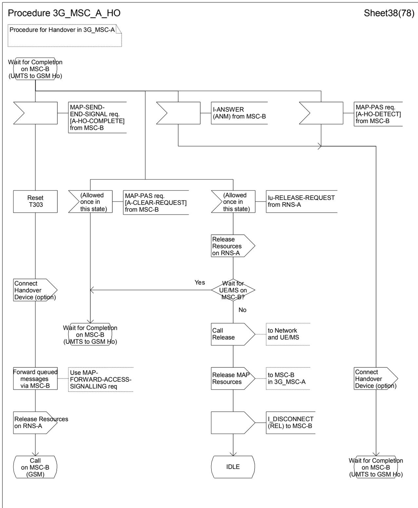

## Procedure 3G\_MSC\_A\_HO

## Sheet38(78)

Procedure for Handover in 3G\_MSC-A

```

  graph TD
      Start([Wait for Completion on MSC-B  
UMTS to GSM Ho]) --> Branch(( ))
      
      Branch --> In1[/MAP-SEND-END-SIGNAL req.  
A-HO-COMPLETE  
from MSC-B/]
      Branch --> In2[/I-ANSWER  
ANM from MSC-B/]
      Branch --> In3[/MAP-PAS req.  
A-HO-DETECT  
from MSC-B/]

      In1 --> Reset[Reset T303]
      Reset --> Conn1[Connect Handover Device option]
      Conn1 --> Wait2([Wait for Completion on MSC-B  
UMTS to GSM Ho])

      In2 --> Dec1{Allowed once in this state}
      Dec1 -- Yes --> In4[/MAP-PAS req.  
A-CLEAR-REQUEST  
from MSC-B/]
      In4 --> Wait2
      Dec1 -- No --> Rel1[Iu-RELEASE-REQUEST from RNS-A]
      Rel1 --> Rel2[Release Resources on RNS-A]
      Rel2 --> Dec2{Wait for UE/MS on MSC-B?}
      Dec2 -- Yes --> Conn1
      Dec2 -- No --> CallRel[Call Release] -- to Network and UE/MS --> RelMap[Release MAP Resources] -- to MSC-B in 3G_MSC-A --> Disconn[I_DISCONNECT REL to MSC-B] --> Idle([IDLE])

      In3 --> Conn2[Connect Handover Device option]
      Conn2 --> Wait3([Wait for Completion on MSC-B  
UMTS to GSM Ho])

      Wait2 --> Fwd[Forward queued messages via MSC-B]
      Wait3 --> Fwd
      
      Fwd -- Use MAP-FORWARD-ACCESS-SIGNALLING req --> Rel3[Release Resources on RNS-A]
      Rel3 --> CallEnd([Call on MSC-B GSM])
  
```

Flowchart showing the handover control procedure in 3G\_MSC-A. It details the handling of completion signals, answers, and detection requests from MSC-B, leading to either a successful call on MSC-B (GSM) or an IDLE state after resource release.

**Figure 43 (sheet 38 of 78): Handover control procedure in 3G\_MSC-A**

![Flowchart of Procedure 3G_MSC_A_HO for handover control. The process starts with 'Wait for Completion on MSC-B (UMTS to GSM Ho)'. It branches into several paths: 1) 'Iu-RELOCATION-CANCEL from RNS-A' leads to 'Reset T303' then 'Forward queued messages for UE/MS via RNS-A' then 'Release Handover Device'. 2) A path leads to 'I_DISCONNECT (REL) from MSC-B' then 'Cancel MAP Procedures' (to 3G_MSC-A and to MSC-B) then 'Release Handover Device' (Internal to 3G_MSC-A). 3) 'Expiry T303' leads to 'Call Release' (from Network) then 'Release Handover Device' (Internal to 3G_MSC-A) then 'Wait for Completion on MSC-B (UMTS to GSM Ho)'. 4) 'in 3G_MSC-A to MSC-B' leads to 'Cancel MAP Procedures'. 5) 'I_DISCONNECT (REL) to MSC-B' leads to a junction. 6) 'from MSC-B' leads to 'Cancel MAP Procedures' then 'Release Handover Device' then 'I_DISCONNECT (REL) to MSC-B' then a junction. All junctions lead to 'Wait for Completion on MSC-B (UMTS to GSM Ho)'. From this junction, one path leads to 'Cancel MAP Procedures' (In 3G_MSC-A and to MSC-B) then 'Release Handover Device' (Internal to 3G_MSC-A) then 'Release Resources RNS-A' then 'IDLE'. Another path from the junction leads to 'Cancel MAP Procedures' (In 3G_MSC-A and to MSC-B) then 'Release Handover Device' (Internal to 3G_MSC-A) then 'Release Resources RNS-A' then 'IDLE'. A third path from the junction leads to 'Call in Progress on 3G_MSC-A (UTRAN)'.](e27f0c293be4088211306b9fc673178b_img.jpg)

### Procedure 3G\_MSC\_A\_HO

Procedure for Handover in 3G\_MSC-A

Sheet39(78)

```
graph TD
    Start([Wait for Completion on MSC-B (UMTS to GSM Ho)]) --> Junction1(( ))
    Junction1 --> IuRC[Iu-RELOCATION-CANCEL from RNS-A]
    IuRC --> ResetT303[Reset T303]
    ResetT303 --> FQ[Forward queued messages for UE/MS via RNS-A]
    FQ --> RHV1[Release Handover Device]
    Junction1 --> IRel[I_DISCONNECT (REL) from MSC-B]
    IRel --> CMP1[Cancel MAP Procedures]
    CMP1 --> CMP1_desc[In 3G_MSC-A and to MSC-B]
    CMP1 --> RHV2[Release Handover Device]
    RHV2 --> RHV2_desc[Internal to 3G_MSC-A]
    Junction1 --> ExpT303{Expiry T303}
    ExpT303 --> CR[Call Release]
    CR --> CR_desc[from Network]
    CR --> RHV3[Release Handover Device]
    RHV3 --> RHV3_desc[Internal to 3G_MSC-A]
    RHV3 --> WCOMB2([Wait for Completion on MSC-B (UMTS to GSM Ho))]
    WCOMB2 --> Junction2(( ))
    Junction2 --> IRel2[I_DISCONNECT (REL) to MSC-B]
    Junction2 --> CMP2[Cancel MAP Procedures]
    CMP2 --> CMP2_desc[In 3G_MSC-A and to MSC-B]
    CMP2 --> RHV4[Release Handover Device]
    RHV4 --> RHV4_desc[Internal to 3G_MSC-A]
    RHV4 --> RR[Release Resources RNS-A]
    RR --> IDLE([IDLE])
    Junction1 --> In3G[in 3G_MSC-A to MSC-B]
    In3G --> CMP3[Cancel MAP Procedures]
    Junction1 --> IRel3[I_DISCONNECT (REL) to MSC-B]
    Junction1 --> FromMSCB[from MSC-B]
    FromMSCB --> CMP4[Cancel MAP Procedures]
    CMP4 --> RHV5[Release Handover Device]
    RHV5 --> IRel4[I_DISCONNECT (REL) to MSC-B]
    IRel4 --> Junction3(( ))
    Junction3 --> WCOMB3([Wait for Completion on MSC-B (UMTS to GSM Ho))]
    WCOMB3 --> Junction4(( ))
    Junction4 --> CMP5[Cancel MAP Procedures]
    CMP5 --> CMP5_desc[In 3G_MSC-A and to MSC-B]
    CMP5 --> RHV6[Release Handover Device]
    RHV6 --> RHV6_desc[Internal to 3G_MSC-A]
    RHV6 --> RR2[Release Resources RNS-A]
    RR2 --> IDLE2([IDLE])
    Junction4 --> CIP[Call in Progress on 3G_MSC-A (UTRAN)]
```

Flowchart of Procedure 3G\_MSC\_A\_HO for handover control. The process starts with 'Wait for Completion on MSC-B (UMTS to GSM Ho)'. It branches into several paths: 1) 'Iu-RELOCATION-CANCEL from RNS-A' leads to 'Reset T303' then 'Forward queued messages for UE/MS via RNS-A' then 'Release Handover Device'. 2) A path leads to 'I\_DISCONNECT (REL) from MSC-B' then 'Cancel MAP Procedures' (to 3G\_MSC-A and to MSC-B) then 'Release Handover Device' (Internal to 3G\_MSC-A). 3) 'Expiry T303' leads to 'Call Release' (from Network) then 'Release Handover Device' (Internal to 3G\_MSC-A) then 'Wait for Completion on MSC-B (UMTS to GSM Ho)'. 4) 'in 3G\_MSC-A to MSC-B' leads to 'Cancel MAP Procedures'. 5) 'I\_DISCONNECT (REL) to MSC-B' leads to a junction. 6) 'from MSC-B' leads to 'Cancel MAP Procedures' then 'Release Handover Device' then 'I\_DISCONNECT (REL) to MSC-B' then a junction. All junctions lead to 'Wait for Completion on MSC-B (UMTS to GSM Ho)'. From this junction, one path leads to 'Cancel MAP Procedures' (In 3G\_MSC-A and to MSC-B) then 'Release Handover Device' (Internal to 3G\_MSC-A) then 'Release Resources RNS-A' then 'IDLE'. Another path from the junction leads to 'Cancel MAP Procedures' (In 3G\_MSC-A and to MSC-B) then 'Release Handover Device' (Internal to 3G\_MSC-A) then 'Release Resources RNS-A' then 'IDLE'. A third path from the junction leads to 'Call in Progress on 3G\_MSC-A (UTRAN)'.

Figure 43 (sheet 39 of 78): Handover control procedure in 3G\_MSC-A

![Flowchart of the handover control procedure in 3G_MSC-A. The process starts with a call on 3G_MSC-B (UTRAN) entering from point 19. It checks if the MSC is known. If not, it sends a MAP-PAS req. [A-CLEAR-REQUEST] to 3G_MSC-B and releases the call. If known, it checks if handover is allowed. If not, it cancels MAP procedures and releases the call. If allowed, it checks which MSC (MSC-B' or 3G_MSC-A). For 3G_MSC-A, it checks if the BSS is known and if resources are available. If not, it sends an I_DISCONNECT (REL) to 3G_MSC-B and releases the call. If known and resources are available, it sends an A-HANDOVER-REQUEST to BSS-B, sets T301, and waits for channel allocation. If the circuit connection is not established within T301, it sends a MAP-PREPARE-SUBSEQUENT-HANDOVER resp. [A-HO-FAILURE] to 3G_MSC-B and releases the call. If established, the call continues on 3G_MSC-B (UTRAN). If the initial MSC check fails, it sends a MAP-PREPARE-SUBSEQUENT-HANDOVER req. [A-HO-REQUEST] to 3G_MSC-B and releases the call. The process ends at point 20 or in an IDLE state.](351243fd59cdae993f191da9ebb48016_img.jpg)

Procedure 3G\_MSC\_A\_HO
Sheet40(78)

Procedure for Handover in 3G\_MSC-A

```

  graph TD
      Start([Call on 3G_MSC-B (UTRAN)]) --> J19((19))
      J19 --> Decision1{Known MSC?}
      
      Decision1 -- No --> Message1[MAP-PREPARE-SUBSEQUENT-HANDOVER req. [A-HO-REQUEST] from 3G_MSC-B]
      Message1 --> Decision1
      
      Decision1 -- Yes --> Decision2{Handover allowed to Cell?}
      
      Decision2 -- No --> Cancel[Cancel MAP procedures]
      Cancel --> CallRelease[Call Release]
      CallRelease --> IDLE([IDLE])
      
      Decision2 -- Yes --> Decision3{Which MSC?}
      Decision3 -- MSC-B' --> J20((20))
      Decision3 -- 3G_MSC-A --> Decision4{Known BSS?}
      
      Decision4 -- No --> Disconnect[I_DISCONNECT (REL) to 3G_MSC-B]
      Disconnect --> IDLE
      
      Decision4 -- Yes --> Decision5{Resources on new BSS?}
      Decision5 -- No --> Disconnect
      
      Decision5 -- Yes --> Message2[A-HANDOVER-REQUEST to BSS-B]
      Message2 --> SetT301[Set T301]
      SetT301 --> Wait[Wait for Channel Allocation (UMTS to GSM Ho)]
      Wait --> Decision6{Circuit Connection?}
      
      Decision6 -- No --> Message3[MAP-PREPARE-SUBSEQUENT-HANDOVER resp. [A-HO-FAILURE] to 3G_MSC-B]
      Message3 --> CallRelease
      
      Decision6 -- Yes --> EndCall1([UE/MS on 3G_MSC-B (UTRAN)])
      EndCall1 --> EndCall2([Call on 3G_MSC-B (UTRAN)])

      %% Other paths
      Input1[MAP-PAS req. [A-CLEAR-REQUEST] from 3G_MSC-B] --> Cancel
      Input2[From UE/MS or Network] --> CallRelease_Direct[Call Release]
      CallRelease_Direct --> IDLE
      Input3[MAP-SEND-END-SIGNAL resp. to 3G_MSC-B] --> IDLE
      Input4[MAP-PREPARE-SUBSEQUENT-HANDOVER resp. [MAP ERROR] to 3G_MSC-B] --> IDLE
  
```

Flowchart of the handover control procedure in 3G\_MSC-A. The process starts with a call on 3G\_MSC-B (UTRAN) entering from point 19. It checks if the MSC is known. If not, it sends a MAP-PAS req. [A-CLEAR-REQUEST] to 3G\_MSC-B and releases the call. If known, it checks if handover is allowed. If not, it cancels MAP procedures and releases the call. If allowed, it checks which MSC (MSC-B' or 3G\_MSC-A). For 3G\_MSC-A, it checks if the BSS is known and if resources are available. If not, it sends an I\_DISCONNECT (REL) to 3G\_MSC-B and releases the call. If known and resources are available, it sends an A-HANDOVER-REQUEST to BSS-B, sets T301, and waits for channel allocation. If the circuit connection is not established within T301, it sends a MAP-PREPARE-SUBSEQUENT-HANDOVER resp. [A-HO-FAILURE] to 3G\_MSC-B and releases the call. If established, the call continues on 3G\_MSC-B (UTRAN). If the initial MSC check fails, it sends a MAP-PREPARE-SUBSEQUENT-HANDOVER req. [A-HO-REQUEST] to 3G\_MSC-B and releases the call. The process ends at point 20 or in an IDLE state.

**Figure 43 (sheet 40 of 78): Handover control procedure in 3G\_MSC-A**

![Flowchart of Procedure 3G_MSC_A_HO for handover control. The process starts with 'Wait for Channel Allocation (UMTS to GSM Ho)'. It branches based on incoming signals: 'A-HANDOVER-REQUEST-ACK. from BSS-B', 'A-HANDOVER-FAILURE from BSS-B', 'Expiry T301', or 'Call Release From UE/MS or Network'. The 'A-HANDOVER-REQUEST-ACK.' path leads to 'Reset T301', 'Queue Messages for UE/MS in 3G_MSC-A', and then to a decision 'Circuit Connection?'. If 'Yes', it proceeds to 'Set Up Handover Device', 'Set T304', and 'Wait for Access by UE/MS (UMTS to GSM Ho)'. If 'No', it loops back to 'Circuit Connection?'. The 'A-HANDOVER-FAILURE' path leads to 'Reset T301', a decision '(Allowed once in this state)', and then to 'Release Resources in BSS-B', resulting in 'Call on 3G_MSC-B (UTRAN)'. The 'Expiry T301' path leads to 'Release Resources in BSS-B', resulting in 'Call on 3G_MSC-B (UTRAN)'. The 'Call Release' path leads to 'Cancel Channel BSS-B', 'MAP-SEND-END-SIGNAL resp to 3G_MSC-B', 'I_DISCONNECT (REL) to 3G_MSC-B', and finally 'IDLE'. A 'MAP-PAS req. [A-CLEAR-REQUEST] from 3G_MSC-B' is also shown. A 'MAP-PREPARE-SUBSEQUENT-HANDOVER resp [A-HO-REQUEST-ACK] to 3G_MSC-B' is shown as an input to the 'Circuit Connection?' decision. A 'MAP-PREPARE-SUBSEQUENT-HANDOVER resp. [A-HO-FAILURE] to 3G_MSC-B' is shown as an input to the 'Release Resources in BSS-B' path.](cf734b5645d3e02a8df25f67904cd2d3_img.jpg)

### Procedure 3G\_MSC\_A\_HO

Procedure for Handover in 3G\_MSC-A

Sheet41(78)

Flowchart of Procedure 3G\_MSC\_A\_HO for handover control. The process starts with 'Wait for Channel Allocation (UMTS to GSM Ho)'. It branches based on incoming signals: 'A-HANDOVER-REQUEST-ACK. from BSS-B', 'A-HANDOVER-FAILURE from BSS-B', 'Expiry T301', or 'Call Release From UE/MS or Network'. The 'A-HANDOVER-REQUEST-ACK.' path leads to 'Reset T301', 'Queue Messages for UE/MS in 3G\_MSC-A', and then to a decision 'Circuit Connection?'. If 'Yes', it proceeds to 'Set Up Handover Device', 'Set T304', and 'Wait for Access by UE/MS (UMTS to GSM Ho)'. If 'No', it loops back to 'Circuit Connection?'. The 'A-HANDOVER-FAILURE' path leads to 'Reset T301', a decision '(Allowed once in this state)', and then to 'Release Resources in BSS-B', resulting in 'Call on 3G\_MSC-B (UTRAN)'. The 'Expiry T301' path leads to 'Release Resources in BSS-B', resulting in 'Call on 3G\_MSC-B (UTRAN)'. The 'Call Release' path leads to 'Cancel Channel BSS-B', 'MAP-SEND-END-SIGNAL resp to 3G\_MSC-B', 'I\_DISCONNECT (REL) to 3G\_MSC-B', and finally 'IDLE'. A 'MAP-PAS req. [A-CLEAR-REQUEST] from 3G\_MSC-B' is also shown. A 'MAP-PREPARE-SUBSEQUENT-HANDOVER resp [A-HO-REQUEST-ACK] to 3G\_MSC-B' is shown as an input to the 'Circuit Connection?' decision. A 'MAP-PREPARE-SUBSEQUENT-HANDOVER resp. [A-HO-FAILURE] to 3G\_MSC-B' is shown as an input to the 'Release Resources in BSS-B' path.

Figure 43 (sheet 41 of 78): Handover control procedure in 3G\_MSC-A

![Flowchart of Procedure 3G_MSC_A_HO for handover control. The process starts with 'Wait for access by UE/MS (UMTS to GSM Ho)'. It branches into three main paths: 1) 'A-HANDOVER-COMPLETE from BSS-B' leads to 'Reset T304', then 'Connect Handover Device (option)', then 'Forward queued messages for UE/MS via BSS-B', then 'MAP-SEND-END-SIGNAL resp. to 3G_MSC-B', then a 'Circuit Connection?' decision. If 'No', it goes to 'Release Handover Device' then 'I_DISCONNECT (REL) to 3G_MSC-B' then back to 'Call in Progress on 3G_MSC-A (GSM)'. If 'Yes', it goes to 'Connect Handover Device (option)' then to 'Wait for access by UE/MS (UMTS to GSM Ho)'. 2) 'A-HANDOVER DETECT from BSS-B' leads directly to 'Circuit Connection?'. If 'No', it goes to 'Connect Handover Device (option)' then to 'Wait for access by UE/MS (UMTS to GSM Ho)'. If 'Yes', it goes to 'I_DISCONNECT (REL) to 3G_MSC-B' then to 'IDLE'. 3) 'Expiry T304' leads to 'Call Release' (to Network), then 'Release Resources on BSS-B', then 'Cancel MAP Procedures' (in 3G_MSC-A to 3G_MSC-B), then to 'IDLE'.](9ba478ec5af01fd2fb458d145565198e_img.jpg)

### Procedure 3G\_MSC\_A\_HO

Procedure for Handover in 3G\_MSC-A

Sheet42(78)

```
graph TD; Start([Wait for access by UE/MS (UMTS to GSM Ho)]) --> AHC[A-HANDOVER-COMPLETE from BSS-B]; Start --> AHD[A-HANDOVER DETECT from BSS-B]; Start --> ET304[Expiry T304]; AHC --> R[T304]; R --> CHD1[Connect Handover Device (option)]; CHD1 --> FQM[Forward queued messages for UE/MS via BSS-B]; FQM --> MES[MAP-SEND-END-SIGNAL resp. to 3G_MSC-B]; MES --> CC1{Circuit Connection?}; CC1 -- No --> RH[Release Handover Device]; RH --> ID1[I_DISCONNECT (REL) to 3G_MSC-B]; ID1 --> CIP[Call in Progress on 3G_MSC-A (GSM)]; CIP --> Start; CC1 -- Yes --> CHD2[Connect Handover Device (option)]; CHD2 --> Start2([Wait for access by UE/MS (UMTS to GSM Ho)]); AHD --> CC2{Circuit Connection?}; CC2 -- No --> CHD3[Connect Handover Device (option)]; CHD3 --> Start2; CC2 -- Yes --> ID2[I_DISCONNECT (REL) to 3G_MSC-B]; ID2 --> IDLE([IDLE]); ET304 --> CR[Call Release]; CR --> Net[Network]; CR --> RR[Release Resources on BSS-B]; RR --> CMP[Cancel MAP Procedures]; CMP --> MB[3G_MSC-B]; CMP --> IDLE;
```

Flowchart of Procedure 3G\_MSC\_A\_HO for handover control. The process starts with 'Wait for access by UE/MS (UMTS to GSM Ho)'. It branches into three main paths: 1) 'A-HANDOVER-COMPLETE from BSS-B' leads to 'Reset T304', then 'Connect Handover Device (option)', then 'Forward queued messages for UE/MS via BSS-B', then 'MAP-SEND-END-SIGNAL resp. to 3G\_MSC-B', then a 'Circuit Connection?' decision. If 'No', it goes to 'Release Handover Device' then 'I\_DISCONNECT (REL) to 3G\_MSC-B' then back to 'Call in Progress on 3G\_MSC-A (GSM)'. If 'Yes', it goes to 'Connect Handover Device (option)' then to 'Wait for access by UE/MS (UMTS to GSM Ho)'. 2) 'A-HANDOVER DETECT from BSS-B' leads directly to 'Circuit Connection?'. If 'No', it goes to 'Connect Handover Device (option)' then to 'Wait for access by UE/MS (UMTS to GSM Ho)'. If 'Yes', it goes to 'I\_DISCONNECT (REL) to 3G\_MSC-B' then to 'IDLE'. 3) 'Expiry T304' leads to 'Call Release' (to Network), then 'Release Resources on BSS-B', then 'Cancel MAP Procedures' (in 3G\_MSC-A to 3G\_MSC-B), then to 'IDLE'.

Figure 43 (sheet 42 of 78): Handover control procedure in 3G\_MSC-A

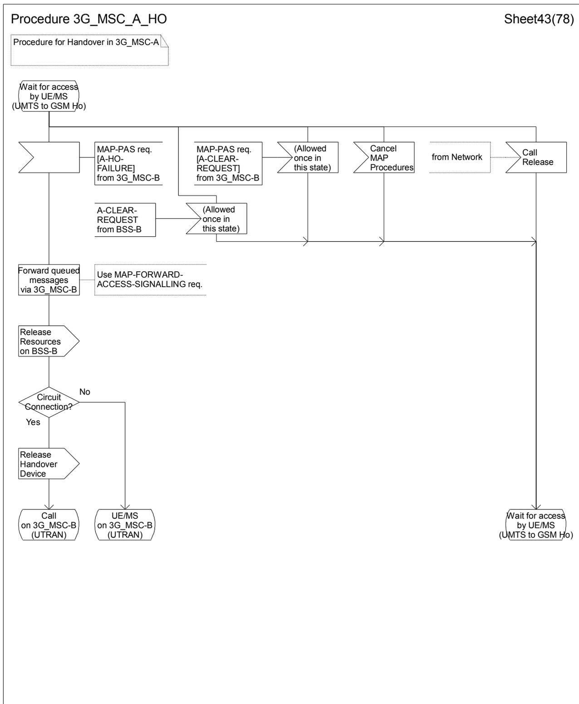

Procedure 3G\_MSC\_A\_HOSheet43(78)

Procedure for Handover in 3G\_MSC-A

```

      graph TD
      Start([Wait for access by UE/MS  
(UMTS to GSM Ho)])
      
      Start --- Junction1
      
      Junction1 --> MAP_FAIL[/MAP-PAS req.  
[A-HO-FAILURE]  
from 3G_MSC-B/]
      Junction1 --> MAP_CLEAR[/MAP-PAS req.  
[A-CLEAR-REQUEST]  
from 3G_MSC-B/]
      Junction1 --> BSS_CLEAR[/A-CLEAR-REQUEST  
from BSS-B/]
      Junction1 --> Net_In[/from Network/]
      
      MAP_FAIL --> Cancel[Cancel MAP Procedures]
      MAP_CLEAR --> Allowed1{Allowed once in this state}
      BSS_CLEAR --> Allowed2{Allowed once in this state}
      Net_In --> CallRel[Call Release]
      
      Allowed1 --> CallRel
      Allowed2 --> CallRel
      Allowed2 --> Forward[Forward queued messages  
via 3G_MSC-B]
      
      Forward -.-> ForwardNote[Use MAP-FORWARD-ACCESS-SIGNALLING req.]
      Forward --> RelRes[Release Resources on BSS-B]
      RelRes --> CircuitConn{Circuit Connection?}
      
      CircuitConn -- Yes --> RelDev[Release Handover Device]
      RelDev --> CallUTRAN([Call on 3G_MSC-B  
(UTRAN)])
      
      CircuitConn -- No --> UEUTRAN([UE/MS on 3G_MSC-B  
(UTRAN)])
      
      Cancel --- EndJunction
      CallRel --- EndJunction
      EndJunction --> End([Wait for access by UE/MS  
(UMTS to GSM Ho)])
    
```

**Figure 43 (sheet 43 of 78): Handover control procedure in 3G\_MSC-A**

![Flowchart of Procedure 3G_MSC_A_HO. The process starts at connector 20, sends a MAP-PREPARE-HANDOVER req [A-HO-REQUEST] to MSC-B', waits for an acknowledgment, then checks if a handover number was requested. If not requested, it proceeds to connector 21. If requested, it sends an I_CONNECT (IAM) to MSC-B' using the handover number, waits for a connection, and then proceeds to connector 21. If a failure is received from MSC-B', it sends a MAP-PREPARE-SUBSEQUENT-HANDOVER resp. [A-HO-FAILURE] to 3G_MSC-B and makes a call on 3G_MSC-B (UTRAN).](c0ef0292328b1602e278f6a0b2ee07e0_img.jpg)

### Procedure 3G\_MSC\_A\_HO

Sheet44(78)

Procedure for Handover in 3G\_MSC-A

Subsequent UMTS to GSM  
Handover from 3G\_MSC-B to MSC-B'  
Circuit Connection required

```
graph TD; 20((20)) --> P1{{ }}; P1 -- "MAP-PREPARE-HANDOVER req [A-HO-REQUEST] to MSC-B'" --> W1([Wait for Ack from MSC-B' (UMTS to GSM Ho)]); W1 --> D1{Handover Number?}; D1 -- "Not Requested" --> 21((21)); D1 -- "Requested" --> P2{{ }}; P2 -- "I_CONNECT (IAM) to MSC-B' using Handover Number" --> W2([Wait for Connection from MSC-B' (UMTS to GSM Ho)]); W2 --> 21; W1 --> P3{{ }}; P3 -- "MAP-PREPARE-HANDOVER resp. [A-HO-FAILURE] from MSC-B'" --> P4{{ }}; P4 -- "MAP-PREPARE-SUBSEQUENT-HANDOVER resp. [A-HO-FAILURE] to 3G_MSC-B" --> C([Call on 3G_MSC-B (UTRAN)]);
```

Flowchart of Procedure 3G\_MSC\_A\_HO. The process starts at connector 20, sends a MAP-PREPARE-HANDOVER req [A-HO-REQUEST] to MSC-B', waits for an acknowledgment, then checks if a handover number was requested. If not requested, it proceeds to connector 21. If requested, it sends an I\_CONNECT (IAM) to MSC-B' using the handover number, waits for a connection, and then proceeds to connector 21. If a failure is received from MSC-B', it sends a MAP-PREPARE-SUBSEQUENT-HANDOVER resp. [A-HO-FAILURE] to 3G\_MSC-B and makes a call on 3G\_MSC-B (UTRAN).

Figure 43 (sheet 44 of 78): Handover control procedure in 3G\_MSC-A


### Procedure 3G\_MSC\_A\_HO

Procedure for Handover in 3G\_MSC-A

Sheet45(78)

```
graph TD; Start([Wait for Ack from MSC-B' (UMTS to GSM Ho)]) --> ERROR1{ERROR}; Start --> FROM_3G[from 3G_MSC-B or Network]; Start --> CALL_RELEASE{Call Release}; ERROR1 --> FROM_MSCB1[from MSC-B']; FROM_3G --> ERROR2{ERROR}; CALL_RELEASE --> FROM_UE[From UE/MS or Network]; ERROR1 --> RELEASE_MAP[Release MAP Resources]; RELEASE_MAP --> TO_MSCB1[to MSC-B']; RELEASE_MAP --> MAP_PAS[MAP-PAS req. [A-CLEAR-REQUEST] from 3G_MSC-B]; MAP_PAS --> CANCEL_MAP1[Cancel MAP Procedures]; CANCEL_MAP1 --> TO_MSCB2[to MSC-B']; CANCEL_MAP1 --> WAIT_ACK2([Wait for Ack from MSC-B' (UMTS to GSM Ho)]); ERROR2 --> MAP_PREPARE[MAP-PREPARE-SUBSEQUENT-HANDOVER resp. to 3G_MSC-B]; MAP_PREPARE --> CALL_3G([Call on 3G_MSC-B (UTRAN)]); CALL_RELEASE --> CANCEL_MAP2[Cancel MAP Procedures]; CANCEL_MAP2 --> TO_MSCB3[to MSC-B']; CANCEL_MAP2 --> MAP_SEND[MAP-SEND-END-SIGNAL resp. to 3G_MSC-B]; MAP_SEND --> RELEASE_DEVICE[Release Handover Device]; RELEASE_DEVICE --> I_DISCONNECT[I_DISCONNECT (REL) to 3G_MSC-B]; I_DISCONNECT --> IDLE([IDLE]);
```

Flowchart of Procedure 3G\_MSC\_A\_HO for handover control. The process starts with 'Wait for Ack from MSC-B' (UMTS to GSM Ho) and branches based on incoming signals: ERROR from MSC-B', from 3G\_MSC-B or Network, or Call Release from UE/MS. It includes steps for releasing MAP resources, sending MAP-PAS requests, canceling MAP procedures, and ending in an IDLE state or returning to a call on 3G\_MSC-B (UTRAN).

Figure 43 (sheet 45 of 78): Handover control procedure in 3G\_MSC-A

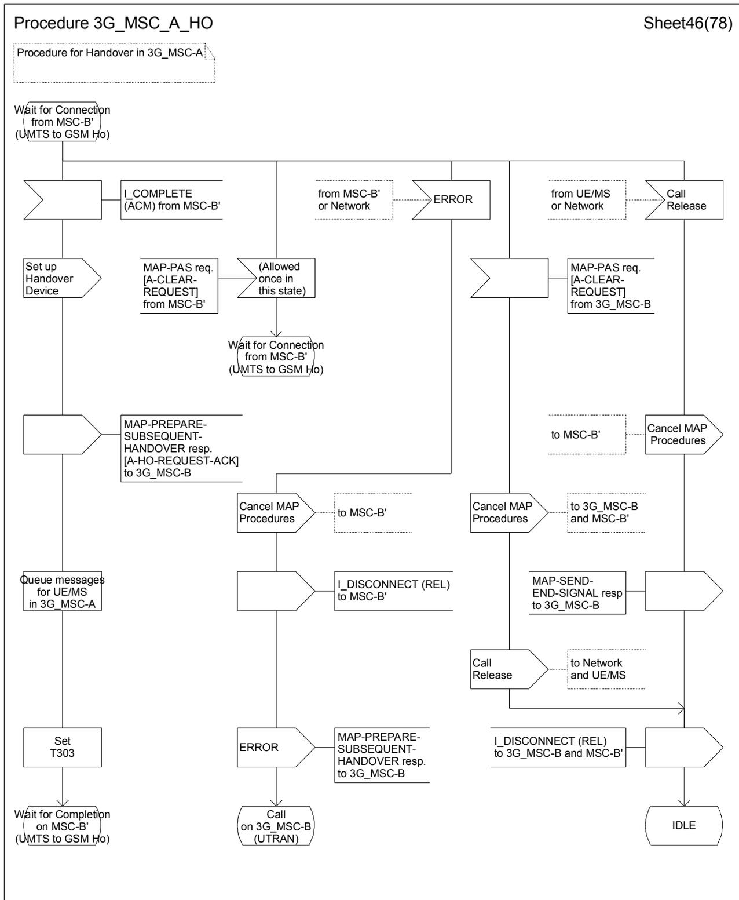

**Procedure 3G\_MSC\_A\_HO** Sheet46(78)

Procedure for Handover in 3G\_MSC-A

```

stateDiagram-v2
    [*] --> Wait4Conn_B_UMTS_GSM
    state "Wait for Connection from MSC-B' (UMTS to GSM Ho)" as Wait4Conn_B_UMTS_GSM
    state "Set up Handover Device" as SetupHo
    state "Queue messages for UE/MS in 3G_MSC-A" as QueueMsgs
    state "Set T303" as SetT303
    state "Wait for Completion on MSC-B' (UMTS to GSM Ho)" as Wait4Comp_B_UMTS_GSM
    state "ERROR" as ERROR
    state "Call on 3G_MSC-B (UTRAN)" as Call_3G_MSC_B
    state "IDLE" as IDLE

    Wait4Conn_B_UMTS_GSM --> SetupHo
    SetupHo --> QueueMsgs
    QueueMsgs --> SetT303
    SetT303 --> Wait4Comp_B_UMTS_GSM

    Wait4Conn_B_UMTS_GSM --> ERROR : from MSC-B' or Network
    ERROR --> Call_3G_MSC_B

    Wait4Conn_B_UMTS_GSM --> Call Release : from UE/MS or Network
    Call Release --> IDLE

    SetupHo --> MAP_PAS_req_UMTS_GSM : MAP-PAS req. [A-CLEAR-REQUEST] from MSC-B'
    MAP_PAS_req_UMTS_GSM --> AllowedOnce : (Allowed once in this state)
    AllowedOnce --> Wait4Conn_B_UMTS_GSM

    SetupHo --> MAP_PREPARE_SUBSEQ_HO_resp : MAP-PREPARE-SUBSEQUENT-HANDOVER resp. [A-HO-REQUEST-ACK] to 3G_MSC-B
    MAP_PREPARE_SUBSEQ_HO_resp --> Cancel_MAP_Proc_B_prime : to MSC-B'
    Cancel_MAP_Proc_B_prime --> I_DISCONNECT_REL_B_prime : I_DISCONNECT (REL) to MSC-B'
    I_DISCONNECT_REL_B_prime --> ERROR
    ERROR --> MAP_PREPARE_SUBSEQ_HO_resp_3G_MSC_B : MAP-PREPARE-SUBSEQUENT-HANDOVER resp. to 3G_MSC-B
    MAP_PREPARE_SUBSEQ_HO_resp_3G_MSC_B --> Call_3G_MSC_B

    SetupHo --> MAP_PAS_req_3G_MSC_B : MAP-PAS req. [A-CLEAR-REQUEST] from 3G_MSC-B
    MAP_PAS_req_3G_MSC_B --> Cancel_MAP_Proc_3G_MSC_B : to 3G_MSC-B and MSC-B'
    Cancel_MAP_Proc_3G_MSC_B --> MAP_SEND_END_SIGNAL_resp : MAP-SEND-END-SIGNAL resp to 3G_MSC-B
    MAP_SEND_END_SIGNAL_resp --> Call Release_Network_UE_MS : to Network and UE/MS
    Call Release_Network_UE_MS --> I_DISCONNECT_REL_3G_MSC_B : I_DISCONNECT (REL) to 3G_MSC-B and MSC-B'
    I_DISCONNECT_REL_3G_MSC_B --> IDLE
  
```

State transition diagram for Procedure 3G\_MSC\_A\_HO showing various states and transitions between MSC-A, MSC-B, MSC-B', and UE/MS.

Figure 43 (sheet 46 of 78): Handover control procedure in 3G\_MSC-A

![Sequence diagram for Procedure 3G_MSC_A_HO showing handover control between MSC-B', 3G_MSC-B, and the network. The process starts with a wait for completion from MSC-B' (UMTS to GSM Ho). It branches based on signals received: MAP-SEND-END-SIGNAL req. [A-HO-COMPLETE], MAP-PAS req. [A-HO-DETECT], and MAP-PAS req. [A-CLEAR-REQUEST]. The left path completes the handover to MSC-B (GSM). The middle path handles a clear request from MSC-B'. The right path handles a clear request from 3G_MSC-B, leading to a decision on UE/MS access. If 'Yes', it continues the handover. If 'No', it releases the handover device, cancels MAP procedures, releases the call, and returns to IDLE.](74340c36eadb11d858e925d7b77260bf_img.jpg)

**Procedure 3G\_MSC\_A\_HO** Sheet47(78)

Procedure for Handover in 3G\_MSC-A

```

sequenceDiagram
    participant Network
    participant MSC_B_prime as MSC-B'
    participant 3G_MSC_B as 3G_MSC-B
    participant UE_MS as UE/MS

    Note left of MSC_B_prime: Wait for Completion on MSC-B' (UMTS to GSM Ho)
    MSC_B_prime->>Network: MAP-SEND-END-SIGNAL req. [A-HO-COMPLETE] from MSC-B'
    Note left of Network: Reset T303
    Network->>MSC_B_prime: I_ANSWER (ANM) from MSC-B'
    Note left of Network: Connect Handover Device (option)
    Note left of Network: Forward queued messages for UE/MS via MSC-B'
    Note right of Network: Use MAP-FORWARD-ACCESS-SIGNALING req.
    Network->>3G_MSC_B: MAP-SEND-END-SIGNAL resp. to 3G_MSC-B
    Network->>3G_MSC_B: I_DISCONNECT (REL) to 3G_MSC-B
    Note left of Network: Redefine MSC-B' as MSC-B
    Network->>3G_MSC_B: Call on MSC-B (GSM)

    Note left of Network: Wait for Completion from MSC-B' (UMTS to GSM Ho)
    MSC_B_prime->>Network: MAP-PAS req. [A-HO-DETECT] from MSC-B'
    Note left of Network: Connect Handover Device (option)

    Note left of Network: Wait for Completion from MSC-B' (UMTS to GSM Ho)
    3G_MSC_B->>Network: MAP-PAS req. [A-CLEAR-REQUEST] from 3G_MSC-B
    Note right of Network: (Allowed once in this state)
    Note right of Network: Wait for access by UE/MS?
    alt Yes
        Note right of Network: Connect Handover Device (option)
    else No
        Note right of Network: Release Handover Device
        Note right of Network: Cancel MAP Procedures
        Note right of Network: Call Release
        Note right of Network: to Network and UE/MS
        Note right of Network: I_DISCONNECT (REL) to 3G_MSC-B and MSC-B'
        Note right of Network: IDLE
    end
  
```

Sequence diagram for Procedure 3G\_MSC\_A\_HO showing handover control between MSC-B', 3G\_MSC-B, and the network. The process starts with a wait for completion from MSC-B' (UMTS to GSM Ho). It branches based on signals received: MAP-SEND-END-SIGNAL req. [A-HO-COMPLETE], MAP-PAS req. [A-HO-DETECT], and MAP-PAS req. [A-CLEAR-REQUEST]. The left path completes the handover to MSC-B (GSM). The middle path handles a clear request from MSC-B'. The right path handles a clear request from 3G\_MSC-B, leading to a decision on UE/MS access. If 'Yes', it continues the handover. If 'No', it releases the handover device, cancels MAP procedures, releases the call, and returns to IDLE.

Figure 43 (sheet 47 of 78): Handover control procedure in 3G\_MSC-A

![Flowchart of Procedure 3G_MSC_A_HO for handover control. The process starts with 'Wait for Completion on MSC-B' (UMTS to GSM Ho) and branches based on various triggers like 'Expiry T303', 'MAP-PAS req. [A-HO-FAILURE]', or messages from '3G_MSC-B' or 'MSC-B''. It includes steps for 'Cancel MAP Procedures', 'Release Handover Device', 'I_DISCONNECT (REL)', and 'Call Release', leading to 'IDLE' or 'Call on 3G_MSC-B (UTRAN)' states.](9f5f9afcedaa0d9b7991976f5000865c_img.jpg)

### Procedure 3G\_MSC\_A\_HO

Sheet48(78)

Procedure for Handover in 3G\_MSC-A

```

    graph TD
        Start([Wait for Completion on MSC-B'   
(UMTS to GSM Ho)]) --> Branch{ }
        
        Branch --> ExpiryT303[/Expiry T303/]
        ExpiryT303 --> ResetT303[Reset T303]
        ResetT303 --> CancelMAP1[/Cancel MAP Procedures/]
        CancelMAP1 --> ToMSCB1[to MSC-B']
        ToMSCB1 --> ReleaseHD1[/Release Handover Device/]
        ReleaseHD1 --> IDISC1[I_DISCONNECT   
(REL) to MSC-B']
        IDISC1 --> MSCBConn{3G_MSC-B   
Connection?}
        MSCBConn -- No --> CallRel1[/Call Release/]
        CallRel1 --> ToNet1[to Network]
        ToNet1 --> IDLE1([IDLE])
        MSCBConn -- Yes --> UseMAP[Use MAP-FORWARD-ACCESS-SIGNALLING req.]
        UseMAP --> FwdQueued[Forward queued messages for UE/MS via 3G_MSC-B]
        FwdQueued --> CallUTRAN([Call on 3G_MSC-B   
(UTRAN)])

        Branch --> MAP_PAS[/MAP-PAS req.   
[A-HO-FAILURE]   
from 3G_MSC-B/]
        MAP_PAS --> FromMSCB_B[/from 3G_MSC-B/]
        FromMSCB_B --> CancelMAP2[/Cancel MAP Procedures/]
        CancelMAP2 --> IDISC2[I_DISCONNECT   
(REL) to 3G_MSC-B]
        IDISC2 --> ReleaseHD2[/Release Handover Device/]
        ReleaseHD2 --> WaitAccess{Wait for   
access by UE/MS?}
        WaitAccess -- No --> CancelMAP3[/Cancel MAP Procedures/]
        CancelMAP3 --> ToMSCB2[to MSC-B']
        ToMSCB2 --> IDISC3[I_DISCONNECT   
(REL) to MSC-B']
        IDISC3 --> IDLE2([IDLE])
        WaitAccess -- Yes --> CallRel2[/Call Release/]
        CallRel2 --> Start

        Branch --> FromMSCB_Prime[/from MSC-B'/]
        FromMSCB_Prime --> CancelMAP4[/Cancel MAP Procedures/]
        CancelMAP4 --> ReleaseHD3[/Release Handover Device/]
        ReleaseHD3 --> WaitAccess

        Branch --> FromNet[/From Network   
or 3G_MSC-B/]
        FromNet --> CallRel2

        Branch --> CallRel3[/Call Release/]
        CallRel3 --> Start
    
```

Flowchart of Procedure 3G\_MSC\_A\_HO for handover control. The process starts with 'Wait for Completion on MSC-B' (UMTS to GSM Ho) and branches based on various triggers like 'Expiry T303', 'MAP-PAS req. [A-HO-FAILURE]', or messages from '3G\_MSC-B' or 'MSC-B''. It includes steps for 'Cancel MAP Procedures', 'Release Handover Device', 'I\_DISCONNECT (REL)', and 'Call Release', leading to 'IDLE' or 'Call on 3G\_MSC-B (UTRAN)' states.

Figure 43 (sheet 48 of 78): Handover control procedure in 3G\_MSC-A

![Flowchart of Procedure 3G_MSC_A_HO for UMTS to GSM handover. The process starts at connector 18, queues messages, sends an Iu-Relocation Command, sets timer T303, and waits for the UE/MS on MSC-B. It then branches based on signals from MSC-B: MAP-SEND-END-SIGNAL req. [A-HO-COMPLETE], MAP-PAS req. [A-CLEAR-REQUEST], Iu-RELEASE-REQUEST, and MAP-PAS req. [A-HO-DETECT]. Depending on these signals, it either resets T303, releases resources, forwards messages, and ends with UE/MS on MSC-B (GSM); or it releases resources on RNS-A, waits for the UE/MS, and ends in an IDLE state.](993921f0d5f99fb48933465306644535_img.jpg)

### Procedure 3G\_MSC\_A\_HO

Sheet49(78)

Procedure for Handover in 3G\_MSC-A
Basic UMTS to GSM Handover to MSC-B  
no Circuit Connection required

```

graph TD
    Start((18)) --> Queue[Queue Messages for UE/MS in 3G_MSC-A]
    Queue --> Command[/Iu-Relocation Command to RNS-A/]
    Command --> T303[Set T303]
    T303 --> Wait1([Wait for UE/MS on MSC-B  
UMTS to GSM Ho])
    
    Wait1 --> Branch{ }
    
    Branch --> Signal1[/MAP-SEND-END-SIGNAL req.  
A-HO-COMPLETE  
from MSC-B/]
    Signal1 --> Reset[Reset T303]
    Reset --> Release1[Release Resources on RNS-A]
    Release1 --> Forward[Forward queued messages for UE/MS via MSC-B]
    Forward --> UseMap[Use MAP-FORWARD-ACCESS-SIGNALLING req.]
    UseMap --> End1([UE/MS on MSC-B  
GSM])
    
    Branch --> Signal2[/MAP-PAS req.  
A-CLEAR-REQUEST  
from MSC-B/]
    Signal2 --> Allowed1{Allowed once in this state}
    Allowed1 --> Release2[Release Resources on RNS-A]
    Release2 --> Wait2{Wait for UE/MS on MSC-B?}
    Wait2 -- Yes --> End2([Wait for UE/MS on MSC-B  
UMTS to GSM Ho])
    Wait2 -- No --> CallRelease[Call Release]
    CallRelease --> ToNetwork[to Network and UE/MS]
    CallRelease --> ReleaseMap[Release MAP Resources]
    ReleaseMap --> ToMSCB[to MSC-B in 3G_MSC-A]
    ReleaseMap --> Idle([IDLE])
    
    Branch --> Signal3[/Iu-RELEASE-REQUEST from RNS-A/]
    Signal3 --> Allowed2{Allowed once in this state}
    Allowed2 --> Release3[Release Resources on RNS-A]
    Release3 --> Wait2
    
    Branch --> Signal4[/MAP-PAS req.  
A-HO-DETECT  
from MSC-B/]
    Signal4 --> End3([Wait for UE/MS on MSC-B  
UMTS to GSM Ho])
    
```

Flowchart of Procedure 3G\_MSC\_A\_HO for UMTS to GSM handover. The process starts at connector 18, queues messages, sends an Iu-Relocation Command, sets timer T303, and waits for the UE/MS on MSC-B. It then branches based on signals from MSC-B: MAP-SEND-END-SIGNAL req. [A-HO-COMPLETE], MAP-PAS req. [A-CLEAR-REQUEST], Iu-RELEASE-REQUEST, and MAP-PAS req. [A-HO-DETECT]. Depending on these signals, it either resets T303, releases resources, forwards messages, and ends with UE/MS on MSC-B (GSM); or it releases resources on RNS-A, waits for the UE/MS, and ends in an IDLE state.

Figure 43 (sheet 49 of 78): Handover control procedure in 3G\_MSC-A

![Flowchart of Procedure 3G_MSC_A_HO for handover control. The process starts with 'Wait for UE/MS on MSC-B (UMTS to GSM Ho)'. It branches into four main paths: 1) 'Iu-RELOCATION-CANCEL from RNS-A' leads to 'Reset T303', then 'Forward queued messages for UE/MS via RNS-A', then 'Cancel MAP Procedures' (labeled 'in 3G_MSC-A to MSC-B'), ending at 'Call in Progress on 3G_MSC-A (UTRAN)'. 2) 'Cancel MAP Procedures' (labeled 'from MSC-B') leads to 'Release Resources RNS-A', ending at 'Wait for UE/MS on MSC-B (UMTS to GSM Ho)'. 3) 'Expiry T303' leads to 'Cancel MAP Procedures' (labeled 'In 3G_MSC-A and to MSC-B'), then 'Release Resources RNS-A', ending at 'IDLE'. 4) 'Call Release' (labeled 'from Network') leads directly to 'Wait for UE/MS on MSC-B (UMTS to GSM Ho)'.](fe82ce00eaac699b60a35ccb558e7851_img.jpg)

### Procedure 3G\_MSC\_A\_HO

Sheet50(78)

Procedure for Handover in 3G\_MSC-A

```
graph TD; Start([Wait for UE/MS on MSC-B (UMTS to GSM Ho)]) --> Branch(( )); Branch --> IuRelocCancel[Iu-RELOCATION-CANCEL from RNS-A]; Branch --> CancelMap1[Cancel MAP Procedures]; Branch --> ExpiryT303[Expiry T303]; Branch --> CallRelease[Call Release]; IuRelocCancel --> ResetT303[Reset T303]; ResetT303 --> ForwardMsg[Forward queued messages for UE/MS via RNS-A]; ForwardMsg --> CancelMap2[Cancel MAP Procedures]; CancelMap2 -.-> Label1[In 3G_MSC-A to MSC-B]; CancelMap2 --> CallInProg([Call in Progress on 3G_MSC-A (UTRAN)]); CancelMap1 -.-> Label2[from MSC-B]; CancelMap1 --> ReleaseRes1[Release Resources RNS-A]; ReleaseRes1 --> WaitUEMS1([Wait for UE/MS on MSC-B (UMTS to GSM Ho)]); ExpiryT303 --> CancelMap3[Cancel MAP Procedures]; CancelMap3 -.-> Label3[In 3G_MSC-A and to MSC-B]; CancelMap3 --> ReleaseRes2[Release Resources RNS-A]; ReleaseRes2 --> Idle([IDLE]); CallRelease -.-> Label4[from Network]; CallRelease --> WaitUEMS2([Wait for UE/MS on MSC-B (UMTS to GSM Ho)]);
```

Flowchart of Procedure 3G\_MSC\_A\_HO for handover control. The process starts with 'Wait for UE/MS on MSC-B (UMTS to GSM Ho)'. It branches into four main paths: 1) 'Iu-RELOCATION-CANCEL from RNS-A' leads to 'Reset T303', then 'Forward queued messages for UE/MS via RNS-A', then 'Cancel MAP Procedures' (labeled 'in 3G\_MSC-A to MSC-B'), ending at 'Call in Progress on 3G\_MSC-A (UTRAN)'. 2) 'Cancel MAP Procedures' (labeled 'from MSC-B') leads to 'Release Resources RNS-A', ending at 'Wait for UE/MS on MSC-B (UMTS to GSM Ho)'. 3) 'Expiry T303' leads to 'Cancel MAP Procedures' (labeled 'In 3G\_MSC-A and to MSC-B'), then 'Release Resources RNS-A', ending at 'IDLE'. 4) 'Call Release' (labeled 'from Network') leads directly to 'Wait for UE/MS on MSC-B (UMTS to GSM Ho)'.

Figure 43 (sheet 50 of 78): Handover control procedure in 3G\_MSC-A


### Procedure 3G\_MSC\_A\_HO

Sheet51(78)

Procedure for Handover in 3G\_MSC-A

UE/MS Established on 3G\_MSC-B  
without a Circuit Connection

```

    graph TD
        State1([UE/MS on 3G_MSC-B]) --> Branch{ }
        
        %% Branch 1
        Branch --> Input1[/Request for Circuit Establishment/]
        Input1 --> Task1[MAP-PREPARE-HANDOVER req.  
[NULL]  
[A-ASG-REQUEST]  
to 3G_MSC-B]
        Task1 --> State2([Wait For Response  
from 3G_MSC-B  
GSM to UMTS Ho])

        %% Branch 2
        Branch --> Conn19((19))

        %% Branch 3
        Branch --> Input2[/From 3G_MSC-B/]
        Input2 --> Task2[MAP-PREPARE-SUBSEQUENT-HANDOVER req.  
[A-HO-REQUEST]  
from 3G_MSC-B]
        Task2 --> Conn19

        %% Branch 4
        Input2 --> Task3[Cancel MAP Procedures]
        Task3 --> Task4[Call Release]
        Task4 --> Output1[/to Network/]
        Output1 --> State3([IDLE])

        %% Branch 5
        Branch --> Input3[/From UE/MS or Network/]
        Input3 --> Task5[Call Release]
        Task5 --> Task6[MAP-SEND-END-SIGNAL resp.  
to 3G_MSC-B]
        Task6 --> State3
    
```

SDL Diagram for Procedure 3G\_MSC\_A\_HO showing handover logic branches from state UE/MS on 3G\_MSC-B. Branches include Request for Circuit Establishment, signals from 3G\_MSC-B, and signals from UE/MS or Network, leading to various MAP requests, call releases, and final states like IDLE or Wait For Response.

Figure 43 (sheet 51 of 78): Handover control procedure in 3G\_MSC-A

![Flowchart of the handover control procedure in 3G_MSC-A. The process starts with 'Wait For Response (from MSC-B) (UMTS to GSM Ho)'. It then branches into two paths. The left path consists of 'MAP-PREPARE-HANDOVER resp. [Handover Number] [A-ASG-COMplete] from MSC-B', followed by 'I_CONNECT (IAM) to MSC-B using Handover Number', and ends with 'Wait for Complete (from MSC-B) (UMTS to GSM Ho)'. The right path consists of 'Call Release' (with an external input 'From UE/MS or Network'), followed by 'MAP-SEND-END-SIGNAL resp. to MSC-B', and ends with 'IDLE'.](6bd84b6e2e96b0d1193956b5a04b0e69_img.jpg)

**Procedure 3G\_MSC\_A\_HO** Sheet52(78)

Procedure for Handover in 3G\_MSC-A      Circuit Connection Establishment to MSC-B

```
graph TD; Start[Wait For Response from MSC-B UMTS to GSM Ho] --> LeftPath[ ]; Start --> RightPath[ ]; subgraph LeftPath; L1[MAP-PREPARE-HANDOVER resp. Handover Number A-ASG-COMplete from MSC-B] --> L2[I_CONNECT IAM to MSC-B using Handover Number] --> L3[Wait for Complete from MSC-B UMTS to GSM Ho]; end; subgraph RightPath; R1[Call Release] --> R2[MAP-SEND-END-SIGNAL resp. to MSC-B] --> R3[IDLE]; end; style LeftPath fill:none,stroke:none; style RightPath fill:none,stroke:none;
```

Flowchart of the handover control procedure in 3G\_MSC-A. The process starts with 'Wait For Response (from MSC-B) (UMTS to GSM Ho)'. It then branches into two paths. The left path consists of 'MAP-PREPARE-HANDOVER resp. [Handover Number] [A-ASG-COMplete] from MSC-B', followed by 'I\_CONNECT (IAM) to MSC-B using Handover Number', and ends with 'Wait for Complete (from MSC-B) (UMTS to GSM Ho)'. The right path consists of 'Call Release' (with an external input 'From UE/MS or Network'), followed by 'MAP-SEND-END-SIGNAL resp. to MSC-B', and ends with 'IDLE'.

Figure 43 (sheet 52 of 78): Handover control procedure in 3G\_MSC-A

![Flowchart of Procedure 3G_MSC_A_HO for handover control. The process starts with 'Wait For Response (from MSC-B) (UMTS to GSM Ho)'. It branches into three main paths: 1) Success: 'MAP-PAS req. [A-CLEAR-REQUEST] from MSC-B' -> '(Allowed once in this state)' -> 'UE/MS on MSC-B (GSM)'. 2) Error/Failure: 'MAP-PREPRE-HANDOVER resp. [MAP ERROR] from MSC-B' or 'MAP-PREPRE-HANDOVER resp. [A-ASG-FAILURE] from MSC-B' -> 'Failure' -> 'Response to Circuit Establishment Request' -> 'UE/MS on MSC-B (GSM)'. 3) Cancellation: 'Cancel MAP Procedures from MSC-B' -> 'Call Release to Network' -> 'Failure' -> 'Response to Circuit Establishment Request' -> 'IDLE'.](5f5a8699620b98137f36540ead9912f9_img.jpg)

### Procedure 3G\_MSC\_A\_HO

Procedure for Handover in 3G\_MSC-A

Sheet53(78)

```
graph TD; Start[Wait For Response from MSC-B UMTS to GSM Ho] --> Decision1{ }; Decision1 --> Success[MAP-PAS req. A-CLEAR-REQUEST from MSC-B]; Decision1 --> Error1[MAP-PREPRE-HANDOVER resp. MAP ERROR from MSC-B]; Decision1 --> Error2[MAP-PREPRE-HANDOVER resp. A-ASG-FAILURE from MSC-B]; Decision1 --> Cancel[Cancel MAP Procedures from MSC-B]; Success --> Allowed{(Allowed once in this state)}; Allowed --> End1((UE/MS on MSC-B GSM)); Error1 --> Failure1[Failure]; Failure1 --> Response1[Response to Circuit Establishment Request]; Response1 --> End2((UE/MS on MSC-B GSM)); Error2 --> Failure2[Failure]; Failure2 --> Response2[Response to Circuit Establishment Request]; Response2 --> End3((IDLE)); Cancel --> CallRelease[Call Release to Network]; CallRelease --> Failure3[Failure]; Failure3 --> Response3[Response to Circuit Establishment Request]; Response3 --> End3;
```

Flowchart of Procedure 3G\_MSC\_A\_HO for handover control. The process starts with 'Wait For Response (from MSC-B) (UMTS to GSM Ho)'. It branches into three main paths: 1) Success: 'MAP-PAS req. [A-CLEAR-REQUEST] from MSC-B' -> '(Allowed once in this state)' -> 'UE/MS on MSC-B (GSM)'. 2) Error/Failure: 'MAP-PREPRE-HANDOVER resp. [MAP ERROR] from MSC-B' or 'MAP-PREPRE-HANDOVER resp. [A-ASG-FAILURE] from MSC-B' -> 'Failure' -> 'Response to Circuit Establishment Request' -> 'UE/MS on MSC-B (GSM)'. 3) Cancellation: 'Cancel MAP Procedures from MSC-B' -> 'Call Release to Network' -> 'Failure' -> 'Response to Circuit Establishment Request' -> 'IDLE'.

Figure 43 (sheet 53 of 78): Handover control procedure in 3G\_MSC-A

![State transition diagram for Procedure 3G_MSC_A_HO. The diagram shows various states and transitions for a handover process. States include 'Wait for Complete (from MSC-B) (UMTS to GSM Ho)', 'Success', 'Response to Circuit Establishment Request', 'Call on MSC-B (GSM)', 'Cancel MAP Procedures', 'Failure', 'Response to Circuit Establishment Request', 'IDLE', 'Call Release', 'From UE/MS or Network', 'MAP-SEND-END-SIGNAL resp. to MSC-B', and 'I_DISCONNECT (REL) to MSC-B'. Transitions are labeled with messages like 'I_COMPLETE (ACM) from MSC-B', 'I-ANSWER (ANM) from MSC-B', 'MAP-PAS req. [A-CLEAR-REQUEST] from MSC-B', '(Allowed once in this state)', 'Response to Circuit Establishment Request', and 'MAP-SEND-END-SIGNAL resp. to MSC-B'.](841943891f19fcd045f406339e8d5655_img.jpg)

### Procedure 3G\_MSC\_A\_HO

Procedure for Handover in 3G\_MSC-A

Sheet54(78)

```
stateDiagram-v2
    [*] --> S1: Wait for Complete (from MSC-B) (UMTS to GSM Ho)
    S1 --> S2: I_COMPLETE (ACM) from MSC-B
    S1 --> S3: I-ANSWER (ANM) from MSC-B
    S1 --> S4: MAP-PAS req. [A-CLEAR-REQUEST] from MSC-B
    S1 --> S5: Call Release
    S1 --> S6: from MSC-B
    S1 --> S7: Response to Circuit Establishment Request
    S2 --> S8: Success
    S2 --> S9: Response to Circuit Establishment Request
    S3 --> S10: Call on MSC-B (GSM)
    S4 --> S11: (Allowed once in this state)
    S5 --> S12: From UE/MS or Network
    S6 --> S13: Cancel MAP Procedures
    S7 --> S14: Failure
    S8 --> S15: Wait for Complete (from MSC-B) (UMTS to GSM Ho)
    S9 --> S16: IDLE
    S10 --> S17: IDLE
    S11 --> S18: IDLE
    S12 --> S19: MAP-SEND-END-SIGNAL resp. to MSC-B
    S13 --> S20: IDLE
    S14 --> S21: I_DISCONNECT (REL) to MSC-B
    S15 --> S22: IDLE
```

State transition diagram for Procedure 3G\_MSC\_A\_HO. The diagram shows various states and transitions for a handover process. States include 'Wait for Complete (from MSC-B) (UMTS to GSM Ho)', 'Success', 'Response to Circuit Establishment Request', 'Call on MSC-B (GSM)', 'Cancel MAP Procedures', 'Failure', 'Response to Circuit Establishment Request', 'IDLE', 'Call Release', 'From UE/MS or Network', 'MAP-SEND-END-SIGNAL resp. to MSC-B', and 'I\_DISCONNECT (REL) to MSC-B'. Transitions are labeled with messages like 'I\_COMPLETE (ACM) from MSC-B', 'I-ANSWER (ANM) from MSC-B', 'MAP-PAS req. [A-CLEAR-REQUEST] from MSC-B', '(Allowed once in this state)', 'Response to Circuit Establishment Request', and 'MAP-SEND-END-SIGNAL resp. to MSC-B'.

Figure 43 (sheet 54 of 78): Handover control procedure in 3G\_MSC-A

![Flowchart of Procedure 3G_MSC_A_HO for handover control. The process starts at connector 21, sends a MAP-PREPARE-SUBSEQUENT-HANDOVER response, queues messages, sets timer T303, and waits for UE/MS on MSC-B' (UMTS to GSM Ho). It then branches based on signals from MSC-B' (MAP-SEND-END-SIGNAL req, MAP-PAS req. [A-HO-DETECT]) and 3G_MSC-B (MAP-PAS req. [A-CLEAR-REQUEST]). Depending on whether access is allowed and the state, it either completes the handover (redefining MSC-B' as MSC-B, UE/MS on MSC-B (GSM)), cancels procedures, or releases the call to an IDLE state.](c69cb6aeb2c0a91ab4ba98bddf14e55a_img.jpg)

**Procedure 3G\_MSC\_A\_HO** Sheet55(78)

Procedure for Handover in 3G\_MSC-A

Subsequent UMTS to GSM Handover from 3G\_MSC-B to MSC-B' no Circuit Connection required.

```

graph TD
    Start((21)) --> MAP_Prep[MAP-PREPARE-SUBSEQUENT-HANDOVER resp. [A-HO-REQUEST-ACK] to 3G_MSC-B]
    MAP_Prep --> Queue[Queue Messages for UE/MS in 3G_MSC-A]
    Queue --> Set_T303[Set T303]
    Set_T303 --> Wait_UE_MS[Wait for UE/MS on MSC-B' (UMTS to GSM Ho)]
    
    Wait_UE_MS --> MAP_End_Sig[MAP-SEND-END-SIGNAL req. [A-HO-COMPLETE] from MSC-B']
    Wait_UE_MS --> MAP_PAS_Det[MAP-PAS req. [A-HO-DETECT] from MSC-B']
    Wait_UE_MS --> Allowed_Once[Allowed once in this state]
    
    MAP_End_Sig --> Reset_T303[Reset T303]
    Reset_T303 --> Forward_Queue[Forward queued messages for UE/MS via MSC-B']
    Forward_Queue --> Redefine[Redfine MSC-B' as MSC-B]
    Redefine --> UE_MS_GSM[UE/MS on MSC-B (GSM)]
    
    MAP_PAS_Det --> Allowed_Once
    Allowed_Once --> Wait_Access{Wait for access by UE/MS?}
    
    Wait_UE_MS --> MAP_PAS_Req[MAP-PAS req. [A-CLEAR-REQUEST] from 3G_MSC-B]
    MAP_PAS_Req --> Allowed_Once
    
    Allowed_Once --> Wait_Access
    Wait_Access -- Yes --> Wait_UE_MS
    Wait_Access -- No --> Cancel[Cancel MAP Procedures]
    Cancel --> Call_Release[Call Release]
    Call_Release --> IDLE[IDLE]
    
    Cancel -- to 3G_MSC-B and MSC-B' --> Wait_UE_MS
    Call_Release -- to Network and UE/MS --> Wait_UE_MS
  
```

Flowchart of Procedure 3G\_MSC\_A\_HO for handover control. The process starts at connector 21, sends a MAP-PREPARE-SUBSEQUENT-HANDOVER response, queues messages, sets timer T303, and waits for UE/MS on MSC-B' (UMTS to GSM Ho). It then branches based on signals from MSC-B' (MAP-SEND-END-SIGNAL req, MAP-PAS req. [A-HO-DETECT]) and 3G\_MSC-B (MAP-PAS req. [A-CLEAR-REQUEST]). Depending on whether access is allowed and the state, it either completes the handover (redefining MSC-B' as MSC-B, UE/MS on MSC-B (GSM)), cancels procedures, or releases the call to an IDLE state.

Figure 43 (sheet 55 of 78): Handover control procedure in 3G\_MSC-A

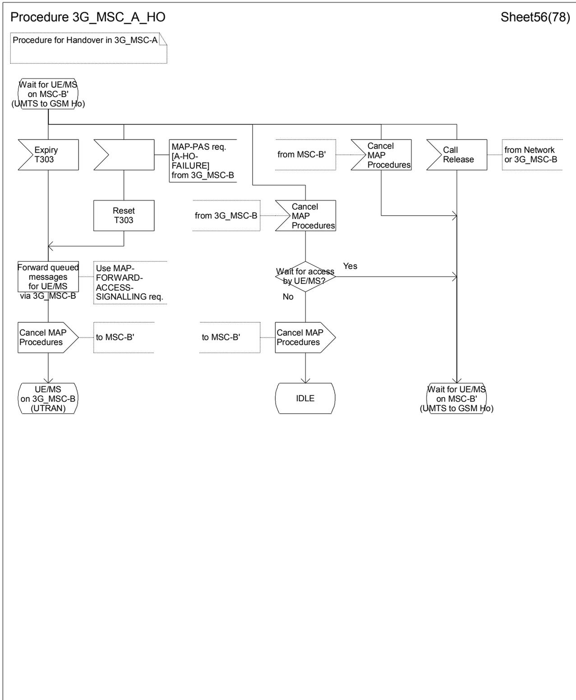

### Procedure 3G\_MSC\_A\_HO

Sheet56(78)

Procedure for Handover in 3G\_MSC-A

```

graph TD
    State1([Wait for UE/MS on MSC-B'   
(UMTS to GSM Ho)])
    
    State1 --- BranchLine[ ]
    
    BranchLine --- In1[/Expiry T303/]
    BranchLine --- In2[/ /]
    BranchLine --- In3[/MAP-PAS req.   
[A-HO-FAILURE]   
from 3G_MSC-B/]
    BranchLine --- In4[/from MSC-B'/]
    BranchLine --- In5[/Cancel MAP Procedures/]
    BranchLine --- In6[/Call Release/]
    BranchLine --- In7[/from Network   
or 3G_MSC-B/]

    In1 --> Task1[Reset T303]
    Task1 --> Task2[Forward queued   
messages for UE/MS   
via 3G_MSC-B]
    Task2 --> Out1{{Use MAP-FORWARD-ACCESS-SIGNALLING req.}}
    Out1 --> Task3[Cancel MAP Procedures]
    Task3 --> Out2{{to MSC-B'}}
    Out2 --> State2([UE/MS on 3G_MSC-B   
(UTRAN)])

    In4 --> Task4[Cancel MAP Procedures]
    Task4 --> Out3{{to MSC-B'}}
    Task4 --> Dec1{Wait for access   
by UE/MS?}
    Dec1 -- No --> Task5[Cancel MAP Procedures]
    Task5 --> Out4{{to MSC-B'}}
    Task5 --> State3([IDLE])
    
    Dec1 -- Yes --> Join1[ ]
    In6 --> Join1
    Join1 --> State4([Wait for UE/MS   
on MSC-B'   
(UMTS to GSM Ho)])
    
```

SDL Flowchart for Procedure 3G\_MSC\_A\_HO showing handover control logic in 3G\_MSC-A.

**Figure 43 (sheet 56 of 78): Handover control procedure in 3G\_MSC-A**

![Flowchart of Procedure 3G_MSC_A_HO. It starts at connector 17, sends a MAP-PREPARE-HANDOVER req. [IU-RLC-REQUEST] to 3G_MSC-B, and waits for an acknowledgement. A decision diamond 'Handover Number?' follows. If 'Not Requested', it goes to connector 22. If 'Requested', it sends an L_CONNECT (IAM) to 3G_MSC-B and waits for a connection. The diagram also shows three possible responses from 3G_MSC-B: a successful response [IU-RLC-REQUEST-ACK], a failure response [IU-RLC-FAILURE], and an error response [MAP ERROR]. The failure and error responses lead to connector 16.](3d885b841119080a2bcfd603a7afca63_img.jpg)

### Procedure 3G\_MSC\_A\_HO

Procedure for Handover in 3G\_MSC-A

Basic SRNS Relocation to 3G\_MSC-B  
Circuit Connection required

Sheet57(78)

```
graph TD; 17((17)) --> P1[MAP-PREPARE-HANDOVER req. [IU-RLC-REQUEST] to 3G_MSC-B]; P1 --> W1[Wait For Acknowledgement from 3G_MSC-B (SRNS Relocation)]; W1 --> D{Handover Number?}; D -- Not Requested --> 22((22)); D -- Requested --> P2[L_CONNECT (IAM) to 3G_MSC-B using Handover Number]; P2 --> W2[Wait for Connection from 3G_MSC-B (SRNS Relocation)]; W1 --> R1[MAP-PREPARE-HANDOVER resp. [IU-RLC-REQUEST-ACK] from 3G_MSC-B]; W1 --> R2[MAP-PREPARE-HANDOVER resp. [IU-RLC-FAILURE] from 3G_MSC-B]; W1 --> R3[MAP-PREPARE-HANDOVER resp. [MAP ERROR] from 3G_MSC-B]; R2 --> 16((16)); R3 --> 16((16));
```

Flowchart of Procedure 3G\_MSC\_A\_HO. It starts at connector 17, sends a MAP-PREPARE-HANDOVER req. [IU-RLC-REQUEST] to 3G\_MSC-B, and waits for an acknowledgement. A decision diamond 'Handover Number?' follows. If 'Not Requested', it goes to connector 22. If 'Requested', it sends an L\_CONNECT (IAM) to 3G\_MSC-B and waits for a connection. The diagram also shows three possible responses from 3G\_MSC-B: a successful response [IU-RLC-REQUEST-ACK], a failure response [IU-RLC-FAILURE], and an error response [MAP ERROR]. The failure and error responses lead to connector 16.

Figure 43 (sheet 57 of 78): Handover control procedure in 3G\_MSC-A


### Procedure 3G\_MSC\_A\_HO

Sheet58(78)

Procedure for Handover in 3G\_MSC-A

```
graph TD; Start([Wait For Acknowledgement from 3G_MSC-B (SRNS Relocation)]) --> ERROR{ERROR}; ERROR -- from 3G_MSC-B --> CMR1{Cancel MAP Resources}; CMR1 -- in 3G_MSC-A --> 16((16)); Start --> IuRR[Iu-RELEASE-REQUEST]; IuRR -- from RNS-A --> CR1{Call Release}; CR1 -- to Network --> RR[Release Resources in RNS-A]; Start --> CR2{Call Release}; CR2 -- From UE or Network --> RR; RR --> CMR2{Cancel MAP Resources}; CMR2 -- to 3G_MSC-B --> IDLE([IDLE]);
```

Flowchart of Procedure 3G\_MSC\_A\_HO for handover control. It starts with 'Wait For Acknowledgement from 3G\_MSC-B (SRNS Relocation)'. From here, an 'ERROR' from 3G\_MSC-B leads to 'Cancel MAP Resources in 3G\_MSC-A' and then to connector '16'. A 'Iu-RELEASE-REQUEST from RNS-A' leads to a 'Call Release' block, which then leads to 'Release Resources in RNS-A', 'Cancel MAP Resources to 3G\_MSC-B', and finally 'IDLE'. Another 'Call Release' from 'UE or Network' also leads to 'Release Resources in RNS-A'.

Figure 43 (sheet 58 of 78): Handover control procedure in 3G\_MSC-A

![Flowchart of Procedure 3G_MSC_A_HO for Handover in 3G_MSC-A. The process starts with 'Wait for Connection from 3G_MSC-B (SRNS Relocation)'. It branches based on incoming messages: 'I_COMPLETE (ACM) from 3G_MSC-B', 'MAP-PAS req. [IU-IREL-REQUEST] from 3G_MSC-B', 'IU-RELEASE-REQUEST from RNS-A', or an 'ERROR from 3G_MSC-B or Network'. The 'I_COMPLETE' path leads to 'Queue Messages for UE in 3G_MSC-A' and then 'IU-RELOCATION COMMAND to RNS-A'. The 'MAP-PAS req.' path has an 'Allowed once in this state' check leading to 'Wait for Connection from 3G_MSC-B (SRNS Relocation)'. The 'IU-RELEASE-REQUEST' path has an 'Allowed once in this state' check leading to 'Call Release' (to UE and Network) and 'Release Resources in RNS-A'. The 'ERROR' path leads to 'I_DISCONNECT (REL) to 3G_MSC-B' and then to connector '16'. From 'Release Resources in RNS-A', the flow goes to 'Cancel MAP Procedures' (to 3G_MSC-B in 3G_MSC-A), then 'I_DISCONNECT (REL) to 3G_MSC-B', and finally to 'IDLE'. The 'IU-RELOCATION COMMAND to RNS-A' path continues with 'Set T703', 'Set Up the Handover Device' (with an internal message in 3G_MSC-A), and 'Wait for Completion (on 3G_MSC-B) (SRNS Relocation)'.](59b0fc7f07c6794ca85c36c2d06a5fd9_img.jpg)

### Procedure 3G\_MSC\_A\_HO

Procedure for Handover in 3G\_MSC-A

Sheet59(78)

```
graph TD; Start[Wait for Connection from 3G_MSC-B (SRNS Relocation)] --> I_COMPLETE[I_COMPLETE (ACM) from 3G_MSC-B]; Start --> MAP_PAS[MAP-PAS req. [IU-IREL-REQUEST] from 3G_MSC-B]; Start --> IU_RELEASE[IU-RELEASE-REQUEST from RNS-A]; Start --> ERROR[ERROR from 3G_MSC-B or Network]; I_COMPLETE --> Queue[Queue Messages for UE in 3G_MSC-A]; Queue --> IU_REL[ IU-RELOCATION COMMAND to RNS-A]; IU_REL --> T703[Set T703]; T703 --> Setup[Set Up the Handover Device]; Setup --> Internal[Internal message in 3G_MSC-A]; Internal --> WaitComp[Wait for Completion (on 3G_MSC-B) (SRNS Relocation)]; MAP_PAS --> Allowed1[Allowed once in this state]; Allowed1 --> WaitConn[Wait for Connection from 3G_MSC-B (SRNS Relocation)]; IU_RELEASE --> Allowed2[Allowed once in this state]; Allowed2 --> CallRelease[Call Release to UE and Network]; CallRelease --> ReleaseRes[Release Resources in RNS-A]; ReleaseRes --> CancelMap[Cancel MAP Procedures to 3G_MSC-B in 3G_MSC-A]; CancelMap --> IDisconnect[ I_DISCONNECT (REL) to 3G_MSC-B]; IDisconnect --> IDLE[IDLE]; ERROR --> IDisconnectRel[ I_DISCONNECT (REL) to 3G_MSC-B]; IDisconnectRel --> Connector16((16));
```

Flowchart of Procedure 3G\_MSC\_A\_HO for Handover in 3G\_MSC-A. The process starts with 'Wait for Connection from 3G\_MSC-B (SRNS Relocation)'. It branches based on incoming messages: 'I\_COMPLETE (ACM) from 3G\_MSC-B', 'MAP-PAS req. [IU-IREL-REQUEST] from 3G\_MSC-B', 'IU-RELEASE-REQUEST from RNS-A', or an 'ERROR from 3G\_MSC-B or Network'. The 'I\_COMPLETE' path leads to 'Queue Messages for UE in 3G\_MSC-A' and then 'IU-RELOCATION COMMAND to RNS-A'. The 'MAP-PAS req.' path has an 'Allowed once in this state' check leading to 'Wait for Connection from 3G\_MSC-B (SRNS Relocation)'. The 'IU-RELEASE-REQUEST' path has an 'Allowed once in this state' check leading to 'Call Release' (to UE and Network) and 'Release Resources in RNS-A'. The 'ERROR' path leads to 'I\_DISCONNECT (REL) to 3G\_MSC-B' and then to connector '16'. From 'Release Resources in RNS-A', the flow goes to 'Cancel MAP Procedures' (to 3G\_MSC-B in 3G\_MSC-A), then 'I\_DISCONNECT (REL) to 3G\_MSC-B', and finally to 'IDLE'. The 'IU-RELOCATION COMMAND to RNS-A' path continues with 'Set T703', 'Set Up the Handover Device' (with an internal message in 3G\_MSC-A), and 'Wait for Completion (on 3G\_MSC-B) (SRNS Relocation)'.

Figure 43 (sheet 59 of 78): Handover control procedure in 3G\_MSC-A

![Flowchart of Procedure 3G_MSC_A_HO for Handover in 3G_MSC-A. The process starts with 'Wait for Completion (on 3G_MSC-B) (SRNS Relocation)'. It branches into three main paths based on signals received from 3G_MSC-B: 1) MAP-SEND-END-SIGNAL req. [IU-RLC-COMPLETE], 2) I-ANSWER (ANM) from 3G_MSC-B, and 3) MAP-PAS req. [IU-RLC-DETECT]. The first path leads to 'Reset T703' and then 'Connect Handover Device (option)'. The second path leads to a decision '(Allowed once in this state)'. If 'Yes', it sends 'MAP-PAS req. [IU-IREL-REQUEST] from 3G_MSC-B' and then 'Wait for Completion (on 3G_MSC-B) (SRNS Relocation)'. If 'No', it sends 'Iu-RELEASE-REQUEST from RNS-A', 'Release Resources on RNS-A', and then another decision 'Wait for UE on 3G_MSC-B?'. If 'Yes', it goes to 'Connect Handover Device (option)'. If 'No', it sends 'Call Release to Network and UE', 'Release MAP Resources to 3G_MSC-B in 3G_MSC-A', 'I_DISCONNECT (REL) to 3G_MSC-B', and ends at 'IDLE'. The third path leads to 'MAP-PAS req. [IU-RLC-DETECT] from 3G_MSC-B', which then leads to 'Connect Handover Device (option)' and 'Wait for Completion (on 3G_MSC-B) (SRNS Relocation)'. All three main paths eventually lead to 'Forward queued messages via 3G_MSC-B', 'Use MAP-FORWARD-ACCESS-SIGNALLING req', 'Release Resources on RNS-A', and 'Call on 3G_MSC-B (UTRAN)'.](87f625baee73880fd5464a9f60b1b3b8_img.jpg)

**Procedure 3G\_MSC\_A\_HO** Sheet60(78)

Procedure for Handover in 3G\_MSC-A

```

graph TD
    Start[Wait for Completion  
(on 3G_MSC-B)  
(SRNS Relocation)] --> J1(( ))
    J1 --> S1[MAP-SEND-  
END-SIGNAL req.  
[IU-RLC-COMPLETE]  
from 3G_MSC-B]
    J1 --> S2[I-ANSWER  
(ANM) from 3G_MSC-B]
    J1 --> S3[MAP-PAS req.  
[IU-RLC-DETECT]  
from 3G_MSC-B]
    S1 --> R1[Reset  
T703]
    R1 --> H1[Connect  
Handover  
Device (option)]
    S2 --> D1{Allowed  
once in  
this state}
    D1 -- Yes --> S4[MAP-PAS req.  
[IU-IREL-REQUEST]  
from 3G_MSC-B]
    S4 --> W1[Wait for Completion  
(on 3G_MSC-B)  
(SRNS Relocation)]
    D1 -- No --> S5[Iu-RELEASE-REQUEST  
from RNS-A]
    S5 --> R2[Release  
Resources  
on RNS-A]
    R2 --> D2{Wait for UE on  
3G_MSC-B?}
    D2 -- Yes --> H1
    D2 -- No --> C1[Call  
Release]
    C1 --> N1[to Network  
and UE]
    C1 --> R3[Release MAP  
Resources]
    R3 --> N2[to 3G_MSC-B  
in 3G_MSC-A]
    R3 --> S6[I_DISCONNECT  
(REL) to 3G_MSC-B]
    S6 --> I1[IDLE]
    S3 --> H2[Connect  
Handover  
Device (option)]
    H2 --> W2[Wait for Completion  
(on 3G_MSC-B)  
(SRNS Relocation)]
    H1 --> F1[Forward queued  
messages  
via 3G_MSC-B]
    F1 --> S7[Use MAP-  
FORWARD-ACCESS-  
SIGNALLING req]
    S7 --> R4[Release  
Resources  
on RNS-A]
    R4 --> C2[Call  
on 3G_MSC-B  
(UTRAN)]
  
```

Flowchart of Procedure 3G\_MSC\_A\_HO for Handover in 3G\_MSC-A. The process starts with 'Wait for Completion (on 3G\_MSC-B) (SRNS Relocation)'. It branches into three main paths based on signals received from 3G\_MSC-B: 1) MAP-SEND-END-SIGNAL req. [IU-RLC-COMPLETE], 2) I-ANSWER (ANM) from 3G\_MSC-B, and 3) MAP-PAS req. [IU-RLC-DETECT]. The first path leads to 'Reset T703' and then 'Connect Handover Device (option)'. The second path leads to a decision '(Allowed once in this state)'. If 'Yes', it sends 'MAP-PAS req. [IU-IREL-REQUEST] from 3G\_MSC-B' and then 'Wait for Completion (on 3G\_MSC-B) (SRNS Relocation)'. If 'No', it sends 'Iu-RELEASE-REQUEST from RNS-A', 'Release Resources on RNS-A', and then another decision 'Wait for UE on 3G\_MSC-B?'. If 'Yes', it goes to 'Connect Handover Device (option)'. If 'No', it sends 'Call Release to Network and UE', 'Release MAP Resources to 3G\_MSC-B in 3G\_MSC-A', 'I\_DISCONNECT (REL) to 3G\_MSC-B', and ends at 'IDLE'. The third path leads to 'MAP-PAS req. [IU-RLC-DETECT] from 3G\_MSC-B', which then leads to 'Connect Handover Device (option)' and 'Wait for Completion (on 3G\_MSC-B) (SRNS Relocation)'. All three main paths eventually lead to 'Forward queued messages via 3G\_MSC-B', 'Use MAP-FORWARD-ACCESS-SIGNALLING req', 'Release Resources on RNS-A', and 'Call on 3G\_MSC-B (UTRAN)'.

Figure 43 (sheet 60 of 78): Handover control procedure in 3G\_MSC-A

![Flowchart of Procedure 3G_MSC_A_HO for handover control. The process starts with 'Wait for Completion on 3G_MSC-B (SRNS Relocation)'. It branches into several paths: 1) 'Iu-RELOCATION-CANCEL from RNS-A' leads to 'Reset T703', then 'Forward queued messages for UE via RNS-A', then 'Release Handover Device', then 'Cancel MAP Procedures (in 3G_MSC-A to 3G_MSC-B)', then 'I_DISCONNECT (REL) to 3G_MSC-B', ending at 'Call in Progress on 3G_MSC-A (UTRAN)'. 2) A path leads to 'I_DISCONNECT (REL) from 3G_MSC-B', then 'Cancel MAP Procedures (In 3G_MSC-A and to 3G_MSC-B)', then 'Release Handover Device (Internal to 3G_MSC-A)', ending at 'Wait for Completion on 3G_MSC-B (SRNS Relocation)'. 3) A path leads to 'Expiry T703', which then leads to 'I_DISCONNECT (REL) to 3G_MSC-B', 'Cancel MAP Procedures (In 3G_MSC-A and to 3G_MSC-B)', 'Release Handover Device (Internal to 3G_MSC-A)', 'Release Resources RNS-A', ending at 'IDLE'. 4) A path leads to 'Call Release from Network', then 'Release Handover Device (Internal to 3G_MSC-A)', ending at 'Wait for Completion on 3G_MSC-B (SRNS Relocation)'. 5) A path leads to 'Cancel MAP Procedures (from 3G_MSC-B)', then 'Release Handover Device', then 'I_DISCONNECT (REL) to 3G_MSC-B', ending at 'Wait for Completion on 3G_MSC-B (SRNS Relocation)'.](38c0f202ad5767f3df428353919fa90a_img.jpg)

### Procedure 3G\_MSC\_A\_HO

Procedure for Handover in 3G\_MSC-A

Sheet61(78)

```
graph TD; Start[Wait for Completion on 3G_MSC-B (SRNS Relocation)] --> Join(( )); Join --> Path1[ ]; Join --> Path2[ ]; Join --> Path3[ ]; Join --> Path4[ ]; Join --> Path5[ ]; Path1 --> P1_1[Iu-RELOCATION-CANCEL from RNS-A] --> P1_2[Reset T703] --> P1_3[Forward queued messages for UE via RNS-A] --> P1_4[Release Handover Device] --> P1_5[Cancel MAP Procedures in 3G_MSC-A to 3G_MSC-B] --> P1_6[I_DISCONNECT (REL) to 3G_MSC-B] --> P1_7[Call in Progress on 3G_MSC-A (UTRAN)]; Path2 --> P2_1[I_DISCONNECT (REL) from 3G_MSC-B] --> P2_2[Cancel MAP Procedures In 3G_MSC-A and to 3G_MSC-B] --> P2_3[Release Handover Device Internal to 3G_MSC-A] --> P2_4[Wait for Completion on 3G_MSC-B (SRNS Relocation)]; Path3 --> P3_1[Expiry T703] --> P3_2[I_DISCONNECT (REL) to 3G_MSC-B] --> P3_3[Cancel MAP Procedures In 3G_MSC-A and to 3G_MSC-B] --> P3_4[Release Handover Device Internal to 3G_MSC-A] --> P3_5[Release Resources RNS-A] --> P3_6[IDLE]; Path4 --> P4_1[Call Release from Network] --> P4_2[Release Handover Device Internal to 3G_MSC-A] --> P4_3[Wait for Completion on 3G_MSC-B (SRNS Relocation)]; Path5 --> P5_1[Cancel MAP Procedures from 3G_MSC-B] --> P5_2[Release Handover Device] --> P5_3[I_DISCONNECT (REL) to 3G_MSC-B] --> P5_4[Wait for Completion on 3G_MSC-B (SRNS Relocation)];
```

Flowchart of Procedure 3G\_MSC\_A\_HO for handover control. The process starts with 'Wait for Completion on 3G\_MSC-B (SRNS Relocation)'. It branches into several paths: 1) 'Iu-RELOCATION-CANCEL from RNS-A' leads to 'Reset T703', then 'Forward queued messages for UE via RNS-A', then 'Release Handover Device', then 'Cancel MAP Procedures (in 3G\_MSC-A to 3G\_MSC-B)', then 'I\_DISCONNECT (REL) to 3G\_MSC-B', ending at 'Call in Progress on 3G\_MSC-A (UTRAN)'. 2) A path leads to 'I\_DISCONNECT (REL) from 3G\_MSC-B', then 'Cancel MAP Procedures (In 3G\_MSC-A and to 3G\_MSC-B)', then 'Release Handover Device (Internal to 3G\_MSC-A)', ending at 'Wait for Completion on 3G\_MSC-B (SRNS Relocation)'. 3) A path leads to 'Expiry T703', which then leads to 'I\_DISCONNECT (REL) to 3G\_MSC-B', 'Cancel MAP Procedures (In 3G\_MSC-A and to 3G\_MSC-B)', 'Release Handover Device (Internal to 3G\_MSC-A)', 'Release Resources RNS-A', ending at 'IDLE'. 4) A path leads to 'Call Release from Network', then 'Release Handover Device (Internal to 3G\_MSC-A)', ending at 'Wait for Completion on 3G\_MSC-B (SRNS Relocation)'. 5) A path leads to 'Cancel MAP Procedures (from 3G\_MSC-B)', then 'Release Handover Device', then 'I\_DISCONNECT (REL) to 3G\_MSC-B', ending at 'Wait for Completion on 3G\_MSC-B (SRNS Relocation)'.

Figure 43 (sheet 61 of 78): Handover control procedure in 3G\_MSC-A


**Procedure 3G\_MSC\_A\_HO** Sheet62(78)

Procedure for Handover in 3G\_MSC-A

```

graph TD
    Start([Call on 3G_MSC-B (UTRAN)]) --> J1(( ))
    J1 --> D1{Known 3G_MSC?}
    D1 -- No --> J2(( ))
    D1 -- Yes --> D2{Which 3G_MSC?}
    D2 -- 3G_MSC-B' --> J3(( ))
    D2 -- 3G_MSC-A --> D3{Known RNS?}
    D3 -- No --> J2
    D3 -- Yes --> D4{Resources on new RNS?}
    D4 -- No --> J2
    D4 -- Yes --> P1[Iu-RELOCATION-REQUEST to RNS-B]
    P1 --> J4(( ))
    J4 --> P2[MAP-PREPARE-SUBSEQUENT-HANDOVER resp. [IU-RLC-FAILURE] to 3G_MSC-B]
    P2 --> J5(( ))
    J5 --> D5{Circuit Connection?}
    D5 -- No --> J2
    D5 -- Yes --> J6(( ))
    J6 --> P3[Set T701]
    P3 --> P4[Wait for Channel Allocation (SRNS Relocation)]
    P4 --> End([IDLE])
    J2 --> P5[MAP-PAS req. [IU-IREL-REQUEST] from 3G_MSC-B]
    P5 --> J7(( ))
    J7 --> P6[Cancel MAP procedures from 3G_MSC-B]
    P6 --> P7[Call Release to Network and UE]
    P7 --> End
    P5 --> P8[MAP-SEND-END-SIGNAL resp. to 3G_MSC-B]
    P8 --> J8(( ))
    J8 --> P9[I_DISCONNECT (REL) to 3G_MSC-B]
    P9 --> J9(( ))
    J9 --> End
    P5 --> P10[MAP-PREPARE-SUBSEQUENT-HANDOVER resp. [MAP ERROR] to 3G_MSC-B]
    P10 --> J10(( ))
    J10 --> End
    P10 --> P11[UE on 3G_MSC-B (UTRAN)]
    P11 --> End
    P10 --> P12[Call on 3G_MSC-B (UTRAN)]
    P12 --> End
    P10 --> P13[Call Release From UE or Network]
    P13 --> End
  
```

Flowchart of the handover control procedure in 3G\_MSC-A. The process starts with a call on 3G\_MSC-B (UTRAN). It checks if the MSC is known, then which 3G\_MSC it is (3G\_MSC-B' or 3G\_MSC-A). If 3G\_MSC-A, it checks if the RNS is known and if resources are available. Depending on these checks, it either initiates an Iu-RELOCATION-REQUEST, receives a failure response, or releases the call. The process ends in an IDLE state.

Figure 43 (sheet 62 of 78): Handover control procedure in 3G\_MSC-A

![Flowchart of Procedure 3G_MSC_A_HO for Handover in 3G_MSC-A. The process starts with 'Wait for Channel Allocation (SRNS Relocation)'. It branches based on incoming messages: 'Iu-RELOCATION-REQUEST-ACK. from RNS-B' leads to 'Reset T701' and 'Queue Messages for UE in 3G_MSC-A'; 'Iu-RELOCATION-FAILURE from RNS-B' leads to 'Reset T701' and a decision '(Allowed once in this state)'; 'Expiry T701' leads to 'Release Resources in RNS-B'; 'Call Release' from UE or Network leads to 'Cancel Channel RNS-B'. Further steps include 'MAP-PREPARE-SUBSEQUENT-HANDOVER resp [IU-RLC-REQUEST-ACK] to 3G_MSC-B', 'Circuit Connection?' decision, 'Set Up Handover Device', 'Set T704', and final states 'Wait for Access by UE (SRNS Relocation)', 'Call on 3G_MSC-B (UTRAN)', and 'IDLE'.](cdb980c2fe504f3132b907d4de707c7f_img.jpg)

**Procedure 3G\_MSC\_A\_HO** Sheet63(78)

Procedure for Handover in 3G\_MSC-A

```

    graph TD
      Start([Wait for Channel Allocation  
(SRNS Relocation)]) --> Join(( ))
      
      IuRelReqAck[Iu-RELOCATION-REQUEST-ACK.  
from RNS-B] --> Join
      IuRelFail[Iu-RELOCATION-FAILURE  
from RNS-B] --> Join
      ExpiryT701[Expiry  
T701] --> Join
      CallRelease[Call  
Release] --> Join
      
      FromUE[From UE  
or Network] -.-> CallRelease

      Join --> ResetT701_1[Reset  
T701]
      Join --> ResetT701_2[Reset  
T701]
      
      ResetT701_1 --> QueueMsgs[Queue Messages  
for UE in  
3G_MSC-A]
      
      ResetT701_2 --> AllowedOnce{Allowed  
once in  
this state}
      
      AllowedOnce -- Yes --> MAP_PAS[MAP-PAS req.  
[IU-IREL-REQUEST]  
from 3G_MSC-B]
      AllowedOnce -- No --> ReleaseRes_1[Release  
Resources  
in RNS-B]
      
      ReleaseRes_1 --> CallUTRAN_1([Call  
on 3G_MSC-B  
(UTRAN)])

      QueueMsgs --> MAP_PrepSub[MAP-PREPARE-  
SUBSEQUENT-  
HANDOVER resp  
[IU-RLC-REQUEST-  
ACK]  
to 3G_MSC-B]
      
      MAP_PrepSub --> CircuitConn{Circuit  
Connection?}
      
      CircuitConn -- No --> SetUpHandover[Set Up  
Handover  
Device]
      CircuitConn -- Yes --> SetT704[Set  
T704]
      SetUpHandover --> SetT704
      
      SetT704 --> WaitAccess([Wait for  
Access by UE  
(SRNS Relocation)])

      Join --> ReleaseRes_2[Release  
Resources  
in RNS-B]
      
      ReleaseRes_2 --> MAP_PrepSubFail[MAP-PREPARE-  
SUBSEQUENT-  
HANDOVER resp.  
[IU-RLC-FAILURE]  
to 3G_MSC-B]
      
      MAP_PrepSubFail --> CallUTRAN_2([Call  
on 3G_MSC-B  
(UTRAN)])

      CallRelease --> CancelChan[Cancel  
Channel  
RNS-B]
      
      CancelChan --> MAP_SendEnd[MAP-SEND-  
END-  
SIGNAL resp  
to 3G_MSC-B]
      
      MAP_SendEnd --> I_Disconnect[I_DISCONNECT  
(REL) to  
3G_MSC-B]
      
      I_Disconnect --> IDLE([IDLE])
  
```

Flowchart of Procedure 3G\_MSC\_A\_HO for Handover in 3G\_MSC-A. The process starts with 'Wait for Channel Allocation (SRNS Relocation)'. It branches based on incoming messages: 'Iu-RELOCATION-REQUEST-ACK. from RNS-B' leads to 'Reset T701' and 'Queue Messages for UE in 3G\_MSC-A'; 'Iu-RELOCATION-FAILURE from RNS-B' leads to 'Reset T701' and a decision '(Allowed once in this state)'; 'Expiry T701' leads to 'Release Resources in RNS-B'; 'Call Release' from UE or Network leads to 'Cancel Channel RNS-B'. Further steps include 'MAP-PREPARE-SUBSEQUENT-HANDOVER resp [IU-RLC-REQUEST-ACK] to 3G\_MSC-B', 'Circuit Connection?' decision, 'Set Up Handover Device', 'Set T704', and final states 'Wait for Access by UE (SRNS Relocation)', 'Call on 3G\_MSC-B (UTRAN)', and 'IDLE'.

Figure 43 (sheet 63 of 78): Handover control procedure in 3G\_MSC-A

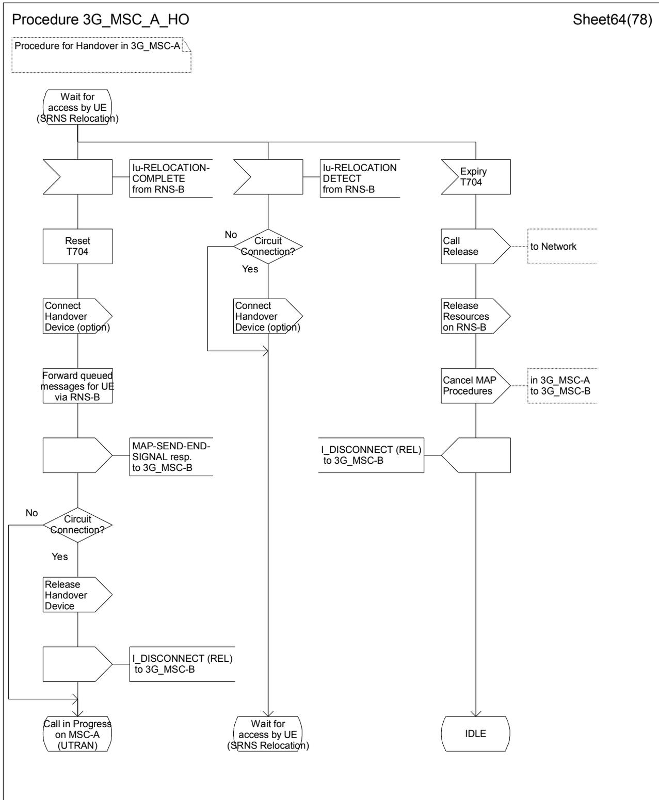

### Procedure 3G\_MSC\_A\_HO

Sheet64(78)

Procedure for Handover in 3G\_MSC-A

```
graph TD; Start([Wait for access by UE (SRNS Relocation)]) --> IuRelocComplete{Iu-RELOCATION-COMPLETE from RNS-B}; Start --> IuRelocDetect{Iu-RELOCATION DETECT from RNS-B}; Start --> T704Exp{Expiry T704}; IuRelocComplete --> ResetT704[Reset T704]; ResetT704 --> HandoverDeviceOpt1{{Connect Handover Device (option)}}; HandoverDeviceOpt1 --> ForwardQueued[Forward queued messages for UE via RNS-B]; ForwardQueued --> MAPSendEnd[MAP-SEND-END-SIGNAL resp. to 3G_MSC-B]; MAPSendEnd --> CircuitConn1{Circuit Connection?}; CircuitConn1 -- No --> CallInProgress([Call in Progress on MSC-A (UTRAN))]; CircuitConn1 -- Yes --> ReleaseHandover[Release Handover Device]; ReleaseHandover --> IDisconnectRel1[I_DISCONNECT (REL) to 3G_MSC-B]; IDisconnectRel1 --> CallInProgress; IuRelocDetect --> CircuitConn2{Circuit Connection?}; CircuitConn2 -- No --> CallInProgress; CircuitConn2 -- Yes --> HandoverDeviceOpt2{{Connect Handover Device (option)}}; HandoverDeviceOpt2 --> CallInProgress; T704Exp --> CallRelease[Call Release]; CallRelease --> ReleaseResources[Release Resources on RNS-B]; ReleaseResources --> CancelMAP[Cancel MAP Procedures]; CancelMAP --> IDisconnectRel2[I_DISCONNECT (REL) to 3G_MSC-B]; IDisconnectRel2 --> IDLE([IDLE])
```

The flowchart illustrates the handover control procedure in 3G\_MSC-A. It begins with a 'Wait for access by UE (SRNS Relocation)' state. From here, three main paths emerge based on the receipt of 'Iu-RELOCATION-COMPLETE from RNS-B', 'Iu-RELOCATION DETECT from RNS-B', or the 'Expiry T704' timer. The first path involves resetting T704, optionally connecting the handover device, forwarding queued messages, sending a MAP-SEND-END-SIGNAL, and then checking the circuit connection. If the connection is successful, the handover device is released and an I\_DISCONNECT (REL) message is sent to 3G\_MSC-B, returning the call to progress on MSC-A (UTRAN). If the connection fails, the call remains in progress. The second path, triggered by 'Iu-RELOCATION DETECT', checks the circuit connection; if successful, the handover device is connected and the call proceeds on MSC-A (UTRAN). The third path, triggered by 'Expiry T704', involves calling release, releasing resources on RNS-B, canceling MAP procedures, sending an I\_DISCONNECT (REL) message to 3G\_MSC-B, and returning to an IDLE state.

Flowchart of Procedure 3G\_MSC\_A\_HO showing three main paths: successful handover, circuit connection failure, and timer expiry.

Figure 43 (sheet 64 of 78): Handover control procedure in 3G\_MSC-A

![Flowchart of Procedure 3G_MSC_A_HO for Handover in 3G_MSC-A. The process starts with 'Wait for access by UE (SRNS Relocation)'. It branches into three main paths: 1) Success path: 'Forward queued messages via 3G_MSC-B' -> 'Use MAP-FORWARD-ACCESS-SIGNALLING req.' -> 'Release Resources on RNS-B' -> 'Circuit Connection?' (Yes) -> 'Release Handover Device' -> 'Call on 3G_MSC-B (UTRAN)' and 'UE on 3G_MSC-B (UTRAN)'. 2) Failure path: 'MAP-PAS req. [IU-RLC-FAILURE] from 3G_MSC-B' -> 'MAP-PAS req. [IU-IREL-REQUEST] from 3G_MSC-B' -> '(Allowed once in this state)' -> 'Cancel MAP Procedures' -> 'Call Release'. 3) Network-initiated path: 'IU-RELEASE-REQUEST from RNS-B' -> '(Allowed once in this state)' -> 'Call Release'. A 'from Network' box points to 'Call Release'. All terminal states lead to 'Wait for access by UE (SRNS Relocation)'.](5d819f259411162c4e3371915818ae22_img.jpg)

### Procedure 3G\_MSC\_A\_HO

Sheet65(78)

Procedure for Handover in 3G\_MSC-A

```
graph TD; Start([Wait for access by UE (SRNS Relocation)]) --> Fwd[Forward queued messages via 3G_MSC-B]; Fwd --> UseMAP[Use MAP-FORWARD-ACCESS-SIGNALLING req.]; UseMAP --> RelRes[Release Resources on RNS-B]; RelRes --> Conn{Circuit Connection?}; Conn -- Yes --> RelDev[Release Handover Device]; RelDev --> Call[Call on 3G_MSC-B (UTRAN)]; RelDev --> UE[UE on 3G_MSC-B (UTRAN)]; Call --> End([Wait for access by UE (SRNS Relocation))]; UE --> End; Conn -- No --> End; MAP_PAS_Req1[MAP-PAS req. [IU-RLC-FAILURE] from 3G_MSC-B] --> MAP_PAS_Req2[MAP-PAS req. [IU-IREL-REQUEST] from 3G_MSC-B]; MAP_PAS_Req2 --> Allowed1[(Allowed once in this state)]; Allowed1 --> Cancel[Cancel MAP Procedures]; IU_Release_Req[IU-RELEASE-REQUEST from RNS-B] --> Allowed2[(Allowed once in this state)]; Allowed2 --> CallRelease[Call Release]; fromNetwork[from Network] -.-> CallRelease; CallRelease --> End;
```

Flowchart of Procedure 3G\_MSC\_A\_HO for Handover in 3G\_MSC-A. The process starts with 'Wait for access by UE (SRNS Relocation)'. It branches into three main paths: 1) Success path: 'Forward queued messages via 3G\_MSC-B' -> 'Use MAP-FORWARD-ACCESS-SIGNALLING req.' -> 'Release Resources on RNS-B' -> 'Circuit Connection?' (Yes) -> 'Release Handover Device' -> 'Call on 3G\_MSC-B (UTRAN)' and 'UE on 3G\_MSC-B (UTRAN)'. 2) Failure path: 'MAP-PAS req. [IU-RLC-FAILURE] from 3G\_MSC-B' -> 'MAP-PAS req. [IU-IREL-REQUEST] from 3G\_MSC-B' -> '(Allowed once in this state)' -> 'Cancel MAP Procedures' -> 'Call Release'. 3) Network-initiated path: 'IU-RELEASE-REQUEST from RNS-B' -> '(Allowed once in this state)' -> 'Call Release'. A 'from Network' box points to 'Call Release'. All terminal states lead to 'Wait for access by UE (SRNS Relocation)'.

Figure 43 (sheet 65 of 78): Handover control procedure in 3G\_MSC-A

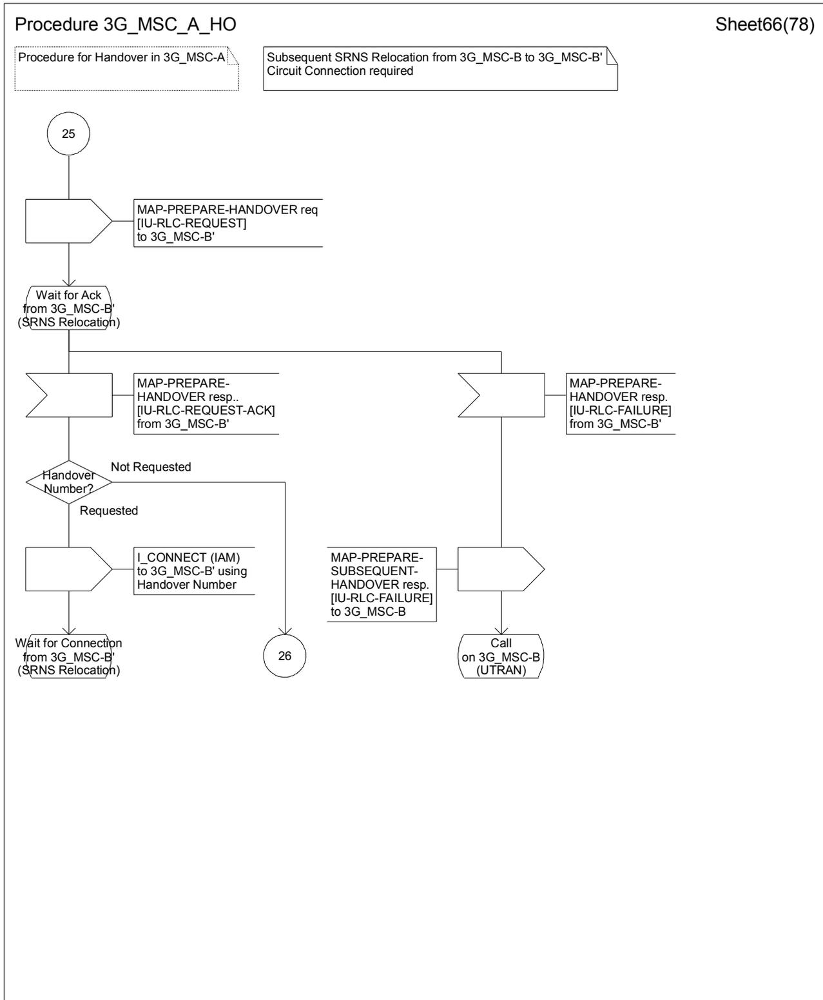

### Procedure 3G\_MSC\_A\_HO

Sheet66(78)

Procedure for Handover in 3G\_MSC-A

Subsequent SRNS Relocation from 3G\_MSC-B to 3G\_MSC-B'  
 Circuit Connection required

```

graph TD
    Start((25)) --> Out1[MAP-PREPARE-HANDOVER req  
IU-RLC-REQUEST  
to 3G_MSC-B']
    Out1 --> State1{{Wait for Ack  
from 3G_MSC-B'  
SRNS Relocation}}
    State1 --> In1[/MAP-PREPARE-  
HANDOVER resp..  
IU-RLC-REQUEST-ACK  
from 3G_MSC-B'/]
    State1 --> In2[/MAP-PREPARE-  
HANDOVER resp.  
IU-RLC-FAILURE  
from 3G_MSC-B'/]
    
    In1 --> Dec1{Handover  
Number?}
    Dec1 -- Not Requested --> Conn26((26))
    Dec1 -- Requested --> Out2[I_CONNECT IAM  
to 3G_MSC-B' using  
Handover Number]
    Out2 --> State2{{Wait for Connection  
from 3G_MSC-B'  
SRNS Relocation}}
    
    In2 --> Out3[MAP-PREPARE-  
SUBSEQUENT-  
HANDOVER resp.  
IU-RLC-FAILURE  
to 3G_MSC-B]
    Out3 --> State3{{Call  
on 3G_MSC-B  
UTRAN}}
    
```

SDL Flowchart for Procedure 3G\_MSC\_A\_HO

Figure 43 (sheet 66 of 78): Handover control procedure in 3G\_MSC-A

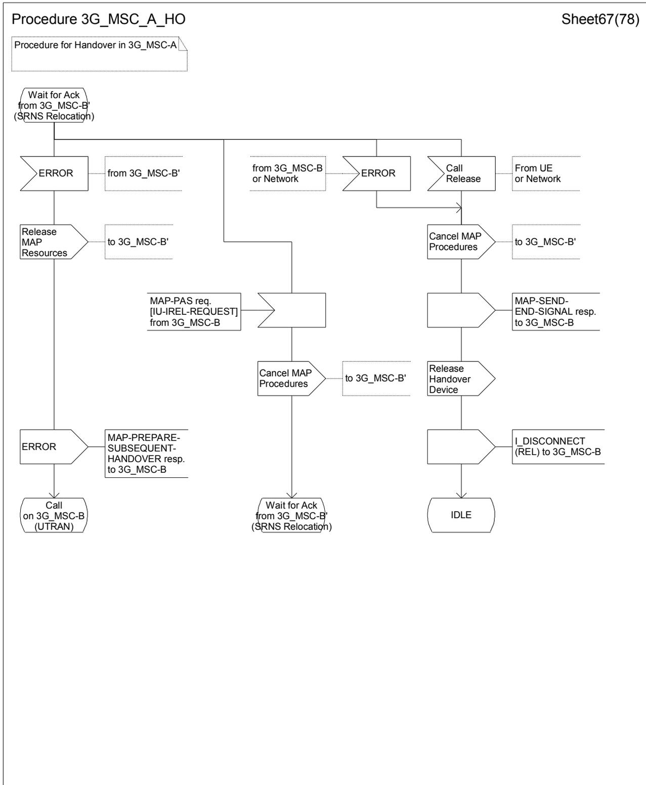

### Procedure 3G\_MSC\_A\_HO

Procedure for Handover in 3G\_MSC-A

Sheet67(78)

```

    graph TD
        %% Initial State
        START([Wait for Ack  
from 3G_MSC-B'  
(SRNS Relocation)])

        %% Branch 1: Error from B'
        START --- B1_IN[/ERROR/]
        B1_IN --- B1_FROM[from 3G_MSC-B']
        B1_IN --> B1_TASK1[Release  
MAP  
Resources]
        B1_TASK1 --- B1_TO[to 3G_MSC-B']
        B1_TASK1 --> B1_IN2[/ERROR/]
        B1_IN2 --> B1_TASK2[MAP-PREPARE-  
SUBSEQUENT-  
HANDOVER resp.  
to 3G_MSC-B]
        B1_TASK2 --> B1_END([Call  
on 3G_MSC-B  
(UTRAN)])

        %% Branch 2: Error from B or Network
        START --- B2_IN[/from 3G_MSC-B  
or Network/]
        B2_IN --> B2_SIG[/ERROR/]
        B2_SIG --> B2_JOIN(( ))
        B2_JOIN --> B2_IN2[/MAP-PAS req.  
IU-IREL-REQUEST  
from 3G_MSC-B/]
        B2_IN2 --> B2_TASK1[Cancel MAP  
Procedures]
        B2_TASK1 --- B2_TO[to 3G_MSC-B']
        B2_TASK1 --> START

        %% Branch 3: Call Release
        START --- B3_IN[/Call  
Release/]
        B3_IN --- B3_FROM[From UE  
or Network]
        B3_IN --> B3_TASK1[Cancel MAP  
Procedures]
        B3_TASK1 --- B3_TO[to 3G_MSC-B']
        B3_TASK1 --> B3_TASK2[MAP-SEND-  
END-SIGNAL resp.  
to 3G_MSC-B]
        B3_TASK2 --> B3_TASK3[Release  
Handover  
Device]
        B3_TASK3 --> B3_TASK4[I_DISCONNECT  
(REL) to 3G_MSC-B]
        B3_TASK4 --> B3_END([IDLE])
    
```

Figure 43 (sheet 67 of 78): Handover control procedure in 3G\_MSC-A

![Sequence diagram for Procedure 3G_MSC_A_HO showing handover control between 3G_MSC-A, 3G_MSC-B, 3G_MSC-B', UE, and Network. The diagram includes states like 'Wait for Connection', 'Set up Handover Device', 'Queue messages for UE in 3G_MSC-A', 'Set T703', 'ERROR', 'Call on 3G_MSC-B (UTRAN)', and 'IDLE'. Messages include I_COMPLETE (ACM), MAP-PAS req. [IU-IREL-REQUEST], MAP-PREPARE-SUBSEQUENT-HANDOVER resp. [IU-RLC-REQUEST-ACK], I_DISCONNECT (REL), MAP-SEND-END-SIGNAL resp., and Call Release.](7109096552c3464c931b0b39109b9b41_img.jpg)

**Procedure 3G\_MSC\_A\_HO** Sheet68(78)

Procedure for Handover in 3G\_MSC-A

```

sequenceDiagram
    participant UE
    participant Network
    participant 3G_MSC_B_prime as 3G_MSC-B'
    participant 3G_MSC_B as 3G_MSC-B
    participant 3G_MSC_A as 3G_MSC-A

    Note left of 3G_MSC_A: Wait for Connection from 3G_MSC-B' (SRNS Relocation)
    3G_MSC_A->>3G_MSC_A: I_COMPLETE (ACM) from 3G_MSC-B'
    Note right of 3G_MSC_A: Set up Handover Device
    3G_MSC_A->>3G_MSC_B_prime: MAP-PAS req. [IU-IREL-REQUEST] from 3G_MSC-B'
    Note right of 3G_MSC_B_prime: (Allowed once in this state)
    Note left of 3G_MSC_A: Wait for Connection from 3G_MSC-B' (SRNS Relocation)
    3G_MSC_A->>3G_MSC_B_prime: MAP-PREPARE-SUBSEQUENT-HANDOVER resp. [IU-RLC-REQUEST-ACK] to 3G_MSC-B
    Note right of 3G_MSC_A: Queue messages for UE in 3G_MSC-A
    Note right of 3G_MSC_A: Set T703
    Note left of 3G_MSC_A: Wait for Completion (on 3G_MSC-B') (SRNS Relocation)

    Note right of 3G_MSC_A: ERROR
    Note right of 3G_MSC_A: Call on 3G_MSC-B (UTRAN)

    Note right of 3G_MSC_A: Cancel MAP Procedures to 3G_MSC-B'
    Note right of 3G_MSC_A: I_DISCONNECT (REL) to 3G_MSC-B'
    Note right of 3G_MSC_A: MAP-PREPARE-SUBSEQUENT-HANDOVER resp. to 3G_MSC-B
    Note right of 3G_MSC_A: ERROR

    Note right of 3G_MSC_A: Cancel MAP Procedures to 3G_MSC-B and 3G_MSC-B'
    Note right of 3G_MSC_A: MAP-SEND-END-SIGNAL resp to 3G_MSC-B
    Note right of 3G_MSC_A: Call Release to Network and UE
    Note right of 3G_MSC_A: I_DISCONNECT (REL) to 3G_MSC-B and 3G_MSC-B'
    Note right of 3G_MSC_A: IDLE
  
```

Sequence diagram for Procedure 3G\_MSC\_A\_HO showing handover control between 3G\_MSC-A, 3G\_MSC-B, 3G\_MSC-B', UE, and Network. The diagram includes states like 'Wait for Connection', 'Set up Handover Device', 'Queue messages for UE in 3G\_MSC-A', 'Set T703', 'ERROR', 'Call on 3G\_MSC-B (UTRAN)', and 'IDLE'. Messages include I\_COMPLETE (ACM), MAP-PAS req. [IU-IREL-REQUEST], MAP-PREPARE-SUBSEQUENT-HANDOVER resp. [IU-RLC-REQUEST-ACK], I\_DISCONNECT (REL), MAP-SEND-END-SIGNAL resp., and Call Release.

Figure 43 (sheet 68 of 78): Handover control procedure in 3G\_MSC-A

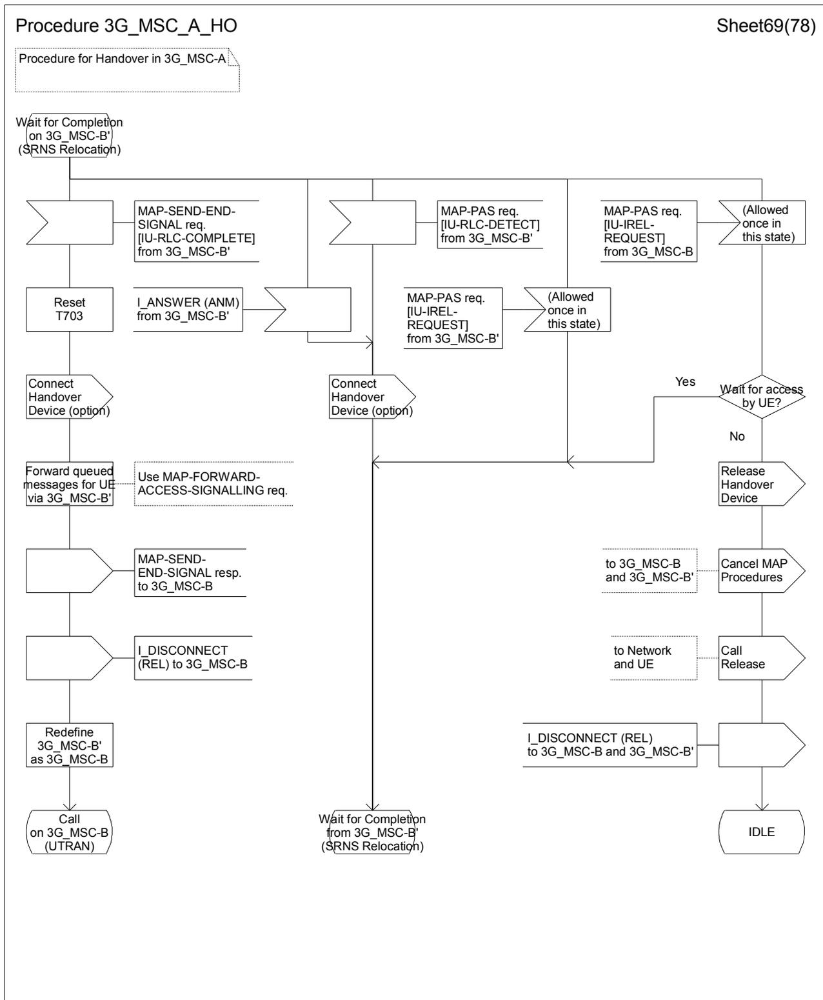

**Procedure 3G\_MSC\_A\_HO** Sheet69(78)

Procedure for Handover in 3G\_MSC-A

```

sequenceDiagram
    participant 3G_MSC_A as 3G_MSC-A
    participant 3G_MSC_B as 3G_MSC-B
    participant 3G_MSC_B_prime as 3G_MSC-B'
    Note left of 3G_MSC_A: Wait for Completion (on 3G_MSC-B') (SRNS Relocation)
    3G_MSC_A->>3G_MSC_B_prime: MAP-SEND-END-SIGNAL req. [IU-RLC-COMPLETE] from 3G_MSC-B'
    3G_MSC_A->>3G_MSC_B_prime: I_ANSWER (ANM) from 3G_MSC-B'
    Note right of 3G_MSC_A: Reset T703
    3G_MSC_A->>3G_MSC_B_prime: MAP-PAS req. [IU-RLC-DETECT] from 3G_MSC-B'
    Note right of 3G_MSC_A: (Allowed once in this state)
    3G_MSC_A->>3G_MSC_B_prime: MAP-PAS req. [IU-IREL-REQUEST] from 3G_MSC-B'
    Note right of 3G_MSC_A: (Allowed once in this state)
    3G_MSC_A->>3G_MSC_B_prime: MAP-PAS req. [IU-IREL-REQUEST] from 3G_MSC-B
    Note right of 3G_MSC_A: (Allowed once in this state)
    3G_MSC_A->>3G_MSC_B_prime: Connect Handover Device (option)
    Note right of 3G_MSC_A: (Allowed once in this state)
    3G_MSC_A->>3G_MSC_B_prime: Connect Handover Device (option)
    Note right of 3G_MSC_A: (Allowed once in this state)
    3G_MSC_A->>3G_MSC_B_prime: Forward queued messages for UE via 3G_MSC-B'
    Note right of 3G_MSC_A: Use MAP-FORWARD-ACCESS-SIGNALLING req.
    3G_MSC_A->>3G_MSC_B_prime: MAP-SEND-END-SIGNAL resp. to 3G_MSC-B
    3G_MSC_A->>3G_MSC_B_prime: I_DISCONNECT (REL) to 3G_MSC-B
    3G_MSC_A->>3G_MSC_B_prime: Redefine 3G_MSC-B' as 3G_MSC-B
    Note right of 3G_MSC_A: Call on 3G_MSC-B (UTRAN)
    3G_MSC_A->>3G_MSC_B_prime: Wait for Completion from 3G_MSC-B' (SRNS Relocation)
    Note right of 3G_MSC_A: Wait for access by UE?
    Note right of 3G_MSC_A: No
    3G_MSC_A->>3G_MSC_B_prime: Release Handover Device
    Note right of 3G_MSC_A: Cancel MAP Procedures
    Note right of 3G_MSC_A: to 3G_MSC-B and 3G_MSC-B'
    3G_MSC_A->>3G_MSC_B_prime: Call Release
    Note right of 3G_MSC_A: to Network and UE
    3G_MSC_A->>3G_MSC_B_prime: I_DISCONNECT (REL) to 3G_MSC-B and 3G_MSC-B'
    Note right of 3G_MSC_A: IDLE
  
```

Sequence diagram for Procedure 3G\_MSC\_A\_HO showing handover control between 3G\_MSC-A and 3G\_MSC-B/B'.

Figure 43 (sheet 69 of 78): Handover control procedure in 3G\_MSC-A

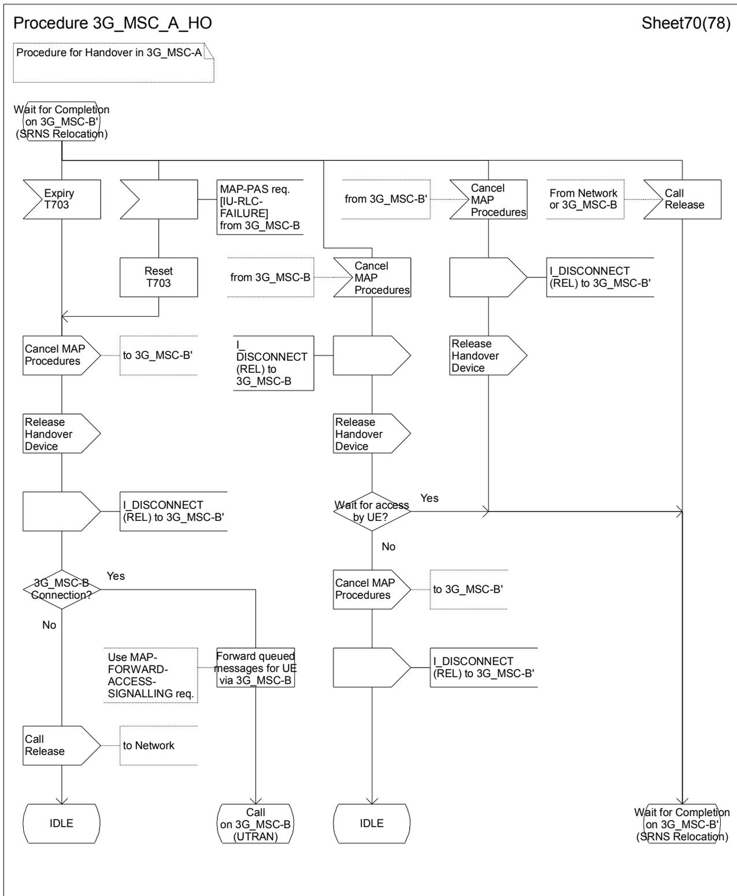

Procedure 3G\_MSC\_A\_HO

Sheet70(78)

Procedure for Handover in 3G\_MSC-A

```

  graph TD
      Start([Wait for Completion  
on 3G_MSC-B'  
(SRNS Relocation)])

      %% Path 1: Expiry T703
      Start --> Expiry[/Expiry  
T703/]
      Expiry --> CancelMAP1[Cancel MAP  
Procedures]
      CancelMAP1 --> ReleaseHD1[Release  
Handover  
Device]
      ReleaseHD1 --> I_DISC1[I_DISCONNECT  
(REL) to 3G_MSC-B']
      I_DISC1 --> ConnCheck{3G_MSC-B  
Connection?}
      ConnCheck -- No --> CallRel1[Call  
Release]
      CallRel1 --> ToNet1[to Network]
      ToNet1 --> Idle1([IDLE])
      ConnCheck -- Yes --> MapFwd[Use MAP-  
FORWARD-  
ACCESS-  
SIGNALLING req.]
      MapFwd --> FwdQueued[Forward queued  
messages for UE  
via 3G_MSC-B]
      FwdQueued --> CallUTRAN([Call  
on 3G_MSC-B  
(UTRAN)])

      %% Path 2: Reset T703 / MAP-PAS
      Expiry --> Reset[Reset  
T703]
      Reset --> MapPas[/MAP-PAS req.  
[IU-RLC-  
FAILURE]  
from 3G_MSC-B/]
      MapPas --> CancelMAP2[Cancel  
MAP  
Procedures]
      CancelMAP2 --> I_DISC2[I_DISCONNECT  
(REL) to 3G_MSC-B]
      I_DISC2 --> ReleaseHD2[Release  
Handover  
Device]
      ReleaseHD2 --> WaitUE{Wait for access  
by UE?}
      WaitUE -- Yes --> Start
      WaitUE -- No --> CancelMAP3[Cancel MAP  
Procedures]
      CancelMAP3 --> To3GMSCB[to 3G_MSC-B']
      To3GMSCB --> I_DISC3[I_DISCONNECT  
(REL) to 3G_MSC-B']
      I_DISC3 --> Idle2([IDLE])

      %% Path 3: from 3G_MSC-B'
      MapPas --> FromB[/from 3G_MSC-B'/]
      FromB --> CancelMAP4[Cancel  
MAP  
Procedures]
      CancelMAP4 --> ReleaseHD3[Release  
Handover  
Device]
      ReleaseHD3 --> WaitUE

      %% Path 4: From Network or 3G_MSC-B
      Start --> FromNet[/From Network  
or 3G_MSC-B/]
      FromNet --> CallRel2[/Call  
Release/]
      CallRel2 --> Start
  
```

Flowchart of Procedure 3G\_MSC\_A\_HO showing handover control logic including timer expiry, MAP failure handling, and connection status checks leading to either IDLE, Call on 3G\_MSC-B, or waiting for completion.

Figure 43 (sheet 70 of 78): Handover control procedure in 3G\_MSC-A

![Flowchart for Procedure 3G_MSC_A_HO. The process starts at connector 22, queues messages, sends an Iu-Relocation Command to RNS-A, sets timer T703, and waits for UE on 3G_MSC-B. It then branches based on signals from 3G_MSC-B (MAP-SEND-END-SIGNAL, MAP-PAS req.) and RNS-A (Allowed, Iu-RELEASE-REQUEST). The main path involves resetting T703, releasing resources on RNS-A, forwarding messages, and ending with UE on 3G_MSC-B (UTRAN). Alternative paths lead to IDLE or waiting for UE on 3G_MSC-B (SRNS Relocation).](e002d1b87dc447584fd9829eac949a12_img.jpg)

### Procedure 3G\_MSC\_A\_HO

Sheet71(78)

Procedure for Handover in 3G\_MSC-A

Basic SRNS Relocation to 3G\_MSC-B  
no Circuit Connection required

```
graph TD
    Start((22)) --> Queue[Queue Messages for UE in 3G_MSC-A]
    Queue --> Command[Iu-Relocation Command to RNS-A]
    Command --> SetT703[Set T703]
    SetT703 --> WaitUE[Wait for UE on 3G_MSC-B (SRNS Relocation)]
    WaitUE --> Branch1(( ))
    Branch1 --> MAP_SEND[MAP-SEND-END-SIGNAL req. [IU-RLC-COMPLETE] from 3G_MSC-B]
    MAP_SEND --> ResetT703[Reset T703]
    ResetT703 --> ReleaseRNSA1[Release Resources on RNS-A]
    ReleaseRNSA1 --> Forward[Forward queued messages for UE via 3G_MSC-B]
    Forward --> MAP_FORWARD[Use MAP-FORWARD-ACCESS-SIGNALLING req.]
    MAP_FORWARD --> UTRAN[UE on 3G_MSC-B (UTRAN)]
    Branch1 --> Allowed1((Allowed once in this state))
    Allowed1 --> MAP_PAS_REQ[MAP-PAS req. [IU-IREL-REQUEST] from 3G_MSC-B]
    MAP_PAS_REQ --> Allowed2((Allowed once in this state))
    Allowed2 --> ReleaseRNSA2[Release Resources on RNS-A]
    ReleaseRNSA2 --> WaitUE2[Wait for UE on 3G_MSC-B?]
    WaitUE2 -- Yes --> WaitUE3[Wait for UE on 3G_MSC-B (SRNS Relocation)]
    WaitUE2 -- No --> CallRelease[Call Release]
    CallRelease --> Network[to Network and UE]
    CallRelease --> ReleaseMAP[Release MAP Resources]
    ReleaseMAP --> MSCB[to 3G_MSC-B in 3G_MSC-A]
    ReleaseMAP --> IDLE[IDLE]
    Branch1 --> Allowed3((Allowed once in this state))
    Allowed3 --> Iu_RELEASE[Iu-RELEASE-REQUEST from RNS-A]
    Iu_RELEASE --> MAP_PAS_DETECT[MAP-PAS req. [IU-RLC-DETECT] from 3G_MSC-B]
    MAP_PAS_DETECT --> WaitUE4[Wait for UE on 3G_MSC-B (SRNS Relocation)]
```

Flowchart for Procedure 3G\_MSC\_A\_HO. The process starts at connector 22, queues messages, sends an Iu-Relocation Command to RNS-A, sets timer T703, and waits for UE on 3G\_MSC-B. It then branches based on signals from 3G\_MSC-B (MAP-SEND-END-SIGNAL, MAP-PAS req.) and RNS-A (Allowed, Iu-RELEASE-REQUEST). The main path involves resetting T703, releasing resources on RNS-A, forwarding messages, and ending with UE on 3G\_MSC-B (UTRAN). Alternative paths lead to IDLE or waiting for UE on 3G\_MSC-B (SRNS Relocation).

Figure 43 (sheet 71 of 78): Handover control procedure in 3G\_MSC-A

![Flowchart of Procedure 3G_MSC_A_HO for Handover in 3G_MSC-A. The process starts with 'Wait for UE on 3G_MSC-B (SRNS Relocation)'. It branches into four main paths: 1) 'Iu-RELOCATION-CANCEL from RNS-A' leads to 'Reset T703' -> 'Forward queued messages for UE via RNS-A' -> 'Cancel MAP Procedures' (in 3G_MSC-A to 3G_MSC-B) -> 'Call in Progress on 3G_MSC-A (UTRAN)'. 2) 'Cancel MAP Procedures' (from 3G_MSC-B) leads to 'Release Resources RNS-A' -> 'Wait for UE on 3G_MSC-B (SRNS Relocation)'. 3) 'Expiry T703' leads to 'Cancel MAP Procedures' (In 3G_MSC-A and to 3G_MSC-B) -> 'Release Resources RNS-A' -> 'IDLE'. 4) 'Call Release' (from Network) leads to 'Wait for UE on 3G_MSC-B (SRNS Relocation)'.](31f5b6310f831ca3ea4f18453980c070_img.jpg)

### Procedure 3G\_MSC\_A\_HO

Sheet72(78)

Procedure for Handover in 3G\_MSC-A

```
graph TD; Start[Wait for UE on 3G_MSC-B (SRNS Relocation)] --> Branch1(( )); Branch1 --> Path1[Iu-RELOCATION-CANCEL from RNS-A]; Branch1 --> Path2[Cancel MAP Procedures from 3G_MSC-B]; Branch1 --> Path3[Expiry T703]; Branch1 --> Path4[Call Release from Network]; Path1 --> P1_1[Reset T703]; P1_1 --> P1_2[Forward queued messages for UE via RNS-A]; P1_2 --> P1_3[Cancel MAP Procedures in 3G_MSC-A to 3G_MSC-B]; P1_3 --> P1_4[Call in Progress on 3G_MSC-A (UTRAN)]; Path2 --> P2_1[Release Resources RNS-A]; P2_1 --> P2_2[Wait for UE on 3G_MSC-B (SRNS Relocation)]; Path3 --> P3_1[Cancel MAP Procedures In 3G_MSC-A and to 3G_MSC-B]; P3_1 --> P3_2[Release Resources RNS-A]; P3_2 --> P3_3[IDLE]; Path4 --> P4_1[Wait for UE on 3G_MSC-B (SRNS Relocation)];
```

Flowchart of Procedure 3G\_MSC\_A\_HO for Handover in 3G\_MSC-A. The process starts with 'Wait for UE on 3G\_MSC-B (SRNS Relocation)'. It branches into four main paths: 1) 'Iu-RELOCATION-CANCEL from RNS-A' leads to 'Reset T703' -> 'Forward queued messages for UE via RNS-A' -> 'Cancel MAP Procedures' (in 3G\_MSC-A to 3G\_MSC-B) -> 'Call in Progress on 3G\_MSC-A (UTRAN)'. 2) 'Cancel MAP Procedures' (from 3G\_MSC-B) leads to 'Release Resources RNS-A' -> 'Wait for UE on 3G\_MSC-B (SRNS Relocation)'. 3) 'Expiry T703' leads to 'Cancel MAP Procedures' (In 3G\_MSC-A and to 3G\_MSC-B) -> 'Release Resources RNS-A' -> 'IDLE'. 4) 'Call Release' (from Network) leads to 'Wait for UE on 3G\_MSC-B (SRNS Relocation)'.

Figure 43 (sheet 72 of 78): Handover control procedure in 3G\_MSC-A

![State transition diagram for Procedure 3G_MSC_A_HO. The diagram shows transitions between states: 'UE on 3G_MSC-B (UTRAN)', 'Wait For Response from 3G_MSC-B (SRNS Relocation)', '24', and 'IDLE'. Transitions are triggered by events like 'Request for Circuit Establishment', 'From 3G_MSC-B', 'From UE or Network', and 'MAP-PREPARE-HANDOVER req. [NULL] [IU-RASG-REQUEST] to 3G_MSC-B'. Actions include 'MAP-PREPARE-SUBSEQUENT-HANDOVER req. [IU-RLC-REQUEST] from 3G_MSC-B', 'Cancel MAP Procedures', 'Call Release', and 'MAP-SEND-END-SIGNAL resp. to 3G_MSC-B'.](14af2781d0bd19b98b10672b74daaca2_img.jpg)

### Procedure 3G\_MSC\_A\_HO

Sheet73(78)

Procedure for Handover in 3G\_MSC-A

UE Established on 3G\_MSC-B without a Circuit Connection

```
stateDiagram-v2
    [*] --> State1 : UE on 3G_MSC-B (UTRAN)
    State1 --> State2 : Request for Circuit Establishment
    State1 --> State3 : From 3G_MSC-B
    State1 --> State4 : From UE or Network
    State1 --> State5 : Call Release
    State2 --> State6 : MAP-PREPARE-HANDOVER req. [NULL] [IU-RASG-REQUEST] to 3G_MSC-B
    State2 --> State7 : Wait For Response from 3G_MSC-B (SRNS Relocation)
    State3 --> State8 : MAP-PREPARE-SUBSEQUENT-HANDOVER req. [IU-RLC-REQUEST] from 3G_MSC-B
    State3 --> State9 : 24
    State4 --> State10 : Cancel MAP Procedures
    State4 --> State11 : Call Release
    State4 --> State12 : to Network
    State5 --> State13 : MAP-SEND-END-SIGNAL resp. to 3G_MSC-B
    State5 --> State14 : IDLE
```

State transition diagram for Procedure 3G\_MSC\_A\_HO. The diagram shows transitions between states: 'UE on 3G\_MSC-B (UTRAN)', 'Wait For Response from 3G\_MSC-B (SRNS Relocation)', '24', and 'IDLE'. Transitions are triggered by events like 'Request for Circuit Establishment', 'From 3G\_MSC-B', 'From UE or Network', and 'MAP-PREPARE-HANDOVER req. [NULL] [IU-RASG-REQUEST] to 3G\_MSC-B'. Actions include 'MAP-PREPARE-SUBSEQUENT-HANDOVER req. [IU-RLC-REQUEST] from 3G\_MSC-B', 'Cancel MAP Procedures', 'Call Release', and 'MAP-SEND-END-SIGNAL resp. to 3G\_MSC-B'.

Figure 43 (sheet 73 of 78): Handover control procedure in 3G\_MSC-A

![Flowchart of the handover control procedure in 3G_MSC-A. The process starts with 'Circuit Connection Establishment to 3G_MSC-B'. It then branches into two main paths. The left path involves 'Wait For Response from 3G_MSC-B (SRNS Relocation)', followed by 'MAP-PREPARE-HANDOVER resp. [Handover Number] [IU-RASG-COMPLETE] from 3G_MSC-B', then 'I_CONNECT (IAM) to 3G_MSC-B using Handover Number', and finally 'Wait for Complete from 3G_MSC-B (SRNS Relocation)'. The right path involves 'Call Release' (From UE or Network), 'MAP-SEND-END-SIGNAL resp. to 3G_MSC-B', and 'IDLE'. Both paths converge to 'MAP-PREPARE-HANDOVER-SUBSEQUENT-HANDOVER req [IU-RLC-REQUEST] from 3G_MSC-B', which leads to connector '24'.](dd1dd483573cc9c3bc666a371f59d5d7_img.jpg)

Procedure 3G\_MSC\_A\_HO

Sheet74(78)

```
graph TD; Start[Circuit Connection Establishment to 3G_MSC-B] --> WaitR[Wait For Response from 3G_MSC-B (SRNS Relocation)]; WaitR --> MAPR[MAP-PREPARE-HANDOVER resp. [Handover Number] [IU-RASG-COMPLETE] from 3G_MSC-B]; MAPR --> IC[I_CONNECT (IAM) to 3G_MSC-B using Handover Number]; IC --> WaitC[Wait for Complete from 3G_MSC-B (SRNS Relocation)]; Start --> CR[Call Release]; CR -.-> FromUE[From UE or Network]; CR --> MAPS[MAP-SEND-END-SIGNAL resp. to 3G_MSC-B]; MAPS --> IDLE[IDLE]; WaitC --> MAPSUB[MAP-PREPARE-HANDOVER-SUBSEQUENT-HANDOVER req [IU-RLC-REQUEST] from 3G_MSC-B]; IDLE --> MAPSUB; MAPSUB --> 24((24));
```

Flowchart of the handover control procedure in 3G\_MSC-A. The process starts with 'Circuit Connection Establishment to 3G\_MSC-B'. It then branches into two main paths. The left path involves 'Wait For Response from 3G\_MSC-B (SRNS Relocation)', followed by 'MAP-PREPARE-HANDOVER resp. [Handover Number] [IU-RASG-COMPLETE] from 3G\_MSC-B', then 'I\_CONNECT (IAM) to 3G\_MSC-B using Handover Number', and finally 'Wait for Complete from 3G\_MSC-B (SRNS Relocation)'. The right path involves 'Call Release' (From UE or Network), 'MAP-SEND-END-SIGNAL resp. to 3G\_MSC-B', and 'IDLE'. Both paths converge to 'MAP-PREPARE-HANDOVER-SUBSEQUENT-HANDOVER req [IU-RLC-REQUEST] from 3G\_MSC-B', which leads to connector '24'.

Figure 43 (sheet 74 of 78): Handover control procedure in 3G\_MSC-A

![Flowchart of Procedure 3G_MSC_A_HO for handover control. The process starts with 'Wait For Response from 3G_MSC-B (SRNS Relocation)'. It branches into three main paths: 1) Success: 'MAP-PREPARE-HANDOVER resp. [MAP ERROR] from 3G_MSC-B' leads to 'Failure' -> 'Response to Circuit Establishment Request' -> 'UE on 3G_MSC-B (UTRAN)'. 2) Success: 'MAP-PREPARE-HANDOVER resp. [IU-RASG-FAILURE] from 3G_MSC-B' leads to 'MAP-PAS req. [IU-IREL-REQUEST] from 3G_MSC-B' -> '(Allowed once in this state)' -> 'UE on 3G_MSC-B (UTRAN)'. 3) Error handling: 'Cancel MAP Procedures from 3G_MSC-B' -> 'Call Release to Network' -> 'Failure' -> 'Response to Circuit Establishment Request' -> 'IDLE'.](bf1635af3b59ca260bc86e762d0f2466_img.jpg)

### Procedure 3G\_MSC\_A\_HO

Procedure for Handover in 3G\_MSC-A

Sheet75(78)

```
graph TD; Start[Wait For Response from 3G_MSC-B (SRNS Relocation)] --> Decision1{ }; Decision1 --> Success1[MAP-PREPARE-HANDOVER resp. [MAP ERROR] from 3G_MSC-B]; Success1 --> Failure1{Failure}; Failure1 --> Response1[Response to Circuit Establishment Request]; Response1 --> UE1(UE on 3G_MSC-B (UTRAN)); Decision1 --> Success2[MAP-PREPARE-HANDOVER resp. [IU-RASG-FAILURE] from 3G_MSC-B]; Success2 --> Request[MAP-PAS req. [IU-IREL-REQUEST] from 3G_MSC-B]; Request --> Allowed{(Allowed once in this state)}; Allowed --> UE2(UE on 3G_MSC-B (UTRAN)); Decision1 --> Cancel[Cancel MAP Procedures from 3G_MSC-B]; Cancel --> Release[Call Release to Network]; Release --> Failure2{Failure}; Failure2 --> Response2[Response to Circuit Establishment Request]; Response2 --> Idle([IDLE]);
```

Flowchart of Procedure 3G\_MSC\_A\_HO for handover control. The process starts with 'Wait For Response from 3G\_MSC-B (SRNS Relocation)'. It branches into three main paths: 1) Success: 'MAP-PREPARE-HANDOVER resp. [MAP ERROR] from 3G\_MSC-B' leads to 'Failure' -> 'Response to Circuit Establishment Request' -> 'UE on 3G\_MSC-B (UTRAN)'. 2) Success: 'MAP-PREPARE-HANDOVER resp. [IU-RASG-FAILURE] from 3G\_MSC-B' leads to 'MAP-PAS req. [IU-IREL-REQUEST] from 3G\_MSC-B' -> '(Allowed once in this state)' -> 'UE on 3G\_MSC-B (UTRAN)'. 3) Error handling: 'Cancel MAP Procedures from 3G\_MSC-B' -> 'Call Release to Network' -> 'Failure' -> 'Response to Circuit Establishment Request' -> 'IDLE'.

Figure 43 (sheet 75 of 78): Handover control procedure in 3G\_MSC-A

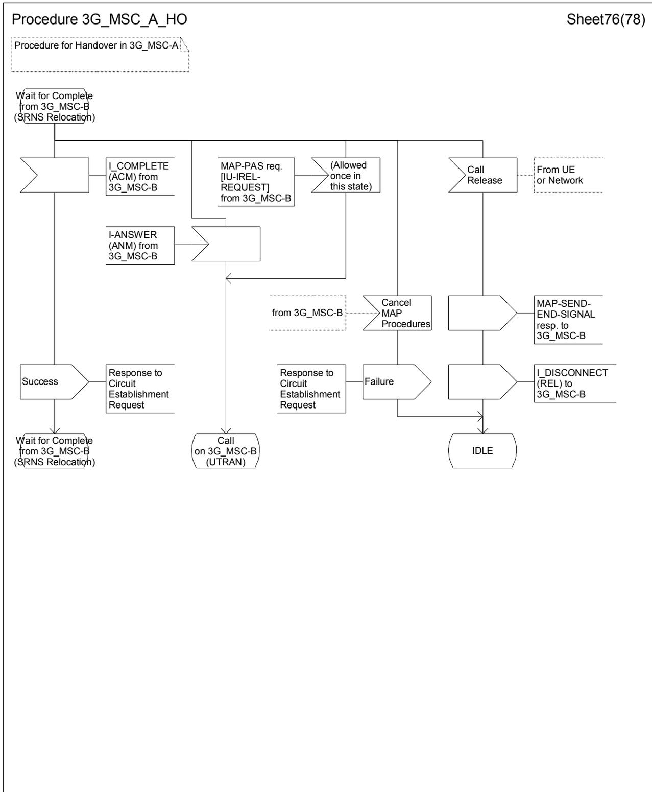

### Procedure 3G\_MSC\_A\_HO

Sheet76(78)

Procedure for Handover in 3G\_MSC-A

```

        graph TD
            State1([Wait for Complete  
from 3G_MSC-B  
(SRNS Relocation)])
            
            Input1{I_COMPLETE  
(ACM) from  
3G_MSC-B}
            Input2{I-ANSWER  
(ANM) from  
3G_MSC-B}
            Input3{MAP-PAS req.  
[IU-IREL-  
REQUEST]  
from 3G_MSC-B}
            Input4{Call  
Release} -- From UE  
or Network --> Input4

            State1 --> Input1
            State1 --> Input2
            State1 --> Input3
            State1 --> Input4

            Input1 --> Task1[Success]
            Task1 --> Task2[Response to  
Circuit  
Establishment  
Request]
            Task2 --> State1

            Input2 --> State2([Call  
on 3G_MSC-B  
(UTRAN)])

            Input3 --> Decision1{Allowed  
once in  
this state}
            Decision1 -- yes --> Task1
            Decision1 -- no --> Task3[Cancel  
MAP  
Procedures] -- from 3G_MSC-B --> Task3
            Task3 --> Task4[Failure]
            Task4 --> Task5[Response to  
Circuit  
Establishment  
Request]
            Task5 --> State3([IDLE])

            Input4 --> Output1>MAP-SEND-  
END-SIGNAL  
resp. to  
3G_MSC-B]
            Input4 --> Output2>I_DISCONNECT  
(REL) to  
3G_MSC-B]
            Output1 --> State3
            Output2 --> State3
        
```

The flowchart illustrates the handover control procedure in 3G\_MSC-A. It begins with a state 'Wait for Complete from 3G\_MSC-B (SRNS Relocation)'. From this state, several transitions are possible: receiving an 'I\_COMPLETE (ACM) from 3G\_MSC-B' leads to 'Success'; receiving an 'I-ANSWER (ANM) from 3G\_MSC-B' leads to 'Call on 3G\_MSC-B (UTRAN)'; receiving a 'MAP-PAS req. [IU-IREL-REQUEST] from 3G\_MSC-B' leads to a decision state '(Allowed once in this state)'; receiving a 'Call Release' from 'UE or Network' leads to sending 'MAP-SEND-END-SIGNAL resp. to 3G\_MSC-B', 'I\_DISCONNECT (REL) to 3G\_MSC-B', or reaching an 'IDLE' state; 'Success' leads to sending a 'Response to Circuit Establishment Request' and returning to the initial wait state; the '(Allowed once in this state)' decision leads to 'Success' or 'Cancel MAP Procedures'; 'Cancel MAP Procedures' leads to a 'Failure' state, which then leads to sending a 'Response to Circuit Establishment Request' and reaching an 'IDLE' state.

SDL diagram for Procedure 3G\_MSC\_A\_HO showing state transitions from 'Wait for Complete from 3G\_MSC-B (SRNS Relocation)'.

**Figure 43 (sheet 76 of 78): Handover control procedure in 3G\_MSC-A**

![Flowchart of Procedure 3G_MSC_A_HO. The process starts at connector 26, sends MAP-PREPARE-SUBSEQUENT-HANDOVER resp. to 3G_MSC-B, queues messages, sets T703, and waits for UE on 3G_MSC-B' (SRNS Relocation). It then branches based on incoming signals (MAP-SEND-END-SIGNAL req, MAP-PAS req, MAP-PAS req) and decision points (Allowed once in this state, Wait for access by UE?). Success leads to Redefine 3G_MSC-B' as 3G_MSC-B and UE on 3G_MSC-B (UTRAN). Failure leads to Cancel MAP Procedures and IDLE state.](050e99bf626cb208bd2646b0e0b80708_img.jpg)

### Procedure 3G\_MSC\_A\_HO

Sheet77(78)

Procedure for Handover in 3G\_MSC-A

Subsequent SRNS Relocation from 3G\_MSC-B to 3G\_MSC-B' no Circuit Connection required.

```
graph TD; Start((26)) --> MAP_PREPARE[MAP-PREPARE-SUBSEQUENT-HANDOVER resp. [[IU-RLC-REQUEST-ACK] to 3G_MSC-B]; MAP_PREPARE --> Queue[Queue Messages for UE in 3G_MSC-A]; Queue --> Set_T703[Set T703]; Set_T703 --> Wait_UE[Wait for UE on 3G_MSC-B' (SRNS Relocation)]; Wait_UE --> MAP_SEND_END[MAP-SEND-END-SIGNAL req [[IU-RLC-COMPLETE] from 3G_MSC-B']; Wait_UE --> MAP_PAS_1[MAP-PAS req. [[IU-RLC-DETECT] from 3G_MSC-B']; Wait_UE --> MAP_PAS_2[MAP-PAS req. [[IU-IREL-REQUEST] from 3G_MSC-B]; MAP_SEND_END --> Reset_T703[Reset T703]; Reset_T703 --> Forward[Forward queued messages for UE via 3G_MSC-B']; Forward --> Redefine[Redefine 3G_MSC-B' as 3G_MSC-B]; Redefine --> UE_UTRAN[UE on 3G_MSC-B (UTRAN)]; MAP_PAS_1 --> Allowed_1{Allowed once in this state}; Allowed_1 -- Yes --> Wait_Access{Wait for access by UE?}; Allowed_1 -- No --> Cancel[Cancel MAP Procedures]; MAP_PAS_2 --> Allowed_2{Allowed once in this state}; Allowed_2 -- Yes --> Wait_Access; Allowed_2 -- No --> Cancel; Cancel --> Call_Release[Call Release]; Call_Release --> IDLE[IDLE]; Call_Release -.-> to_Network[to Network and UE]; Cancel -.-> to_MSC[ to 3G_MSC-B and 3G_MSC-B']; Forward -.-> Use_MAP[Use MAP-FORWARD-ACCESS-SIGNALLING req]; Wait_UE -.-> Wait_UE_2[Wait for UE on 3G_MSC-B' (SRNS Relocation)];
```

Flowchart of Procedure 3G\_MSC\_A\_HO. The process starts at connector 26, sends MAP-PREPARE-SUBSEQUENT-HANDOVER resp. to 3G\_MSC-B, queues messages, sets T703, and waits for UE on 3G\_MSC-B' (SRNS Relocation). It then branches based on incoming signals (MAP-SEND-END-SIGNAL req, MAP-PAS req, MAP-PAS req) and decision points (Allowed once in this state, Wait for access by UE?). Success leads to Redefine 3G\_MSC-B' as 3G\_MSC-B and UE on 3G\_MSC-B (UTRAN). Failure leads to Cancel MAP Procedures and IDLE state.

Figure 43 (sheet 77 of 78): Handover control procedure in 3G\_MSC-A

![Flowchart of the handover control procedure in 3G_MSC-A. The process starts with 'Wait for UE on 3G_MSC-B' (SRNS Relocation). It branches based on 'Expiry T703' (leading to 'Forward queued messages for UE via 3G_MSC-B' and then 'Cancel MAP Procedures' to 'UE on 3G_MSC-B (UTRAN)') and 'MAP-PAS req. [IU-RLC-FAILURE] from 3G_MSC-B' (leading to 'Reset T703' and then 'Forward queued messages...'). Other branches involve 'Cancel MAP Procedures' from '3G_MSC-B'', 'Call Release' from 'Network or 3G_MSC-B', and a decision 'Wait for access by UE?' leading to either 'Cancel MAP Procedures' to 'IDLE' or 'Call Release'.](b6f6f51bf96aef85ffe1dcd9d57f398b_img.jpg)

### Procedure 3G\_MSC\_A\_HO

Procedure for Handover in 3G\_MSC-A

Sheet78(78)

```
graph TD
    Start([Wait for UE on 3G_MSC-B' (SRNS Relocation)]) --> T703_Expiry{Expiry T703}
    T703_Expiry --> Forward[Forward queued messages for UE via 3G_MSC-B]
    Forward --> Cancel1[Cancel MAP Procedures]
    Cancel1 --> UE_UTRAN([UE on 3G_MSC-B (UTRAN)])
    
    T703_Expiry --> MAP_PAS[MAP-PAS req. [IU-RLC-FAILURE] from 3G_MSC-B]
    MAP_PAS --> Reset[Reset T703]
    Reset --> Forward
    
    T703_Expiry --> Cancel2[Cancel MAP Procedures]
    Cancel2 --> WaitAccess{Wait for access by UE?}
    WaitAccess -- No --> Cancel3[Cancel MAP Procedures]
    Cancel3 --> IDLE([IDLE])
    WaitAccess -- Yes --> CallRelease[Call Release]
    
    Cancel2 --> From3G_MSC_B[from 3G_MSC-B']
    CallRelease --> FromNetwork[from Network or 3G_MSC-B]
    
    Cancel3 --> To3G_MSC_B[to 3G_MSC-B']
    CallRelease --> WaitUE[Wait for UE on 3G_MSC-B' (SRNS Relocation)]
    
    Forward --> UseMAP[Use MAP-FORWARD-ACCESS-SIGNALLING req.]
    UseMAP --> Cancel1
```

Flowchart of the handover control procedure in 3G\_MSC-A. The process starts with 'Wait for UE on 3G\_MSC-B' (SRNS Relocation). It branches based on 'Expiry T703' (leading to 'Forward queued messages for UE via 3G\_MSC-B' and then 'Cancel MAP Procedures' to 'UE on 3G\_MSC-B (UTRAN)') and 'MAP-PAS req. [IU-RLC-FAILURE] from 3G\_MSC-B' (leading to 'Reset T703' and then 'Forward queued messages...'). Other branches involve 'Cancel MAP Procedures' from '3G\_MSC-B'', 'Call Release' from 'Network or 3G\_MSC-B', and a decision 'Wait for access by UE?' leading to either 'Cancel MAP Procedures' to 'IDLE' or 'Call Release'.

Figure 43 (sheet 78 of 78): Handover control procedure in 3G\_MSC-A

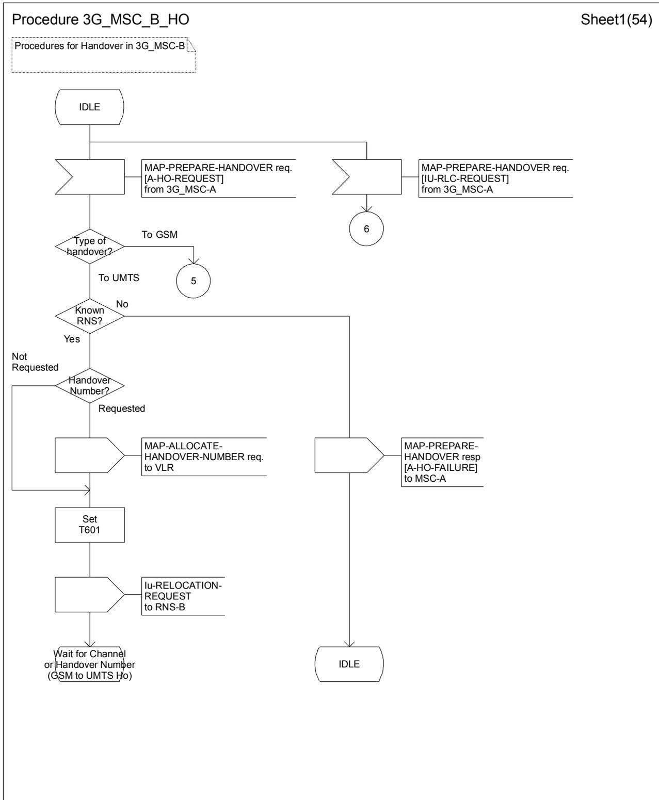

### Procedure 3G\_MSC\_B\_HO

Procedures for Handover in 3G\_MSC-B

Sheet1(54)

```
graph TD; IDLE1([IDLE]) --> J1(( )); J1 --> MAP_PREPARE_A[MAP-PREPARE-HANDOVER req. [A-HO-REQUEST] from 3G_MSC-A]; MAP_PREPARE_A --> Type_Handover{Type of handover?}; Type_Handover -- To GSM --> 5((5)); Type_Handover -- To UMTS --> Known_RNS{Known RNS?}; Known_RNS -- No --> MAP_PREPARE_FAIL[MAP-PREPARE-HANDOVER resp [A-HO-FAILURE] to MSC-A]; Known_RNS -- Yes --> Handover_Number{Handover Number?}; Handover_Number -- Not Requested --> J2(( )); Handover_Number -- Requested --> MAP_ALLOCATE[MAP-ALLOCATE-HANDOVER-NUMBER req. to VLR]; MAP_ALLOCATE --> Set_T601[Set T601]; Set_T601 --> IU_RELOCATION[IU-RELOCATION-REQUEST to RNS-B]; IU_RELOCATION --> Wait[Wait for Channel or Handover Number (GSM to UMTS Ho)]; MAP_PREPARE_FAIL --> IDLE2([IDLE]);
```

The flowchart illustrates the handover control procedure in 3G\_MSC-B. It begins at an IDLE state, where it waits for a MAP-PREPARE-HANDOVER request (A-HO-REQUEST) from 3G\_MSC-A. Upon receiving the request, it checks the type of handover. If it is 'To GSM', the process ends at connector 5. If it is 'To UMTS', it checks if the target RNS is known. If not known, it sends a MAP-PREPARE-HANDOVER response (A-HO-FAILURE) to MSC-A and returns to IDLE. If known, it checks if a handover number is requested. If not requested, it proceeds to connector 6. If requested, it sends a MAP-ALLOCATE-HANDOVER-NUMBER request to the VLR, sets timer T601, sends an IU-RELOCATION-REQUEST to RNS-B, and then waits for a channel or handover number (specifically for GSM to UMTS handover).

Flowchart of Procedure 3G\_MSC\_B\_HO showing handover control logic starting from IDLE, receiving requests from 3G\_MSC-A, checking handover type and RNS status, and either proceeding with allocation or returning a failure response.

Figure 44 (sheet 1 of 54): Handover control procedure in 3G\_MSC-B

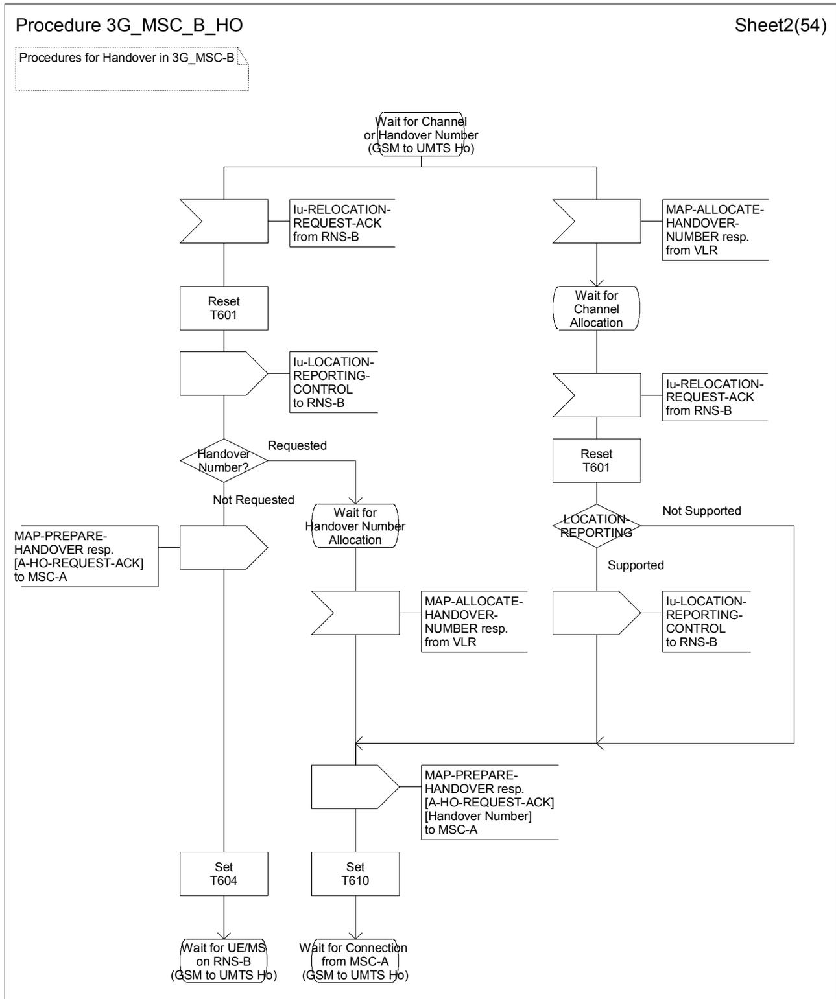

Procedure 3G\_MSC\_B\_HOSheet2(54)

Procedures for Handover in 3G\_MSC-B

```

graph TD
    Start([Wait for Channel  
or Handover Number  
GSM to UMTS Ho]) --> Split(( ))
    
    %% Left Branch
    Split --> L_In[/Iu-RELOCATION-  
REQUEST-ACK  
from RNS-B/]
    L_In --> L_Reset[Reset  
T601]
    L_Reset --> L_Out[\Iu-LOCATION-  
REPORTING-  
CONTROL  
to RNS-B\]
    L_Out --> L_Decide{Handover  
Number?}
    
    L_Decide -- Not Requested --> L_NR_Out[\MAP-PREPARE-  
HANDOVER resp.  
A-HO-REQUEST-ACK  
to MSC-A\]
    L_NR_Out --> L_SetT604[Set  
T604]
    L_SetT604 --> L_End([Wait for UE/MS  
on RNS-B  
GSM to UMTS Ho])
    
    L_Decide -- Requested --> L_Req_Wait([Wait for  
Handover Number  
Allocation])
    L_Req_Wait --> L_Req_In[/MAP-ALLOCATE-  
HANDOVER-  
NUMBER resp.  
from VLR/]
    
    %% Right Branch
    Split --> R_In[/MAP-ALLOCATE-  
HANDOVER-  
NUMBER resp.  
from VLR/]
    R_In --> R_Wait([Wait for  
Channel  
Allocation])
    R_Wait --> R_In2[/Iu-RELOCATION-  
REQUEST-ACK  
from RNS-B/]
    R_In2 --> R_Reset[Reset  
T601]
    R_Reset --> R_Decide{LOCATION  
REPORTING}
    
    R_Decide -- Supported --> R_Sup_Out[\Iu-LOCATION-  
REPORTING-  
CONTROL  
to RNS-B\]
    R_Decide -- Not Supported --> R_Merge(( ))
    R_Sup_Out --> R_Merge
    
    %% Final Merge for Handover Number paths
    L_Req_In --> Final_Out[\MAP-PREPARE-  
HANDOVER resp.  
A-HO-REQUEST-ACK  
Handover Number  
to MSC-A\]
    R_Merge --> Final_Out
    
    Final_Out --> Final_Set[Set  
T610]
    Final_Set --> Final_End([Wait for Connection  
from MSC-A  
GSM to UMTS Ho])

```

Flowchart for Procedure 3G\_MSC\_B\_HO showing two main paths for GSM to UMTS handover. The left path handles cases where a handover number is requested or not, while the right path handles channel allocation and location reporting support.

**Figure 44 (sheet 2 of 54): Handover control procedure in 3G\_MSC-B**


### Procedure 3G\_MSC\_B\_HO

Sheet3(54)

Procedures for Handover in 3G\_MSC-B

```
graph TD; subgraph LeftPath [ ]; W1[Wait for Channel or Handover Number (GSM to UMTS Ho)]; W2[Wait for Channel Allocation (GSM to UMTS Ho)]; I1(( )); F1[lu-RELOCATION-FAILURE from RNS-B]; E1[Expiry T601]; R1[Release Resources in RNS-B]; R2[Release Resources in RNS-B]; M1[MAP-PREPARE-HANDOVER resp. [A-HO-FAILURE] to MSC-A]; I2(( )); IDLE1([IDLE]); W1 --> I1; W2 --> I1; I1 --> F1; I1 --> R1; I1 --> R2; F1 --> I2; E1 --> I2; R2 --> I2; I2 --> M1; M1 --> IDLE1; end; subgraph RightPath [ ]; W3[Wait for Channel or Handover Number (GSM to UMTS Ho)]; W4[Wait for Handover Number Allocation (GSM to UMTS Ho)]; I3(( )); F2[lu-Release-REQUEST from RNS-B]; E2[ERROR]; I4(( )); R3[Cancel Channel on RNS-B]; M2[MAP-PREPARE-HANDOVER resp. [MAP ERROR] to MSC-A]; I5(( )); IDLE2([IDLE]); W3 --> I3; W4 --> I3; I3 --> F2; I3 --> E2; I3 --> I4; E2 --> I4; I4 --> R3; R3 --> I5; I5 --> M2; M2 --> IDLE2; end;
```

Flowchart of Procedure 3G\_MSC\_B\_HO showing two parallel paths for GSM to UMTS handover. The left path handles a successful handover after channel allocation, while the right path handles an error case after channel allocation failure. Both paths lead to an IDLE state.

Figure 44 (sheet 3 of 54): Handover control procedure in 3G\_MSC-B

![State transition diagram for Procedure 3G_MSC_B_HO. The diagram shows various states and transitions for a handover process. States include 'Wait for Connection (from MSC-A) (GSM to UMTS Ho)', 'Reset T610', 'Set T604', 'Wait for access by UE/MS on RNS-B (GSM to UMTS Ho)', and 'IDLE'. Transitions include 'I_CONNECT (IAM) from MSC-A (Uses Handover No.)', 'MAP-SEND-HANDOVER-REPORT resp. to VLR-B', 'I_COMPLETE (ACM) to MSC-A', 'Cancel MAP Procedures', 'Release Radio Resources on RNS-B', 'MAP-PAS req. [A-CLEAR-REQUEST] to MSC-A', and 'Iu-RELEASE-REQUEST from RNS-B'. There are also timers 'Expiry T610' and 'To MSC-A in 3G_MSC-B'.](675d8979e8be8b43c33598a654386dcd_img.jpg)

### Procedure 3G\_MSC\_B\_HO

Sheet4(54)

Procedures for Handover in 3G\_MSC-B

Basic GSM to UMTS handover from MSC-A to 3G\_MSC-B  
Circuit Connection required

```
stateDiagram-v2
    [*] --> S0: Wait for Connection (from MSC-A) (GSM to UMTS Ho)
    S0 --> S1: I_CONNECT (IAM) from MSC-A (Uses Handover No.)
    S1 --> S2: Reset T610
    S2 --> S3: MAP-SEND-HANDOVER-REPORT resp. to VLR-B
    S3 --> S4: Set T604
    S4 --> S5: I_COMPLETE (ACM) to MSC-A
    S5 --> S6: Wait for access by UE/MS on RNS-B (GSM to UMTS Ho)
    S0 --> S7: Expiry T610
    S7 --> S8: Cancel MAP Procedures
    S8 --> S9: Release Radio Resources on RNS-B
    S9 --> S10: IDLE
    S0 --> S11: Iu-RELEASE-REQUEST from RNS-B
    S11 --> S12: MAP-PAS req. [A-CLEAR-REQUEST] to MSC-A
    S12 --> S13: Cancel MAP Procedures
    S13 --> S14: To MSC-A in 3G_MSC-B
    S14 --> S8
    S14 --> S9
```

State transition diagram for Procedure 3G\_MSC\_B\_HO. The diagram shows various states and transitions for a handover process. States include 'Wait for Connection (from MSC-A) (GSM to UMTS Ho)', 'Reset T610', 'Set T604', 'Wait for access by UE/MS on RNS-B (GSM to UMTS Ho)', and 'IDLE'. Transitions include 'I\_CONNECT (IAM) from MSC-A (Uses Handover No.)', 'MAP-SEND-HANDOVER-REPORT resp. to VLR-B', 'I\_COMPLETE (ACM) to MSC-A', 'Cancel MAP Procedures', 'Release Radio Resources on RNS-B', 'MAP-PAS req. [A-CLEAR-REQUEST] to MSC-A', and 'Iu-RELEASE-REQUEST from RNS-B'. There are also timers 'Expiry T610' and 'To MSC-A in 3G\_MSC-B'.

Figure 44 (sheet 4 of 54): Handover control procedure in 3G\_MSC-B

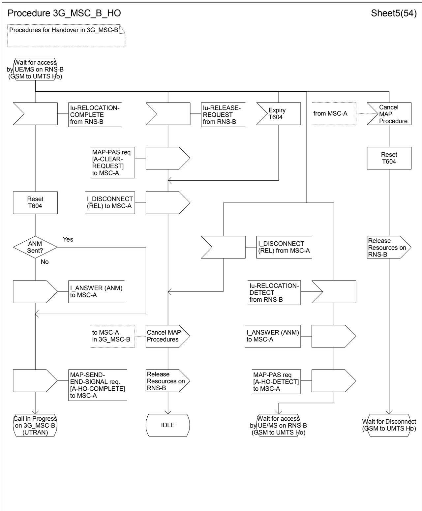

Procedure 3G\_MSC\_B\_HOSheet5(54)

Procedures for Handover in 3G\_MSC-B

```

stateDiagram-v2
    state "Wait for access\nby UE/MS on RNS-B\n(GSM to UMTS Ho)" as WaitAccess
    state "Call in Progress\non 3G_MSC-B\n(UTRAN)" as CallInProgress
    state "IDLE" as IDLE
    state "Wait for access\nby UE/MS on RNS-B\n(GSM to UMTS Ho)" as WaitAccess2
    state "Wait for Disconnect\n(GSM to UMTS Ho)" as WaitDisconnect

    [*] --> WaitAccess
    
    WaitAccess --> IuRelocComp : Iu-RELOCATION-COMPLETE from RNS-B
    WaitAccess --> IuRelReq : Iu-RELEASE-REQUEST from RNS-B
    WaitAccess --> ExpiryT604 : Expiry T604
    WaitAccess --> FromMSCA : from MSC-A
    WaitAccess --> CancelMAP : Cancel MAP Procedure

    IuRelocComp --> MAP_PAS_Clear : MAP-PAS req [A-CLEAR-REQUEST] to MSC-A
    MAP_PAS_Clear --> I_Disc_Rel : I_DISCONNECT (REL) to MSC-A
    I_Disc_Rel --> ANM_Sent : ANM Sent?
    
    ANM_Sent --> I_Answer_ANM : Yes
    I_Answer_ANM --> MAP_Send_End : MAP-SEND-END-SIGNAL req [A-HO-COMPLETE] to MSC-A
    MAP_Send_End --> CallInProgress

    ANM_Sent --> CancelMAP_Proc : No
    CancelMAP_Proc --> ReleaseRes : Release Resources on RNS-B
    ReleaseRes --> IDLE

    IuRelReq --> I_Disc_Rel_From_MSCA : I_DISCONNECT (REL) from MSC-A
    I_Disc_Rel_From_MSCA --> CancelMAP_Proc

    ExpiryT604 --> ResetT604 : Reset T604
    ResetT604 --> CancelMAP_Proc

    FromMSCA --> IuRelocDetect : Iu-RELOCATION-DETECT from RNS-B
    IuRelocDetect --> I_Answer_ANM_MSCA : I_ANSWER (ANM) to MSC-A
    I_Answer_ANM_MSCA --> MAP_PAS_Detect : MAP-PAS req [A-HO-DETECT] to MSC-A
    MAP_PAS_Detect --> WaitAccess2

    CancelMAP --> ResetT604_2 : Reset T604
    ResetT604_2 --> ReleaseRes_2 : Release Resources on RNS-B
    ReleaseRes_2 --> WaitDisconnect
    
```

SDL diagram for Procedure 3G\_MSC\_B\_HO showing handover logic between MSC-A, MSC-B, and RNS-B.

**Figure 44 (sheet 5 of 54): Handover control procedure in 3G\_MSC-B**

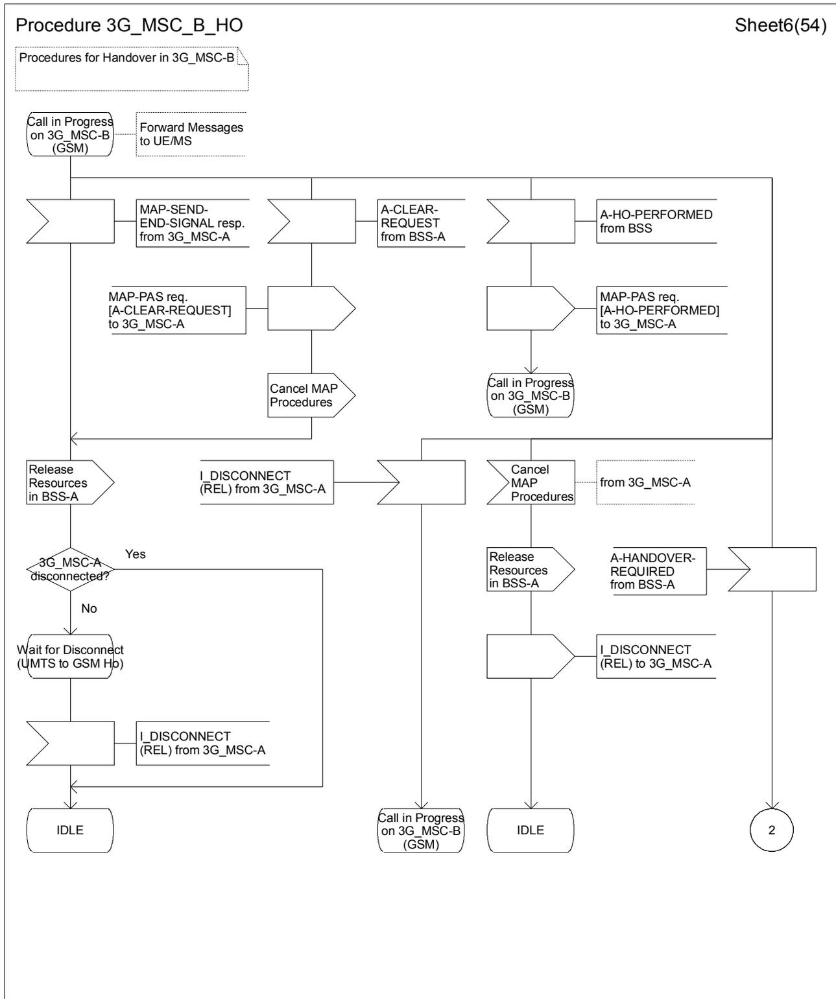

**Procedure 3G\_MSC\_B\_HO** Sheet6(54)

Procedures for Handover in 3G\_MSC-B

```

sequenceDiagram
    participant 3G_MSC_B
    participant 3G_MSC_A
    participant BSS_A
    participant UE_MS

    Note over 3G_MSC_B: Call in Progress on 3G_MSC-B (GSM)
    3G_MSC_B->>UE_MS: Forward Messages to UE/MS

    alt MAP-SEND-END-SIGNAL
        3G_MSC_A->>3G_MSC_B: MAP-SEND-END-SIGNAL resp. from 3G_MSC-A
        3G_MSC_B->>3G_MSC_A: MAP-PAS req. [A-CLEAR-REQUEST] to 3G_MSC-A
        3G_MSC_B->>3G_MSC_B: Cancel MAP Procedures
        Note over 3G_MSC_B: Release Resources in BSS-A
        3G_MSC_A->>3G_MSC_B: I_DISCONNECT (REL) from 3G_MSC-A
        Note over 3G_MSC_B: 3G_MSC-A disconnected?
        alt Yes
            Note over 3G_MSC_B: IDLE
        else No
            Note over 3G_MSC_B: Wait for Disconnect (UMTS to GSM Hb)
            3G_MSC_A->>3G_MSC_B: I_DISCONNECT (REL) from 3G_MSC-A
            Note over 3G_MSC_B: IDLE
        end
    else A-CLEAR-REQUEST
        BSS_A->>3G_MSC_B: A-CLEAR-REQUEST from BSS-A
        Note over 3G_MSC_B: Call in Progress on 3G_MSC-B (GSM)
    else A-HO-PERFORMED
        BSS_A->>3G_MSC_B: A-HO-PERFORMED from BSS
        3G_MSC_B->>3G_MSC_A: MAP-PAS req. [A-HO-PERFORMED] to 3G_MSC-A
        3G_MSC_A->>3G_MSC_B: Cancel MAP Procedures
        Note over 3G_MSC_B: Release Resources in BSS-A
        BSS_A->>3G_MSC_B: A-HANDOVER-REQUIRED from BSS-A
        3G_MSC_B->>3G_MSC_A: I_DISCONNECT (REL) to 3G_MSC-A
        Note over 3G_MSC_B: IDLE
    end
    Note over 3G_MSC_B: 2

```

SDL diagram showing the handover control procedure in 3G\_MSC-B. It details the signaling between 3G\_MSC-A, 3G\_MSC-B, BSS-A, and UE/MS during various handover scenarios including clear requests and handover performance.

**Figure 44 (sheet 6 of 54): Handover control procedure in 3G\_MSC-B**

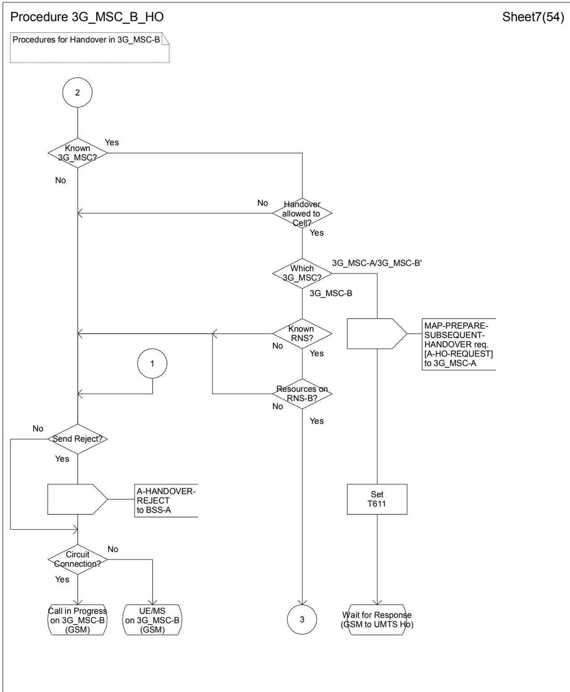

**Procedure 3G\_MSC\_B\_HO** Sheet7(54)

Procedures for Handover in 3G\_MSC-B

```
graph TD; Start((2)) --> D1{Known 3G_MSC?}; D1 -- Yes --> D2{Handover allowed to Cell?}; D1 -- No --> D2; D2 -- No --> D3{Which 3G_MSC?}; D2 -- Yes --> D3; D3 -- "3G_MSC-A/3G_MSC-B'" --> P1[MAP-PREPARE-SUBSEQUENT-HANDOVER req. [A-HO-REQUEST] to 3G_MSC-A]; D3 -- "3G_MSC-B" --> D4{Known RNS?}; P1 --> D4; D4 -- No --> D5{Resources on RNS-B?}; D4 -- Yes --> End3((3)); D5 -- No --> D6{Send Reject?}; D5 -- Yes --> End3; D6 -- No --> D7{Circuit Connection?}; D6 -- Yes --> P2[A-HANDOVER-REJECT to BSS-A]; P2 --> D7; D7 -- No --> P3[UE/MS on 3G_MSC-B (GSM)]; D7 -- Yes --> P4[Call in Progress on 3G_MSC-B (GSM)]; P3 --> End3; P4 --> End3; P4 --> Start1((1)); Start1 --> D4;
```

The flowchart illustrates the handover control procedure in 3G\_MSC-B. It begins at connector 2, leading to a decision 'Known 3G\_MSC?'. If 'Yes', it proceeds to 'Handover allowed to Cell?'. If 'No', it also proceeds to 'Handover allowed to Cell?'. From 'Handover allowed to Cell?', a 'No' leads to 'Which 3G\_MSC?' and a 'Yes' leads to 'Which 3G\_MSC?'. From 'Which 3G\_MSC?', the path '3G\_MSC-A/3G\_MSC-B'' leads to a process box 'MAP-PREPARE-SUBSEQUENT-HANDOVER req. [A-HO-REQUEST] to 3G\_MSC-A', which then leads to 'Known RNS?'. The path '3G\_MSC-B' leads directly to 'Known RNS?'. From 'Known RNS?', a 'Yes' leads to connector 3, and a 'No' leads to 'Resources on RNS-B?'. From 'Resources on RNS-B?', a 'Yes' leads to connector 3, and a 'No' leads to 'Send Reject?'. From 'Send Reject?', a 'Yes' leads to a process box 'A-HANDOVER-REJECT to BSS-A', which then leads to 'Circuit Connection?'. A 'No' from 'Send Reject?' also leads to 'Circuit Connection?'. From 'Circuit Connection?', a 'Yes' leads to a process box 'Call in Progress on 3G\_MSC-B (GSM)', which leads to connector 3. A 'No' from 'Circuit Connection?' leads to a process box 'UE/MS on 3G\_MSC-B (GSM)', which also leads to connector 3. Additionally, connector 1 leads to 'Known RNS?'.

Flowchart for Procedure 3G\_MSC\_B\_HO showing decision points for handover control.

Figure 44 (sheet 7 of 54): Handover control procedure in 3G\_MSC-B


### Procedure 3G\_MSC\_B\_HO

Sheet8(54)

Procedures for Handover in 3G\_MSC-BHandover from BSS-A to RNS-B on 3G\_MSC-B

```
graph TD; Start((3)) --> IuReq[Iu-RELOCATION-REQUEST to RNS-B]; IuReq --> T601Set1[Set T601]; T601Set1 --> Wait1[Wait for Channel GSM to UMTS Ho]; Wait1 --> IuAck[Iu-RELOCATION-REQUEST-ACK from RNS-B]; Wait1 --> T601Exp[Expiry T601]; Wait1 --> IuFail[Iu-RELOCATION-FAILURE from RNS-B]; Wait1 --> MAPEnd[MAP-SEND-END-SIGNAL resp. from 3G_MSC-A]; IuAck --> T601Reset1[Reset T601]; T601Reset1 --> LocRep{LOCATION REPORTING}; LocRep -- Supported --> Queue[Queue Messages in 3G_MSC-B]; LocRep -- Not Supported --> LocCtrl[Iu-LOCATION-REPORTING-CONTROL to RNS-B]; Queue --> HandoverCmd[Handover Command to UE/MS via BSS-A]; HandoverCmd --> Setup[Set Up Handover Device]; Setup --> T602Set[Set T602]; T602Set --> Wait2[Wait for access by UE/MS GSM to UMTS Ho]; T601Exp --> ResRel[Release Resources on RNS-B]; ResRel --> End1((1)); IuFail --> T601Reset2[Reset T601]; T601Reset2 --> MAPReq[MAP-PAS req A-CLEAR-REQUEST to 3G_MSC-A]; MAPReq --> MAPProc[Cancel MAP Procedures]; MAPProc --> MAPProcDest[To 3G_MSC-A in 3G_MSC-B]; MAPProc --> ResRel2[Release Resources on BSS-A]; ResRel2 --> Wait3[Wait for Disconnect GSM to UMTS Ho]; MAPEnd --> CancelReq[Cancel Channel request on RNS-B]; CancelReq --> ResRel2;
```

Flowchart of Procedure 3G\_MSC\_B\_HO showing the sequence of messages and actions for a handover from BSS-A to RNS-B on 3G\_MSC-B. The process starts at connector 3, sends an Iu-RELOCATION-REQUEST to RNS-B, sets timer T601, and waits for a response. It then branches based on whether location reporting is supported and the response from RNS-B (ACK, FAILURE, or no response due to timer expiry).

Figure 44 (sheet 8 of 54): Handover control procedure in 3G\_MSC-B

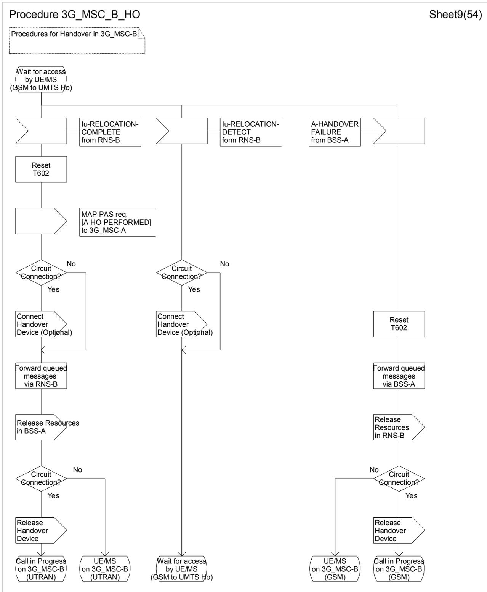

### Procedure 3G\_MSC\_B\_HO

Procedures for Handover in 3G\_MSC-B

Sheet9(54)

```
graph TD; Start([Wait for access by UE/MS (GSM to UMTS Ho)]) --> Path1[ ]; Start --> Path2[ ]; Start --> Path3[ ]; Path1 --> IuRC[lu-RELOCATION-COMPLETE from RNS-B]; IuRC --> ResetT602_1[Reset T602]; ResetT602_1 --> MAPPAS[MAP-PAS req. [A-HO-PERFORMED] to 3G_MSC-A]; MAPPAS --> CC1{Circuit Connection?}; CC1 -- No --> Forward[Forward queued messages via RNS-B]; CC1 -- Yes --> CHD1{{Connect Handover Device (Optional)}}; CHD1 --> Forward; Forward --> ReleaseRNSB1{{Release Resources in BSS-A}}; ReleaseRNSB1 --> CC2{Circuit Connection?}; CC2 -- No --> CallProgress1([Call in Progress on 3G_MSC-B (UTRAN)]); CC2 -- Yes --> ReleaseHD1{{Release Handover Device}}; ReleaseHD1 --> UEState1([UE/MS on 3G_MSC-B (UTRAN)]); Path2 --> IuRD[lu-RELOCATION-DETECT from RNS-B]; IuRD --> CC3{Circuit Connection?}; CC3 -- No --> Forward2[Forward queued messages via RNS-B]; CC3 -- Yes --> CHD2{{Connect Handover Device (Optional)}}; CHD2 --> Forward2; Forward2 --> ReleaseRNSB2{{Release Resources in BSS-A}}; ReleaseRNSB2 --> CC4{Circuit Connection?}; CC4 -- No --> CallProgress2([Call in Progress on 3G_MSC-B (UTRAN)]); CC4 -- Yes --> ReleaseHD2{{Release Handover Device}}; ReleaseHD2 --> UEState2([UE/MS on 3G_MSC-B (UTRAN)]); Path3 --> AHF[A-HANDOVER FAILURE from BSS-A]; AHF --> ResetT602_3[Reset T602]; ResetT602_3 --> Forward3[Forward queued messages via BSS-A]; Forward3 --> ReleaseRNSB3{{Release Resources in RNS-B}}; ReleaseRNSB3 --> CC5{Circuit Connection?}; CC5 -- No --> UEState3([UE/MS on 3G_MSC-B (GSM)]); CC5 -- Yes --> ReleaseHD3{{Release Handover Device}}; ReleaseHD3 --> CallProgress3([Call in Progress on 3G_MSC-B (GSM)]);
```

Flowchart of Procedure 3G\_MSC\_B\_HO showing three main paths: Iu-RELOCATION-COMPLETE, Iu-RELOCATION-DETECT, and A-HANDOVER FAILURE. Each path involves various steps like Reset T602, MAP-PAS req., Circuit Connection checks, and final UE/MS states.

Figure 44 (sheet 9 of 54): Handover control procedure in 3G\_MSC-B

![Flowchart of Procedure 3G_MSC_B_HO for handover control. The process starts with 'Wait for access by UE/MS (GSM to UMTS Ho)'. It branches into two main paths: one for 'iu-RELEASE-REQUEST from RNS-B' and another for 'A-CLEAR-REQUEST from BSS-A'. Both paths involve resource release, MAP signaling, and eventually reaching an 'IDLE' state or waiting for further access. A decision point 'Wait for access by UE/MS?' determines if the process loops back or continues to release resources and signal MAP procedures.](d49c6ed7cc2cd764f77a0a43ecc9e636_img.jpg)

### Procedure 3G\_MSC\_B\_HO

Sheet10(54)

Procedures for Handover in 3G\_MSC-B

```
graph TD; Start([Wait for access by UE/MS (GSM to UMTS Ho)]) --> T602{Expiry T602}; T602 --> RNSB_REQ[iu-RELEASE-REQUEST from RNS-B]; RNSB_REQ --> RNSB_REL[Release Resources in RNS-B]; RNSB_REL --> WaitAccess{Wait for access by UE/MS?}; WaitAccess -- Yes --> RNSB_REL; WaitAccess -- No --> MAP_REQ_A[MAP-PAS req. [A-CLEAR-REQUEST] to 3G_MSC-A]; MAP_REQ_A --> TO_MSC_A[To 3G_MSC-A in 3G_MSC-B]; TO_MSC_A --> CANCEL_MAP[Cancel MAP Procedures]; CANCEL_MAP --> TO_MSC_A_2[To 3G_MSC-A in 3G_MSC-B]; TO_MSC_A_2 --> DISCONNECT[I_DISCONNECT (REL) to 3G_MSC-A]; DISCONNECT --> IDLE([IDLE]); IDLE --> WaitAccess; Start --> BSSA_REQ[A-CLEAR-REQUEST from BSS-A]; BSSA_REQ --> BSSA_REL[Release Resources in BSS-A]; BSSA_REL --> WaitAccess; BSSA_REL --> RNSB_REL_2[Release Resources in RNS-B]; RNSB_REL_2 --> WaitDisconnect([Wait for Disconnect (GSM to UMTS Ho)]); WaitDisconnect --> IDLE; BSSA_REL --> MAP_REQ_B[MAP-PAS req. [A-CLEAR-REQUEST] to 3G_MSC-A]; MAP_REQ_B --> TO_MSC_A_3[To 3G_MSC-A in 3G_MSC-B]; TO_MSC_A_3 --> CANCEL_MAP_2[Cancel MAP Procedures]; CANCEL_MAP_2 --> TO_MSC_A_4[To 3G_MSC-A in 3G_MSC-B]; TO_MSC_A_4 --> DISCONNECT_2[I_DISCONNECT (REL) to 3G_MSC-A]; DISCONNECT_2 --> IDLE; IDLE --> WaitAccess; BSSA_REL --> RNSB_BSSA_REL[Release Resources in RNS-B and BSS-A]; RNSB_BSSA_REL --> HANDOVER_REL[Release Handover Device]; HANDOVER_REL --> MAP_REQ_C[MAP-PAS req. [A-CLEAR-REQUEST] to 3G_MSC-A]; MAP_REQ_C --> TO_MSC_A_5[To 3G_MSC-A in 3G_MSC-B]; TO_MSC_A_5 --> CANCEL_MAP_3[Cancel MAP Procedures]; CANCEL_MAP_3 --> TO_MSC_A_6[To 3G_MSC-A in 3G_MSC-B]; TO_MSC_A_6 --> DISCONNECT_3[I_DISCONNECT (REL) to 3G_MSC-A]; DISCONNECT_3 --> IDLE; IDLE --> WaitAccess; BSSA_REL --> END_SIGNAL[MAP-SEND-END-SIGNAL resp. from 3G_MSC-A]; END_SIGNAL --> RNSB_BSSA_REL;
```

Flowchart of Procedure 3G\_MSC\_B\_HO for handover control. The process starts with 'Wait for access by UE/MS (GSM to UMTS Ho)'. It branches into two main paths: one for 'iu-RELEASE-REQUEST from RNS-B' and another for 'A-CLEAR-REQUEST from BSS-A'. Both paths involve resource release, MAP signaling, and eventually reaching an 'IDLE' state or waiting for further access. A decision point 'Wait for access by UE/MS?' determines if the process loops back or continues to release resources and signal MAP procedures.

Figure 44 (sheet 10 of 54): Handover control procedure in 3G\_MSC-B

![Flowchart of the handover control procedure in 3G_MSC-B. The process starts with 'Wait for Response (GSM to UMTS Ho)'. It branches into two main paths. The left path involves receiving a 'MAP-PREPARE-SUBSEQUENT-HANDOVER resp. [A-HO-REQUEST-ACK] from 3G_MSC-A', followed by 'Reset T611', 'Handover Command to UE/MS via BSS-A', 'Set T604', and 'Wait for Ack. from 3G_MSC-A (GSM to UMTS Ho)'. The right path involves receiving a 'MAP-PREPARE-SUBSEQUENT-HANDOVER resp. [A-HO-FAILURE or MAP ERROR] from 3G_MSC-A', followed by 'Reset T611', 'Release Resources in RNS-B', and a connector '1'. A third path involves an 'A-CLEAR-REQUEST from BSS-A', 'MAP-PAS req. [A-CLEAR-REQUEST] to 3G_MSC-A', 'in 3G_MSC-B to 3G_MSC-A', 'Cancel MAP Procedures', 'Release Resources in BSS-A', and 'Wait for Disconnect (GSM to UMTS Ho)'. A 'MAP-SEND-END-SIGNAL resp. from 3G_MSC-A' is shown as an intermediate step between the right and third paths. An 'Expiry T611' timer is also shown.](daa086b264328b888e9d54b9bbad081e_img.jpg)

**Procedure 3G\_MSC\_B\_HO** Sheet11(54)

Procedures for Handover in 3G\_MSC-B      Subsequent GSM to UMTS Handover from 3G\_MSC-B to 3G\_MSC-A

```

graph TD
    Start([Wait for Response  
GSM to UMTS Ho]) --> Join(( ))
    Join --> LeftPath[ ]
    Join --> RightPath[ ]
    Join --> ThirdPath[ ]
    LeftPath --> L1[MAP-PREPARE-SUBSEQUENT-HANDOVER resp.  
[A-HO-REQUEST-ACK]  
from 3G_MSC-A]
    L1 --> L2[Reset T611]
    L2 --> L3[Handover Command  
to UE/MS  
via BSS-A]
    L3 --> L4[Set T604]
    L4 --> L5([Wait for Ack.  
from 3G_MSC-A  
GSM to UMTS Ho])
    RightPath --> R1[MAP-PREPARE-SUBSEQUENT-HANDOVER resp.  
[A-HO-FAILURE or MAP ERROR]  
from 3G_MSC-A]
    R1 --> R2[Reset T611]
    R2 --> R3[Release Resources  
in RNS-B]
    R3 --> R4((1))
    ThirdPath --> T1[A-CLEAR-REQUEST  
from BSS-A]
    T1 --> T2[MAP-PAS req.  
[A-CLEAR-REQUEST]  
to 3G_MSC-A]
    T2 --> T3[in 3G_MSC-B  
to 3G_MSC-A]
    T3 --> T4[Cancel MAP Procedures]
    T4 --> T5[Release Resources  
in BSS-A]
    T5 --> T6([Wait for Disconnect  
GSM to UMTS Ho])
    R1 --> E1{Expiry T611}
    E1 --> R5[MAP-SEND-END-SIGNAL resp.  
from 3G_MSC-A]
    R5 --> T3
  
```

Flowchart of the handover control procedure in 3G\_MSC-B. The process starts with 'Wait for Response (GSM to UMTS Ho)'. It branches into two main paths. The left path involves receiving a 'MAP-PREPARE-SUBSEQUENT-HANDOVER resp. [A-HO-REQUEST-ACK] from 3G\_MSC-A', followed by 'Reset T611', 'Handover Command to UE/MS via BSS-A', 'Set T604', and 'Wait for Ack. from 3G\_MSC-A (GSM to UMTS Ho)'. The right path involves receiving a 'MAP-PREPARE-SUBSEQUENT-HANDOVER resp. [A-HO-FAILURE or MAP ERROR] from 3G\_MSC-A', followed by 'Reset T611', 'Release Resources in RNS-B', and a connector '1'. A third path involves an 'A-CLEAR-REQUEST from BSS-A', 'MAP-PAS req. [A-CLEAR-REQUEST] to 3G\_MSC-A', 'in 3G\_MSC-B to 3G\_MSC-A', 'Cancel MAP Procedures', 'Release Resources in BSS-A', and 'Wait for Disconnect (GSM to UMTS Ho)'. A 'MAP-SEND-END-SIGNAL resp. from 3G\_MSC-A' is shown as an intermediate step between the right and third paths. An 'Expiry T611' timer is also shown.

Figure 44 (sheet 11 of 54): Handover control procedure in 3G\_MSC-B

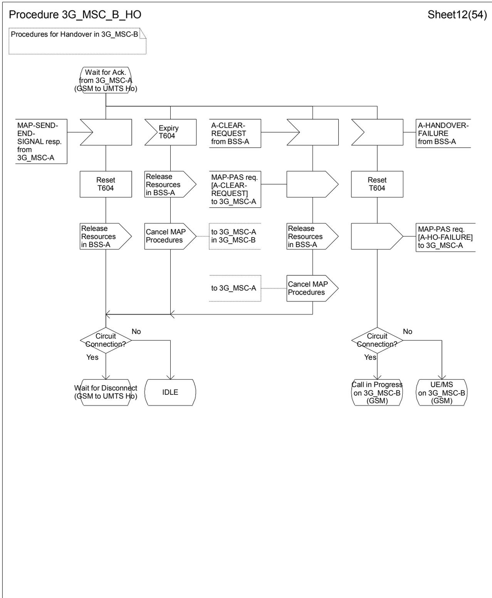

### Procedure 3G\_MSC\_B\_HO

Sheet12(54)

Procedures for Handover in 3G\_MSC-B

```

    graph TD
        Start([Wait for Ack.  
from 3G_MSC-A  
(GSM to UMTS Ho)])
        
        %% Path 1: MAP-SEND-END-SIGNAL
        Start --> In1[/MAP-SEND-END-SIGNAL resp.  
from 3G_MSC-A/]
        In1 --> Task1[Reset  
T604]
        Task1 --> Task2[Release  
Resources  
in BSS-A]
        Task2 --> Dec1{Circuit  
Connection?}
        Dec1 -- Yes --> State1([Wait for Disconnect  
(GSM to UMTS Ho)])
        Dec1 -- No --> State2([IDLE])

        %% Path 2: Expiry T604
        Start --> In2[/Expiry  
T604/]
        In2 --> Task3[Release  
Resources  
in BSS-A]
        Task3 --> Task4[Cancel MAP  
Procedures]
        Task4 --> Out1>to 3G_MSC-A  
in 3G_MSC-B<
        Out1 --> Out2>to 3G_MSC-A<
        Out2 --> Dec1

        %% Path 3: A-CLEAR-REQUEST
        Start --> In3[/A-CLEAR-REQUEST  
from BSS-A/]
        In3 --> Out3>MAP-PAS req.  
[A-CLEAR-REQUEST]  
to 3G_MSC-A<
        Out3 --> Task5[Release  
Resources  
in BSS-A]
        Task5 --> Task6[Cancel MAP  
Procedures]
        Task6 --> Out4>to 3G_MSC-A<
        Out4 --> Dec2{Circuit  
Connection?}
        Dec2 -- Yes --> State3([Call in Progress  
on 3G_MSC-B  
(GSM)])
        Dec2 -- No --> State4([UE/MS  
on 3G_MSC-B  
(GSM)])

        %% Path 4: A-HANDOVER-FAILURE
        Start --> In4[/A-HANDOVER-FAILURE  
from BSS-A/]
        In4 --> Task7[Reset  
T604]
        Task7 --> Out5>MAP-PAS req.  
[A-HO-FAILURE]  
to 3G_MSC-A<
        Out5 --> Dec2
    
```

SDL Flowchart for Procedure 3G\_MSC\_B\_HO showing handover control logic in 3G\_MSC-B.

**Figure 44 (sheet 12 of 54): Handover control procedure in 3G\_MSC-B**

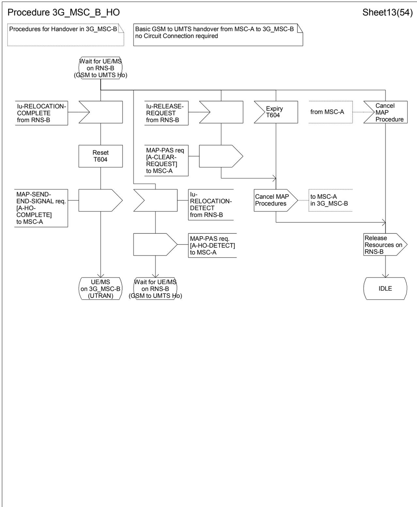

### Procedure 3G\_MSC\_B\_HO

Sheet13(54)

Procedures for Handover in 3G\_MSC-BBasic GSM to UMTS handover from MSC-A to 3G\_MSC-B  
no Circuit Connection required

```
stateDiagram-v2
    [*] --> WaitGSM_UMTS_HO: Wait for UE/MS on RNS-B (GSM to UMTS Ho)
    state "WaitGSM_UMTS_HO" as WaitGSM_UMTS_HO
    state "UE/MS on 3G_MSC-B (UTRAN)" as UTRAN
    state "IDLE" as IDLE
    state "Cancel MAP Procedure" as CancelMAP
    state "Release Resources on RNS-B" as ReleaseRes
    state "MAP-PAS req [A-CLEAR-REQUEST] to MSC-A" as PAS_REQ
    state "iu-RELOCATION-DETECT from RNS-B" as DETECT
    state "MAP-PAS req. [A-HO-DETECT] to MSC-A" as HO_DETECT
    state "Cancel MAP Procedures to MSC-A in 3G_MSC-B" as CancelMAP_Proc
    state "iu-RELEASE-REQUEST from RNS-B" as RELEASE_REQ
    state "iu-RELOCATION-COMPLETE from RNS-B" as COMPLETE
    state "Reset T604" as ResetT604
    state "MAP-SEND-END-SIGNAL req. [A-HO-COMPLETE] to MSC-A" as END_SIGNAL
    state "WaitGSM_UMTS_HO_2: Wait for UE/MS on RNS-B (GSM to UMTS Ho)" as WaitGSM_UMTS_HO_2

    WaitGSM_UMTS_HO --> COMPLETE
    COMPLETE --> ResetT604
    ResetT604 --> END_SIGNAL
    END_SIGNAL --> UTRAN
    WaitGSM_UMTS_HO --> RELEASE_REQ
    RELEASE_REQ --> PAS_REQ
    PAS_REQ --> DETECT
    DETECT --> HO_DETECT
    HO_DETECT --> WaitGSM_UMTS_HO_2
    WaitGSM_UMTS_HO --> ExpiryT604: Expiry T604
    ExpiryT604 --> CancelMAP_Proc
    CancelMAP_Proc --> CancelMAP
    CancelMAP --> ReleaseRes
    ReleaseRes --> IDLE
```

The flowchart illustrates the handover control procedure in 3G\_MSC-B. It begins with an initial state 'Wait for UE/MS on RNS-B (GSM to UMTS Ho)'. From here, three main paths emerge: 1) Receipt of 'iu-RELOCATION-COMPLETE from RNS-B' leads to 'Reset T604', then 'MAP-SEND-END-SIGNAL req. [A-HO-COMPLETE] to MSC-A', and finally to the state 'UE/MS on 3G\_MSC-B (UTRAN)'. 2) Receipt of 'iu-RELEASE-REQUEST from RNS-B' leads to 'MAP-PAS req [A-CLEAR-REQUEST] to MSC-A', which then leads to 'iu-RELOCATION-DETECT from RNS-B', then 'MAP-PAS req. [A-HO-DETECT] to MSC-A', and finally back to a waiting state 'Wait for UE/MS on RNS-B (GSM to UMTS Ho)'. 3) An 'Expiry T604' event leads to 'Cancel MAP Procedures to MSC-A in 3G\_MSC-B', which then leads to 'Cancel MAP Procedure', 'Release Resources on RNS-B', and finally to the 'IDLE' state.

Flowchart of Procedure 3G\_MSC\_B\_HO showing various states and transitions for a handover process.

Figure 44 (sheet 13 of 54): Handover control procedure in 3G\_MSC-B

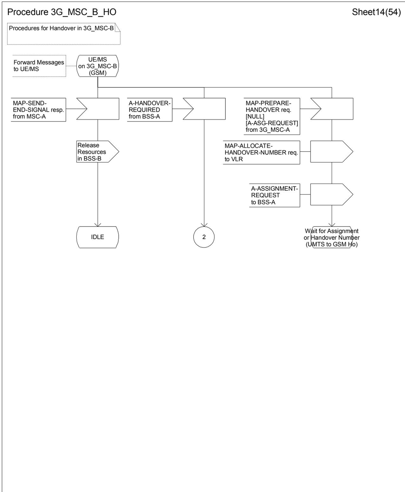

### Procedure 3G\_MSC\_B\_HO

Sheet14(54)

Procedures for Handover in 3G\_MSC-B

```
sequenceDiagram
    participant UE/MS as UE/MS on 3G_MSC-B (GSM)
    participant MSC-A as MSC-A
    participant BSS-A as BSS-A
    participant BSS-B as BSS-B
    Note left of UE/MS: Forward Messages to UE/MS
    Note right of BSS-A: A-HANDOVER-REQUIRED from BSS-A
    Note right of MSC-A: MAP-PREPARE-HANDOVER req. [NULL] [A-ASG-REQUEST] from 3G_MSC-A
    Note right of BSS-B: MAP-ALLOCATE-HANDOVER-NUMBER req. to VLR
    Note right of BSS-A: A-ASSIGNMENT-REQUEST to BSS-A
    Note right of BSS-B: Wait for Assignment or Handover Number (UMTS to GSM Ho)

    UE/MS->>MSC-A: 
    MSC-A->>BSS-A: MAP-SEND-END-SIGNAL resp. from MSC-A
    BSS-A->>MSC-A: A-HANDOVER-REQUIRED from BSS-A
    MSC-A->>BSS-B: MAP-PREPARE-HANDOVER req. [NULL] [A-ASG-REQUEST] from 3G_MSC-A
    BSS-B->>MSC-A: MAP-ALLOCATE-HANDOVER-NUMBER req. to VLR
    MSC-A->>BSS-A: A-ASSIGNMENT-REQUEST to BSS-A
    BSS-B->>UE/MS: Release Resources in BSS-B
    UE/MS-->>BSS-B: IDLE
    BSS-A-->>MSC-A: 2
    BSS-B-->>UE/MS: Wait for Assignment or Handover Number (UMTS to GSM Ho)
```

The diagram illustrates the handover control procedure in 3G\_MSC-B. It begins with the UE/MS on 3G\_MSC-B (GSM). The process involves several message exchanges: 1. Forward Messages to UE/MS (dashed box). 2. MAP-SEND-END-SIGNAL resp. from MSC-A to BSS-B. 3. Release Resources in BSS-B from BSS-B to UE/MS, leading to an IDLE state. 4. A-HANDOVER-REQUIRED from BSS-A to MSC-A, leading to connector 2. 5. MAP-PREPARE-HANDOVER req. [NULL] [A-ASG-REQUEST] from 3G\_MSC-A to BSS-B. 6. MAP-ALLOCATE-HANDOVER-NUMBER req. to VLR from BSS-B to MSC-A. 7. A-ASSIGNMENT-REQUEST to BSS-A from MSC-A. 8. Wait for Assignment or Handover Number (UMTS to GSM Ho) from BSS-B to UE/MS.

Sequence diagram for Procedure 3G\_MSC\_B\_HO showing handover control steps between UE/MS, MSC-A, BSS-A, and BSS-B.

Figure 44 (sheet 14 of 54): Handover control procedure in 3G\_MSC-B

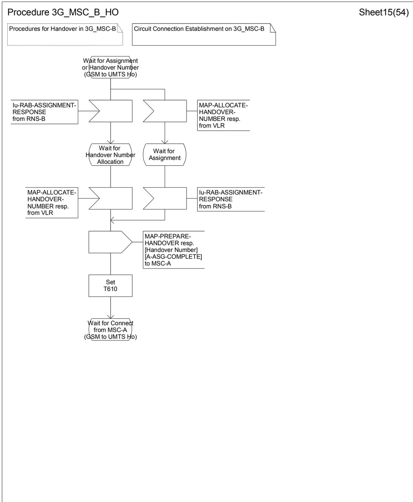

### Procedure 3G\_MSC\_B\_HO

Sheet15(54)

Procedures for Handover in 3G\_MSC-B

Circuit Connection Establishment on 3G\_MSC-B

```
graph TD; Start([Wait for Assignment or Handover Number (GSM to UMTS Ho)]) --> Join1(( )); Join1 --> RNSB_resp["Iu-RAB-ASSIGNMENT-RESPONSE from RNS-B"]; Start --> VLR_resp["MAP-ALLOCATE-HANDOVER-NUMBER resp. from VLR"]; RNSB_resp --> WaitHN["Wait for Handover Number Allocation"]; VLR_resp --> WaitA["Wait for Assignment"]; WaitHN --> VLR_resp2["MAP-ALLOCATE-HANDOVER-NUMBER resp. from VLR"]; WaitA --> RNSB_resp2["Iu-RAB-ASSIGNMENT-RESPONSE from RNS-B"]; VLR_resp2 --> Join2(( )); RNSB_resp2 --> Join2; Join2 --> MSCA_resp["MAP-PREPARE-HANDOVER resp. [Handover Number] [A-ASG-COMPLETE] to MSC-A"]; MSCA_resp --> SetT610["Set T610"]; SetT610 --> WaitConnect["Wait for Connect from MSC-A (GSM to UMTS Ho)"];
```

The flowchart illustrates the handover control procedure in 3G\_MSC-B. It begins with a state 'Wait for Assignment or Handover Number (GSM to UMTS Ho)'. From this state, two parallel paths emerge: one leading to a merge point for receiving 'Iu-RAB-ASSIGNMENT-RESPONSE from RNS-B', and another leading to a merge point for receiving 'MAP-ALLOCATE-HANDOVER-NUMBER resp. from VLR'. The first path then leads to a state 'Wait for Handover Number Allocation', which subsequently leads to a merge point for receiving 'MAP-ALLOCATE-HANDOVER-NUMBER resp. from VLR'. The second path from the initial state leads to a state 'Wait for Assignment', which then leads to a merge point for receiving 'Iu-RAB-ASSIGNMENT-RESPONSE from RNS-B'. Both of these subsequent merge points lead to a common merge point. From this common merge point, the flow proceeds to a state 'MAP-PREPARE-HANDOVER resp. [Handover Number] [A-ASG-COMPLETE] to MSC-A', which then leads to a state 'Set T610'. Finally, the flow proceeds to a state 'Wait for Connect from MSC-A (GSM to UMTS Ho)'.

Flowchart of handover control procedure in 3G\_MSC-B

Figure 44 (sheet 15 of 54): Handover control procedure in 3G\_MSC-B

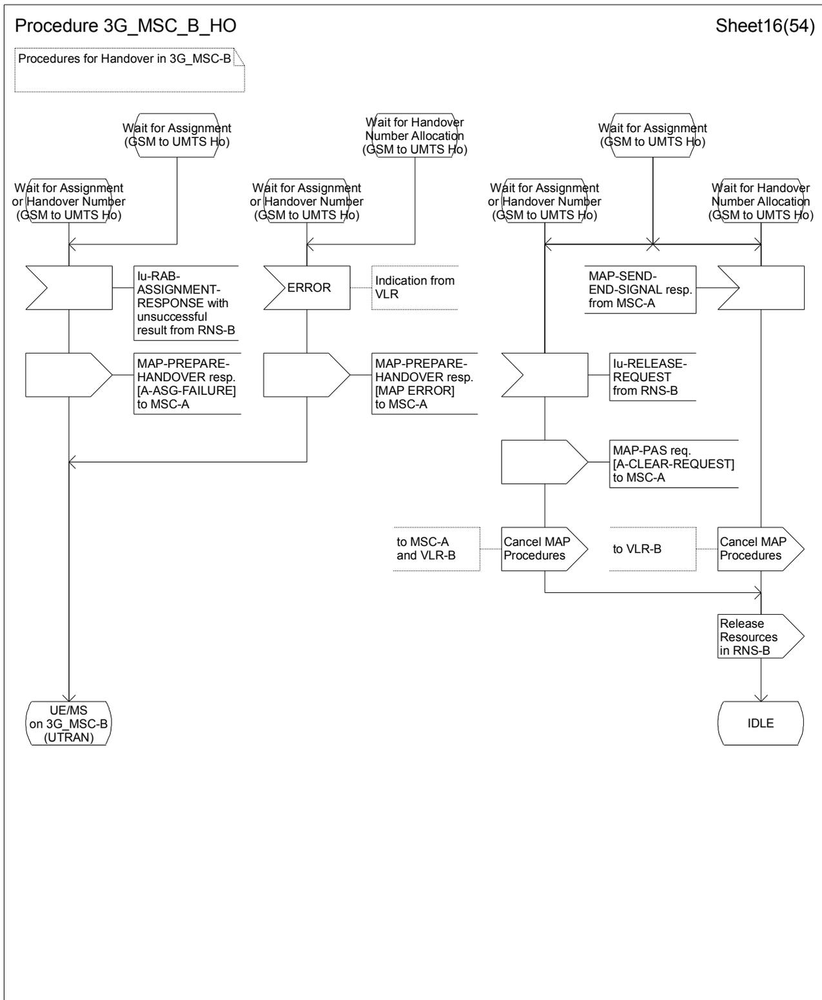

**Procedure 3G\_MSC\_B\_HO** Sheet16(54)

Procedures for Handover in 3G\_MSC-B

```

sequenceDiagram
    participant MSC_A as MSC-A
    participant MSC_B as 3G_MSC-B
    participant VLR_B as VLR-B
    participant RNS_B as RNS-B

    Note over MSC_B: Wait for Assignment (GSM to UMTS Ho)
    Note over MSC_B: Wait for Assignment or Handover Number (GSM to UMTS Ho)
    
    RNS_B->>MSC_B: Iu-RAB-ASSIGNMENT-RESPONSE with unsuccessful result from RNS-B
    MSC_B->>MSC_A: MAP-PREPARE-HANDOVER resp. [A-ASG-FAILURE] to MSC-A
    Note over MSC_B: UE/MS on 3G_MSC-B (UTRAN)

    Note over MSC_B: Wait for Assignment or Handover Number (GSM to UMTS Ho)
    Note over MSC_B: Wait for Handover Number Allocation (GSM to UMTS Ho)
    VLR_B-->MSC_B: Indication from VLR
    Note right of MSC_B: ERROR
    MSC_B->>MSC_A: MAP-PREPARE-HANDOVER resp. [MAP ERROR] to MSC-A
    Note over MSC_B: to MSC-A and VLR-B
    Note over MSC_B: Cancel MAP Procedures

    Note over MSC_B: Wait for Assignment (GSM to UMTS Ho)
    Note over MSC_B: Wait for Assignment or Handover Number (GSM to UMTS Ho)
    MSC_A->>MSC_B: MAP-SEND-END-SIGNAL resp. from MSC-A
    MSC_B->>RNS_B: Iu-RELEASE-REQUEST from RNS-B
    MSC_B->>MSC_A: MAP-PAS req. [A-CLEAR-REQUEST] to MSC-A
    Note over MSC_B: to VLR-B
    Note over MSC_B: Cancel MAP Procedures

    Note over MSC_B: Wait for Handover Number Allocation (GSM to UMTS Ho)
    Note over MSC_B: Wait for Assignment or Handover Number (GSM to UMTS Ho)
    Note over MSC_B: Release Resources in RNS-B
    Note over MSC_B: IDLE
  
```

SDL diagram showing the handover control procedure in 3G\_MSC-B. It details various wait states and message exchanges between MSC-A, VLR-B, and RNS-B, handling both error conditions and resource release leading to an IDLE state.

Figure 44 (sheet 16 of 54): Handover control procedure in 3G\_MSC-B

![Flowchart of Procedure 3G_MSC_B_HO for GSM to UMTS handover. The process starts with 'Wait for Connect from MSC-A (GSM to UMTS Ho)'. It branches into three main paths: 1) Receiving 'I_CONNECT (IAM) from MSC-A (Uses Handover No.)' leads to 'Reset T610', then 'MAP-SEND-HANDOVER-REPORT resp. to VLR-B', then 'I_COMPLETE (ACM) to MSC-A', ending at 'Call on 3G_MSC-B (UTRAN)'. 2) 'Expiry T610' leads to 'Cancel MAP Procedures', which then leads to 'Release Radio Resources on RNS-B', ending at 'IDLE'. 3) Receiving 'Iu-RELEASE-REQUEST from RNS-A' leads to 'MAP-PAS req. [A-CLEAR_REQUEST] to MSC-A', then 'Cancel MAP Procedures' (to MSC-A in 3G_MSC-B), which then leads to 'Release Radio Resources on RNS-B', ending at 'IDLE'. There are also dashed boxes for 'to MSC-A in 3G_MSC-B' and 'to MSC-A in 3G_MSC-B'.](ee9ec9df0528b0bc5018e4d2d640207f_img.jpg)

### Procedure 3G\_MSC\_B\_HO

Sheet17(54)

Procedures for Handover in 3G\_MSC-B

```
graph TD; Start([Wait for Connect from MSC-A (GSM to UMTS Ho)]) --> I_CONNECT[I_CONNECT (IAM) from MSC-A (Uses Handover No.)]; Start --> Expiry[Expiry T610]; Start --> Iu_RELEASE[Iu-RELEASE-REQUEST from RNS-A]; I_CONNECT --> Reset[Reset T610]; Reset --> MAP_SEND[MAP-SEND-HANDOVER-REPORT resp. to VLR-B]; MAP_SEND --> I_COMPLETE[I_COMPLETE (ACM) to MSC-A]; I_COMPLETE --> Call([Call on 3G_MSC-B (UTRAN)]); Expiry --> Cancel1[Cancel MAP Procedures]; Cancel1 --> Release[Release Radio Resources on RNS-B]; Release --> Idle([IDLE]); Iu_RELEASE --> MAP_PAS[MAP-PAS req. [A-CLEAR_REQUEST] to MSC-A]; MAP_PAS --> Cancel2[Cancel MAP Procedures]; Cancel2 --> Release; Release --> Idle;
```

Flowchart of Procedure 3G\_MSC\_B\_HO for GSM to UMTS handover. The process starts with 'Wait for Connect from MSC-A (GSM to UMTS Ho)'. It branches into three main paths: 1) Receiving 'I\_CONNECT (IAM) from MSC-A (Uses Handover No.)' leads to 'Reset T610', then 'MAP-SEND-HANDOVER-REPORT resp. to VLR-B', then 'I\_COMPLETE (ACM) to MSC-A', ending at 'Call on 3G\_MSC-B (UTRAN)'. 2) 'Expiry T610' leads to 'Cancel MAP Procedures', which then leads to 'Release Radio Resources on RNS-B', ending at 'IDLE'. 3) Receiving 'Iu-RELEASE-REQUEST from RNS-A' leads to 'MAP-PAS req. [A-CLEAR\_REQUEST] to MSC-A', then 'Cancel MAP Procedures' (to MSC-A in 3G\_MSC-B), which then leads to 'Release Radio Resources on RNS-B', ending at 'IDLE'. There are also dashed boxes for 'to MSC-A in 3G\_MSC-B' and 'to MSC-A in 3G\_MSC-B'.

Figure 44 (sheet 17 of 54): Handover control procedure in 3G\_MSC-B


### Procedure 3G\_MSC\_B\_HO

Sheet18(54)

Procedures for Handover in 3G\_MSC-B

```
graph TD; Start[Wait for Connect from MSC-A (GSM to UMTS Ho)] --> Branch1(( )); Start --> Branch2(( )); Start --> Branch3(( )); Branch1 --> I_DISCONNECT[I_DISCONNECT (REL) from MSC-A]; I_DISCONNECT --> UE[UE/MS on 3G_MSC-B (UTRAN)]; Branch2 --> MAP_SEND[MAP-SEND-END-SIGNAL resp. from MSC-A]; MAP_SEND --> Release1[Release Resources on RNS-B]; Release1 --> IDLE1[IDLE]; Branch3 --> FromMSCA[from MSC-A]; FromMSCA --> Cancel[Cancel MAP Procedure]; Cancel --> Release2[Release Resources on RNS-B]; Release2 --> IDLE2[IDLE];
```

Flowchart of Procedure 3G\_MSC\_B\_HO for GSM to UMTS handover. The process starts with 'Wait for Connect from MSC-A (GSM to UMTS Ho)'. It then branches into three paths: 1) 'I\_DISCONNECT (REL) from MSC-A' leads to 'UE/MS on 3G\_MSC-B (UTRAN)'. 2) 'MAP-SEND-END-SIGNAL resp. from MSC-A' leads to 'Release Resources on RNS-B' which leads to 'IDLE'. 3) 'from MSC-A' leads to 'Cancel MAP Procedure' which leads to 'Release Resources on RNS-B' which leads to 'IDLE'.

Figure 44 (sheet 18 of 54): Handover control procedure in 3G\_MSC-B


### Procedure 3G\_MSC\_B\_HO

Procedures for Handover in 3G\_MSC-B

Sheet19(54)

```
graph TD; Start((5)) --> KnownBSS{Known BSS?}; KnownBSS -- No --> PrepResp[MAP-PREPARE-HANDOVER resp [A-HO-FAILURE] to 3G_MSC-A]; PrepResp --> IDLE([IDLE]); KnownBSS -- Yes --> HandoverNumber{Handover Number?}; HandoverNumber -- "Not Requested" --> IDLE; HandoverNumber -- Requested --> MapAlloc[MAP-ALLOCATE-HANDOVER-NUMBER req. to VLR]; MapAlloc --> SetT401[Set T401]; SetT401 --> AHandover[A-HANDOVER-REQUEST to BSS-B]; AHandover --> Wait[Wait for Channel or Handover Number (UMTS to GSM Ho)];
```

Flowchart of Procedure 3G\_MSC\_B\_HO. It starts at connector 5, checks if the BSS is known. If not, it sends a MAP-PREPARE-HANDOVER response to 3G\_MSC-A and goes to IDLE. If known, it checks if a handover number is requested. If not requested, it goes to IDLE. If requested, it sends a MAP-ALLOCATE-HANDOVER-NUMBER request to the VLR, sets timer T401, sends an A-HANDOVER-REQUEST to BSS-B, and waits for a channel or handover number (UMTS to GSM Ho).

Figure 44 (sheet 19 of 54): Handover control procedure in 3G\_MSC-B

![Flowchart of Handover control procedure in 3G_MSC-B. The process starts with 'Wait for Channel or Handover Number (UMTS to GSM Ho)'. It branches into two main paths. The left path involves receiving 'A-HANDOVER-REQUEST-ACK from BSS-B', resetting timer T401, and then checking 'Handover Number?'. If 'Not Requested', it sends 'MAP-PREPARE-HANDOVER resp. [A-HO-REQUEST-ACK] to 3G_MSC-A', sets timer T404, and waits for UE/MS on BSS-B. If 'Requested', it waits for 'Handover Number Allocation', receives 'MAP-ALLOCATE-HANDOVER-NUMBER resp. from VLR', sends 'MAP-PREPARE-HANDOVER resp. [A-HO-REQUEST-ACK] [Handover Number] to 3G_MSC-A', sets timer T410, and waits for connection from 3G_MSC-A. The right path involves receiving 'MAP-ALLOCATE-HANDOVER-NUMBER resp. from VLR', waiting for 'Channel Allocation', receiving 'A-HANDOVER-REQUEST-ACK from BSS-B', resetting timer T401, and then sending 'MAP-PREPARE-HANDOVER resp. [A-HO-REQUEST-ACK] [Handover Number] to 3G_MSC-A'.](b2f6158e74f297659bf41c5939b2c1e0_img.jpg)

**Procedure 3G\_MSC\_B\_HO** Sheet20(54)

Procedures for Handover in 3G\_MSC-B

```

graph TD
    Start([Wait for Channel or Handover Number  
(UMTS to GSM Ho)]) --> A_HO_REQ_ACK[A-HANDOVER-REQUEST-ACK  
from BSS-B]
    Start --> MAP_ALLOC_NUM[MAP-ALLOCATE-HANDOVER-NUMBER resp.  
from VLR]
    A_HO_REQ_ACK --> Reset_T401_1[Reset T401]
    Reset_T401_1 --> Handover_Number{Handover Number?}
    Handover_Number -- Not Requested --> MAP_PREPARE_HO_1[MAP-PREPARE-HANDOVER resp.  
[A-HO-REQUEST-ACK]  
to 3G_MSC-A]
    Handover_Number -- Requested --> Wait_HO_Num[Wait for Handover Number Allocation]
    Wait_HO_Num --> MAP_ALLOC_NUM_2[MAP-ALLOCATE-HANDOVER-NUMBER resp.  
from VLR]
    MAP_ALLOC_NUM_2 --> MAP_PREPARE_HO_2[MAP-PREPARE-HANDOVER resp.  
[A-HO-REQUEST-ACK]  
[Handover Number]  
to 3G_MSC-A]
    MAP_ALLOC_NUM --> Wait_Channel[Wait for Channel Allocation]
    Wait_Channel --> A_HO_REQ_ACK_2[A-HANDOVER-REQUEST-ACK  
from BSS-B]
    A_HO_REQ_ACK_2 --> Reset_T401_2[Reset T401]
    Reset_T401_2 --> MAP_PREPARE_HO_2
    MAP_PREPARE_HO_1 --> Set_T404[Set T404]
    Set_T404 --> Wait_UE_MS[Wait for UE/MS  
on BSS-B  
(UMTS to GSM Ho)]
    MAP_PREPARE_HO_2 --> Set_T410[Set T410]
    Set_T410 --> Wait_Conn[Wait for Connection  
from 3G_MSC-A  
(UMTS to GSM Ho)]
  
```

Flowchart of Handover control procedure in 3G\_MSC-B. The process starts with 'Wait for Channel or Handover Number (UMTS to GSM Ho)'. It branches into two main paths. The left path involves receiving 'A-HANDOVER-REQUEST-ACK from BSS-B', resetting timer T401, and then checking 'Handover Number?'. If 'Not Requested', it sends 'MAP-PREPARE-HANDOVER resp. [A-HO-REQUEST-ACK] to 3G\_MSC-A', sets timer T404, and waits for UE/MS on BSS-B. If 'Requested', it waits for 'Handover Number Allocation', receives 'MAP-ALLOCATE-HANDOVER-NUMBER resp. from VLR', sends 'MAP-PREPARE-HANDOVER resp. [A-HO-REQUEST-ACK] [Handover Number] to 3G\_MSC-A', sets timer T410, and waits for connection from 3G\_MSC-A. The right path involves receiving 'MAP-ALLOCATE-HANDOVER-NUMBER resp. from VLR', waiting for 'Channel Allocation', receiving 'A-HANDOVER-REQUEST-ACK from BSS-B', resetting timer T401, and then sending 'MAP-PREPARE-HANDOVER resp. [A-HO-REQUEST-ACK] [Handover Number] to 3G\_MSC-A'.

Figure 44 (sheet 20 of 54): Handover control procedure in 3G\_MSC-B

![Flowchart of handover control procedure in 3G_MSC-B. The diagram shows two main paths starting from 'Wait for Channel or Handover Number (UMTS to GSM Ho)'. The left path handles a failure scenario where 'A-HANDOVER-FAILURE from BSS-B' or 'Expiry T401' occurs, leading to 'Release Resources in BSS-B', 'MAP-PREPARE-HANDOVER resp. [A-HO-FAILURE] to 3G_MSC-A', and finally 'IDLE'. The right path handles a success scenario where 'A_CLEAR-REQUEST from BSS-B' occurs, leading to 'ERROR' (with 'Indication from VLR'), 'MAP-PREPARE-HANDOVER resp. [MAP ERROR] to 3G_MSC-A', 'Cancel Channel on BSS-B', and finally 'IDLE'.](3c65409bf428d5233f0443c2437c5b40_img.jpg)

### Procedure 3G\_MSC\_B\_HO

Procedures for Handover in 3G\_MSC-B

Sheet21(54)

```
graph TD; subgraph LeftPath [ ]; W1[Wait for Channel or Handover Number (UMTS to GSM Ho)]; W2[Wait for Channel Allocation (UMTS to GSM Ho)]; W1 --> J1(( )); W2 --> J1; J1 --> F1[A-HANDOVER-FAILURE from BSS-B]; F1 --> R1[Release Resources in BSS-B]; J1 --> E1[Expiry T401]; E1 --> R2[Release Resources in BSS-B]; R1 --> M1[MAP-PREPARE-HANDOVER resp. [A-HO-FAILURE] to 3G_MSC-A]; R2 --> M1; M1 --> I1([IDLE]); end; subgraph RightPath [ ]; W3[Wait for Channel or Handover Number (UMTS to GSM Ho)]; W4[Wait for Handover Number Allocation (UMTS to GSM Ho)]; W3 --> J2(( )); W4 --> J2; J2 --> F2[A_CLEAR-REQUEST from BSS-B]; F2 --> E2[ERROR]; E2 --> I2[Indication from VLR]; J2 --> M2[MAP-PREPARE-HANDOVER resp. [MAP ERROR] to 3G_MSC-A]; E2 --> C[Cancel Channel on BSS-B]; C --> I3([IDLE]); end;
```

Flowchart of handover control procedure in 3G\_MSC-B. The diagram shows two main paths starting from 'Wait for Channel or Handover Number (UMTS to GSM Ho)'. The left path handles a failure scenario where 'A-HANDOVER-FAILURE from BSS-B' or 'Expiry T401' occurs, leading to 'Release Resources in BSS-B', 'MAP-PREPARE-HANDOVER resp. [A-HO-FAILURE] to 3G\_MSC-A', and finally 'IDLE'. The right path handles a success scenario where 'A\_CLEAR-REQUEST from BSS-B' occurs, leading to 'ERROR' (with 'Indication from VLR'), 'MAP-PREPARE-HANDOVER resp. [MAP ERROR] to 3G\_MSC-A', 'Cancel Channel on BSS-B', and finally 'IDLE'.

Figure 44 (sheet 21 of 54): Handover control procedure in 3G\_MSC-B

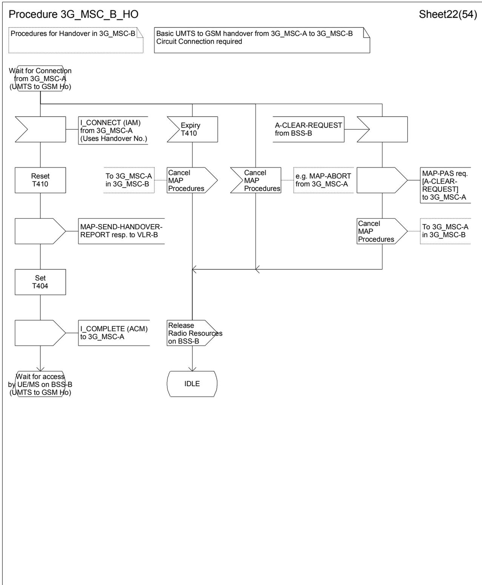

### Procedure 3G\_MSC\_B\_HO

Sheet22(54)

Procedures for Handover in 3G\_MSC-B

Basic UMTS to GSM handover from 3G\_MSC-A to 3G\_MSC-B  
Circuit Connection required

```
graph TD; Start([Wait for Connection from 3G_MSC-A (UMTS to GSM Ho)]) --> I_CONNECT[I_CONNECT (IAM) from 3G_MSC-A (Uses Handover No.)]; I_CONNECT --> Reset[Reset T410]; Reset --> MAP_SEND[MAP-SEND-HANDOVER-REPORT resp. to VLR-B]; MAP_SEND --> SetT404[Set T404]; SetT404 --> I_COMPLETE[I_COMPLETE (ACM) to 3G_MSC-A]; I_COMPLETE --> End1([Wait for access by UE/MS on BSS-B (UMTS to GSM Ho)]); I_CONNECT --> Expiry[Expiry T410]; Expiry --> Cancel1[Cancel MAP Procedures]; Cancel1 --> To3G_MSC_A1[To 3G_MSC-A in 3G_MSC-B]; I_CONNECT --> A_CLEAR[A-CLEAR-REQUEST from BSS-B]; A_CLEAR --> Cancel2[Cancel MAP Procedures]; Cancel2 --> E_G[MAP-PAS req. [A-CLEAR-REQUEST] to 3G_MSC-A]; A_CLEAR --> Cancel3[Cancel MAP Procedures]; Cancel3 --> To3G_MSC_A2[To 3G_MSC-A in 3G_MSC-B]; Expiry --> Release[Release Radio Resources on BSS-B]; Release --> IDLE([IDLE]);
```

The flowchart illustrates the handover control procedure in 3G\_MSC-B. It begins with a 'Wait for Connection from 3G\_MSC-A (UMTS to GSM Ho)' state. Upon receiving an 'I\_CONNECT (IAM) from 3G\_MSC-A (Uses Handover No.)', the MSC-B performs several actions: it resets timer T410, sends a 'MAP-SEND-HANDOVER-REPORT resp. to VLR-B', and sets timer T404. It then sends an 'I\_COMPLETE (ACM) to 3G\_MSC-A' and enters a 'Wait for access by UE/MS on BSS-B (UMTS to GSM Ho)' state. Simultaneously, if timer T410 expires, the MSC-B cancels MAP procedures, sends a message 'To 3G\_MSC-A in 3G\_MSC-B', releases radio resources on BSS-B, and enters an 'IDLE' state. If an 'A-CLEAR-REQUEST from BSS-B' is received, the MSC-B again cancels MAP procedures, sends a 'MAP-PAS req. [A-CLEAR-REQUEST] to 3G\_MSC-A', sends another message 'To 3G\_MSC-A in 3G\_MSC-B', and releases radio resources on BSS-B to enter the 'IDLE' state. A dashed box labeled 'e.g. MAP-ABORT from 3G\_MSC-A' is shown as an alternative input to the second 'Cancel MAP Procedures' block.

Flowchart of Procedure 3G\_MSC\_B\_HO showing the sequence of messages and actions for a handover from 3G\_MSC-A to 3G\_MSC-B.

Figure 44 (sheet 22 of 54): Handover control procedure in 3G\_MSC-B


**Procedure 3G\_MSC\_B\_HO** Sheet23(54)

Procedures for Handover in 3G\_MSC-B

```

  State: Wait for access by UE/MS on BSS-B (UMTS to GSM Ho)
  
  Input: A-HANDOVER-COMPLETE from BSS-B
    - Output: MAP-PAS req [A-CLEAR-REQUEST] to MSC-A
    - Output: I_DISCONNECT (REL) to 3G_MSC-A
    - Reset T404
    - Decision: ANM Sent?
      - Yes: 
        - Output: MAP-SEND-END-SIGNAL req. [A-HO-COMPLETE] to 3G_MSC-A
        - State: Call in Progress on 3G_MSC-B (GSM)
      - No:
        - Output: I_ANSWER (ANM) to 3G_MSC-A
        - Output: MAP-SEND-END-SIGNAL req. [A-HO-COMPLETE] to 3G_MSC-A
        - State: Call in Progress on 3G_MSC-B (GSM)

  Input: A-CLEAR-REQUEST from BSS-B
    - Output: Cancel MAP Procedures
    - Output: Release Resources on BSS-B
    - State: IDLE

  Input: Expiry T404
    - Output: Cancel MAP Procedures
    - Output: Release Resources on BSS-B
    - State: IDLE

  Input: from 3G_MSC-A
    - Output: Cancel MAP Procedure
    - Reset T404
    - Output: Release Resources on BSS-B
    - State: Wait for Disconnect (UMTS to GSM Ho)

  Input: I_DISCONNECT (REL) from 3G_MSC-A
    - Output: Cancel MAP Procedures
    - Output: Release Resources on BSS-B
    - State: IDLE

  Input: A-HANDOVER-DETECT from BSS-B
    - Output: I_ANSWER (ANM) to 3G_MSC-A
    - Output: MAP-PAS req [A-HO-DETECT] to 3G_MSC-A
    - State: Wait for access by UE/MS on BSS-B (UMTS to GSM Ho)
  
```

SDL diagram for Procedure 3G\_MSC\_B\_HO showing handover control logic in 3G\_MSC-B. The flow starts from 'Wait for access by UE/MS on BSS-B (UMTS to GSM Ho)'. It handles inputs like A-HANDOVER-COMPLETE, A-CLEAR-REQUEST, and signals from 3G\_MSC-A. It includes a decision point 'ANM Sent?' and various outputs to MSC-A and BSS-B, leading to states like 'Call in Progress', 'IDLE', or further waiting states.

Figure 44 (sheet 23 of 54): Handover control procedure in 3G\_MSC-B

![Flowchart of handover control procedure in 3G_MSC-B. The process starts with 'Call in Progress on 3G_MSC-B (UTRAN)' and 'Forward Messages to UE/MS'. It branches into three main paths: 1) Receiving 'MAP-SEND-END-SIGNAL resp. from 3G_MSC-A', leading to 'Release Resources in RNS-A' and a decision '3G_MSC-A disconnected?'. 2) Receiving 'Iu-RELEASE-REQUEST from RNS-A', leading to 'MAP-PAS req. [A-CLEAR-REQUEST] to 3G_MSC-A', 'Cancel MAP Procedures', and 'IDLE'. 3) Receiving 'Iu-LOCATION-REPORT from RNS', leading to 'MAP-PAS req. [A-HO-PERFORMED] to 3G_MSC-A', 'Call in Progress on 3G_MSC-B (UTRAN)', and connector '8'. A fourth path involves 'I_DISCONNECT (REL) from 3G_MSC-A' leading to 'Cancel MAP Procedures from 3G_MSC-A', 'Release Resources in RNS-A', 'Iu-RELOCATION-REQUIRED from RNS-A', 'I_DISCONNECT (REL) to 3G_MSC-A', and 'IDLE'. The 'Wait for Disconnect (GSM to UMTS Hb)' path leads to 'I_DISCONNECT (REL) from 3G_MSC-A' and 'IDLE'.](1c877fb0cc57a813ade0008fa01971f0_img.jpg)

### Procedure 3G\_MSC\_B\_HO

Procedures for Handover in 3G\_MSC-B

Sheet24(54)

```
graph TD; Start([Call in Progress on 3G_MSC-B (UTRAN)]) --> Forward[Forward Messages to UE/MS]; Forward --> Join1(( )); Join1 --> MAP_SEND_END[MAP-SEND-END-SIGNAL resp. from 3G_MSC-A]; MAP_SEND_END --> Release_RNS_A1[Release Resources in RNS-A]; Release_RNS_A1 --> Disconnected{3G_MSC-A disconnected?}; Disconnected -- Yes --> IDLE1([IDLE]); Disconnected -- No --> Wait[Wait for Disconnect (GSM to UMTS Hb)]; Wait --> I_DISCONNECT_REL1[I_DISCONNECT (REL) from 3G_MSC-A]; I_DISCONNECT_REL1 --> IDLE1; Join1 --> IU_RELEASE[Iu-RELEASE-REQUEST from RNS-A]; IU_RELEASE --> MAP_PAS_REQ1[MAP-PAS req. [A-CLEAR-REQUEST] to 3G_MSC-A]; MAP_PAS_REQ1 --> Cancel_MAP1[Cancel MAP Procedures]; Cancel_MAP1 --> IDLE2([IDLE]); Join1 --> IU_LOCATION[Iu-LOCATION-REPORT from RNS]; IU_LOCATION --> MAP_PAS_REQ2[MAP-PAS req. [A-HO-PERFORMED] to 3G_MSC-A]; MAP_PAS_REQ2 --> Call_Progress[Call in Progress on 3G_MSC-B (UTRAN)]; Call_Progress --> Connector8((8)); I_DISCONNECT_REL1 --> Cancel_MAP2[Cancel MAP Procedures from 3G_MSC-A]; Cancel_MAP2 --> Release_RNS_A2[Release Resources in RNS-A]; Release_RNS_A2 --> IU_RELOCATION[Iu-RELOCATION-REQUIRED from RNS-A]; IU_RELOCATION --> I_DISCONNECT_REL2[I_DISCONNECT (REL) to 3G_MSC-A]; I_DISCONNECT_REL2 --> IDLE3([IDLE]);
```

Flowchart of handover control procedure in 3G\_MSC-B. The process starts with 'Call in Progress on 3G\_MSC-B (UTRAN)' and 'Forward Messages to UE/MS'. It branches into three main paths: 1) Receiving 'MAP-SEND-END-SIGNAL resp. from 3G\_MSC-A', leading to 'Release Resources in RNS-A' and a decision '3G\_MSC-A disconnected?'. 2) Receiving 'Iu-RELEASE-REQUEST from RNS-A', leading to 'MAP-PAS req. [A-CLEAR-REQUEST] to 3G\_MSC-A', 'Cancel MAP Procedures', and 'IDLE'. 3) Receiving 'Iu-LOCATION-REPORT from RNS', leading to 'MAP-PAS req. [A-HO-PERFORMED] to 3G\_MSC-A', 'Call in Progress on 3G\_MSC-B (UTRAN)', and connector '8'. A fourth path involves 'I\_DISCONNECT (REL) from 3G\_MSC-A' leading to 'Cancel MAP Procedures from 3G\_MSC-A', 'Release Resources in RNS-A', 'Iu-RELOCATION-REQUIRED from RNS-A', 'I\_DISCONNECT (REL) to 3G\_MSC-A', and 'IDLE'. The 'Wait for Disconnect (GSM to UMTS Hb)' path leads to 'I\_DISCONNECT (REL) from 3G\_MSC-A' and 'IDLE'.

Figure 44 (sheet 24 of 54): Handover control procedure in 3G\_MSC-B


### Procedure 3G\_MSC\_B\_HO

Procedures for Handover in 3G\_MSC-B

Sheet25(54)

```
graph TD; 8((8)) --> K{Known MSC?}; K -- Yes --> H{Handover allowed to Cell?}; K -- No --> H; H -- No --> K; H -- Yes --> W{Which 3G_MSC?}; W -- MSC-A/MSC-B' --> M[MAP-PREPARE-SUBSEQUENT-HANDOVER req. [A-HO-REQUEST] to MSC-A]; W -- MSC-B --> KB{Known BSS?}; KB -- No --> 7((7)); KB -- Yes --> R{Resources on BSS-B?}; R -- No --> S{Send Reject?}; R -- Yes --> 9((9)); S -- No --> C{Circuit Connection?}; S -- Yes --> I[lu-RELOCATION-PREPARATION-FAILURE to RNS-A]; I --> C; C -- No --> U[UE/MS on 3G_MSC-B (UTRAN)]; C -- Yes --> P[Call in Progress on 3G_MSC-B (UTRAN)]; M --> T[Set T411]; T --> WR[Wait for Response (UMTS to GSM Ho)]; WR --> 9
```

Flowchart of handover control procedure in 3G\_MSC-B. The process starts at connector 8, checks if the MSC is known, if handover is allowed, which 3G MSC is involved, if the BSS is known, and if resources are available. It then branches based on these checks to either send a reject, prepare for subsequent handover, set a timer, or proceed to connector 9.

Figure 44 (sheet 25 of 54): Handover control procedure in 3G\_MSC-B


**Procedure 3G\_MSC\_B\_HO** Sheet26(54)

Procedures for Handover in 3G\_MSC-B      UMTS to GSM Handover from RNS-A to BSS-B on MSC-B

```

graph TD
    9((9)) --> A[ ]
    A --> B[A-HANDOVER-REQUEST to BSS-B]
    B --> C[Set T401]
    C --> D[Wait for Channel UMTS to GSM Ho]
    D --> E[ ]
    E --> F[A-HANDOVER-REQUEST-ACK from BSS-B]
    F --> G[Reset T401]
    G --> H[Queue Messages in MSC-B]
    H --> I[ ]
    I --> J[Handover Command to UE/MS via Iu-RELOCATION-COMMAND to RNS-A]
    J --> K[Set Up Handover Device]
    K --> L[Set T402]
    L --> M[Wait for access by UE/MS UMTS to GSM Ho]
    E --> N[Expiry T401]
    N --> O[ ]
    O --> P[Release Resources on BSS-B]
    P --> 7((7))
    E --> Q[ ]
    Q --> R[A-HANDOVER-FAILURE from BSS-B]
    R --> S[Reset T401]
    S --> T[ ]
    T --> U[Cancel MAP Procedures]
    U --> V[To 3G_MSC-A in MSC-B]
    V --> O
    E --> W[ ]
    W --> X[MAP-SEND-END-SIGNAL resp. from 3G_MSC-A]
    X --> Y[ ]
    Y --> Z[Cancel Channel request on BSS-B]
    Z --> AA[ ]
    AA --> AB[Release Resources on RNS-A]
    AB --> AC[Wait for Disconnect UMTS to GSM Ho]
    R --> AD[ ]
    AD --> AE[Iu-RELEASE-REQUEST from RNS-A]
    AE --> AF[ ]
    AF --> AG[MAP-PAS req A-CLEAR-REQUEST to 3G_MSC-A]
    AG --> U
  
```

Flowchart of the handover control procedure in 3G\_MSC-B. The process starts at connector 9, sends an A-HANDOVER-REQUEST to BSS-B, sets timer T401, and waits for a channel. It then branches based on responses from BSS-B (ACK, Failure, or MAP-SEND-END-SIGNAL resp. from 3G\_MSC-A) and RNS-A (Iu-RELEASE-REQUEST). Success leads to resource release and connection to connector 7. Failure or cancellation leads to resource release on RNS-A and waiting for disconnect.

Figure 44 (sheet 26 of 54): Handover control procedure in 3G\_MSC-B

![Flowchart of Procedure 3G_MSC_B_HO showing three parallel paths for handover control. Path 1 (left) starts with 'Wait for access by UE/MS (UMTS to GSM Ho)', followed by 'A-HANDOVER-COMPLETE from BSS-B', 'Reset T402', 'MAP-PAS req. [A-HO-PERFORMED] to 3G_MSC-A', a 'Circuit Connection?' decision (No leads to 'UE/MS on 3G_MSC-B (GSM)', Yes leads to 'Connect Handover Device (Optional)' then 'Forward queued messages via BSS-B'), 'Release Resources in RNS-A', another 'Circuit Connection?' decision (No leads to 'UE/MS on 3G_MSC-B (GSM)', Yes leads to 'Release Handover Device' then 'Call in Progress on 3G_MSC-B (GSM)'). Path 2 (middle) starts with 'A-HANDOVER-DETECT from BSS-B', a 'Circuit Connection?' decision (No leads to 'UE/MS on 3G_MSC-B (GSM)', Yes leads to 'Connect Handover Device (Optional)' then 'Wait for access by UE/MS (UMTS to GSM Ho)'). Path 3 (right) starts with 'Iu-RELOCATION CANCEL from RNS-A', 'Reset T402', 'Forward queued messages via RNS-A', 'Release Resources in BSS-B', a 'Circuit Connection?' decision (No leads to 'UE/MS on 3G_MSC-B (UTRAN)', Yes leads to 'Release Handover Device' then 'Call in Progress on 3G_MSC-B (UTRAN)' ).](6c5c4041e081d25a3f7e13f5fd2a3390_img.jpg)

**Procedure 3G\_MSC\_B\_HO** Sheet27(54)

Procedures for Handover in 3G\_MSC-B

```

graph TD
    Start([Wait for access by UE/MS (UMTS to GSM Ho)]) --> AHC[A-HANDOVER-COMPLETE from BSS-B]
    Start --> AHD[A-HANDOVER-DETECT from BSS-B]
    Start --> IRC[Iu-RELOCATION CANCEL from RNS-A]
    
    AHC --> R1[Reset T402]
    R1 --> MP[MAP-PAS req. [A-HO-PERFORMED] to 3G_MSC-A]
    MP --> CC1{Circuit Connection?}
    CC1 -- No --> GSM1([UE/MS on 3G_MSC-B (GSM)])
    CC1 -- Yes --> CHD1[Connect Handover Device (Optional)]
    CHD1 --> FQM1[Forward queued messages via BSS-B]
    FQM1 --> RR1[Release Resources in RNS-A]
    RR1 --> CC2{Circuit Connection?}
    CC2 -- No --> GSM2([UE/MS on 3G_MSC-B (GSM)])
    CC2 -- Yes --> RD1[Release Handover Device]
    RD1 --> CIP1([Call in Progress on 3G_MSC-B (GSM)])
    
    AHD --> CC3{Circuit Connection?}
    CC3 -- No --> GSM3([UE/MS on 3G_MSC-B (GSM)])
    CC3 -- Yes --> CHD2[Connect Handover Device (Optional)]
    CHD2 --> WAM2([Wait for access by UE/MS (UMTS to GSM Ho)])
    
    IRC --> R2[Reset T402]
    R2 --> FQM2[Forward queued messages via RNS-A]
    FQM2 --> RR2[Release Resources in BSS-B]
    RR2 --> CC4{Circuit Connection?}
    CC4 -- No --> UTRAN1([UE/MS on 3G_MSC-B (UTRAN)])
    CC4 -- Yes --> RD2[Release Handover Device]
    RD2 --> CIP2([Call in Progress on 3G_MSC-B (UTRAN)])
  
```

Flowchart of Procedure 3G\_MSC\_B\_HO showing three parallel paths for handover control. Path 1 (left) starts with 'Wait for access by UE/MS (UMTS to GSM Ho)', followed by 'A-HANDOVER-COMPLETE from BSS-B', 'Reset T402', 'MAP-PAS req. [A-HO-PERFORMED] to 3G\_MSC-A', a 'Circuit Connection?' decision (No leads to 'UE/MS on 3G\_MSC-B (GSM)', Yes leads to 'Connect Handover Device (Optional)' then 'Forward queued messages via BSS-B'), 'Release Resources in RNS-A', another 'Circuit Connection?' decision (No leads to 'UE/MS on 3G\_MSC-B (GSM)', Yes leads to 'Release Handover Device' then 'Call in Progress on 3G\_MSC-B (GSM)'). Path 2 (middle) starts with 'A-HANDOVER-DETECT from BSS-B', a 'Circuit Connection?' decision (No leads to 'UE/MS on 3G\_MSC-B (GSM)', Yes leads to 'Connect Handover Device (Optional)' then 'Wait for access by UE/MS (UMTS to GSM Ho)'). Path 3 (right) starts with 'Iu-RELOCATION CANCEL from RNS-A', 'Reset T402', 'Forward queued messages via RNS-A', 'Release Resources in BSS-B', a 'Circuit Connection?' decision (No leads to 'UE/MS on 3G\_MSC-B (UTRAN)', Yes leads to 'Release Handover Device' then 'Call in Progress on 3G\_MSC-B (UTRAN)' ).

Figure 44 (sheet 27 of 54): Handover control procedure in 3G\_MSC-B

![Flowchart of Procedure 3G_MSC_B_HO for handover control. The process starts with 'Wait for access by UE/MS (UMTS to GSM Ho)'. It branches into three main paths: 1) Expiry T402 -> Release Resources in BSS-B and RNS-A -> Release Handover Device -> MAP-PAS req. [A-CLEAR-REQUEST] to 3G_MSC-A -> Cancel MAP Procedures -> To 3G_MSC-A in 3G_MSC-B -> I_DISCONNECT (REL) to 3G_MSC-A -> IDLE. 2) A-CLEAR-REQUEST from BSS-B -> Release Resources in BSS-B -> Wait for access by UE/MS (UMTS to GSM Ho). 3) Iu-RELEASE-REQUEST from RNS-A -> Release Resources in RNS-A -> Wait for access by UE/MS? (Decision). If No, it goes to Release Resources in BSS-B. If Yes, it goes to MAP-PAS req. [A-CLEAR-REQUEST] to 3G_MSC-A -> To 3G_MSC-A in 3G_MSC-B -> Cancel MAP Procedures -> Release Resources in BSS-B -> Wait for Disconnect (UMTS to GSM Ho). A fourth path from the initial wait leads to an unlabeled box -> MAP-SEND-END-SIGNAL resp. from 3G_MSC-A -> Release Resources in BSS-B and RNS-A -> Release Handover Device -> Wait for Disconnect (UMTS to GSM Ho).](f814714d4415807ccec0645e664397e6_img.jpg)

### Procedure 3G\_MSC\_B\_HO

Procedures for Handover in 3G\_MSC-B

Sheet28(54)

```
graph TD; Start([Wait for access by UE/MS (UMTS to GSM Ho)]) --> T402{Expiry T402}; Start --> A_CLEAR[A-CLEAR-REQUEST from BSS-B]; Start --> Iu_RELEASE[Iu-RELEASE-REQUEST from RNS-A]; Start --> Unlabeled[ ]; Start --> MAP_SEND[MAP-SEND-END-SIGNAL resp. from 3G_MSC-A]; T402 --> Res1[Release Resources in BSS-B and RNS-A]; Res1 --> Handover1[Release Handover Device]; Handover1 --> MAP_PAS1[MAP-PAS req. [A-CLEAR-REQUEST] to 3G_MSC-A]; MAP_PAS1 --> Cancel1[Cancel MAP Procedures]; Cancel1 --> To3G1[To 3G_MSC-A in 3G_MSC-B]; To3G1 --> I_DISCONNECT[I_DISCONNECT (REL) to 3G_MSC-A]; I_DISCONNECT --> IDLE([IDLE]); A_CLEAR --> Res2[Release Resources in BSS-B]; Res2 --> WaitAccess2([Wait for access by UE/MS (UMTS to GSM Ho)]); Iu_RELEASE --> Res3[Release Resources in RNS-A]; Res3 --> WaitAccess3{Wait for access by UE/MS?}; WaitAccess3 -- No --> Res2; WaitAccess3 -- Yes --> MAP_PAS2[MAP-PAS req. [A-CLEAR-REQUEST] to 3G_MSC-A]; MAP_PAS2 --> To3G2[To 3G_MSC-A in 3G_MSC-B]; To3G2 --> Cancel2[Cancel MAP Procedures]; Cancel2 --> Res4[Release Resources in BSS-B]; Res4 --> WaitDisconnect2([Wait for Disconnect (UMTS to GSM Ho)]); Unlabeled --> Res5[Release Resources in BSS-B and RNS-A]; Res5 --> Handover2[Release Handover Device]; Handover2 --> WaitDisconnect3([Wait for Disconnect (UMTS to GSM Ho)]);
```

Flowchart of Procedure 3G\_MSC\_B\_HO for handover control. The process starts with 'Wait for access by UE/MS (UMTS to GSM Ho)'. It branches into three main paths: 1) Expiry T402 -> Release Resources in BSS-B and RNS-A -> Release Handover Device -> MAP-PAS req. [A-CLEAR-REQUEST] to 3G\_MSC-A -> Cancel MAP Procedures -> To 3G\_MSC-A in 3G\_MSC-B -> I\_DISCONNECT (REL) to 3G\_MSC-A -> IDLE. 2) A-CLEAR-REQUEST from BSS-B -> Release Resources in BSS-B -> Wait for access by UE/MS (UMTS to GSM Ho). 3) Iu-RELEASE-REQUEST from RNS-A -> Release Resources in RNS-A -> Wait for access by UE/MS? (Decision). If No, it goes to Release Resources in BSS-B. If Yes, it goes to MAP-PAS req. [A-CLEAR-REQUEST] to 3G\_MSC-A -> To 3G\_MSC-A in 3G\_MSC-B -> Cancel MAP Procedures -> Release Resources in BSS-B -> Wait for Disconnect (UMTS to GSM Ho). A fourth path from the initial wait leads to an unlabeled box -> MAP-SEND-END-SIGNAL resp. from 3G\_MSC-A -> Release Resources in BSS-B and RNS-A -> Release Handover Device -> Wait for Disconnect (UMTS to GSM Ho).

Figure 44 (sheet 28 of 54): Handover control procedure in 3G\_MSC-B


### Procedure 3G\_MSC\_B\_HO

Sheet29(54)

Procedures for Handover in 3G\_MSC-BSubsequent UMTS to GSM Handover from 3G\_MSC-B to MSC-A

```
sequenceDiagram
    participant MSC-A
    participant RNS-A
    participant BSS-B

    Note left of MSC-A: Wait for Response (UMTS to GSM Ho)
    MSC-A->>RNS-A: MAP-PREPARE-SUBSEQUENT-HANDOVER resp. [A-HO-REQUEST-ACK] from MSC-A
    RNS-A->>BSS-B: Relocation Command to RNS-A
    BSS-B->>MSC-A: MAP-PAS req. [A-CLEAR-REQUEST] to MSC-A
    MSC-A->>RNS-A: MAP-SEND-END-SIGNAL resp. from MSC-A
    RNS-A->>BSS-B: Release Resources in BSS-B
    BSS-B->>MSC-A: in 3G_MSC-B to MSC-A
    MSC-A->>RNS-A: lu-RELEASE-REQUEST from RNS-A
    RNS-A->>BSS-B: Cancel MAP Procedures
    BSS-B->>RNS-A: Release Resources in RNS-A
    RNS-A->>MSC-A: MAP-PREPARE-SUBSEQUENT-HANDOVER resp. [A-HO-FAILURE or MAP ERROR] from MSC-A
    Note right of MSC-A: Expiry T411
    Note left of MSC-A: Set T404
    Note left of MSC-A: Wait for Ack. from MSC-A (UMTS to GSM Ho)
    Note right of MSC-A: 7
    Note right of RNS-A: Wait for Disconnect (UMTS to GSM Ho)
```

Sequence diagram for Procedure 3G\_MSC\_B\_HO showing handover control between MSC-A, RNS-A, and BSS-B. The diagram includes lifelines for MSC-A, RNS-A, and BSS-B. Key messages include MAP-PREPARE-SUBSEQUENT-HANDOVER, lu-RELEASE-REQUEST, MAP-PAS, MAP-SEND-END-SIGNAL, Relocation Command, and various timers (T411, T404).

Figure 44 (sheet 29 of 54): Handover control procedure in 3G\_MSC-B

![Flowchart of handover control procedure in 3G_MSC-B. The process starts with 'Wait for Ack. (from MSC-A) (UMTS to GSM Ho)'. It branches into four main paths: 1) 'MAP-SEND-END-SIGNAL resp. from MSC-A' -> 'Reset T404' -> 'Release Resources in RNS-A' -> 'Circuit Connection?' (Yes: 'Wait for Disconnect (UMTS to GSM Ho)', No: 'IDLE'). 2) 'Expiry T404' -> 'Release Resources in RNS-A' -> 'Cancel MAP Procedures' (to MSC-A in 3G_MSC-B) -> 'Circuit Connection?' (Yes: 'Wait for Disconnect (UMTS to GSM Ho)', No: 'IDLE'). 3) 'Iu-RELEASE-REQUEST from RNS-A' -> 'MAP-PAS req. [A-CLEAR-REQUEST] to MSC-A' -> 'Release Resources in RNS-A' -> 'Cancel MAP Procedures' (to MSC-A) -> 'Circuit Connection?' (Yes: 'Wait for Disconnect (UMTS to GSM Ho)', No: 'IDLE'). 4) 'Iu-RELOCATION-CANCEL from RNS-A' -> 'Reset T404' -> 'MAP-PAS req. [A-HO-FAILURE] to MSC-A' -> 'Circuit Connection?' (Yes: 'Call in Progress on 3G_MSC-B (UTRAN)', No: 'UE/MS on 3G_MSC-B (UTRAN)').](e208ceb0e30e3b7a3a55f613d87ed1e3_img.jpg)

### Procedure 3G\_MSC\_B\_HO

Sheet30(54)

Procedures for Handover in 3G\_MSC-B

```
graph TD; Start["Wait for Ack.  
(from MSC-A)  
(UMTS to GSM Ho)"] --> J1(( )); J1 --> P1["MAP-SEND-  
END-  
SIGNAL resp.  
from MSC-A"]; J1 --> P2["Expiry  
T404"]; J1 --> P3["Iu-RELEASE-  
REQUEST  
from RNS-A"]; J1 --> P4["Iu-RELOCATION-  
CANCEL  
from RNS-A"]; P1 --> R1["Reset  
T404"]; R1 --> R2["Release  
Resources  
in RNS-A"]; R2 --> D1{"Circuit  
Connection?"}; D1 -- Yes --> E1["Wait for Disconnect  
(UMTS to GSM Ho)"]; D1 -- No --> E2["IDLE"]; P2 --> R3["Release  
Resources  
in RNS-A"]; R3 --> R4["Cancel MAP  
Procedures"]; R4 --> T1["to MSC-A  
in 3G_MSC-B"]; R4 --> D2{"Circuit  
Connection?"}; D2 -- Yes --> E1; D2 -- No --> E2; P3 --> R5["MAP-PAS req.  
[A-CLEAR-  
REQUEST]  
to MSC-A"]; R5 --> R6["Release  
Resources  
in RNS-A"]; R6 --> R7["Cancel MAP  
Procedures"]; R7 --> T2["to MSC-A"]; R7 --> D3{"Circuit  
Connection?"}; D3 -- Yes --> E1; D3 -- No --> E2; P4 --> R8["Reset  
T404"]; R8 --> R9["MAP-PAS req.  
[A-HO-FAILURE]  
to MSC-A"]; R9 --> D4{"Circuit  
Connection?"}; D4 -- Yes --> E3["Call in Progress  
on 3G_MSC-B  
(UTRAN)"]; D4 -- No --> E4["UE/MS  
on 3G_MSC-B  
(UTRAN)"];
```

Flowchart of handover control procedure in 3G\_MSC-B. The process starts with 'Wait for Ack. (from MSC-A) (UMTS to GSM Ho)'. It branches into four main paths: 1) 'MAP-SEND-END-SIGNAL resp. from MSC-A' -> 'Reset T404' -> 'Release Resources in RNS-A' -> 'Circuit Connection?' (Yes: 'Wait for Disconnect (UMTS to GSM Ho)', No: 'IDLE'). 2) 'Expiry T404' -> 'Release Resources in RNS-A' -> 'Cancel MAP Procedures' (to MSC-A in 3G\_MSC-B) -> 'Circuit Connection?' (Yes: 'Wait for Disconnect (UMTS to GSM Ho)', No: 'IDLE'). 3) 'Iu-RELEASE-REQUEST from RNS-A' -> 'MAP-PAS req. [A-CLEAR-REQUEST] to MSC-A' -> 'Release Resources in RNS-A' -> 'Cancel MAP Procedures' (to MSC-A) -> 'Circuit Connection?' (Yes: 'Wait for Disconnect (UMTS to GSM Ho)', No: 'IDLE'). 4) 'Iu-RELOCATION-CANCEL from RNS-A' -> 'Reset T404' -> 'MAP-PAS req. [A-HO-FAILURE] to MSC-A' -> 'Circuit Connection?' (Yes: 'Call in Progress on 3G\_MSC-B (UTRAN)', No: 'UE/MS on 3G\_MSC-B (UTRAN)').

Figure 44 (sheet 30 of 54): Handover control procedure in 3G\_MSC-B

![Flowchart of Procedure 3G_MSC_B_HO showing the sequence of messages and states for a UMTS to GSM handover. The process starts with 'Wait for UE/MS on BSS-B (UMTS to GSM Ho)'. It branches based on incoming messages: 'A-HANDOVER-COMPLETE from BSS-B' leads to 'Reset T404' then 'MAP-SEND-END-SIGNAL req. [A-HO-COMPLETE] to 3G_MSC-A' and finally 'UE/MS on 3G_MSC-B (GSM)'; 'A-CLEAR-REQUEST from BSS-B' leads to 'MAP-PAS req [A-CLEAR-REQUEST] to 3G_MSC-A' then 'A-HANDOVER-DETECT from BSS-B' then 'MAP-PAS req. [A-HO-DETECT] to 3G_MSC-A' and finally 'Wait for UE/MS on BSS-B (UMTS to GSM Ho)'; an 'Expiry T404' event leads to 'Cancel MAP Procedure' (with input 'from 3G_MSC-A') then 'Release Resources on BSS-B' and finally 'IDLE'.](ae69c35cda128ac38cd578a5172555d4_img.jpg)

### Procedure 3G\_MSC\_B\_HO

Sheet31(54)

Procedures for Handover in 3G\_MSC-B

Basic UMTS to GSM handover from 3G\_MSC-A to 3G\_MSC-B  
no Circuit Connection required

```
graph TD; Start([Wait for UE/MS on BSS-B (UMTS to GSM Ho)]) --> AHC[A-HANDOVER-COMPLETE from BSS-B]; Start --> AC[A-CLEAR-REQUEST from BSS-B]; Start --> E{Expiry T404}; Start --> F[ ]; AHC --> R[Reset T404]; R --> MS[MAP-SEND-END-SIGNAL req. [A-HO-COMPLETE] to 3G_MSC-A]; MS --> UG([UE/MS on 3G_MSC-B (GSM)]); AC --> MP[MAP-PAS req [A-CLEAR-REQUEST] to 3G_MSC-A]; MP --> AD[A-HANDOVER-DETECT from BSS-B]; AD --> MD[MAP-PAS req. [A-HO-DETECT] to 3G_MSC-A]; MD --> WB([Wait for UE/MS on BSS-B (UMTS to GSM Ho)]); E --> CM[Cancel MAP Procedure]; F --> CM; CM --> RR[Release Resources on BSS-B]; RR --> ID([IDLE]);
```

Flowchart of Procedure 3G\_MSC\_B\_HO showing the sequence of messages and states for a UMTS to GSM handover. The process starts with 'Wait for UE/MS on BSS-B (UMTS to GSM Ho)'. It branches based on incoming messages: 'A-HANDOVER-COMPLETE from BSS-B' leads to 'Reset T404' then 'MAP-SEND-END-SIGNAL req. [A-HO-COMPLETE] to 3G\_MSC-A' and finally 'UE/MS on 3G\_MSC-B (GSM)'; 'A-CLEAR-REQUEST from BSS-B' leads to 'MAP-PAS req [A-CLEAR-REQUEST] to 3G\_MSC-A' then 'A-HANDOVER-DETECT from BSS-B' then 'MAP-PAS req. [A-HO-DETECT] to 3G\_MSC-A' and finally 'Wait for UE/MS on BSS-B (UMTS to GSM Ho)'; an 'Expiry T404' event leads to 'Cancel MAP Procedure' (with input 'from 3G\_MSC-A') then 'Release Resources on BSS-B' and finally 'IDLE'.

Figure 44 (sheet 31 of 54): Handover control procedure in 3G\_MSC-B

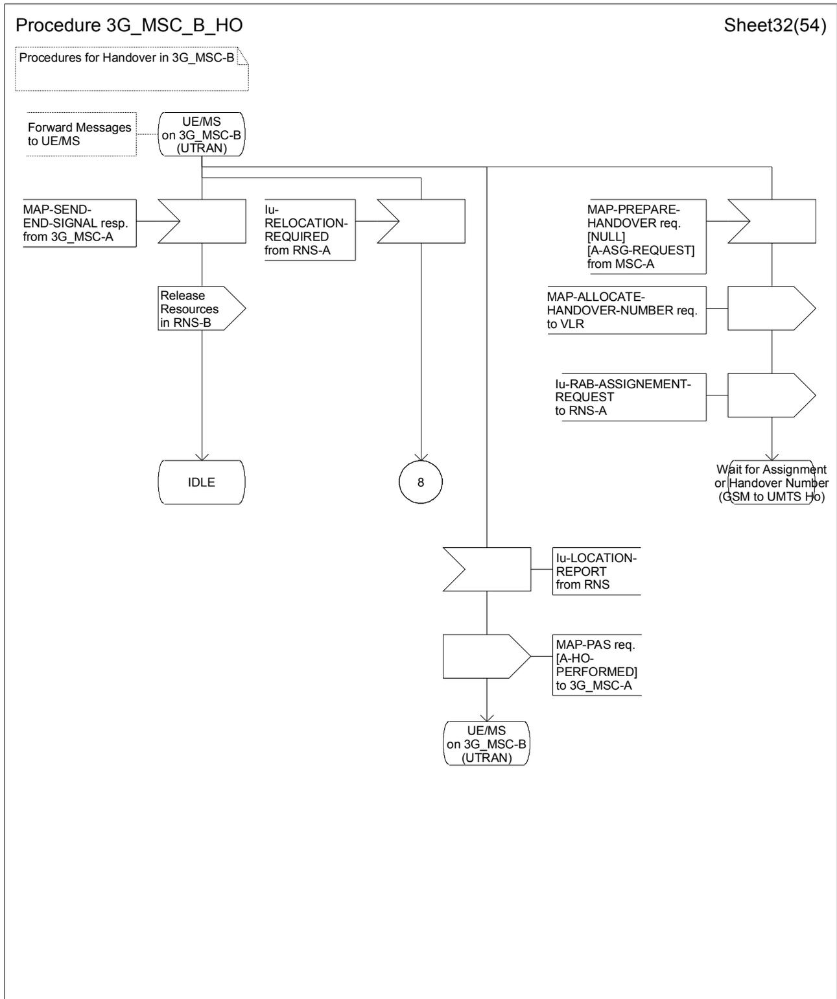

### Procedure 3G\_MSC\_B\_HO

Sheet32(54)

Procedures for Handover in 3G\_MSC-B

```
sequenceDiagram
    participant UE/MS on 3G_MSC-B (UTRAN)
    participant RNS-A
    participant RNS-B
    participant VLR
    participant MSC-A

    Note left of UE/MS: Forward Messages to UE/MS
    UE/MS->>RNS-A: MAP-SEND-END-SIGNAL resp. from 3G_MSC-A
    RNS-A->>RNS-B: Iu-RELOCATION-REQUIRED from RNS-A
    RNS-B->>VLR: Release Resources in RNS-B
    RNS-B->>UE/MS: IDLE
    RNS-A->>MSC-A: MAP-PREPARE-HANDOVER req. [NULL] [A-ASG-REQUEST] from MSC-A
    MSC-A->>VLR: MAP-ALLOCATE-HANDOVER-NUMBER req. to VLR
    VLR->>RNS-A: Iu-RAB-ASSIGNMENT-REQUEST to RNS-A
    RNS-A->>UE/MS: Wait for Assignment or Handover Number (GSM to UMTS Ho)
    RNS-A->>MSC-A: Iu-LOCATION-REPORT from RNS
    MSC-A->>VLR: MAP-PAS req. [A-HO-PERFORMED] to 3G_MSC-A
    VLR->>UE/MS: UE/MS on 3G_MSC-B (UTRAN)
    Note right of RNS-A: 8
```

The diagram illustrates the handover control procedure in 3G\_MSC-B. It begins with the UE/MS on 3G\_MSC-B (UTRAN) sending a MAP-SEND-END-SIGNAL response from 3G\_MSC-A to RNS-A. RNS-A then sends an Iu-RELOCATION-REQUIRED message to RNS-B. RNS-B releases resources and returns the UE/MS to an IDLE state. Simultaneously, RNS-A sends a MAP-PREPARE-HANDOVER request (NULL) [A-ASG-REQUEST] to MSC-A. MSC-A responds with a MAP-ALLOCATE-HANDOVER-NUMBER request to the VLR. The VLR sends an Iu-RAB-ASSIGNMENT-REQUEST to RNS-A, which then waits for an assignment or handover number (GSM to UMTS Ho) from the UE/MS. RNS-A also sends an Iu-LOCATION-REPORT to MSC-A. MSC-A sends a MAP-PAS request (A-HO-PERFORMED) to the VLR, which finally returns the UE/MS on 3G\_MSC-B (UTRAN). A connector '8' is shown below RNS-A.

Sequence diagram for Procedure 3G\_MSC\_B\_HO showing handover control steps between UE/MS, RNS-A, RNS-B, VLR, and MSC-A.

Figure 44 (sheet 32 of 54): Handover control procedure in 3G\_MSC-B

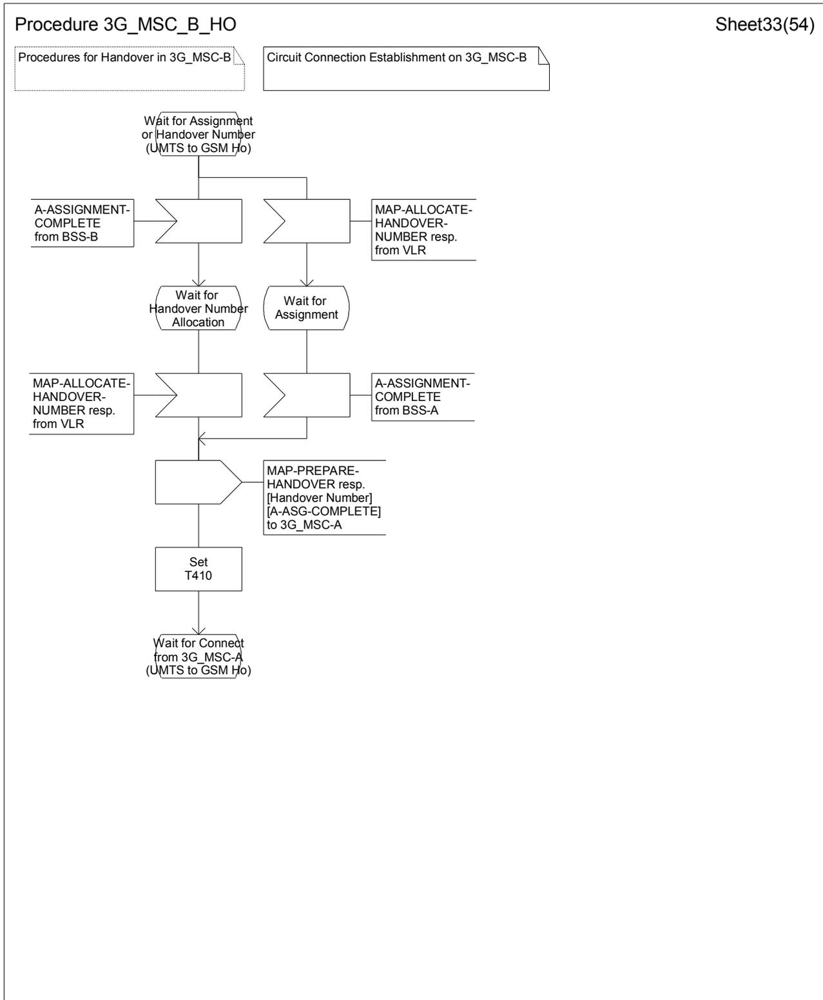

**Procedure 3G\_MSC\_B\_HO** Sheet33(54)

Procedures for Handover in 3G\_MSC-B      Circuit Connection Establishment on 3G\_MSC-B

```
graph TD; Start1[Wait for Assignment or Handover Number (UMTS to GSM Ho)] --> Join1(( )); Start2[Wait for Assignment] --> Join1; Join1 --> A_ASSIGN_COMPLETE_B[A-ASSIGNMENT-COMPLETE from BSS-B]; A_ASSIGN_COMPLETE_B --> Wait_HN[Wait for Handover Number Allocation]; Wait_HN --> MAP_ALLOCATE_HN[MAP-ALLOCATE-HANDOVER-NUMBER resp. from VLR]; MAP_ALLOCATE_HN --> Join2(( )); Join2 --> MAP_PREPARE[MAP-PREPARE-HANDOVER resp. [Handover Number] [A-ASG-COMPLETE] to 3G_MSC-A]; MAP_PREPARE --> Set_T410[Set T410]; Set_T410 --> Wait_Connect[Wait for Connect from 3G_MSC-A (UMTS to GSM Ho)]; Start2 --> Join3(( )); Join3 --> A_ASSIGN_COMPLETE_A[A-ASSIGNMENT-COMPLETE from BSS-A]; A_ASSIGN_COMPLETE_A --> Join2;
```

The flowchart illustrates the handover control procedure in 3G\_MSC-B. It begins with two parallel wait states: 'Wait for Assignment or Handover Number (UMTS to GSM Ho)' and 'Wait for Assignment'. These lead to a junction point. From this junction, one path leads to 'A-ASSIGNMENT-COMPLETE from BSS-B', which then leads to 'Wait for Handover Number Allocation'. The other path from the junction leads to 'MAP-ALLOCATE-HANDOVER-NUMBER resp. from VLR', which leads to 'Wait for Assignment'. From 'Wait for Assignment', the path leads to 'A-ASSIGNMENT-COMPLETE from BSS-A', which then leads to another junction point. From this second junction, one path leads to 'MAP-ALLOCATE-HANDOVER-NUMBER resp. from VLR', which leads to a third junction point. The other path from this junction leads to 'MAP-PREPARE-HANDOVER resp. [Handover Number] [A-ASG-COMPLETE] to 3G\_MSC-A', which leads to 'Set T410'. From 'Set T410', the path leads to 'Wait for Connect from 3G\_MSC-A (UMTS to GSM Ho)'.

Flowchart of handover control procedure in 3G\_MSC-B

Figure 44 (sheet 33 of 54): Handover control procedure in 3G\_MSC-B


### Procedure 3G\_MSC\_B\_HO

Sheet34(54)

Procedures for Handover in 3G\_MSC-B

```
sequenceDiagram
    participant BSS-A
    participant BSS-B
    participant 3G_MSC-A
    participant 3G_MSC-B
    participant UE/MS

    Note right of BSS-A: Wait for Assignment (UMTS to GSM Ho)
    Note right of BSS-A: Wait for Assignment or Handover Number Allocation (UMTS to GSM Ho)
    Note right of BSS-B: Wait for Handover Number Allocation (UMTS to GSM Ho)
    Note right of BSS-B: Wait for Assignment (UMTS to GSM Ho)
    Note right of BSS-B: Wait for Assignment or Handover Number Allocation (UMTS to GSM Ho)

    BSS-A->>BSS-A: A-ASSIGNMENT-FAILURE from BSS-A
    BSS-A->>3G_MSC-A: MAP-PREPARE-HANDOVER resp. [A-ASG-FAILURE] to 3G_MSC-A
    BSS-A->>3G_MSC-A: MAP-PREPARE-HANDOVER resp. [MAP ERROR] to 3G_MSC-A
    BSS-B->>3G_MSC-A: MAP-SEND-END-SIGNAL resp. from 3G_MSC-A
    BSS-B->>3G_MSC-A: A-CLEAR-REQUEST from BSS-B
    BSS-B->>3G_MSC-A: MAP-PAS req. [A-CLEAR-REQUEST] to 3G_MSC-A
    3G_MSC-A->>3G_MSC-A: to 3G_MSC-A and VLR-B
    3G_MSC-A->>3G_MSC-A: Cancel MAP Procedures
    3G_MSC-A->>3G_MSC-A: to VLR-B
    3G_MSC-A->>3G_MSC-A: Cancel MAP Procedures
    3G_MSC-A->>BSS-B: Release Resources in BSS-B
    BSS-B->>UE/MS: UE/MS on 3G_MSC-B (GSM)
    BSS-B->>BSS-B: IDLE
```

Sequence diagram for Procedure 3G\_MSC\_B\_HO showing handover control between BSS-A, BSS-B, 3G\_MSC-A, and 3G\_MSC-B. The diagram includes lifelines for BSS-A, BSS-B, 3G\_MSC-A, 3G\_MSC-B, and UE/MS. It details the message exchanges for assignment and handover number allocation, including responses like A-ASSIGNMENT-FAILURE, MAP-PREPARE-HANDOVER, and final actions like resource release and cancellation of MAP procedures.

Figure 44 (sheet 34 of 54): Handover control procedure in 3G\_MSC-B

![Flowchart of Procedure 3G_MSC_B_HO for handover control. The process starts with 'Wait for Connect from 3G_MSC-A (UMTS to GSM Ho)'. It branches into three main paths: 1) Receiving 'I_CONNECT (IAM) from 3G_MSC-A (Uses Handover No.)' leads to 'Reset T410', then 'MAP-SEND-HANDOVER-REPORT resp. to VLR-B', then 'I_COMPLETE (ACM) to 3G_MSC-A', ending at 'Call on 3G_MSC-B (GSM)'. 2) 'Expiry T410' leads to 'Cancel MAP Procedures', which then leads to 'Release Radio Resources on BSS-B', ending at 'IDLE'. 3) Receiving 'A-CLEAR-REQUEST from BSS-A' leads to 'MAP-PAS req. [A-CLEAR_REQUEST] to 3G_MSC-A', then 'Cancel MAP Procedures' (with a note 'to 3G_MSC-A in 3G_MSC-B'), which also leads to 'Release Radio Resources on BSS-B'.](c94fdc8aee435b1f4ed6917e28b1db5c_img.jpg)

### Procedure 3G\_MSC\_B\_HO

Sheet35(54)

Procedures for Handover in 3G\_MSC-B

```
graph TD; Start[Wait for Connect from 3G_MSC-A (UMTS to GSM Ho)] --> I_CONNECT[I_CONNECT (IAM) from 3G_MSC-A (Uses Handover No.)]; Start --> Expiry[Expiry T410]; Start --> A_CLEAR[A-CLEAR-REQUEST from BSS-A]; I_CONNECT --> Reset[Reset T410]; Reset --> MAP_SEND[MAP-SEND-HANDOVER-REPORT resp. to VLR-B]; MAP_SEND --> I_COMPLETE[I_COMPLETE (ACM) to 3G_MSC-A]; I_COMPLETE --> Call[Call on 3G_MSC-B (GSM)]; Expiry --> Cancel1[Cancel MAP Procedures]; Cancel1 --> Release[Release Radio Resources on BSS-B]; Release --> IDLE[IDLE]; A_CLEAR --> MAP_PAS[MAP-PAS req. [A-CLEAR_REQUEST] to 3G_MSC-A]; MAP_PAS --> Cancel2[Cancel MAP Procedures]; Cancel2 -.-> Note1[to 3G_MSC-A in 3G_MSC-B]; Cancel2 --> Release;
```

Flowchart of Procedure 3G\_MSC\_B\_HO for handover control. The process starts with 'Wait for Connect from 3G\_MSC-A (UMTS to GSM Ho)'. It branches into three main paths: 1) Receiving 'I\_CONNECT (IAM) from 3G\_MSC-A (Uses Handover No.)' leads to 'Reset T410', then 'MAP-SEND-HANDOVER-REPORT resp. to VLR-B', then 'I\_COMPLETE (ACM) to 3G\_MSC-A', ending at 'Call on 3G\_MSC-B (GSM)'. 2) 'Expiry T410' leads to 'Cancel MAP Procedures', which then leads to 'Release Radio Resources on BSS-B', ending at 'IDLE'. 3) Receiving 'A-CLEAR-REQUEST from BSS-A' leads to 'MAP-PAS req. [A-CLEAR\_REQUEST] to 3G\_MSC-A', then 'Cancel MAP Procedures' (with a note 'to 3G\_MSC-A in 3G\_MSC-B'), which also leads to 'Release Radio Resources on BSS-B'.

Figure 44 (sheet 35 of 54): Handover control procedure in 3G\_MSC-B

![Flowchart of Procedure 3G_MSC_B_HO. It starts with 'Wait for Connect from 3G_MSC-A (UMTS to GSM Ho)'. From here, it branches into three paths: 1) 'I_DISCONNECT (REL) from 3G_MSC-A' leads to a junction box, which then leads to 'UE/MS on 3G_MSC-B (GSM)'. 2) 'MAP-SEND-END-SIGNAL resp. from 3G_MSC-A' leads to another junction box, which leads to 'Release Resources on BSS-B' (parallelogram), which then leads to 'IDLE' (oval). 3) 'from 3G_MSC-A' (dashed box) leads to 'Cancel MAP Procedure' (rectangle), which leads to 'Release Resources on BSS-B' (parallelogram), which then leads to 'IDLE' (oval).](b543946164dcd60756be812898e547e0_img.jpg)

### Procedure 3G\_MSC\_B\_HO

Sheet36(54)

Procedures for Handover in 3G\_MSC-B

```
graph TD; Start[Wait for Connect from 3G_MSC-A (UMTS to GSM Ho)] --> J1(( )); J1 --> I_DISCONNECT[I_DISCONNECT (REL) from 3G_MSC-A]; I_DISCONNECT --> J2(( )); J2 --> UE[UE/MS on 3G_MSC-B (GSM)]; J1 --> MAP_SEND[MAP-SEND-END-SIGNAL resp. from 3G_MSC-A]; MAP_SEND --> J3(( )); J3 --> RES1[/Release Resources on BSS-B/]; RES1 --> IDLE1([IDLE]); J1 --> FROM_3G_MSC_A[from 3G_MSC-A]; FROM_3G_MSC_A --> CANCEL[Cancel MAP Procedure]; CANCEL --> RES2[/Release Resources on BSS-B/]; RES2 --> IDLE2([IDLE]);
```

Flowchart of Procedure 3G\_MSC\_B\_HO. It starts with 'Wait for Connect from 3G\_MSC-A (UMTS to GSM Ho)'. From here, it branches into three paths: 1) 'I\_DISCONNECT (REL) from 3G\_MSC-A' leads to a junction box, which then leads to 'UE/MS on 3G\_MSC-B (GSM)'. 2) 'MAP-SEND-END-SIGNAL resp. from 3G\_MSC-A' leads to another junction box, which leads to 'Release Resources on BSS-B' (parallelogram), which then leads to 'IDLE' (oval). 3) 'from 3G\_MSC-A' (dashed box) leads to 'Cancel MAP Procedure' (rectangle), which leads to 'Release Resources on BSS-B' (parallelogram), which then leads to 'IDLE' (oval).

Figure 44 (sheet 36 of 54): Handover control procedure in 3G\_MSC-B

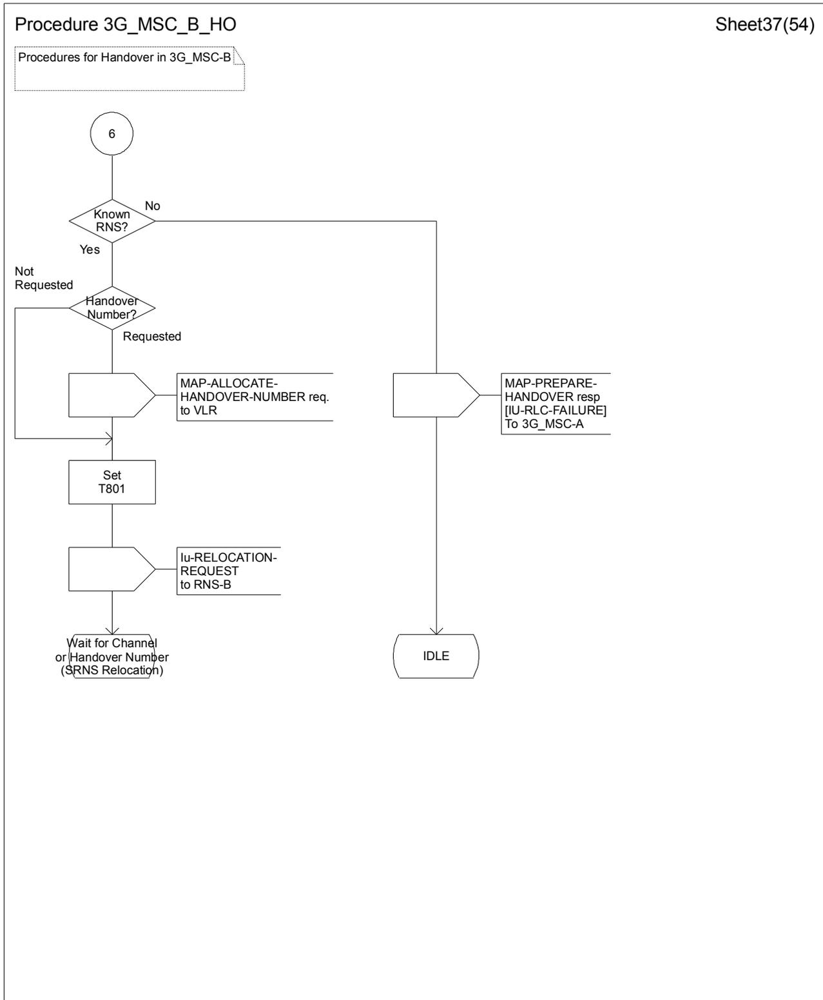

### Procedure 3G\_MSC\_B\_HO

Sheet37(54)

Procedures for Handover in 3G\_MSC-B

```

graph TD
    Start((6)) --> KnownRNS{Known  
RNS?}
    KnownRNS -- No --> MAP_PREPARE[/MAP-PREPARE-  
HANDOVER resp  
[IU-RLC-FAILURE]  
To 3G_MSC-A/]
    MAP_PREPARE --> IDLE([IDLE])
    
    KnownRNS -- Yes --> HandoverNumber{Handover  
Number?}
    HandoverNumber -- Requested --> MAP_ALLOCATE[/MAP-ALLOCATE-  
HANDOVER-NUMBER req.  
to VLR/]
    HandoverNumber -- Not Requested --> SetT801
    MAP_ALLOCATE --> SetT801[Set  
T801]
    SetT801 --> Iu_RELOCATION[/Iu-RELOCATION-  
REQUEST  
to RNS-B/]
    Iu_RELOCATION --> Wait([Wait for Channel  
or Handover Number  
(SRNS Relocation)])
    
```

The flowchart illustrates the handover control procedure in 3G\_MSC-B. It begins at connector 6 and proceeds to a decision 'Known RNS?'. If 'No', it sends a 'MAP-PREPARE-HANDOVER resp [IU-RLC-FAILURE] To 3G\_MSC-A' and ends at 'IDLE'. If 'Yes', it proceeds to 'Handover Number?'. If 'Not Requested', it proceeds directly to 'Set T801'. If 'Requested', it first sends a 'MAP-ALLOCATE-HANDOVER-NUMBER req. to VLR' before reaching 'Set T801'. After setting 'T801', it sends an 'Iu-RELOCATION-REQUEST to RNS-B' and enters a 'Wait for Channel or Handover Number (SRNS Relocation)' state.

Flowchart of Procedure 3G\_MSC\_B\_HO

**Figure 44 (sheet 37 of 54): Handover control procedure in 3G\_MSC-B**

![Flowchart of Handover control procedure in 3G_MSC-B. The process starts with 'Wait for Channel or Handover Number (SRNS Relocation)'. It branches into two main paths. The left path involves receiving 'Iu-RELOCATION-REQUEST-ACK from RNS-B', 'Reset T801', and a decision 'Handover Number?'. If 'Not Requested', it sends 'MAP-PREPARE-HANDOVER resp. [IU-RLC-REQUEST-ACK] to 3G_MSC-A', 'Set T804', and ends with 'Wait for UE on RNS-B (SRNS Relocation)'. If 'Requested', it goes to 'Wait for Handover Number Allocation', receives 'MAP-ALLOCATE-HANDOVER NUMBER resp. from VLR', sends 'MAP-PREPARE-HANDOVER resp. [IU-RLC-REQUEST-ACK] [Handover Number] to 3G_MSC-A', 'Set T810', and ends with 'Wait for Connection from 3G_MSC-A (SRNS Relocation)'. The right path involves receiving 'MAP-ALLOCATE-HANDOVER NUMBER resp. from VLR', 'Wait for Channel Allocation (SRNS Relocation)', receiving 'Iu-RELOCATION-REQUEST-ACK from RNS-B', 'Reset T801', and then sending 'MAP-PREPARE-HANDOVER resp. [IU-RLC-REQUEST-ACK] [Handover Number] to 3G_MSC-A'.](bf9abec3605f1a8d00ae6524a9af02ed_img.jpg)

**Procedure 3G\_MSC\_B\_HO**

Sheet38(54)

Procedures for Handover in 3G\_MSC-B

```

    graph TD
        Start[Wait for Channel or Handover Number  
(SRNS Relocation)] --> Branch1{ }
        
        %% Left Branch
        Branch1 --> In1[Iu-RELOCATION-REQUEST-ACK  
from RNS-B]
        In1 --> Reset1[Reset T801]
        Reset1 --> Decision{Handover  
Number?}
        
        Decision -- Not Requested --> Out1[MAP-PREPARE-HANDOVER resp.  
[IU-RLC-REQUEST-ACK]  
to 3G_MSC-A]
        Out1 --> Set1[Set T804]
        Set1 --> End1[Wait for UE on RNS-B  
(SRNS Relocation)]
        
        Decision -- Requested --> Wait1[Wait for Handover Number Allocation]
        Wait1 --> In2[MAP-ALLOCATE-HANDOVER-NUMBER resp.  
from VLR]
        In2 --> Out2[MAP-PREPARE-HANDOVER resp.  
[IU-RLC-REQUEST-ACK]  
[Handover Number]  
to 3G_MSC-A]
        Out2 --> Set2[Set T810]
        Set2 --> End2[Wait for Connection from 3G_MSC-A  
(SRNS Relocation)]
        
        %% Right Branch
        Branch1 --> In3[MAP-ALLOCATE-HANDOVER-NUMBER resp.  
from VLR]
        In3 --> Wait2[Wait for Channel Allocation  
(SRNS Relocation)]
        Wait2 --> In4[Iu-RELOCATION-REQUEST-ACK  
from RNS-B]
        In4 --> Reset2[Reset T801]
        Reset2 --> Out2
    
```

Flowchart of Handover control procedure in 3G\_MSC-B. The process starts with 'Wait for Channel or Handover Number (SRNS Relocation)'. It branches into two main paths. The left path involves receiving 'Iu-RELOCATION-REQUEST-ACK from RNS-B', 'Reset T801', and a decision 'Handover Number?'. If 'Not Requested', it sends 'MAP-PREPARE-HANDOVER resp. [IU-RLC-REQUEST-ACK] to 3G\_MSC-A', 'Set T804', and ends with 'Wait for UE on RNS-B (SRNS Relocation)'. If 'Requested', it goes to 'Wait for Handover Number Allocation', receives 'MAP-ALLOCATE-HANDOVER NUMBER resp. from VLR', sends 'MAP-PREPARE-HANDOVER resp. [IU-RLC-REQUEST-ACK] [Handover Number] to 3G\_MSC-A', 'Set T810', and ends with 'Wait for Connection from 3G\_MSC-A (SRNS Relocation)'. The right path involves receiving 'MAP-ALLOCATE-HANDOVER NUMBER resp. from VLR', 'Wait for Channel Allocation (SRNS Relocation)', receiving 'Iu-RELOCATION-REQUEST-ACK from RNS-B', 'Reset T801', and then sending 'MAP-PREPARE-HANDOVER resp. [IU-RLC-REQUEST-ACK] [Handover Number] to 3G\_MSC-A'.

Figure 44 (sheet 38 of 54): Handover control procedure in 3G\_MSC-B

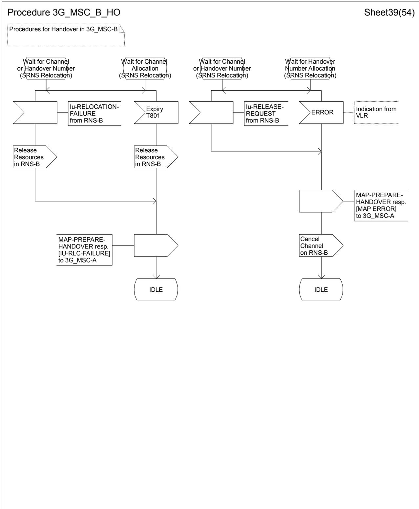

### Procedure 3G\_MSC\_B\_HO

Sheet39(54)

Procedures for Handover in 3G\_MSC-B

```
graph TD; subgraph LeftPath [ ]; W1[Wait for Channel or Handover Number (SRNS Relocation)]; W2[Wait for Channel Allocation (SRNS Relocation)]; E1{ }; F1[IU-RELOCATION-FAILURE from RNS-B]; T1[Expiry T801]; R1[Release Resources in RNS-B]; R2[Release Resources in RNS-B]; M1[MAP-PREPARE-HANDOVER resp. [IU-RLC-FAILURE] to 3G_MSC-A]; ID1([IDLE]); W1 --> E1; W2 --> E1; E1 -- F1 --> E1; E1 --> R1; R1 --> M1; M1 --> E1; E1 --> R2; R2 --> ID1; end; subgraph RightPath [ ]; W3[Wait for Channel or Handover Number (SRNS Relocation)]; W4[Wait for Handover Number Allocation (SRNS Relocation)]; E2{ }; F2[IU-RELEASE-REQUEST from RNS-B]; ER1[ERROR]; I1[Indication from VLR]; M2[MAP-PREPARE-HANDOVER resp. [MAP ERROR] to 3G_MSC-A]; C1[Cancel Channel on RNS-B]; ID2([IDLE]); W3 --> E2; W4 --> E2; E2 -- F2 --> E2; E2 --> ER1; ER1 -- I1 --> ER1; ER1 --> M2; M2 --> ER1; ER1 --> C1; C1 --> ID2; end;
```

The flowchart illustrates the handover control procedure in 3G\_MSC-B. It consists of two main parallel paths. The left path starts with two wait conditions: 'Wait for Channel or Handover Number (SRNS Relocation)' and 'Wait for Channel Allocation (SRNS Relocation)'. These lead to a decision point. If 'IU-RELOCATION-FAILURE from RNS-B' is received, the process loops back to the first wait condition. If the timer 'Expiry T801' expires, resources are released in RNS-B. Then, a 'MAP-PREPARE-HANDOVER resp. [IU-RLC-FAILURE] to 3G\_MSC-A' is sent, and the process loops back to the first decision point. If successful, resources are released in RNS-B again, and the process reaches an 'IDLE' state. The right path starts with 'Wait for Channel or Handover Number (SRNS Relocation)' and 'Wait for Handover Number Allocation (SRNS Relocation)'. These lead to a decision point. If 'IU-RELEASE-REQUEST from RNS-B' is received, the process loops back to the first wait condition. If an 'ERROR' is received, an 'Indication from VLR' is sent. Then, a 'MAP-PREPARE-HANDOVER resp. [MAP ERROR] to 3G\_MSC-A' is sent, and the process loops back to the error handling. Finally, the channel is cancelled on RNS-B, and the process reaches an 'IDLE' state.

Flowchart of Procedure 3G\_MSC\_B\_HO showing two parallel paths for handover control. The left path handles a successful handover preparation, while the right path handles an error scenario. Both paths lead to an IDLE state.

Figure 44 (sheet 39 of 54): Handover control procedure in 3G\_MSC-B

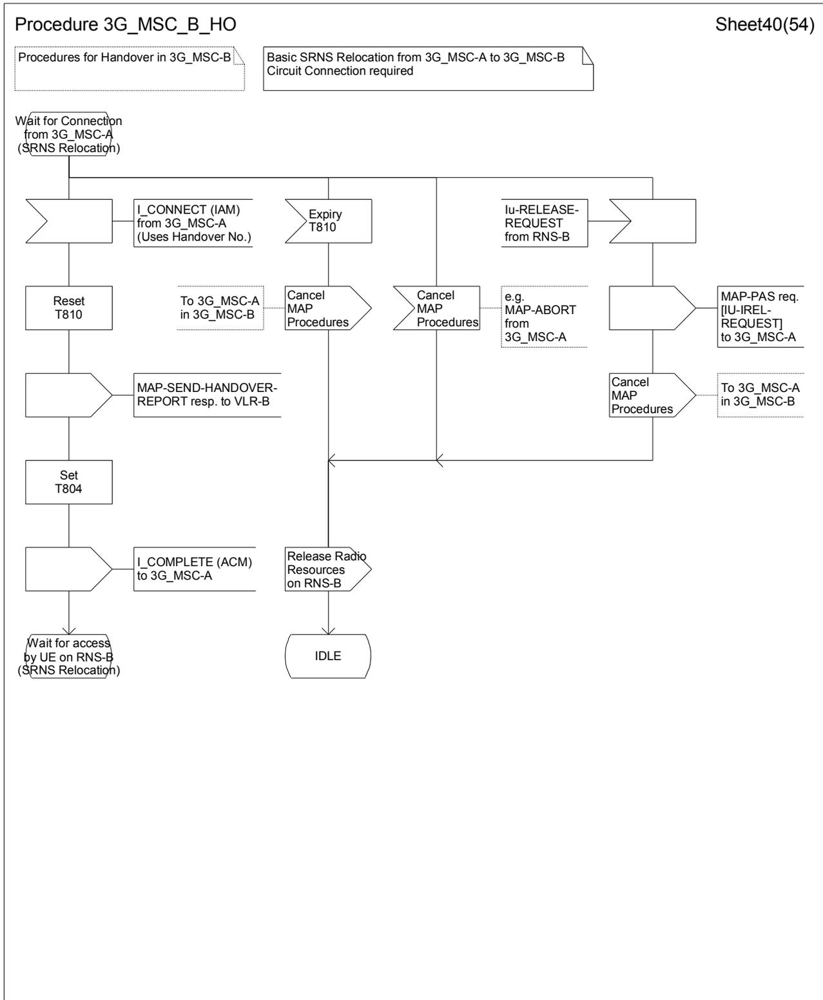

### Procedure 3G\_MSC\_B\_HO

Sheet40(54)

Procedures for Handover in 3G\_MSC-BBasic SRNS Relocation from 3G\_MSC-A to 3G\_MSC-B  
Circuit Connection required

```
graph TD; Start[Wait for Connection from 3G_MSC-A (SRNS Relocation)] --> I_CONNECT[I_CONNECT (IAM) from 3G_MSC-A (Uses Handover No.)]; I_CONNECT --> ResetT810[Reset T810]; ResetT810 --> MAP_SEND[MAP-SEND-HANDOVER-REPORT resp. to VLR-B]; MAP_SEND --> SetT804[Set T804]; SetT804 --> I_COMPLETE[I_COMPLETE (ACM) to 3G_MSC-A]; I_COMPLETE --> End1[Wait for access by UE on RNS-B (SRNS Relocation)]; I_CONNECT --> ExpiryT810[Expiry T810]; ExpiryT810 --> CancelMap1[Cancel MAP Procedures]; CancelMap1 --> To3G_MSCA1[To 3G_MSC-A in 3G_MSC-B]; I_RELEASE[lu-RELEASE-REQUEST from RNS-B] --> CancelMap2[Cancel MAP Procedures]; CancelMap2 --> e.g.[e.g. MAP-ABORT from 3G_MSC-A]; CancelMap2 --> MAP_PAS[MAP-PAS req. [[IU-IREL-REQUEST] to 3G_MSC-A]; MAP_PAS --> CancelMap3[Cancel MAP Procedures]; CancelMap3 --> To3G_MSCA2[To 3G_MSC-A in 3G_MSC-B]; CancelMap1 --> ReleaseRadio[Release Radio Resources on RNS-B]; ReleaseRadio --> IDLE[IDLE]; CancelMap2 --> IDLE; CancelMap3 --> IDLE;
```

The flowchart illustrates the handover control procedure in 3G\_MSC-B. It begins with a 'Wait for Connection from 3G\_MSC-A (SRNS Relocation)' state. Upon receiving an 'I\_CONNECT (IAM) from 3G\_MSC-A (Uses Handover No.)', the MSC-B resets timer T810, sends a 'MAP-SEND-HANDOVER-REPORT resp. to VLR-B', and sets timer T804. It then sends an 'I\_COMPLETE (ACM) to 3G\_MSC-A' and enters a 'Wait for access by UE on RNS-B (SRNS Relocation)' state. If timer T810 expires, 'Cancel MAP Procedures' are initiated, sending a message 'To 3G\_MSC-A in 3G\_MSC-B', and radio resources are released on RNS-B, leading to an 'IDLE' state. If an 'lu-RELEASE-REQUEST from RNS-B' is received, 'Cancel MAP Procedures' are initiated again, potentially sending a 'MAP-PAS req. [[IU-IREL-REQUEST] to 3G\_MSC-A' (e.g., if a 'MAP-ABORT from 3G\_MSC-A' is received) and another message 'To 3G\_MSC-A in 3G\_MSC-B', eventually leading to an 'IDLE' state.

Flowchart of Procedure 3G\_MSC\_B\_HO showing the sequence of messages and actions for a handover from 3G\_MSC-A to 3G\_MSC-B.

Figure 44 (sheet 40 of 54): Handover control procedure in 3G\_MSC-B


**Procedure 3G\_MSC\_B\_HO** Sheet41(54)

Procedures for Handover in 3G\_MSC-B

```

sequenceDiagram
    participant RNS-B
    participant 3G_MSC-A
    participant 3G_MSC-B

    Note left of RNS-B: Wait for access by UE on RNS-B (SRNS Relocation)
    RNS-B->>3G_MSC-A: IU-RELOCATION-COMPLETE from RNS-B
    RNS-B->>3G_MSC-A: IU-RELEASE-REQUEST from RNS-B
    Note right of 3G_MSC-A: Expiry T804
    Note right of 3G_MSC-A: from 3G_MSC-A
    Note right of 3G_MSC-A: Cancel MAP Procedure
    Note right of 3G_MSC-A: Reset T804
    Note right of 3G_MSC-A: Release Resources on RNS-B
    Note right of 3G_MSC-A: Wait for Disconnect (SRNS Relocation)
    3G_MSC-A->>RNS-B: MAP-PAS req [IU_I-REL-REQUEST] to 3G_MSC-A
    3G_MSC-A->>RNS-B: I_DISCONNECT (REL) to 3G_MSC-A
    Note left of 3G_MSC-A: Reset T804
    Note left of 3G_MSC-A: ANM Sent?
    Note left of 3G_MSC-A: I_ANSWER (ANM) to 3G_MSC-A
    Note left of 3G_MSC-A: to 3G_MSC-A in 3G_MSC-B
    Note left of 3G_MSC-A: Cancel MAP Procedures
    Note left of 3G_MSC-A: Release Resources on RNS-B
    Note left of 3G_MSC-A: IDLE
    Note left of 3G_MSC-A: Call in Progress on 3G_MSC-B (UTRAN)
    RNS-B->>3G_MSC-A: I_DISCONNECT (REL) from 3G_MSC-A
    RNS-B->>3G_MSC-A: IU-RELOCATION-DETECT from RNS-B
    RNS-B->>3G_MSC-A: I_ANSWER (ANM) to 3G_MSC-A
    RNS-B->>3G_MSC-A: MAP-PAS req [IU_RLC-DETECT] to 3G_MSC-A
    Note right of RNS-B: Wait for access by UE on RNS-B (SRNS Relocation)
  
```

Sequence diagram for Procedure 3G\_MSC\_B\_HO showing handover control between RNS-B, 3G\_MSC-A, and 3G\_MSC-B. The diagram includes lifelines for RNS-B, 3G\_MSC-A, and 3G\_MSC-B. It details message exchanges such as IU-RELOCATION-COMPLETE, IU-RELEASE-REQUEST, MAP-PAS req, I\_DISCONNECT, ANM, I\_ANSWER, MAP-SEND-END-SIGNAL, and various timers and state transitions like 'Reset T804', 'Cancel MAP Procedure', and 'Release Resources on RNS-B'.

Figure 44 (sheet 41 of 54): Handover control procedure in 3G\_MSC-B

![Sequence diagram for Handover control procedure in 3G_MSC-B. The diagram shows the interaction between a UE, 3G_MSC-B (UTRAN), 3G_MSC-A, and RNS-A. It starts with a call in progress on 3G_MSC-B (UTRAN). The UE receives forwarded messages. 3G_MSC-A sends a MAP-SEND-END-SIGNAL response. RNS-A sends an Iu-RELEASE-REQUEST. 3G_MSC-B (UTRAN) sends a MAP-PAS request (IU-IREL-REQUEST) to 3G_MSC-A and cancels MAP procedures. 3G_MSC-A sends an I_DISCONNECT (REL) to 3G_MSC-B (UTRAN). RNS-A releases resources. A decision is made: if 3G_MSC-A is disconnected, the UE waits for disconnect and then receives I_DISCONNECT (REL) from 3G_MSC-A, ending in IDLE; otherwise, 3G_MSC-B (UTRAN) cancels MAP procedures from 3G_MSC-A, RNS-A releases resources, sends Iu-RELOCATION-REQUIRED, receives I_DISCONNECT (REL) from 3G_MSC-A, and ends in IDLE. A connector '12' is also shown.](d1203e87a330a98abf08c99d65e5a24b_img.jpg)

**Procedure 3G\_MSC\_B\_HO** Sheet42(54)

*Procedures for Handover in 3G\_MSC-B*

```
sequenceDiagram
    participant UE
    participant 3G_MSC_B_UTRAN as 3G_MSC-B (UTRAN)
    participant 3G_MSC_A as 3G_MSC-A
    participant RNS_A as RNS-A

    Note left of 3G_MSC_B_UTRAN: Call in Progress on 3G_MSC-B (UTRAN)
    Note right of 3G_MSC_B_UTRAN: Forward Messages to UE

    3G_MSC_A->>3G_MSC_B_UTRAN: MAP-SEND-END-SIGNAL resp. from 3G_MSC-A
    RNS_A->>3G_MSC_B_UTRAN: Iu-RELEASE-REQUEST from RNS-A
    3G_MSC_B_UTRAN->>3G_MSC_A: MAP-PAS req. [IU-IREL-REQUEST] to 3G_MSC-A
    Note right of 3G_MSC_B_UTRAN: Cancel MAP Procedures

    3G_MSC_A->>3G_MSC_B_UTRAN: I_DISCONNECT (REL) from 3G_MSC-A
    Note right of 3G_MSC_B_UTRAN: Release Resources in RNS-A

    Note right of 3G_MSC_B_UTRAN: 3G_MSC-A disconnected?
    alt Yes: IDLE
    alt No: Wait for Disconnect
        Note right of 3G_MSC_B_UTRAN: I_DISCONNECT (REL) from 3G_MSC-A
        Note right of 3G_MSC_B_UTRAN: IDLE
    end

    Note right of 3G_MSC_B_UTRAN: Cancel MAP Procedures from 3G_MSC-A
    Note right of 3G_MSC_B_UTRAN: Release Resources in RNS-A
    Note right of 3G_MSC_B_UTRAN: Iu-RELOCATION-REQUIRED from RNS-A
    Note right of 3G_MSC_B_UTRAN: I_DISCONNECT (REL) to 3G_MSC-A
    Note right of 3G_MSC_B_UTRAN: IDLE

    Note right of 3G_MSC_B_UTRAN: 12
```

Sequence diagram for Handover control procedure in 3G\_MSC-B. The diagram shows the interaction between a UE, 3G\_MSC-B (UTRAN), 3G\_MSC-A, and RNS-A. It starts with a call in progress on 3G\_MSC-B (UTRAN). The UE receives forwarded messages. 3G\_MSC-A sends a MAP-SEND-END-SIGNAL response. RNS-A sends an Iu-RELEASE-REQUEST. 3G\_MSC-B (UTRAN) sends a MAP-PAS request (IU-IREL-REQUEST) to 3G\_MSC-A and cancels MAP procedures. 3G\_MSC-A sends an I\_DISCONNECT (REL) to 3G\_MSC-B (UTRAN). RNS-A releases resources. A decision is made: if 3G\_MSC-A is disconnected, the UE waits for disconnect and then receives I\_DISCONNECT (REL) from 3G\_MSC-A, ending in IDLE; otherwise, 3G\_MSC-B (UTRAN) cancels MAP procedures from 3G\_MSC-A, RNS-A releases resources, sends Iu-RELOCATION-REQUIRED, receives I\_DISCONNECT (REL) from 3G\_MSC-A, and ends in IDLE. A connector '12' is also shown.

**Figure 44 (sheet 42 of 54): Handover control procedure in 3G\_MSC-B**

![Flowchart for Procedure 3G_MSC_B_HO. It starts at connector 12, checks if 3G_MSC is known. If no, it checks if RNS is known. If RNS is not known, it checks if resources on RNS-B are available. If resources are not available, it sends a reject. If resources are available, it proceeds to connector 13. If RNS is known, it checks if 3G_MSC is 3G_MSC-A/3G_MSC-B' or MSC-B. If 3G_MSC-A/3G_MSC-B', it sends a MAP-PREPARE-SUBSEQUENT-HANDOVER req. If MSC-B, it proceeds to connector 11. If 3G_MSC is known at the start, it proceeds to connector 11. After connector 11, it checks if a circuit connection exists. If no, it goes to UE on 3G_MSC-B (UTRAN). If yes, it goes to Call in Progress on 3G_MSC-B (UTRAN).](00bb8c9fd2ec7fa7da34a98f824468b6_img.jpg)

### Procedure 3G\_MSC\_B\_HO

Procedures for Handover in 3G\_MSC-B

Sheet43(54)

```
graph TD
    12((12)) --> K3G{Known 3G_MSC?}
    K3G -- Yes --> 11((11))
    K3G -- No --> KRNS{Known RNS?}
    KRNS -- No --> RNSB{Resources on RNS-B?}
    KRNS -- Yes --> RNSB
    RNSB -- No --> SR{Send Reject?}
    RNSB -- Yes --> 13((13))
    SR -- No --> CC{Circuit Connection?}
    SR -- Yes --> IPF[lu-RELOCATION-PREPARATION-FAILURE to RNS-A]
    IPF --> CC
    CC -- No --> UE[UE on 3G_MSC-B (UTRAN)]
    CC -- Yes --> CP[Call in Progress on 3G_MSC-B (UTRAN)]
    RNSB -- Yes --> S11[Set T811]
    S11 --> WR[Wait for Response (SRNS Relocation)]
    WR --> 13
    K3G -- Yes --> W3G{Which 3G_MSC?}
    W3G -- 3G_MSC-A/3G_MSC-B' --> MP[MAP-PREPARE-SUBSEQUENT-HANDOVER req. [IU-RLC-REQUEST] to 3G_MSC-A]
    MP --> S11
    W3G -- MSC-B --> 11
```

Flowchart for Procedure 3G\_MSC\_B\_HO. It starts at connector 12, checks if 3G\_MSC is known. If no, it checks if RNS is known. If RNS is not known, it checks if resources on RNS-B are available. If resources are not available, it sends a reject. If resources are available, it proceeds to connector 13. If RNS is known, it checks if 3G\_MSC is 3G\_MSC-A/3G\_MSC-B' or MSC-B. If 3G\_MSC-A/3G\_MSC-B', it sends a MAP-PREPARE-SUBSEQUENT-HANDOVER req. If MSC-B, it proceeds to connector 11. If 3G\_MSC is known at the start, it proceeds to connector 11. After connector 11, it checks if a circuit connection exists. If no, it goes to UE on 3G\_MSC-B (UTRAN). If yes, it goes to Call in Progress on 3G\_MSC-B (UTRAN).

Figure 44 (sheet 43 of 54): Handover control procedure in 3G\_MSC-B

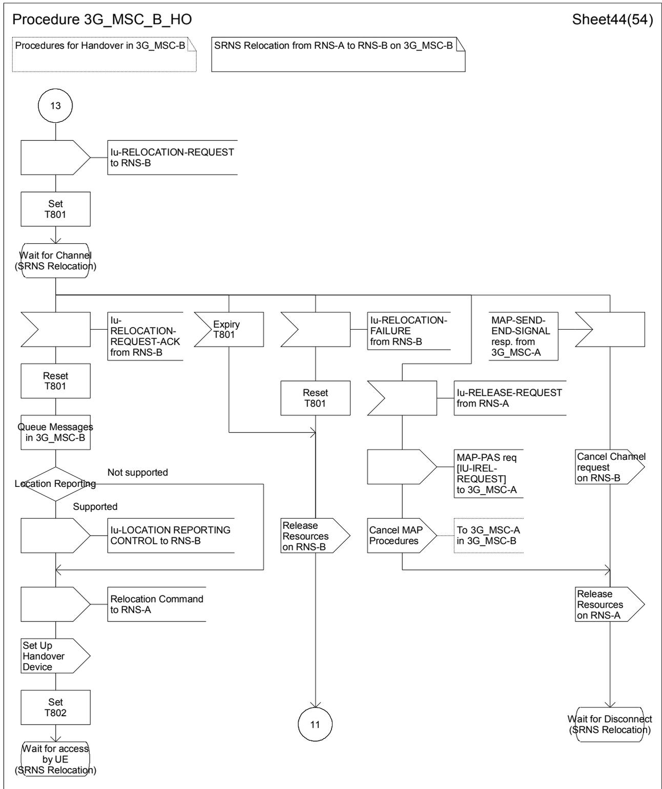

Procedure 3G\_MSC\_B\_HO
Sheet44(54)

Procedures for Handover in 3G\_MSC-B

SRNS Relocation from RNS-A to RNS-B on 3G\_MSC-B

```

graph TD
    Start((13)) --> Req[Iu-RELOCATION-REQUEST to RNS-B]
    Req --> SetT801[Set T801]
    SetT801 --> WaitChan{{Wait for Channel  
($SRNS Relocation)}}
    
    WaitChan --> Ack[Iu-RELOCATION-REQUEST-ACK from RNS-B]
    Ack --> ResetT801[Reset T801]
    ResetT801 --> Queue[Queue Messages in 3G_MSC-B]
    Queue --> LocRep{Location Reporting}
    
    LocRep -- Supported --> LocCtrl[Iu-LOCATION REPORTING CONTROL to RNS-B]
    LocCtrl --> RelCmd[Relocation Command to RNS-A]
    LocRep -- Not supported --> RelCmd
    
    RelCmd --> SetDev[Set Up Handover Device]
    SetDev --> SetT802[Set T802]
    SetT802 --> WaitUE{{Wait for access by UE  
($SRNS Relocation)}}

    WaitChan --> Expiry[Expiry T801]
    WaitChan --> Fail[Iu-RELOCATION-FAILURE from RNS-B]
    Expiry --> ResetT801_2[Reset T801]
    Fail --> ResetT801_2
    ResetT801_2 --> RelResB[Release Resources on RNS-B]
    RelResB --> End11((11))

    WaitChan --> MapEnd[MAP-SEND-END-SIGNAL resp. from 3G_MSC-A]
    WaitChan --> RelReq[Iu-RELEASE-REQUEST from RNS-A]
    MapEnd --> CancelChan[Cancel Channel request on RNS-B]
    RelReq --> PasReq[MAP-PAS req [IU-IREL-REQUEST] to 3G_MSC-A]
    PasReq --> CancelMap[Cancel MAP Procedures]
    CancelMap --> RelResA[Release Resources on RNS-A]
    CancelChan --> RelResA
    RelResA --> WaitDisc{{Wait for Disconnect  
($SRNS Relocation)}}

```

SDL diagram showing the handover control procedure in 3G\_MSC-B. It details the states, signals, and timers involved in SRNS relocation from RNS-A to RNS-B.

**Figure 44 (sheet 44 of 54): Handover control procedure in 3G\_MSC-B**

![Flowchart of the handover control procedure in 3G_MSC-B. The process starts with 'Wait for access by UE (SRNS Relocation)'. It branches into three main paths based on incoming messages: 'Iu-RELOCATION-COMPLETE from RNS-B', 'Iu-RELOCATION-DETECT from RNS-B', and 'Iu-RELOCATION CANCEL from RNS-A'. The 'COMPLETE' path involves resetting T802, checking security algorithms, sending MAP-PAS requests, and releasing resources. The 'DETECT' path involves checking circuit connections and optionally connecting the handover device. The 'CANCEL' path involves resetting T802, forwarding queued messages, releasing resources, and then checking circuit connections. All paths lead to either 'Call in Progress on 3G_MSC-B (UTRAN)', 'UE on 3G_MSC-B (UTRAN)', or back to 'Wait for access by UE (SRNS Relocation)'.](ca2740c55eeb32272b09a48cdfb7ee4d_img.jpg)

**Procedure 3G\_MSC\_B\_HO** Sheet45(54)

Procedures for Handover in 3G\_MSC-B

```

graph TD
    Start([Wait for access by UE  
(SRNS Relocation)]) --> Junction1(( ))
    Junction1 --> Iu_COMPLETE[Iu-RELOCATION-COMPLETE  
from RNS-B]
    Junction1 --> Iu_DETECT[Iu-RELOCATION-DETECT  
from RNS-B]
    Junction1 --> Iu_CANCEL[Iu-RELOCATION CANCEL  
from RNS-A]
    
    Iu_COMPLETE --> ResetT802_1[Reset T802]
    ResetT802_1 --> SecurityChanged{Have security algorithms  
been changed?}
    SecurityChanged -- No --> Junction2(( ))
    SecurityChanged -- Yes --> Protocol{Protocol  
on E-interface}
    Protocol -- BSSMAP --> MAP_PAS_1[MAP-PAS req.  
[A-HO-PERFORMED]  
to 3G_MSC-A]
    Protocol -- RANAP --> MAP_PAS_2[MAP-PAS req.  
[Iu-LOC-REPORT]  
to 3G_MSC-A]
    MAP_PAS_1 --> CircuitConn_1{Circuit  
Connection?}
    MAP_PAS_2 --> CircuitConn_1
    CircuitConn_1 -- No --> Junction2
    CircuitConn_1 -- Yes --> ConnectDevice_1[Connect Handover  
Device  
(Optional)]
    ConnectDevice_1 --> ForwardMsgs_1[Forward queued  
messages  
via RNS-B]
    ForwardMsgs_1 --> ReleaseRes_1[Release  
Resources  
in RNS-A]
    ReleaseRes_1 --> CircuitConn_2{Circuit  
Connection?}
    CircuitConn_2 -- No --> Junction2
    CircuitConn_2 -- Yes --> ReleaseDevice_1[Release  
Handover  
Device]
    ReleaseDevice_1 --> CallInProg_1([Call in Progress  
on 3G_MSC-B  
(UTRAN)])
    ReleaseDevice_1 --> UE_1([UE  
on 3G_MSC-B  
(UTRAN)])
    
    Iu_DETECT --> CircuitConn_3{Circuit  
Connection?}
    CircuitConn_3 -- No --> Junction2
    CircuitConn_3 -- Yes --> ConnectDevice_2[Connect Handover  
Device  
(Optional)]
    ConnectDevice_2 --> Junction2
    
    Iu_CANCEL --> ResetT802_2[Reset T802]
    ResetT802_2 --> ForwardMsgs_2[Forward queued  
messages  
via RNS-A]
    ForwardMsgs_2 --> ReleaseRes_2[Release  
Resources  
in RNS-B]
    ReleaseRes_2 --> CircuitConn_4{Circuit  
Connection?}
    CircuitConn_4 -- No --> Junction2
    CircuitConn_4 -- Yes --> ReleaseDevice_2[Release  
Handover  
Device]
    ReleaseDevice_2 --> CallInProg_2([Call in Progress  
on 3G_MSC-B  
(UTRAN)])
    ReleaseDevice_2 --> UE_2([UE  
on 3G_MSC-B  
(UTRAN)])
  
```

Flowchart of the handover control procedure in 3G\_MSC-B. The process starts with 'Wait for access by UE (SRNS Relocation)'. It branches into three main paths based on incoming messages: 'Iu-RELOCATION-COMPLETE from RNS-B', 'Iu-RELOCATION-DETECT from RNS-B', and 'Iu-RELOCATION CANCEL from RNS-A'. The 'COMPLETE' path involves resetting T802, checking security algorithms, sending MAP-PAS requests, and releasing resources. The 'DETECT' path involves checking circuit connections and optionally connecting the handover device. The 'CANCEL' path involves resetting T802, forwarding queued messages, releasing resources, and then checking circuit connections. All paths lead to either 'Call in Progress on 3G\_MSC-B (UTRAN)', 'UE on 3G\_MSC-B (UTRAN)', or back to 'Wait for access by UE (SRNS Relocation)'.

Figure 44 (sheet 45 of 54): Handover control procedure in 3G\_MSC-B

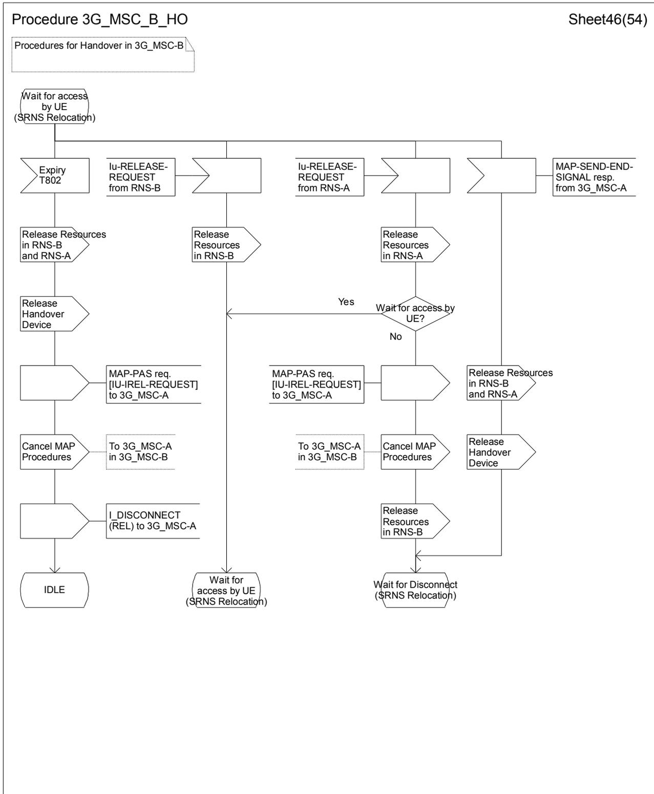

### Procedure 3G\_MSC\_B\_HO

Procedures for Handover in 3G\_MSC-B

Sheet46(54)

```

graph TD
    Start([Wait for access by UE  
(SRNS Relocation)]) --> InputLine{ }
    
    InputLine --> Expiry[Expiry  
T802]
    InputLine --> IuRelB[Iu-RELEASE-  
REQUEST  
from RNS-B]
    InputLine --> IuRelA[Iu-RELEASE-  
REQUEST  
from RNS-A]
    InputLine --> MapSendEnd[MAP-SEND-END-  
SIGNAL resp.  
from 3G_MSC-A]

    Expiry --> RelResBA[Release Resources  
in RNS-B  
and RNS-A]
    RelResBA --> RelHO[Release  
Handover  
Device]
    RelHO --> MapPas1[MAP-PAS req.  
[IU-IREL-REQUEST]  
to 3G_MSC-A]
    MapPas1 --> CancelMap1[Cancel MAP  
Procedures]
    CancelMap1 --> ToMSCA1[To 3G_MSC-A  
in 3G_MSC-B]
    ToMSCA1 --> IDisc[I_DISCONNECT  
(REL) to 3G_MSC-A]
    IDisc --> Idle([IDLE])

    IuRelB --> RelResB1[Release  
Resources  
in RNS-B]
    RelResB1 --> WaitAcc1([Wait for  
access by UE  
(SRNS Relocation)])

    IuRelA --> RelResA1[Release  
Resources  
in RNS-A]
    RelResA1 --> WaitAccDec{Wait for access by  
UE?}
    
    WaitAccDec -- Yes --> RelResB1
    WaitAccDec -- No --> MapPas2[MAP-PAS req.  
[IU-IREL-REQUEST]  
to 3G_MSC-A]
    MapPas2 --> ToMSCA2[To 3G_MSC-A  
in 3G_MSC-B]
    ToMSCA2 --> CancelMap2[Cancel MAP  
Procedures]
    CancelMap2 --> RelResB2[Release  
Resources  
in RNS-B]
    RelResB2 --> WaitDisc([Wait for Disconnect  
(SRNS Relocation)])

    MapSendEnd --> RelResBA2[Release Resources  
in RNS-B  
and RNS-A]
    RelResBA2 --> RelHO2[Release  
Handover  
Device]
    RelHO2 --> WaitAcc1
    
```

SDL Flowchart for Procedure 3G\_MSC\_B\_HO showing handover control logic in 3G\_MSC-B.

Figure 44 (sheet 46 of 54): Handover control procedure in 3G\_MSC-B

![Sequence diagram for Procedure 3G_MSC_B_HO showing interactions between 3G_MSC-A, 3G_MSC-B, RNS-A, and RNS-B. The process starts with a 'Wait for Response (SRNS Relocation)' at 3G_MSC-B. 3G_MSC-A sends a 'MAP-PREPARE-SUBSEQUENT-HANDOVER resp. [IU-RLC-REQUEST-ACK]'. 3G_MSC-B responds with 'MAP-PREPARE-SUBSEQUENT-HANDOVER resp. [IU-RLC-FAILURE or MAP ERROR]'. 3G_MSC-A then sends a 'Relocation Command to RNS-A', which triggers 'Set T804' and 'Wait for Ack. from 3G_MSC-A (SRNS Relocation)'. Simultaneously, 3G_MSC-B sends 'iu-RELEASE-REQUEST from RNS-A', 'MAP-PAS req. [IU-IREL-REQUEST] to 3G_MSC-A', and 'in 3G_MSC-B to 3G_MSC-A'. 3G_MSC-A responds with 'MAP-SEND-END-SIGNAL resp. from 3G_MSC-A'. 3G_MSC-B then triggers 'Cancel MAP Procedures' and 'Release Resources in RNS-A', leading to 'Wait for Disconnect (SRNS Relocation)'. A 'Release Resources in RNS-B' step occurs between 3G_MSC-A and 3G_MSC-B, leading to connector '11'. Timer 'T811' is reset at both 3G_MSC-A and 3G_MSC-B. An 'Expiry T811' event is shown at 3G_MSC-B.](e4b6ed98fad76b79cb9f85783e13086a_img.jpg)

### Procedure 3G\_MSC\_B\_HO

Sheet47(54)

Procedures for Handover in 3G\_MSC-BSubsequent SRNS Relocation from 3G\_MSC-B to 3G\_MSC-A

```
sequenceDiagram
    participant 3G_MSC_A as 3G_MSC-A
    participant 3G_MSC_B as 3G_MSC-B
    participant RNS_A as RNS-A
    participant RNS_B as RNS-B

    Note right of 3G_MSC_B: Wait for Response (SRNS Relocation)
    Note left of 3G_MSC_A: MAP-PREPARE-SUBSEQUENT-HANDOVER resp. [IU-RLC-REQUEST-ACK] from 3G_MSC-A
    Note right of 3G_MSC_B: MAP-PREPARE-SUBSEQUENT-HANDOVER resp. [IU-RLC-FAILURE or MAP ERROR] from 3G_MSC-B
    Note right of 3G_MSC_B: Expiry T811
    Note left of 3G_MSC_A: iu-RELEASE-REQUEST from RNS-A
    Note right of 3G_MSC_B: MAP-PAS req. [IU-IREL-REQUEST] to 3G_MSC-A
    Note right of 3G_MSC_B: in 3G_MSC-B to 3G_MSC-A
    Note left of 3G_MSC_A: MAP-SEND-END-SIGNAL resp. from 3G_MSC-A
    Note left of 3G_MSC_A: Relocation Command to RNS-A
    Note right of 3G_MSC_B: Cancel MAP Procedures
    Note right of 3G_MSC_B: Release Resources in RNS-A
    Note right of 3G_MSC_B: Wait for Disconnect (SRNS Relocation)
    Note right of 3G_MSC_B: Reset T811
    Note right of 3G_MSC_A: Reset T811
    Note right of 3G_MSC_A: Release Resources in RNS-B
    Note right of 3G_MSC_A: Set T804
    Note right of 3G_MSC_A: Wait for Ack. from 3G_MSC-A (SRNS Relocation)
    Note right of 3G_MSC_A: 11
```

Sequence diagram for Procedure 3G\_MSC\_B\_HO showing interactions between 3G\_MSC-A, 3G\_MSC-B, RNS-A, and RNS-B. The process starts with a 'Wait for Response (SRNS Relocation)' at 3G\_MSC-B. 3G\_MSC-A sends a 'MAP-PREPARE-SUBSEQUENT-HANDOVER resp. [IU-RLC-REQUEST-ACK]'. 3G\_MSC-B responds with 'MAP-PREPARE-SUBSEQUENT-HANDOVER resp. [IU-RLC-FAILURE or MAP ERROR]'. 3G\_MSC-A then sends a 'Relocation Command to RNS-A', which triggers 'Set T804' and 'Wait for Ack. from 3G\_MSC-A (SRNS Relocation)'. Simultaneously, 3G\_MSC-B sends 'iu-RELEASE-REQUEST from RNS-A', 'MAP-PAS req. [IU-IREL-REQUEST] to 3G\_MSC-A', and 'in 3G\_MSC-B to 3G\_MSC-A'. 3G\_MSC-A responds with 'MAP-SEND-END-SIGNAL resp. from 3G\_MSC-A'. 3G\_MSC-B then triggers 'Cancel MAP Procedures' and 'Release Resources in RNS-A', leading to 'Wait for Disconnect (SRNS Relocation)'. A 'Release Resources in RNS-B' step occurs between 3G\_MSC-A and 3G\_MSC-B, leading to connector '11'. Timer 'T811' is reset at both 3G\_MSC-A and 3G\_MSC-B. An 'Expiry T811' event is shown at 3G\_MSC-B.

Figure 44 (sheet 47 of 54): Handover control procedure in 3G\_MSC-B

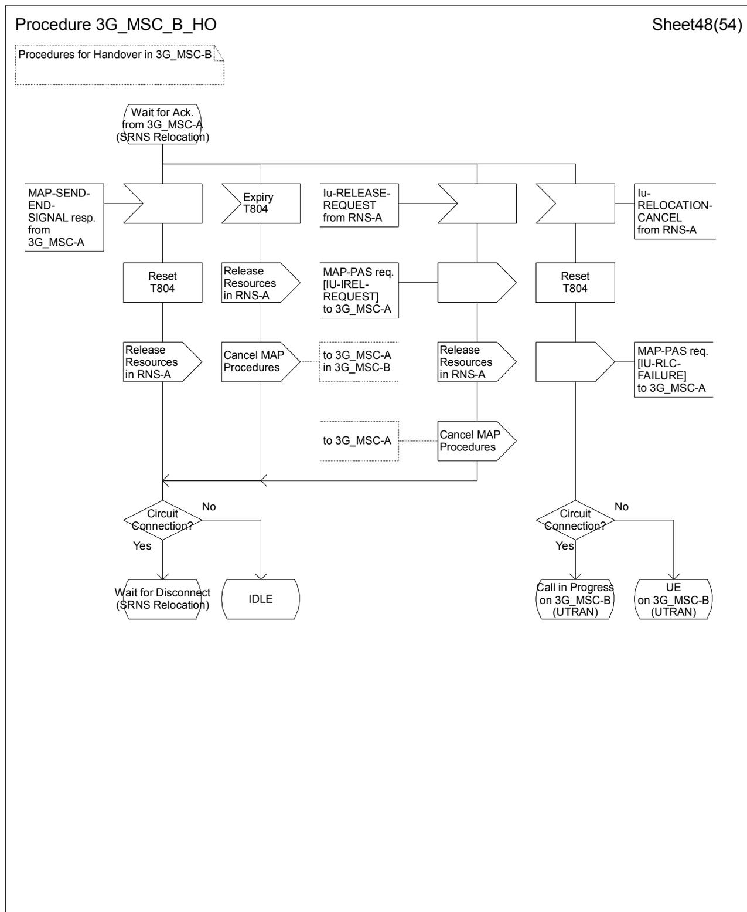

Procedure 3G\_MSC\_B\_HOSheet 48(54)

Procedures for Handover in 3G\_MSC-B

```

    graph TD
        State1([Wait for Ack. from 3G_MSC-A  
($SRNS Relocation)]) --> Input1[/MAP-SEND-END-SIGNAL resp.  
from 3G_MSC-A/]
        State1 --> Input2[/Expiry T804/]
        State1 --> Input3[/Iu-RELEASE-REQUEST  
from RNS-A/]
        State1 --> Input4[/Iu-RELOCATION-CANCEL  
from RNS-A/]

        Input1 --> Task1[Reset T804]
        Task1 --> Task2[Release Resources in RNS-A]
        Task2 --> Dec1{Circuit Connection?}
        Dec1 -- Yes --> State2([Wait for Disconnect  
($SRNS Relocation)])
        Dec1 -- No --> State3([IDLE])

        Input2 --> Task3[Release Resources in RNS-A]
        Task3 --> Task4[Cancel MAP Procedures]
        Task4 --> Dec1

        Input3 --> Output1[[MAP-PAS req. [IU-IREL-REQUEST]  
to 3G_MSC-A]]
        Output1 --> Task5[Release Resources in RNS-A]
        Task5 --> Task6[Cancel MAP Procedures]
        Task6 --> Dec1

        Input4 --> Task7[Reset T804]
        Task7 --> Output2[[MAP-PAS req. [IU-RLC-FAILURE]  
to 3G_MSC-A]]
        Output2 --> Dec2{Circuit Connection?}
        Dec2 -- Yes --> State4([Call in Progress on 3G_MSC-B  
(UTRAN)])
        Dec2 -- No --> State5([UE on 3G_MSC-B  
(UTRAN)])
    
```

SDL Diagram for Handover control procedure in 3G\_MSC-B

**Figure 44 (sheet 48 of 54): Handover control procedure in 3G\_MSC-B**

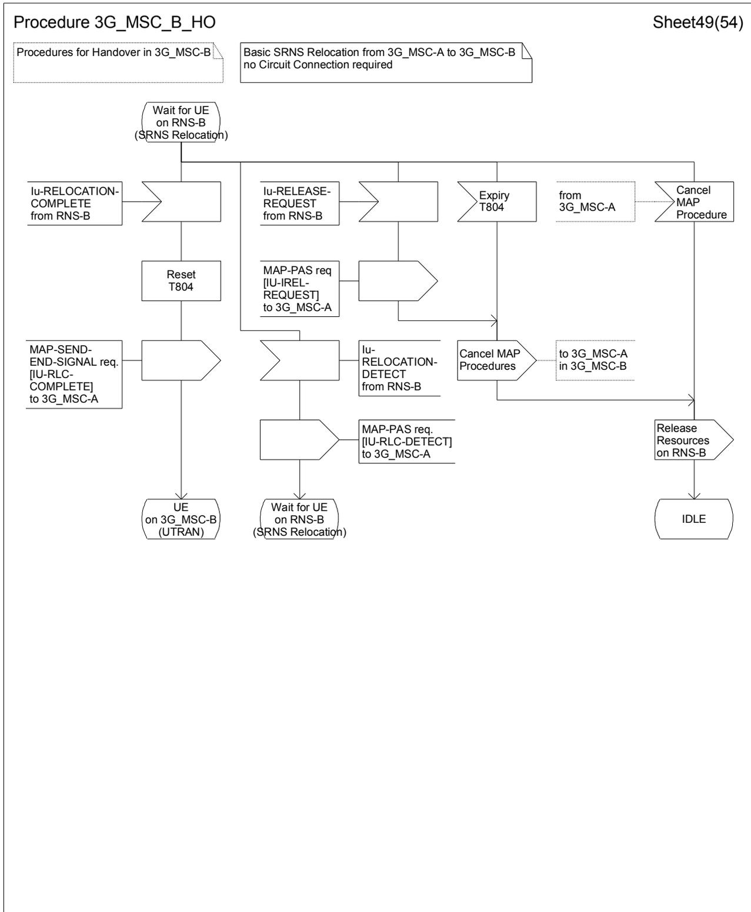

### Procedure 3G\_MSC\_B\_HO

Sheet49(54)

Procedures for Handover in 3G\_MSC-B

Basic SRNS Relocation from 3G\_MSC-A to 3G\_MSC-B  
no Circuit Connection required

```
graph TD; Start([Wait for UE on RNS-B (SRNS Relocation)]) --> Join(( )); Join --> IuRelocComplete[IU-RELOCATION-COMPLETE from RNS-B]; IuRelocComplete --> ResetT804[Reset T804]; ResetT804 --> MAPSendEndSignal[MAP-SEND-END-SIGNAL req. [IU-RLC-COMPLETE] to 3G_MSC-A]; MAPSendEndSignal --> UE3G[UE on 3G_MSC-B (UTRAN)]; Join --> IuReleaseRequest[IU-RELEASE-REQUEST from RNS-B]; IuReleaseRequest --> MAPPASReq1[MAP-PAS req [IU-IREL-REQUEST] to 3G_MSC-A]; MAPPASReq1 --> IuRelocDetect[IU-RELOCATION-DETECT from RNS-B]; IuRelocDetect --> MAPPASReq2[MAP-PAS req. [IU-RLC-DETECT] to 3G_MSC-A]; MAPPASReq2 --> WaitUE[Wait for UE on RNS-B (SRNS Relocation)]; Join --> ExpiryT804{Expiry T804}; ExpiryT804 --> CancelMAPProc1[Cancel MAP Procedure]; ExpiryT804 --> CancelMAPProc2[Cancel MAP Procedures]; CancelMAPProc2 --> To3G_MSC_A[to 3G_MSC-A in 3G_MSC-B]; To3G_MSC_A --> ReleaseResources[Release Resources on RNS-B]; ReleaseResources --> IDLE([IDLE]);
```

The flowchart illustrates the handover control procedure in 3G\_MSC-B. It begins with a wait state for UE on RNS-B (SRNS Relocation). From this state, three main paths emerge: 1) Receipt of IU-RELOCATION-COMPLETE from RNS-B leads to Reset T804, then sending a MAP-SEND-END-SIGNAL request to 3G\_MSC-A, and finally the UE moving to 3G\_MSC-B (UTRAN). 2) Receipt of IU-RELEASE-REQUEST from RNS-B leads to sending a MAP-PAS request to 3G\_MSC-A, then detecting IU-RELOCATION-DETECT from RNS-B, sending another MAP-PAS request to 3G\_MSC-A, and returning to the initial wait state. 3) An Expiry T804 event leads to either canceling the MAP procedure (if the request came from 3G\_MSC-A) or canceling all MAP procedures (leading to 3G\_MSC-A in 3G\_MSC-B), followed by releasing resources on RNS-B and reaching an IDLE state.

Flowchart of Procedure 3G\_MSC\_B\_HO showing various signaling paths between RNS-B, 3G\_MSC-A, and 3G\_MSC-B.

Figure 44 (sheet 49 of 54): Handover control procedure in 3G\_MSC-B

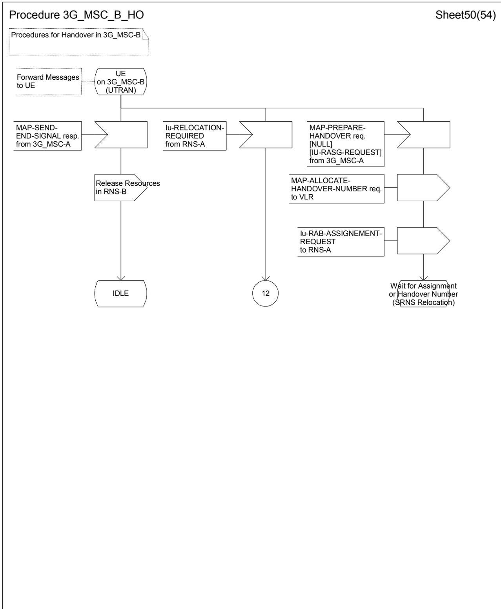

### Procedure 3G\_MSC\_B\_HO

Sheet50(54)

Procedures for Handover in 3G\_MSC-B

```
sequenceDiagram
    participant UE as UE on 3G_MSC-B (UTRAN)
    participant RNS_A as RNS-A
    participant RNS_B as RNS-B
    participant MSC_A as 3G_MSC-A

    Note left of UE: Forward Messages to UE
    UE->>RNS_B: 
    RNS_B->>MSC_A: MAP-SEND-END-SIGNAL resp. from 3G_MSC-A
    RNS_B->>UE: Release Resources in RNS-B
    UE->>RNS_A: Iu-RELOCATION-REQUIRED from RNS-A
    RNS_A->>MSC_A: MAP-PREPARE-HANDOVER req. [NULL] [IU-RASG-REQUEST] from 3G_MSC-A
    MSC_A->>RNS_B: MAP-ALLOCATE-HANDOVER-NUMBER req. to VLR
    RNS_B->>RNS_A: Iu-RAB-ASSIGNMENT-REQUEST to RNS-A
    RNS_B->>UE: Wait for Assignment or Handover Number (SRNS Relocation)
    UE->>RNS_A: 
    Note right of RNS_A: 12
```

The diagram illustrates the handover control procedure in 3G\_MSC-B. It begins with the UE on 3G\_MSC-B (UTRAN) sending a message to RNS-B. RNS-B then sends a MAP-SEND-END-SIGNAL response to 3G\_MSC-A and releases resources in RNS-B, returning the UE to an IDLE state. Simultaneously, RNS-A sends an Iu-RELOCATION-REQUIRED message to 3G\_MSC-A. 3G\_MSC-A responds with a MAP-PREPARE-HANDOVER request (containing NULL and IU-RASG-REQUEST) to RNS-B. RNS-B then sends a MAP-ALLOCATE-HANDOVER-NUMBER request to the VLR and an Iu-RAB-ASSIGNMENT-REQUEST to RNS-A. Finally, RNS-B waits for an assignment or handover number (SRNS Relocation) from the UE, which then sends a message to RNS-A, leading to connector 12.

Sequence diagram for Procedure 3G\_MSC\_B\_HO showing handover control between UE, RNS-A, RNS-B, and 3G\_MSC-A.

Figure 44 (sheet 50 of 54): Handover control procedure in 3G\_MSC-B

![Flowchart of handover control procedure in 3G_MSC-B. The process starts with 'Wait for Assignment or Handover Number (SRNS Relocation)'. It branches into two parallel paths. The left path receives 'Iu-RAB-ASSIGNMENT-RESPONSE from RNS-A', followed by 'Wait for Handover Number Allocation', then 'MAP-ALLOCATE-HANDOVER-NUMBER resp. from VLR'. The right path receives 'MAP-ALLOCATE-HANDOVER-NUMBER resp. from VLR', followed by 'Wait for Assignment (SRNS Relocation)', then 'Iu-RAB-ASSIGNMENT-RESPONSE from RNS-A'. Both paths converge to a merge point, which leads to 'MAP-PREPARE-HANDOVER resp. [Handover Number] [IU-RASG-COMPLETE] to 3G_MSC-A', then 'Set T810', and finally 'Wait for Connect from 3G_MSC-A (SRNS Relocation)'.](69e2cabe4d7ea5d5fb8f98661cacdda3_img.jpg)

**Procedure 3G\_MSC\_B\_HO** Sheet51(54)

Procedures for Handover in 3G\_MSC-B      Circuit Connection Establishment on 3G\_MSC-B

```
graph TD; Start[Wait for Assignment or Handover Number (SRNS Relocation)] --> Merge1(( )); Merge1 --> LeftPath[ ]; Merge1 --> RightPath[ ]; LeftPath --> L1[Wait for Handover Number Allocation]; RightPath --> R1[Wait for Assignment (SRNS Relocation)]; L1 --> L2(( )); R1 --> R2(( )); L2 --> L3[MAP-ALLOCATE-HANDOVER-NUMBER resp. from VLR]; R2 --> R3[ ]; L3 --> Merge2(( )); R3 --> R4[ ]; R4 --> R5[MAP-PREPARE-HANDOVER resp. [Handover Number] [IU-RASG-COMPLETE] to 3G_MSC-A]; R5 --> T810[Set T810]; T810 --> End[Wait for Connect from 3G_MSC-A (SRNS Relocation)];
```

Flowchart of handover control procedure in 3G\_MSC-B. The process starts with 'Wait for Assignment or Handover Number (SRNS Relocation)'. It branches into two parallel paths. The left path receives 'Iu-RAB-ASSIGNMENT-RESPONSE from RNS-A', followed by 'Wait for Handover Number Allocation', then 'MAP-ALLOCATE-HANDOVER-NUMBER resp. from VLR'. The right path receives 'MAP-ALLOCATE-HANDOVER-NUMBER resp. from VLR', followed by 'Wait for Assignment (SRNS Relocation)', then 'Iu-RAB-ASSIGNMENT-RESPONSE from RNS-A'. Both paths converge to a merge point, which leads to 'MAP-PREPARE-HANDOVER resp. [Handover Number] [IU-RASG-COMPLETE] to 3G\_MSC-A', then 'Set T810', and finally 'Wait for Connect from 3G\_MSC-A (SRNS Relocation)'.

Figure 44 (sheet 51 of 54): Handover control procedure in 3G\_MSC-B

![SDL Diagram for Handover control procedure in 3G_MSC-B. The diagram shows multiple entry states: 'Wait for Assignment (SRNS Relocation)', 'Wait for Assignment or Handover Number (SRNS Relocation)', and 'Wait for Handover Number Allocation (SRNS Relocation)'. It details three main logic paths involving message exchanges like Iu-RAB-ASSIGNMENT-RESPONSE, MAP-PREPARE-HANDOVER, MAP-SEND-END-SIGNAL, and Iu-RELEASE-REQUEST, leading to either a UE state on 3G_MSC-B or an IDLE state after resource release.](b10773c5223053f543c2f978197d4882_img.jpg)

**Procedure 3G\_MSC\_B\_HO** Sheet52(54)

Procedures for Handover in 3G\_MSC-B

```

    /* SDL Logic Flow Representation */

    [State: Wait for Assignment or Handover Number (SRNS Relocation)]
      |-- (Input: Iu-RAB-ASSIGNMENT-RESPONSE with Unsuccessful result from RNS-B)
      |   |-- (Output: MAP-PREPARE-HANDOVER resp. [IU-RASG-RESPONSE] to 3G_MSC-A)
      |   |-- [Next State: UE on 3G_MSC-B (UTRAN)]

    [State: Wait for Assignment or Handover Number (SRNS Relocation)]
      |-- (Input: ERROR)
      |   |-- (Input: Indication from VLR)
      |   |-- (Output: MAP-PREPARE-HANDOVER resp. [MAP ERROR] to 3G_MSC-A)
      |   |-- (Action: Cancel MAP Procedures to 3G_MSC-A and VLR-B)
      |   |-- [Next State: IDLE]

    [State: Wait for Assignment (SRNS Relocation) / Wait for Handover Number Allocation (SRNS Relocation)]
      |-- (Input: MAP-SEND-END-SIGNAL resp. from 3G_MSC-A)
      |   |-- (Input: Iu-RELEASE-REQUEST from RNS-A)
      |   |-- (Output: MAP-PAS req. [IU-IREL-REQUEST] to 3G_MSC-A)
      |   |-- (Action: Cancel MAP Procedures to VLR-B)
      |   |-- (Action: Release Resources in RNS-A)
      |   |-- [Next State: IDLE]
    
```

SDL Diagram for Handover control procedure in 3G\_MSC-B. The diagram shows multiple entry states: 'Wait for Assignment (SRNS Relocation)', 'Wait for Assignment or Handover Number (SRNS Relocation)', and 'Wait for Handover Number Allocation (SRNS Relocation)'. It details three main logic paths involving message exchanges like Iu-RAB-ASSIGNMENT-RESPONSE, MAP-PREPARE-HANDOVER, MAP-SEND-END-SIGNAL, and Iu-RELEASE-REQUEST, leading to either a UE state on 3G\_MSC-B or an IDLE state after resource release.

Figure 44 (sheet 52 of 54): Handover control procedure in 3G\_MSC-B

![Flowchart of Procedure 3G_MSC_B_HO showing the handover control process. It starts with 'Wait for Connect from 3G_MSC-A (SRNS Relocation)'. From here, three paths emerge: 1) Receiving 'I_CONNECT (IAM) from 3G_MSC-A (Uses Handover No.)' leads to 'Reset T810', then 'MAP-SEND-HANDOVER-REPORT resp. to VLR-B', then 'I_COMPLETE (ACM) to 3G_MSC-A', and finally 'Call on 3G_MSC-B (UTRAN)'. 2) An 'Expiry T810' timer leads to 'Cancel MAP Procedures', which then leads to 'Release Radio Resources on RNS-A' and finally 'IDLE'. 3) Receiving 'Iu-RELEASE-REQUEST from RNS-A' leads to 'MAP-PAS req. [[IU-IREL-REQUEST] to 3G_MSC-A', then 'Cancel MAP Procedures', which then leads to 'Release Radio Resources on RNS-A' and finally 'IDLE'. There is also a dashed box 'to 3G_MSC-A in 3G_MSC-B' between 'Reset T810' and 'Cancel MAP Procedures' in the second path.](4faa0ca1a17f1e12f0a9ca7f8ffda2c9_img.jpg)

### Procedure 3G\_MSC\_B\_HO

Sheet53(54)

Procedures for Handover in 3G\_MSC-B

```
graph TD; Start[Wait for Connect from 3G_MSC-A (SRNS Relocation)] --> I_CONNECT[I_CONNECT (IAM) from 3G_MSC-A (Uses Handover No.)]; Start --> Expiry[Expiry T810]; Start --> Iu_RELEASE[Iu-RELEASE-REQUEST from RNS-A]; I_CONNECT --> Reset[Reset T810]; Reset --> MAP_SEND[MAP-SEND-HANDOVER-REPORT resp. to VLR-B]; MAP_SEND --> I_COMPLETE[I_COMPLETE (ACM) to 3G_MSC-A]; I_COMPLETE --> Call[Call on 3G_MSC-B (UTRAN)]; Expiry --> Cancel1[Cancel MAP Procedures]; Cancel1 --> Release[Release Radio Resources on RNS-A]; Release --> IDLE1[IDLE]; Iu_RELEASE --> MAP_PAS[MAP-PAS req. [[IU-IREL-REQUEST] to 3G_MSC-A]; MAP_PAS --> Cancel2[Cancel MAP Procedures]; Cancel2 --> Release; Release --> IDLE2[IDLE]; Reset -.-> to_MSC_A[to 3G_MSC-A in 3G_MSC-B]; to_MSC_A -.-> Cancel1;
```

Flowchart of Procedure 3G\_MSC\_B\_HO showing the handover control process. It starts with 'Wait for Connect from 3G\_MSC-A (SRNS Relocation)'. From here, three paths emerge: 1) Receiving 'I\_CONNECT (IAM) from 3G\_MSC-A (Uses Handover No.)' leads to 'Reset T810', then 'MAP-SEND-HANDOVER-REPORT resp. to VLR-B', then 'I\_COMPLETE (ACM) to 3G\_MSC-A', and finally 'Call on 3G\_MSC-B (UTRAN)'. 2) An 'Expiry T810' timer leads to 'Cancel MAP Procedures', which then leads to 'Release Radio Resources on RNS-A' and finally 'IDLE'. 3) Receiving 'Iu-RELEASE-REQUEST from RNS-A' leads to 'MAP-PAS req. [[IU-IREL-REQUEST] to 3G\_MSC-A', then 'Cancel MAP Procedures', which then leads to 'Release Radio Resources on RNS-A' and finally 'IDLE'. There is also a dashed box 'to 3G\_MSC-A in 3G\_MSC-B' between 'Reset T810' and 'Cancel MAP Procedures' in the second path.

Figure 44 (sheet 53 of 54): Handover control procedure in 3G\_MSC-B


### Procedure 3G\_MSC\_B\_HO

Sheet54(54)

Procedures for Handover in 3G\_MSC-B

```
graph TD; Start[Wait for Connect from 3G_MSC-A (SRNS Relocation)]; Start --> I_DISCONNECT[I_DISCONNECT (REL) from 3G_MSC-A]; Start --> MAP_SEND[MAP-SEND-END-SIGNAL resp. from 3G_MSC-A]; Start --> FROM_3G_MSC_A[from 3G_MSC-A]; I_DISCONNECT --> UE[UE on 3G_MSC-B (UTRAN)]; MAP_SEND --> Release1{Release Resources on RNS-A}; Release1 --> IDLE1([IDLE]); FROM_3G_MSC_A --> Cancel[Cancel MAP Procedure]; Cancel --> Release2{Release Resources on RNS-A}; Release2 --> IDLE2([IDLE]);
```

Flowchart of Procedure 3G\_MSC\_B\_HO showing three possible outcomes from a 'Wait for Connect' state: 1) I\_DISCONNECT (REL) from 3G\_MSC-A leads to UE on 3G\_MSC-B (UTRAN); 2) MAP-SEND-END-SIGNAL resp. from 3G\_MSC-A leads to Release Resources on RNS-A and then IDLE; 3) from 3G\_MSC-A leads to Cancel MAP Procedure, Release Resources on RNS-A, and then IDLE.

Figure 44 (sheet 54 of 54): Handover control procedure in 3G\_MSC-B

# Annex A (informative): Change history

| Change history |           |         |         |     |       |                                                                                                         |                         |
|----------------|-----------|---------|---------|-----|-------|---------------------------------------------------------------------------------------------------------|-------------------------|
| TSG CN#        | Spec      | Version | CR      | Rel | N_Ver | Subject                                                                                                 | Comment                 |
| Apr 1999       | GSM 03.09 | 6.0.0   |         |     |       |                                                                                                         | Transferred to 3GPP CN1 |
| CN#03          | 23.009    |         |         |     | 3.0.0 |                                                                                                         | Approved at CN#03       |
| CN#06          | 23.009    | 3.0.0   | CR001r2 | R99 | 3.1.0 | Introduction of UMTS functionalities in 23.009                                                          |                         |
| CN#7           | 23.009    | 3.1.0   | CR003   | R99 | 3.2.0 | Functional requirements for the use of RANAP over the E i/f                                             |                         |
| CN#7           | 23.009    | 3.1.0   | CR004   | R99 | 3.2.0 |                                                                                                         | SDLs                    |
| CN#7           | 23.009    | 3.1.0   | CR005   | R99 | 3.2.0 |                                                                                                         | SDLs                    |
| CN#7           | 23.009    | 3.1.0   | CR006   | R99 | 3.2.0 | Introduction of RANAP for intra-UMTS inter-MSC relocation                                               |                         |
| CN#7           | 23.009    | 3.1.0   | CR007   | R99 | 3.2.0 | Clarifications of 3G_MSC-A and 3G_MSC-B roles                                                           |                         |
| CN#7           | 23.009    | 3.1.0   | CR008r2 | R99 | 3.2.0 | Transcoder handling in the CN at inter-system handover and relocation                                   |                         |
| 15/05/00       | 23.009    | 3.2.0   | -       | R99 | 3.2.1 | Missing SDLs re-inserted by MCC for Figures 41 - 42 (GSM Handover control procedure in MSC-A and MSC-B) | SDLs                    |


| TSG#  | NP-Tdoc   | WG Tdoc                 | Spec   | CR  | Rev | Rel   | C at | Old vers | New ver | Title                                                                        | WI                                       |
|-------|-----------|-------------------------|--------|-----|-----|-------|------|----------|---------|------------------------------------------------------------------------------|------------------------------------------|
| NP-08 | NP-000278 | N1-000638               | 23.009 | 002 | 4   | R99   | B    | 3.2.1    | 3.3.0   | CR to 23.009 on Handover scenario for Multicall                              | Multicall                                |
| NP-08 | NP-000270 | N1-000607               | 23.009 | 009 |     | R99   | C    | 3.2.1    | 3.3.0   | Clean-up of 3G_MSC-A_HO SDLs                                                 | GSM/UMTS Interworking                    |
| NP-08 | NP-000270 | N1-000608               | 23.009 | 010 |     | R99   | C    | 3.2.1    | 3.3.0   | Clean-up of 3G_MSC-B_HO SDLs                                                 | GSM/UMTS Interworking                    |
| NP-09 | NP-000444 | N1-000922               | 23.009 | 012 | 1   | R99   | F    | 3.3.0    | 3.4.0   | Correction to transcoder handling for R99                                    | TrFo/OoBTC                               |
| NP-10 | NP-000671 | N1-001174               | 23.009 | 013 |     | R99   | F    | 3.4.0    | 3.5.0   | GSM to UMTS Handover: Directed Retry                                         | GSM/UMTS Interworking                    |
| NP-10 | NP-000671 | N1-001175               | 23.009 | 014 |     | R99   | F    | 3.4.0    | 3.5.0   | GSM to UMTS Handover: MAP parameter Target Cell ID                           | GSM/UMTS Interworking                    |
| NP-10 | NP-000724 | N1-001412               | 23.009 | 015 | 2   | R99   | F    | 3.4.0    | 3.5.0   | GSM to UMTS Handover: Location Reporting in 3G MSC B                         | GSM/UMTS Interworking                    |
| NP-10 | NP-000671 | N1-001347               | 23.009 | 016 | 1   | R99   | F    | 3.4.0    | 3.5.0   | Subsequent Handover procedure corrections                                    | GSM/UMTS Interworking                    |
| NP-10 | NP-000671 | N1-001408               | 23.009 | 017 | 3   | R99   | F    | 3.4.0    | 3.5.0   | Missing Subsequent Handover scenarios                                        | GSM/UMTS Interworking                    |
| NP-10 | NP-000673 | N1-001304               | 23.009 | 019 |     | R99   | F    | 3.4.0    | 3.5.0   | Reference clean-up                                                           | TEI                                      |
| NP-10 | NP-000671 | N1-001372               | 23.009 | 020 | 1   | R99   | F    | 3.4.0    | 3.5.0   | Indication of Intra-MSC Intersystem handover from 3G_MSC-B to MSC-A/3G_MSC-A | GSM/UMTS Interworking                    |
| NP-10 | NP-000671 | N1-001403               | 23.009 | 021 | 1   | R99   | F    | 3.4.0    | 3.5.0   | UMTS to GSM handover: Directed Retry                                         | GSM/UMTS Interworking                    |
| NP-11 | NP-010123 | N1-010086               | 23.009 | 018 | 2   | R99   | F    | 3.5.0    | 3.6.0   | GSM to UMTS Handover: Location Reporting in 3G_MSC-B                         | GSM/UMTS Interworking                    |
| NP-11 | NP-010207 | N1-010321               | 23.009 | 024 |     | R99   | F    | 3.5.0    | 3.6.0   | GSM to UMTS handover: addition of MAP parameter Target RNC ID                | GSM/UMTS Interworking                    |
| NP-11 | NP-010207 | N1-010427               | 23.009 | 026 |     | R99   | F    | 3.5.0    | 3.6.0   | Directed Retry procedure alignment                                           | GSM/UMTS Interworking                    |
| NP-11 | NP-010161 | N1-010232               | 23.009 | 022 | 2   | Rel-4 | C    | 3.6.0    | 4.0.0   | Applicability of intra-3G_MSC SRNS Relocation                                | TRFO-OOBTC                               |
| NP-12 | NP-010270 | N1-010914               | 23.009 | 035 | 3   | Rel-4 | A    | 4.0.0    | 4.1.0   | Indication of Intra MSC handover from 3G_MSC-B to MSC-A/3G_MSC-A             | Handover                                 |
| NP-13 | NP-010494 | N1-011112               | 23.009 | 041 |     | Rel-4 | A    | 4.1.0    | 4.2.0   | GSM to UMTS Handover: Location Reporting in 3G_MSC-B for no call up case     | GSM/UMTS Interworking                    |
| NP-13 | NP-010495 | N1-011229               | 23.009 | 047 |     | Rel-4 | A    | 4.1.0    | 4.2.0   | Correction of SDL figures in CRs 034 and 035 (N1-010913, N1-010914)          | Handover                                 |
| NP-13 | NP-010494 | N1-011311               | 23.009 | 049 | 1   | Rel-4 | A    | 4.1.0    | 4.2.0   | Usage of Location Reporting for Relocation and Inter-system Handover         | GSM/UMTS Interworking                    |
| NP-14 | NP-010651 | N1-011557               | 23.009 | 055 |     | Rel-4 | A    | 4.2.0    | 4.3.0   | Multicall bearer selection                                                   | Multicall                                |
| NP-14 | NP-010682 | N1-011972               | 23.009 | 057 | 2   | Rel-4 | A    | 4.2.0    | 4.3.0   | Usage of Location Reporting for Relocation and Inter-system Handover         | GSM/UMTS Interworking                    |
| NP-14 | NP-010682 | N1-011807               | 23.009 | 060 |     | Rel-4 | A    | 4.2.0    | 4.3.0   | E-interface protocol during the supervision phase                            | GSM/UMTS Interworking                    |
| NP-14 | NP-010691 | N1-012027 revised twice | 23.009 | 063 | 3   | Rel-4 | A    | 4.2.0    | 4.3.0   | GSM to UMTS Handover: Iu-LOCATION-REPORTING message reception                | GSM/UMTS Interworking                    |
| NP-14 | NP-010659 | N1-012042               | 23.009 | 052 | 3   | Rel-5 | B    | 4.3.0    | 5.0.0   | Introduction of Intra Domain Connection of RAN                               | IUFLEX                                   |
| NP-14 | NP-010661 | N1-012055               | 23.009 | 061 | 4   | Rel-5 | B    | 4.3.0    | 5.0.0   | Reflection of RRC changes in 44.018 to 23.009                                | Alignment of 3G functional split and Iu. |
| NP-16 | NP-020243 | N1-020879               | 23.009 | 066 | 2   | Rel-5 | C    | 5.0.0    | 5.1.0   | Sending of RANAP Location Reporting Control on the E Interface               | TEI5                                     |
| NP-16 | NP-020218 | N1-021282               | 23.009 | 071 |     | Rel-5 | A    | 5.0.0    | 5.1.0   | Clarification of the end of supervision after inter-MSC handover             | GSM/UMTS Interworking                    |
| NP-16 | NP-020243 | N1-021426               | 23.009 | 074 | 1   | Rel-5 | F    | 5.0.0    | 5.1.0   | Clarification that Multicall is not supported in GERAN Iu-                   | TEI5                                     |

Error:

300

Error: Reference source not

|  |  |  |  |  |  |  |  |  |  |      |  |
|--|--|--|--|--|--|--|--|--|--|------|--|
|  |  |  |  |  |  |  |  |  |  | mode |  |
|--|--|--|--|--|--|--|--|--|--|------|--|

|       |           |           |        |      |   |       |   |       |       |                                                                                                                                   |                       |
|-------|-----------|-----------|--------|------|---|-------|---|-------|-------|-----------------------------------------------------------------------------------------------------------------------------------|-----------------------|
| NP-16 | NP-020218 | N1-021395 | 23.009 | 077  | 1 | Rel-5 | A | 5.0.0 | 5.1.0 | Handling of Service Handover parameter in non-anchor                                                                              | GSM/UMTS Interworking |
| NP-17 | NP-020383 | N1-021789 | 23.009 | 080  | 1 | Rel-5 | B | 5.1.0 | 5.2.0 | Support for Shared Network Area                                                                                                   | TEI5                  |
|       |           |           |        |      |   | Rel-5 |   | 5.2.0 | 5.3.0 | ETSI/MCC updated with correct release to references [2], [3], [4], [6], and [7].                                                  |                       |
| NP-18 | NP-020549 | N1-022272 | 23.009 | 083  | 2 | Rel-5 | A | 5.2.0 | 5.3.0 | MSC_A_HO_SDL correction                                                                                                           | TEI                   |
| NP-18 | NP-020548 | N1-022239 | 23.009 | 084  | 3 | Rel-5 | F | 5.2.0 | 5.3.0 | Inter-MSC relocation and intersystem handover for multiple codecs                                                                 | TRFO-OOBTC            |
| NP-18 | NP-020630 | N1-022236 | 23.009 | 090  |   | Rel-5 | A | 5.2.0 | 5.3.0 | Clarification of the protocol to be used on the E-interface                                                                       | GSM/UMTS Interworking |
| NP-19 | NP-030041 | N1-030294 | 23.009 | 093  | 1 | Rel-5 | A | 5.3.0 | 5.4.0 | Further clarification of the protocol to the be used on the E-interface                                                           | GSM/UMTS Interworking |
| NP-20 | NP-030268 | N1-030908 | 23.009 | 096  | 2 | Rel-5 | A | 5.4.0 | 5.5.0 | Correct text related to timer expiry for receipt of A-HANDOVER-COMPLETE / Iu-RELOCATION-COMPLETE                                  | GSM/UMTS Interworking |
| NP-20 | NP-030283 | N1-030875 | 23.009 | 097  | 2 | Rel-5 | F | 5.4.0 | 5.5.0 | Addition of UESBI-Iu to handover and relocation procedures                                                                        | LATE_UE               |
| NP-21 | NP-030417 | N1-031099 | 23.009 | 099  |   | Rel-5 | F | 5.5.0 | 5.6.0 | Correction to UESBI-Iu definition                                                                                                 | LATE_UE               |
| NP-22 | NP-030473 | N1-031510 | 23.009 | 101  |   | Rel-5 | A | 5.6.0 | 5.7.0 | Correcting a mistake in previously approved category A of its Rel99 category F CR 091 Rev 1 in NP-030041                          | GSM/UMTS interworking |
| NP-23 | NP-040031 | N1-040468 | 23.009 | 102  | 2 | Rel-5 | F | 5.7.0 | 5.8.0 | Renaming of the Available Codecs List to Iu Supported Codecs List                                                                 | TEI5                  |
| NP-26 |           |           |        |      |   | Rel-6 |   | 5.8.0 | 6.0.0 | Rel-6 published after CN#26                                                                                                       |                       |
| CP-28 | CP-050071 | C1-050764 | 23.009 | 104  | 2 | Rel-6 | F | 6.0.0 | 6.1.0 | Full RANAP support of network initiated SCUDIF                                                                                    | TEI6                  |
| CP-28 | CP-050072 | C1-050741 | 23.009 | 105  | 1 | Rel-6 | F | 6.0.0 | 6.1.0 | Directed Retry Handover for Bearer Service                                                                                        | CS_VSS                |
| CP-29 | CP-050443 |           | 23.009 |      |   | Rel-6 | A | 6.1.0 | 6.2.0 | Intra-3G_MSC-B handover/relocation interactions with other RANAP procedures                                                       | TEI5                  |
|       |           |           |        | 109  | 5 |       |   |       |       |                                                                                                                                   |                       |
| CP-30 | CP-050536 | C1-051306 | 23.009 |      |   | Rel-6 | A | 6.2.0 | 6.3.0 | Subsequent Inter-MSC handover/relocation interactions with other RANAP procedures                                                 | TEI5                  |
|       |           |           |        | 113  |   |       |   |       |       |                                                                                                                                   |                       |
| CP-30 | CP-050536 | C1-051308 | 23.009 |      |   | Rel-6 | A | 6.2.0 | 6.3.0 | Correction to Intra-3G_MSC-B handover/relocation interactions with other RANAP procedures for the security mode control procedure | TEI5                  |
|       |           |           |        | 115  |   |       |   |       |       |                                                                                                                                   |                       |
| CP-31 |           |           |        |      |   |       | A | 6.3.0 | 6.4.0 | Clarification of directed retry handover failure cases                                                                            | TEI5                  |
|       | CP-060108 | C1-060564 | 23.009 | 0119 | 1 | Rel-6 |   |       |       |                                                                                                                                   |                       |
| CP-31 |           |           |        |      |   |       | F | 6.3.0 | 6.4.0 | Aligning release 6 with release 5                                                                                                 | TEI6                  |
|       | CP-060113 | C1-060508 | 23.009 | 0120 | - | Rel-6 |   |       |       |                                                                                                                                   |                       |
| CP-35 |           |           |        |      |   |       | F | 6.4.0 | 7.0.0 | Misalignment With The Usage Of Iu-Selected Codec During Handover                                                                  | TEI7                  |
|       | CP-070155 | C1-070422 | 23.009 | 0121 | 4 | Rel-7 |   |       |       |                                                                                                                                   |                       |
| CP-42 |           |           |        |      |   |       | A | 7.0.0 | 7.1.0 | Correction of white-on-white text in 23.009                                                                                       | TEI5                  |
|       | CP-080871 | C1-083804 | 23.009 | 0122 |   | Rel-7 |   |       |       |                                                                                                                                   |                       |

|       |           |           |        |      |   |        |   |        |        |                                                                                 |                 |
|-------|-----------|-----------|--------|------|---|--------|---|--------|--------|---------------------------------------------------------------------------------|-----------------|
| CP-42 | CP-080863 | C1-084380 | 23.009 | 0125 | 1 | Rel-8  | B | 7.1.0  | 8.0.0  | Enhanced SRNS relocation                                                        | RANimp-SmsReloc |
| CP-42 | CP-080833 | C1-085384 | 23.009 | 0126 | 1 | Rel-8  | B | 7.1.0  | 8.0.0  | Updates to TS 23.009 for AoIP                                                   | AoIP-CN         |
| CP-42 | CP-080868 | C1-085525 | 23.009 | 0127 | 3 | Rel-8  | B | 7.1.0  | 8.0.0  | Adding SRVCC description                                                        | SAES-SRVCC      |
| CP-42 |           |           | 23.009 |      |   | Rel-8  |   | 7.1.0  | 8.0.0  | Editorial cleanup by MCC                                                        |                 |
|       |           |           |        |      |   |        |   | 8.0.0  | 8.0.1  | Added missing SDL source files                                                  |                 |
|       |           |           | 23.009 |      |   | Rel-8  |   |        |        |                                                                                 |                 |
| CP-43 | CP-090161 | C1-090496 | 23.009 | 0128 |   | Rel-8  |   | 8.0.1  | 8.1.0  | Data Forwarding for Enhanced SRNS Relocation                                    | RANimp-SmsReloc |
| CP-45 |           |           |        |      |   |        | F | 8.1.0  | 8.2.0  | AoIP - Clarification for the "BSS Internal Handover with MSC Support" procedure |                 |
|       | CP-090666 | C1-093891 | 23.009 | 0129 | 5 | Rel-8  |   |        |        |                                                                                 | AoIP-CN         |
| CP-46 |           |           |        |      |   |        |   | 8.2.0  | 9.0.0  | Automatic upgrade from Rel-8                                                    |                 |
|       |           |           | 23.009 |      |   | Rel-9  |   |        |        |                                                                                 |                 |
| CP-47 |           |           |        |      |   |        | F | 9.0.0  | 9.1.0  | AoIP-MAP level codec negotiation changes                                        |                 |
|       | CP-100135 | C1-101062 | 23.009 | 0131 | 5 | Rel-9  |   |        |        |                                                                                 | TEI9            |
| CP-51 |           |           |        |      |   |        | F | 9.1.0  | 9.2.0  | Correction of handling of AoIP Supported codec list                             |                 |
|       | CP-110174 | C1-111180 | 23.009 | 0132 | 1 | Rel-9  |   |        |        |                                                                                 | TEI9            |
| CP-51 |           |           |        |      |   |        | B | 9.2.0  | 10.0.0 | Introduction of LCLS functionality in TS 23.009                                 |                 |
|       | CP-110203 | C1-111484 | 23.009 | 0134 | 1 | Rel-10 |   |        |        |                                                                                 | LCLS-CN         |
| CP-53 |           |           |        |      |   |        | B | 10.0.0 | 11.0.0 | Add description for MSC server enhanced for vSRVCC                              |                 |
|       | CP-110697 | C1-113659 | 23.009 | 0135 | 2 | Rel-11 |   |        |        |                                                                                 | vSRVCC-CT       |
| CP-57 |           |           |        |      |   |        | C | 11.0.0 | 11.1.0 | Support of handover to a CSG cell                                               |                 |
|       | CP-120584 | C1-123204 | 23.009 | 0139 | 4 | Rel-11 |   |        |        |                                                                                 | TEI11, VCSG     |
| CP-58 |           |           |        |      |   |        | A | 11.1.0 | 11.2.0 | BSS-internal handover in AoIP mode with MSC support                             |                 |
|       | CP-120900 | -         | 23.009 | 0148 | 2 | Rel-11 |   |        |        |                                                                                 | AoIP-CN         |