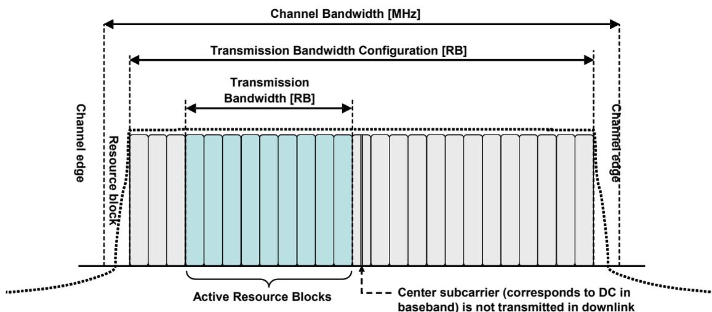
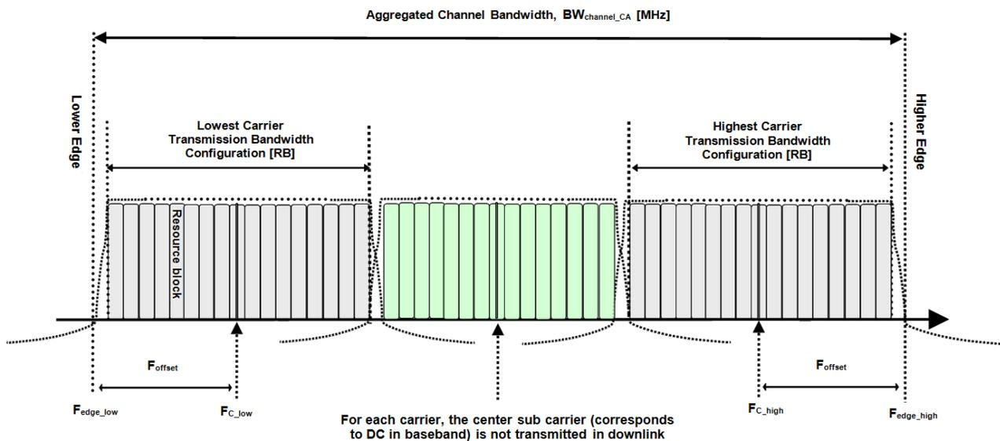
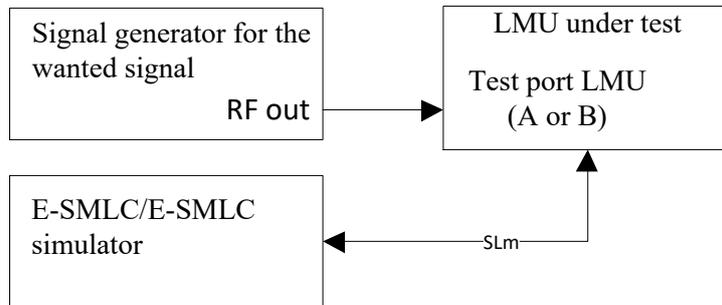
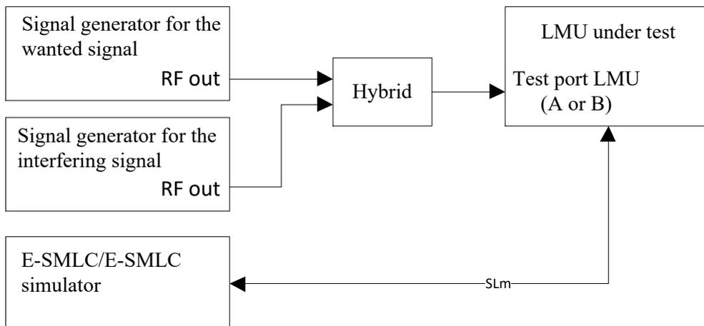
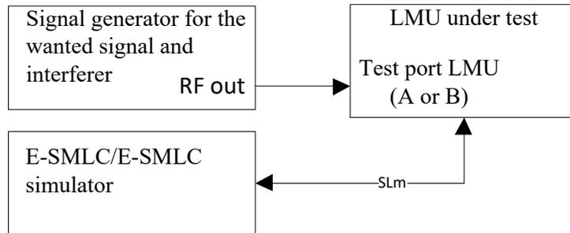
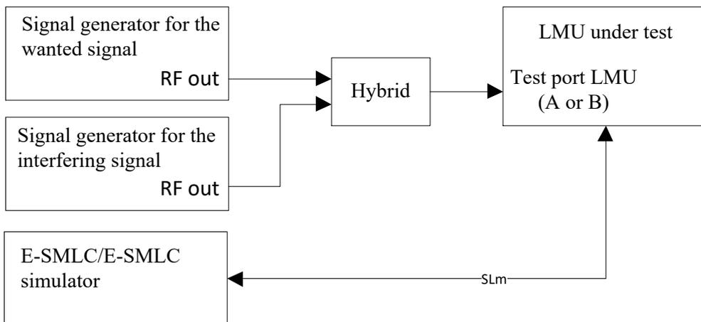
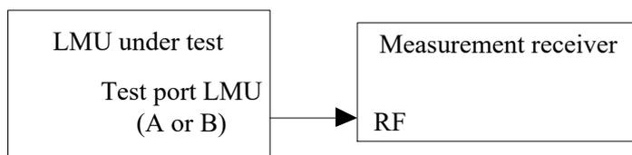
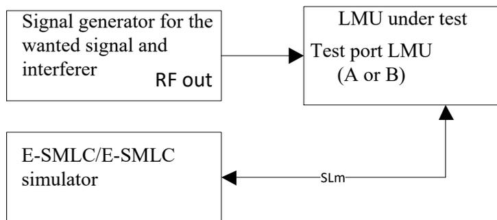
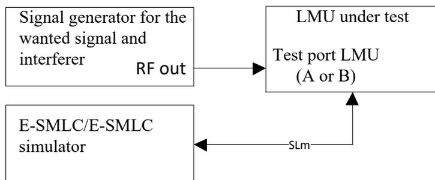
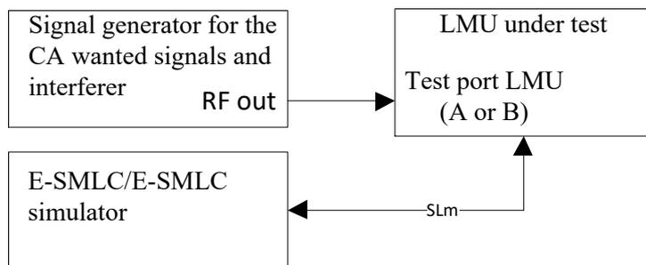

Error! No  
text of

Error! No text of specified style in  
document.

# Contents

|                                                                          |    |
|--------------------------------------------------------------------------|----|
| Foreword .....                                                           | 7  |
| 1 Scope.....                                                             | 8  |
| 2 References.....                                                        | 8  |
| 3 Definitions, symbols and abbreviations.....                            | 8  |
| 3.1 Definitions.....                                                     | 8  |
| 3.2 Symbols.....                                                         | 8  |
| 3.3 Abbreviations .....                                                  | 9  |
| 4 General Test Conditions and Declarations.....                          | 9  |
| 4.1 Measurement uncertainties and test requirements .....                | 9  |
| 4.1.1 General .....                                                      | 9  |
| 4.1.2 Acceptable uncertainty of Test System .....                        | 9  |
| 4.1.2.1 Measurement of receiver .....                                    | 9  |
| 4.1.2.2 Measurement time requirement .....                               | 14 |
| 4.1.2.3 Measurement of performance requirement.....                      | 14 |
| 4.2 LMU classes.....                                                     | 14 |
| 4.3 Regional requirements.....                                           | 14 |
| 4.4 Selection of configurations for testing .....                        | 14 |
| 4.5 LMU configurations.....                                              | 14 |
| 4.6 Manufacturer's declarations of regional requirements.....            | 16 |
| 4.6.1 Operating band and frequency range.....                            | 16 |
| 4.6.2 Channel bandwidth.....                                             | 16 |
| 4.6.3 Co-location with base stations in other bands .....                | 16 |
| 4.6.4 Manufacturer's declarations of supported RF configurations.....    | 17 |
| 4.7 Specified frequency range and supported channel bandwidth .....      | 17 |
| 4.7.1 RF bandwidth position for non-single carrier testing.....          | 17 |
| 4.7.2 Aggregated channel bandwidth position for CA specific testing..... | 18 |
| 4.8 Format and interpretation of tests.....                              | 18 |
| 5 Operating Bands and Channel Arrangement .....                          | 19 |
| 5.1 General .....                                                        | 19 |
| 5.2 Operating bands.....                                                 | 19 |
| 5.3 Channel bandwidth.....                                               | 21 |
| 5.4 Channel arrangement.....                                             | 22 |
| 5.4.1 Channel spacing.....                                               | 22 |
| 5.4.2 CA Channel spacing.....                                            | 22 |
| 5.4.3 Channel raster.....                                                | 22 |
| 5.4.4 Carrier frequency and EARFCN .....                                 | 23 |
| 5.5 Requirements for contiguous spectrum.....                            | 24 |
| 6 Conformance Tests for LMU RF Requirements.....                         | 25 |
| 6.1 General .....                                                        | 25 |
| 6.2 Reference sensitivity level .....                                    | 25 |
| 6.2.1 Definition and applicability .....                                 | 25 |
| 6.2.2 Minimum requirement.....                                           | 25 |
| 6.2.3 Test Purpose .....                                                 | 25 |
| 6.2.4 Method of testing.....                                             | 25 |
| 6.2.4.1 Initial conditions .....                                         | 25 |
| 6.2.4.2 Procedure .....                                                  | 25 |
| 6.2.5 Test requirement.....                                              | 25 |
| 6.3 Dynamic range .....                                                  | 26 |
| 6.3.1 Definition and applicability .....                                 | 26 |
| 6.3.2 Minimum Requirement .....                                          | 26 |
| 6.3.3 Test purpose.....                                                  | 26 |
| 6.3.4 Method of testing.....                                             | 26 |
| 6.3.4.1 Initial conditions .....                                         | 26 |
| 6.3.4.2 Procedure .....                                                  | 26 |
| 6.3.5 Test Requirements .....                                            | 27 |

|         |                                                                    |    |
|---------|--------------------------------------------------------------------|----|
| 6.4     | In-channel selectivity .....                                       | 27 |
| 6.4.1   | Definition and applicability .....                                 | 27 |
| 6.4.2   | Minimum Requirement .....                                          | 27 |
| 6.4.3   | Test purpose.....                                                  | 27 |
| 6.4.4   | Method of testing.....                                             | 27 |
| 6.4.4.1 | Initial conditions .....                                           | 27 |
| 6.4.4.2 | Procedure .....                                                    | 28 |
| 6.4.5   | Test Requirements .....                                            | 28 |
| 6.5     | Adjacent channel selectivity (ACS) and narrow-band blocking.....   | 28 |
| 6.5.1   | Definition and applicability .....                                 | 28 |
| 6.5.2   | Minimum Requirement .....                                          | 28 |
| 6.5.3   | Test purpose.....                                                  | 29 |
| 6.5.4   | Method of test.....                                                | 29 |
| 6.5.4.1 | Initial conditions .....                                           | 29 |
| 6.5.4.2 | Procedure .....                                                    | 29 |
| 6.5.4.3 | Procedure for narrow-band blocking .....                           | 29 |
| 6.5.5   | Test Requirements .....                                            | 29 |
| 6.6     | Blocking.....                                                      | 30 |
| 6.6.1   | Definition and applicability .....                                 | 30 |
| 6.6.2   | Minimum Requirements.....                                          | 30 |
| 6.6.3   | Test purpose.....                                                  | 31 |
| 6.6.4   | Method of test.....                                                | 31 |
| 6.6.4.1 | Initial conditions .....                                           | 31 |
| 6.6.4.2 | Procedure .....                                                    | 31 |
| 6.6.5   | Test Requirements .....                                            | 31 |
| 6.7     | Receiver spurious emissions .....                                  | 32 |
| 6.7.1   | Definition and applicability .....                                 | 32 |
| 6.7.2   | Minimum Requirements.....                                          | 33 |
| 6.7.3   | Test purpose.....                                                  | 33 |
| 6.7.4   | Method of test.....                                                | 33 |
| 6.7.4.1 | Initial conditions .....                                           | 33 |
| 6.7.4.2 | Procedure .....                                                    | 33 |
| 6.7.5   | Test requirements .....                                            | 33 |
| 6.8     | Receiver intermodulation.....                                      | 34 |
| 6.8.1   | Definition and applicability .....                                 | 34 |
| 6.8.2   | Minimum Requirement .....                                          | 34 |
| 6.8.3   | Test purpose.....                                                  | 34 |
| 6.8.4   | Method of test.....                                                | 34 |
| 6.8.4.1 | Initial conditions .....                                           | 34 |
| 6.8.4.2 | Procedures.....                                                    | 34 |
| 6.8.5   | Test requirements .....                                            | 34 |
| 7       | Conformance Tests for UL RTOA Measurement Time Requirements .....  | 35 |
| 7.1     | General .....                                                      | 35 |
| 7.2     | Requirements for FDD without DRX .....                             | 35 |
| 7.2.1   | Definition and applicability .....                                 | 35 |
| 7.2.2   | Minimum requirement.....                                           | 35 |
| 7.2.3   | Test Purpose .....                                                 | 35 |
| 7.2.4   | Method of testing.....                                             | 35 |
| 7.2.4.1 | Initial conditions .....                                           | 35 |
| 7.2.4.2 | Procedure .....                                                    | 36 |
| 7.2.5   | Test requirement.....                                              | 36 |
| 7.3     | Requirements for TDD without DRX.....                              | 36 |
| 7.3.1   | Definition and applicability .....                                 | 36 |
| 7.3.2   | Minimum requirement.....                                           | 37 |
| 7.3.3   | Test Purpose .....                                                 | 37 |
| 7.3.4   | Method of testing.....                                             | 37 |
| 7.3.4.1 | Initial conditions .....                                           | 37 |
| 7.3.4.2 | Procedure .....                                                    | 37 |
| 7.3.5   | Test requirement.....                                              | 37 |
| 7.4     | UL RTOA Measurements upon Receiving SRS Configuration Update ..... | 38 |
| 7.4.1   | Definition and applicability .....                                 | 38 |

|                               |                                                                       |           |
|-------------------------------|-----------------------------------------------------------------------|-----------|
| 7.4.2                         | Minimum requirement.....                                              | 38        |
| 7.4.3                         | Test Purpose .....                                                    | 38        |
| 7.4.4                         | Method of testing.....                                                | 38        |
| 7.4.4.1                       | Initial conditions .....                                              | 38        |
| 7.4.4.2                       | Procedure .....                                                       | 38        |
| 7.4.5                         | Test requirement.....                                                 | 38        |
| 8                             | Conformance Tests for UL RTOA Measurement Accuracy Requirements ..... | 41        |
| 8.1                           | General .....                                                         | 41        |
| 8.2                           | UL RTOA measurement accuracy for a UE not configured with CA .....    | 41        |
| 8.2.1                         | Definition and applicability .....                                    | 41        |
| 8.2.2                         | Minimum requirement.....                                              | 41        |
| 8.2.3                         | Test Purpose .....                                                    | 41        |
| 8.2.4                         | Method of testing.....                                                | 42        |
| 8.2.4.1                       | Initial conditions .....                                              | 42        |
| 8.2.4.2                       | Procedure .....                                                       | 42        |
| 8.2.5                         | Test requirement.....                                                 | 42        |
| 8.3                           | UL RTOA measurement accuracy for a UE configured with CA .....        | 42        |
| 8.3.1                         | Definition and applicability .....                                    | 42        |
| 8.3.2                         | Minimum requirement.....                                              | 43        |
| 8.3.3                         | Test Purpose .....                                                    | 43        |
| 8.3.4                         | Method of testing.....                                                | 43        |
| 8.3.4.1                       | Initial conditions .....                                              | 43        |
| 8.3.4.2                       | Procedure .....                                                       | 43        |
| 8.3.5                         | Test requirement.....                                                 | 43        |
| 8.4                           | Parallel UL RTOA measurements on the same carrier frequency .....     | 44        |
| 8.4.1                         | Definition and applicability .....                                    | 44        |
| 8.4.2                         | Minimum requirement.....                                              | 44        |
| 8.4.3                         | Test Purpose .....                                                    | 44        |
| 8.4.4                         | Method of testing.....                                                | 44        |
| 8.4.4.1                       | Initial conditions .....                                              | 44        |
| 8.4.4.2                       | Procedure .....                                                       | 45        |
| 8.4.5                         | Test requirement.....                                                 | 45        |
| 8.5                           | Parallel UL RTOA measurements on two carrier frequencies.....         | 45        |
| 8.5.1                         | Definition and applicability .....                                    | 45        |
| 8.5.2                         | Minimum requirement.....                                              | 45        |
| 8.5.3                         | Test Purpose .....                                                    | 45        |
| 8.5.4                         | Method of testing.....                                                | 46        |
| 8.5.4.1                       | Initial conditions .....                                              | 46        |
| 8.5.4.2                       | Procedure .....                                                       | 46        |
| 8.5.5                         | Test requirement.....                                                 | 46        |
| <b>Annex A (informative):</b> | <b>Reference measurement channel .....</b>                            | <b>47</b> |
| A.1                           | Reference measurement channel.....                                    | 47        |
| <b>Annex B (informative):</b> | <b>Propagation conditions .....</b>                                   | <b>53</b> |
| B.1                           | Static Propagation condition .....                                    | 53        |
| B.2                           | Multi-path fading propagation conditions.....                         | 53        |
| <b>Annex C (informative):</b> | <b>Characteristics of the interfering signals .....</b>               | <b>54</b> |
| C.1                           | Interfering signals in LMU RF tests .....                             | 54        |
| C.2                           | Interfering signals in LMU performance tests.....                     | 54        |
| <b>Annex D (informative):</b> | <b>Environmental requirements for the LMU equipment .....</b>         | <b>55</b> |
| D.1                           | General.....                                                          | 55        |
| D.2                           | Normal test environment.....                                          | 55        |
| D.3                           | Extreme test environment .....                                        | 55        |
| D.3.1                         | Extreme temperature .....                                             | 55        |

D.4 Vibration ..... 56

D.5 Power supply..... 56

D.6 Measurement of test environments ..... 56

**Annex E (informative): General Rules for statistical testing..... 57**

E.1 Error Definition..... 57

E.2 Test Method ..... 57

**Annex F (informative): Test tolerances and derivation of test requirements ..... 58**

F.1 Test tolerances and derivation of test requirements..... 58

**Annex G (informative): Measurement system setup..... 61**

G.1 Receiver RF Requirements Testing ..... 61

G.1.1 Receiver sensitivity level ..... 61

G.1.2 Dynamic range ..... 61

G.1.3 In-channel selectivity ..... 62

G.1.4 Adjacent channel selectivity (ACS) and narrow-band blocking..... 62

G.1.5 Blocking ..... 63

G.1.6 Receiver spurious emissions ..... 63

G.1.7 Receiver intermodulation ..... 64

G.2 UL RTOA measurement time requirements Testing ..... 64

G.2.1 UL RTOA measurement time, FDD without DRX..... 64

G.2.2 UL RTOA measurement time, TDD without DRX ..... 65

G.3 UL RTOA measurement accuracy requirements Testing ..... 65

G.3.1 UL RTOA measurement accuracy for a UE not configured with CA ..... 65

G.3.2 UL RTOA measurement accuracy for a UE configured with CA ..... 65

G.3.3 UL RTOA measurement accuracy when LMU is performing multiple UL RTOA measurements in parallel..... 66

Annex H (informative): Change history..... 67

# --- Foreword

This Technical Specification has been produced by the 3<sup>rd</sup> Generation Partnership Project (3GPP).

The contents of the present document are subject to continuing work within the TSG and may change following formal TSG approval. Should the TSG modify the contents of the present document, it will be re-released by the TSG with an identifying change of release date and an increase in version number as follows:

Version x.y.z

where:

- x the first digit:
  - 1 presented to TSG for information;
  - 2 presented to TSG for approval;
  - 3 or greater indicates TSG approved document under change control.
- y the second digit is incremented for all changes of substance, i.e. technical enhancements, corrections, updates, etc.
- z the third digit is incremented when editorial only changes have been incorporated in the document.

# 1 Scope

The present document establishes the conformance requirements for E-UTRAN Location Measurement Units (LMU) operating in the FDD or TDD mode.

# 2 References

The following documents contain provisions which, through reference in this text, constitute provisions of the present document.

- References are either specific (identified by date of publication, edition number, version number, etc.) or non-specific.
  - For a specific reference, subsequent revisions do not apply.
  - For a non-specific reference, the latest version applies. In the case of a reference to a 3GPP document (including a GSM document), a non-specific reference implicitly refers to the latest version of that document *in the same Release as the present document*.
- [1] 3GPP TR 21.905: "Vocabulary for 3GPP Specifications".
- [2] 3GPP TS 36.111: "Location Measurement Unit (LMU) performance specification".
- [3] 3GPP TS 36.211: "Physical channels and modulation".
- [4] IEC 60721-3-3 (2002): "Classification of environmental conditions - Part 3: Classification of groups of environmental parameters and their severities - Section 3: Stationary use at weather protected locations".
- [5] IEC 60721-3-4 (1995): "Classification of environmental conditions - Part 3: Classification of groups of environmental parameters and their severities - Section 4: Stationary use at non-weather protected locations".
- [6] IEC 60068-2-1 (2007): "Environmental testing - Part 2: Tests. Tests A: Cold".
- [7] IEC 60068-2-2 (2007): "Environmental testing - Part 2: Tests. Tests B: Dry heat".
- [8] IEC 60068-2-6 (2007): "Environmental testing - Part 2: Tests - Test Fc: Vibration (sinusoidal)".

# 3 Definitions, symbols and abbreviations

## 3.1 Definitions

For the purposes of the present document, the terms and definitions given in TR 21.905 [1] and the following apply. A term defined in the present document takes precedence over the definition of the same term, if any, in TR 21.905 [1].

## 3.2 Symbols

For the purposes of the present document, the following symbols apply:

|                          |                                                                                                                                                                                                           |
|--------------------------|-----------------------------------------------------------------------------------------------------------------------------------------------------------------------------------------------------------|
| BW <sub>Channel</sub>    | Channel bandwidth                                                                                                                                                                                         |
| BW <sub>Channel_CA</sub> | Aggregated Channel bandwidth                                                                                                                                                                              |
| $\hat{E}_s$              | Received energy per RE (power normalized to the subcarrier spacing) during the useful part of the symbol, i.e. excluding the cyclic prefix, at the LMU antenna connector                                  |
| F <sub>edge_high</sub>   | Upper edge of the Aggregated Channel Bandwidth                                                                                                                                                            |
| F <sub>edge_low</sub>    | Lower edge of the Aggregated Channel Bandwidth                                                                                                                                                            |
| $I_o$                    | The total received power density, including signal and interference, as measured at the UE antenna connector                                                                                              |
| $I_{ot}$                 | The received power spectral density of the total noise and interference for a certain RE (power integrated over the RE and normalized to the subcarrier spacing) as measured at the LMU antenna connector |

Ts The basic unit of time defined in TS 36.211 clause 4

## 3.3 Abbreviations

For the purposes of the present document, the abbreviations given in TR 21.905 [1] and the following apply. An abbreviation defined in the present document takes precedence over the definition of the same abbreviation, if any, in TR 21.905 [1].

|         |                                                    |
|---------|----------------------------------------------------|
| ACS     | Adjacent Channel Selectivity                       |
| DRX     | Discontinuous Reception                            |
| E-UTRAN | Evolved Universal Terrestrial Radio Access Network |
| E-SMLC  | Enhanced Serving Mobile Location Center            |
| EARFCN  | E-UTRAN Absolute Radio Frequency Channel Number    |
| eNodeB  | evolved Node B                                     |
| LMU     | Location Measurement Unit                          |
| RTOA    | Relative Time of Arrival                           |
| SRS     | Sounding Reference Signal                          |
| UE      | User Equipment                                     |
| UL      | Uplink                                             |
| UTDOA   | Uplink Time Difference Of Arrival                  |

# 4 General Test Conditions and Declarations

## 4.1 Measurement uncertainties and test requirements

### 4.1.1 General

The requirements of this clause apply to all applicable tests in this specification.

The Minimum Requirements are given in 36.111 [2] and test requirements are given in this specification. Test Tolerances are defined in Annex F of this specification. Test Tolerances are individually calculated for each test. The Test Tolerances are used to relax the Minimum Requirements in 36.111 [2] to create Test Requirements.

### 4.1.2 Acceptable uncertainty of Test System

The maximum acceptable uncertainty of the Test System is specified below for each test, where appropriate. The Test System shall enable the stimulus signals in the test case to be adjusted to within the specified tolerance and the equipment under test to be measured with an uncertainty not exceeding the specified values. All tolerances and uncertainties are absolute values, and are valid for a confidence level of 95 %, unless otherwise stated.

A confidence level of 95% is the measurement uncertainty tolerance interval for a specific measurement that contains 95% of the performance of a population of test equipment.

For RF tests in Section 6, it should be noted that the uncertainties in subclause 4.1.2 apply to the Test System operating into a nominal 50 ohm load and do not include system effects due to mismatch between the LMU and the Test System.

#### 4.1.2.1 Measurement of receiver

**Table 4.1.2-1: Maximum Test System Uncertainty for receiver tests**

| Subclause | Maximum Test System Uncertainty <sup>1</sup> | Derivation of Test System Uncertainty |
|-----------|----------------------------------------------|---------------------------------------|
|-----------|----------------------------------------------|---------------------------------------|

|                                 |                                                                              |                                                                                                                                                                                                                                                                                                                                                                                                                                                                                                                                                                                                                                                                                                                                                                                                                                                                                                                                                                                                      |
|---------------------------------|------------------------------------------------------------------------------|------------------------------------------------------------------------------------------------------------------------------------------------------------------------------------------------------------------------------------------------------------------------------------------------------------------------------------------------------------------------------------------------------------------------------------------------------------------------------------------------------------------------------------------------------------------------------------------------------------------------------------------------------------------------------------------------------------------------------------------------------------------------------------------------------------------------------------------------------------------------------------------------------------------------------------------------------------------------------------------------------|
| 6.2 Reference sensitivity level | $\pm 0.7$ dB, $f \leq 3.0$ GHz<br>$\pm 1.0$ dB, $3.0$ GHz $< f \leq 4.2$ GHz |                                                                                                                                                                                                                                                                                                                                                                                                                                                                                                                                                                                                                                                                                                                                                                                                                                                                                                                                                                                                      |
| 6.3 Dynamic range               | $\pm 0.3$ dB                                                                 | <p>Overall system uncertainty for static conditions is equal to signal-to-noise ratio uncertainty.</p> <p>Signal-to-noise ratio uncertainty <math>\pm 0.3</math> dB</p> <p>Definitions of signal-to-noise ratio, AWGN and related constraints are given in Table 4.1.2-3.</p>                                                                                                                                                                                                                                                                                                                                                                                                                                                                                                                                                                                                                                                                                                                        |
| 6.4 In-channel selectivity      | $\pm 1.4$ dB, $f \leq 3.0$ GHz<br>$\pm 1.8$ dB, $3.0$ GHz $< f \leq 4.2$ GHz | <p>Overall system uncertainty comprises three quantities:</p> <ol style="list-style-type: none"> <li>Wanted signal level error</li> <li>Interferer signal level error</li> <li>Additional impact of interferer leakage</li> </ol> <p>Items 1 and 2 are assumed to be uncorrelated so can be root sum squared to provide the ratio error of the two signals. The interferer leakage effect is systematic, and is added arithmetically.</p> <p>Test System uncertainty = <math>[\text{SQRT}(\text{wanted\_level\_error}^2 + \text{interferer\_level\_error}^2)] + \text{leakage effect.}</math></p> <p><math>f \leq 3.0</math> GHz</p> <p>Wanted signal level <math>\pm 0.7</math> dB</p> <p>Interferer signal level <math>\pm 0.7</math> dB</p> <p><math>3.0</math> GHz <math>&lt; f \leq 4.2</math> GHz</p> <p>Wanted signal level <math>\pm 1.0</math> dB</p> <p>Interferer signal level <math>\pm 1.0</math> dB</p> <p><math>f \leq 4.2</math> GHz</p> <p>Impact of interferer leakage 0.4 dB.</p> |

|                                                                 |                                                                              |                                                                                                                                                                                                                                                                                                                                                                                                                                                                                                                                                                                                                                                                                                                                                                                              |
|-----------------------------------------------------------------|------------------------------------------------------------------------------|----------------------------------------------------------------------------------------------------------------------------------------------------------------------------------------------------------------------------------------------------------------------------------------------------------------------------------------------------------------------------------------------------------------------------------------------------------------------------------------------------------------------------------------------------------------------------------------------------------------------------------------------------------------------------------------------------------------------------------------------------------------------------------------------|
| 6.5 Adjacent Channel Selectivity (ACS) and narrow-band blocking | $\pm 1.4$ dB, $f \leq 3.0$ GHz<br>$\pm 1.8$ dB, $3.0$ GHz $< f \leq 4.2$ GHz | Overall system uncertainty comprises three quantities:<br>1. Wanted signal level error<br>2. Interferer signal level error<br>3. Additional impact of interferer ACLR<br>Items 1 and 2 are assumed to be uncorrelated so can be root sum squared to provide the ratio error of the two signals. The interferer ACLR effect is systematic, and is added aritmetically.<br>Test System uncertainty = $[\text{SQRT (wanted\_level\_error}^2 + \text{interferer\_level\_error}^2)] + \text{ACLR effect.}$<br>$f \leq 3.0$ GHz<br>Wanted signal level $\pm 0.7$ dB<br>Interferer signal level $\pm 0.7$ dB<br>$3.0$ GHz $< f \leq 4.2$ GHz<br>Wanted signal level $\pm 1.0$ dB<br>Interferer signal level $\pm 1.0$ dB<br><br>$f \leq 4.2$ GHz<br>Impact of interferer ACLR<br>0.4dB. See Note 2. |
|-----------------------------------------------------------------|------------------------------------------------------------------------------|----------------------------------------------------------------------------------------------------------------------------------------------------------------------------------------------------------------------------------------------------------------------------------------------------------------------------------------------------------------------------------------------------------------------------------------------------------------------------------------------------------------------------------------------------------------------------------------------------------------------------------------------------------------------------------------------------------------------------------------------------------------------------------------------|

|                                     |                                                                                                                                                                                                                                                                                                                                                                                                                                                                                                                                                                                    |                                                                                                                                                                                                                                                                                                                                                                                                                                                                                                                                                                                                                                                                                                                                                                                                                                                                                                                                                                                                                                                                                                                                                                                                                                                                                                                                                                                                                                                                                                                                                                                                                                                     |
|-------------------------------------|------------------------------------------------------------------------------------------------------------------------------------------------------------------------------------------------------------------------------------------------------------------------------------------------------------------------------------------------------------------------------------------------------------------------------------------------------------------------------------------------------------------------------------------------------------------------------------|-----------------------------------------------------------------------------------------------------------------------------------------------------------------------------------------------------------------------------------------------------------------------------------------------------------------------------------------------------------------------------------------------------------------------------------------------------------------------------------------------------------------------------------------------------------------------------------------------------------------------------------------------------------------------------------------------------------------------------------------------------------------------------------------------------------------------------------------------------------------------------------------------------------------------------------------------------------------------------------------------------------------------------------------------------------------------------------------------------------------------------------------------------------------------------------------------------------------------------------------------------------------------------------------------------------------------------------------------------------------------------------------------------------------------------------------------------------------------------------------------------------------------------------------------------------------------------------------------------------------------------------------------------|
| 6.6 Blocking (General requirements) | <p><u>In-band blocking, using modulated interferer:</u><br/> <math>\pm 1.6</math> dB, <math>f \leq 3.0</math>GHz<br/> <math>\pm 2.0</math> dB, <math>3.0</math>GHz <math>&lt; f \leq 4.2</math>GHz</p> <p><u>Out of band blocking, using CW interferer:</u><br/> <math>1</math>MHz <math>&lt; f_{\text{interferer}} \leq 3</math> GHz: <math>\pm 1.3</math> dB<br/> <math>3.0</math>GHz <math>&lt; f_{\text{interferer}} \leq 4.2</math> GHz: <math>\pm 1.6</math> dB<br/> <math>4.2</math>GHz <math>&lt; f_{\text{interferer}} \leq 12.75</math> GHz: <math>\pm 3.2</math> dB</p> | <p>Overall system uncertainty can have these contributions:<br/> 1. Wanted signal level error<br/> 2. Interferer signal level error<br/> 3. Interferer ACLR<br/> 4. Interferer broadband noise</p> <p>Items 1 and 2 are assumed to be uncorrelated so can be root sum squared to provide the ratio error of the two signals. The Interferer ACLR or Broadband noise effect is systematic, and is added aritmetically.</p> <p>Test System uncertainty = <math>[\text{SQRT}(\text{wanted\_level\_error}^2 + \text{interferer\_level\_error}^2)] + \text{ACLR effect} + \text{Broadband noise effect}</math>.</p> <p><u>In-band blocking, using modulated interferer:</u><br/> <math>f \leq 3.0</math>GHz<br/> Wanted signal level <math>\pm 0.7</math>dB<br/> Interferer signal level <math>\pm 1.0</math>dB<br/> <math>3.0</math>GHz <math>&lt; f \leq 4.2</math>GHz<br/> Wanted signal level <math>\pm 1.0</math>dB<br/> Interferer signal level <math>\pm 1.2</math>dB</p> <p><math>f \leq 4.2</math>GHz<br/> Interferer ACLR <math>0.4</math>dB<br/> Broadband noise not applicable</p> <p><u>Out of band blocking, using CW interferer:</u><br/> Wanted signal level:<br/> <math>\pm 0.7</math>dB <math>f \leq 3.0</math>GHz<br/> <math>\pm 1.0</math>dB <math>3.0</math>GHz <math>&lt; f \leq 4.2</math>GHz<br/> Interferer signal level:<br/> <math>\pm 1.0</math>dB up to <math>3</math>GHz<br/> <math>\pm 1.2</math>dB <math>3.0</math>GHz <math>&lt; f \leq 4.2</math>GHz<br/> <math>\pm 3.0</math>dB up to <math>12.75</math>GHz<br/> Interferer ACLR not applicable<br/> Impact of interferer<br/> Broadband noise <math>0.1</math>dB</p> |
| 6.7 Receiver spurious emissions     | $30$ MHz $\leq f \leq 4$ GHz: $\pm 2.0$ dB<br>$4$ GHz $< f \leq 19$ GHz: $\pm 4.0$ dB                                                                                                                                                                                                                                                                                                                                                                                                                                                                                              |                                                                                                                                                                                                                                                                                                                                                                                                                                                                                                                                                                                                                                                                                                                                                                                                                                                                                                                                                                                                                                                                                                                                                                                                                                                                                                                                                                                                                                                                                                                                                                                                                                                     |

|                                                                                                                                                                                                                                                                                                                                                                                                                                                                                                                                                                                                                                                                                                                                                                                                                                                                                                                                                                                                                                                                                                                                                                                                                                                                                                                                                                                                                                                                                                                                                                                        |                                                                                                                                  |                                                                                                                                                                                                                                                                                                                                                                                                                                                                                                                                                                                                                                                                                                                                                                                                                                                                                                                                                                                                                                                                                                                                                                                                                                     |
|----------------------------------------------------------------------------------------------------------------------------------------------------------------------------------------------------------------------------------------------------------------------------------------------------------------------------------------------------------------------------------------------------------------------------------------------------------------------------------------------------------------------------------------------------------------------------------------------------------------------------------------------------------------------------------------------------------------------------------------------------------------------------------------------------------------------------------------------------------------------------------------------------------------------------------------------------------------------------------------------------------------------------------------------------------------------------------------------------------------------------------------------------------------------------------------------------------------------------------------------------------------------------------------------------------------------------------------------------------------------------------------------------------------------------------------------------------------------------------------------------------------------------------------------------------------------------------------|----------------------------------------------------------------------------------------------------------------------------------|-------------------------------------------------------------------------------------------------------------------------------------------------------------------------------------------------------------------------------------------------------------------------------------------------------------------------------------------------------------------------------------------------------------------------------------------------------------------------------------------------------------------------------------------------------------------------------------------------------------------------------------------------------------------------------------------------------------------------------------------------------------------------------------------------------------------------------------------------------------------------------------------------------------------------------------------------------------------------------------------------------------------------------------------------------------------------------------------------------------------------------------------------------------------------------------------------------------------------------------|
| 6.8 Receiver intermodulation                                                                                                                                                                                                                                                                                                                                                                                                                                                                                                                                                                                                                                                                                                                                                                                                                                                                                                                                                                                                                                                                                                                                                                                                                                                                                                                                                                                                                                                                                                                                                           | <p>±1.8 dB, <math>f \leq 3.0\text{GHz}</math><br/>             ±2.4 dB, <math>3.0\text{GHz} &lt; f \leq 4.2\text{GHz}</math></p> | <p>Overall system uncertainty comprises four quantities:</p> <ol style="list-style-type: none"> <li>1. Wanted signal level error</li> <li>2. CW Interferer level error</li> <li>3. Modulated Interferer level error</li> <li>4. Impact of interferer ACLR</li> </ol> <p>The effect of the closer CW signal has twice the effect. Items 1, 2 and 3 are assumed to be uncorrelated so can be root sum squared to provide the combined effect of the three signals. The interferer ACLR effect is systematic, and is added aritmetically.</p> <p>Test System uncertainty = <math>\text{SQRT} [(2 \times \text{CW\_level\_error})^2 + (\text{mod interferer\_level\_error})^2 + (\text{wanted signal\_level\_error})^2] + \text{ACLR effect.}</math></p> <p><math>f \leq 3.0\text{GHz}</math><br/>             Wanted signal level ± 0.7dB<br/>             CW Interferer level ± 0.5dB<br/>             Mod Interferer level ± 0.7dB</p> <p><math>3.0\text{GHz} &lt; f \leq 4.2\text{GHz}</math><br/>             Wanted signal level ± 1.0dB<br/>             CW Interferer level ± 0.7dB<br/>             Mod Interferer level ± 1.0dB</p> <p><math>f \leq 4.2\text{GHz}</math><br/>             Impact of interferer ACLR 0.4dB</p> |
| <p>Note 1: Unless otherwise noted, only the Test System stimulus error is considered here. The effect of errors in the throughput measurements due to finite test duration is not considered.</p> <p>Note 2: The Test equipment ACLR requirement for a specified uncertainty contribution is calculated as below:</p> <ol style="list-style-type: none"> <li>a) The wanted signal to noise ratio for Reference sensitivity is calculated based on a 5dB noise figure</li> <li>b) The same wanted signal to (noise + interference) ratio is then assumed at the desensitisation level according to the ACS test conditions</li> <li>c) The noise is subtracted from the total (noise + interference) to compute the allowable LMU adjacent channel interference. From this an equivalent LMU ACS figure can be obtained</li> <li>d) The contribution from the Test equipment ACLR is calculated to give a 0.4dB additional rise in interference. This corresponds to a Test equipment ACLR which is 10.2 dB better than the LMU ACS</li> <li>e) This leads to the following Test equipment ACLR requirements for the interfering signal:</li> </ol> <p><u>Adjacent channel Selectivity</u><br/>             E-UTRA 1.4MHz channel bandwidth: 56dB<br/>             E-UTRA 3MHz channel bandwidth: 56dB<br/>             E-UTRA 5MHz channel bandwidth and above: 56dB</p> <p><u>Narrow band blocking</u><br/>             E-UTRA 1.4MHz channel bandwidth: 65dB<br/>             E-UTRA 3MHz channel bandwidth: 61dB<br/>             E-UTRA 5MHz channel bandwidth and above: 59dB</p> |                                                                                                                                  |                                                                                                                                                                                                                                                                                                                                                                                                                                                                                                                                                                                                                                                                                                                                                                                                                                                                                                                                                                                                                                                                                                                                                                                                                                     |

#### 4.1.2.2 Measurement time requirement

**Table 4.1.2.2-1 UL RTOA Measurement time uncertainty**

| Test parameter          | Uncertainty | Notes                                               |
|-------------------------|-------------|-----------------------------------------------------|
| Measurement time, $T_e$ | 0 s         | Requires the time stamp clock accuracy $\leq 1$ ppm |

#### 4.1.2.3 Measurement of performance requirement

**Table 4.1.2.3-1 UL RTOA Measurement accuracy uncertainty**

| Test parameter               | Uncertainty  | Notes                                                                    |
|------------------------------|--------------|--------------------------------------------------------------------------|
| UL RTOA measurement accuracy | 0 s          | Requires calibration of the signal path delay to be $\pm 10$ ns          |
| Wanted Signal input SINR     | $\pm 0.3$ dB | Signal generators with integral AWGN sources. Interferer modeled as AWGN |

## 4.2 LMU classes

The UTDOA architecture is described in TS 36.305 [2].

An LMU may be deployed in three ways:

- LMU class 1: LMU integrated into base station
- LMU class 2: LMU co-sited with base station and sharing antenna with the base station
- LMU class 3: standalone LMU with own receive antenna

## 4.3 Regional requirements

Some requirements in the present document may only apply in certain regions either as optional requirements or set by local and regional regulation as mandatory requirements. It is normally not stated in the 3GPP specifications under what exact circumstances that the requirements apply, since this is defined by local or regional regulation.

Table 4.3-1 lists all requirements that may be applied differently in different regions.

**Table 4.3-1: List of regional requirements**

| Clause number | Requirement         | Comments                                                                                                  |
|---------------|---------------------|-----------------------------------------------------------------------------------------------------------|
| 5.5           | Operating bands     | Some bands may be applied regionally.                                                                     |
| 5.6           | Channel bandwidth   | Some channel bandwidths may be applied regionally.                                                        |
| 5.7           | Channel arrangement | The requirement is applied according to what operating bands in Clause 5.5 that are supported by the LMU. |

## 4.4 Selection of configurations for testing

The tests in this specification do not cover all possible configurations.

## 4.5 LMU configurations

Receiver test ports for LMU class 1 are illustrated in Figure 4.5-1. Receiver test ports for LMU class 2 are illustrated in Figure 4.5-2. Receiver test ports for LMU class 3 are illustrated in Figure 4.5-3. If any external apparatus, e.g., a RX amplifier, a filter or the combination of such devices is used, LMU RF requirements specified in this specification apply at the far end antenna connector (port B); otherwise, the requirements apply at port A.

Requirements applicability for different LMU classes is summarized in Table 4.5-1.

![Two block diagrams showing receiver test ports for LMU class 1. The top diagram shows a BS cabinet with an internal LMU connected to an External LNA and an External device (e.g., RX filter). Test port A is at the BS cabinet/LMU interface, and Test port B is at the External device interface. The bottom diagram shows a BS node with an RX Access Port connected to an external LNA and an External Device (if any). An LMU node is connected to the BS node. Test port A is at the LMU node interface, and Test port B is at the External Device interface.](7efae06af3af43ffe5d4b956a679cf54_img.jpg)

The top diagram illustrates a BS cabinet containing an LMU. The LMU is connected to an External LNA (if any), which is in turn connected to an External device (e.g., RX filter) (if any). The signal flow is from the External device, through the External LNA, to the BS cabinet. Test port A BS and Test port A LMU are indicated at the interface between the BS cabinet and the External LNA. Test port B BS and Test port B LMU are indicated at the interface between the External device and the External LNA. A dashed arrow labeled 'From antenna connector' points to the input of the External device.

The bottom diagram illustrates a BS node with an RX Access Port. The RX Access Port is connected to an external LNA, which is connected to an External Device (if any). The signal flow is from the External Device, through the external LNA, to the BS node. An LMU node is connected to the RX Access Port. Test port A LMU is indicated at the interface between the LMU node and the RX Access Port. Test port B BS and Test port B LMU are indicated at the interface between the External Device and the external LNA. A solid arrow labeled 'From antenna connector' points to the input of the External Device.

Two block diagrams showing receiver test ports for LMU class 1. The top diagram shows a BS cabinet with an internal LMU connected to an External LNA and an External device (e.g., RX filter). Test port A is at the BS cabinet/LMU interface, and Test port B is at the External device interface. The bottom diagram shows a BS node with an RX Access Port connected to an external LNA and an External Device (if any). An LMU node is connected to the BS node. Test port A is at the LMU node interface, and Test port B is at the External Device interface.

Figure 4.5-1: Two examples of receiver test ports for LMU class 1.


The diagram shows a BS node connected to a block labeled 'e.g. Directional Coupler or Antenna Sharing Combiner'. This block is connected to an external LNA, which is connected to an External Device (if any). The signal flow is from the External Device, through the external LNA, to the directional coupler, and then to the BS node. An LMU node is connected to the directional coupler. Test port A LMU is indicated at the interface between the directional coupler and the LMU node. Test port B BS and Test port B LMU are indicated at the interface between the External Device and the external LNA. A solid arrow labeled 'From antenna connector' points to the input of the External Device.

Block diagram showing receiver test ports for LMU class 2. A BS node is connected to a directional coupler or antenna sharing combiner. This is followed by an external LNA and an External Device (if any). An LMU node is connected to the directional coupler. Test port A LMU is at the directional coupler/LMU node interface, and Test port B is at the External Device interface.

Figure 4.5-2: Receiver test ports for LMU class 2.


The diagram illustrates the receiver test ports for LMU class 3. It shows a signal path starting from an antenna connector, passing through an 'External device e.g. RX filter (if any)', then an 'External LNA (if any)', and finally reaching the 'LMU'. 'Test port A' is indicated at the input of the LMU, and 'Test port B' is indicated at the input of the external device. An arrow labeled 'From antenna connector' points towards the external device.

Diagram showing receiver test ports for LMU class 3. It depicts a signal flow from an antenna connector through an External device (e.g., RX filter) and an External LNA to an LMU. Test port A is at the LMU input, and Test port B is at the External device input.

Figure 4.5-3: Receiver test ports for LMU class 3.

Table 4.5-1: Test ports and RF requirements applicability

| LMU class | Physical Node | RF Requirements                                                                                                                              | Test Port | Comments                              |
|-----------|---------------|----------------------------------------------------------------------------------------------------------------------------------------------|-----------|---------------------------------------|
| 1         | BS            | TS 36.104                                                                                                                                    | A or B    | Test port determined per TS 36.104    |
| 2         | BS            | Degradation of the base station DL performance and base station UL performance may occur when LMU class 2 is co-sited with the base station. | B         | Test port determined per TS 36.104    |
|           | LMU           | clauses 5.2-5.8                                                                                                                              | A or B    | Test port determined per Figure 4.5-2 |
| 3         | LMU           | clauses 5.2-5.8                                                                                                                              | A or B    | Test port determined per Figure 4.5-3 |

## 4.6 Manufacturer's declarations of regional requirements

### 4.6.1 Operating band and frequency range

The manufacturer shall declare which operating band(s) specified in clause 5.5 that is supported by the LMU under test and if applicable, which frequency ranges within the operating band(s) that the LMU can operate in. Requirements for other operating bands and frequency ranges need not be tested.

The manufacturer shall declare which operating band(s) specified in clause 5.5 are supported by the LMU under test for UEs configured with carrier aggregation.

### 4.6.2 Channel bandwidth

The manufacturer shall declare which of the channel bandwidths specified in TS36.111 [2], Section 5.1.3 are supported by the LMU under test. Requirements for other channel bandwidths need not be tested. Within the supported channel bandwidth, an LMU shall support all SRS bandwidth configurations.

### 4.6.3 Co-location with base stations in other bands

The manufacturer shall declare whether the LMU under test is intended to operate co-located with base stations of one or more of the systems GSM850, GSM900, DCS1800, PCS1900, UTRA FDD, UTRA TDD and/or E-UTRA operating in another band. If this is the case, at least

- LMU receiver spurious emissions need to be tested, and
- compliance with the applicable test requirements for base station receiver blocking in TS 36.141 shall be tested.

Additionally, for LMU Class 2, due to the expected base station performance degradation (see Table 4.5-1), the base station performance needs to be ensured for UL and DL.

### 4.6.4 Manufacturer's declarations of supported RF configurations

The manufacturer shall declare which operational configurations the LMU supports by declaring the following parameters:

- The supported operating bands defined in subclause 5.5;
- The frequency range within the above operating band(s) supported by the LMU;
- The maximum RF bandwidth supported by a LMU within each operating band;
  - for contiguous spectrum operation
- The supported operating configurations (multi-carrier, carrier aggregation, and/or single carrier) within each operating band.
- The supported component carrier combinations at nominal channel spacing within each operating band and sub-block.
- Maximum number of supported carriers within each band;
  - for contiguous spectrum operation

## 4.7 Specified frequency range and supported channel bandwidth

Unless otherwise stated, the test shall be performed with a lowest and the highest bandwidth supported by the BS. The manufacturer shall declare that the requirements are fulfilled for all other bandwidths supported by the BS which are not tested.

The manufacturer shall declare:

- which of the operating bands defined in subclause 5.5 are supported by the LMU.
- the frequency range within the above frequency band(s) supported by the LMU.
- the channel bandwidths supported by the LMU
- channel bandwidth combinations supported by the LMU for testing with UEs configured with CA.

For the single carrier testing many tests in this TS are performed with appropriate frequencies in the bottom, middle and top channels of the supported frequency range of the BS. These are denoted as RF channels B (bottom), M (middle) and T (top).

Unless otherwise stated, the test shall be performed with a single carrier at each of the RF channels B, M and T.

When a test is performed by a test laboratory, the EARFCNs to be used for RF channels B, M and T shall be specified by the laboratory. The laboratory may consult with operators, the manufacturer or other bodies.

When a test is performed by a manufacturer, the EARFCNs to be used for RF channels B, M and T may be specified by an operator.

### 4.7.1 RF bandwidth position for non-single carrier testing

Many tests in this TS are performed with the maximum RF bandwidth located at the bottom, middle and top of the supported frequency range in each operating band. These are denoted as  $B_{RFBW}$  (bottom),  $M_{RFBW}$  (middle) and  $T_{RFBW}$  (top).

Unless otherwise stated, the test shall be performed at  $B_{RFBW}$ ,  $M_{RFBW}$  and  $T_{RFBW}$  defined as following:

- $B_{RFBW}$ : maximum RF bandwidth located at the bottom of the supported frequency range in each operating band;
- $M_{RFBW}$ : maximum RF bandwidth located in the middle of the supported frequency range in each operating band;

- $T_{RFBW}$ : maximum RF bandwidth located at the top of the supported frequency range in each operating band.

When a test is performed by a test laboratory, the position of  $B_{RFBW}$ ,  $M_{RFBW}$  and  $T_{RFBW}$  in the operating band shall be specified by the laboratory. The laboratory may consult with operators, the manufacturer or other bodies.

### 4.7.2 Aggregated channel bandwidth position for CA specific testing

Occupied bandwidth test in this TS is performed with the aggregated channel bandwidth and sub-block bandwidths located at the bottom, middle and top of the supported frequency range in the operating band. These are denoted as  $B_{BW\ Channel\ CA}(\text{bottom})$ ,  $M_{BW\ Channel\ CA}(\text{middle})$  and  $T_{BW\ Channel\ CA}(\text{top})$  for contiguous spectrum operation.

Unless otherwise stated, the test for contiguous spectrum operation shall be performed at  $B_{BW\ Channel\ CA}$ ,  $M_{BW\ Channel\ CA}$  and  $T_{BW\ Channel\ CA}$  defined as following:

- $B_{BW\ Channel\ CA}$ : aggregated channel bandwidth located at the bottom of the supported frequency range in each operating band;
- $M_{BW\ Channel\ CA}$ : aggregated channel bandwidth located close in the middle of the supported frequency range in each operating band, with the center frequency of each component carrier aligned to the channel raster;
- $T_{BW\ Channel\ CA}$ : aggregated channel bandwidth located at the top of the supported frequency range in each operating band.

When a test is performed by a test laboratory, the position of  $B_{BW\ Channel\ CA}$ ,  $M_{BW\ Channel\ CA}$  and  $T_{BW\ Channel\ CA}$  for contiguous spectrum operation in the operating band shall be specified by the laboratory. The laboratory may consult with operators, the manufacturer or other bodies.

## 4.8 Format and interpretation of tests

Each test in the following clauses has a standard format:

# X Title

All tests are applicable to all equipment within the scope of the present document, unless otherwise stated.

## X.1 Definition and applicability

This subclause gives the general definition of the parameter under consideration and specifies whether the test is applicable to all equipment or only to a certain subset. Required manufacturer declarations may be included here.

## X.2 Minimum Requirement

This subclause contains the reference to the subclause to the 3GPP reference (or core) specification which defines the Minimum Requirement.

## X.3 Test Purpose

This subclause defines the purpose of the test.

## X.4 Method of test

### X.4.1 Initial conditions

This subclause defines the initial conditions for each test, including the test environment, the RF channels to be tested and the basic measurement set-up.

### X.4.2 Procedure

This subclause describes the steps necessary to perform the test and provides further details of the test definition like point of access (e.g. test port), domain (e.g. frequency-span), range, weighting (e.g. bandwidth), and algorithms (e.g. averaging).

## X.5 Test Requirement

This subclause defines the pass/fail criteria for the equipment under test. See subclause 4.1.2.5, Interpretation of measurement results.

# --- 5 Operating Bands and Channel Arrangement

## 5.1 General

The channel arrangements presented in this clause are based on the operating bands and channel bandwidths defined in the present release of specifications. LMUs can be declared to support the operating channels and channel bandwidths as defined in this specification. LMU can also be declared to support UL RTOA measurements for UEs configured with contiguous UL CA.

NOTE: Other operating bands and channel bandwidths may be considered in future releases.

## 5.2 Operating bands

E-UTRA is designed to operate in the operating bands defined in Table 5.2-1.

**Table 5.2-1 E-UTRA operating bands**

| E-UTRA Operating Band | Uplink (UL) operating band                 | Downlink (DL) operating band               | Duplex Mode |
|-----------------------|--------------------------------------------|--------------------------------------------|-------------|
|                       | BS receive<br>UE transmit                  | BS transmit<br>UE receive                  |             |
|                       | F <sub>UL_low</sub> – F <sub>UL_high</sub> | F <sub>DL_low</sub> – F <sub>DL_high</sub> |             |
| 1                     | 1920 MHz – 1980 MHz                        | 2110 MHz – 2170 MHz                        | FDD         |
| 2                     | 1850 MHz – 1910 MHz                        | 1930 MHz – 1990 MHz                        | FDD         |
| 3                     | 1710 MHz – 1785 MHz                        | 1805 MHz – 1880 MHz                        | FDD         |
| 4                     | 1710 MHz – 1755 MHz                        | 2110 MHz – 2155 MHz                        | FDD         |
| 5                     | 824 MHz – 849 MHz                          | 869 MHz – 894 MHz                          | FDD         |
| 6 <sup>1</sup>        | 830 MHz – 840 MHz                          | 875 MHz – 885 MHz                          | FDD         |
| 7                     | 2500 MHz – 2570 MHz                        | 2620 MHz – 2690 MHz                        | FDD         |
| 8                     | 880 MHz – 915 MHz                          | 925 MHz – 960 MHz                          | FDD         |
| 9                     | 1749.9 MHz – 1784.9 MHz                    | 1844.9 MHz – 1879.9 MHz                    | FDD         |
| 10                    | 1710 MHz – 1770 MHz                        | 2110 MHz – 2170 MHz                        | FDD         |
| 11                    | 1427.9 MHz – 1447.9 MHz                    | 1475.9 MHz – 1495.9 MHz                    | FDD         |
| 12                    | 699 MHz – 716 MHz                          | 729 MHz – 746 MHz                          | FDD         |
| 13                    | 777 MHz – 787 MHz                          | 746 MHz – 756 MHz                          | FDD         |
| 14                    | 788 MHz – 798 MHz                          | 758 MHz – 768 MHz                          | FDD         |
| 15                    | Reserved                                   | Reserved                                   | FDD         |
| 16                    | Reserved                                   | Reserved                                   | FDD         |
| 17                    | 704 MHz – 716 MHz                          | 734 MHz – 746 MHz                          | FDD         |
| 18                    | 815 MHz – 830 MHz                          | 860 MHz – 875 MHz                          | FDD         |
| 19                    | 830 MHz – 845 MHz                          | 875 MHz – 890 MHz                          | FDD         |
| 20                    | 832 MHz – 862 MHz                          | 791 MHz – 821 MHz                          | FDD         |
| 21                    | 1447.9 MHz – 1462.9 MHz                    | 1495.9 MHz – 1510.9 MHz                    | FDD         |
| 22                    | 3410 MHz – 3490 MHz                        | 3510 MHz – 3590 MHz                        | FDD         |
| 23                    | 2000 MHz – 2020 MHz                        | 2180 MHz – 2200 MHz                        | FDD         |
| 24                    | 1626.5 MHz – 1660.5 MHz                    | 1525 MHz – 1559 MHz                        | FDD         |
| 25                    | 1850 MHz – 1915 MHz                        | 1930 MHz – 1995 MHz                        | FDD         |
| 26                    | 814 MHz – 849 MHz                          | 859 MHz – 894 MHz                          | FDD         |
| 27                    | 807 MHz – 824 MHz                          | 852 MHz – 869 MHz                          | FDD         |
| 28                    | 703 MHz – 748 MHz                          | 758 MHz – 803 MHz                          | FDD         |
| 29                    | N/A                                        | 717 MHz – 728 MHz                          | FDD         |
| ...                   |                                            |                                            |             |
| 33                    | 1900 MHz – 1920 MHz                        | 1900 MHz – 1920 MHz                        | TDD         |
| 34                    | 2010 MHz – 2025 MHz                        | 2010 MHz – 2025 MHz                        | TDD         |
| 35                    | 1850 MHz – 1910 MHz                        | 1850 MHz – 1910 MHz                        | TDD         |
| 36                    | 1930 MHz – 1990 MHz                        | 1930 MHz – 1990 MHz                        | TDD         |
| 37                    | 1910 MHz – 1930 MHz                        | 1910 MHz – 1930 MHz                        | TDD         |
| 38                    | 2570 MHz – 2620 MHz                        | 2570 MHz – 2620 MHz                        | TDD         |
| 39                    | 1880 MHz – 1920 MHz                        | 1880 MHz – 1920 MHz                        | TDD         |
| 40                    | 2300 MHz – 2400 MHz                        | 2300 MHz – 2400 MHz                        | TDD         |
| 41                    | 2496 MHz – 2690 MHz                        | 2496 MHz – 2690 MHz                        | TDD         |
| 42                    | 3400 MHz – 3600 MHz                        | 3400 MHz – 3600 MHz                        | TDD         |
| 43                    | 3600 MHz – 3800 MHz                        | 3600 MHz – 3800 MHz                        | TDD         |
| 44                    | 703 MHz – 803 MHz                          | 703 MHz – 803 MHz                          | TDD         |

Note 1: Band 6 is not applicable.  
Note 2: Restricted to E-UTRA operation when carrier aggregation is configured. The downlink operating band is paired with the uplink operating band (external) of the carrier aggregation configuration that is supporting the configured Pcell.

E-UTRA is designed to operate for the carrier aggregation bands defined in Table 5.2-2.

**Table 5.2-2. Intra-band contiguous carrier aggregation bands**

| CA Band | E-UTRA operating band |
|---------|-----------------------|
| CA_1    | 1                     |
| CA_7    | 7                     |
| CA_38   | 38                    |
| CA_40   | 40                    |
| CA_41   | 41                    |

## 5.3 Channel bandwidth

LMU requirements are for the channel bandwidths listed in Table 5.3-1.

**Table 5.3-1: Transmission bandwidth configuration  $N_{RB}$  in E-UTRA channel bandwidths**

| Channel bandwidth $BW_{Channel}$ [MHz]        | 1.4 | 3  | 5  | 10 | 15 | 20  |
|-----------------------------------------------|-----|----|----|----|----|-----|
| Transmission bandwidth configuration $N_{RB}$ | 6   | 15 | 25 | 50 | 75 | 100 |

Figure 5.3-1 shows the relation between the Channel bandwidth ( $BW_{Channel}$ ) and the Transmission bandwidth configuration ( $N_{RB}$ ). The channel edges are defined as the lowest and highest frequencies of the carrier separated by the channel bandwidth, i.e. at  $F_C \pm BW_{Channel} / 2$ .



This diagram illustrates the frequency domain representation of a single E-UTRA carrier. A horizontal axis represents frequency. A wide double-headed arrow at the top indicates the 'Channel Bandwidth [MHz]'. Below it, another double-headed arrow indicates the 'Transmission Bandwidth Configuration [RB]'. A third, shorter double-headed arrow indicates the 'Transmission Bandwidth [RB]'. The carrier is shown as a series of vertical bars representing Resource Blocks (RBs). A group of these bars is highlighted in light blue and labeled 'Active Resource Blocks'. A dashed vertical line in the center of the active blocks is labeled 'Center subcarrier (corresponds to DC in baseband) is not transmitted in downlink'. The outermost vertical dashed lines are labeled 'Channel edge'. A single vertical bar is labeled 'Resource block'.

Diagram of a single E-UTRA carrier showing channel bandwidth, transmission bandwidth configuration, and active resource blocks.

**Figure 5.3-1: Definition of Channel Bandwidth and Transmission Bandwidth Configuration for one E-UTRA carrier.**

Figure 5.3-2 illustrates the aggregated channel bandwidth for intra-band carrier aggregation.



This diagram illustrates intra-band carrier aggregation. It shows three separate carrier blocks on a frequency axis. The overall width from the lowest edge to the highest edge is labeled 'Aggregated Channel Bandwidth,  $BW_{Channel\_CA}$  [MHz]'. The leftmost carrier's transmission bandwidth is labeled 'Lowest Carrier Transmission Bandwidth Configuration [RB]'. The rightmost carrier's transmission bandwidth is labeled 'Highest Carrier Transmission Bandwidth Configuration [RB]'. The distance from the 'Lower Edge' to the center of the lowest carrier is labeled  $F_{offset}$ . The center of the lowest carrier is labeled  $F_{C\_low}$ . The center of the highest carrier is labeled  $F_{C\_high}$ . The distance from the center of the highest carrier to the 'Higher Edge' is also labeled  $F_{offset}$ . The overall lowest edge is labeled  $F_{edge\_low}$  and the overall highest edge is labeled  $F_{edge\_high}$ . A note below the carriers states: 'For each carrier, the center sub carrier (corresponds to DC in baseband) is not transmitted in downlink'. A single vertical bar in the leftmost carrier is labeled 'Resource block'.

Diagram of intra-band carrier aggregation showing aggregated channel bandwidth and individual carrier configurations.

**Figure 5.3-2: Definition of Aggregated Channel Bandwidth for intra-band carrier aggregation**

The lower edge of the Aggregated Channel Bandwidth ( $BW_{\text{Channel\_CA}}$ ) is defined as  $F_{\text{edge\_low}} = F_{\text{C\_low}} - F_{\text{offset}}$ . The upper edge of the aggregated channel bandwidth is defined as  $F_{\text{edge\_high}} = F_{\text{C\_high}} + F_{\text{offset}}$ . The Aggregated Channel Bandwidth,  $BW_{\text{Channel\_CA}}$ , is defined as follows:

$$BW_{\text{Channel\_CA}} = F_{\text{edge\_high}} - F_{\text{edge\_low}} \text{ [MHz]}$$

## 5.4 Channel arrangement

### 5.4.1 Channel spacing

The spacing between carriers will depend on the deployment scenario, the size of the frequency block available and the channel bandwidths. The nominal channel spacing between two adjacent E-UTRA carriers is defined as following:

$$\text{Nominal Channel spacing} = (BW_{\text{Channel}(1)} + BW_{\text{Channel}(2)})/2$$

where  $BW_{\text{Channel}(1)}$  and  $BW_{\text{Channel}(2)}$  are the channel bandwidths of the two respective E-UTRA carriers. The channel spacing can be adjusted to optimize performance in a particular deployment scenario.

### 5.4.2 CA Channel spacing

For intra-band contiguously aggregated carriers the channel spacing between adjacent component carriers shall be multiple of 300 kHz.

The nominal channel spacing between two adjacent aggregated E-UTRA carriers is defined as follows:

$$\text{Nominal channel spacing} = \left\lceil \frac{BW_{\text{Channel}(1)} + BW_{\text{Channel}(2)} - 0.1 |BW_{\text{Channel}(1)} - BW_{\text{Channel}(2)}|}{0.6} \right\rceil 0.3$$

where  $BW_{\text{Channel}(1)}$  and  $BW_{\text{Channel}(2)}$  are the channel bandwidths of the two respective E-UTRA component carriers according to Table 5.4-1 with values in MHz. The channel spacing for intra-band contiguous carrier aggregation can be adjusted to any multiple of 300 kHz less than the nominal channel spacing to optimize performance in a particular deployment scenario.

### 5.4.3 Channel raster

The channel raster is 100 kHz for all bands, which means that the carrier centre frequency must be an integer multiple of 100 kHz.

### 5.4.4 Carrier frequency and EARFCN

The carrier frequency in the uplink and downlink is designated by the E-UTRA Absolute Radio Frequency Channel Number (EARFCN) in the range 0 - 65535. The relation between EARFCN and the carrier frequency in MHz for the downlink is given by the following equation, where  $F_{\text{DL\_low}}$  and  $N_{\text{offs-DL}}$  are given in table 5.4.4-1 and  $N_{\text{DL}}$  is the downlink EARFCN.

$$F_{\text{DL}} = F_{\text{DL\_low}} + 0.1(N_{\text{DL}} - N_{\text{offs-DL}})$$

The relation between EARFCN and the carrier frequency in MHz for the uplink is given by the following equation where  $F_{\text{UL\_low}}$  and  $N_{\text{offs-UL}}$  are given in table 5.4.4-1 and  $N_{\text{UL}}$  is the uplink EARFCN.

$$F_{\text{UL}} = F_{\text{UL\_low}} + 0.1(N_{\text{UL}} - N_{\text{offs-UL}})$$

Table 5.4.4-1: E-UTRA channel numbers

| E-UTRA Operating Band | Downlink                  |                      |                          | Uplink                    |                      |                          |
|-----------------------|---------------------------|----------------------|--------------------------|---------------------------|----------------------|--------------------------|
|                       | F <sub>DL_low</sub> [MHz] | N <sub>Offs-DL</sub> | Range of N <sub>DL</sub> | F <sub>UL_low</sub> [MHz] | N <sub>Offs-UL</sub> | Range of N <sub>UL</sub> |
| 1                     | 2110                      | 0                    | 0 – 599                  | 1920                      | 18000                | 18000 – 18599            |
| 2                     | 1930                      | 600                  | 600 – 1199               | 1850                      | 18600                | 18600 – 19199            |
| 3                     | 1805                      | 1200                 | 1200 – 1949              | 1710                      | 19200                | 19200 – 19949            |
| 4                     | 2110                      | 1950                 | 1950 – 2399              | 1710                      | 19950                | 19950 – 20399            |
| 5                     | 869                       | 2400                 | 2400 – 2649              | 824                       | 20400                | 20400 – 20649            |
| 6                     | 875                       | 2650                 | 2650 – 2749              | 830                       | 20650                | 20650 – 20749            |
| 7                     | 2620                      | 2750                 | 2750 – 3449              | 2500                      | 20750                | 20750 – 21449            |
| 8                     | 925                       | 3450                 | 3450 – 3799              | 880                       | 21450                | 21450 – 21799            |
| 9                     | 1844.9                    | 3800                 | 3800 – 4149              | 1749.9                    | 21800                | 21800 – 22149            |
| 10                    | 2110                      | 4150                 | 4150 – 4749              | 1710                      | 22150                | 22150 – 22749            |
| 11                    | 1475.9                    | 4750                 | 4750 – 4949              | 1427.9                    | 22750                | 22750 – 22949            |
| 12                    | 729                       | 5010                 | 5010 – 5179              | 699                       | 23010                | 23010 – 23179            |
| 13                    | 746                       | 5180                 | 5180 – 5279              | 777                       | 23180                | 23180 – 23279            |
| 14                    | 758                       | 5280                 | 5280 – 5379              | 788                       | 23280                | 23280 – 23379            |
| ...                   |                           |                      |                          |                           |                      |                          |
| 17                    | 734                       | 5730                 | 5730 – 5849              | 704                       | 23730                | 23730 – 23849            |
| 18                    | 860                       | 5850                 | 5850 – 5999              | 815                       | 23850                | 23850 – 23999            |
| 19                    | 875                       | 6000                 | 6000 – 6149              | 830                       | 24000                | 24000 – 24149            |
| 20                    | 791                       | 6150                 | 6150 – 6449              | 832                       | 24150                | 24150 – 24449            |
| 21                    | 1495.9                    | 6450                 | 6450 – 6599              | 1447.9                    | 24450                | 24450 – 24599            |
| 22                    | 3510                      | 6600                 | 6600-7399                | 3410                      | 24600                | 24600-25399              |
| 23                    | 2180                      | 7500                 | 7500 – 7699              | 2000                      | 25500                | 25500 – 25699            |
| 24                    | 1525                      | 7700                 | 7700 – 8039              | 1626.5                    | 25700                | 25700 – 26039            |
| 25                    | 1930                      | 8040                 | 8040 – 8689              | 1850                      | 26040                | 26040 – 26689            |
| 26                    | 859                       | 8690                 | 8690 – 9039              | 814                       | 26690                | 26690 – 27039            |
| 27                    | 852                       | 9040                 | 9040 – 9209              | 807                       | 27040                | 27040 – 27209            |
| 28                    | 758                       | 9210                 | 9210 – 9659              | 703                       | 27210                | 27210 – 27659            |
| 29 <sup>2</sup>       | 717                       | 9660                 | 9660 – 9769              | N/A                       |                      |                          |
| ...                   |                           |                      |                          |                           |                      |                          |
| 33                    | 1900                      | 36000                | 36000 – 36199            | 1900                      | 36000                | 36000 – 36199            |
| 34                    | 2010                      | 36200                | 36200 – 36349            | 2010                      | 36200                | 36200 – 36349            |
| 35                    | 1850                      | 36350                | 36350 – 36949            | 1850                      | 36350                | 36350 – 36949            |
| 36                    | 1930                      | 36950                | 36950 – 37549            | 1930                      | 36950                | 36950 – 37549            |
| 37                    | 1910                      | 37550                | 37550 – 37749            | 1910                      | 37550                | 37550 – 37749            |
| 38                    | 2570                      | 37750                | 37750 – 38249            | 2570                      | 37750                | 37750 – 38249            |
| 39                    | 1880                      | 38250                | 38250 – 38649            | 1880                      | 38250                | 38250 – 38649            |
| 40                    | 2300                      | 38650                | 38650 – 39649            | 2300                      | 38650                | 38650 – 39649            |
| 41                    | 2496                      | 39650                | 39650 – 41589            | 2496                      | 39650                | 39650 – 41589            |
| 42                    | 3400                      | 41590                | 41590 – 43589            | 3400                      | 41590                | 41590 – 43589            |
| 43                    | 3600                      | 43590                | 43590 – 45589            | 3600                      | 43590                | 43590 – 45589            |
| 44                    | 703                       | 45590                | 45590 – 46589            | 703                       | 45590                | 45590 – 46589            |

NOTE 1: The channel numbers that designate carrier frequencies so close to the operating band edges that the carrier extends beyond the operating band edge shall not be used. This implies that the first 7, 15, 25, 50, 75 and 100 channel numbers at the lower operating band edge and the last 6, 14, 24, 49, 74 and 99 channel numbers at the upper operating band edge shall not be used for channel bandwidths of 1.4, 3, 5, 10, 15 and 20 MHz respectively.

NOTE 2: Restricted to E-UTRA operation when carrier aggregation is configured.

## 5.5 Requirements for contiguous spectrum

A spectrum allocation where the LMU operates is contiguous. Unless otherwise stated, the tests in the present specification apply for LMUs configured for contiguous spectrum operation.

# 6 Conformance Tests for LMU RF Requirements

## 6.1 General

The performance metrics used in RF requirements are detection probability and false alarm. The requirements for the detection probability and false alarm are specified in TS 36.111, subclause 5.1.1.

False alarm is measured according to an SRS configuration provided to LMU by the E-SMLC.

## 6.2 Reference sensitivity level

### 6.2.1 Definition and applicability

The reference sensitivity power level  $P_{\text{REFSENS}}$  is the minimum mean power received at the antenna connector at which a detection probability requirement and a false alarm requirement shall be met for a specified reference measurement channel.

Test ports and the RF requirements applicability is as specified in [2], Table 5.1-1.

### 6.2.2 Minimum requirement

The minimum requirement is in TS 36.111 [2] subclause 5.2.1.

### 6.2.3 Test Purpose

To verify that at the LMU reference sensitivity level the probability of detection requirement and a false alarm requirement shall be met for a specified reference measurement channel.

### 6.2.4 Method of testing

#### 6.2.4.1 Initial conditions

Test environment: normal; see subclause D.X

RF channels to be tested: B, M and T; see subclause 4.7.

The following additional tests shall be performed:

On each of B, M and T, the test shall be performed under extreme power supply as defined in subclause D.X

NOTE: Tests under extreme power supply also test extreme temperature.

Connect the test equipment as shown in Annex G.1.1.

#### 6.2.4.2 Procedure

- 1) Set the test signal mean power as specified in table 6.2.5-1.
- 2) Measure the detection probability and false alarm rate according to Annex E.

### 6.2.5 Test requirement

The LMU shall receive the reference measurement channel while meeting the detection probability and false alarm rate requirements specified in TS 36.111, subclause 5.1.1. The reference measurement channel is described in Table 6.2.5-1 with parameters specified in Table A.1-1.

**Table 6.2.5-1: LMU reference sensitivity levels**

| E-UTRA<br>channel bandwidth<br>[MHz]                                                                                                                               | Reference<br>measurement<br>channel | Reference sensitivity power level,<br>PREFSENS <sup>Note</sup><br>[dBm] |                                        |
|--------------------------------------------------------------------------------------------------------------------------------------------------------------------|-------------------------------------|-------------------------------------------------------------------------|----------------------------------------|
|                                                                                                                                                                    |                                     | $f \leq 3.0\text{GHz}$                                                  | $3.0\text{GHz} < f \leq 4.2\text{GHz}$ |
| 1.4                                                                                                                                                                | Annex A                             | -130.1                                                                  | -129.8                                 |
| 3                                                                                                                                                                  | Annex A                             | -130.1                                                                  | -129.8                                 |
| 5                                                                                                                                                                  | Annex A                             | -130.1                                                                  | -129.8                                 |
| 10                                                                                                                                                                 | Annex A                             | -130.1                                                                  | -129.8                                 |
| 15                                                                                                                                                                 | Annex A                             | -130.1                                                                  | -129.8                                 |
| 20                                                                                                                                                                 | Annex A                             | -130.1                                                                  | -129.8                                 |
| NOTE: The reference sensitivity levels are adjusted from the requirements in TS 36.111 clause 5.2.1 according to the measurement uncertainty described in Annex F. |                                     |                                                                         |                                        |

## 6.3 Dynamic range

### 6.3.1 Definition and applicability

The dynamic range is specified as a measure of the capability of the receiver to receive a wanted signal in the presence of an interfering signal inside the received channel bandwidth. In this condition a detection probability requirement and a false alarm requirements as specified in 36.111, Section X, shall be met for a specified reference measurement channel.

The interfering signal for the dynamic range requirement is an AWGN signal.

False alarm is measured according to an SRS configuration provided to LMU by E-SMLC.

Test ports and the RF requirements applicability is as specified in [2], Table 5.1-1.

### 6.3.2 Minimum Requirement

The minimum requirement is in TS 36.111 [2] subclause 5.3.1.

### 6.3.3 Test purpose

To verify that at the LMU dynamic range the probability of detection requirement and a false alarm requirement shall be met for a specified reference measurement channel.

### 6.3.4 Method of testing

#### 6.3.4.1 Initial conditions

Test environment: normal; see subclause D.2

RF channels to be tested: B, M and T; see subclause 4.7.

The following additional tests shall be performed:

On each of B, M and T, the test shall be performed under extreme power supply as defined in subclause D.5

NOTE: Tests under extreme power supply also test extreme temperature.

Connect the test equipment as shown in Annex G.1.2

#### 6.3.4.2 Procedure

- 1) Set the test signal mean power as specified in table 6.3.5-1.
- 2) Measure the detection probability and false alarm rate according to Annex E.

### 6.3.5 Test Requirements

The LMU shall receive the reference measurement channel while meeting the detection probability and the false alarm rate requirements specified in 36.111, subclause 5.1.1. The reference measurement channel is specified in Table A.1-1.

**Table 6.3.5-1: LMU dynamic range**

| E-UTRA channel bandwidth [MHz]                                                                                                                                          | Reference measurement channel | Wanted signal mean power [dBm] | Interfering signal mean power [dBm] / BW <sub>Config</sub> | Type of interfering signal |
|-------------------------------------------------------------------------------------------------------------------------------------------------------------------------|-------------------------------|--------------------------------|------------------------------------------------------------|----------------------------|
| 1.4                                                                                                                                                                     | Annex A                       | -108.2                         | -88.7                                                      | AWGN                       |
| 3                                                                                                                                                                       | Annex A                       | -104.3                         | -84.7                                                      | AWGN                       |
| 5                                                                                                                                                                       | Annex A                       | -102.1                         | -82.5                                                      | AWGN                       |
| 10                                                                                                                                                                      | Annex A                       | -99.1                          | -79.5                                                      | AWGN                       |
| 15                                                                                                                                                                      | Annex A                       | -97.3                          | -77.7                                                      | AWGN                       |
| 20                                                                                                                                                                      | Annex A                       | -96.0                          | -76.4                                                      | AWGN                       |
| NOTE: The wanted signal power levels are adjusted from the requirements in TS 36.111 clause 5.3.1 according to the measurement uncertainty described in clause 4.1.2.1. |                               |                                |                                                            |                            |

## 6.4 In-channel selectivity

### 6.4.1 Definition and applicability

In-channel selectivity (ICS) is a measure of the receiver ability to receive a wanted signal at its assigned resource block locations in the presence of an interfering signal received at a larger power spectral density. In this condition a detection probability requirement and a false alarm requirements shall be met for a specified reference measurement channel.

The interfering signal shall be an E-UTRA signal as specified in Annex C and shall be time aligned with the wanted signal.

Test ports and the RF requirements applicability is as specified in 3GPP TS 36.111 [2], Table 5.1-1.

### 6.4.2 Minimum Requirement

The minimum requirement is in 3GPP TS 36.111 [2] subclause 5.4.1.

### 6.4.3 Test purpose

The purpose of this test is to verify the LMU receiver ability to suppress the IQ leakage the probability of so the probability of detection requirement and a false alarm requirement shall be met for a specified reference measurement channel.

### 6.4.4 Method of testing

#### 6.4.4.1 Initial conditions

Test environment: normal; see subclause D.2

RF channels to be tested: B, M and T; see subclause 4.7.

The following additional tests shall be performed:

On each of B, M and T, the test shall be performed under extreme power supply as defined in subclause D.5

NOTE: Tests under extreme power supply also test extreme temperature.

Connect the test equipment as shown in Annex G.1.3

#### 6.4.4.2 Procedure

- 1) Set the test signal mean power as specified in table 6.4.5-1.

- 2) Set the interfering signal mean power as specified in table 6.4.5-1.
- 3) Measure the detection probability and false alarm rate according to Annex E.

False alarm is measured according to an SRS configuration provided to LMU by E-SMLC.

### 6.4.5 Test Requirements

The LMU shall receive the reference measurement channel while meeting the detection probability and the false alarm rate requirements specified in 36.111, subclause 5.1.1. The reference measurement channel is described in Table 6.4.5-1 with parameters specified in Table A.1-1.

**Table 6.4.5-1 LMU in-channel selectivity**

| E-UTRA channel bandwidth (MHz)                                                                                                                                              | Reference measurement channel | Wanted signal mean power [dBm] |                                        | Interfering signal mean power [dBm] | Type of interfering signal                    |
|-----------------------------------------------------------------------------------------------------------------------------------------------------------------------------|-------------------------------|--------------------------------|----------------------------------------|-------------------------------------|-----------------------------------------------|
|                                                                                                                                                                             |                               | $f \leq 3.0\text{GHz}$         | $3.0\text{GHz} < f \leq 4.2\text{GHz}$ |                                     |                                               |
| 1.4                                                                                                                                                                         | Annex A                       | -126.4                         | -126.0                                 | -91                                 | 1.4 MHz E-UTRA PUCCH signal, 2 RBs (see note) |
| 3                                                                                                                                                                           | Annex A                       | -126.4                         | -126.0                                 | -85                                 | 3 MHz E-UTRA PUSCH signal, 4 RBs (see note)   |
| 5                                                                                                                                                                           | Annex A                       | -126.4                         | -126.0                                 | -85                                 | 5 MHz E-UTRA PUSCH signal, 4 RBs (see note)   |
| 10                                                                                                                                                                          | Annex A                       | -126.4                         | -126.0                                 | -85                                 | 10 MHz E-UTRA PUSCH signal, 4 RBs (see note)  |
| 15                                                                                                                                                                          | Annex A                       | -126.4                         | -126.0                                 | -85                                 | 15 MHz E-UTRA PUSCH signal, 4 RBs (see note)  |
| 20                                                                                                                                                                          | Annex A                       | -126.4                         | -126.0                                 | -85                                 | 20 MHz E-UTRA PUSCH signal, 4 RBs (see note)  |
| NOTE: NOTE: The wanted signal power levels are adjusted from the requirements in TS 36.111 clause 5.2.4 according to the measurement uncertainty described in clause 4.1.2. |                               |                                |                                        |                                     |                                               |

## 6.5 Adjacent channel selectivity (ACS) and narrow-band blocking

### 6.5.1 Definition and applicability

Adjacent channel selectivity (ACS) is a measure of the receiver ability to receive a wanted signal at its assigned channel frequency in the presence of an adjacent channel signal with a specified centre frequency offset of the interfering signal to the band edge of a victim system. In this condition a detection probability requirement and a false alarm requirements shall be met for a specified reference measurement channel.

The interfering signal shall be an E-UTRA signal as specified in Annex C.

Test ports and the RF requirements applicability is as specified in [2], Table 5.1-1.

### 6.5.2 Minimum Requirement

The minimum requirement is in TS 36.111 [2] subclause 5.5.1.

### 6.5.3 Test purpose

The test purpose is to verify the ability of the LMU receiver filter to suppress interfering signals in the channels adjacent to the wanted channel so the probability of detection requirement and a false alarm requirement shall be met for a specified reference measurement channel.

### 6.5.4 Method of test

#### 6.5.4.1 Initial conditions

Test environment: normal; see subclause D.2

RF channels to be tested: B, M and T; see subclause 4.7.

The following additional tests shall be performed:

On each of B, M and T, the test shall be performed under extreme power supply as defined in subclause D.5

NOTE: Tests under extreme power supply also test extreme temperature.

Connect the test equipment as shown in Annex G.1.4

#### 6.5.4.2 Procedure

- 1) Set the test signal mean power as specified in table 6.5.5-3.
- 2) Set the interfering mean signal power and center frequency as specified in table 6.5.5-3.
- 3) Measure the detection probability and false alarm rate according to Annex E.

False alarm is measured according to an SRS configuration provided to LMU by E-SMLC.

#### 6.5.4.3 Procedure for narrow-band blocking

- 1) Set the test signal mean power as specified in table 6.5.5-1.
- 2) Set the interfering mean signal power as specified in table 6.5.5-1.
- 3) Set the interfering signal center frequency as specified in table 6.5.5-2.
- 4) Measure the detection probability and false alarm rate according to Annex E.

False alarm is measured according to an SRS configuration provided to LMU by E-SMLC.

### 6.5.5 Test Requirements

The LMU shall receive the reference measurement channel while meeting the detection probability and the false alarm rate requirements specified in 36.111, subclause 5.1.1. The reference measurement channel is specified in Table A.1-1.

**Table 6.5.5-1: Narrowband blocking requirement**

| Wanted signal mean power [dBm] | Interfering signal mean power [dBm] | Type of interfering signal |
|--------------------------------|-------------------------------------|----------------------------|
| P <sub>REFSENS</sub> + 13 dB   | -49                                 | See Table 6.5-2            |

**Table 6.5.5-2: Interfering signal for Narrowband blocking requirement**

| E-UTRA channel BW of the lowest (highest) carrier received [MHz]                                                                                                                               | Interfering RB centre frequency offset to the lower (higher) edge [kHz] | Type of interfering signal                |
|------------------------------------------------------------------------------------------------------------------------------------------------------------------------------------------------|-------------------------------------------------------------------------|-------------------------------------------|
| 1.4                                                                                                                                                                                            | $\pm(252.5+m*180)$ ,<br>m=0, 1, 2, 3, 4, 5                              | 1.4 MHz E-UTRA signal, 1 RB<br>(see note) |
| 3                                                                                                                                                                                              | $\pm(247.5+m*180)$ ,<br>m=0, 1, 2, 3, 4, 7, 10, 13                      | 3 MHz E-UTRA signal, 1 RB<br>(see note)   |
| 5                                                                                                                                                                                              | $\pm(342.5+m*180)$ ,<br>m=0, 1, 2, 3, 4, 9, 14, 19, 24                  | 5 MHz E-UTRA signal, 1 RB<br>(see note)   |
| 10                                                                                                                                                                                             | $\pm(347.5+m*180)$ ,<br>m=0, 1, 2, 3, 4, 9, 14, 19, 24                  | 5 MHz E-UTRA signal, 1 RB<br>(see note)   |
| 15                                                                                                                                                                                             | $\pm(352.5+m*180)$ ,<br>m=0, 1, 2, 3, 4, 9, 14, 19, 24                  | 5 MHz E-UTRA signal, 1 RB<br>(see note)   |
| 20                                                                                                                                                                                             | $\pm(342.5+m*180)$ ,<br>m=0, 1, 2, 3, 4, 9, 14, 19, 24                  | 5 MHz E-UTRA signal, 1 RB<br>(see note)   |
| NOTE: Interfering signal consisting of one resource block is positioned at the stated offset; the channel bandwidth of the interfering signal is located adjacently to the lower (upper) edge. |                                                                         |                                           |

**Table 6.5.5-3: LMU Adjacent channel selectivity**

| E-UTRA channel bandwidth of the lowest (highest) carrier received [MHz] | Wanted signal mean power [dBm] | Interfering signal mean power [dBm] | Interfering signal centre frequency offset from the lower (higher) edge [MHz] | Type of interfering signal  |
|-------------------------------------------------------------------------|--------------------------------|-------------------------------------|-------------------------------------------------------------------------------|-----------------------------|
| 1.4                                                                     | P <sub>REFSENS</sub> + 13 dB   | -52                                 | $\pm 0.7025$                                                                  | 1.4 MHz E-UTRA signal 4 RBs |
| 3                                                                       | P <sub>REFSENS</sub> + 13 dB   | -52                                 | $\pm 1.5075$                                                                  | 3 MHz E-UTRA signal 4 RBs   |
| 5                                                                       | P <sub>REFSENS</sub> + 13 dB   | -52                                 | $\pm 2.5025$                                                                  | 5 MHz E-UTRA signal 4 RBs   |
| 10                                                                      | P <sub>REFSENS</sub> + 13 dB   | -52                                 | $\pm 2.5075$                                                                  | 5 MHz E-UTRA signal 4 RBs   |
| 15                                                                      | P <sub>REFSENS</sub> + 13 dB   | -52                                 | $\pm 2.5125$                                                                  | 5 MHz E-UTRA signal 4 RBs   |
| 20                                                                      | P <sub>REFSENS</sub> + 13 dB   | -52                                 | $\pm 2.5025$                                                                  | 5 MHz E-UTRA signal 4 RBs   |

## 6.6 Blocking

### 6.6.1 Definition and applicability

The blocking characteristics is a measure of the receiver ability to receive a wanted signal at its assigned channel in the presence of an unwanted interferer, which are either a 1.4 MHz, 3 MHz or 5 MHz E-UTRA signal for in-band blocking or a CW signal for out-of-band blocking. In this condition a detection probability requirement and a false alarm requirements shall be met for a specified reference measurement channel.

The interfering signal shall be an E-UTRA signal as specified in Annex C.

Test ports and the RF requirements applicability is as specified in [2], Table 5.1-1.

### 6.6.2 Minimum Requirements

The minimum requirement is in TS 36.111 [2] subclause 5.6.1.

### 6.6.3 Test purpose

The test stresses the ability of the LMU receiver to withstand high-level interference from unwanted signals at specified frequency offsets without undue degradation of its sensitivity so the probability of detection requirement and a false alarm requirement shall be met for a specified reference measurement channel.

### 6.6.4 Method of test

#### 6.6.4.1 Initial conditions

Test environment: normal; see subclause D.2

RF channels to be tested: B, M and T; see subclause 4.7.

The following additional tests shall be performed:

On each of B, M and T, the test shall be performed under extreme power supply as defined in subclause D.5

NOTE: Tests under extreme power supply also test extreme temperature.

Connect the test equipment as shown in Annex G.1.5

#### 6.6.4.2 Procedure

- 1) Set the test signal mean power as specified in table 6.6.5-1.
- 2) Set the interfering signal mean power and center frequency as specified in table 6.6.5-1.
- 3) Measure the detection probability and false alarm rate according to Annex E.

False alarm is measured according to an SRS configuration provided to LMU by E-SMLC.

### 6.6.5 Test Requirements

The LMU shall receive the reference measurement channel while meeting the detection probability and the false alarm rate requirements specified in 36.111, subclause 5.1.1. The reference measurement channel is specified in Table A.1-1.

**Table 6.6.5-1: LMU Blocking performance requirement**

| Operating Band                                     | Centre Frequency of Interfering Signal [MHz]                          | Interfering Signal mean power [dBm] | Wanted Signal mean power [dBm] | Interfering signal centre frequency minimum frequency offset from the lower (higher) edge [MHz] | Type of Interfering Signal |
|----------------------------------------------------|-----------------------------------------------------------------------|-------------------------------------|--------------------------------|-------------------------------------------------------------------------------------------------|----------------------------|
| 1-7, 9-11, 13, 14, 18,19, 21-23, 24, 27, 33-43, 44 | (F <sub>UL_low</sub> -20) to (F <sub>UL_high</sub> +20)               | -43                                 | P <sub>REFSENS</sub> +13 dB    | See table 6.6.5-2                                                                               | See table 5.6.1.1-2        |
|                                                    | 1 to (F <sub>UL_low</sub> -20)<br>(F <sub>UL_high</sub> +20) to 12750 | -15                                 | P <sub>REFSENS</sub> +13 dB    | —                                                                                               | CW carrier                 |
| 8, 26, 28                                          | (F <sub>UL_low</sub> -20) to (F <sub>UL_high</sub> +10)               | -43                                 | P <sub>REFSENS</sub> +13 dB    | See table 6.6.5-2                                                                               | See table 5.6.1.1-2        |
|                                                    | 1 to (F <sub>UL_low</sub> -20)<br>(F <sub>UL_high</sub> +10) to 12750 | -15                                 | P <sub>REFSENS</sub> +13 dB    | —                                                                                               | CW carrier                 |
| 12                                                 | (F <sub>UL_low</sub> -20) to (F <sub>UL_high</sub> +13)               | -43                                 | P <sub>REFSENS</sub> +13 dB    | See table 6.6.5-2                                                                               | See table 5.6.1.1-2        |
|                                                    | 1 to (F <sub>UL_low</sub> -20)<br>(F <sub>UL_high</sub> +13) to 12750 | -15                                 | P <sub>REFSENS</sub> +13 dB    | —                                                                                               | CW carrier                 |
| 17                                                 | (F <sub>UL_low</sub> -20) to (F <sub>UL_high</sub> +18)               | -43                                 | P <sub>REFSENS</sub> +13 dB    | See table 6.6.5-2                                                                               | See table 5.6.1.1-2        |
|                                                    | 1 to (F <sub>UL_low</sub> -20)<br>(F <sub>UL_high</sub> +18) to 12750 | -15                                 | P <sub>REFSENS</sub> +13 dB    | —                                                                                               | CW carrier                 |
| 20                                                 | (F <sub>UL_low</sub> -11) to (F <sub>UL_high</sub> +20)               | -43                                 | P <sub>REFSENS</sub> +13 dB    | See table 6.6.5-2                                                                               | See table 5.6.1.1-2        |
|                                                    | 1 to (F <sub>UL_low</sub> -11)<br>(F <sub>UL_high</sub> +20) to 12750 | -15                                 | P <sub>REFSENS</sub> +13 dB    | —                                                                                               | CW carrier                 |
| 25                                                 | (F <sub>UL_low</sub> -20) to (F <sub>UL_high</sub> +15)               | -43                                 | P <sub>REFSENS</sub> +13 dB    | See table 6.6.5-2                                                                               | See table 5.6.1.1-2        |
|                                                    | 1 to (F <sub>UL_low</sub> -20)<br>(F <sub>UL_high</sub> +15) to 12750 | -15                                 | P <sub>REFSENS</sub> +13 dB    | —                                                                                               | CW carrier                 |

NOTE: Table 6.6.5-1 assumes that two operating bands, where the downlink operating band (see Table 5.5-1 of TS 36.104) of one band would be within the in-band blocking region of the other band, are not deployed in the same geographical area.

**Table 6.6.5-2: Interfering signals for blocking performance requirement**

| E-UTRA channel BW of the lowest (highest) carrier received [MHz] | Interfering signal centre frequency minimum offset to the lower (higher) edge [MHz] | Type of interfering signal  |
|------------------------------------------------------------------|-------------------------------------------------------------------------------------|-----------------------------|
| 1.4                                                              | ±2.1                                                                                | 1.4 MHz E-UTRA signal 4 RBs |
| 3                                                                | ±4.5                                                                                | 3 MHz E-UTRA signal 4 RBs   |
| 5                                                                | ±7.5                                                                                | 5 MHz E-UTRA signal 4 RBs   |
| 10                                                               | ±7.5                                                                                | 5 MHz E-UTRA signal 4 RBs   |
| 15                                                               | ±7.5                                                                                | 5 MHz E-UTRA signal 4 RBs   |
| 20                                                               | ±7.5                                                                                | 5 MHz E-UTRA signal 4 RBs   |

## 6.7 Receiver spurious emissions

### 6.7.1 Definition and applicability

The spurious emissions power is the power of emissions generated or amplified in a receiver that appear at the LMU receiver antenna connector. The requirement specified in this clause, is to reduce the impact on a co-sited BS, a different BS, or a different LMU.

Test ports and the RF requirements applicability is as specified in [2], Table 5.1-1.

### 6.7.2 Minimum Requirements

The minimum requirement is in TS 36.111 [2] subclause 5.7.1.

### 6.7.3 Test purpose

The test purpose is to verify the ability of the LMU to limit the interference caused by receiver spurious emissions to other systems.

### 6.7.4 Method of test

#### 6.7.4.1 Initial conditions

Test environment: normal; see subclause D.2.

RF channels to be tested: M, see subclause 4.7.

RF bandwidth position to be tested:  $M_{RFBW}$ , see subclause 4.7.1.

- 1) Connect a measurement receiver to the LMU antenna connector as shown in Annex G1.6.
- 2) Measure the spurious emissions power at a relevant receiver, according to test ports and the RF requirements applicability specified in [2], Table 5.1-1.

#### 6.7.4.2 Procedure

- 1) Measure the spurious emissions over each frequency range described in subclause 6.7.5, for each receive antenna.

### 6.7.5 Test requirements

The power of any spurious emission shall not exceed the levels in Table 6.7.5-1.

**Table 6.7.5-1: General spurious emission test requirement**

| Frequency range                                                                                  | Maximum level | Measurement Bandwidth | Note                                  |
|--------------------------------------------------------------------------------------------------|---------------|-----------------------|---------------------------------------|
| 30MHz - 1 GHz                                                                                    | -57 dBm       | 100 kHz               |                                       |
| 1 GHz - 12.75 GHz                                                                                | -47 dBm       | 1 MHz                 |                                       |
| 12.75 GHz - 5 <sup>th</sup> harmonic of the upper frequency edge of the UL operating band in GHz | -47 dBm       | 1 MHz                 | Applies only for Bands 22, 42 and 43. |

NOTE: The frequency range between  $2.5 \cdot BW_{\text{Channel}}$  below the first carrier frequency and  $2.5 \cdot BW_{\text{Channel}}$  above the last carrier frequency transmitted by the BS, where  $BW_{\text{Channel}}$  is the channel bandwidth according to Table 5.6-1, may be excluded from the requirement. However, frequencies that are more than 10 MHz below the lowest frequency of the BS downlink operating band or more than 10 MHz above the highest frequency of the BS downlink operating band (see Table 5.5-1) shall not be excluded from the requirement.

NOTE: If the above Test Requirement differs from the Minimum Requirement then the Test Tolerance applied for this test is non-zero. The relationship between Minimum Requirements and Test Requirements is defined in subclause 4.1 and the explanation of how the Minimum Requirement has been relaxed by the Test Tolerance is given in Annex G.

## 6.8 Receiver intermodulation

### 6.8.1 Definition and applicability

Third and higher order mixing of the two interfering RF signals can produce an interfering signal in the band of the desired channel. Intermodulation response rejection is a measure of the capability of the receiver to receive a wanted signal on its assigned channel frequency in the presence of two interfering signals which have a specific frequency relationship to the wanted signal. In this condition a detection probability requirement and a false alarm requirements shall be met for a specified reference measurement channel.

Interfering signals shall be a continuous wave signal and an E-UTRA signal as specified in Annex C.

Test ports and the RF requirements applicability is as specified in [2], Table 5.1-1.

### 6.8.2 Minimum Requirement

The minimum requirement is in TS 36.111[2] subclause 5.8.1.

### 6.8.3 Test purpose

The test purpose is to verify the ability of the LMU receiver to inhibit the generation of intermodulation products in its non-linear elements caused by the presence of two high-level interfering signals at frequencies with a specific relationship to the frequency of the wanted signal so the probability of detection requirement and a false alarm requirement shall be met for a specified reference measurement channel.

### 6.8.4 Method of test

#### 6.8.4.1 Initial conditions

Test environment: normal; see subclause D.2.

RF channels to be tested: B, M and T; see subclause 4.7.

RF bandwidth position to be tested:  $B_{\text{RFBW}}$  and  $T_{\text{RFBW}}$ , see subclause 4.7.1.

- 1) Set-up the measurement system as shown in Annex G.1.7.

#### 6.8.4.2 Procedures

- 1) Set the test wanted signal mean power as specified in table 6.8.5-1.

- 2) Set the interfering signal mean power as specified in table 6.8.5-1.
- 3) Set the interfering signals center frequencies as specified in table 6.8.5-2.
- 4) Measure the detection probability and false alarm rate according to Annex E.

False alarm is measured according to an SRS configuration provided to LMU by E-SMLC

### 6.8.5 Test requirements

The LMU shall receive the reference measurement channel while meeting the detection probability and the false alarm rate requirements specified in 36.111, subclause 5.1.1. The reference measurement channel is specified in Table A.1-1.

**Table 6.8.5-1: Intermodulation performance requirement**

| Wanted signal mean power [dBm] | Interfering signal mean power [dBm] | Type of interfering signal |
|--------------------------------|-------------------------------------|----------------------------|
| PREFSENS + 13dB                | -52                                 | See Table 5.8.1-2          |

**Table 6.8.5-2: Interfering signal for Intermodulation performance requirement**

| E-UTRA channel bandwidth of the lowest (highest) carrier received [MHz] | Interfering signal centre frequency offset from the lower (higher) edge [MHz] | Type of interfering signal   |
|-------------------------------------------------------------------------|-------------------------------------------------------------------------------|------------------------------|
| 1.4                                                                     | ±2.1                                                                          | CW                           |
|                                                                         | ±4.9                                                                          | 1.4 MHz E-UTRA signal, 4 RBs |
| 3                                                                       | ±4.5                                                                          | CW                           |
|                                                                         | ±10.5                                                                         | 3 MHz E-UTRA signal, 12 RBs  |
| 5                                                                       | ±7.5                                                                          | CW                           |
|                                                                         | ±17.5                                                                         | 5 MHz E-UTRA signal, 20 RBs  |
| 10                                                                      | ±7.375                                                                        | CW                           |
|                                                                         | ±17.5                                                                         | 5 MHz E-UTRA signal, 20 RBs  |
| 15                                                                      | ±7.25                                                                         | CW                           |
|                                                                         | ±17.5                                                                         | 5 MHz E-UTRA signal, 20 RBs  |
| 20                                                                      | ±7.125                                                                        | CW                           |
|                                                                         | ±17.5                                                                         | 5 MHz E-UTRA signal, 20 RBs  |

# 7 Conformance Tests for UL RTOA Measurement Time Requirements

## 7.1 General

The purpose of tests specified in Section 7 is to verify the LMU requirements in Section 6 of TS 36.111.

## 7.2 Requirements for FDD without DRX

### 7.2.1 Definition and applicability

This test is to verify LMU requirements in Section 6.2.1 of TS 36.111 and applies for LMU Class 1, Class 2, and Class 3.

The test is configured for 16 parallel measurements on the same carrier, i.e., n=16 and N=16 in the requirement specified in Section 6.2.1 of TS 36.111.

The RTOA measurement time is the time interval between when the LMU receives a SLmAP MEASUREMENT REQUEST and outputs a SLmAP MEASUREMENT RESPONSE.

### 7.2.2 Minimum requirement

The minimum requirement is in TS 36.111 [2] subclause 6.2.1.

### 7.2.3 Test Purpose

To verify that the LMU can meet the UL RTOA measurement requirements for the UL RTOA measurements performed in parallel for multiple target UEs transmitting in FDD mode and not configured for DRX.

### 7.2.4 Method of testing

#### 7.2.4.1 Initial conditions

Test environment: normal; see subclause D.2

RF channels to be tested: M; see subclause 4.7.

The following additional tests shall be performed:

On channel M, the test shall be performed under extreme power supply as defined in subclause D.3

NOTE: Tests under extreme power supply also test extreme temperature.

Connect the test equipment as shown in Annex G.2.1.

#### 7.2.4.2 Procedure

- 1) Set the test signal input SNR as specified in table 7.2.5-1.
- 2) Receiver measurements during the time  $T_{\text{RTOA,E-UTRAN FDD, nonDRX}}$  ms calculated for  $n=16$  and  $N=16$ .

### 7.2.5 Test requirement

The LMU shall be able to perform and report 16 UL RTOA measurements for 16 UEs at the 90<sup>th</sup> percentile within  $T_{\text{RTOA,E-UTRAN FDD, nonDRX}}$  ms for  $n=16$  and  $N=16$ . The 16 parallel reference measurement channels are defined in Annex A, Tables A.1-5, A.1-6, A.1-7, A.1-8 and A.1-9.

**Table 7.2.5-1: LMU UL RTOA measurement accuracy without CA**

| SRS Bandwidth (RBs) | Input $E_s/\text{lot}$ (dB) | AWGN                                |               | EPA5                                |               | ETU30                               |               |
|---------------------|-----------------------------|-------------------------------------|---------------|-------------------------------------|---------------|-------------------------------------|---------------|
|                     |                             | Minimum number of SRS transmissions | 90% RTOA (Ts) | Minimum number of SRS transmissions | 90% RTOA (Ts) | Minimum number of SRS transmissions | 90% RTOA (Ts) |
| 4                   | -16.6                       | 233                                 | 10            | 250                                 | 10            | 421                                 | 16            |
| 8                   | -16.6                       | 71                                  | 8             | 77                                  | 10            | 127                                 | 14            |
| 12                  | -16.6                       | 37                                  | 8             | 42                                  | 8             | 90                                  | 14            |
| 16                  | -16.6                       | 24                                  | 8             | 29                                  | 10            | 63                                  | 12            |
| 20                  | -16.6                       | 17                                  | 8             | 22                                  | 8             | 52                                  | 12            |
| 24                  | -16.6                       | 14                                  | 8             | 18                                  | 8             | 44                                  | 12            |
| 32                  | -16.6                       | 9                                   | 8             | 13                                  | 8             | 35                                  | 12            |
| 36                  | -16.6                       | 8                                   | 6             | 12                                  | 8             | 32                                  | 12            |
| 40                  | -16.6                       | 7                                   | 6             | 10                                  | 8             | 29                                  | 12            |
| 48                  | -16.6                       | 5                                   | 6             | 9                                   | 8             | 25                                  | 12            |
| 60                  | -16.6                       | 5                                   | 6             | 7                                   | 8             | 20                                  | 14            |
| 64                  | -16.6                       | 4                                   | 6             | 7                                   | 8             | 18                                  | 14            |
| 72                  | -16.6                       | 4                                   | 6             | 6                                   | 8             | 17                                  | 14            |
| 80                  | -16.6                       | 3                                   | 6             | 6                                   | 8             | 15                                  | 14            |
| 96                  | -16.6                       | 3                                   | 6             | 5                                   | 8             | 13                                  | 14            |

## 7.3 Requirements for TDD without DRX

### 7.3.1 Definition and applicability

This test is to verify LMU requirements in Section 6.2.2 of TS 36.111 and applies for LMU Class 1, Class 2, and Class 3.

The test is configured for 16 parallel measurements on the same carrier, i.e.,  $n=16$  and  $N=16$  in the requirement specified in Section 6.2.2 of TS 36.111.

The RTOA measurement time is the time interval between when the LMU receives a SLmAP MEASUREMENT REQUEST and outputs a SLmAP MEASUREMENT RESPONSE.

### 7.3.2 Minimum requirement

The minimum requirement is in TS 36.111 [2] subclause 6.2.2.

### 7.3.3 Test Purpose

To verify that at the LMU can meet the UL RTOA measurement requirements for the UL RTOA measurements performed in parallel for multiple target UEs transmitting in TDD mode and not configured for DRX.

### 7.3.4 Method of testing

#### 7.3.4.1 Initial conditions

Test environment: normal; see subclause D.2

RF channels to be tested: M; see subclause 4.7.

The following additional tests shall be performed:

On channel M, the test shall be performed under extreme power supply as defined in subclause D.3

NOTE: Tests under extreme power supply also test extreme temperature.

Connect the test equipment as shown in Annex G.2.2.

#### 7.3.4.2 Procedure

- 1) Set the test signal input SNR as specified in table 7.3.5-1.
- 2) Receiver measurements during the time  $T_{\text{RTOA,E-UTRAN TDD, nonDRX}}$  ms calculated for  $n=16$  and  $N=16$ .

### 7.3.5 Test requirement

The LMU shall be able to perform and report 16 UL RTOA measurements for 16 UEs at the 90<sup>th</sup> percentile within  $T_{\text{RTOA,E-UTRAN TDD, nonDRX}}$  ms for  $n=16$  and  $N=16$ . The 16 parallel reference measurement channels are defined in Annex A, Table A.1-5, A.1-6, A.1-7, A.1-8 and A.1-9.

**Table 7.3.5-1: LMU UL RTOA measurement accuracy without CA**

| SRS Bandwidth (RBs) | Input E <sub>s</sub> /lot (dB) | AWGN                                |               | EPA5                                |               | ETU30                               |               |
|---------------------|--------------------------------|-------------------------------------|---------------|-------------------------------------|---------------|-------------------------------------|---------------|
|                     |                                | Minimum number of SRS transmissions | 90% RTOA (Ts) | Minimum number of SRS transmissions | 90% RTOA (Ts) | Minimum number of SRS transmissions | 90% RTOA (Ts) |
| 4                   | -16.6                          | 233                                 | 10            | 250                                 | 10            | 421                                 | 16            |
| 8                   | -16.6                          | 71                                  | 8             | 77                                  | 10            | 127                                 | 14            |
| 12                  | -16.6                          | 37                                  | 8             | 42                                  | 8             | 90                                  | 14            |
| 16                  | -16.6                          | 24                                  | 8             | 29                                  | 10            | 63                                  | 12            |
| 20                  | -16.6                          | 17                                  | 8             | 22                                  | 8             | 52                                  | 12            |
| 24                  | -16.6                          | 14                                  | 8             | 18                                  | 8             | 44                                  | 12            |
| 32                  | -16.6                          | 9                                   | 8             | 13                                  | 8             | 35                                  | 12            |
| 36                  | -16.6                          | 8                                   | 6             | 12                                  | 8             | 32                                  | 12            |
| 40                  | -16.6                          | 7                                   | 6             | 10                                  | 8             | 29                                  | 12            |
| 48                  | -16.6                          | 5                                   | 6             | 9                                   | 8             | 25                                  | 12            |
| 60                  | -16.6                          | 5                                   | 6             | 7                                   | 8             | 20                                  | 14            |
| 64                  | -16.6                          | 4                                   | 6             | 7                                   | 8             | 18                                  | 14            |
| 72                  | -16.6                          | 4                                   | 6             | 6                                   | 8             | 17                                  | 14            |
| 80                  | -16.6                          | 3                                   | 6             | 6                                   | 8             | 15                                  | 14            |
| 96                  | -16.6                          | 3                                   | 6             | 5                                   | 8             | 13                                  | 14            |

## 7.4 UL RTOA Measurements upon Receiving SRS Configuration Update

### 7.4.1 Definition and applicability

The RTOA measurement time is the time interval between when the LMU receives a SLmAP MEASUREMENT REQUEST and outputs a SLmAP MEASUREMENT RESPONSE.

### 7.4.2 Minimum requirement

The minimum requirement is in TS 36.111 [2] subclause 6.2.3.

### 7.4.3 Test Purpose

To verify that at the LMU can perform parallel UL RTOA measurements of multiple target UEs within the specified measurement time when the LMU receives a SRS configuration update for the target UEs. The UEs are not configured with DRX.

### 7.4.4 Method of testing

#### 7.4.4.1 Initial conditions

Test environment: normal; see subclause D.2

RF channels to be tested: M; see subclause 4.7.

The following additional tests shall be performed:

On channel M, the test shall be performed under extreme power supply as defined in subclause D.3

NOTE: Tests under extreme power supply also test extreme temperature.

Connect the test equipment as shown in Annex G.2.1.

#### 7.4.4.2 Procedure

- 1) Set the test signal input SNR as specified in table 7.4.5-3 for the non-CA case and table 7.4.5-4 for the CA case.
- 2) Update the SRS configuration for each target UE during the UL RTOA measurement.

- 3) Receive the UL RTOA measurements in parallel during  $T_{\text{RTOA,E-UTRAN FDD, nonDRX}}$ .

### 7.4.5 Test requirement

The LMU shall be able to perform and report UL RTOA measurements for 16 UEs at the 90<sup>th</sup> percentile, based on their SRS transmissions, within  $T_{\text{RTOA,E-UTRAN FDD, nonDRX}}$  and  $T_{\text{RTOA,E-UTRAN TDD, nonDRX}}$  ms for FDD and TDD respectively, as defined in section 6.2.3 of 36.111 [2]. For each channel bandwidth in which the test is performed the initial and updated configurations are defined for the non-CA case in Table 7.4.5-1 and for the CA case in Table 7.4.5-2. The updated configuration is configured to be always a superset of the initial configuration, i.e., the updated SRS configuration provided to the LMU during the SRS measurement period satisfies all of the following conditions:

- SRS bandwidth in the updated SRS configuration for the carrier frequency measured by the LMU is not smaller than in the initial configuration,
- SRS density in the updated SRS configuration for the carrier frequency measured by the LMU is not smaller than in the initial configuration,
- the set of carrier frequencies configured with SRS in the updated SRS configuration contains at least the same set of carrier frequencies configured with SRS as in the initial configuration,

at least one of the three conditions above is met with the corresponding configuration parameter (SRS bandwidth, SRS density, or set of carrier frequencies with SRS) being strictly larger in the updated SRS configuration compared to the initial configuration.

**Table 7.4.5-1: Initial and updated SRS configurations without CA**

| UE number | Tables from Annex A for the initial SRS configuration | Tables from Annex A for the updated SRS configuration |
|-----------|-------------------------------------------------------|-------------------------------------------------------|
| 1         | A.1-5, A.1-6, A.1-7, A.1-8 and A.1-9                  | A.1-10, A.1-11, A.1-12, A.1-13 and A.1-14             |
| 2         | A.1-5, A.1-6, A.1-7, A.1-8 and A.1-9                  | A.1-10, A.1-11, A.1-12, A.1-13 and A.1-14             |
| 3         | A.1-5, A.1-6, A.1-7, A.1-8 and A.1-9                  | A.1-10, A.1-11, A.1-12, A.1-13 and A.1-14             |
| 4         | A.1-5, A.1-6, A.1-7, A.1-8 and A.1-9                  | A.1-10, A.1-11, A.1-12, A.1-13 and A.1-14             |
| 5         | A.1-5, A.1-6, A.1-7, A.1-8 and A.1-9                  | A.1-10, A.1-11, A.1-12, A.1-13 and A.1-14             |
| 6         | A.1-5, A.1-6, A.1-7, A.1-8 and A.1-9                  | A.1-10, A.1-11, A.1-12, A.1-13 and A.1-14             |
| 7         | A.1-5, A.1-6, A.1-7, A.1-8 and A.1-9                  | A.1-10, A.1-11, A.1-12, A.1-13 and A.1-14             |
| 8         | A.1-5, A.1-6, A.1-7, A.1-8 and A.1-9                  | A.1-10, A.1-11, A.1-12, A.1-13 and A.1-14             |
| 9         | A.1-5, A.1-6, A.1-7, A.1-8 and A.1-9                  | A.1-10, A.1-11, A.1-12, A.1-13 and A.1-14             |
| 10        | A.1-5, A.1-6, A.1-7, A.1-8 and A.1-9                  | A.1-10, A.1-11, A.1-12, A.1-13 and A.1-14             |
| 11        | A.1-5, A.1-6, A.1-7, A.1-8 and A.1-9                  | A.1-10, A.1-11, A.1-12, A.1-13 and A.1-14             |
| 12        | A.1-5, A.1-6, A.1-7, A.1-8 and A.1-9                  | A.1-10, A.1-11, A.1-12, A.1-13 and A.1-14             |
| 13        | A.1-5, A.1-6, A.1-7, A.1-8 and A.1-9                  | A.1-10, A.1-11, A.1-12, A.1-13 and A.1-14             |
| 14        | A.1-5, A.1-6, A.1-7, A.1-8 and A.1-9                  | A.1-10, A.1-11, A.1-12, A.1-13 and A.1-14             |
| 15        | A.1-5, A.1-6, A.1-7, A.1-8 and A.1-9                  | A.1-10, A.1-11, A.1-12, A.1-13 and A.1-14             |
| 16        | A.1-5, A.1-6, A.1-7, A.1-8 and A.1-9                  | A.1-10, A.1-11, A.1-12, A.1-13 and A.1-14             |

**Table 7.4.5-2: Initial and updated SRS configurations with CA**

| <b>UE number</b>                                                                                         | <b>Tables from Annex A for the Initial SRS Configuration</b> | <b>Tables from Annex A for the Updated SRS Configuration</b> |
|----------------------------------------------------------------------------------------------------------|--------------------------------------------------------------|--------------------------------------------------------------|
| 1                                                                                                        | A.1-5, A.1-6, A.1-7, A.1-8 and A.1-9                         | A.1-5, A.1-6, A.1-7, A.1-8 and A.1-9                         |
| 2                                                                                                        | A.1-5, A.1-6, A.1-7, A.1-8 and A.1-9                         | A.1-5, A.1-6, A.1-7, A.1-8 and A.1-9                         |
| 3                                                                                                        | A.1-5, A.1-6, A.1-7, A.1-8 and A.1-9                         | A.1-5, A.1-6, A.1-7, A.1-8 and A.1-9                         |
| 4                                                                                                        | A.1-5, A.1-6, A.1-7, A.1-8 and A.1-9                         | A.1-5, A.1-6, A.1-7, A.1-8 and A.1-9                         |
| 5                                                                                                        | A.1-5, A.1-6, A.1-7, A.1-8 and A.1-9                         | A.1-5, A.1-6, A.1-7, A.1-8 and A.1-9                         |
| 6                                                                                                        | A.1-5, A.1-6, A.1-7, A.1-8 and A.1-9                         | A.1-5, A.1-6, A.1-7, A.1-8 and A.1-9                         |
| 7                                                                                                        | A.1-5, A.1-6, A.1-7, A.1-8 and A.1-9                         | A.1-5, A.1-6, A.1-7, A.1-8 and A.1-9                         |
| 8                                                                                                        | A.1-5, A.1-6, A.1-7, A.1-8 and A.1-9                         | A.1-5, A.1-6, A.1-7, A.1-8 and A.1-9                         |
| 9                                                                                                        | A.1-5, A.1-6, A.1-7, A.1-8 and A.1-9                         | A.1-5, A.1-6, A.1-7, A.1-8 and A.1-9                         |
| 10                                                                                                       | A.1-5, A.1-6, A.1-7, A.1-8 and A.1-9                         | A.1-5, A.1-6, A.1-7, A.1-8 and A.1-9                         |
| 11                                                                                                       | A.1-5, A.1-6, A.1-7, A.1-8 and A.1-9                         | A.1-5, A.1-6, A.1-7, A.1-8 and A.1-9                         |
| 12                                                                                                       | A.1-5, A.1-6, A.1-7, A.1-8 and A.1-9                         | A.1-5, A.1-6, A.1-7, A.1-8 and A.1-9                         |
| 13                                                                                                       | A.1-5, A.1-6, A.1-7, A.1-8 and A.1-9                         | A.1-5, A.1-6, A.1-7, A.1-8 and A.1-9                         |
| 14                                                                                                       | A.1-5, A.1-6, A.1-7, A.1-8 and A.1-9                         | A.1-5, A.1-6, A.1-7, A.1-8 and A.1-9                         |
| 15                                                                                                       | A.1-5, A.1-6, A.1-7, A.1-8 and A.1-9                         | A.1-5, A.1-6, A.1-7, A.1-8 and A.1-9                         |
| 16                                                                                                       | A.1-5, A.1-6, A.1-7, A.1-8 and A.1-9                         | A.1-5, A.1-6, A.1-7, A.1-8 and A.1-9                         |
| 17                                                                                                       | -                                                            | A.1-5, A.1-6, A.1-8, A.1-9 and A.1-15                        |
| 18                                                                                                       | -                                                            | A.1-5, A.1-6, A.1-8, A.1-9 and A.1-15                        |
| 19                                                                                                       | -                                                            | A.1-5, A.1-6, A.1-8, A.1-9 and A.1-15                        |
| 20                                                                                                       | -                                                            | A.1-5, A.1-6, A.1-8, A.1-9 and A.1-15                        |
| 21                                                                                                       | -                                                            | A.1-5, A.1-6, A.1-8, A.1-9 and A.1-15                        |
| 22                                                                                                       | -                                                            | A.1-5, A.1-6, A.1-8, A.1-9 and A.1-15                        |
| 23                                                                                                       | -                                                            | A.1-5, A.1-6, A.1-8, A.1-9 and A.1-15                        |
| 24                                                                                                       | -                                                            | A.1-5, A.1-6, A.1-8, A.1-9 and A.1-15                        |
| 25                                                                                                       | -                                                            | A.1-5, A.1-6, A.1-8, A.1-9 and A.1-15                        |
| 26                                                                                                       | -                                                            | A.1-5, A.1-6, A.1-8, A.1-9 and A.1-15                        |
| 27                                                                                                       | -                                                            | A.1-5, A.1-6, A.1-8, A.1-9 and A.1-15                        |
| 28                                                                                                       | -                                                            | A.1-5, A.1-6, A.1-8, A.1-9 and A.1-15                        |
| 29                                                                                                       | -                                                            | A.1-5, A.1-6, A.1-8, A.1-9 and A.1-15                        |
| 30                                                                                                       | -                                                            | A.1-5, A.1-6, A.1-8, A.1-9 and A.1-15                        |
| 31                                                                                                       | -                                                            | A.1-5, A.1-6, A.1-8, A.1-9 and A.1-15                        |
| 32                                                                                                       | -                                                            | A.1-5, A.1-6, A.1-8, A.1-9 and A.1-15                        |
| Note: UE's 1-16 are assigned to the first CA carrier and UEs 17-32 are assigned to the second CA carrier |                                                              |                                                              |

**Table 7.4.5-3: LMU UL RTOA measurement accuracy without CA**

| <b>SRS Bandwidth (RBs)</b> | <b>Input <math>\hat{E}_s/I_{ot}</math> (dB)</b> | <b>AWGN</b>                         |               | <b>EPA5</b>                         |               | <b>ETU30</b>                        |               |
|----------------------------|-------------------------------------------------|-------------------------------------|---------------|-------------------------------------|---------------|-------------------------------------|---------------|
|                            |                                                 | Minimum number of SRS transmissions | 90% RTOA (Ts) | Minimum number of SRS transmissions | 90% RTOA (Ts) | Minimum number of SRS transmissions | 90% RTOA (Ts) |
| 4                          | -16.6                                           | 233                                 | 10            | 250                                 | 10            | 421                                 | 16            |
| 8                          | -16.6                                           | 71                                  | 8             | 77                                  | 10            | 127                                 | 14            |
| 12                         | -16.6                                           | 37                                  | 8             | 42                                  | 8             | 90                                  | 14            |
| 16                         | -16.6                                           | 24                                  | 8             | 29                                  | 10            | 63                                  | 12            |
| 20                         | -16.6                                           | 17                                  | 8             | 22                                  | 8             | 52                                  | 12            |
| 24                         | -16.6                                           | 14                                  | 8             | 18                                  | 8             | 44                                  | 12            |
| 32                         | -16.6                                           | 9                                   | 8             | 13                                  | 8             | 35                                  | 12            |
| 36                         | -16.6                                           | 8                                   | 6             | 12                                  | 8             | 32                                  | 12            |
| 40                         | -16.6                                           | 7                                   | 6             | 10                                  | 8             | 29                                  | 12            |
| 48                         | -16.6                                           | 5                                   | 6             | 9                                   | 8             | 25                                  | 12            |
| 60                         | -16.6                                           | 5                                   | 6             | 7                                   | 8             | 20                                  | 14            |
| 64                         | -16.6                                           | 4                                   | 6             | 7                                   | 8             | 18                                  | 14            |
| 72                         | -16.6                                           | 4                                   | 6             | 6                                   | 8             | 17                                  | 14            |
| 80                         | -16.6                                           | 3                                   | 6             | 6                                   | 8             | 15                                  | 14            |
| 96                         | -16.6                                           | 3                                   | 6             | 5                                   | 8             | 13                                  | 14            |

Table 7.4.5-4: LMU UL RTOA measurement accuracy with CA

| SRS Bandwidth (RBs) | Input $\bar{E}_s/\text{lot}$ (dB) | AWGN                                |               | EPA5                                |               | ETU30                               |               |
|---------------------|-----------------------------------|-------------------------------------|---------------|-------------------------------------|---------------|-------------------------------------|---------------|
|                     |                                   | Minimum number of SRS transmissions | 90% RTOA (Ts) | Minimum number of SRS transmissions | 90% RTOA (Ts) | Minimum number of SRS transmissions | 90% RTOA (Ts) |
| 4                   | -16.6                             | 233                                 | 10            | 250                                 | 10            | 421                                 | 16            |
| 8                   | -16.6                             | 71                                  | 8             | 77                                  | 10            | 127                                 | 14            |
| 12                  | -16.6                             | 37                                  | 8             | 42                                  | 8             | 90                                  | 14            |
| 16                  | -16.6                             | 24                                  | 8             | 29                                  | 10            | 63                                  | 12            |
| 20                  | -16.6                             | 17                                  | 8             | 22                                  | 8             | 52                                  | 12            |
| 24                  | -16.6                             | 14                                  | 8             | 18                                  | 8             | 44                                  | 12            |
| 32                  | -16.6                             | 9                                   | 8             | 13                                  | 8             | 35                                  | 12            |
| 36                  | -16.6                             | 8                                   | 6             | 12                                  | 8             | 32                                  | 12            |
| 40                  | -16.6                             | 7                                   | 6             | 10                                  | 8             | 29                                  | 12            |
| 48                  | -16.6                             | 5                                   | 6             | 9                                   | 8             | 25                                  | 12            |
| 60                  | -16.6                             | 5                                   | 6             | 7                                   | 8             | 20                                  | 14            |
| 64                  | -16.6                             | 4                                   | 6             | 7                                   | 8             | 18                                  | 14            |
| 72                  | -16.6                             | 4                                   | 6             | 6                                   | 8             | 17                                  | 14            |
| 80                  | -16.6                             | 3                                   | 6             | 6                                   | 8             | 15                                  | 14            |
| 96                  | -16.6                             | 3                                   | 6             | 5                                   | 8             | 13                                  | 14            |

# 8 Conformance Tests for UL RTOA Measurement Accuracy Requirements

## 8.1 General

The purpose of tests specified in Section 8 is to verify the LMU requirements in Section 7 of TS 36.111.

## 8.2 UL RTOA measurement accuracy for a UE not configured with CA

### 8.2.1 Definition and applicability

This test is to verify LMU requirements in Section 7.2.1 of TS 36.111 and applies for LMU Class 1, Class 2, and Class 3.

The performance requirement of UL RTOA is determined by a minimum required accuracy for a given SNR, SRS bandwidth, and measurement period. The required accuracy is expressed as a multiple of  $T_s$ .

### 8.2.2 Minimum requirement

The minimum requirement is in TS 36.111 [2] subclause 7.2.1.

### 8.2.3 Test Purpose

To verify that the LMU can meet UL RTOA measurement accuracy requirements in different channel conditions for a target UE transmitting SRS and not configured with CA, provided that the SRS are configured over at least a certain bandwidth and measured over a certain time period according to Table 8.2.5-1.

### 8.2.4 Method of testing

#### 8.2.4.1 Initial conditions

Test environment: normal; see subclause D.2

RF channels to be tested: M; see subclause 4.7.

The following additional tests shall be performed:

On channel M, the test shall be performed under extreme power supply as defined in subclause D.3

NOTE: Tests under extreme power supply also test extreme temperature.

Connect the test equipment as shown in Annex G.3.1.

#### 8.2.4.2 Procedure

- 1) Set the test signal input  $\hat{E}_s/I_{ot}$  according to Table 8.2.5-1. The minimum  $I_{ot}$  is -125.1 dBm/15 kHz and the maximum  $I_{ot}$  is -50 dBm/BWchannel.
- 2) Measure the UL RTOA according to Annex E.

### 8.2.5 Test requirement

The LMU shall measure the UL RTOA with the accuracy at the 90<sup>th</sup> percentile as defined in table 8.2.5-1. The reference measurement channel is specified in Annex A Tables A-3 and A-4.

**Table 8.2.5-1: LMU UL RTOA measurement accuracy without CA**

| SRS Bandwidth (RBs) | Input $\hat{E}_s/I_{ot}$ (dB) | AWGN                                |               | EPA5                                |               | ETU30                               |               |
|---------------------|-------------------------------|-------------------------------------|---------------|-------------------------------------|---------------|-------------------------------------|---------------|
|                     |                               | Minimum number of SRS transmissions | 90% RTOA (Ts) | Minimum number of SRS transmissions | 90% RTOA (Ts) | Minimum number of SRS transmissions | 90% RTOA (Ts) |
| 4                   | -16.6                         | 233                                 | 10            | 250                                 | 10            | 421                                 | 16            |
| 8                   | -16.6                         | 71                                  | 8             | 77                                  | 10            | 127                                 | 14            |
| 12                  | -16.6                         | 37                                  | 8             | 42                                  | 8             | 90                                  | 14            |
| 16                  | -16.6                         | 24                                  | 8             | 29                                  | 10            | 63                                  | 12            |
| 20                  | -16.6                         | 17                                  | 8             | 22                                  | 8             | 52                                  | 12            |
| 24                  | -16.6                         | 14                                  | 8             | 18                                  | 8             | 44                                  | 12            |
| 32                  | -16.6                         | 9                                   | 8             | 13                                  | 8             | 35                                  | 12            |
| 36                  | -16.6                         | 8                                   | 6             | 12                                  | 8             | 32                                  | 12            |
| 40                  | -16.6                         | 7                                   | 6             | 10                                  | 8             | 29                                  | 12            |
| 48                  | -16.6                         | 5                                   | 6             | 9                                   | 8             | 25                                  | 12            |
| 60                  | -16.6                         | 5                                   | 6             | 7                                   | 8             | 20                                  | 14            |
| 64                  | -16.6                         | 4                                   | 6             | 7                                   | 8             | 18                                  | 14            |
| 72                  | -16.6                         | 4                                   | 6             | 6                                   | 8             | 17                                  | 14            |
| 80                  | -16.6                         | 3                                   | 6             | 6                                   | 8             | 15                                  | 14            |
| 96                  | -16.6                         | 3                                   | 6             | 5                                   | 8             | 13                                  | 14            |

## 8.3 UL RTOA measurement accuracy for a UE configured with CA

### 8.3.1 Definition and applicability

This test is to verify LMU requirements in Section 7.2.2 of TS 36.111 and applies for LMU Class 1, Class 2, and Class 3.

The performance requirement of UL RTOA is determined by a minimum required accuracy for a given SNR, SRS bandwidth, and measurement period. The required accuracy is expressed as a multiple of Ts.

UL CA configuration is FFS.

### 8.3.2 Minimum requirement

The minimum requirement is in TS 36.111 [2] subclause 7.2.2.

### 8.3.3 Test Purpose

To verify that the LMU can meet UL RTOA measurement accuracy requirements in different channel conditions for a target UE transmitting SRS and configured with UL CA, provided that the SRS are configured over at least a certain bandwidth and measured over a certain time period according to Table 8.3.5-1.

### 8.3.4 Method of testing

#### 8.3.4.1 Initial conditions

Test environment: normal; see subclause D.2

RF channels to be tested: M; see subclause 4.7.

The following additional tests shall be performed:

On channel M, the test shall be performed under extreme power supply as defined in subclause D.3

NOTE: Tests under extreme power supply also test extreme temperature.

Connect the test equipment as shown in Annex G.3.2.

#### 8.3.4.2 Procedure

- 1) Set the test signal input  $\hat{E}_s/I_{ot}$  according to Table 8.3.5-1. The minimum  $I_{ot}$  is -125.1 dBm/15 kHz and the maximum  $I_{ot}$  is -50 dBm/BWchannel.
- 2) Measure the UL RTOA according to Annex E.

### 8.3.5 Test requirement

The LMU shall measure the UL RTOA with the accuracy at the 90<sup>th</sup> percentile as defined in table 8.3.5-1. The reference measurement channel is specified in Annex A, Tables A-3 and A-4.

**Table 8.3.5-1: LMU UL RTOA measurement accuracy with CA**

| SRS Bandwidth (RBs) | Input $\hat{E}_s/I_{ot}$ (dB) | AWGN                                |               | EPA5                                |               | ETU30                               |               |
|---------------------|-------------------------------|-------------------------------------|---------------|-------------------------------------|---------------|-------------------------------------|---------------|
|                     |                               | Minimum number of SRS transmissions | 90% RTOA (Ts) | Minimum number of SRS transmissions | 90% RTOA (Ts) | Minimum number of SRS transmissions | 90% RTOA (Ts) |
| 4                   | -16.6                         | 233                                 | 10            | 250                                 | 10            | 421                                 | 16            |
| 8                   | -16.6                         | 71                                  | 8             | 77                                  | 10            | 127                                 | 14            |
| 12                  | -16.6                         | 37                                  | 8             | 42                                  | 8             | 90                                  | 14            |
| 16                  | -16.6                         | 24                                  | 8             | 29                                  | 10            | 63                                  | 12            |
| 20                  | -16.6                         | 17                                  | 8             | 22                                  | 8             | 52                                  | 12            |
| 24                  | -16.6                         | 14                                  | 8             | 18                                  | 8             | 44                                  | 12            |
| 32                  | -16.6                         | 9                                   | 8             | 13                                  | 8             | 35                                  | 12            |
| 36                  | -16.6                         | 8                                   | 6             | 12                                  | 8             | 32                                  | 12            |
| 40                  | -16.6                         | 7                                   | 6             | 10                                  | 8             | 29                                  | 12            |
| 48                  | -16.6                         | 5                                   | 6             | 9                                   | 8             | 25                                  | 12            |
| 60                  | -16.6                         | 5                                   | 6             | 7                                   | 8             | 20                                  | 14            |
| 64                  | -16.6                         | 4                                   | 6             | 7                                   | 8             | 18                                  | 14            |
| 72                  | -16.6                         | 4                                   | 6             | 6                                   | 8             | 17                                  | 14            |
| 80                  | -16.6                         | 3                                   | 6             | 6                                   | 8             | 15                                  | 14            |
| 96                  | -16.6                         | 3                                   | 6             | 5                                   | 8             | 13                                  | 14            |

## 8.4 Parallel UL RTOA measurements on the same carrier frequency

### 8.4.1 Definition and applicability

This test is to verify LMU requirements in Section 7.2.3.1 of TS 36.111 and applies for LMU Class 1, Class 2, and Class 3.

The performance requirement of UL RTOA is determined by a minimum required accuracy for a given SNR, SRS bandwidth, and measurement period. The required accuracy is expressed as a multiple of Ts.

### 8.4.2 Minimum requirement

The minimum requirement is in TS 36.111 [2] subclause 7.2.3.1.

### 8.4.3 Test Purpose

To verify that the LMU can meet UL RTOA measurement accuracy requirements in different channel conditions for 16 target UE simultaneously transmitting SRS on the same carrier frequency, provided that the SRS are configured over at least a certain bandwidth for each target UE and all the 16 LMU measurements are performed in parallel over the same time period according to Table 8.4.5-1.

### 8.4.4 Method of testing

#### 8.4.4.1 Initial conditions

Test environment: normal; see subclause D.2

RF channels to be tested: M; see subclause 4.7.

The following additional tests shall be performed:

On channel M, the test shall be performed under extreme power supply as defined in subclause D.3

NOTE: Tests under extreme power supply also test extreme temperature.

Connect the test equipment as shown in Annex G.3.3.

#### 8.4.4.2 Procedure

- 1) For each UE test signal set the input  $\hat{E}_s/I_{ot}$  according to Table 8.3.5-1. The minimum  $I_{ot}$  is -125.1 dBm/15 kHz and the maximum  $I_{ot}$  is -50 dBm/BWchannel.
- 2) Measure the UL RTOA for 16 UEs in parallel according to Annex E.

### 8.4.5 Test requirement

The LMU shall measure the UL RTOA with the accuracy at the 90<sup>th</sup> percentile as defined in table 8.3.5-1. The 16 parallel reference measurement channels are defined in Annex A, Tables A-5, A-6, A-7, A-8 and A-9.

**Table 8.4.5-1: LMU UL RTOA measurement accuracy for parallel measurements on one frequency carrier**

| SRS Bandwidth (RBs) | Input $\hat{E}_s/I_{ot}$ (dB) | AWGN                                |               | EPA5                                |               | ETU30                               |               |
|---------------------|-------------------------------|-------------------------------------|---------------|-------------------------------------|---------------|-------------------------------------|---------------|
|                     |                               | Minimum number of SRS transmissions | 90% RTOA (Ts) | Minimum number of SRS transmissions | 90% RTOA (Ts) | Minimum number of SRS transmissions | 90% RTOA (Ts) |
| 4                   | -16.6                         | 233                                 | 10            | 250                                 | 10            | 421                                 | 16            |
| 8                   | -16.6                         | 71                                  | 8             | 77                                  | 10            | 127                                 | 14            |
| 12                  | -16.6                         | 37                                  | 8             | 42                                  | 8             | 90                                  | 14            |
| 16                  | -16.6                         | 24                                  | 8             | 29                                  | 10            | 63                                  | 12            |
| 20                  | -16.6                         | 17                                  | 8             | 22                                  | 8             | 52                                  | 12            |
| 24                  | -16.6                         | 14                                  | 8             | 18                                  | 8             | 44                                  | 12            |
| 32                  | -16.6                         | 9                                   | 8             | 13                                  | 8             | 35                                  | 12            |
| 36                  | -16.6                         | 8                                   | 6             | 12                                  | 8             | 32                                  | 12            |
| 40                  | -16.6                         | 7                                   | 6             | 10                                  | 8             | 29                                  | 12            |
| 48                  | -16.6                         | 5                                   | 6             | 9                                   | 8             | 25                                  | 12            |
| 60                  | -16.6                         | 5                                   | 6             | 7                                   | 8             | 20                                  | 14            |
| 64                  | -16.6                         | 4                                   | 6             | 7                                   | 8             | 18                                  | 14            |
| 72                  | -16.6                         | 4                                   | 6             | 6                                   | 8             | 17                                  | 14            |
| 80                  | -16.6                         | 3                                   | 6             | 6                                   | 8             | 15                                  | 14            |
| 96                  | -16.6                         | 3                                   | 6             | 5                                   | 8             | 13                                  | 14            |

## 8.5 Parallel UL RTOA measurements on two carrier frequencies

### 8.5.1 Definition and applicability

This test is to verify LMU requirements in Section 7.2.3.2 of TS 36.111 and applies for LMU Class 1, Class 2, and Class 3.

The performance requirement of UL RTOA is determined by a minimum required accuracy for a given SNR, SRS bandwidth, and measurement period. The required accuracy is expressed as a multiple of  $T_s$ .

### 8.5.2 Minimum requirement

The minimum requirement is in TS 36.111 [2] subclause 7.2.3.2.

### 8.5.3 Test Purpose

To verify that the LMU can meet UL RTOA measurement accuracy requirements in different channel conditions for 16 target UE simultaneously transmitting SRS on a first carrier frequency and 16 target UEs simultaneously transmitting SRS on a second carrier frequency, provided that the SRS are configured over at least a certain bandwidth for each target UE and all the 32 LMU measurements are performed in parallel over the same time period according to Table 8.5.5-1.

### 8.5.4 Method of testing

#### 8.5.4.1 Initial conditions

Test environment: normal; see subclause D.2

RF channels to be tested: M; see subclause 4.7.

The following additional tests shall be performed:

On channel M, the test shall be performed under extreme power supply as defined in subclause D.3

NOTE: Tests under extreme power supply also test extreme temperature.

Connect the test equipment as shown in Annex G.3.3.

#### 8.5.4.2 Procedure

- 1) For each UE test signal set the input  $\hat{E}_s/I_{ot}$  according to Table 8.3.5-1. The minimum  $I_o$  is -125.1 dBm/15 kHz and the maximum  $I_o$  is -50 dBm/BWchannel.
- 2) Measure the UL RTOA for 32 UEs in parallel according to Annex E.

### 8.5.5 Test requirement

The LMU shall measure the UL RTOA with the accuracy at the 90<sup>th</sup> percentile as defined in table 8.3.5-1. The 32 parallel reference measurement channels are configured across two carrier frequencies with each carrier frequency configured with 16 channels as defined in Annex A, Tables A-5, A-6, A-7, A-8 and A-9.

**Table 8.5.5-1: LMU UL RTOA measurement accuracy for parallel measurements over two frequency carriers**

| SRS Bandwidth (RBs) | Input $\bar{E}_s/\text{lot}$ (dB) | AWGN                                |               | EPA5                                |               | ETU30                               |               |
|---------------------|-----------------------------------|-------------------------------------|---------------|-------------------------------------|---------------|-------------------------------------|---------------|
|                     |                                   | Minimum number of SRS transmissions | 90% RTOA (Ts) | Minimum number of SRS transmissions | 90% RTOA (Ts) | Minimum number of SRS transmissions | 90% RTOA (Ts) |
| 4                   | -16.6                             | 233                                 | 10            | 250                                 | 10            | 421                                 | 16            |
| 8                   | -16.6                             | 71                                  | 8             | 77                                  | 10            | 127                                 | 14            |
| 12                  | -16.6                             | 37                                  | 8             | 42                                  | 8             | 90                                  | 14            |
| 16                  | -16.6                             | 24                                  | 8             | 29                                  | 10            | 63                                  | 12            |
| 20                  | -16.6                             | 17                                  | 8             | 22                                  | 8             | 52                                  | 12            |
| 24                  | -16.6                             | 14                                  | 8             | 18                                  | 8             | 44                                  | 12            |
| 32                  | -16.6                             | 9                                   | 8             | 13                                  | 8             | 35                                  | 12            |
| 36                  | -16.6                             | 8                                   | 6             | 12                                  | 8             | 32                                  | 12            |
| 40                  | -16.6                             | 7                                   | 6             | 10                                  | 8             | 29                                  | 12            |
| 48                  | -16.6                             | 5                                   | 6             | 9                                   | 8             | 25                                  | 12            |
| 60                  | -16.6                             | 5                                   | 6             | 7                                   | 8             | 20                                  | 14            |
| 64                  | -16.6                             | 4                                   | 6             | 7                                   | 8             | 18                                  | 14            |
| 72                  | -16.6                             | 4                                   | 6             | 6                                   | 8             | 17                                  | 14            |
| 80                  | -16.6                             | 3                                   | 6             | 6                                   | 8             | 15                                  | 14            |
| 96                  | -16.6                             | 3                                   | 6             | 5                                   | 8             | 13                                  | 14            |

# Annex A (informative): Reference measurement channel

## A.1 Reference measurement channel

**Table A.1-1: SRS Configuration for receiver requirements except in-channel selectivity**

| Channel bandwidth                                              | 1.4 MHz              | 3 MHz                | 5 MHz                | 10 MHz               | 15 MHz               | 20 MHz               |
|----------------------------------------------------------------|----------------------|----------------------|----------------------|----------------------|----------------------|----------------------|
| UL bandwidth                                                   | n6                   | n15                  | n25                  | n50                  | n75                  | n100                 |
| srsBandwidthConfiguration                                      | bw7                  | bw5                  | bw3                  | bw5                  | bw6                  | bw5                  |
| srsBandwidth                                                   | bw0                  | bw0                  | bw0                  | bw1                  | bw2                  | bw2                  |
| srsHoppingBandwidth Note 2                                     | hbw0                 | hbw0                 | hbw0                 | hbw1                 | hbw2                 | hbw2                 |
| frequencyDomainPosition                                        | 0                    | 0                    | 0                    | 2                    | 8                    | 13                   |
| srs-ConfigIndex                                                | 5                    | 5                    | 5                    | 5                    | 5                    | 5                    |
| transmissionComb                                               | 0                    | 0                    | 0                    | 0                    | 0                    | 0                    |
| cyclicShift                                                    | cs0                  | cs0                  | cs0                  | cs0                  | cs0                  | cs0                  |
| srsAntennaPort                                                 | an1                  | an1                  | an1                  | an1                  | an1                  | an1                  |
| Number of SRS resource blocks                                  | 4                    | 4                    | 4                    | 4                    | 4                    | 4                    |
| Number of configured SRS transmissions, as indicated by E-SMLC | ≥500<br>(see note 1) | ≥500<br>(see note 1) | ≥500<br>(see note 1) | ≥500<br>(see note 1) | ≥500<br>(see note 1) | ≥500<br>(see note 1) |

NOTE 1: The number of SRS transmissions may also be configured as Inf.  
NOTE 2: No SRS sequence hopping, no SRS group hopping

**Table A.1-2: SRS Configuration for in-channel selectivity**

| Channel bandwidth                                              | 1.4 MHz              | 3 MHz                | 5 MHz                | 10 MHz               | 15 MHz               | 20 MHz               |
|----------------------------------------------------------------|----------------------|----------------------|----------------------|----------------------|----------------------|----------------------|
| UL bandwidth                                                   | n6                   | n15                  | n25                  | n50                  | n75                  | n100                 |
| srsBandwidthConfiguration                                      | bw7                  | bw5                  | bw5                  | bw5                  | bw6                  | bw5                  |
| srsBandwidth                                                   | bw0                  | bw1                  | bw1                  | bw1                  | bw2                  | bw2                  |
| srsHoppingBandwidth                                            | hbw0                 | hbw1                 | hbw1                 | hbw1                 | hbw2                 | hbw2                 |
| frequencyDomainPosition                                        | 0                    | 0                    | 0                    | 2                    | 5                    | 13                   |
| srs-ConfigIndex                                                | 5                    | 5                    | 5                    | 5                    | 5                    | 5                    |
| transmissionComb                                               | 0                    | 0                    | 0                    | 0                    | 0                    | 0                    |
| cyclicShift                                                    | cs0                  | cs0                  | cs0                  | cs0                  | cs0                  | cs0                  |
| srsAntennaPort                                                 | an1                  | an1                  | an1                  | an1                  | an1                  | an1                  |
| Number of SRS resource blocks                                  | 4                    | 4                    | 4                    | 4                    | 4                    | 4                    |
| Number of configured SRS transmissions, as indicated by E-SMLC | ≥500<br>(see note 1) | ≥500<br>(see note 1) | ≥500<br>(see note 1) | ≥500<br>(see note 1) | ≥500<br>(see note 1) | ≥500<br>(see note 1) |

NOTE 1: The number of SRS transmissions may also be configured as Inf.  
NOTE 2: No SRS sequence hopping, no SRS group hopping

**Table A.1-3: SRS Configuration for accuracy and measurement time requirements,  $4 \leq \text{SRS RBs} \leq 36$ , single UE**

|                                                       |         |       |       |       |       |        |        |        |
|-------------------------------------------------------|---------|-------|-------|-------|-------|--------|--------|--------|
| Number of SRS resource blocks                         | 4       | 8     | 12    | 16    | 20    | 24     | 32     | 36     |
| Channel bandwidth                                     | 1.4 MHz | 3 MHz | 3 MHz | 5 MHz | 5 MHz | 10 MHz | 10 MHz | 10 MHz |
| UL bandwidth                                          | n6      | n15   | n15   | n25   | n25   | n50    | n50    | n50    |
| Physical cell ID                                      | 1       | 1     | 1     | 1     | 1     | 1      | 1      | 1      |
| srsBandwidthConfiguration                             | bw7     | bw6   | bw5   | bw4   | bw3   | bw5    | bw4    | bw3    |
| srsBandwidth                                          | bw0     | bw0   | bw0   | bw0   | bw0   | bw0    | bw0    | bw0    |
| srsHoppingBandwidth                                   | hbw0    | hbw0  | hbw0  | hbw0  | hbw0  | hbw0   | hbw0   | hbw0   |
| frequencyDomainPosition                               | 0       | 0     | 0     | 0     | 0     | 0      | 0      | 0      |
| srs-ConfigIndex                                       | 325     | 325   | 325   | 325   | 325   | 325    | 325    | 325    |
| transmissionComb                                      | 0       | 0     | 0     | 0     | 0     | 0      | 0      | 0      |
| cyclicShift                                           | cs0     | cs0   | cs0   | cs0   | cs0   | cs0    | cs0    | cs0    |
| srsAntennaPort                                        | an1     | an1   | an1   | an1   | an1   | an1    | an1    | an1    |
| Note 1: No SRS sequence hopping, no SRS group hopping |         |       |       |       |       |        |        |        |

**Table A.1-4: SRS Configuration for accuracy and measurement time requirements,  $40 \leq \text{SRS RBs} \leq 96$ , single UE**

|                                                       |        |        |        |        |        |        |        |
|-------------------------------------------------------|--------|--------|--------|--------|--------|--------|--------|
| Number of SRS resource blocks                         | 40     | 48     | 60     | 64     | 72     | 80     | 96     |
| Channel bandwidth                                     | 10 MHz | 10 MHz | 15 MHz | 15 MHz | 15 MHz | 20 MHz | 20 MHz |
| UL bandwidth                                          | n50    | n50    | n75    | n75    | n75    | n100   | n100   |
| Physical cell ID                                      | 1      | 1      | 1      | 1      | 1      | 1      | 1      |
| srsBandwidthConfiguration                             | bw2    | bw1    | bw2    | bw1    | bw0    | bw2    | bw1    |
| srsBandwidth                                          | bw0    | bw0    | bw0    | bw0    | bw0    | bw0    | bw0    |
| srsHoppingBandwidth                                   | hbw0   | hbw0   | hbw0   | hbw0   | hbw0   | hbw0   | hbw0   |
| frequencyDomainPosition                               | 0      | 0      | 0      | 0      | 0      | 0      | 0      |
| srs-ConfigIndex                                       | 325    | 325    | 325    | 325    | 325    | 325    | 325    |
| transmissionComb                                      | 0      | 0      | 0      | 0      | 0      | 0      | 0      |
| cyclicShift                                           | cs0    | cs0    | cs0    | cs0    | cs0    | cs0    | cs0    |
| srsAntennaPort                                        | an1    | an1    | an1    | an1    | an1    | an1    | an1    |
| Note 1: No SRS sequence hopping, no SRS group hopping |        |        |        |        |        |        |        |

**Table A.1-5: SRS Configuration for accuracy and measurement time requirements,  $4 \leq \text{SRS RBs} \leq 36$ , parallel UL RTOA measurements**

|                                                       |         |       |       |       |       |        |        |        |
|-------------------------------------------------------|---------|-------|-------|-------|-------|--------|--------|--------|
| Number of SRS resource blocks                         | 4       | 8     | 12    | 16    | 20    | 24     | 32     | 36     |
| Channel bandwidth                                     | 1.4 MHz | 3 MHz | 3 MHz | 5 MHz | 5 MHz | 10 MHz | 10 MHz | 10 MHz |
| UL bandwidth                                          | n6      | n15   | n15   | n25   | n25   | n50    | n50    | n50    |
| srsBandwidthConfiguration                             | bw7     | bw6   | bw5   | bw4   | bw3   | bw5    | bw4    | bw3    |
| srsBandwidth                                          | bw0     | bw0   | bw0   | bw0   | bw0   | bw0    | bw0    | bw0    |
| srsHoppingBandwidth                                   | hbw0    | hbw0  | hbw0  | hbw0  | hbw0  | hbw0   | hbw0   | hbw0   |
| frequencyDomainPosition                               | 0       | 0     | 0     | 0     | 0     | 0      | 0      | 0      |
| srs-ConfigIndex                                       | 325     | 325   | 325   | 325   | 325   | 325    | 325    | 325    |
| srsAntennaPort                                        | an1     | an1   | an1   | an1   | an1   | an1    | an1    | an1    |
| Note 1: No SRS sequence hopping, no SRS group hopping |         |       |       |       |       |        |        |        |

**Table A.1-6: SRS Configuration for accuracy and measurement time requirements,  $40 \leq \text{SRS RBs} \leq 96$ , parallel UL RTOA measurements**

|                                                       |        |        |        |        |        |        |        |
|-------------------------------------------------------|--------|--------|--------|--------|--------|--------|--------|
| Number of SRS resource blocks                         | 40     | 48     | 60     | 64     | 72     | 80     | 96     |
| Channel bandwidth                                     | 10 MHz | 10 MHz | 15 MHz | 15 MHz | 15 MHz | 20 MHz | 20 MHz |
| UL bandwidth                                          | n50    | n50    | n75    | n75    | n75    | n100   | n100   |
| srsBandwidthConfiguration                             | bw2    | bw1    | bw2    | bw1    | bw0    | bw2    | bw1    |
| srsBandwidth                                          | bw0    | bw0    | bw0    | bw0    | bw0    | bw0    | bw0    |
| srsHoppingBandwidth                                   | hbw0   | hbw0   | hbw0   | hbw0   | hbw0   | hbw0   | hbw0   |
| frequencyDomainPosition                               | 0      | 0      | 0      | 0      | 0      | 0      | 0      |
| srs-ConfigIndex                                       | 325    | 325    | 325    | 325    | 325    | 325    | 325    |
| srsAntennaPort                                        | an1    | an1    | an1    | an1    | an1    | an1    | an1    |
| Note 1: No SRS sequence hopping, no SRS group hopping |        |        |        |        |        |        |        |

**Table A.1-7: SRS Physical cell ID for parallel UL RTOA measurements**

| Channel bandwidth | 1.4 MHz | 3 MHz | 5 MHz | 10 MHz | 15 MHz | 20 MHz |
|-------------------|---------|-------|-------|--------|--------|--------|
| <b>UE number</b>  |         |       |       |        |        |        |
| 1                 | 1       | 1     | 1     | 1      | 1      | 1      |
| 2                 | 1       | 1     | 1     | 1      | 1      | 1      |
| 3                 | 1       | 1     | 1     | 1      | 1      | 1      |
| 4                 | 1       | 1     | 1     | 1      | 1      | 1      |
| 5                 | 2       | 1     | 1     | 1      | 1      | 1      |
| 6                 | 2       | 1     | 1     | 1      | 1      | 1      |
| 7                 | 2       | 1     | 1     | 1      | 1      | 1      |
| 8                 | 2       | 1     | 1     | 1      | 1      | 1      |
| 9                 | 3       | 2     | 1     | 1      | 1      | 1      |
| 10                | 3       | 2     | 1     | 1      | 1      | 1      |
| 11                | 3       | 2     | 1     | 1      | 1      | 1      |
| 12                | 3       | 2     | 1     | 1      | 1      | 1      |
| 13                | 4       | 2     | 1     | 1      | 1      | 1      |
| 14                | 4       | 2     | 1     | 1      | 1      | 1      |
| 15                | 4       | 2     | 1     | 1      | 1      | 1      |
| 16                | 4       | 2     | 1     | 1      | 1      | 1      |

**Table A.1-8: SRS cyclic shift for parallel UL RTOA measurements**

| Channel bandwidth | 1.4 MHz | 3 MHz | 5 MHz | 10 MHz | 15 MHz | 20 MHz |
|-------------------|---------|-------|-------|--------|--------|--------|
| <b>UE number</b>  |         |       |       |        |        |        |
| 1                 | cs0     | cs0   | cs0   | cs0    | cs0    | cs0    |
| 2                 | cs4     | cs2   | cs1   | cs1    | cs1    | cs1    |
| 3                 | cs0     | cs4   | cs2   | cs2    | cs2    | cs2    |
| 4                 | cs4     | cs6   | cs3   | cs3    | cs3    | cs3    |
| 5                 | cs0     | cs0   | cs4   | cs4    | cs4    | cs4    |
| 6                 | cs4     | cs2   | cs5   | cs5    | cs5    | cs5    |
| 7                 | cs0     | cs4   | cs6   | cs6    | cs6    | cs6    |
| 8                 | cs4     | cs6   | cs7   | cs7    | cs7    | cs7    |
| 9                 | cs0     | cs0   | cs0   | cs0    | cs0    | cs0    |
| 10                | cs4     | cs2   | cs1   | cs1    | cs1    | cs1    |
| 11                | cs0     | cs4   | cs2   | cs2    | cs2    | cs2    |
| 12                | cs4     | cs6   | cs3   | cs3    | cs3    | cs3    |
| 13                | cs0     | cs0   | cs4   | cs4    | cs4    | cs4    |
| 14                | cs4     | cs2   | cs5   | cs5    | cs5    | cs5    |
| 15                | cs0     | cs4   | cs6   | cs6    | cs6    | cs6    |
| 16                | cs4     | cs6   | cs7   | cs7    | cs7    | cs7    |

**Table A.1-9: SRS transmission comb for parallel UL RTOA measurements**

| <b>Channel bandwidth</b> | <b>1.4 MHz</b> | <b>3 MHz</b> | <b>5 MHz</b> | <b>10 MHz</b> | <b>15 MHz</b> | <b>20 MHz</b> |
|--------------------------|----------------|--------------|--------------|---------------|---------------|---------------|
| <b>UE number</b>         |                |              |              |               |               |               |
| 1                        | 0              | 0            | 0            | 0             | 0             | 0             |
| 2                        | 0              | 0            | 0            | 0             | 0             | 0             |
| 3                        | 1              | 0            | 0            | 0             | 0             | 0             |
| 4                        | 1              | 0            | 0            | 0             | 0             | 0             |
| 5                        | 0              | 1            | 0            | 0             | 0             | 0             |
| 6                        | 0              | 1            | 0            | 0             | 0             | 0             |
| 7                        | 1              | 1            | 0            | 0             | 0             | 0             |
| 8                        | 1              | 1            | 0            | 0             | 0             | 0             |
| 9                        | 0              | 0            | 1            | 1             | 1             | 1             |
| 10                       | 0              | 0            | 1            | 1             | 1             | 1             |
| 11                       | 1              | 0            | 1            | 1             | 1             | 1             |
| 12                       | 1              | 0            | 1            | 1             | 1             | 1             |
| 13                       | 0              | 1            | 1            | 1             | 1             | 1             |
| 14                       | 0              | 1            | 1            | 1             | 1             | 1             |
| 15                       | 1              | 1            | 1            | 1             | 1             | 1             |
| 16                       | 1              | 1            | 1            | 1             | 1             | 1             |

**Table A.1-10: SRS Configuration Update for measurement time requirements,  $4 \leq \text{SRS RBs} \leq 36$** 

|                                                       |         |       |       |       |       |        |        |        |
|-------------------------------------------------------|---------|-------|-------|-------|-------|--------|--------|--------|
| Number of SRS resource blocks                         | 4       | 8     | 12    | 16    | 20    | 24     | 32     | 36     |
| Channel bandwidth                                     | 1.4 MHz | 3 MHz | 3 MHz | 5 MHz | 5 MHz | 10 MHz | 10 MHz | 10 MHz |
| UL bandwidth                                          | n6      | n15   | n15   | n25   | n25   | n50    | n50    | n50    |
| srsBandwidthConfiguration                             | bw7     | bw6   | bw5   | bw4   | bw3   | bw5    | bw4    | bw3    |
| srsBandwidth                                          | bw0     | bw0   | bw0   | bw0   | bw0   | bw0    | bw0    | bw0    |
| srsHoppingBandwidth                                   | hbw0    | hbw0  | hbw0  | hbw0  | hbw0  | hbw0   | hbw0   | hbw0   |
| frequencyDomainPosition                               | 0       | 0     | 0     | 0     | 0     | 0      | 0      | 0      |
| srs-ConfigIndex                                       | 165     | 165   | 165   | 165   | 165   | 165    | 165    | 165    |
| srsAntennaPort                                        | an1     | an1   | an1   | an1   | an1   | an1    | an1    | an1    |
| Note 1: No SRS sequence hopping, no SRS group hopping |         |       |       |       |       |        |        |        |

**Table A.1-11: SRS Configuration Update for measurement time requirements,  $40 \leq \text{SRS RBs} \leq 96$** 

|                                                       |        |        |        |        |        |        |        |
|-------------------------------------------------------|--------|--------|--------|--------|--------|--------|--------|
| Number of SRS resource blocks                         | 40     | 48     | 60     | 64     | 72     | 80     | 96     |
| Channel bandwidth                                     | 10 MHz | 10 MHz | 15 MHz | 15 MHz | 15 MHz | 20 MHz | 20 MHz |
| UL bandwidth                                          | n50    | n50    | n75    | n75    | n75    | n100   | n100   |
| srsBandwidthConfiguration                             | bw2    | bw1    | bw2    | bw1    | bw0    | bw2    | bw1    |
| srsBandwidth                                          | bw0    | bw0    | bw0    | bw0    | bw0    | bw0    | bw0    |
| srsHoppingBandwidth                                   | hbw0   | hbw0   | hbw0   | hbw0   | hbw0   | hbw0   | hbw0   |
| frequencyDomainPosition                               | 0      | 0      | 0      | 0      | 0      | 0      | 0      |
| srs-ConfigIndex                                       | 165    | 165    | 165    | 165    | 165    | 165    | 165    |
| srsAntennaPort                                        | an1    | an1    | an1    | an1    | an1    | an1    | an1    |
| Note 1: No SRS sequence hopping, no SRS group hopping |        |        |        |        |        |        |        |

**Table A.1-12: SRS configuration update for measurement time requirements, Physical cell ID**

| Channel bandwidth | 1.4 MHz | 3 MHz | 5 MHz | 10 MHz | 15 MHz | 20 MHz |
|-------------------|---------|-------|-------|--------|--------|--------|
| UE number         |         |       |       |        |        |        |
| 1                 | 1       | 1     | 1     | 1      | 1      | 1      |
| 2                 | 1       | 1     | 1     | 1      | 1      | 1      |
| 3                 | 1       | 1     | 1     | 1      | 1      | 1      |
| 4                 | 1       | 1     | 1     | 1      | 1      | 1      |
| 5                 | 2       | 1     | 1     | 1      | 1      | 1      |
| 6                 | 2       | 1     | 1     | 1      | 1      | 1      |
| 7                 | 2       | 1     | 1     | 1      | 1      | 1      |
| 8                 | 2       | 1     | 1     | 1      | 1      | 1      |
| 9                 | 3       | 2     | 1     | 1      | 1      | 1      |
| 10                | 3       | 2     | 1     | 1      | 1      | 1      |
| 11                | 3       | 2     | 1     | 1      | 1      | 1      |
| 12                | 3       | 2     | 1     | 1      | 1      | 1      |
| 13                | 4       | 2     | 1     | 1      | 1      | 1      |
| 14                | 4       | 2     | 1     | 1      | 1      | 1      |
| 15                | 4       | 2     | 1     | 1      | 1      | 1      |
| 16                | 4       | 2     | 1     | 1      | 1      | 1      |

**Table A.1-13: SRS configuration update for measurement time requirements, SRS cyclic**

| Channel bandwidth | 1.4 MHz | 3 MHz | 5 MHz | 10 MHz | 15 MHz | 20 MHz |
|-------------------|---------|-------|-------|--------|--------|--------|
| UE number         |         |       |       |        |        |        |
| 1                 | cs0     | cs0   | cs0   | cs0    | cs0    | cs0    |
| 2                 | cs4     | cs2   | cs1   | cs1    | cs1    | cs1    |
| 3                 | cs0     | cs4   | cs2   | cs2    | cs2    | cs2    |
| 4                 | cs4     | cs6   | cs3   | cs3    | cs3    | cs3    |
| 5                 | cs0     | cs0   | cs4   | cs4    | cs4    | cs4    |
| 6                 | cs4     | cs2   | cs5   | cs5    | cs5    | cs5    |
| 7                 | cs0     | cs4   | cs6   | cs6    | cs6    | cs6    |
| 8                 | cs4     | cs6   | cs7   | cs7    | cs7    | cs7    |
| 9                 | cs0     | cs0   | cs0   | cs0    | cs0    | cs0    |
| 10                | cs4     | cs2   | cs1   | cs1    | cs1    | cs1    |
| 11                | cs0     | cs4   | cs2   | cs2    | cs2    | cs2    |
| 12                | cs4     | cs6   | cs3   | cs3    | cs3    | cs3    |
| 13                | cs0     | cs0   | cs4   | cs4    | cs4    | cs4    |
| 14                | cs4     | cs2   | cs5   | cs5    | cs5    | cs5    |
| 15                | cs0     | cs4   | cs6   | cs6    | cs6    | cs6    |
| 16                | cs4     | cs6   | cs7   | cs7    | cs7    | cs7    |

**Table A.1-14: SRS configuration update for measurement time requirements, transmission comb**

| Channel bandwidth | 1.4 MHz | 3 MHz | 5 MHz | 10 MHz | 15 MHz | 20 MHz |
|-------------------|---------|-------|-------|--------|--------|--------|
| UE number         |         |       |       |        |        |        |
| 1                 | 0       | 0     | 0     | 0      | 0      | 0      |
| 2                 | 0       | 0     | 0     | 0      | 0      | 0      |
| 3                 | 1       | 0     | 0     | 0      | 0      | 0      |
| 4                 | 1       | 0     | 0     | 0      | 0      | 0      |
| 5                 | 0       | 1     | 0     | 0      | 0      | 0      |
| 6                 | 0       | 1     | 0     | 0      | 0      | 0      |
| 7                 | 1       | 1     | 0     | 0      | 0      | 0      |
| 8                 | 1       | 1     | 0     | 0      | 0      | 0      |
| 9                 | 0       | 0     | 1     | 1      | 1      | 1      |
| 10                | 0       | 0     | 1     | 1      | 1      | 1      |
| 11                | 1       | 0     | 1     | 1      | 1      | 1      |
| 12                | 1       | 0     | 1     | 1      | 1      | 1      |
| 13                | 0       | 1     | 1     | 1      | 1      | 1      |
| 14                | 0       | 1     | 1     | 1      | 1      | 1      |

|    |   |   |   |   |   |   |
|----|---|---|---|---|---|---|
| 15 | 1 | 1 | 1 | 1 | 1 | 1 |
| 16 | 1 | 1 | 1 | 1 | 1 | 1 |

**Table A.1-15: SRS configuration for measurement time requirements, Physical cell ID**

| Channel bandwidth | 1.4 MHz | 3 MHz | 5 MHz | 10 MHz | 15 MHz | 20 MHz |
|-------------------|---------|-------|-------|--------|--------|--------|
| UE number         |         |       |       |        |        |        |
| 1                 | 10      | 10    | 10    | 10     | 10     | 10     |
| 2                 | 10      | 10    | 10    | 10     | 10     | 10     |
| 3                 | 10      | 10    | 10    | 10     | 10     | 10     |
| 4                 | 10      | 10    | 10    | 10     | 10     | 10     |
| 5                 | 20      | 10    | 10    | 10     | 10     | 10     |
| 6                 | 20      | 10    | 10    | 10     | 10     | 10     |
| 7                 | 20      | 10    | 10    | 10     | 10     | 10     |
| 8                 | 20      | 10    | 10    | 10     | 10     | 10     |
| 9                 | 30      | 20    | 10    | 10     | 10     | 10     |
| 10                | 30      | 20    | 10    | 10     | 10     | 10     |
| 11                | 30      | 20    | 10    | 10     | 10     | 10     |
| 12                | 30      | 20    | 10    | 10     | 10     | 10     |
| 13                | 40      | 20    | 10    | 10     | 10     | 10     |
| 14                | 40      | 20    | 10    | 10     | 10     | 10     |
| 15                | 40      | 20    | 10    | 10     | 10     | 10     |
| 16                | 40      | 20    | 10    | 10     | 10     | 10     |

# Annex B (informative): Propagation conditions

## B.1 Static Propagation condition

The propagation for the static performance measurement is an Additive White Gaussian Noise (AWGN) environment. No fading or multi-paths exist for this propagation model.

## B.2 Multi-path fading propagation conditions

Tables B.2-1 – B.2.3 show multi-path delay profiles that are used for the performance measurements in multi-path fading environment. All taps have classical Doppler spectrum, defined as:

$$(CLASS) \quad S(f) \propto 1/(1 - (f/f_D)^2)^{0.5} \quad \text{for } f \in -f_D, f_D.$$

**Table B.2-1 Extended Pedestrian A model (EPA)**

| Excess tap delay [ns] | Relative power [dB] |
|-----------------------|---------------------|
| 0                     | 0.0                 |
| 30                    | -1.0                |
| 70                    | -2.0                |
| 90                    | -3.0                |
| 110                   | -8.0                |
| 190                   | -17.2               |
| 410                   | -20.8               |

**Table B.2-2 Extended Typical Urban model (ETU)**

| Excess tap delay [ns] | Relative power [dB] |
|-----------------------|---------------------|
| 0                     | -1.0                |
| 50                    | -1.0                |
| 120                   | -1.0                |
| 200                   | 0.0                 |
| 230                   | 0.0                 |
| 500                   | 0.2                 |
| 1600                  | -3.0                |
| 2300                  | -5.0                |
| 5000                  | -7.0                |

# --- Annex C (informative): Characteristics of the interfering signals ---

## C.1 Interfering signals in LMU RF tests

The interfering signal for the 1.4 MHz in-channel requirement shall be a PUCCH. For the other requirements the interferer shall be a PUSCH containing data and reference symbols. Normal cyclic prefix is used. The data content shall be uncorrelated to the wanted signal and modulated according to clause 5 of TS 36.211 [3]. Mapping of the PUCCH and PUSCH modulation to receiver requirement are specified in table C-1.1.

**Table C-1.1: Modulation of the interfering signal**

| Receiver requirement                                     | Signal/Modulation |
|----------------------------------------------------------|-------------------|
| In-channel selectivity (1.4 MHz channel)                 | PUCCH/QPSK        |
| In-channel selectivity (3, 5, 10, 15 and 20 MHz channel) | PUSCH/16QAM       |
| Adjacent channel selectivity and narrow-band blocking    | PUSCH/QPSK        |
| Blocking                                                 | PUSCH/QPSK        |
| Receiver intermodulation                                 | PUSCH/QPSK        |

## --- C.2 Interfering signals in LMU performance tests

The interfering signal from UEs not modelled explicitly in the test, e.g., other than 16 UE in tests with parallel measurements, shall be AWGN.

# Annex D (informative): Environmental requirements for the LMU equipment

## D.1 General

For each test in the present document, the environmental conditions under which the LMU is to be tested are defined.

## D.2 Normal test environment

When a normal test environment is specified for a test, the test should be performed within the minimum and maximum limits of the conditions stated in Table D.1.

**Table D.1: Limits of conditions for Normal Test Environment**

| Condition           | Minimum                                  | Maximum |
|---------------------|------------------------------------------|---------|
| Barometric pressure | 86 kPa                                   | 106 kPa |
| Temperature         | 15°C                                     | 30°C    |
| Relative Humidity   | 20 %                                     | 85 %    |
| Power supply        | Nominal, as declared by the manufacturer |         |
| Vibration           | Negligible                               |         |

The ranges of barometric pressure, temperature and humidity represent the maximum variation expected in the uncontrolled environment of a test laboratory. If it is not possible to maintain these parameters within the specified limits, the actual values shall be recorded in the test report.

NOTE: This may, for instance, be the case for measurements of radiated emissions performed on an open field test site.

## D.3 Extreme test environment

The manufacturer shall declare one of the following:

- 1) the equipment class for the equipment under test, as defined in the IEC 60 721-3-3 [4];
- 2) the equipment class for the equipment under test, as defined in the IEC 60 721-3-4 [5];
- 3) the equipment that does not comply to the mentioned classes, the relevant classes from IEC 60 721 documentation for Temperature, Humidity and Vibration shall be declared.

NOTE: Reduced functionality for conditions that fall outside of the standard operational conditions are not tested in the present document. These may be stated and tested separately.

### D.3.1 Extreme temperature

When an extreme temperature test environment is specified for a test, the test shall be performed at the standard minimum and maximum operating temperatures defined by the manufacturer's declaration for the equipment under test.

#### Minimum temperature:

The test shall be performed with the environment test equipment and methods including the required environmental phenomena into the equipment, conforming to the test procedure of IEC 60 068-2-1 [6].

#### Maximum temperature:

The test shall be performed with the environmental test equipment and methods including the required environmental phenomena into the equipment, conforming to the test procedure of IEC 60 068-2-2 [7].

NOTE: It is recommended that the equipment is made fully operational prior to the equipment being taken to its lower operating temperature.

## --- D.4 Vibration

When vibration conditions are specified for a test, the test shall be performed while the equipment is subjected to a vibration sequence as defined by the manufacturer's declaration for the equipment under test. This shall use the environmental test equipment and methods of inducing the required environmental phenomena in to the equipment, conforming to the test procedure of IEC 60 068-2-6 [8]. Other environmental conditions shall be within the ranges specified in clause D.2.

NOTE: The higher levels of vibration may induce undue physical stress in to equipment after a prolonged series of tests. The testing body should only vibrate the equipment during the RF measurement process.

## --- D.5 Power supply

When extreme power supply conditions are specified for a test, the test shall be performed at the standard upper and lower limits of operating voltage defined by manufacturer's declaration for the equipment under test.

### Upper voltage limit:

The equipment shall be supplied with a voltage equal to the upper limit declared by the manufacturer (as measured at the input terminals to the equipment). The tests shall be carried out at the steady state minimum and maximum temperature limits declared by the manufacturer for the equipment, to the methods described in IEC 60 068-2-1 [6] Test Ab/Ad and IEC 60 068-2-2 [7] Test Bb/Bd: Dry Heat.

### Lower voltage limit:

The equipment shall be supplied with a voltage equal to the lower limit declared by the manufacturer (as measured at the input terminals to the equipment). The tests shall be carried out at the steady state minimum and maximum temperature limits declared by the manufacturer for the equipment, to the methods described in IEC 60 068-2-1 [6] Test Ab/Ad and IEC 60 068-2-2 [7] Test Bb/Bd: Dry Heat.

## --- D.6 Measurement of test environments

The measurement accuracy of the LMU test environments defined in Annex D, Test environments shall be.

|                      |             |
|----------------------|-------------|
| Pressure:            | ±5 kPa.     |
| Temperature:         | ±2 degrees. |
| Relative Humidity:   | ±5 %.       |
| DC Voltage:          | ±1,0 %.     |
| AC Voltage:          | ±1,5 %.     |
| Vibration:           | 10 %.       |
| Vibration frequency: | 0,1 Hz.     |

The above values shall apply unless the test environment is otherwise controlled and the specification for the control of the test environment specifies the uncertainty for the parameter.

# --- Annex E (informative): General Rules for statistical testing ---

## E.1 Error Definition

For the RF requirements testing, a correct event is when the LMU detects the wanted signal with the false alarm rate as specified in TS 36.111 clause 5.1.1. To pass a RF requirements test, the detection probability has to be at least 99% and the false alarm rate below 0.1%.

For the UL RTOA measurement testing, a correct event is when the LMU returns a measurement response with a correct UL RTOA measurement within the time as specified in clauses 7.2.5, 7.3.5 and 7.4.5, whichever applies. To pass a UL RTOA measurement test, at least 90% of the events have to be correct.

For the UL RTOA measurement accuracy testing, a correct event is when the LMU returns a measurement response with a correct UL RTOA measurement that has a value less than or equal to the corresponding required value in Tables 8.2.5-1, 8.3.5-1, 8.4.5-1 and 8.5.5-1, whichever applies. To pass a UL RTOA measurement accuracy test, at least 90% of the events have to be correct.

## --- E.2 Test Method

Each test is performed in the following manner:

- a) Setup the required test conditions.
- b) Record the number of samples tested and the number of correct events.
- c) Stop the test when the number of correct events is sufficient to pass the test or after a given time.
- d) Once the test is stopped decide whether the test has been passed or not.

# --- Annex F (informative): Test tolerances and derivation of test requirements ---

## F.1 Test tolerances and derivation of test requirements

The Test Requirements in this specification have been calculated by relaxing the Minimum Requirements of the core specification using the Test Tolerances defined in clause 4. When the Test Tolerance is zero, the Test Requirement will be the same as the Minimum Requirement. When the Test Tolerance is non-zero, the Test Requirements will differ from the Minimum Requirements, and the formula used for this relaxation is given in tables F.1, F.2 and F.3.

Note that a formula for applying Test Tolerances is provided for all tests, even those with a test tolerance of zero. This is necessary in the case that the Test System uncertainty is greater than that allowed in clause 4. In this event, the excess error shall be subtracted from the defined test tolerance in order to generate the correct tightened Test Requirements as defined in clause 4.

For example, a Test System having 0.9 dB accuracy for test 6.2.1 LMU Reference sensitivity (which is 0.2 dB above the limit specified in clause 4.) would subtract 0.2 dB from the Test Tolerance of 0.7 dB defined in clause 4. This new test tolerance of 0.5 dB would then be applied to the Minimum Requirement using the formula defined in Table F.1-1 to give a new wanted signal power of -130.3 dBm for the reference sensitivity.

Using this same approach for the case where a test had a test tolerance of 0 dB, an excess error of 0.2 dB would result in a modified test tolerance of -0.2 dB.

**Table F.1-1: Derivation of RF Test Requirements**

| <b>Test</b>                                                    | <b>Test Tolerance (TT)</b>                                                                                                                                                                                                                                                                                                                                          | <b>Test Requirement in TS 36.112</b>                                                            |
|----------------------------------------------------------------|---------------------------------------------------------------------------------------------------------------------------------------------------------------------------------------------------------------------------------------------------------------------------------------------------------------------------------------------------------------------|-------------------------------------------------------------------------------------------------|
| 6.2 Reference sensitivity                                      | 0.7 dB, $f \leq 3.0$ GHz<br>1.0 dB, $3.0$ GHz $< f \leq 4.2$ GHz                                                                                                                                                                                                                                                                                                    | Formula: Reference sensitivity level + TT                                                       |
| 6.3 Dynamic range                                              | 0.3 dB                                                                                                                                                                                                                                                                                                                                                              | Formula: Wanted signal level + TT<br>AWGN level unchanged                                       |
| 6.4 In-channel selectivity                                     | 1.4 dB, $f \leq 3.0$ GHz<br>1.8 dB, $3.0$ GHz $< f \leq 4.2$ GHz                                                                                                                                                                                                                                                                                                    | Formula: Wanted signal level + TT<br>W-CDMA interferer level unchanged                          |
| 6.5 Adjacent channel selectivity (ACS) and narrowband blocking | 1.4 dB, $f \leq 3.0$ GHz<br>1.8 dB, $3.0$ GHz $< f \leq 4.2$ GHz                                                                                                                                                                                                                                                                                                    | Formula: Wanted signal level + TT<br>Interferer level unchanged                                 |
| 6.6 Blocking                                                   | <u>In-band blocking, using modulated interferer:</u><br>1.6 dB, $f \leq 3.0$ GHz<br>2.0 dB, $3.0$ GHz $< f \leq 4.2$ GHz<br><br><u>Out of band blocking, using CW interferer:</u><br>1.3 dB, $1$ MHz $< f_{\text{interferer}} \leq 3$ GHz<br>1.6 dB, $3.0$ GHz $< f_{\text{interferer}} \leq 4.2$ GHz<br>3.2 dB, $4.2$ GHz $< f_{\text{interferer}} \leq 12.75$ GHz | Formula: Wanted signal level + TT<br>Interferer level unchanged                                 |
| 6.7 Receiver spurious emissions                                | 2.0 dB, $30$ MHz $\leq f \leq 4$ GHz<br>4.0 dB, $4$ GHz $< f \leq 19$ GHz                                                                                                                                                                                                                                                                                           | Add TT to Maximum level in table 6.7.5-1                                                        |
| 6.7 Receiver intermodulation                                   | $\pm 1.8$ dB, $f \leq 3.0$ GHz<br><br>$\pm 2.4$ dB, $3.0$ GHz $< f \leq 4.2$ GHz                                                                                                                                                                                                                                                                                    | Formula: Wanted signal level + TT<br>Interferer1 level unchanged<br>Interferer2 level unchanged |

**Table F.1-2: Derivation of UL RTOA Measurement Time Requirements**

| <b>Test</b>                           | <b>Test Tolerance (TT)</b> | <b>Test Requirement in TS 36.112</b> |
|---------------------------------------|----------------------------|--------------------------------------|
| 7.2, Requirements for FDD without DRX | 0.3 dB                     | Minimum requirement + TT             |
| 7.3, Requirements for TDD without DRX | 0.3 dB                     | Minimum requirement + TT             |

**Table F.1-3: Derivation of UL RTOA Accuracy Requirements**

| <b>Test</b>                                                                                       | <b>Test Tolerance (TT)</b> | <b>Test Requirement in TS 36.112</b> |
|---------------------------------------------------------------------------------------------------|----------------------------|--------------------------------------|
| 8.2, UL RTOA measurement accuracy for a UE not configured with CA                                 | 0.3 dB                     | Minimum requirement + TT             |
| 8.3, UL RTOA measurement accuracy for a UE configured with CA                                     | 0.3 dB                     | Minimum requirement + TT             |
| 8.4 UL RTOA measurement accuracy when LMU is performing multiple UL RTOA measurements in parallel | 0.3 dB                     | Minimum requirement + TT             |

# Annex G (informative): Measurement system setup

## G.1 Receiver RF Requirements Testing

The measurement set-ups in this clause are for the LMU RF requirements for class 2 and class 3 LMUs specified in Section 5 of TS 36.111. The test ports and the RF requirements applicability are as specified in Section 5.1 of TS 36.111. If any external apparatus, e.g., a RX amplifier, a filter or the combination of such devices is used, LMU RF requirements apply and are tested at the far end antenna connector (port B); otherwise, the requirements apply at port A. No additional testing is necessary for class 1 LMUs, in addition to base station conformance tests specified in TS 36.141.

Degradation of the base station DL performance and base station UL performance may occur when LMU class 2 is co-sited with the base station; therefore the impact on BS shall also be tested in conjunction with the LMU Receiver RF conformance tests of this specification.

### G.1.1 Receiver sensitivity level



The diagram shows a 'Signal generator for the wanted signal' with an 'RF out' connected to the 'Test port LMU (A or B)' of the 'LMU under test'. An 'E-SMLC/E-SMLC simulator' is connected to the 'LMU under test' via an 'SLm' interface.

Block diagram for receiver sensitivity level measurement setup.

Figure G.1.1-1 Measuring system setup for class 2 and class 3 LMU receiver sensitivity level

### G.1.2 Dynamic range



The diagram shows two signal generators, 'Signal generator for the wanted signal' and 'Signal generator for the interfering signal', both with 'RF out' connected to a 'Hybrid'. The output of the 'Hybrid' is connected to the 'Test port LMU (A or B)' of the 'LMU under test'. An 'E-SMLC/E-SMLC simulator' is connected to the 'LMU under test' via an 'SLm' interface.

Block diagram for dynamic range measurement setup.

Figure G.1.2-1 Measuring system setup for class 2 and class 3 LMU dynamic range

### G.1.3 In-channel selectivity



The diagram shows a 'Signal generator for the wanted signal and interferer' with an 'RF out' connected to the 'Test port LMU (A or B)' of an 'LMU under test'. An 'E-SMLC/E-SMLC simulator' is connected to the 'LMU under test' via a line labeled 'SLm'.

Block diagram for in-channel selectivity measurement setup.

Figure G.1.3-1 Measuring system setup for class 2 and class 3 LMU In-channel selectivity

### G.1.4 Adjacent channel selectivity (ACS) and narrow-band blocking



The diagram shows two signal generators, 'Signal generator for the wanted signal' and 'Signal generator for the interfering signal', both with 'RF out' connections to a 'Hybrid' block. The output of the 'Hybrid' block is connected to the 'Test port LMU (A or B)' of an 'LMU under test'. An 'E-SMLC/E-SMLC simulator' is connected to the 'LMU under test' via a line labeled 'SLm'.

Block diagram for ACS and narrow-band blocking measurement setup.

Figure G.1.4-1 Measuring system setup for LMU Adjacent channel selectivity and narrow-band blocking

### G.1.5 Blocking

![Block diagram of the measuring system setup for class 2 and class 3 LMU Blocking. It shows three signal sources on the left: 'Signal generator for the wanted signal', 'Signal generator for the interfering signal', and 'E-SMLC/E-SMLC simulator'. The first two have 'RF out' labels and connect to a 'Hybrid' block. The 'Hybrid' block connects to a circulator (represented by a circle with a clockwise arrow). The circulator's output connects to a 'Termination' block and also to the 'Test port LMU (A or B)' of the 'LMU under test'. The 'LMU under test' has a return path labeled 'SLm' to the 'E-SMLC/E-SMLC simulator' block.](b34c69e1ec326b01c3a485b27b1df5f6_img.jpg)

```
graph LR; SG1[Signal generator for the wanted signal  
RF out] --> H[Hybrid]; SG2[Signal generator for the interfering signal  
RF out] --> H; H --> C(( )); C --> T[Termination]; C --> LMU[LMU under test  
Test port LMU (A or B)]; LMU -- SLm --> SMLC[E-SMLC/E-SMLC simulator];
```

Block diagram of the measuring system setup for class 2 and class 3 LMU Blocking. It shows three signal sources on the left: 'Signal generator for the wanted signal', 'Signal generator for the interfering signal', and 'E-SMLC/E-SMLC simulator'. The first two have 'RF out' labels and connect to a 'Hybrid' block. The 'Hybrid' block connects to a circulator (represented by a circle with a clockwise arrow). The circulator's output connects to a 'Termination' block and also to the 'Test port LMU (A or B)' of the 'LMU under test'. The 'LMU under test' has a return path labeled 'SLm' to the 'E-SMLC/E-SMLC simulator' block.

Figure G.1.5-1 Measuring system setup for class 2 and class 3 LMU Blocking

### G.1.6 Receiver spurious emissions



```
graph LR; LMU[LMU under test  
Test port LMU (A or B)] --> RF[RF]; RF --> MR[Measurement receiver];
```

Block diagram of the measuring system setup for class 2 and class 3 LMU Receiver spurious emissions. It shows the 'LMU under test' block with 'Test port LMU (A or B)' connected to the 'RF' input of the 'Measurement receiver' block.

Figure G.1.6-1 Measuring system setup for class 2 and class 3 LMU Receiver spurious emissions

### G.1.7 Receiver intermodulation

![Figure G.1.7-1: Measuring system setup for class 2 and class 3 LMU Receiver intermodulation. The diagram shows four signal sources on the left: 'Signal generator for the wanted signal', 'Signal generator for the interfering CW signal', 'Signal generator for the interfering E-UTRA signal', and 'E-SMLC/E-SMLC simulator'. The first three have 'RF out' labels. The CW and E-UTRA signals are combined in a 'Hybrid' block. The wanted signal and the output of this hybrid are combined in another 'Hybrid' block. This second hybrid output is connected to 'Test port LMU (A or B)' of the 'LMU under test'. The 'LMU under test' has a control line labeled 'SLm' connected to the 'E-SMLC/E-SMLC simulator'.](65e8c0628536d6d4245e9ab46ba070c3_img.jpg)

```

graph LR
    SG1[Signal generator for the wanted signal  
RF out] --> H2[Hybrid]
    SG2[Signal generator for the interfering CW signal  
RF out] --> H1[Hybrid]
    SG3[Signal generator for the interfering E-UTRA signal  
RF out] --> H1
    H1 --> H2
    H2 --> LMU[Test port LMU (A or B)  
LMU under test]
    LMU -- SLm --> SMLC[E-SMLC/E-SMLC simulator]
    
```

Figure G.1.7-1: Measuring system setup for class 2 and class 3 LMU Receiver intermodulation. The diagram shows four signal sources on the left: 'Signal generator for the wanted signal', 'Signal generator for the interfering CW signal', 'Signal generator for the interfering E-UTRA signal', and 'E-SMLC/E-SMLC simulator'. The first three have 'RF out' labels. The CW and E-UTRA signals are combined in a 'Hybrid' block. The wanted signal and the output of this hybrid are combined in another 'Hybrid' block. This second hybrid output is connected to 'Test port LMU (A or B)' of the 'LMU under test'. The 'LMU under test' has a control line labeled 'SLm' connected to the 'E-SMLC/E-SMLC simulator'.

**Figure G.1.7-1 Measuring system setup for class 2 and class 3 LMU Receiver intermodulation**

## G.2 UL RTOA measurement time requirements Testing

The measurement set-ups for the UL RTOA measurement time are common to class 1, class 2 and class 3 LMUs. The test ports are as specified in Section 5.1 of TS 36.111. If any external apparatus, e.g., a RX amplifier, a filter or the combination of such devices is used, the LMU requirements are tested at the far end antenna connector (port B); otherwise, the requirements apply at port A.

### G.2.1 UL RTOA measurement time, FDD without DRX


```

graph LR
    SG[Signal generator for the wanted signal and interferer  
RF out] --> LMU[Test port LMU (A or B)  
LMU under test]
    LMU -- SLm --> SMLC[E-SMLC/E-SMLC simulator]
    
```

Figure G.2.1-1: Measuring system setup for LMU UL RTOA measurement time, FDD without DRX. The diagram shows two signal sources on the left: 'Signal generator for the wanted signal and interferer' with an 'RF out' label, and 'E-SMLC/E-SMLC simulator'. The RF output is connected to 'Test port LMU (A or B)' of the 'LMU under test'. The 'LMU under test' has a control line labeled 'SLm' connected to the 'E-SMLC/E-SMLC simulator'.

**Figure G.2.1-1 Measuring system setup for LMU UL RTOA measurement time, FDD without DRX**

### G.2.2 UL RTOA measurement time, TDD without DRX



Diagram illustrating the measuring system setup for LMU UL RTOA measurement time, TDD without DRX. A 'Signal generator for the wanted signal and interferer' with an 'RF out' port is connected to the 'Test port LMU (A or B)' of the 'LMU under test'. An 'E-SMLC/E-SMLC simulator' is connected to the 'LMU under test' via an 'SLm' interface.

Figure G.2.2-1: Measuring system setup for LMU UL RTOA measurement time, TDD without DRX

Figure G.2.2-1 Measuring system setup for LMU UL RTOA measurement time, TDD without DRX

## G.3 UL RTOA measurement accuracy requirements Testing

The measurement set-ups for the UL RTOA measurement accuracy are common to class 1, class 2 and class 3 LMUs. The test ports are as specified in Section 5.1 of TS 36.111. If any external apparatus, e.g., a RX amplifier, a filter or the combination of such devices is used, the LMU requirements are tested at the far end antenna connector (port B); otherwise, the requirements apply at port A.

### G.3.1 UL RTOA measurement accuracy for a UE not configured with CA



Diagram illustrating the measuring system setup for UL RTOA measurement accuracy for LMU without CA. A 'Signal generator for the wanted signal and interferer' with an 'RF out' port is connected to the 'Test port LMU (A or B)' of the 'LMU under test'. An 'E-SMLC/E-SMLC simulator' is connected to the 'LMU under test' via an 'SLm' interface.

Figure G.1.3-1: Measuring system setup for UL RTOA measurement accuracy for LMU without CA

Figure G.1.3-1 Measuring system setup for UL RTOA measurement accuracy for LMU without CA

### G.3.2 UL RTOA measurement accuracy for a UE configured with CA



Diagram illustrating the measuring system setup for UL RTOA measurement accuracy for LMU with CA. A 'Signal generator for the CA wanted signals and interferer' with an 'RF out' port is connected to the 'Test port LMU (A or B)' of the 'LMU under test'. An 'E-SMLC/E-SMLC simulator' is connected to the 'LMU under test' via an 'SLm' interface.

Figure G.3.2-1: Measuring system setup for UL RTOA measurement accuracy for LMU with CA

Figure G.3.2-1 Measuring system setup for UL RTOA measurement accuracy for LMU with CA

### G.3.3 UL RTOA measurement accuracy when LMU is performing multiple UL RTOA measurements in parallel


```
graph LR; A[Signal generator for the N wanted signals and interferer] -- RF out --> B[Test port LMU (A or B)]; B -- SLm --> C[E-SMLC/E-SMLC simulator]; B --- D[LMU under test];
```

Block diagram of the measuring system setup for UL RTOA measurement accuracy. It shows a 'Signal generator for the N wanted signals and interferer' connected via 'RF out' to the 'Test port LMU (A or B)' of the 'LMU under test'. The 'LMU under test' is also connected via 'SLm' to an 'E-SMLC/E-SMLC simulator'.

Figure G.3.3-1 Measuring system setup for UL RTOA measurement accuracy with multiple parallel measurements

# Annex H (informative): Change history

| Change history |       |           |     |     |                                                                                                                                                                                      |        |        |
|----------------|-------|-----------|-----|-----|--------------------------------------------------------------------------------------------------------------------------------------------------------------------------------------|--------|--------|
| Date           | TSG # | TSG Doc.  | CR  | Rev | Subject/Comment                                                                                                                                                                      | Old    | New    |
| 2013-11        |       |           |     |     | Submission to RAN4#69.                                                                                                                                                               | 0.1.0  | 0.2.0  |
| 2014-03        |       |           |     |     | adding modifications in R4-141161 from RAN4#70, and modifications from R4-142333, R4-142334, R4-142425, R4-142426 and agreed text following discussion of R4-141395 from RAN4#70bis. | 0.2.0  | 0.3.0  |
| 2014-05        |       |           |     |     | Formatting and editorial cleanup.                                                                                                                                                    | 0.3.0  | 0.4.0  |
| 2014-05        |       |           |     |     | Incorporated R4-143898, R4-143899, R4-143938.                                                                                                                                        | 0.4.0  | 0.5.0  |
| 2014-06        | RP#64 |           |     |     | Version 1.0.0, presented to RAN#64 for approval                                                                                                                                      | 0.5.0  | 1.0.0  |
| 2014-06        | RP#64 |           |     |     | TR approved by the RAN plenary                                                                                                                                                       | 1.0.0  | 11.0.0 |
| 12-2014        | RP-66 | RP-142147 | 002 | 1   | CR to Update annex references, add missing tables and do editorial cleanup                                                                                                           | 11.0.0 | 11.1.0 |