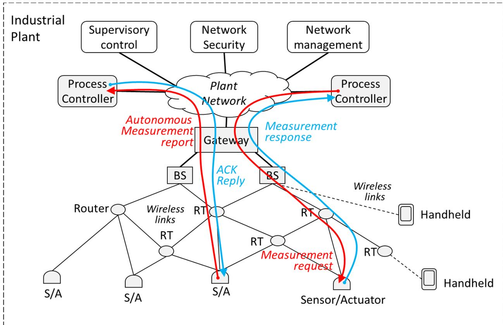
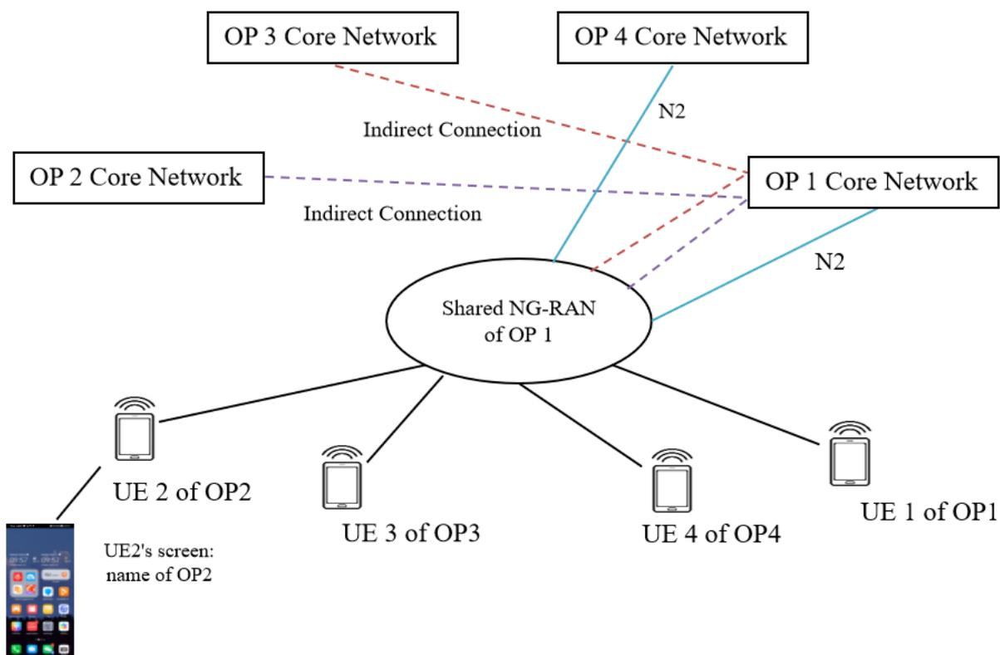
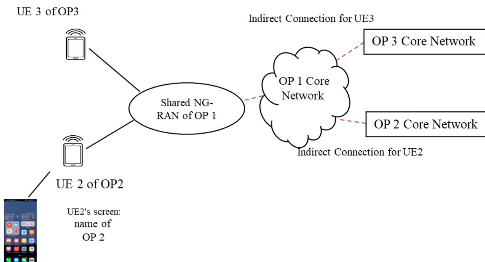

# 3GPP TS 22.261 V20.5.0 (2025-12)

---

*Technical Specification*

**3rd Generation Partnership Project;  
Technical Specification Group Services and System Aspects;  
Service requirements for the 5G system;  
Stage 1  
(Release 20)**

---


5G Advanced logo: The text '5G' in bold black with 'ADVANCED' in smaller black text to its right. Three green curved signal waves are above the text.


3GPP logo: Stylized '3GPP' text with three red curved signal waves below it. The text 'A GLOBAL INITIATIVE' is at the bottom.

---

Keywords

Fifth, Generation, 5G

***3GPP***

---

Postal address

---

3GPP support office address

650 Route des Lucioles - Sophia Antipolis  
Valbonne - FRANCE  
Tel.: +33 4 92 94 42 00 Fax: +33 4 93 65 47 16

---

Internet

<http://www.3gpp.org>

---

***Copyright Notification***

---

No part may be reproduced except as authorized by written permission.  
The copyright and the foregoing restriction extend to reproduction in all media.

©2025, 3GPP Organizational Partners (ARIB, ATIS, CCSA, ETSI, TSDSI, TTA, TTC).  
All rights reserved.

UMTS™ is a Trade Mark of ETSI registered for the benefit of its members

3GPP™ is a Trade Mark of ETSI registered for the benefit of its Members and of the 3GPP Organizational Partners

LTE™ is a Trade Mark of ETSI registered for the benefit of its Members and of the 3GPP Organizational Partners

GSM® and the GSM logo are registered and owned by the GSM Association

---

# Contents

|                                                   |    |
|---------------------------------------------------|----|
| Foreword                                          | 10 |
| Introduction                                      | 10 |
| 1 Scope                                           | 11 |
| 2 References                                      | 11 |
| 3 Definitions, symbols and abbreviations          | 13 |
| 3.1 Definitions                                   | 13 |
| 3.2 Abbreviations                                 | 18 |
| 4 Overview                                        | 19 |
| 5 High-level requirements                         | 20 |
| 5.1 Migration to 5G                               | 20 |
| 5.1.1 Description                                 | 20 |
| 5.1.2 Requirements                                | 20 |
| 5.1.2.1 Interworking between 5G systems           | 20 |
| 5.1.2.2 Legacy service support                    | 20 |
| 5.1.2.3 Interoperability with legacy 3GPP systems | 21 |
| 6 Basic capabilities                              | 21 |
| 6.1 Network slicing                               | 21 |
| 6.1.1 Description                                 | 21 |
| 6.1.2 Requirements                                | 21 |
| 6.1.2.1 General                                   | 21 |
| 6.1.2.2 Management                                | 22 |
| 6.1.2.3 Network slice constraints                 | 23 |
| 6.1.2.4 Cross-network slice coordination          | 23 |
| 6.2 Diverse mobility management                   | 24 |
| 6.2.1 Description                                 | 24 |
| 6.2.2 General requirements                        | 24 |
| 6.2.3 Service continuity requirements             | 24 |
| 6.2.4 Roaming related requirements                | 25 |
| 6.3 Multiple access technologies                  | 25 |
| 6.3.1 Description                                 | 25 |
| 6.3.2 Requirements                                | 25 |
| 6.3.2.1 General                                   | 25 |
| 6.3.2.2 E-UTRA access                             | 26 |
| 6.3.2.3 Satellite access                          | 26 |
| 6.3.2.4 Fixed broadband access                    | 26 |
| 6.4 Resource efficiency                           | 26 |
| 6.4.1 Description                                 | 26 |
| 6.4.2 Requirements                                | 27 |
| 6.4.2.1 General                                   | 27 |
| 6.4.2.2 Efficient bulk operations for IoT         | 27 |
| 6.4.2.3 Efficient management for IoT              | 27 |
| 6.4.2.4 Efficient control plane                   | 28 |
| 6.5 Efficient user plane                          | 28 |
| 6.5.1 Description                                 | 28 |
| 6.5.2 Requirements                                | 28 |
| 6.6 Efficient content delivery                    | 29 |
| 6.6.1 Description                                 | 29 |
| 6.6.2 Requirements                                | 29 |
| 6.7 Priority, QoS, and policy control             | 30 |
| 6.7.1 Description                                 | 30 |
| 6.7.2 Requirements                                | 31 |
| 6.8 Dynamic policy control                        | 31 |
| 6.9 Connectivity models                           | 31 |

|           |                                                                    |    |
|-----------|--------------------------------------------------------------------|----|
| 6.9.1     | Description                                                        | 31 |
| 6.9.2     | Requirements                                                       | 32 |
| 6.9.2.1   | General                                                            | 32 |
| 6.9.2.2   | Services and Service Continuity                                    | 32 |
| 6.9.2.3   | Permission and Authorization                                       | 33 |
| 6.9.2.4   | Relay UE Selection                                                 | 33 |
| 6.9.2.5   | Satellite and Relay UEs                                            | 33 |
| 6.9.3     | Requirements on direct device connection for Public Safety         | 33 |
| 6.10      | Network capability exposure                                        | 34 |
| 6.10.1    | Description                                                        | 34 |
| 6.10.2    | Requirements                                                       | 34 |
| 6.11      | Context-aware network                                              | 36 |
| 6.11.1    | Description                                                        | 36 |
| 6.11.2    | Requirements                                                       | 36 |
| 6.12      | Self backhaul                                                      | 37 |
| 6.12.1    | Description                                                        | 37 |
| 6.12.2    | Requirements                                                       | 37 |
| 6.13      | Flexible broadcast/multicast service                               | 37 |
| 6.13.1    | Description                                                        | 37 |
| 6.13.2    | Requirements                                                       | 37 |
| 6.14      | Subscription aspects                                               | 39 |
| 6.14.1    | Description                                                        | 39 |
| 6.14.2    | Requirements                                                       | 39 |
| 6.15      | Energy efficiency                                                  | 40 |
| 6.15.1    | Description                                                        | 40 |
| 6.15.2    | Requirements                                                       | 40 |
| 6.15a     | Energy Efficiency as a Service Criteria                            | 40 |
| 6.15a.1   | Description                                                        | 40 |
| 6.15a.2   | Energy related information as a service criteria                   | 40 |
| 6.15a.2.1 | Description                                                        | 40 |
| 6.15a.2.2 | Requirements                                                       | 41 |
| 6.15a.3   | Support of different energy states                                 | 42 |
| 6.15a.3.1 | Description                                                        | 42 |
| 6.15a.3.2 | Requirements                                                       | 42 |
| 6.15a.4   | Monitoring and measurement                                         | 42 |
| 6.15a.4.1 | Description                                                        | 42 |
| 6.15a.4.2 | Requirements                                                       | 43 |
| 6.15a.5   | Information exposure                                               | 43 |
| 6.15a.5.1 | Description                                                        | 43 |
| 6.15a.5.2 | Requirements                                                       | 43 |
| 6.15a.6   | Network actions leveraging energy efficiency as a service criteria | 45 |
| 6.15a.6.1 | Description                                                        | 45 |
| 6.15a.6.2 | Requirements                                                       | 45 |
| 6.16      | Markets requiring minimal service levels                           | 45 |
| 6.16.1    | Description                                                        | 45 |
| 6.16.2    | Requirements                                                       | 45 |
| 6.17      | Extreme long range coverage in low density areas                   | 46 |
| 6.17.1    | Description                                                        | 46 |
| 6.17.2    | Requirements                                                       | 46 |
| 6.18      | Multi-network connectivity and service delivery across operators   | 46 |
| 6.18.1    | Description                                                        | 46 |
| 6.18.2    | Requirements                                                       | 46 |
| 6.19      | 3GPP access network selection                                      | 47 |
| 6.19.1    | Description                                                        | 47 |
| 6.19.2    | Requirements                                                       | 47 |
| 6.20      | eV2X aspects                                                       | 47 |
| 6.20.1    | Description                                                        | 47 |
| 6.20.2    | Requirements                                                       | 48 |
| 6.21      | NG-RAN Sharing                                                     | 48 |
| 6.21.1    | Description                                                        | 48 |
| 6.21.2    | Requirements                                                       | 48 |
| 6.21.2.1  | General                                                            | 48 |

|          |                                                         |    |
|----------|---------------------------------------------------------|----|
| 6.21.2.2 | Indirect network sharing                                | 48 |
| 6.22     | Unified access control                                  | 50 |
| 6.22.1   | Description                                             | 50 |
| 6.22.2   | Requirements                                            | 50 |
| 6.22.2.1 | General                                                 | 50 |
| 6.22.2.2 | Access identities                                       | 51 |
| 6.22.2.3 | Access categories                                       | 51 |
| 6.23     | QoS monitoring                                          | 52 |
| 6.23.1   | Description                                             | 52 |
| 6.23.2   | Requirements                                            | 53 |
| 6.24     | Ethernet transport services                             | 55 |
| 6.24.1   | Description                                             | 55 |
| 6.24.2   | Requirements                                            | 55 |
| 6.25     | Non-public networks                                     | 55 |
| 6.25.1   | Description                                             | 55 |
| 6.25.2   | Requirements                                            | 56 |
| 6.25.3   | Groups of interconnected SNPNs                          | 57 |
| 6.25.4   | SNPN cellular hotspots                                  | 57 |
| 6.26     | 5G LAN-type service                                     | 57 |
| 6.26.1   | Description                                             | 57 |
| 6.26.2   | Requirements                                            | 58 |
| 6.26.2.1 | General                                                 | 58 |
| 6.26.2.2 | 5G LAN-virtual network (5G LAN-VN)                      | 58 |
| 6.26.2.3 | Creation and management                                 | 59 |
| 6.26.2.4 | Privacy                                                 | 59 |
| 6.26.2.5 | Traffic types                                           | 59 |
| 6.26.2.6 | Discovery                                               | 59 |
| 6.26.2.7 | (void)                                                  | 60 |
| 6.26.2.8 | Indirect communication mode                             | 60 |
| 6.26.2.9 | Service exposure                                        | 60 |
| 6.27     | Positioning services                                    | 60 |
| 6.27.1   | Description                                             | 60 |
| 6.27.2   | Requirements                                            | 60 |
| 6.28     | Cyber-physical control applications in vertical domains | 62 |
| 6.28.1   | Description                                             | 62 |
| 6.28.2   | Requirements                                            | 62 |
| 6.28.2.1 | General                                                 | 62 |
| 6.28.2.2 | Smart Grid                                              | 62 |
| 6.29     | Messaging aspects                                       | 63 |
| 6.29.1   | Description                                             | 63 |
| 6.29.2   | Requirements                                            | 63 |
| 6.30     | Steering of roaming                                     | 63 |
| 6.30.1   | Description                                             | 63 |
| 6.30.2   | Requirements                                            | 63 |
| 6.31     | Minimization of Service Interruption                    | 63 |
| 6.31.1   | Description                                             | 63 |
| 6.31.2   | Requirements                                            | 64 |
| 6.31.2.1 | General                                                 | 64 |
| 6.31.2.2 | Disaster Condition                                      | 64 |
| 6.31.2.3 | Disaster Roaming                                        | 64 |
| 6.32     | UAV aspects                                             | 65 |
| 6.32.1   | Description                                             | 65 |
| 6.32.2   | Requirements                                            | 65 |
| 6.33     | Video, imaging and audio for professional applications  | 65 |
| 6.33.1   | Description                                             | 65 |
| 6.33.2   | Requirements                                            | 65 |
| 6.34     | Critical medical applications                           | 65 |
| 6.34.1   | Description                                             | 65 |
| 6.34.2   | Requirements                                            | 66 |
| 6.35     | Service Function Chaining                               | 66 |
| 6.35.1   | Introduction                                            | 66 |
| 6.35.2   | General Requirements                                    | 66 |

|           |                                                                                       |    |
|-----------|---------------------------------------------------------------------------------------|----|
| 6.35.3    | Service Function Management                                                           | 67 |
| 6.36      | 5G Timing Resiliency                                                                  | 67 |
| 6.36.1    | Overview                                                                              | 67 |
| 6.36.2    | General                                                                               | 67 |
| 6.36.3    | Monitoring and Reporting                                                              | 67 |
| 6.36.4    | Service Exposure                                                                      | 68 |
| 6.37      | Ranging based services                                                                | 68 |
| 6.37.1    | Description                                                                           | 68 |
| 6.37.2    | Requirements                                                                          | 68 |
| 6.38      | Personal IoT Networks and Customer Premises Networks                                  | 69 |
| 6.38.1    | Description                                                                           | 69 |
| 6.38.2    | Requirements                                                                          | 70 |
| 6.38.2.1  | General                                                                               | 70 |
| 6.38.2.2  | Gateways                                                                              | 71 |
| 6.38.2.3  | Operation without 5G core network connectivity                                        | 71 |
| 6.38.2.4  | Discovery                                                                             | 71 |
| 6.38.2.5  | Relay Selection                                                                       | 72 |
| 6.38.2.6  | Security                                                                              | 72 |
| 6.38.2.7  | QoS                                                                                   | 72 |
| 6.38.2.8  | Charging                                                                              | 72 |
| 6.38.2.9  | Creation and Management                                                               | 73 |
| 6.39      | 5G IMS Multimedia Telephony Service                                                   | 74 |
| 6.39.1    | Description                                                                           | 74 |
| 6.39.2    | General                                                                               | 74 |
| 6.39.3    | Service Exposure                                                                      | 74 |
| 6.40      | AI/ML model transfer in 5GS                                                           | 75 |
| 6.40.1    | Description                                                                           | 75 |
| 6.40.2    | Requirements                                                                          | 75 |
| 6.40.2.1  | Requirements for direct network connection                                            | 75 |
| 6.40.2.2  | Requirements for direct device connection                                             | 76 |
| 6.41      | Providing Access to Local Services                                                    | 77 |
| 6.41.1    | Description                                                                           | 77 |
| 6.41.2    | Requirements                                                                          | 77 |
| 6.41.2.1  | General                                                                               | 77 |
| 6.41.2.2  | Configuration of Localized Services in Hosting Network                                | 77 |
| 6.41.2.3  | User Manual Selection of Localized Services via Hosting Network                       | 78 |
| 6.41.2.4  | UE Configuration, Provisioning, Authentication and Authorization                      | 78 |
| 6.41.2.5  | UE Discovery, Selection and Access                                                    | 79 |
| 6.41.2.6  | Hosting Network Localized Services and Home Operator Services                         | 79 |
| 6.41.2.7  | Returning to Home Network                                                             | 80 |
| 6.41.2.8  | Charging                                                                              | 80 |
| 6.41.2.9  | Regulatory Services                                                                   | 80 |
| 6.41.2.10 | Multicast/Broadcast                                                                   | 80 |
| 6.42      | Mobile base station relays                                                            | 80 |
| 6.42.1    | Description                                                                           | 80 |
| 6.42.2    | Requirements                                                                          | 81 |
| 6.43      | Tactile and multi-modal communication service                                         | 82 |
| 6.43.1    | Description                                                                           | 82 |
| 6.43.2    | Requirements                                                                          | 83 |
| 6.44      | Roaming value-added services                                                          | 84 |
| 6.44.1    | Description                                                                           | 84 |
| 6.44.1.1  | Overview                                                                              | 84 |
| 6.44.1.2  | Welcome SMS                                                                           | 84 |
| 6.44.1.3  | Steering of Roaming (SoR) during the registration                                     | 84 |
| 6.44.1.4  | Subscription-based routing to a particular core network (e.g. in a different country) | 84 |
| 6.44.2    | Requirements                                                                          | 84 |
| 6.44.2.1  | Welcome SMS                                                                           | 84 |
| 6.44.2.3  | Subscription-based routing to a particular core network (e.g. in a different country) | 85 |
| 6.45      | Support of Roaming services providers                                                 | 85 |
| 6.45.1    | Overview                                                                              | 85 |
| 6.45.2    | Requirements                                                                          | 85 |
| 6.46      | Satellite access                                                                      | 86 |

|           |                                                                     |           |
|-----------|---------------------------------------------------------------------|-----------|
| 6.46.1    | Overview                                                            | 86        |
| 6.46.2    | General                                                             | 86        |
| 6.46.3    | Service continuity                                                  | 87        |
| 6.46.4    | Roaming aspects                                                     | 87        |
| 6.46.5    | Resource efficiency                                                 | 87        |
| 6.46.6    | Efficient user plane                                                | 88        |
| 6.46.7    | Satellite and Relay UEs                                             | 88        |
| 6.46.8    | Store and Forward Satellite Operation                               | 88        |
| 6.46.8.1  | Description                                                         | 88        |
| 6.46.8.2  | Requirements                                                        | 88        |
| 6.46.9    | UE-Satellite-UE communication                                       | 89        |
| 6.46.10   | Positioning aspects for satellite access                            | 89        |
| 6.46.11   | IMS voice using GEO satellite access                                | 89        |
| 6.46.12   | Multi-orbit                                                         | 90        |
| 6.46.12.1 | Description                                                         | 90        |
| 6.46.12.2 | Requirements                                                        | 90        |
| 6.46.12.3 | Requirements related to mobile base station relays                  | 90        |
| 6.47      | 5G wireless sensing service                                         | 91        |
| 6.47.1    | Description                                                         | 91        |
| 6.47.2    | Requirements                                                        | 91        |
| 6.48      | Ambient power-enabled IoT                                           | 91        |
| 6.48.1    | Description                                                         | 91        |
| 6.48.2    | Requirements                                                        | 91        |
| 6.49      | Mobile Metaverse Services                                           | 91        |
| 6.49.1    | Description                                                         | 91        |
| 6.49.2    | Requirements                                                        | 91        |
| 6.50      | Traffic steering and switching over two 3GPP access networks        | 92        |
| 6.50.1    | Introduction                                                        | 92        |
| 6.50.2    | Requirements                                                        | 92        |
| 6.50.2.1  | General                                                             | 92        |
| 6.50.2.2  | Mobility and connectivity changes                                   | 93        |
| 6.50.2.3  | Other aspects                                                       | 93        |
| 6.51      | Monitoring of network elements interactions in 5G                   | 93        |
| 6.51.1    | Overview                                                            | 93        |
| 6.51.2    | Requirements                                                        | 93        |
| <b>7</b>  | <b>Performance requirements</b>                                     | <b>94</b> |
| 7.1       | High data rates and traffic densities                               | 94        |
| 7.2       | Low latency and high reliability                                    | 95        |
| 7.2.1     | Overview                                                            | 95        |
| 7.2.2     | Scenarios and KPIs                                                  | 95        |
| 7.2.3     | Other requirements                                                  | 96        |
| 7.2.3.1   | (void)                                                              | 96        |
| 7.2.3.2   | Wireless road-side infrastructure backhaul                          | 96        |
| 7.3       | High-accuracy positioning                                           | 99        |
| 7.3.1     | Description                                                         | 99        |
| 7.3.2     | Requirements                                                        | 99        |
| 7.3.2.1   | General                                                             | 99        |
| 7.3.2.2   | Requirements for horizontal and vertical positioning service levels | 99        |
| 7.3.2.3   | Other performance requirements                                      | 101       |
| 7.4       | KPIs for a 5G system with satellite access                          | 101       |
| 7.4.1     | Description                                                         | 101       |
| 7.4.2     | Requirements                                                        | 101       |
| 7.5       | High-availability IoT traffic                                       | 102       |
| 7.5.1     | Description                                                         | 102       |
| 7.5.2     | Requirements                                                        | 104       |
| 7.6       | High data rate and low latency                                      | 105       |
| 7.6.1     | AR/VR                                                               | 105       |
| 7.7       | KPIs for UE to network relaying in 5G system                        | 106       |
| 7.8       | KPIs for 5G Timing Resiliency                                       | 107       |
| 7.9       | KPIs for ranging based services                                     | 108       |
| 7.10      | KPIs for AI/ML model transfer in 5GS                                | 111       |
| 7.10.1    | KPI requirement for direct network connection                       | 111       |

|                                                                                              |                                                              |            |
|----------------------------------------------------------------------------------------------|--------------------------------------------------------------|------------|
| 7.10.2                                                                                       | KPI requirement for direct device connection                 | 113        |
| 7.11                                                                                         | KPIs for tactile and multi-modal communication service       | 114        |
| 7.12                                                                                         | KPIs for direct device connection for Public Safety          | 117        |
| 8                                                                                            | Security                                                     | 118        |
| 8.1                                                                                          | Description                                                  | 118        |
| 8.2                                                                                          | General                                                      | 118        |
| 8.3                                                                                          | Authentication                                               | 119        |
| 8.4                                                                                          | Authorization                                                | 120        |
| 8.5                                                                                          | Identity management                                          | 120        |
| 8.6                                                                                          | Regulatory                                                   | 121        |
| 8.7                                                                                          | Fraud protection                                             | 121        |
| 8.8                                                                                          | Resource efficiency                                          | 121        |
| 8.9                                                                                          | Data security and privacy                                    | 121        |
| 8.10                                                                                         | 5G Timing Resiliency                                         | 122        |
| 9                                                                                            | Charging aspects                                             | 122        |
| 9.0                                                                                          | Introduction                                                 | 122        |
| 9.1                                                                                          | General                                                      | 122        |
| 9.2                                                                                          | 5G LAN-type service                                          | 123        |
| 9.3                                                                                          | 5G Timing Resiliency                                         | 123        |
| 9.4                                                                                          | Satellite Access                                             | 123        |
| 9.5                                                                                          | Energy efficiency as a Service Criteria                      | 123        |
| 9.6                                                                                          | NG-RAN Sharing                                               | 124        |
| 9.7                                                                                          | Minimization of Service Interruption                         | 124        |
| 9.8                                                                                          | Personal IoT Networks and Customer Premises Networks         | 124        |
| 9.9                                                                                          | AI/ML model transfer in 5GS                                  | 124        |
| 9.10                                                                                         | Providing Access to Local Services                           | 124        |
| 9.11                                                                                         | Mobile base station relays                                   | 124        |
| 9.12                                                                                         | 5G wireless sensing service                                  | 124        |
| 9.13                                                                                         | Ambient power-enabled IoT                                    | 124        |
| 9.14                                                                                         | Mobile Metaverse Services                                    | 124        |
| 9.15                                                                                         | Traffic steering and switching over two 3GPP access networks | 124        |
| <b>Annex A (informative): Void</b>                                                           |                                                              | <b>126</b> |
| <b>Annex B (informative): Void</b>                                                           |                                                              | <b>126</b> |
| <b>Annex C (informative): Relation of communication service availability and reliability</b> |                                                              | <b>127</b> |
| <b>Annex D (informative): Critical-communication use cases</b>                               |                                                              | <b>128</b> |
| D.1                                                                                          | Factory automation – motion control                          | 128        |
| D.1.0                                                                                        | General                                                      | 128        |
| D.1.1                                                                                        | Service area and connection density                          | 129        |
| D.1.2                                                                                        | Security                                                     | 129        |
| D.2                                                                                          | Factory automation – other use cases                         | 130        |
| D.2.0                                                                                        | General                                                      | 130        |
| D.2.1                                                                                        | Service area and connection density                          | 131        |
| D.2.2                                                                                        | Security                                                     | 131        |
| D.3                                                                                          | Process automation                                           | 132        |
| D.3.0                                                                                        | General                                                      | 132        |
| D.3.1                                                                                        | Remote control                                               | 132        |
| D.3.2                                                                                        | Process and asset monitoring                                 | 132        |
| D.3.3                                                                                        | Service area                                                 | 132        |
| D.4                                                                                          | Electric-power distribution and smart grid                   | 133        |
| D.4.0                                                                                        | General                                                      | 133        |
| D.4.1                                                                                        | Medium voltage                                               | 133        |
| D.4.1.0                                                                                      | Overview                                                     | 133        |
| D.4.1.1                                                                                      | Service area and connection density                          | 134        |
| D.4.1.2                                                                                      | Security                                                     | 134        |

|                                                                                                                        |                                                                                          |            |
|------------------------------------------------------------------------------------------------------------------------|------------------------------------------------------------------------------------------|------------|
| D.4.2                                                                                                                  | High voltage                                                                             | 134        |
| D.4.2.0                                                                                                                | Overview                                                                                 | 134        |
| D.4.2.1                                                                                                                | Service area and connection density                                                      | 135        |
| D.4.2.2                                                                                                                | Security                                                                                 | 135        |
| D.5                                                                                                                    | Intelligent transport systems – infrastructure backhaul                                  | 135        |
| D.5.0                                                                                                                  | General                                                                                  | 135        |
| D.5.1                                                                                                                  | Service area and connection density                                                      | 136        |
| <b>Annex E (informative): (void) </b>                                                                                  |                                                                                          | <b>137</b> |
| <b>Annex F (informative): QoS Monitoring </b>                                                                          |                                                                                          | <b>137</b> |
| F.1                                                                                                                    | QoS monitoring for assurance                                                             | 137        |
| F.2                                                                                                                    | Network Diagnostics                                                                      | 138        |
| <b>Annex G (informative): Asset Tracking use cases </b>                                                                |                                                                                          | <b>138</b> |
| G.1                                                                                                                    | Asset Tracking                                                                           | 138        |
| G.2                                                                                                                    | Battery life expectancy and message size to support example use cases for asset tracking | 138        |
| <b>Annex H (informative): Interworking between Network Operators and Application Providers for localized services </b> |                                                                                          | <b>139</b> |
| <b>Annex I (informative): Indirect Network Sharing of NG-RAN Sharing </b>                                              |                                                                                          | <b>142</b> |
| <b>Annex J (informative): Store and Forward Satellite operation </b>                                                   |                                                                                          | <b>144</b> |
| <b>Annex K (informative): Change history </b>                                                                          |                                                                                          | <b>146</b> |

---

# Foreword

This Technical Specification has been produced by the 3<sup>rd</sup> Generation Partnership Project (3GPP).

The contents of the present document are subject to continuing work within the TSG and may change following formal TSG approval. Should the TSG modify the contents of the present document, it will be re-released by the TSG with an identifying change of release date and an increase in version number as follows:

Version x.y.z

where:

- x the first digit:
  - 1 presented to TSG for information;
  - 2 presented to TSG for approval;
  - 3 or greater indicates TSG approved document under change control.
- y the second digit is incremented for all changes of substance, i.e. technical enhancements, corrections, updates, etc.
- z the third digit is incremented when editorial only changes have been incorporated in the document.

---

# Introduction

The need to support different kinds of UEs (e.g. for the Internet of Things (IoT)), services, and technologies is driving the technology revolution to a high-performance and highly efficient 3GPP system. The drivers include IoT, Virtual Reality (VR), industrial control, ubiquitous on-demand coverage, as well as the opportunity to meet customized market needs. These drivers require enhancements to the devices, services, and technologies well established by 3GPP. The key objective with the 5G system is to be able to support new deployment scenarios to address diverse market segments.

This document compiles requirements that define a 5G system.

The 5G system is characterised, for example, by:

- Support for multiple access technologies
- Scalable and customizable network
- Advanced Key Performance Indicators (KPIs) (e.g. availability, latency, reliability, user experienced data rates, area traffic capacity)
- Flexibility and programmability (e.g. network slicing, diverse mobility management, Network Function Virtualization)
- Resource efficiency (both user plane and control plane)
- Seamless mobility in densely populated and heterogeneous environment
- Support for real time and non-real time multimedia services and applications with advanced Quality of Experience (QoE)

---

# 1 Scope

The present document describes the service and operational requirements for a 5G system, including a UE, NG-RAN, and 5G Core network. Requirements for a 5G E-UTRA-NR Dual Connectivity in E-UTRAN connected to EPC are found in TS 22.278 [5].

---

# 2 References

The following documents contain provisions which, through reference in this text, constitute provisions of the present document.

- References are either specific (identified by date of publication, edition number, version number, etc.) or non-specific.
- For a specific reference, subsequent revisions do not apply.
- For a non-specific reference, the latest version applies. In the case of a reference to a 3GPP document (including a GSM document), a non-specific reference implicitly refers to the latest version of that document *in the same Release as the present document*.

- [1] 3GPP TR 21.905: "Vocabulary for 3GPP Specifications".
- [2] NGMN 5G White Paper v1.0, February 2015.
- [3] 3GPP TS 22.011: "Service accessibility".
- [4] Void
- [5] 3GPP TS 22.278: "Service requirements for the Evolved Packet System (EPS)".
- [6] 3GPP TS 22.101: "Service aspects; Service principles".
- [7] 3GPP TS 22.146: "Multimedia Broadcast/Multicast Service (MBMS)".
- [8] 3GPP TS 22.246: "Multimedia Broadcast/Multicast Service (MBMS) user services".
- [9] 3GPP TS 22.186: "Enhancement of 3GPP support for V2X scenarios".
- [10] NGMN, "Recommendations for NGMN KPIs and Requirements for 5G", June 2016
- [11] 3GPP TS 22.115: "Service aspects; Charging and billing".
- [12] Void
- [13] Soriano, R., Alberto, M., Collazo, J., Gonzales, I., Kupzo, F., Moreno, L., & Lorenzo, J. OpenNode. Open Architecture for Secondary Nodes of the Electricity Smartgrid. In Proceedings CIRED 2011 21st International Conference on Electricity Distribution, CD1. June 2011.
- [14] North American Electric Reliability Council. Frequently Asked Questions (FAQs) Cyber Security Standards CIP-002-1 through CIP-009-1. Available: [http://www.nerc.com/docs/standards/sar/Revised\\_CIP-002-009\\_FAQs\\_06Mar06.pdf](http://www.nerc.com/docs/standards/sar/Revised_CIP-002-009_FAQs_06Mar06.pdf). 2006.
- [15] McTaggart, Craig, et al. "Improvements in power system integrity protection schemes". Developments in Power System Protection (DPSP 2010). Managing the Change, 10th IET International Conference on. IET, 2010.
- [16] IEEE Power Engineering Society – Power System Relaying Committee – System Protection Subcommittee Working Group C-6. Wide Area Protection and Emergency Control.
- [17] Begovic, Miroslav, et al. "Wide-area protection and emergency control". Proceedings of the IEEE 93.5, pp. 876-891, 2005.

- [18] ITU-T Recommendation G.1000 "Communications quality of service: A framework and definitions".
- [19] IEC 61907, "Communication network dependability engineering".
- [20] NIST, "Framework for Cyber-Physical Systems", 2016.
- [21] 3GPP TS 22.104: "Service requirements for cyber-physical control applications in vertical domains".
- [22] 3GPP TS 22.262: "Message Service within the 5G System".
- [23] 3GPP TS 22.289: "Mobile Communication System for Railways".
- [24] 3GPP TS 22.071: "Location Services".
- [25] 3GPP TS 23.122: "Non-Access-Stratum (NAS) functions related to Mobile Station (MS) in idle mode".
- [26] 3GPP TS 22.125: "Unmanned Aerial System (UAS) support in 3GPP".
- [27] Void
- [28] 3GPP TS 22.263: "Service requirements for Video, Imaging and Audio for Professional Applications (VIAPA)".
- [29] Void
- [30] 3GPP TS 22.179: "Mission Critical Push to Talk (MCPTT)".
- [31] IEEE 1588-2019, IEEE Standard for a Precision Clock Synchronization Protocol for Networked Measurement and Control Systems.
- [32] IEC 61850-9-3-2016 - IEC/IEEE International Standard - Communication networks and systems for power utility automation – Part 9-3: Precision time protocol profile for power utility automation.
- [33] 3GPP TS 38.305: "NG Radio Access Network (NG-RAN); Stage 2 functional specification of User Equipment (UE) positioning in NG-RAN"
- [34] ATIS-0900005: "Technical Report on GPS Vulnerability",  
[https://access.atis.org/apps/group\\_public/download.php/36304/ATIS-0900005.pdf](https://access.atis.org/apps/group_public/download.php/36304/ATIS-0900005.pdf)
- [35] European Commission, Regulatory Technical Standard 25. Level of accuracy of business clocks  
[https://ec.europa.eu/finance/securities/docs/isd/mifid/rts/160607-rts-25\\_en.pdf](https://ec.europa.eu/finance/securities/docs/isd/mifid/rts/160607-rts-25_en.pdf) (annex  
[https://ec.europa.eu/finance/securities/docs/isd/mifid/rts/160607-rts-25-annex\\_en.pdf](https://ec.europa.eu/finance/securities/docs/isd/mifid/rts/160607-rts-25-annex_en.pdf))
- [36] 5G-ACIA, "Exposure of 5G capabilities for Connected Industries and Automation Applications", 5G-ACIA white paper, February 2021, [https://5g-acia.org/wp-content/uploads/2021/04/5G-ACIA\\_ExposureOf5GCapabilitiesForConnectedIndustriesAndAutomationApplications.pdf](https://5g-acia.org/wp-content/uploads/2021/04/5G-ACIA_ExposureOf5GCapabilitiesForConnectedIndustriesAndAutomationApplications.pdf)
- [37] 3GPP TS 22.173: "IP Multimedia Core Network Subsystem (IMS) Multimedia Telephony Service and supplementary services".
- [38] ITU-T, "Technology Watch Report: The Tactile Internet", August 2014.
- [39] D. Soldani, Y. Guo, B. Barani, P. Mogensen, I. Chih-Lin, S. Das, "5G for ultra-reliable low-latency communications". *IEEE Network*. 2018 Apr 2; 32(2):6-7.
- [40] O. Holland et al., "The IEEE 1918.1 "Tactile Internet" Standards Working Group and its Standards," *Proceedings of the IEEE*, vol. 107, no. 2, Feb. 2019.
- [41] Altinsoy, M. E., Blauert, J., & Treier, C., "Inter-Modal Effects of Non-Simultaneous Stimulus Presentation," A. Alippi (Ed.), *Proceedings of the 7th International Congress on Acoustics*, Rome, Italy, 2001.
- [42] Hirsh I.J., and Sherrick C.E, 1961. *J. Exp. Psychol* 62, 423-432

- [43] Altinsoy, M.E. (2012). "The Quality of Auditory-Tactile Virtual Environments," Journal of the Audio Engineering Society, Vol. 60, No. 1/2, pp. 38-46, Jan.-Feb. 2012.
- [44] M. Di Luca and A. Mahnan, "Perceptual Limits of Visual-Haptic Simultaneity in Virtual Reality Interactions," 2019 IEEE World Haptics Conference (WHC), 2019, pp. 67-72, doi: 10.1109/WHC.2019.8816173.
- [45] K. Antonakoglou et al., "Toward Haptic Communications Over the 5G Tactile Internet", IEEE Communications Surveys & Tutorials, 20 (4), 2018.
- [46] ETSI GS OEU 020 (v1.1.1): "Operational energy Efficiency for Users (OEU); Carbon equivalent Intensity measurement; Operational infrastructures; Global KPIs; Global KPIs for ICT Sites".
- [47] 3GPP TS 28.310: "Management and orchestration; Energy efficiency of 5G".
- [48] ETSI EN 303 472: "Environmental Engineering (EE); Energy Efficiency measurement methodology and metrics for RAN equipment".
- [49] 3GPP TS 32.299: " Telecommunication management; Charging management; Diameter charging applications".
- [50] N. Nonaka et al., "Experimental Trial aboard Shinkansen Test Train Running at 360 km/h for 5G Evolution," 2022 IEEE 95th Vehicular Technology Conference: (VTC2022-Spring), Helsinki, Finland, 2022.
- [51] 3GPP TS 22.137: " Service requirements for Integrated Sensing and Communication ".
- [52] 3GPP TS 22.369: " Service requirements for Ambient power-enabled IoT ".
- [53] 3GPP TS 22.156: "Mobile Metaverse Services".
- [54] IEEE Std 802.1Q: "IEEE Standard for Local and Metropolitan Area Networks---Bridges and Bridged Networks".
- [55] [3GPP TS 22.228](#): "Service requirements for the Internet Protocol (IP) Multimedia core network Subsystem ".
- [56] ITU-T E.800: "Definitions of terms related to quality of service".
- [57] <https://www.ncbi.nlm.nih.gov/pmc/articles/PMC8177735/>.

---

## 3 Definitions, symbols and abbreviations

### 3.1 Definitions

For the purposes of the present document, the terms and definitions given in 3GPP TR 21.905 [1] and the following apply. A term defined in the present document takes precedence over the definition of the same term, if any, in 3GPP TR 21.905 [1].

**5G enhanced positioning area:** a subset of the 5G positioning service area that is assumed to be provided with additional infrastructure or deploy a particular set of positioning technologies to enhance positioning services.

NOTE 1: The enhanced positioning service area represents for example a factory plant, a dense urban area, an area along a road or railway track, a tunnel and covers both indoor and outdoor environments.

**5G LAN-type service:** a service over the 5G system offering private communication using IP and/or non-IP type communications.

**5G LAN-virtual network:** a virtual network capable of supporting 5G LAN-type service.

**5G satellite access network:** 5G access network using at least one satellite.

**5G positioning service area:** a service area where positioning services would solely rely on infrastructures and positioning technologies that can be assumed to be present anywhere where 5G is present (e.g. a country-wide operator-supplied 5G network, GNSS, position/motion sensors).

NOTE 2: This includes both indoor and any outdoor environments.

**active communication:** a UE is in active communication when it has one or more connections established. A UE may have any combination of PS connections (e.g. PDP contexts, active PDN connections).

**activity factor:** percentage value of the amount of simultaneous active UEs to the total number of UEs where active means the UEs are exchanging data with the network.

**Ambient IoT device:** An ambient power-enabled Internet of Things device is an IoT device powered by energy harvesting, being either battery-less or with limited energy storage capability (e.g., using a capacitor).

**aggregated QoS:** QoS requirement(s) that apply to the traffic of a group of UEs.

**area traffic capacity:** total traffic throughput served per geographic area.

**authorised administrator:** a user or other entity authorised to partially configure and manage a network node in a CPN (e.g. a PRAS, or eRG) or a PIN element in a PIN.

**carbon emission:** quantity of equivalent carbon dioxide emitted (e.g. kg of CO<sub>2</sub> equivalent).

**carbon intensity:** quantity of CO<sub>2</sub> equivalent emission per unit of final energy consumption for an operational period of use. [46]

**communication service availability:** percentage value of the amount of time the end-to-end communication service is delivered according to a specified QoS, divided by the amount of time the system is expected to deliver the end-to-end service.

NOTE 3: The end point in "end-to-end" is the communication service interface.

NOTE 4: The communication service is considered unavailable if it does not meet the pertinent QoS requirements. For example, the communication service is unavailable if a message is not correctly received within a specified time, which is the sum of maximum allowed end-to-end latency and survival time.

**Customer Premises Network:** a network located within a premise (e.g. a residence, office or shop), which is owned, installed and/or (at least partially) configured by the customer of a public network operator.

**direct device connection:** the connection between two UEs without any network entity in the middle.

**direct network connection:** one mode of network connection, where there is no relay UE between a UE and the 5G network.

**Disaster Condition:** This is the condition that a government decides when to initiate and terminate, e.g. a natural disaster. When this condition applies, users may have the opportunity to mitigate service interruptions and failures.

**Disaster Inbound Roamer:** A user that (a) cannot get service from the PLMN it would normally be served by, due to failure of service during a Disaster Condition, and (b) is able to register with other PLMNs.

**Disaster Roaming:** This is the special roaming policy that applies during a Disaster Condition.

**DualSteer device:** A device supporting traffic steering and switching of user data (for different services) across two 3GPP access networks; it can be a single UE, in case of non-simultaneous data transmission over the two networks, or two separate UEs in case of simultaneous data transmission over the two networks.

**end-to-end latency:** the time that it takes to transfer a given piece of information from a source to a destination, measured at the communication interface, from the moment it is transmitted by the source to the moment it is successfully received at the destination.

**energy availability:** the remaining amount of energy (e.g. in kWh) locally available for consumption. For devices, network elements and functions, energy availability may be limited and/or intermittent, in particular when relying on batteries and/or renewable energy sources (e.g. off-grid base stations, satellites etc) or during power grid heavy load or disruptions.

**energy capacity:** the maximum amount of energy (e.g. in kWh) that can be locally available for consumption (either locally produced and/or stored) by a device or a network element or function.

**energy charging rate:** a means of determining the energy consumption consequence (use of energy credit) associated with charging events.

**energy credit:** a quantity of energy credit associated with the subscriber that can be used for credit control by the 5G system.

**energy rationing:** A situation in which the availability of energy either across the network or at a particular network element or function is limited or reduced.

**energy-related characteristics:** information which characterize the energy to power the operator's network in terms of energy consumption, energy supply mix, carbon footprint, energy capacity and availability conditions.

NOTE: Which energy-related characteristics are relevant depends on the scenario.

**energy state:** state of a cell, a network element and/or a network function with respect to energy, e.g. (not) energy saving states, which are defined in TS 28.310 [47].

**energy supply mix:** the combination of the various energy sources (i.e. renewable and not) used to meet energy needs of a device or a network element or function.

**evolved Residential Gateway:** a gateway between the public operator network (fixed/mobile/cable) and a customer premises network.

**holdover:** A clock A, previously synchronized/syntonized to another clock B (normally a primary reference or a Master Clock) but whose frequency is determined in part using data acquired while it was synchronized/syntonized to B, is said to be in holdover or in the holdover mode as long as it is within its accuracy requirements.

NOTE 4a: holdover is defined in [31]

**Holdover time:** the time period that is available to repair the first priority timing source when it is lost (e.g., when the primary GNSS reference is lost). During this period the synchronization accuracy requirement should be guaranteed, e.g., by means of defining multiple synchronization references.

**Hosted Service:** a service containing the operator's own application(s) and/or trusted third-party application(s) in the Service Hosting Environment, which can be accessed by the user.

**Hosting NG-RAN Operator:** the operator that has operational control of a Shared NG-RAN.

NOTE 4b: Hosting NG-RAN Operator is a Hosting RAN Operator.

**Hosting RAN Operator:** as defined in 3GPP TS 22.101 [6].

**hybrid access:** access consisting of multiple different access types combined, such as fixed wireless access and wireline access.

**indirect network connection:** one mode of network connection, where there is a relay UE between a UE and the 5G network.

**Indirect Network Sharing:** a type of NG-RAN Sharing in which the communication between the Shared NG-RAN and the Participating Operator's core network is routed through the Hosting NG-RAN Operator's core network.

**IoT device:** a type of UE which is dedicated for a set of specific use cases or services and which is allowed to make use of certain features restricted to this type of UEs.

NOTE 5: An IoT device may be optimized for the specific needs of services and application being executed (e.g. smart home/city, smart utilities, e-Health and smart wearables). Some IoT devices are not intended for human type communications.

**maximum energy consumption:** a policy establishing an upper bound on the quantity of energy consumption [47] by the 5G system in a specific period of time, or space, e.g. energy consumption inside a given service area.

**maximum energy credit limit:** a policy establishing an upper bound on the aggregate quantity of energy consumption by the 5G system to provide services to a specific subscriber, e.g. in kilowatt hours.

**NOTE:** The terms maximum energy credit limit is distinct from 'maximum energy consumption' because the credit limit is a total amount of energy consumed, where maximum energy consumption is a limit to the consumption in a given interval of time.

**network slice:** a set of network functions and corresponding resources necessary to provide the required telecommunication services and network capabilities.

**NG-RAN:** a radio access network connecting to the 5G core network which uses NR, E-UTRA, or both.

**NG-RAN Sharing:** the sharing of NG-RAN among a number of operators.

**non-public network:** a network that is intended for non-public use.

**NR:** the new 5G radio access technology.

**Participating NG-RAN Operator:** authorized operator that is using Shared NG-RAN resources provided by a Hosting NG-RAN Operator.

**NOTE 5a:** Participating NG-RAN Operator is a Participating Operator.

**Participating Operator:** as defined in 3GPP TS 22.101 [6].

**Personal IoT Network:** A configured and managed group of at least one UE PIN Element and one or more PIN Element that communicate with each other.

**PIN Element:** UE or non-3GPP device that can communicate within a PIN.

**PIN direct connection:** the connection between two PIN Elements without any 3GPP RAN or core network entity in the middle.

**NOTE 5A:** A PIN direct connection could internally be relayed by other PIN Elements.

**NOTE 5B:** When a PIN direct connection is between two PIN Elements that are UEs this direct connection is typically known as a direct device connection.

**PIN Element with Gateway Capability:** a UE PIN Element that has the ability to provide connectivity to and from the 5G network for other PIN Elements.

**NOTE 5C:** A PIN Element can have both PIN management capability and Gateway Capability.

**PIN Element with Management Capability:** A PIN Element with capability to manage the PIN.

**positioning service availability:** percentage value of the amount of time the positioning service is delivering the required position-related data within the performance requirements, divided by the amount of time the system is expected to deliver the positioning service according to the specification in the targeted service area.

**proximity-based work task offloading:** a relay UE receives data from a remote UE via direct device connection and performs calculation of a work task for the remote UE. The calculation result can be further sent to network server.

**positioning service latency:** time elapsed between the event that triggers the determination of the position-related data and the availability of the position-related data at the system interface.

**Premises Radio Access Station:** a base station installed at a customer premises network.

**priority service:** a service that requires priority treatment based on regional/national or operator policies.

**private communication:** a communication between two or more UEs belonging to a restricted set of UEs.

**private network:** an isolated network deployment that does not interact with a public network.

**private slice:** a dedicated network slice deployment for the sole use by a specific third-party.

**ProSe UE-to-UE Relay:** a Public Safety ProSe-enabled UE that acts as a relay between two other Public Safety ProSe-enabled UEs.

**Ranging:** refers to the determination of the distance between two UEs and/or the direction of one UE from the other one via direct device connection.

**relative positioning:** relative positioning is to estimate position relatively to other network elements or relatively to other UEs.

**reliability:** in the context of network layer packet transmissions, percentage value of the packets successfully delivered to a given system entity within the time constraint required by the targeted service out of all the packets transmitted.

**renewable energy:** energy from renewable sources as energy from renewable non-fossil sources, namely wind, solar, aerothermal, geothermal, hydrothermal and ocean energy, hydropower, biomass, landfill gas, sewage treatment plant gas and biogases

NOTE 2: This definition was taken from [48].

**Resilient Notification Service:** a highly reliable service that delivers notifications directly to user devices, such as smartphones, when in poor conditions in satellite access

**satellite:** a space-borne vehicle embarking a bent pipe payload or a regenerative payload telecommunication transmitter, placed into Low-Earth Orbit (LEO) typically at an altitude between 300 km to 1 500 km, Medium-Earth Orbit (MEO) typically at an altitude between 7 000 to 25 000 km, or Geostationary satellite Earth Orbit (GEO) at 35 786 km altitude.

**satellite access:** direct connectivity between the UE and the satellite.

**satellite NG-RAN:** a NG-RAN which uses NR in providing satellite access to UEs.

**service area:** geographic region where a 3GPP communication service is accessible.

NOTE 6: The service area can be indoors.

NOTE 7: For some deployments, e.g. in process industry, the vertical dimension of the service area can be considerable.

**service continuity:** the uninterrupted user experience of a service that is using an active communication when a UE undergoes an access change without, as far as possible, the user noticing the change.

NOTE 8: In particular service continuity encompasses the possibility that after a change the user experience is maintained by a different telecommunication service (e.g. tele- or bearer service) than before the change.

NOTE 9: Examples of access changes include the following. For EPS: CS/PS domain change. For EPS and 5G: radio access change, switching between a direct network connection and an indirect network connection.

**Service Hosting Environment:** the environment, located inside of 5G network and fully controlled by the operator, where Hosted Services are offered from.

**serving satellite:** a satellite providing the satellite access to an UE. In the case of NGSO, the serving satellite is always changing due to the nature of the satellite constellation.

**Shared NG-RAN:** as defined in 3GPP TS 22.101 [6].

NOTE: Shared NG-RAN can be a shared satellite NG-RAN.

**Stand-alone Non-Public Network:** A non-public network not relying on network functions provided by a PLMN

**SNPN Credential Provider:** Entity within the 5G system that creates and manages identity information and provides authentication services for those identities for the purpose of accessing a SNPN

NOTE: The SNPN Credential Provider can also authorize access to a non-public network for a subscriber associated with an identity handled by this SNPN Credential Provider.

**S&F Satellite operation:** S&F (Store and Forward) Satellite operation is an operation mode of a 5G system with satellite-access where the 5G system can provide some level of service (in storing and forwarding the data) when satellite connectivity is intermittently/temporarily unavailable, e.g. to provide communication service for UEs under satellite coverage without a simultaneous active feeder link connection to the ground segment.

**S&F data retention period:** it is the data storage validity period for a 5G system with satellite access supporting store and forward operation (e.g. after which undelivered data stored is being discarded).

**synchronization threshold:** A synchronization threshold can be defined as the maximum tolerable temporal separation of the onset of two stimuli, one of which is presented to one sense and the other to another sense, such that the accompanying sensory objects are perceived as being synchronous.

NOTE 10: This definition is based on [41].

**survival time:** the time that an application consuming a communication service may continue without an anticipated message.

**Time to First Fix (TTFF):** time elapsed between the event triggering for the first time the determination of the position-related data and the availability of the position-related data at the positioning system interface.

**Traffic steering:** the procedure that selects an access network and transfers traffic over the selected access network. This can apply to traffic of one or multiple services/applications across two 3GPP access networks, including scenarios where all services use the same network connection (no simultaneous data over the two networks) or different services are steered across different networks (with simultaneous data over the two networks).

**Traffic switching:** the procedure that moves all traffic from one access network to another access network in a way that minimizes service interruption. This can apply to traffic of one or multiple services/applications across two 3GPP access networks, including scenarios where all services use the same network connection (no simultaneous data over the two networks) or different services are moved to different networks (with simultaneous data over the two networks).

**UE-Satellite-UE communication:** for a 5G system with satellite access, it refers to the communication between UEs under the coverage of one or more serving satellites, using satellite access without the user traffic going through the ground segment.

**User Equipment:** An equipment that allows a user access to network services via 3GPP and/or non-3GPP accesses.

**user experienced data rate:** the minimum data rate required to achieve a sufficient quality experience, with the exception of scenario for broadcast like services where the given value is the maximum that is needed.

**wireless backhaul:** a link which provides an interconnection between 5G network nodes and/or transport network using 5G radio access technology.

## 3.2 Abbreviations

For the purposes of the present document, the abbreviations given in 3GPP TR 21.905 [1] and the following apply. An abbreviation defined in the present document takes precedence over the definition of the same abbreviation, if any, in 3GPP TR 21.905 [1].

|                   |                                                           |
|-------------------|-----------------------------------------------------------|
| 5G LAN-VN         | 5G LAN-Virtual Network                                    |
| A/S               | Actuator/Sensor                                           |
| CO <sub>2</sub>   | Carbon dioxide                                            |
| CO <sub>2</sub> e | Carbon dioxide equivalent                                 |
| CPN               | Customer Premises Network                                 |
| eFMSS             | Enhancement to Flexible Mobile Service Steering           |
| eRG               | Evolved Residential Gateway                               |
| eV2X              | Enhanced V2X                                              |
| FL                | Federated Learning                                        |
| FMSS              | Flexible Mobile Service Steering                          |
| GEO               | Geostationary satellite Earth Orbit                       |
| ICP               | Internet Content Provider                                 |
| ID                | Identification                                            |
| IMU               | Inertial Measurement Unit                                 |
| IOPS              | Isolated E-UTRAN Operation for Public Safety              |
| ISL               | Inter-Satellite Link                                      |
| LEO               | Low-Earth Orbit                                           |
| MBS               | Metropolitan Beacon System                                |
| MCS               | Mission Critical Services                                 |
| MCX               | Mission Critical X, with X = PTT or X = Video or X = Data |
| MEO               | Medium-Earth Orbit                                        |
| MIoT              | Massive Internet of Things                                |
| MMTEL             | Multimedia Telephony                                      |

|         |                                         |
|---------|-----------------------------------------|
| MOCN    | Multi-Operator Core Network             |
| MPS     | Multimedia Priority Service             |
| MSGin5G | Message Service Within the 5G System    |
| MSTP    | Multiple Spanning Tree Protocol         |
| NGSO    | Non-Geostationary Satellite Orbit       |
| NPN     | Non-Public Network                      |
| PIN     | Personal IoT Network                    |
| PRAS    | Premises Radio Access Station           |
| RSTP    | Rapid Spanning Tree Protocol            |
| RVAS    | Roaming Value-Added Service             |
| SEES    | Service Exposure and Enablement Support |
| SNPN    | Stand-alone Non-Public Network          |
| S&F     | Store and Forward                       |
| SST     | Slice/Service Type                      |
| TBS     | Terrestrial Beacon System               |
| TTF     | Time To First Fix                       |
| UAV     | Uncrewed Aerial Vehicle                 |
| UTC     | Coordinated Universal Time              |
| XR      | eXtended Reality                        |

## 4 Overview

Unlike previous 3GPP systems that attempted to provide a 'one size fits all' system, the 5G system is expected to be able to provide optimized support for a variety of different services, different traffic loads, and different end user communities. Various industry white papers, most notably, the NGMN 5G White Paper [2], describe a multi-faceted 5G system capable of simultaneously supporting multiple combinations of reliability, latency, throughput, positioning, and availability. This technology revolution is achievable with the introduction of new technologies, both in access and the core, such as flexible, scalable assignment of network resources. In addition to increased flexibility and optimization, a 5G system needs to support stringent KPIs for latency, reliability, throughput, etc. Enhancements in the radio interface contribute to meeting these KPIs as do enhancements in the core network, such as network slicing, in-network caching and hosting services closer to the end points.

A 5G system also supports new business models such as those for IoT and enterprise managed networks. Drivers for the 5G KPIs include services such as Uncrewed Aerial Vehicle (UAV) control, Augmented Reality (AR), and factory automation. Network flexibility enhancements support self-contained enterprise networks, installed and maintained by network operators while being managed by the enterprise. Enhanced connection modes and evolved security facilitate support of massive IoT, expected to include tens of millions of UEs sending and receiving data over the 5G network.

Flexible network operations are the mainstay of the 5G system. The capabilities to provide this flexibility include network slicing, network capability exposure, scalability, and diverse mobility. Other network operations requirements address the necessary control and data plane resource efficiencies, as well as network configurations that optimize service delivery by minimizing routing between end users and application servers. Enhanced charging and security mechanisms handle new types of UEs connecting to the network in different ways. The enhanced flexibility of the 5G system also allows to cater to the needs of various verticals. For example, the 5G system introduces the concept of non-public networks providing exclusive access for a specific set of users and specific purpose(s). Non-public networks can, depending on deployment and (national) regulations, support different subsets of 5G functionality. In this specification 5G network requirements apply to both NPNs and PLMNs, unless specified otherwise. Additionally, there are specific requirements dedicated only to NPNs or PLMNs, which are indicated accordingly. More information can be found in Section 6.25.

Mobile Broadband (MBB) enhancements aim to meet a number of new KPIs. These pertain to high data rates, high user density, high user mobility, highly variable data rates, deployment, and coverage. High data rates are driven by the increasing use of data for services such as streaming (e.g. video, music, and user generated content), interactive services (e.g. AR), and IoT. These services come with stringent requirements for user experienced data rates as well as associated requirements for latency to meet service requirements. Additionally, increased coverage in densely populated areas such as sports arenas, urban areas, and transportation hubs has become essential for pedestrians and users in urban vehicles. New KPIs on traffic and connection density enable both the transport of high volumes of data traffic per area (traffic density) and transport of data for a high number of connections (e.g. UE density or connection density). Many UEs are expected to support a variety of services which exchange either a very large (e.g. streaming video) or very small (e.g. data burst) amount of data. The 5G system will handle this variability in a resource efficient manner. All of

these cases introduce new deployment requirements for indoor and outdoor, local area connectivity, high user density, wide area connectivity, and UEs travelling at high speeds.

Another aspect of 5G KPIs includes requirements for various combinations of latency and reliability, as well as higher accuracy for positioning. These KPIs are driven by support for both commercial and public safety services. On the commercial side, industrial control, industrial automation, UAV control, and AR are examples of those services. Services such as UAV control will require more precise positioning information that includes altitude, speed, and direction, in addition to horizontal coordinates.

Support for Massive Internet of Things (MIoT) brings many new requirements in addition to those for the enhanced KPIs. The expansion of connected things introduces a need for significant improvements in resource efficiency in all system components (e.g. UEs, IoT devices, radio, access network, core network).

The 5G system also aims to enhance its capability to meet KPIs that emerging V2X applications require. For these advanced applications, the requirements, such as data rate, reliability, latency, communication range and speed, are made more stringent.

---

# 5 High-level requirements

## 5.1 Migration to 5G

### 5.1.1 Description

The 5G system supports most of the existing EPS services, in addition to many new services. The existing EPS services can be accessed using the new 5G access technologies even where the EPS specifications might indicate E-UTRA(N) only. Only new or changed service requirements for new or changed services are specified in this document. The few EPS capabilities that are not supported by the 5G system are identified in clause 5.1.2.2 below.

### 5.1.2 Requirements

#### 5.1.2.1 Interworking between 5G systems

The 5G system shall support a UE with a 5G subscription roaming into a 5G Visited Mobile Network which has a roaming agreement with the UE's 5G Home Mobile Network.

The 5G system shall enable a Visited Mobile Network to provide support for establishing home network provided data connectivity as well as visited network provided data connectivity.

The 5G system shall enable a Visited Mobile Network to provide support for services provided in the home network as well as provide services in the visited network. Whether a service is provided in the visited network or in the home network is determined on a service by service basis.

The 5G system shall provide a mechanism for a network operator to limit access to its services for a roaming UE, (e.g. based on roaming agreement).

The 5G system shall provide a mechanism for a network operator to direct a UE onto a partnership network for routing all or some of the UE user plane and associated control plane traffic over the partnership network, subject to an agreement between the operators.

#### 5.1.2.2 Legacy service support

In principle, the 5G system shall support all EPS capabilities (e.g. from TSs 22.011, 22.101, 22.278, 22.185, 22.071, 22.115, 22.153, 22.173, 22.468). However,

- voice service continuity from NG-RAN to GERAN shall not be supported,
- voice service continuity from NG-RAN to UTRAN CS should be supported (see Note),
- voice service continuity from GERAN to NG-RAN shall not be supported,

- voice service continuity from UTRAN to NG-RAN shall not be supported,
- CS fallback from NG-RAN to GERAN shall not be supported,
- CS fallback from NG-RAN to UTRAN shall not be supported,
- seamless handover between NG-RAN and GERAN shall not be supported,
- seamless handover between NG-RAN and UTRAN shall not be supported,
- access to a 5G core network via GERAN or UTRAN shall not be supported,
- video service continuity between 5GS and UMTS shall not be supported,
- IP address preservation for PS service when UE moves between 5GS and GSM/UMTS shall not be supported, and
- Service continuity between 5GS and CDMA2000 shall not be supported.

NOTE: Architectural or protocol changes needed to support voice service continuity from NG-RAN to UTRAN CS are expected to have minimum impact on architecture, specifications, or the development of the 5G New Core and New Radio.

### 5.1.2.3 Interoperability with legacy 3GPP systems

The 5G system shall support mobility procedures between a 5G core network and an EPC with minimum impact to the user experience (e.g. QoS, QoE).

---

# 6 Basic capabilities

## 6.1 Network slicing

### 6.1.1 Description

Network slicing allows the operator to provide customised networks. For example, there can be different requirements on functionality (e.g. priority, charging, policy control, security, and mobility), differences in performance requirements (e.g. latency, mobility, availability, reliability and data rates), or they can serve only specific users (e.g. MPS users, Public Safety users, corporate customers, roamers, or hosting an MVNO).

A network slice can provide the functionality of a complete network, including radio access network functions, core network functions (e.g. potentially from different vendors) and IMS functions. One network can support one or several network slices.

### 6.1.2 Requirements

#### 6.1.2.1 General

The serving 5G network shall support providing connectivity to home and roaming users in the same network slice.

In shared 5G network configuration, each operator shall be able to apply all the requirements from this clause to their allocated network resources.

The 5G system shall be able to support IMS as part of a network slice.

The 5G system shall be able to support IMS independent of network slices.

For a UE authorized to access multiple network slices of one operator which cannot be simultaneously used by the UE (e.g. due to radio frequency restrictions), the 5G system shall be able to support the UE to access the most suitable network slice in minimum time (e.g. based on the location of the UE, ongoing applications, UE capability, frequency configured for the network slice).

5G system shall minimize signalling exchange and service interruption time for a network slice, e.g. when restrictions related to radio resources change (e.g., frequencies, RATs).

For a roaming UE activating a service/application requiring a network slice not offered by the serving network but available in the area from other network(s), the HPLMN shall be able to provide the UE with prioritization information of the VPLMNs with which the UE may register for the network slice.

The 5G system shall be able to minimize power consumption of a UE (e.g. reduce unnecessary cell measurements), in an area where no authorized network slice is available.

When a UE moves out of the service area of a network slice for an active application, the 5G system shall be able to minimize impact on the active applications (e.g., providing early notification).

NOTE 1: Various methods can be used to detect whether the UE moves toward the border area and to notify the UE.

The 5G system shall support a mechanism for a UE to select and access network slice(s) based on UE capability, ongoing application, radio resources assigned to the slice, and policy (e.g., application preference).

The 5G system shall support a mechanism to optimize resources of network slices (e.g., due to operator deploying different frequency to offer different network slices) based on network slice usage patterns and policy (e.g., application preference) of a UE or group of UEs

For UEs that have the ability to obtain service from more than one VPLMN simultaneously, the following requirements apply:

- When a roaming UE with a single PLMN subscription requires simultaneous access to multiple network slices and the network slices are not available in a single VPLMN, the 5G system shall enable the UE to:
- be registered to more than one VPLMN simultaneously; and
- use network slices from more than one VPLMN simultaneously
- The HPLMN shall be able to authorise a roaming UE with a single PLMN subscription to be registered to more than one VPLMN simultaneously in order to access network slices of those VPLMNs.
- The HPLMN shall be able to provide a UE with permission and prioritisation information of the VPLMNs the UE is authorised to register to in order to use specific network slices.

NOTE 2: The above requirements assume certain UE capabilities, e.g. the ability to be connected to more than one PLMN simultaneously.

### 6.1.2.2 Management

The 5G system shall allow the operator to create, modify, and delete a network slice.

The 5G system shall allow the operator to define and update the set of services and capabilities supported in a network slice.

The 5G system shall allow the operator to configure the information which associates a UE to a network slice.

The 5G system shall allow the operator to configure the information which associates a service to a network slice.

The 5G system shall allow the operator to assign a UE to a network slice, to move a UE from one network slice to another, and to remove a UE from a network slice based on subscription, UE capabilities, the access technology being used by the UE, operator's policies and services provided by the network slice.

The 5G system shall support a mechanism for the VPLMN, as authorized by the HPLMN, to assign a UE to a network slice with the needed services or to a default network slice.

The 5G system shall enable a UE to be simultaneously assigned to and access services from more than one network slice of one operator.

Traffic and services in one network slice shall have no impact on traffic and services in other network slices in the same network.

Creation, modification, and deletion of a network slice shall have no or minimal impact on traffic and services in other network slices in the same network.

The 5G system shall support scaling of a network slice, i.e. adaptation of its capacity.

The 5G system shall enable the network operator to define a minimum available capacity for a network slice. Scaling of other network slices on the same network shall have no impact on the availability of the minimum capacity for that network slice.

The 5G system shall enable the network operator to define a maximum capacity (e.g., number of UEs, number of data sessions) for a network slice.

The 5G system shall enable the network operator to define a priority order between different network slices in case multiple network slices compete for resources on the same network.

The 5G system shall support means by which the operator can differentiate policy control, functionality and performance provided in different network slices.

### 6.1.2.3 Network slice constraints

The 5G system shall support a mechanism to prevent a UE from trying to access a radio resource dedicated to a specific private slice for any purpose other than that authorized by the associated third-party.

NOTE 1: UEs that are not authorized to access a specific private slice will not be able to access it for emergency calls if the private slice does not support emergency services.

The 5G system shall support a mechanism to configure a specific geographic area in which a network slice is accessible, i.e. a UE shall be within the geographical area in order to access the network slice.

The 5G system shall support a mechanism to limit a UE to only receiving service from an authorized slice.

For a UE authorized to access to multiple network slices of one operator which cannot be simultaneously used by the UE (e.g. due to radio frequency restrictions), the 5G system shall minimize service interruption time when the UE changes the access from one network slice to another network slice. (e.g. based on changes of active applications).

For traffic pertaining to a network slice offered via a relay node, 5G system shall use only radio resources (e.g. frequency band) allowed for the network slice.

NOTE 2: Allowed radio resources (e.g., frequency band) may be different for direct network connections (between UE and NG-RAN) than for backhaul connections (between the relay node and the NG-RAN).

The 5G system shall support a mechanism to prevent a UE from registering with a network slice when the maximum number of UEs for that slice are registered.

The 5G system shall support a mechanism to prevent a UE from establishing a new data session within a network slice when the maximum number of data sessions for that slice are established.

NOTE 3: Based on national/regional regulations and operator policy, exemptions can be provided for UEs configured for priority services (e.g., MPS) and for priority service sessions.

### 6.1.2.4 Cross-network slice coordination

The 5G system shall support a mechanism to provide time stamps with a common time base at the monitoring API, for services that cross multiple network slices and 5G networks.

The 5G system shall provide suitable APIs to coordinate network slices in multiple 5G networks so that the selected communication services of a non-public network can be extended through a PLMN (e.g. the service is supported by a slice in the non-public network and a slice in the PLMN).

The 5G system shall provide a mechanism to enable an MNO to operate a hosted non-public network and private slice(s) of its PLMN associated with the hosted non-public network in a combined manner.

## 6.2 Diverse mobility management

### 6.2.1 Description

A key feature of 5G is support for UEs with different mobility management needs. 5G will support UEs with a range of mobility management needs, including UEs that are

- stationary during their entire usable life (e.g. sensors embedded in infrastructure),
- stationary during active periods, but nomadic between activations (e.g. fixed access),
- mobile within a constrained and well-defined space (e.g. in a factory), and
- fully mobile.

Moreover, some applications require the network to ensure seamless mobility of a UE so that mobility is hidden from the application layer to avoid interruptions in service delivery while other applications have application specific means to ensure service continuity. But these other applications can still require the network to minimize interruption time to ensure that their application-specific means to ensure service continuity work effectively.

With the ever-increasing multimedia broadband data volumes, it is also important to enable the offloading of IP traffic from the 5G network onto traditional IP routing networks via an IP anchor node close to the network edge. As the UE moves, changing the IP anchor node can be needed in order to reduce the traffic load in the system, reduce end-to-end latency and provide a better user experience.

The flexible nature of a 5G system will support different mobility management methods that minimize signalling overhead and optimize access for these different types of UEs.

### 6.2.2 General requirements

The 5G network shall allow operators to optimize network behaviour (e.g. mobility management support) based on the mobility patterns (e.g. stationary, nomadic, spatially restricted mobility, full mobility) of a UE or group of UEs.

The 5G system shall enable operators to specify and modify the types of mobility support provided for a UE or group of UEs.

The 5G system shall optimize mobility management support for a UE or group of UEs that use only mobile originated communications.

The 5G system shall support inter- and/or intra- access technology mobility procedures within 5GS with minimum impact to the user experience (e.g. QoS, QoE).

### 6.2.3 Service continuity requirements

The 5G system shall enable packet loss to be minimized during inter- and/or intra- access technology changes for some or all connections associated with a UE.

The 5G system shall minimize interruption time during inter- and/or intra- access technology mobility for some or all connections associated with a UE.

NOTE: The interruption time includes all delays which have impact on service continuity.

For applications that require the same IP address during the lifetime of the session, the 5G system shall enable maintaining the IP address assigned to a UE when moving across different cells and access technologies for connections associated with a UE.

The 5G system shall enable minimizing impact to the user experience (e.g. minimization of interruption time) when changing the IP address and IP anchoring point for some or all connections associated with a UE.

The 5G system shall support service continuity for a remote UE, when the remote UE changes from a direct network connection to an indirect network connection and vice-versa.

The 5G system shall support service continuity for a remote UE, when the remote UE changes from one relay UE to another and both relay UEs use 3GPP access to the 5G core network.

Satellite access related service continuity requirements are covered in clause 6.46.3.

## 6.2.4 Roaming related requirements

Satellite access related roaming requirements are covered in clause 6.46.4.

# 6.3 Multiple access technologies

## 6.3.1 Description

The 5G system will support 3GPP access technologies, including one or more NR and E-UTRA as well as non-3GPP access technologies. Interoperability among the various access technologies will be imperative. For optimization and resource efficiency, the 5G system will select the most appropriate 3GPP or non-3GPP access technology for a service, potentially allowing multiple access technologies to be used simultaneously for one or more services active on a UE. New technology such as satellite and wide area base stations will increase coverage and availability. This clause provides requirements for interworking with the various combinations of access technologies.

## 6.3.2 Requirements

### 6.3.2.1 General

Based on operator policy, the 5G system shall enable the UE to select, manage, and efficiently provision services over the 3GPP or non-3GPP access.

Based on operator policy, the 5G system shall support steering a UE to select certain 3GPP access network(s).

Based on operator policy, the 5G system shall be able to dynamically offload part of the traffic (e.g. from 3GPP RAT to non-3GPP access technology), taking into account traffic load and traffic type.

Based on operator policy, the 5G system shall be able to provide simultaneous data transmission via different access technologies (e.g. NR, E-UTRA, non-3GPP), to access one or more 3GPP services.

When a UE is using two or more access technologies simultaneously, the 5G system shall be able to optimally distribute user traffic over the access technologies in use, taking into account e.g. service, traffic characteristics, radio characteristics, and UE's moving speed.

The 5G system shall be able to support data transmissions optimized for different access technologies (e.g. 3GPP, non-3GPP) and accesses to local data networks (e.g. local traffic routing) for UEs that are simultaneously connected to the network via different accesses.

NOTE: This applies to the scenario with simultaneous 3GPP and non-3GPP accesses.

Based on operator policy, the 5G system shall be able to add or drop the various access connections for a UE during a session.

The 5G system shall be able to support mobility between the supported access networks (e.g. NG-RAN, WLAN, fixed broadband access network, 5G satellite access network).

The 5G system shall support UEs with multiple radio and single radio capabilities.

The 5G system shall support dynamic and static network address allocation of a common network address to the UE over all supported access types.

The 5G system shall support a set of identities for a single user in order to provide a consistent set of policies and a single set of services across 3GPP and non-3GPP access types.

The 5G system shall support the capability to operate in licensed and/or unlicensed bands.

### 6.3.2.2 E-UTRA access

The 5G system shall be able to support seamless handover between NR and E-UTRA.

The 5G system shall support UEs with dual radio capability (i.e. a UE that can transmit on NR and E-UTRA simultaneously) as well as UEs with single radio capability (i.e. a UE that cannot transmit on NR and E-UTRA simultaneously).

### 6.3.2.3 Satellite access

The 5G system shall be able to provide services using satellite access.

**NOTE:** Additional requirements related to satellite access can be found in clause 6.46.

### 6.3.2.4 Fixed broadband access

The 5G system shall be able to efficiently support connectivity using fixed broadband access.

**NOTE:** The specification of fixed broadband access network is outside the scope of 3GPP.

The 5G system shall support use of a relay UE that supports multiple access types (e.g. 5G RAT, WLAN access, fixed broadband access).

The 5G system shall support use of a home base station that supports multiple access types (e.g. 5G RAT, WLAN access, fixed broadband access).

## 6.4 Resource efficiency

### 6.4.1 Description

5G introduces the opportunity to design a system to be optimized for supporting diverse UEs and services. While support for IoT is provided by EPS, there is room for improvement in efficient resource utilization that can be designed into a 5G system whereas they are not easily retrofitted into an existing system. Some of the underlying principles of the potential service and network operation requirements associated with efficient configuration, deployment, and use of UEs in the 5G network include bulk provisioning, resource efficient access, optimization for UE originated data transfer, and efficiencies based on the reduced needs related to mobility management for stationary UEs and UEs with restricted range of movement.

As sensors and monitoring UEs are deployed more extensively, the need to support UEs that send data packages ranging in size from a small status update in a few bits to streaming video increases. A similar need exists for smart phones with widely varying amounts of data. Specifically, to support short data bursts, the network should be able to operate in a mode where there is no need for a lengthy and high overhead signalling procedure before and after small amounts of data are sent. The system will, as a result, avoid both a negative impact to battery life for the UE and wasting signalling resources.

For small form factor UEs it will be challenging to have more than 1 antenna due to the inability to get good isolation between multiple antennas. Thus, these UEs need to meet the expected performance in a 5G network with only one antenna.

Cloud applications like cloud robotics perform computation in the network rather than in a UE, which requires the system to have high data rate in the uplink and very low round trip latency. Supposed that high density cloud robotics will be deployed in the future, the 5G system need to optimize the resource efficiency for such scenario.

Additional resource efficiencies will contribute to meeting the various KPIs defined for 5G. Control plane resource efficiencies can be achieved by optimizing and minimizing signalling overhead, particularly for small data transmissions. Mechanisms for minimizing user plane resources utilization include in-network caching and application in a Service Hosting Environment closer to the end user. These optimization efforts contribute to achieving lower latency and higher reliability.

Diverse mobility management related resource efficiencies are covered in clause 6.2.

Security related resource efficiencies are covered in clause 8.8.

## 6.4.2 Requirements

### 6.4.2.1 General

The 5G system shall minimize control and user plane resource usage for data transfer from send only UEs.

The 5G system shall minimize control and user plane resource usage for stationary UEs (e.g. lower signalling to user data resource usage ratio).

The 5G system shall minimize control and user plane resource usage for transfer of infrequent small data units.

The 5G system shall optimize the resource use of the control plane and/or user plane for transfer of small data units.

The 5G system shall optimize the resource use of the control plane and/or user plane for transfer of continuous uplink data that requires both high data rate (e.g. 10 Mbit/s) and very low end-to-end latency (e.g. 1-10 ms).

The 5G network shall optimize the resource use of the control plane and/or user plane to support high density connections (e.g. 1 million connections per square kilometre) taking into account, for example, the following criteria:

- type of mobility support;
- communication pattern (e.g. send-only, frequent or infrequent);
- characteristics of payload (e.g. small or large size data payload);
- characteristics of application (e.g. provisioning operation, normal data transfer);
- UE location;
- timing pattern of data transfer (e.g. real time or non-delay sensitive).

The 5G system shall efficiently support service discovery mechanisms where UEs can discover, subject to access rights:

- status of other UEs (e.g. sound on/off);
- capabilities of other UEs (e.g. the UE is a relay UE) and/or;
- services provided by other UEs (e.g. the UE is a colour printer).

The 5G system shall be able to minimise the amount of wireless backhaul traffic (e.g. consolidating data transmissions to 1 larger rather than many smaller), when applicable (e.g. providing service in an area subject to power outages).

The 5G system shall support small form factor UEs with single antenna.

NOTE: Small form factor UEs are typically expected to have the diagonal less than 1/5 of the lowest supported frequency wave length.

Satellite access related resource efficiency requirements are covered in clause 6.46.5.

The 5G system shall support UEs with different characteristics such as data rate, power consumption, etc.

### 6.4.2.2 Efficient bulk operations for IoT

The 5G network shall optimize the resource use of the control plane and/or user plane to support bulk operation for high connection density (e.g. 1 million connections per square kilometre) of multiple UEs.

The 5G system shall support a timely, efficient, and/or reliable mechanism to transmit the same information to multiple UEs.

### 6.4.2.3 Efficient management for IoT

The 5G network shall optimize the resource use of the control plane and/or user plane to manage (e.g. provide service parameters, activate, deactivate) a UE.

The 5G network shall be able to provide policies for background data transfer to a UE so that the 5G system can optimally use the control plane and/or user plane resources.

#### 6.4.2.4 Efficient control plane

The 5G system shall minimize the signalling that is required prior to user data transmission.

NOTE: The amount of signalling overhead may vary based on the amount of data to be transmitted, even for the same UE.

### 6.5 Efficient user plane

#### 6.5.1 Description

5G is designed to meet diverse services with different and enhanced performances (e.g. high throughput, low latency and massive connections) and data traffic model (e.g. IP data traffic, non-IP data traffic, short data bursts and high throughput data transmissions).

User plane should be more efficient for 5G to support differentiated requirements. On one hand, a Service Hosting Environment located inside of operator's network can offer Hosted Services closer to the end user to meet localization requirement like low latency, low bandwidth pressure. These Hosted Services contain applications provided by operators and/or trusted 3rd parties. On the other hand, user plane paths can be selected or changed to improve the user experience or reduce the bandwidth pressure, when a UE or application changes location during an active communication, or due to operational needs in the service hosting environment (e.g. based on usage information).

The 5G network can also support multiple wireless backhaul connections (e.g. satellites and/or terrestrial), and efficiently route and/or bundle traffic among them.

#### 6.5.2 Requirements

Based on operator policy, application needs, or both, the 5G system shall support an efficient user plane path between UEs attached to the same network, modifying the path as needed when the UE moves during an active communication.

The 5G network shall enable a Service Hosting Environment provided by operator.

Based on operator policy, the 5G network shall be able to support routing of data traffic between a UE attached to the network and an application in a Service Hosting Environment for specific services, modifying the path as needed when the UE moves during an active communication.

Based on operator policy, application needs, or both, the 5G system shall support an efficient user plane path, modifying the path as needed when the UE moves or application changes location, between a UE in an active communication and:

- an application in a Service Hosting Environment; or
  - an application server located outside the operator's network; or
  - an application server located in a customer premises network or personal IoT network.

The 5G network shall maintain user experience (e.g. QoS, QoE) when a UE in an active communication moves from a location served by a Service Hosting Environment to:

- another location served by a different Service Hosting Environment; or
- another location served by an application server located outside the operator's network; or
- another location served by an application server located in a customer premises network or personal IoT network, and vice versa.

The 5G network shall maintain user experience (e.g. QoS, QoE) when an application for a UE moves as follows:

- within a Service Hosting Environment; or

- from a Service Hosting Environment to another Service Hosting Environment; or
- from a Service Hosting Environment to an application server located place outside the operator's network; or
- from a Service Hosting Environment to an application server located in a customer premises network or personal IoT network, and vice versa.

The 5G network shall be able to interact with applications in a Service Hosting Environment for efficient network resource utilization and offloading data traffic to the most suitable Service Hosting Environment, e.g. close to the UE's point of attachment to the access network or based on usage information.

NOTE: To accomplish offloading data traffic, usage information might be exposed to the Service Hosting Environment.

The 5G network shall support configurations of the Service Hosting Environment in the network (e.g. access network, core network), that provide application access close to the UE's point of attachment to the access network.

The 5G system shall support mechanisms to enable a UE to access the closest Service Hosting Environment for a specific hosted application or service.

The 5G network shall enable instantiation of applications for a UE in a Service Hosting Environment close to the UE's point of attachment to the access network.

The 5G system shall be able to suspend or stop application instances in a Service Hosting Environment.

NOTE: Not all applications will always be available in all Service Hosting Environments. Therefore, it may be needed to instantiate an application at a Service Hosting Environment nearby for serving a particular UE.

Based on operator policy, the 5G system shall provide a mechanism such that one type of traffic (from a specific application or service) to/from a UE can be offloaded close to the UE's point of attachment to the access network, while not impacting other traffic type to/from that same UE.

Satellite access related efficient user plane requirements are covered in clause 6.46.6.

The 5G System shall enable the discovery of a suitable Hosted Service.

## 6.6 Efficient content delivery

### 6.6.1 Description

Video-based services (e.g. live streaming, VR) and personal data storage applications have been instrumental for the massive growth in mobile broadband traffic. Subject to service agreement between the operator and the content provider, the information of content and content itself can be aware by operator. In-network content caching provided by the operator, a third-party or both, can improve user experience, reduce backhaul resource usage and utilize radio resource efficiently.

The operation of in-network caching includes flexible management of the location of the content cache within the network and efficient delivery of content to and from the appropriate content caching application. Examples of services are the delivery of popular video content from a content caching application via broadcast, and secure storage of a user's personal data or files using a distributed caching application. Such a service could also provide a student with a wireless backpack, where students can resume their work through the same or a different UE at any time, with very fast response times from the network.

### 6.6.2 Requirements

The 5G system shall enable efficient delivery of content from a content caching application under the control of the operator (e.g. a cache located close to the UE).

The 5G system shall support a content caching application in a UE under the control of the operator.

The 5G system shall support configurations of content caching applications in the network (e.g. access network, core network), that provide content close to the UE.

Based on operator policy, the 5G system shall support an efficient mechanism for selection of a content caching application (e.g. minimize utilization of radio, backhaul resources and/or application resource) for delivery of the cached content to the UE.

The 5G system shall support a mechanism for the operator to manage content distribution across content caching applications.

The 5G system shall support delivery of cached content from a content caching application via the broadcast/multicast service.

For a 5G system with satellite access, the following requirement applies.

- A 5G system with satellite access shall be able to optimise the delivery of content from a content caching application by taking advantage of satellites in supporting ubiquitous service, as well as broadcasting/multicasting on very large to global coverages.

## 6.7 Priority, QoS, and policy control

### 6.7.1 Description

The 5G network will support many commercial services (e.g. medical) and regional or national regulatory services (e.g. MPS, Emergency, Public Safety) with requirements for priority treatment. Some of these services share common QoS characteristics such as latency and packet loss rate but can have different priority requirements. For example, UAV control and air traffic control can have stringent latency and reliability requirements but not necessarily the same priority requirements. In addition, voice-based services for MPS and Emergency share common QoS characteristics as applicable for normal public voice communications yet can have different priority requirements. The 5G network will need to support mechanisms that enable the decoupling of the priority of a particular communication from the associated QoS characteristics such as latency and reliability to allow flexibility to support different priority services (that need to be configurable to meet operator needs, consistent with operator policies and corresponding national and regional regulatory policies).

The network needs to support flexible means to make priority decisions based on the state of the network (e.g. during disaster events and network congestion) recognizing that the priority needs can change during a crisis. The priority of any service can be different for a user of that service based on operational needs and regional or national regulations. Therefore, the 5G system should allow a flexible means to prioritise and enforce prioritisation among the services (e.g. MPS, Emergency, medical, Public Safety) and among the users of these services. The traffic prioritisation can be enforced by adjusting resource utilization or pre-empting lower priority traffic.

The network must offer means to provide the required QoS (e.g. reliability, latency, and bandwidth) for a service and the ability to prioritize resources when necessary to meet the service requirements. Existing QoS and policy frameworks handle latency and improve reliability by traffic engineering. In order to support 5G service requirements, it is necessary for the 5G network to offer QoS and policy control for reliable communication with latency required for a service and enable the resource adaptations as necessary.

The network needs to allow multiple services to coexist, including multiple priority services (e.g. Emergency, MPS and MCS) and must provide means to prevent a single service from consuming or monopolizing all available network resources, or impacting the QoS (e.g. availability) of other services competing for resources on the same network under specific network conditions. For example, it is necessary to prevent certain services (e.g. citizen-to-authority Emergency) sessions from monopolizing all available resources during events such as disaster, emergency, and DDoS attacks from impacting the availability of other priority services such as MPS and MCS.

Also, as 5G network is expected to operate in a heterogeneous environment with multiple access technologies, multiple types of UE, etc., it should support a harmonised QoS and policy framework that applies to multiple accesses.

Further, for QoS control in EPS only covers RAN and core network, but for 5G network E2E QoS (e.g. RAN, backhaul, core network, network to network interconnect) is needed to achieve the 5G user experience (e.g. ultra-low latency, ultra-high bandwidth).

## 6.7.2 Requirements

The 5G system shall allow flexible mechanisms to establish and enforce priority policies among the different services (e.g. MPS, Emergency, medical, Public Safety) and users.

NOTE 1: Priority between different services is subject to regional or national regulatory and operator policies.

The 5G system shall be able to provide the required QoS (e.g. reliability, end-to-end latency, and bandwidth) for a service and support prioritization of resources when necessary for that service.

The 5G system shall enable the network operator to define and statically configure a maximum resource assignment for a specific service that can be adjusted based on the network state (e.g. during congestion, disaster, emergency and DDoS events) subject to regional or national regulatory and operator policies.

The 5G system shall allow decoupling of the priority of a particular communication from the associated QoS characteristics such as end-to-end latency and reliability.

The 5G system shall be able to support a harmonised QoS and policy framework applicable to multiple accesses.

The 5G system shall be able to support E2E (e.g. UE to UE) QoS for a service.

NOTE 2: E2E QoS needs to consider QoS in the access networks, backhaul, core network, and network to network interconnect.

The 5G system shall be able to support QoS for applications in a Service Hosting Environment.

A 5G system with multiple access technologies shall be able to select the combination of access technologies to serve an UE on the basis of the targeted priority, pre-emption, QoS parameters and access technology availability.

The 5G system shall support a mechanism to determine suitable QoS parameters for traffic over a satellite backhaul, based e.g. on the latency and bandwidth of the specific backhaul .

NOTE 3: The case where a backhaul connection has dynamically changed latency and/or bandwidth needs to be considered.

## 6.8 Dynamic policy control

The 5G system shall support the creation and enforcement of prioritisation policy for users and traffic, during connection setup and when connected.

NOTE: Prioritisation, pre-emption, and precedence of critical traffic associated with certain priority services (e.g. MPS and Emergency) are subject to regional/national regulatory and operator policies.

The 5G system shall support optimised signalling for prioritised users and traffic where such signalling is prioritized over other signalling traffic.

Based on operator policy, the 5G system shall allow flexible means for authorized entities to create and enforce priority among the different service flows.

Based on operator policy, the 5G system shall support a real-time, dynamic, secure and efficient means for authorized entities (e.g. users, context aware network functionality) to modify the QoS and policy framework. Such modifications may have a variable duration.

Based on operator policy, the 5G system shall maintain a session when prioritization of that session changes in real time, provided that the new priority is above the threshold for maintaining the session.

## 6.9 Connectivity models

### 6.9.1 Description

The UE (remote UE) can connect to the network directly (direct network connection), connect using another UE as a relay UE (indirect network connection), or connect using both direct and indirect connections. Relay UEs can be used in

many different scenarios and verticals (inHome, SmartFarming, SmartFactories, Public Safety and others). In these cases, the use of relay UEs can be used to improve the energy efficiency and coverage of the system.

Remote UEs can be anything from simple wearables, such as sensors embedded in clothing, to a more sophisticated wearable UE monitoring biometrics. They can also be non-wearable UEs that communicate in a Personal Area Network such as a set of home appliances (e.g. smart thermostat and entry key), or the electronic UEs in an office setting (e.g. smart printers), or a smart flower pot that can be remotely activated to water the plant.

When a remote UE is attempting to establish an indirect network connection, there might be several relay UEs that are available in proximity and supporting selection procedures of an appropriate relay UE among the available relay UEs is needed.

Indirect network connection covers the use of relay UEs for connecting a remote UE to the 3GPP network. There can be one or more relay UE(s) (more than one hop) between the network and the remote UE.

A ProSe UE-to-UE Relay can also be used to connect two remote Public Safety UEs using direct device connection. There can be one or more ProSe UE-to-UE Relay(s) (more than one hop) between the two remote Public Safety UEs.

## 6.9.2 Requirements

The following set of requirements complement the requirements listed in 3GPP TS 22.278 [5], clauses 7B and 7C.

### 6.9.2.1 General

The 5G system shall support the relaying of traffic between a remote UE and a gNB using one or more relay UEs.

The 5G system shall support same traffic flow of a remote UE to be relayed via different indirect network connection paths.

The 5G system shall support different traffic flows of a remote UE to be relayed via different indirect network connection paths.

The connection between a remote UE and a relay UE shall be able to use 3GPP RAT or non-3GPP RAT and use licensed or unlicensed band.

The connection between a remote UE and a relay UE shall be able to use fixed broadband technology.

The 5G system shall support indirect network connection mode in a VPLMN when a remote UE and a relay UE subscribe to different PLMNs and both PLMNs have a roaming agreement with the VPLMN.

The 5G system shall be able to support a UE using simultaneous indirect and direct network connection mode.

The network operator shall be able to define the maximum number of hops supported in their networks when using relay UEs.

The 5G system shall be able to manage communication between a remote UE and the 5G network across multi-path indirect network connections.

### 6.9.2.2 Services and Service Continuity

A 5G system shall be able to support all types of traffic e.g. voice, data, IoT small data, multimedia, MCX for indirect network connection mode.

The 5G system shall be able to support QoS for a user traffic session between the remote UE and the network using 3GPP access technology.

The 5G system shall be able to provide indication to a remote UE (alternatively, an authorized user) on the quality of currently available indirect network connection paths.

The 5G system shall be able to maintain service continuity of indirect network connection for a remote UE when the communication path to the network changes (i.e. change of one or more of the relay UEs, change of the gNB).

NOTE: It does not apply to a traffic flow of a remote UE using different indirect network connection paths.

### 6.9.2.3 Permission and Authorization

The 5G system shall enable the network operator to authorize a UE to use indirect network connection. The authorization shall be able to be restricted to using only relay UEs belonging to the same network operator. The authorization shall be able to be restricted to only relay UEs belonging to the same application layer group.

The 5G system shall enable the network operator to authorize a UE to relay traffic as relay UE. The authorization shall be able to allow relaying only for remote UEs belonging to the same network operator. The authorization shall be able to allow relaying only for remote UEs belonging to the same application layer group.

The 5G system shall support a mechanism for an end user to provide/revoke permission to an authorized UE to act as a relay UE.

The 5G system shall support a mechanism for an authorized third-party to provide/revoke permission to an authorized UE to act as a relay UE.

The 5G system shall provide a suitable API by which an authorized third-party shall be able to authorize (multiple) UEs under control of the third-party to act as a relay UE or remote UE.

The 5G system shall provide a suitable API by which an authorized third-party shall be able to enable/disable (multiple) UEs under control of the third-party to act as a relay UE or remote UE.

### 6.9.2.4 Relay UE Selection

The 3GPP system shall support selection and reselection of relay UEs based on a combination of different criteria e.g.

- the characteristics of the traffic that is intended to be relayed (e.g. expected message frequency and required QoS),
- the subscriptions of relay UEs and remote UE,
- the capabilities/capacity/coverage when using the relay UE,
- the QoS that is achievable by selecting the relay UE,
- the power consumption required by relay UE and remote UE,
- the pre-paired relay UE,
- the 3GPP or non-3GPP access the relay UE uses to connect to the network,
- the 3GPP network the relay UE connects to (either directly or indirectly),
- the overall optimization of the power consumption/performance of the 3GPP system, or
- battery capabilities and battery lifetime of the relay UE and the remote UE.

NOTE: Reselection may be triggered by any dynamic change in the selection criteria, e.g. by the battery of a relay UE getting depleted, a new relay capable UE getting in range, a remote UEs requesting additional resources or higher QoS, etc.

### 6.9.2.5 Satellite and Relay UEs

Satellite and relay UEs related requirements are covered in clause 6.46.7.

## 6.9.3 Requirements on direct device connection for Public Safety

The following requirement complement the requirements listed in 3GPP TS 22.278 [5], clauses 7A.

The 5G system shall support the relaying of traffic between two remote Public Safety UEs using direct device connection via one or more ProSe UE-to-UE Relay(s) (one or more hops, assuming single-path), while in coverage, out-of-coverage, or partial coverage.

## 6.10 Network capability exposure

### 6.10.1 Description

3GPP SEES and (e)FMSS features allow the operator to expose network capabilities e.g. QoS policy to third-party ISPs/ICPs. With the advent of 5G, new network capabilities need to be exposed to the third-party (e.g. to allow the third-party to customize a dedicated physical or virtual network or a dedicated network slice for diverse use cases; to allow the third-party to manage a trusted third-party application in a Service Hosting Environment to improve user experience, and efficiently utilize backhaul and application resources).

### 6.10.2 Requirements

The following set of requirements complement the requirements listed in 3GPP TS 22.101 [6], clause 29.

Based on operator policy, a 5G network shall provide suitable APIs to allow a trusted third-party to create, modify, and delete network slices used for the third-party.

Based on operator policy, the 5G network shall provide suitable APIs to allow a trusted third-party to monitor the network slice used for the third-party.

Based on operator policy, the 5G network shall provide suitable APIs to allow a trusted third-party to define and update the set of services and capabilities supported in a network slice used for the third-party.

Based on operator policy, the 5G network shall provide suitable APIs to allow a trusted third-party to configure the information which associates a UE to a network slice used for the third-party.

Based on operator policy, the 5G network shall provide suitable APIs to allow a trusted third-party to configure the information which associates a service to a network slice used for the third-party.

Based on operator policy, the 5G network shall provide suitable APIs to allow a trusted third-party to assign a UE to a network slice used for the third-party, to move a UE from one network slice used for the third-party to another network slice used for the third-party, and to remove a UE from a network slice used for the third-party based on subscription, UE capabilities, and services provided by the network slice.

The 3GPP network shall be able to provide suitable and secure means to enable an authorized third-party to provide the 3GPP network via encrypted connection with the expected communication behaviour of UE(s).

NOTE 1: The expected communication behaviour is, for instance, the application servers a UE is allowed to communicate with, the time a UE is allowed to communicate, or the allowed geographic area of a UE.

The 3GPP network shall be able to provide suitable and secure means to enable an authorized third-party to provide via encrypted connection the 3GPP network with the actions expected from the 3GPP network when detecting behaviour that falls outside the expected communication behaviour.

NOTE 2: Such actions can be, for instance, to terminate the UE's communication, to block the transferred data between the UE and the not allowed application.

The 5G network shall be able to provide secure means for providing communication scheduling information (i.e. the time period the UE(s) will use a communication service) to an NPN via encrypted connection. This communication scheduling information is used by the 5G network to perform network energy saving and network resource optimization.

The 5G network shall provide a mechanism to expose broadcasting capabilities to trusted third-party broadcasters' management systems.

Based on operator policy, a 5G network shall provide suitable APIs to allow a trusted third-party to manage this trusted third-party owned application(s) in the operator's Service Hosting Environment.

Based on operator policy, the 5G network shall provide suitable APIs to allow a third-party to monitor this trusted third-party owned application(s) in the operator's Service Hosting Environment.

Based on operator policy, the 5G network shall provide suitable APIs to allow a trusted third-party to scale a network slice used for the third-party, i.e. to adapt its capacity.

Based on operator policy, a 5G network shall provide suitable APIs to allow one type of traffic (from trusted third-party owned applications in the operator's Service Hosting Environment) to/from a UE to be offloaded to a Service Hosting Environment close to the UE's location.

Based on operator policy, the 5G network shall provide suitable APIs to allow a trusted third-party application to request appropriate QoE from the network.

Based on operator policy, the 5G network shall expose a suitable API to an authorized third-party to provide the information regarding the availability status of a geographic location that is associated with that third-party.

Based on operator policy, the 5G network shall expose a suitable API to allow an authorized third-party to monitor the resource utilisation of the network service (radio access point and the transport network (front, backhaul)) that are associated with the third-party.

Based on operator policy, the 5G network shall expose a suitable API to allow an authorized third-party to define and reconfigure the properties of the communication services offered to the third-party.

The 5G system shall support the means for disengagement (tear down) of communication services by an authorized third-party.

Based on operator policy, the 5G network shall expose a suitable API to provide the security logging information of UEs, for example, the active 3GPP security mechanisms (e.g. data privacy, authentication, integrity protection) to an authorized third-party.

Based on operator policy, the 5G system shall provide suitable means to allow a trusted and authorized third-party to consult security related logging information for the network slices dedicated to that third-party.

Based on operator policy, the 5G network shall be able to acknowledge within 100 ms a communication service request from an authorized third-party via a suitable API.

The 5G network shall provide suitable APIs to allow a trusted third-party to monitor the status (e.g. locations, lifecycle, registration status) of its own UEs.

NOTE 3: The number of UEs could be in the range from single digit to tens of thousands.

The 5G network shall provide suitable APIs to allow a trusted third-party to get the network status information of a private slice dedicated for the third-party, e.g. the network communication status between the slice and a specific UE.

The 5G system shall support APIs to allow the non-public network to be managed by the MNO's Operations System.

The 5G system shall provide suitable APIs to allow third-party infrastructure (i.e. physical/virtual network entities at RAN/core level) to be used in a private slice.

A 5G system shall provide suitable APIs to enable a third-party to manage its own non-public network and its private slice(s) in the PLMN in a combined manner.

The 5G system shall support suitable APIs to allow an MNO to offer automatic configuration services (for instance, interference management) to non-public networks deployed by third parties and connected to the MNO's Operations System through standardized interfaces.

The 5G system shall be able to:

- provide a third-party with secure access to APIs (e.g. triggered by an application that is visible to the 5G system), by authenticating and authorizing both the third-party and the UE using the third-party's service.
- provide a UE with secure access to APIs (e.g. triggered by an application that is not visible to the 5G system), by authenticating and authorizing the UE.
- allow the UE to provide/revoke consent for information (e.g., location, presence) to be shared with the third-party.
- preserve the confidentiality of the UE's external identity (e.g. MSISDN) against the third-party.
- provide a third-party with information to identify networks and APIs on those networks.

Based on operator policy, the 5G system shall provide means by which an MNO informs a third party of changes in UE subscription information. The 5G system shall also provide a means for an authorised third party to request this information at any time from the MNO.

NOTE 4: Examples of UE subscription information include IP address, 5G LAN-VN membership, and configuration parameters for data network access.

NOTE 5: These changes can have strong impacts in the stability of the third-party service.

The 5G system shall provide a means by which an MNO can inform authorised 3rd parties of changes in the

- RAT type that is serving a UE;
- cell ID;
- RAN quality of signal information;
- assigned frequency band.

This information listed above shall be provided with a suitable frequency via OAM and/or 5G core network.

NOTE 6: The information aids the third party user to take proactive actions so that it can achieve high service availability in delivery of its services.

Subject to user consent, the 5G network shall provide suitable means for an authorized 3<sup>rd</sup> party to provided E2E QoS parameters for a service.

## 6.11 Context-aware network

### 6.11.1 Description

A variety of sensors such as accelerometer, gyroscope, magnetometer, barometer, proximity sensor, and GPS can be integrated in a UE. Also, different applications running on the UE can have different communication needs (e.g. different traffic time). In addition, a UE can support different access technologies such as NR, E-UTRA, WLAN access technology, and fixed broadband access technology. The information gathered by sensors, the utilized access technologies, the application context, and the application traffic characteristics can provide useful information to the applications installed in the UE and can also help the 5G system utilize resources in an efficient and optimized way.

### 6.11.2 Requirements

The 5G system shall support network resource utilization efficiently and network optimization based on system information, including:- network conditions, such as network load and congestion information;

- information on served UEs such as access information (e.g. 3GPP access, non-3GPP access), cell type (e.g. macro cell, small cell), user experienced data rate;
- application's characteristics (e.g. expected traffic over time);
- information on prioritized communication such as user subscription profile and priority level, priority services (e.g. MPS, Emergency, and Public Safety), application used for priority communications (e.g. voice, video, and data) and traffic associated with priority communications (signalling and media);
- subject to user consent, enhanced traffic characteristic of UE (e.g. Mobility information (e.g. no mobility, nomadic, spatially restricted mobility, full mobility), location, sensor-level information (e.g. direction, speed, power status, display status, other sensor information installed in the UE), application-level information (e.g. foreground applications, running background application, and user settings).

The 5G system shall support mechanisms to collect system information for network optimization within an operator configured time scale.

## 6.12 Self backhaul

### 6.12.1 Description

The increased density of access nodes needed to meet future performance objectives poses considerable challenges in deployment and management (e.g. backhaul availability, backhaul capacity and scalability). The use of wireless backhaul for such access nodes helps to address some of the challenges.

Wireless self-backhauling in the radio access network can enable simpler deployment and incremental rollout by reducing reliance on the availability of wired backhaul at each access node location. Network planning and installation efforts can be reduced by leveraging plug and play type features -- self-configuration, self-organizing, and self-optimization.

### 6.12.2 Requirements

The 5G network shall enable operators to support wireless self-backhaul using NR and E-UTRA.

The 5G network shall support flexible and efficient wireless self-backhaul for both indoor and outdoor scenarios.

The 5G network shall support flexible partitioning of radio resources between access and backhaul functions.

The 5G network shall support autonomous configuration of access and wireless self-backhaul functions.

The 5G network shall support multi-hop wireless self-backhauling.

NOTE 1: This is to enable flexible extension of range and coverage area.

The 5G network shall support autonomous adaptation on wireless self-backhaul network topologies to minimize service disruptions.

The 5G network shall support topologically redundant connectivity on the wireless self-backhaul.

NOTE 2: This is to enhance reliability and capacity and reduce end-to-end latency.

## 6.13 Flexible broadcast/multicast service

### 6.13.1 Description

The proliferation of video services, ad-hoc multicast/broadcast streams, software delivery over wireless, group communications and broadcast/multicast IoT applications have created a need for a flexible and dynamic allocation of radio resources between unicast and multicast services within the network as well as support for a stand-alone deployment of multicast/broadcast network. Moreover, enabling such a service over a network for a wide range of inter-site distances between the radio base stations will enable a more efficient and effective delivery system for real-time and streaming multicast/broadcast content over wide geographic areas as well as in specific geographic areas spanning a limited number of base stations. A flexible multicast/broadcast service will allow the 5G system to efficiently deliver such services.

### 6.13.2 Requirements

The following set of requirements complement the requirements listed in 3GPP TS 22.146 [7], TS 22.246 [8] and TS 22.101 [6], clause 32.

The 5G system shall support operation of downlink only broadcast/multicast over a specific geographic area (e.g. a cell sector, a cell or a group of cells).

The 5G system shall support operation of a downlink only broadcast/multicast system over a wide geographic area in a spectrally efficient manner for stationary and mobile UEs.

The 5G system shall enable the operator to reserve 0% to 100% of radio resources of one or more radio carriers for the delivery of broadcast/multicast content.

The 5G network shall allow the UE to receive content via a broadcast/multicast radio carrier while a concurrent data session is ongoing over another radio carrier.

The 5G system shall be able to support broadcast/multicast of UHD streaming video (e.g. 4K/8K UHD).

NOTE 1: Taking into account the bandwidth needs for different streaming video resolution.

The 5G network shall allow the operator to configure and broadcast multiple quality levels (i.e. video resolutions) of broadcast/multicast content for the same user service in a stand-alone 3GPP based broadcast/multicast system.

The 5G network shall support parallel transfer of multiple quality levels (i.e. video resolutions) of broadcast/multicast content for the same user service to the same UE taking into account e.g. UE capability, radio characteristics, application information.

The 5G system shall support parallel transfer of multiple multicast/broadcast user services to a UE.

The 5G system shall support a stand-alone multicast/broadcast network comprising of multiple cells with inter-site distances of up to 200 km.

The 5G system shall support multicast/broadcast via a 5G satellite access network, or via a combination of a 5G satellite access network and other 5G access networks.

The 5G system shall support interworking of 5G multicast/broadcast with non-3GPP digital terrestrial broadcast networks.

NOTE 1A: Any impact on the non-3GPP digital terrestrial broadcast standard is out of scope of 3GPP standardization.

The 5G system shall be able to setup or modify a broadcast/multicast service area within [1s].

NOTE 2: For MCPTT related KPIs see 3GPP TS 22.179 [30], clause 6.15.

The 5G system shall be able to apply QoS, priority and pre-emption to a broadcast/multicast service area.

The 5G system shall support downlink parallel transfer of the same content, via broadcast/multicast and/or unicast, such that all receiver group members in a given area receive the media at the same time according to user perception.

NOTE 3: In this context user perception refers to a difference in delay of typically less than 20 ms.

The 5G system shall support a mechanism to inform a media source of relevant changes in conditions in the system (e.g. capacity, failures).

The 5G system shall provide means for a media source to provide QoS requirement requests to the broadcast/multicast service.

The 5G system shall provide means for the broadcast/multicast service to inform the media source of the available QoS, including modification of available QoS characteristics and availability of the broadcast/multicast service.

The 5G system shall be able to support broadcast/multicast of voice, data and video group communication, allowing at least 800 concurrently operating groups per geographic area.

NOTE 4: In this context "concurrently operating groups" means that the associated media streams are delivered concurrently.

The 5G system shall support delivery of the same UE-originated data in a resource-efficient manner in terms of service bit rate to UEs distributed over a large geographical area.

The 5G system shall allow a UE to request a communication service to simultaneously send data to different groups of UEs at the same time.

The 5G system shall allow different QoS policy for each group the UE communicates with.

## 6.14 Subscription aspects

### 6.14.1 Description

With the Internet of Things, it is expected that the diversity of IoT devices (e.g. sensors, UAVs, smart flower pots) and the usage models will largely vary. Moreover, when the IoT device is manufactured, the deployment location and specific usage might not be known. Sometimes the IoT devices will be added to existing subscriptions, other times they can be part of a new subscription for the user. Sometimes the IoT devices can be leased. During their life cycle these IoT devices go through different stages, involving the change in ownership when the IoT device is deployed and possibly afterwards, the activation of the IoT device by the preferred operator, a possible change of operators, etc. These stages need to be managed securely and efficiently. A method of dynamic subscription generation and management is needed in addition to statically provisioned subscription. Once the subscription is established, subscription management becomes necessary, for example, to modify the subscription when the ownership of the IoT device changes, to update or refresh credentials due to suspected leakage or theft of security keys or as a preventive measure.

The Internet of Things will also support various connectivity models: The IoT devices can connect with the network directly or connect with the network using another IoT device as a relay UE, or they can be capable of using both types of connections. The direct device connection between the IoT device and the relay UE can be using 3GPP or non-3GPP RAT. The relay UE can access the network also using 3GPP or non-3GPP access networks (e.g. WLAN, fixed broadband access network). In order to identify and manage the IoT devices, a subscription with the 5G network is needed, even if the access is done via non-3GPP access.

### 6.14.2 Requirements

An IoT device which is able to access a 5G PLMN in direct network connection mode using a 3GPP RAT shall have a 3GPP subscription.

The 5G system shall allow the operator to identify a UE as an IoT device based on UE characteristics (e.g. identified by an equipment identifier or a range of equipment identifiers) or subscription or the combination of both.

The 5G system shall be able to provide mechanisms to change the association between a subscription and address/number of an IoT device (e.g. changing the owner and subscription information associated with the IoT device) within the same operator and in between different operators in an automated or manual way.

The 5G system shall be able to support identification of subscriptions independently of identification of IoT devices. Both identities shall be secure.

An IoT device which is able to connect to a UE in direct device connection mode shall have a 3GPP subscription, if the IoT device needs to be identifiable by the core network (e.g. for IoT device management purposes or to use indirect network connection mode).

Based on operator policy, the 5G system shall support a mechanism to provision on-demand connectivity (e.g. IP connectivity for remote provisioning). This on-demand mechanism should enable means for a user to request on-the-spot network connectivity while providing operators with identification and security tools for the provided connectivity.

The 5G system shall support a secure mechanism for a home operator to remotely provision the 3GPP credentials of a uniquely identifiable and verifiably secure IoT device.

The 5G system shall support a secure mechanism for the network operator of an NPN to remotely provision the non-3GPP identities and credentials of a uniquely identifiable and verifiably secure IoT device.

Based on MNO and NPN policy, the 5G system shall support a mechanism to enable MNO to update the subscription of an authorized UE in order to allow the UE to connect to a desired NPN. This on-demand mechanism should enable means for a user to request on-the-spot network connectivity which is authorized by its MNO.

Based on operator policy, the 5G system shall provide means for authorised 3rd parties to request changes to UE subscription parameters for access to data networks, e.g., static IP address and configuration parameters for data network access.

## 6.15 Energy efficiency

### 6.15.1 Description

Energy efficiency is a critical issue in 5G. The potential to deploy systems in areas without a reliable energy source requires new methods of managing energy consumption not only in the UEs but throughout all components of the 5G system.

Small form factor UEs also typically have a small battery and this not only puts constraints on general power optimization but also on how the energy is consumed. With smaller batteries it is more important to understand and follow the limitations for the both the maximum peak and continuous current drain.

### 6.15.2 Requirements

The 5G access network shall support an energy saving mode with the following characteristics:

- the energy saving mode can be activated/deactivated either manually or automatically;
- service can be restricted to a group of users (e.g. public safety user, emergency callers).

NOTE: When in energy saving mode the UE's and Access transmit power may be reduced or turned off (deep sleep mode), end-to-end latency and jitter may be increased with no impact on set of users or applications still allowed.

The 5G system shall support mechanisms to improve battery life for a UE over what is possible in EPS.

The 5G system shall optimize the battery consumption of a relay UE via which a UE is in indirect network connection mode.

The 5G system shall support UEs using small rechargeable and single coin cell batteries (e.g. considering impact on maximum pulse and continuous current).

## 6.15a Energy Efficiency as a Service Criteria

### 6.15a.1 Description

Climate change and the rising consumption of energy motivate increased energy efficiency. Energy efficiency is a strategic priority for telecom operators around the world.

Energy efficiency as (a) service criteria allows services to be delivered with diverse energy efficiency and energy consumption policies. Energy consumption and efficiency information and network energy states can be exposed to third parties and energy consumption can be constrained (e.g. energy rationing).

Energy related information can include ratio of renewable energy and carbon emission information when available.

### 6.15a.2 Energy related information as a service criteria

#### 6.15a.2.1 Description

Energy consumption can be monitored and considered through O&M as part of network operations [47], as well as a service criteria.

For best-effort traffic, that is, without QoS criteria, policies can be defined to limit energy use for services. This is not in conflict with the principle that performance policies will not be traded off for energy efficiency, since best-effort service has no performance guarantees.

Specifically, best-effort traffic can be subject to a policy that limits the maximum energy consumption over time, or further constrained by location (so that the energy consumption limit only applies when used in a specified service area.)

Additionally, policies can be defined with a maximum energy credit limit, e.g. for best-effort services to limit the total amount of energy consumption according to an energy charging rate. These policies expand the options of subscription policies to control energy consumption in the 5G system.

## 6.15a.2.2 Requirements

NOTE: The following requirements are expected to produce net energy saving in the 5G network i.e. the energy used to operate the network and deliver services based on these requirements is less than the energy saved.

The following requirements are subject to regulatory requirements, in particular to keep delivering critical services such as emergency calls, PWS, MPS and MCS to the extent possible.

Subject to operator's policy, the 5G system shall support subscription policies that define a maximum energy credit limit for services without QoS criteria.

Subject to operator's policy, the 5G system shall support a means to associate energy consumption information with charging information based on subscription policies for services without QoS criteria.

Subject to operator's policy, the 5G system shall support a mechanism to perform energy consumption credit limit control for services without QoS criteria.

NOTE 1: The result of the credit control is not specified by this requirement.

NOTE 2: Credit control [49] compares against a credit control limit. It is assumed charging events are assigned a corresponding energy consumption and this is compared against a policy of energy credit limit. It is assumed there can be a new policy to limit energy consumption allowed.

Subject to operator's policy, the 5G system shall support a means to define subscription policies and means to enforce the policy that define a maximum energy consumption (i.e. quantity of energy for a specified period of time) for services without QoS criteria.

NOTE 3: The granularity of the subscription policies can either apply to the subscriber (all services), or to particular services.

The 5G system shall provide a mechanism to include Energy related information as part of charging information.

Subject to operator policy and agreement with 3rd party, the 5G system shall provide a mechanism to support the selection of an application server based on energy related information associated with a set of application servers.

Subject to user consent and operator policy, 5G system shall be able to provide means to modify a communication service based on energy related information criteria based on subscription policies.

Subject to user consent, operator policy and regulatory requirements, the 5G system shall be able to provide means to operate part or the whole network according to energy consumption requirements, which may be based on subscription policies or requested by an authorized 3rd party.

Subject to operator's policy, regulatory requirements and user consent, the 5G network shall enable the operator to provide means to degrade service performance (e.g. QoS, bitrate) to meet energy rationing constraints.

NOTE 4: This assumes that the degradation in service performance will reduce energy consumption in the 5G network to meet energy rationing constraints.

Subject to operator's policy, regulatory requirements and user consent, the 5G network shall support subscription policies that include alternative (i.e. degraded) service performance (e.g. QoS parameters, maximum bitrate) of services with QoS criteria for energy saving reasons.

NOTE 5: This requirement implies that the policies could disallow some network energy saving action to be performed for some service with QoS criteria e.g. based on applicability conditions (e.g. slice, application).

Subject to operator's policy, the 5G network shall be able to support a means to target per UE energy saving actions, based on subscription policies.

Subject to operators' policy, regulatory requirements, and user consent, the 5G system shall provide mechanisms to adjust communication service (e.g. user plane path, suitable Service Hosting Environment, defer background traffic delivery) and control the access of UEs to the network (e.g. block traffic, disable or defer specific application traffic) considering the change of energy supply mix of the network as one of the factors or based on the energy-related characteristics of the network.

NOTE 6: It is assumed that 5G network can obtain energy supply mix information. How to obtain this information is out of scope of this requirement. The adjustment is not assumed to be real-time. It is up to the operators' policy to define the time difference between obtaining the change on energy supply mix information and the actual adjustment of the communication service.

NOTE 7: Degradation of service experience resulting from the adjustment is subject to subscription-based user consent.

Subject to operator's policy and regulatory requirements, the 5G network shall be able to trigger charging events corresponding to an impacted UE when degrading performance of services with QoS criteria (e.g. to a lower bitrate) in order to achieve energy saving.

Subject to user consent, operator policy and regulatory requirements, the 5G network shall be able to assist an authorized 3rd party to identify a set of target UEs for whom to adjust the provided application service, considering criteria such as the current and future (e.g. predicted) energy-related characteristics of their serving network.

NOTE 8: Future (e.g. predicted) information can refer to the next hour(s) or day(s), to the remaining serving time before shutdown/shortage etc.

## 6.15a.3 Support of different energy states

### 6.15a.3.1 Description

Supporting different energy states is beneficial for verticals and operators to save energy according to different working status of telecommunication equipment and manufacturing.

### 6.15a.3.2 Requirements

The 5G system shall support different energy states of network elements and network functions.

5G system shall support dynamic changes of energy states of network elements and network functions.

NOTE: This requirement also includes the condition when providing network elements or functions to an authorised 3rd party, the dynamic changes can be based on pre-configured policy (the time of changing energy states, which energy state map to which level of load, etc.)

The 5G system shall support different charging mechanisms based on the different energy states of network elements and network functions.

## 6.15a.4 Monitoring and measurement

### 6.15a.4.1 Description

Different levels of monitoring and measurement related to energy consumption and efficiency bring more support in energy efficiency and energy saving. In this section, monitoring and measurement related to energy consumption and efficiency include network functions in NPN and also all kinds of NG-RAN deployment scenarios.

## 6.15a.4.2 Requirements

NOTE 0: Calculation of energy-related information as described in the following requirements can be done by means of averaging or applying a statistical model to a combination of measurements, service configuration, statistics, computations and estimates. The requirements do not imply that some form of 'real time' monitoring nor exact measurement is required (e.g. at flow level). Instead, they can be met by means of attribution as accurate as possible, e.g. based on data volume and network's carbon and/or energy KPIs or metrics of the communication service, which could be collected either from the network or from sources external to 3GPP (e.g. energy supply mix provided by electricity grid providers).

The level of accuracy of attribution and associated time granularity can impact what can be done with the energy-related information.

The energy-related information considered in the following requirements only relates to the use of the communication service provided by a telecom operator to its home network subscribers, as a single part of the end-to-end service chain.

The following requirements do not apply to the energy-related information of other providers outside of 3GPP scope potentially involved in the same service chain (e.g. video streaming providers).

Subject to operator's policy, the 5G network shall support energy consumption monitoring at per network slice and per subscriber granularity.

NOTE 1: Energy consumption monitoring as described in the preceding requirement is done by means of averaging or applying a statistical model. The requirement does not imply that some form of 'real time' monitoring is required. The granularity of the subscription policies can either apply to the subscriber (all services), or to particular services.

Subject to operator's policy and agreement with 3<sup>rd</sup> party, the 5G system shall be able to monitor energy consumption for serving this 3<sup>rd</sup> party.

NOTE 2: The granularity of energy consumption measurement could vary according to different situations, for example, when several services share a same network slice, etc.

NOTE 3: The energy consumption information can be related to the network resources of network slice, NPNs, etc.

Subject to operator policy and regulatory requirements, the 5G system shall be able to monitor the energy consumption for serving the 3<sup>rd</sup> party, together with the network performance statistic information for the services provided by that network, related to same time interval e.g. hourly or daily.

NOTE 4: The network performance statistic information could be the data rate, packet delay and packet loss, etc.

## 6.15a.5 Information exposure

### 6.15a.5.1 Description

Information related to energy consumption and efficiency is not only necessary for network internal optimization, but also will benefit the service adjustment for 3<sup>rd</sup> party.

The performance requirements related to the exposure of network energy-related characteristics such as energy consumption and CO<sub>2</sub>e emissions depending on the target use case are documented in clause 7.13.

### 6.15a.5.2 Requirements

NOTE 0: Exposure and measurement have an energy cost. The goal of the following requirements is to motivate and inform improved use of energy, e.g. energy savings or less environmental impact. This benefit is meant to be greater than the cost. Therefor mechanisms to support exposure and measurement are expected to have minimal energy and environmental impact.  
Refer to clause 6.15a.4.2 of the present document for requirements related to monitoring and measurement.

Subject to operator's policy and agreement with 3<sup>rd</sup> party, the 5G system shall be able to expose information on energy consumption for serving this 3<sup>rd</sup> party.

NOTE 1: Energy consumption information can include ratio of renewable energy and carbon emission information when available. The reporting period could be set, e.g., on monthly or yearly basis and can vary based on location.

NOTE 2: The energy consumption information can be related to the network resources of network slice, NPNs, etc.

Subject to operator's policy, agreement with 3rd party and consent by the customer, the 5G system shall be able to expose the network performance statistic information (e.g. the data rate, packet delay and packet loss) together with energy consumption information resulting from service provided to the customer, to the authorized third party, related to the same time interval e.g. hourly or daily.

Subject to operator's policy, the 5G system shall support a means to expose energy consumption to authorized third parties for services, including energy consumption information related to the condition of energy credit limit (e.g. when the energy consumption is reaching the energy credit limit).

Subject to operator policy, the 5G system shall provide means for the trusted 3rd party, to configure which network performance statistic information (e.g. the data rate, packet delay and packet loss) for the communication service provided to the 3rd party, needs to be exposed along with the information on energy consumption for serving this 3rd party.

Based on operator's policy and agreement with 3rd party, the 5G system shall be able to expose energy consumption information and prediction on energy consumption of the 5G network per application service to the 3rd party.

Subject to operator's policy and agreement with 3rd party, the 5G system shall support a mechanism for the 3rd party to provide current or predicted energy consumption information over a specific period of time.

Subject to operator's policy, regulatory requirements and user consent, the 5G network shall be able to collect, and expose to authorized 3rd parties, the carbon equivalent emissions resulting from the use of the communication service, related to one or more specific UEs of home network subscribers (e.g. fleet of vehicles, IoT devices, company phones etc), over a specific time period (e.g. month etc).

NOTE 3: This requirement does not apply to the use of the communication service when roaming.

NOTE 4: Exposing carbon equivalent emissions can be based on data volume and operator's energy consumption and carbon intensity information. In particular, it is expected such exposed information to be provided on demand, not more granularly than on a per-day basis.

NOTE 5: The exposed carbon equivalent emissions can further include information to allow to compare subscribers of e.g. the same PLMN, NPN or slice over the same time period. Such information can take the form of e.g. a range (i.e. minimum and maximum) or average of carbon equivalent emissions per subscriber, or the form of a category, class or score of carbon emissions (e.g. A to F, 1 to 5).

Subject to operator's policy and user consent, the 5G network shall be able to expose to an authorized 3rd party information about network energy consumption and carbon equivalent emissions for a specific service data flow.

NOTE 6: One of the goals of exchanging Energy Consumption data and CO<sub>2</sub>e data for a specific individual service data flow is to enable applications to provide an indication to the user during the communication service. The frequency of such indications should be meaningful to the user and is assumed to be configurable, e.g. frequency or updates of thresholds for reporting (e.g. based on e.g. a session, down to once per minute).

Subject to operator's policy, regulatory requirements and user consent, the 5G system shall be able to expose to an authorized 3rd party the current and expected energy-related characteristics of the network resources used in serving a UE.

NOTE 7: This information can be used by applications to schedule non time-critical data transfer to or from the UE.

Subject to operator's policy, regulatory requirements and user consent, the 5G system shall be able to provide UEs with information related to the current energy-related characteristics of their serving network.

NOTE 8: A subset of target UEs can be selected, for example, based on their location, their energy consumption in the network, their service experience, etc.

## 6.15a.6 Network actions leveraging energy efficiency as a service criteria

### 6.15a.6.1 Description

This clause addresses requirements to the 5G system that leverage energy-related information (e.g., energy consumption, energy efficiency), amongst others (e.g., network load), as criteria for network internal optimization actions targeting energy savings, within and across operators in a localized (i.e., geographically bound) and/or temporal (i.e., time bound) manner.

One of the strategies to save energy within mobile networks is to shut down some RAN nodes at times of low usage.

Eventually only one communication service could be used on a local basis among operators at times of low usage, as further energy saving gain to be exploited. Agreements could be put in place between operators so that in the low load periods (e.g., nighttime) only one of multiple mobile networks may be active in an area and will provide communication service to the subscribers of all networks, whereas the other networks can apply cell shutdown of their own infrastructure to obtain network energy savings.

Alternatively, based on risks of power outage nation-wide/region-wide, regulators could ask operators to "optimize" their coverage e.g., shutdown some nodes in overlapping coverage areas during energy peak hours and/or in specific geographical areas, whilst still guaranteeing minimum coverage/service (in particular to fulfill regulatory requirements for services such as emergency calls, PWS, MPS and MCS).

This can also apply between NPN operators and/or with PLMN operators.

### 6.15a.6.2 Requirements

Subject to regulatory requirements and operators' policies, the 5G system shall enable an operator to temporarily serve UEs of other operators within a geographical area for the purpose of saving energy of the other operators.

NOTE 1: The other operators are assumed to stop providing access to their own network infrastructure within the same geographical area to save energy during that time.

NOTE 2: Policies may include predefined times/locations, energy consumption/efficiency thresholds, etc.

NOTE 3: It is assumed that the 5G system can collect charging information associated with serving UEs of other operators.

## 6.16 Markets requiring minimal service levels

### 6.16.1 Description

A key aspect of 5G system flexibility is the ability to support both the very high-end markets as well as very low-end markets. Some systems will be deployed in areas where there are constraints on energy resources (e.g. sporadic access to power) and lower end user expectations for availability, reliability, and data rates. In such cases, the system needs additional flexibility to adapt power consumption needs based on fluctuations in power availability. The system should be efficient in order to provide essential services in harsh environments (e.g. far remote rural areas, very large territories) while taking into account the local constraints (adapting resources consumptions to long distances, dealing with variable conditions and possibly disconnections). Content delivery should be optimized in order to reduce constraints on transport networks, on low-end UEs (e.g. small screen, limited energy consumption), variable network conditions, and client profiles.

### 6.16.2 Requirements

In constrained circumstances (e.g. reduced power supply), the 5G system shall be able to support a minimal user experience (e.g. user experienced data rate of [100] kbit/s, E2E latency of 50 ms, lower availability of the network of 95%).

The 5G system shall support centralized automation and management of the network in order to reduce local management tasks.

The 5G system shall support a mechanism to reduce data transfer rate at the cell edge for very large coverage area (e.g. 100 kbit/s for more than 100 km cell coverage, 1 Mbit/s for 100 km cell coverage).

The 5G system shall be able to give priority to services (e.g. e-Health) when resources are limited.

## 6.17 Extreme long range coverage in low density areas

### 6.17.1 Description

A fully connected society is expected in the near future. The network access everywhere over long distances (e.g. at remote rural areas or at sea) including both humans and machines need to be supported.

### 6.17.2 Requirements

The 5G system shall support the extreme long-range coverage (up to 100 km) in low density areas (up to 2 user/km<sup>2</sup>).

The 5G system shall support a minimum user throughput of 1 Mbit/s on DL and 100 kbit/s on UL at the edge of coverage.

The 5G system shall support a minimum cell throughput capacity of 10 Mbit/s/cell on DL (based on an assumption of 1 GB/month/sub).

The 5G system shall support a maximum of [400] ms E2E latency for voice services at the edge of coverage.

## 6.18 Multi-network connectivity and service delivery across operators

### 6.18.1 Description

Given the multitude of use cases for new verticals and services, each operator, based on its business model, can deploy a network serving only a subset of the vertical industries and services. However, this should not prevent an end-user from accessing all new services and capabilities that will be accessible via 5G systems. To provide a better user experience for their subscribers with UEs capable of simultaneous network access, network operators could contemplate a variety of sharing business models and partnership with other network and service providers to enable its subscribers to access all services via multiple networks simultaneously, and with minimum interruption when moving.

### 6.18.2 Requirements

The 5G system shall enable users to obtain services from more than one network simultaneously on an on-demand basis.

For a user with a single operator subscription, the use of multiple serving networks operated by different operators shall be under the control of the home operator.

When a service is offered by multiple operators, the 5G system shall be able to maintain service continuity with minimum service interruption when the serving network is changed to a different serving network operated by a different operator.

NOTE 1: A business agreement is required between the network operators.

In the event of the same service being offered by multiple operators, unless directed by the home operator's network, the UE shall be prioritized to receive subscribed services from the home operator's network.

NOTE 2: If the service is unavailable (e.g. due to lack of network coverage) from the home operator's network, the UE may be able to receive the service from another operator's network.

NOTE 3: QoS provided by the partner operator's network for the same service will be based on the agreement between the two operators and could be different than that provided by the home operator's network.

## 6.19 3GPP access network selection

### 6.19.1 Description

The 5G system will support the concept of "network slices" where different NG-RANs potentially are connected to network slices of different SSTs. A 5G UE can provide assistance information (e.g. SST) to enable the network to select one or more network slices. A 5G system is foreseen to support one or more SSTs, but possibly not all existing SSTs.

A 5G network operator controls and is responsible for what SSTs that should be available to a specific UE and subscription combination, based on associated subscription type, network operator policies, network capabilities and UE capabilities. The network operator can populate the Operator Controlled PLMN Selector list with associated access technology identifiers, stored in the 5G UE, with the PLMN/RAT combinations enabling access to the SSTs that are available to the 5G UE with associated subscription.

The UE uses the list of PLMN/RAT combinations for PLMN selection, if available, typically during roaming situations. In non-roaming situations, the UE and subscription combination typically matches the HPLMN/EHPLMN capabilities and policies, from a SST perspective. That is, a 5G UE accessing its HPLMN/EHPLMN should be able to access SSTs according to UE capabilities and the related subscription.

Optionally, a 5G system supports, subject to operator policies, a User Controlled PLMN Selector list that enables the 5G UE user to specify preferred PLMNs with associated access technology identifier in priority order. The user can obtain information about suitable PLMN/RAT combination that would support services preferred by the user.

### 6.19.2 Requirements

The following set of requirements complement the requirements listed in 3GPP TS 22.011 [3], clause 3.2.

The 5G system shall support selection among any available PLMN/RAT combinations, identified through their respective PLMN identifier and Radio Access Technology identifier, in a prioritised order. The priority order may, subject to operator policies, be provisioned in an Operator Controlled PLMN Selector lists with associated RAT identifiers, stored in the 5G UE.

The 5G system shall support, subject to operator policies, a User Controlled PLMN Selector list stored in the 5G UE, allowing the UE user to specify preferred PLMNs with associated RAT identifier in priority order.

## 6.20 eV2X aspects

### 6.20.1 Description

The 3GPP system is expected to support various enhanced V2X scenarios.

**Vehicles Platooning** enables the vehicles to dynamically form a group travelling together. All the vehicles in the platoon receive periodic data from the leading vehicle, in order to carry on platoon operations. This information allows the distance between vehicles to become extremely small, i.e. the gap distance translated to time can be very low (sub second). Platooning applications can allow the vehicles following to be autonomously driven.

**Advanced Driving** enables semi-automated or fully-automated driving. Longer inter-vehicle distance is assumed. Each vehicle and/or RSU shares data obtained from its local sensors with vehicles in proximity, thus allowing vehicles to coordinate their trajectories or manoeuvres. In addition, each vehicle shares its driving intention with vehicles in proximity. The benefits of this use case group are safer traveling, collision avoidance, and improved traffic efficiency.

**Extended Sensors** enables the exchange of raw or processed data gathered through local sensors or live video data among vehicles, Road Site Units, UEs of pedestrians and V2X application servers. The vehicles can enhance the perception of their environment beyond what their own sensors can detect and have a more holistic view of the local situation.

**Remote Driving** enables a remote driver or a V2X application to operate a remote vehicle for those passengers who cannot drive themselves or a remote vehicle located in dangerous environments. For a case where variation is limited and routes are predictable, such as public transportation, driving based on cloud computing can be used. In addition, access to cloud-based back-end service platform can be considered for this use case group.

## 6.20.2 Requirements

The 3GPP system supports the transport of messages with different performance requirements to support V2X scenarios. The associated requirements are described in eV2X 3GPP TS 22.186 [9].

## 6.21 NG-RAN Sharing

### 6.21.1 Description

The increased density of access nodes needed to meet future performance objectives poses considerable challenges in deployment and acquiring spectrum and antenna locations. RAN sharing is seen as a technical solution to these issues.

In RAN Sharing operations, NG-RAN resources can be used by multiple network operators. For the NG-RAN resources deployed onboard satellites, they can be used by both satellite mobile network operators and terrestrial network operators together by proper network operations. Indirect Network Sharing is one of the possible sharing methods.

In addition, Indirect Network Sharing can offer more options for an operator to provide services to UEs via Shared NG-RAN, when a Disaster Condition occurs in a geographic area, which causes the loss of its UEs' previous network connection, until the Disaster Condition is not applicable anymore.

NOTE: This scenario assumes that NG-RAN and/or core network of at least one operator is unavailable but that the NG-RAN and core network of at least another operator is available in the disaster area. In case the affected operator has multiple core networks in different geographic areas, when a core network of that operator has broken down in the specific disaster area, the other core network from the different area can be used temporarily in this case.

During NG-RAN sharing, the security and privacy of shared networks, non-shared networks, and subscribers need to be maintained without negative effects. Especially in the case of Indirect Network Sharing, where the involvement of the core network of the hosting operator e.g. for signalling exchange between the users and the core network of the participating operator could cause exposure of the subscriber's information to the hosting network, an extra scrutiny of the security mechanism is expected to avoid sharing the information that is not needed for the Indirect Network Sharing operation (e.g. network topology) and protect the information that is needed for the Indirect Network Sharing operation between the hosting operator and the participating operator.

### 6.21.2 Requirements

#### 6.21.2.1 General

Requirements related to NG-RAN sharing are described in 3GPP TS 22.101 [6], mainly in clause 28.2.

A 5G satellite access network shall support NG-RAN sharing.

#### 6.21.2.2 Indirect network sharing

NOTE 1: Charging requirements for "Network Sharing" can be found in clause 9.6 of this document.

The 5G system shall be able to support Indirect Network Sharing between the Shared NG-RAN and one or more Participating NG-RAN Operators' core networks, by means of the connection being routed through the Hosting NG-RAN Operator's core network.

NOTE 2: Requirements of Indirect Network Sharing assume no impact on UE.

NOTE 3: For more information on Indirect Network Sharing see Annex I.

Indirect Network Sharing shall be transparent to the user.

NOTE 4: This requirement is aligned with the existing requirement in 3GPP TS 22.101 [6] clause 4.9.

The following existing service requirements related to network sharing in 3GPP TS 22.101 [6] are applied to Indirect Network Sharing:

- clause 4.2.1,
- clause 28.2.3, and
- clause 28.2.5.

Subject to regulatory requirements or operator policy, the 5G network shall support a PLMN operator to be made aware of the failure or recovery of NG-RAN and/or core network in other PLMN(s) in the same area when the Disaster Condition applies, or when the Disaster Condition is not applicable anymore.

Subject to regulatory requirements or operator policy, the 5G network shall support a PLMN operator to be made aware of the availability of other PLMN(s) as Hosting NG-RAN Operator(s) via Indirect Network Sharing in the same area when the Disaster Condition applies.

Subject to the agreement between the hosting and participating operator, the 5G system shall support a means to enable a UE of the Participating NG-RAN Operator to:

- access their subscribed PLMN services when accessing a Shared NG-RAN, and/or,
- obtain its subscribed services, including Hosted Services, of participating operator via a Shared NG-RAN.

NOTE 5: The above requirement is applicable to Disaster Condition via a Shared NG-RAN.

Based on operator policy, the 5G system shall support a mechanism to enable an authorized UE with a subscription to a Participating Operator to select and access a Shared NG-RAN.

Based on operator policy, the 5G system shall support access control for an authorized UE accessing a Shared NG-RAN and be able to apply differentiated access control for different Shared NG-RANs when more than one Shared NG-RAN are available for the Participating Operator to choose from.

Based on operator policy, the 5G network shall be able to apply differentiated access control for an authorized UE connecting to Participating Operator's core network e.g. depending on specifc geographic areas within the coverage of a shared satellite NG-RAN.

Based on operator policy, the 5G network shall minimize network congestion caused by Indirect Network Sharing when a Disaster Condition applies.

NOTE 6: Population density in the different areas where Disaster Condition apply needs to be considered.

Based on operator policy, the 5G system shall enable the Participating Operator to provide steering information in order to assist a UE with access network selection amongst the Hosting Operator's available Shared RAN(s).

Subject to the agreement between operators, the 5G network shall enable the Participating Operator to assist an authorized UE with access network selection when this UE is located both within the coverage of a shared satellite NG-RAN and within the coverage of terrestrial NG-RANs.

The 5G system shall support service continuity for UEs that are moving between different Shared NG-RANs and/or between a Shared NG-RAN and a non-Shared NG-RAN.

The 5G system shall be able to provide a UE accessing a Shared NG-RAN network with positioning service in compliance with regulatory requirements.

Subject to regulatory requirements and mutual agreement between the participating operators and the hosting operator, the requirements to support regulatory services, e.g., PWS or emergency calls apply to Indirect Network Sharing.

Subject to agreement between operators the 5G system shall enable the Shared NG-RAN of a hosting operator to provide services for inbound roaming users.

The 5G network shall be able to enable Indirect Network Sharing only when the Disaster Condition applies in a specific area and disable it when no longer applicable.

NOTE 7: It is assumed operators can have sharing agreement for Disaster Condition in the area.

NOTE 8: It is assumed that during a Disaster Condition, previous network communication is temporarily disabled.

The 5G network shall be able to provide a means for a UE to return to the PLMN used prior to Indirect Network Sharing, when a Disaster Condition is no longer applicable.

## 6.22 Unified access control

### 6.22.1 Description

Depending on operator's policies, deployment scenarios, subscriber profiles, and available services, different criterion will be used in determining which access attempt should be allowed or blocked when congestion occurs in the 5G System. These different criteria for access control are associated with Access Identities and Access Categories. The 5G system will provide a single unified access control where operators control accesses based on these two.

In unified access control, each access attempt is categorized into one or more of the Access Identities and one of the Access Categories. Based on the access control information applicable for the corresponding Access Identity and Access Category of the access attempt, the UE performs a test whether the actual access attempt can be made or not.

The unified access control supports extensibility to allow inclusion of additional standardized Access Identities and Access Categories and supports flexibility to allow operators to define operator-defined Access Categories using their own criterion (*e.g.* network slicing, application, and application server).

**NOTE:** Clauses 4.1 through 4.4a of TS 22.011 are obsolete and replaced by clause 6.22.2 of this specification. However, when a UE is configured for EAB according to TS 22.011, the UE is also configured for delay tolerant service for 5G system.

### 6.22.2 Requirements

#### 6.22.2.1 General

Based on operator policy, the 5G system shall be able to prevent UEs from accessing the network using relevant barring parameters that vary depending on Access Identity and Access Category. Access Identities are configured at the UE as listed in Table 6.22.2.2-1. Access Categories are defined by the combination of conditions related to UE and the type of access attempt as listed in Table 6.22.2.3-1. One or more Access Identities and only one Access Category are selected and tested for an access attempt.

The 5G network shall be able to broadcast barring control information (*i.e.* a list of barring parameters associated with an Access Identity and an Access Category) in one or more areas of the RAN.

The UE shall be able to determine whether or not a particular new access attempt is allowed based on barring parameters that the UE receives from the broadcast barring control information and the configuration in the UE.

In the case of multiple core networks sharing the same RAN, the RAN shall be able to apply access control for the different core networks individually.

The unified access control framework shall be applicable both to UEs accessing the 5G CN using E-UTRA and to UEs accessing the 5G CN using NR.

The unified access control framework shall be applicable to UEs in RRC Idle, RRC Inactive, and RRC Connected at the time of initiating a new access attempt (*e.g.* new session request).

**NOTE 1:** "new session request" in RRC Connected refers to events, *e.g.* new MMTEL voice or video session, sending of SMS (SMS over IP, or SMS over NAS), sending of IMS registration related signalling, new PDU session establishment, existing PDU session modification, and service request to re-establish the user plane for an existing PDU session.

The 5G system shall support means by which the operator can define operator-defined Access Categories to be mutually exclusive.

**NOTE 2:** Examples of criterion of operator-defined Access Categories are network slicing, application, and application server.

The unified access control framework shall be applicable to inbound roamers to a PLMN.

The serving PLMN should be able to provide the definition of operator-defined Access Categories to the UE.

**6.22.2.2 Access identities**

**Table 6.22.2.2-1: Access Identities**

| Access Identity number                                                                                                                                                                                                                                                                                                                                                                             | UE configuration                                         |
|----------------------------------------------------------------------------------------------------------------------------------------------------------------------------------------------------------------------------------------------------------------------------------------------------------------------------------------------------------------------------------------------------|----------------------------------------------------------|
| 0                                                                                                                                                                                                                                                                                                                                                                                                  | UE is not configured with any parameters from this table |
| 1 (NOTE 1)                                                                                                                                                                                                                                                                                                                                                                                         | UE is configured for Multimedia Priority Service (MPS).  |
| 2 (NOTE 2)                                                                                                                                                                                                                                                                                                                                                                                         | UE is configured for Mission Critical Service (MCS).     |
| 3                                                                                                                                                                                                                                                                                                                                                                                                  | UE for which Disaster Condition applies (note 4)         |
| 4-10                                                                                                                                                                                                                                                                                                                                                                                               | Reserved for future use                                  |
| 11 (NOTE 3)                                                                                                                                                                                                                                                                                                                                                                                        | Access Class 11 is configured in the UE.                 |
| 12 (NOTE 3)                                                                                                                                                                                                                                                                                                                                                                                        | Access Class 12 is configured in the UE.                 |
| 13 (NOTE 3)                                                                                                                                                                                                                                                                                                                                                                                        | Access Class 13 is configured in the UE.                 |
| 14 (NOTE 3)                                                                                                                                                                                                                                                                                                                                                                                        | Access Class 14 is configured in the UE.                 |
| 15 (NOTE 3)                                                                                                                                                                                                                                                                                                                                                                                        | Access Class 15 is configured in the UE.                 |
| NOTE 1: Access Identity 1 is used by UEs configured for MPS, in the PLMNs where the configuration is valid. The PLMNs where the configuration is valid are HPLMN, PLMNs equivalent to HPLMN, and visited PLMNs of the home country.<br>Access Identity 1 is also valid when the UE is explicitly authorized by the network based on specific configured PLMNs inside and outside the home country. |                                                          |
| NOTE 2: Access Identity 2 is used by UEs configured for MCS, in the PLMNs where the configuration is valid. The PLMNs where the configuration is valid are HPLMN or PLMNs equivalent to HPLMN and visited PLMNs of the home country. Access Identity 2 is also valid when the UE is explicitly authorized by the network based on specific configured PLMNs inside and outside the home country.   |                                                          |
| NOTE 3: Access Identities 11 and 15 are valid in Home PLMN only if the EHPLMN list is not present or in any EHPLMN. Access Identities 12, 13 and 14 are valid in Home PLMN and visited PLMNs of home country only. For this purpose, the home country is defined as the country of the MCC part of the IMSI.                                                                                       |                                                          |
| NOTE 4: The configuration is valid for PLMNs that indicate to potential Disaster Inbound Roamers that the UEs can access the PLMN. See clause 6.31.                                                                                                                                                                                                                                                |                                                          |

Any number of these Access Identities may be barred at any one time.

**6.22.2.3 Access categories**

**Table 6.22.2.3-1: Access Categories**

| Access Category number                                                                                                                                                                                                                                                                                                                                                                                                                                                                                                                                                                                                                                                                                                                                                                                                                                                                                                                                                                                                                                                                                                                                                                                                                                                                                                                                                                                                                                                                                                                                                                                                                                                                                                                                                                                                                                                                                                                           | Conditions related to UE                                                                                                                                                | Type of access attempt                                             |
|--------------------------------------------------------------------------------------------------------------------------------------------------------------------------------------------------------------------------------------------------------------------------------------------------------------------------------------------------------------------------------------------------------------------------------------------------------------------------------------------------------------------------------------------------------------------------------------------------------------------------------------------------------------------------------------------------------------------------------------------------------------------------------------------------------------------------------------------------------------------------------------------------------------------------------------------------------------------------------------------------------------------------------------------------------------------------------------------------------------------------------------------------------------------------------------------------------------------------------------------------------------------------------------------------------------------------------------------------------------------------------------------------------------------------------------------------------------------------------------------------------------------------------------------------------------------------------------------------------------------------------------------------------------------------------------------------------------------------------------------------------------------------------------------------------------------------------------------------------------------------------------------------------------------------------------------------|-------------------------------------------------------------------------------------------------------------------------------------------------------------------------|--------------------------------------------------------------------|
| 0                                                                                                                                                                                                                                                                                                                                                                                                                                                                                                                                                                                                                                                                                                                                                                                                                                                                                                                                                                                                                                                                                                                                                                                                                                                                                                                                                                                                                                                                                                                                                                                                                                                                                                                                                                                                                                                                                                                                                | All                                                                                                                                                                     | MO signalling resulting from paging                                |
| 1 (NOTE 1)                                                                                                                                                                                                                                                                                                                                                                                                                                                                                                                                                                                                                                                                                                                                                                                                                                                                                                                                                                                                                                                                                                                                                                                                                                                                                                                                                                                                                                                                                                                                                                                                                                                                                                                                                                                                                                                                                                                                       | UE is configured for delay tolerant service and subject to access control for Access Category 1, which is judged based on relation of UE's HPLMN and the selected PLMN. | All except for Emergency, or MO exception data                     |
| 2                                                                                                                                                                                                                                                                                                                                                                                                                                                                                                                                                                                                                                                                                                                                                                                                                                                                                                                                                                                                                                                                                                                                                                                                                                                                                                                                                                                                                                                                                                                                                                                                                                                                                                                                                                                                                                                                                                                                                | All                                                                                                                                                                     | Emergency                                                          |
| 3                                                                                                                                                                                                                                                                                                                                                                                                                                                                                                                                                                                                                                                                                                                                                                                                                                                                                                                                                                                                                                                                                                                                                                                                                                                                                                                                                                                                                                                                                                                                                                                                                                                                                                                                                                                                                                                                                                                                                | All except for the conditions in Access Category 1.                                                                                                                     | MO signalling on NAS level resulting from other than paging        |
| 4                                                                                                                                                                                                                                                                                                                                                                                                                                                                                                                                                                                                                                                                                                                                                                                                                                                                                                                                                                                                                                                                                                                                                                                                                                                                                                                                                                                                                                                                                                                                                                                                                                                                                                                                                                                                                                                                                                                                                | All except for the conditions in Access Category 1.                                                                                                                     | MMTEL voice (NOTE 3)                                               |
| 5                                                                                                                                                                                                                                                                                                                                                                                                                                                                                                                                                                                                                                                                                                                                                                                                                                                                                                                                                                                                                                                                                                                                                                                                                                                                                                                                                                                                                                                                                                                                                                                                                                                                                                                                                                                                                                                                                                                                                | All except for the conditions in Access Category 1.                                                                                                                     | MMTEL video                                                        |
| 6                                                                                                                                                                                                                                                                                                                                                                                                                                                                                                                                                                                                                                                                                                                                                                                                                                                                                                                                                                                                                                                                                                                                                                                                                                                                                                                                                                                                                                                                                                                                                                                                                                                                                                                                                                                                                                                                                                                                                | All except for the conditions in Access Category 1.                                                                                                                     | SMS                                                                |
| 7                                                                                                                                                                                                                                                                                                                                                                                                                                                                                                                                                                                                                                                                                                                                                                                                                                                                                                                                                                                                                                                                                                                                                                                                                                                                                                                                                                                                                                                                                                                                                                                                                                                                                                                                                                                                                                                                                                                                                | All except for the conditions in Access Category 1.                                                                                                                     | MO data that do not belong to any other Access Categories (NOTE 4) |
| 8                                                                                                                                                                                                                                                                                                                                                                                                                                                                                                                                                                                                                                                                                                                                                                                                                                                                                                                                                                                                                                                                                                                                                                                                                                                                                                                                                                                                                                                                                                                                                                                                                                                                                                                                                                                                                                                                                                                                                | All except for the conditions in Access Category 1                                                                                                                      | MO signalling on RRC level resulting from other than paging        |
| 9                                                                                                                                                                                                                                                                                                                                                                                                                                                                                                                                                                                                                                                                                                                                                                                                                                                                                                                                                                                                                                                                                                                                                                                                                                                                                                                                                                                                                                                                                                                                                                                                                                                                                                                                                                                                                                                                                                                                                | All except for the conditions in Access Category 1                                                                                                                      | MO IMS registration related signalling (NOTE 5)                    |
| 10 (NOTE 6)                                                                                                                                                                                                                                                                                                                                                                                                                                                                                                                                                                                                                                                                                                                                                                                                                                                                                                                                                                                                                                                                                                                                                                                                                                                                                                                                                                                                                                                                                                                                                                                                                                                                                                                                                                                                                                                                                                                                      | All                                                                                                                                                                     | MO exception data                                                  |
| 11-31                                                                                                                                                                                                                                                                                                                                                                                                                                                                                                                                                                                                                                                                                                                                                                                                                                                                                                                                                                                                                                                                                                                                                                                                                                                                                                                                                                                                                                                                                                                                                                                                                                                                                                                                                                                                                                                                                                                                            |                                                                                                                                                                         | Reserved standardized Access Categories                            |
| 32-63 (NOTE 2)                                                                                                                                                                                                                                                                                                                                                                                                                                                                                                                                                                                                                                                                                                                                                                                                                                                                                                                                                                                                                                                                                                                                                                                                                                                                                                                                                                                                                                                                                                                                                                                                                                                                                                                                                                                                                                                                                                                                   | All                                                                                                                                                                     | Based on operator classification                                   |
| <p>NOTE 1: The barring parameter for Access Category 1 is accompanied with information that define whether Access Category applies to UEs within one of the following categories:</p> <ul style="list-style-type: none"><li>a) UEs that are configured for delay tolerant service;</li><li>b) UEs that are configured for delay tolerant service and are neither in their HPLMN nor in a PLMN that is equivalent to it;</li><li>c) UEs that are configured for delay tolerant service and are neither in the PLMN listed as most preferred PLMN of the country where the UE is roaming in the operator-defined PLMN selector list on the SIM/USIM, nor in their HPLMN nor in a PLMN that is equivalent to their HPLMN.</li></ul> <p>When a UE is configured for EAB, the UE is also configured for delay tolerant service. In case a UE is configured both for EAB and for EAB override, when upper layer indicates to override Access Category 1, then Access Category 1 is not applicable.</p> <p>NOTE 2: When there are an Access Category based on operator classification and a standardized Access Category to both of which an access attempt can be categorized, and the standardized Access Category is neither 0 nor 2, the UE applies the Access Category based on operator classification. When there are an Access Category based on operator classification and a standardized Access Category to both of which an access attempt can be categorized, and the standardized Access Category is 0 or 2, the UE applies the standardized Access Category.</p> <p>NOTE 3: Includes Real-Time Text (RTT).</p> <p>NOTE 4: Includes IMS Messaging.</p> <p>NOTE 5: Includes IMS registration related signalling, e.g. IMS initial registration, re-registration, and subscription refresh.</p> <p>NOTE 6: Applies to access of a NB-IoT-capable UE to a NB-IOT cell connected to 5GC when the UE is authorized to send exception data.</p> |                                                                                                                                                                         |                                                                    |

Access Category 0 in Table 6.22.2.3-1 shall not be barred, irrespective of Access Identities.

NOTE: The network can control the amount of access attempts relating to Access Category 0 by controlling whether to send paging or not.

## 6.23 QoS monitoring

### 6.23.1 Description

The QoS requirements specified for particular services such as URLLC services, vertical automation communication services, and V2X, mandate QoS guarantees from the network. However, the network cannot always guarantee the required QoS of the service. An example reason for this shortcoming is that the latency and/or packet error rate increase due to interference in a radio cell. In such cases, it is critical that the application and/or application server is notified in a

timely manner. Hence, the 5G system should be able to support QoS monitoring/assurance for URLLC services, V2X and vertical automation.

For more information on QoS assurance see Annex F.

Vertical automation systems are locally distributed and are typically served by wired and wireless communication networks of different types and with different characteristics. If the operation of the system or one of its sub-processes does not work properly, there is a need for quickly finding and eliminating the related error or fault in order to avoid significant operation and thus financial losses. To that end, automation devices and applications implement diagnosis and error-analysis algorithms, as well as predictive maintenance features.

Due to their inherent challenges, wireless communication systems are usually under suspicion in case an error occurs in a distributed automation application. Therefore, diagnosis and fault analysis features for 5G systems are required. The 5G system needs to provide sufficient monitoring information as input for such diagnosis features.

QoS monitoring can be used for the following activities:

- assessing and assuring the dependability of network operation;
- assessing and assuring the dependability of the communication services;
- excluding particular communication errors;
- identifying communication errors;
- analysing the location of an error including the geographic location of the involved network component (UE; front-haul component; core node);
- activation of application-related countermeasures.

This section provides requirements for both functionality and service exposure. In addition, the service exposure requirements on QoS monitoring in 22.101 [6], clause 29.2 apply.

## 6.23.2 Requirements

The 5G system shall provide a mechanism for supporting real-time E2E QoS monitoring within a system.

NOTE 1: The end points in E2E are the termination points of the communication service within the boundary of the 5G system.

The 5G system shall support combined QoS monitoring for a group of UEs.

NOTE 1A: Combined monitoring stands for the monitoring of several UEs for which the monitoring results are reported together. An example for combined QoS monitoring is that the 5G networks monitors the service bit rates of all connections associated with the group of UEs.

The 5G network shall provide an interface to an application for QoS monitoring (e.g. to initiate QoS monitoring, request QoS parameters, events, logging information).

The 5G system shall be able to provide real time QoS parameters and events information to an authorized application/network entity.

NOTE 2: The QoS parameters to be monitored and reported can include latency (e.g. UL/DL or round trip), jitter, and packet loss rate.

The 5G system shall be able to log the history of the communication events.

NOTE 3: The communication history may include timestamps of communication events and position-related information. Examples of such information are the positions of UEs and of radio base stations associated with communication events. Communication events include instances when the required QoS is not met.

The 5G system shall support different levels of granularity for QoS monitoring (e.g. per flow or set of flows).

The 5G system shall be able to provide event notification upon detecting an error that the negotiated QoS level cannot be met/guaranteed.

The 5G system shall be able to provide information that identifies the type and the location of a communication error (e.g. cell ID).

The 5G system shall be able to provide notification of communication events to authorized entities per pre-defined patterns.

NOTE 4: An example for a communication event is that the service bit rate drops below a pre-defined threshold for QoS parameters. When such an event occurs, the authorized entity is notified, and the event is logged.

The 5G system shall support event-based QoS monitoring.

NOTE 5: An example for a triggering event is a position change of the pertinent UE. A position change can, for instance, be inferred from a 5G position service that tracks the UE.

The 5G system shall be able to respond to a request from an authorized entity to provide real-time QoS monitoring information within a specified time after receiving the request (e.g., within 5 s).

NOTE 6: The response time can be specified by the user.

The 5G system shall support real time QoS monitoring with a specified update/refresh rate.

NOTE 6a: The update/refresh rate can be specified by the user.

NOTE 6b: The update/refresh rates for QoS monitoring measurements and reporting can be different.

The 5G system shall be able to provide statistical information of service parameters and error types while a communication service is in operation.

NOTE 7: The time span for collection and evaluation of statistical values can be specified by the user.

The 5G system shall provide information on the current availability of a specific communication service in a particular area (e.g. cell ID) upon request of an authorized entity.

The 5G system shall provide a means by which an MNO informs a third party of network events (failure of network infrastructure affecting UEs in a particular area, etc.).

Based on MNO policy, the 5G system shall provide a mechanism to automatically report service degradations, communications loss, and sustained connection loss in a specific geographic area (e.g., a cell sector, a cell or a group of cells) to a third party.

NOTE 8: These reports use a standard format. The specific values, thresholds, and conditions upon which alarms occur can include the measured values for end-to-end latency, service bit rate, communication service availability, end-to-end latency jitter, etc. for a UE, the UE's location, and the time(s) during which the degradation occurred.

The 5G system shall provide a mechanism for an authorised third party to report to an MNO service degradations, communication loss, and sustained connection loss.

NOTE 9: These reports use a standard format. The specific values, thresholds, and conditions upon which alarms occur can include the measured values for end-to-end latency, service bit rate, communication service availability, end-to-end latency jitter, etc. for a UE, the UE's location, and the time(s) during which the degradation occurred.

NOTE 10: What the MNO does with such reports is out of scope of 3GPP.

Based on operator request, for direct network connection scenarios in non-public networks, the 5G system shall be able to activate/deactivate efficient QoS monitoring with a finer granularity (e.g. per data packet) in a specific QoS flow (e.g. supporting URLLC services) to report on data packets not meeting the required QoS level.

NOTE 11: The QoS parameters to be monitored and reported can include latency (e.g. UL or DL).

NOTE 12: The above requirement does not assume UE impacts.

Subject to user consent, the 5G network shall provide suitable means for an authorized 3<sup>rd</sup> party to provided E2E QoS parameters for a service.

## 6.24 Ethernet transport services

### 6.24.1 Description

This clause includes common, fundamental Ethernet transport requirements, and any requirements necessary to support a 5G LAN-type service. The requirements applicable to the 5G system for supporting cyber-physical applications using Ethernet are described in 3GPP TS 22.104 [21].

### 6.24.2 Requirements

The 3GPP system shall be able to support an Ethernet transport service.

The 5G network shall support the routing of non-IP packet (e.g. Ethernet frame) efficiently for private communication between UEs within a 5G LAN-type service.

The 5G network shall be able to provide the required QoS (e.g. reliability, latency, and bandwidth) for non-IP packet (e.g. Ethernet frame) for private communication between UEs within a 5G LAN-type service.

The Ethernet transport service shall support routing based on information extracted from Virtual LAN (VLAN) ID by the 3GPP system.

The Ethernet transport service shall support the transport of Ethernet frames between UEs that Ethernet devices are connected to.

The Ethernet transport service shall support the transport of Ethernet frames between a UE that an Ethernet device is connected to and an Ethernet network in DN (Data Network).

NOTE: If more than one Ethernet devices need to be connected to a UE, they can be connected using an Ethernet switch between the devices and the UE.

The Ethernet transport service shall support the transport of Ethernet broadcast frames.

The Ethernet transport service shall support traffic filtering and prioritization based on source and destination MAC addresses.

The Ethernet transport service shall support traffic filtering and prioritization based on Ethertype (including multiple Ethertypes in double tagging).

The Ethernet transport service shall support traffic filtering and prioritization based on IEEE 802.1Q VLAN tags (including double tagging).

The Ethernet transport service shall support routing based on information extracted by the 3GPP system from the Bridge Protocol Data Units created in the Ethernet network based on a Spanning Tree Protocol (e.g. RSTP, MSTP [54]).

## 6.25 Non-public networks

### 6.25.1 Description

Non-public networks are intended for the sole use of a private entity such as an enterprise, and can be deployed in a variety of configurations, utilising both virtual and physical elements. Specifically, they can be deployed as completely standalone networks, they can be hosted by a PLMN, or they can be offered as a slice of a PLMN.

In any of these deployment options, it is expected that unauthorized UEs, those that are not associated with the enterprise, will not attempt to access the non-public network, which could result in resources being used to reject that UE and thereby not be available for the UEs of the enterprise. It is also expected that UEs of the enterprise will not attempt to access a network they are not authorized to access. For example, some enterprise UEs can be restricted to only access the non-public network of the enterprise, even if PLMN coverage is available in the same geographic area. Other enterprise UEs can access both a non-public network and a PLMN where specifically allowed.

In addition to the requirements in this section, all requirements and KPIs in other sections of TS 22.261, that are not exclusively for PLMNs (i.e. explicitly using the term PLMN) also apply to (i.e. are in scope of) non-public networks, except the requirements in sections 5.1, 6.2.4 and 6.3.2.2. However, hereby it is important to realize that requirements and features are optional to be supported by a non-public network, since non-public network deployments can include different subsets of 5G system requirements and services described in the sections of TS 22.261. The deployment choices are dependent on verticals needs and regulation.

## 6.25.2 Requirements

The 5G system shall support non-public networks.

The 5G system shall support non-public networks that provide coverage within a specific geographic area.

The 5G system shall support both physical and virtual non-public networks.

The 5G system shall support standalone operation of a non-public network, i.e. a non-public network may be able to operate without dependency on a PLMN.

Subject to an agreement between the operators and service providers, operator policies and the regional or national regulatory requirements, the 5G system shall support for non-public network subscribers:

- access to subscribed PLMN services via the non-public network;
- seamless service continuity for subscribed PLMN services between a non-public network and a PLMN;
- access to selected non-public network services via a PLMN;
- seamless service continuity for non-public network services between a non-public network and a PLMN.

Subject to an agreement between the operators and service providers, operator policies and the regional or national regulatory requirements, the 5G system shall enable a UE, with multiple subscriptions, to simultaneously access multiple non-public networks and corresponding services, via those NPNs or via a different network (PLMN or NPN).

Subject to regional or national regulatory requirements for emergency services, 5G system shall be able to support IMS emergency services for non-public networks.

A non-public network subscriber to access a PLMN service shall have a service subscription using 3GPP identifiers and credentials provided or accepted by a PLMN.

The 5G system shall support a mechanism for a UE to identify and select a non-public network.

NOTE: Different network selection mechanisms may be used for physical vs virtual non-public networks.

The 5G system shall support identifiers for a large number of non-public networks to minimize collision likelihood between assigned identifiers.

The 5G system shall support a mechanism to prevent a UE with a subscription to a non-public network from automatically selecting and attaching to a PLMN or non-public network it is not authorized to select.

The 5G system shall support a mechanism to prevent a UE with a subscription to a PLMN from automatically selecting and attaching to a non-public network it is not authorized to select.

The 5G system shall support a mechanism for a PLMN to control whether a user of a UE can manually select a non-public network hosted by this PLMN that the UE is not authorized to select automatically.

The 5G system may broadcast a human readable network name that a UE may display for manual selection of a non-public network.

The 5G system shall support a change of host of a non-public network from one PLMN to another PLMN without changing the network selection information stored in the UEs of the non-public network.

The 5G system shall enable an NPN to support multiple third-party service providers.

In the event of a loss of communication between RAN and core network, the 5G system shall be able to provide capability to securely re-connect an NPN network function within a short period of time (< 1s).

### 6.25.3 Groups of interconnected SNPNs

A group of interconnected SNPNs consists of one or more pairs of interconnected SNPNs. The determination of whether a given SNPN can or should be able to participate within a given group of interconnected SNPNs is based on prior arrangement and out of band configuration. How these arrangements and configuration are made is outside the scope of 3GPP and the 5G network.

NOTE 1: The interconnect can be established on temporary basis forming a group of interconnected SNPNs with variable topologies.

NOTE 2: It is assumed the interconnected SNPNs have overlapping radio coverage

The following requirements apply for enabling groups of interconnected SNPNs

Based on SNPN configuration and subject to SNPN operator's policy, the 5G network shall be able to support mechanisms to enable interconnect between two or more SNPNs.

Based on SNPN configuration and subject to SNPN operator's policy, the 5G network shall be able to support prioritization of resources for a service offered by a SNPN that is consumed by users attached to other interconnected SNPNs.

Based on SNPN configuration and subject to SNPN operator's policy, the 5G network shall be able to support service continuity for UEs that are moving between interconnected SNPNs.

### 6.25.4 SNPN cellular hotspots

The following requirements apply to support of Stand-alone Non-Public Network (SNPN) cellular hotspots:

NOTE 1: SNPN hotspot refers to a connectivity hotspot based on 3GPP 5G network technology that provides services in a similar way as provided by WLAN hotspots. Charging requirements are considered out of scope for this functionality.

Based on the SNPN configuration, the 5G network shall support a mechanism for an SNPN to be able to interconnect with a large number of SNPN Credential Providers with which the SNPN might not have preconfigured information detailing the IP addresses used by these SNPN Credential Providers to interconnect with the SNPN.

Based on the SNPN configuration, the 5G network shall support a mechanism for an SNPN Credential Provider to be able to interconnect with a large number of SNPNs with which the SNPN Credential Provider might not have preconfigured information detailing the IP addresses used by these SNPNs to interconnect with the SNPN Credential Provider.

Based on the SNPN configuration, the 5G network shall support a mechanism for an SNPN to be able to determine how to connect to an SNPN Credential Provider capable of verifying the identity presented by a user attempting to connect to that SNPN.

Based on the SNPN configuration, the 5G network shall support a mechanism for an SNPN to be able to securely interconnect with an SNPN Credential Provider in deployments where the required security information is not preconfigured.

Based on the SNPN configuration, the 5G network shall support a mechanism for an SNPN to enable an SNPN Credential Provider to securely notify events (e.g., a user's subscription ending) to the SNPN.

## 6.26 5G LAN-type service

### 6.26.1 Description

5G expands the scope and reach of 3GPP-defined technologies. There are multiple market segments in the realm of residential, office, enterprise and factory, where 5G will need to provide services with similar functionalities to Local Area Networks (LANs) and VPN's but improved with 5G capabilities (e.g. high performance, long distance access, mobility and security).

## 6.26.2 Requirements

### 6.26.2.1 General

NOTE: Charging requirements for "5G LAN-type service" can be found in clause 9.2 of this document.

The 5G system shall support 5G LAN-type service in a shared RAN configuration.

The 5G system shall support 5G LAN-type service over a wide area mobile network.

The 5G network shall support service continuity for 5G LAN-type service, i.e. the private communication between UEs shall not be interrupted when one or more UEs of the private communication move within the same network that provides the 5G LAN-type service.

The 5G system shall support use of unlicensed as well as licensed spectrum for 5G LAN-type services.

The 5G system shall enable the network operator to provide the same 5G LAN-type service to any 5G UE, regardless of whether it is connected via public base stations, indoor small base stations connected via fixed access, or via relay UEs connected to either of these two types of base stations.

### 6.26.2.2 5G LAN-virtual network (5G LAN-VN)

A UE shall be able to select a 5G LAN-VN, that the UE is a member of, for private communication.

A 5G system shall support 5G LAN-VNs with member UEs numbering between a few to tens of thousands.

The 5G system shall be able to support large numbers of small 5G LAN-VNs.

NOTE: Targeting residential deployments translate into millions of 5GLAN-VN per operator per country. These residential 5G LAN-VNs typically contain between 10-50 devices.

The 5G LAN-VN shall support member UEs that are subscribed to different PLMNs, e.g. a 5G LAN-VN may span multiple countries and have member UEs that have a subscription to a PLMN in their home country.

The 5G system shall support on-demand establishment of UE to UE, multicast, and broadcast private communication between members UEs of the same 5G LAN-VN. Multiple types of data communication shall be supported, at least IP and Ethernet.

The 5G network shall ensure that only member UEs of the same 5G LAN-VN are able to establish or maintain private communications among each other using 5G LAN-type service.

The 5G system shall allow member UEs of a 5G LAN-VN to join an authorized multicast session over that 5G LAN-VN.

The 5G system shall be able to restrict private communications within a 5G LAN-VN based on UE's location (i.e. when the UE moves out of the area it can no longer communicate on the 5G LAN-VN).

The 5G network shall enable member UEs of a 5G LAN-VN to use multicast/broadcast over a 5G LAN-type service to communicate with required latency (e.g. 180 ms).

The 5G system shall support a mechanism to provide consistent QoE to all the member UEs of the same 5G LAN-VN.

The 5G system shall support routing based on a private addressing scheme within the 5G LAN-VN.

The 5G system shall support a communication path between a non-3GPP device in the CPN and a UE in the 5G-LAN VN via the eRG of the CPN, for an eRG that is part of the 5G LAN-VN.

The 5G network shall support a communication path between a UE in the 5G-LAN and the non-3GPP devices in the CPN via the legacy residential gateway of the CPN.

### 6.26.2.3 Creation and management

The 5G network shall enable the network operator to scale up/down a 5G LAN-VN, e.g. the coverage, capacity for efficient consumption of network resources.

The 5G network shall enable the network operator to create, manage, and remove 5G LAN-VN including their related functionality (subscription data, routing and addressing functionality).

The 5G network shall enable the network operator to add one or more authorized UEs to an existing 5G LAN-VN.

NOTE 1: A UE needs to be authorized by the MNO to use 5G LAN-type service before it can be added to any 5G LAN-VN.

NOTE 2: some use cases will require user permission for a UE to be added to a 5G LAN-VN.

The 5G system shall enable the network operator to add an authorized UE to multiple independent 5G LAN-VNs.

The 5G network shall enable the network operator to remove one or more UEs from an existing 5G LAN-VN.

NOTE 3: Removing a UE from a 5G LAN-VN does not have impact on other 5G LAN-VNs that the UE is a member of.

The 5G system shall enable the network operator to configure a 5G LAN-VN that is available only within a geographical area.

Based on MNO policy, the 5G network shall provide suitable means to allow an authorised third party to

- monitor changes in QoS policy that pertains to LAN-VN performance;
- configure and receive information regarding the achieved performance for a specific UE;
- configure and receive information regarding the achieved performance for a specific network (e.g, number of active UEs, UE status (connection status) change events in 5G LAN-VN);
- receive notification of changes in specific configuration aspects of the UE in the VN (e.g., changes in group membership information.)

### 6.26.2.4 Privacy

The 5G system shall be able to prevent the sharing of a UE's identifying information (e.g. SUPI, MSISDN) on private communication among UEs using 5G LAN-type service.

### 6.26.2.5 Traffic types

A 5G system shall support all media types (e.g. voice, data, multimedia) for 5G LAN-type service.

The 5G system shall support traffic scenarios typically found in a home setting (from sensors to video streaming, relatively low amount of UEs per group, many devices are used only occasionally) for 5G LAN-type service.

The 5G system shall support traffic scenarios typically found in an office setting (from sensors to very high data rates e.g. for conferencing, medium amount of UEs per group) for 5G LAN-type service.

The 5G system shall support traffic scenarios typically found in an industrial setting (from sensors to remote control, large amount of UEs per group) for 5G LAN-type service.

### 6.26.2.6 Discovery

The 5G system shall enable a member UE to discover other member UEs within the same 5G LAN-VN.

The 5G LAN-type service shall be able to support existing non-3GPP service discovery mechanisms (e.g. mechanisms to discover printers).

### 6.26.2.7 (void)

### 6.26.2.8 Indirect communication mode

The 5G system shall support 5G LAN-type service for authorized UEs using indirect network connection or direct network connection.

The 5G network shall be able to provide a remote UE using 5G LAN-type service with same level of service as if the remote UE would be using a direct network connection (i.e. provide required QoS for the Ethernet packets transferred between remote UE and relay UE if they are using 3GPP access).

The 5G network shall be able to support service continuity for the private communication between a remote UE with other member UEs of the same 5G LAN-VN, when the remote UE changes from one relay UE to another or when the UE changes between direct and indirect network connection.

### 6.26.2.9 Service exposure

Based on MNO policy, the 5G network shall provide suitable APIs to allow a trusted third-party to create/remove a 5G LAN-VN.

Based on MNO policy, the 5G network shall provide suitable APIs to allow a trusted third-party to manage a 5G LAN-VN dedicated for the usage by the trusted third-party, including the address allocation.

Based on MNO policy, the 5G network shall provide suitable APIs to allow a trusted third-party to authorize/deauthorize UEs to access a specific 5G LAN-VN managed by the trusted third-party.

Based on MNO policy, the 5G network shall provide suitable APIs to allow a trusted third-party to add/remove an authorized UE to/from a specific 5G LAN-VN managed by the trusted third-party.

## 6.27 Positioning services

### 6.27.1 Description

5G positioning services aims to support verticals and applications with positioning accuracies better than 10 meters, thus more accurate than the ones of TS 22.071 [24] for LCS. High accuracy positioning is characterized by ambitious system requirements for positioning accuracy in many verticals and applications, including regulatory needs.

In Location-Based-Services and eHealth, higher accuracy is instrumental to new services and applications, both outdoor and indoor.

For example, on the factory floor, it is important to locate assets and moving objects such as forklifts, or parts to be assembled. Similar needs exist in transportation and logistics, for example rail, road and use of UAVs. In some road user cases, UE's supporting V2X application(s) are also applicable to such needs. In cases such as guided vehicles (e.g. industry, UAVs) and positioning of objects involved in safety-related functions, availability needs to be very high.

Mission Critical Organizations require mission critical services to have accurate positioning such that first responders can be located at all times during normal and critical operations, indoors as well as outdoors. The level of positioning accuracy (and other KPIs) required is much more stringent than that required by local and regional regulatory requirements for commercial 5G users.

Based on MNO policy, the 5G network shall provide suitable APIs to allow a trusted third-party to dynamically adjust partial configuration (i.e. create, manage, and remove) of the 5G LANs for the authorized 5G LAN-VN capable UEs.

NOTE: 5G LAN-VN capable UEs means the operator authorizes UEs to use 5G LAN-type service. The joining to the 5G LAN-VN group and the configuration to the 5G LAN-VN can be dynamically configured by an trusted third party.

### 6.27.2 Requirements

The 5G system shall provide 5G positioning services in compliance with regulatory requirements.

NOTE 1: example of regulatory requirements encompasses requirements on emergency calls (e.g. e911), reliability and safety requirement (RAMS) applicable to some use cases and verticals, implementation of Priority, Precedence, Preemption (PPP) mechanisms to ensure sufficient reliability metrics are reached.

The 5G system shall provide different 5G positioning services, supported by different single and hybrid positioning methods to supply absolute and relative positioning.

NOTE 2: hybrid positioning methods include both the combination of 3GPP positioning technologies and the combination of 3GPP positioning technologies with non-3GPP positioning technologies such as, GNSS (e.g. Beidou, Galileo, GPS, Glonass), Network-based Assisted GNSS and High-Accuracy GNSS, Terrestrial Beacon Systems, dead-reckoning sensors (e.g. IMU, barometer), WLAN/Bluetooth-based positioning.

The 5G system shall enable an MCX UE to use the 5G positioning services to determine its position with the associated uncertainty/confidence of the position, on request, triggered by an event or periodically.

The 5G System shall be able to provide the 5G positioning services in case of roaming.

The 5G system shall support mechanisms to determine the UE's position-related data for period when the UE is outside the coverage of 3GPP RAT-dependent positioning technologies but within the 5G positioning service area (e.g. within the coverage of satellite access).

The 5G system shall be able to make the position-related data available to an application or to an application server existing within the 5G network, external to the 5G network, or in the User Equipment.

NOTE 3: the position service latency can be tailored to the use cases.

The 5G system shall be able to manage and log position-related data in compliance with applicable traceability, authentication and security regulatory requirements.

The 5G network shall be able to request the UE to provide its position-related-data on request—together with the accuracy of its position—triggered by an event or periodically and to request the UE to stop providing its position-related data periodically.

NOTE 4: This requirement does not preclude whether the position is computed in the UE or elsewhere in the 5G System (e.g. core network).

The 5G system shall support mechanisms to configure dynamically the update rate of the position-related data to fulfil different performances (e.g. power consumption, position service latency) or different location modes.

NOTE 5: for example, the 5G System needs to be able to request the UE to provide its location periodically with an update rate ranging from one location every [1 s to 10 s] in location normal mode to one location every [30 s to 300 s, or more] in location power saving mode. The 5G System needs to allow UEs to sleep for extended periods (e.g. one week), without requiring the UE to update its position data.

The 5G system shall allow the UE to trigger a different update rate of the position-related data based on whether the UE is moving or not.

The 5G system shall be able to determine the position-related data of the 5G positioning services with any update rate ranging from one set of position-related data every 0,1 s to one set of position-related data every month.

NOTE 6: the position service latency can be tailored to the use cases.

The 5G System shall be able to negotiate the positioning methods according to the operator's policy or the application's requirements or the user's preferences and shall support mechanisms to allow the network or the UE to trigger this negotiation.

The 5G system shall supply a method for the operator to configure and manage different positioning services for different users.

The 5G system shall be able to determine the reliability, and the uncertainty or confidence level, of the position-related data.

The 5G system shall be able to access to the positioning methods used for calculating the position-related data and to the associated uncertainty/confidence indicators.

## 6.28 Cyber-physical control applications in vertical domains

### 6.28.1 Description

The 5G system is expected to meet the service requirements for cyber-physical control applications in vertical domains.

A vertical domain is a particular industry or group of enterprises in which similar products or services are developed, produced, and provided. Automation refers to the control of processes, devices, or systems in vertical domains by automatic means. The main control functions of automated control systems include taking measurements, comparing results, computing any detected or anticipated errors, and correcting the process to avoid future errors. These functions are performed by sensors, transmitters, controllers, and actuators.

Cyber-physical systems are to be understood as systems that include engineered, interacting networks of physical and computational components. Cyber-physical control applications are to be understood as applications that control physical processes. Cyber-physical control applications in automation follow certain activity patterns, which are open-loop control, closed-loop control, sequence control, and batch control.

Communication services supporting cyber-physical control applications need to be ultra-reliable, dependable with a high communication service availability, and often require low or (in some cases) very low end-to-end latency.

Communication in automation in vertical domains follows certain communication patterns. The most well-known is periodic deterministic communication, others are a-periodic deterministic communication and Smart Grid.

Smart Grid is a term that refers to enhanced cyber-physical control of electrical grids and to related application. Smart Grid operation can cover power generation, transmission, distribution, and consumption, which can require high communication service availability and communication service reliability, and in some cases a low end-to-end latency with more accurate clock synchronization. 5G system functionalities can be used for Smart Grid control, monitoring, availability assurance, service security, isolation and etc. Communication for cyber-physical control applications supports operation in various vertical domains, for instance industrial automation and energy automation.

For more information about cyber-physical control applications in specific vertical domains, see clauses D.1 to D.4.

### 6.28.2 Requirements

#### 6.28.2.1 General

The 5G system supports the communication services for cyber-physical control applications in the vertical domains of factories of the future (smart manufacturing), electric power distribution, smart grid, central power generation, and rail-bound mass transit. The associated requirements are described in 3GPP TS 22.104 [21].

#### 6.28.2.2 Smart Grid

For the 5G system to support the Smart Grid, the 5G systems needs to fulfil at minimum the following requirements.

- 3GPP TS 22.104 clauses 5.2, 5.3, and 5.6 for requirements related to periodic communication, aperiodic communication, and clock synchronization;
- 3GPP TS22.104, clause 5.6.1, 5.6C, 9 and A.4 for Smart Grid specific service requirements;
- 3GPP TS 22.261, clauses 6.10, 6.13, 6.14, and 6.26 for requirements related to the support of secured communication between the 5G system and a trusted third-party;
- 3GPP TS 22.261, clauses 6.23 for the requirements related to information exchange between the 5G system and a trusted third-party;
- 3GPP TS 22.261, clause 8.9 for the requirements on security.

## 6.29 Messaging aspects

### 6.29.1 Description

The 5G system is expected to support advanced capabilities and performance of messaging service especially for massive IoT communication which are introduced by the MSGin5G Service [22]. The MSGin5G Service provides one to one, group and broadcast message services for thing-to-thing and person-to-thing communication with low end-to-end latency and high reliability of message delivery, in a resource efficient manner to optimize the resource usage of the both control plane and user plane in the network, and power saving in the user devices.

### 6.29.2 Requirements

The 5G system supports the MSGin5G Service. The associated service level requirements of the MSGin5G Service are described in 3GPP TS 22.262 [22].

## 6.30 Steering of roaming

### 6.30.1 Description

Steering of roaming allows the HPLMN (or subscribed NPN) to steer a UE to a VPLMN or NPN on which the HPLMN (or subscribed NPN) wants the UE to register, when the UE registers on another VPLMN or NPN. This capability can be needed for reasons e.g. reselection to a higher priority PLMN, or NPNs, based on business arrangements.

### 6.30.2 Requirements

The following set of requirements complement the requirements listed in 3GPP TS 22.011 [3], clause 3.2.2.8.

The 5G system shall support a mechanism for the HPLMN to control the timing when a UE registered on a VPLMN, in automatic mode (see clause 3.1 of TS 23.122 [25]) and currently in CONNECTED mode, enters IDLE mode and initiates higher priority PLMN selection based on the type of ongoing communication.

NOTE 1: Changes needed to support the above requirement are expected to have minimum impact on the 5G system. UE is expected to initiate the above-mentioned PLMN selection e.g. by locally releasing the established N1 NAS signalling connection.

NOTE 1a: The requirement above applies also to the case of a UE registered to a non-subscribed (standalone) NPN, in order to select a higher priority PLMN or NPN.

The UE shall be able to delay conforming to steering of roaming control information from the HPLMN while it is engaged in priority service (e.g. emergency call, MPS session), or a service defined by HPLMN policy not to be interrupted (e.g. MMTEL voice/video call).

NOTE 2: The HPLMN policy can take into account the user's preference for the service(s) not to be interrupted. User preferences can be communicated utilizing non-standard operator-specific mechanisms, e.g. web-based.

The mechanism mentioned above in this clause shall be available to the HPLMN even if the VPLMN the UE is registered on is compliant to an earlier release of the 5G system.

The 5G system shall support mechanisms to enable a credentials holder (e.g. HPLMN or subscribed standalone NPN) to send steering of roaming information to a UE for selecting standalone NPNs (e.g. prioritized list of preferred NPNs).

## 6.31 Minimization of Service Interruption

### 6.31.1 Description

A mobile network can fail to provide service in the event of a disaster (for example a fire.) The requirements listed in this clause provide the 5GS with the capability to mitigate interruption of service. UEs can obtain service in the event of

a disaster, if there are PLMN operators prepared to offer service. The minimization of service interruption is constrained to a particular time and place. To reduce the impact to the 5G System and EPS of supporting Disaster Roaming, the potential congestion resulting from an influx or outflux of Disaster Inbound Roamers is taken into account.

Scenarios where network failures render the network subject to a disaster unable to authenticate its subscribers are excluded.

## 6.31.2 Requirements

### 6.31.2.1 General

Subject to regulatory requirements or operator's policy, 3GPP system shall be able to enable a UE of a given PLMN to obtain connectivity service (e.g. voice call, mobile data service) from another PLMN for the area where a Disaster Condition applies.

Subject to regulatory requirements, operator's policy or UE capabilities, the 3GPP system shall be able to support a UE, with 5G-only national roaming access to a VPLMN, to obtain 4G connectivity service from that VPLMN in the area where a Disaster Condition applies.

NOTE: In the above scenario, voice call service is provided by IMS in HPLMN.

Subject to regulatory requirements or operator's policy, in case of shared RAN between participating PLMNs, the 3GPP system shall be able to support a UE of a given PLMN to obtain connectivity service (e.g. voice call, mobile data service) from another participating network when a Disaster Condition applies to the UE's PLMN.

### 6.31.2.2 Disaster Condition

The 3GPP system shall enable UEs to obtain information that a Disaster Condition applies to a particular PLMN or PLMNs.

NOTE: If a UE has no coverage of its HPLMN, then obtains information that a Disaster Condition applies to the UE's HPLMN, the UE can register with a PLMN offering Disaster Roaming service.

The 3GPP system shall support means for a PLMN operator to be aware of the area where Disaster Condition applies.

The 3GPP system shall be able to support provision of service to Disaster Inbound Roamer only within the specific region where Disaster Condition applies.

The 3GPP system shall be able to provide efficient means for a network to inform Disaster Inbound roamers that a Disaster Condition is no longer applicable.

Subject to regulatory requirements or operator's policy, the 3GPP system shall support a PLMN operator to be made aware of the failure or recovery of other PLMN(s) in the same country when the Disaster Condition is applies, or when the Disaster Condition is not applicable.

### 6.31.2.3 Disaster Roaming

NOTE: Charging requirements for "Minimization of Service Interruption" can be found in clause 9.7 of this document.

The 3GPP system shall be able to provide means to enable a UE to access PLMNs in a forbidden PLMN list if a Disaster condition applies and no other PLMN is available except for PLMNs in the forbidden PLMN list.

The 3GPP system shall provide means to enable that a Disaster Condition applies to UEs of a specific PLMN.

The 3GPP system shall be able to provide a resource efficient means for a PLMN to indicate to potential Disaster Inbound Roamers whether they can access the PLMN or not.

Disaster Inbound Roamers shall perform network reselection when a Disaster Condition has ended.

The 3GPP system shall minimize congestion caused by Disaster Roaming.

The 5G system and EPS shall support a mechanism for the HPLMN to control whether a UE, with HPLMN subscription, should apply Disaster Roaming when a Disaster Condition arises (in the HPLMN or a VPLMN).

## 6.32 UAV aspects

### 6.32.1 Description

The 3GPP system is expected to support various enhanced UAV scenarios, especially for a wide range of applications and scenarios by using low altitude UAVs in various commercial and government sectors.

### 6.32.2 Requirements

The 3GPP system supports service requirements and KPIs related to command and control (C2), payload (e.g. camera) and the operation of radio access nodes on-board of UAVs. The associated requirements are described in 3GPP TS 22.125 [26].

## 6.33 Video, imaging and audio for professional applications

### 6.33.1 Description

Audio-Visual (AV) production includes television and radio studios, live news-gathering, sports events, music festivals, among others. Typically, numerous wireless devices such as microphones, in-ear monitoring systems or cameras are used in these scenarios. In the future, the wireless communication service for such devices are expected to be provided by a 5G system. AV production applications require a high degree of confidence, since they are related to the capturing and transmission of data at the beginning of a production chain. This differs drastically when compared to other multimedia services because the communication errors will be propagated to the entire audience that is consuming that content both live and on recorded media. Furthermore, the transmitted data is often post-processed with filters which could actually amplify defects that would be otherwise not noticed by humans. Therefore, these applications call for uncompressed or slightly compressed data, and very low probability of errors. These devices will also be used alongside existing technologies which have a high level of performance and so any new technologies will need to match or improve upon the existing workflows to drive adoption of the technology.

The 3GPP system already plays an important role in the distribution of AV media content and services. Release 14 contains substantial enhancements to deliver TV services of various kinds, from linear TV programmes for mass audiences to custom-tailored on-demand services for mobile consumption. However, it is expected that also in the domain of AV content and service production, 3GPP systems will become an important tool for a market sector with steadily growing global revenues. There are several areas in which 3GPP networks can help to produce AV content and services in an efficient and flexible manner.

### 6.33.2 Requirements

The 5G system supports the communication services for video, imaging and audio for professional applications. The associated requirements are described in 3GPP TS 22.263 [28].

## 6.34 Critical medical applications

### 6.34.1 Description

The 5G system is expected to meet the service requirements for critical medical applications where critical medical applications denote medical devices and applications involved in the delivery of care for patient's survival. Additionally, as the medical industry undergoes a shift to value-based healthcare, where companies and healthcare providers have to move to business models based on providing clinical value with cost efficiency, the 5G system can help to adopt new and more efficient care delivery models in order to reduce administrative and supply costs.

On this matter, 5G technology can especially have an important impact by:

- enabling superior monitoring capability means thus improving the effectiveness of preventive care,
- enabling shifting care location from hospitals to homes and other lower cost facilities,
- improving operating room planning, enabling streamlining equipment usage and simplifying operating theater implementation,
- Enhancing cooperation in critical situations between ambulance and hospital staff.

## 6.34.2 Requirements

The 5G system shall support the communication services for critical medical applications. The associated requirements are described:

- in 3GPP TS 22.104 [21] for the requirements related to controlling both local or remote robotic diagnosis or surgery systems,
- in 3GPP TS 22.263 [28] for the requirements related to high quality medical imaging and augmented reality systems located in hybrid operating rooms, in remote healthcare facilities or ambulances,
- in 3GPP TS 22.261 clause 7.5 for the requirements on the support of tele-diagnosis or tele-monitoring systems,
- in 3GPP TS 22.261 clauses 6.10, 8.2 and 8.9 for the requirements on the security of medical data that fulfil regulatory requirements.

## 6.35 Service Function Chaining

### 6.35.1 Introduction

In order to support enhancement of service function chaining for 5G networks beyond the requirements for FMSS in TS 22.101, the network operator defines service function chaining policies for service function chaining to steer the traffic associated to the application and its users on per UE basis to appropriate ordered service functions.

A service function chain for 5G networks contains service functions such as firewall functions, NAT, antimalware, parental control, DDoS protection, TCP proxies, load balancers, KPI monitoring, and video optimization, etc.

NOTE: these are non-exhaustive examples of service functions. Other service functions can be provided by an operator.

### 6.35.2 General Requirements

The following requirements apply for supporting enhancement of service function chaining for 5G networks:

- The network operator shall be able to define and modify service function chaining policies for steering traffic on per application per UE basis through required service function chaining with ordered service functions to improve the user's QoE.
- Service functions chaining policies shall be able to distinguish between upstream and downstream traffic.
- The coexistence of traffic with and without service function chaining shall be supported.
- Service function chaining shall provide suitable means for authorized third parties to request a chain of service functions provided by the network operator based on operator's service function chaining policies.
- In case of roaming, the HPLMN shall be able to apply traffic steering policies and service function chaining policies for home routed traffic.
- In case of roaming with local breakout, the HPLMN shall be able to provide the traffic steering policies and service function chaining policies to the VPLMN providing local breakout with support of service function chaining.

- Service function chaining shall support deployments where the Hosted Services are provided by the operator and deployments where the Hosted Services are provided by a third party.

### 6.35.3 Service Function Management

- The service function management shall allow the operator to create, modify, and delete a service function based on operator's service function chaining policies.
- The service function management shall allow the operator to create, configure, and control a chain of service functions per application and its users on per UE basis based on operator's policy or request from third parties.
  - The service function management shall be able to manage service function chaining for deployments where the Hosted Services are provided by the operator and for deployments where the Hosted Services are provided by a third party.

## 6.36 5G Timing Resiliency

### 6.36.1 Overview

5G systems rely on reference precision timing signals for network synchronization in order to operate. These synchronization references are generated by Primary reference Time Clocks that typically get the timing reference from GNSS receivers and in order to meet the relevant synchronization requirements also during failure conditions, the synchronization network designs typically include means to address potential degradation of the GNSS signal performance. Some deployment of 5G involve applications that themselves can be sensitive to any degradation of the timing signal. In such cases it is beneficial for the 5G system to be enhanced to act as a backup for loss of their GNSS references. In some implementations, timing resiliency enhancements to the 5G system can work in collaboration with different types of time sources (e.g., atomic clock, time service delivered over the fibre) to provide a robust time synchronization.

5G as a consumer of time synchronization benefits from timing resiliency which enables the support of many critical services within the 5G network even during the event of a loss or degradation of the primary GNSS reference timing. Additionally, for time critical services (e.g. financial sector or smart grid), the 5G system can operate in collaboration with or as backup to other timing solutions. A base of clock synchronization requirements when 5G is providing a time signal, if it is deployed in conjunction with an IEEE TSN network or if it is providing support for IEEE 1588 related protocols, is included in [21] clause 5.6.

The enhancements in this clause build on this to add timing resiliency to the 5G system enabling its use as a replacement or backup for other timing sources.

### 6.36.2 General

NOTE: Charging requirements for "5G Timing Resiliency" can be found in clause 9.3 of this document.

The 5G system shall support enhanced timing resiliency in collaboration with different types of time sources (e.g., GNSS, TBS/MBS [33] [34], Sync over Fiber [34]) to provide a robust time synchronization.

The 5G system shall be able to maintain accurate time synchronization as appropriate for the supported applications in the event of degradation or loss of the primary timing reference (e.g., GNSS).

### 6.36.3 Monitoring and Reporting

The 5G system shall be able to support mechanisms to monitor for timing source failure (e.g., GNSS).

The 5G system shall be able to detect when reference timing signals (e.g., from GNSS or other timing source) are no longer viable for network time synchronization.

The 5G system shall support a mechanism to determine if there is degradation of the 5G time synchronization.

The 5G system shall be able to support mechanisms to indicate to devices (e.g., UEs, applications) that there is an alternate time source available for use (e.g., 5G system internal holdover capability, atomic clock, Sync over Fiber, TBS, GNSS), taking into account the holdover capability of the devices.

The 5G system shall be able to detect when a timing source fails or is restored for network time synchronization.

The 5G system shall support mechanisms to monitor different time sources and adopt the most appropriate.

The 5G system shall support a mechanism to report timing errors such as divergence from UTC and time sync degradation to UEs and 3rd party applications.

## 6.36.4 Service Exposure

The 5G system shall support a mechanism for a 3rd party application to request resilient timing with specific KPIs (e.g., accuracy, interval, coverage area).

## 6.37 Ranging based services

### 6.37.1 Description

Ranging-based services are the applications utilizing the distance between two UEs and/or the direction of one UE from the other one. In 3D case, direction includes horizontal direction and elevation direction. Ranging-based services can apply to a variety of verticals, such as consumer, smart home, smart city, smart transportation, smart retail, and industry 4.0. Some ranging-based services can only require the distance measurement, some can only require direction measurement, others can require both distance and direction measurement.

Ranging can be supported with or without 5G coverage and figure 6.37.1-1 is an illustration of ranging between UEs that are in coverage, out of coverage, or with partial coverage. Both licensed and unlicensed spectrum can be used for ranging. If licensed spectrum is used, it shall be fully under operator control.

![Figure 6.37.1-1: Illustration of ranging between UEs with or without 5G coverage. The diagram shows three scenarios: 1. 'In coverage': A base station (BS) is shown above a horizontal oval containing two User Equipment (UE) devices, UE1 and UE2. A double-headed arrow between UE1 and UE2 is labeled 'distance/direction'. 2. 'Partial coverage': A base station (BS) is shown above a horizontal oval containing UE1. UE2 is located outside the oval to the right. A double-headed arrow between UE1 and UE2 is labeled 'distance/direction'. 3. 'Out of coverage': Two User Equipment (UE) devices, UE1 and UE2, are shown without a base station. A double-headed arrow between them is labeled 'distance/direction'.](50f72073c616cb3d3ca3af04a0c3a221_img.jpg)

Figure 6.37.1-1: Illustration of ranging between UEs with or without 5G coverage. The diagram shows three scenarios: 1. 'In coverage': A base station (BS) is shown above a horizontal oval containing two User Equipment (UE) devices, UE1 and UE2. A double-headed arrow between UE1 and UE2 is labeled 'distance/direction'. 2. 'Partial coverage': A base station (BS) is shown above a horizontal oval containing UE1. UE2 is located outside the oval to the right. A double-headed arrow between UE1 and UE2 is labeled 'distance/direction'. 3. 'Out of coverage': Two User Equipment (UE) devices, UE1 and UE2, are shown without a base station. A double-headed arrow between them is labeled 'distance/direction'.

**Figure 6.37.1-1: Illustration of ranging between UEs with or without 5G coverage**

### 6.37.2 Requirements

The 5G system shall be able to support for a UE to discover other UEs supporting ranging.

The 5G system shall be able to authorize ranging for a UE or a group of UE when using licensed spectrum.

The 5G system shall be able to protect privacy of a UE and its user, ensuring that no identifiable information can be tracked by undesired entities during ranging.

The 5G system shall be able to enable or disable ranging.

The 5G system shall support mutual ranging, i.e. two UEs shall be able to initiate ranging to each other.

The 5G system shall be able to ensure that the use of Ranging, if in licensed spectrum, is only permitted in network coverage under the full control of the operator who provides the coverage.

NOTE 1: The above requirement does not apply for public safety networks with dedicated spectrum, where ranging might be allowed out of coverage or in partial coverage as well.

The 5G system shall support energy efficient UE ranging operation.

The 5G system shall be able to start ranging and stop ranging according to the application layer's demand.

The 5G system shall be able to provide mechanisms for a MNO, or authorized 3rd party, to provision and manage ranging operation and configurations.

The 5G system shall be able to support mechanisms for a UE to assist another UE to perform ranging of a third UE (if the requesting UE is LOS with the assisting UE and the assisting UE is LOS with the third UE).

NOTE 2: It cannot be assumed that all ranging UEs support the same application for exchange of information.

The 5G system shall be able to support ranging enabled UEs to determine the ranging capabilities (e.g. capabilities to perform distance and/or angle measurement) of other ranging enabled UEs.

The 5G system shall be able to allow a ranging enabled UE to determine if another ranging enabled UE is stationary or mobile, before and/or during ranging.

NOTE 3: This may require assistance from other ranging enabled UEs.

The 5G system shall allow ranging between 2 UEs triggered by and exposed to a third UE.

The 5G system shall allow ranging service between 2 UEs triggered by and exposed to the application server.

The 5G system shall be able to support one UE initiating ranging to the other UE.

The 5G system shall be able to support ranging between UEs which subscribe to different operators.

The 5G system shall be able to allow roaming UEs to perform ranging.

The 5G system shall be able to ensure the integrity and confidentiality of ranging information used by ranging-enabled UEs.

The 5G system shall be able to ensure that user privacy is not violated during ranging, e.g., subject to regional or national regulatory requirements.

The 5G system shall be able to ensure security protection (e.g., interworking security) when the ranging concerns UEs subscribed with different operators.

The level of security provided by the existing 5G system shall not be adversely affected when ranging is enabled.

The 5G system shall support means to securely identify other ranging capable UEs, with which a certain UE can perform ranging.

## 6.38 Personal IoT Networks and Customer Premises Networks

### 6.38.1 Description

Personal IoT Networks (PINs) and Customer Premises Networks (CPNs) provide local connectivity between UEs and/or non-3GPP devices. The CPN via an eRG or a legacy residential gateway, or PIN Elements via a PIN Element with Gateway Capability can provide access to 5G network services for the UEs and/or non-3GPP devices on the CPN or PIN. CPNs and PINs have in common that in general they are owned, installed and/or (at least partially) configured by a customer of a public network operator.

A Customer Premises Network (CPN) is a network located within a premises (e.g. a residence, office or shop). Via an evolved Residential Gateway (eRG) or a legacy residential gateway, the CPN provides connectivity to the 5G network. The eRG can be connected to the 5G core network via wireline, wireless, or hybrid access: in case of wireless or hybrid access an eRG with USIM is required; in case of wireline access an eRG can be deployed without a USIM. A Premises Radio Access Station (PRAS) is a base station that can also be installed in a CPN. Through the PRAS, UEs can get access to the CPN and/or 5G network services. The PRAS can be configured to use licensed, unlicensed, or both frequency bands. Connectivity between the eRG and the UE, non-3GPP Device, or PRAS can use any suitable non-3GPP technology (e.g. Ethernet, optical, WLAN).

A Personal IoT Network (PIN) consists of PIN Elements that communicate using PIN Direct Connection or direct network connection and is managed locally (using a PIN Element with Management Capability). Examples of PINs include networks of wearables and smart home / smart office equipment. Via a PIN Element with Gateway Capability, PIN Elements have access to the 5G network services and can communicate with PIN Elements that are not within range to use PIN Direct Connection. A PIN includes at least one PIN Element with Gateway Capability and at least one PIN Element with Management Capability.

A PIN Element with Management Capability is a PIN Element that provides a means for an authorised administrator to configure and manage a PIN.

The requirements as described in 3GPP TS 22.101 [6] clause 26a can also apply to Personal IoT Networks and Customer Premises Networks.

## 6.38.2 Requirements

### 6.38.2.1 General

The 5G system shall support mechanisms to identify a PIN, a PIN Element, an eRG and a PRAS.

Subject to local regulations, the 5G system shall support regulatory requirements for emergency calls, PWS and eCall for UEs connected via a CPN.

NOTE: The above requirement applies to UEs connected via 3GPP access.

The 5G system shall support applications on an Application Server connected to a CPN or PIN.

The 5G system shall be able to support PINs with PIN Elements subscribed to more than one network operator (e.g., a PIN Element that is a MUSIM UE and subscribes to different operators respectively, one PIN Element subscribed to network operator A and another PIN Element subscribed to network operator B).

Subject to regulatory requirements and operator policy, the 5G system shall support an efficient data path within the CPN for intra-CPN communications.

NOTE 1: For services an operator deploys in the 5G network (i.e. not in the CPN), local data routed via eRG does not apply.

Subject to regulatory requirements and operator policy, the 5G system shall support a data path not traversing the 5G network for intra-PIN communications via direct connections.

The 5G system shall enable the network operator to provide any 5G services to any UE via a PRAS connected via an eRG.

NOTE 2: Whether the PRAS can be used by UEs from other PLMNs in the same country as the PLMN associated with the PRAS is subject to regulatory policy on national roaming.

The 5G system shall minimize service disruption for a UE that is moving between CPN access and operator provided mobile access.

NOTE 3: CPN access can imply access via a PRAS or can imply access directly via an eRG. Operator provided mobile access implies access via an operator owned base station.

The 5G system shall minimize service disruption when a CPN communication path changes between two PRASes.

The 5G system shall be able to minimize service disruption when a PIN Element changes the communication path from one PIN Element (e.g. PIN Element with Gateway Capability) to another PIN Element or operator provided mobile

access. The communication path between PIN Elements may include licensed and unlicensed spectrum as well as 3GPP and non-3GPP access.

The 5G system shall be able to support PRAS sharing between multiple PLMNs.

The 5G system shall support mechanisms to aggregate, switch or split the service between non-3GPP RAT and PIN direct connections using licensed spectrum.

### 6.38.2.2 Gateways

Subject to operator policy, the 5G network shall support an authorised eRG without a USIM to access the 5G core network via wireline access only.

The 5G system shall be able to support access to the 5G network and its services via at least one gateway (i.e. PIN Element with Gateway Capability or eRG or legacy residential gateway) for authorised UEs and authorised non-3GPP devices in a PIN or a CPN.

NOTE 1: The legacy residential gateway does not provide direct access to 5GC.

The 5G system shall be able to support IP traffic offload to data network for a CPN.

NOTE 2: The priority of offload can be from default configuration, network or user.

Under operator control, an eRG, shall be able to efficiently deliver 5G multicast/broadcast services to authorized UEs and non-3GPP devices in the CPN.

NOTE 3: The multicast service(s) that each of the authorized UEs and/or non-3GPP devices is allowed to receive may be different.

### 6.38.2.3 Operation without 5G core network connectivity

The 5G system shall allow PIN Elements to communicate when there is no connectivity between a PIN Element with Gateway Capability and a 5G network. For a Public Safety PIN licensed spectrum may be used for PIN direct communications otherwise unlicensed spectrum shall be used.

When a CPN has lost connectivity with the 5G network, the 5G system shall provide an operator-controlled mechanism to enable:

- in the default configuration, or under certain conditions configured by the operator, the PRAS radio interface shall be deactivated; and
- under certain other conditions configured by the operator, the CPN shall continue existing intra-CPN communication, as long as no interaction with the 5G network is needed (e.g. refreshing security keys).

NOTE 1: The requirement above relates to intra-CPN operations and is subject to operator policy and control, under certain situations.

NOTE 2: Setting up new intra-CPN or intra-PIN communication sessions without connection to the 5G network is only possible with non-3GPP provided credentials.

### 6.38.2.4 Discovery

The 5G system shall enable a UE or non-3GPP device in a CPN or PIN to discover other UEs or non-3GPP devices within the same CPN or PIN subject to access rights.

The 5G system shall efficiently support service discovery mechanisms where a UE or non-3GPP device in a CPN or PIN can discover, subject to access rights:

- availability and reachability of other entities (e.g. other UEs or non-3GPP devices) on the CPN or PIN;
- capabilities of other entities on the CPN (e.g. PRAS, eRG) or PIN (e.g. relay UE, connection types) and/or;- services provided by other entities on the CPN or PIN (e.g. the entity is a printer).

The 5G system shall support a mechanism for an Authorised Administrator to indicate whether a PIN element is discoverable by other PIN elements of the same PIN.

The 5G system shall support a mechanism for an Authorised Administrator to indicate whether a PIN element is discoverable by UEs that are not members of the PIN.

### 6.38.2.5 Relay Selection

In addition to the relay selection requirements in 6.9.2.4, relay selection within a PIN is enabled for both UEs and non-3GPP device and supports the additional selection criteria:

- The 5G system shall support a mechanism for a PIN Element to select a relay for PIN direct connection that enables access to the target PIN Element.

### 6.38.2.6 Security

The 5G system shall provide user privacy; location privacy, identity protection and communication confidentiality for non-3GPP devices and UEs that are using the PIN Element with Gateway Capability, eRG or PRAS.

NOTE 1: Privacy protection should not block differentiated routing and QoS for different destinations and services for the UE(s).

The 5G system shall support a mechanism to minimize the security risk of communications using an eRG.

The 5G system shall enable the network operator associated with an eRG to control the security policy of an eRG.

Subject to operator policy, the 5G network shall provide support to authenticate an eRG without a USIM to access the 5G core network via wireline access only.

The 5G system shall support a mechanism to minimize the security risk of communications via a PRAS.

The PRAS (and its associated backhaul connectivity) shall provide a level of security equivalent to regular 5G base stations.

The 5G system shall enable the network operator associated with the Premises Radio Access Station (PRAS) to control the security policy of the PRAS.

The 5G system shall support authentication of a UE with 3GPP credentials for communication with entities (UEs, non-3GPP devices) in a CPN.

NOTE 2: To support this functionality the CPN needs to be connected with the 5G core network.

The 5G system shall provide support for a network operator to authenticate a PRAS.

The 5G system shall provide support for a network operator to authorize a PRAS for its use in a CPN.

The 5G system shall support a PIN Element using non operator managed credentials (e.g. provided by a third party) for performing communications within the PIN when those communications use PIN direct connections.

The 5G system shall support a mechanism to mitigate repeated and unauthorized attempts to access PIN Elements (e.g. mitigate a malicious flood of messages).

### 6.38.2.7 QoS

The 5G system shall support real time E2E QoS monitoring and control for any intra-CPN data traffic to or from a UE (i.e. via eRG or via PRAS and eRG).

The 5G system shall support real time E2E QoS monitoring and control for any data traffic between a UE within a CPN and the 5G network (i.e. via eRG or via PRAS and eRG).

### 6.38.2.8 Charging

The 5G system shall support charging data collection for data traffic to/from individual UEs in a CPN or PIN (i.e., UEs behind the PIN Element with Gateway Capability or eRG and/or PRAS).

The 5G system shall be able to generate charging data that can differentiate between backhaul for the PRAS and other data traffic over the same access.

### 6.38.2.9 Creation and Management

The 5G system shall support a mechanism for the network operator to provision an eRG with:

- policies on which transport (e.g. wireless, cable, etc.) is best suited for different negotiated QoS levels,
- authentication credentials,
- identification,
- initial OA&M information, and
- associated subscription.

The 5G system shall enable the network operator to configure a PRAS with:

- radio settings pertaining to licensed spectrum,
- authentication credentials,
- identification,
- initial OA&M information, and
- associated subscription.

Subject to operator policy, the 5G system shall enable the Authorised Administrator to provision a PRAS with UE access considerations (allowing all UEs, or allowing specific UEs only)

The 5G system shall provide a mechanism for the Authorised Administrator to trigger initial provisioning of an eRG.

The 5G system shall provide a mechanism for the Authorised Administrator to trigger initial provisioning of a PRAS.

The 5G system shall support mechanisms for a network operator or authorized 3<sup>rd</sup> party (e.g., a PIN User) to create, remove and manage a PIN, including:

- Authorizing/deauthorizing PIN Elements;
- Authorizing/deauthorizing PIN Elements with Management Capability;
- Authorizing/deauthorizing PIN Elements with Gateway Capability;
- Establishing duration of the PIN;
- Configure PIN Elements to enable service discovery of other PIN Elements;
- Authorize/deauthorise if a PIN Element can use a PIN Element with Gateway Capability to communicate with the 5GS;
- Authorize/deauthorise for a PIN Element(s):
  - which other PIN Element it can communicate with,
  - which applications/service or service in that PIN it can access,
  - which PIN Element it can use as a relay.
- Authorize/deauthorise a UE to perform service discovery of PIN Elements over the 5G network;
- Configure a PIN Element for external connectivity e.g. via 5G system;

NOTE1: The authorization can include the consideration of the location and time validity of the PIN and its PIN elements.

The 5G system shall support a mechanism to enable a UE that is not a PIN Element of the PIN or a non-3GPP device that is not a PIN element of the PIN to request to join the PIN.

The 5G system shall support mechanisms for a network operator to configure the following policies in a PIN:

- Configure the connectivity type (e.g. licensed, unlicensed PIN direct connection) a PIN Element can use.

5G system shall be able to support mechanism to provide life span information of the PIN to the authorized 3rd party or the PIN elements when the PIN is created for limited time span.

The 5G system shall provide means to control which UEs can connect to a PRAS.

The 5G system shall support mechanisms to provision a PIN Element to use either licensed (under control of a MNO) or unlicensed spectrum (may be under the control of the MNO, or not) (e.g., when it has no connectivity to the 5G system).

## 6.39 5G IMS Multimedia Telephony Service

### 6.39.1 Description

The 5G system is expected to support advanced capabilities and performance of enhanced IMS multimedia telephony service to meet new demands from consumers, business customers and vertical markets. Nowadays 3GPP has introduced new network capabilities and new types of devices (e.g. AR/VR/XR devices, robot, etc.), which can bring promising improvements to IMS multimedia telephony service. While more and more individual consumers enjoy multimedia telephony services across the globe, multimedia telephony services become popular also among business customers. There are several primary business functions that organizations use multimedia telephony services for, including internal communication, talking with prospects (sales call), contacting current customers and clients, customer support, and contact centre (or call centre) activities. While business customers consider the multimedia telephony services offer attractive features to their business, they also experience some practical issues that expect support from the 5G system.

### 6.39.2 General

The following set of requirements complement the requirements listed in 3GPP TS 22.173 [37].

The IMS multimedia telephony service shall support AR media processing.

### 6.39.3 Service Exposure

Requirements in this clause are subject to regulatory requirements and operator policy.

The 5G system shall provide means to allow a trusted third-party to update the multimedia telephony service subscription and allocate a third-party specific identity to an authorized user.

NOTE: The third party is authorized to change user identities for those subscriptions authorized by the operator.

The following requirements apply to the originating side:

- The 5G network shall provide a means for third parties (e.g. enterprises) to be authorized to verify the use of calling identity information by its authorized users.
- The 5G network shall provide a means for authorized third parties to verify that an authenticated user is authorized to include or reference the pre-established calling identity information included in the call setup or retrieved by the called party.
- The 5G network shall provide a means to verify the authenticity of the pre-established stored identity information that is referenced by the call setup and retrieved by the called party.

The following requirements apply to the terminating side.

- The 5G network shall provide a means for third parties (e.g. enterprises) to be able to verify the caller's authorization to use the identity information either in addition to or instead of verification performed by the terminating PLMN.
- The 5G network shall provide a means to verify the authenticity of any stored identity information referenced by the call setup to be presented to the called party.

## 6.40 AI/ML model transfer in 5GS

### 6.40.1 Description

Artificial Intelligence (AI)/Machine Learning (ML) is being used in a range of application domains across industry sectors. In mobile communications systems, mobile devices (e.g. smartphones, automotive, robots) are increasingly replacing conventional algorithms (e.g. speech recognition, image recognition, video processing) with AI/ML models to enable applications. The 5G system can at least support three types of AI/ML operations:

- AI/ML operation splitting between AI/ML endpoints

The AI/ML operation/model is split into multiple parts according to the current task and environment. The intention is to offload the computation-intensive, energy-intensive parts to network endpoints, whereas leave the privacy-sensitive and delay-sensitive parts at the end device. The device executes the operation/model up to a specific part/layer and then sends the intermediate data to the network endpoint. The network endpoint executes the remaining parts/layers and feeds the inference results back to the device.

- AI/ML model/data distribution and sharing over 5G system

Multi-functional mobile terminals might need to switch the AI/ML model in response to task and environment variations. The condition of adaptive model selection is that the models to be selected are available for the mobile device. However, given the fact that the AI/ML models are becoming increasingly diverse, and with the limited storage resource in a UE, it can be determined to not pre-load all candidate AI/ML models on-board. Online model distribution (i.e. new model downloading) is needed, in which an AI/ML model can be distributed from a NW endpoint to the devices when they need it to adapt to the changed AI/ML tasks and environments. For this purpose, the model performance at the UE needs to be monitored constantly.

- Distributed/Federated Learning over 5G system

The cloud server trains a global model by aggregating local models partially-trained by each end devices. Within each training iteration, a UE performs the training based on the model downloaded from the AI server using the local training data. Then the UE reports the interim training results to the cloud server via 5G UL channels. The server aggregates the interim training results from the UEs and updates the global model. The updated global model is then distributed back to the UEs and the UEs can perform the training for the next iteration.

### 6.40.2 Requirements

#### 6.40.2.1 Requirements for direct network connection

Based on operator policy, the 5G system shall be able to provide means to allow an authorized third-party to monitor the resource utilisation of the network service that is associated with the third-party.

NOTE 1: Resource utilization in the preceding requirement refers to measurements relevant to the UE's performance such as the data throughput provided to the UE.

Based on operator policy, the 5G system shall be able to provide an indication about a planned change of bitrate, latency, or reliability for a QoS flow to an authorized 3rd party so that the 3<sup>rd</sup> party AI/ML application is able to adjust the application layer behaviour if time allows. The indication shall provide the anticipated time and location of the change, as well as the target QoS parameters.

Based on operator policy, 5G system shall be able to provide means to predict and expose predicted network condition changes (i.e. bitrate, latency, reliability) per UE, to an authorized third party.

Subject to user consent, operator policy and regulatory constraints, the 5G system shall be able to support a mechanism to expose monitoring and status information of an AI-ML session to a 3<sup>rd</sup> party AI/ML application.

NOTE 2: Such mechanism is needed for AI/ML application to determine an in-time transfer of AI/ML model.

5G system shall be able to provide event alerting to an authorized 3rd party, together with a predicted time of the event (e.g., alerting about traffic congestion or UE moving into/out of a different geographical area).

NOTE 3: A 3rd party AI/ML application may use the prediction information to minimize disturbance in the transfer of learning data and AI/ML model data.

The 5G system shall be able to expose aggregated QoS parameter values for a group of UEs to an authorized service provider.

The 5G system shall be able to support an authorised 3rd party to change aggregated QoS parameter values associated with a group of UEs, e.g. UEs of a FL group.

Subject to user consent, operator policy and regulatory requirements, the 5G system shall be able to expose information (e.g. candidate UEs) to an authorized 3<sup>rd</sup> party to assist the 3<sup>rd</sup> party to determine member(s) of a group of UEs (e.g. UEs of a FL group).

#### 6.40.2.2 Requirements for direct device connection

NOTE 1: Charging requirements for "AI/ML model transfer in 5GS" can be found in clause 9.9 of this document.

Based on user consent, operator policy and trusted 3<sup>rd</sup> party request, the 5G system shall support a means to authorize specific UEs to transmit data (e.g. AI-ML model data for a specific application,) via direct device connection in a certain location and time.

Based on user consent, operator policy, and trusted 3<sup>rd</sup> party's request, the 5G system shall be able to provide means for an operator to authorize specific UEs who participate in the same service (e.g. for the same AI-ML FL task) to exchange data with each other via direct device connection, e.g. when direct network connection cannot fulfil the required QoS.

Based on user consent, operator policy and trusted 3rd party request, the 5G system shall be able to dynamically add or remove specific UEs to/from the same service (e.g. a AI-ML federated learning task) when communicating via direct device connection.

Based on user consent and operator policy, the 5G system shall be able to provide means for the network to configure and modify remote UEs' communication QoS, when a relay UE is involved, e.g., to satisfy end to end latency for proximity-based work task offloading.

NOTE 2: for proximity-based work task offloading, the data packet size transmitted over the sidelink and Uu parts of the UE indirect network connection can be different.

Subject to user consent and operator policy, the 5G system shall be able to support configuration of the QoS (e.g., latency, reliability, data rate) of a communication path using direct device connection, e.g., for AI-ML data transfer.

Based on user consent, operator policy and trusted 3rd party request, the 5G system shall be able to support means to monitor the QoS characteristics (e.g. data rate, latency) of traffic transmitted via direct device connection or relayed by a UE, and 5G network expose the monitored information to the 3rd party.

NOTE 3: The monitoring information doesn't include user position-related data.

Subject to user consent, operator policy and trusted 3rd party request, the 5G system shall be able to provide means the network to predict and expose QoS information changes for UEs' traffic using direct or indirect network connection (e.g., bitrate, latency, reliability). The 5G system shall be able to support a mechanism for a trusted third-party to negotiate with the 5G system for a suitable QoS for direct device connections of multiple UEs exchanging data with each other (e.g. a group of UEs using the same AI-ML service).

Based on user consent, operator policy and trusted 3<sup>rd</sup> party's request, the 5G system shall be able to support and provision an aggregated QoS for multiple remote UEs served by a relay UE.

Based on user consent, operator policy and trusted 3<sup>rd</sup> party's request, the 5G system shall be able to support configuring specific QoS limitations applied to multiple UEs communicating via direct device connection (e.g. part of a joint AI-ML inference task).

NOTE 4: the above requirement assumes unicast type of communication.

Subject to user consent, regulation, trusted 3<sup>rd</sup> party's request and operator policy, the 5G network shall be able to expose information to assist the 3rd party to determine candidate UEs for data transmission via direct device connection (e.g. for AIML model transfer for a specific application).

NOTE 5: the information does not include user's specific positioning and can include QoS information

Subject to user consent, operator policy, regulation and trusted 3<sup>rd</sup> party's request, the 5G network shall be able to expose information of certain UEs using the same service to the 3<sup>rd</sup> party (e.g. to assist a joint AIML task of UEs in a specific area using direct device communication)

NOTE 6: the information does not include user's exact positioning information.

## 6.41 Providing Access to Local Services

### 6.41.1 Description

Providing access to local services refers to the capability to provide access to a hosting network and a set of services offered by the hosting network provider, and 3<sup>rd</sup> party service providers including other network operators and 3rd party application providers. The services can be localized (i.e. provided at specific/limited area) and can be bounded in time. The user can become aware of the available access to local services, and the process to gain and terminate access to the hosting network and local services. This process should be efficient, and convenient from a user experience standpoint.

Providing access to local services creates new opportunities for users and service providers. For example, access can be provided in areas where there is no coverage provided by other networks (for example, on a fairground established far from other infrastructure), or the access and local services can be established as needed (on a short-term basis), without the need for long term business relationships, permanently installed equipment, etc.

The type of local services and access for localized services via a hosting network can be promoted and arranged through different channels. Principally the service providers (e.g., brick and mortar businesses, entertainment venues, construction contractors, first responder agencies, etc.) will provide information and proper incentive or instructions to potential users so that they will seek to access the local services via hosting networks.

### 6.41.2 Requirements

#### 6.41.2.1 General

In the requirements below, it is assumed that:

- Both the home network and the hosting network can be a PLMN or NPN.
- Only subscribers of a public network can roam into a PLMN. Examples of interworking scenarios between network operators and application providers for localized services are indicated in Annex H.

#### 6.41.2.2 Configuration of Localized Services in Hosting Network

NOTE: The term "Service provider of localized services" includes also 3<sup>rd</sup> party service provider.

The 5G system shall support suitable mechanisms to allow automatically establishing localized service agreements for a specific occasion (time and location) and building temporary relationship among hosting network operator and other service providers including network operators or 3<sup>rd</sup> party application providers.

The 5G system shall support means for the service provider to request the hosting network via standard mechanisms to provide access to 3<sup>rd</sup> party services at a specific period of time and location. This period of time shall be flexible, so that a change in service provision can be decided at any time (e.g., to cancel or prolong local services in the locality of service delivery) based on localized services agreements.

Based on localized services agreements, the 5G system shall provide suitable means to allow the service provider to request and provision various localized service requirements, including QoS, expected/maximum number of users, event information for discovery, network slicing, required IP connectivity etc, and routing policies for the application of the localized services via the hosting network.

The 5G system shall support means for a hosting network to create policies and configure resources for the requested time and location for the 3<sup>rd</sup> party services based on the received request.

The 5G system shall support means for a hosting network to notify the service provider of the accepted service parameters and routing policies.

Subject to regulatory requirements and localized service agreements, the 5G system shall allow a home network operator to automatically negotiate policies with the hosting network for allowing the home network's subscribers to connect at a specific occasion, e.g., time and location, for their home network services.

Subject to the automatic localized services agreements between the hosting network operator and home network operator, for UE with only home network subscription and with authorization to access hosting networks the 5G system shall support:

- access to the hosting network and use home network services or selected localized services via the hosting network,
- seamless service continuity for home network services or selected localized services when moving between two hosting networks or a host network and the home network.

The 5G system shall support a mechanism to enable configuration of a network that provides access to localized services such that the services can be limited in terms of their spatial extent (in terms of a particular topology, for example a single cell), as specified by a service provider of localized services.

The 5G system shall support a mechanism to enable configuration of a network that provides access to localized services such that the services can be limited in terms of the resources or capacity available, to correspond to requirements that apply only to the locality of service delivery, as specified by a service provider of localized services.

The 5G system shall support means for a hosting network to provide a 3<sup>rd</sup> party service provider with information for automatic discovery of the hosting network by the UEs to allow access to specific 3<sup>rd</sup> party services.

The 5G system shall support secure mechanisms to allow a home network to coordinate with a hosting network for a subscriber to temporarily access the hosting network (e.g., based on temporary credentials) at a given time (start time and duration) and location.

### 6.41.2.3 User Manual Selection of Localized Services via Hosting Network

The hosting network shall allow a UE to manually select temporary localized services which are provided via local breakout at the hosting network.

NOTE: Localized services which are provided via local breakout at the hosting network can be based on interworking scenarios for hosting network owned/collaborative services as indicated in Annex H.

### 6.41.2.4 UE Configuration, Provisioning, Authentication and Authorization

Subject to localized services agreements, the 5G system shall enable a home network operator to authorize a UE for using its home network services via a hosting network for a certain period of time and/or location.

The 5G system shall allow a trusted 3<sup>rd</sup> party service provider to provide UEs with localized service policy (e.g., QoS, network slice in the hosting or home network, service restriction such as time and location) via the hosting network or the UE's home network.

The 5G system shall enable a UE to use credentials provided by the hosting network with or without coordination with the home network of the UE, to make use of localized services via the hosting network with a certain time (including starting time and the duration) and location validity.

The 5G system shall be able to allow the home network to steer its UE(s) to a hosting network with the consideration of the location, times, coverage of the hosting network and services offered by the home network and hosting network.

The 5G system shall provide support to enable secure means to authenticate and authorize a user of a UE accessing a hosting network, including cases in which a UE has no subscription to the hosting network and still needs to get authorized to use localized services via the hosting network.

NOTE: It can be assumed that a network provider deploying a hosting network has access to respective identification information about the user, e.g., through a separate registration process outside the scope of 3GPP.

The 5G system shall be able to authenticate and authorize the UE of a user authenticated to a hosting network to access the hosting network and its localized services on request of a service provider.

### 6.41.2.5 UE Discovery, Selection and Access

Subject to operator's policy and agreement between a 3<sup>rd</sup> party service provider and operator, the 5G system shall enable a UE to receive and use configuration provided by a 3<sup>rd</sup> party service provider to discover and access a hosting network and localized services, including the considerations of prior service agreement with a 3<sup>rd</sup> party service provider and no prior subscription to hosting network. If the UE is able to obtain services from two networks simultaneously, it may additionally select the hosting network. If the UE cannot maintain the connection to the home network while selecting the hosting network, the selection shall only be done on request by the user, i.e., using manual selection.

The 5G system shall support secure means for a UE to select and access localized services which may be provided by a 3<sup>rd</sup> party service provider via a hosting network, independent of prior subscription to the hosting network or 3<sup>rd</sup> party service provider.

The 5G system shall enable the home network to allow a UE to automatically select a hosting network for accessing localized services when specified conditions (e.g., predefined time, location) are fulfilled.

The 5G system shall be able to prevent a UE to re-access the hosting network after the localized services were terminated if the authorization for the localized services is no longer valid (e.g., can be based on certain conditions such as time or location of the user).

The 5G system may support means for a UE which may or may not have prior subscription to the hosting network to display human readable information on how to gain access to the hosting network and available 3<sup>rd</sup> party services.

The 5G system shall support a mechanism to allow a user to manually select a specific local hosting network.

NOTE: Additional information can be presented to the user to facilitate the manual network selection.

The 5G system shall be able to limit access of specific UEs to a configurable area of a hosting network's coverage area.

The 5G system shall be able to maintain privacy of a user against the hosting network while the UE does not make use of the hosting network, for example, to prevent tracking of UEs by hosting networks.

The 5G system shall enable the home network to instruct a UE to select a hosting network with certain conditions (e.g., predefined time, location) based on the request from a service provider.

The 5G system shall enable the home network to allow a UE to select a hosting network or change to another hosting network, without any additional user intervention as long as the delivered services, both localized services and home routed services, are unchanged.

### 6.41.2.6 Hosting Network Localized Services and Home Operator Services

The 5G system shall enable the home network operator to indicate to the UE what services are preferred to be used from the home network when the UE connects to a hosting network and the requested services are available from both the hosting and the home network.

Based on localized service agreements, the hosting network shall be able to provide required connectivity and QoS for a UE simultaneously connected to the hosting network for localized services and its home network for home network services.

A UE shall be able to connect to its home network via the hosting network, if supported by the hosting network and the home network based on localized service agreements.

### 6.41.2.7 Returning to Home Network

The 5G system shall provide mechanisms to mitigate user plane and control plane overload caused by a high number of UEs returning from a temporary local access of a hosting network to their home network in a very short period of time.

The 5G system shall provide mechanisms to minimize the impact on the UEs communication e.g., to prevent user plane and control plane outages when returning to a home network together with other high number of UEs in a very short period of time, after terminating their temporary local access to a hosting network.

### 6.41.2.8 Charging

The 5G system shall be able to collect charging information for the use of localized services at the hosting network and provide the charging records to UEs' home operators based on localized service agreements and charging policies provided by the service providers of localized services.

### 6.41.2.9 Regulatory Services

A hosting network using the 5G system shall be able to support regulatory services (e.g., PWS, LI, and emergency calls), based on regional/national regulatory requirements.

### 6.41.2.10 Multicast/Broadcast

The operator of a hosting network shall support a mechanism allowing different service providers of localized services to disseminate their services and content over broadcast/multicast transport. This mechanism should also provide means to include diverse content in the same transmission, e.g., to include advertisements with other content, or to include multiple content in the same media delivered to the user.

A hosting network shall provide multicast and broadcast services in an energy efficient manner to UEs receiving this service.

A hosting network shall support resource efficient content delivery through multicast/broadcast.

A hosting network shall support a mechanism to provide low latency signalling for efficient content delivery to many UEs.

Subject to home operator policy, a hosting network shall be able to prioritize specific multicast and broadcast services for local access over home routed access, even if the same service is available in both networks.

## 6.42 Mobile base station relays

### 6.42.1 Description

The requirements below refer to a "*mobile base station relay*", which is a mobile base station acting as a relay between a UE and the 5G network, i.e. providing a NR access link to UEs and connected wirelessly (using NR) through a donor NG-RAN to the 5G Core. Such mobile base station relay is assumed to be mounted on a moving vehicle and serve UEs that can be located inside or outside the vehicle (or entering/leaving the vehicle).

NOTE: The radio link used between a mobile base station relay and served UEs, as well as between mobile base station relay and donor RAN, is assumed to be NR-Uu; in that regard, it should be clear that a mobile base station relay is different than a UE relay (which uses instead a PC5-based link to provide indirect connection to remote UEs).

Few main underlying assumptions are:

- requirements cover single-hop relay scenarios as baseline (multi-hop is not precluded);
- legacy UEs are supported;

- other stage-1 requirements (e.g. on wireless self-backhaul), as well as existing stage-2/3 functionalities and architecture options (e.g. IAB) do not assume or address full relay mobility (e.g. relays on board of moving vehicles), thus cannot cover the requirements below, which are intended to be specific to mobile base station relays;
- the identified requirements do not intend to imply or exclude specific network/relay architectures and topology solutions (e.g. could be IAB based, or others);
- the MNO managing mobile base station relays, and the RAN/5GC they connect to, can be a PLMN or an NPN operator.

## 6.42.2 Requirements

The 5G system shall support efficient operation of mobile base station relays.

The 5G system shall be able to support means, for a mobile network operator, to configure, provision and control the operation of a mobile base station relay, e.g. activation/deactivation, permitted location(s) or time of operation.

The 5G system shall be able to support provisioning and configuration mechanisms to control UEs' selection and access to a mobile base station relay, e.g. based on UE's authorization, geographic or temporary restrictions, relay's load.

The 5G system shall be able to support RAN sharing between multiple PLMNs for UEs connected to the 5G network via mobile base station relays.

NOTE 1: the above requirement assumes both relay and (donor) RAN resources, including UE access link and relay backhaul link, are shared among operators.

The 5G system shall be able to configure and provision specific required QoS for traffic relayed via a mobile base station relay.

NOTE 2: QoS is end-to-end, i.e. from UE to 5GC.

Subject to regulatory requirements and operator policy, the 5G network shall support a mechanism to determine suitable QoS parameters for traffic relayed via a mobile base station when the connection quality of the serving mobile base station relay changes e.g. during mobility between terrestrial access network and satellite access network.

Subject to regulatory requirements and based on operator policy, the 5G system shall support means to configure and expose monitoring information of a mobile base station relay to an MNO's authorized third-party.

The 5G system shall be able to provide means to optimize network behaviour to efficiently deliver data based on the mobility information (e.g., itinerary), known or predicted, of mobile base station relays.

The 5G system shall be able to support communication from/to users of one MNO (MNO-A) via mobile base station relays, where the traffic between the relay and the MNO-A network is transported using 5G connectivity (RAN and 5GC) provided by a different MNO (MNO-B).

NOTE 3: The 5G connectivity provided to the MNO-A relays by the different MNO (MNO-B) assumes a generic wireless backhaul transport, independent from the mobile base station relay functionalities.

The 5G system shall be able to support UEs connectivity to RAN using simultaneously, a link without mobile base station relay and a link via a mobile base station relay, or simultaneous links via different mobile base station relays.

NOTE 4: The above requirements cover scenarios where the two links (to the RAN) could be connected to the same or different RAN node(s), and assuming both relay(s) and RAN belong to the same PLMN.

The 5G system shall be able to provide means to support efficient UE cell selection and cell reselection (between mobile base station relays or between relays and RAN) in the presence of mobile base station relays.

The 5G system shall be able to ensure end-to-end service continuity, in the presence of mobile base station relays.

NOTE 5: The above requirement intends to cover different scenarios of UE mobility (e.g. UE moving between two mobile base station relays, or between macro RAN and relay) and relay mobility (e.g. base station relay moving between different donor RAN nodes).

The 5G system shall be able to support mechanisms to optimize mobility and energy efficiency for UEs located in a vehicle equipped with a base station relay.

NOTE 6: The above requirements cover scenarios where mobile base station relays provide 5G access for both UEs in the vehicle and around the vehicle.

The 5G system shall be able to support incremental deployment of connectivity by means of one or a series of mobile base station relays for use only in specific locations where UEs would receive no other 3GPP access (terrestrial or non-terrestrial) coverage, e.g., for public safety scenarios.

The 5G system shall be able to support mobile base station relays using 3GPP satellite NG-RAN (NR satellite access).

The 5G system shall be able to support mobile base station relays accessing to 5GC via NR satellite access and NR terrestrial access simultaneously.

The 5G system shall be able to support service continuity for mobile base station relays using at least one 3GPP satellite NG-RAN.

NOTE 7: This requirement applies to scenarios where there is a transition between two 3GPP NG-RAN, operated by the same MNO, involving at least one 3GPP satellite NG-RAN.

The 5G system shall be able to identify and differentiate UEs' traffic carried via a mobile base station relay and collect charging information, including specific relay information (e.g. geographic location served by the relay).

The 5G system shall support means for a mobile base station relay to have a certain subscription with a HPLMN, used to get access and connectivity to the HPLMN network (via a donor RAN).

The 5G system shall support the ability of a base station relay to roam from its HPLMN into a VPLMN.

The 5G system shall support mechanisms, for the HPLMN controlling a mobile base station relay, to enable/disable mobile relay operation if the relay is roaming in a VPLMN.

The 5G system shall support mechanisms to disable mobile relay operation by a VPLMN where a mobile base station relay is roaming to.

The 5G system shall be able to fulfil necessary regulatory requirements (e.g. for support of emergency services) when UEs access the 3GPP network via a mobile base station relay.

The 5G system shall be able to support priority services (e.g. MPS) when UEs access the 3GPP network via a mobile base station relay.

The 5G system shall be able to support location services for the UEs accessing 5GS via a mobile base station relay.

The 5G system shall ensure that existing end-to-end 5G security between the UE and 3GPP network is unaffected when the UE accesses the 3GPP network via a mobile base station relay.

The 5G system shall be able to minimize radio interference possibly caused by mobile base station relays.

The 5G system shall minimize the impact of the presence of mobile base station relays on radio network management (e.g. through automatic neighbour cell list configuration).

## 6.43 Tactile and multi-modal communication service

### 6.43.1 Description

The tactile and multi-modal communication service can be applied in multiple fields, e.g. industry, robotics and telepresence, virtual reality, augmented reality, healthcare, road traffic, serious gaming, education, culture and smart grid [38]. These services support applications enabling input from more than one sources and/or output to more than one destinations to convey information more effectively. As figure 6.43.1-1 illustrates, the input and output can be different modalities including:

- Video/Audio media;
- Information received by sensors about the environment, e.g. brightness, temperature, humidity, etc.;

- Haptic data: can be feelings when touching a surface (e.g., pressure, texture, vibration, temperature), or kinaesthetic senses (e.g. gravity, pull forces, sense of position awareness).

![Figure 6.43.1-1: Multi-modal interactive system diagram. The diagram shows a multi-modal interactive system. On the left, 'An ambiguous perception/instructor' (represented by a person icon) provides 'Information from the user' (blue arrow) and 'Information from ambient' (blue arrow). These feed into a central 'Multi-modality input' block. This block contains various input modalities: Biometric from voice, Words from voice, Emotion from voice, Biometric from face, Emotion from face, Lips movements, Emotion from wearables, Gesture, Relative Location, Ambient information, Haptic information from wearable, and Multi-modality input. These inputs are processed by three services: Service 1 (Biometric recognition), Service 2 (Intention perception, including Multi-modality NLP, Multi-modality emotion, and Multi-modality haptic), and Service 3 (Service presence, including Audio/video service and IoT control). The outputs of these services feed into a 'Multi-modality output' block, which includes Haptic feedback, Brightness, Sensible temperature, Video, and Audio. The output block also feeds back into the input block via a green arrow.](0a3ab80d35c138cc4038b5758f6ff34d_img.jpg)

Figure 6.43.1-1: Multi-modal interactive system diagram. The diagram shows a multi-modal interactive system. On the left, 'An ambiguous perception/instructor' (represented by a person icon) provides 'Information from the user' (blue arrow) and 'Information from ambient' (blue arrow). These feed into a central 'Multi-modality input' block. This block contains various input modalities: Biometric from voice, Words from voice, Emotion from voice, Biometric from face, Emotion from face, Lips movements, Emotion from wearables, Gesture, Relative Location, Ambient information, Haptic information from wearable, and Multi-modality input. These inputs are processed by three services: Service 1 (Biometric recognition), Service 2 (Intention perception, including Multi-modality NLP, Multi-modality emotion, and Multi-modality haptic), and Service 3 (Service presence, including Audio/video service and IoT control). The outputs of these services feed into a 'Multi-modality output' block, which includes Haptic feedback, Brightness, Sensible temperature, Video, and Audio. The output block also feeds back into the input block via a green arrow.

Figure 6.43.1-1. Multi-modal interactive system

For immersive multi-modal VR applications, synchronization between different media components is critical in order to avoid having a negative impact on the user experience (i.e. viewers detecting lack of synchronization), particularly when the synchronization threshold between two or more modalities is less than the latency KPI for the application. Example synchronization thresholds [41] [42] [43] [44] are summarised in table 6.43.1-1.

Table 6.43.1-1: Typical synchronization thresholds for immersive multi-modality VR applications

| Media components                                                                                                          | synchronization threshold (note 1) |                |
|---------------------------------------------------------------------------------------------------------------------------|------------------------------------|----------------|
| audio-tactile                                                                                                             | audio delay:                       | tactile delay: |
|                                                                                                                           | 50 ms                              | 25 ms          |
| visual-tactile                                                                                                            | visual delay:                      | tactile delay: |
|                                                                                                                           | 15 ms                              | 50 ms          |
| NOTE 1: for each media component, "delay" refers to the case where that media component is delayed compared to the other. |                                    |                |

### 6.43.2 Requirements

The 5G system shall enable an authorized 3rd party to provide policy(ies) for flows associated with an application. The policy may contain e.g. the set of UEs and data flows, the expected QoS handling and associated triggering events, other coordination information.

The 5G system shall support a means to apply 3rd party provided policy(ies) for flows associated with an application. The policy may contain e.g. the set of UEs and data flows, the expected QoS handling and associated triggering events, other coordination information.

NOTE: The policy can be used by a 3rd party application for coordination of the transmission of multiple UEs' flows (e.g., haptic, audio and video) of a multi-modal communication session.

## 6.44 Roaming value-added services

### 6.44.1 Description

#### 6.44.1.1 Overview

Roaming value-added services (RVAS) form part of the roaming services ecosystem and have traditionally been provided by either the PLMN or outsourced to a fully trusted entity. The RVAS provider acting on behalf of the PLMN could be any trusted 3rd party. The RVAS described here are all RVAS enabled by the PLMN for 5GS roaming.

#### 6.44.1.2 Welcome SMS

The "Welcome SMS" service sends a SMS to a roaming subscriber's UE when the UE is registered in a new network for the first time. The SMS typically follows a predefined template and is sent on behalf of the home operator and may contain relevant information related to the visited country, e.g., the cost to call home, how to reach the operator's customer service, local emergency services number, etc.

#### 6.44.1.3 Steering of Roaming (SoR) during the registration

The "Steering of Roaming (SoR) during the registration procedure" service makes the home operator able to steer a user to a certain network during the registration procedure when the user tries to register to a new (non-preferred) network.

NOTE: This functionality is different from Steering of Roaming described in clause 6.30, which aims to influence which network a UE would try to register on.

#### 6.44.1.4 Subscription-based routing to a particular core network (e.g. in a different country)

The "Subscription-based routing to a particular core network" service forwards the traffic from the HPLMN to a target PLMN. Some operators use more than one PLMN ID, e.g., multi-national operators. Due to certain business and operational demands, it might be necessary to route traffic of a certain customer segment, typically from a certain IMSI range of USIMs, of a PLMN to another PLMN and to further handle the subscriber there. This means the UE is not handled by the "real" HPLMN (according to MNC and MCC) but by some alternative PLMN.

This subscription-based routing enables the case where several national subsidiaries of a multi-national operator offer various services for different customer segments but for operational efficiency the actual service for a certain group is provided by only one dedicated network.

### 6.44.2 Requirements

#### 6.44.2.1 Welcome SMS

The 5G system shall be able to support mechanisms for the HPLMN to provide a notification, including equipment and subscription identifiers, to a trusted application server when a UE successfully registers in a VPLMN. In response to the notification, the trusted application server can indicate specific actions to the HPLMN (e.g., send an SMS to the UE).

NOTE: The trusted application server can be hosted by the home operator or a trusted 3<sup>rd</sup> party and is out of 3GPP scope.

#### 6.44.2.2 Steering of Roaming (SoR) during the registration procedure

The 5G system shall be able to support mechanisms enabling the HPLMN to:

- provide a notification, including subscription and equipment identifiers, to a trusted application server when a UE tries to register in a VPLMN.
- receive a notification reply from the trusted application server indicating specific actions to the HPLMN, e.g., reject UE registration (with a specific cause), trigger a SoR command.

NOTE: The trusted application server can be hosted by the home operator or a trusted 3rd party and is out of 3GPP scope.

### 6.44.2.3 Subscription-based routing to a particular core network (e.g. in a different country)

The 5G system shall be able to support a mechanism such that all traffic pertaining to UEs of specific subscribers which is sent to the HPLMN is forwarded to a target PLMN, e.g., to enable further handling of those UEs by the target PLMN. The forwarding mechanism shall minimize traffic in the HPLMN, e.g., by using efficient means to forward traffic from selected UEs.

NOTE 1: The above requirement assumes that the HPLMN has an agreement with the target PLMN, and routing policies are in place.

NOTE 2: In case of UEs connected via a VPLMN, it is assumed that traffic is forwarded to the target PLMN by the HPLMN.

## 6.45 Support of Roaming services providers

### 6.45.1 Overview

In the roaming ecosystem, a roaming services provider provides the technical and commercial means to facilitate the deployment and operation of roaming services between a client operator and a set of selected connected operators.

The roaming services provider handles the technical implementation of the roaming relations in a scalable and operationally efficient way.

With a roaming services provider present in the roaming ecosystem, operators can choose not to establish a bilateral direct agreement with specific operators. A trusted relation exists between the involved operator and the roaming services provider.

Roaming services providers, according to their role and responsibilities, assume financial and technical liability to apply all necessary controls and access to all communications.

Among other functionalities, a roaming services provider needs to:

- Process identifiers and potentially other information transmitted in signalling messages between PLMNs in a secure manner.
- Be able to modify, add or delete information that is relevant to their role, respecting what is contractually agreed in service level agreements (SLAs) and enforced technically.
- Isolate the individual operator signalling flows from each other
- Report on the detection of and mitigation of security breaches.

### 6.45.2 Requirements

The 5G system shall allow roaming services to be provided by a roaming services provider in charge of managing roaming agreements, by mediating between two or more PLMNs, while maintaining the privacy and 5G security of any information transmitted between the home and the serving PLMN.

NOTE 1: A PLMN can support both bi-lateral direct relationships with other PLMNs and make use of roaming service provider services toward different roaming partners.

The 5G system shall allow a roaming services provider to be a trusted entity for either a home PLMN, a visited PLMN or both.

NOTE 2: The expected maximum number of roaming service providers is two, one for the home PLMN and another for the visited PLMN.

The 5G system shall allow a roaming services provider to accept or reject registration attempts, on behalf of the involved PLMNs, based on the roaming agreements.

NOTE 3: Rejecting user registrations using an appropriate release cause permits the UE to be able to reselect another roaming partner or technology.

The 5G system shall allow a roaming services provider to identify the origin and destination PLMN, and to verify the authenticity, of every transmitted message.

The 5G system shall allow the Roaming services provider to be able to originate and modify messages as per contractually agreed SLAs.

The 5G system shall allow the involved PLMNs to be able to identify the origin of any message generated by the roaming services providers as well as to identify any modification made to the exchanged messages by the roaming services providers.

## 6.46 Satellite access

### 6.46.1 Overview

The following requirements apply for a 5G system with satellite access.

NOTE: For the KPIs for a 5G system with satellite access, see clause 7.4.

### 6.46.2 General

NOTE 1: Charging requirements for "Satellite Access" can be found in clause 9.3 of this document.

A 5G system with satellite access shall support different configurations where the radio access network is either a satellite NG-RAN or a non-3GPP satellite access network, or both.

Subject to operator's policies, a 5G System with satellite access shall be able to support Resilient Notification Service to notify users, with valid subscription to the notification service, about a missed mobile terminated service when the user is unreachable via satellite access.

NOTE 2: The Resilient Notification Service can provide the user with service information e.g. caller's information and service type.

A UE supporting satellite access shall be able to provide or assist in providing its location to the 5G network.

A 5G system with satellite access shall be able to determine a UE's location in order to provide service (e.g. route traffic, support emergency calls) in accordance with the governing national or regional regulatory requirements applicable to that UE.

NOTE 3: This is also applicable for UE using only satellite access. The determination of a UE's location can be based on 3GPP and/or non-3GPP positioning technologies subject to operator's policies.

A 5G system with satellite access shall be able to support low power MIoT type of communications.

Subject to the regulatory requirements and operator's policy, a 5G system with satellite access shall be able to provide services to an authorized UE independently of the UE's GNSS capability.

Subject to regulatory requirements and operator's policies, a 5G system with satellite access shall be able to support collection of information on usage statistics and location of the UEs that are connected to the satellite.

Subject to regulatory requirements and operator's policy, a 5G System supporting satellite access and Broadcast Services shall be able to deliver Media Broadcast to a UE which is not registered.

NOTE 4: Subject to an agreement (SLA) between the MNO and the SNO the above requirement can be applied

NOTE 5: The UEs are adapted for receiving broadcast services only and are not expected to initiate transmission

Subject to the regulatory requirements and operator's policy, a 5G system with satellite access shall be able to support a mechanism to deliver specific data traffic of a UE related to specific service(s) to a preferred geographical location.

NOTE 6: There are satellite ground stations deployed within the preferred geographical location. The link between satellite and satellite ground station location is out of 3GPP scope

Subject to operator's policy, the 5G network with satellite access shall be able to maintain the connection to an available core network with the same service level agreement (SLA) for resilient satellite communication.

NOTE 7: The resilient communication can be achieved through a single satellite or multiple satellites in different orbit types with different characteristics

### 6.46.3 Service continuity

For a 5G system with satellite access, the following requirements apply:

- A 5G system with satellite access shall support service continuity between 5G terrestrial access network and 5G satellite access networks owned by the same operator or owned by different operators having an agreement.
- Subject to regulatory requirements and operator's policy, a 5G system with satellite access shall support service continuity (with minimum service interruption) for a UE engaged in an active communication, when the UE changes from a direct network connection via 5G terrestrial access to an indirect network connection via a relay UE (using satellite access) and vice-versa.

NOTE: It is assumed that the 5G terrestrial access network and the satellite access network belong to the same operator.

Subject to regulatory requirements and operator's policy, a 5G system with satellite access shall be able to support service continuity (with minimum service interruption) of a UE-Satellite-UE communication when the UE communication path moves between serving satellites (due to the movement of the UE and/or the satellites).

- Subject to regulatory requirements and operator's policy, a 5G system with satellite access shall support service continuity (with minimum service interruption) of a UE-Satellite-UE communication when the communication path between UEs extends to additional satellites (through ISLs).
- Subject to regulatory requirements and operator's policies, a 5G system with satellite access supporting multiple satellite orbit types with different characteristics (e.g., altitude, orbital characteristics, satellite capabilities) shall support minimum service interruption when the UE communication path (e.g., Relay or CPE) changes between terrestrial access and satellite access networks or between satellites networks potentially supporting different orbit types with different characteristics.

Subject to regulatory requirements and operator's policies, a 5G system with satellite access supporting multiple satellite orbit types with different characteristics (e.g., altitude, orbital characteristics, satellite capabilities) shall support minimum service interruption when the UE communication path (e.g., Relay or CPE) changes between terrestrial access and satellite access networks or between satellites networks potentially supporting different orbit types with different characteristics.

### 6.46.4 Roaming aspects

For a 5G system with satellite access, the following requirements apply:

- A 5G system with satellite access shall enable roaming of UE supporting both satellite access and terrestrial access between 5G satellite networks and 5G terrestrial networks.
- UEs supporting satellite access shall support optimized network selection and reselection to PLMNs with satellite access, based on home operator policy.

### 6.46.5 Resource efficiency

For a 5G system with satellite access, the following requirements apply:

- A 5G system with satellite access shall support the use of satellite links between the radio access network and core network, by enhancing the 3GPP system to handle the latencies introduced by satellite backhaul.
- A 5G system with satellite access shall be able to support meshed connectivity between satellites interconnected with ISLs.

## 6.46.6 Efficient user plane

For a 5G system with satellite access, the following requirements apply:

- A 5G system with satellite access shall be able to select the communication link providing the UE with the connectivity that most closely fulfils the agreed QoS.
- A 5G system with satellite access shall be capable of supporting simultaneous use of 5G satellite access network and 5G terrestrial access networks.
- A 5G system with satellite access shall be able to support both UEs supporting only satellite access and UEs supporting simultaneous connectivity to 5G satellite access network and 5G terrestrial access network.
- Subject to regulatory requirements and operator's policies, a 5G system with satellite access shall be able to support an efficient communication path and resource utilization for a UE using only satellites access, e.g. to minimize the latencies introduced by satellite links involved.

## 6.46.7 Satellite and Relay UEs

For a 5G system with satellite access, the following requirements apply:

- A 5G system with satellite access shall be able to support relay UEs with satellite access.

NOTE: The connection between a relay UE and a remote UE is the same regardless of whether the relay UE is using satellite access or not.

- A 5G system with satellite access shall support mobility management of relay UEs and the remote UEs connected to the relay UE between a 5G satellite access network and a 5G terrestrial network, and between 5G satellite access networks.
- A 5G system with satellite access shall support joint roaming between different 5G networks of a relay UE and the remote UEs connected to that relay UE.

## 6.46.8 Store and Forward Satellite Operation

### 6.46.8.1 Description

NGSO (MEO/LEO) based satellite access is raising higher demands on the amount of ground stations, and the availability and stability of the connectivity to ground station for UEs to obtain end-to-end network services anytime.

S&F (Store and Forward) Satellite operation in some level provides a way to enable autonomously network service to UEs without the satellite always being connected to the ground station, which can extend the service availability for the areas without the connectivity to ground station via feeder link or ISL (e.g. at sea, very remote areas lack of ground-station infrastructures), improve the ground segment affordability with fewer ground stations and allow more robust UE services with the satellite under intermittently/temporarily unavailable feeder link.

This is particularly relevant for delay-tolerant communications via NGSO space segment.

The requirements below refer to S&F (Store and Forward) Satellite operation.

NOTE: For more information on Store and Forward Satellite operation see Annex J.

### 6.46.8.2 Requirements

Subject to operator's policies, a 5G system with satellite access shall be able to support S&F Satellite operation for authorized UEs e.g. store data on the satellite when the feeder link is unavailable; and forward the data once the feeder link between the satellite and the ground segment becomes available.

A 5G system with satellite access shall be able to inform a UE whether S&F Satellite operation is applied.

Subject to operator's policies, a 5G system with satellite access supporting S&F Satellite operation shall be able to allow the operator or a trusted 3rd party to apply, on a per UE and/or satellite basis, an S&F data retention period.

Subject to operator's policies, a 5G system with satellite access supporting S&F Satellite operation shall be able to allow the operator or a trusted 3rd party to apply, on a per UE and/or satellite basis, an S&F data storage quota.

Subject to regulatory requirements and operator's policy, a 5G system with satellite access supporting S&F Satellite operation shall be able to support a mechanism to configure and provision specific store and forward QoS and policies for a UE (e.g. forwarding priority, acknowledgment policy).

A 5G system with satellite access supporting S&F Satellite operation shall be able to provide related information (e.g. estimated delivery time to the authorised 3rd party) to an authorized UE.

A 5G system with satellite access shall be able to inform an authorised 3rd party whether S&F Satellite operation is applied for communication with a UE and to provide related information (e.g. estimated delivery time to the authorised UE).

Subject to operator's policies, a 5G system with satellite access supporting S&F Satellite operation shall be able to support forwarding of the stored data from one satellite to another satellite (e.g., which has an available feeder link to the ground network), through ISLs.

NOTE: It is assumed that the satellite constellation knows which satellite has a feeder link available. However, this is outside the scope of 3GPP.

Subject to operator's policies, a 5G system with satellite access supporting the S&F Satellite operation shall be able to support suitable means to resume communication between the satellite and the ground station once the feeder link becomes available.

A 5G system with satellite access supporting S&F Satellite operation shall support mechanisms for a UE to register with the network when the network is in S&F Satellite operation.

A 5G system with satellite access supporting S&F Satellite operation shall support mechanisms to authorize subscribers for receiving services when the network is in S&F Satellite operation.

## 6.46.9 UE-Satellite-UE communication

Subject to regulatory requirements and operator's policy, a 5G system with satellite access shall support UE-Satellite-UE communication regardless of whether the feeder link is available or not.

Subject to regulatory requirements and operator's policy, a 5G system with satellite access shall be able to provide QoS control of a UE-Satellite-UE communication.

Subject to regulatory requirements and operator's policy, a 5G system with satellite access shall be able to support different types of UE-Satellite-UE communication (e.g. voice, messaging, broadband, unicast, multicast, broadcast).

## 6.46.10 Positioning aspects for satellite access

For a 5G system with satellite access, the following requirements apply:

- Subject to regulatory requirements and operator's policy, a 5G system with satellite access shall be able to support 3GPP positioning methods for UEs using only satellite access.
- A 5G system with satellite access shall be able to provide positioning service to a UE using only satellite access and the information on positioning services (e.g. supported positioning performance).

NOTE 1: UE can be with or without GNSS capabilities

- A 5G system with satellite access shall be able to support negotiation of positioning methods, between UE and network, according e.g. to 3GPP RAT and UE positioning capability, the availability of non-3GPP positioning technologies (e.g. GNSS). - Subject to the regulatory requirements and operator's policy, the 5G system with satellite access shall be able to provide location information of a UE that uses only satellite access for emergency service to a PSAP.

NOTE 2: the accuracy of a UE's location information will be in compliance with regulatory requirements.

## 6.46.11 IMS voice using GEO satellite access

The 5G system with GEO satellite access shall be able to support IMS voice communication as defined in TS 22.228 [55].

NOTE 1: The above requirement includes support of Dual-Tone Multi-Frequency (DTMF).

NOTE 2: Support of more than one IMS call simultaneously, per UE, is not required.

The 5G system with GEO satellite access shall be able to provide mechanisms to optimize IMS voice (e.g., call setup, transmission overhead) and support a codec for the transfer of the voice considering the transmission data rate, latency and packet size.

## 6.46.12 Multi-orbit

### 6.46.12.1 Description

A 5G system with satellite access can be composed of multiple satellite orbit types such as GEO, MEO, LEO and each of these satellite orbit types can have different characteristics (e.g., altitude, orbital characteristics, satellite capabilities).

The requirements below refer to multi-orbit.

### 6.46.12.2 Requirements

A 5G network with satellite access supporting multiple satellite orbit types with different characteristics (e.g., altitude, orbital characteristics, satellite capabilities) shall be able to improve the network's energy efficiency of the satellite access network, by e.g., switching different power saving modes of the satellites based on user density and/or data demand.

Subject to regulatory requirements and operator's policy, a 5G system with satellite access supporting multiple satellite orbit types with different characteristics (e.g., altitude, orbital characteristics, satellite capabilities) shall be able to assist a UE (e.g., provide the UE with the necessary information) to acquire and access the suitable satellite among those available.

NOTE 1: The information provided to the UE can include satellites information operated by roaming partners.

NOTE 2: Acquisition of satellite signals may be required prior to the initial access procedure, including, e.g. the determination of the antenna pointing direction. In this use case, network selection procedures follow the existing procedures.

Subject to regulatory requirements and operator policies, the 5G network with satellite access supporting multiple satellite orbit types with different characteristics (e.g., altitude, orbital characteristics, satellite capabilities) shall support the selection of suitable satellites for the UE and the switching between satellites with orbit types having different characteristics depending on e.g. latency requirements, QoS requirements, access capabilities and availability.

A 5G network with satellite access supporting multiple satellite orbit types with different characteristics (e.g., altitude, orbital characteristics, satellite capabilities) shall be able to support establishing the initial UE connection to the network through satellites with a given characteristics and then having the UE data traffic using satellite with different characteristics.

Subject to regulatory requirements and operator's policies, a 5G network with satellite access supporting multiple satellite orbit types with different characteristics (e.g., altitude, orbital characteristics, satellite capabilities) shall be able to provide high throughput performance and maintain consistent QoE to the users accessing the UE (e.g., Relay or CPE) when the UE is moving with a high speed.

Based on regulatory requirements, operators' policy and agreement with 3rd party, the 5G system with satellite access supporting multiple satellite orbit types with different characteristics (e.g., altitude, orbital characteristics, satellite capabilities) shall support a mechanism to provide suitable Service Hosting Environment across satellites with orbit types having different characteristics.

NOTE 3: One example is an operator can choose the most suitable service hosting environment on-board of satellites, based on the topology of satellites as they are moving on the orbits.

### 6.46.12.3 Requirements related to mobile base station relays

Subject to regulatory requirements and operator's policies, the 5G network with satellite access supporting multiple satellite orbit types with different characteristics (e.g., altitude, orbital characteristics, satellite capabilities) shall be able

to support mobile base station relays to access satellites with orbit types having different characteristics considering e.g., availability of the coverage, latency, data rate, required QoS.

Subject to regulatory requirements and operator's policies, the 5G system with satellite access supporting multiple satellite orbit types with different characteristics (e.g., altitude, orbital characteristics, satellite capabilities) shall support connectivity between a mobile base station relay and the 5G Core through simultaneously using terrestrial and one multi orbit satellite access path taking into account the respective capabilities (e.g., latency, data rate) and availability of the different satellite access (e.g., over GEO, MEO, LEO) to map the traffic with the aggregated QoS required at the mobile base station relay.

## 6.47 5G wireless sensing service

### 6.47.1 Description

The 3GPP system is expected to support 5G wireless sensing service to acquire information about characteristics of the environment and/or objects within the environment, such as the distance (range), angle, or instantaneous linear velocity of objects, etc.

### 6.47.2 Requirements

The 3GPP system supports the 5G wireless sensing service to acquire information in various scenarios. The associated requirements are described in 3GPP TS 22.137 [51].

## 6.48 Ambient power-enabled IoT

### 6.48.1 Description

An Ambient IoT technology has characteristics of low complexity, low data rate, small size, energy harvesting, lower capabilities and lower power consumption than previously defined 3GPP IoT technologies (e.g. NB-IoT/eMTC devices). Ambient IoT devices can be maintenance free and can have long life span (e.g. more than 10 years)

### 6.48.2 Requirements

Service requirements associated with Ambient IoT are described in 3GPP TS 22.369 [52] to support the ambient power enabled IoT service.

## 6.49 Mobile Metaverse Services

### 6.49.1 Description

Mobile metaverse services refer to a shared, perceived set of interactive perceived spaces that can be persistent. The term metaverse has been used in various ways to refer to the broader implications of AR and VR. Metaverse in diverse sectors evokes a number of possible user experiences, products and services can emerge once virtual reality and augmented reality become commonly available and find application in our work, leisure and other activities. Functional enhancements and capabilities included in standards specifications make these services function well, consistently and with diverse support mechanisms over mobile telecommunications networks.

In addition to services that offer virtual or location-independent user experiences, mobile metaverse services also supports content and services that are associated or applicable only in a particular location. These metaverse services are mobile in the sense that mobile users are able to interact with services anywhere and in particular when in the locations where specific services are offered. Requirements for diverse service enablers are introduced to the 5G system to support these services, including avatar call functionality, coordination of services, digital asset management and support for spatial anchors.

### 6.49.2 Requirements

The 5G system supports services and service enablers for Mobile Metaverse Services. The associated functional and performance requirements are documented in TS 22.156 [53].

Related requirements concerning media exist in the present document, including in clause 6.43 related to tactile and multi-modal communication, and performance requirements in clause 7, especially 7.6.1 for AR/VR services and 7.11 for tactile and multi-modal communication service.

## 6.50 Traffic steering and switching over two 3GPP access networks

### 6.50.1 Introduction

The following requirements cover scenarios and functionalities for supporting enhanced traffic steering and switching of a DualSteer device's user data (for different services) across two 3GPP access networks, assuming the ability to differentiate the two connections for the same device and minimize impacts to CN, O&M or IT systems.

Target scenarios cover two 3GPP access networks belonging to the same PLMN, or between two different PLMNs, or between one PLMN and one PLMN-integrated NPN, over same or different RAT, which can use terrestrial and/or satellite access (including the case of two different satellite orbits). Scenarios may also include traffic steering and/or switching across E-UTRA/EPC and NR/5GC, with anchoring in 5GC.

Traffic policies are intended to be in full control of the home network operator.

The requirements below can apply to different DualSteer device types (e.g., smartphones, IoT, UAV, VSAT devices).

### 6.50.2 Requirements

For the requirements below, the following applies:

- a subscriber with two subscriptions/SUPIs, sharing one subscription profile from the same operator;
- for simultaneous transmission over two networks, a DualSteer device is assumed to include two separate UEs.

#### 6.50.2.1 General

Subject to HPLMN policy and network control, the 5G system shall be able to support mechanisms to enable traffic steering and/or switching of a DualSteer device's user data (for different services) across two 3GPP access networks belonging to the same PLMN (either HPLMN or VPLMN), assuming data anchoring in the HPLMN and non-simultaneous transmission over the two networks.

Subject to HPLMN policy and network control, the 5G system may be able to support mechanisms to enable traffic steering and/or switching with simultaneous transmission of a DualSteer device's user data (for different services) across two 3GPP access networks belonging to the same PLMN (either HPLMN or VPLMN), assuming data anchoring in the HPLMN.

Subject to HPLMN policy and network control, the 5G system shall be able to support mechanisms to enable traffic steering and/or switching of a DualSteer device's user data (for different services) across two 3GPP access networks belonging to two PLMNs, assuming a business/roaming agreement between PLMN operators (if different), data anchoring in the HPLMN and non-simultaneous transmission over the two networks.

Subject to HPLMN policy and network control, the 5G system may be able to support mechanisms to enable traffic steering and/or switching with simultaneous transmission of a DualSteer device's user data (for different services) across two 3GPP access networks belonging to two PLMNs, assuming a business/roaming agreement between PLMN operators (if different) and HPLMN data anchoring.

NOTE 1: Inter-PLMN requirements can apply also to PLMN-NPN scenarios assuming a PLMN-integrated NPN (NPN hosted by a PLMN or offered as a slice of a PLMN).

For traffic steering and/or switching of user data across two 3GPP access networks, the 5G system shall be able to allow a HPLMN to provide policies and criteria for a DualSteer device to connect to an additional PLMN/NPN, or an additional RAT within the same PLMN.

NOTE 2: The above requirements assume configuration of traffic policies, under HPLMN control or negotiated between the HPLMN and other network operators, considering e.g., user subscription, application/traffic type, service preference, QoS requirements, location, time, UE capabilities, mobility, connectivity conditions.

For any particular service, at any given time, the DualSteer device shall transmit all traffic of that service using only a single 3GPP access network.

### 6.50.2.2 Mobility and connectivity changes

Subject to HPLMN policy and network control, the 5G system shall be able to support mechanisms to minimize service interruption when switching a DualSteer device's user data, for one or multiple services, between two 3GPP access networks.

Subject to HPLMN policy and network control, for traffic steering and/or switching of user data across two 3GPP access networks, the 5G system may be able to support mechanisms to change one 3GPP access network to the non-3GPP access network of the same subscription (and vice versa).

### 6.50.2.3 Other aspects

NOTE 1: Charging requirements for "Traffic steering and switching over two 3GPP access networks" can be found in clause 9.15 of this document.

Subject to home network operator policy and network control, the 5G system shall be able to support traffic steering and/or switching of a DualSteer device's user data between a NPN and a PLMN, for one or more a DualSteer devices with a NPN subscription accessing NPN services, to meet specific QoS requirements for each device, assuming non-simultaneous transmission over the two 3GPP access networks.

NOTE 2: The above assumes a NPN hosted by a PLMN or offered as a slice of a PLMN, data anchoring in the NPN, and a business/roaming agreement between the PLMN and the NPN operator (if different).

## 6.51 Monitoring of network elements interactions in 5G

### 6.51.1 Overview

External monitoring systems are often used by MNOs to track network activity for network surveillance and troubleshooting to perform diagnosis and fault analysis of their system. Such monitoring system is fully under the control of the MNOs, and the monitoring can be performed at signalling level. Due to the introduction of encryption of the signalling exchanged between network functions, there is no standardized, secure interface to share signalling traffic between the 5G network and the monitoring system.

A number of capabilities are required for the 5G network to continue supporting this feature, with regards to performance to minimise the impact on the real-time traffic and to consider the security needed to protect the copies sent towards the external monitoring system.

### 6.51.2 Requirements

NOTE 1: The monitoring system is outside of the 5G network. Both the monitoring system and the monitored network elements in the requirements below are fully under the control of the MNO.

The monitored network elements in the 5G network shall support the transmission of a secured copy of the outgoing and incoming signalling traffic to a monitoring system.

The 5G network shall enable the MNO to configure network monitoring, e.g., switching on/off per network element, selecting what type of elements and what type of signalling from these elements is the target for monitoring.

The 5G network shall allow the monitoring (i.e., transmit secured copies of outgoing and incoming signalling traffic) of a transmitting network element and, separately, the monitoring of the receiving network element while facilitating correlation of the information received from both network elements by the external system.

NOTE 2: These requirements do not imply/assume any design of the network elements. How the copies are created within the element, e.g., physical, virtual or container based, is expected to be implementation specific.

The signalling traffic shall be securely transmitted from the monitored network elements of the 5G network to the monitoring system while minimizing the degradation of network performance.

NOTE 3: The monitoring system is not integrated with the key management scheme of the 5G core.

The transmission of signalling traffic from the monitored network elements of the 5G network to the monitoring system shall be compliant with privacy legislation, data protection regulations and protection of confidential system internal data.

The transmission of signalling traffic from the monitored network elements of the 5G network to the monitoring system shall be limited regarding the number of file formats (e.g., JSON, PCAP, etc.) to assist with the ingestion of traffic feeds.

---

## 7 Performance requirements

### 7.1 High data rates and traffic densities

Several scenarios require the support of very high data rates or traffic densities of the 5G system. The scenarios address different service areas: urban and rural areas, office and home, and special deployments (e.g. massive gatherings, broadcast, residential, and high-speed vehicles). The scenarios and their performance requirements can be found in table 7.1-1.

- Urban macro – The general wide-area scenario in urban area
- Rural macro – The general wide-area scenario in rural area
- Indoor hotspot – The scenario for offices and homes, and residential deployments.
- Broadband access in a crowd – The scenario for very dense crowds, for example, at stadiums or concerts. In addition to a very high connection density the users want to share what they see and hear, putting a higher requirement on the uplink than the downlink.
- Dense urban – The scenario for pedestrian users, and users in urban vehicles, for example, in offices, city centres, shopping centres, and residential areas. The users in vehicles can be connected either directly or via an onboard base station to the network.
- Broadcast-like services – The scenario for stationary users, pedestrian users, and users in vehicles, for example, in offices, city centres, shopping centres, residential areas, rural areas and in high speed trains. The passengers in vehicles can be connected either directly or via an onboard base station to the network.
- High-speed train – The scenario for users in trains. The users can be connected either directly or via an onboard base station to the network.
- High-speed vehicle – The scenario for users in road vehicles. The users can be connected either directly or via an onboard base station to the network.
- Airplanes connectivity – The scenario for users in airplanes. The users can be connected either directly or via an onboard base station to the network.

**Table 7.1-1 Performance requirements for high data rate and traffic density scenarios.**

|                                                                                                                                                                                                                                                                                                                                                                                                                                                                                                                                                                                                                                                                                                                                             | Scenario                    | Experienced data rate (DL)          | Experienced data rate (UL)               | Area traffic capacity (DL)          | Area traffic capacity (UL)          | Overall user density                           | Activity factor | UE speed                                                             | Coverage                                 |
|---------------------------------------------------------------------------------------------------------------------------------------------------------------------------------------------------------------------------------------------------------------------------------------------------------------------------------------------------------------------------------------------------------------------------------------------------------------------------------------------------------------------------------------------------------------------------------------------------------------------------------------------------------------------------------------------------------------------------------------------|-----------------------------|-------------------------------------|------------------------------------------|-------------------------------------|-------------------------------------|------------------------------------------------|-----------------|----------------------------------------------------------------------|------------------------------------------|
| 1                                                                                                                                                                                                                                                                                                                                                                                                                                                                                                                                                                                                                                                                                                                                           | Urban macro                 | 50 Mbit/s                           | 25 Mbit/s                                | 100 Gbit/s/km <sup>2</sup> (note 4) | 50 Gbit/s/km <sup>2</sup> (note 4)  | 10 000/km <sup>2</sup>                         | 20 %            | Pedestrians and users in vehicles (up to 120 km/h)                   | Full network (note 1)                    |
| 2                                                                                                                                                                                                                                                                                                                                                                                                                                                                                                                                                                                                                                                                                                                                           | Rural macro                 | 50 Mbit/s                           | 25 Mbit/s                                | 1 Gbit/s/km <sup>2</sup> (note 4)   | 500 Mbit/s/km <sup>2</sup> (note 4) | 100/km <sup>2</sup>                            | 20 %            | Pedestrians and users in vehicles (up to 120 km/h)                   | Full network (note 1)                    |
| 3                                                                                                                                                                                                                                                                                                                                                                                                                                                                                                                                                                                                                                                                                                                                           | Indoor hotspot              | 1 Gbit/s                            | 500 Mbit/s                               | 15 Tbit/s/km <sup>2</sup>           | 2 Tbit/s/km <sup>2</sup>            | 250 000/km <sup>2</sup>                        | note 2          | Pedestrians                                                          | Office and residential (note 2) (note 3) |
| 4                                                                                                                                                                                                                                                                                                                                                                                                                                                                                                                                                                                                                                                                                                                                           | Broadband access in a crowd | 25 Mbit/s                           | 50 Mbit/s                                | [3,75] Tbit/s/km <sup>2</sup>       | [7,5] Tbit/s/km <sup>2</sup>        | [500 000]/km <sup>2</sup>                      | 30 %            | Pedestrians                                                          | Confined area                            |
| 5                                                                                                                                                                                                                                                                                                                                                                                                                                                                                                                                                                                                                                                                                                                                           | Dense urban                 | 300 Mbit/s                          | 50 Mbit/s                                | 750 Gbit/s/km <sup>2</sup> (note 4) | 125 Gbit/s/km <sup>2</sup> (note 4) | 25 000/km <sup>2</sup>                         | 10 %            | Pedestrians and users in vehicles (up to 60 km/h)                    | Downtown (note 1)                        |
| 6                                                                                                                                                                                                                                                                                                                                                                                                                                                                                                                                                                                                                                                                                                                                           | Broadcast-like services     | Maximum 200 Mbit/s (per TV channel) | N/A or modest (e.g. 500 kbit/s per user) | N/A                                 | N/A                                 | [15] TV channels of [20 Mbit/s] on one carrier | N/A             | Stationary users, pedestrians and users in vehicles (up to 500 km/h) | Full network (note 1)                    |
| 7                                                                                                                                                                                                                                                                                                                                                                                                                                                                                                                                                                                                                                                                                                                                           | High-speed train            | 50 Mbit/s                           | 25 Mbit/s                                | 15 Gbit/s/train                     | 7,5 Gbit/s/train                    | 1 000/train                                    | 30 %            | Users in trains (up to 500 km/h)                                     | Along railways (note 1)                  |
| 8                                                                                                                                                                                                                                                                                                                                                                                                                                                                                                                                                                                                                                                                                                                                           | High-speed vehicle          | 50 Mbit/s                           | 25 Mbit/s                                | [100] Gbit/s/km <sup>2</sup>        | [50] Gbit/s/km <sup>2</sup>         | 4 000/km <sup>2</sup>                          | 50 %            | Users in vehicles (up to 250 km/h)                                   | Along roads (note 1)                     |
| 9                                                                                                                                                                                                                                                                                                                                                                                                                                                                                                                                                                                                                                                                                                                                           | Airplanes connectivity      | 15 Mbit/s                           | 7,5 Mbit/s                               | 1,2 Gbit/s/plane                    | 600 Mbit/s/plane                    | 400/plane                                      | 20 %            | Users in airplanes (up to 1 000 km/h)                                | (note 1)                                 |
| <p>NOTE 1: For users in vehicles, the UE can be connected to the network directly, or via an on-board moving base station.</p> <p>NOTE 2: A certain traffic mix is assumed; only some users use services that require the highest data rates [2].</p> <p>NOTE 3: For interactive audio and video services, for example, virtual meetings, the required two-way end-to-end latency (UL and DL) is 2-4 ms while the corresponding experienced data rate needs to be up to 8K 3D video [300 Mbit/s] in uplink and downlink.</p> <p>NOTE 4: These values are derived based on overall user density. Detailed information can be found in [10].</p> <p>NOTE 5: All the values in this table are targeted values and not strict requirements.</p> |                             |                                     |                                          |                                     |                                     |                                                |                 |                                                                      |                                          |

## 7.2 Low latency and high reliability

### 7.2.1 Overview

Several scenarios require the support of very low latency and very high communications service availability. Note that this implies a very high reliability. The overall service latency depends on the delay on the radio interface, transmission within the 5G system, transmission to a server which can be outside the 5G system, and data processing. Some of these factors depend directly on the 5G system itself, whereas for others the impact can be reduced by suitable interconnections between the 5G system and services or servers outside of the 5G system, for example, to allow local hosting of the services.

### 7.2.2 Scenarios and KPIs

Different deployments of URLLC capabilities will depend on the 3GPP system being able to meet specific sets of KPIs with different values and ranges applicable for each attribute. A common, yet flexible, 5G approach to URLLC will

enable the 5G system to meet the specific sets of KPIs needed in a given implementation. To provide clear and precise requirements for specific types of services, the corresponding KPI requirements are included in other specifications as follows:

- Cyber-physical control applications in vertical domains can be found in 22.104 [21].
- V2X can be found in 22.186 [9].
- Rail communications can be found in 22.289 [23].

Some scenarios requiring very low latency and very high communication service availability are described below:

- Motion control – Conventional motion control is characterised by high requirements on the communications system regarding latency, reliability, and availability. Systems supporting motion control are usually deployed in geographically limited areas but can also be deployed in wider areas (e.g. city- or country-wide networks), access to them can be limited to authorized users, and they can be isolated from networks or network resources used by other cellular customers.
- Discrete automation – Discrete automation is characterised by high requirements on the communications system regarding reliability and availability. Systems supporting discrete automation are usually deployed in geographically limited areas, access to them can be limited to authorized users, and they can be isolated from networks or network resources used by other cellular customers.
- Process automation – Automation for (reactive) flows, e.g. refineries and water distribution networks. Process automation is characterized by high requirements on the communications system regarding communication service availability. Systems supporting process automation are usually deployed in geographically limited areas, access to them is usually limited to authorized users, and it will usually be served by non-public networks.
- Automation for electricity distribution and smart grid (mainly medium and high voltage). Electricity distribution and smart grid are characterized by high requirements on the communications service availability and security, as well as low latency in some cases. In contrast to the above use cases, electricity distribution and smart grid are deeply immersed into the public space. Since electricity distribution is an essential infrastructure, it is well served by network slices to provide service isolation and security, or by non-public networks.
- Wireless road-side infrastructure backhaul in intelligent transport systems – Automation solutions for the infrastructure supporting street-based traffic. This use case addresses the connection of the road-side infrastructure, e.g. roadside units, with other infrastructure, e.g. a traffic guidance system. As is the case for automation electricity, the nodes are deeply immersed into the public space.
- Remote control – Remote control is characterised by a UE being operated remotely by a human or a computer. For example, Remote Driving enables a remote driver or a V2X application to operate a remote vehicle with no driver or a remote vehicle located in a dangerous environment.
- Rail communications (e.g. railway, rail-bound mass transit) have been using 3GPP based mobile communication (e.g. GSM-R) already for some time, while there is still a driver on-board of the train. The next step of the evolution will be providing fully automated train operation that requires highly reliable communication with moderate latencies but at very high speeds of up to 500 km/h.

For specific requirements, refer to the specifications noted above [21], [9], [23].

## 7.2.3 Other requirements

### 7.2.3.1 (void)

### 7.2.3.2 Wireless road-side infrastructure backhaul

Intelligent Transport Systems embrace a wide variety of communications-related applications that are intended to increase travel safety, minimize environmental impact, improve traffic management, and maximize the benefits of transportation to both commercial users and the general public.

Road-side infrastructure such as traffic light controllers, roadside units, traffic monitoring in urban areas and along highways and streets is wirelessly connected to traffic control centres for management and control purposes. The backhaul communication between the road-side infrastructure and the traffic control centre requires low-latency, high

communication service availability, and high-capacity connections for reliable distribution of data. Road-side infrastructure is deployed alongside streets in urban areas and alongside major roads and highways every 1-2 km.

For more information about infrastructure backhaul, see clause D.5.

To support wireless road-side infrastructure backhaul the 5G system shall support the performance requirements in table 7.2.3.2-1.


## 7.3 High-accuracy positioning

### 7.3.1 Description

Adaptability and flexibility are among the key features of the 5G system to serve a wide diversity of verticals and services, in different environments (e.g. rural, urban, indoor). This applies to high-accuracy positioning and translates into the ability to satisfy different levels of services and requirements, for instance on performance (e.g. accuracy, positioning service availability, positioning service latency) and on functionality (e.g. security).

### 7.3.2 Requirements

#### 7.3.2.1 General

The 5G System shall provide different 5G positioning services with configurable performances working points (e.g. accuracy, positioning service availability, positioning service latency, energy consumption, update rate, TTFF) according to the needs of users, operators and third parties.

The 5G system shall support the combination of 3GPP and non-3GPP positioning technologies to achieve performances of the 5G positioning services better than those achieved using only 3GPP positioning technologies.

NOTE 1: For instance, the combination of 3GPP positioning technologies with non-3GPP positioning technologies such as GNSS (e.g. Beidou, Galileo, GLONASS, and GPS), Terrestrial Beacon Systems (TBS), sensors (e.g. barometer, IMU), WLAN/Bluetooth-based positioning, can support the improvement of accuracy, positioning service availability, reliability and/or confidence level, the reduction of positioning service latency, the increase of the update rate of the position-related data, increase the coverage (service area).

NOTE 2: The combination can vary over time to optimise the performances, and can be the combination of multiple positioning technologies at the same epoch and/or the combination of multiple positioning technologies at different epochs.

The corresponding positioning information shall be acquired in a timely fashion, be reliable, and be available (e.g. it is possible to determine the position).

UEs shall be able to share positioning information between each other e.g. to a controller if the location information cannot be processed or used locally.

#### 7.3.2.2 Requirements for horizontal and vertical positioning service levels

The 5G system shall be able to provide positioning services with the performances requirements reported in Table 7.3.2.2-1.

NOTE: The requirements do not preclude any type of UE, including specific UE such as for example V2X, MTC.


### 7.3.2.3 Other performance requirements

The 5G system shall be able to provide the 5G positioning services with a TTFF less than 30 s and, for some 5G positioning services, shall support mechanisms to provide a TTFF less than 10 s.

NOTE 1: In some services, a TTFF of less than 10s can only be achievable at the expense of a relaxation of some other performances (e.g. horizontal accuracy can be 1 m or 3 m after 10 s TTFF, and reach a steady state accuracy of 0,3 m after 30 s).

The 5G system shall support a mechanism to determine the UE's velocity with a positioning service availability of 99%, an accuracy better than 0,5 m/s for the speed and an accuracy better than 5 degree for the 3-Dimension direction of travel.

The 5G system shall support a mechanism to determine the UE's heading with an accuracy better than 30 degrees (0,54 rad) and a positioning service availability of 99,9 % for static users and with an accuracy better than 10 degrees (0,17 rad) and a positioning service availability of 99 % for users up to 10 km/h.

For power consumption aspects for various usage scenarios see TS 22.104 [21]

Low power high accuracy positioning use cases and example scenarios for Industrial IoT devices can be found in 3GPP TS 22.104 [21].

## 7.4 KPIs for a 5G system with satellite access

### 7.4.1 Description

Satellite access networks are based on infrastructures integrated on a minimum of satellites that can be placed in either GEO, MEO or LEO.

The propagation delay via satellite associated with these orbit ranges can be summarized in Table 7.4.1-1:

**Table 7.4.1-1: Propagation delay via satellite**

|                                                                                                                                                                                                                                                                                                                                                                                                                                                                            | UE to serving satellite propagation delay [ms] [NOTE 1] |     | UE to ground max propagation delay [ms] [NOTE 2] |
|----------------------------------------------------------------------------------------------------------------------------------------------------------------------------------------------------------------------------------------------------------------------------------------------------------------------------------------------------------------------------------------------------------------------------------------------------------------------------|---------------------------------------------------------|-----|--------------------------------------------------|
|                                                                                                                                                                                                                                                                                                                                                                                                                                                                            | Min                                                     | Max |                                                  |
| LEO                                                                                                                                                                                                                                                                                                                                                                                                                                                                        | 1                                                       | 13  | 26                                               |
| MEO                                                                                                                                                                                                                                                                                                                                                                                                                                                                        | 24                                                      | 99  | 198                                              |
| GEO                                                                                                                                                                                                                                                                                                                                                                                                                                                                        | 120                                                     | 136 | 272                                              |
| NOTE1: The serving satellite provides the satellite radio link to the UE. The delay range for LEO is calculated at elevation angle 90° with 300 km and 10° with 1 500 km. The delay range for MEO is calculated at elevation angle 90° with 7 000 km and 10° with 25 000 km. The delay range for GEO is calculated at elevation angle 90° to 10° with 35 786km.<br>NOTE2: delay between UE and ground station via satellite link; Inter satellite links are not considered |                                                         |     |                                                  |

### 7.4.2 Requirements

A 5G system providing service with satellite access shall be able to support GEO based satellite access with up to 277 ms end-to-end latency.

NOTE 1: 5 ms network latency is assumed and added to UE to ground station via satellite propagation delay as defined in Table 7.4.1-1.

A 5G system providing service with satellite access shall be able to support MEO based satellite access with up to 203 ms end-to-end latency.

NOTE 2: 5 ms network latency is assumed and added to UE to ground station via satellite propagation delay as defined in Table 7.4.1-1.

A 5G system providing service with satellite access shall be able to support LEO based satellite access with up to 31 ms end-to-end latency.

NOTE 3: 5 ms network latency is assumed and added to UE to ground station via satellite propagation delay as defined in Table 7.4.1-1.

A 5G system shall support negotiation on quality of service taking into account latency penalty to optimise the QoE for UE.

The 5G system with satellite access shall support high uplink data rates for 5G satellite UEs.

The 5G system with satellite access shall support high downlink data rates for 5G satellite UEs.

The 5G system with satellite access shall support communication service availabilities of at least 99,99%.

**Table 7.4.2-1: Performance requirements for satellite access**

| Scenario                          | Experienced data rate (DL) | Experienced data rate (UL) | Area traffic capacity (DL) (note 1) | Area traffic capacity (UL) (note 1) | Overall user density  | Activity factor | UE speed                              | UE type                               | Others                                   |
|-----------------------------------|----------------------------|----------------------------|-------------------------------------|-------------------------------------|-----------------------|-----------------|---------------------------------------|---------------------------------------|------------------------------------------|
| Pedestrian (note 2)               | [1] Mbit/s                 | [100] kbit/s               | 1,5 Mbit/s/km <sup>2</sup>          | 150 kbit/s/km <sup>2</sup>          | [100]/km <sup>2</sup> | [1,5] %         | Pedestrian                            | Handheld                              | -                                        |
| Public safety                     | [3,5] Mbit/s               | [3,5] Mbit/s               | TBD                                 | TBD                                 | TBD                   | N/A             | 100 km/h                              | Handheld                              | -                                        |
| Vehicular connectivity (note 3)   | 50 Mbit/s                  | 25 Mbit/s                  | TBD                                 | TBD                                 | TBD                   | 50 %            | Up to 250 km/h                        | Vehicle mounted                       | -                                        |
| Airplanes connectivity (note 4)   | [1] Gbit/s per plane       | [300] Mbit/s per plane     | TBD                                 | TBD                                 | TBD                   | 40%             | Up to [1500] km/h                     | Airplane mounted                      | -                                        |
| Stationary                        | 50 Mbit/s                  | 25 Mbit/s                  | TBD                                 | TBD                                 | TBD                   | N/A             | Stationary                            | Building mounted                      | -                                        |
| Video surveillance (note 4a)      | [0,5] Mbit/s               | [3] Mbit/s                 | TBD                                 | TBD                                 | TBD                   | N/A             | Up to 120km/h or stationary (note 4b) | Vehicle mounted or fixed installation | -                                        |
| Narrowband IoT connectivity       | [2] kbit/s                 | [10] kbit/s                | 8 kbit/s/km <sup>2</sup>            | 40 kbit/s/km <sup>2</sup>           | [400]/km <sup>2</sup> | [1] %           | [Up to 100 km/h]                      | IoT                                   | -                                        |
| IMS voice call using GEO (note 7) | [1-3] kbit/s               | [1-3] kbit/s               | N/A                                 | N/A                                 | N/A                   | N/A             | TBD                                   | Handheld                              | Call set up time (note 8) ≤30 s (note 9) |

Note 1: Area capacity is averaged over a satellite beam.

Note 2: Data rates based on Extreme long-range coverage target values in clause 6.17.2. User density based on rural area in Table 7.1-1.

Note 3: Based on Table 7.1-1

Note 4: Required experienced peak data rate corresponding to the aggregated passenger traffic at aircraft level

Based on an assumption of 450 seats, average take rate of 75% (free model) and load factor of 85%

Assumption of 3:1 Downlink / Uplink ratio, anticipating future usages

The Downlink & Uplink throughput can be achieved using one or multiple links  
 Note 4a: Refer to video surveillance data transmitted (in UL) from a UE on the ground (e.g. picture or video from a camera) using satellite NG-RAN to connect to 5GC, and video surveillance-related configuration or control data sent (in DL) to the UE/device. 0.5 Mbit/s for DL experienced data rate is based on MAVLINK protocol that is widely used for UAV control. 3 Mbit/s for UL experienced data rate is based on the assumed sum from 2.5 Mbit/s for video streaming and 0.5 Mbit/s for data transmission.

Note 4b: Up to 120km/h applies to vehicle mounted while stationary applies to fixed installation.

Note 5: All the values in this table are targeted values and not strict requirements.

Note 6: Performance requirements for all the values in this table should be analyzed independently for each scenario.

Note 7: All the values defined for IMS voice call using GEO satellite access are generic for both regular and emergency calls.

Note 8: call set up time refers to [56];

Note 9: 30s is the upper bound that is derived based on the user's patience suggestions (30s) in [57];

## 7.5 High-availability IoT traffic

### 7.5.1 Description

Several scenarios require the support of highly reliable machine type communication such as those, typically (but not restricted to) related to medical monitoring. They involve different deployment areas, different device speeds and densities and require a high-availability communication service to transfer a low data rate uplink data stream from one or several devices to an application.

Their related performance requirements can be found in table 7.5.2-1.


## 7.6 High data rate and low latency

### 7.6.1 AR/VR

Audio-visual interaction is characterised by a human being interacting with the environment or people, or controlling a UE, and relying on audio-visual feedback. In the use cases like VR and interactive conversation the latency requirements include the latencies at the application layer (e.g. codecs), which could be specified outside of 3GPP.

To support VR environments with low motion-to-photon capabilities, the 5G system shall support:

- motion-to-photon latency in the range of 7 ms to 15ms while maintaining the required resolution of up to 8k giving user data rate of up to [1Gbit/s] and
- motion-to-sound delay of [ $< 20$  ms].

NOTE: The motion-to-photon latency is defined as the latency between the physical movement of a user's head and the updated picture in the VR headset. The motion-to-sound latency is the latency between the physical movement of a user's head and updated sound waves from a head mounted speaker reaching their ears.

To support interactive task completion during voice conversation, the 5G system shall support low-delay speech coding for interactive conversational services (100 ms, one-way mouth-to-ear).

Due to the separate handling of the audio and video component, the 5G system will have to cater for the VR audio-video synchronisation in order to avoid having a negative impact on the user experience (i.e. viewers detecting lack of synchronization). To support VR environments the 5G system shall support audio-video synchronisation thresholds:

- in the range of [125 ms to 5 ms] for audio delayed and
- in the range of [45 ms to 5 ms] for audio advanced.

The 5G system shall support service continuity for AR/VR to support immersive user experience under high UE mobility.

When it comes to implementation of applications containing AR/VR components, the requirements on the 5G network could depend on architectural choices implementing these services. Note 3 in table 7.1-1 above gives an example on such dependences for a VR application in a 5G system. Table 7.6.1-1 below illustrates additional use cases and provides more corresponding requirements on the 5G system.

- Cloud/Edge/Split Rendering – Cloud/Edge/Split Rendering is characterised by the transition and exchange of the rendering data between the rendering server and device.
- Gaming or Training Data Exchanging – This use case is characterised by the exchange of the gaming or training service data between two 5G connected AR/VR devices.
- Consume VR content via tethered VR headset – This use case involves a tethered VR headset receiving VR content via a connected UE; this approach alleviates some of the computation complexity required at the VR headset, by allowing some or all decoding functionality to run locally at the connected UE. The requirements in the table below refer to the direct wireless link between the tethered VR headset and the corresponding connected UE.

**Table 7.6.1-1 KPI Table for additional high data rate and low latency service**

| Use Cases                                                                                                                                                                                                                                                                                                                                                                                                                                                                                                                                                                                                                                                                                                                                                                                                                                                                                                                                                                                                                                                                        | Characteristic parameter (KPI)                                          |                                                                                                                                                      |                                                   | Influence quantity |                                   |                                                                                |
|----------------------------------------------------------------------------------------------------------------------------------------------------------------------------------------------------------------------------------------------------------------------------------------------------------------------------------------------------------------------------------------------------------------------------------------------------------------------------------------------------------------------------------------------------------------------------------------------------------------------------------------------------------------------------------------------------------------------------------------------------------------------------------------------------------------------------------------------------------------------------------------------------------------------------------------------------------------------------------------------------------------------------------------------------------------------------------|-------------------------------------------------------------------------|------------------------------------------------------------------------------------------------------------------------------------------------------|---------------------------------------------------|--------------------|-----------------------------------|--------------------------------------------------------------------------------|
|                                                                                                                                                                                                                                                                                                                                                                                                                                                                                                                                                                                                                                                                                                                                                                                                                                                                                                                                                                                                                                                                                  | Max allowed end-to-end latency                                          | Service bit rate: user-experienced data rate                                                                                                         | Reliability                                       | # of UEs           | UE Speed                          | Service Area (note 2)                                                          |
| Cloud/Edge/Split Rendering (note 1)                                                                                                                                                                                                                                                                                                                                                                                                                                                                                                                                                                                                                                                                                                                                                                                                                                                                                                                                                                                                                                              | 5 ms (i.e. UL+DL between UE and the interface to data network) (note 4) | 0,1 to [1] Gbit/s supporting visual content (e.g. VR based or high definition video) with 4K, 8K resolution and up to 120 frames per second content. | 99,99 % in uplink and 99,9 % in downlink (note 4) | -                  | Stationary or Pedestrian (note 7) | Countrywide                                                                    |
| Gaming or Interactive Data Exchanging (note 3)                                                                                                                                                                                                                                                                                                                                                                                                                                                                                                                                                                                                                                                                                                                                                                                                                                                                                                                                                                                                                                   | 10ms (note 4)                                                           | 0,1 to [1] Gbit/s supporting visual content (e.g. VR based or high definition video) with 4K, 8K resolution and up to 120 frames per second content. | 99,99 % (note 4)                                  | ≤ [10]             | Stationary or Pedestrian (note 7) | 20 m x 10 m; in one vehicle (up to 120 km/h) and in one train (up to 500 km/h) |
| Consumption of VR content via tethered VR headset (note 6)                                                                                                                                                                                                                                                                                                                                                                                                                                                                                                                                                                                                                                                                                                                                                                                                                                                                                                                                                                                                                       | [5 to 10] ms (note 5)                                                   | 0,1 to [10] Gbit/s (note 5)                                                                                                                          | [99,99 %]                                         | -                  | Stationary or Pedestrian          | –                                                                              |
| <p>NOTE 1: Unless otherwise specified, all communication via wireless link is between UEs and network node (UE to network node and/or network node to UE) rather than direct wireless links (UE to UE).</p> <p>NOTE 2: Length x width (x height).</p> <p>NOTE 3: Communication includes direct wireless links (UE to UE).</p> <p>NOTE 4: Latency and reliability KPIs can vary based on specific use case/architecture, e.g. for cloud/edge/split rendering, and can be represented by a range of values.</p> <p>NOTE 5: The decoding capability in the VR headset and the encoding/decoding complexity/time of the stream will set the required bit rate and latency over the direct wireless link between the tethered VR headset and its connected UE, bit rate from 100 Mbit/s to [10] Gbit/s and latency from 5 ms to 10 ms.</p> <p>NOTE 6: The performance requirement is valid for the direct wireless link between the tethered VR headset and its connected UE.</p> <p>NOTE 7: Similar user-experienced data rates may be achievable also at higher UE speeds. [50]</p> |                                                                         |                                                                                                                                                      |                                                   |                    |                                   |                                                                                |

## 7.7 KPIs for UE to network relaying in 5G system

In several scenarios, it can be beneficial to relay communication between one UE and the network via one or more other UEs. The functional requirements related to relaying can be found in clause 6.9.2. Performance requirements for relaying in different scenarios can be found in table 7.7-1.

**Table 7.7-1: Key Performance for UE to network relaying**

| Scenario                                                                                                                                                                                                                                                                                                                                                                                                                                                                                                                                                                                                                                                                                                                                                                                                                                                                                                                                                                                                                                                                                                                                                                                                                                                                                                                                      | Max. data rate (DL) | Max. data rate (UL) | End-to-end latency (note 7) | Area traffic capacity (DL)        | Area traffic capacity (UL)        | Area user density                   | Area                     | Range of a single hop (note 8)      | Estimated number of hops |
|-----------------------------------------------------------------------------------------------------------------------------------------------------------------------------------------------------------------------------------------------------------------------------------------------------------------------------------------------------------------------------------------------------------------------------------------------------------------------------------------------------------------------------------------------------------------------------------------------------------------------------------------------------------------------------------------------------------------------------------------------------------------------------------------------------------------------------------------------------------------------------------------------------------------------------------------------------------------------------------------------------------------------------------------------------------------------------------------------------------------------------------------------------------------------------------------------------------------------------------------------------------------------------------------------------------------------------------------------|---------------------|---------------------|-----------------------------|-----------------------------------|-----------------------------------|-------------------------------------|--------------------------|-------------------------------------|--------------------------|
| InHome Scenario (note 1)                                                                                                                                                                                                                                                                                                                                                                                                                                                                                                                                                                                                                                                                                                                                                                                                                                                                                                                                                                                                                                                                                                                                                                                                                                                                                                                      | 1 Gbit/s            | 500 Mbit/s          | 10 ms                       | 5 Gbit/s/home                     | 2 Gbit/s/home                     | 50 devices/house                    | 10 m x 10m – 3 floors    | 10 m indoor                         | 2 to 3                   |
| Factory Sensors (note 2)                                                                                                                                                                                                                                                                                                                                                                                                                                                                                                                                                                                                                                                                                                                                                                                                                                                                                                                                                                                                                                                                                                                                                                                                                                                                                                                      | 100 kbit/s          | 5 Mbit/s            | 50 ms to 1 s                | 1 Gbit/s/factory                  | 50 Gbit/s/factory                 | 10000 devices/factory               | 100 m x 100 m            | 30 m indoor / metallic              | 2 to 3                   |
| Smart Metering (note 3)                                                                                                                                                                                                                                                                                                                                                                                                                                                                                                                                                                                                                                                                                                                                                                                                                                                                                                                                                                                                                                                                                                                                                                                                                                                                                                                       | 100 bytes / 15 mins | 100 bytes / 15 mins | 10 s                        | 200 x 100 bytes / 15 mins/hectare | 200 x 100 bytes / 15 mins/hectare | 200 devices/hectare                 | 100 m x 100 m            | > 100 m indoor / deep indoor        | 2 to 5                   |
| Containers (note 4)                                                                                                                                                                                                                                                                                                                                                                                                                                                                                                                                                                                                                                                                                                                                                                                                                                                                                                                                                                                                                                                                                                                                                                                                                                                                                                                           | 100 bytes / 15 mins | 100 bytes / 15 mins | 10 s                        | 15000 x 100 bytes / 15 mins/ship  | 15000 x 100 bytes / 15 mins/ship  | 15000 containers/ship               | 400 m x 60 m x 40 m      | > 100 m indoor / outdoor / metallic | 3 to 9                   |
| Freight Wagons                                                                                                                                                                                                                                                                                                                                                                                                                                                                                                                                                                                                                                                                                                                                                                                                                                                                                                                                                                                                                                                                                                                                                                                                                                                                                                                                | 100 bytes / 15 mins | 100 bytes / 15 mins | 10 s                        | 200 x 100 bytes / 15 mins/train   | 200 x 100 bytes / 15 mins/train   | 120 wagons/train                    | 1 km                     | > 100 m outdoor / tunnel            | 10 to 15                 |
| Public Safety (note 5)                                                                                                                                                                                                                                                                                                                                                                                                                                                                                                                                                                                                                                                                                                                                                                                                                                                                                                                                                                                                                                                                                                                                                                                                                                                                                                                        | 12 Mbit/s           | 12 Mbit/s           | 30 ms                       | 20 Mbit/s/building                | 40 Mbit/s/building                | 30 devices/building                 | 100 m x 100 m – 3 floors | > 50 m indoor (floor or stairwell)  | 2 to 4                   |
| Wearables (note 6)                                                                                                                                                                                                                                                                                                                                                                                                                                                                                                                                                                                                                                                                                                                                                                                                                                                                                                                                                                                                                                                                                                                                                                                                                                                                                                                            | 10 Mbit/s           | 10 Mbit/s           | 10 ms                       | 20 Mbit/s per 100 m <sup>2</sup>  | 20 Mbit/s per 100 m <sup>2</sup>  | 10 wearables per 100 m <sup>2</sup> | 10 m x 10 m              | 10 m indoor / outdoor               | 1 to 2                   |
| <p>NOTE 1: Area traffic capacity is determined by high bandwidth consuming devices (e.g. ultra HD TVs, VR headsets), the number of devices has been calculated assuming a family of 4 members.</p> <p>NOTE 2: Highest data rate assumes audio sensors with sampling rate of 192 kHz and 24 bits sample size.</p> <p>NOTE 3: Three meters (gas, water, electricity) per house, medium density of 50 to 70 houses per hectare.</p> <p>NOTE 4: A large containership with a mix of 20 foot and 40 foot containers is assumed.</p> <p>NOTE 5: A mix of MCPTT, MCVideo, and MCData is assumed. Average 3 devices per firefighter / police officer, of which one video device. Area traffic based on 1080 p, 60 fps is 12 Mbit/s video, with an activity factor of 30% in uplink (30% of devices transmit simultaneously at high bitrate) and 15% in downlink.</p> <p>NOTE 6: Communication for wearables is relayed via a UE. This relay UE can use a further relay UE.</p> <p>NOTE 7: End-to-end latency implies that all hops are included.</p> <p>NOTE 8: 'Metallic' implies an environment with a lot of metal obstructions (e.g. machinery, containers). 'Deep indoor' implies that there can be concrete walls / floors between the devices.</p> <p>NOTE 9: All the values in this table are example values and not strict requirements.</p> |                     |                     |                             |                                   |                                   |                                     |                          |                                     |                          |

## 7.8 KPIs for 5G Timing Resiliency

The 5G system shall be able to support a holdover time capability with timing resiliency performance requirements defined in table 7.8-1.

**Table 7.8-1: Timing resiliency performance requirements for 5G System**

| Use case                | Holdover time (note 3) | Sync target  | Sync accuracy               | Service area         | Mobility | Remarks                                                                   |
|-------------------------|------------------------|--------------|-----------------------------|----------------------|----------|---------------------------------------------------------------------------|
| Power grid (5G network) | Up to 24 hour          | UTC (note 1) | <250 ns to 1000 ns (note 2) | < 20 km <sup>2</sup> | low      | When 5G System provides direct PTP Grandmaster capability to sub-stations |

|                                                                                                                                                                                                                                                                                                                                                                                                                                                                                                                                                                                                           |      |              |                             |                      |     |                                                                                                               |
|-----------------------------------------------------------------------------------------------------------------------------------------------------------------------------------------------------------------------------------------------------------------------------------------------------------------------------------------------------------------------------------------------------------------------------------------------------------------------------------------------------------------------------------------------------------------------------------------------------------|------|--------------|-----------------------------|----------------------|-----|---------------------------------------------------------------------------------------------------------------|
| Power grid (time synchronization device)                                                                                                                                                                                                                                                                                                                                                                                                                                                                                                                                                                  | >5 s | UTC (note 1) | <250 ns to 1000 ns (note 2) | < 20 km <sup>2</sup> | low | When 5G sync modem is integrated into PTP grandmaster solution (with 24h holdover capability at sub-stations) |
| <p>NOTE 1: A different synchronization target is acceptable as long as the offset is preconfigured when an alternatively sourced time differs from GNSS. In this case, a 5G end device will provide PPS output which can be used for measuring the difference.</p> <p>NOTE 2: Different accuracy measurements are based on different configurations needed to support the underlying requirements from IEC 61850-9-3 [32]. The range is between 250 ns and 1000 ns. The actual requirement depends on the specific deployment.</p> <p>NOTE 3: This requirement will vary based on deployment options.</p> |      |              |                             |                      |     |                                                                                                               |

**Table 7.8-2: Timing resiliency accuracy KPIs for members or participants of a trading venue [35]**

| Type of trading activity                                                                                                                                                                                                                                 | Maximum divergence from UTC | Granularity of the timestamp (note 1) |
|----------------------------------------------------------------------------------------------------------------------------------------------------------------------------------------------------------------------------------------------------------|-----------------------------|---------------------------------------|
| Activity using high frequency algorithmic trading technique                                                                                                                                                                                              | 100 $\mu$ s                 | $\leq 1$ $\mu$ s                      |
| Activity on voice trading systems                                                                                                                                                                                                                        | 1 s                         | $\leq 1$ s                            |
| Activity on request for quote systems where the response requires human intervention or where the system does not allow algorithmic trading                                                                                                              | 1 s                         | $\leq 1$ s                            |
| Activity of concluding negotiated transactions                                                                                                                                                                                                           | 1 s                         | $\leq 1$ s                            |
| Any other trading activity                                                                                                                                                                                                                               | 1 ms                        | $\leq 1$ ms                           |
| NOTE 1: Only relevant for the case where the time synchronization assists in configuring the required granularity for the timestamp (for direct use), otherwise it will be configured separately as part of the financial transaction timestamp process. |                             |                                       |

## 7.9 KPIs for ranging based services

In several scenarios, it can be beneficial to determine the distance between two UEs and/or the direction of one UE from the other one via direct communication connection. The functional requirements related to ranging based services can be found in clause 6.37. Performance requirements for ranging based services in different scenarios can be found in table 7.9-1.

Key performance indicators and key attributes for ranging are defined as follows:

- **Ranging accuracy:** describes the absolute value of the deviation of the measured distance and/or direction between two UEs to the true distance and/or direction value.
- **Confidence level:** describes the percentage of all the possible measured distance and/or direction that can be expected to include the true distance and/or direction considering the ranging accuracy.
- **Effective ranging distance:** the largest distance between the UE who initiates the ranging and target UEs in the ranging operation.
- **Line-of-sight (LOS) Environment:** the environment between the UE who initiates the ranging and target UEs, such as LOS and non-LOS (NLOS).
- **Coverage:** type of radio coverage conditions of the UEs who are involved in ranging, such as in coverage (IC), partial coverage (PC) and out of coverage (OOC). See also figure 6.37.1-1.

NOTE: If using licensed spectrum, ranging is only permitted in network coverage under the full control of the operator who provides the coverage, except for public safety networks with dedicated spectrum where ranging might be allowed out of coverage or in partial coverage as well.

- **Relative UE velocity:** the target UE can be either static or mobile relative to the UE who initiates the ranging. In the latter, the attribute shall also provide some elements about its motion, e.g. maximum speed, trajectory.
- **Availability:** percentage value of the amount of time when a ranging system is able to provide the required ranging-related data within the performance targets or requirements divided by the amount of time the system is expected to provide the ranging service in a targeted service area.
- **Latency:** time elapsed between the event that triggers the determination of the ranging-related data and the availability of the ranging-related data at the ranging system interface.
- **Ranging interval:** time difference between two consecutive ranging operations.

**Table 7.9-1: Performance requirements for ranging based services**

| Ranging scenario                                   | Ranging Accuracy<br>(95 % confidence level) |                                                                                                                                                                                                            | Availability | Latency | Effective ranging distance | Coverage  | NLOS/LOS | Relative UE velocity         | Ranging interval | Number of concurrent ranging operation for a UE | Number of concurrent ranging operation in an area |
|----------------------------------------------------|---------------------------------------------|------------------------------------------------------------------------------------------------------------------------------------------------------------------------------------------------------------|--------------|---------|----------------------------|-----------|----------|------------------------------|------------------|-------------------------------------------------|---------------------------------------------------|
|                                                    | Distance Accuracy                           | Direction Accuracy                                                                                                                                                                                         |              |         |                            |           |          |                              |                  |                                                 |                                                   |
| Smart TV Remote                                    | 10cm up to 3 meter separation               | ±2° horizontal direction accuracy at 0.1 to 3 meter separation and AoA coverage of (-60°) to (+60°);<br>±2° Elevation direction accuracy at 0.1 to 3 meter separation and AoA coverage of (-45°) to (+45°) | 99 %         | 50ms    | 10m                        | IC/PC/OOC | LOS      | Static/<br>Moving<br>(<1m/s) | 50ms             | -                                               | -                                                 |
| Picture and video sharing based on Ranging results | 10cm                                        | 2°                                                                                                                                                                                                         | 99 %         | 50ms    | 10m                        | IC/PC/OOC | LOS      | Static/<br>Moving<br>(<1m/s) | 50ms             | -                                               | -                                                 |
| Distance based smart device control                | 10cm                                        | -                                                                                                                                                                                                          | 99 %         | 100ms   | 20m                        | IC/PC/OOC | LOS      | Static/<br>Moving<br>(<1m/s) | 50ms             | 20                                              | -                                                 |

|                                            |       |          |      |       |      |           |     |                              |       |    |                                                    |
|--------------------------------------------|-------|----------|------|-------|------|-----------|-----|------------------------------|-------|----|----------------------------------------------------|
| Smart Vehicle Key                          | 10 cm | -        | 99 % | 50ms  | 30m  | IC/PC/OOC | LOS | Static/<br>Moving<br>(<2m/s) | 25ms  | -  | 50UEs/<br>(10 <sup>4</sup> m <sup>2</sup> )        |
| Touchless Self-checkout Machine Control    | 10cm  | -        | 99 % | 150ms | 1m   | IC/PC/OOC | LOS | Static/<br>Moving<br>(<1m/s) | 100ms | -  | =                                                  |
| Hands Free Access                          | 10cm  | -        | 99 % | 500ms | 10 m | IC/PC/OOC | LOS | Static/<br>Moving<br>(1 m/s) | 50ms  | -  | 20<br>UEs/3.14*100<br>m <sup>2</sup>               |
| Smart Transportation Metro/Bus Validation  | 10cm  | -        | 99 % | -     | 2m   | IC/PC/OOC | LOS | Static/<br>Moving<br>(3km/h) | 50ms  | 20 | 100 in the area<br>of 8 m <sup>2</sup>             |
| Ranging of UEs in front of vending machine | 20cm  | 10°      | -    | 1s    | 5m   | IC/PC/OOC | LOS | Static/<br>Moving<br>(<1m/s) | 50ms  | -  | 10                                                 |
| Finding Items in a supermarket             | 50 cm | 5 degree | 95 % | -     | 100m | IC/PC/OOC | LOS | Static/<br>Moving<br>(<1m/s) | 250ms | -  | 100 UEs/<br>(3.14*10 <sup>4</sup> m <sup>2</sup> ) |

|                                                         |       |          |      |   |          |           |     |                                    |    |     |                                               |
|---------------------------------------------------------|-------|----------|------|---|----------|-----------|-----|------------------------------------|----|-----|-----------------------------------------------|
| distance based intelligent perception for public safety | 50cm  | -        | 99 % | - | 20m      | IC/PC/OOC | LOS | Static/<br>Moving<br>(<20km/h )    | -  | 100 | -                                             |
| Long Distance Search                                    | 20m   | 5°       | 99 % | - | 100m-1km | IC/PC/OOC | LOS | Static/<br>Moving<br>(up to 10m/s) | 5s | -   | -                                             |
| Long range approximate location                         | [10m] | ±[12.5°] | 99 % | - | 500m     | IC/PC/OOC | LOS | Static/<br>Moving<br>(<10m/s)      | -  | 1   | [50]UEs/<br>(10 <sup>4</sup> m <sup>2</sup> ) |

## 7.10 KPIs for AI/ML model transfer in 5GS

### 7.10.1 KPI requirement for direct network connection

The 5G system shall support split AI/ML inference between UE and Network Server/Application function with performance requirements as given in Table 7.10.1-1.

**Table 7.10.1-1 KPI Table of split AI/ML inference between UE and Network Server/Application function**

| Uplink KPI                                                                                                                                                                                                                                           |                       |              |                                    |             | Downlink KPI                      |                       |                 |             | Remarks                       |
|------------------------------------------------------------------------------------------------------------------------------------------------------------------------------------------------------------------------------------------------------|-----------------------|--------------|------------------------------------|-------------|-----------------------------------|-----------------------|-----------------|-------------|-------------------------------|
| Max allowed UL end-to-end latency                                                                                                                                                                                                                    | Experienced data rate | Payload size | Communication service availability | Reliability | Max allowed DL end-to-end latency | Experienced data rate | Payload size    | Reliability |                               |
| 15 ms                                                                                                                                                                                                                                                | 144 Mbit/s            | 0.27 MByte   | 99.999 %                           | 99.9 %      |                                   |                       |                 | 99.999 %    | Split AI/ML image recognition |
| 100 ms                                                                                                                                                                                                                                               | 1.5 Mbit/s            |              |                                    |             | 100 ms                            | 150 Mbit/s            | 1.5 MByte/frame |             | Enhanced media recognition    |
|                                                                                                                                                                                                                                                      | 4.7 Mbit/s            |              |                                    |             | 12 ms                             | 320 Mbit/s            | 40 kByte        |             | Split control for robotics    |
| NOTE 1: Communication service availability relates to the service interfaces, and reliability relates to a given system entity. One or more retransmissions of network layer packets can take place in order to satisfy the reliability requirement. |                       |              |                                    |             |                                   |                       |                 |             |                               |

The 5G system shall support AI/ML model downloading with performance requirements as given in Table 7.10.1-2.

**Table 7.10.1-2 KPI Table of AI/ML model downloading**

| Max allowed DL end-to-end latency                                                                                                                                                                                                                    | Experienced data rate (DL) | Model size | Communication service availability | Reliability                                                                                             | User density                          | # of downloaded AI/ML models               | Remarks                                            |
|------------------------------------------------------------------------------------------------------------------------------------------------------------------------------------------------------------------------------------------------------|----------------------------|------------|------------------------------------|---------------------------------------------------------------------------------------------------------|---------------------------------------|--------------------------------------------|----------------------------------------------------|
| 1s                                                                                                                                                                                                                                                   | 1.1Gbit/s                  | 138MByte   | 99.999 %                           | 99.9% for data transmission of model weight factors;<br>99.999% for data transmission of model topology |                                       |                                            | AI/ML model distribution for image recognition     |
| 1s                                                                                                                                                                                                                                                   | 640Mbit/s                  | 80MByte    | 99.999 %                           |                                                                                                         |                                       |                                            | AI/ML model distribution for speech recognition    |
| 1s                                                                                                                                                                                                                                                   | 512Mbit/s(see note 1)      | 64MByte    |                                    |                                                                                                         |                                       | Parallel download of up to 50 AI/ML models | Real time media editing with on-board AI inference |
| 1s                                                                                                                                                                                                                                                   |                            | 536MByte   |                                    |                                                                                                         | up to 5000~10000/km2 in an urban area |                                            | AI model management as a Service                   |
| 1s                                                                                                                                                                                                                                                   | 22Mbit/s                   | 2.4MByte   | 99.999 %                           |                                                                                                         |                                       |                                            | AI/ML based Automotive Networked Systems           |
| 1s                                                                                                                                                                                                                                                   |                            | 500MByte   |                                    |                                                                                                         |                                       |                                            | Shared AI/ML model monitoring                      |
| 3s                                                                                                                                                                                                                                                   | 450Mbit/s                  | 170MByte   |                                    |                                                                                                         |                                       |                                            | Media quality enhancement                          |
| NOTE 1: 512Mbit/s concerns AI/ML models having a payload size below 64 MB. TBD for larger payload sizes.                                                                                                                                             |                            |            |                                    |                                                                                                         |                                       |                                            |                                                    |
| NOTE 2: Communication service availability relates to the service interfaces, and reliability relates to a given system entity. One or more retransmissions of network layer packets can take place in order to satisfy the reliability requirement. |                            |            |                                    |                                                                                                         |                                       |                                            |                                                    |

The 5G system shall support Federated Learning between UE and Network Server/Application function with performance requirements as given in Table 7.10.1-3.

**Table 7.10.1-3: KPI Table of Federated Learning between UE and Network Server/Application function**

| Max allowed DL or UL end-to-end latency | DL experienced data rate | UL experienced data rate | DL packet size | UL packet size | Communication service availability | Remarks |
|-----------------------------------------|--------------------------|--------------------------|----------------|----------------|------------------------------------|---------|
|-----------------------------------------|--------------------------|--------------------------|----------------|----------------|------------------------------------|---------|

|    |             |             |          |          |     |                                                                     |
|----|-------------|-------------|----------|----------|-----|---------------------------------------------------------------------|
| 1s | 1.0Gbit/s   | 1.0Gbit/s   | 132MByte | 132MByte |     | Uncompressed Federated Learning for image recognition               |
| 1s | 80.88Mbit/s | 80.88Mbit/s | 10Mbyte  | 10Mbyte  | TBD | Compressed Federated Learning for image/video processing            |
| 1s | TBD         | TBD         | 10MByte  | 10MByte  |     | Data Transfer Disturbance in Multi-agent multi-device ML Operations |

## 7.10.2 KPI requirement for direct device connection

The 5G system shall support split AI/ML inference between AI/ML endpoints by leveraging direct device connection with performance requirements as given in Table 7.10.2-1.

**Table 7.10.2-1 KPI Table of Split AI/ML operation between AI/ML endpoints for AI inference by leveraging direct device connection**

| Max allowed end-to-end latency (NOTE 1)                                                             | Payload size (Intermediate data size) (NOTE 1) | Experienced data rate (NOTE 1) | Service area dimension              | Communication service availability (NOTE 1) | Reliability (NOTE 1) | Remarks                                                                                                                                                      |
|-----------------------------------------------------------------------------------------------------|------------------------------------------------|--------------------------------|-------------------------------------|---------------------------------------------|----------------------|--------------------------------------------------------------------------------------------------------------------------------------------------------------|
| 10–100 ms                                                                                           | ≤ 1.5 Mbyte for each frame                     | ≤ 720 Mbps                     |                                     |                                             |                      | Proximity-based work task offloading for Remote driving, AR displaying/gaming, remote-controlled robotics, video recognition and One-shot object recognition |
| 10 ms                                                                                               | ≤ 1.6 MByte (8 bits data format)               | ≤ 1.28 Gbps                    | 900 m <sup>2</sup><br>(30 m x 30 m) | 99.999 %                                    | 99.99 %              | Local AI/ML model split on factory robots                                                                                                                    |
| 10 ms                                                                                               | ≤ 6.4 Mbyte (32 bits data format)              | ≤ 1.5 Gbps                     |                                     |                                             |                      | Local AI/ML model split on factory robots                                                                                                                    |
| NOTE 1: The KPIs in the table apply to UL data transmission in case of indirect network connection. |                                                |                                |                                     |                                             |                      |                                                                                                                                                              |

The 5G system shall support AI/ML model/data distribution and sharing by leveraging direct device connection with performance requirements as given in Table 7.10.2-2.

**Table 7.10.2-2 KPI Table of AI/ML model/data distribution and sharing by leveraging direct device connection**

| Max allowed end-to-end latency<br>(NOTE 1)                                               | Experienced data rate<br>(NOTE 1) | Payload size<br>(NOTE 1) | Communication service availability<br>(NOTE 1) | Remark                                                        |
|------------------------------------------------------------------------------------------|-----------------------------------|--------------------------|------------------------------------------------|---------------------------------------------------------------|
| 1s                                                                                       | $\leq 1.92$ Gbit/s                | $\leq 240$ MByte         | 99.9 %                                         | AI Model Transfer Management through Direct Device Connection |
| 3s                                                                                       | $\leq 81.33$ Mbyte/s              | $\leq 244$ MByte         | -                                              | transfer learning for trajectory prediction                   |
| NOTE 1: The KPIs in the table apply to data transmission using direct device connection. |                                   |                          |                                                |                                                               |
| NOTE 2: The AI/ML model data distribution is for a specific application service          |                                   |                          |                                                |                                                               |

The 5G system shall support AI/ML model/data distribution and sharing by leveraging direct device connection with performance requirements as given in Table 7.10.2-3.

**Table 7.10.2-3 KPI Table of Distributed/Federated Learning by leveraging direct device connection**

| Payload size<br>(NOTE 1)                                                                                        | Maximum latency<br>(NOTE 1) | Experienced data rate<br>(NOTE 1) | Reliability<br>(NOTE 1) | Remark                                                                                                                                 |
|-----------------------------------------------------------------------------------------------------------------|-----------------------------|-----------------------------------|-------------------------|----------------------------------------------------------------------------------------------------------------------------------------|
| 132 MByte                                                                                                       | 2-3 s                       | $\leq 528$ Mbit/s                 |                         | Direct device connection assisted Federated Learning (Uncompressed model) Asynchronous Federated Learning via direct device connection |
| $\leq 50$ MByte                                                                                                 | 1 s                         | $\leq 220$ Mbit/s                 | 99.99%                  |                                                                                                                                        |
| NOTE 1: The KPIs in the table apply to both UL and DL data transmission in case of indirect network connection. |                             |                                   |                         |                                                                                                                                        |

## 7.11 KPIs for tactile and multi-modal communication service

The 5G system shall support tactile and multi-modal communication services with the following KPIs.

**Table 7.11-1: Multi-modal communication service performance requirements**

| Use Cases                                                 | Characteristic parameter (KPI) |                                                                                                                       |                                                                                                       | Influence quantity                                                                             |                          |                                          | Remarks                                                                            |
|-----------------------------------------------------------|--------------------------------|-----------------------------------------------------------------------------------------------------------------------|-------------------------------------------------------------------------------------------------------|------------------------------------------------------------------------------------------------|--------------------------|------------------------------------------|------------------------------------------------------------------------------------|
|                                                           | Max allowed end-to-end latency | Service bit rate: user-experienced data rate                                                                          | Reliability                                                                                           | Message size (byte)                                                                            | UE Speed                 | Service Area                             |                                                                                    |
| Immersive multi-modal VR (UL: device → application sever) | 5 ms (note 2)                  | 16 kbit/s -2 Mbit/s (without haptic compression encoding);<br><br>0.8 - 200 kbit/s (with haptic compression encoding) | 99.9% (without haptic compression encoding)<br><br>99.999% (with haptic compression encoding)<br>[40] | 1 DoF: 2-8<br>3 DoFs: 6-24<br>6 DoFs: 12-48<br>More DoFs can be supported by the haptic device | Stationary or Pedestrian | typically < 100 km <sup>2</sup> (note 5) | Haptic feedback                                                                    |
|                                                           | 5 ms                           | < 1Mbit/s                                                                                                             | 99.99% [40]                                                                                           | 1500                                                                                           | Stationary or Pedestrian | typically < 100 km <sup>2</sup> (note 5) | Sensing information e.g. position and view information generated by the VR glasses |
| Immersive multi-modal VR (DL: application sever → device) | 10 ms (note1)                  | 1-100 Mbit/s                                                                                                          | 99.9% [40]                                                                                            | 1500                                                                                           | Stationary or Pedestrian | typically < 100 km <sup>2</sup> (note 5) | Video                                                                              |
|                                                           | 10 ms                          | 5-512 kbit/s                                                                                                          | 99.9% [40]                                                                                            | 50                                                                                             | Stationary or Pedestrian | typically < 100 km <sup>2</sup> (note 5) | Audio                                                                              |
|                                                           | 5 ms (note 2)                  | 16 kbit/s -2 Mbit/s (without haptic compression encoding);<br><br>0.8 - 200 kbit/s (with haptic compression encoding) | 99.9% (without haptic compression encoding)<br><br>99.999% (with haptic compression encoding)<br>[40] | 1 DoF: 2-8<br>3 DoFs: 6-24<br>6 DoFs: 12-48                                                    | Stationary or Pedestrian | typically < 100 km <sup>2</sup> (note 5) | Haptic feedback                                                                    |
| Remote control robot                                      | 1-20ms                         | 16 kbit/s -2 Mbit/s (without haptic compression encoding);<br><br>0.8 - 200 kbit/s (with haptic compression encoding) | 99.999% [40]                                                                                          | 2-8 (1 DoF)                                                                                    | high-dynamic (≦ 50 km/h) | ≤ 1 km <sup>2</sup>                      | Haptic feedback                                                                    |
|                                                           | 20-100ms                       | 16 kbit/s -2 Mbit/s (without haptic compression encoding);<br><br>0.8 - 200 kbit/s (with haptic compression encoding) | 99.999% [40]                                                                                          | 2-8 (1 DoF)                                                                                    | Stationary or Pedestrian | ≤ 1 km <sup>2</sup>                      | Haptic feedback                                                                    |
|                                                           | 5 ms                           | 1-100 Mbit/s                                                                                                          | 99.999% [40]                                                                                          | 1500                                                                                           | Stationary or Pedestrian | ≤ 1 km <sup>2</sup>                      | Video                                                                              |
|                                                           | 5 ms                           | 5-512 kbit/s                                                                                                          | 99.9% [40]                                                                                            | 50-100                                                                                         | Stationary or Pedestrian | ≤ 1 km <sup>2</sup>                      | Audio                                                                              |
|                                                           | 5 ms                           | < 1Mbit/s                                                                                                             | 99.999% [40]                                                                                          | -                                                                                              | Stationary or Pedestrian | ≤ 1 km <sup>2</sup>                      | Sensor information                                                                 |
|                                                           | 5-10ms                         | 0.8 - 200 kbit/s (with compression)                                                                                   | 99.999% [40][45]                                                                                      | 1 DoF: 2-8<br>3 DoFs: 6-24<br>6 DoFs: 12-48                                                    | Stationary or Pedestrian | 100 km <sup>2</sup>                      | Haptic (position, velocity)                                                        |


## 7.12 KPIs for direct device connection for Public Safety

The functional requirements related to relaying of traffic between two Public Safety UEs using direct device connection via one or more ProSe UE-to-UE relay(s) can be found in clause 6.9.3. Performance requirements for relaying in different scenarios can be found in table 7.12-1.

**Table 7.12-1: Key Performance for UE to UE relaying for Public Safety**

| Scenario                                                                                                                                                                                                                                                                                                                                                                                                                                                                                                                                | Max. data rate<br>(note 1) | End-to-end latency<br>(note 3) | Area<br>traffic<br>capacity      | Area user<br>density                  | Area                     | Range of<br>a single<br>hop | Estimated<br>number<br>of hops |
|-----------------------------------------------------------------------------------------------------------------------------------------------------------------------------------------------------------------------------------------------------------------------------------------------------------------------------------------------------------------------------------------------------------------------------------------------------------------------------------------------------------------------------------------|----------------------------|--------------------------------|----------------------------------|---------------------------------------|--------------------------|-----------------------------|--------------------------------|
| Public<br>Safety<br>(note 2)                                                                                                                                                                                                                                                                                                                                                                                                                                                                                                            | 12 Mbit/s                  | 125 ms                         | 40 Mbit/s<br>/5000m <sup>2</sup> | 30<br>devices<br>/10000m <sup>2</sup> | 10,000<br>m <sup>2</sup> | > 50 m                      | 2 to 6                         |
| <p>NOTE 1: The maximum data rate applies for both the traffic transmitted from the UE and received by the UE</p> <p>NOTE 2: A mix of MCPTT, MCVideo, and MCDData is assumed. Average 3 devices per firefighter / police officer, of which one video device. Area traffic based on 1080 p, 60 fps is 12 Mbit/s video, with an activity factor of 30% transmit from the UE (30% of devices transmit simultaneously at high bitrate) and 15% received by the UE.</p> <p>NOTE 3: End-to-end latency implies that all hops are included.</p> |                            |                                |                                  |                                       |                          |                             |                                |

## 7.13 KPIs for energy-related characteristics exposure

The functional requirements related to exposing network energy-related characteristics can be found in clause 6.15a.5.

Exposing carbon equivalent emissions at subscriber level can rely on but does not imply any real-time collection, monitoring or exact subscriber-specific measurements or calculations. It can be provided by means of attribution based on a combination of statistics, computations and estimates as accurate as possible, e.g. based on subscriber's data volume and operator's carbon intensity to provide the communication service, which can be collected from external sources. Hence the accuracy of the exposed information depends on this input.

Deriving and providing such information too frequently to many users may consume network energy. Hence, the following KPIs have been defined as a compromise to achieve specific use cases whilst trying to minimize their energy impact.

Table 7.13-1 defines the performance requirements related to the exposure of network energy-related characteristics such as energy consumption and carbon emissions depending on the target use case and associated intended impact.

- To contribute to the comprehensive energy consumption and CO<sub>2</sub>e transparency in the end-to-end service chain (including both 3GPP and non-3GPP related providers), it is important that the frequency of such indications is meaningful to the user during a session of the communication service (e.g. not more frequently than once per minute when using a video streaming application). Such information may impact the behavior of users during their current session.
- To empower mobile subscribers (individuals and companies) to contribute to overall energy and carbon footprint reduction by understanding the carbon equivalent emissions resulting from their use of the communication service, it is important to provide periodic information (e.g. per day over a month period), although such reports may only impact the behavior of users during future sessions.

**Table 7.13-1: Performance requirements for energy-related characteristics exposure**

| Information                                                                                                                                                             | Use Cases                                                                                      | Characteristic parameter (KPI) |                  |                  |                                                                                                                                                     |
|-------------------------------------------------------------------------------------------------------------------------------------------------------------------------|------------------------------------------------------------------------------------------------|--------------------------------|------------------|------------------|-----------------------------------------------------------------------------------------------------------------------------------------------------|
|                                                                                                                                                                         |                                                                                                | System Granularity             | Time Granularity | Time Range       | Obtainment (informative)                                                                                                                            |
| Carbon emissions (e.g. in kg of CO <sub>2</sub> e)                                                                                                                      | Subscriber's carbon footprint information exposure to 3 <sup>rd</sup> party. (NOTE 1)          | UE                             | Day              | Month            | Calculation (e.g. average or statistical model) based on attribution of network energy consumption, carbon intensity and/or renewable energy ratio. |
|                                                                                                                                                                         | Energy Consumption and CO <sub>2</sub> e transparency in the end-to-end service chain (NOTE 2) | Service data flow              | Minute           | Session duration |                                                                                                                                                     |
| Energy consumption (e.g. in kWh)                                                                                                                                        | Energy Consumption and CO <sub>2</sub> e transparency in the end-to-end service chain (NOTE 2) | Service data flow              | Minute           | Session duration | Calculation of network energy consumption based on attribution e.g. measurements, service settings, external information and models.                |
| NOTE 1: Such indication should be meaningful to the user to raise awareness on a monthly reporting basis or to incentivize the service consumer (out of scope of 3GPP). |                                                                                                |                                |                  |                  |                                                                                                                                                     |
| NOTE 2: Frequency of such indications should be meaningful to the user during the communication service (e.g. video streaming application).                             |                                                                                                |                                |                  |                  |                                                                                                                                                     |

## 8 Security

### 8.1 Description

IoT introduces new UEs with different life cycles, including IoT devices with no user interface (e.g. embedded sensors), long life spans during which an IoT device can change ownership several times (e.g. consumer goods), and which cannot be pre-provisioned (e.g. consumer goods). These drive a need for secure mechanisms to dynamically establish or refresh credentials and subscriptions. New access technologies, including licensed and unlicensed, 3GPP and non-3GPP, drive a need for access-independent security that is seamlessly available while the IoT device is active. High-end smartphones, UAVs, and factory automation drive a need for protection against theft and fraud. A high level of 5G security is essential for critical communication, e.g. in industrial automation, industrial IoT, and the Smart Grid. Expansion into enterprise, vehicular, medical, and public safety markets drive a need for increased end user privacy protection. 5G security addresses all of these new needs while continuing to provide security consistent with prior 3GPP systems.

### 8.2 General

The 5G system shall support a secure mechanism to store cached data.

The 5G system shall support a secure mechanism to access a content caching application.

The 5G system shall support a secure mechanism to access a service or an application in an operator's Service Hosting Environment.

The 5G system shall enable support of an access-independent security framework.

The 5G system shall support a mechanism for the operator to authorize subscribers of other PLMNs to receive temporary service (e.g. mission critical services).

The 5G system shall be able to provide temporary service for authorized users without access to their home network (e.g. IOPS, mission critical services).

The 5G system shall allow the operator to authorize a third-party to create, modify and delete network slices, subject to an agreement between the third-party and the network operator.

Based on operator policy, a 5G network shall provide suitable means to allow a trusted and authorized third-party to create and modify network slices used for the third-party with appropriate security policies (e.g. user data privacy handling, slices isolation, enhanced logging).

The 5G system shall support a secure mechanism to protect relayed data from being intercepted by a relay UE.

Subject to HPLMN policy as well as its service and operational needs, any USIM able to access EPS instead of a 5G USIM may be used to authenticate a user in a 5G system to access supported services according to the user subscription.

The 5G system shall provide integrity protection and confidentiality for communications between authorized UEs using a 5G LAN-type service.

The 5G LAN-VN shall be able to verify the identity of a UE requesting to join a specific private communication.

The 5G system shall provide suitable means to allow the use of a trusted third-party provided encryption between any UE served by a private slice and a core network entity in that private slice.

The 5G system shall provide suitable means to allow use of a trusted and authorized third-party provided integrity protection mechanism for data exchanged between an authorized UE served by a private slice and a core network entity in that private slice.

The 5G system shall provide suitable means to allow use of a trusted and authorized third-party provided integrity protection mechanism for data exchanged between an authorized UE served by a non-public network and a core network entity in that non-public network.

The 5G system shall enable a PLMN to host an NPN without compromising the security of that PLMN.

NOTE: Dedicated network entities of NPN can be deployed in customer premises that are outside the control of the PLMN operator.

## 8.3 Authentication

The 5G system shall support an efficient means to authenticate a user to an IoT device (e.g. biometrics).

The 5G system shall be able to support authentication over a non-3GPP access technology using 3GPP credentials.

The 5G system shall support operator-controlled alternative authentication methods (i.e. alternative to AKA) with different types of credentials for network access for IoT devices in isolated deployment scenarios (e.g. for industrial automation).

The 5G system shall support a suitable framework (e.g. EAP) allowing alternative (e.g. to AKA) authentication methods with non-3GPP identities and credentials to be used for UE network access authentication in non-public networks.

NOTE: Non-public networks can use 3GPP authentication methods, identities, and credentials for a UE to access network. Non-public networks are also allowed to utilize non-AKA based authentication methods such as provided by the EAP framework, for which the credentials can be stored in the ME.

Subject to an agreement between an MNO and a 3rd party, the 5G system shall support a mechanism for the PLMN to authenticate and authorize UEs for access to both a hosted non-public network and private slice(s) of the PLMN associated with the hosted non-public network.

The 5G network shall support a 3GPP supported mechanism to authenticate legacy non-3GPP devices for 5G LAN-VN access.

The 5G system shall support a mechanism for the non-public network to authenticate and authorize UEs for access to network slices of that non-public network.

The 5G system shall enable an NPN to be able to request a third-party service provider to perform NPN access network authentication of a UE based on non-3GPP identities and credentials supplied by the third-party service provider.

The 5G system shall enable an NPN to be able to request a PLMN to perform NPN access network authentication of a UE based on 3GPP identities and credentials supplied by the PLMN.

## 8.4 Authorization

The 5G system shall allow the operator to authorize an IoT device to use one or more 5G system features that are restricted to IoT devices.

The 5G system shall allow the operator to authorize /de-authorize UEs for using 5G LAN-type service.

NOTE: When a UE is de-authorized from using 5G LAN-type service, it is removed from all 5G LAN-VNs.

Based on operator policy, before establishing a direct device connection using a non-3GPP access technology, IoT devices may use 3GPP credentials to determine if they are authorized to engage in direct device connection.

Based on operator policy, the 5G system shall provide a means to verify whether a UE is authorized to use prioritized network access for a specific service.

A 5G system with satellite access supporting S&F Satellite operation shall be able to support mechanisms to authorize a UE to use the S&F satellite operation.

A 5G system with satellite access shall be able to support mechanisms to authorize the UE-Satellite-UE communication, based on e.g., location information and subscription.

NOTE: UEs can use satellite access directly or via a relay UE (using satellite access assuming that the 5G system with satellite access is authorized to assign spectrum resources for the communication between remote UE and relay UE).

## 8.5 Identity management

The 5G system shall provide a mechanism for an operator to allow access from a UE using a temporary identifier that hides its subscriber identity.

The 5G system shall provide a mechanism for an operator to allow access from a UE connected in an indirect network connection using a temporary identifier that hides its subscriber identity.

The HPLMN shall be able to associate a temporary identifier to a UE's subscriber identity.

The 5G system shall be able to protect subscriber identity and other user identifying information from passive attacks.

Subject to regional or national regulatory requirements, the 5G system shall be able to protect subscriber identity and other user identifying information from active attacks.

The 5G system shall be able to allow the equipment identifier to be collected by legitimate entity regardless of UE's user interface, when required.

The 5G system shall be able to support identification of subscriptions independently of identification of equipment.

The 5G system shall support a secure mechanism to collect system information while ensuring end-user and application privacy (e.g. application level information is not to be related to an individual user identity or subscriber identity and UE information is not to be related to an individual subscriber identity).

Subject to regional or national regulatory requirements, the 5G system shall be able to provide the 5G positioning services while ensuring the protection of the privacy of the UE's user or owner, including the respect of his consent to the positioning services.

NOTE 1: this includes the ability for the 5G system to provide the positioning services on demand without having to track continuously the position of the involved UE.

NOTE 2: the respect of the user's consent to some positioning services could abide by different rules in case of emergency (for example, rules that would also receive consent from the user, but well before the emergency occurs).

For a private network using 5G technology, the 5G system shall support network access using identities, credentials, and authentication methods provided and managed by a third-party and supported by 3GPP.

## 8.6 Regulatory

The 5G system shall support regional or national regulatory requirements for all supported access networks.

The 5G system shall support Lawful Interception, subject to regional or national regulatory requirements.

A 5G satellite access network connected to 5G core networks in multiple countries shall be able to meet the corresponding regulatory requirements from these countries (e.g. Lawful Interception).

A 5G system shall support regulatory requirements for 5G LAN-type services.

## 8.7 Fraud protection

Subject to regional or national regulatory requirements, the 5G system shall support a secure mechanism for allowing an authorized entity to disable from normal operation of a UE reported as stolen.

Subject to regional or national regulatory requirements, the 5G system shall support a secure mechanism for allowing an authorized entity to re-enable a recovered stolen UE to normal operation.

The 5G system shall be able to protect user location information from passive attacks.

Subject to regional or national regulatory requirements, the 5G system shall be able to protect user location information from active attacks.

Subject to regional or national regulatory requirements, the 5G system shall support mechanisms to protect the production of the user location information and user positioning-related data against tampering and spoofing.

Subject to regional or national regulatory requirements, the 5G system shall support mechanisms to detect tampering and spoofing attempts on the production of the user location information and the user position-related data.

## 8.8 Resource efficiency

The 5G system shall minimize security signalling overhead without compromising the security level of the 3GPP system.

The 5G system shall support an efficient secure mechanism to transmit the same data (e.g. service provisioning multiple sensors) to multiple UEs.

## 8.9 Data security and privacy

The 5G system shall support data integrity protection and confidentiality methods that serve URLLC, high data rates and energy constrained devices.

The 5G system shall support a mechanism to verify the integrity of a message as well as the authenticity of the sender of the message.

The 5G system shall support encryption for URLLC services within the requested end-to-end latency.

Subject to regulatory requirements, the 5G system shall enable an MNO to provide end-to-end integrity protection, confidentiality, and protection against replay attacks between a UE and third-party application server, such that the 3GPP network is not able to intercept or modify the data transferred between a UE and third-party application server.

Subject to regulatory requirements and based on operator policy, the 5G system shall provide a mechanism to support data integrity verification service to assure the integrity of the data exchanged between the 5G network and a third-party service provider.

NOTE: This requirement could apply to mechanisms supported over the interface between 5G core network and an external application, with no impact on RAN and UE.

Subject to regulatory requirements and based on operator policy, the 5G system shall provide a mechanism to support confidentiality to prevent exposure of data exchanged between the 5G network and a third party service provider.

NOTE: This requirement could apply to mechanisms supported over the interface between 5G core network and an external application, with no impact on RAN and UE.

Subject to operator's policies, a 5G system with satellite access supporting S&F Satellite operation shall be able to preserve security of the data stored and forwarded.

## 8.10 5G Timing Resiliency

The 5G system shall support a mechanism to verify authorization of a 3rd party application to use 5G timing resiliency.

The 5G system shall support a mechanism to monitor and verify authenticity of the timing source, where supported by the time source.

---

# 9 Charging aspects

## 9.0 Introduction

This clause addresses the charging aspects of the different services/features described in the present document. Functional service requirements for the respective services/features can be found in the subclauses with the respective titles under clause 6.

## 9.1 General

The following set of requirements complement the requirements listed in 3GPP TS 22.115 [11]. The requirements apply for both home and roaming cases.

The 5G core network shall support collection of all charging information on either a network or a slice basis.

The 5G core network shall support collection of charging information for alternative authentication mechanisms.

The 5G core network shall support collection of charging information associated with each serving MNO when multi-network connectivity is used under the control of the home operator.

The 5G core network shall support charging for services/applications in an operator's Service Hosting Environment.

The 5G core network shall support charging for content delivered from a content caching application.

The 5G core network shall support collection of charging information based on the access type (e.g. 3GPP, non-3GPP, satellite access).

The 5G core network shall support collection of charging information based on the slice that the UE accesses.

The 5G system shall be able to generate charging information regarding the used radio resources e.g. used frequency bands.

The 5G core network shall support collection of charging information based on the capacity and performance metrics.

The 5G system shall be able to support an indirect network connection even when the UE is in E-UTRAN or NG-RAN coverage.

The 5G system shall be able to support mechanisms to differentiate charging information for traffic carried over satellite backhaul.

For service function chaining (see clause 10) the collection of charging information associated to the use of service functions and the chain of service functions requested by third parties shall be supported.

The 5G system shall be able to support collection of charging information for a group of UEs, e.g. UEs of a AI/ML FL group.

The 5G system shall be able to support charging mechanism for multiple UE exchange data for the same service using the direct device connection.

## 9.2 5G LAN-type service

A 5G core network shall support collection of charging information for a 5G LAN-type service based on resource usage (e.g. licensed or unlicensed spectrum, QoS, applications).

The 5G core network shall support collection of charging information for a 5G LAN-type service when a UE joins or leaves a specific private communication.

The 5G core network shall support collection of charging information for a 5G LAN-type service for both home and roaming UEs based on the UE's HPLMN.

## 9.3 5G Timing Resiliency

The 5G system shall be able to collect charging information based on the timing source (e.g., the source in use, start and stop of source usage).

The 5G system shall be able to collect charging information per UE for use of a timing source (e.g., start/stop time and source used by a UE, timing source used by UE, holdover capability).

The 5G system shall be able to collect charging information on 5G system timing resiliency (e.g., resiliency KPIs, holdover capability, number of UEs using a certain timing source).

The 5G system shall be able to collect charging information per application using 5G timing resiliency, including 3rd party application, (e.g., timing resiliency KPIs, holdover capability, number of UEs using a certain timing source).

## 9.4 Satellite Access

In a 5G system with satellite access, charging data records associated with satellite access(es) shall include the location of the associated UE(s) with satellite access.

NOTE: The precision of the location of the UE can be based on the capabilities of the UE or of the network.

A 5G system with satellite access supporting S&F Satellite operation shall be able to collect charging information per UE or per application (e.g., number of UEs, data volume, duration, involved satellites).

A 5G system with satellite access shall be able to collect charging information for a UE registered to a HPLMN or a VPLMN, for UE-Satellite-UE communication.

A 5G system with satellite access supporting multiple satellite orbit types with different characteristics (e.g., altitude, orbital characteristics, satellite capabilities) shall be able to collect and distinguish charging information related to user data traffic across satellites with different orbit types having different characteristics (e.g., LEO, MEO, GEO).

The 5G system with satellite access supporting connectivity over multiple satellite orbit types with different characteristics (e.g., altitude, orbital characteristics, satellite capabilities) shall be able to collect and distinguish charging information related to the different satellite access traffic carried via a mobile base station relay.

## 9.5 Energy efficiency as a Service Criteria

Charging requirements for "Energy efficiency as a Service Criteria" can be found in clauses 6.15a2, 6.15a3 and 6.15a6 of this document.

## 9.6 NG-RAN Sharing

The 5G core network shall be able to support collection of charging information associated with a UE accessing a Shared NG-RAN using Indirect Network Sharing, which refers to the resource usage of hosting operator's core network.

NOTE: When Shared NG-RAN is a shared satellite NG-RAN, the charging information can include the information specific to the shared satellite NG-RAN, e.g. the location of UE, involved satellites.

The 5G network shall be able to collect charging information for a UE accessing a Shared NG-RAN using Indirect Network Sharing in Disaster Condition.

## 9.7 Minimization of Service Interruption

3GPP system shall be able to collect charging information for a Disaster Inbound Roamer with information about the applied disaster condition.

## 9.8 Personal IoT Networks and Customer Premises Networks

Charging requirements for "Personal IoT Networks and Customer Premises Networks" can be found in clause 6.38.2.8 of this document.

## 9.9 AI/ML model transfer in 5GS

The 5G system shall be able to support charging mechanisms for multiple UEs exchanging data for the same service using the direct device connection (e.g. for AI-ML applications).

## 9.10 Providing Access to Local Services

Charging requirements for "Providing Access to Local Services" can be found in clause 6.41.2.8 of this document.

## 9.11 Mobile base station relays

Charging requirements for "Mobile base station relays" can be found in clause 6.42.2 of this document.

## 9.12 5G wireless sensing service

Charging requirements for "5G wireless sensing" can be found in clause 5.25 of 3GPP TS 22.137 [51].

## 9.13 Ambient power-enabled IoT

Charging requirements for "Ambient power-enabled IoT" can be found in clause 5.25 of 3GPP TS 22.369 [52].

## 9.14 Mobile Metaverse Services

Charging requirements for "Mobile Metaverse Services" can be found in clause 8 of 3GPP TS 22.156 [53].

## 9.15 Traffic steering and switching over two 3GPP access networks

Subject to HPLMN policy and network control, the 5G system shall be able to collect charging information related to traffic steering and/or switching of a DualSteer device's user data across two 3GPP access networks.

NOTE: Charging information should be collected for both 3GPP access networks; in case the two 3GPP access networks belong to different PLMNs, or a PLMN and NPN, a proper business/roaming agreement among network operators is assumed.

---

## Annex A (informative):

Void

## Annex B (informative):

Void

---

## Annex C (informative):

### Relation of communication service availability and reliability

NOTE: The content of this annex was moved to annex F of TS 22.104 [21].

---

## Annex D (informative): Critical-communication use cases

### D.1 Factory automation – motion control

#### D.1.0 General

Factory automation requires communications for closed-loop control applications. Examples for such applications are motion control of robots, machine tools, as well as packaging and printing machines. All other factory automation applications are addressed in Annex D.2.

The corresponding industrial communication solutions are referred to as fieldbuses. The pertinent standard suite is IEC 61158. Note that clock synchronization is an integral part of fieldbuses that support motion control use cases.

In motion control applications, a controller interacts with a large number of sensors and actuators (e.g. up to 100) that are integrated in a manufacturing unit. The resulting sensor/actuator density is often very high (up to  $1 \text{ m}^{-3}$ ). Many such manufacturing units have to be supported within close proximity within a factory (e.g. up to 100 in automobile assembly line production).

In a closed-loop control application, the controller periodically submits instructions to a set of sensor/actuator devices, which return a response within a so-called cycle time. The messages, which are referred to as telegrams, are typically small ( $\leq 56$  bytes). The cycle time can be as low as 2 ms, setting stringent end-to-end latency constraints on telegram forwarding ( $\leq 1$  ms). Additional constraints on isochronous telegram delivery add tight constraints on the lateness ( $1 \text{ } \mu\text{s}$ ), and the communication service has also to be highly available (99,9999%).

Multi-robot cooperation is a case in closed-loop control, where a group of robots collaborate to conduct an action, for example, symmetrical welding of a car body to minimize deformation. This requires isochronous operation between all robots. For multi-robot cooperation, the lateness ( $1 \text{ } \mu\text{s}$ ) is to be interpreted as the lateness among the command messages of a control event to the group robots.

To meet the stringent requirements of closed-loop factory automation, the following considerations have to be taken:

- Limitation to short-range communications.
- Use of direct device connection between the controller and actuators.
- Allocation of licensed spectrum. Licensed spectrum can further be used as a complement to unlicensed spectrum, e.g. to enhance reliability.
- Reservation of dedicated radio interface resources for each link.
- Combination of multiple diversity techniques to approach the high reliability target within stringent end-to-end latency constraints (example: frequency, antenna and various forms of spatial diversity, e.g. via relaying)
- Utilizing OTA time synchronization to satisfy latency-variation constraints for isochronous operation.

A typical industrial closed-loop motion control application is based on individual control events. Each closed-loop control event consists of a downlink transaction followed by a synchronous uplink transaction, both of which are executed within a cycle time. Control events within a manufacturing unit might need to occur isochronously. Factory automation considers application layer transaction cycles between controller devices and sensor/actuator devices. Each transaction cycle consists of (1) a command sent by the controller to the sensor/actuator (downlink), (2) application-layer processing on the sensor/actuator device, and (3) a subsequent response by the sensor/actuator to the controller (uplink). Cycle time includes the entire transaction from the transmission of a command by the controller to the reception of a response by the controller. It includes all lower layer processes and latencies on the radio interface as well the application-layer processing time on the sensor/actuator.

![Diagram illustrating the communication path for isochronous control cycles within factory units. The diagram shows a Factory Network connected to Supervisory control, Network Security, and Network management. Two units, Unit 1 and Unit n, are shown. Each unit contains a Controller connected to a Base Station (BS) via a High-speed field bus. The BS is connected to multiple Sensor/Actuator (S/A) units via Wireless links. Red arrows represent Isochronous Requests from S/A to BS, and blue arrows represent Isochronous Replies from BS to S/A. Repeaters are also shown connected to the BS via Wireless links.](f2b561f8d2d2b8402379552179d9fbef_img.jpg)

The diagram illustrates the communication path for isochronous control cycles within factory units. At the top, a 'Factory Network' cloud is connected to three boxes: 'Supervisory control', 'Network Security', and 'Network management'. Below the network, two units are shown: 'Unit 1' and 'Unit n'. Each unit contains a 'Controller' connected to a 'BS' (Base Station) via a 'High-speed field bus'. The 'BS' is connected to multiple 'S/A' (Sensor/Actuator) units via 'Wireless links'. Red arrows represent 'Isochronous Requests' from S/A to BS, and blue arrows represent 'Isochronous Replies' from BS to S/A. 'Repeater' units are also shown connected to the BS via 'Wireless links'. Ellipses (...) indicate additional units and components.

Diagram illustrating the communication path for isochronous control cycles within factory units. The diagram shows a Factory Network connected to Supervisory control, Network Security, and Network management. Two units, Unit 1 and Unit n, are shown. Each unit contains a Controller connected to a Base Station (BS) via a High-speed field bus. The BS is connected to multiple Sensor/Actuator (S/A) units via Wireless links. Red arrows represent Isochronous Requests from S/A to BS, and blue arrows represent Isochronous Replies from BS to S/A. Repeaters are also shown connected to the BS via Wireless links.

**Figure D.1.0-1: Communication path for isochronous control cycles within factory units. Step 1 (red): controller requests sensor data (or an actuator to conduct actuation) from the sensor/actuator (S/A). Step 2 (blue): sensor sends measurement information (or acknowledges actuation) to controller.**

Figure D.1.0-1 depicts how communication can occur in factory automation. In this use case, communication is confined to local controller-to-sensor/actuator interaction within each manufacturing unit. Repeaters can provide spatial diversity to enhance reliability.

## D.1.1 Service area and connection density

The maximum service volume in motion control is currently set by hoisting solutions, i.e. cranes, and by the manipulation of large machine components, e.g. propeller blades of wind-energy generators. Cranes can be rather wide and quite high above the shop floor, even within a factory hall. In addition, they typically travel along an entire factory hall.

An approximate dimension of the service area is 100 x 100 x 30 m.

Note that production cells are commonly much smaller (< 10 x 10 x 3 m). There are typically about 10 motion-control connections in a production cell, which results in a connection density of up to  $10^5 \text{ km}^{-2}$ .

## D.1.2 Security

Network access and authorization in an industrial factory deployment is typically provided and managed by the factory owner with its ID management, authentication, confidentiality and integrity.

Note that motion control telegrams usually are not encrypted due to stringent cycle time requirements.

A comprehensive security framework for factories has been described in IEC 62443.

---

## D.2 Factory automation – other use cases

### D.2.0 General

Factory automation encompasses all types of production that result in discrete products: cars, chocolate bars, etc. Automation that addresses the control of flows and chemical reactions is referred to as process automation (see clause D.3). Discrete automation requires communications for supervisory and open-loop control applications, as well as process monitoring and tracking of operations inside an industrial plant. In these applications, a large number of sensors, which are distributed over the plant, forward measurement data to process controllers on a periodic or event-driven base. Traditionally, wireline field bus technologies have been used to interconnect sensors and control equipment. Due to the sizable extension of a plant (up to 10 km<sup>2</sup>), the large number of sensors, rotary joints, and the high deployment complexity of wired infrastructure, wireless solutions have made inroads into industrial process automation.

The related use cases require support of a large number of sensor devices per plant, as well as high communication service availability (99,99%). Furthermore, power consumption is relevant since some sensor devices are battery-powered with a targeted battery lifetime of several years (while providing measurement updates every few seconds). Range also becomes a critical factor due to the low transmit power levels of the sensors, the large size of the plant, and the high-reliability requirements on transport. End-to-end latency requirements typically range between 10 ms and 1 s. User-experienced data rates can be rather low since each transaction typically comprises less than 256 bytes. However, there has been a shift from field busses featuring somewhat modest data rates (~ 2 Mbit/s) to those with higher data rates (~ 10 Mbit/s) due to the increasing number of distributed applications and "data-hungry" applications. An example for the latter is the visual control of production processes. For this application, the user experienced data rate is typically around 10 Mbit/s and the transmitted packets are much larger than what was stated earlier.

Existing wireless technologies for factory automation rely on unlicensed bands. Communication is therefore vulnerable to interference caused by other technologies (e.g. WLAN). With the stringent requirements on transport reliability, such interference is detrimental to proper operation.

The use of licensed spectrum could overcome the vulnerability to same-band interference and therefore enable higher reliability. Utilization of licensed spectrum can be confined to those events where high interference bursts in unlicensed bands jeopardizes communication service availability and end-to-end latency constraints. This allows sharing the licensed spectrum between process automation and conventional mobile services.

Multi-hop topologies can provide range extension and mesh topologies can increase reliability through path redundancy. Clock synchronization will be highly beneficial since it enables more power-efficient sensor operation and mesh forwarding.

The corresponding industrial communication solutions are referred to as fieldbuses. The related standard suite is IEC 61158.

A typical discrete automation application supports downstream and upstream data flows between process controllers and sensors/actuators. The communication consists of individual transactions. The process controller resides in the plant network. This network interconnects via base stations to the wireless (mesh-) network which hosts the sensor/actuator devices. Typically, each transaction uses less than 256 bytes. An example of a controller-initiated transaction service flow is:

1. The process controller requests sensor data (or an actuator to conduct actuation). The request is forwarded via the plant network and the wireless network to the sensors/actuators.
2. The sensors/actuators process the request and send a replay in upstream direction to the controller. This reply can contain an acknowledgement or a measurement reading.

An example of a sensor/actuator device-initiated transaction service flow:

1. The sensor sends a measurement reading to the process controller. The request is forwarded via the wireless (mesh) network and the plant network.
2. The process controller can send an acknowledgement in opposite direction.

For both controller- and sensor/actuator-initiated service flows, upstream and downstream transactions can occur asynchronously.

Figure D.2.0-1 depicts how communication can occur in discrete automation. In this use case, communication runs between process controller and sensor/actuator device via the plant network and the wireless (mesh) network. The wireless (mesh) network can also support access for handheld devices for supervisory control or process monitoring purposes.



The diagram illustrates the communication architecture of an industrial plant. At the top, a cloud represents the 'Plant Network', which is connected to 'Supervisory control', 'Network Security', and 'Network management'. Two 'Process Controller' blocks are also connected to the Plant Network. Below the Plant Network is a 'Gateway' block, which connects to two 'BS' (Base Station) blocks. These BS blocks are part of a 'Wireless links' mesh network consisting of 'RT' (Router) and 'S/A' (Sensor/Actuator) nodes. A 'Router' node is also shown connected to the BS blocks. Two 'Handheld' devices are also connected to the wireless network via 'Wireless links'. The diagram shows two communication scenarios: 
   
1. Left-hand side: A red arrow labeled 'Autonomous Measurement report' goes from an S/A node through the RT and BS nodes to the Plant Network, then to a Process Controller. A blue arrow labeled 'ACK Reply' goes from the Process Controller back through the Plant Network, BS, and RT nodes to the S/A node.
   
2. Right-hand side: A red arrow labeled 'Measurement request' goes from a Process Controller through the Plant Network, BS, and RT nodes to an S/A node. A blue arrow labeled 'Measurement response' goes from the S/A node back through the RT and BS nodes to the Plant Network, then to the Process Controller.

Diagram of communication paths in an industrial plant network.

**Figure D.2.0-1: Communication path for service flows between process controllers and sensor/actuator devices. Left-hand side: Step 1 (red) – the sensor/actuator (S/A) sends measurement report autonomously, Step 2 (blue) controller acknowledges. Right-hand side: Step 1 (red) - controller requests sensor data (or an actuator to conduct actuation), Step 2 (blue): S/A sends measurement information (or acknowledges actuation) to controller.**

## D.2.1 Service area and connection density

Factory halls can be rather large and even quite high. We set the upper limit at 1000 x 1000 x 30 m. Note that the connection density might vary quite a bit throughout factory halls. The density is, for instance, much higher along an assembly line than in an overflow buffer. Also, the density usually increases towards the factory floor. Typically, there is at least one connection per 10 m<sup>2</sup>, which results in a connection density of up to 10<sup>5</sup> km<sup>-2</sup>.

## D.2.2 Security

Network access and authorization in an industrial factory deployment is typically provided and managed by the factory owner with its ID management, authentication, confidentiality and integrity.

A comprehensive security framework for factories has been described in IEC 62443.

---

## D.3 Process automation

### D.3.0 General

Process automation has much in common with factory automation (see clause D.2). Instead of discrete products (cars, chocolate bars, etc.), process automation addresses the production of bulk products such as petrol and reactive gases. In contrast to factory automation, motion control is of limited or no importance. Typical end-to-end latencies are 50 ms. User-experienced data rates, communication service availability, and connection density vary noticeably between applications. Below, we describe one emerging use case (remote control via mobile computational units, clause D.3.1) and a contemporary use case (monitoring, clause D.3.2).

Note that automation fieldbuses (see clause D.2.0) are also used in process automation.

### D.3.1 Remote control

Some of the interactions within a plant are conducted by automated control applications similar to those described in clause D.2. Here too, sensor output is requested in a cyclic fashion, and actuator commands are sent via the communication network between a controller and the actuator. Furthermore, there is an emerging need for the control of the plant by personnel on location. Typically, monitoring and managing of distributed control systems takes place in a dedicated control room.

Staff deployment to the plant itself occurs, for instance, during construction and commissioning of a plant and in the start-up phase of the processes. In this scenario, the locally deployed staff taps into the same real-time data as provided to the control room. These remote applications require high data rates ( $\sim 100$  Mbit/s) since the staff on location needs to view inaccessible locations with high definition (e.g. emergency valves) and since their colleagues in the control room benefit from high-definition footage from body cameras (HD or even 4K).

For both kinds of applications, a very high communication service availability is needed (99,9999%). Typically, only a few control loops are fully automated and only handful of control personnel is deployed on location, so that the connection density is rather modest ( $\sim 1000$  km<sup>-2</sup>).

### D.3.2 Process and asset monitoring

The monitoring of states, e.g. the level of the liquid of process reactors, is a paramount task in process automation. Due to the ever-changing states, measurement data is either pulled or pushed from the sensors in a cyclic manner. Some sensors are more conveniently accessed via wireless links, and monitoring of these sensors via handheld terminals, e.g. during maintenance, is also on the rise. This kind of application entails rather modest user experienced data rates ( $\sim 1$  Mbit/s), and since this kind of data is "only" an indicator for, e.g., what process should be stopped in order to avoid an overflow, and not for automated control loops, the requirement on communication service availability is comparably low (99,9%). Note that emergency valves and such are typically operated locally and do not rely on communication networks. However, many sensors are deployed in chemical plants etc., so that connection density can readily reach 10 000 km<sup>-2</sup>.

### D.3.3 Service area

While, for instance, chemical plants and refineries can span over several square kilometres, the dedicated control rooms are typically only responsible for a subset of that area. Such subsets are often referred to as plants, and their typical size is 300 m x 300 m x 50 m.

## D.4 Electric-power distribution and smart grid

### D.4.0 General

In TS 22.104 [21] clause A.4, typical electric power distribution and smart grid use cases have been introduced. Here just give some examples.

### D.4.1 Medium voltage

#### D.4.1.0 Overview

An energy-automation domain that now has standards based support by mobile-network technology is the backhaul electricity grid, i.e. the part of the distribution grid between primary substations (high voltage → medium voltage) and secondary substations (medium voltage → low voltage), and other smart grid services. In figure D.4.1.0-1 we depict a medium-voltage ring together with energy-automation use cases that either are already deployed or are anticipated within the near future.


The diagram illustrates a medium-voltage ring topology. A central orange cloud represents the 'Wireless Backhaul Network'. A ring of Ring Main Units (RMUs) is connected to this network. The ring starts at 'Substation B' (enclosed in a dashed box) on the left. The ring proceeds clockwise through several RMUs. Various smart grid use cases are represented by orange circles: 'PQ' (Power Quality) near the first RMU, 'FISR' (Fault Isolation and System Restoration) with a lightning bolt symbol between two RMUs, 'Fault Indicator' at the top right, 'Renewable' at the bottom right, 'AMI' (Advanced Metering Infrastructure) at the bottom, 'HEM' (Home Energy Manager) at the bottom left, 'Demand-Response' at the bottom left, and 'DMS' (Distribution Management System) connected to a 'Backhaul to Control Centre' (yellow cloud) on the left. A 'Normally Open' switch is shown on the right side of the ring. A legend at the bottom left indicates that a red square represents a 'CB / Recloser' and a red circle represents a 'Load Switch'.

Functional, topological sketch of a medium-voltage ring showing a ring of RMUs connected to a central wireless backhaul network, with various smart grid use cases like PQ, FISR, Fault Indicator, AMI, Renewable, HEM, Demand-Response, and a DMS connected to a control center.

**Figure D.4.1.0-1: Functional, topological sketch of a medium-voltage ring. AMI: advanced metering infrastructure; CB: circuit breaker; DMS: distribution management system; FISR: fault isolation and system restoration; HEM: home energy manager; PQ: power quality; RMU: ring main unit.**

The primary substation and the secondary substations are supervised and controlled by a distribution-management system (DMS). If energy-automation devices in the medium-voltage power line ring need to communicate with each other and /or the DMS, a wireless backhaul network needs to be present (orange "cloud" in figure D.4.1.0-1).

A majority of applications in electricity distribution adhere to the communication standard IEC 60870-5-104. However, its modern "cousin" IEC 61850 experiences rapidly increasing popularity. The communication requirements for IEC

61850 applications can be found in IEC 61850-90-4. Communication in wide-area networks is described in IEC 61850-90-12.

Usually, power line ring structures have to be open in order to avoid a power-imbalance in the ring (green dot in figure D.4.1.0-1). Examples for energy-automation that already is implemented in medium-voltage grids (albeit in low numbers) are power-quality measurements and the measurement of secondary-substation parameters (temperature, power load, etc.) [13]. Other use cases are demand response and the control of distributed, renewable energy resources (e.g. photovoltaics).

A use case that could also be realised in the future is fault isolation and system restoration (FISR). FISR automates the management of faults in the distribution grid. It supports the localization of the fault, the isolation of the fault, and the restoration of the power delivery. For this kind of automation, the pertinent sensors and actuators broadcast telegrams about their states (e.g., "emergency closer idle") and about actions (e.g., "activating closer") into the backhaul network. This information is used by the ring main units (RMUs) as input for their decision algorithms. We illustrate this use of automation telegrams for an automated FISR event in figure D.4.1.0-1. Let us assume the distribution lines are cut at the location indicated by the bolt of lightning in the figure. In that case, the RMUs between the bolt and the green load switch (open) will be without power. The RMUs next to the "bolt" automatically open their load switches after having sensed the loss of electric connectivity between them. They both broadcast these actions into the backhaul network. Typically, these telegrams are repeated many times while the time between adjacent telegrams increases exponentially. This communication pattern leads to sudden, distributed surges in the consumed communication bandwidth. After the RMUs next to the "bolt" have opened their switch, the RMU that so far has kept the power line ring open (green dot in figure D.4.1.0-1) closes the load switch. This event too is broadcasted into the backhaul network. The typical maximum end-to-end latency for this kind of broadcast is 25 ms with a peak experienced data rate of 10 Mbit/s. Note that the distribution system typically subscribes to telegrams from all RMUs in order to keep abreast with the happenings in the distribution grid.

Automatic fault handling in the distribution grid shortens outage time and offloads the operators in the distribution control centre for more complicated situations. Therefore, automated FISR can help to improve performance indexes like System Average Interruption Duration Index and System Average Interruption Frequency Index.

Automation telegrams are typically distributed via domain multicast. As explained above, the related communication pattern can be "bursty", i.e. only few automation telegrams are sent when the distribution network operates nominally ( $\sim 1$  kbit/s), but, for instance, a disruption in the power line triggers a short-lived avalanche of telegrams from related applications in the ring ( $\geq 1$  Mbit/s).

### D.4.1.1 Service area and connection density

Service coverage is only required along the medium-voltage line. In Europe, the line often forms a loop (see figure D.4.1.0-1), while deployments in other countries, e.g. the USA, tend to extend linearly over distances up to  $\sim 100$  km. The vertical dimension of the poles in a medium voltages line is typically less than 40 m. Especially in urban areas, the number of ring main units can be rather large ( $> 10$  km<sup>2</sup>), and the number of connections to each ring main unit is expected to increase swiftly once economical, suitable wireless connectivity becomes available. We predict connection densities of up to 1.000 km<sup>-2</sup>.

### D.4.1.2 Security

Due to its central role in virtually every country on earth, electricity distribution is heavily regulated. Security assessments for, e.g. deployments in North America, need to adhere to the NERC CIP suite [14]. Technical implementations are described in standard suites such as IEC 62351.

## D.4.2 High voltage

### D.4.2.0 Overview

In order to avoid region- or even nation-wide power outages, wide-area power system protection is on the rise. "When a major power system disturbance occurs, protection and control actions are required to stop the power system degradation, restore the system to a normal state, and minimize the impact of the disturbance. The present control actions are not designed for a fast-developing disturbance and can be too slow. Local protection systems are not able to consider the overall system, which can be affected by the disturbance. Wide area disturbance protection is a concept of using system-wide information and sending selected local information to a remote location to counteract propagation of

the major disturbances in the power system." [15]. Protection actions include, "among others, changes in demand (e.g. load shedding), changes in generation or system configuration to maintain system stability or integrity and specific actions to maintain or restore acceptable voltage levels." [16]. One specific application is phasor measurement for the stabilisation of the alternating-current phase in a transport network. For this, the voltage phase is measured locally and sent to a remote-control centre. There, this information is processed, and automated actions are triggered. One action can be the submission of telegrams to power plants, instructing them to either accelerate or deaccelerate their power generators in order to keep the voltage phase in the transport network stable. A comprehensive overview of this topic can be found elsewhere in the literature [17].

This kind of automation requires very low end-to-end latencies (5 ms) [16] and—due to its critical importance for the operation of society—a very high communication service availability (99,9999%).

### D.4.2.1 Service area and connection density

As is the case for medium-voltage distribution networks (see Annex D.4.1), connectivity in high-voltage automation has to be provided mainly along the power line. The distances to be covered can be substantial (hundreds of kilometres in rural settings), while shorter links are prevalent in metropolitan areas. The number of connections in wide-area power system protection is rather low; but—due to the sliver-shaped service area—the connection density can be rather high (1000 km<sup>-2</sup>).

### D.4.2.2 Security

Due to its central role in virtually every country on earth, electricity distribution is heavily regulated. Security assessments for, e.g. deployments in North America, need to adhere to the NERC CIP suite [14]. Technical implementations are described in standard suites such as IEC 62351.

---

## D.5 Intelligent transport systems – infrastructure backhaul

### D.5.0 General

Intelligent Transport Systems (ITS) embrace a wide variety of communications-related applications that are intended to increase travel safety, minimize environmental impact, improve traffic management, and maximize the benefits of transportation to both commercial users and the general public. Over recent years, the emphasis in intelligent vehicle research has turned to co-operative systems, in which the traffic participants (vehicles, bicycles, pedestrians, etc.) communicate with each other and/or with the infrastructure.

Cooperative ITS is the term used to describe technology that allows vehicles to become connected to each other, and to the infrastructure and other parts of the transport network. In addition to what drivers can immediately see around them, and what vehicle sensors can detect, all parts of the transport system will increasingly be able to share information to improve decision making. Thus, this technology can improve road safety through avoiding collisions, but also assist in reducing congestion and improving traffic flows, and reduce environmental impacts. Once the basic technology is in place as a platform, an array of applications can be developed.

Cooperative ITS can greatly increase the quality and reliability of information available about vehicles, their location and the road environment. In the future, cars will know the location of road works and the switching phases of traffic lights ahead, and they will be able to react accordingly. This will make for safer and more convenient travel and faster arrival at the destination. On-board driver assistance, coupled with two-way communication between vehicles and between vehicles and road infrastructure, can help drivers to better control their vehicle and hence have positive effects in terms of safety and traffic efficiency. An important role in this plays the so-called road side units (RSUs). Vehicles can also function as sensors reporting weather and road conditions including incidents. In this way, cars can be used as information sources for high-quality information services.

RSUs are connected to the traffic control centre for management and control purposes. They broadcast, e.g., traffic light information (RSU → vehicle) and traffic information from the traffic-control centre (TCC) via the RSU to the vehicles (TCC → RSU → vehicle). RSUs also collect vehicle probe data for the traffic control centre (vehicle → RSU → TCC). For reliable distribution of data, low-latency and high-capacity connections between RSUs (e.g. traffic lights, traffic signs, etc.) and the TCC are required. This type of application comes with rather tight end-to-end latency requirements

for the communication service between RSU and TCC (10 ms), since relayed data needs to be processed in the TCC and, if needed, the results are forwarded to neighbouring RSUs. Also, the availability of the communication service has to be very high (99,9999%) in order to compete with existing wired technology and in order to justify the costly deployment and maintenance of RSUs. Furthermore, due to considerably large aggregation areas (see clause D.5.1), considerable amounts of data need to be backhauled to the TCC (up to 10 Mbit/s per RSU).

## D.5.1 Service area and connection density

It is relatively hard to provide estimates for the service area dimension. One reason is that it depends on the placement of the base station relative to the RSUs. Also, the RSUs can, in principle, act as relay nodes for each other. The service area dimension stated in table 7.2.3.2-1 indicates the size of the typical data collection area of an RSU (2 km along a road), from which the minimum spacing of RSUs can be inferred. The connection density can be quite high in case data is relayed between RSUs, i.e. along the road (1000 km<sup>-2</sup>).

---

## Annex E (informative): (void)

## Annex F (informative): QoS Monitoring

### F.1 QoS monitoring for assurance

This Clause discusses how QoS monitoring information can be used for assurance purposes. For background information on assurance see [19] and appendix A.3 in [20].

Assurance consists of four major steps (see Figure F.1-1 and [18]):

- *Customer's QoS requirements*

These state the level of quality required by the customer of a service. This information is divulged to the provider.

- *Service provider's offerings of QoS (or planned/targeted QoS)*

This is a statement of the level of quality expected to be offered to the customer by the service provider.

- *QoS achieved/delivered*

This is the level of quality achieved and delivered to the customer. Monitoring information is divulged to the customer.

- *Customer rating of QoS*

The customer can compare the QoS achieved by the provider with the QoS requirements (see above) and its own experience of the QoS. This is a crucial step for establishing assurance about the fulfillment of the customer's requirements.

![Diagram illustrating QoS assurance by use of QoS monitoring information. The diagram shows the interaction between a Customer and a Provider across an interface. The Customer side includes 'customer's QoS requirements' and 'Comparison of QoS achieved by provider (monitoring) with requirements and QoS experienced by customer'. The Provider side includes 'QoS assured by provider' and 'QoS achieved by provider'. Arrows indicate the flow of information: 'divulged to' from requirements to provider's assurance, and 'monitoring information' from provider's achievement to customer's comparison. A vertical dashed line represents the 'interface between application and communication system'.](c973a830a03be42682a331ad3215d6c6_img.jpg)

```
graph LR
    subgraph Customer [C  
U  
S  
T  
O  
M  
E  
R]
        C1[customer's QoS requirements]
        C2[Comparison of QoS achieved by provider (monitoring) with requirements and QoS experienced by customer]
    end
    subgraph Provider [P  
R  
O  
V  
I  
D  
E  
R]
        P1[QoS assured by provider]
        P2[QoS achieved by provider]
    end
    C1 -- "divulged to" --> P1
    P2 -- "monitoring information" --> C2
    subgraph Interface [interface between application and communication system]
```

Diagram illustrating QoS assurance by use of QoS monitoring information. The diagram shows the interaction between a Customer and a Provider across an interface. The Customer side includes 'customer's QoS requirements' and 'Comparison of QoS achieved by provider (monitoring) with requirements and QoS experienced by customer'. The Provider side includes 'QoS assured by provider' and 'QoS achieved by provider'. Arrows indicate the flow of information: 'divulged to' from requirements to provider's assurance, and 'monitoring information' from provider's achievement to customer's comparison. A vertical dashed line represents the 'interface between application and communication system'.

**Figure F.1-1: QoS assurance by use of QoS monitoring information**

NOTE: This Figure is based on the trust model in reference [18].

The start time and the duration of the QoS monitoring is specified in the parameter *observation time interval*, which is exchanged between the customer, for instance an application consuming a communication service, and the provider (for instance a private 5G network providing a communication service). The observation time interval is the time interval during which a series of measurements is conducted. In the context of QoS monitoring, these are the measurements necessary for assessing the QoS of communication services, for instance the measurement of end-to-end latencies.

Examples of parameters to be monitored by the provider are given in annex C in reference [36].

---

## F.2 Network Diagnostics

Network diagnostics helps with scanning, diagnosing and identifying problems within a network. Diagnostics includes gathering data and continuously providing sufficient performance parameters that characterize the quality of the network connection. This includes data of the physical connection as well as of logical links and sub-networks. Exposure of relevant (and possibly aggregated) performance parameters ensures a quick reaction in case of failure as well as identifying network connectivity, performance and other related problems. Network diagnostic should be able to:

- be proactive (to early detect failures) and not only reactive (to deal with faults that have already occurred).
- accurately differentiate malfunctions/failures and evaluate their impact on the service/network.
- provide clear explanations about what happened.
- suggest corrective actions, and possibly perform them automatically.

Furthermore, specific connectivity information is also of interest as well as usage information (e.g. traffic load) of the node (e.g. RAN).

Network diagnostic information needs to be generated automatically and, in case of a hosted or virtual network deployment, be made available to the tenant of the network via a suitable API.

---

## Annex G (informative): Asset Tracking use cases

### G.1 Asset Tracking

Every organisation owns assets (e.g. machines, medical devices, containers, pallets, trolleys). These assets are often not stationary: they are transported all over the world by different kinds of vehicles; and the assets are also moved inside various kinds of buildings.

The ownership of assets can change many times during the life-cycle of the asset as different stakeholders take possession of the assets and pass them on to other stakeholders along the supply chain and value chain.

So, many stakeholders want to track their assets anytime and anywhere (indoor & outdoor) in a global and multi-modal context (e.g. sea, air, road, rail).

The asset tracking topic implies more than just knowing the location of an asset. Asset tracking includes real time and/or time-stamped monitoring of several asset-related properties depending on the asset and its content (e.g. condition of the asset and changes, environmental factors – temperature, mechanical shock).

The 5G system provides the capability to better support asset tracking in all its aspects in particular in term of coverage (need to support full coverage: e.g. indoor / urban / rural / harsh environments / metallic obstructions on land, sea) with the support of terrestrial and non-terrestrial network as well as use of relays when necessary and in term of energy efficiency (15 to 20 years' lifetime of an asset tracking device without changing the battery or the UE).

---

### G.2 Battery life expectancy and message size to support example use cases for asset tracking

For asset tracking it is important to be able to have the asset on the field during a period corresponding to the life of the asset without changing the UE or the battery of the UE.

The battery life expectancy, message size and device density values required to support the potential opportunities in various asset tracking use cases are summarised in table G.2-1

**Table G.2-1: Battery life expectancy and message size to support example use cases for asset tracking**

|                                                                                                                                              | Scenario            | Battery Life Expectancy (note 1) | Typical Message size | Maximum Message size | Typical Frequency (number of messages per day) | Typical Battery Capacity | Device density               |
|----------------------------------------------------------------------------------------------------------------------------------------------|---------------------|----------------------------------|----------------------|----------------------|------------------------------------------------|--------------------------|------------------------------|
| 1                                                                                                                                            | Containers (note 2) | 12 years                         | 200 bytes            | 2500 bytes           | 24                                             | 21,6 Wh                  | 1,4 devices / m <sup>3</sup> |
| 2                                                                                                                                            | Wagons              | 20 years                         | 200 bytes            | 2500 bytes           | 24                                             | 36 Wh                    | 0,3 devices / m <sup>2</sup> |
| 3                                                                                                                                            | Pallets             | 7 years                          | 300 bytes            | 300 bytes            | 24                                             | 12 Wh                    | 4 devices/ m <sup>2</sup>    |
| NOTE 1: Battery life expectancy is to be assumed in all coverage conditions and is based on typical message size value and typical frequency |                     |                                  |                      |                      |                                                |                          |                              |
| NOTE 2: A large containership with a mix of 20 ft and 40 ft containers is assumed.                                                           |                     |                                  |                      |                      |                                                |                          |                              |
| NOTE 3: All the values in this table are targeted values and not strict requirements.                                                        |                     |                                  |                      |                      |                                                |                          |                              |

## Annex H (informative): Interworking between Network Operators and Application Providers for localized services

This clause illustrates examples of scenarios applicable for interworking between hosting network operators (PLMN or NPN) and data applications based on service agreements for localized services among network operators and application/service providers:

- Hosting network operator owns the 5G network which provides access and IP connectivity to serving UEs.
- Network operator owned application layer entities, e.g., including Service Hosting Environment, or IMS network.
- Application platforms in third party domain can be owned by third party application/service providers, or home/other network operators.
- The Application platforms could be application servers (e.g., Video on Demand Server, Cloud gaming server, etc.), 3rd party software development platforms, and third party/operator Service Hosting Environments.

The following figures show the collaborative relationship in three domains including network operators providing access and IP connectivity, network operators providing services via IMS/application platforms, and application/service providers providing services via application platforms or applications. The dashed line between visited hosting network operator and Home network operator is based on service level localized service agreement and the horizontal line represents the demarcation between the network operator domains and the 3rd party domain. In an operator network, the application layer entities can include IMS network, Application platforms, and API Gateway for third party applications developed using APIs (e.g., REST, GSMA OneAPI).

Figure H-1 provides the home operator owned/collaborative interworking scenarios where traffic is routed to home network operator and applications are delivered by the home operator via interworking agreements between network operators.

![Figure H-1: Home Operator owned/collaborative interworking scenario Home Routed. This diagram illustrates a network architecture across three domains: Internet/3rd Party Domain, Home Operator Domain, and Visited Operator Domain. In the Home Operator Domain, the Home Operator is central, connected to Home Operator Owned Application Platforms and Home Operator IMS. The API Gateway connects the Internet/3rd Party Domain (containing Application#n and Application#1) to the Home Operator. In the Visited Operator Domain, the Hosting Network Operator is connected to the Home Operator and provides Application Platform#1 and Application Platform#n. Other operators' IMS and Application Platforms are also shown in the Internet/3rd Party Domain. Solid arrows represent traffic routed within the Home Operator network, while dashed arrows represent traffic routed outside of it.](e492fe1061d82aa76cbf7114f57eb90c_img.jpg)

Figure H-1: Home Operator owned/collaborative interworking scenario Home Routed. This diagram illustrates a network architecture across three domains: Internet/3rd Party Domain, Home Operator Domain, and Visited Operator Domain. In the Home Operator Domain, the Home Operator is central, connected to Home Operator Owned Application Platforms and Home Operator IMS. The API Gateway connects the Internet/3rd Party Domain (containing Application#n and Application#1) to the Home Operator. In the Visited Operator Domain, the Hosting Network Operator is connected to the Home Operator and provides Application Platform#1 and Application Platform#n. Other operators' IMS and Application Platforms are also shown in the Internet/3rd Party Domain. Solid arrows represent traffic routed within the Home Operator network, while dashed arrows represent traffic routed outside of it.

**Figure H-1: Home Operator owned/collaborative interworking scenario Home Routed**

**NOTE:** The other network operators and service/application operators in 3rd party domain provides collaborative services in application platforms to Home operator. The arrow solid line represents the traffics routed over domains within home operator network while the arrow dash lines represent the traffics routed over domains outside of home operator network.

Figure H-2 provides hosting network operator owned and collaborative interworking scenarios between visited hosting network operator and operators in 3rd party domains where traffic is routed to application from the hosting network to 1) hosting network owned application platforms, 2) collaborative home network owned application platforms, and 3) third parties via interworking agreements between visited hosting network operator and home/other network operators, and between hosting network operator and other application/service providers.

![Figure H-2: Hosting Network Operator owned/collaborative interworking scenario Local Breakout. This diagram shows a network architecture across three domains: Internet/3rd Party Domain, Home Operator Domain, and Visited Operator Domain. In the Visited Operator Domain, the Hosting Network Operator is central, connected to Hosting Network Operator Owned Application Platforms and Hosting Network Operator IMS. The API Gateway connects the Internet/3rd Party Domain (containing Application#n and Application#1) to the Hosting Network Operator. In the Home Operator Domain, the Home Operator is connected to Home Operator Owned Application Platforms and Home Operator IMS. Other operators' IMS and Application Platforms are also shown in the Internet/3rd Party Domain. Solid arrows represent traffic routed within the Hosting Network Operator network, while dashed arrows represent traffic routed outside of it.](132ad076dd59b60fd549f7a612ed568b_img.jpg)

Figure H-2: Hosting Network Operator owned/collaborative interworking scenario Local Breakout. This diagram shows a network architecture across three domains: Internet/3rd Party Domain, Home Operator Domain, and Visited Operator Domain. In the Visited Operator Domain, the Hosting Network Operator is central, connected to Hosting Network Operator Owned Application Platforms and Hosting Network Operator IMS. The API Gateway connects the Internet/3rd Party Domain (containing Application#n and Application#1) to the Hosting Network Operator. In the Home Operator Domain, the Home Operator is connected to Home Operator Owned Application Platforms and Home Operator IMS. Other operators' IMS and Application Platforms are also shown in the Internet/3rd Party Domain. Solid arrows represent traffic routed within the Hosting Network Operator network, while dashed arrows represent traffic routed outside of it.

**Figure H-2: Hosting Network Operator owned/collaborative interworking scenario Local Breakout**

NOTE: The other network operators and application/service operators in 3rd party domain provides collaborative services in application platform to hosting network operator and/or home network operator. The arrow solid lines represent the traffics routed over domains within hosting network while the arrow dash lines represent the traffics routed over domains outside of hosting operator network.

Other interworking scenarios are not excluded.

---

## Annex I (informative):

### Indirect Network Sharing of NG-RAN Sharing

This annex clarifies scenarios applicable for Indirect Network Sharing between a Shared NG-RAN and the corresponding participating operator's core network as alternatives for operators who intend to deploy a NG Radio Access Network. Examples of such scenarios include wide-range coverage of rural areas, long-distance road coverage, compatibility with existing networks, service consistency, cooperation with diverse networks, considering different operators' strategies, commercial agreements, and specific rules/legislation in different countries.

Two or more operators have deployed or plan to deploy 5G access networks and core networks with MOCN. The challenge for the network operators is the maintenance generated by the interconnection (e.g., number of network interfaces) between the shared RAN and two or more core networks, especially for a large number of shared base stations. For these reasons, it is valuable to introduce a newly supported network sharing scenario as the operators' agreement.

In case of Indirect Network Sharing, the communication between the Shared NG-RAN and the Participating Operator's core network happens via a number of inter-operator interfaces that are independent of the actual number of base stations at the Hosting NG-RAN Operator.

There is an agreement between all the operators to work together and build a shared network together cover the entire country, utilizing the different operator's allocated spectrum appropriately in different parts of the coverage area (for example, Low Traffic Areas and High Traffic Areas). Multiple operators share one NG-RAN, but their 5GCs are independent. UEs access their subscribed PLMN services and/or subscribed services, including Hosted Services, provided by their participating operators respectively, when entering the Shared NG-RAN.

The following figures illustrate the example in which Indirect Network Sharing is realized via routing through the Hosting Operator's core network.

- The Hosting NG-RAN Operator 1, as illustrated below, can share its NG-RAN with the participating operators with or without direct connections between the shared access and the core networks of the participating operators.
- The Participating NG-RAN Operators 2 and 3, using shared NG-RAN resources provided by the Hosting NG-RAN Operator, e.g., within a specific 5G frequency band or within a specific area, when the Shared NG-RAN does not have direct connections between the shared access and the core networks of the Participating NG-RAN Operators 2 and 3.
- The Participating NG-RAN Operator 4, using shared NG-RAN resources provided by the Hosting NG-RAN Operator, with direct connections between the shared NG-RAN and the core networks of the participating operator, is in a MOCN arrangement.



The diagram illustrates a Shared NG-RAN of OP 1 (represented by a central oval) connected to four core networks: OP 1 Core Network, OP 2 Core Network, OP 3 Core Network, and OP 4 Core Network. The connections are as follows:

- Direct Connections (N2):** Solid blue lines labeled 'N2' connect the Shared NG-RAN to OP 1 Core Network, OP 2 Core Network, OP 3 Core Network, and OP 4 Core Network.
- Indirect Connections:** Dashed lines of various colors (red, purple, blue) connect the Shared NG-RAN to the core networks, labeled 'Indirect Connection'.
- User Equipment (UE):** Four UEs are shown connected to the Shared NG-RAN:
  - UE 2 of OP2 (represented by a smartphone icon).
  - UE 3 of OP3 (represented by a smartphone icon).
  - UE 4 of OP4 (represented by a smartphone icon).
  - UE 1 of OP1 (represented by a smartphone icon).
- Additional Detail:** A callout for UE 2 of OP2 shows a smartphone screen displaying 'UE2's screen: name of OP2'.

Figure I-1: Network diagram showing direct and indirect connections between a Shared NG-RAN of OP 1 and various core networks and user equipment (UE).

**Figure I-1: Different options both direct and indirect connections between the Shared NG-RAN and the core networks of the participating operators.**



The diagram illustrates an indirect network sharing scenario. A Shared NG-RAN of OP 1 (represented by a central oval) is connected to OP 1 Core Network (represented by a cloud). The connections are as follows:

- Direct Connections:** Solid lines connect the Shared NG-RAN to OP 1 Core Network and to two UEs: UE 2 of OP2 and UE 3 of OP3.
- Indirect Connections:** Dashed lines connect OP 1 Core Network to OP 2 Core Network and OP 3 Core Network, labeled 'Indirect Connection for UE2' and 'Indirect Connection for UE3' respectively.
- User Equipment (UE):** Two UEs are shown connected to the Shared NG-RAN:
  - UE 2 of OP2 (represented by a smartphone icon).
  - UE 3 of OP3 (represented by a smartphone icon).
- Additional Detail:** A callout for UE 2 of OP2 shows a smartphone screen displaying 'UE2's screen: name of OP 2'.

Figure I-2: Network diagram showing an indirect network sharing scenario where the Shared NG-RAN of OP 1 connects to OP 1 Core Network, which then connects to OP 2 and OP 3 Core Networks.

**Figure I-2: Indirect Network Sharing scenario involving core network of Hosting NG-RAN Operator between the Shared NG-RAN and the core networks of the participating operators.**

The network sharing partners can set a specific sharing allocation model for the network sharing method they are using. The collection of charging information associated with the sharing method that the UE accesses with can be possible. It is also necessary to understand the charging information between the networks of both parties, e.g., the number of the users, and how long users using a certain shared network method will take. This information is also needed when users use the participating operator's hosted services they have subscribed to and their flexible charging via Shared NG-RAN.

---

## Annex J (informative): Store and Forward Satellite operation

The Store and Forward Satellite operation in a 5G system with satellite access is intended to provide some level of communication service for UEs under satellite coverage with intermittent/temporary satellite connectivity (e.g. when the satellite is not connected via a feeder link or via ISL to the ground network) for delay-tolerant communication service.

An example of "S&F Satellite operation" is illustrated in Figure J-1, in contrast to what could be considered the current assumption for the "normal/default Satellite operation" of a 5G system with satellite access.

As shown in Figure J-1:

- Under "normal/default Satellite operation" mode, signalling and data traffic exchange between a UE with satellite access and the remote ground network requires the service and feeder links to be active simultaneously, so that, at the time that the UE interacts over the service link with the satellite, there is a continuous end-to-end connectivity path between the UE, the satellite and the ground network.
- In contrast, under "S&F Satellite operation" mode, the end-to-end exchange of signalling/data traffic is now handled as a combination of two steps not concurrent in time (Step A and B in Figure J-1). In Step A, signalling/data exchange between the UE and the satellite takes place, without the satellite being simultaneously connected to the ground network (i.e. the satellite is able to operate the service link without an active feeder link connection). In Step B, connectivity between the satellite and the ground network is established so that communication between the satellite and the ground network can take place. So, the satellite moves from being connected to the UE in step A to being connected to the ground network in step B.


|                                                  |                                                                                                                                                                                                                                                                                                                                                                                                                                                                                                                                                                                                                                                                                                                                                                                                                                              |
|--------------------------------------------------|----------------------------------------------------------------------------------------------------------------------------------------------------------------------------------------------------------------------------------------------------------------------------------------------------------------------------------------------------------------------------------------------------------------------------------------------------------------------------------------------------------------------------------------------------------------------------------------------------------------------------------------------------------------------------------------------------------------------------------------------------------------------------------------------------------------------------------------------|
| <b>"Normal/default Satellite operation" mode</b> | <p>The diagram illustrates the "Normal/default Satellite operation" mode. It shows a Satellite (represented by a purple cube) at the top. Below it, on the left, is a UE (User Equipment, e.g., IoT device) represented by a black antenna icon. On the right is a Ground network represented by a black antenna icon, which is connected to an External network and IoT service endpoints (e.g., IoT application server) represented by a grey cloud icon. A dashed line labeled "Service link" connects the Satellite to the UE. A dashed line labeled "Feeder link" connects the Satellite to the Ground network. A thick green double-headed arrow labeled "Signalling/data exchanges" connects the UE and the Ground network, indicating that communication can occur directly between them through the satellite's relay function.</p> |
|--------------------------------------------------|----------------------------------------------------------------------------------------------------------------------------------------------------------------------------------------------------------------------------------------------------------------------------------------------------------------------------------------------------------------------------------------------------------------------------------------------------------------------------------------------------------------------------------------------------------------------------------------------------------------------------------------------------------------------------------------------------------------------------------------------------------------------------------------------------------------------------------------------|

Diagram of Normal/default Satellite operation mode showing a UE connected to a Satellite via a Service link, and the Satellite connected to a Ground network via a Feeder link. A green arrow indicates Signalling/data exchanges between the UE and the Ground network.

![Diagram illustrating the 'S&F Satellite operation' mode in a 5G system with satellite access. The diagram shows two steps: Step A and Step B. In Step A, a satellite (purple cube) is connected to a UE (e.g., IoT device) via a 'Service link' (dashed line) and 'Signaling/data exchanges' (green double-headed arrow). In Step B, the satellite is connected to a 'Ground network' (satellite dish) via a 'Feeder link' (dashed line) and 'Signaling/data exchanges' (green double-headed arrow). The ground network is connected to an 'External network and IoT service endpoints (e.g., IoT application server)' (cloud). A dashed arrow connects the satellite in Step A to the satellite in Step B, indicating a transition or handover.](d6b0963170ed3d0ed9c5bfaccec452e3_img.jpg)

|                                                  |  |
|--------------------------------------------------|--|
| <p><b>"S&amp;F Satellite operation" mode</b></p> |  |
|--------------------------------------------------|--|

Diagram illustrating the 'S&F Satellite operation' mode in a 5G system with satellite access. The diagram shows two steps: Step A and Step B. In Step A, a satellite (purple cube) is connected to a UE (e.g., IoT device) via a 'Service link' (dashed line) and 'Signaling/data exchanges' (green double-headed arrow). In Step B, the satellite is connected to a 'Ground network' (satellite dish) via a 'Feeder link' (dashed line) and 'Signaling/data exchanges' (green double-headed arrow). The ground network is connected to an 'External network and IoT service endpoints (e.g., IoT application server)' (cloud). A dashed arrow connects the satellite in Step A to the satellite in Step B, indicating a transition or handover.

**Figure J-1: Illustration of "normal/default operation" and "S&F Satellite operation" modes in a 5G system with satellite access.**

The concept of "S&F" service is widely used in the fields of delay-tolerant networking and disruption-tolerant networking. In 3GPP context, a service that could be assimilated to an S&F service is SMS, for which there is no need to have an end-to-end connectivity between the end-points (e.g. an end-point can be a UE and the other an application server) but only between the end-points and the SMSC which acts as an intermediate node in charge of storing and relying.

The support of S&F Satellite operation is especially suited for the delivery of delay-tolerant/non-real-time IoT satellite services with NGSO satellites.

