# 3GPP TS 32.156 V20.0.0 (2025-12)

---

*Technical Specification*

**3rd Generation Partnership Project;  
Technical Specification Group Services and System Aspects;  
Telecommunication management;  
Fixed Mobile Convergence (FMC)  
Model repertoire  
(Release 20)**

---


The logo consists of the text "5G" in a large, bold, black font. To the right of the "5G" is the word "ADVANCED" in a smaller, black, sans-serif font. Above the "5G" text are three green, curved, wave-like lines of increasing length from bottom to top, suggesting a signal or motion.

5G Advanced logo

---

Keywords

Fixed Mobile Convergence, FMC, Model  
Repertoire, Converged Management

**3GPP**

---

Postal address

---

3GPP support office address

650 Route des Lucioles - Sophia Antipolis  
Valbonne - FRANCE  
Tel.: +33 4 92 94 42 00 Fax: +33 4 93 65 47 16

---

Internet

<http://www.3gpp.org>

---

**Copyright Notification**

---

No part may be reproduced except as authorized by written permission.  
The copyright and the foregoing restriction extend to reproduction in all media.

© 2025, 3GPP Organizational Partners (ARIB, ATIS, CCSA, ETSI, TSDSI, TTA, TTC).  
All rights reserved.

UMTS™ is a Trade Mark of ETSI registered for the benefit of its members  
3GPP™ is a Trade Mark of ETSI registered for the benefit of its Members and of the 3GPP Organizational Partners  
LTE™ is a Trade Mark of ETSI registered for the benefit of its Members and of the 3GPP Organizational Partners  
GSM® and the GSM logo are registered and owned by the GSM Association

---

# Contents

|                                                                            |    |
|----------------------------------------------------------------------------|----|
| Foreword                                                                   | 6  |
| 1 Scope                                                                    | 7  |
| 2 References                                                               | 7  |
| 3 Definitions and abbreviations                                            | 8  |
| 3.1 Definitions                                                            | 8  |
| 3.2 Abbreviations                                                          | 9  |
| 4 Requirements                                                             | 10 |
| 5 Model elements and notations                                             | 10 |
| 5.1 General                                                                | 10 |
| 5.1a Naming of Information Object Classes, attributes and attribute fields | 10 |
| 5.2 Basic model elements                                                   | 10 |
| 5.2.1 Attribute                                                            | 11 |
| 5.2.1.1 Description                                                        | 11 |
| 5.2.1.2 Example                                                            | 13 |
| 5.2.1.3 Name style                                                         | 13 |
| 5.2.2 Association relationship                                             | 14 |
| 5.2.2.1 Description                                                        | 14 |
| 5.2.2.2 Example                                                            | 14 |
| 5.2.2.3 Name style                                                         | 15 |
| 5.2.3 Aggregation association relationship                                 | 15 |
| 5.2.3.1 Description                                                        | 15 |
| 5.2.3.2 Example                                                            | 15 |
| 5.2.3.3 Name style                                                         | 15 |
| 5.2.4 Composite aggregation association relationship                       | 15 |
| 5.2.4.1 Description                                                        | 15 |
| 5.2.4.2 Example                                                            | 15 |
| 5.2.4.3 Name style                                                         | 16 |
| 5.2.5 Generalization relationship                                          | 16 |
| 5.2.5.1 Description                                                        | 16 |
| 5.2.5.2 Example                                                            | 16 |
| 5.2.5.3 Name style                                                         | 16 |
| 5.2.6 Dependency relationship                                              | 16 |
| 5.2.6.1 Description                                                        | 16 |
| 5.2.6.2 Example                                                            | 16 |
| 5.2.6.3 Name style                                                         | 17 |
| 5.2.7 Comment                                                              | 17 |
| 5.2.7.1 Description                                                        | 17 |
| 5.2.7.2 Example                                                            | 17 |
| 5.2.7.3 Name style                                                         | 17 |
| 5.2.8 Multiplicity, a.k.a. cardinality in relationships                    | 17 |
| 5.2.8.1 Description                                                        | 17 |
| 5.2.8.2 Example                                                            | 17 |
| 5.2.8.3 Name style                                                         | 18 |
| 5.2.9 Role                                                                 | 18 |
| 5.2.9.1 Description                                                        | 18 |
| 5.2.9.2 Example                                                            | 19 |
| 5.2.9.3 Name style                                                         | 19 |
| 5.2.10 Xor constraint                                                      | 19 |
| 5.2.10.1 Description                                                       | 19 |
| 5.2.10.2 Example                                                           | 19 |
| 5.2.10.3 Name style                                                        | 20 |
| 5.2.11 LifecycleStatus                                                     | 20 |
| 5.2.11.1 Description                                                       | 20 |
| 5.2.11.2 Removing/Deprecating model elements                               | 20 |

|                               |                                                      |           |
|-------------------------------|------------------------------------------------------|-----------|
| 5.3                           | Stereotype                                           | 21        |
| 5.3.0                         | Description                                          | 21        |
| 5.3.1                         | <<ProxyClass>>                                       | 21        |
| 5.3.1.1                       | Description                                          | 21        |
| 5.3.1.2                       | Example                                              | 21        |
| 5.3.1.3                       | Name style                                           | 21        |
| 5.3.2                         | <<InformationObjectClass>>                           | 22        |
| 5.3.2.1                       | Description                                          | 22        |
| 5.3.2.2                       | Example                                              | 22        |
| 5.3.2.3                       | Name style                                           | 22        |
| 5.3.3                         | <<names>>                                            | 22        |
| 5.3.3.1                       | Description                                          | 22        |
| 5.3.3.2                       | Example                                              | 23        |
| 5.3.3.3                       | Name style                                           | 23        |
| 5.3.4                         | <<dataType>>                                         | 23        |
| 5.3.4.1                       | Description                                          | 23        |
| 5.3.4.2                       | Example                                              | 25        |
| 5.3.4.3                       | Name style                                           | 25        |
| 5.3.5                         | <<enumeration>>                                      | 26        |
| 5.3.5.1                       | Description                                          | 26        |
| 5.3.5.2                       | Example                                              | 26        |
| 5.3.5.3                       | Name style                                           | 26        |
| 5.3.6                         | <<choice>>                                           | 26        |
| 5.3.6.1                       | Description                                          | 26        |
| 5.3.6.2                       | Example                                              | 26        |
| 5.3.6.3                       | Name style                                           | 27        |
| 5.4                           | Others                                               | 27        |
| 5.4.1                         | Association class                                    | 27        |
| 5.4.1.1                       | Description                                          | 27        |
| 5.4.1.2                       | Example                                              | 28        |
| 5.4.1.3                       | Name style                                           | 28        |
| 5.4.2                         | Abstract class                                       | 28        |
| 5.4.2.1                       | Description                                          | 28        |
| 5.4.2.2                       | Example                                              | 28        |
| 5.4.2.3                       | Name style                                           | 28        |
| 5.4.3                         | Predefined data types                                | 29        |
| 5.4.3.1                       | Description                                          | 29        |
| 5.4.3.2                       | Example                                              | 29        |
| 5.4.3.3                       | Name style                                           | 29        |
| 6                             | Qualifiers                                           | 30        |
| 7                             | UML Diagram Requirements                             | 31        |
| <b>Annex A (informative):</b> | <b>Examples of using &lt;&lt;ProxyClass&gt;&gt; </b> | <b>32</b> |
| A.1                           | First Example                                        | 32        |
| A.2                           | Second Example                                       | 33        |
| <b>Annex B (normative):</b>   | <b>Attribute properties </b>                         | <b>34</b> |
| <b>Annex C (normative):</b>   | <b>Design patterns </b>                              | <b>35</b> |
| C.1                           | Intervening class and Association class              | 35        |
| C.1.1                         | Concept and definition                               | 35        |
| C.1.2                         | Usage in the non-transport domain                    | 37        |
| C.1.3                         | Usage in the transport domain                        | 37        |

|                               |                                                                                         |           |
|-------------------------------|-----------------------------------------------------------------------------------------|-----------|
| C.2                           | Use of “ExternalXyz” class                                                              | 38        |
| <b>Annex D (informative):</b> | <b>Void</b>                                                                             | <b>39</b> |
| <b>Annex E (normative):</b>   | <b>&lt;&lt;SupportIOC&gt;&gt; stereotype definition</b>                                 | <b>40</b> |
| E.1                           | Description                                                                             | 40        |
| E.2                           | Example                                                                                 | 40        |
| E.3                           | Name style                                                                              | 40        |
| <b>Annex F (normative):</b>   | <b>Application of &lt;&lt;InformationObjectClass&gt;&gt; and &lt;SupportIOC&gt;&gt;</b> | <b>41</b> |
| <b>Annex G (informative):</b> | <b>Naming rules of modeling and programming languages</b>                               | <b>45</b> |
| G.1                           | OpenAPI naming rules – OpenAPI solution set                                             | 45        |
| G.2                           | Yang Naming rules – Netconf-YANG solution set                                           | 45        |
| G.3                           | Java™ naming rules                                                                      | 45        |
| G.4                           | C++ naming rules                                                                        | 45        |
| G.5                           | Python naming rules                                                                     | 45        |
| <b>Annex H(informative):</b>  | <b>Change history</b>                                                                   | <b>47</b> |

---

# Foreword

This Technical Specification has been produced by the 3<sup>rd</sup> Generation Partnership Project (3GPP).

The contents of the present document are subject to continuing work within the TSG and may change following formal TSG approval. Should the TSG modify the contents of the present document, it will be re-released by the TSG with an identifying change of release date and an increase in version number as follows:

Version x.y.z

where:

- x the first digit:
  - 1 presented to TSG for information;
  - 2 presented to TSG for approval;
  - 3 or greater indicates TSG approved document under change control.
- y the second digit is incremented for all changes of substance, i.e. technical enhancements, corrections, updates, etc.
- z the third digit is incremented when editorial only changes have been incorporated in the document.

---

# 1 Scope

UML provides a rich set of concepts, notations and model elements to model distributive systems. This paper documents the necessary and sufficient set of UML notations and model elements, including the ones built by the UML extension mechanism <<stereotype>> to model network management systems and their managed nodes. This set of notations and model elements is called the FMC (developed by the Converged Management of Fixed/Mobile Networks project) Model Repertoire; see also 3GPP TS 32.107 [5] and 3GPP TS 28.620 [6].

---

# 2 References

- [1] OMG "Unified Modelling Language (OMG UML), Infrastructure", Version 2. 4.
- [2] OMG "Unified Modelling Language (OMG UML), Superstructure", Version 2. 4.
- [3] 3GPP TS 32.300: "Telecommunication management; Configuration Management (CM); Name convention for Managed Objects".
- [4] Void
- [5] Void
- [6] 3GPP TS 28.620: " Telecommunication management; Fixed Mobile Convergence (FMC) Federated Network Information Model (FNIM) Umbrella Information Model (UIM)".
- [7] ITU-T X.680, "OSI networking and system aspects – Abstract Syntax Notation One (ASN.1)".
- [8] Void
- [9] 3GPP TS 32.602 "Telecommunication management; Configuration Management (CM); Basic CM Integration Reference Point (IRP): Information Service (IS)".
- [10] 3GPP TS 32.612: "Telecommunication management; Configuration Management (CM); Bulk CM Integration Reference Point (IRP): Information Service (IS)".
- [11] 3GPP TS 32.111-2: " Telecommunication management; Fault Management; Part 2: Alarm Integration Reference Point (IRP): Information Service (IS)".
- [12] 3GPP TS 32.302: "Telecommunication management; Configuration Management (CM); Notification Integration Reference Point (IRP): Information Service (IS)".
- [13] 3GPP TS 32.404: "Telecommunication management; Performance Management (PM); Performance measurements - Definitions and template".
- [14] Void
- [15] 3GPP TS 28.541 "Management and orchestration; 5G Network Resource Model (NRM); Stage 2 and stage 3".
- [16] 3GPP TS 28.532 "Management and orchestration; Generic management services".
- [17] 3GPP TS 28.531 "Management and orchestration; Provisioning".
- [18] 3GPP TR 21.905: "Vocabulary for 3GPP Specifications".
- [19] 3GPP TS 32.102: "Telecommunication management; Architecture".
- [20] 3GPP TS 28.533: "Management and orchestration; Architecture framework".
- [21] IETF RFC 20 "ASCII format for Network Interchange"
- [22] IETF RFC 7950 "The YANG 1.1 Data Modeling Language"
- [23] 3GPP TS 29.501 "Principles and Guidelines for Services Definition; Stage 3"

---

# 3 Definitions and abbreviations

## 3.1 Definitions

For the purposes of the present document, the terms and definitions given in 3GPP TR 21.905 [18] and the following apply. A term defined in the present document takes precedence over the definition of the same term, if any, in 3GPP TR 21.905 [18].

**Naming attribute:** It is a class attribute that holds the class instance identifier. See attribute `id` of `Top_` in TS 28.620 [6]. See examples of naming attribute in 3GPP TS 32.300 [3].

**Lower Camel Case:** The practice of writing compound words in which the words are joined without spaces and that the initial letter of all except the first word is capitalized.

EXAMPLES: 'managedNodeIdentity' and 'minorDetails' are the LCC for "managed node identity" and "minor details" respectively.

**Upper Camel Case:** The practice of writing compound words in which the words are joined without spaces and that the initial letters of all words are capitalised.

EXAMPLES: 'ManagedNodeIdentity' and 'MinorDetails' are the UCC for "managed node identity" and "minor details" respectively.

**Well Known Abbreviation:** An abbreviation that can be used as the modelled element name or as a component of a modelled element name. Most 3GPP related abbreviations can be found in TR 21.905[18].

NOTE 1: The abbreviation, when used in such manner, is in the same document where the modelled element is defined.

**Manager:** IRP Manager or MnS consumer

NOTE 2: In the context of the IRP framework as defined in TS 32.102 [19], the term manager designates the IRP Manager. In the context of the SBMA framework as defined in TS 28.533 [20], the term manager designates the MnS consumer.

**Agent:** IRP Agent or MnS producer

NOTE 3: In the context of the IRP framework as defined in TS 32.102 [19], the term agent designates the IRP Agent. In the context of the SBMA framework as defined in TS 28.533 [20], the term agent designates the MnS producer.

**Data type:** Constraint on an attribute value.

**Simple type:** Data type constraining an attribute value to a scalar.

**Complex type:** Data type of a structured and/or multi-valued attribute.

**Attribute:** Information element of an object composed of an attribute name and an attribute value.

**Attribute name:** Name of an attribute.

**Attribute value:** Value of an attribute that is defined by a simple type or a complex type.

**Attribute field:** Attribute contained in an attribute that can contain attribute fields.

**Attribute field name:** Name of an attribute field.

**Attribute field value:** Value of an attribute field defined by a simple type or a complex type.

**Simple attribute:** Attribute whose value is a simple type.

**Complex attribute:** Attribute whose value is a complex type.

**Structured attribute:** A kind of a complex attribute whose value contains one or more attribute fields.

**Multi-valued attribute:** A kind of a complex attribute with multiplicity > 1.

**Attribute element:** A single value of a multi-valued attribute.

**Attribute field element:** A single value of a multi-valued attribute field.

**Data node:** An object, an attribute, an attribute field, an attribute element, or an attribute field element.

**Attribute data node:** An attribute, an attribute field, an attribute element, or an attribute field element.

**Configuration data node:** A leaf data node, whose value is configurable, or a data node that contains at least one child data node, that is configurable.

**State data node:** A read-only leaf data node, that represents a particular aspect of the system status, and whose value is set automatically by the management system, or a data node that contains only read-only child data nodes, that represent particular aspects of the system status, and whose values are set automatically by the management system.

**Data node tree:** The collection of data nodes and their relationships.

**Accessible data nodes:** The data nodes that can be accessed from a given data node (for example in a condition expression, in e.g. XPath or Jex, using the value of a data node).

## 3.2 Abbreviations

For the purposes of the present document, the abbreviations given in 3GPP TR 21.905 [18], 3GPP TS 28.620 [6], TS 28.532 [16] and the following apply. An abbreviation defined in the present document takes precedence over the definition of the same abbreviation, if any, in 3GPP TR 21.905 [18], TS 28.532 [16] and 3GPP TS 28.620 [6].

|     |                         |
|-----|-------------------------|
| CM  | Conditional Mandatory   |
| CO  | Conditional Optional    |
| LCC | Lower Camel Case        |
| NA  | Not Applicable          |
| OMG | Object Management Group |
| UCC | Upper Camel Case        |
| WKA | Well Known Abbreviation |

---

## 4 Requirements

The UML notations and model elements captured in this repertoire shall be used to model behaviours of the systems/entities such as the Umbrella Information Model (UIM) of the FNIM in 3GPP TS 28.620 [6].

A model described using this UML repertoire

- provides the basis of identifying information in request messages.
- describes the structure of information on the MnS Producer.
- provides constraints on the possibilities to update information on the MnS Producer. After each change the information shall conform to the structure and constraints of the model (otherwise the request for changes shall be rejected).

---

## 5 Model elements and notations

### 5.1 General

Note that the graphical notation in this document is only used to represent particular model elements. Although the graphical notation is a correct representation of the model element, it may not be a valid representation of a UML class diagram.

The examples used in this document are for illustration purposes only and may or may not exist in specifications.

UML properties not described in this document shall not be used in specifications based on this repertoire.

### 5.1a Naming of Information Object Classes, attributes and attribute fields

Data nodes are often mapped to different modeling and programming languages (OpenApi, YANG, Java, C++, Python, etc.). To make mapping of data nodes simple their names should be usable as-is in other languages.

TS 32.300 [3] provides some rules for naming data nodes including a limitation of using only ISO/IEC 646 IRV characters. ISO 646 IRV is equivalent with the original 7-bit ASCII character set [21] for the characters referenced in this clause. Beside the rules in 32.300 the following additional stricter rules shall also be followed to ensure simple mapping:

- Names shall include only upper and lower case (7-bit) ASCII letters, digits and underscore
- Names shall start with an (7-bit) ASCII letter
- Names that are different only in capitalization shall not be used.
- Identifiers should not be longer than 64 characters.
- Names are case sensitive.

In order to promote backwards compatibility, for existing datanodes, types, choices the current name may be kept even if it violates the above rules.

See Annex G for naming rules of other languages.

### 5.2 Basic model elements

UML has defined a number of basic model elements. This subclause lists the subset selected for use in specifications based on this repertoire. The semantics of these selected basic model elements are defined in in OMG "Unified Modelling Language (OMG UML), Infrastructure" [1].

For each basic model element listed, there are three parts. The first part contains its description. The second part contains its graphical notation examples and the third part contains the rule, if any, recommended for labelling or naming it.

The graphical notation has the following characteristics:

- Subclause 7.2.7 of OMG "Unified Modelling Language (OMG UML), Superstructure" [2] specifies "A class is often shown with three compartments. The middle compartment holds a list of attributes while the bottom compartment holds a list of operations" and "Additional compartments may be supplied to show other details". This repertoire only allows the use of the name (top) compartment and attribute (middle) compartment. The operation (bottom) compartment may be present but is always empty.

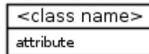

```

classDiagram
    class `<class name>` {
        attribute
    }

```

UML class diagram showing a class with a name compartment containing '' and an attribute compartment containing 'attribute'.

- Classes may or may not have attributes. The graphical notation of a class may show an empty attribute (middle) compartment even if the class has attributes, as shown in figure below.

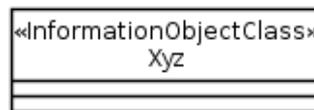

```

classDiagram
    class `<<InformationObjectClass>>\nXyz` {
    }

```

UML class diagram for InformationObjectClass Xyz with an empty attribute compartment.

- The visibility symbol shall not appear along with the class attribute, as shown below.

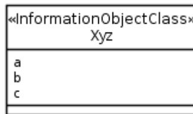

```

classDiagram
    class `<<InformationObjectClass>>\nXyz` {
        a
        b
        c
    }

```

UML class diagram for InformationObjectClass Xyz showing attributes a, b, and c without visibility symbols.

- The use of the decoration, i.e. the symbol in the name (top) compartment, is optional.

## 5.2.1 Attribute

### 5.2.1.1 Description

An attribute is a typed element representing a property of a class defined in (Unified Modelling Language (OMG UML), Infrastructure [1], clause 10.2.5). An element that is typed implies that the element can only refer to a constrained set of values. See OMG "Unified Modelling Language (OMG UML), Infrastructure" [1] clause 10.1.4 for more information on type.

See clauses 5.3.4 and 5.4.3 for predefined data types and user-defined data types that can apply type information to an attribute.

The properties of an attribute are described by a set of attribute properties categorized as follows:

- Attribute properties defining valid attribute values: type, allowedValues, multiplicity, isOrdered, isUnique, isNullable, passedById.
- Attribute properties defining valid interactions of managers and agents with attributes values: isInvariant, isWritable, isReadable, isNotifiable, defaultValue.
- Other attribute properties: documentation, supportQualifier.

The following tables provide definitions for the attributes of the three categories.

**Table 5.2.1.1-1: Attribute properties defining valid attribute values**

| Property name   | Description                                                                                                                                                                                                                                                                                                                                                                                                              | Legal values                                                 |
|-----------------|--------------------------------------------------------------------------------------------------------------------------------------------------------------------------------------------------------------------------------------------------------------------------------------------------------------------------------------------------------------------------------------------------------------------------|--------------------------------------------------------------|
| type            | Refers to one or more predefined (clause 5.4.3), user defined data types (clause 5.3.4), or enumerations (clause 5.3.5) or a choices (clause 5.3.6). See also subclause 7.3.44 of OMG "Unified Modelling Language (OMG UML), Superstructure" [2], inherited from StructuralFeature.                                                                                                                                      | N/A                                                          |
| allowedValues   | Specifies restrictions to the data type defined by type. This property is useful when no dedicated data type, that includes the restriction, shall be defined. If there are no restrictions beyond what the data type includes, the property shall be omitted from the attribute description.                                                                                                                            | Dependent on type                                            |
| defaultValue    | Identifies a value at specification time that is used at object creation time under conditions defined in Annex B.<br>If there is no defined default value, the property shall be omitted from the attribute description or specified as 'defaultValue: None.'                                                                                                                                                           | None (default) or a value that is dependent on allowedValues |
| multiplicity    | Defines the number of values the attribute can simultaneously have. See subclause 7.3.44 of OMG "Unified Modelling Language (OMG UML), Superstructure" [2]; inherited from StructuralFeature.                                                                                                                                                                                                                            | See 5.2.8 Default is 1                                       |
| isOrdered       | For a multi-valued multiplicity, this specifies if the values of this attribute instance are sequentially ordered. See subclause 7.3.44 and its Table 7.1 of OMG "Unified Modelling Language (OMG UML), Superstructure" [2].<br>If the property is present for attributes with a multiplicity of greater than "1", it shall be set to either "True" or "False". It shall not be set to "N/A".                            | True, False (default)                                        |
| isUnique        | For a multi-valued multiplicity, this specifies if the values of this attribute instance are unique (i.e., no duplicate attribute values). See subclause 7.3.44 and its Table 7.1 of OMG "Unified Modelling Language (OMG UML), Superstructure" [2].<br>If the property is present for attributes with a multiplicity of greater than "1", it shall be set to either "True" or "False". It shall not be set to "N/A".    | True (default), False                                        |
| isNullable      | Identifies if an attribute can carry no information. The implied meaning of carrying "no information" is context sensitive and is not defined in this Model Repertoire.<br>Note, the property "isNullable: True" is semantically identical to adding the value "0" to the "multiplicity" specified. Usage of the "multiplicity" property is preferred to express an attribute can have no value or carry no information. | True, False (default)                                        |
| passedByld      | Usage of the value False is deprecated.<br>The property is only applicable to attributes related to roles, for other attributes it has no significance,<br>See Table 5.2.9.1-1: passedByld property                                                                                                                                                                                                                      | True(default), False                                         |
| lifecycleStatus | See Table 5.2.11.1-1                                                                                                                                                                                                                                                                                                                                                                                                     | Current (default),<br>Deprecated                             |

**Table 5.2.1.1-2: Attribute properties defining valid interactions with attributes**

| Property name | Description                                                                                                                                                                                                                                                                                                                                                                                                                                                                                                                                             | Legal values          |
|---------------|---------------------------------------------------------------------------------------------------------------------------------------------------------------------------------------------------------------------------------------------------------------------------------------------------------------------------------------------------------------------------------------------------------------------------------------------------------------------------------------------------------------------------------------------------------|-----------------------|
| isInvariant   | If an attribute has an "isInvariant: True" property, its value can be set only upon object creation. After object creation, the initial value cannot be modified by any entity.<br><br>If an attribute has an "isInvariant: False" property, its value can be set at object creation time. After object creation, the initial value can be modified.<br><br>Details on how initial values are provided upon object creation are specified in Annex B.                                                                                                   | True, False (default) |
| isWritable    | If an attribute has an "isWritable: True" property, a manager can set its value upon object creation. After object creation, a manager can modify the initial value if "isInvariant: False". If "isInvariant: True", a manager cannot modify the initial value. The "isInvariant" property supersedes hence the "isWritable" property.<br><br>If an attribute has an "isWritable: False" property, a manager cannot set the value upon object creation nor modify it later.<br><br>A "isWritable: True" property might be restricted by access control. | True, False (default) |
| isReadable    | Specifies if the attribute can be read by a manager.<br><br>A "isReadable: True" property might be restricted by access control.                                                                                                                                                                                                                                                                                                                                                                                                                        | True (default), False |
| isNotifiable  | Identifies if the attribute value specified (which may or may not occur as part of an object creation or object deletion) or attribute value change shall be notified.                                                                                                                                                                                                                                                                                                                                                                                  | True (default), False |

**Table 5.2.1.1-3: Attribute properties related to the specification of attributes**

| Property name    | Description                                                                                                            | Legal values              |
|------------------|------------------------------------------------------------------------------------------------------------------------|---------------------------|
| documentation    | Contains a textual description of the attribute.<br>Should refer (to enable traceability) to the specific requirement. | Any                       |
| supportQualifier | Identifies the required support of the attribute. See also subclause 6.                                                | M, O (default), CM, CO, C |

Upon completion of any manipulation of an attribute the attribute properties related to valid attribute values shall be respected. If an interaction results in violating at least one of these properties, the manipulation request shall be rejected.

The value N/A (Not applicable) shall not be used for attribute properties except for properties "isOrdered", "isUnique" and "allowedValues".

### 5.2.1.2 Example

This example shows three attributes, i.e., a, b and c, listed in the attribute (the second) compartment of the class Xyz.


```

classDiagram
    class Xyz {
        <<InformationObjectClass>>
        a
        b
        c
    }

```

UML class diagram showing a class box for «InformationObjectClass» Xyz. The class box is divided into two compartments. The top compartment contains the class name 'Xyz' and the stereotype '«InformationObjectClass»'. The bottom compartment contains three attributes listed vertically: 'a', 'b', and 'c'.

**Figure 5.2.1.2-1: Attribute notation**

### 5.2.1.3 Name style

An attribute name shall use the LCC style.

Well Known Abbreviation (WKA) is treated as a word if used in a name. However, WKA shall be used as defined in the specification document that originally defined the WKA (its letter case cannot be changed) except when it is the first word of a name; and if so, its first letter must be in lower case.

## 5.2.2 Association relationship

### 5.2.2.1 Description

It shows a relationship between two classes and describes the reasons for the relationship and the rules that might govern that relationship.

It has ends. Its end, the association end(s), specifies the role that the object at one end of a relationship performs. Each end of a relationship has properties that specify the role (see 5.2.9), multiplicity (see 5.2.8), visibility and navigability (see the arrow symbol used in Figure 5.2.2.2-2: Unidirectional association relationship notation) and may have constraints. Note that visibility shall not be used in models based on this Repertoire (see bullet 3 of 5.2).

See 7.3.3 Association of OMG "Unified Modelling Language (OMG UML), Superstructure" [2].

Three examples below show a binary association between two model elements. The association can include the possibility of relating a model element to itself.

The first example (Figure 5.2.2.2-1) shows a bi-directional navigable association in that each model element has a pointer to the other. The second example (Figure 5.2.2.2-2) shows a unidirectional association (shown with an open arrow at the target model element end) in that only the source model element has a pointer to the target model element and not vice-versa. The third example (Figure 5.2.2.2-3) shows a bi-directional non-navigable association in that each model element does not have a pointer to the other; i.e., such associations are just for illustration purposes.

### 5.2.2.2 Example

An association shall have an indication of cardinality (see 5.2.8).

It shall, except the case of non-navigable association, have an indication of the role name (see 5.2.9). The model element involved in an association is said to be "playing a role" in that association. The role has a name such as `aClass` in the first example below. Note that the use of "+" character in front of the role name, indicating visibility, is optional.


```

classDiagram
    class AClass["«InformationObjectClass»\nAClass"]
    class BClass["«InformationObjectClass»\nBClass"]
    AClass "0..1 +aClass" <--> "+bClass *" BClass

```

Figure 5.2.2.2-1: Bidirectional association relationship notation. A UML class diagram showing two classes, AClass and BClass, both stereotyped as «InformationObjectClass». AClass is on the left, BClass is on the right. A line connects them with arrows at both ends. Near AClass, the multiplicity is 0..1 and the role name is +aClass. Near BClass, the multiplicity is \* and the role name is +bClass.

**Figure 5.2.2.2-1: Bidirectional association relationship notation**


```

classDiagram
    class Class8["«InformationObjectClass»\nClass8"]
    class Class9["«InformationObjectClass»\nClass9"]
    Class8 "*" --> "+class9 0..1" Class9

```

Figure 5.2.2.2-2: Unidirectional association relationship notation. A UML class diagram showing two classes, Class8 and Class9, both stereotyped as «InformationObjectClass». Class8 is on the left, Class9 is on the right. A line connects them with an open arrow pointing from Class8 to Class9. Near Class8, the multiplicity is \*. Near Class9, the multiplicity is 0..1 and the role name is +class9.

**Figure 5.2.2.2-2: Unidirectional association relationship notation**


```

classDiagram
    class Class10["«InformationObjectClass»\nClass10"]
    class Class11["«InformationObjectClass»\nClass11"]
    Class10 "1" -- "*" Class11

```

Figure 5.2.2.2-3: Non-navigable association relationship notation. A UML class diagram showing two classes, Class10 and Class11, both stereotyped as «InformationObjectClass». Class10 is on the left, Class11 is on the right. A simple line connects them with no arrows. Near Class10, the multiplicity is 1. Near Class11, the multiplicity is \*.

**Figure 5.2.2.2-3: Non-navigable association relationship notation**

Note that some tools do not use arrows in the UML graphical representation for bidirectional associations. Therefore, absence of the two arrows is not an indication of a non-navigable association between the two Information Object Class involved; but the absence of the attributes related to role in the two Information Object Class involved is an indication.

### 5.2.2.3 Name style

An Association can have a name. Use of Association name is optional. Its name style is LCC style.

A role name shall use the LCC style.

NOTE: The role name needs not resemble the class name.

## 5.2.3 Aggregation association relationship

### 5.2.3.1 Description

It shows a class as a part of or subordinate to another class.

An aggregation is a special type of association in which objects are assembled or configured together to create a more complex object. Aggregation protects the integrity of an assembly of objects by defining a single point of control called aggregate, in the object that represents the assembly.

See 7.3.2 AggregationKind (from Kernel) of OMG "Unified Modelling Language (OMG UML), Superstructure" [2].

### 5.2.3.2 Example

A hollow diamond attached to the end of a relationship is used to indicate an aggregation. The diamond is attached to the class that is the aggregate. The aggregation association shall have an indication of cardinality at each end of the relationship (see 5.2.8).


```
classDiagram
    class Class12 {
        <<InformationObjectClass>>
    }
    class Class13 {
        <<InformationObjectClass>>
    }
    Class12 "1" o-- "*" Class13 : +class13
```

UML class diagram showing an aggregation relationship. Class12 (aggregate) is connected to Class13 (part) by a line with a hollow diamond at Class12. Multiplicity is 1 at Class12 and \* at Class13. The role name +class13 is shown at the Class13 end. Both classes have the stereotype «InformationObjectClass».

**Figure 5.2.3.2-1: Aggregation association relationship notation**

### 5.2.3.3 Name style

An Association can have a name. Use of Association name is optional. Its name style is LCC.

## 5.2.4 Composite aggregation association relationship

### 5.2.4.1 Description

A composite aggregation association is a strong form of aggregation that requires a part instance be included in at most one composite at a time. If a composite is deleted, all of its parts are deleted as well.

A composite aggregation shall contain a description of its use.

See 7.3.3 Association (from Kernel) of OMG "Unified Modelling Language (OMG UML), Superstructure" [2].

### 5.2.4.2 Example

A filled diamond attached to the end of a relationship is used to indicate a composite aggregation. The diamond is attached to the class that is the composite. The composite association shall have an indication of cardinality at each end of the relationship (see 5.2.8).


```

    classDiagram
      ManagedElement "1" *-- "0..1" ManagedElementPropertySet : +managedElementPropertySet
      class ManagedElement {
        <<InformationObjectClass>>
      }
      class ManagedElementPropertySet {
        <<InformationObjectClass>>
      }
  
```

Figure 5.2.4.2-1: Composite aggregation association relationship notation. The diagram shows two class boxes. The left box is labeled «InformationObjectClass» ManagedElement and has a multiplicity of 1. The right box is labeled «InformationObjectClass» ManagedElementPropertySet and has a multiplicity of 0..1. A solid line with a filled diamond at the ManagedElement end and an open arrow at the other end connects them, with the association name +managedElementPropertySet written above the line.

**Figure 5.2.4.2-1: Composite aggregation association relationship notation**

### 5.2.4.3 Name style

An Association can have a name. Use of Association name is optional. Its name style is LCC.

## 5.2.5 Generalization relationship

### 5.2.5.1 Description

It indicates a relationship in which one class (the child) inherits from another class (the parent).

See 7.3.20 Generalization of OMG "Unified Modelling Language (OMG UML), Superstructure" [2].

### 5.2.5.2 Example

This example shows a generalization relationship between a more general model element (the `Top`) and a more specific model element (the `NetworkSliceSubnet`) that is fully consistent with the first element and that adds additional information.


```

    classDiagram
      Top <|-- NetworkSliceSubnet
      class Top {
        <<InformationObjectClass>>
      }
      class NetworkSliceSubnet {
        <<InformationObjectClass>>
      }
  
```

Figure 5.2.5.2-1: Generalization relationship notation. The diagram shows two class boxes. The left box is labeled «<> Top». The right box is labeled «<> NetworkSliceSubnet». A solid line with a hollow triangular arrowhead points from the right box to the left box, indicating inheritance.

**Figure 5.2.5.2-1: Generalization relationship notation**

### 5.2.5.3 Name style

It has no name so there is no name style.

## 5.2.6 Dependency relationship

### 5.2.6.1 Description

"A dependency is a relationship that signifies that a single or a set of model elements requires other model elements for their specification or implementation. This means that the complete semantics of the depending elements is either semantically or structurally dependent on the definition of the supplier element(s)...", an extract from 7.3.12 Dependency of OMG "Unified Modelling Language (OMG UML), Superstructure" [2].

### 5.2.6.2 Example

This example shows that the `BClass` instances have a semantic relationship with the `AClass` instances. It indicates a situation in which a change to the target element (the `AClass` in the example) will require a change to the source element (the `BClass` in the example) in the dependency.


```

    classDiagram
      AClass <.. BClass
      class AClass {
        <<InformationObjectClass>>
      }
      class BClass {
        <<InformationObjectClass>>
      }
  
```

Figure 5.2.6.2-1: Dependency relationship notation. The diagram shows two class boxes. The left box is labeled «InformationObjectClass» AClass. The right box is labeled «InformationObjectClass» BClass. A dashed line with an open arrow points from the right box to the left box, indicating a dependency relationship.

**Figure 5.2.6.2-1: Dependency relationship notation**

### 5.2.6.3 Name style

A Dependency can have a name. Use of Dependency name is optional. Its name style is LCC.

### 5.2.7 Comment

#### 5.2.7.1 Description

A comment is a textual annotation that can be attached to a set of elements.

See 7.3.9 Comment (from Kernel) from OMG "Unified Modelling Language (OMG UML), Superstructure" [2].

#### 5.2.7.2 Example

This example shows a comment, as a rectangle with a "bent corner" in the upper right corner. It contains text. It appears on a particular diagram and may be attached to zero or more modelling elements by dashed lines.

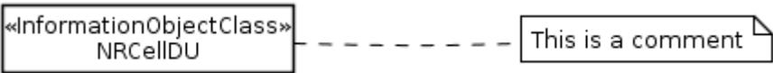

```

    graph LR
    A["«InformationObjectClass»  
NRCellDU"] -.- B["This is a comment"]
    style B fill:#fff,stroke:#333,stroke-width:1px
  
```

UML diagram showing a comment box attached to a class box.

Figure 5.2.7.2-1: Comment notation

#### 5.2.7.3 Name style

It has no name so there is no name style.

### 5.2.8 Multiplicity, a.k.a. cardinality in relationships

#### 5.2.8.1 Description

"A multiplicity is a definition of an inclusive interval of non-negative integers beginning with a lower bound and ending with a (possibly infinite) upper bound. A multiplicity element embeds this information to specify the allowable cardinalities for an instantiation of this element...", an extract from 7.3.32 MultiplicityElement of OMG "Unified Modelling Language (OMG UML), Superstructure" [2].

**Table 5.2.8.1-1: Multiplicity-string definitions**

| Multiplicity | Explanation                                                                 |
|--------------|-----------------------------------------------------------------------------|
| 1            | Attribute has one attribute value.                                          |
| m            | Attribute has <i>m</i> attribute values.                                    |
| 0..1         | Attribute has zero or one attribute value.                                  |
| 0..*         | Attribute has zero or more attribute values.                                |
| *            | Attribute has zero or more attribute values.                                |
| 1..*         | Attribute has at least one attribute value.                                 |
| m..n         | Attribute has at least <i>m</i> but no more than <i>n</i> attribute values. |

The use of "0..n" is not recommended although it has the same meaning as " 0..\* " and " \*".

The use of a standalone symbol zero (0) is not allowed.

#### 5.2.8.2 Example

This example shows a multiplicity attached to the end of an association path. The meaning of this multiplicity is one to many. One `Class1` instance is associated with zero or more `Class2` instances. Other valid examples can show the “many to many” relationship.


```
classDiagram
    class Class1["«InformationObjectClass»\nClass1"]
    class Class2["«InformationObjectClass»\nClass2"]
    Class1 "1" -- "*" Class2 : +class2
```

UML class diagram showing an association between two classes, Class1 and Class2. Class1 is labeled «InformationObjectClass» and Class2 is labeled «InformationObjectClass». The association has a cardinality of 1 at Class1 and \* at Class2, with the role name +class2 near Class2.

Figure 5.2.8.2-1: Cardinality notation

The cardinality zero is not used to indicate the IOC’s so-called “transient state” characteristic. For example, it is not used to indicate that the instance is not yet created but it is in the process of being created. The cardinality zero will not be used to indicate this characteristic since such characteristic is considered inherent in all IOCs. All IOCs defined are considered to have such inherent “transient state” characteristics.

The following table shows some valid examples of multiplicity.

Table 5.2.8.2-1: Multiplicity-string examples

| Multiplicity | Explanation                                                    |
|--------------|----------------------------------------------------------------|
| 1            | Attribute has exactly one attribute value.                     |
| 5            | Attribute has exactly 5 attribute values.                      |
| 0..1         | Attribute has zero or one attribute value.                     |
| 0..*         | Attribute has zero or more attribute values.                   |
| 1..*         | Attribute has at least one attribute value.                    |
| 4..12        | Attribute has at least 4 but no more than 12 attribute values. |

### 5.2.8.3 Name style

It has no name so there is no name style.

## 5.2.9 Role

### 5.2.9.1 Description

It indicates navigation, from one class to another class, involved in an association relationship. A role is named. The direction of navigation is to the class attached to the end of the association relationship with (or near) the role name.

The use of role name in the graphical representation is optional for bidirectional and unidirectional association relationship notations (see Figure 5.2.2.2-1: Bidirectional association relationship notation and Figure 5.2.2.2-2: Unidirectional association relationship notation). Role name shall not be used in non-navigable association relationship notation (see Figure 5.2.2.2-3: Non-navigable association relationship notation).

A role at the navigable end of a relationship becomes (or is mapped into) an attribute (called role-attribute) in the source class of the relationship. Therefore, roles have the same behaviour (or properties) as attributes. See Table 5.2.1.1-1: Attribute properties.

To avoid clutter in UML diagram, the role names can be removed.

The role-attribute shall have all properties defined for attributes in subclause 5.2.1 Attribute and in addition the following property

**Table 5.2.9.1-1: passedById property**

| Property name | Description                                                                                                                                                                                                                                                                                                                                                                                                                                                                                                                                                                                                                                                                                                                                                                                                                                                                                            | Legal values          |
|---------------|--------------------------------------------------------------------------------------------------------------------------------------------------------------------------------------------------------------------------------------------------------------------------------------------------------------------------------------------------------------------------------------------------------------------------------------------------------------------------------------------------------------------------------------------------------------------------------------------------------------------------------------------------------------------------------------------------------------------------------------------------------------------------------------------------------------------------------------------------------------------------------------------------------|-----------------------|
| passedById    | <p>If True, the role-attribute (navigable association source end) contains a DN of the navigable association target end instance.</p> <p>Usage of the value False is deprecated.</p> <p>If False, the role-attribute contains (a copy of) the whole target end instance (e.g. X). If X has a role-attribute whose “passedById==False”, then the subject role-attribute contains (a copy of) X’s target end instance as well.</p> <p>The above rule is applied repeatedly for all occurrences of “passedById==False”. This application can result in a collection of instances where no ordering can be implied and no instances are duplicated.</p> <p>Use of “passedById==False” supports the efficient access of target end instances from a source end instance. The mechanism by which such access is achieved is operation model design specific (e.g. not related to resource model design).</p> | True (default), False |

:

### 5.2.9.2 Example

This example shows that a `Person` (say instance John) is associated with a `Company` (say whose DN is “Company=XYZ”). We navigate the association by using the opposite association-end such that John’s `Person.company` would hold the DN, i.e. "Company=XYZ".


```

classDiagram
    class Company {
        <<InformationObjectClass>>
    }
    class Person {
        <<InformationObjectClass>>
    }
    Person "1" --> "1" Company : +company
  
```

UML class diagram showing an association between Company and Person. Both are stereotyped as «InformationObjectClass». The association has a multiplicity of 1 at the Person end and a directed association towards Company with role name +company and multiplicity 1.

**Figure 5.2.9.2-1: Role notation**

### 5.2.9.3 Name style

A role has a name. Use a noun for the name. The name style follows the attribute name style; see subclause 5.2.1.3.

## 5.2.10 Xor constraint

### 5.2.10.1 Description

“*A Constraint represents additional semantic information attached to the constrained elements. A constraint is an assertion that indicates a restriction that must be satisfied by a correct design of the system. The constrained elements are those elements required to evaluate the constraint specification...*”, an extract from 7.3.10 Constraint (from Kernel) of OMG "Unified Modelling Language (OMG UML), Superstructure" [2].

For a constraint that applies to two elements such as two associations, the constraint shall be shown as a dashed line between the elements labeled by the constraint string (in braces). The constraint string, in this case, is *xor*.

### 5.2.10.2 Example

The figure below shows a `ServerObjectClass` instance that has relation(s) to multiple instances of a class from the choice of `ClientObjectClass_Alternative1`, `ClientObjectClass_Alternative2` or `ClientObjectClass_Alternative3`.


```

classDiagram
    class ServerObjectClass {
        <<InformationObjectClass>>
    }
    class ClientObjectClass_Alternative1 {
        <<InformationObjectClass>>
    }
    class ClientObjectClass_Alternative2 {
        <<InformationObjectClass>>
    }
    class ClientObjectClass_Alternative3 {
        <<InformationObjectClass>>
    }
    ServerObjectClass "1" -- "*" ClientObjectClass_Alternative1 : +clientObjectClass
    ServerObjectClass "1" -- "1 *" ClientObjectClass_Alternative2 : +clientObjectClass
    ServerObjectClass "1" -- "*" ClientObjectClass_Alternative3 : +clientObjectClass
    <<xor>> ClientObjectClass_Alternative1
    <<xor>> ClientObjectClass_Alternative2
    <<xor>> ClientObjectClass_Alternative3
  
```

UML class diagram showing ServerObjectClass with associations to three alternative ClientObjectClasses. A dashed arc with an {xor} constraint label connects the three association lines, indicating that only one of the three associations can be active at a time. Each association is labeled with '+clientObjectClass \*' at the client end and '1' at the server end. ClientObjectClass\_Alternative2 also has a '1' at its end.

**Figure 5.2.10.2-1: {xor} notation**

### 5.2.10.3 Name style

It has no name so there is no name style.

## 5.2.11 LifecycleStatus

### 5.2.11.1 Description

Model elements may have a life-cycle. They are created, updated, become obsolete and may be removed. The lifecycleStatus property indicates this. LifecycleStatus is applicable to attributes, data types, IOCs operations and notifications.

**Table 5.2.11.1-1: lifecycleStatus property**

| Property name   | Description                                                                                                                                                                                                                                                                                                                                             | Legal values                    |
|-----------------|---------------------------------------------------------------------------------------------------------------------------------------------------------------------------------------------------------------------------------------------------------------------------------------------------------------------------------------------------------|---------------------------------|
| lifecycleStatus | "Current" means that the definition of the element is current and valid, it is freely available for use.<br><br>"Deprecated" means the element has a valid definition, it is available for use, but its use is discouraged. Deprecated elements may already have a replacement element defined. Deprecated elements may be removed in the next release. | Current(default),<br>Deprecated |

### 5.2.11.2 Removing/Deprecating model elements

When removal or a non backwards compatible change is needed for a model element, it shall be kept in the specification as-is but be marked as deprecated for one release. The deprecated element may be removed in the next release.

A new replacing model element may be defined beside the original. In this case the replacing element shall be indicated in the specification of the old element.

Implementations of the previous release that now implement the current release shall continue to support usage of the deprecated attributes/classes as well as any new replacing attributes/classes, but not at the same time. As soon as the newer (replacing) attributes/classes are used, it may no longer be possible to also support usage of the deprecated elements or show correct values for the deprecated attributes. (E.g. when the type of an attribute is changed from integer to string). Once the replacing attribute/IOC is used, the old attribute/IOC may lose functionality and should not be used anymore.

In case the deprecated or the replacing element was or is intended to have a multiplicity strictly greater than zero (mandatory to configure/report), the model elements should be declared with a multiplicity including zero, as only one of the deprecated and the replacement elements will be used at any one time.

The deprecating procedure shall be used between releases. There is no need to follow it during the development of a single release, as long as the release is not yet frozen.

## 5.3 Stereotype

### 5.3.0 Description

Subclause 5.1 listed the UML defined basic model elements. UML defined a stereotype concept allowing the specification of simple or complex user-defined model elements.

This subclause lists all allowable stereotypes for this repertoire.

The names of stereotypes shall be chosen such that they do not clash.

For each stereotype model element listed, there are three parts. The first part contains its description. The second part contains its graphical notation examples and the third part contains the rule, if any, recommended for labelling or naming it.

### 5.3.1 <<ProxyClass>>

#### 5.3.1.1 Description

It is a form or template representing a number of <<InformationObjectClass>>. It encapsulates attributes, links, methods (or operations), and interactions that are present in the represented <<InformationObjectClass>>.

The semantics of a <<ProxyClass>> is that all behaviour of the <<ProxyClass>> is present in the represented <<InformationObjectClass>>. Since this class is simply a representation of other classes, this class cannot define its own behaviour other than those already defined by the represented <<InformationObjectClass>>.

A particular <<InformationObjectClass>> can be represented by zero, one or more <<ProxyClass>>. For example, the ManagedElement <<InformationObjectClass>> can have MonitoredEntity <<ProxyClass>> and ManagedEntity <<ProxyClass>>.

The attributes of the <<ProxyClass>> are accessible by the source entity that has an association with the <<ProxyClass>>.

#### 5.3.1.2 Example

This shows a <<ProxyClass>> named `MonitoredEntity`. It represents (or its constraints is that it represents) all NRM <<InformationObjectClass>> (e.g. `GgsnFunction` <<InformationObjectClass>>) whose instances are being monitored for alarm conditions. It is mandatory to use a Note to capture the constraint.

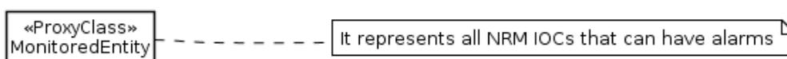

```

classDiagram
    class MonitoredEntity["«ProxyClass»\nMonitoredEntity"]
    note for MonitoredEntity "It represents all NRM IOCs that can have alarms"
  
```

UML diagram showing a class box for «ProxyClass» MonitoredEntity connected by a dashed line to a note box containing the text 'It represents all NRM IOCs that can have alarms'.

**Figure 5.3.1.2-1: <<ProxyClass>> notation**

See Annex A for more examples that use <<ProxyClass>>.

#### 5.3.1.3 Name style

For <<ProxyClass>> name, use the same style as <<InformationObjectClass>> (see 5.3.2).

### 5.3.2 <<InformationObjectClass>>

#### 5.3.2.1 Description

The <<InformationObjectClass>> is identical to UML *class* except that it does not include/define methods or operations. It may also be referred as <<IOC>>, which can only be used without causing ambiguity.

A UML *class* represents a capability or concept within the system being modelled. Classes have data structure and behaviour and relationships to other elements.

This class can inherit from zero, one or multiple classes (multiple inheritances). From the parent class(es), the derived class inherits all attributes and name containment association(s).

See more on UML *class* in OMG "Unified Modelling Language (OMG UML), Infrastructure" [1], clause 10.2.1.

#### 5.3.2.2 Example

This example shows an AbcFunction <<InformationObjectClass>>.

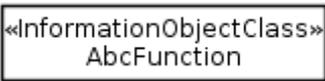

```

    classDiagram
        class AbcFunction {
            <<InformationObjectClass>>
        }
    
```

UML notation for <> AbcFunction

**Figure 5.3.2.2-1: <<InformationObjectClass>> notation**

The following table captures the properties of this modelled element.

**Table 5.3.2.2-1: <<InformationObjectClass>> properties**

| Property name    | Description                                                                                                                  | Legal values                  |
|------------------|------------------------------------------------------------------------------------------------------------------------------|-------------------------------|
| documentation    | Contains a textual description of this modelled element.<br>Should refer (to enable traceability) to a specific requirement. | Any                           |
| isAbstract       | Indicates if the class can be instantiated or is just used for inheritance.                                                  | True, False (default)         |
| isNotifiable     | Identifies the list of the supported notifications.                                                                          | List of names of notification |
| supportQualifier | Identifies the required support of the class. See also subclause 6.                                                          | M, O (default), CM, CO, C     |

#### 5.3.2.3 Name style

The name shall use UCC style. The name shall end with an underscore if it is an abstract class in the UIM. The name must not end with an underscore if it is a concrete class.

WKA is treated as a word if used in a name. However, WKA shall be used as defined in the specification document that originally defined the WKA (its letter case cannot be changed) except when it is the first word of the name; and if so, its first letter must be in upper case.

Embedded underscore is not allowed except the name is for an Association class (see 5.4.1).

### 5.3.3 <<names>>

#### 5.3.3.1 Description

The <<names>> is modelled by a composite association where both ends are non-navigable. The source class is the composite and the target class is the component. The target instance is uniquely identifiable, within the namespace of the source entity, among all other targeted instances of the same target class and among other targeted instances of other classes that have the same <<names>> composition with the source.

The source class and target class shall each has its own naming attribute.

The composite aggregation association relationship is used as the act of name containment providing a semantic of a whole-part relationship between the domain and the named elements that are contained, even if only by name. From the management perspective access to the part is through the whole. Multiplicity shall be indicated at both ends of the relationship.

A target instance cannot have multiple `<<names>>` with multiple source instances s, i.e. a target instance can not participate in or belong to multiple namespaces.

### 5.3.3.2 Example

This shows that all instances of `Class4` are uniquely identifiable within a `Class3` instance's namespace.

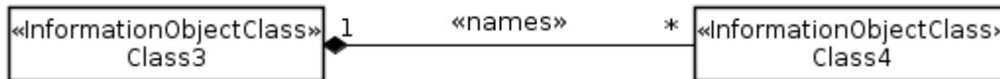

```

classDiagram
    class Class3["<<InformationObjectClass>>\nClass3"]
    class Class4["<<InformationObjectClass>>\nClass4"]
    Class3 "1" *-- "*" Class4 : <<names>>

```

UML diagram showing a composite aggregation relationship between Class3 and Class4. Class3 is an InformationObjectClass with a multiplicity of 1. Class4 is also an InformationObjectClass with a multiplicity of \*. The relationship is labeled <>.

**Figure 5.3.3.2-1: `<<names>>` notation**

### 5.3.3.3 Name style

It has no name so there is no name style.

## 5.3.4 `<<dataType>>`

### 5.3.4.1 Description

It represents an attribute property type (see Table 5.2.1.1-1: Attribute properties).

This repertoire uses two kinds of data types: predefined data types and user-defined data types. The former is defined in subclause 5.4.3. The latter is defined by the specification by authors using a `<<dataType>>` model element.

The names of predefined data types and user-defined data types must be chosen such that they do not clash.

User-defined data types can be simple types containing one or more values of a single simple type like Integer or String or they can be structured types containing one or more named attribute fields each having properties similar to an attribute as described in table 5.2.1.1-1. The individual attribute fields may have different property values e.g., different types, multiplicity or supportQualifier. A named attribute field itself can be of a simple or a structured data type.

Structured data types could be embedded in any depth; however, they should not be embedded more than 3 levels, that is attribute-structuredType-structuredType-structuredType-simpletype. Reasons for avoiding deep embedding of structured types include:

- Any construct that would be modeled by such deep structures can be modeled partly of fully by IOCs instead, thus avoiding deep structures.
- It is difficult to understand deep structured types, it is hard to follow their "type containment".
- Addressing in most contexts is based on Distinguished Names which does not allow addressing individual attribute fields.
- Filtering of attribute fields becomes complex.
- Usability problems on any human interface (GUI, CLI).

The user-defined data types support the modelling of structured data types (see `<<dataType>>` PLMNid in 5.3.4.2).

When an attribute is of a structured data type, attribute properties may be declared on multiple levels: declared for the attribute as a whole and also for each attribute field. As an attributed field itself may be of a structured data type, properties may be declared on 2, 3 or more levels.

"Documentation" is relevant on the attribute or attribute field level where it is declared. Properties "multiplicity", "isOrdered", "isUnique", "type" and "allowedValues" are always relevant and should be enforced on the attribute or attribute field level where they are declared.

The property "supportQualifier" always applies to the level where it is declared. However, the support for a model element is always conditional on the support of the higher level. E.g., if an attribute is optional but one of its fields is mandatory, that means the field is mandatory if the attribute itself is supported; if the attribute is not supported this results in none of its fields(subparts) being supported.

For properties "isReadable", "isWritable", "isNotifiable" the following rules apply:

- If a structured attribute specifies the property as False then the False value shall be used for the attribute and all its (descendant) attribute fields (if any).
- If a structured attribute specifies the property as True then the True value shall be used for the attribute and all its (descendant) attribute fields if and only if True is also specified for all of them.
- If a structured attribute specifies the property as True then the True value shall be used for the attribute and all its (descendant) attribute fields until a False value is specified for an attribute field. This attribute field and all (descendant) attribute fields shall have a False value.

For the "isInvariant" property the following rules apply:

- If a structured attribute specifies the property as True then the True value shall be used for the attribute and all its (descendant) attribute fields (if any).
- If a structured attribute specifies the property as False then the False value shall be used for the attribute and all its (descendant) attribute fields if and only if False is also specified for all of them.
- If a structured attribute specifies the property as False then the False value shall be used for the attribute and all its (descendant) attribute fields until a True value is specified for an attribute field. This attribute field and all (descendant) attribute fields shall have a True value.

If an attribute has the property lifecycleStatus=Deprecated all its fields are also deprecated. If a data type has property lifecycleStatus=Deprecated all its fields (subparts) are also deprecated.

When a user-defined or predefined data type is used to apply type (see property named type in Table 5.2.1.1-1: Attribute properties) information to a class attribute, the data type name is shown along with the class attribute. See Example below.

When an attribute/field is defined with a datatype the relationship between them can be optionally established in the UML relationship diagram, e.g. for deeply nested datatypes. The relationship is shown as a relationship in the diagram between the parent attribute/field name and the datatype. The line includes the attribute/field. These diagrams shall be limited to one class and associated datatypes.

### 5.3.4.2 Example

The following examples are two user-defined data types.

The left-most user-defined data type is named `PLMNId`. It has two attributes. One is the Mobile Country Code (MCC) of predefined data type `String`. The other is the Mobile Network Code (MNC) of predefined data type `String` as well.

The right-most user-defined data type is named `Xyz`. It has three attributes. The `attribute1` uses predefined data type `String`. The `attribute2` uses predefined data type `Integer`. The `attribute3` uses user-defined data type `PLMNId`.

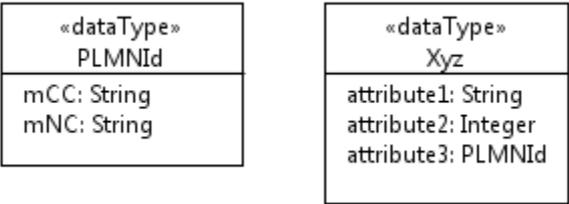

```

class PLMNId <<dataType>> {
  mCC: String
  mNC: String
}

class Xyz <<dataType>> {
  attribute1: String
  attribute2: Integer
  attribute3: PLMNId
}
  
```

UML notation for two user-defined data types: PLMNId and Xyz.

Figure 5.3.4.2-1: <<dataType>> notations

The following example shows a `ZClass` which has four attributes. Two attributes (i.e. `attribute1`, `attribute4`) use the user-defined data types (i.e. `PLMNId`, `Xyz`) and the other two attributes use the predefined data types.

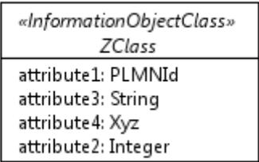

```

class ZClass <<InformationObjectClass>> {
  attribute1: PLMNId
  attribute3: String
  attribute4: Xyz
  attribute2: Integer
}
  
```

UML notation for a ZClass using PLMNId and Xyz data types.

Figure 5.3.4.2-2: Usage example of <<dataType>>

The third column of the following shows some of the properties of an attribute `attribute1` of `ZClass`. It shows the `attribute1` attribute property type is `PLMNId`, a user-defined data type.

|                         |                          |                                                                                                                            |
|-------------------------|--------------------------|----------------------------------------------------------------------------------------------------------------------------|
| <code>attribute1</code> | It is a PLMN identifier. | type: <code>PLMNId</code><br>multiplicity: 1<br>isOrdered: N/A<br>isUnique: N/A<br>defaultValue: None<br>isNullable: False |
|-------------------------|--------------------------|----------------------------------------------------------------------------------------------------------------------------|

### 5.3.4.3 Name style

For <<dataType>> name, use the same style as <<InformationObjectClass>> (see 5.3.2).

For <<dataType>> attribute (used to define attribute fields), use the same style as Attribute (see 5.2.1).

## 5.3.5 <<enumeration>>

### 5.3.5.1 Description

An enumeration is a data type. It contains sets of named literals that represent the values of the enumeration. An enumeration has a name. This data type may also be referred as ENUM or Enum, which can only be used without causing ambiguity.

See clause 10.3.2 Enumeration in OMG "Unified Modelling Language (OMG UML), Infrastructure" [1].

### 5.3.5.2 Example

This example shows an enumeration model element whose name is `Account` and it has four enumeration literals. The upper compartment contains the keyword <<enumeration>> and the name of the enumeration. The lower compartment contains a list of enumeration literals.

Note that the symbol to the right of <<enumeration>> `Account` in the figure below is a feature specific to a particular modelling tool. It is recommended that modelling tool features should be used when appropriate.

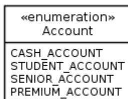

```
classDiagram
    class Account {
        <<enumeration>>
        CASH_ACCOUNT
        STUDENT_ACCOUNT
        SENIOR_ACCOUNT
        PREMIUM_ACCOUNT
    }
```

UML notation for an enumeration named Account with four literals: CASH\_ACCOUNT, STUDENT\_ACCOUNT, SENIOR\_ACCOUNT, and PREMIUM\_ACCOUNT.

Figure 5.3.5.2-1: <<enumeration>> notation

### 5.3.5.3 Name style

For <<enumeration>> name, use the same style as <<InformationObjectClass>> (see 5.3.2).

For <<enumeration>> attribute (the enumeration literal), use the following rules:

- Enumeration literal is composed of one or more words of upper case characters. Words are separated by the underscore character.

## 5.3.6 <<choice>>

### 5.3.6.1 Description

The «choice» stereotype represents:

- 1) one of a set of classes (when used as an information model element) or
- 2) alternative sets of attributes or attribute fields
- 3) or one of a set of data types

This stereotype property, e.g., one out of a set of possible alternatives, is identical to the {xor} constraint (see 5.2.10).

In case of type 2) and 3) choices can be "named choices" that can be used in different places or they can be defined as "inline choices" usable only by a specific IOC or user defined data type..

### 5.3.6.2 Example

Sometimes the specific kind of class cannot be determined at model specification time. In order to support such scenario, the specification is done by listing all possible classes.

The following diagram lists 3 possible classes. It also shows a «choice» named SubstituteObjectClass. This scenario indicates that only one of the three related «InformationObjectClass» named Alternative1ObjectClass, Alternative2ObjectClass, Alternative3ObjectClass shall be realised.

The «choice» stereotype represents one of a set of classes when used as an information model element.


```

classDiagram
    class SubstituteObjectClass {
        <<choice>>
    }
    class Alternative1ObjectClass {
        <<InformationObjectClass>>
    }
    class Alternative2ObjectClass {
        <<InformationObjectClass>>
    }
    class Alternative3ObjectClass {
        <<InformationObjectClass>>
    }
    SubstituteObjectClass "1" -- "1" Alternative1ObjectClass : +alternative1
    SubstituteObjectClass "1" -- "1" Alternative2ObjectClass : +alternative2
    SubstituteObjectClass "1" -- "1" Alternative3ObjectClass : +alternative3

```

UML class diagram showing a choice class SubstituteObjectClass connected to three InformationObjectClass alternatives: Alternative1ObjectClass, Alternative2ObjectClass, and Alternative3ObjectClass. Each association has a multiplicity of 1 at both ends and role names +alternative1, +alternative2, and +alternative3 respectively.

**Figure 5.3.6.2-1: Information model element example using «choice» notation**

Sometimes an IOC or a user defined data type needs to contain one of an alternative sets of attributes or attribute fields. This can be defined as a choice. The possible individual "cases" of a choice are labeled as CHOICE\_1, CHOICE\_2, etc. Each case may contain a single or multiple attributes (or attribute fields). The individual attributes or attribute fields may suffix this with a second integer to number the individual attribute(field)s in the "case" e.g. CHOICE\_2.1, CHOICE\_2.2.

The definition of a named choice is similar to the definition of an IOC including a description and a set of contained attributes. When a "named choice" is used it shall be qualified with properties similar to an attribute. If the multiplicity property includes "0" that allows none of the cases to be selected. For each instance of the "choice", as specified by the upper and lower bound of the multiplicity property, exactly one "case" of the choice shall be selected.

The definition of an inline choice is similar to the definition of normal attributes with the addition of the labels CHOICE\_x prepended to each attribute. While this form of definition is simpler, its limitation is that any additional properties of the choice can only be specified in the description text and the multiplicity of the choice itself cannot be greater than one. It is also not possible to define multiple inline choices in the attribute list of a single IOC or a single datatype. If the limitations are a problem a named choice should be used.

Sometimes the specific kind of data type cannot be determined at model specification time. In order to support such scenario, the specification is done by listing all possible data types.

The following diagram lists 2 possible data types. It also shows a «choice» named ProbableCause. This scenario indicates that only one of the two «dataType» named IntegerProbableCause, StringProbableCause shall be realised.

The «choice» stereotype represents one of a set of data types when used as an operations model element.


```

classDiagram
    class ProbableCause {
        <<choice>>
    }
    class IntegerProbableCause {
        <<dataType>>
        probableCause : Integer
    }
    class StringProbableCause {
        <<dataType>>
        probableCause : String
    }
    ProbableCause "1" -- "1" IntegerProbableCause : +probableCause1
    ProbableCause "1" -- "1" StringProbableCause : +probableCause2

```

UML class diagram showing a choice class ProbableCause connected to two dataType classes: IntegerProbableCause and StringProbableCause. IntegerProbableCause has an attribute probableCause of type Integer. StringProbableCause has an attribute probableCause of type String. Associations have multiplicity 1 and role names +probableCause1 and +probableCause2.

**Figure 5.3.6.2-2: Operations model element example using «choice» notation**

### 5.3.6.3 Name style

For <<choice>> name, use the same style as <<InformationObjectClass>> (see 5.3.2).

## 5.4 Others

### 5.4.1 Association class

#### 5.4.1.1 Description

An association class is an association that also has class properties (or a class that has association properties). Even though it is drawn as an association and a class, it is really just a single model element.

See 7.3.4 AssociationClass of OMG "Unified Modelling Language (OMG UML), Superstructure" [2].

Association classes are appropriate for use when an «InformationObjectClass» needs to maintain associations to several other instances of «InformationObjectClass» and there are relationships between the members of the associations within the scope of the "containing" «InformationObjectClass». For example, a namespace maintains a set of bindings, a binding ties a name to an identifier. A NameBinding «InformationObjectClass» can be modelled as an Association Class that provides the binding semantics to the relationship between an identifier and some other «InformationObjectClass» such as Object in the figure. This is depicted in the following figure.

#### 5.4.1.2 Example

![UML diagram showing association class notation. A class 'Name' (labeled «InformationObjectClass») is associated with a class 'NameBinding' (labeled «InformationObjectClass») via a solid line with a diamond at the 'Name' end. The association is labeled «names» and has a multiplicity of 1 at the 'Name' end and * at the 'NameBinding' end. The 'NameBinding' class is connected via a dashed line to a solid line connecting 'Identifier' and 'Object' (both labeled «InformationObjectClass»). The 'Identifier' and 'Object' classes have a multiplicity of 1 at each end of their connecting line.](7a02de7ed198501f7a4f6ca37c3f28c5_img.jpg)

```
classDiagram
    class Name["«InformationObjectClass»  
Name"]
    class NameBinding["«InformationObjectClass»  
NameBinding"]
    class Identifier["«InformationObjectClass»  
Identifier"]
    class Object["«InformationObjectClass»  
Object"]

    Name "1" -- "*" NameBinding : «names»
    Identifier "1" -- "1" Object
    (Identifier, Object) .. NameBinding
```

UML diagram showing association class notation. A class 'Name' (labeled «InformationObjectClass») is associated with a class 'NameBinding' (labeled «InformationObjectClass») via a solid line with a diamond at the 'Name' end. The association is labeled «names» and has a multiplicity of 1 at the 'Name' end and \* at the 'NameBinding' end. The 'NameBinding' class is connected via a dashed line to a solid line connecting 'Identifier' and 'Object' (both labeled «InformationObjectClass»). The 'Identifier' and 'Object' classes have a multiplicity of 1 at each end of their connecting line.

Figure 5.4.1.2-1: Association class notation

#### 5.4.1.3 Name style

The name shall use the same style as in <<InformationObjectClass>> (see 5.3.2.3).

## 5.4.2 Abstract class

### 5.4.2.1 Description

It specifies a special kind of <<InformationObjectClass>> as the general model element involved in a generalization relationship (see 5.2.5). An abstract class cannot be instantiated.

This modelled element has the same properties as class. See 5.3.2.

### 5.4.2.2 Example

This shows that *Class5\_* is an abstract class. It is the base class for `SpecializedClass5`.


```
classDiagram
    class Class5_["«InformationObjectClass»\nClass5_"]
    class SpecializedClass5["«InformationObjectClass»\nSpecializedClass5"]
    Class5_ <|-- SpecializedClass5
```

UML class diagram showing an abstract class relationship. A box on the left contains '«InformationObjectClass»' and 'Class5\_'. A box on the right contains '«InformationObjectClass»' and 'SpecializedClass5'. A solid line with an open triangle arrow points from the right box to the left box, indicating that SpecializedClass5 is a specialization of Class5\_.

Figure 5.4.2.2-1: Abstract class notation

### 5.4.2.3 Name style

For abstract class name, use the same style as <<InformationObjectClass>> (see 5.3.2) . The name shall be in italics. In the UOM, its last character shall be an underscore

## 5.4.3 Predefined data types

### 5.4.3.1 Description

It represents the general notion of being a data type (i.e. a type whose instances are identified only by their values) whose definition is defined by this specification and not by the user (e.g. specification authors).

This repertoire uses two kinds of data types: predefined data types and user-defined data types. The latter is defined in 5.3.4 <<dataType>> and 5.3.5 <<enumeration>>.

The following table lists the UML data types selected for use as predefined data type.

Table 5.4.3.1-1: UML defined data types

| Name    | Description and reference                                              |
|---------|------------------------------------------------------------------------|
| Boolean | See Boolean type of ITU-T X.680 [7]. Literal values: "true" or "false" |
| Integer | See Integer type of ITU-T X.680 [7].                                   |
| String  | See PrintableString type of ITU-T X.680 [7].                           |

The following table lists data types that are defined by this repertoire.

**Table 5.4.3.1-2: Non-UML defined data types**

| Name               | Description and reference                                                                                                                                                                                                                                                                                                                                                                                                                                                                                                                                                                                                                                         |
|--------------------|-------------------------------------------------------------------------------------------------------------------------------------------------------------------------------------------------------------------------------------------------------------------------------------------------------------------------------------------------------------------------------------------------------------------------------------------------------------------------------------------------------------------------------------------------------------------------------------------------------------------------------------------------------------------|
| AttributeValuePair | This data type defines an attribute name and the attribute’s value.                                                                                                                                                                                                                                                                                                                                                                                                                                                                                                                                                                                               |
| BitString          | This data type is defined by Bit string of subclause 3 and subclause G.2.5 of ITU-T X.680 [7].                                                                                                                                                                                                                                                                                                                                                                                                                                                                                                                                                                    |
| DateTime           | This data type defines Date/Time Format, and it is protocol specific.                                                                                                                                                                                                                                                                                                                                                                                                                                                                                                                                                                                             |
| DN                 | <p>This data type defines the DN (see Distinguished Name of TS 32.300 [3]) of an object. It contains a sequence of one or more name components. The “initial sub-sequence” (note 1) of a DN is also a DN of an object.</p> <p>In attributes of type DN characters listed in TS 32.300 [3] clause 7.2 shall always be “escaped” when handled, written or read.</p> <p>Note 1: Suppose an object's DN is composed of a sequence of 4 name components, i.e. 1<sup>st</sup>, 2<sup>nd</sup>, 3<sup>rd</sup> and 4<sup>th</sup> components. The “initial sub-sequence” of this DN is composed of the 1<sup>st</sup>, 2<sup>nd</sup> and 3<sup>rd</sup> components.</p> |
| External           | This data type is defined by another organization.                                                                                                                                                                                                                                                                                                                                                                                                                                                                                                                                                                                                                |
| Real               | This data type is defined by Real type of ITU-T X.680 [7]                                                                                                                                                                                                                                                                                                                                                                                                                                                                                                                                                                                                         |

### 5.4.3.2 Example

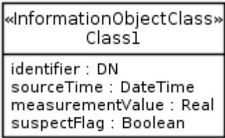

```
classDiagram
    class Class1 {
        <<InformationObjectClass>>
        identifier : DN
        sourceTime : DateTime
        measurementValue : Real
        suspectFlag : Boolean
    }
```

UML class diagram for InformationObjectClass Class1 showing attributes: identifier : DN, sourceTime : DateTime, measurementValue : Real, suspectFlag : Boolean.

**Figure 5.4.3.2-1: Predefined data types usage**

NOTE: Use of predefined data types is optional. Use of other means, to specify predefined data types, is allowed.

### 5.4.3.3 Name style

It shall use the UCC style.

## 6 Qualifiers

This subclause defines the qualifiers applicable for model elements specified in this document, e.g. the IOC (see 5.3.2), the Attribute (see 5.2.1). The possible qualifications are M, O, CM, CO and C. Their meanings are specified in this subclause. This type of qualifier is called Support Qualifier (see supportQualifier of IOC in Table 5.3.2.2-1 and supportQualifier of attribute in Table 5.2.1.1-1).

This subclause also defines the qualifiers applicable to various properties of a model element, e.g. see the IOC properties excepting IOC supportQualifier in Table 5.3.2.2-1 and attributes properties excepting attribute supportQualifier in Table 5.2.1.1-1. The possible qualifications are M, O, CM, CO and "-". Their meanings are specified in this subclause. This type of qualifier is simply called Qualifier.

Definition of M (Mandatory) qualification:

- The capability (e.g. the Attribute named `abc` of an IOC named `Xyz`; the write property of Attribute named `abc` of an IOC named `Xyz`; the IOC named `Xyz`) shall be supported.

Definition of O (Optional) qualification:

- The capability may or may not be supported.

Definition of CM (Conditional-Mandatory) qualification:

- The capability shall be supported under certain conditions, specifically:
  - When the qualification is CM, the capability shall have a corresponding constraint defined in the specification. If the specified constraint is met then the capability shall be supported.

– Definition of CO (Conditional-Optional) qualification:

- The capability may be supported under certain conditions, specifically:
  - When the qualification is CO, the capability shall have a corresponding constraint defined in the specification. If the specified constraint is met then the capability may be supported.

Definition of C (Conditional) qualification:

- Used for items that has multiple constraints. Each constraint is worded as a condition for one kind of qualification such as M, O or "-". All constraints must be related to the same qualification. Specifically:
  - Each item having the support qualifier C shall have the corresponding multiple constraints defined in the IS specification. If the specified constraint is met and is related to mandatory, then the item shall be supported. If the specified constraint is met and is related to optional, then the item may be supported. If the specified constraint is met and is related to "no support", then the item shall not be supported.

NOTE: This qualification should only be used when absolutely necessary, as it is more complex to implement.

Definition of SS (SS Conditional) qualification:

- The capability shall be supported by at least one but not all solutions.

Definition of "-" (no support) qualification:

- The capability shall not be supported.

Note that, in this clause, the term "support" refers to the support of standardized model elements by a specific implementation or instance of an agent. It cannot be assumed that unsupported standardized model elements are known to the agent. How an implementation is expected to treat unsupported standardized model elements is not specified, and the behaviour would likely be same as for other unknown or errant model elements.

---

## 7 UML Diagram Requirements

Classes and their relationships shall be presented in class diagrams.

It is recommended to create:

- An overview class diagram containing all object classes related to a specific management area (Class Diagram).
  - The class name compartment should contain the location of the class definition (e.g., "Qualified Name")
  - The class attributes should show the "Signature". (see subclause 7.3.44 of OMG "Unified Modelling Language (OMG UML), Superstructure" [2] for the signature definition);
- A separate inheritance class diagram in case the overview diagram would be overloaded when showing the inheritance structure (Inheritance Class Diagram);
- A class diagram containing the user defined data types (Type Definitions Diagram);
- Additional class diagrams to show specific parts of the specification in detail;
- State diagrams for complex state attributes.

---

## Annex A (informative): Examples of using <<ProxyClass>>

### A.1 First Example

This shows a <<ProxyClass>> named `YyyFunction`. It represents all IOCs listed in the Note under the UML diagram. All the listed IOCs, in the context of this example, inherit from `ManagedFunction` IOC.

The use of <<ProxyClass>> eliminates the need to draw multiple UML <<InformationObjectClass>> boxes, i.e. those whose names are listed in the Note, in the UML diagram.

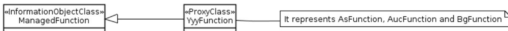

```
classDiagram
    class ManagedFunction["«InformationObjectClass»  
ManagedFunction"]
    class YyyFunction["«ProxyClass»  
YyyFunction"]
    ManagedFunction <|-- YyyFunction
    YyyFunction -- Note
    class Note["It represents AsFunction, AucFunction and BgFunction"]
```

The diagram illustrates a UML class structure. On the left, a class box is labeled with the stereotype «InformationObjectClass» and the name ManagedFunction. To its right, another class box is labeled with the stereotype «ProxyClass» and the name YyyFunction. A solid line with an open triangle arrowhead points from YyyFunction to ManagedFunction, indicating inheritance. A solid line extends from the right side of the YyyFunction box to a rectangular note box with a folded corner. The note box contains the text: "It represents AsFunction, AucFunction and BgFunction".

UML diagram showing a ProxyClass YyyFunction inheriting from ManagedFunction and representing multiple IOCs.

**Figure A.1-1: <<ProxyClass>> Notation Example A.1**

## A.2 Second Example

This shows a <<ProxyClass>> named `YyyFunction`. It represents all IOCs listed in the attached (or associated) Note. All the listed IOCs, in the context of this example, have link (internal and external) relations.

This shows a <<ProxyClass>> `InternalYyyFunction`. It represents all IOCs listed in the attached (or associated) Note.

This shows a <<ProxyClass>> `Link_a_z` and `ExternalLink_a_z`. They represent all IOCs listed in the attached (or associated) Note.

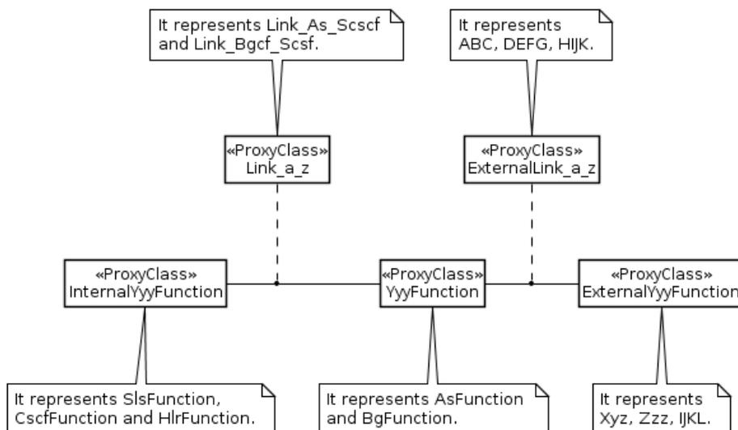

```
classDiagram
    class Link_a_z["«ProxyClass»\nLink_a_z"]
    class ExternalLink_a_z["«ProxyClass»\nExternalLink_a_z"]
    class InternalYyyFunction["«ProxyClass»\nInternalYyyFunction"]
    class YyyFunction["«ProxyClass»\nYyyFunction"]
    class ExternalYyyFunction["«ProxyClass»\nExternalYyyFunction"]

    Link_a_z .. InternalYyyFunction
    ExternalLink_a_z .. YyyFunction
    InternalYyyFunction -- YyyFunction
    YyyFunction -- ExternalYyyFunction
```

The diagram illustrates the relationships between five ProxyClass objects. At the top, two ProxyClasses are shown: `Link_a_z` (with a note: "It represents Link\_As\_Scsf and Link\_Bgcf\_Scsf.") and `ExternalLink_a_z` (with a note: "It represents ABC, DEFG, HIJK."). Below them are three ProxyClasses: `InternalYyyFunction` (with a note: "It represents SlsFunction, CscfFunction and HlrFunction."), `YyyFunction` (with a note: "It represents AsFunction and BgFunction."), and `ExternalYyyFunction` (with a note: "It represents Xyz, Zzz, IJKL."). Dashed lines connect `Link_a_z` to `InternalYyyFunction` and `ExternalLink_a_z` to `YyyFunction`. Solid lines connect `InternalYyyFunction` to `YyyFunction` and `YyyFunction` to `ExternalYyyFunction`.

UML diagram showing ProxyClass relationships between Link\_a\_z, ExternalLink\_a\_z, InternalYyyFunction, YyyFunction, and ExternalYyyFunction.

Figure A.2-1: <<ProxyClass>> Notation Example A.2

# Annex B (normative): Attribute properties

Table B.1 shows the impact of the "isWritable", "defaultValue" and "multiplicity" attribute properties on the behavior of managers and agents upon object creation, and on attribute values directly after object creation. See clause 3.1 for decription of manager and agent.

**Table B.1: Attribute properties**

| isWritable                          | defaultValue                        | multiplicity ≥ 1                    | Impact of attribute properties on the behaviour of agents and managers upon object creation, and on attribute values directly after object creation                                                                                                                                        |
|-------------------------------------|-------------------------------------|-------------------------------------|--------------------------------------------------------------------------------------------------------------------------------------------------------------------------------------------------------------------------------------------------------------------------------------------|
| <input checked="" type="checkbox"/> | <input checked="" type="checkbox"/> | <input checked="" type="checkbox"/> | The manager <i>may</i> provide a value.<br>If not provided, the agent <i>shall</i> set the value to the default value.<br>-> The attribute has the default value or some other value.                                                                                                      |
| <input checked="" type="checkbox"/> | <input checked="" type="checkbox"/> | <input type="checkbox"/>            | The manager <i>may</i> provide a value.<br>If not provided, the agent <i>shall</i> set the value to the default value.<br>-> The attribute has the default value, or some other value.<br><br>Note, if "isInvariant: True", the attribute never has no value, even though this is allowed. |
| <input checked="" type="checkbox"/> | <input type="checkbox"/>            | <input checked="" type="checkbox"/> | The manager <i>shall</i> provide an attribute value.<br>-> The attribute has some value.                                                                                                                                                                                                   |
| <input checked="" type="checkbox"/> | <input type="checkbox"/>            | <input type="checkbox"/>            | The manager <i>may</i> provide a value.<br>If not provided, the agent <i>shall not</i> provide a value.<br>-> The attribute has some value, or no value.                                                                                                                                   |
| <input type="checkbox"/>            | <input checked="" type="checkbox"/> | <input checked="" type="checkbox"/> | The manager <i>shall not</i> provide a value.<br>The agent <i>shall</i> set the value to the default value.<br>-> The attribute has the default value.                                                                                                                                     |
| <input type="checkbox"/>            | <input checked="" type="checkbox"/> | <input type="checkbox"/>            | The manager <i>shall not</i> provide a value.<br>The agent <i>shall</i> set the value to the default value.<br>-> The attribute has the default value.<br><br>Note, if "isInvariant: True", the attribute never has no value, even though this is allowed                                  |
| <input type="checkbox"/>            | <input type="checkbox"/>            | <input checked="" type="checkbox"/> | Not valid.<br>Reason:<br>The manager <i>shall not</i> provide a value.<br>The agent <i>shall not</i> provide a value.<br>-> The attribute has no value, which is an invalid state                                                                                                          |
| <input type="checkbox"/>            | <input type="checkbox"/>            | <input type="checkbox"/>            | The manager <i>shall not</i> provide a value.<br>The agent <i>shall not</i> provide a value.<br>-> The attribute has no value.<br><br>Note, if "isInvariant: True", the attribute has invariantly no value, which is a valid state but may not make sense.                                 |

## Annex C (normative): Design patterns

### C.1 Intervening class and Association class

#### C.1.1 Concept and definition

Classes may be related via simple direct associations or via associations with related association classes.

However, in situations where the relationships between a number of classes is complex and especially where the relationships between instances of those classes are themselves interrelated there may be a need to encapsulate the complexity of the relationships within a class that sits between the classes that are to be related. The term “intervening class” is used here to name the pattern that describes this approach. The name “intervening class” is used as the additional class “intervenes” in the relationships between other classes.

The “intervening class” differs from the association class as the intervening class does break the association between the classes where as the association class does not but instead sits to one side. This can be seen in the following figure. A direct association between class A and C appears the same at A and C regardless of the presence or absence of an association class where as in the case of the “intervening class” there are associations between A and the “intervening class” B and C and the “intervening class” B.

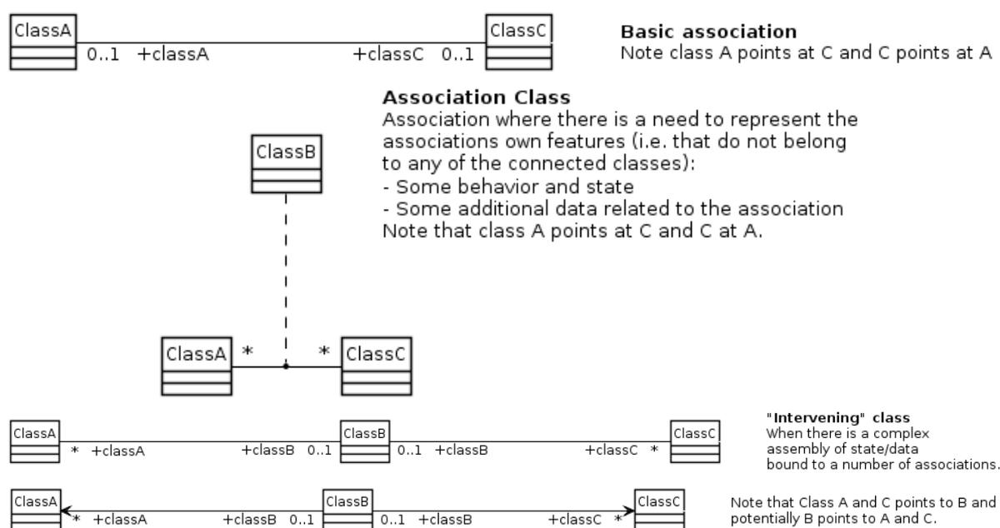

**Basic association**  
Note class A points at C and C points at A

```

classDiagram
    ClassA "0..1" -- "0..1" ClassC : +classA +classC

```

**Association Class**  
Association where there is a need to represent the associations own features (i.e. that do not belong to any of the connected classes):  
- Some behavior and state  
- Some additional data related to the association  
Note that class A points at C and C at A.

```

classDiagram
    ClassA "*" -- "*" ClassC
    (ClassA, ClassC) .. ClassB

```

**"Intervening" class**  
When there is a complex assembly of state/data bound to a number of associations.  
Note that Class A and C points to B and potentially B points to A and C.

```

classDiagram
    ClassA "*" -- "0..1" ClassB : +classA +classB
    ClassB "0..1" -- "*" ClassC : +classB +classC

```

UML diagrams illustrating three association forms: Basic association, Association Class, and Intervening class.

**Figure C.1.1-1: Various association forms**

The “intervening class” is essentially no different to any other class in that it may encapsulate attributes, complex behaviour etc.

The following figure shows an instance view of both an association class form and an “intervening class” form for a complex interrelationship

![Figure C.1.1-2: Instance view of 'intervening class'. The diagram shows a complex web of class instances and their relationships. At the top, there are four boxes for ClassB instances (ClassBInstance1 to ClassBInstance4) and two for ClassA instances (ClassAInstance2 and ClassAInstance1). Below these are two boxes for ClassC instances (ClassCInstance2 and ClassCInstance1). Dashed lines represent associations between these classes, with labels like '-classA', '-classB', and '-classC'. A central box, ClassBInstanceClassB, acts as a hub, connected to ClassAInstance2ClassA, ClassAInstance1ClassA, ClassCInstance1ClassC, and ClassCInstance2ClassC.](ed48e24e36ea0501953177401c900f86_img.jpg)

**Association Class**  
Many instances of association class, one per association instance.

**"Intervening" class**  
One instance of intervening class that captures complex association and intertwining between classes. Also captures behavior interaction such as protection switching and state (e.g. where class A and C are TPs and class B is an SNC).

Figure C.1.1-2: Instance view of 'intervening class'. The diagram shows a complex web of class instances and their relationships. At the top, there are four boxes for ClassB instances (ClassBInstance1 to ClassBInstance4) and two for ClassA instances (ClassAInstance2 and ClassAInstance1). Below these are two boxes for ClassC instances (ClassCInstance2 and ClassCInstance1). Dashed lines represent associations between these classes, with labels like '-classA', '-classB', and '-classC'. A central box, ClassBInstanceClassB, acts as a hub, connected to ClassAInstance2ClassA, ClassAInstance1ClassA, ClassCInstance1ClassC, and ClassCInstance2ClassC.

**Figure C.1.1-2: Instance view of "intervening class"**

The case depicted above does not show interrelationships between the relationships. A practical case from modeling of the relationships between Termination Points in a fixed network does show this relationship interrelationship challenge. In this case the complexity of relationship is between instances of the same class, the Termination Point (TP). The complexity is encapsulated in a SubNetworkConnection (SNC) class.

![Figure C.1.1-3: SNC intervening in TP-TP relationship. The top part shows a UML class diagram with Termination Point (TP) and SubNetworkConnection (SNC) classes. TP has a self-association labeled '+TP' with a multiplicity of '*'. There is an association between TP and SNC labeled '+sNC' with a multiplicity of '0..2'. The bottom part shows a more detailed instance view. A central box, SNCInstanceIP, is connected to four boxes representing IP instances: IPInstance1IP, IPInstance2IP, IPInstance3IP, and IPInstance4IP. All connections are labeled '-tP'.](08c7a76a7786bd08b99dd4cb41583ef4_img.jpg)

**Simplified SNC and TP case**  
An SNC cannot exist without at least 2 TPs being related.

Some simplifications: In this case TP adn SNC model is assumed to be bidirectional only. The TPs have roles with respect to the SNC but these are ignored here. There are many other attributes and properties related to protection that are ignored..

**"Intervening" class**  
One instance of intervening class that captures complex association and intertwining between classes. Also captures behavior interaction such as protection switching and state

Figure C.1.1-3: SNC intervening in TP-TP relationship. The top part shows a UML class diagram with Termination Point (TP) and SubNetworkConnection (SNC) classes. TP has a self-association labeled '+TP' with a multiplicity of '\*'. There is an association between TP and SNC labeled '+sNC' with a multiplicity of '0..2'. The bottom part shows a more detailed instance view. A central box, SNCInstanceIP, is connected to four boxes representing IP instances: IPInstance1IP, IPInstance2IP, IPInstance3IP, and IPInstance4IP. All connections are labeled '-tP'.

**Figure C.1.1-3: SNC intervening in TP-TP relationship**

The SNC also encapsulates the complex behaviour of switching and path selection as depicted below.

![Figure C.1.1-4: Complex relationship interrelationships. This diagram illustrates the relationships between various classes in a system. At the top, four boxes represent 'SncAssociationInstance' classes: SncAssociationInstance1SncAssociation (tp = TPInstance1, tp = TPInstance3), SncAssociationInstance4SncAssociation (tp = TPInstance1, tp = TPInstance4), SncAssociationInstance3SncAssociation (tp = TPInstance2, tp = TPInstance3), and SncAssociationInstance2SncAssociation (tp = TPInstance2, tp = TPInstance4). Below these is a box for 'ProtectionInstanceProtection'. On the right, four boxes represent 'IPInstance' classes: IPInstance1IP (tp = Entries[2]), IPInstance2IP (tp = Entries[2]), IPInstance3IP (tp = Entries[2]), and IPInstance4IP (tp = Entries[2]). Dashed lines show associations from the SncAssociationInstance classes to the IPInstance classes. Solid lines show associations from the SncAssociationInstance classes to the ProtectionInstanceProtection class. A legend at the bottom left defines the 'Association class' as having a protection switching rule and state, and notes that there is a complex creation transaction interrelationship.](04cfca33e3fc26513abe649d7474f733_img.jpg)

Figure C.1.1-4: Complex relationship interrelationships. This diagram illustrates the relationships between various classes in a system. At the top, four boxes represent 'SncAssociationInstance' classes: SncAssociationInstance1SncAssociation (tp = TPInstance1, tp = TPInstance3), SncAssociationInstance4SncAssociation (tp = TPInstance1, tp = TPInstance4), SncAssociationInstance3SncAssociation (tp = TPInstance2, tp = TPInstance3), and SncAssociationInstance2SncAssociation (tp = TPInstance2, tp = TPInstance4). Below these is a box for 'ProtectionInstanceProtection'. On the right, four boxes represent 'IPInstance' classes: IPInstance1IP (tp = Entries[2]), IPInstance2IP (tp = Entries[2]), IPInstance3IP (tp = Entries[2]), and IPInstance4IP (tp = Entries[2]). Dashed lines show associations from the SncAssociationInstance classes to the IPInstance classes. Solid lines show associations from the SncAssociationInstance classes to the ProtectionInstanceProtection class. A legend at the bottom left defines the 'Association class' as having a protection switching rule and state, and notes that there is a complex creation transaction interrelationship.

**Figure C.1.1-4: Complex relationship interrelationships**

## C.1.2 Usage in the non-transport domain

The choice of association class pattern or intervening class pattern is on a case-by-case basis.

The transport domain boundary is highlighted in the following figure.

![Figure C.1.2-1: Highlighting the boundary between transport and non-transport domains. This diagram shows the interaction between a Management Environment and various network elements. The Management Environment is at the top. Below it, a dashed line separates the 'non-transport domain' (top) from the 'transport domain' (bottom). In the non-transport domain, there is a 'Function e.g. eNodeB function' box. In the transport domain, there are three boxes: 'NE with wireless access', 'Wire-line NE', and 'NE with wireless access'. A blue line (Link entity) connects the Function box to the 'NE with wireless access' box in the transport domain. An orange line (Topological Link) connects the 'NE with wireless access' box to the 'Wire-line NE' box. A green dashed box (Based on Connection Termination Point concept) is located between the Function box and the 'NE with wireless access' box. A purple dashed box (Based on Physical Termination Point concept) is located between the 'NE with wireless access' box and the 'Wire-line NE' box. A legend on the right defines the symbols: Network Element (orange box), Link entity (connectivity e.g. X2) (blue line), Topological Link (orange line), Based on Connection Termination Point concept (green dashed box), Based on Physical Termination Point concept (purple dashed box), 3GPP Managed Function (blue box), Connection Termination Point (green box), Physical Termination Point (purple box), Association/relationship (double-headed arrow), and Optical fiber (blue line).](a8050baf48cc2c8e25d5ea2d1a67ef39_img.jpg)

Figure C.1.2-1: Highlighting the boundary between transport and non-transport domains. This diagram shows the interaction between a Management Environment and various network elements. The Management Environment is at the top. Below it, a dashed line separates the 'non-transport domain' (top) from the 'transport domain' (bottom). In the non-transport domain, there is a 'Function e.g. eNodeB function' box. In the transport domain, there are three boxes: 'NE with wireless access', 'Wire-line NE', and 'NE with wireless access'. A blue line (Link entity) connects the Function box to the 'NE with wireless access' box in the transport domain. An orange line (Topological Link) connects the 'NE with wireless access' box to the 'Wire-line NE' box. A green dashed box (Based on Connection Termination Point concept) is located between the Function box and the 'NE with wireless access' box. A purple dashed box (Based on Physical Termination Point concept) is located between the 'NE with wireless access' box and the 'Wire-line NE' box. A legend on the right defines the symbols: Network Element (orange box), Link entity (connectivity e.g. X2) (blue line), Topological Link (orange line), Based on Connection Termination Point concept (green dashed box), Based on Physical Termination Point concept (purple dashed box), 3GPP Managed Function (blue box), Connection Termination Point (green box), Physical Termination Point (purple box), Association/relationship (double-headed arrow), and Optical fiber (blue line).

**Figure C.1.2-1: Highlighting the boundary between transport and non-transport domains**

## C.1.3 Usage in the transport domain

The following guidelines must be applied to the models of the “transport domain”.

When considering interrelationships between classes the following guidelines should be applied:

- If considering all current and recognised potential future cases it is expected that the relationship between two specific classes will be 0..1:0..1 then a simple association should be used
  - This may benefit from an association class to convey rules and parameters about the association behaviour in complex cases.

- If there is recognised potential for cases currently or in future where there is a 0..\*:0..\* between two specific classes then intervening classes should be used to encapsulate the groupings etc. so as to convert it to 0..1:n..\*.
  - Note that the 0..1:n..\* association may benefit from an association class to convey rules and parameters about the association behaviour in complex cases but in the instance form this can probably be ignored or folded into the intervening class
- In general it seems appropriate to use an association class when the properties on the relationship instance cannot be obviously or reasonably folded into one of the classes at either end of the association and when there is no interdependency between association instances between a set of instances of the classes.

An example of usage of intervening class is the case of the TP-TP (TerminationPoint) relationship (0..\*:0..\*) where the SNC (SubNetworkConnection) is added as the intervening class between multiple TPs, i.e. TP-SNC. Note that TP-SNC actually becomes 0..2:n..\* due to directionality encapsulation.

Considering the case of the adjacency relationship between PTPs it is known that although the current common cases are 1:1 there are some current and many potential future case of 0..\*:0..\* and hence a model that has an intervening class, i.e. the TopologicalLink, should be used.

For a degenerate instance cases of 0..\*:0..\* that happens to be 0..1:0..1 the intervening class pattern should still be used:

- • Using the 0..1:0..1 direct association in this degenerate case brings unnecessary variety to the model and hence to the behaviour of the application (the 0..1:n..\* model covers the 0..1:0..1 case with one single code form clearly)
- • An instance of the 0..1:0..1 model may need to be migrated to 0..1:n..\* as a result of some change in the network forcing an unnecessary administrative action to transition the model form where as in the 0..1:n..\* form requires no essential change.

---

## C.2 Use of “ExternalXyz” class

This subclause will be completed for the next release.

---

## Annex D (informative): Void

---

# Annex E (normative): <<SupportIOC>> stereotype definition

### E.1 Description

It is the descriptor for a set of management capabilities.

The <<SupportIOC>> is an extension of UML *class*. See Annex [F] for the differences between <<InformationObjectClass>> and <<SupportIOC>>.

See more on UML *class* in OMG "Unified Modelling Language (OMG UML), Infrastructure" clause 10.2.1 [1].

In the context of the SBMA framework as defined in TS 28.533 [20], <<SupportIOC>> instances are not used but <<InformationObjectClass>> instances are used when an MnS is designed based on a model driven approach using an NRM and CRUD operations.

### E.2 Example

This sample shows an AlarmList <<SupportIOC>>.

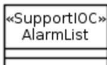

A UML class diagram notation for a class named 'AlarmList' with the stereotype '«SupportIOC»'. The class is represented by a rectangle with a double-lined border. Inside the rectangle, the text '«SupportIOC»' is centered above the text 'AlarmList'. Below the name, there are two empty compartments separated by horizontal lines.

UML class diagram notation for <> AlarmList

**<<SupportIOC>> notation**

### E.3 Name style

For <<SupportIOC>> name, use the same style as <<InformationObjectClass>> (see subclause 5.3.2).

---

# Annex F (normative): Application of <<InformationObjectClass>> and <<SupportIOC>>

The <<InformationObjectClass>> and <<SupportIOC>> are stereotypes. These two stereotypes serve similar purpose in that each is a named set of network resource properties. However, their applications, in the context of supporting network management over Itf-N or through the use of management services, can be different. This Annex highlights their similarities and differences of such application.


|                                                                                                                                                                                                                                                                                          | <<InformationObjectClass>>                                                                                                                                                                                                                                                                            | <<SupportIOC>>                                                                                                                                                                                                                                                                                                                                                                                                                                                                                                                                                                                                                                                                                                                                                                                                                                                                                                                                                      |
|------------------------------------------------------------------------------------------------------------------------------------------------------------------------------------------------------------------------------------------------------------------------------------------|-------------------------------------------------------------------------------------------------------------------------------------------------------------------------------------------------------------------------------------------------------------------------------------------------------|---------------------------------------------------------------------------------------------------------------------------------------------------------------------------------------------------------------------------------------------------------------------------------------------------------------------------------------------------------------------------------------------------------------------------------------------------------------------------------------------------------------------------------------------------------------------------------------------------------------------------------------------------------------------------------------------------------------------------------------------------------------------------------------------------------------------------------------------------------------------------------------------------------------------------------------------------------------------|
| Can it be an abstract class?                                                                                                                                                                                                                                                             | Yes                                                                                                                                                                                                                                                                                                   | Yes                                                                                                                                                                                                                                                                                                                                                                                                                                                                                                                                                                                                                                                                                                                                                                                                                                                                                                                                                                 |
| Can it be a concrete class?                                                                                                                                                                                                                                                              | Yes                                                                                                                                                                                                                                                                                                   | Yes                                                                                                                                                                                                                                                                                                                                                                                                                                                                                                                                                                                                                                                                                                                                                                                                                                                                                                                                                                 |
| Can it inherit from <<InformationObjectClass>>?                                                                                                                                                                                                                                          | Yes                                                                                                                                                                                                                                                                                                   | No, except for <<InformationObjectClass>> Top.                                                                                                                                                                                                                                                                                                                                                                                                                                                                                                                                                                                                                                                                                                                                                                                                                                                                                                                      |
| Can it inherit from <<SupportIOC>>?                                                                                                                                                                                                                                                      | No                                                                                                                                                                                                                                                                                                    | Yes                                                                                                                                                                                                                                                                                                                                                                                                                                                                                                                                                                                                                                                                                                                                                                                                                                                                                                                                                                 |
| Can it be name-contained by <<InformationObjectClass>>?                                                                                                                                                                                                                                  | Yes                                                                                                                                                                                                                                                                                                   | Yes                                                                                                                                                                                                                                                                                                                                                                                                                                                                                                                                                                                                                                                                                                                                                                                                                                                                                                                                                                 |
| Can it be name-contained by <<SupportIOC>>?                                                                                                                                                                                                                                              | No                                                                                                                                                                                                                                                                                                    | Yes                                                                                                                                                                                                                                                                                                                                                                                                                                                                                                                                                                                                                                                                                                                                                                                                                                                                                                                                                                 |
| Can an instance have a DN?                                                                                                                                                                                                                                                               | <<InformationObjectClass>> must be a class of a naming-tree meaning all its instances must have a DN.                                                                                                                                                                                                 | <<SupportIOC>> may be used by specification author for a class within a naming-tree. If so, it means that all its instances will have a DN.                                                                                                                                                                                                                                                                                                                                                                                                                                                                                                                                                                                                                                                                                                                                                                                                                         |
| Can either 1) IRPManager use operations of <i>Basic CM IRP</i> specified in TS 32.602 [9] and <i>Bulk CM IRP</i> specified in TS 32.612 [10] or 2) MnS consumer use the Provisioning operations specified in TS 28.531 [17] and TS 28.532 [16] to access the information in an instance? | Either 1) IRPManager can use the Basic CM IRP and Bulk CM IRP operations or 2) MnS consumer can use the provisioning operations to access information of all <<InformationObjectClass>> defined in all NRM, see 28.541 [15], in accordance to the qualifier values of the <<InformationObjectClass>>. | <p>Either 1) IRPManager can use the Basic CM IRP and Bulk CM IRP operations to access information of instances of &lt;&lt;SupportIOC&gt;&gt; defined in their respective Interface IRP (i.e. Basic CM IRP or Bulk CM IRP), in accordance to the qualifier values of the &lt;&lt;SupportIOC&gt;&gt; or 2) MnS consumer can use the provisioning operations to access information of instances of &lt;&lt;SupportIOC&gt;&gt; specified in TS 28.532 [16] and TS 28.531 [17] in accordance to the qualifier values of the &lt;&lt;SupportIOC&gt;&gt;.</p> <p>Neither 1) IRPManager can use the Basic CM IRP and Bulk CM IRP operations to access information of instances of &lt;&lt;SupportIOC&gt;&gt; not defined in their respective Interface IRP (i.e. Basic CM IRP or Bulk CM IRP) nor 2) MnS consumer can use the Provisioning operations to access information of instances of &lt;&lt;SupportIOC&gt;&gt; not defined in TS 28.532 [16] and TS 28.531 [17]</p> |
| Can either 1) IRPManager use operations of Interface IRP, except Basic CM IRP specified in TS 32.602 [9] and Bulk CM IRP in TS 32.612 [10] (e.g. Alarm IRP specified in TS 32.111-2 [11]), or 2) MnS consumer use non Provisioning operations to access the information?                 | No                                                                                                                                                                                                                                                                                                    | <p><b>Either 1)</b> IRPManager can use the Interface IRP operations to access information of &lt;&lt;SupportIOC&gt;&gt; defined in their respective Interface IRP, in accordance to qualifier values of the &lt;&lt;SupportIOC&gt;&gt; <b>or 2) .</b> MnS consumer can use the Provisioning operations to access information of instances of &lt;&lt;SupportIOC&gt;&gt; specified in TS 28.532 [16] and TS 28.531 [17] in accordance to the qualifier values of the &lt;&lt;SupportIOC&gt;&gt;.</p> <p>Neither 1) IRPManager can not use the Interface IRP operations to access information of &lt;&lt;SupportIOC&gt;&gt; not defined in their respective Interface IRP, nor 2) MnS consumer can not use the Provisioning operations to access information of instances of &lt;&lt;SupportIOC&gt;&gt; not defined in TS 28.532 [16] and TS 28.531 [17].</p>                                                                                                         |

|                                                                                                                                                                                                         |                                                                                                                     |                                                                                                                                                                                                                                                                                  |
|---------------------------------------------------------------------------------------------------------------------------------------------------------------------------------------------------------|---------------------------------------------------------------------------------------------------------------------|----------------------------------------------------------------------------------------------------------------------------------------------------------------------------------------------------------------------------------------------------------------------------------|
| Can either IRPManager or MnS consumer receive information via Notification specified in TS 32.302 [12] whose <code>objectClass</code> and <code>objectInstance</code> parameters carry the instance DN? | Yes.<br>The types of notification emitted are shown by the Notification Table associated with the class definition. | Yes if <code>&lt;&lt;SupportIOC&gt;&gt;</code> is a class of a naming-tree.<br>The types of notification emitted are shown by the Notification Table associated with the class definition.<br><br>No if <code>&lt;&lt;SupportIOC&gt;&gt;</code> is not a class of a naming-tree. |
| Measurement specified in TS 32.404 [13]                                                                                                                                                                 | Measurements can be associated with <code>&lt;&lt;InformationObjectClass&gt;&gt;</code> instances.                  | Measurements can be associated with <code>&lt;&lt;SupportIOC&gt;&gt;</code> instances if <code>&lt;&lt;SupportIOC&gt;&gt;</code> class is used in a naming-tree.                                                                                                                 |

---

## Annex G (informative): Naming rules of modeling and programming languages

### G.1 OpenAPI naming rules – OpenAPI solution set

While OpenAPI allows any string as an identifier, a number of organizations and vendors limit the allowed characters and format of identifiers to make implementation easier. Widely used guidelines include the principles:

- Use only ASCII characters mostly limited to letters, digits, underscore, hyphen
- The first character shall be a letter or underscore
- Use camelcase

In 3GPP TS 29.501 [23] clause 5.1 the UCC and LCC conventions (used for IOC and attribute names) indicate only the use of upper and lower case letters and digits.

---

### G.2 Yang Naming rules – Netconf-YANG solution set

YANG identifier naming rules are specified in RFC 7950 at <https://www.rfc-editor.org/rfc/rfc7950#section-6.2> [22].

- Each identifier starts with an uppercase or lowercase ASCII letter or an underscore character, followed by zero or more ASCII letters, digits, underscore characters, hyphens, and dots.
- Implementations SHALL support identifiers up to 64 characters in length and MAY support longer identifiers. Identifiers are case sensitive.

---

### G.3 Java™ naming rules

- Names can contain letters, digits, underscores, and dollar signs
- Names shall begin with a letter, underscore or dollar sign, but should start with a letter
- Names are case sensitive ("myVar" and "myvar" are different variables)
- Reserved words (like Java keywords, such as int or boolean) cannot be used as names

---

### G.4 C++ naming rules

- An identifier can consist of letters (A-Z or a-z), digits (0-9), and underscores (\_). Special characters and spaces are not allowed.
- An identifier can only begin with a letter or an underscore only.
- C++ has reserved keywords that cannot be used as identifiers

Modern C++ implementation may support other Unicode character with the Unicode property [XID\\_Start](#) and [XID\\_Continue](#), but this are not widely known.

---

### G.5 Python naming rules

- An identifier can consist of letters (A-Z or a-z), digits (0-9), and underscores (\_). Special characters and spaces are not allowed.

- An identifier can only begin with a letter or an underscore only.
- Reserved keywords that cannot be used as identifiers

Python 3 (but not Python2) includes additional characters from outside the ASCII range, but these are not widely known.